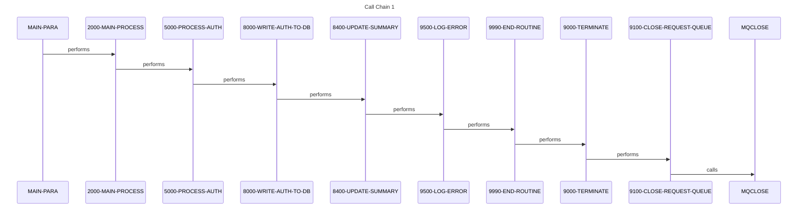
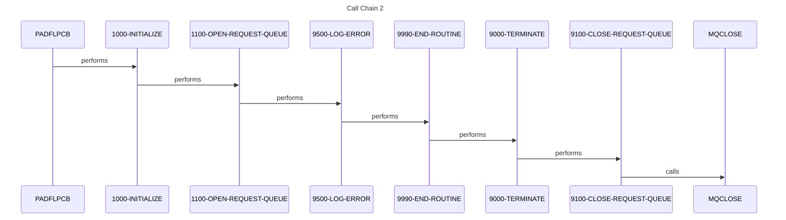
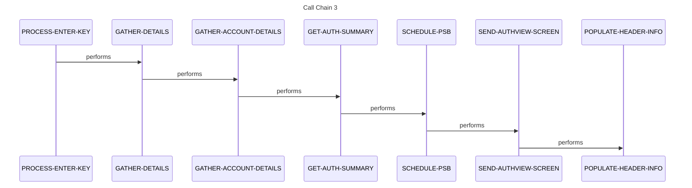
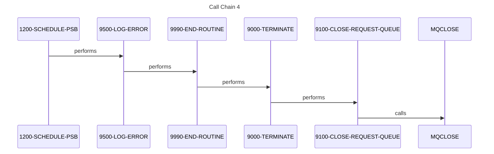
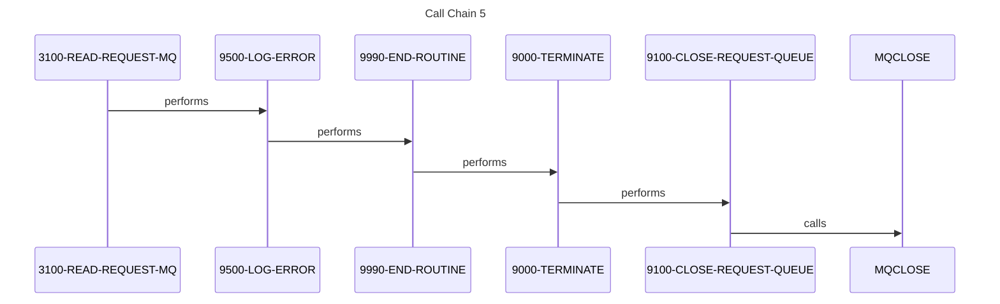
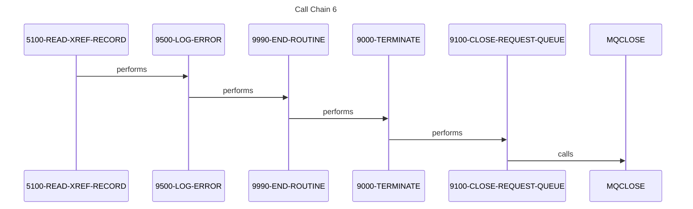
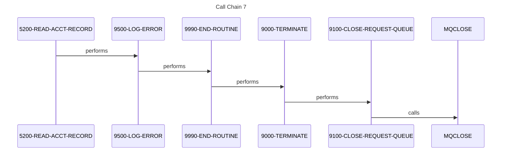
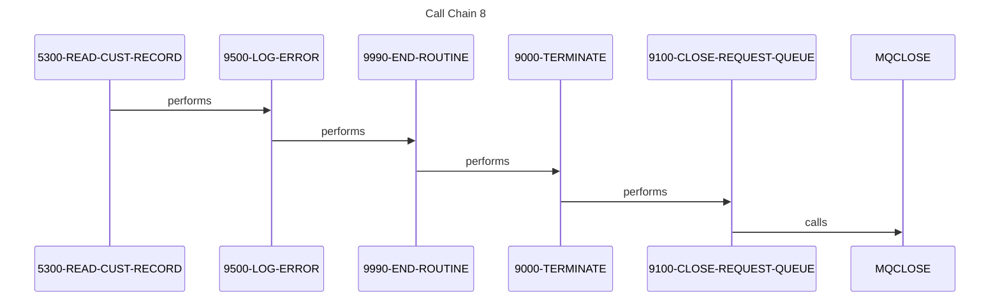
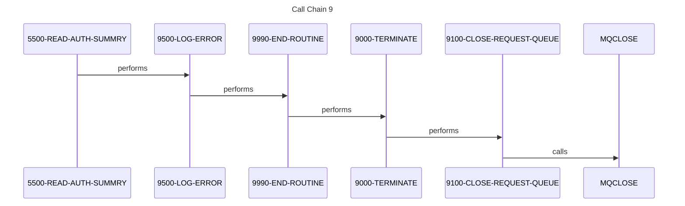
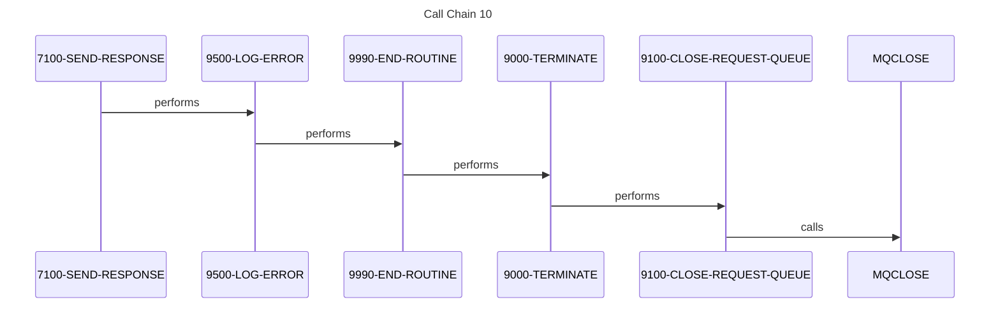

# Sequence Diagrams

**Generated from:** app-authorization-ims-db2-mq

## Call Chain 1

## Call Chain 2

## Call Chain 3

## Call Chain 4

## Call Chain 5

## Call Chain 6

## Call Chain 7

## Call Chain 8

## Call Chain 9

## Call Chain 10

