# Call Graph Analysis

*Generated: 2026-01-26 19:39:17*

**Programs Analyzed:** 24

## Visual Call Graph

```mermaid
flowchart TD

    subgraph jobs[" "]
        DBPAUTP0([DBPAUTP0])
        UNLDPADB([UNLDPADB])
    end

    subgraph procs[" "]
        CBPAUP0C[CBPAUP0C]
        CCPAUERY[/CCPAUERY/]
        CCPAURLY[/CCPAURLY/]
        CCPAURQY[/CCPAURQY/]
        CIPAUDTY[/CIPAUDTY/]
        CIPAUSMY[/CIPAUSMY/]
        COPAU00[/COPAU00/]
        COPAU01[/COPAU01/]
        COPAUA0C[COPAUA0C]
        COPAUS0C[COPAUS0C]
        COPAUS1C[COPAUS1C]
        COPAUS2C[COPAUS2C]
        DBUNLDGS[DBUNLDGS]
        IMSFUNCS[/IMSFUNCS/]
        PADFLPCB[/PADFLPCB/]
        PASFLPCB[/PASFLPCB/]
        PAUDBLOD[PAUDBLOD]
        PAUDBUNL[PAUDBUNL]
        PAUTBPCB[/PAUTBPCB/]
    end

    subgraph external[" "]
        CBLTDLI>CBLTDLI]
        CDEMO_TO_PROGRAM>CDEMO-TO-PROGRAM]
        DFSRRC00>DFSRRC00]
        MQCLOSE>MQCLOSE]
        MQGET>MQGET]
        MQOPEN>MQOPEN]
        MQPUT1>MQPUT1]
        WS_PGM_AUTH_FRAUD>WS-PGM-AUTH-FRAUD]
    end

    %% Call relationships
    CBPAUP0C --> PAUDBUNL
    CBPAUP0C --> PAUDBUNL
    CBPAUP0C --> PAUDBUNL
    CBPAUP0C -.->|COPY| COPYBOOKS
    COPAUA0C --> COPAUA0C
    COPAUA0C --> COPAUA0C
    COPAUA0C --> COPAUA0C
    COPAUA0C --> COPAUA0C
    COPAUA0C --> COPAUA0C
    COPAUA0C --> COPAUA0C
    COPAUA0C --> COPAUA0C
    COPAUA0C --> COPAUA0C
    COPAUA0C --> COPAUA0C
    COPAUA0C --> COPAUA0C
    COPAUA0C --> COPAUA0C
    COPAUA0C --> COPAUA0C
    COPAUA0C --> COPAUA0C
    COPAUA0C --> COPAUA0C
    COPAUA0C --> COPAUA0C
    COPAUA0C --> COPAUA0C
    COPAUA0C --> COPAUA0C
    COPAUA0C --> COPAUA0C
    COPAUA0C --> COPAUA0C
    COPAUA0C --> COPAUA0C
    COPAUA0C --> COPAUA0C
    COPAUA0C --> COPAUA0C
    COPAUA0C --> COPAUA0C
    COPAUA0C --> COPAUA0C
    COPAUA0C --> COPAUA0C
    COPAUA0C --> COPAUA0C
    COPAUA0C --> COPAUA0C
    COPAUA0C --> COPAUA0C
    COPAUA0C -.->|COPY| COPYBOOKS
    COPAUA0C --> MQOPEN
    COPAUA0C --> MQGET
    COPAUA0C --> MQPUT1
    COPAUA0C --> MQCLOSE
    COPAUS0C --> PAUDBUNL
    COPAUS0C --> PAUDBLOD
    COPAUS0C --> PAUDBLOD
    COPAUS0C --> PAUDBUNL
    COPAUS0C --> COPAUS2C
    COPAUS0C --> COPAUA0C
    COPAUS0C --> COPAUA0C
    COPAUS0C --> PAUDBUNL
    COPAUS0C --> PAUDBUNL
    COPAUS0C --> CBPAUP0C
    COPAUS0C --> CBPAUP0C
    COPAUS0C --> CBPAUP0C
    COPAUS0C --> CBPAUP0C
    COPAUS0C --> COPAUS0C
    COPAUS0C --> COPAUS0C
    COPAUS0C --> COPAUS1C
    COPAUS0C --> COPAUS1C
    COPAUS0C --> COPAUS1C
    COPAUS0C --> COPAUS0C
    COPAUS0C --> COPAUS1C
    COPAUS0C --> COPAUS1C
    COPAUS0C --> COPAUS1C
    COPAUS0C --> COPAUS1C
    COPAUS0C --> COPAUS1C
    COPAUS0C --> COPAUS1C
    COPAUS0C --> COPAUS1C
    COPAUS0C --> COPAUS1C
    COPAUS0C --> COPAUS0C
    COPAUS0C --> COPAUS0C
    COPAUS0C --> COPAUS0C
    COPAUS0C --> COPAUS0C
    COPAUS0C --> COPAUS0C
    COPAUS0C --> COPAUS0C
    COPAUS0C --> COPAUS0C
    COPAUS0C --> COPAUS0C
    COPAUS0C --> COPAUS0C
    COPAUS0C --> COPAUS0C
    COPAUS0C --> COPAUS0C
    COPAUS0C --> COPAUS0C
    COPAUS0C --> COPAUS0C
    COPAUS0C --> COPAUS0C
    COPAUS0C --> COPAUS0C
    COPAUS0C --> COPAUS0C
    COPAUS0C --> COPAUS0C
    COPAUS0C --> COPAUS0C
    COPAUS0C --> COPAUS0C
    COPAUS0C --> COPAUS0C
    COPAUS0C --> COPAUS0C
    COPAUS0C --> COPAUS0C
    COPAUS0C --> COPAUS0C
    COPAUS0C --> COPAUS0C
    COPAUS0C --> COPAUS0C
    COPAUS0C --> COPAUS0C
    COPAUS0C --> COPAUS0C
    COPAUS0C --> COPAUS0C
    COPAUS0C --> COPAUS0C
    COPAUS0C --> COPAUS0C
    COPAUS0C --> COPAUS0C
    COPAUS0C -.->|COPY| COPYBOOKS
    COPAUS0C --> CDEMO_TO_PROGRAM
    COPAUS0C --> CDEMO_TO_PROGRAM
    COPAUS0C --> CDEMO_TO_PROGRAM
    COPAUS1C --> COPAUS1C
    COPAUS1C --> COPAUS1C
    COPAUS1C --> COPAUS1C
    COPAUS1C --> COPAUS1C
    COPAUS1C --> COPAUS0C
    COPAUS1C --> COPAUS0C
    COPAUS1C --> COPAUS1C
    COPAUS1C --> COPAUS1C
    COPAUS1C --> COPAUS1C
    COPAUS1C --> COPAUS1C
    COPAUS1C --> COPAUS1C
    COPAUS1C -.->|COPY| COPYBOOKS
    COPAUS1C --> WS_PGM_AUTH_FRAUD
    COPAUS2C -.->|COPY| COPYBOOKS
    DBPAUTP0 --> DFSRRC00
    DBUNLDGS --> PAUDBUNL
    DBUNLDGS --> PAUDBUNL
    DBUNLDGS -.->|COPY| COPYBOOKS
    DBUNLDGS --> CBLTDLI
    DBUNLDGS --> CBLTDLI
    PAUDBLOD --> PAUDBLOD
    PAUDBLOD --> PAUDBUNL
    PAUDBLOD --> PAUDBLOD
    PAUDBLOD --> PAUDBLOD
    PAUDBLOD --> PAUDBUNL
    PAUDBLOD --> PAUDBUNL
    PAUDBLOD -.->|COPY| COPYBOOKS
    PAUDBLOD --> CBLTDLI
    PAUDBLOD --> CBLTDLI
    PAUDBLOD --> CBLTDLI
    PAUDBUNL --> PAUDBUNL
    PAUDBUNL --> COPAUA0C
    PAUDBUNL --> COPAUA0C
    PAUDBUNL --> DBUNLDGS
    PAUDBUNL --> PAUDBUNL
    PAUDBUNL --> PAUDBUNL
    PAUDBUNL --> DBUNLDGS
    PAUDBUNL --> PAUDBUNL
    PAUDBUNL -.->|COPY| COPYBOOKS
    PAUDBUNL --> CBLTDLI
    PAUDBUNL --> CBLTDLI
    PAUDBUNL --> CBLTDLI
    PAUDBUNL --> CBLTDLI
    UNLDPADB --> DFSRRC00
    UNLDPADB --> DFSRRC00
    UNLDPADB --> DFSRRC00
    UNLDPADB --> DFSRRC00

    %% Styling
    classDef entryPoint fill:#90EE90,stroke:#228B22
    class CBPAUP0J,DBPAUTP0,LOADPADB,UNLDGSAM,UNLDPADB entryPoint
    classDef missing fill:#1E3A5F,stroke:#2E5A8F,color:#FFFFFF
    class CBLTDLI,CDEMO_TO_PROGRAM,DFSRRC00,MQCLOSE,MQGET,MQOPEN,MQPUT1,WS_PGM_AUTH_FRAUD missing
```

## Entry Points

- ✓ **CBPAUP0J**: No summary
- ✓ **DBPAUTP0**: No summary
- ✓ **LOADPADB**: No summary
- ✓ **UNLDGSAM**: No summary
- ✓ **UNLDPADB**: No summary

## External Dependencies

### System Utilities (Skipped)

*None*

### Custom Programs (Need Documentation)

- **CBLTDLI**: Called by PAUDBLOD (EXEC), PAUDBLOD (EXEC), PAUDBLOD (EXEC), DBUNLDGS (EXEC), DBUNLDGS (EXEC), PAUDBUNL (EXEC), PAUDBUNL (EXEC), PAUDBUNL (EXEC), PAUDBUNL (EXEC)
- **CDEMO-TO-PROGRAM**: Called by COPAUS0C (EXEC), COPAUS0C (EXEC), COPAUS0C (EXEC)
- **DFSRRC00**: Called by DBPAUTP0 (EXEC), UNLDPADB (EXEC), UNLDPADB (EXEC), UNLDPADB (EXEC), UNLDPADB (EXEC)
- **MQCLOSE**: Called by COPAUA0C (EXEC)
- **MQGET**: Called by COPAUA0C (EXEC)
- **MQOPEN**: Called by COPAUA0C (EXEC)
- **MQPUT1**: Called by COPAUA0C (EXEC)
- **WS-PGM-AUTH-FRAUD**: Called by COPAUS1C (EXEC)

## Statistics

| Metric | Count |
|--------|-------|
| Documented Programs | 24 |
| Entry Points | 5 |
| Leaf Nodes | 16 |
| External Dependencies | 8 |
| System Utilities | 0 |
| Auto-classified | 0 |
| Custom Missing | 8 |
| Total Calls | 166 |

### Status Legend

- ✓ **Documented**: Fully documented from source file
- ~ **Internal**: Found as routine/section in parent program
- ✗ **External**: External or missing program
- ⚙ **System**: Known system utility
