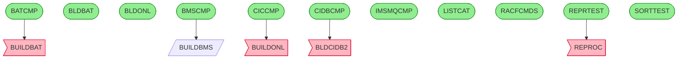

# Call Graph Analysis

*Generated: 2026-01-24 11:46:54*

**Programs Analyzed:** 12

## Visual Call Graph

## Entry Points

- ✓ **BATCMP**: This JCL member submits the CNJBATMP batch job to compile a COBOL program named ...
- ✓ **BLDBAT**: This JCL procedure (PROC) compiles a specified COBOL batch program member using ...
- ✓ **BLDONL**: This JCL procedure (BLDONL) compiles CICS-enabled COBOL source programs from &SO...
- ✓ **BMSCMP**: Compiles CICS BMS map named CICSMAP using the BUILDBMS cataloged procedure, gene...
- ✓ **CICCMP**: This JCL member compiles and link-edits a CICS COBOL program named by &MEMNAME (...
- ✓ **CIDBCMP**: This JCL job sets symbolic parameters including HLQ=AWS.M2.CARDDEMO, SSID=DAZ1, ...
- ✓ **IMSMQCMP**: This JCL job compiles the CICS/IMS/MQ-integrated COBOL program IMSMQPGM. It uses...
- ✓ **LISTCAT**: This JCL job executes a dummy IEFBR14 step to delete or truncate any existing AW...
- ✓ **RACFCMDS**: This JCL job executes the TSO batch program IKJEFT01 in step TSOBAT to run RACF ...
- ✓ **REPRTEST**: REPRTEST JCL job executes STEP05 invoking the REPROC cataloged procedure to back...
- ✓ **SORTTEST**: JCL job SORTTEST executes a single SORT step (STEP05R) to test filtering and sor...

## External Dependencies

### System Utilities (Skipped)

**Known utilities:**
- ASMA90
- DFHECP1
- DSNHPC
- HEWL
- IDCAMS
- IEBGENER
- IEFBR14
- IEWL
- IGYCRCTL
- IKJEFT01
- SDSF
- SORT

### Custom Programs (Need Documentation)

- **BLDCIDB2**: Called by CIDBCMP (STATIC_CALL)
- **BUILDBAT**: Called by BATCMP (STATIC_CALL)
- **BUILDONL**: Called by CICCMP (STATIC_CALL)
- **REPROC**: Called by REPRTEST (STATIC_CALL)

## Statistics

| Metric | Count |
|--------|-------|
| Documented Programs | 12 |
| Entry Points | 11 |
| Leaf Nodes | 11 |
| External Dependencies | 16 |
| System Utilities | 12 |
| Auto-classified | 0 |
| Custom Missing | 4 |
| Total Calls | 35 |

### Status Legend

- ✓ **Documented**: Fully documented from source file
- ~ **Internal**: Found as routine/section in parent program
- ✗ **External**: External or missing program
- ⚙ **System**: Known system utility
