# Call Graph Analysis

*Generated: 2026-01-25 11:40:27*

**Programs Analyzed:** 13

## Visual Call Graph

```mermaid
flowchart TD

    subgraph jobs[" "]
        COPAUA0C([COPAUA0C])
        COPAUS0C([COPAUS0C])
        COPAUS1C([COPAUS1C])
        DBPAUTP0([DBPAUTP0])
        DBUNLDGS([DBUNLDGS])
        PAUDBLOD([PAUDBLOD])
        PAUDBUNL([PAUDBUNL])
        UNLDPADB([UNLDPADB])
    end

    subgraph external[" "]
        CBLTDLI>CBLTDLI]
        CDEMO_TO_PROGRAM>CDEMO-TO-PROGRAM]
        DFSRRC00>DFSRRC00]
        MQCLOSE>MQCLOSE]
        MQGET>MQGET]
        MQOPEN>MQOPEN]
        MQPUT1>MQPUT1]
        WS_PGM_AUTH_FRAUD>WS-PGM-AUTH-FRAUD]
    end

    %% Call relationships
    COPAUA0C --> MQOPEN
    COPAUA0C --> MQGET
    COPAUA0C --> MQPUT1
    COPAUA0C --> MQCLOSE
    COPAUS0C --> CDEMO_TO_PROGRAM
    COPAUS0C --> CDEMO_TO_PROGRAM
    COPAUS1C --> WS_PGM_AUTH_FRAUD
    COPAUS1C --> CDEMO_TO_PROGRAM
    DBPAUTP0 --> DFSRRC00
    DBUNLDGS --> CBLTDLI
    DBUNLDGS --> CBLTDLI
    DBUNLDGS --> CBLTDLI
    DBUNLDGS --> CBLTDLI
    PAUDBLOD --> CBLTDLI
    PAUDBLOD --> CBLTDLI
    PAUDBLOD --> CBLTDLI
    PAUDBUNL --> CBLTDLI
    PAUDBUNL --> CBLTDLI
    UNLDPADB --> DFSRRC00
    UNLDPADB --> DFSRRC00
    UNLDPADB --> DFSRRC00
    UNLDPADB --> DFSRRC00

    %% Styling
    classDef entryPoint fill:#90EE90,stroke:#228B22
    class CBPAUP0C,CBPAUP0J,COPAUA0C,COPAUS0C,COPAUS1C,COPAUS2C,DBPAUTP0,DBUNLDGS,LOADPADB,PAUDBLOD,PAUDBUNL,UNLDGSAM,UNLDPADB entryPoint
    classDef missing fill:#1E3A5F,stroke:#2E5A8F,color:#FFFFFF
    class CBLTDLI,CDEMO_TO_PROGRAM,DFSRRC00,MQCLOSE,MQGET,MQOPEN,MQPUT1,WS_PGM_AUTH_FRAUD missing
```

## Entry Points

- ✓ **CBPAUP0C**: Batch IMS program that sequentially reads pending authorization summary root seg...
- ✓ **CBPAUP0J**: This JCL submits a batch job to execute the IMS DFSRRC00 program in BMP mode, ru...
- ✓ **COPAUA0C**: CICS COBOL program for card authorization decisions in CardDemo application. Pro...
- ✓ **COPAUS0C**: CICS online program displaying summary view of pending authorization messages fo...
- ✓ **COPAUS1C**: CICS transaction CPVD displays detailed view of a selected pending authorization...
- ✓ **COPAUS2C**: This CICS COBOL program receives authorization message data including card detai...
- ✓ **DBPAUTP0**: This JCL job first deletes any existing version of the output dataset AWS.M2.CAR...
- ✓ **DBUNLDGS**: DBUNLDGS is an IMS batch utility program that reads all root pending authorizati...
- ✓ **LOADPADB**: This JCL job executes the IMS reconstruction utility DFSRRC00 in BMP mode to loa...
- ✓ **PAUDBLOD**: Batch program that loads root segments (PAUTSUM0 pending authorization summaries...
- ✓ **PAUDBUNL**: This program unloads data from an IMS hierarchical database by reading root segm...
- ✓ **UNLDGSAM**: This JCL defines a batch job that executes the IMS utility program DFSRRC00 to p...
- ✓ **UNLDPADB**: This JCL deletes existing output files in STEP0 using IEFBR14. In STEP01, it exe...

## External Dependencies

### System Utilities (Skipped)

*None*

### Custom Programs (Need Documentation)

- **CBLTDLI**: Called by PAUDBLOD (EXEC), PAUDBLOD (EXEC), PAUDBLOD (EXEC), DBUNLDGS (EXEC), DBUNLDGS (EXEC), DBUNLDGS (EXEC), DBUNLDGS (EXEC), PAUDBUNL (EXEC), PAUDBUNL (EXEC)
- **CDEMO-TO-PROGRAM**: Called by COPAUS1C (EXEC), COPAUS0C (EXEC), COPAUS0C (EXEC)
- **DFSRRC00**: Called by DBPAUTP0 (EXEC), UNLDPADB (EXEC), UNLDPADB (EXEC), UNLDPADB (EXEC), UNLDPADB (EXEC)
- **MQCLOSE**: Called by COPAUA0C (EXEC)
- **MQGET**: Called by COPAUA0C (EXEC)
- **MQOPEN**: Called by COPAUA0C (EXEC)
- **MQPUT1**: Called by COPAUA0C (EXEC)
- **WS-PGM-AUTH-FRAUD**: Called by COPAUS1C (EXEC)

## Statistics

| Metric | Count |
|--------|-------|
| Documented Programs | 13 |
| Entry Points | 13 |
| Leaf Nodes | 13 |
| External Dependencies | 8 |
| System Utilities | 0 |
| Auto-classified | 0 |
| Custom Missing | 8 |
| Total Calls | 22 |

### Status Legend

- ✓ **Documented**: Fully documented from source file
- ~ **Internal**: Found as routine/section in parent program
- ✗ **External**: External or missing program
- ⚙ **System**: Known system utility
