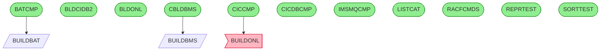

# Call Graph Analysis

*Generated: 2026-01-23 12:25:45*

**Programs Analyzed:** 13

## Visual Call Graph

## Entry Points

- ✓ **BATCMP**: This JCL defines a job to compile a batch COBOL program using the BUILDBAT catal...
- ✓ **BLDCIDB2**: This JCL PROC compiles CICS COBOL programs with embedded DB2 SQL by executing DB...
- ✓ **BLDONL**: This JCL procedure compiles CICS-enabled COBOL programs using IGYCRCTL, replicat...
- ✓ **CBLDBMS**: This JCL job compiles the CICS BMS map named CICSMAP using the BUILDBMS procedur...
- ✓ **CICCMP**: This JCL job compiles a CICS COBOL program (default name CICSPGMN) using the BUI...
- ✓ **CICDBCMP**: This JCL job sets symbolic parameters for libraries, DB2 subsystem, and plan nam...
- ✓ **IMSMQCMP**: This JCL job translates, compiles, prepares link cards, and links the COBOL prog...
- ✓ **LISTCAT**: This JCL job generates a catalog listing for all entries under the AWS.M2.CARDDE...
- ✓ **RACFCMDS**: This JCL job RACFCMDS executes the TSO program IKJEFT01 in batch mode to run RAC...
- ✓ **REPRTEST**: This JCL job invokes the REPROC procedure to perform a file reproduction from a ...
- ✓ **SORTTEST**: This JCL defines a batch job that executes the SORT utility in step STEP05R to r...

## External Dependencies

### System Utilities (Skipped)

**Known utilities:**
- DFHECP1
- DSNHPC
- HEWL
- IDCAMS
- IEBGENER
- IEFBR14
- IEWL
- IGYCRCTL
- IKJEFT01
- SDSF

### Custom Programs (Need Documentation)

- **BUILDONL**: Called by CICCMP (OTHER)

## Statistics

| Metric | Count |
|--------|-------|
| Documented Programs | 13 |
| Entry Points | 11 |
| Leaf Nodes | 11 |
| External Dependencies | 11 |
| System Utilities | 10 |
| Auto-classified | 0 |
| Custom Missing | 1 |
| Total Calls | 19 |

### Status Legend

- ✓ **Documented**: Fully documented from source file
- ~ **Internal**: Found as routine/section in parent program
- ✗ **External**: External or missing program
- ⚙ **System**: Known system utility
