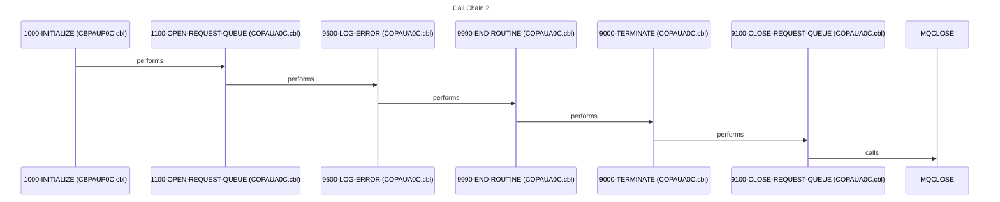
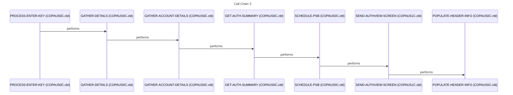
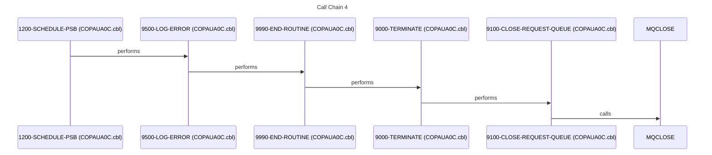
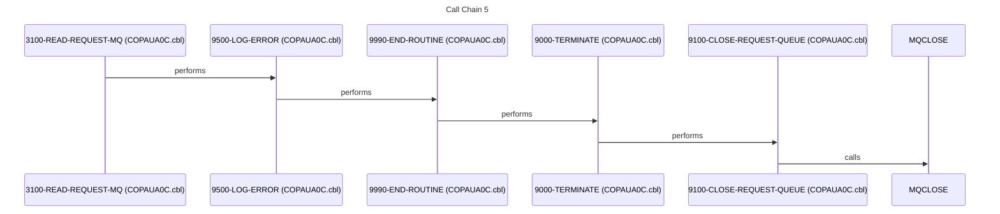

# System Architecture Document

## 1. Executive Summary

This document describes the architecture of a system centered around authorization processing, likely within a financial or transaction-based context. The system's primary purpose is to manage and process authorization requests, maintain authorization details, and potentially flag fraudulent activities. It serves users involved in authorization management, fraud detection, and customer service. The system aims to ensure secure and valid transactions by verifying authorization details against various data sources. Key stakeholders include fraud analysts, customer service representatives, and IT operations personnel.

The system's major capabilities include receiving authorization requests, validating these requests against customer account and profile data, making decisions based on predefined business rules, and updating authorization records in a database. It handles transactions related to authorization creation, modification, deletion, and fraud flagging. Key workflows involve retrieving authorization details, cross-referencing account information, and processing authorization decisions. The system also includes batch processes for unloading and loading data related to authorization and related entities. The online components likely provide screens for viewing and managing authorization data.

The system is built using a combination of mainframe technologies, including COBOL for business logic, JCL for batch processing, IMS for database management, and potentially CICS for online transaction processing. COBOL programs interact with IMS databases using CBLTDLI calls. JCL jobs automate data unloading and loading processes. Copybooks define data structures shared across multiple programs. The system uses MQSeries for message queuing, enabling asynchronous communication between components.

The system receives authorization requests via MQSeries queues and interacts with IMS databases to store and retrieve authorization data. It integrates with external systems for account information, customer details, and fraud detection. The system outputs authorization decisions and updates to the IMS database and potentially sends responses back via MQSeries. The system boundaries include the MQSeries queues for input and output, the IMS databases for persistent storage, and the interfaces with external systems for data enrichment.

This system is critical for ensuring the security and validity of transactions, protecting the organization from financial losses due to fraud, and providing customer service representatives with the information they need to resolve authorization-related issues. If the system were to fail, it could lead to unauthorized transactions, increased fraud risk, and customer dissatisfaction. The system supports business metrics related to transaction volume, fraud rates, and customer service efficiency. The system's ability to quickly and accurately process authorizations is essential for maintaining business operations and customer trust. The batch processes ensure data integrity and availability for reporting and analysis. The online components provide real-time access to authorization information for operational users. The system's architecture is designed to be scalable and resilient to meet the demands of a high-volume transaction environment. The system's components are tightly integrated to ensure data consistency and efficient processing. The system's success is measured by its ability to minimize fraud, maximize transaction throughput, and provide excellent customer service.

## 2. Architecture Overview

The system appears to be a hybrid architecture, combining batch processing for data management with online transaction processing for real-time authorization handling. The core components are COBOL programs that interact with IMS databases and MQSeries queues. JCL jobs automate data unloading and loading tasks.

**Entry Points:**

- **Batch:** The JCL jobs [CBPAUP0J](jcl/CBPAUP0J.jcl.md), [DBPAUTP0](jcl/DBPAUTP0.jcl.md), [LOADPADB](jcl/LOADPADB.jcl.md), [PAUDBUNL](cbl/PAUDBUNL.CBL.md), and [UNLDGSAM](jcl/UNLDGSAM.jcl.md) serve as entry points for batch processing. These jobs likely perform tasks such as data extraction, transformation, and loading (ETL) for the IMS databases.
- **Online:** The COBOL programs [COPAUA0C](cbl/COPAUA0C.cbl.md), [COPAUS0C](cbl/COPAUS0C.cbl.md), and [COPAUS1C](cbl/COPAUS1C.cbl.md) likely represent online transaction processing components, potentially running under CICS. These programs handle authorization requests and interact with the IMS databases in real-time.

**Integration Patterns:**

- **Batch:** Batch processing is used for data unloading, loading, and potentially for generating reports. JCL jobs schedule and execute the COBOL programs responsible for these tasks.
- **Online:** Online transaction processing is used for real-time authorization handling. COBOL programs interact with IMS databases and MQSeries queues to process authorization requests.
- **Database:** IMS databases are used for persistent storage of authorization data, account information, and customer details. COBOL programs use CBLTDLI calls to access and manipulate data in the IMS databases.
- **Messaging:** MQSeries queues are used for asynchronous communication between components. Authorization requests are received via MQSeries queues, and responses are sent back via MQSeries queues.

**Architectural Patterns:**

- **Layered Architecture:** The system appears to follow a layered architecture, with distinct layers for presentation (BMS screens), business logic (COBOL programs), and data access (IMS databases).
- **Batch Processing Pipeline:** The batch processing jobs form a pipeline, with data being extracted, transformed, and loaded into the IMS databases.

```mermaid
flowchart TD

    subgraph jobs[" "]
        CBPAUP0J([CBPAUP0J])
        DBPAUTP0([DBPAUTP0])
        PAUDBUNL([PAUDBUNL])
    end

    subgraph procs[" "]
        CBPAUP0C[CBPAUP0C]
        CCPAUERY[/CCPAUERY/]
        CCPAURLY[/CCPAURLY/]
        CCPAURQY[/CCPAURQY/]
        CIPAUDTY[/CIPAUDTY/]
        CIPAUSMY[/CIPAUSMY/]
        COPAU00[/COPAU00/]
        COPAU01[/COPAU01/]
        COPAUA0C[COPAUA0C]
        COPAUS0C[COPAUS0C]
        COPAUS1C[COPAUS1C]
        COPAUS2C[COPAUS2C]
        DBUNLDGS[DBUNLDGS]
        IMSFUNCS[/IMSFUNCS/]
        PADFLPCB[/PADFLPCB/]
        PASFLPCB[/PASFLPCB/]
        PAUDBLOD[PAUDBLOD]
        PAUTBPCB[/PAUTBPCB/]
    end

    subgraph external[" "]
        CBLTDLI>CBLTDLI]
        CDEMO_TO_PROGRAM>CDEMO-TO-PROGRAM]
        DFSRRC00>DFSRRC00]
        MQCLOSE>MQCLOSE]
        MQGET>MQGET]
        MQOPEN>MQOPEN]
        MQPUT1>MQPUT1]
        WS_PGM_AUTH_FRAUD>WS-PGM-AUTH-FRAUD]
    end

    %% Call relationships
    CBPAUP0C --> CBPAUP0C
    CBPAUP0C --> CBPAUP0C
    CBPAUP0C --> CBPAUP0C
    CBPAUP0C --> CBPAUP0C
    CBPAUP0C --> COPAUA0C
    CBPAUP0C --> COPAUA0C
    CBPAUP0C --> DBUNLDGS
    CBPAUP0C --> DBUNLDGS
    CBPAUP0C --> CBPAUP0C
    CBPAUP0C --> CBPAUP0C
    CBPAUP0C --> CBPAUP0C
    CBPAUP0C -.->|COPY| COPYBOOKS
    CBPAUP0C --> CBLTDLI
    CBPAUP0C --> CBLTDLI
    CBPAUP0C --> CBLTDLI
    CBPAUP0C --> CBLTDLI
    CBPAUP0J --> DFSRRC00
    CBPAUP0J --> DFSRRC00
    CBPAUP0J --> DFSRRC00
    CBPAUP0J --> DFSRRC00
    COPAUA0C --> COPAUA0C
    COPAUA0C --> COPAUA0C
    COPAUA0C --> COPAUA0C
    COPAUA0C --> COPAUA0C
    COPAUA0C --> COPAUA0C
    COPAUA0C --> COPAUA0C
    COPAUA0C --> COPAUA0C
    COPAUA0C --> COPAUA0C
    COPAUA0C --> COPAUA0C
    COPAUA0C --> COPAUA0C
    COPAUA0C --> COPAUA0C
    COPAUA0C --> COPAUA0C
    COPAUA0C --> COPAUA0C
    COPAUA0C --> COPAUA0C
    COPAUA0C --> COPAUA0C
    COPAUA0C --> COPAUA0C
    COPAUA0C --> COPAUA0C
    COPAUA0C --> COPAUA0C
    COPAUA0C --> COPAUA0C
    COPAUA0C --> COPAUA0C
    COPAUA0C --> COPAUA0C
    COPAUA0C --> COPAUA0C
    COPAUA0C --> COPAUA0C
    COPAUA0C --> COPAUA0C
    COPAUA0C --> COPAUA0C
    COPAUA0C --> COPAUA0C
    COPAUA0C --> COPAUA0C
    COPAUA0C --> COPAUA0C
    COPAUA0C --> COPAUA0C
    COPAUA0C -.->|COPY| COPYBOOKS
    COPAUA0C --> MQOPEN
    COPAUA0C --> MQGET
    COPAUA0C --> MQPUT1
    COPAUA0C --> MQCLOSE
    COPAUS0C --> COPAUS1C
    COPAUS0C --> COPAUS1C
    COPAUS0C --> COPAUS1C
    COPAUS0C --> COPAUS1C
    COPAUS0C --> COPAUS1C
    COPAUS0C --> COPAUS1C
    COPAUS0C --> COPAUS1C
    COPAUS0C --> COPAUS1C
    COPAUS0C --> COPAUS0C
    COPAUS0C --> COPAUS0C
    COPAUS0C --> COPAUS0C
    COPAUS0C --> COPAUS0C
    COPAUS0C --> COPAUS0C
    COPAUS0C --> COPAUS0C
    COPAUS0C --> COPAUS0C
    COPAUS0C --> COPAUS0C
    COPAUS0C --> COPAUS0C
    COPAUS0C --> COPAUS0C
    COPAUS0C --> COPAUS0C
    COPAUS0C --> COPAUS0C
    COPAUS0C --> COPAUS0C
    COPAUS0C --> COPAUS0C
    COPAUS0C --> COPAUS0C
    COPAUS0C --> COPAUS0C
    COPAUS0C --> COPAUS0C
    COPAUS0C --> COPAUS0C
    COPAUS0C --> COPAUS0C
    COPAUS0C --> COPAUS0C
    COPAUS0C --> COPAUS0C
    COPAUS0C --> COPAUS0C
    COPAUS0C --> COPAUS0C
    COPAUS0C --> COPAUS0C
    COPAUS0C --> COPAUS0C
    COPAUS0C --> COPAUS0C
    COPAUS0C --> COPAUS0C
    COPAUS0C -.->|COPY| COPYBOOKS
    COPAUS0C --> CDEMO_TO_PROGRAM
    COPAUS0C --> CDEMO_TO_PROGRAM
    COPAUS0C --> CDEMO_TO_PROGRAM
    COPAUS1C --> COPAUS1C
    COPAUS1C --> COPAUS1C
    COPAUS1C --> COPAUS1C
    COPAUS1C --> COPAUS1C
    COPAUS1C --> COPAUS0C
    COPAUS1C --> COPAUS0C
    COPAUS1C --> COPAUS1C
    COPAUS1C --> COPAUS1C
    COPAUS1C --> COPAUS1C
    COPAUS1C --> COPAUS1C
    COPAUS1C --> COPAUS1C
    COPAUS1C -.->|COPY| COPYBOOKS
    COPAUS1C --> WS_PGM_AUTH_FRAUD
    COPAUS2C --> CBPAUP0C
    COPAUS2C --> CBPAUP0C
    COPAUS2C --> DBUNLDGS
    COPAUS2C --> COPAUS0C
    COPAUS2C --> COPAUS0C
    COPAUS2C --> COPAUS1C
    COPAUS2C --> COPAUS1C
    COPAUS2C --> COPAUS1C
    COPAUS2C --> COPAUS0C
    COPAUS2C --> COPAUA0C
    COPAUS2C --> COPAUA0C
    COPAUS2C --> PAUDBLOD
    COPAUS2C --> PAUDBLOD
    COPAUS2C --> CBPAUP0C
    COPAUS2C --> CBPAUP0C
    COPAUS2C --> CBPAUP0C
    COPAUS2C --> CBPAUP0C
    COPAUS2C --> CBPAUP0C
    COPAUS2C --> COPAUS0C
    COPAUS2C --> COPAUS0C
    COPAUS2C --> COPAUS0C
    COPAUS2C --> COPAUS0C
    COPAUS2C --> COPAUS2C
    COPAUS2C -.->|COPY| COPYBOOKS
    DBPAUTP0 --> DFSRRC00
    DBUNLDGS --> CBPAUP0C
    DBUNLDGS --> CBPAUP0C
    DBUNLDGS -.->|COPY| COPYBOOKS
    DBUNLDGS --> CBLTDLI
    DBUNLDGS --> CBLTDLI
    PAUDBLOD --> PAUDBLOD
    PAUDBLOD --> CBPAUP0C
    PAUDBLOD --> PAUDBLOD
    PAUDBLOD --> PAUDBLOD
    PAUDBLOD --> CBPAUP0C
    PAUDBLOD --> CBPAUP0C
    PAUDBLOD -.->|COPY| COPYBOOKS
    PAUDBLOD --> CBLTDLI
    PAUDBLOD --> CBLTDLI
    PAUDBLOD --> CBLTDLI
    PAUDBUNL -.->|COPY| COPYBOOKS

    %% Styling
    classDef entryPoint fill:#90EE90,stroke:#228B22
    class CBPAUP0J,DBPAUTP0,LOADPADB,PAUDBUNL,UNLDGSAM,UNLDPADB entryPoint
    classDef missing fill:#1E3A5F,stroke:#2E5A8F,color:#FFFFFF
    class CBLTDLI,CDEMO_TO_PROGRAM,DFSRRC00,MQCLOSE,MQGET,MQOPEN,MQPUT1,WS_PGM_AUTH_FRAUD missing
```

## 3. Component Catalog

| Component | Type | Purpose | Dependencies | Doc Link |
|-----------|------|---------|--------------|----------|
| [PAUDBUNL](cbl/PAUDBUNL.CBL.md) | COBOL | Unloads data from IMS database | [IMSFUNCS](cpy/IMSFUNCS.cpy.md), [CIPAUSMY](cpy/CIPAUSMY.cpy.md), [CIPAUDTY](cpy/CIPAUDTY.cpy.md), [PAUTBPCB](cpy/PAUTBPCB.CPY.md) | [PAUDBUNL](cbl/PAUDBUNL.CBL.md) |
| [COPAUS1C](cbl/COPAUS1C.cbl.md) | COBOL | Processes authorization requests (CICS?) | [COPAUS0C](cbl/COPAUS0C.cbl.md), [CIPAUSMY](cpy/CIPAUSMY.cpy.md), [CIPAUDTY](cpy/CIPAUDTY.cpy.md) | [COPAUS1C](cbl/COPAUS1C.cbl.md) |
| [COPAUA0C](cbl/COPAUA0C.cbl.md) | COBOL | Processes authorization requests (CICS?) | [CIPAUSMY](cpy/CIPAUSMY.cpy.md), [CIPAUDTY](cpy/CIPAUDTY.cpy.md) | [COPAUA0C](cbl/COPAUA0C.cbl.md) |
| [PAUDBLOD](cbl/PAUDBLOD.CBL.md) | COBOL | Loads data into IMS database | [IMSFUNCS](cpy/IMSFUNCS.cpy.md), [CIPAUSMY](cpy/CIPAUSMY.cpy.md), [CIPAUDTY](cpy/CIPAUDTY.cpy.md), [PAUTBPCB](cpy/PAUTBPCB.CPY.md) | [PAUDBLOD](cbl/PAUDBLOD.CBL.md) |
| [DBUNLDGS](cbl/DBUNLDGS.CBL.md) | COBOL | Unloads data from IMS database | [IMSFUNCS](cpy/IMSFUNCS.cpy.md), [CIPAUSMY](cpy/CIPAUSMY.cpy.md), [CIPAUDTY](cpy/CIPAUDTY.cpy.md), [PAUTBPCB](cpy/PAUTBPCB.CPY.md) | [DBUNLDGS](cbl/DBUNLDGS.CBL.md) |
| [CBPAUP0C](cbl/CBPAUP0C.cbl.md) | COBOL | Processes authorization data | [COPAUA0C](cbl/COPAUA0C.cbl.md), [DBUNLDGS](cbl/DBUNLDGS.CBL.md) | [CBPAUP0C](cbl/CBPAUP0C.cbl.md) |
| [COPAUS0C](cbl/COPAUS0C.cbl.md) | COBOL | Processes authorization requests (CICS?) | [COPAUS1C](cbl/COPAUS1C.cbl.md) | [COPAUS0C](cbl/COPAUS0C.cbl.md) |
| [COPAUS2C](cbl/COPAUS2C.cbl.md) | COBOL | Processes authorization data | [CBPAUP0C](cbl/CBPAUP0C.cbl.md), [DBUNLDGS](cbl/DBUNLDGS.CBL.md), [COPAUS0C](cbl/COPAUS0C.cbl.md), [COPAUS1C](cbl/COPAUS1C.cbl.md), [COPAUA0C](cbl/COPAUA0C.cbl.md), [PAUDBLOD](cbl/PAUDBLOD.CBL.md) | [COPAUS2C](cbl/COPAUS2C.cbl.md) |
| [COPAU00](bms/COPAU00.bms.md) | BMS | BMS map for screen display | - | [COPAU00](bms/COPAU00.bms.md) |
| [COPAU01](bms/COPAU01.bms.md) | BMS | BMS map for screen display | - | [COPAU01](bms/COPAU01.bms.md) |
| [PADFLPCB](cpy/PADFLPCB.CPY.md) | COPY | PCB definition | - | [PADFLPCB](cpy/PADFLPCB.CPY.md) |
| [CIPAUSMY](cpy/CIPAUSMY.cpy.md) | COPY | Authorization data structure | - | [CIPAUSMY](cpy/CIPAUSMY.cpy.md) |
| [CCPAURQY](cpy/CCPAURQY.cpy.md) | COPY | Request data structure | - | [CCPAURQY](cpy/CCPAURQY.cpy.md) |
| [CIPAUDTY](cpy/CIPAUDTY.cpy.md) | COPY | Authorization detail data structure | - | [CIPAUDTY](cpy/CIPAUDTY.cpy.md) |
| [PAUTBPCB](cpy/PAUTBPCB.CPY.md) | COPY | PCB definition | - | [PAUTBPCB](cpy/PAUTBPCB.CPY.md) |
| [PASFLPCB](cpy/PASFLPCB.CPY.md) | COPY | PCB definition | - | [PASFLPCB](cpy/PASFLPCB.CPY.md) |
| [IMSFUNCS](cpy/IMSFUNCS.cpy.md) | COPY | IMS function definitions | - | [IMSFUNCS](cpy/IMSFUNCS.cpy.md) |
| [CCPAUERY](cpy/CCPAUERY.cpy.md) | COPY | Error message data structure | - | [CCPAUERY](cpy/CCPAUERY.cpy.md) |
| [CCPAURLY](cpy/CCPAURLY.cpy.md) | COPY | Log data structure | - | [CCPAURLY](cpy/CCPAURLY.cpy.md) |
| [XAUTHFRD](ddl/XAUTHFRD.ddl.md) | DDL | Table definition | - | [XAUTHFRD](ddl/XAUTHFRD.ddl.md) |
| [AUTHFRDS](ddl/AUTHFRDS.ddl.md) | DDL | Table definition | - | [AUTHFRDS](ddl/AUTHFRDS.ddl.md) |
| [DBPAUTP0](ims/DBPAUTP0.dbd.md) | DBD | IMS database definition | - | [DBPAUTP0](ims/DBPAUTP0.dbd.md) |
| [DBPAUTX0](ims/DBPAUTX0.dbd.md) | DBD | IMS database definition | - | [DBPAUTX0](ims/DBPAUTX0.dbd.md) |
| [PADFLDBD](ims/PADFLDBD.DBD.md) | DBD | IMS database definition | - | [PADFLDBD](ims/PADFLDBD.DBD.md) |
| [PSBPAUTL](ims/PSBPAUTL.psb.md) | PSB | IMS program specification block | - | [PSBPAUTL](ims/PSBPAUTL.psb.md) |
| [PSBPAUTB](ims/PSBPAUTB.psb.md) | PSB | IMS program specification block | - | [PSBPAUTB](ims/PSBPAUTB.psb.md) |
| [PASFLDBD](ims/PASFLDBD.DBD.md) | DBD | IMS database definition | - | [PASFLDBD](ims/PASFLDBD.DBD.md) |
| [PAUTBUNL](ims/PAUTBUNL.PSB.md) | PSB | IMS program specification block | - | [PAUTBUNL](ims/PAUTBUNL.PSB.md) |
| [DLIGSAMP](ims/DLIGSAMP.PSB.md) | PSB | IMS program specification block | - | [DLIGSAMP](ims/DLIGSAMP.PSB.md) |
| [COPAU00](cpy-bms/COPAU00.cpy.md) | COPY | BMS copybook | - | [COPAU00](cpy-bms/COPAU00.cpy.md) |
| [COPAU01](cpy-bms/COPAU01.cpy.md) | COPY | BMS copybook | - | [COPAU01](cpy-bms/COPAU01.cpy.md) |
| [UNLDPADB](jcl/UNLDPADB.JCL.md) | JCL | Unloads IMS database | - | [UNLDPADB](jcl/UNLDPADB.JCL.md) |
| [LOADPADB](jcl/LOADPADB.JCL.md) | JCL | Loads IMS database | - | [LOADPADB](jcl/LOADPADB.JCL.md) |
| [UNLDGSAM](jcl/UNLDGSAM.JCL.md) | JCL | Unloads GSAM database | - | [UNLDGSAM](jcl/UNLDGSAM.JCL.md) |
| [DBPAUTP0](jcl/DBPAUTP0.jcl.md) | JCL | Executes IMS program | - | [DBPAUTP0](jcl/DBPAUTP0.jcl.md) |
| [CBPAUP0J](jcl/CBPAUP0J.jcl.md) | JCL | Executes COBOL program | - | [CBPAUP0J](jcl/CBPAUP0J.jcl.md) |

## 4. Subsystem Breakdown

The system can be divided into the following subsystems:

- **Batch Processing Subsystem:** This subsystem is responsible for data unloading and loading of the IMS databases. It consists of the JCL jobs [UNLDPADB](jcl/UNLDPADB.JCL.md), [LOADPADB](jcl/LOADPADB.JCL.md), [UNLDGSAM](jcl/UNLDGSAM.JCL.md), and the COBOL programs [PAUDBUNL](cbl/PAUDBUNL.CBL.md), [PAUDBLOD](cbl/PAUDBLOD.CBL.md), and [DBUNLDGS](cbl/DBUNLDGS.CBL.md). The job flow typically involves unloading data from the IMS databases using [PAUDBUNL](cbl/PAUDBUNL.CBL.md) and [DBUNLDGS](cbl/DBUNLDGS.CBL.md), and then loading data into the IMS databases using [PAUDBLOD](cbl/PAUDBLOD.CBL.md).
- **Online Transaction Processing Subsystem:** This subsystem is responsible for handling real-time authorization requests. It consists of the COBOL programs [COPAUA0C](cbl/COPAUA0C.cbl.md), [COPAUS0C](cbl/COPAUS0C.cbl.md), and [COPAUS1C](cbl/COPAUS1C.cbl.md), and the BMS maps [COPAU00](bms/COPAU00.bms.md) and [COPAU01](bms/COPAU01.bms.md). These programs likely run under CICS and interact with the IMS databases and MQSeries queues to process authorization requests.
- **Authorization Processing Subsystem:** This subsystem contains the core business logic for processing authorization data. It includes the COBOL programs [CBPAUP0C](cbl/CBPAUP0C.cbl.md) and [COPAUS2C](cbl/COPAUS2C.cbl.md). These programs perform tasks such as validating authorization requests, updating authorization records, and flagging fraudulent activities.
- **Shared Services and Utilities:** The copybooks [IMSFUNCS](cpy/IMSFUNCS.cpy.md), [CIPAUSMY](cpy/CIPAUSMY.cpy.md), and [CIPAUDTY](cpy/CIPAUDTY.cpy.md) provide shared data structures and utility functions used by multiple programs.

## 5. Data Architecture

The system uses the following data stores:

- **IMS Databases:** The primary data store is the IMS database, which stores authorization data, account information, and customer details. The database definitions are defined in the DBDs [DBPAUTP0](ims/DBPAUTP0.dbd.md), [DBPAUTX0](ims/DBPAUTX0.dbd.md), [PADFLDBD](ims/PADFLDBD.DBD.md), and [PASFLDBD](ims/PASFLDBD.DBD.md).
- **MQSeries Queues:** MQSeries queues are used for asynchronous communication between components. Authorization requests are received via MQSeries queues, and responses are sent back via MQSeries queues.
- **GSAM Datasets:** The system uses GSAM datasets, likely for audit logging or temporary storage. The JCL [UNLDGSAM](jcl/UNLDGSAM.JCL.md) suggests the unloading of a GSAM dataset.

**Data Flow:**

1. Authorization requests are received via MQSeries queues.
2. The online transaction processing programs ([COPAUA0C](cbl/COPAUA0C.cbl.md), [COPAUS0C](cbl/COPAUS0C.cbl.md), [COPAUS1C](cbl/COPAUS1C.cbl.md)) retrieve the authorization request from the MQSeries queue.
3. The online transaction processing programs validate the authorization request against customer account and profile data stored in the IMS database.
4. The authorization processing programs ([CBPAUP0C](cbl/CBPAUP0C.cbl.md), [COPAUS2C](cbl/COPAUS2C.cbl.md)) make decisions based on predefined business rules.
5. The authorization records in the IMS database are updated.
6. A response is sent back via MQSeries queues.
7. Batch jobs ([UNLDPADB](jcl/UNLDPADB.JCL.md), [LOADPADB](jcl/LOADPADB.JCL.md), [UNLDGSAM](jcl/UNLDGSAM.JCL.md)) unload and load data from the IMS databases and GSAM datasets.

**Input Sources:**

- **MQSeries Queues:** Authorization requests are received via MQSeries queues. The format of the authorization request is defined in the copybook [CCPAURQY](cpy/CCPAURQY.cpy.md).
- **IMS Databases:** Account information, customer details, and authorization data are stored in the IMS databases.

**Output Destinations:**

- **IMS Databases:** Authorization records are updated in the IMS databases.
- **MQSeries Queues:** Responses are sent back via MQSeries queues.
- **GSAM Datasets:** Audit logs and temporary data are stored in GSAM datasets.

**Key Data Structures:**

- **Authorization Data:** The authorization data structure is defined in the copybook [CIPAUSMY](cpy/CIPAUSMY.cpy.md).
- **Authorization Detail Data:** The authorization detail data structure is defined in the copybook [CIPAUDTY](cpy/CIPAUDTY.cpy.md).
- **Request Data:** The request data structure is defined in the copybook [CCPAURQY](cpy/CCPAURQY.cpy.md).

## 6. Integration Points

- **External System Interfaces:** The system integrates with external systems for account information, customer details, and fraud detection. The specific interfaces are not documented, but the programs [COPAUA0C](cbl/COPAUA0C.cbl.md), [COPAUS0C](cbl/COPAUS0C.cbl.md), and [COPAUS1C](cbl/COPAUS1C.cbl.md) likely interact with these systems.
- **Batch Job Dependencies and Scheduling:** The batch jobs are scheduled and executed using JCL. The dependencies between the jobs are not explicitly documented, but the job flow typically involves unloading data from the IMS databases and GSAM datasets, and then loading data into the IMS databases.
- **Database Connections and Access Patterns:** COBOL programs use CBLTDLI calls to access and manipulate data in the IMS databases. The PSB definitions ([PSBPAUTL](ims/PSBPAUTL.psb.md), [PSBPAUTB](ims/PSBPAUTB.psb.md), [PAUTBUNL](ims/PAUTBUNL.PSB.md), [DLIGSAMP](ims/DLIGSAMP.PSB.md)) define the program's access to the IMS databases.
- **File Transfers and Data Exchanges:** Data is exchanged between components using MQSeries queues and GSAM datasets.

## 7. Business Rules Summary

The business rules are not explicitly documented, but the following can be inferred:

- **Authorization Validation:** Authorization requests are validated against customer account and profile data.
- **Fraud Detection:** The system flags fraudulent activities based on predefined rules.
- **Transaction Limits:** Transaction limits are enforced based on customer profile and account type.
- **Account Status:** Authorization requests are rejected for inactive or blocked accounts.

These rules are likely implemented in the COBOL programs [CBPAUP0C](cbl/CBPAUP0C.cbl.md), [COPAUS2C](cbl/COPAUS2C.cbl.md), [COPAUA0C](cbl/COPAUA0C.cbl.md), [COPAUS0C](cbl/COPAUS0C.cbl.md), and [COPAUS1C](cbl/COPAUS1C.cbl.md).

## 8. Error Handling Patterns

The system uses the following error handling patterns:

- **Error Logging:** Error messages are logged using the copybook [CCPAUERY](cpy/CCPAUERY.cpy.md).
- **Transaction Rollback:** Transactions are rolled back in case of errors.
- **Abend Processing:** Abend processing is used to terminate programs in case of critical errors.
- **Return Codes:** Programs return codes to indicate success or failure.

## 9. Open Questions and Uncertainties

You may want to ask a more specific follow-up question to continue the analysis.
- ❓ QUESTION: What are the specific error handling procedures and recovery mechanisms?
- ❓ QUESTION: What is the purpose of the GSAM datasets?
- ❓ QUESTION: Is CICS used for the online transaction processing components?
- ❓ QUESTION: What is the frequency of the batch jobs?
- ❓ QUESTION: What are the performance requirements of the system?
- ❓ QUESTION: What are the security requirements of the system?
- ❓ QUESTION: What are the data retention policies for the system?

## Flows

The following sequence diagrams illustrate key call sequences identified in the codebase, showing how programs interact during execution.

### Flow 1

### Flow 2

### Flow 3

### Flow 4

### Flow 5

