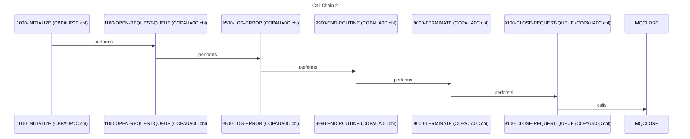
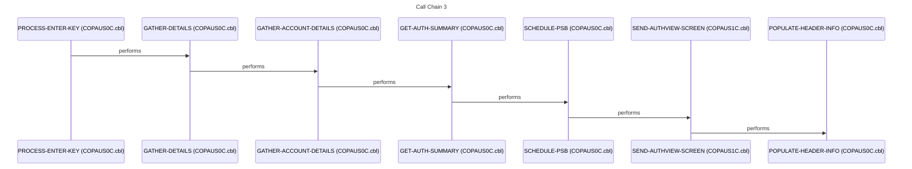
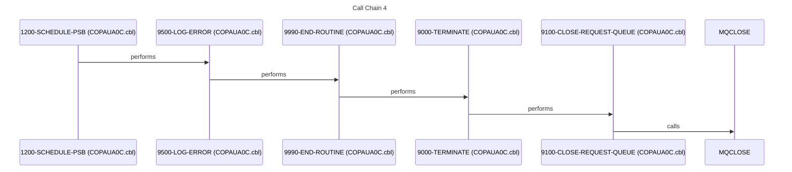
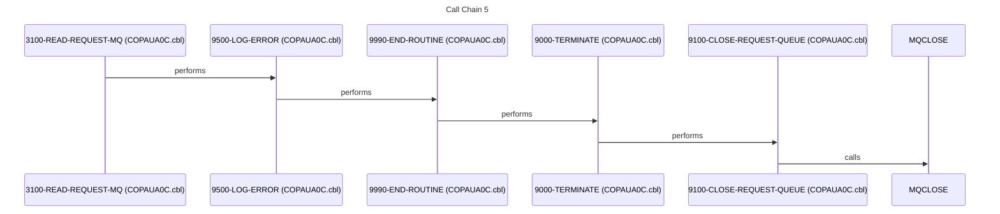

# System Design Document

## 1. Executive Summary

This system, driven by the TicketOrchestrator, manages and processes authorization requests, primarily focusing on financial transactions and fraud detection. Its mission is to ensure the validity and security of authorizations by validating data against various internal and external sources. The system caters to internal users responsible for authorization processing, fraud investigation, and system maintenance, as well as external customers whose transactions are being authorized. The core functionality revolves around receiving authorization requests, validating them against customer, account, and cross-reference data, making authorization decisions, and updating the authorization database. The system also provides online screens for viewing and managing authorization details.

The system's major capabilities include receiving authorization requests via MQSeries queues, extracting relevant data from these requests, and enriching the data by retrieving information from IMS databases and VSAM files. Key workflows involve processing authorization requests, validating data against customer, account, and cross-reference information, making authorization decisions based on predefined rules, and updating the authorization database with the results. The system also supports online inquiry and maintenance functions through CICS transactions, allowing users to view and update authorization details. The system uses batch jobs to unload and load IMS databases.

The system is built on a foundation of COBOL programs interacting with IMS databases, VSAM files, and MQSeries queues. JCL is used to orchestrate batch processes for data loading and unloading. COBOL programs use embedded SQL (CBLTDLI) to access IMS databases. CICS transactions provide online access to authorization data. The system leverages copybooks to ensure data consistency across different programs. The system integrates with external systems through MQSeries for receiving authorization requests and sending responses. It also interacts with IMS databases for storing and retrieving authorization data, and VSAM files for accessing customer, account, and cross-reference information.

The system's boundaries include receiving authorization requests from external systems via MQSeries, processing these requests, and sending authorization responses back to the requesting systems. It integrates with IMS databases for persistent storage of authorization data and VSAM files for accessing customer and account information. The system also provides online screens for internal users to view and manage authorization details. The primary data sources are MQSeries queues, IMS databases, and VSAM files. The output destinations include MQSeries queues for responses, IMS databases for updated authorization data, and CICS screens for user interaction.

This system is critical to the organization because it ensures the security and validity of financial transactions. If the system were to fail, it could lead to unauthorized transactions, financial losses, and reputational damage. The system supports key business metrics such as authorization approval rates, fraud detection rates, and transaction processing times. The system's availability and performance are crucial for maintaining customer trust and preventing financial losses. The system also plays a vital role in complying with regulatory requirements related to financial transactions and data security. The system's ability to accurately and efficiently process authorization requests directly impacts the organization's bottom line and its ability to provide secure and reliable financial services. The system's online inquiry and maintenance functions are essential for internal users to effectively manage and monitor authorization activities.

## 2. Architecture Overview

The system architecture comprises batch processing components, online CICS transaction processing components, and shared copybooks. Batch jobs, orchestrated by JCL, are responsible for unloading and loading IMS databases. CICS transactions, driven by COBOL programs, provide online access to authorization data. COBOL programs, utilizing embedded SQL (CBLTDLI), interact with IMS databases and VSAM files. MQSeries is used for message queuing, enabling communication with external systems. The system employs a layered architecture, separating the presentation layer (CICS screens), the business logic layer (COBOL programs), and the data access layer (IMS databases and VSAM files).

```mermaid
flowchart TD

    subgraph jobs[" "]
        CBPAUP0J([CBPAUP0J])
        DBPAUTP0([DBPAUTP0])
        PAUDBUNL([PAUDBUNL])
    end

    subgraph procs[" "]
        CBPAUP0C[CBPAUP0C]
        COPAU00[/COPAU00/]
        COPAUA0C[COPAUA0C]
        COPAUS0C[COPAUS0C]
        COPAUS1C[COPAUS1C]
        COPAUS2C[COPAUS2C]
        DBUNLDGS[DBUNLDGS]
        PAUDBLOD[PAUDBLOD]
    end

    COPYBOOKS[/CCPAUERY<br>CCPAURLY<br>CCPAURQY<br>CIPAUDTY<br>CIPAUSMY<br>COPAU01<br>IMSFUNCS<br>PADFLPCB<br>PASFLPCB<br>PAUTBPCB/]

    subgraph external[" "]
        CBLTDLI>CBLTDLI]
        CDEMO_TO_PROGRAM>CDEMO-TO-PROGRAM]
        DFSRRC00>DFSRRC00]
        MQCLOSE>MQCLOSE]
        MQGET>MQGET]
        MQOPEN>MQOPEN]
        MQPUT1>MQPUT1]
        WS_PGM_AUTH_FRAUD>WS-PGM-AUTH-FRAUD]
    end

    %% Call relationships
    CBPAUP0C --> CBPAUP0C
    CBPAUP0C --> CBPAUP0C
    CBPAUP0C --> CBPAUP0C
    CBPAUP0C --> CBPAUP0C
    CBPAUP0C --> COPAUA0C
    CBPAUP0C --> COPAUA0C
    CBPAUP0C --> DBUNLDGS
    CBPAUP0C --> DBUNLDGS
    CBPAUP0C --> CBPAUP0C
    CBPAUP0C --> CBPAUP0C
    CBPAUP0C --> CBPAUP0C
    CBPAUP0C -.->|COPY| COPYBOOKS
    CBPAUP0C --> CBLTDLI
    CBPAUP0C --> CBLTDLI
    CBPAUP0C --> CBLTDLI
    CBPAUP0C --> CBLTDLI
    CBPAUP0J --> DFSRRC00
    CBPAUP0J --> DFSRRC00
    CBPAUP0J --> DFSRRC00
    CBPAUP0J --> DFSRRC00
    COPAUA0C --> COPAUA0C
    COPAUA0C --> COPAUA0C
    COPAUA0C --> COPAUA0C
    COPAUA0C --> COPAUA0C
    COPAUA0C --> COPAUA0C
    COPAUA0C --> COPAUA0C
    COPAUA0C --> COPAUA0C
    COPAUA0C --> COPAUA0C
    COPAUA0C --> COPAUA0C
    COPAUA0C --> COPAUA0C
    COPAUA0C --> COPAUA0C
    COPAUA0C --> COPAUA0C
    COPAUA0C --> COPAUA0C
    COPAUA0C --> COPAUA0C
    COPAUA0C --> COPAUA0C
    COPAUA0C --> COPAUA0C
    COPAUA0C --> COPAUA0C
    COPAUA0C --> COPAUA0C
    COPAUA0C --> COPAUA0C
    COPAUA0C --> COPAUA0C
    COPAUA0C --> COPAUA0C
    COPAUA0C --> COPAUA0C
    COPAUA0C --> COPAUA0C
    COPAUA0C --> COPAUA0C
    COPAUA0C --> COPAUA0C
    COPAUA0C --> COPAUA0C
    COPAUA0C --> COPAUA0C
    COPAUA0C --> COPAUA0C
    COPAUA0C -.->|COPY| COPYBOOKS
    COPAUA0C --> MQOPEN
    COPAUA0C --> MQGET
    COPAUA0C --> MQPUT1
    COPAUA0C --> MQCLOSE
    COPAUS0C --> COPAUS1C
    COPAUS0C --> COPAUS1C
    COPAUS0C --> COPAUS1C
    COPAUS0C --> COPAUS1C
    COPAUS0C --> COPAUS1C
    COPAUS0C --> COPAUS1C
    COPAUS0C --> COPAUS1C
    COPAUS0C --> COPAUS1C
    COPAUS0C --> COPAUS0C
    COPAUS0C --> COPAUS0C
    COPAUS0C --> COPAUS0C
    COPAUS0C --> COPAUS0C
    COPAUS0C --> COPAUS0C
    COPAUS0C --> COPAUS0C
    COPAUS0C --> COPAUS0C
    COPAUS0C --> COPAUS0C
    COPAUS0C --> COPAUS0C
    COPAUS0C --> COPAUS0C
    COPAUS0C --> COPAUS0C
    COPAUS0C --> COPAUS0C
    COPAUS0C --> COPAUS0C
    COPAUS0C --> COPAUS0C
    COPAUS0C --> COPAUS0C
    COPAUS0C --> COPAUS0C
    COPAUS0C --> COPAUS0C
    COPAUS0C --> COPAUS0C
    COPAUS0C --> COPAUS0C
    COPAUS0C --> COPAUS0C
    COPAUS0C --> COPAUS0C
    COPAUS0C --> COPAUS0C
    COPAUS0C --> COPAUS0C
    COPAUS0C --> COPAUS0C
    COPAUS0C --> COPAUS0C
    COPAUS0C --> COPAUS0C
    COPAUS0C --> COPAUS0C
    COPAUS0C --> COPAUS0C
    COPAUS0C -.->|COPY| COPYBOOKS
    COPAUS0C --> CDEMO_TO_PROGRAM
    COPAUS0C --> CDEMO_TO_PROGRAM
    COPAUS0C --> CDEMO_TO_PROGRAM
    COPAUS1C --> COPAUS1C
    COPAUS1C --> COPAUS1C
    COPAUS1C --> COPAUS1C
    COPAUS1C --> COPAUS1C
    COPAUS1C --> COPAUS0C
    COPAUS1C --> COPAUS0C
    COPAUS1C --> COPAUS1C
    COPAUS1C --> COPAUS1C
    COPAUS1C --> COPAUS1C
    COPAUS1C --> COPAUS1C
    COPAUS1C --> COPAUS1C
    COPAUS1C -.->|COPY| COPYBOOKS
    COPAUS1C --> WS_PGM_AUTH_FRAUD
    COPAUS2C --> CBPAUP0C
    COPAUS2C --> CBPAUP0C
    COPAUS2C --> DBUNLDGS
    COPAUS2C --> COPAUS0C
    COPAUS2C --> COPAUS0C
    COPAUS2C --> COPAUS1C
    COPAUS2C --> COPAUS1C
    COPAUS2C --> COPAUS1C
    COPAUS2C --> COPAUS0C
    COPAUS2C --> COPAUA0C
    COPAUS2C --> COPAUA0C
    COPAUS2C --> PAUDBLOD
    COPAUS2C --> PAUDBLOD
    COPAUS2C --> CBPAUP0C
    COPAUS2C --> CBPAUP0C
    COPAUS2C --> CBPAUP0C
    COPAUS2C --> CBPAUP0C
    COPAUS2C --> CBPAUP0C
    COPAUS2C --> COPAUS0C
    COPAUS2C --> COPAUS0C
    COPAUS2C --> COPAUS0C
    COPAUS2C --> COPAUS0C
    COPAUS2C --> COPAUS2C
    COPAUS2C -.->|COPY| COPYBOOKS
    DBPAUTP0 --> DFSRRC00
    DBUNLDGS --> CBPAUP0C
    DBUNLDGS --> CBPAUP0C
    DBUNLDGS -.->|COPY| COPYBOOKS
    DBUNLDGS --> CBLTDLI
    DBUNLDGS --> CBLTDLI
    PAUDBLOD --> PAUDBLOD
    PAUDBLOD --> CBPAUP0C
    PAUDBLOD --> PAUDBLOD
    PAUDBLOD --> PAUDBLOD
    PAUDBLOD --> CBPAUP0C
    PAUDBLOD --> CBPAUP0C
    PAUDBLOD -.->|COPY| COPYBOOKS
    PAUDBLOD --> CBLTDLI
    PAUDBLOD --> CBLTDLI
    PAUDBLOD --> CBLTDLI
    PAUDBUNL -.->|COPY| COPYBOOKS

    %% Styling
    classDef entryPoint fill:#90EE90,stroke:#228B22
    class CBPAUP0J,DBPAUTP0,LOADPADB,PAUDBUNL,UNLDGSAM,UNLDPADB entryPoint
    classDef copybook fill:#E8F5E9,stroke:#4CAF50
    class COPYBOOKS copybook
    classDef missing fill:#1E3A5F,stroke:#2E5A8F,color:#FFFFFF
    class CBLTDLI,CDEMO_TO_PROGRAM,DFSRRC00,MQCLOSE,MQGET,MQOPEN,MQPUT1,WS_PGM_AUTH_FRAUD missing
```

The main entry points are the JCL jobs [CBPAUP0J](jcl/CBPAUP0J.jcl.md), [DBPAUTP0](jcl/DBPAUTP0.jcl.md), and [PAUDBUNL](cbl/PAUDBUNL.CBL.md) for batch processing, and the CICS transactions initiated through terminals. The interfaces include MQSeries queues for receiving authorization requests and sending responses, IMS databases for data storage, and VSAM files for accessing customer and account information. Integration patterns include batch processing for data loading and unloading, online transaction processing for real-time authorization, database access for data persistence, and message queuing for asynchronous communication.

## 3. Component Catalog

| Component | Type | Purpose | Dependencies | Doc Link |
|---|---|---|---|---|
| [PAUDBUNL](cbl/PAUDBUNL.CBL.md) | COBOL | Unloads data from IMS database | [PAUTBUNL](ims/PAUTBUNL.PSB.md), [CIPAUDTY](cpy/CIPAUDTY.cpy.md), [CIPAUSMY](cpy/CIPAUSMY.cpy.md), [IMSFUNCS](cpy/IMSFUNCS.cpy.md), [PAUTBPCB](cpy/PAUTBPCB.CPY.md) | [PAUDBUNL](cbl/PAUDBUNL.CBL.md) |
| [COPAUS1C](cbl/COPAUS1C.cbl.md) | COBOL | CICS transaction program for authorization processing | [COPAUS0C](cbl/COPAUS0C.cbl.md), [CIPAUDTY](cpy/CIPAUDTY.cpy.md), [CIPAUSMY](cpy/CIPAUSMY.cpy.md) | [COPAUS1C](cbl/COPAUS1C.cbl.md) |
| [COPAUA0C](cbl/COPAUA0C.cbl.md) | COBOL | CICS transaction program for authorization inquiry | [CIPAUDTY](cpy/CIPAUDTY.cpy.md), [CIPAUSMY](cpy/CIPAUSMY.cpy.md) | [COPAUA0C](cbl/COPAUA0C.cbl.md) |
| [PAUDBLOD](cbl/PAUDBLOD.CBL.md) | COBOL | Loads data into IMS database | [PADFLDBD](ims/PADFLDBD.DBD.md), [CIPAUDTY](cpy/CIPAUDTY.cpy.md), [CIPAUSMY](cpy/CIPAUSMY.cpy.md), [IMSFUNCS](cpy/IMSFUNCS.cpy.md), [PAUTBPCB](cpy/PAUTBPCB.CPY.md) | [PAUDBLOD](cbl/PAUDBLOD.CBL.md) |
| [DBUNLDGS](cbl/DBUNLDGS.CBL.md) | COBOL | Unloads data from IMS database using GSAM | [DLIGSAMP](ims/DLIGSAMP.PSB.md), [CIPAUDTY](cpy/CIPAUDTY.cpy.md), [CIPAUSMY](cpy/CIPAUSMY.cpy.md), [IMSFUNCS](cpy/IMSFUNCS.cpy.md), [PAUTBPCB](cpy/PAUTBPCB.CPY.md) | [DBUNLDGS](cbl/DBUNLDGS.CBL.md) |
| [CBPAUP0C](cbl/CBPAUP0C.cbl.md) | COBOL | Batch program for processing authorization data | [CIPAUDTY](cpy/CIPAUDTY.cpy.md), [CIPAUSMY](cpy/CIPAUSMY.cpy.md) | [CBPAUP0C](cbl/CBPAUP0C.cbl.md) |
| [COPAUS0C](cbl/COPAUS0C.cbl.md) | COBOL | CICS transaction program for authorization processing | [COPAUS1C](cbl/COPAUS1C.cbl.md), [CIPAUDTY](cpy/CIPAUDTY.cpy.md), [CIPAUSMY](cpy/CIPAUSMY.cpy.md) | [COPAUS0C](cbl/COPAUS0C.cbl.md) |
| [COPAUS2C](cbl/COPAUS2C.cbl.md) | COBOL | Batch program for authorization data processing | [CBPAUP0C](cbl/CBPAUP0C.cbl.md), [DBUNLDGS](cbl/DBUNLDGS.CBL.md), [COPAUS0C](cbl/COPAUS0C.cbl.md), [COPAUS1C](cbl/COPAUS1C.cbl.md), [COPAUA0C](cbl/COPAUA0C.cbl.md), [PAUDBLOD](cbl/PAUDBLOD.CBL.md), [CIPAUDTY](cpy/CIPAUDTY.cpy.md), [CIPAUSMY](cpy/CIPAUSMY.cpy.md) | [COPAUS2C](cbl/COPAUS2C.cbl.md) |
| [COPAU00](bms/COPAU00.bms.md) | BMS | BMS map for CICS screen | - | [COPAU00](bms/COPAU00.bms.md) |
| [COPAU01](bms/COPAU01.bms.md) | BMS | BMS map for CICS screen | - | [COPAU01](bms/COPAU01.bms.md) |
| [PADFLPCB](cpy/PADFLPCB.CPY.md) | COPY | Copybook for PCB definition | - | [PADFLPCB](cpy/PADFLPCB.CPY.md) |
| [CIPAUSMY](cpy/CIPAUSMY.cpy.md) | COPY | Copybook for authorization data | - | [CIPAUSMY](cpy/CIPAUSMY.cpy.md) |
| [CCPAURQY](cpy/CCPAURQY.cpy.md) | COPY | Copybook for request data | - | [CCPAURQY](cpy/CCPAURQY.cpy.md) |
| [CIPAUDTY](cpy/CIPAUDTY.cpy.md) | COPY | Copybook for authorization details | - | [CIPAUDTY](cpy/CIPAUDTY.cpy.md) |
| [PAUTBPCB](cpy/PAUTBPCB.CPY.md) | COPY | Copybook for PCB definition | - | [PAUTBPCB](cpy/PAUTBPCB.CPY.md) |
| [PASFLPCB](cpy/PASFLPCB.CPY.md) | COPY | Copybook for PCB definition | - | [PASFLPCB](cpy/PASFLPCB.CPY.md) |
| [IMSFUNCS](cpy/IMSFUNCS.cpy.md) | COPY | Copybook for IMS functions | - | [IMSFUNCS](cpy/IMSFUNCS.cpy.md) |
| [CCPAUERY](cpy/CCPAUERY.cpy.md) | COPY | Copybook for error data | - | [CCPAUERY](cpy/CCPAUERY.cpy.md) |
| [CCPAURLY](cpy/CCPAURLY.cpy.md) | COPY | Copybook for list data | - | [CCPAURLY](cpy/CCPAURLY.cpy.md) |
| [XAUTHFRD](ddl/XAUTHFRD.ddl.md) | DDL | DDL for AUTHFRDS table | - | [XAUTHFRD](ddl/XAUTHFRD.ddl.md) |
| [AUTHFRDS](ddl/AUTHFRDS.ddl.md) | DDL | DDL for AUTHFRDS table | - | [AUTHFRDS](ddl/AUTHFRDS.ddl.md) |
| [DBPAUTP0](ims/DBPAUTP0.dbd.md) | DBD | DBD for IMS database | - | [DBPAUTP0](ims/DBPAUTP0.dbd.md) |
| [DBPAUTX0](ims/DBPAUTX0.dbd.md) | DBD | DBD for IMS database | - | [DBPAUTX0](ims/DBPAUTX0.dbd.md) |
| [PADFLDBD](ims/PADFLDBD.DBD.md) | DBD | DBD for IMS database | - | [PADFLDBD](ims/PADFLDBD.DBD.md) |
| [PSBPAUTL](ims/PSBPAUTL.psb.md) | PSB | PSB for IMS program | - | [PSBPAUTL](ims/PSBPAUTL.psb.md) |
| [PSBPAUTB](ims/PSBPAUTB.psb.md) | PSB | PSB for IMS program | - | [PSBPAUTB](ims/PSBPAUTB.psb.md) |
| [PASFLDBD](ims/PASFLDBD.DBD.md) | DBD | DBD for IMS database | - | [PASFLDBD](ims/PASFLDBD.DBD.md) |
| [PAUTBUNL](ims/PAUTBUNL.PSB.md) | PSB | PSB for IMS program | - | [PAUTBUNL](ims/PAUTBUNL.PSB.md) |
| [DLIGSAMP](ims/DLIGSAMP.PSB.md) | PSB | PSB for IMS program | - | [DLIGSAMP](ims/DLIGSAMP.PSB.md) |
| [COPAU00](cpy-bms/COPAU00.cpy.md) | COPY | Copybook for BMS map | - | [COPAU00](cpy-bms/COPAU00.cpy.md) |
| [COPAU01](cpy-bms/COPAU01.cpy.md) | COPY | Copybook for BMS map | - | [COPAU01](cpy-bms/COPAU01.cpy.md) |
| [UNLDPADB](jcl/UNLDPADB.JCL.md) | JCL | JCL to unload IMS database | [PAUDBUNL](cbl/PAUDBUNL.CBL.md) | [UNLDPADB](jcl/UNLDPADB.JCL.md) |
| [LOADPADB](jcl/LOADPADB.JCL.md) | JCL | JCL to load IMS database | [PAUDBLOD](cbl/PAUDBLOD.CBL.md) | [LOADPADB](jcl/LOADPADB.JCL.md) |
| [UNLDGSAM](jcl/UNLDGSAM.JCL.md) | JCL | JCL to unload IMS database using GSAM | [DBUNLDGS](cbl/DBUNLDGS.CBL.md) | [UNLDGSAM](jcl/UNLDGSAM.JCL.md) |
| [DBPAUTP0](jcl/DBPAUTP0.jcl.md) | JCL | JCL to run IMS program | - | [DBPAUTP0](jcl/DBPAUTP0.jcl.md) |
| [CBPAUP0J](jcl/CBPAUP0J.jcl.md) | JCL | JCL to run batch COBOL program | [CBPAUP0C](cbl/CBPAUP0C.cbl.md) | [CBPAUP0J](jcl/CBPAUP0J.jcl.md) |

## 4. Subsystem Breakdown

The system can be broken down into the following subsystems:

*   **IMS Database Management Subsystem**: This subsystem is responsible for managing the IMS databases used by the system. It includes the following components:
    *   [DBPAUTP0](ims/DBPAUTP0.dbd.md): DBD for the primary IMS database.
    *   [DBPAUTX0](ims/DBPAUTX0.dbd.md): DBD for a secondary IMS database.
    *   [PADFLDBD](ims/PADFLDBD.DBD.md): DBD for another IMS database.
    *   [PASFLDBD](ims/PASFLDBD.DBD.md): DBD for yet another IMS database.
    *   [PSBPAUTL](ims/PSBPAUTL.psb.md): PSB for accessing the IMS database.
    *   [PSBPAUTB](ims/PSBPAUTB.psb.md): Another PSB for IMS database access.
    *   [PAUTBUNL](ims/PAUTBUNL.PSB.md): PSB used for unloading the IMS database.
    *   [DLIGSAMP](ims/DLIGSAMP.PSB.md): PSB used with GSAM.
    *   [UNLDPADB](jcl/UNLDPADB.JCL.md): JCL to unload the IMS database using [PAUDBUNL](cbl/PAUDBUNL.CBL.md).
    *   [LOADPADB](jcl/LOADPADB.JCL.md): JCL to load the IMS database using [PAUDBLOD](cbl/PAUDBLOD.CBL.md).
    *   [UNLDGSAM](jcl/UNLDGSAM.JCL.md): JCL to unload the IMS database using GSAM and [DBUNLDGS](cbl/DBUNLDGS.CBL.md).
    *   [PAUDBUNL](cbl/PAUDBUNL.CBL.md): COBOL program to unload the IMS database.
    *   [PAUDBLOD](cbl/PAUDBLOD.CBL.md): COBOL program to load the IMS database.
    *   [DBUNLDGS](cbl/DBUNLDGS.CBL.md): COBOL program to unload the IMS database using GSAM.

*   **CICS Transaction Processing Subsystem**: This subsystem handles online authorization processing and inquiry. It includes:
    *   [COPAUS0C](cbl/COPAUS0C.cbl.md): CICS transaction program for authorization processing.
    *   [COPAUS1C](cbl/COPAUS1C.cbl.md): Another CICS transaction program for authorization processing.
    *   [COPAUA0C](cbl/COPAUA0C.cbl.md): CICS transaction program for authorization inquiry.
    *   [COPAU00](bms/COPAU00.bms.md): BMS map for CICS screen.
    *   [COPAU01](bms/COPAU01.bms.md): Another BMS map for CICS screen.
    *   [COPAU00](cpy-bms/COPAU00.cpy.md): Copybook for BMS map.
    *   [COPAU01](cpy-bms/COPAU01.cpy.md): Copybook for BMS map.

*   **Batch Processing Subsystem**: This subsystem performs batch processing of authorization data. It includes:
    *   [CBPAUP0C](cbl/CBPAUP0C.cbl.md): Batch program for processing authorization data.
    *   [COPAUS2C](cbl/COPAUS2C.cbl.md): Batch program for authorization data processing.
    *   [CBPAUP0J](jcl/CBPAUP0J.jcl.md): JCL to run the batch COBOL program [CBPAUP0C](cbl/CBPAUP0C.cbl.md).

*   **Shared Services and Utilities**: This subsystem provides common routines and copybooks used by multiple programs. It includes:
    *   [CIPAUDTY](cpy/CIPAUDTY.cpy.md): Copybook for authorization details.
    *   [CIPAUSMY](cpy/CIPAUSMY.cpy.md): Copybook for authorization data.
    *   [CCPAURQY](cpy/CCPAURQY.cpy.md): Copybook for request data.
    *   [PAUTBPCB](cpy/PAUTBPCB.CPY.md): Copybook for PCB definition.
    *   [PASFLPCB](cpy/PASFLPCB.CPY.md): Copybook for PCB definition.
    *   [IMSFUNCS](cpy/IMSFUNCS.cpy.md): Copybook for IMS functions.
    *   [CCPAUERY](cpy/CCPAUERY.cpy.md): Copybook for error data.
    *   [CCPAURLY](cpy/CCPAURLY.cpy.md): Copybook for list data.
    *   [PADFLPCB](cpy/PADFLPCB.CPY.md): Copybook for PCB definition.

## 5. Data Architecture

The system utilizes a combination of IMS databases, VSAM files, and MQSeries queues for data storage and communication.

*   **IMS Databases**: IMS databases are used for persistent storage of authorization data. The DBDs [DBPAUTP0](ims/DBPAUTP0.dbd.md), [DBPAUTX0](ims/DBPAUTX0.dbd.md), [PADFLDBD](ims/PADFLDBD.DBD.md), and [PASFLDBD](ims/PASFLDBD.DBD.md) define the structure of these databases. The PSBs [PSBPAUTL](ims/PSBPAUTL.psb.md), [PSBPAUTB](ims/PSBPAUTB.psb.md), [PAUTBUNL](ims/PAUTBUNL.PSB.md), and [DLIGSAMP](ims/DLIGSAMP.PSB.md) define the program's view of the IMS databases.
*   **VSAM Files**: VSAM files are used to store customer, account, and cross-reference data. The COBOL programs [COPAUS0C](cbl/COPAUS0C.cbl.md), [COPAUS1C](cbl/COPAUS1C.cbl.md), and [COPAUA0C](cbl/COPAUA0C.cbl.md) access these files.
*   **MQSeries Queues**: MQSeries queues are used for receiving authorization requests and sending responses. The COBOL programs [COPAUS0C](cbl/COPAUS0C.cbl.md), [COPAUS1C](cbl/COPAUS1C.cbl.md), and [COPAUA0C](cbl/COPAUA0C.cbl.md) interact with these queues.

Data Flow:

1.  Authorization requests are received from external systems via MQSeries queues.
2.  The CICS transaction programs [COPAUS0C](cbl/COPAUS0C.cbl.md) and [COPAUS1C](cbl/COPAUS1C.cbl.md) read the requests from the queues.
3.  The programs extract relevant data from the requests and retrieve additional information from IMS databases and VSAM files.
4.  The programs perform authorization checks based on predefined business rules.
5.  The programs update the IMS databases with the authorization results.
6.  The programs send authorization responses back to the requesting systems via MQSeries queues.
7.  The CICS transaction program [COPAUA0C](cbl/COPAUA0C.cbl.md) allows users to inquire about authorization details stored in the IMS databases.
8.  Batch programs [CBPAUP0C](cbl/CBPAUP0C.cbl.md) and [COPAUS2C](cbl/COPAUS2C.cbl.md) perform batch processing of authorization data.
9.  JCL jobs [UNLDPADB](jcl/UNLDPADB.JCL.md), [LOADPADB](jcl/LOADPADB.JCL.md), and [UNLDGSAM](jcl/UNLDGSAM.JCL.md) are used to unload and load the IMS databases.

Key Data Structures:

*   [CIPAUDTY](cpy/CIPAUDTY.cpy.md): Contains authorization details.
*   [CIPAUSMY](cpy/CIPAUSMY.cpy.md): Contains authorization data.
*   [CCPAURQY](cpy/CCPAURQY.cpy.md): Contains request data.

## 6. Integration Points

*   **External System Interfaces**: The system integrates with external systems through MQSeries queues for receiving authorization requests and sending responses.
*   **Batch Job Dependencies and Scheduling**: The batch jobs [UNLDPADB](jcl/UNLDPADB.JCL.md), [LOADPADB](jcl/LOADPADB.JCL.md), [UNLDGSAM](jcl/UNLDGSAM.JCL.md), and [CBPAUP0J](jcl/CBPAUP0J.jcl.md) are scheduled to run periodically to perform data loading, unloading, and batch processing. The specific scheduling dependencies are not documented. ❓ QUESTION: What are the scheduling dependencies between the batch jobs?
*   **Database Connections and Access Patterns**: The COBOL programs access the IMS databases using embedded SQL (CBLTDLI). The PSBs [PSBPAUTL](ims/PSBPAUTL.psb.md), [PSBPAUTB](ims/PSBPAUTB.psb.md), [PAUTBUNL](ims/PA

## Flows

The following sequence diagrams illustrate key call sequences identified in the codebase, showing how programs interact during execution.

### Flow 1

### Flow 2

### Flow 3

### Flow 4

### Flow 5

