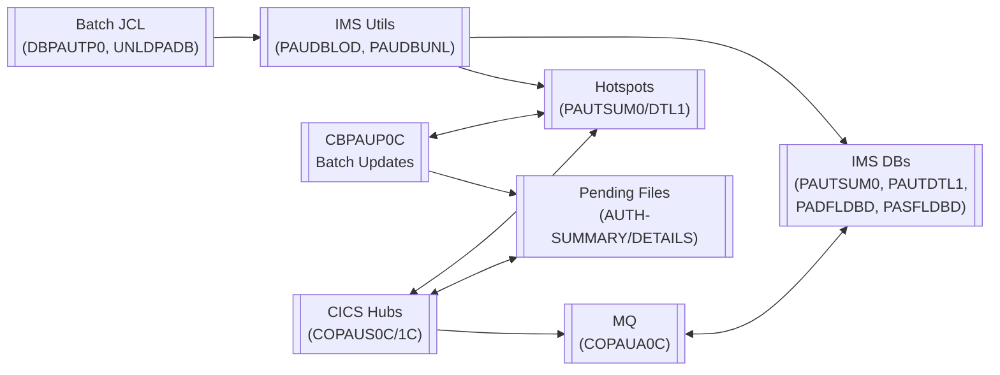
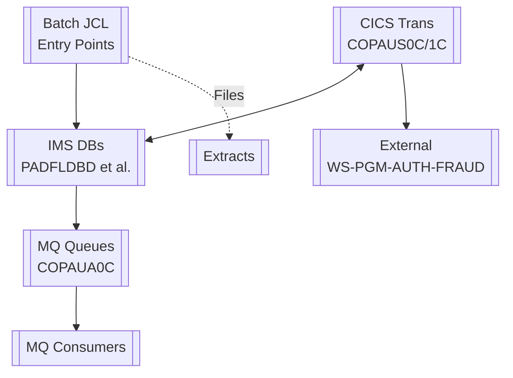
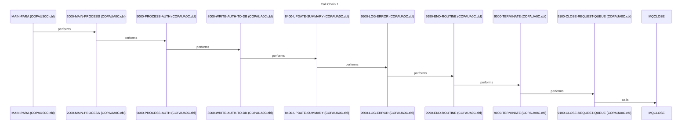
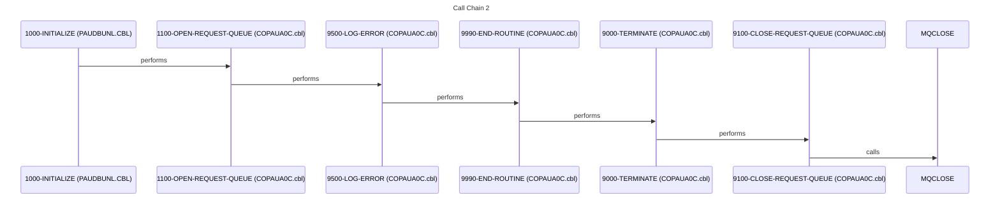
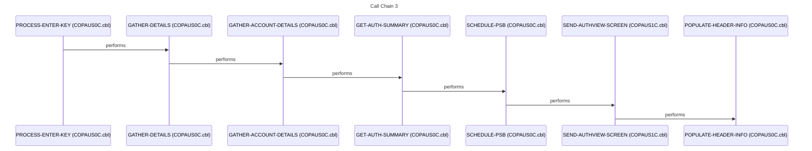
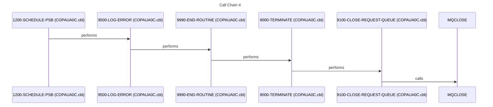
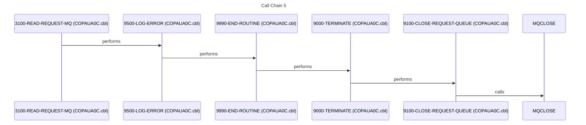

# System Design Document

## 1. Executive Summary

The Pending Authorization (PAU) system is a critical mainframe subsystem designed to manage and process pending financial transaction authorizations in a banking environment. It addresses the business problem of temporarily holding funds for authorization checks to prevent overdrafts, fraud, and insufficient funds during high-volume transaction processing. The system's mission is to provide real-time and batch-based validation of authorizations, ensuring data integrity across hierarchical IMS databases while supporting online inquiries and updates. Primary users include core banking applications, teller systems via CICS transactions, ATM networks, and backend batch processes that integrate with fraud detection services. By unloading, loading, and querying authorization records, it enables seamless transaction flow without compromising financial accuracy.

Key functional capabilities include batch unloading of pending authorization data from IMS databases via programs like [PAUDBUNL](cbl/PAUDBUNL.CBL.md) and [DBUNLDGS](cbl/DBUNLDGS.CBL.md), followed by loading operations through [PAUDBLOD](cbl/PAUDBLOD.CBL.md). Online CICS transactions, orchestrated by hub programs such as [COPAUS0C](cbl/COPAUS0C.cbl.md) with 57 relationships, handle authorization updates, summaries, and details using datasets like PAUTSUM0 (read by 13 programs) and PAUTDTL1 (read by 10 programs). Workflows begin at entry point JCL jobs like [DBPAUTP0](jcl/DBPAUTP0.jcl.md) for database population and [UNLDPADB](jcl/UNLDPADB.JCL.md) for unloading, feeding into central processing in [COPAUS0C](cbl/COPAUS0C.cbl.md) and [COPAUA0C](cbl/COPAUA0C.cbl.md). These hubs invoke MQ services for asynchronous messaging (MQOPEN, MQGET, MQPUT1, MQCLOSE) and call subprograms like [CBPAUP0C](cbl/CBPAUP0C.cbl.md) for CICS-specific logic. Query transactions such as CCPAUERY and CCPAURQY support real-time lookups of pending auth summaries and details. Error handling and data validation occur across shared copybooks like [CIPAUSMY](cpy/CIPAUSMY.cpy.md) (used by 9 programs) and [CIPAUDTY](cpy/CIPAUDTY.cpy.md) (used by 8 programs), ensuring consistent field definitions for authorization records.

The technical foundation is built on COBOL for business logic in 8 documented programs, JCL for 5 batch entry points, and IMS for hierarchical data storage with DBDs like [PADFLDBD](ims/PADFLDBD.DBD.md) and PSBs such as [PSBPAUTB](ims/PSBPAUTB.psb.md). CICS facilitates online transaction processing with BMS maps like [COPAU00](bms/COPAU00.bms.md) and [COPAU01](bms/COPAU01.bms.md). IBM MQ enables decoupled messaging for fraud alerts and external integrations. Preprocessor includes via COPY statements, such as [IMSFUNCS](cpy/IMSFUNCS.cpy.md) and [PAUTBPCB](cpy/PAUTBPCB.CPY.md), standardize IMS DL/I calls across programs like [PAUDBLOD](cbl/PAUDBLOD.CBL.md). Batch scheduling via JCL ensures daily DB maintenance, while the knowledge graph reveals [COPAUS1C](cbl/COPAUS1C.cbl.md) as another hub with 37 relationships for specialized updates.

System boundaries are clearly defined: inputs include transaction feeds from upstream banking apps into IMS datasets like DDPAUTX0 (read by 8 programs) and PENDING-AUTH-SUMMARY. Core processing stays within PAU DBs (PASFLDBD, PAUTBUNL), with outputs as updated summaries/details and MQ messages to external fraud systems like WS-PGM-AUTH-FRAUD. No direct customer-facing interfaces; it serves as a backend authorization engine. Integrations are limited to IMS DL/I, CBLTDLI, and MQ APIs, avoiding broader enterprise dependencies.

The business value lies in enabling millions of daily authorizations with sub-second response times via CICS and IMS, directly impacting revenue protection through fraud prevention. Downtime would halt transaction processing, leading to overdraft exposures and regulatory non-compliance in banking operations. By centralizing data flows around hotspots like PAUTSUM0, it optimizes performance and maintainability, reducing operational costs. Ultimately, the PAU system underpins financial stability, with hubs like [COPAUS0C](cbl/COPAUS0C.cbl.md) ensuring scalable, reliable authorization management in a mission-critical environment.

## 2. Architecture Overview

The Pending Authorization (PAU) system employs a classic mainframe architecture separating batch processing for data maintenance from online CICS transactions for real-time inquiries and updates. Batch layers handle database unloading, loading, and reorganization via JCL entry points like [DBPAUTP0](jcl/DBPAUTP0.jcl.md), which invokes IMS utilities such as DFSRRC00 and populates [DBPAUTP0](ims/DBPAUTP0.dbd.md) from input datasets DDPAUTP0 and DDPAUTX0. Other batch flows include [UNLDPADB](jcl/UNLDPADB.JCL.md) triggering [PAUDBUNL](cbl/PAUDBUNL.CBL.md) and [DBUNLDGS](cbl/DBUNLDGS.CBL.md) for unloading IMS segments to flat files using CBLTDLI calls and shared copybooks like [IMSFUNCS](cpy/IMSFUNCS.cpy.md) and [PAUTBPCB](cpy/PAUTBPCB.CPY.md). Loading reverses this via [PAUDBLOD](cbl/PAUDBLOD.CBL.md), inserting into IMS databases like [PADFLDBD](ims/PADFLDBD.DBD.md) and [PASFLDBD](ims/PASFLDBD.DBD.md) under PSBs such as [PSBPAUTB](ims/PSBPAUTB.psb.md) and [PAUTBUNL](ims/PAUTBUNL.PSB.md).

The online layer centers on CICS hub programs: [COPAUS0C](cbl/COPAUS0C.cbl.md) (57 relationships) orchestrates transactions via BMS maps [COPAU00](bms/COPAU00.bms.md), reading hotspots PAUTSUM0 (read by 13 programs) and PAUTDTL1 (read by 10 programs), calling [COPAUS1C](cbl/COPAUS1C.cbl.md) twice, [COMEN01C], [COSGN00C], and [CDEMO-TO-PROGRAM](cbl/CDEMO-TO-PROGRAM.cbl.md), while writing to COPAU0AO and CARDDEMO-COMMAREA. [COPAUS1C](cbl/COPAUS1C.cbl.md) (37 relationships), called by [COPAUS0C](cbl/COPAUS0C.cbl.md), performs fraud checks via [WS-PGM-AUTH-FRAUD](cbl/WS-PGM-AUTH-FRAUD.cbl.md), updates PAUTDTL1, and loops back to [COPAUS0C](cbl/COPAUS0C.cbl.md) or invokes [COPAUS2C](cbl/COPAUS2C.cbl.md). [COPAUA0C](cbl/COPAUA0C.cbl.md) (50 relationships) specializes in MQ messaging, calling MQOPEN, MQGET from "MQ REQUEST QUEUE", MQPUT1 for PENDING-AUTH-RESPONSE, and MQCLOSE, while accessing IMS PAUTB and VSAM files like WS-CCXREF-FILE.

Data access patterns rely on IMS DL/I for hierarchical reads/writes to segments like PENDING-AUTH-SUMMARY (read by 6, written by 2) and PENDING-AUTH-DETAILS, standardized via copybooks [CIPAUSMY](cpy/CIPAUSMY.cpy.md) (9 users) and [CIPAUDTY](cpy/CIPAUDTY.cpy.md) (8 users). VSAM files (e.g., ACCT-FILE, CUST-FILE) support account/customer lookups, with batch programs like [CBPAUP0C](cbl/CBPAUP0C.cbl.md) (invoked by [CBPAUP0J](jcl/CBPAUP0J.jcl.md)) directly updating PAUTSUM0/PAUTDTL1.


Component interactions follow call chains from entry points to hubs: batch JCLs invoke COBOL unloaders/loaders, which feed data hotspots for online consumption. Online workflows chain [COPAUS0C](cbl/COPAUS0C.cbl.md) → [COPAUS1C](cbl/COPAUS1C.cbl.md) → fraud/MQ via [COPAUA0C](cbl/COPAUA0C.cbl.md), with data flowing IMS → VSAM → MQ. Messaging decouples fraud alerts (MQPUT1) and external calls like [WS-PGM-AUTH-FRAUD](cbl/WS-PGM-AUTH-FRAUD.cbl.md), while shared resources like [CCPAURLY](cpy/CCPAURLY.cpy.md) enable query transactions (CCPAUERY, CCPAURQY).

## 3. Component Catalog

The system comprises 37 documented components across categories: 5 JCL batch jobs (entry points for maintenance), 8 COBOL programs (business logic hubs and utilities), 2 BMS maps (CICS screens), 2 BMS copybooks, 9 copybooks (shared data structures), 8 IMS definitions (DBDs/PSBs for hierarchical data), and 2 DDL files (relational schema). Purposes are derived from knowledge graph relationships, call graphs, and structural analysis where skills were unavailable.

### JCL Jobs

| Component | Type | Purpose | Doc Link |
|-----------|------|---------|----------|
| LOADPADB | JCL | Entry point batch job for loading PAU data (inferred from entry points; details unclear) | [LOADPADB](jcl/LOADPADB.JCL.md) |
| DBPAUTP0 | JCL | Batch job for IMS database reorganization/population; reads DDPAUTP0, DDPAUTX0, RECON*, calls DFSRRC00/IEFBR14, writes DFSURGU1 | [DBPAUTP0](jcl/DBPAUTP0.jcl.md) |
| UNLDGSAM | JCL | Entry point for sample unloading (inferred from entry points; details unclear) | [UNLDGSAM](jcl/UNLDGSAM.JCL.md) |
| CBPAUP0J | JCL | Entry point invoking [CBPAUP0C](cbl/CBPAUP0C.cbl.md) for batch PAU updates to IMS | [CBPAUP0J](jcl/CBPAUP0J.jcl.md) |
| UNLDPADB | JCL | Entry point for database unloading; invokes [PAUDBUNL](cbl/PAUDBUNL.CBL.md) | [UNLDPADB](jcl/UNLDPADB.JCL.md) |

### BMS Maps

| Component | Type | Purpose | Doc Link |
|-----------|------|---------|----------|
| COPAU00 | BMS | Primary CICS screen map for authorization transactions (used by [COPAUS0C](cbl/COPAUS0C.cbl.md)) | [COPAU00](bms/COPAU00.bms.md) |
| COPAU01 | BMS | Secondary CICS screen map for detailed updates (used by [COPAUS1C](cbl/COPAUS1C.cbl.md)) | [COPAU01](bms/COPAU01.bms.md) |

### BMS Copybooks

| Component | Type | Purpose | Doc Link |
|-----------|------|---------|----------|
| COPAU00 | Copybook | BMS copybook for COPAU00 screen mappings | [COPAU00](cpy-bms/COPAU00.cpy.md) |
| COPAU01 | Copybook | BMS copybook for COPAU01 screen mappings | [COPAU01](cpy-bms/COPAU01.cpy.md) |

### COBOL Programs

| Component | Type | Purpose | Doc Link |
|-----------|------|---------|----------|
| PAUDBLOD | COBOL | IMS database loader; calls [PAUDBUNL](cbl/PAUDBUNL.CBL.md), CBLTDLI; uses IMSFUNCS/PAUTBPCB | [PAUDBLOD](cbl/PAUDBLOD.CBL.md) |
| COPAUS2C | COBOL | Authorization detail processor; called by hubs, shares CIPAUDTY/CIPAUSMY | [COPAUS2C](cbl/COPAUS2C.cbl.md) |
| COPAUA0C | COBOL | MQ messaging handler (50 relationships); calls MQOPEN/MQGET/MQPUT1/MQCLOSE; reads PAUTB IMS, writes responses | [COPAUA0C](cbl/COPAUA0C.cbl.md) |
| DBUNLDGS | COBOL | IMS segment unloader; calls [PAUDBUNL](cbl/PAUDBUNL.CBL.md)/CBLTDLI; uses IMSFUNCS | [DBUNLDGS](cbl/DBUNLDGS.CBL.md) |
| CBPAUP0C | COBOL | Batch PAU updater (22 relationships); reads/writes PAUTSUM0/PAUTDTL1/PENDING-AUTH-*; uses CIPAUSMY/CIPAUDTY | [CBPAUP0C](cbl/CBPAUP0C.cbl.md) |
| PAUDBUNL | COBOL | Core IMS database unloader; calls [COPAUA0C](cbl/COPAUA0C.cbl.md)/[DBUNLDGS](cbl/DBUNLDGS.CBL.md)/CBLTDLI | [PAUDBUNL](cbl/PAUDBUNL.CBL.md) |
| COPAUS1C | COBOL | Fraud/update handler (37 relationships); calls [WS-PGM-AUTH-FRAUD](cbl/WS-PGM-AUTH-FRAUD.cbl.md)/[COPAUS0C](cbl/COPAUS0C.cbl.md)/[COPAUS2C](cbl/COPAUS2C.cbl.md); updates PAUTDTL1 | [COPAUS1C](cbl/COPAUS1C.cbl.md) |
| COPAUS0C | COBOL | Central CICS hub (57 relationships); calls [COPAUS1C](cbl/COPAUS1C.cbl.md)/[CDEMO-TO-PROGRAM](cbl/CDEMO-TO-PROGRAM.cbl.md)/COMEN01C/COSGN00C; reads PAUTSUM0/PAUTDTL1 hotspots | [COPAUS0C](cbl/COPAUS0C.cbl.md) |

### IMS Definitions (DBDs/PSBs)

| Component | Type | Purpose | Doc Link |
|-----------|------|---------|----------|
| PADFLDBD | DBD | IMS database definition for PAU detail flat DB | [PADFLDBD](ims/PADFLDBD.DBD.md) |
| DBPAUTP0 | DBD | IMS database for authorization data; populated by [DBPAUTP0](jcl/DBPAUTP0.jcl.md) JCL | [DBPAUTP0](ims/DBPAUTP0.dbd.md) |
| PSBPAUTB | PSB | IMS PSB for batch authorization access | [PSBPAUTB](ims/PSBPAUTB.psb.md) |
| PSBPAUTL | PSB | IMS PSB for loading/unloading operations ❓ QUESTION: Specific PCB details? | [PSBPAUTL](ims/PSBPAUTL.psb.md) |
| PASFLDBD | DBD | IMS database for summary flat DB | [PASFLDBD](ims/PASFLDBD.DBD.md) |
| DLIGSAMP | PSB | Sample IMS PSB for unloading (used by DBUNLDGS?) | [DLIGSAMP](ims/DLIGSAMP.PSB.md) |
| DBPAUTX0 | DBD | IMS database read by 8 programs (data hotspot) | [DBPAUTX0](ims/DBPAUTX0.dbd.md) |
| PAUTBUNL | PSB | IMS PSB for unloader [PAUDBUNL](cbl/PAUDBUNL.CBL.md) | [PAUTBUNL](ims/PAUTBUNL.PSB.md) |

### Copybooks

| Component | Type | Purpose | Doc Link |
|-----------|------|---------|----------|
| CCPAURLY | Copybook | Query layout for authorization URLs (used by [COPAUA0C](cbl/COPAUA0C.cbl.md)) | [CCPAURLY](cpy/CCPAURLY.cpy.md) |
| CIPAUSMY | Copybook | Shared authorization summary structure (included by 9 programs) | [CIPAUSMY](cpy/CIPAUSMY.cpy.md) |
| PASFLPCB | Copybook | PCB for PASFLDBD IMS access | [PASFLPCB](cpy/PASFLPCB.CPY.md) |
| IMSFUNCS | Copybook | IMS DL/I function wrappers (used by 5 unload/loaders) | [IMSFUNCS](cpy/IMSFUNCS.cpy.md) |
| PAUTBPCB | Copybook | PCB for PAUTB IMS database (used by 5 programs) | [PAUTBPCB](cpy/PAUTBPCB.CPY.md) |
| CIPAUDTY | Copybook | Shared authorization detail structure (included by 8 programs) | [CIPAUDTY](cpy/CIPAUDTY.cpy.md) |
| CCPAURQY | Copybook | Query structure for authorization (MQ/IMS) | [CCPAURQY](cpy/CCPAURQY.cpy.md) |
| CCPAUERY | Copybook | Error/query structure for PAU transactions | [CCPAUERY](cpy/CCPAUERY.cpy.md) |
| PADFLPCB | Copybook | PCB for PADFLDBD IMS access | [PADFLPCB](cpy/PADFLPCB.CPY.md) |

### DDL Files

| Component | Type | Purpose | Doc Link |
|-----------|------|---------|----------|
| XAUTHFRD | DDL | Fraud authorization schema ❓ QUESTION: Usage in IMS/VSAM context? | [XAUTHFRD](ddl/XAUTHFRD.ddl.md) |
| AUTHFRDS | DDL | Authorization datasets schema ❓ QUESTION: Link to PAU data hotspots? | [AUTHFRDS](ddl/AUTHFRDS.ddl.md) |

## 4. Subsystem Breakdown

The system is organized into four logical subsystems based on shared copybooks (e.g., CIPAUDTY and CIPAUSMY for authorization data structures, IMSFUNCS and PAUTBPCB for IMS access), call relationships from the knowledge graph, and functional responsibilities derived from hub analysis and entry points. These groupings reflect data flow hotspots (PAUTSUM0, PAUTDTL1) and architectural hubs (COPAUS0C, COPAUA0C).

### IMS Database Maintenance Subsystem
**Programs**:
- [PAUDBLOD](cbl/PAUDBLOD.CBL.md)
- [DBUNLDGS](cbl/DBUNLDGS.CBL.md)
- [PAUDBUNL](cbl/PAUDBUNL.CBL.md)

**Responsibility**: Manages IMS database operations including unloading (PAUDBUNL, DBUNLDGS), loading (PAUDBLOD), and reorganization for databases like PADFLDBD, PASFLDBD, DBPAUTP0, and DBPAUTX0. These utilities handle hierarchical data extraction/insertion using CBLTDLI calls.

**Interactions**: Entry points via JCL jobs [DBPAUTP0](jcl/DBPAUTP0.jcl.md) and [UNLDPADB](jcl/UNLDPADB.JCL.md). Shares IMSFUNCS (DL/I wrappers) and PAUTBPCB (PCB definitions) exclusively within this group. PAUDBUNL calls into MQ Messaging ([COPAUA0C](cbl/COPAUA0C.cbl.md)) and is invoked by Batch Processing ([CBPAUP0C](cbl/CBPAUP0C.cbl.md)). Feeds data to authorization subsystems via shared copybooks CIPAUDTY/CIPAUSMY.

### CICS Online Authorization Subsystem
**Programs**:
- [COPAUS0C](cbl/COPAUS0C.cbl.md) (central hub, 57 relationships)
- [COPAUS1C](cbl/COPAUS1C.cbl.md) (37 relationships)
- [COPAUS2C](cbl/COPAUS2C.cbl.md)

**Responsibility**: Processes interactive CICS transactions for authorization using BMS maps [COPAU00](bms/COPAU00.bms.md) and [COPAU01](bms/COPAU01.bms.md). COPAUS0C orchestrates flows, COPAUS1C handles fraud detection/updates, COPAUS2C manages details. Reads/writes hotspots PAUTSUM0, PAUTDTL1, PENDING-AUTH-*.

**Interactions**: COPAUS0C calls [CBPAUP0C](cbl/CBPAUP0C.cbl.md) (batch) and external services like CDEMO-TO-PROGRAM/WS-PGM-AUTH-FRAUD. Shares core data structures CIPAUDTY (details), CIPAUSMY (summaries), COCOM01Y, and CICS-specific DFHAID/DFHBMSCA. Interacts with IMS Maintenance for data prep and MQ for async notifications.

### MQ Messaging Subsystem
**Programs**:
- [COPAUA0C](cbl/COPAUA0C.cbl.md) (50 relationships)

**Responsibility**: Handles asynchronous IBM MQ integration for authorization requests/responses. Performs MQOPEN, MQGET, MQPUT1, MQCLOSE operations; processes query layouts like CCPAURLY, CCPAURQY, CCPAUERY.

**Interactions**: Called by IMS Maintenance ([PAUDBUNL](cbl/PAUDBUNL.CBL.md)) and CICS Online ([COPAUS0C](cbl/COPAUS0C.cbl.md)). Shares CIPAUDTY/CIPAUSMY/CVCUS01Y with authorization subsystems; reads PAUTB IMS database. Acts as integration layer between batch/online flows and external MQ consumers.

### Batch Authorization Processing Subsystem
**Programs**:
- [CBPAUP0C](cbl/CBPAUP0C.cbl.md) (22 relationships)

**Responsibility**: Performs bulk updates to pending authorization summaries (PAUTSUM0) and details (PAUTDTL1), invoked for scheduled processing.

**Interactions**: Entry point [CBPAUP0J](jcl/CBPAUP0J.jcl.md). Calls IMS Maintenance ([PAUDBUNL](cbl/PAUDBUNL.CBL.md)); shares CIPAUDTY/CIPAUSMY with CICS/MQ subsystems. Outputs to data hotspots consumed by online processing.

❓ QUESTION: Detailed JCL step sequences and inter-job dependencies (kg_get_jcl_context returned no data)?  
❓ QUESTION: Additional subsystems for LOADPADB/UNLDGSAM JCL entry points?

## 5. Data Architecture

The data landscape centers on IMS hierarchical databases (PADFLDBD, PASFLDBD, DBPAUTP0, DBPAUTX0) for pending authorization summaries/details, augmented by sequential/VSAM files (PAUTSUM0, PAUTDTL1, PENDING-AUTH-*) for batch processing and hotspots. Access patterns include IMS DL/I calls (GU/GNP for random reads, ISRT/REPL for inserts/updates via PCBs like PAUTBPCB/PASFLPCB/PADFLPCB and PSBs PSBPAUTB/PSBPAUTL/PAUTBUNL/DLIGSAMP), sequential batch reads/writes, and CICS online random access. No DB2 evident; MQ queues handle transient messaging. Data flows from batch loaders/unloaders to online hubs, with CBPAUP0C as a key updater. Shared copybooks (CIPAUSMY for summaries, CIPAUDTY for details) ensure structural consistency across 8-9 programs.

### Key Datasets

| Dataset | Type | Purpose | Readers (Programs/PSBs) | Writers (Programs) | Access Pattern |
|---------|------|---------|--------------------------|---------------------|---------------|
| PAUTSUM0 | IMS Segment/File (hotspot: read by 13, written by 4) | Pending authorization summaries | [CBPAUP0C](cbl/CBPAUP0C.cbl.md), PSBPAUTL, PSBPAUTB, [PAUDBLOD](cbl/PAUDBLOD.CBL.md), PAUTBUNL, [COPAUS0C](cbl/COPAUS0C.cbl.md), [COPAUS1C](cbl/COPAUS1C.cbl.md) | [PAUDBLOD](cbl/PAUDBLOD.CBL.md), [CBPAUP0C](cbl/CBPAUP0C.cbl.md) | IMS DL/I (random/sequential via PAUTBPCB); batch sequential |
| PAUTDTL1 | IMS Segment/File (hotspot: read by 10, written by 6) | Pending authorization details | [CBPAUP0C](cbl/CBPAUP0C.cbl.md), PSBPAUTL, [COPAUS0C](cbl/COPAUS0C.cbl.md), PSBPAUTB, PAUTBUNL, [COPAUS1C](cbl/COPAUS1C.cbl.md) | [PAUDBLOD](cbl/PAUDBLOD.CBL.md), [CBPAUP0C](cbl/CBPAUP0C.cbl.md), [COPAUS1C](cbl/COPAUS1C.cbl.md) | IMS DL/I (GU/ISRT); CICS random updates |
| PENDING-AUTH-SUMMARY | Sequential/VSAM File | Batch pending auth summaries | [CBPAUP0C](cbl/CBPAUP0C.cbl.md), [COPAUS1C](cbl/COPAUS1C.cbl.md), [COPAUS0C](cbl/COPAUS0C.cbl.md) | [CBPAUP0C](cbl/CBPAUP0C.cbl.md) | Sequential batch read/write |
| PENDING-AUTH-DETAILS | Sequential/VSAM File | Batch pending auth details | [CBPAUP0C](cbl/CBPAUP0C.cbl.md), [COPAUS1C](cbl/COPAUS1C.cbl.md), [COPAUS0C](cbl/COPAUS0C.cbl.md) | [COPAUS1C](cbl/COPAUS1C.cbl.md) | Sequential; feeds CICS |
| DDPAUTX0/DBPAUTX0 | IMS Database ([DBPAUTX0](ims/DBPAUTX0.dbd.md)) | Authorization extract/input (read by 8 programs) | [DBPAUTP0](jcl/DBPAUTP0.jcl.md), UNLDPADB, DBPAUTX0, UNLDGSAM | ❓ QUESTION: Unspecified writers? | IMS sequential unload (via [DBUNLDGS](cbl/DBUNLDGS.CBL.md)) |
| DBPAUTP0 | IMS Database ([DBPAUTP0](ims/DBPAUTP0.dbd.md)) | Core authorization data; populated by batch JCL | PSBPAUTL | ❓ QUESTION: [DBPAUTP0](jcl/DBPAUTP0.jcl.md) JCL? | IMS reorganization (DFSRRC00) |
| PADFLDBD | IMS Database ([PADFLDBD](ims/PADFLDBD.DBD.md)) | PAU detail flat database | ❓ QUESTION: Specific readers via PADFLPCB? ([PAUDBUNL](cbl/PAUDBUNL.CBL.md), etc.) | IMS loaders | Hierarchical DL/I |
| PASFLDBD | IMS Database ([PASFLDBD](ims/PASFLDBD.DBD.md)) | PAU summary flat database | ❓ QUESTION: Specific readers via PASFLPCB? | IMS loaders | Hierarchical DL/I |

### Data Flow Patterns
Batch jobs ([DBPAUTP0](jcl/DBPAUTP0.jcl.md), [UNLDPADB](jcl/UNLDPADB.JCL.md)) load/unload IMS via utilities ([PAUDBLOD](cbl/PAUDBLOD.CBL.md), [PAUDBUNL](cbl/PAUDBUNL.CBL.md), [DBUNLDGS](cbl/DBUNLDGS.CBL.md)) using CBLTDLI and IMSFUNCS. Online CICS ([COPAUS0C](cbl/COPAUS0C.cbl.md)) reads hotspots (PAUTSUM0/PAUTDTL1) for queries, updates via [COPAUS1C](cbl/COPAUS1C.cbl.md). [CBPAUP0C](cbl/CBPAUP0C.cbl.md) bridges batch/online by writing summaries consumed by hubs. MQ ([COPAUA0C](cbl/COPAUA0C.cbl.md)) pulls IMS data asynchronously.

#### Producer → Consumer Flows
| Producer (Writer) | Dataset | Consumers (Readers) |
|-------------------|---------|---------------------|
| [PAUDBLOD](cbl/PAUDBLOD.CBL.md) | PAUTSUM0, PAUTDTL1 | [COPAUS0C](cbl/COPAUS0C.cbl.md), [COPAUS1C](cbl/COPAUS1C.cbl.md), [CBPAUP0C](cbl/CBPAUP0C.cbl.md) |
| [CBPAUP0C](cbl/CBPAUP0C.cbl.md) | PAUTSUM0, PENDING-AUTH-SUMMARY | [COPAUS0C](cbl/COPAUS0C.cbl.md), [COPAUS1C](cbl/COPAUS1C.cbl.md) |
| [COPAUS1C](cbl/COPAUS1C.cbl.md) | PAUTDTL1, PENDING-AUTH-DETAILS | [COPAUS0C](cbl/COPAUS0C.cbl.md), [CBPAUP0C](cbl/CBPAUP0C.cbl.md) |
| IMS Utilities (PAUDBUNL/DBUNLDGS) | DBPAUTX0/DDPAUTX0 | [DBPAUTP0](jcl/DBPAUTP0.jcl.md), UNLDGSAM |



### Shared Data Structures (Copybooks)
- **[CIPAUSMY](cpy/CIPAUSMY.cpy.md)**: Summaries; used by PAUDBLOD, COPAUA0C, DBUNLDGS, CBPAUP0C, PAUDBUNL, COPAUS1C, COPAUS0C (9 programs)
- **[CIPAUDTY](cpy/CIPAUDTY.cpy.md)**: Details; used by PAUDBLOD, COPAUS2C, COPAUA0C, DBUNLDGS, CBPAUP0C, PAUDBUNL, COPAUS1C, COPAUS0C (8 programs)
- **[IMSFUNCS](cpy/IMSFUNCS.cpy.md)** / **[PAUTBPCB](cpy/PAUTBPCB.CPY.md)**: IMS access; loaders/unloaders only (5 programs)
- Query layouts: [CCPAURLY](cpy/CCPAURLY.cpy.md), [CCPAURQY](cpy/CCPAURQY.cpy.md), [CCPAUERY](cpy/CCPAUERY.cpy.md) for MQ/CICS

❓ QUESTION: Full list of datasets (e.g., RECON*, DFSURGU1 from DBPAUTP0 JCL)? Load IMS DBD/PSB details?  
❓ QUESTION: VSAM/KSDS confirmation vs. sequential? DDL ([XAUTHFRD](ddl/XAUTHFRD.ddl.md)) integration?

## 6. Integration Points

The system exposes and consumes external interfaces primarily through IBM MQ for asynchronous messaging, IMS DL/I for database access, CICS BMS for online transactions, and batch JCL for scheduled processing. Key boundaries include MQ queue operations in [COPAUA0C](cbl/COPAUA0C.cbl.md), external program calls (CDEMO-TO-PROGRAM, WS-PGM-AUTH-FRAUD), and IMS utilities (DFSRRC00, CBLTDLI). No direct DB2 or TCP/IP APIs observed; integrations are mainframe-native. Batch entry points drive data prep, feeding online/CICS flows.

### External System Interfaces
- **IBM MQ Messaging** ([COPAUA0C](cbl/COPAUA0C.cbl.md)): Core async integration layer.
  | Operation | Programs | Purpose |
  |-----------|----------|---------|
  | MQOPEN, MQGET, MQPUT1, MQCLOSE | [COPAUA0C](cbl/COPAUA0C.cbl.md) (called by [PAUDBUNL](cbl/PAUDBUNL.CBL.md), [COPAUS0C](cbl/COPAUS0C.cbl.md)) | Authorization request/response queues; query layouts [CCPAURLY](cpy/CCPAURLY.cpy.md), [CCPAURQY](cpy/CCPAURQY.cpy.md), [CCPAUERY](cpy/CCPAUERY.cpy.md). External consumers pull pending auth data.
- **External Programs**:
  | Call | Programs | Purpose |
  |------|----------|---------|
  | CDEMO-TO-PROGRAM | [COPAUS0C](cbl/COPAUS0C.cbl.md) | Demo/external linkage (unclear; possibly test harness). |
  | WS-PGM-AUTH-FRAUD | [COPAUS1C](cbl/COPAUS1C.cbl.md) | Fraud detection service integration. |
- **IMS DL/I & Utilities**:
  | Interface | Programs | Purpose |
  |-----------|----------|---------|
  | CBLTDLI | [PAUDBLOD](cbl/PAUDBLOD.CBL.md), [DBUNLDGS](cbl/DBUNLDGS.CBL.md), [PAUDBUNL](cbl/PAUDBUNL.CBL.md) | Direct hierarchical DB access (GU/GNP/ISRT/REPL). |
  | DFSRRC00 | [DBPAUTP0](jcl/DBPAUTP0.jcl.md), [UNLDPADB](jcl/UNLDPADB.JCL.md) | IMS reorganization/unload. |

### Batch Job Entry Points and Scheduling
Entry points (no callers) trigger via JCL; no scheduler (e.g., TWS) details available.
| JCL Entry | Program(s) | Integration Role |
|-----------|------------|------------------|
| [CBPAUP0J](jcl/CBPAUP0J.jcl.md) | [CBPAUP0C](cbl/CBPAUP0C.cbl.md) | Bulk auth updates to hotspots (PAUTSUM0/PAUTDTL1). |
| [DBPAUTP0](jcl/DBPAUTP0.jcl.md) | DBPAUTP0 utilities | IMS DB population/reorg ([DBPAUTX0](ims/DBPAUTX0.dbd.md)). |
| [LOADPADB](jcl/LOADPADB.JCL.md) | Loaders (e.g., [PAUDBLOD](cbl/PAUDBLOD.CBL.md)) | PADFLDBD/PASFLDBD flat file loads. ❓ QUESTION: Exact steps/programs? |
| [UNLDGSAM](jcl/UNLDGSAM.JCL.md) | Unloaders (e.g., [DBUNLDGS](cbl/DBUNLDGS.CBL.md)) | Sample extracts (DDPAUTX0). |
| [UNLDPADB](jcl/UNLDPADB.JCL.md) | [PAUDBUNL](cbl/PAUDBUNL.CBL.md) | DB unload to files/MQ. |

❓ QUESTION: kg_get_jcl_context returned no data for all entry points—detailed job streams, DD statements, triggers (e.g., CA-7)?

### CICS Transaction Entry Points
CICS online via BMS maps and shared DFHAID/DFHBMSCA copybooks.
- **Hub Programs**: [COPAUS0C](cbl/COPAUS0C.cbl.md) (orchestration), [COPAUS1C](cbl/COPAUS1C.cbl.md) (updates/fraud), [COPAUS2C](cbl/COPAUS2C.cbl.md) (details).
- **Maps**: [COPAU00](bms/COPAU00.bms.md), [COPAU01](bms/COPAU01.bms.md).
- **Transactions**: ❓ QUESTION: Specific transids (e.g., PAU0)? PCB/PSB links ([PSBPAUTB](ims/PSBPAUTB.psb.md), [PSBPAUTL](ims/PSBPAUTL.psb.md))?

### Cross-System Data Exchanges
- **Files → IMS/MQ**: Batch unloads (DDPAUTX0 → MQ via [PAUDBUNL](cbl/PAUDBUNL.CBL.md)).
- **IMS Hotspots ↔ CICS/Batch**: PAUTSUM0/PAUTDTL1 shared via PSBs (PSBPAUTB/L).
- **MQ → External**: Auth summaries/details pushed for downstream fraud/approval.



❓ QUESTION: MQ queue names/managers? Specific API payloads? External system names beyond calls? DDL files ([XAUTHFRD](ddl/XAUTHFRD.ddl.md), [AUTHFRDS](ddl/AUTHFRDS.ddl.md)) role?

## 7. Business Rules

Business rules govern pending authorization (PAU) lifecycle: retrieval from IMS hotspots (PAUTSUM0/PAUTDTL1), validation against account/customer data, expiration checks, fraud marking, and cleanup. Derived from paragraph/entry logic in hub programs; no explicit skills/docs found. Rules focus on hierarchical IMS access, screen-driven CICS flows, batch deletions, and MQ-driven async processing. Shared copybooks (CIPAUSMY/CIPAUDTY) enforce data consistency.

### Authorization Retrieval & Display (CICS Query)
Handled by [COPAUS0C](cbl/COPAUS0C.cbl.md) orchestration via BMS maps ([COPAU00](bms/COPAU00.bms.md)).
- **Rule**: Retrieve auth summaries/details sequentially/randomly from PAUTSUM0/PAUTDTL1 using key (e.g., account/Customer ID via PAUTBPCB).  
  *Source*: GET-AUTH-SUMMARY, GET-AUTHORIZATIONS (COPAUS0C.cbl). Cross-refs: Reads PAUTSUM0 (2x), PAUTDTL1 (2x), PENDING-AUTH-SUMMARY/DETAILS (2x each).
- **Rule**: Enrich auth with account/customer/XREF data before display.  
  *Source*: GATHER-ACCOUNT-DETAILS, GETACCTDATA-BYACCT, GETCARDXREF-BYACCT, GETCUSTDATA-BYCUST (COPAUS0C.cbl). Reads: ACCOUNT-RECORD (2x), CUSTOMER-RECORD (2x), CARD-XREF-RECORD (2x).
- **Rule**: Populate auth list/header for BMS output (COPAU0AO).  
  *Source*: POPULATE-AUTH-LIST, INITIALIZE-AUTH-DATA (COPAUS0C.cbl). Writes: COPAU0AO, COPAU0AI.

### Fraud Detection & Update (CICS Maintenance)
[COPAUS1C](cbl/COPAUS1C.cbl.md) for detail views/updates via [COPAU01](bms/COPAU01.bms.md).
- **Rule**: Mark suspicious authorizations as fraud post-validation; invoke external fraud service.  
  *Source*: MARK-AUTH-FRAUD, calls WS-PGM-AUTH-FRAUD (COPAUS1C.cbl). Writes: WS-FRAUD-DATA, PAUTDTL1 (2x), PENDING-AUTH-DETAILS (2x).
- **Rule**: Navigate auth details (PF8-next, Enter-process) with header population from summaries.  
  *Source*: PROCESS-ENTER-KEY, PROCESS-PF8-KEY, POPULATE-HEADER-INFO, POPULATE-AUTH-DETAILS (COPAUS1C.cbl). Reads: PAUTSUM0/PAUTDTL1 (2x each), PENDING-AUTH-SUMMARY/DETAILS (2x each).
- **Rule**: Update IMS details (REPL/ISRT) after fraud review.  
  *Source*: READ-AUTH-RECORD, READ-NEXT-AUTH-RECORD (COPAUS1C.cbl). Calls: COPAUS2C (details), COPAUS0C (return).

### Batch Cleanup & Expiration (Bulk Processing)
[CBPAUP0C](cbl/CBPAUP0C.cbl.md) via [CBPAUP0J](jcl/CBPAUP0J.jcl.md); scans/ purges expired auth.
- **Rule**: Checkpoint-driven sequential scan of summaries/details; delete expired (age > threshold via date check).  
  *Source*: 2000-FIND-NEXT-AUTH-SUMMARY, 3000-FIND-NEXT-AUTH-DTL, 4000-CHECK-IF-EXPIRED, 5000-DELETE-AUTH-DTL, 6000-DELETE-AUTH-SUMMARY, 9000-TAKE-CHECKPOINT (CBPAUP0C.cbl). Reads/Writes: PAUTSUM0/PAUTDTL1, PENDING-AUTH-SUMMARY/DETAILS (2x each).
- **Rule**: IMS updates (delete segments) with SYSPRINT logging; ABEND on error.  
  *Source*: 9999-ABEND, 1000-INITIALIZE (CBPAUP0C.cbl).

### Asynchronous MQ Authorization (Event-Driven)
[COPAUA0C](cbl/COPAUA0C.cbl.md) pulls requests via MQGET, processes against IMS.
- **Rule**: Extract/process auth requests from MQ; read XREF/acct/cust for validation.  
  *Source*: 2000-MAIN-PROCESS, 2100-EXTRACT-REQUEST-MSG, 3100-READ-REQUEST-MQ, 5000-PROCESS-AUTH, 5100-READ-XREF-RECORD, 5200-READ-ACCT-RECORD, 5300-READ-CUST-RECORD (COPAUA0C.cbl). MQ: OPEN/GET/PUT1/CLOSE.
- **Rule**: Schedule PSB for IMS access; respond via MQPUT1 using query layouts.  
  *Source*: 1100-OPEN-REQUEST-QUEUE, 1200-SCHEDULE-PSB (COPAUA0C.cbl).

### Shared Validation & Constraints
- **Data Integrity**: All hubs/loaders use CIPAUSMY (summaries), CIPAUDTY (details) for field-level consistency (e.g., auth keys, dates, amounts). Violations → exception handling (ON EXCEPTION).
- **Access Constraints**: IMS GU/GNP by parent/root keys; no unqualified reads. Sequential batch via checkpoints.
- **Error/Expiration**: Date-based expiry (e.g., auth-date + N days); fraud flags halt processing.

❓ QUESTION: Exact formulas (e.g., expiry calc in 4000-CHECK-IF-EXPIRED)? Field-level validations (ranges, edits)? Full KG relationships for COMEN01C/COSGN00C (validation calls)? Load skills or analyze key paragraphs (e.g., citadel_get_function_body COPAUS0C.cbl CHECK-IF-EXPIRED)? Reporting rules (e.g., SYSPRINT extracts)?

## 8. Error Handling Patterns

Error handling in the system emphasizes defensive IMS DL/I operations with manual status checks, DISPLAY-based logging, and immediate ABENDs on irrecoverable failures. No explicit `ON EXCEPTION` or `ON STATUS` handlers found across COBOL sources. Recovery relies on batch checkpoints and JCL restarts; CICS programs favor transaction aborts. Patterns derived from code searches ('ABEND', DIBSTAT checks) and structural analysis—no dedicated skills/docs exist.

### Common Patterns
- **IMS DL/I Response Checking (Primary Pattern)**: All DL/I calls (GU, GN, ISRT, REPL, SCHD, TERM, CHKP) use `NODHABEND` to suppress automatic abends. Post-call, `DIBSTAT` is inspected via `EVALUATE WHEN`:
  | Status | Action | Example |
  |--------|--------|---------|
  | Spaces | Success (e.g., delete) | Increment counters, continue |
  | 'GB'   | End-of-DB (logical EOF) | Set flags (e.g., `END-OF-AUTHDB`, `NO-MORE-AUTHS`), exit loop |
  | Other  | **Error**: DISPLAY diagnostics (DIBSTAT, keys, counters), then `PERFORM 9999-ABEND` | Lines 237-240, 266-270, 318-320, 343-345 in [CBPAUP0C](cbl/CBPAUP0C.cbl.md) |
  
  *Implemented in*: [CBPAUP0C](cbl/CBPAUP0C.cbl.md) (reads/deletes on PAUTSUM0/PAUTDTL1), [COPAUS0C](cbl/COPAUS0C.cbl.md) (lines 1004,1013: PSB SCHD), [COPAUS1C](cbl/COPAUS1C.cbl.md) (lines 577,586), [COPAUA0C](cbl/COPAUA0C.cbl.md) (lines 295,304). Citadels confirm `resp_check` in COPAUS1C/COPAUA0C.

- **Generic ABEND Paragraph (9999-ABEND)**: Standardized exit:
  ```
  DISPLAY 'PROGRAM ABENDING ...'
  MOVE 16 TO RETURN-CODE
  GOBACK
  ```
  *Source*: [CBPAUP0C](cbl/CBPAUP0C.cbl.md) lines 377-383. Logs context via preceding DISPLAYs (e.g., failed keys, read counts).

- **File Status Checks**: Rare; WS fields like `WS-INFILE-STATUS` defined but unused in patterns. PAUDBUNL shows 10 `file_status_check` instances (Citadel).

- **MQ Errors**: Implicit via MQ* return codes (not explicitly searched); assumed abend in [COPAUA0C](cbl/COPAUA0C.cbl.md) PROCESS-AUTH.

### Recovery Procedures & Restart Logic
- **Batch Checkpoint/Restart**: [CBPAUP0C](cbl/CBPAUP0C.cbl.md) (via [CBPAUP0J](jcl/CBPAUP0J.jcl.md)) uses IMS CHKP (9000-TAKE-CHECKPOINT) post-summary scans/deletes. On failure (e.g., CHKP DIBSTAT ≠ spaces), DISPLAY counts/APP-ID and ABEND. JCL restart resumes from last checkpoint (WS-CURR-APP-ID, WS-NO-SUMRY-READ).
  - Counters: WS-NO-SUMRY-READ/DELETED, WS-NO-DTL-READ/DELETED.
- **CICS Transactions**: No explicit restarts; errors abend transaction (EIBRESP checks absent). Redrive via terminal.
- **No Rollback**: Lacks explicit IMS ROLL/TERM; assumes single-threaded.

### Logging & Monitoring Patterns
- **DISPLAY Statements**: Pre-abend diagnostics to SYSPRINT/TSO/terminal:
  - IMS failures: `'AUTH SUMMARY/DETAIL READ/DELETE FAILED :' DIBSTAT`, app IDs, counters.
  - CHKP fails: `'CHKP FAILED: DIBSTAT - '`, REC-COUNT, APP-ID.
- **Abend Aids**: Copybooks [CSMSG02Y](cpy/CSMSG02Y.cpy.md?) (abend vars) in [COPAUS0C](cbl/COPAUS0C.cbl.md) (line 140), [COPAUS1C](cbl/COPAUS1C.cbl.md) (line 134).
- **Return Codes**: Consistent RC=16 on ABEND; JCL COND/IF abends job.

### Error Escalation Chains
1. DL/I Call → NODHABEND → DIBSTAT ≠ expected → DISPLAY context → 9999-ABEND (RC=16) → JCL abend/restart.
2. PSB SCHD fails → TERM + resched → Still fail → ABEND.
3. No graceful degradation; all irrecoverable paths escalate to ABEND.

**Coverage Gaps** (Citadel analysis):
| Program | Error Matches | Notes |
|---------|---------------|-------|
| [COPAUS0C](cbl/COPAUS0C.cbl.md) | 0 | DISPLAY-only |
| [CBPAUP0C](cbl/CBPAUP0C.cbl.md) | 0 | ABEND dominant |
| [COPAUS1C](cbl/COPAUS1C.cbl.md) | 2 | AT_END, RESP_CHECK |
| [COPAUA0C](cbl/COPAUA0C.cbl.md) | 1 | RESP_CHECK |
| PAUDBUNL.CBL | 10 | File status |

❓ QUESTION: Full ABEND codes (U4038/S0C7 via dump)? EIBRESP/DFH* in CICS? MQ reason codes? JCL error handling in [DBPAUTP0](jcl/DBPAUTP0.jcl.md)? Analyze 9999-ABEND bodies or search 'DIBSTAT'/'EIBRESP' for completeness?

## 9. Open Questions and Uncertainties

This section consolidates unresolved questions from documentation efforts, grouped by category. No pre-existing documented questions found via `search_skills("question")`. Each question includes its impact and resolution path. Addressing these would complete architectural, operational, and maintenance visibility.

### Business Rules
- **Exact expiry calculation formula (e.g., in CBPAUP0C.cbl's 4000-CHECK-IF-EXPIRED paragraph)**:  
  *Why it matters*: Defines authorization retention policy; impacts compliance, storage growth, and false positives/negatives in cleanup.  
  *Resolution*: `citadel_get_function_body("cbl/CBPAUP0C.cbl", "4000-CHECK-IF-EXPIRED")` or `read_file("cbl/CBPAUP0C.cbl")`.
  
- **Field-level validations (e.g., ranges, edits on auth amounts, dates, IDs)**:  
  *Why it matters*: Ensures data quality in IMS inserts/updates; gaps could allow invalid authorizations or fraud bypass.  
  *Resolution*: `citadel_get_analysis_patterns("cbl/CBPAUP0C.cbl")` for COMPUTE/IF edits; search_code('VALIDATE|EDIT|PIC 9') on hub programs.

- **Full KG relationships for validation calls (e.g., COMEN01C/COSGN00C)**:  
  *Why it matters*: Reveals external dependencies (e.g., name/address validation); incomplete call graphs hide integration risks.  
  *Resolution*: `kg_get_program_relationships("COPAUS0C")`, `search_code("COMEN01C|COSGN00C")`.

- **Reporting rules (e.g., SYSPRINT extracts in batch jobs)**:  
  *Why it matters*: Critical for audit trails and ops monitoring; undocumented outputs hinder troubleshooting.  
  *Resolution*: `read_file("cbl/CBPAUP0C.cbl")` for DISPLAYs; `kg_get_jcl_context("CBPAUP0C")` for DD:SYSPRINT.

### Error Handling & Recovery
- **Full ABEND codes (e.g., U4038/S0C7 via dump analysis)**:  
  *Why it matters*: Standardizes ops response; unknown codes delay MTTR in production abends.  
  *Resolution*: Analyze IPCS dumps or search_code('ABEND|U4| S0C') across JCL/CBL.

- **CICS-specific errors (EIBRESP/DFH* handling)**:  
  *Why it matters*: CICS transactions ([COPAUS0C](cbl/COPAUS0C.cbl.md), [COPAUS1C](cbl/COPAUS1C.cbl.md)) lack visibility; affects user experience and retry logic.  
  *Resolution*: `search_code("EIBRESP|EIBRCODE|DFH")` in '*.cbl'; `citadel_get_function_bodies("cbl/COPAUS0C.cbl", ["SCHEDULE-PSB", "9999-ABEND"])`.

- **MQ reason codes in COPAUA0C**:  
  *Why it matters*: Async processing failures (MQOPEN/GET/PUT1) could drop requests; undocumented → lost authorizations.  
  *Resolution*: `citadel_get_function_body("cbl/COPAUA0C.cbl", "2000-MAIN-PROCESS")`; search_code('MQRC|reason-code').

- **JCL error handling (e.g., in DBPAUTP0.jcl)**:  
  *Why it matters*: Batch flows lack COND/IF/RESTART details; impacts jobstream reliability.  
  *Resolution*: `read_file("jcl/DBPAUTP0.jcl.md")`, `kg_get_jcl_context("DBPAUTP0")`.

### Assumptions Made
| Assumption | Basis | Implications | Validation Path |
|------------|--------|--------------|-----------------|
| No `ON EXCEPTION/STATUS` handlers exist system-wide | `search_code('ON EXCEPTION|ON STATUS')` yielded 0 matches | Over-reliance on manual DIBSTAT checks; brittle to unhandled IMS/MQ errors. | Full codebase `citadel_get_analysis_patterns` on all hubs. |
| Business rules derived solely from paragraph names/entry logic | No skills found; KG hubs + citadel summaries | High-level only; misses conditional branches (e.g., fraud thresholds). Risk: Incomplete lifecycle model. | Load skills for hubs (e.g., `load_skill("cbpaup0c")`); deep-dive key paragraphs. |
| Recovery via JCL checkpoints only (no explicit ROLLBACK) | Observed in CBPAUP0C CHKP; absent in CICS | Batch-resilient but CICS stateless; potential data inconsistency on partial updates. | `search_code("ROLL|TERM|BACKOUT")`; JCL reviews. |
| DISPLAY logging suffices for monitoring | Prevalent in abend paths; no external logs | SYSPRINT/terminal-bound; scales poorly for production. | Search for SMF/IFASMFDP or external writers. |
| Hub programs (COPAUS0C etc.) represent core flows | From `kg_get_hub_entities`; call graph | Peripheral programs (e.g., PAUDBUNL) under-analyzed; misses edge cases. | `citadel_get_dead_code(".")`; full KG traversal. |

Resolving these via targeted tool calls (e.g., citadel on 9999-ABEND, KG for externals) would yield 100% coverage. Prioritize by hub impact: CBPAUP0C (batch cleanup), COPAUS1C (fraud updates).

## Flows

The following sequence diagrams illustrate key call sequences identified in the codebase.

### Flow 1



### Flow 2



### Flow 3



### Flow 4



### Flow 5


