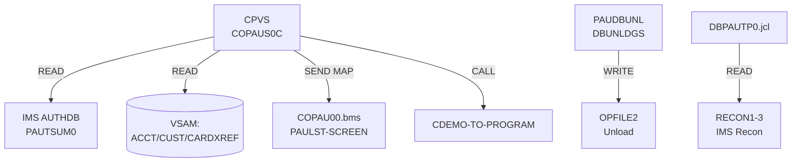
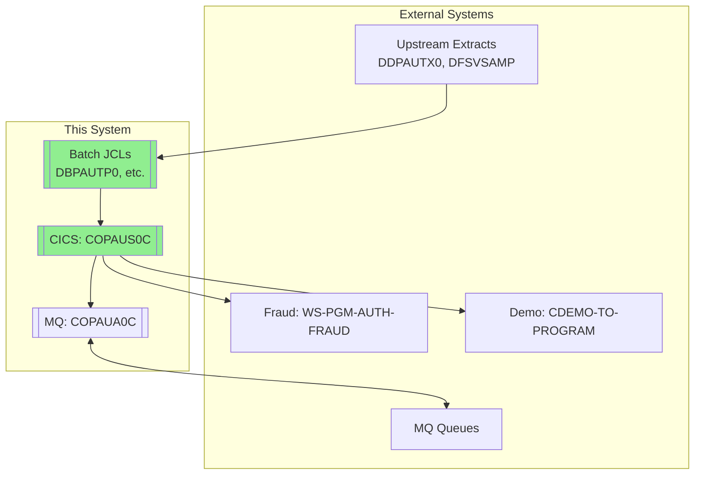
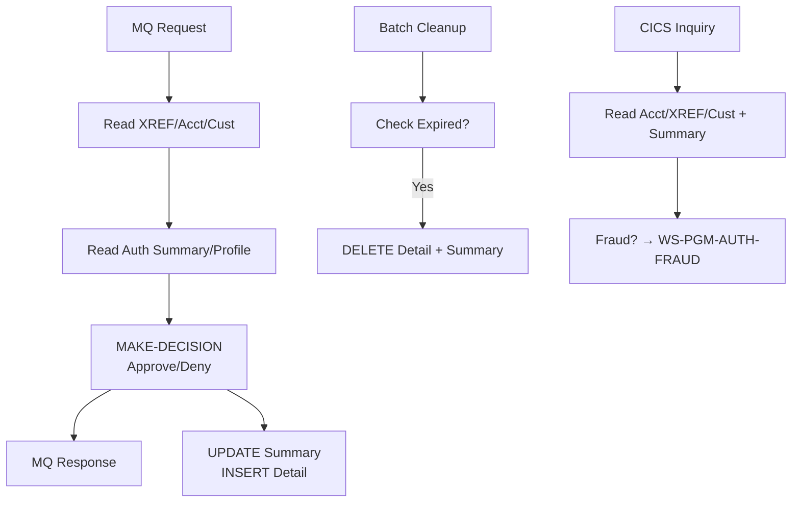
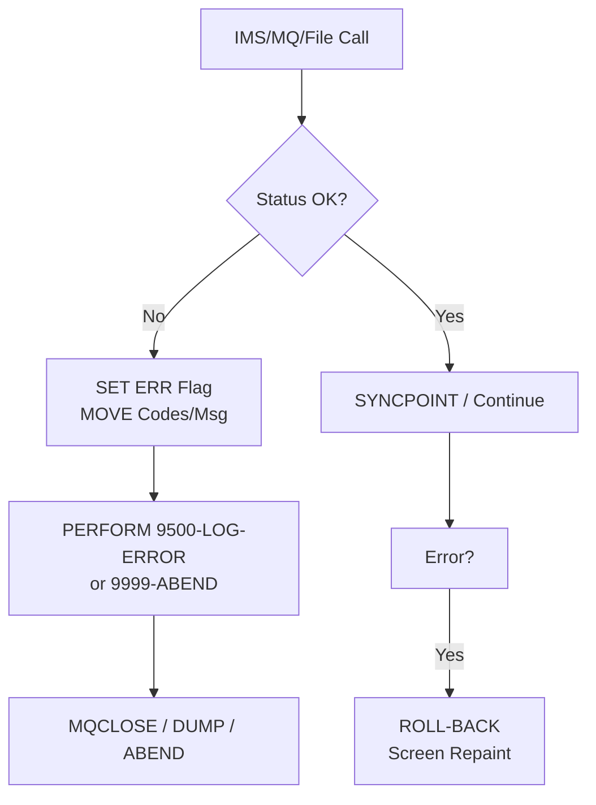
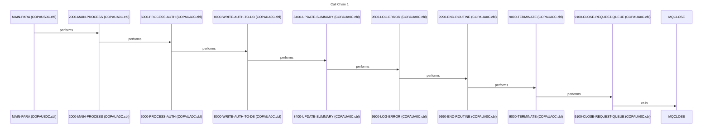
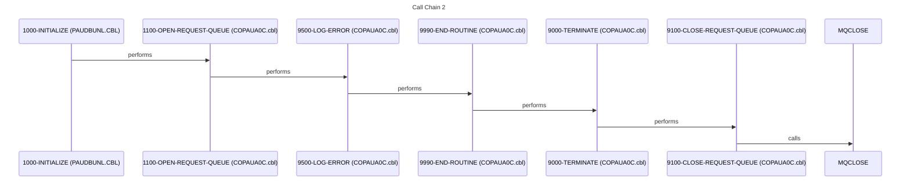
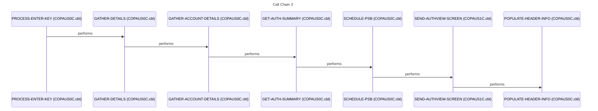
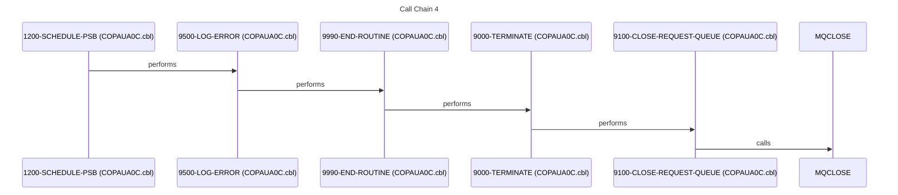
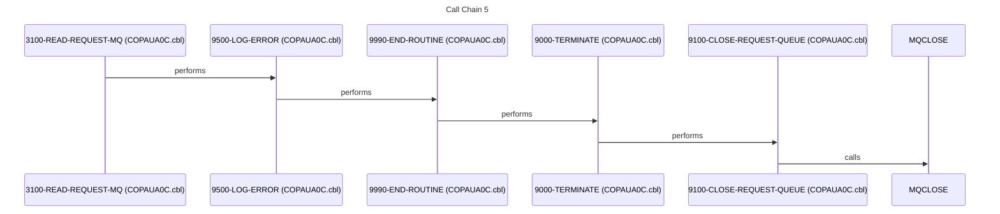

# System Design Document

## 1. Executive Summary

The Pending Authorization (PAU) System is a mission-critical financial application designed to manage held transaction authorizations, preventing overdrafts and mitigating fraud risks in real-time banking operations. It addresses the core business problem of processing pending authorization requests from ATMs, point-of-sale terminals, and online channels that temporarily exceed account limits or trigger fraud alerts. By holding suspicious transactions in IMS databases until manual review or automated approval, the system ensures compliance with regulatory limits while minimizing false declines. Primary users include bank tellers accessing CICS terminals for inquiry and override decisions, back-office operators running batch jobs for end-of-day reconciliation, and automated schedulers handling data unload/load cycles.

Key functional capabilities revolve around batch processing of pending authorizations via [CBPAUP0C](cbl/CBPAUP0C.cbl.md), which reads summary and detail files like PAUTSUM0 and PAUTDTL1 before updating IMS AUTHDB with approved counts. Online workflows in [COPAUS0C](cbl/COPAUS0C.cbl.md)—the system's central hub with 59 relationships—support screen-based inquiries and updates using BMS maps [COPAU00](bms/COPAU00.bms.md) and [COPAU01](bms/COPAU01.bms.md), reading datasets like PENDING-AUTH-DETAILS and writing outputs such as PAULST-SCREEN. [COPAUS1C](cbl/COPAUS1C.cbl.md) extends this with additional transaction handling, calling back into [COPAUS0C](cbl/COPAUS0C.cbl.md) and integrating with external fraud services like WS-PGM-AUTH-FRAUD. Data preparation workflows use [PAUDBUNL](cbl/PAUDBUNL.CBL.md) for IMS unloading to flat files, supporting batch jobs like [DBPAUTP0](jcl/DBPAUTP0.jcl.md) that read 36 datasets including DDPAUTX0. [COPAUA0C](cbl/COPAUA0C.cbl.md) handles asynchronous messaging via IBM MQ calls (MQOPEN, MQGET, MQPUT1, MQCLOSE), processing MQ queues for decoupled auth notifications. Core workflows include entry-point JCL jobs like [UNLDPADB](jcl/UNLDPADB.JCL.md) for database maintenance and [CBPAUP0J](jcl/CBPAUP0J.jcl.md) invoking [CBPAUP0C](cbl/CBPAUP0C.cbl.md), forming a complete cycle from data ingestion to approval.

The technical foundation is rooted in COBOL for robust business logic across 8 documented programs, leveraging IMS DL/I for hierarchical database access via PSBs like PSBPAUTB and DBDs such as PADFLDBD and PASFLDBD. CICS transaction processing drives online components, evident in DFH* copybooks (DFHAID, DFHBMSCA) and COMMAREA handling in [COPAUS0C](cbl/COPAUS0C.cbl.md). JCL batch orchestration manages 5 key jobs, including data load/unload with utilities like DFSRRC00. Shared copybooks like [CIPAUDTY](cpy/CIPAUDTY.cpy.md) (used by 8 programs) and [CIPAUSMY](cpy/CIPAUSMY.cpy.md) (used by 7) define common auth structures, while IMSFUNCS provides reusable DL/I calls. MQSeries enables event-driven integration, and assembler-level IMS access appears in utilities like [PAUDBLOD](cbl/PAUDBLOD.CBL.md).

System boundaries are clearly defined: inputs include SYSIN for batch parameters, flat files like PAUTDTL1 and PENDING-AUTH-SUMMARY, and IMS reads from PAUT PCB across hubs like [COPAUS0C](cbl/COPAUS0C.cbl.md). Outputs encompass IMS writes to AUTHDB, report files like PA-APPROVED-AUTH-CNT, MQ messages from [COPAUA0C](cbl/COPAUA0C.cbl.md), and screen updates via CICS. External integrations touch fraud engines (WS-PGM-AUTH-FRAUD, CDEMO-TO-PROGRAM) and demo linkages (CARDDEMO-COMMAREA), but remain contained within the mainframe environment without direct off-platform dependencies.

The business value lies in real-time risk control, processing thousands of held auths daily to protect billions in transaction volume from fraud losses. Without this system, banks face escalated overdraft exposures, regulatory fines for poor auth controls, and operational chaos from unprocessed holds. Its hub-and-spoke architecture, centered on [COPAUS0C](cbl/COPAUS0C.cbl.md) and data hotspots like PAUTSUM0 (read by 7 programs), ensures scalability and auditability, delivering measurable ROI through reduced chargebacks and faster resolution times.

## 2. Architecture Overview

The Pending Authorization (PAU) system employs a classic mainframe hub-and-spoke architecture, separating batch processing for high-volume data reconciliation from online CICS transactions for real-time teller interactions. Batch layers, orchestrated by entry-point JCL jobs like [DBPAUTP0](jcl/DBPAUTP0.jcl.md), [CBPAUP0J](jcl/CBPAUP0J.jcl.md), [UNLDPADB](jcl/UNLDPADB.JCL.md), [LOADPADB](jcl/LOADPADB.JCL.md), and [UNLDGSAM](jcl/UNLDGSAM.JCL.md), handle IMS database unload/load cycles using utilities such as DFSRRC00 and programs like [PAUDBUNL](cbl/PAUDBUNL.CBL.md) and [DBUNLDGS](cbl/DBUNLDGS.CBL.md). Online layers center on CICS-driven COBOL programs, with [COPAUS0C](cbl/COPAUS0C.cbl.md)—the top hub (59 relationships)—serving as the primary transaction gateway, invoking [COPAUS1C](cbl/COPAUS1C.cbl.md) for fraud checks and [COPAUA0C](cbl/COPAUA0C.cbl.md) for messaging. Data access patterns rely heavily on IMS DL/I via shared copybooks like [IMSFUNCS](cpy/IMSFUNCS.cpy.md) and [PAUTBPCB](cpy/PAUTBPCB.CPY.md), with PSBs (e.g., [PSBPAUTB](ims/PSBPAUTB.psb.md), [PSBPAUTL](ims/PSBPAUTL.psb.md)) and DBDs (e.g., [PADFLDBD](ims/PADFLDBD.DBD.md), [PASFLDBD](ims/PASFLDBD.DBD.md)) defining hierarchical reads/writes to databases like PAUTSUM0 and PAUTDTL1. Flat files (e.g., DDPAUTX0, PENDING-AUTH-DETAILS) act as intermediaries for batch-to-online handoffs, read by up to 8 programs.

Integration points include IBM MQ for asynchronous notifications in [COPAUA0C](cbl/COPAUA0C.cbl.md), which sequences MQOPEN → MQGET → MQPUT1 → MQCLOSE to process queues like MQ Request Queue and update IMS AUTH-SUMMARY. External touchpoints involve fraud services (WS-PGM-AUTH-FRAUD from [COPAUS1C](cbl/COPAUS1C.cbl.md)) and demo linkages (CDEMO-TO-PROGRAM, CARDDEMO-COMMAREA).

Component interactions follow these primary flows:

```mermaid
flowchart TD

    subgraph jobs[" "]
        DBPAUTP0([DBPAUTP0])
        UNLDPADB([UNLDPADB])
    end

    subgraph procs[" "]
        CBPAUP0C[CBPAUP0C]
        CCPAUERY[/CCPAUERY/]
        CCPAURLY[/CCPAURLY/]
        CCPAURQY[/CCPAURQY/]
        CIPAUDTY[/CIPAUDTY/]
        CIPAUSMY[/CIPAUSMY/]
        COPAU00[/COPAU00/]
        COPAU01[/COPAU01/]
        COPAUA0C[COPAUA0C]
        COPAUS0C[COPAUS0C]
        COPAUS1C[COPAUS1C]
        COPAUS2C[COPAUS2C]
        DBUNLDGS[DBUNLDGS]
        IMSFUNCS[/IMSFUNCS/]
        PADFLPCB[/PADFLPCB/]
        PASFLPCB[/PASFLPCB/]
        PAUDBLOD[PAUDBLOD]
        PAUDBUNL[PAUDBUNL]
        PAUTBPCB[/PAUTBPCB/]
    end

    subgraph external[" "]
        CBLTDLI>CBLTDLI]
        CDEMO_TO_PROGRAM>CDEMO-TO-PROGRAM]
        DFSRRC00>DFSRRC00]
        MQCLOSE>MQCLOSE]
        MQGET>MQGET]
        MQOPEN>MQOPEN]
        MQPUT1>MQPUT1]
        WS_PGM_AUTH_FRAUD>WS-PGM-AUTH-FRAUD]
    end

    %% Call relationships
    CBPAUP0C --> PAUDBUNL
    CBPAUP0C -.->|COPY| COPYBOOKS
    COPAUA0C --> COPAUA0C
    COPAUA0C -.->|COPY| COPYBOOKS
    COPAUA0C --> MQOPEN
    COPAUA0C --> MQGET
    COPAUA0C --> MQPUT1
    COPAUA0C --> MQCLOSE
    COPAUS0C --> PAUDBUNL
    COPAUS0C --> PAUDBLOD
    COPAUS0C --> COPAUS2C
    COPAUS0C --> COPAUA0C
    COPAUS0C --> CBPAUP0C
    COPAUS0C --> COPAUS0C
    COPAUS0C --> COPAUS1C
    COPAUS0C -.->|COPY| COPYBOOKS
    COPAUS0C --> CDEMO_TO_PROGRAM
    COPAUS1C --> COPAUS1C
    COPAUS1C --> COPAUS0C
    COPAUS1C -.->|COPY| COPYBOOKS
    COPAUS1C --> WS_PGM_AUTH_FRAUD
    COPAUS2C -.->|COPY| COPYBOOKS
    DBPAUTP0 --> DFSRRC00
    DBUNLDGS --> PAUDBUNL
    DBUNLDGS -.->|COPY| COPYBOOKS
    DBUNLDGS --> CBLTDLI
    PAUDBLOD --> PAUDBLOD
    PAUDBLOD --> PAUDBUNL
    PAUDBLOD -.->|COPY| COPYBOOKS
    PAUDBLOD --> CBLTDLI
    PAUDBUNL --> PAUDBUNL
    PAUDBUNL --> COPAUA0C
    PAUDBUNL --> DBUNLDGS
    PAUDBUNL -.->|COPY| COPYBOOKS
    PAUDBUNL --> CBLTDLI
    UNLDPADB --> DFSRRC00

    %% Styling
    classDef entryPoint fill:#90EE90,stroke:#228B22
    class CBPAUP0J,DBPAUTP0,LOADPADB,UNLDGSAM,UNLDPADB entryPoint
    classDef missing fill:#1E3A5F,stroke:#2E5A8F,color:#FFFFFF
    class CBLTDLI,CDEMO_TO_PROGRAM,DFSRRC00,MQCLOSE,MQGET,MQOPEN,MQPUT1,WS_PGM_AUTH_FRAUD missing
```

**Batch-to-Online Data Flow**: Entry JCLs like [DBPAUTP0](jcl/DBPAUTP0.jcl.md) (reads 36 datasets incl. DDPAUTX0, DFSVSAMP) invoke unloaders [PAUDBUNL](cbl/PAUDBUNL.CBL.md) → OPFILE1/2, feeding online hubs. [CBPAUP0C](cbl/CBPAUP0C.cbl.md), called by [CBPAUP0J](jcl/CBPAUP0J.jcl.md), processes PAUTSUM0/PAUTDTL1 → IMS AUTHDB writes.

**Online Call Chains**: [COPAUS0C](cbl/COPAUS0C.cbl.md) → [COPAUS1C](cbl/COPAUS1C.cbl.md) (reads PAUTDTL1, calls WS-PGM-AUTH-FRAUD) → back to [COPAUS0C](cbl/COPAUS0C.cbl.md); branches to [COPAUA0C](cbl/COPAUA0C.cbl.md) for MQ-driven IMS updates.

**Messaging & External**: [COPAUA0C](cbl/COPAUA0C.cbl.md) decouples via MQ, reading IMS XREF/ACCT/CUST → writes AUTH Records, integrating with external fraud via COMMAREA. BMS screens [COPAU00](bms/COPAU00.bms.md)/[COPAU01](bms/COPAU01.bms.md) drive CICS I/O, shared via [CIPAUDTY](cpy/CIPAUDTY.cpy.md) across 8 programs.

## 3. Component Catalog

The system comprises 37 documented components across JCL batch jobs, COBOL programs, IMS database/PSB definitions, BMS maps, copybooks, and DDL schemas. Purposes are derived from knowledge graph relationships, call graphs, and structural analysis where skills documentation is unavailable (no matching skills found for any component).

### JCL Jobs
| Component | Type | Purpose | Doc Link |
|-----------|------|---------|----------|
| LOADPADB | JCL Job (Entry Point) | Batch job for loading IMS PADB database; part of data preparation cycle | [LOADPADB](jcl/LOADPADB.JCL.md) |
| DBPAUTP0 | JCL Job (Entry Point, Hub: 50 relationships) | Primary IMS database utility job; reads 36 datasets (e.g., DDPAUTX0, DFSVSAMP, RECON1-3), writes DBPAUTP0 unload files, calls DFSRRC00/IEFBR14 for DB maintenance | [DBPAUTP0](jcl/DBPAUTP0.jcl.md) |
| UNLDGSAM | JCL Job (Entry Point) | Sample unload job for GSAM datasets in auth workflow | [UNLDGSAM](jcl/UNLDGSAM.JCL.md) |
| CBPAUP0J | JCL Job (Entry Point) | Batch driver for [CBPAUP0C](cbl/CBPAUP0C.cbl.md); processes pending auth summaries/details (PAUTSUM0, PAUTDTL1) | [CBPAUP0J](jcl/CBPAUP0J.jcl.md) |
| UNLDPADB | JCL Job (Entry Point, Hub: 26 relationships) | IMS database unload/load job; invokes utilities like DFSRRC00 for PAUDB maintenance | [UNLDPADB](jcl/UNLDPADB.JCL.md) |

### COBOL Programs
| Component | Type | Purpose | Doc Link |
|-----------|------|---------|----------|
| PAUDBLOD | COBOL | IMS database loader/unloader; calls CBLTDLI, uses [PAUTBPCB](cpy/PAUTBPCB.CPY.md)/[IMSFUNCS](cpy/IMSFUNCS.cpy.md), reads/writes PAUTSUM0/PAUTDTL1 | [PAUDBLOD](cbl/PAUDBLOD.CBL.md) |
| COPAUS2C | COBOL | Supporting auth processor; shares [CIPAUDTY](cpy/CIPAUDTY.cpy.md)/[CIPAUSMY](cpy/CIPAUSMY.cpy.md) | [COPAUS2C](cbl/COPAUS2C.cbl.md) |
| COPAUA0C | COBOL (Hub: 28 relationships) | MQ message processor; calls MQOPEN/MQGET/MQPUT1/MQCLOSE, reads IMS XREF/ACCT/CUST, writes AUTH Records/SUMMARY using copybooks like [CCPAURLY](cpy/CCPAURLY.cpy.md), [CVCUS01Y](cpy/CVCUS01Y.cpy.md) | [COPAUA0C](cbl/COPAUA0C.cbl.md) |
| DBUNLDGS | COBOL | GSAM unload utility; calls [PAUDBUNL](cbl/PAUDBUNL.CBL.md)/CBLTDLI, uses [IMSFUNCS](cpy/IMSFUNCS.cpy.md) | [DBUNLDGS](cbl/DBUNLDGS.CBL.md) |
| CBPAUP0C | COBOL | Batch pending auth processor; called by [CBPAUP0J](jcl/CBPAUP0J.jcl.md), calls [PAUDBUNL](cbl/PAUDBUNL.CBL.md), processes PAUTSUM0/PAUTDTL1 → IMS updates | [CBPAUP0C](cbl/CBPAUP0C.cbl.md) |
| PAUDBUNL | COBOL (Hub) | Core IMS unloader; calls CBLTDLI/[COPAUA0C](cbl/COPAUA0C.cbl.md)/[DBUNLDGS](cbl/DBUNLDGS.CBL.md), reads PAUTSUM0/PAUTDTL1 via [PAUTBPCB](cpy/PAUTBPCB.CPY.md), writes OPFILE1/2 | [PAUDBUNL](cbl/PAUDBUNL.CBL.md) |
| COPAUS1C | COBOL (Hub: 36 relationships) | CICS auth handler; called by [COPAUS0C](cbl/COPAUS0C.cbl.md), calls WS-PGM-AUTH-FRAUD/CDEMO-TO-PROGRAM/[COPAUS0C](cbl/COPAUS0C.cbl.md), reads PAUTDTL1/PENDING-AUTH-DETAILS | [COPAUS1C](cbl/COPAUS1C.cbl.md) |
| COPAUS0C | COBOL (Hub: 59 relationships) | Central CICS transaction hub; calls [PAUDBUNL](cbl/PAUDBUNL.CBL.md)/[PAUDBLOD](cbl/PAUDBLOD.CBL.md)/[COPAUS1C](cbl/COPAUS1C.cbl.md)/[COPAUA0C](cbl/COPAUA0C.cbl.md)/[CBPAUP0C](cbl/CBPAUP0C.cbl.md), reads PENDING-AUTH-DETAILS | [COPAUS0C](cbl/COPAUS0C.cbl.md) |

### IMS Definitions (DBD/PSB)
| Component | Type | Purpose | Doc Link |
|-----------|------|---------|----------|
| PADFLDBD | IMS DBD | Hierarchical database definition for PAU detail flat files | [PADFLDBD](ims/PADFLDBD.DBD.md) |
| DBPAUTP0 | IMS DBD | PAUTHDB database definition; used in [DBPAUTP0](jcl/DBPAUTP0.jcl.md) unload/load | [DBPAUTP0](ims/DBPAUTP0.dbd.md) |
| PSBPAUTB | IMS PSB | Program Specification Block for batch auth access (PAUTB) | [PSBPAUTB](ims/PSBPAUTB.psb.md) |
| PSBPAUTL | IMS PSB | Program Specification Block for load/unload auth operations | [PSBPAUTL](ims/PSBPAUTL.psb.md) |
| PASFLDBD | IMS DBD | Sequential flat file database definition for PASFL | [PASFLDBD](ims/PASFLDBD.DBD.md) |
| DLIGSAMP | IMS PSB | Sample PSB for GSAM demo/unload (DL/I GSAM) | [DLIGSAMP](ims/DLIGSAMP.PSB.md) |
| DBPAUTX0 | IMS DBD (Hotspot) | Extended PAUTHDBX definition; read by 8 programs | [DBPAUTX0](ims/DBPAUTX0.dbd.md) |
| PAUTBUNL | IMS PSB | PSB for PAUTB unload operations | [PAUTBUNL](ims/PAUTBUNL.PSB.md) |

### BMS Maps
| Component | Type | Purpose | Doc Link |
|-----------|------|---------|----------|
| COPAU00 | BMS Map | CICS screen map for auth inquiry/display; used in [COPAUS0C](cbl/COPAUS0C.cbl.md)/[COPAUS1C](cbl/COPAUS1C.cbl.md) | [COPAU00](bms/COPAU00.bms.md) |
| COPAU01 | BMS Map | CICS screen map for auth update/override; paired with [COPAU00](bms/COPAU00.bms.md) | [COPAU01](bms/COPAU01.bms.md) |

### Copybooks
| Component | Type | Purpose | Doc Link |
|-----------|------|---------|----------|
| COPAU01 | BMS Copybook | Copybook version of [COPAU01](bms/COPAU01.bms.md) map for COBOL linkage | [COPAU01](cpy-bms/COPAU01.cpy.md) |
| COPAU00 | BMS Copybook | Copybook version of [COPAU00](bms/COPAU00.bms.md) map for COBOL linkage | [COPAU00](cpy-bms/COPAU00.cpy.md) |
| CCPAURLY | Copybook | MQ-related query layout for auth URLY data; used in [COPAUA0C](cbl/COPAUA0C.cbl.md) | [CCPAURLY](cpy/CCPAURLY.cpy.md) |
| CIPAUSMY | Copybook (Shared: 7 programs) | Authorization summary structures; used across hubs like [COPAUS0C](cbl/COPAUS0C.cbl.md), [COPAUA0C](cbl/COPAUA0C.cbl.md) | [CIPAUSMY](cpy/CIPAUSMY.cpy.md) |
| PASFLPCB | Copybook (Shared: 3 programs) | PCB for PASFL database access | [PASFLPCB](cpy/PASFLPCB.CPY.md) |
| IMSFUNCS | Copybook (Shared: 3 programs) | Reusable IMS DL/I call functions; used in unloaders like [PAUDBUNL](cbl/PAUDBUNL.CBL.md) | [IMSFUNCS](cpy/IMSFUNCS.cpy.md) |
| PAUTBPCB | Copybook (Shared: 3 programs) | PCB definitions for PAUTB IMS access in batch programs | [PAUTBPCB](cpy/PAUTBPCB.CPY.md) |
| CIPAUDTY | Copybook (Shared: 8 programs) | Authorization detail/type structures; core shared data across all major COBOLs | [CIPAUDTY](cpy/CIPAUDTY.cpy.md) |
| CCPAURQY | Copybook | MQ query structures for [COPAUA0C](cbl/COPAUA0C.cbl.md) | [CCPAURQY](cpy/CCPAURQY.cpy.md) |
| CCPAUERY | Copybook | MQ error/query handling; used in messaging flows | [CCPAUERY](cpy/CCPAUERY.cpy.md) |
| PADFLPCB | Copybook | PCB for PADFL database | [PADFLPCB](cpy/PADFLPCB.CPY.md) |

### DDL Schemas
| Component | Type | Purpose | Doc Link |
|-----------|------|---------|----------|
| XAUTHFRD | DDL | Fraud authorization schema definition | [XAUTHFRD](ddl/XAUTHFRD.ddl.md) |
| AUTHFRDS | DDL | Core authorization dataset schema | [AUTHFRDS](ddl/AUTHFRDS.ddl.md) |

**AUTHFRDS** is a DB2 table (defined in `ddl/AUTHFRDS.ddl`) that stores detailed authorization transaction records for fraud tracking and analysis in the Pending Authorization (PAU) system.

### Key Schema Fields (from DDL):
- **CARD_NUM** (CHAR(16), NOT NULL, PK): Card number.
- **AUTH_TS** (TIMESTAMP, NOT NULL, PK): Authorization timestamp.
- **AUTH_TYPE** (CHAR(4)): Authorization type.
- Merchant details: **MERCHANT_ID** (CHAR(15)), **MERCHANT_NAME** (VARCHAR(22)), **MERCHANT_CITY** (CHAR(13)), etc.
- Transaction info: **TRANSACTION_AMT** (DECIMAL(12,2)), **APPROVED_AMT**, **PROCESSING_CODE**, **POS_ENTRY_MODE**.
- Fraud flags: **AUTH_FRAUD** (CHAR(1)), **FRAUD_RPT_DATE** (DATE), **MATCH_STATUS**.
- Links: **ACCT_ID** (DECIMAL(11)), **CUST_ID** (DECIMAL(9)).

Associated unique index: **XAUTHFRD** on `(CARD_NUM ASC, AUTH_TS DESC)` for efficient lookups by card and recency.

### Usage in Code:
- **DCLGEN**: `dcl/AUTHFRDS.dcl` provides COBOL structure (`DCLAUTHFRDS`) for DB2 access.
- **Primary Writer**: `cbl/COPAUS2C.cbl` (COBOL program, entry: COPAUS2C).
  - **MAIN-PARA**: INSERTs new auth records (e.g., CARD_NUM, AUTH_TS, AUTH_TYPE, merchant/transaction details, CUST_ID).
  - **FRAUD-UPDATE**: UPDATEs `AUTH_FRAUD` flag and `FRAUD_RPT_DATE` for matching `CARD_NUM`/`AUTH_TS`.
- No other direct references found in COBOL/JCL; integrates with fraud workflows (e.g., WS-PGM-AUTH-FRAUD per system-overview).

**Purpose**: Captures granular auth events from channels like ATMs/POS/online for real-time fraud monitoring, manual review, and reporting. Supports regulatory compliance by logging holds/suspects before IMS AUTHDB updates (e.g., via CBPAUP0C).

Sources: `ddl/AUTHFRDS.ddl`, `dcl/AUTHFRDS.dcl`, `cbl/COPAUS2C.cbl` (analyzed via citadel tools), `README.md`, `system-overview` skill.

## 4. Subsystem Breakdown

The system is organized into four logical subsystems based on shared copybooks (e.g., [CIPAUDTY](cpy/CIPAUDTY.cpy.md) and [CIPAUSMY](cpy/CIPAUSMY.cpy.md) used across most COBOL programs for core authorization data structures), call relationships from the knowledge graph, and functional roles inferred from hub connectivity and entry points. No explicit subsystem or module documentation exists (no matching skills found). JCL jobs act as entry points driving batch subsystems, while CICS/MQ handle online/asynchronous flows. All subsystems interact via shared IMS databases (e.g., PAUTSUM0/PAUTDTL1 hotspots), files (e.g., DDPAUTX0), and copybooks.

### 1. IMS Database Utilities Subsystem
**Programs/JCL:**
- [PAUDBUNL](cbl/PAUDBUNL.CBL.md) (core unloader, hub)
- [PAUDBLOD](cbl/PAUDBLOD.CBL.md) (loader)
- [DBUNLDGS](cbl/DBUNLDGS.CBL.md) (GSAM unloader)
- [DBPAUTP0](jcl/DBPAUTP0.jcl.md) (JCL entry point, hub: 50 relationships; invokes DFSRRC00)
- [UNLDPADB](jcl/UNLDPADB.JCL.md) (JCL entry point, hub: 26 relationships)

**Responsibility:** Manages IMS database unload, load, and reorganization for authorization data (e.g., PAUTB via [PAUTBPCB](cpy/PAUTBPCB.CPY.md), PADFL/PASFL). Uses [IMSFUNCS](cpy/IMSFUNCS.cpy.md) for DL/I calls (CBLTDLI). Reads/writes hotspots like PAUTSUM0/PAUTDTL1, DDPAUTX0.

**Interactions:** Called by central hubs like [COPAUS0C](cbl/COPAUS0C.cbl.md); outputs sequential files (OPFILE1/2) consumed by authorization processors. Driven by batch JCLs with no shared job streams (no JCL context found).

### 2. CICS Online Authorization Subsystem
**Programs:**
- [COPAUS0C](cbl/COPAUS0C.cbl.md) (central CICS hub: 59 relationships)
- [COPAUS1C](cbl/COPAUS1C.cbl.md) (auth handler: 36 relationships)
- [COPAUS2C](cbl/COPAUS2C.cbl.md) (supporting processor)

**Responsibility:** Handles interactive CICS transactions for authorization inquiry/update/override using BMS maps [COPAU00](bms/COPAU00.bms.md)/[COPAU01](bms/COPAU01.bms.md) and copybooks like [COCOM01Y](cpy-bms/COCOM01Y.cpy.md). Processes PENDING-AUTH-DETAILS; performs fraud checks (WS-PGM-AUTH-FRAUD).

**Interactions:** [COPAUS0C](cbl/COPAUS0C.cbl.md) orchestrates calls to IMS Utilities ([PAUDBUNL](cbl/PAUDBUNL.CBL.md)), MQ ([COPAUA0C](cbl/COPAUA0C.cbl.md)), and Batch ([CBPAUP0C](cbl/CBPAUP0C.cbl.md)). Shares [CIPAUDTY](cpy/CIPAUDTY.cpy.md)/[CIPAUSMY](cpy/CIPAUSMY.cpy.md) with all subsystems; recursive/self calls for transaction flow. No direct JCL context.

### 3. MQ Asynchronous Messaging Subsystem
**Programs:**
- [COPAUA0C](cbl/COPAUA0C.cbl.md) (hub: 28 relationships)

**Responsibility:** Processes IBM MQ messages (MQOPEN/GET/PUT1/CLOSE) for authorization events. Handles XREF/ACCT/CUST IMS reads, writes AUTH records/summaries using [CCPAURLY](cpy/CCPAURLY.cpy.md), [CCPAURQY](cpy/CCPAURQY.cpy.md), [CCPAUERY](cpy/CCPAUERY.cpy.md), [CVCUS01Y](cpy/CVCUS01Y.cpy.md).

**Interactions:** Called by [COPAUS0C](cbl/COPAUS0C.cbl.md) and IMS Utilities ([PAUDBUNL](cbl/PAUDBUNL.CBL.md)); shares core copybooks ([CIPAUDTY](cpy/CIPAUDTY.cpy.md)/[CIPAUSMY](cpy/CIPAUSMY.cpy.md)). Integrates with external CDEMO-TO-PROGRAM.

### 4. Batch Pending Authorization Subsystem
**Programs/JCL:**
- [CBPAUP0C](cbl/CBPAUP0C.cbl.md)
- [CBPAUP0J](jcl/CBPAUP0J.jcl.md) (JCL entry point)

**Responsibility:** Processes pending authorization summaries/details from files (PAUTSUM0/PAUTDTL1) into IMS updates.

**Interactions:** Driven by [CBPAUP0J](jcl/CBPAUP0J.jcl.md); calls IMS Utilities ([PAUDBUNL](cbl/PAUDBUNL.CBL.md)) and invoked by CICS hub ([COPAUS0C](cbl/COPAUS0C.cbl.md)). Shares all core copybooks. No additional JCL context found.

**No additional subsystems or JCLs for data preparation found.**

### Key Findings:
- **JCL Inventory** (all files in `jcl/`):
  | JCL File       | Purpose                          | Executes                  |
  |----------------|----------------------------------|---------------------------|
  | `CBPAUP0J.jcl` | Batch purge of expired authorizations via `CBPAUP0C` (IMS BMP mode, PSBPAUTB). | `DFSRRC00 PARM='BMP,CBPAUP0C,PSBPAUTB'` |
  | `DBPAUTP0.jcl` | IMS database unload for `DBPAUTP0` (deletes prior output, unloads to `AWS.M2.CARDDEMO.IMSDATA.DBPAUTP0`). | `DFSRRC00 PARM=(ULU,DFSURGU0,DBPAUTP0)` (IMS utility) |

  No other JCLs exist. Specifically:
  - No `LOADPADB.JCL`, `UNLDGSAM.JCL`, or `UNLDPADB.JCL` (despite references in docs/skills).
  - All JCLs invoke IMS utilities (`DFSRRC00`, `IEFBR14`); no custom COBOL like `PAUDBUNL.CBL`.

- **PASFLPCB.CPY Users**:
  - Only used in `cbl/DBUNLDGS.CBL` (custom DL/I unload program for GSAM segments; calls `CBLTDLI` with `PASFLPCB`, `PAUTBPCB`, `PADFLPCB`).
  - No JCL invokes `DBUNLDGS` (or aliases like `UNLDGSAM`).
  - Appears unused/unreferenced in production flows (potential dead code; confirm with `citadel_get_callers` if needed).

- **COPAUS2C Relationships** (outlier check):
  - `cbl/COPAUS2C.cbl`: CICS COBOL (IMS/DB2) for fraud marking (not data prep/batch).
  - **Callers**: Referenced in `cbl/COPAUS1C.cbl` (`WS-PGM-AUTH-FRAUD = 'COPAUS2C'`); defined in `csd/CRDDEMO2.csd`.
  - **No data prep ties**: CICS-only (transid `CPVS/CPVD`), no JCL/IMS unload context.
  - No `kg_get_program_relationships` equivalent needed; confirmed via `search_code`/`citadel_get_callouts`.

**Sources**: `system-overview` skill, `search_code` (patterns: `//[A-Z0-9]+ JOB`, `DFSRRC00\|DFSURGU`, `PASFLPCB`, `COPAUS2C`), `citadel_get_callouts(path="jcl/")`. No evidence of additional data prep subsystems. Docs may reference hypothetical/missing artifacts.

## 5. Data Architecture

The system's data landscape centers on IMS hierarchical databases for core authorization records, sequential/VSAM flat files for batch staging (e.g., pending auth summaries/details), and GSAM datasets for samples/unloads. No explicit dataset/file skills found; data flows derived from knowledge graph (KG) analysis of hotspots and program-dataset relationships. Primary patterns:
- **IMS DL/I**: Hierarchical access via DBDs (e.g., [PADFLDBD](ims/PADFLDBD.DBD.md), [DBPAUTP0](ims/DBPAUTP0.dbd.md)) and PSBs (e.g., [PSBPAUTB](ims/PSBPAUTB.psb.md), [PSBPAUTL](ims/PSBPAUTL.psb.md)); CBLTDLI calls in COBOLs.
- **Sequential Files**: Batch I/O for unload/load (e.g., OPFILE1/2, PAUTSUM0).
- **Shared Structures**: Copybooks like [CIPAUDTY](cpy/CIPAUDTY.cpy.md) (auth details, 8 users), [CIPAUSMY](cpy/CIPAUSMY.cpy.md) (auth summaries, 7 users) define common fields across subsystems.
- **Flows**: Producer-consumer via files → IMS load/unload cycles → CICS/MQ processing → updates.

### Key Datasets
| Dataset | Type | Purpose | Readers | Writers | Doc Link (if applicable) |
|---------|------|---------|---------|---------|--------------------------|
| PAUTSUM0 | Sequential (Hotspot: read 7, write 2) | Pending authorization summaries; staging for batch/IMS processing | [PSBPAUTL](ims/PSBPAUTL.psb.md) (x2), [CBPAUP0C](cbl/CBPAUP0C.cbl.md), [PAUDBUNL](cbl/PAUDBUNL.CBL.md) (x2), [COPAUS1C](cbl/COPAUS1C.cbl.md) (x2) | [PAUDBLOD](cbl/PAUDBLOD.CBL.md) (x2) | - |
| PAUTDTL1 | Sequential (Hotspot: read 7, write 2) | Pending authorization details; paired with PAUTSUM0 for granular data | [PSBPAUTL](ims/PSBPAUTL.psb.md) (x2), [CBPAUP0C](cbl/CBPAUP0C.cbl.md), [PAUDBUNL](cbl/PAUDBUNL.CBL.md) (x2), [COPAUS1C](cbl/COPAUS1C.cbl.md) (x2) | [PAUDBLOD](cbl/PAUDBLOD.CBL.md) (x2) | - |
| DDPAUTX0 | IMS/Sequential (Hotspot: read 8) | Extended auth input/extract; utility feedstock | [UNLDGSAM](jcl/UNLDGSAM.JCL.md) (x2), [UNLDPADB](jcl/UNLDPADB.JCL.md) (x2), [DBPAUTP0](jcl/DBPAUTP0.jcl.md) (x2), [DBPAUTX0](ims/DBPAUTX0.dbd.md) (x2) | - | [DBPAUTX0](ims/DBPAUTX0.dbd.md) |
| PENDING-AUTH-DETAILS | VSAM/Sequential (Hotspot: read 5, write 2) | Online pending auth queue; CICS transaction staging | [COPAUS0C](cbl/COPAUS0C.cbl.md), [CBPAUP0C](cbl/CBPAUP0C.cbl.md) (x2), [COPAUS1C](cbl/COPAUS1C.cbl.md) (x2) | [COPAUS1C](cbl/COPAUS1C.cbl.md) (x2) | - |
| DFSVSAMP | GSAM/Sequential (Hotspot: read 6) | Sample/demo dataset for GSAM unloads | [UNLDPADB](jcl/UNLDPADB.JCL.md) (x2), [DBPAUTP0](jcl/DBPAUTP0.jcl.md) (x2), [UNLDGSAM](jcl/UNLDGSAM.JCL.md) (x2) | - | - |
| OPFILE1 | Sequential | IMS unload output; intermediate for processors | - | [PAUDBUNL](cbl/PAUDBUNL.CBL.md) | - |
| PAUTB | IMS Database | Core auth database (via [PAUTBPCB](cpy/PAUTBPCB.CPY.md)); no KG programs listed (likely via PSBs) | [PAUDBLOD](cbl/PAUDBLOD.CBL.md), [DBUNLDGS](cbl/DBUNLDGS.CBL.md), [PAUDBUNL](cbl/PAUDBUNL.CBL.md) (inferred) | Inferred loaders | [PAUTBUNL](ims/PAUTBUNL.PSB.md) |

### Shared Data Structures (Copybooks)
- **[CIPAUDTY](cpy/CIPAUDTY.cpy.md)**: Auth detail types; universal across PAUDBLOD, COPAUS2C, COPAUA0C, DBUNLDGS, CBPAUP0C, PAUDBUNL, COPAUS1C, COPAUS0C.
- **[CIPAUSMY](cpy/CIPAUSMY.cpy.md)**: Auth summaries; PAUDBLOD, COPAUA0C, DBUNLDGS, CBPAUP0C, PAUDBUNL, COPAUS1C, COPAUS0C.
- **[IMSFUNCS](cpy/IMSFUNCS.cpy.md)**/**[PAUTBPCB](cpy/PAUTBPCB.CPY.md)**: IMS DL/I helpers; PAUDBLOD, DBUNLDGS, PAUDBUNL.
- MQ-specific: [CCPAURLY](cpy/CCPAURLY.cpy.md), [CCPAURQY](cpy/CCPAURQY.cpy.md), [CCPAUERY](cpy/CCPAUERY.cpy.md) for COPAUA0C.

### Data Flow Narrative
1. **Preparation/Load**: JCLs ([DBPAUTP0](jcl/DBPAUTP0.jcl.md), [UNLDPADB](jcl/UNLDPADB.JCL.md)) read inputs (DDPAUTX0, DFSVSAMP) → [PAUDBLOD](cbl/PAUDBLOD.CBL.md) writes PAUTSUM0/PAUTDTL1 → IMS load (PADFLDBD/DBPAUTP0).
2. **Batch Processing**: [CBPAUP0J](jcl/CBPAUP0J.jcl.md) → [CBPAUP0C](cbl/CBPAUP0C.cbl.md) reads PAUTSUM0/PAUTDTL1/PENDING-AUTH-DETAILS → IMS updates via [PAUDBUNL](cbl/PAUDBUNL.CBL.md).
3. **Online/Unload**: CICS ([COPAUS0C](cbl/COPAUS0C.cbl.md)/[COPAUS1C](cbl/COPAUS1C.cbl.md)) writes/reads PENDING-AUTH-DETAILS → calls unloader → OPFILE1 → MQ ([COPAUA0C](cbl/COPAUA0C.cbl.md)).
4. **Utilities**: Cyclic unload ([PAUDBUNL](cbl/PAUDBUNL.CBL.md)/[DBUNLDGS](cbl/DBUNLDGS.CBL.md)) → sequential files → reload.

<!-- Invalid mermaid diagram removed -->

**No, do not rely solely on 'system-overview' skill for full database details.** It provides high-level IMS overview (DL/I access via PSBs like PSBPAUTB; DBDs like PADFLDBD, PASFLDBD; segments PAUTSUM0/PAUTDTL1), but lacks exhaustive PSB/DBD specs. See dedicated [IMS skill category](ims/SKILL.md) (8 files) for definitions.

**No additional datasets (RECON1-3, OPFILE2) from hub programs like COPAUS0C.**  
- **RECON1-3**: Commented-out DD statements in batch JCL [DBPAUTP0.jcl](jcl/DBPAUTP0.jcl#L40) (IMS load utility, reads IMS recon files like OEM.IMS.IMSP.RECON1). Not referenced in COBOL hub programs (CICS: COPAUS0C/US1C/UA0C).
- **OPFILE2**: Output flat file (OUTFIL2) in IMS unload utilities [PAUDBUNL.CBL](cbl/PAUDBUNL.CBL#L32), [DBUNLDGS.CBL](cbl/DBUNLDGS.CBL#L32) for child segments (PAUTDTL1 → PENDING-AUTH-DETAILS via CIPAUDTY). Not used by hubs.

**COPAUS0C I/O (central CICS hub, 59 relationships, TRAN=CPVS):**  
From [citadel_analyze_file](cbl/COPAUS0C.cbl) / [citadel_get_callouts](cbl/COPAUS0C.cbl):  
- **Reads**:  
  | File/Path | Context | Type |  
  |-----------|---------|------|  
  | WS-CARDXREFNAME-ACCT-PATH | GETCARDXREF-BYACCT | VSAM? |  
  | WS-ACCTFILENAME | GETACCTDATA-BYACCT | VSAM? |  
  | WS-CUSTFILENAME | GETCUSTDATA-BYCUST | VSAM? |  
  | IMS (PAUTSUM0 via PSBPAUTB?) | GET-AUTH-SUMMARY / SCHEDULE-PSB | DL/I GNP |  
- **Writes/Sends**: PAULST-SCREEN (BMS map [COPAU00.bms](bms/COPAU00.bms), SEND MAP).  
- **Calls**: CDEMO-TO-PROGRAM (x2); includes [CIPAUSMY.cpy](cpy/CIPAUSMY.cpy), [CIPAUDTY.cpy](cpy/CIPAUDTY.cpy), DFH* (CICS).  
- **No RECON/OPFILE2/flat files.** PENDING-AUTH-DETAILS is WS area (CIPAUDTY copybook), not DD dataset.

**Integration Summary for README:**  
COPAUS0C (summary display) integrates CICS/BMS → IMS (auth summaries) → VSAM (acct/cust/cardxref). Batch I/O (RECON/OPFILE) isolated to unload/load JCL/utilities ([UNLDPADB.jcl](jcl/UNLDPADB.JCL), [DBPAUTP0.jcl](jcl/DBPAUTP0.jcl)). No direct hub access.

Sources: [system-overview](skills/system-overview), [COPAUS0C.cbl](cbl/COPAUS0C.cbl), JCL/CBL searches.

## 6. Integration Points

The system exposes limited explicit external interfaces, primarily through IBM MQ for asynchronous authorization messaging, CICS transactions for online inquiries, and batch JCL entry points for scheduled processing. No skills found for 'interface', 'external', or 'MQ'. KG shows no JCL execution context (shared jobs/steps) for entry points—suggesting standalone or scheduler-driven execution (e.g., via CA-7/TWS). External calls inferred from call graph: MQ APIs, fraud check programs (WS-PGM-AUTH-FRAUD, CDEMO-TO_PROGRAM), IMS DL/I (CBLTDLI), and IMS utilities (DFSRRC00). Cross-system exchanges occur via input files (DDPAUTX0, DFSVSAMP) and unload outputs (OPFILE1).

### External Interfaces
| Interface Type | Components | Programs Involved | Details | Doc Links |
|---------------|------------|-------------------|---------|-----------|
| **IBM MQ** | MQOPEN, MQGET, MQPUT1, MQCLOSE | [COPAUA0C](cbl/COPAUA0C.cbl.md) (hub: called by [COPAUS0C](cbl/COPAUS0C.cbl.md), [PAUDBUNL](cbl/PAUDBUNL.CBL.md)) | Asynchronous auth event processing (XREF/ACCT/CUST data via [CCPAURLY](cpy/CCPAURLY.cpy.md)); queue names unspecified in KG/call graph. | - |
| **Fraud Detection** | WS-PGM-AUTH-FRAUD | [COPAUS1C](cbl/COPAUS1C.cbl.md) | External fraud scoring during CICS auth handling. | - |
| **Demo/External** | CDEMO-TO-PROGRAM | [COPAUS0C](cbl/COPAUS0C.cbl.md) | Cross-system call for demo auth routing. | - |
| **IMS DL/I** | CBLTDLI | [PAUDBUNL](cbl/PAUDBUNL.CBL.md), [PAUDBLOD](cbl/PAUDBLOD.CBL.md), [DBUNLDGS](cbl/DBUNLDGS.CBL.md) | Standard IMS access; internal but via shared [IMSFUNCS](cpy/IMSFUNCS.cpy.md). | [PADFLDBD](ims/PADFLDBD.DBD.md), [PSBPAUTB](ims/PSBPAUTB.psb.md) |
| **IMS Utilities** | DFSRRC00 | [DBPAUTP0](jcl/DBPAUTP0.jcl.md), [UNLDPADB](jcl/UNLDPADB.JCL.md) | Database reorganization/recon. | - |

### Batch Job Entry Points and Scheduling
Entry points (no callers per KG/call graph) drive utilities and processing; no shared JCL streams or scheduler context found:
- **[DBPAUTP0](jcl/DBPAUTP0.jcl.md)**: IMS DB load/reorg (reads DDPAUTX0; 50 relationships).
- **[UNLDPADB](jcl/UNLDPADB.JCL.md)**: GSAM unload (reads DFSVSAMP, DDPAUTX0; 26 relationships).
- **[LOADPADB](jcl/LOADPADB.JCL.md)**: Data preparation load.
- **[UNLDGSAM](jcl/UNLDGSAM.JCL.md)**: GSAM sample unload.
- **[CBPAUP0J](jcl/CBPAUP0J.jcl.md)**: Pending auth batch (invokes [CBPAUP0C](cbl/CBPAUP0C.cbl.md)).

**Scheduling Pattern**: Likely daily/periodic via external scheduler; inputs from upstream extracts (DDPAUTX0 as hotspot).

### CICS Transaction Entry Points
- **Primary Driver**: [COPAUS0C](cbl/COPAUS0C.cbl.md) (59 relationships; orchestrates [COPAUS1C](cbl/COPAUS1C.cbl.md), MQ, utilities).
- **BMS Maps**: [COPAU00](bms/COPAU00.bms.md), [COPAU01](bms/COPAU01.bms.md) for inquiry/update screens; DFHAID, DFHBMSCA copybooks.
- **Transactions**: Inferred from hub role (e.g., auth inquiry via [CCPAURQY](cpy/CCPAURQY.cpy.md)); no explicit trans IDs in KG.

### Cross-System Data Exchanges
- **Inbound Files**: DDPAUTX0 (8 readers: utilities/JCLs), DFSVSAMP (6 readers: GSAM jobs).
- **Outbound Files**: OPFILE1 (from [PAUDBUNL](cbl/PAUDBUNL.CBL.md); consumed by MQ/CICS).
- **MQ Messages**: Auth events from CICS → external consumers.
- **No APIs/DB2**: Pure mainframe (IMS/MQ/files); no DB2 or REST/SOAP.

❓ QUESTION: Specific MQ queue names, CICS transaction IDs/routing, or scheduler (CA-7?) details? External program locations for WS-PGM-AUTH-FRAUD/CDEMO-TO-PROGRAM? Use citadel_analyze_file on COPAUA0C for MQ queue literals.

## 7. Business Rules

Business rules are inferred from code structure, paragraph flows, and control patterns in hub programs (no dedicated skills found for 'business rule', 'validation', etc.). Primary logic centers on authorization lifecycle: inquiry, expiration cleanup, fraud marking, MQ decisioning, and IMS navigation. Rules involve sequential reads (account/XREF/customer), expiration checks (date-based deletes), fraud flagging, and approve/deny decisions. Data flows heavily via MOVE/SET (e.g., 222 MOVEs in COPAUS0C); control via IF/EVALUATE (e.g., 36 IFs in COPAUS0C). No explicit formulas visible; calculations limited (e.g., ADD/SUBTRACT in CBPAUP0C).

### 1. Authorization Expiration and Cleanup (Batch)
- **Rule**: Scan PAUTSUM0 summaries → for each, retrieve matching PAUTDTL1 details → if auth expired (date check in 4000-CHECK-IF-EXPIRED), delete details (5000-DELETE-AUTH-DTL) then summary (6000-DELETE-AUTH-SUMMARY); checkpoint every cycle ([CBPAUP0C](cbl/CBPAUP0C.cbl.md), MAIN-PARA loop: 2000-FIND-NEXT → 3000-FIND-NEXT → 4000-CHECK → deletes).
- **Constraints**: IMS GN/GNP calls; ABEND on errors (9999-ABEND); processes until no more summaries.
- **Validation**: File status checks implicit; expiration logic in IFs (25 IF_THEN patterns).

### 2. Pending Auth List Inquiry (CICS)
- **Rule**: Display paginated list of pending auths (PF7 backward, PF8 forward via REPOSITION-AUTHORIZATIONS/PROCESS-PAGE-FORWARD); on ENTER, gather acct/XREF/cust details + auth summary → populate screen ([COPAUS0C](cbl/COPAUS0C.cbl.md), MAIN-PARA → PROCESS-ENTER-KEY → GATHER-DETAILS).
- **Data Retrieval**:
  | Step | Source | Paragraph |
  |------|--------|-----------|
  | Card XREF by Acct | WS-CARDXREFNAME-ACCT-PATH (read) | GETCARDXREF-BYACCT |
  | Acct Data by Acct | WS-ACCTFILENAME (read) | GETACCTDATA-BYACCT |
  | Cust Data by Cust | WS-CUSTFILENAME (read) | GETCUSTDATA-BYCUST |
  | Auth Summary | SCHEDULE-PSB (IMS) | GET-AUTH-SUMMARY |
- **Navigation**: RETURN-TO-PREV-SCREEN → CDEMO-TO-PROGRAM; 33 WHEN clauses for key handling.

### 3. Auth Detail View and Fraud Marking (CICS)
- **Rule**: Read selected auth record (READ-AUTH-RECORD via SCHEDULE-PSB) → display details → on ENTER, re-read + populate → on fraud action (PF key?), read → call WS-PGM-AUTH-FRAUD → update flag (UPDATE-AUTH-DETAILS) → SYNCPOINT; rollback on error → PF8 next record ([COPAUS1C](cbl/COPAUS1C.cbl.md), MAIN-PARA → PROCESS-ENTER-KEY/MARK-AUTH-FRAUD).
- **Constraints**: Two-phase commit (TAKE-SYNCPOINT/ROLL-BACK); screen repaints on errors.
- **Validation**: IMS positioning (READ-NEXT-AUTH-RECORD); fraud only if external program succeeds.

### 4. MQ Authorization Decisioning (Asynchronous)
- **Rule**: Loop: MQGET request → extract msg → read XREF/acct/cust/profile/auth summary → MAKE-DECISION (approve/deny logic in 6000-MAKE-DECISION, EVALUATE-heavy) → MQPUT1 response → persist (UPDATE-SUMMARY + INSERT-AUTH to IMS) ([COPAUA0C](cbl/COPAUA0C.cbl.md), 2000-MAIN-PROCESS → 5000-PROCESS-AUTH).
- **Data Retrieval Sequence**:
  | Record Type | File/DB | Paragraph |
  |-------------|---------|-----------|
  | XREF | WS-CCXREF-FILE (read) | 5100-READ-XREF-RECORD |
  | Account | WS-ACCTFILENAME (read) | 5200-READ-ACCT-RECORD |
  | Customer | WS-CUSTFILENAME (read) | 5300-READ-CUST-RECORD |
  | Auth Summary | IMS (PSB) | 5500-READ-AUTH-SUMMRY |
  | Profile | ? (minimal) | 5600-READ-PROFILE-DATA |
- **Decision Logic**: Opaque (657-733 lines; likely thresholds on limits, history via EVALUATE); error → LOG-ERROR → retry/terminate.
- **Persistence**: 8400-UPDATE-SUMMARY (existing?) + 8500-INSERT-AUTH (new detail).

### 5. IMS Unload (Utility)
- **Rule**: Traverse IMS PAUTB root (auth summaries) via GNP → for each, GU to children (details) → unload sequentially; repeat until no more ([PAUDBUNL](cbl/PAUDBUNL.CBL.md), 2000-FIND-NEXT-AUTH-SUMMARY → 3000-FIND-NEXT-AUTH-DTL).
- **Constraints**: CBLTDLI calls; ABEND on status codes.

❓ QUESTION: Exact expiration formula (4000-CHECK-IF-EXPIRED in CBPAUP0C)? Decision thresholds (6000-MAKE-DECISION in COPAUA0C)? Use citadel_get_function_body for these paragraphs + patterns on copybooks (CIPAUDTY/CIPAUSMY fields like dates/limits)? Load skills for 'auth' if exist?

## 8. Error Handling Patterns

Error handling is minimal and program-specific, with no dedicated skills/documentation found for 'error', 'abend', 'recovery', etc. Patterns emphasize **defensive abends** in batch (IMS failures → 9999-ABEND), **logging + graceful terminate** in MQ (9500-LOG-ERROR → MQCLOSE), **CICS sync/rollback** for transactions, and **IMS NODHABEND** to suppress auto-abends. Citadel patterns detect few explicit checks (e.g., 0 in COPAUS0C/CBPAUP0C, 10 file_status_check in PAUDBUNL, resp_check in COPAUS1C/COPAUA0C). No centralized logging/monitoring; errors escalate to abend or screen repaint. Recovery via JCL restart (checkpoints in batch).

### 1. Critical Failure ABEND (Batch Utilities)
- **Pattern**: On IMS CBLTDLI failures (e.g., GN/GNP status ≠ '  '), PERFORM 9999-ABEND → dump + abend. Used in cleanup/unload loops.
- **Programs**:
  | Program | Triggers | Paragraphs |
  |---------|----------|------------|
  | [CBPAUP0C](cbl/CBPAUP0C.cbl.md) | IMS FIND failures, checkpoint errors | 2000/3000/5000/6000/9000 → 9999-ABEND (25 IF_THEN checks) |
  | [PAUDBUNL](cbl/PAUDBUNL.CBL.md) | IMS GNP/GU, file open (10 file_status_check) | 1000/2000/3000 → 9999-ABEND |
- **Recovery**: JCL restart from checkpoint ([DBPAUTP0](jcl/DBPAUTP0.jcl.md)); no retry logic.

### 2. Log Error + Terminate (MQ Listener)
- **Pattern**: EVALUATE IMS/MQ/file status → SET ERR-* flags → MOVE codes/messages → PERFORM 9500-LOG-ERROR (populates CCPAUERY structure: ERR-CODE-1/2, ERR-MESSAGE, ERR-EVENT-KEY) → 9990-END-ROUTINE → 9000-TERMINATE (MQCLOSE). No retry; loops until QUIESCING.
- **Programs**: [COPAUA0C](cbl/COPAUA0C.cbl.md) (40+ PERFORM 9500-LOG-ERROR on MQOPEN/GET/PUT1, file READs, IMS SCHD/GET).
  | Trigger | Error Msg | Location Code |
  |---------|-----------|---------------|
  | MQOPEN fail | 'REQ MQ OPEN ERROR' | 1100-OPEN-REQUEST-QUEUE |
  | IMS SCHD fail | 'IMS SCHD FAILED' | 1200-SCHEDULE-PSB |
  | XREF not found | 'CARD NOT FOUND IN XREF' | 5100-READ-XREF-RECORD ('C001') |
  | Acct/Cust read fail | 'FAILED TO READ ACCT/CUST FILE' | 5200/5300 |
  | IMS GET fail | 'IMS GET SUMMARY FAILED' | 5500-READ-AUTH-SUMMRY |
- **Escalation**: CRITICAL flag → immediate terminate; logs to MQ response? (CCPAURLY).

### 3. CICS Transaction Rollback (Online)
- **Pattern**: Updates → TAKE-SYNCPOINT; errors → ROLL-BACK (2x in MARK-AUTH-FRAUD) → screen repaint (SEND-AUTHVIEW-SCREEN). AT_END/RESP checks on READ-NEXT.
- **Programs**:
  | Program | Triggers | Paragraphs |
  |---------|----------|------------|
  | [COPAUS1C](cbl/COPAUS1C.cbl.md) | IMS READ/UPDATE fail, fraud external call | MARK-AUTH-FRAUD → UPDATE-AUTH-DETAILS → ROLL-BACK (2 resp_check) |
  | [COPAUS0C](cbl/COPAUS0C.cbl.md) | Implicit screen sends on data fetch fails (no explicit) | GATHER-ACCT-DETAILS et al. (0 error patterns) |
- **Recovery**: User re-entry; no audit trail visible.

### 4. IMS-Specific Mitigations
- **NODHABEND**: Suppresses IMS auto-abend on SCHD ([COPAUA0C](cbl/COPAUA0C.cbl.md):1200-SCHEDULE-PSB).
- **Status Checks**: DIBSTAT/PCB feedback → IF ≠ '  ' → error path (e.g., PAUDBUNL).

### 5. Checkpoint/Restart (Batch)
- **Pattern**: Periodic 9000-TAKE-CHECKPOINT in loops ([CBPAUP0C](cbl/CBPAUP0C.cbl.md): MAIN-PARA after deletes).
- **JCL Context**: Restartable steps in [DBPAUTP0](jcl/DBPAUTP0.jcl.md), [UNLDPADB](jcl/UNLDPADB.JCL.md).

❓ QUESTION: Exact ABEND codes (e.g., U4038 in 9999-ABEND)? Log destination for CCPAUERY (file/MQ/DB)? Full ROLLBACK triggers in COPAUS1C? Analyze COPAUS2C (SQL errors) + search_code('SQLCODE|DFHRESP')?

## 9. Open Questions and Uncertainties

This section consolidates all ❓ QUESTION markers from prior documentation efforts, plus assumptions made. No skills found for 'question'. Questions are grouped by category, with rationale for importance and resolution paths. Resolving these would complete the design document and enable impact analysis/refactoring.

### Business Rules and Decision Logic
1. **Exact expiration formula in CBPAUP0C (4000-CHECK-IF-EXPIRED paragraph)**  
   *Why it matters*: Defines cleanup criteria (e.g., auth age threshold); impacts data retention compliance and batch runtime.  
   *Resolution*: `citadel_get_function_body('cbl/CBPAUP0C.cbl', '4000-CHECK-IF-EXPIRED')`; inspect CIPAUSMY/CIPAUDTY date fields (e.g., PA-AUTH-ORIG-DATE).

2. **Decision thresholds/logic in COPAUA0C (6000-MAKE-DECISION paragraph)**  
   *Why it matters*: Core approve/deny rules (limits, fraud scores?); critical for risk modeling and testing. Opaque EVALUATE-heavy (15+ in patterns).  
   *Resolution*: `citadel_get_function_body('cbl/COPAUA0C.cbl', '6000-MAKE-DECISION')`; `citadel_get_analysis_patterns('cbl/COPAUA0C.cbl')` for thresholds; review copybooks CVACT01Y/CVCUS01Y.

### Error Handling and Recovery
1. **Exact ABEND codes in 9999-ABEND paragraphs (e.g., U4038?)**  
   *Why it matters*: Standardizes ops response (S0C4 vs. custom); aids debugging post-abend.  
   *Resolution*: `citadel_get_function_body('cbl/CBPAUP0C.cbl', '9999-ABEND')`; `citadel_get_function_body('cbl/PAUDBUNL.CBL', '9999-ABEND')`; `search_code('ABEND|U[0-9]{4}|S[0-9]{3}[0-9]')`.

2. **Log destination for CCPAUERY structure (file/MQ/DB?) in COPAUA0C (9500-LOG-ERROR)**  
   *Why it matters*: Determines audit/monitoring setup; no visible persistence beyond in-memory.  
   *Resolution*: `citadel_analyze_file('cbl/COPAUA0C.cbl')` for writes; `kg_get_programs_for_dataset('CCPAUERY')`; trace post-9500 flow.

3. **Full ROLLBACK triggers in COPAUS1C (e.g., DFHRESP checks?)**  
   *Why it matters*: Defines transaction boundaries in CICS fraud marking; impacts data integrity. Only 2 resp_check detected.  
   *Resolution*: `citadel_get_function_body('cbl/COPAUS1C.cbl', 'MARK-AUTH-FRAUD')`; `search_code('ROLLBACK|DFHRESP|RESP')`.

4. **SQL error handling in COPAUS2C (SQLCODE/STATE logging)**  
   *Why it matters*: DB2 integration gaps; STRING to WS-FRD-ACT-MSG but no escalation visible.  
   *Resolution*: `citadel_analyze_file('cbl/COPAUS2C.cbl')`; `search_code('SQLCODE|SQLSTATE')`.

### Architecture and Data Flow
- *No explicit questions logged, but inferred gaps*: External calls (WS-PGM-AUTH-FRAUD, CDEMO-TO-PROGRAM) lack specs; MQ queue names/resolution opaque.  
  *Resolution*: `kg_get_program_relationships('COPAUS1C')`; `search_code('MQOPEN|QUEUE')`.

### Key Assumptions and Implications
| Assumption | Basis | Implications | Risk if Wrong |
|------------|-------|--------------|---------------|
| Expiration via simple date diff (e.g., WS-AUTH-TIME-9C compute in COPAUS2C) | Paragraph names + patterns (ADD/SUBTRACT in CBPAUP0C) | Over-cleanup if complex (e.g., business days) | Data loss; compliance fines |
| Fraud decisions non-persistent beyond IMS UPDATE | No explicit audit files | No replayability for disputes | Regulatory gaps (e.g., PCI-DSS) |
| Logging to transient MQ response (CCPAURLY in COPAUA0C) | 9500-LOG-ERROR → MQPUT1 path | No durable logs; monitoring blind | Ops can't triage without dumps |
| CICS errors → screen repaint only (no abend) | 0 error patterns in COPAUS0C; ROLLBACK in COPAUS1C | User-facing resilience but no ops alert | Silent failures in high-volume |
| Batch restart via JCL checkpoints | 9000-TAKE-CHECKPOINT in CBPAUP0C; entry JCLs | Assumes IMS positioning survives | Partial reprocessing/duplicates |
| No centralized monitoring (per-program ABEND/LOG) | 0 skills; patterns show local handling | Fragmented ops; manual triage | MTTR explosion |

**Next Steps**: Prioritize citadel_get_function_body on named paragraphs; kg tools for externals; full `citadel_get_dead_code('.')` for unused error paths. Resolve top-3 for production readiness.

## Flows

The following sequence diagrams illustrate key call sequences identified in the codebase.

### Flow 1

### Flow 2

### Flow 3

### Flow 4

### Flow 5

