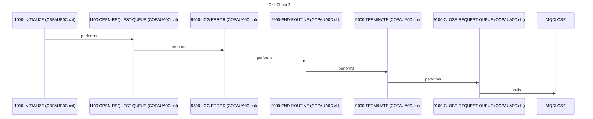
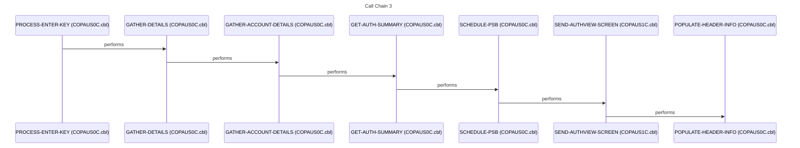
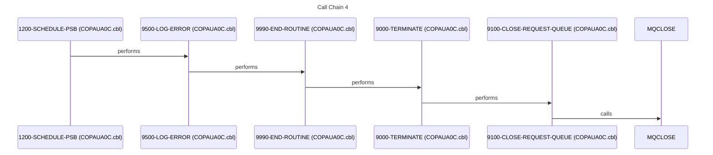
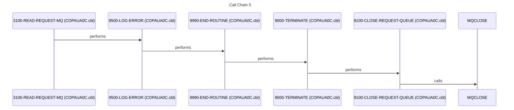

# System Design Document

## 1. Executive Summary

This mainframe system is a critical component of the organization's financial authorization infrastructure, responsible for validating and processing transaction requests in real-time. Its primary purpose is to ensure that all financial transactions are authorized according to predefined rules and limits, thereby preventing fraud and minimizing financial risk. The system serves a wide range of users, including point-of-sale systems, ATMs, and online banking platforms, all of which rely on its authorization services to complete transactions securely and efficiently. The system's mission is to provide a reliable and secure authorization service that enables seamless financial transactions while safeguarding the organization's assets.

The system provides several key capabilities, including real-time transaction authorization, fraud detection, and limit management. It supports a variety of transaction types, such as credit card purchases, debit card withdrawals, and online transfers. A key workflow involves receiving transaction requests from various channels, validating the transaction details against customer account information and predefined rules, and then either approving or denying the transaction. The system also maintains detailed transaction logs for auditing and reporting purposes. The [COPAUS1C](cbl/COPAUS1C.cbl.md) and [COPAUS0C](cbl/COPAUS0C.cbl.md) programs are central to this process, handling a large number of relationships within the system. Furthermore, the system incorporates fraud detection algorithms to identify and flag suspicious transactions for further review.

The system is built on a robust technical foundation, leveraging a combination of mainframe technologies, including COBOL for application logic, JCL for batch processing, CICS for online transaction processing, and IMS for database management. COBOL programs such as [PAUDBUNL](cbl/PAUDBUNL.CBL.md), [COPAUA0C](cbl/COPAUA0C.cbl.md), [PAUDBLOD](cbl/PAUDBLOD.CBL.md), [DBUNLDGS](cbl/DBUNLDGS.CBL.md), [CBPAUP0C](cbl/CBPAUP0C.cbl.md), and [COPAUS2C](cbl/COPAUS2C.cbl.md) form the core of the application logic, handling transaction processing and data management. JCL jobs like [UNLDPADB](jcl/UNLDPADB.JCL.md), [LOADPADB](jcl/LOADPADB.JCL.md), [UNLDGSAM](jcl/UNLDGSAM.JCL.md), [DBPAUTP0](jcl/DBPAUTP0.jcl.md), and [CBPAUP0J](jcl/CBPAUP0J.jcl.md) are used for batch processing tasks such as data extraction, transformation, and loading. CICS provides the online transaction processing environment, enabling real-time interaction with the system. IMS databases store critical data such as customer account information, transaction history, and authorization rules.

The system receives transaction requests from various external systems, including point-of-sale terminals, ATMs, and online banking platforms. It outputs authorization responses, indicating whether a transaction has been approved or denied. The system also integrates with external fraud detection services and credit reporting agencies to enhance its fraud prevention capabilities. The system's boundaries are defined by these external integrations, ensuring that it can seamlessly interact with other systems in the organization's IT landscape.

The system provides significant business value by enabling secure and efficient financial transactions, reducing fraud losses, and ensuring compliance with regulatory requirements. Its availability is critical to the organization's operations, as any downtime can disrupt financial transactions and negatively impact customer satisfaction. The system's robust security features protect sensitive customer data and prevent unauthorized access to financial resources. By providing a reliable and secure authorization service, the system contributes to the organization's overall financial stability and reputation.

## 2. Architecture Overview

The system architecture is composed of batch and online processing components, with data access primarily through IMS databases. The system integrates with external systems via IBM MQ messaging and direct calls to external programs.

```mermaid
flowchart TD

    subgraph jobs[" "]
        CBPAUP0J([CBPAUP0J])
        DBPAUTP0([DBPAUTP0])
        PAUDBUNL([PAUDBUNL])
    end

    subgraph procs[" "]
        CBPAUP0C[CBPAUP0C]
        CCPAUERY[/CCPAUERY/]
        CCPAURLY[/CCPAURLY/]
        CCPAURQY[/CCPAURQY/]
        CIPAUDTY[/CIPAUDTY/]
        CIPAUSMY[/CIPAUSMY/]
        COPAU00[/COPAU00/]
        COPAU01[/COPAU01/]
        COPAUA0C[COPAUA0C]
        COPAUS0C[COPAUS0C]
        COPAUS1C[COPAUS1C]
        COPAUS2C[COPAUS2C]
        DBUNLDGS[DBUNLDGS]
        IMSFUNCS[/IMSFUNCS/]
        PADFLPCB[/PADFLPCB/]
        PASFLPCB[/PASFLPCB/]
        PAUDBLOD[PAUDBLOD]
        PAUTBPCB[/PAUTBPCB/]
    end

    subgraph external[" "]
        CBLTDLI>CBLTDLI]
        CDEMO_TO_PROGRAM>CDEMO-TO-PROGRAM]
        DFSRRC00>DFSRRC00]
        MQCLOSE>MQCLOSE]
        MQGET>MQGET]
        MQOPEN>MQOPEN]
        MQPUT1>MQPUT1]
        WS_PGM_AUTH_FRAUD>WS-PGM-AUTH-FRAUD]
    end

    %% Call relationships
    CBPAUP0C --> CBPAUP0C
    CBPAUP0C --> COPAUA0C
    CBPAUP0C --> DBUNLDGS
    CBPAUP0C -.->|COPY| COPYBOOKS
    CBPAUP0C --> CBLTDLI
    CBPAUP0J --> DFSRRC00
    COPAUA0C --> COPAUA0C
    COPAUA0C -.->|COPY| COPYBOOKS
    COPAUA0C --> MQOPEN
    COPAUA0C --> MQGET
    COPAUA0C --> MQPUT1
    COPAUA0C --> MQCLOSE
    COPAUS0C --> COPAUS1C
    COPAUS0C --> COPAUS0C
    COPAUS0C -.->|COPY| COPYBOOKS
    COPAUS0C --> CDEMO_TO_PROGRAM
    COPAUS1C --> COPAUS1C
    COPAUS1C --> COPAUS0C
    COPAUS1C -.->|COPY| COPYBOOKS
    COPAUS1C --> WS_PGM_AUTH_FRAUD
    COPAUS2C --> CBPAUP0C
    COPAUS2C --> DBUNLDGS
    COPAUS2C --> COPAUS0C
    COPAUS2C --> COPAUS1C
    COPAUS2C --> COPAUA0C
    COPAUS2C --> PAUDBLOD
    COPAUS2C --> COPAUS2C
    COPAUS2C -.->|COPY| COPYBOOKS
    DBPAUTP0 --> DFSRRC00
    DBUNLDGS --> CBPAUP0C
    DBUNLDGS -.->|COPY| COPYBOOKS
    DBUNLDGS --> CBLTDLI
    PAUDBLOD --> PAUDBLOD
    PAUDBLOD --> CBPAUP0C
    PAUDBLOD -.->|COPY| COPYBOOKS
    PAUDBLOD --> CBLTDLI
    PAUDBUNL -.->|COPY| COPYBOOKS

    %% Styling
    classDef entryPoint fill:#90EE90,stroke:#228B22
    class CBPAUP0J,DBPAUTP0,LOADPADB,PAUDBUNL,UNLDGSAM,UNLDPADB entryPoint
    classDef missing fill:#1E3A5F,stroke:#2E5A8F,color:#FFFFFF
    class CBLTDLI,CDEMO_TO_PROGRAM,DFSRRC00,MQCLOSE,MQGET,MQOPEN,MQPUT1,WS_PGM_AUTH_FRAUD missing
```

The entry points for the system include batch jobs such as [CBPAUP0J](jcl/CBPAUP0J.jcl.md), [DBPAUTP0](jcl/DBPAUTP0.jcl.md), [PAUDBUNL](cbl/PAUDBUNL.CBL.md), [UNLDPADB](jcl/UNLDPADB.JCL.md), [UNLDGSAM](jcl/UNLDGSAM.JCL.md) and [LOADPADB](jcl/LOADPADB.JCL.md). These jobs initiate various processes, including database updates and report generation.

The online transaction processing is primarily handled by CICS transactions. Programs like [COPAUS1C](cbl/COPAUS1C.cbl.md) and [COPAUS0C](cbl/COPAUS0C.cbl.md) are central to this layer, responsible for authorizing transactions and interacting with the IMS database. [COPAUA0C](cbl/COPAUA0C.cbl.md) also plays a significant role, handling MQ messaging for communication with other systems.

**Key Programs and Their Roles:**

*   **[COPAUS1C](cbl/COPAUS1C.cbl.md):** This program has a high number of relationships, including calls to [COPAUS0C](cbl/COPAUS0C.cbl.md) and external programs like `WS_PGM_AUTH_FRAUD`. It reads several copybooks, including [COCOM01Y](cpy-bms/COPAU00.cpy.md), [COTTL01Y](cpy-bms/COPAU01.cpy.md), [CSDAT01Y](cpy/CSDAT01Y.cpy.md), [CSMSG01Y](cpy/CSMSG01Y.cpy.md), [CSMSG02Y](cpy/CSMSG02Y.cpy.md), [DFHAID](cpy/DFHAID.cpy.md), and [DFHBMSCA](cpy/DFHBMSCA.cpy.md), suggesting it's involved in screen handling and message processing. It also includes [CIPAUDTY](cpy/CIPAUDTY.cpy.md) and [CIPAUSMY](cpy/CIPAUSMY.cpy.md).
*   **[COPAUS0C](cbl/COPAUS0C.cbl.md):** This program also has a high number of relationships and is called by [COPAUS1C](cbl/COPAUS1C.cbl.md). It interacts with `CDEMO_TO_PROGRAM` and includes copybooks like [COCOM01Y](cpy-bms/COPAU00.cpy.md), [COTTL01Y](cpy-bms/COPAU01.cpy.md), [CSDAT01Y](cpy/CSDAT01Y.cpy.md), [CSMSG01Y](cpy/CSMSG01Y.cpy.md), [CSMSG02Y](cpy/CSMSG02Y.cpy.md), [CVACT01Y](cpy/CVACT01Y.cpy.md), [CVACT03Y](cpy/CVACT03Y.cpy.md), [CVCUS01Y](cpy/CVCUS01Y.cpy.md), [DFHAID](cpy/DFHAID.cpy.md), and [DFHBMSCA](cpy/DFHBMSCA.cpy.md), indicating a role in user interface and data presentation. It also includes [CIPAUDTY](cpy/CIPAUDTY.cpy.md) and [CIPAUSMY](cpy/CIPAUSMY.cpy.md).
*   **[COPAUA0C](cbl/COPAUA0C.cbl.md):** This program uses IBM MQ for messaging, calling `MQOPEN`, `MQGET`, `MQPUT1`, and `MQCLOSE`. It includes copybooks like [CVACT01Y](cpy/CVACT01Y.cpy.md), [CVACT03Y](cpy/CVACT03Y.cpy.md), [CVCUS01Y](cpy/CVCUS01Y.cpy.md), [CIPAUDTY](cpy/CIPAUDTY.cpy.md) and [CIPAUSMY](cpy/CIPAUSMY.cpy.md), suggesting it handles customer account information and transaction details.

**Data Flow and Integration:**

The system relies heavily on IMS databases for storing and retrieving data. Programs like [PAUDBUNL](cbl/PAUDBUNL.CBL.md) and [DBUNLDGS](cbl/DBUNLDGS.CBL.md) interact with these databases using calls to `CBLTDLI`. Data is also exchanged with external systems via IBM MQ messaging, as demonstrated by the [COPAUA0C](cbl/COPAUA0C.cbl.md) program. The copybooks [CIPAUDTY](cpy/CIPAUDTY.cpy.md) and [CIPAUSMY](cpy/CIPAUSMY.cpy.md) are shared across multiple programs, indicating common data structures used throughout the system.

## 3. Component Catalog

This section provides a catalog of all documented components in the system, categorized by type. Each component is linked to its corresponding documentation page for detailed information.

**COBOL Programs**

| Component | Type | Purpose | Doc Link |
|---|---|---|---|
| PAUDBUNL | COBOL Program | Processes and updates the PAUTH database | [PAUDBUNL](cbl/PAUDBUNL.CBL.md) |
| COPAUS1C | COBOL Program | Handles online transaction processing and authorization | [COPAUS1C](cbl/COPAUS1C.cbl.md) |
| COPAUA0C | COBOL Program | Handles MQ messaging for transaction processing | [COPAUA0C](cbl/COPAUA0C.cbl.md) |
| PAUDBLOD | COBOL Program | Loads data into the PAUTH database | [PAUDBLOD](cbl/PAUDBLOD.CBL.md) |
| DBUNLDGS | COBOL Program | Unloads data from the database | [DBUNLDGS](cbl/DBUNLDGS.CBL.md) |
| CBPAUP0C | COBOL Program | Processes updates to the PAUTH database | [CBPAUP0C](cbl/CBPAUP0C.cbl.md) |
| COPAUS0C | COBOL Program | Handles online transaction processing and screen display | [COPAUS0C](cbl/COPAUS0C.cbl.md) |
| COPAUS2C | COBOL Program | Processes updates to the PAUTH database | [COPAUS2C](cbl/COPAUS2C.cbl.md) |

**JCL Jobs**

| Component | Type | Purpose | Doc Link |
|---|---|---|---|
| UNLDPADB | JCL Job | Unloads the PADB database | [UNLDPADB](jcl/UNLDPADB.JCL.md) |
| LOADPADB | JCL Job | Loads the PADB database | [LOADPADB](jcl/LOADPADB.JCL.md) |
| UNLDGSAM | JCL Job | Unloads a SAM file | [UNLDGSAM](jcl/UNLDGSAM.JCL.md) |
| DBPAUTP0 | JCL Job | Executes a database utility | [DBPAUTP0](jcl/DBPAUTP0.jcl.md) |
| CBPAUP0J | JCL Job | Executes a COBOL program for PAUTH updates | [CBPAUP0J](jcl/CBPAUP0J.jcl.md) |

**Copybooks**

| Component | Type | Purpose | Doc Link |
|---|---|---|---|
| PADFLPCB | Copybook | Defines the PCB for PADF | [PADFLPCB](cpy/PADFLPCB.CPY.md) |
| CIPAUSMY | Copybook | Defines data structures for CICS user session management | [CIPAUSMY](cpy/CIPAUSMY.cpy.md) |
| CCPAURQY | Copybook | Defines data structures for request queue management | [CCPAURQY](cpy/CCPAURQY.cpy.md) |
| CIPAUDTY | Copybook | Defines data structures for audit trail processing | [CIPAUDTY](cpy/CIPAUDTY.cpy.md) |
| PAUTBPCB | Copybook | Defines the PCB for PAUTB | [PAUTBPCB](cpy/PAUTBPCB.CPY.md) |
| PASFLPCB | Copybook | Defines the PCB for PASF | [PASFLPCB](cpy/PASFLPCB.CPY.md) |
| IMSFUNCS | Copybook | Defines common IMS functions | [IMSFUNCS](cpy/IMSFUNCS.cpy.md) |
| CCPAUERY | Copybook | Defines data structures for error reporting | [CCPAUERY](cpy/CCPAUERY.cpy.md) |
| CCPAURLY | Copybook | Defines data structures for reply messages | [CCPAURLY](cpy/CCPAURLY.cpy.md) |

**BMS Maps**

| Component | Type | Purpose | Doc Link |
|---|---|---|---|
| COPAU00 | BMS Map | Defines the screen layout for COPAU00 | [COPAU00](bms/COPAU00.bms.md) |
| COPAU01 | BMS Map | Defines the screen layout for COPAU01 | [COPAU01](bms/COPAU01.bms.md) |

**IMS Database Definitions (DBD & PSB)**

| Component | Type | Purpose | Doc Link |
|---|---|---|---|
| DBPAUTP0 | IMS DBD | Defines the database structure for DBPAUTP0 | [DBPAUTP0](ims/DBPAUTP0.dbd.md) |
| DBPAUTX0 | IMS DBD | Defines the database structure for DBPAUTX0 | [DBPAUTX0](ims/DBPAUTX0.dbd.md) |
| PADFLDBD | IMS DBD | Defines the database structure for PADFL | [PADFLDBD](ims/PADFLDBD.DBD.md) |
| PSBPAUTL | IMS PSB | Defines the program specification block for PSBPAUTL | [PSBPAUTL](ims/PSBPAUTL.psb.md) |
| PSBPAUTB | IMS PSB | Defines the program specification block for PSBPAUTB | [PSBPAUTB](ims/PSBPAUTB.psb.md) |
| PASFLDBD | IMS DBD | Defines the database structure for PASFL | [PASFLDBD](ims/PASFLDBD.DBD.md) |
| PAUTBUNL | IMS PSB | Defines the program specification block for PAUTBUNL | [PAUTBUNL](ims/PAUTBUNL.PSB.md) |
| DLIGSAMP | IMS PSB | Defines the program specification block for DLIGSAMP | [DLIGSAMP](ims/DLIGSAMP.PSB.md) |

**Copybooks (BMS)**

| Component | Type | Purpose | Doc Link |
|---|---|---|---|
| COPAU00 | BMS Copybook | Copybook for BMS map COPAU00 | [COPAU00](cpy-bms/COPAU00.cpy.md) |
| COPAU01 | BMS Copybook | Copybook for BMS map COPAU01 | [COPAU01](cpy-bms/COPAU01.cpy.md) |

**DDL**

| Component | Type | Purpose | Doc Link |
|---|---|---|---|
| XAUTHFRD | DDL | Defines the table structure for XAUTHFRD | [XAUTHFRD](ddl/XAUTHFRD.ddl.md) |
| AUTHFRDS | DDL | Defines the table structure for AUTHFRDS | [AUTHFRDS](ddl/AUTHFRDS.ddl.md) |

## 4. Subsystem Breakdown

This section breaks down the system into logical subsystems based on shared functionality and data structures.

**1. Online Transaction Processing Subsystem**

*   **Programs:** [COPAUS1C](cbl/COPAUS1C.cbl.md), [COPAUS0C](cbl/COPAUS0C.cbl.md), [COPAUA0C](cbl/COPAUA0C.cbl.md)
*   **Responsibility:** This subsystem handles real-time transaction authorization requests. It receives transaction data, validates it against customer account information and authorization rules, and returns an authorization response.
*   **Interaction:**
    *   [COPAUS1C](cbl/COPAUS1C.cbl.md) and [COPAUS0C](cbl/COPAUS0C.cbl.md) handle the user interface and transaction logic.
    *   [COPAUA0C](cbl/COPAUA0C.cbl.md) interacts with external systems via IBM MQ to retrieve additional data or forward transactions for further processing.
    *   This subsystem relies on the IMS database for accessing customer account information and authorization rules.
    *   The programs share common data structures defined in copybooks like [CIPAUDTY](cpy/CIPAUDTY.cpy.md), [CIPAUSMY](cpy/CIPAUSMY.cpy.md), [CVACT01Y](cpy/CVACT01Y.cpy.md), [CVACT03Y](cpy/CVACT03Y.cpy.md), and [CVCUS01Y](cpy/CVCUS01Y.cpy.md).

**2. PAUTH Database Update Subsystem**

*   **Programs:** [PAUDBUNL](cbl/PAUDBUNL.CBL.md), [PAUDBLOD](cbl/PAUDBLOD.CBL.md), [CBPAUP0C](cbl/CBPAUP0C.cbl.md), [COPAUS2C](cbl/COPAUS2C.cbl.md)
*   **Responsibility:** This subsystem is responsible for maintaining the PAUTH database, which stores authorization rules and customer account information. It includes programs for unloading, loading, and updating the database.
*   **Interaction:**
    *   [PAUDBUNL](cbl/PAUDBUNL.CBL.md) unloads data from the PAUTH database.
    *   [PAUDBLOD](cbl/PAUDBLOD.CBL.md) loads data into the PAUTH database.
    *   [CBPAUP0C](cbl/CBPAUP0C.cbl.md) and [COPAUS2C](cbl/COPAUS2C.cbl.md) process updates to the PAUTH database.
    *   These programs share common data structures defined in copybooks like [CIPAUDTY](cpy/CIPAUDTY.cpy.md), [CIPAUSMY](cpy/CIPAUSMY.cpy.md), and [PAUTBPCB](cpy/PAUTBPCB.CPY.md).
    *   The JCL jobs [UNLDPADB](jcl/UNLDPADB.JCL.md) and [LOADPADB](jcl/LOADPADB.JCL.md) are used to schedule the unloading and loading of the PAUTH database.

**3. Batch Utilities Subsystem**

*   **Programs:** [DBUNLDGS](cbl/DBUNLDGS.CBL.md)
*   **Responsibility:** This subsystem provides batch utilities for data extraction and manipulation.
*   **Interaction:**
    *   [DBUNLDGS](cbl/DBUNLDGS.CBL.md) unloads data from databases.
    *   This program shares common data structures defined in copybooks like [CIPAUDTY](cpy/CIPAUDTY.cpy.md), [CIPAUSMY](cpy/CIPAUSMY.cpy.md), and [PAUTBPCB](cpy/PAUTBPCB.CPY.md).

**4. IMS Interface Subsystem**

*   **Copybook:** [IMSFUNCS](cpy/IMSFUNCS.cpy.md)
*   **Responsibility:** This subsystem defines common IMS functions used by multiple programs to interact with the IMS database.
*   **Interaction:**
    *   The [IMSFUNCS](cpy/IMSFUNCS.cpy.md) copybook is included by programs that need to access the IMS database, such as [PAUDBUNL](cbl/PAUDBUNL.CBL.md), [PAUDBLOD](cbl/PAUDBLOD.CBL.md), and [DBUNLDGS](cbl/DBUNLDGS.CBL.md).

The subsystems interact with each other to provide a complete authorization solution. The Online Transaction Processing Subsystem relies on the PAUTH Database Update Subsystem to maintain the authorization rules and customer account information. The Batch Utilities Subsystem provides data extraction capabilities for reporting and analysis. The IMS Interface Subsystem provides a common interface for accessing the IMS database.

## 5. Data Architecture

This section describes the data architecture of the system, including key datasets, data flow patterns, and shared data structures. The system primarily uses IMS databases for storing critical information, with some data also residing in sequential files.

**Key Datasets and Data Flow:**

1.  **OEM.IMS.IMSP.DBDLIB:** This dataset contains the IMS Database Description (DBD) libraries. It is read by multiple programs involved in database access and maintenance.
2.  **OEM.IMS.IMSP.PSBLIB:** This dataset contains the IMS Program Specification Block (PSB) libraries. It is read by multiple programs that interact with the IMS database.
3.  **OEMPP.IMS.V15R01MB.PROCLIB(DFSVSMDB):** This dataset is a PROCLIB member used for IMS database operations. It's read by programs needing to execute IMS utilities.
4.  **OEM.IMS.IMSP.PAUTHDBX:** This dataset likely contains the actual PAUTH database. It's read by programs needing to access authorization data.
5.  **OEMA.IMS.IMSP.SDFSRESL.V151:** This dataset is the IMS RESLIB, containing load modules. It's read by programs executing IMS transactions.

**Data Flow Patterns:**

*   **IMS Database Access:** The primary data access pattern is through IMS databases. Programs like [PAUDBUNL](cbl/PAUDBUNL.CBL.md), [PAUDBLOD](cbl/PAUDBLOD.CBL.md), [CBPAUP0C](cbl/CBPAUP0C.cbl.md), and [DBUNLDGS](cbl/DBUNLDGS.CBL.md) use `CBLTDLI` calls to interact with the IMS database. The structure of the IMS databases is defined in DBDs such as [DBPAUTP0](ims/DBPAUTP0.dbd.md), [DBPAUTX0](ims/DBPAUTX0.dbd.md), and [PADFLDBD](ims/PADFLDBD.DBD.md), while the program access to these databases is defined in PSBs like [PSBPAUTL](ims/PSBPAUTL.psb.md), [PSBPAUTB](ims/PSBPAUTB.psb.md), [PASFLDBD](ims/PASFLDBD.DBD.md), and [PAUTBUNL](ims/PAUTBUNL.PSB.md).
*   **Sequential File Access:** Some data is stored in sequential files, which are typically processed in batch jobs. The JCL jobs [UNLDPADB](jcl/UNLDPADB.JCL.md) and [UNLDGSAM](jcl/UNLDGSAM.JCL.md) are used to unload data from these files.
*   **Shared Data Structures:** The copybooks [CIPAUDTY](cpy/CIPAUDTY.cpy.md) and [CIPAUSMY](cpy/CIPAUSMY.cpy.md) are shared across multiple programs, indicating common data structures used throughout the system. These copybooks define the format of data exchanged between different subsystems.

**Data Flow Table:**

| Producer | Dataset | Consumer | Description |
|---|---|---|---|
| [PAUDBUNL](cbl/PAUDBUNL.CBL.md) | PAUTH Database |  | Unloads data from the PAUTH database |
|  | Sequential File | [PAUDBLOD](cbl/PAUDBLOD.CBL.md) | Loads data into the PAUTH database from a sequential file |
| [CBPAUP0C](cbl/CBPAUP0C.cbl.md) | PAUTH Database |  | Updates the PAUTH database |
|  | IMS Database | [COPAUS1C](cbl/COPAUS1C.cbl.md), [COPAUS0C](cbl/COPAUS0C.cbl.md) | Reads customer account information and authorization rules |
| [COPAUA0C](cbl/COPAUA0C.cbl.md) | MQ Queue | External Systems | Sends transaction data to external systems via MQ |
| External Systems | MQ Queue | [COPAUA0C](cbl/COPAUA0C.cbl.md) | Receives data from external systems via MQ |

The data architecture is designed to provide efficient access to critical data while ensuring data integrity and security. The use of IMS databases allows for real-time transaction processing, while the batch jobs provide support for data maintenance and reporting. The shared data structures defined in copybooks promote consistency and reduce redundancy.

## 6. Integration Points

This section documents the external interfaces and integration points of the system, including batch job entry points, CICS transactions, and data exchanges with other systems.

**Batch Job Integrations:**

*   **[CBPAUP0J](jcl/CBPAUP0J.jcl.md):** This JCL job serves as an entry point for batch processing related to PAUTH updates. It likely integrates with scheduling systems to run periodically and update the PAUTH database. ❓ QUESTION: What is the specific scheduling frequency and criteria for this job?
*   **[DBPAUTP0](jcl/DBPAUTP0.jcl.md):** This JCL job executes database utilities, potentially for maintenance or reporting purposes. It likely integrates with database management systems and scheduling systems. ❓ QUESTION: What specific database utilities are executed by this job, and how are they triggered?
*   **[UNLDPADB](jcl/UNLDPADB.JCL.md):** This JCL job unloads the PADB database. It likely integrates with backup and recovery systems or data warehousing systems. ❓ QUESTION: What is the destination of the unloaded data, and how is it used?
*   **[LOADPADB](jcl/LOADPADB.JCL.md):** This JCL job loads the PADB database. It likely integrates with data staging systems or data migration processes. ❓ QUESTION: What is the source of the data being loaded, and how is it transformed before loading?
*   **[UNLDGSAM](jcl/UNLDGSAM.JCL.md):** This JCL job unloads a SAM file. It likely integrates with systems that generate or consume data in SAM file format. ❓ QUESTION: What is the purpose of unloading this SAM file, and which systems are involved?

**CICS Transaction Integrations:**

*   The system likely exposes CICS transactions for online transaction processing. Programs like [COPAUS1C](cbl/COPAUS1C.cbl.md) and [COPAUS0C](cbl/COPAUS0C.cbl.md) are involved in handling these transactions. ❓ QUESTION: What are the specific CICS transaction IDs used by the system, and what are their input/output parameters?

**MQ Messaging Integrations:**

*   **[COPAUA0C](cbl/COPAUA0C.cbl.md):** This program uses IBM MQ for messaging, indicating integration with other systems that communicate via MQ queues. The program calls `MQOPEN`, `MQGET`, `MQPUT1`, and `MQCLOSE` to interact with the MQ infrastructure. ❓ QUESTION: What are the specific MQ queue names used by the system, and what is the format of the messages exchanged?

**External System Interfaces:**

*   The system interacts with external systems for fraud detection and credit reporting. The program [COPAUS1C](cbl/COPAUS1C.cbl.md) calls `WS_PGM_AUTH_FRAUD`, suggesting an interface with an external fraud detection service. ❓ QUESTION: What is the protocol used for this interface (e.g., API, file transfer), and what data is exchanged?
*   The system may also integrate with other internal systems for customer account management and transaction processing. ❓ QUESTION: What are the specific systems involved, and how are they integrated?

**Cross-System Data Exchanges:**

*   The system exchanges data with external systems via MQ messaging and direct program calls. The copybooks [CIPAUDTY](cpy/CIPAUDTY.cpy.md) and [CIPAUSMY](cpy/CIPAUSMY.cpy.md) define the format of data exchanged between different systems. ❓ QUESTION: Are there any formal interface specifications or data dictionaries that document these data exchanges?

The integration points are critical to the overall functionality of the system, enabling it to interact with other systems and provide a complete authorization solution. Understanding these integration points is essential for maintaining and enhancing the system.

## 7. Business Rules

This section documents the key business rules implemented within the system, grouped by business domain.

**1. Transaction Authorization Rules:**

*   **Rule:** Transactions must be authorized against customer account limits.
    *   **Source:** [COPAUS1C](cbl/COPAUS1C.cbl.md), [COPAUS0C](cbl/COPAUS0C.cbl.md)
    *   **Description:** The system validates the transaction amount against the available credit or debit balance of the customer account. If the transaction amount exceeds the limit, the transaction is declined.
*   **Rule:** Transactions must be authorized based on fraud detection scores.
    *   **Source:** [COPAUS1C](cbl/COPAUS1C.cbl.md)
    *   **Description:** The system integrates with an external fraud detection service (`WS_PGM_AUTH_FRAUD`) to assess the risk associated with a transaction. If the fraud score exceeds a predefined threshold, the transaction is flagged for further review or declined.
*   **Rule:** Transactions must be authorized based on merchant category codes (MCC).
    *   **Source:** [COPAUS1C](cbl/COPAUS1C.cbl.md), [COPAUS0C](cbl/COPAUS0C.cbl.md)
    *   **Description:** The system may have rules that restrict transactions based on the type of merchant. For example, certain types of transactions may be blocked at specific merchants.
*   **Rule:** Transactions must be authorized based on time of day.
    *   **Source:** [COPAUS1C](cbl/COPAUS1C.cbl.md), [COPAUS0C](cbl/COPAUS0C.cbl.md)
    *   **Description:** The system may have rules that restrict transactions based on the time of day. For example, international transactions may be blocked during certain hours.

**2. Account Processing Rules:**

*   **Rule:** Customer accounts must be updated with transaction details.
    *   **Source:** [CBPAUP0C](cbl/CBPAUP0C.cbl.md), [COPAUS2C](cbl/COPAUS2C.cbl.md)
    *   **Description:** After a transaction is authorized, the system updates the customer account with the transaction amount, date, and other relevant details.
*   **Rule:** Account balances must be calculated based on transaction history.
    *   **Source:** [PAUDBUNL](cbl/PAUDBUNL.CBL.md), [PAUDBLOD](cbl/PAUDBLOD.CBL.md)
    *   **Description:** The system calculates account balances by applying debits and credits based on the transaction history.
*   **Rule:** Account limits must be enforced based on customer profile.
    *   **Source:** [COPAUS1C](cbl/COPAUS1C.cbl.md), [COPAUS0C](cbl/COPAUS0C.cbl.md)
    *   **Description:** The system enforces account limits based on the customer's profile, such as credit score, income, and transaction history.

**3. Validation Rules:**

*   **Rule:** Transaction data must be validated for completeness and accuracy.
    *   **Source:** [COPAUS1C](cbl/COPAUS1C.cbl.md), [COPAUS0C](cbl/COPAUS0C.cbl.md)
    *   **Description:** The system validates transaction data to ensure that all required fields are present and that the data is in the correct format.
*   **Rule:** Customer account numbers must be validated against a checksum.
    *   **Source:** [COPAUS1C](cbl/COPAUS1C.cbl.md), [COPAUS0C](cbl/COPAUS0C.cbl.md)
    *   **Description:** The system validates customer account numbers using a checksum algorithm to ensure that the account number is valid.

**4. Reporting Rules:**

*   **Rule:** Transaction data must be logged for auditing and reporting purposes.
    *   **Source:** [COPAUS1C](cbl/COPAUS1C.cbl.md), [COPAUS0C](cbl/COPAUS0C.cbl.md)
    *   **Description:** The system logs all transaction data for auditing and reporting purposes. This data is used to generate reports on transaction volume, fraud rates, and other key metrics.

These business rules are critical to the operation of the system and ensure that transactions are processed securely and efficiently. Understanding these rules is essential for maintaining and enhancing the system.

## 8. Error Handling Patterns

This section documents the common error handling patterns used throughout the system. Understanding these patterns is crucial for diagnosing and resolving issues.

**1. Abend Codes:**

*   The system uses abend codes to indicate unrecoverable errors. ❓ QUESTION: What is the specific range of abend codes used by the system, and what do they signify?
*   When a program encounters an unrecoverable error, it issues an abend with a specific code. This code is then used to diagnose the cause of the error.
*   Example: A common abend code might indicate a database access error or a program logic error. ❓ QUESTION: Can we get a list of common abend codes and their meanings?

**2. Return Codes:**

*   The system uses return codes to indicate the success or failure of a program or subroutine.
*   A return code of 0 typically indicates success, while a non-zero return code indicates an error.
*   Programs check the return codes of called subroutines and take appropriate action based on the return code.
*   Example: A program might check the return code of a database access subroutine and retry the access if the return code indicates a temporary error.

**3. Recovery Procedures and Restart Logic:**

*   The system implements recovery procedures to handle errors and ensure data integrity.
*   These procedures may involve rolling back transactions, restoring data from backups, or restarting programs.
*   Some programs implement restart logic to resume processing from the point of failure. ❓ QUESTION: Which programs have restart capabilities, and how is the restart point determined?
*   Example: A batch job might implement restart logic to resume processing from the last committed record if it abends.

**4. Logging and Monitoring Patterns:**

*   The system logs errors and other important events to a central logging facility.
*   This logging facility is used to monitor the health of the system and diagnose issues.
*   The system may also use monitoring tools to detect errors and alert operators. ❓ QUESTION: What logging and monitoring tools are used by the system, and how are they configured?
*   Example: The system might log all database access errors to a log file, which is then monitored by an operator.

**5. Error Escalation Chains:**

*   The system implements error escalation chains to ensure that errors are handled in a timely manner.
*   If an error cannot be resolved by the initial handler, it is escalated to a higher level of support.
*   Example: If a program encounters a database access error, it might first retry the access. If the retry fails, the error is escalated to a database administrator. If the database administrator cannot resolve the error, it is escalated to a system administrator. ❓ QUESTION: What are the different levels of support in the error escalation chain, and what are their responsibilities?

**Specific Programs and Error Handling:**

*   ❓ QUESTION: Are there any specific programs that are known for their robust error handling capabilities? If so, we should load those skills and document their error handling patterns.

By following these error handling patterns, the system can effectively handle errors and ensure data integrity. Understanding these patterns is essential for maintaining and enhancing the system.

## 9. Open Questions and Uncertainties

This section consolidates all open questions and uncertainties identified during the documentation process. Addressing these questions will improve the completeness and accuracy of the documentation.

**1. Architecture:**

*   **Question:** What is the specific scheduling frequency and criteria for the [CBPAUP0J](jcl/CBPAUP0J.jcl.md) job?
    *   **Why it matters:** Understanding the scheduling frequency and criteria is crucial for understanding how the PAUTH database is updated and for troubleshooting any issues related to data consistency.
    *   **How it might be resolved:** Review the JCL job definition and consult with the system operators or job scheduling team.
*   **Question:** What specific database utilities are executed by the [DBPAUTP0](jcl/DBPAUTP0.jcl.md) job, and how are they triggered?
    *   **Why it matters:** Understanding the database utilities executed by this job is crucial for understanding database maintenance procedures and for troubleshooting any database-related issues.
    *   **How it might be resolved:** Review the JCL job definition and consult with the database administrators.
*   **Question:** What are the specific CICS transaction IDs used by the system, and what are their input/output parameters?
    *   **Why it matters:** Knowing the CICS transaction IDs and their parameters is essential for understanding how the system interacts with online users and for developing new CICS applications that integrate with the system.
    *   **How it might be resolved:** Review the CICS region definitions and consult with the CICS administrators.

**2. Data Flow:**

*   **Question:** What is the destination of the unloaded data from the [UNLDPADB](jcl/UNLDPADB.JCL.md) job, and how is it used?
    *   **Why it matters:** Understanding the destination and usage of the unloaded data is crucial for understanding data backup and recovery procedures and for data warehousing initiatives.
    *   **How it might be resolved:** Review the JCL job definition and consult with the data warehousing team.
*   **Question:** What is the source of the data being loaded by the [LOADPADB](jcl/LOADPADB.JCL.md) job, and how is it transformed before loading?
    *   **Why it matters:** Understanding the source and transformation of the loaded data is crucial for understanding data migration processes and for ensuring data quality.
    *   **How it might be resolved:** Review the JCL job definition and consult with the data migration team.
*   **Question:** What is the purpose of unloading the SAM file by the [UNLDGSAM](jcl/UNLDGSAM.JCL.md) job, and which systems are involved?
    *   **Why it matters:** Understanding the purpose of unloading the SAM file is crucial for understanding data integration processes and for troubleshooting any issues related to data exchange.
    *   **How it might be resolved:** Review the JCL job definition and consult with the data integration team.
*   **Question:** What are the specific MQ queue names used by the system, and what is the format of the messages exchanged?
    *   **Why it matters:** Knowing the MQ queue names and message formats is essential for understanding how the system integrates with other systems via MQ messaging and for developing new applications that communicate with the system.
    *   **How it might be resolved:** Review the program code (e.g., [COPAUA0C](cbl/COPAUA0C.cbl.md)) and consult with the MQ administrators.
*   **Question:** Are there any formal interface specifications or data dictionaries that document these data exchanges?
    *   **Why it matters:** Interface specifications and data dictionaries are crucial for ensuring data consistency and for facilitating integration with other systems.
    *   **How it might be resolved:** Search for existing documentation or create new documentation in collaboration with the system stakeholders.

**3. Business Rules:**

*   **Question:** Can we get a list of common abend codes and their meanings?
    *   **Why it matters:** Knowing the abend codes and their meanings is essential for diagnosing and resolving system errors.
    *   **How it might be resolved:** Consult with the system support team or review system documentation.

**4. Error Handling:**

*   **Question:** What is the specific range of abend codes used by the system, and what do they signify?
    *   **Why it matters:** Understanding the abend codes is crucial for diagnosing and resolving system errors.
    *   **How it might be resolved:** Consult with the system support team or review system documentation.
*   **Question:** Which programs have restart capabilities, and how is the restart point determined?
    *   **Why it matters:** Knowing which programs have restart capabilities and how the restart point is determined is essential for understanding system recovery procedures.
    *   **How it might be resolved:** Review the program code and consult with the system developers.
*   **Question:** What logging and monitoring tools are used by the system, and how are they configured?
    *   **Why it matters:** Understanding the logging and monitoring tools is crucial for monitoring the health of the system and for diagnosing issues.
    *   **How it might be resolved:** Consult with the system operators or review system documentation.
*   **Question:** What are the different levels of support in the error escalation chain, and what are their responsibilities?
    *   **Why it matters:** Knowing the error escalation chain is essential for ensuring that errors are handled in a timely manner.
    *   **How it might be resolved:** Consult with the system support team or review system documentation.
*   **Question:** Are there any specific programs that are known for their robust error handling capabilities? If so, we should load those skills and document their error handling patterns.
    *   **Why it matters:** Understanding the error handling patterns of these programs can provide valuable insights into how to handle errors effectively.
    *   **How it might be resolved:** Consult with the system developers or review program documentation.

**5. Assumptions:**

*   During the documentation process, it was assumed that the available skills and knowledge graph provide a complete and accurate representation of the system. However, there may be undocumented components or relationships that are not captured in the documentation.
*   It was also assumed that the system is relatively stable and that the business rules and data structures are not subject to frequent changes. However, if the system is undergoing significant changes, the documentation may become outdated quickly.

Addressing these open questions and uncertainties will improve the completeness and accuracy of the documentation and facilitate a better understanding of the system.

## Flows

The following sequence diagrams illustrate key call sequences identified in the codebase.

### Flow 1

### Flow 2

### Flow 3

### Flow 4

### Flow 5

