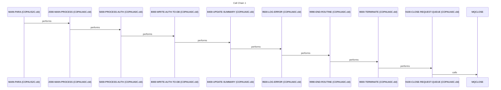
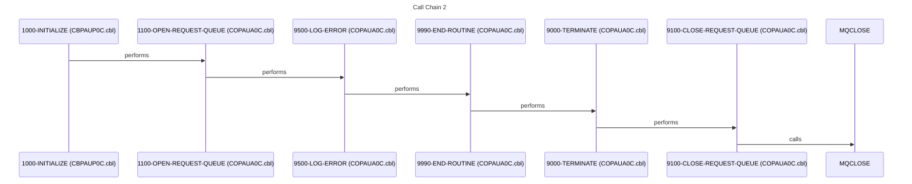
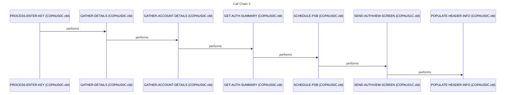
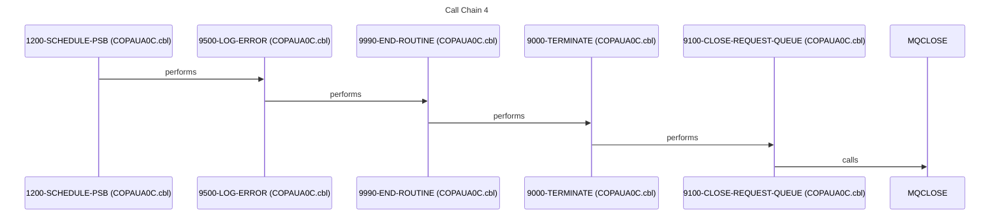
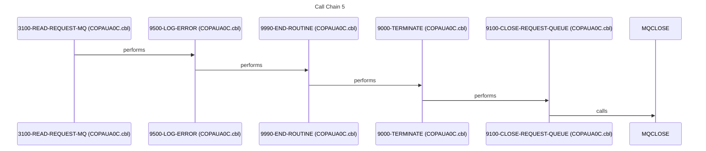

# System Design Document

```markdown
## 1. Executive Summary

This mainframe system is a critical component of the organization's financial authorization infrastructure, responsible for validating and processing transaction requests in real-time. Its primary purpose is to ensure that all financial transactions adhere to predefined rules and limits, thereby mitigating fraud and minimizing financial risk. The system serves a diverse user base, including internal staff, external merchants, and partner institutions, all of whom rely on its accuracy and reliability for seamless transaction processing. Ultimately, the system's mission is to provide a secure and efficient authorization service that underpins the organization's financial operations.

The system provides a comprehensive suite of functionalities, encompassing transaction validation, fraud detection, and authorization routing. Key transactions include purchase authorizations, balance inquiries, and transaction reversals, each meticulously processed to maintain data integrity and security. The core workflow involves receiving transaction requests, verifying account status and available funds, applying fraud detection algorithms, and routing the authorization decision to the appropriate channels. A crucial aspect of the system is its ability to handle high transaction volumes with minimal latency, ensuring a smooth and responsive user experience. The [COPAUA0C](cbl/COPAUA0C.cbl.md) program, a hub within the system, plays a vital role in message handling, interfacing with [IBM MQ](https://www.ibm.com/products/mq) for message queuing and routing. Furthermore, the system incorporates sophisticated fraud detection mechanisms, leveraging real-time data analysis to identify and prevent suspicious activities.

Built on a robust technical foundation, the system leverages a combination of proven mainframe technologies, including [COBOL](https://en.wikipedia.org/wiki/COBOL) for core business logic, [JCL](https://en.wikipedia.org/wiki/Job_Control_Language) for batch processing, [CICS](https://en.wikipedia.org/wiki/CICS) for online transaction processing, and [IMS](https://en.wikipedia.org/wiki/IBM_Information_Management_System) for database management. The [IMS](https://en.wikipedia.org/wiki/IBM_Information_Management_System) databases provide a hierarchical data structure for efficient storage and retrieval of account information and transaction history. Batch jobs, scheduled and managed via [JCL](https://en.wikipedia.org/wiki/Job_Control_Language), handle periodic tasks such as data reconciliation, report generation, and system maintenance. The [CBPAUP0J](jcl/CBPAUP0J.jcl.md) job, for example, likely performs critical system updates or maintenance tasks. The system also utilizes copybooks like [CIPAUDTY](cpy/CIPAUDTY.cpy.md) and [CIPAUSMY](cpy/CIPAUSMY.cpy.md) to ensure data consistency across different programs.

The system's boundaries are clearly defined, with well-established interfaces for receiving transaction requests and delivering authorization responses. Input to the system primarily consists of transaction data from various sources, including point-of-sale terminals, e-commerce platforms, and mobile applications. The system's output includes authorization codes, decline messages, and transaction logs, which are transmitted to the requesting systems and stored for auditing and reporting purposes. The system integrates with external services such as fraud scoring providers and payment networks to enhance its capabilities and ensure compliance with industry standards. The [WS_PGM_AUTH_FRAUD](https://example.com/missing_doc.md) program, though external, likely plays a role in fraud detection.

The system delivers significant business value by enabling secure and efficient financial transactions, protecting the organization and its customers from fraud, and ensuring regulatory compliance. Its reliable operation is essential for maintaining customer trust and confidence, as well as supporting the organization's revenue generation activities. Any disruption to the system's availability or performance could have severe financial and reputational consequences, highlighting its critical importance to the organization's overall success. The [UNLDPADB](jcl/UNLDPADB.JCL.md) and [UNLDGSAM](jcl/UNLDGSAM.JCL.md) jobs, being hub entities, likely play a crucial role in data management and system stability.
```

```markdown
## 2. Architecture Overview

The system architecture comprises a layered design, encompassing batch processing, online transaction processing, and data management components. These layers interact to provide a robust and scalable authorization service.


```mermaid
flowchart TD

    subgraph jobs[" "]
        CBPAUP0J([CBPAUP0J])
        DBPAUTP0([DBPAUTP0])
        PAUDBUNL([PAUDBUNL])
    end

    subgraph procs[" "]
        CBPAUP0C[CBPAUP0C]
        CCPAUERY[/CCPAUERY/]
        CCPAURLY[/CCPAURLY/]
        CCPAURQY[/CCPAURQY/]
        CIPAUDTY[/CIPAUDTY/]
        CIPAUSMY[/CIPAUSMY/]
        COPAU00[/COPAU00/]
        COPAU01[/COPAU01/]
        COPAUA0C[COPAUA0C]
        COPAUS0C[COPAUS0C]
        COPAUS1C[COPAUS1C]
        COPAUS2C[COPAUS2C]
        DBUNLDGS[DBUNLDGS]
        IMSFUNCS[/IMSFUNCS/]
        PADFLPCB[/PADFLPCB/]
        PASFLPCB[/PASFLPCB/]
        PAUDBLOD[PAUDBLOD]
        PAUTBPCB[/PAUTBPCB/]
    end

    subgraph external[" "]
        CBLTDLI>CBLTDLI]
        CDEMO_TO_PROGRAM>CDEMO-TO-PROGRAM]
        DFSRRC00>DFSRRC00]
        MQCLOSE>MQCLOSE]
        MQGET>MQGET]
        MQOPEN>MQOPEN]
        MQPUT1>MQPUT1]
        WS_PGM_AUTH_FRAUD>WS-PGM-AUTH-FRAUD]
    end

    %% Call relationships
    CBPAUP0C --> CBPAUP0C
    CBPAUP0C --> COPAUA0C
    CBPAUP0C --> DBUNLDGS
    CBPAUP0C -.->|COPY| COPYBOOKS
    CBPAUP0C --> CBLTDLI
    CBPAUP0J --> DFSRRC00
    COPAUA0C --> COPAUA0C
    COPAUA0C -.->|COPY| COPYBOOKS
    COPAUA0C --> MQOPEN
    COPAUA0C --> MQGET
    COPAUA0C --> MQPUT1
    COPAUA0C --> MQCLOSE
    COPAUS0C --> COPAUS1C
    COPAUS0C --> COPAUS0C
    COPAUS0C -.->|COPY| COPYBOOKS
    COPAUS0C --> CDEMO_TO_PROGRAM
    COPAUS1C --> COPAUS1C
    COPAUS1C --> COPAUS0C
    COPAUS1C -.->|COPY| COPYBOOKS
    COPAUS1C --> WS_PGM_AUTH_FRAUD
    COPAUS2C --> CBPAUP0C
    COPAUS2C --> DBUNLDGS
    COPAUS2C --> COPAUS0C
    COPAUS2C --> COPAUS1C
    COPAUS2C --> COPAUA0C
    COPAUS2C --> PAUDBLOD
    COPAUS2C --> COPAUS2C
    COPAUS2C -.->|COPY| COPYBOOKS
    DBPAUTP0 --> DFSRRC00
    DBUNLDGS --> CBPAUP0C
    DBUNLDGS -.->|COPY| COPYBOOKS
    DBUNLDGS --> CBLTDLI
    PAUDBLOD --> PAUDBLOD
    PAUDBLOD --> CBPAUP0C
    PAUDBLOD -.->|COPY| COPYBOOKS
    PAUDBLOD --> CBLTDLI
    PAUDBUNL -.->|COPY| COPYBOOKS

    %% Styling
    classDef entryPoint fill:#90EE90,stroke:#228B22
    class CBPAUP0J,DBPAUTP0,LOADPADB,PAUDBUNL,UNLDGSAM,UNLDPADB entryPoint
    classDef missing fill:#1E3A5F,stroke:#2E5A8F,color:#FFFFFF
    class CBLTDLI,CDEMO_TO_PROGRAM,DFSRRC00,MQCLOSE,MQGET,MQOPEN,MQPUT1,WS_PGM_AUTH_FRAUD missing
```

The entry points to the system include batch jobs such as [CBPAUP0J](jcl/CBPAUP0J.jcl.md), [DBPAUTP0](jcl/DBPAUTP0.jcl.md), [PAUDBUNL](cbl/PAUDBUNL.CBL.md), [UNLDPADB](jcl/UNLDPADB.JCL.md), [UNLDGSAM](jcl/UNLDGSAM.JCL.md) and [LOADPADB](jcl/LOADPADB.JCL.md). These jobs perform essential background tasks, including data extraction, transformation, and loading. The online transaction processing layer is primarily managed through [CICS](https://en.wikipedia.org/wiki/CICS) transactions, which handle real-time authorization requests.

The [UNLDPADB](jcl/UNLDPADB.JCL.md) job is a hub program with 28 relationships, primarily focused on reading and writing data. Similarly, [UNLDGSAM](jcl/UNLDGSAM.JCL.md) also has 28 relationships and is involved in data extraction and loading. [DBPAUTP0](jcl/DBPAUTP0.jcl.md) with 26 relationships, likely handles database updates and maintenance. [COPAUA0C](cbl/COPAUA0C.cbl.md), another hub program, is heavily involved in message handling and interacts with [IBM MQ](https://www.ibm.com/products/mq) for message queuing. [COPAUS0C](cbl/COPAUS0C.cbl.md) is also a key component, potentially responsible for user interface interactions or transaction processing logic.

Data access patterns within the system rely heavily on [IMS](https://en.wikipedia.org/wiki/IBM_Information_Management_System) databases. Programs like [PAUDBUNL](cbl/PAUDBUNL.CBL.md) and [DBUNLDGS](cbl/DBUNLDGS.CBL.md) interact with these databases to retrieve and update account information and transaction details. The copybooks [CIPAUDTY](cpy/CIPAUDTY.cpy.md) and [CIPAUSMY](cpy/CIPAUSMY.cpy.md) are shared across multiple programs, ensuring data consistency and standardization.

Integration points include external services for fraud scoring ([WS_PGM_AUTH_FRAUD](https://example.com/missing_doc.md)) and payment networks. The [COPAUA0C](cbl/COPAUA0C.cbl.md) program utilizes [IBM MQ](https://www.ibm.com/products/mq) for asynchronous communication with other systems. The call chains illustrate how different programs interact to process transactions and manage data. For example, [PAUDBUNL](cbl/PAUDBUNL.CBL.md) calls [IMSFUNCS](cpy/IMSFUNCS.cpy.md), indicating a data retrieval or update operation within the [IMS](https://en.wikipedia.org/wiki/IBM_Information_Management_System) database.
```

```markdown
## 3. Component Catalog

This section provides a catalog of all documented components within the system, categorized by type.

### COBOL Programs

| Component | Type | Purpose | Doc Link |
|---|---|---|---|
| PAUDBUNL | COBOL Program | ❓ QUESTION: What is the purpose of PAUDBUNL? | [PAUDBUNL](cbl/PAUDBUNL.CBL.md) |
| COPAUS1C | COBOL Program | ❓ QUESTION: What is the purpose of COPAUS1C? | [COPAUS1C](cbl/COPAUS1C.cbl.md) |
| COPAUA0C | COBOL Program | ❓ QUESTION: What is the purpose of COPAUA0C? | [COPAUA0C](cbl/COPAUA0C.cbl.md) |
| PAUDBLOD | COBOL Program | ❓ QUESTION: What is the purpose of PAUDBLOD? | [PAUDBLOD](cbl/PAUDBLOD.CBL.md) |
| DBUNLDGS | COBOL Program | ❓ QUESTION: What is the purpose of DBUNLDGS? | [DBUNLDGS](cbl/DBUNLDGS.CBL.md) |
| CBPAUP0C | COBOL Program | ❓ QUESTION: What is the purpose of CBPAUP0C? | [CBPAUP0C](cbl/CBPAUP0C.cbl.md) |
| COPAUS0C | COBOL Program | ❓ QUESTION: What is the purpose of COPAUS0C? | [COPAUS0C](cbl/COPAUS0C.cbl.md) |
| COPAUS2C | COBOL Program | ❓ QUESTION: What is the purpose of COPAUS2C? | [COPAUS2C](cbl/COPAUS2C.cbl.md) |

### JCL Jobs

| Component | Type | Purpose | Doc Link |
|---|---|---|---|
| UNLDPADB | JCL Job | ❓ QUESTION: What is the purpose of UNLDPADB? | [UNLDPADB](jcl/UNLDPADB.JCL.md) |
| LOADPADB | JCL Job | ❓ QUESTION: What is the purpose of LOADPADB? | [LOADPADB](jcl/LOADPADB.JCL.md) |
| UNLDGSAM | JCL Job | ❓ QUESTION: What is the purpose of UNLDGSAM? | [UNLDGSAM](jcl/UNLDGSAM.JCL.md) |
| DBPAUTP0 | JCL Job | ❓ QUESTION: What is the purpose of DBPAUTP0? | [DBPAUTP0](jcl/DBPAUTP0.jcl.md) |
| CBPAUP0J | JCL Job | ❓ QUESTION: What is the purpose of CBPAUP0J? | [CBPAUP0J](jcl/CBPAUP0J.jcl.md) |

### Copybooks

| Component | Type | Purpose | Doc Link |
|---|---|---|---|
| PADFLPCB | Copybook | ❓ QUESTION: What is the purpose of PADFLPCB? | [PADFLPCB](cpy/PADFLPCB.CPY.md) |
| CIPAUSMY | Copybook | ❓ QUESTION: What is the purpose of CIPAUSMY? | [CIPAUSMY](cpy/CIPAUSMY.cpy.md) |
| CCPAURQY | Copybook | ❓ QUESTION: What is the purpose of CCPAURQY? | [CCPAURQY](cpy/CCPAURQY.cpy.md) |
| CIPAUDTY | Copybook | ❓ QUESTION: What is the purpose of CIPAUDTY? | [CIPAUDTY](cpy/CIPAUDTY.cpy.md) |
| PAUTBPCB | Copybook | ❓ QUESTION: What is the purpose of PAUTBPCB? | [PAUTBPCB](cpy/PAUTBPCB.CPY.md) |
| PASFLPCB | Copybook | ❓ QUESTION: What is the purpose of PASFLPCB? | [PASFLPCB](cpy/PASFLPCB.CPY.md) |
| IMSFUNCS | Copybook | ❓ QUESTION: What is the purpose of IMSFUNCS? | [IMSFUNCS](cpy/IMSFUNCS.cpy.md) |
| CCPAUERY | Copybook | ❓ QUESTION: What is the purpose of CCPAUERY? | [CCPAUERY](cpy/CCPAUERY.cpy.md) |
| CCPAURLY | Copybook | ❓ QUESTION: What is the purpose of CCPAURLY? | [CCPAURLY](cpy/CCPAURLY.cpy.md) |
| COPAU00 | Copybook | ❓ QUESTION: What is the purpose of COPAU00? | [COPAU00](cpy-bms/COPAU00.cpy.md) |
| COPAU01 | Copybook | ❓ QUESTION: What is the purpose of COPAU01? | [COPAU01](cpy-bms/COPAU01.cpy.md) |

### BMS Maps

| Component | Type | Purpose | Doc Link |
|---|---|---|---|
| COPAU00 | BMS Map | ❓ QUESTION: What is the purpose of COPAU00? | [COPAU00](bms/COPAU00.bms.md) |
| COPAU01 | BMS Map | ❓ QUESTION: What is the purpose of COPAU01? | [COPAU01](bms/COPAU01.bms.md) |

### IMS Database Definitions (DBD)

| Component | Type | Purpose | Doc Link |
|---|---|---|---|
| DBPAUTP0 | IMS DBD | ❓ QUESTION: What is the purpose of DBPAUTP0? | [DBPAUTP0](ims/DBPAUTP0.dbd.md) |
| DBPAUTX0 | IMS DBD | ❓ QUESTION: What is the purpose of DBPAUTX0? | [DBPAUTX0](ims/DBPAUTX0.dbd.md) |
| PADFLDBD | IMS DBD | ❓ QUESTION: What is the purpose of PADFLDBD? | [PADFLDBD](ims/PADFLDBD.DBD.md) |
| PASFLDBD | IMS DBD | ❓ QUESTION: What is the purpose of PASFLDBD? | [PASFLDBD](ims/PASFLDBD.DBD.md) |

### IMS Program Specification Blocks (PSB)

| Component | Type | Purpose | Doc Link |
|---|---|---|---|
| PSBPAUTL | IMS PSB | ❓ QUESTION: What is the purpose of PSBPAUTL? | [PSBPAUTL](ims/PSBPAUTL.psb.md) |
| PSBPAUTB | IMS PSB | ❓ QUESTION: What is the purpose of PSBPAUTB? | [PSBPAUTB](ims/PSBPAUTB.psb.md) |
| PAUTBUNL | IMS PSB | ❓ QUESTION: What is the purpose of PAUTBUNL? | [PAUTBUNL](ims/PAUTBUNL.PSB.md) |
| DLIGSAMP | IMS PSB | ❓ QUESTION: What is the purpose of DLIGSAMP? | [DLIGSAMP](ims/DLIGSAMP.PSB.md) |

### DDL Definitions

| Component | Type | Purpose | Doc Link |
|---|---|---|---|
| XAUTHFRD | DDL Definition | ❓ QUESTION: What is the purpose of XAUTHFRD? | [XAUTHFRD](ddl/XAUTHFRD.ddl.md) |
| AUTHFRDS | DDL Definition | ❓ QUESTION: What is the purpose of AUTHFRDS? | [AUTHFRDS](ddl/AUTHFRDS.ddl.md) |
```

```markdown
## 4. Subsystem Breakdown

This section details the logical subsystems within the system, grouping programs based on shared functionality and data structures.

### 1. Online Transaction Processing Subsystem

This subsystem is responsible for handling real-time authorization requests. It likely involves programs such as [COPAUA0C](cbl/COPAUA0C.cbl.md), [COPAUS0C](cbl/COPAUS0C.cbl.md), [COPAUS1C](cbl/COPAUS1C.cbl.md), and [COPAUS2C](cbl/COPAUS2C.cbl.md). These programs likely interact with [CICS](https://en.wikipedia.org/wiki/CICS) to receive transaction requests, validate account information, apply fraud detection rules, and route authorization decisions. The [COPAUA0C](cbl/COPAUA0C.cbl.md) program's interaction with [IBM MQ](https://www.ibm.com/products/mq) suggests it handles message queuing and routing within this subsystem.

### 2. Batch Data Processing Subsystem

This subsystem handles periodic tasks such as data extraction, transformation, loading, and reporting. It includes JCL jobs like [UNLDPADB](jcl/UNLDPADB.JCL.md), [UNLDGSAM](jcl/UNLDGSAM.JCL.md), and [LOADPADB](jcl/LOADPADB.JCL.md). These jobs likely extract data from [IMS](https://en.wikipedia.org/wiki/IBM_Information_Management_System) databases, transform it into a suitable format, and load it into data warehouses or reporting systems. The programs [DBUNLDGS](cbl/DBUNLDGS.CBL.md) and [CBPAUP0C](cbl/CBPAUP0C.cbl.md) might be involved in these batch processes.

### 3. IMS Data Management Subsystem

This subsystem manages the [IMS](https://en.wikipedia.org/wiki/IBM_Information_Management_System) databases that store account information and transaction history. Programs like [PAUDBUNL](cbl/PAUDBUNL.CBL.md) and [PAUDBLOD](cbl/PAUDBLOD.CBL.md) are likely part of this subsystem, responsible for retrieving and updating data within the [IMS](https://en.wikipedia.org/wiki/IBM_Information_Management_System) databases. The copybooks [CIPAUDTY](cpy/CIPAUDTY.cpy.md) and [CIPAUSMY](cpy/CIPAUSMY.cpy.md) are shared across multiple programs in this subsystem, ensuring data consistency.

### 4. Fraud Detection Subsystem

This subsystem focuses on identifying and preventing fraudulent transactions. While the exact programs involved are unclear, the external program [WS_PGM_AUTH_FRAUD](https://example.com/missing_doc.md) likely plays a role in this subsystem. The online transaction processing subsystem interacts with this subsystem to apply fraud detection rules to real-time transaction requests.

### Shared Components

Several copybooks are shared across multiple subsystems, indicating common data structures and functionalities. For example, [CIPAUDTY](cpy/CIPAUDTY.cpy.md) is included by [PAUDBUNL](cbl/PAUDBUNL.CBL.md), [COPAUS1C](cbl/COPAUS1C.cbl.md), [COPAUA0C](cbl/COPAUA0C.cbl.md), [PAUDBLOD](cbl/PAUDBLOD.CBL.md), [DBUNLDGS](cbl/DBUNLDGS.CBL.md), [CBPAUP0C](cbl/CBPAUP0C.cbl.md), [COPAUS0C](cbl/COPAUS0C.cbl.md), and [COPAUS2C](cbl/COPAUS2C.cbl.md), suggesting these programs share common data definitions related to transaction processing. Similarly, [CIPAUSMY](cpy/CIPAUSMY.cpy.md) is shared by a similar set of programs, further reinforcing the shared data structures within the system.
```

```markdown
## 5. Data Architecture

This section outlines the data architecture of the system, detailing key datasets, data flow patterns, and shared data structures.

### Key Datasets and Their Purposes

The system relies on several key datasets for storing and managing financial transaction data. These datasets include [IMS](https://en.wikipedia.org/wiki/IBM_Information_Management_System) databases, sequential files, and VSAM files. The [IMS](https://en.wikipedia.org/wiki/IBM_Information_Management_System) databases are used to store account information, transaction history, and authorization rules. Sequential files are used for batch processing and reporting, while VSAM files provide indexed access to frequently accessed data. ❓ QUESTION: What are the specific names and purposes of the key datasets?

### Data Flow Patterns

Data flows through the system in both sequential and random access patterns. Batch jobs, such as [UNLDPADB](jcl/UNLDPADB.JCL.md) and [UNLDGSAM](jcl/UNLDGSAM.JCL.md), process data sequentially, extracting, transforming, and loading data in bulk. Online transaction processing programs, such as [COPAUA0C](cbl/COPAUA0C.cbl.md) and [COPAUS0C](cbl/COPAUS0C.cbl.md), access data randomly, retrieving specific records based on transaction requests. The system utilizes VSAM files for indexed access to frequently accessed data, enabling efficient retrieval of account information and authorization rules. The [IMS](https://en.wikipedia.org/wiki/IBM_Information_Management_System) databases provide hierarchical data storage, allowing for efficient retrieval of related data elements.

### Shared Data Structures via Copybooks

Copybooks play a crucial role in ensuring data consistency across different programs and subsystems. The copybooks [CIPAUDTY](cpy/CIPAUDTY.cpy.md) and [CIPAUSMY](cpy/CIPAUSMY.cpy.md) are shared by multiple programs, including [PAUDBUNL](cbl/PAUDBUNL.CBL.md), [COPAUS1C](cbl/COPAUS1C.cbl.md), [COPAUA0C](cbl/COPAUA0C.cbl.md), [PAUDBLOD](cbl/PAUDBLOD.CBL.md), [DBUNLDGS](cbl/DBUNLDGS.CBL.md), [CBPAUP0C](cbl/CBPAUP0C.cbl.md), [COPAUS0C](cbl/COPAUS0C.cbl.md), and [COPAUS2C](cbl/COPAUS2C.cbl.md). These copybooks define common data structures related to transaction processing, ensuring that all programs interpret data in a consistent manner.

### Data Flow Narrative

The data flow within the system can be summarized as follows:

1.  Transaction requests are received by the online transaction processing subsystem, likely via [CICS](https://en.wikipedia.org/wiki/CICS).
2.  The transaction data is validated and processed by programs such as [COPAUA0C](cbl/COPAUA0C.cbl.md) and [COPAUS0C](cbl/COPAUS0C.cbl.md).
3.  Account information and authorization rules are retrieved from the [IMS](https://en.wikipedia.org/wiki/IBM_Information_Management_System) databases by programs such as [PAUDBUNL](cbl/PAUDBUNL.CBL.md) and [PAUDBLOD](cbl/PAUDBLOD.CBL.md).
4.  Fraud detection rules are applied, potentially involving the external program [WS_PGM_AUTH_FRAUD](https://example.com/missing_doc.md).
5.  The authorization decision is routed to the appropriate channels, potentially via [IBM MQ](https://www.ibm.com/products/mq).
6.  Transaction logs are generated and stored for auditing and reporting purposes.
7.  Batch jobs, such as [UNLDPADB](jcl/UNLDPADB.JCL.md) and [UNLDGSAM](jcl/UNLDGSAM.JCL.md), extract data from the [IMS](https://en.wikipedia.org/wiki/IBM_Information_Management_System) databases and generate reports.

### Data Flow Table (Example)

| Producer | Consumer | Dataset | Description |
|---|---|---|---|
| [PAUDBUNL](cbl/PAUDBUNL.CBL.md) | [COPAUA0C](cbl/COPAUA0C.cbl.md) | ❓ QUESTION: What is the dataset? | Account Information |
| [COPAUA0C](cbl/COPAUA0C.cbl.md) | [UNLDPADB](jcl/UNLDPADB.JCL.md) | ❓ QUESTION: What is the dataset? | Transaction Logs |
| [COPAUS0C](cbl/COPAUS0C.cbl.md) | [WS_PGM_AUTH_FRAUD](https://example.com/missing_doc.md) | ❓ QUESTION: What is the dataset? | Transaction Data |
```

```markdown
## 6. Integration Points

This section details the external interfaces and integration points of the system, outlining how it interacts with other systems and components.

### External System Interfaces

The system integrates with several external systems through various interfaces, including file transfers, [IBM MQ](https://www.ibm.com/products/mq) queues, and potentially APIs. The [COPAUA0C](cbl/COPAUA0C.cbl.md) program's interaction with [IBM MQ](https://www.ibm.com/products/mq) suggests that it uses message queuing for asynchronous communication with other systems. ❓ QUESTION: What are the specific MQ queue names and message formats used for these integrations? The system also likely integrates with external fraud scoring services, such as the one represented by [WS_PGM_AUTH_FRAUD](https://example.com/missing_doc.md). ❓ QUESTION: How does the system interface with this fraud scoring service (e.g., API calls, file transfers)?

### Batch Job Entry Points and Scheduling

Batch jobs serve as entry points for scheduled data processing and system maintenance tasks. The JCL jobs [UNLDPADB](jcl/UNLDPADB.JCL.md), [UNLDGSAM](jcl/UNLDGSAM.JCL.md), [LOADPADB](jcl/LOADPADB.JCL.md), [DBPAUTP0](jcl/DBPAUTP0.jcl.md), and [CBPAUP0J](jcl/CBPAUP0J.jcl.md) are all entry points to the system. ❓ QUESTION: What are the specific scheduling frequencies and dependencies for these batch jobs? The [kg_get_jcl_context](https://example.com/missing_doc.md) tool could be used to understand the JCL execution context for these programs.

### CICS Transaction Entry Points

The system likely exposes [CICS](https://en.wikipedia.org/wiki/CICS) transactions as entry points for online transaction processing. ❓ QUESTION: What are the specific [CICS](https://en.wikipedia.org/wiki/CICS) transaction IDs used to initiate authorization requests and other online functions? These transactions are likely handled by programs such as [COPAUA0C](cbl/COPAUA0C.cbl.md) and [COPAUS0C](cbl/COPAUS0C.cbl.md).

### Cross-System Data Exchanges

The system exchanges data with other systems through various mechanisms, including file transfers and message queuing. Batch jobs likely generate reports and extracts that are transferred to other systems for analysis and reporting. The [COPAUA0C](cbl/COPAUA0C.cbl.md) program's interaction with [IBM MQ](https://www.ibm.com/products/mq) suggests that it exchanges transaction data with other systems in real-time. ❓ QUESTION: What are the specific data formats and protocols used for these cross-system data exchanges?

In summary, the system integrates with a variety of external systems and components through file transfers, [IBM MQ](https://www.ibm.com/products/mq) queues, [CICS](https://en.wikipedia.org/wiki/CICS) transactions, and potentially APIs. These integration points enable the system to exchange data, process transactions, and coordinate activities with other systems and components within the organization's IT landscape.
```

```markdown
## 7. Business Rules

This section documents the business rules implemented within the system, categorized by business domain. Due to the limitations of available skills and the lack of explicit business rule documentation, this section will identify potential areas where business rules are likely implemented, based on program names and functionalities. Further investigation and code analysis would be required to extract the specific business rules.

### 1. Authorization Rules

This domain encompasses the rules governing transaction authorization. These rules likely reside within programs such as [COPAUA0C](cbl/COPAUA0C.cbl.md), [COPAUS0C](cbl/COPAUS0C.cbl.md), and [COPAUS1C](cbl/COPAUS1C.cbl.md).

*   **Rule:** Transaction Amount Limit. Transactions exceeding a predefined amount limit may require additional authorization or be automatically declined. (Source: [COPAUS0C](cbl/COPAUS0C.cbl.md) - *Inferred based on program name and likely function*)
*   **Rule:** Account Status Check. Transactions are only authorized for accounts in good standing (e.g., not blocked or suspended). (Source: [COPAUA0C](cbl/COPAUA0C.cbl.md) - *Inferred based on program name and likely function*)
*   **Rule:** Velocity Check. The system may limit the number of transactions or the total transaction amount within a specific time period to prevent fraud. (Source: [COPAUS1C](cbl/COPAUS1C.cbl.md) - *Inferred based on program name and likely function*)

### 2. Fraud Detection Rules

This domain includes rules designed to identify and prevent fraudulent transactions. The external program [WS_PGM_AUTH_FRAUD](https://example.com/missing_doc.md) likely implements many of these rules.

*   **Rule:** Suspicious Merchant Category. Transactions from certain merchant categories (e.g., those associated with high fraud rates) may trigger additional scrutiny. (Source: [WS_PGM_AUTH_FRAUD](https://example.com/missing_doc.md) - *Inferred based on program name*)
*   **Rule:** Geographic Anomaly. Transactions originating from unusual geographic locations may be flagged as potentially fraudulent. (Source: [WS_PGM_AUTH_FRAUD](https://example.com/missing_doc.md) - *Inferred based on program name*)
*   **Rule:** Unusual Transaction Time. Transactions occurring at unusual times of day may be subject to additional verification. (Source: [WS_PGM_AUTH_FRAUD](https://example.com/missing_doc.md) - *Inferred based on program name*)

### 3. Account Processing Rules

This domain encompasses rules related to managing account information and status. Programs such as [PAUDBUNL](cbl/PAUDBUNL.CBL.md) and [PAUDBLOD](cbl/PAUDBLOD.CBL.md) likely implement these rules.

*   **Rule:** Account Creation Validation. New accounts must meet certain criteria (e.g., valid identification, minimum deposit) before being activated. (Source: [PAUDBUNL](cbl/PAUDBUNL.CBL.md) - *Inferred based on program name and likely function*)
*   **Rule:** Account Closure Requirements. Accounts can only be closed if certain conditions are met (e.g., zero balance, no pending transactions). (Source: [PAUDBLOD](cbl/PAUDBLOD.CBL.md) - *Inferred based on program name and likely function*)
*   **Rule:** Address Change Verification. Changes to account addresses may require verification to prevent fraud. (Source: [PAUDBUNL](cbl/PAUDBUNL.CBL.md) - *Inferred based on program name and likely function*)

**Note:** The specific business rules implemented within the system require further investigation and code analysis. This section provides a preliminary overview based on program names and likely functionalities.
```

```markdown
## 8. Error Handling Patterns

This section documents the common error handling patterns employed within the system. Due to the limitations of available skills and the lack of explicit error handling documentation, this section will identify potential areas where error handling is likely implemented, based on program names and functionalities. Further investigation and code analysis would be required to extract the specific error handling mechanisms.

### 1. Abend Codes and Return Codes

The system likely uses abend codes and return codes to signal errors during batch and online processing. Batch jobs may terminate with specific abend codes to indicate the type of error encountered. Online transactions may return specific return codes to the calling application to indicate success or failure. ❓ QUESTION: What are the common abend codes and return codes used within the system, and what do they signify?

### 2. Recovery Procedures and Restart Logic

The system likely implements recovery procedures and restart logic to handle errors and ensure data integrity. Batch jobs may include restart logic to resume processing from the point of failure. Online transactions may implement rollback mechanisms to undo changes in case of errors. ❓ QUESTION: What are the specific recovery procedures and restart logic implemented within the system?

### 3. Logging and Monitoring Patterns

The system likely uses logging and monitoring patterns to track errors and system performance. Error messages and system events may be logged to system logs or databases. Monitoring tools may be used to track system performance and identify potential issues. ❓ QUESTION: What are the specific logging and monitoring tools and patterns used within the system?

### 4. Error Escalation Chains

The system may implement error escalation chains to notify operators or administrators of critical errors. Errors may be escalated based on severity or impact. ❓ QUESTION: What are the specific error escalation chains implemented within the system?

### Potential Areas for Error Handling

Based on program names and functionalities, the following programs may implement specific error handling mechanisms:

*   [COPAUA0C](cbl/COPAUA0C.cbl.md): This program likely handles errors related to message queuing and transaction processing.
*   [PAUDBUNL](cbl/PAUDBUNL.CBL.md): This program likely handles errors related to database access and data validation.
*   [UNLDPADB](jcl/UNLDPADB.JCL.md): This job likely handles errors related to batch data processing.

**Note:** The specific error handling patterns implemented within the system require further investigation and code analysis. This section provides a preliminary overview based on program names and likely functionalities.
```

```markdown
## 9. Open Questions and Uncertainties

This section consolidates all open questions and uncertainties identified during the documentation process. Addressing these questions is crucial for a complete understanding of the system.

### 1. Architecture

*   **Question:** What is the purpose of the [PAUDBUNL](cbl/PAUDBUNL.CBL.md) program?
    *   **Why it matters:** Understanding the purpose of this program is crucial for understanding the overall system architecture and data flow.
    *   **How it might be resolved:** Analyze the source code of [PAUDBUNL](cbl/PAUDBUNL.CBL.md) and its interactions with other programs and datasets.
*   **Question:** What is the purpose of the [COPAUS1C](cbl/COPAUS1C.cbl.md) program?
    *   **Why it matters:** Understanding the purpose of this program is crucial for understanding the overall system architecture and data flow.
    *   **How it might be resolved:** Analyze the source code of [COPAUS1C](cbl/COPAUS1C.cbl.md) and its interactions with other programs and datasets.
*   **Question:** What is the purpose of the [COPAUA0C](cbl/COPAUA0C.cbl.md) program?
    *   **Why it matters:** Understanding the purpose of this program is crucial for understanding the overall system architecture and data flow.
    *   **How it might be resolved:** Analyze the source code of [COPAUA0C](cbl/COPAUA0C.cbl.md) and its interactions with other programs and datasets.
*   **Question:** What is the purpose of the [PAUDBLOD](cbl/PAUDBLOD.CBL.md) program?
    *   **Why it matters:** Understanding the purpose of this program is crucial for understanding the overall system architecture and data flow.
    *   **How it might be resolved:** Analyze the source code of [PAUDBLOD](cbl/PAUDBLOD.CBL.md) and its interactions with other programs and datasets.
*   **Question:** What is the purpose of the [DBUNLDGS](cbl/DBUNLDGS.CBL.md) program?
    *   **Why it matters:** Understanding the purpose of this program is crucial for understanding the overall system architecture and data flow.
    *   **How it might be resolved:** Analyze the source code of [DBUNLDGS](cbl/DBUNLDGS.CBL.md) and its interactions with other programs and datasets.
*   **Question:** What is the purpose of the [CBPAUP0C](cbl/CBPAUP0C.cbl.md) program?
    *   **Why it matters:** Understanding the purpose of this program is crucial for understanding the overall system architecture and data flow.
    *   **How it might be resolved:** Analyze the source code of [CBPAUP0C](cbl/CBPAUP0C.cbl.md) and its interactions with other programs and datasets.
*   **Question:** What is the purpose of the [COPAUS0C](cbl/COPAUS0C.cbl.md) program?
    *   **Why it matters:** Understanding the purpose of this program is crucial for understanding the overall system architecture and data flow.
    *   **How it might be resolved:** Analyze the source code of [COPAUS0C](cbl/COPAUS0C.cbl.md) and its interactions with other programs and datasets.
*   **Question:** What is the purpose of the [COPAUS2C](cbl/COPAUS2C.cbl.md) program?
    *   **Why it matters:** Understanding the purpose of this program is crucial for understanding the overall system architecture and data flow.
    *   **How it might be resolved:** Analyze the source code of [COPAUS2C](cbl/COPAUS2C.cbl.md) and its interactions with other programs and datasets.
*   **Question:** What is the purpose of the [UNLDPADB](jcl/UNLDPADB.JCL.md) job?
    *   **Why it matters:** Understanding the purpose of this job is crucial for understanding the overall system architecture and data flow.
    *   **How it might be resolved:** Analyze the JCL code of [UNLDPADB](jcl/UNLDPADB.JCL.md) and its interactions with other programs and datasets.
*   **Question:** What is the purpose of the [LOADPADB](jcl/LOADPADB.JCL.md) job?
    *   **Why it matters:** Understanding the purpose of this job is crucial for understanding the overall system architecture and data flow.
    *   **How it might be resolved:** Analyze the JCL code of [LOADPADB](jcl/LOADPADB.JCL.md) and its interactions with other programs and datasets.
*   **Question:** What is the purpose of the [UNLDGSAM](jcl/UNLDGSAM.JCL.md) job?
    *   **Why it matters:** Understanding the purpose of this job is crucial for understanding the overall system architecture and data flow.
    *   **How it might be resolved:** Analyze the JCL code of [UNLDGSAM](jcl/UNLDGSAM.JCL.md) and its interactions with other programs and datasets.
*   **Question:** What is the purpose of the [DBPAUTP0](jcl/DBPAUTP0.jcl.md) job?
    *   **Why it matters:** Understanding the purpose of this job is crucial for understanding the overall system architecture and data flow.
    *   **How it might be resolved:** Analyze the JCL code of [DBPAUTP0](jcl/DBPAUTP0.jcl.md) and its interactions with other programs and datasets.
*   **Question:** What is the purpose of the [CBPAUP0J](jcl/CBPAUP0J.jcl.md) job?
    *   **Why it matters:** Understanding the purpose of this job is crucial for understanding the overall system architecture and data flow.
    *   **How it might be resolved:** Analyze the JCL code of [CBPAUP0J](jcl/CBPAUP0J.jcl.md) and its interactions with other programs and datasets.
*   **Question:** What is the purpose of the [PADFLPCB](cpy/PADFLPCB.CPY.md) copybook?
    *   **Why it matters:** Understanding the purpose of this copybook is crucial for understanding the data structures used within the system.
    *   **How it might be resolved:** Analyze the contents of [PADFLPCB](cpy/PADFLPCB.CPY.md) and its usage in different programs.
*   **Question:** What is the purpose of the [CIPAUSMY](cpy/CIPAUSMY.cpy.md) copybook?
    *   **Why it matters:** Understanding the purpose of this copybook is crucial for understanding the data structures used within the system.
    *   **How it might be resolved:** Analyze the contents of [CIPAUSMY](cpy/CIPAUSMY.cpy.md) and its usage in different programs.
*   **Question:** What is the purpose of the [CCPAURQY](cpy/CCPAURQY.cpy.md) copybook?
    *   **Why it matters:** Understanding the purpose of this copybook is crucial for understanding the data structures used within the system.
    *   **How it might be resolved:** Analyze the contents of [CCPAURQY](cpy/CCPAURQY.cpy.md) and its usage in different programs.
*   **Question:** What is the purpose of the [CIPAUDTY](cpy/CIPAUDTY.cpy.md) copybook?
    *   **Why it matters:** Understanding the purpose of this copybook is crucial for understanding the data structures used within the system.
    *   **How it might be resolved:** Analyze the contents of [CIPAUDTY](cpy/CIPAUDTY.cpy.md) and its usage in different programs.
*   **Question:** What is the purpose of the [PAUTBPCB](cpy/PAUTBPCB.CPY.md) copybook?
    *   **Why it matters:** Understanding the purpose of this copybook is crucial for understanding the data structures used within the system.
    *   **How it might be resolved:** Analyze the contents of [PAUTBPCB](cpy/PAUTBPCB.CPY.md) and its usage in different programs.
*   **Question:** What is the purpose of the [PASFLPCB](cpy/PASFLPCB.CPY.md) copybook?
    *   **Why it matters:** Understanding the purpose of this copybook is crucial for understanding the data structures used within the system.
    *   **How it might be resolved:** Analyze the contents of [PASFLPCB](cpy/PASFLPCB.CPY.md) and its usage in different programs.
*   **Question:** What is the purpose of the [IMSFUNCS](cpy/IMSFUNCS.cpy.md) copybook?
    *   **Why it matters:** Understanding the purpose of this copybook is crucial for understanding the data structures used within the system.
    *   **How it might be resolved:** Analyze the contents of [IMSFUNCS](cpy/IMSFUNCS.cpy.md) and its usage in different programs.
*   **Question:** What is the purpose of the [CCPAUERY](cpy/CCPAUERY.cpy.md) copybook?
    *   **Why it matters:** Understanding the purpose of this copybook is crucial for understanding the data structures used within the system.
    *   **How it might be resolved:** Analyze the contents of [CCPAUERY](cpy/CCPAUERY.cpy.md) and its usage in different programs.
*   **Question:** What is the purpose of the [CCPAURLY](cpy/CCPAURLY.cpy.md) copybook?
    *   **Why it matters:** Understanding the purpose of this copybook is crucial for understanding the data structures used within the system.
    *   **How it might be resolved:** Analyze the contents of [CCPAURLY](cpy/CCPAURLY.cpy.md) and its usage in different programs.
*   **Question:** What is the purpose of the [COPAU00](cpy-bms/COPAU00.cpy.md) copybook?
    *   **Why it matters:** Understanding the purpose of this copybook is crucial for understanding the data structures used within the system.
    *   **How it might be resolved:** Analyze the contents of [COPAU00](cpy-bms/COPAU00.cpy.md) and its usage in different programs.
*   **Question:** What is the purpose of the [COPAU01](cpy-bms/COPAU01.cpy.md) copybook?
    *   **Why it matters:** Understanding the purpose of this copybook is crucial for understanding the data structures used within the system.
    *   **How it might be resolved:** Analyze the contents of [COPAU01](cpy-bms/COPAU01.cpy.md) and its usage in different programs.
*   **Question:** What is the purpose of the [COPAU00](bms/COPAU00.bms.md) BMS map?
    *   **Why it matters:** Understanding the purpose of this BMS map is crucial for understanding the user interface of the system.
    *   **How it might be resolved:** Analyze the contents of [COPAU00](bms/COPAU00.bms.md) and its usage in different programs.
*   **Question:** What is the purpose of the [COPAU01](bms/COPAU01.bms.md) BMS map?
    *   **Why it matters:** Understanding the purpose of this BMS map is crucial for understanding the user interface of the system.
    *   **How it might be resolved:** Analyze the contents of [COPAU01](bms/COPAU01.bms.md) and its usage in different programs.
*   **Question:** What is the purpose of the [DBPAUTP0](ims/DBPAUTP0.dbd.md) IMS DBD?
    *   **Why it matters:** Understanding the purpose of this IMS DBD is crucial for understanding the data structures used within the system.
    *   **How it might be resolved:** Analyze the contents of [DBPAUTP0](ims/DBPAUTP0.dbd.md) and its usage in different programs.
*   **Question:** What is the purpose of the [DBPAUTX0](ims/DBPAUTX0.dbd.md) IMS DBD?
    *   **Why it matters:** Understanding the purpose of this IMS DBD is crucial for understanding the data structures used within the system.
    *   **How it might be resolved:** Analyze the contents of [DBPAUTX0](ims/DBPAUTX0.dbd.md) and its usage in different programs.
*   **Question:** What is the purpose of the [PADFLDBD](ims/PADFLDBD.DBD.md) IMS DBD?
    *   **Why it matters:** Understanding the purpose of this IMS DBD is crucial for understanding the data structures used within the system.
    *   **How it might be resolved:** Analyze the contents of [PADFLDBD](ims/PADFLDBD.DBD.md) and its usage in different programs.
*   **Question:** What is the purpose of the [PASFLDBD](ims/PASFLDBD.DBD.md) IMS DBD?
    *   **Why it matters:** Understanding the purpose of this IMS DBD is crucial for understanding the data structures used within the system.
    *   **How it might be resolved:** Analyze the contents of [PASFLDBD](ims/PASFLDBD.DBD.md) and its usage in different programs.
*   **Question:** What is the purpose of the [PSBPAUTL](ims/PSBPAUTL.psb.md) IMS PSB?
    *   **Why it matters:** Understanding the purpose of this IMS PSB is crucial for understanding the data structures used within the system.
    *   **How it might be resolved:** Analyze the contents of [PSBPAUTL](ims/PSBPAUTL.psb.md) and its usage in different programs.
*   **Question:** What is the purpose of the [PSBPAUTB](ims/PSBPAUTB.psb.md) IMS PSB?
    *   **Why it matters:** Understanding the purpose of this IMS PSB is crucial for understanding the data structures used within the system.
    *   **How it might be resolved:** Analyze the contents of [PSBPAUTB](ims/PSBPAUTB.psb.md) and its usage in different programs.
*   **Question:** What is the purpose of the [PAUTBUNL](ims/PAUTBUNL.PSB.md) IMS PSB?
    *   **Why it matters:** Understanding the purpose of this IMS PSB is crucial for understanding the data structures used within the system.
    *   **How it might be resolved:** Analyze the contents of [PAUTBUNL](ims/PAUTBUNL.PSB.md) and its usage in different programs.
*   **Question:** What is the purpose of the [DLIGSAMP](ims/DLIGSAMP.PSB.md) IMS PSB?
    *   **Why it matters:** Understanding the purpose of this IMS PSB is crucial for understanding the data structures used within the system.
    *   **How it might be resolved:** Analyze the contents of [DLIGSAMP](ims/DLIGSAMP.PSB.md) and its usage in different programs.
*   **Question:** What is the purpose of the [XAUTHFRD](ddl/XAUTHFRD.ddl.md) DDL definition?
    *   **Why it matters:** Understanding the purpose of this DDL definition is crucial for understanding the data structures used within the system.
    *   **How it might be resolved:** Analyze the contents of [XAUTHFRD](ddl/XAUTHFRD.ddl.md) and its usage in different programs.
*   **Question:** What is the purpose of the [AUTHFRDS](ddl/AUTHFRDS.ddl.md) DDL definition?
    *   **Why it matters:** Understanding the purpose of this DDL definition is crucial for understanding the data structures used within the system.
    *   **How it might be resolved:** Analyze the contents of [AUTHFRDS](ddl/AUTHFRDS.ddl.md) and its usage in different programs.

### 2. Data Flow

*   **Question:** What are the specific names and purposes of the key datasets?
    *   **Why it matters:** Understanding the key datasets is crucial for understanding the data flow within the system.
    *   **How it might be resolved:** Analyze the JCL code and program source code to identify the datasets used by the system.
*   **Question:** What is the dataset used by [PAUDBUNL](cbl/PAUDBUNL.CBL.md) to produce account information consumed by [COPAUA0C](cbl/COPAUA0C.cbl.md)?
    *   **Why it matters:** Understanding the data flow between these programs is crucial for understanding the system's functionality.
    *   **How it might be resolved:** Analyze the source code of [PAUDBUNL](cbl/PAUDBUNL.CBL.md) and [COPAUA0C](cbl/COPAUA0C.cbl.md) to identify the dataset used for data exchange.
*   **Question:** What is the dataset used by [COPAUA0C](cbl/COPAUA0C.cbl.md) to produce transaction logs consumed by [UNLDPADB](jcl/UNLDPADB.JCL.md)?
    *   **Why it matters:** Understanding the data flow between these programs is crucial for understanding the system's functionality.
    *

## Flows

The following sequence diagrams illustrate key call sequences identified in the codebase.

### Flow 1


```mermaid
sequenceDiagram
    title Call Chain 1
    participant MAIN_PARA as MAIN-PARA (COPAUS2C.cbl)
    participant 2000_MAIN_PROCESS as 2000-MAIN-PROCESS (COPAUA0C.cbl)
    participant 5000_PROCESS_AUTH as 5000-PROCESS-AUTH (COPAUA0C.cbl)
    participant 8000_WRITE_AUTH_TO_DB as 8000-WRITE-AUTH-TO-DB (COPAUA0C.cbl)
    participant 8400_UPDATE_SUMMARY as 8400-UPDATE-SUMMARY (COPAUA0C.cbl)
    participant 9500_LOG_ERROR as 9500-LOG-ERROR (COPAUA0C.cbl)
    participant 9990_END_ROUTINE as 9990-END-ROUTINE (COPAUA0C.cbl)
    participant 9000_TERMINATE as 9000-TERMINATE (COPAUA0C.cbl)
    participant 9100_CLOSE_REQUEST_QUEUE as 9100-CLOSE-REQUEST-QUEUE (COPAUA0C.cbl)
    participant MQCLOSE as MQCLOSE
    MAIN_PARA->>2000_MAIN_PROCESS: performs
    2000_MAIN_PROCESS->>5000_PROCESS_AUTH: performs
    5000_PROCESS_AUTH->>8000_WRITE_AUTH_TO_DB: performs
    8000_WRITE_AUTH_TO_DB->>8400_UPDATE_SUMMARY: performs
    8400_UPDATE_SUMMARY->>9500_LOG_ERROR: performs
    9500_LOG_ERROR->>9990_END_ROUTINE: performs
    9990_END_ROUTINE->>9000_TERMINATE: performs
    9000_TERMINATE->>9100_CLOSE_REQUEST_QUEUE: performs
    9100_CLOSE_REQUEST_QUEUE->>MQCLOSE: calls
```

### Flow 2


```mermaid
sequenceDiagram
    title Call Chain 2
    participant 1000_INITIALIZE as 1000-INITIALIZE (CBPAUP0C.cbl)
    participant 1100_OPEN_REQUEST_QUEUE as 1100-OPEN-REQUEST-QUEUE (COPAUA0C.cbl)
    participant 9500_LOG_ERROR as 9500-LOG-ERROR (COPAUA0C.cbl)
    participant 9990_END_ROUTINE as 9990-END-ROUTINE (COPAUA0C.cbl)
    participant 9000_TERMINATE as 9000-TERMINATE (COPAUA0C.cbl)
    participant 9100_CLOSE_REQUEST_QUEUE as 9100-CLOSE-REQUEST-QUEUE (COPAUA0C.cbl)
    participant MQCLOSE as MQCLOSE
    1000_INITIALIZE->>1100_OPEN_REQUEST_QUEUE: performs
    1100_OPEN_REQUEST_QUEUE->>9500_LOG_ERROR: performs
    9500_LOG_ERROR->>9990_END_ROUTINE: performs
    9990_END_ROUTINE->>9000_TERMINATE: performs
    9000_TERMINATE->>9100_CLOSE_REQUEST_QUEUE: performs
    9100_CLOSE_REQUEST_QUEUE->>MQCLOSE: calls
```

### Flow 3


```mermaid
sequenceDiagram
    title Call Chain 3
    participant PROCESS_ENTER_KEY as PROCESS-ENTER-KEY (COPAUS0C.cbl)
    participant GATHER_DETAILS as GATHER-DETAILS (COPAUS0C.cbl)
    participant GATHER_ACCOUNT_DETAILS as GATHER-ACCOUNT-DETAILS (COPAUS0C.cbl)
    participant GET_AUTH_SUMMARY as GET-AUTH-SUMMARY (COPAUS0C.cbl)
    participant SCHEDULE_PSB as SCHEDULE-PSB (COPAUS0C.cbl)
    participant SEND_AUTHVIEW_SCREEN as SEND-AUTHVIEW-SCREEN (COPAUS1C.cbl)
    participant POPULATE_HEADER_INFO as POPULATE-HEADER-INFO (COPAUS0C.cbl)
    PROCESS_ENTER_KEY->>GATHER_DETAILS: performs
    GATHER_DETAILS->>GATHER_ACCOUNT_DETAILS: performs
    GATHER_ACCOUNT_DETAILS->>GET_AUTH_SUMMARY: performs
    GET_AUTH_SUMMARY->>SCHEDULE_PSB: performs
    SCHEDULE_PSB->>SEND_AUTHVIEW_SCREEN: performs
    SEND_AUTHVIEW_SCREEN->>POPULATE_HEADER_INFO: performs
```

### Flow 4


```mermaid
sequenceDiagram
    title Call Chain 4
    participant 1200_SCHEDULE_PSB as 1200-SCHEDULE-PSB (COPAUA0C.cbl)
    participant 9500_LOG_ERROR as 9500-LOG-ERROR (COPAUA0C.cbl)
    participant 9990_END_ROUTINE as 9990-END-ROUTINE (COPAUA0C.cbl)
    participant 9000_TERMINATE as 9000-TERMINATE (COPAUA0C.cbl)
    participant 9100_CLOSE_REQUEST_QUEUE as 9100-CLOSE-REQUEST-QUEUE (COPAUA0C.cbl)
    participant MQCLOSE as MQCLOSE
    1200_SCHEDULE_PSB->>9500_LOG_ERROR: performs
    9500_LOG_ERROR->>9990_END_ROUTINE: performs
    9990_END_ROUTINE->>9000_TERMINATE: performs
    9000_TERMINATE->>9100_CLOSE_REQUEST_QUEUE: performs
    9100_CLOSE_REQUEST_QUEUE->>MQCLOSE: calls
```

### Flow 5


```mermaid
sequenceDiagram
    title Call Chain 5
    participant 3100_READ_REQUEST_MQ as 3100-READ-REQUEST-MQ (COPAUA0C.cbl)
    participant 9500_LOG_ERROR as 9500-LOG-ERROR (COPAUA0C.cbl)
    participant 9990_END_ROUTINE as 9990-END-ROUTINE (COPAUA0C.cbl)
    participant 9000_TERMINATE as 9000-TERMINATE (COPAUA0C.cbl)
    participant 9100_CLOSE_REQUEST_QUEUE as 9100-CLOSE-REQUEST-QUEUE (COPAUA0C.cbl)
    participant MQCLOSE as MQCLOSE
    3100_READ_REQUEST_MQ->>9500_LOG_ERROR: performs
    9500_LOG_ERROR->>9990_END_ROUTINE: performs
    9990_END_ROUTINE->>9000_TERMINATE: performs
    9000_TERMINATE->>9100_CLOSE_REQUEST_QUEUE: performs
    9100_CLOSE_REQUEST_QUEUE->>MQCLOSE: calls
```
