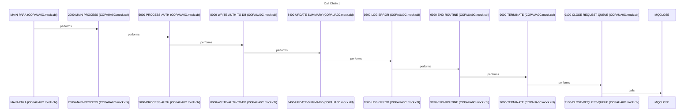
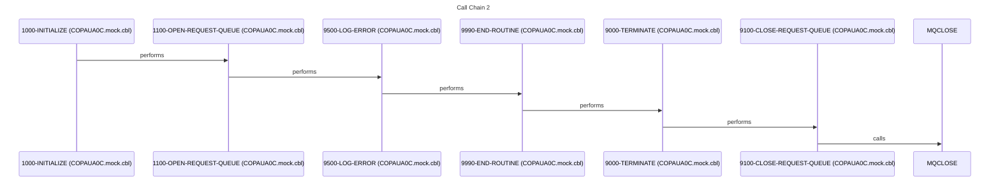
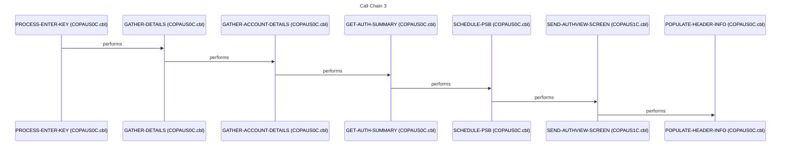
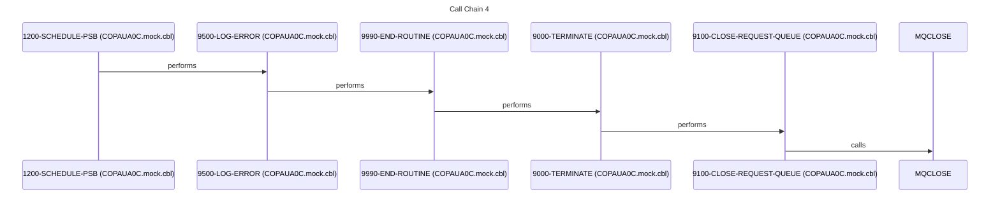
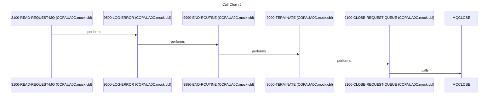

# System Design Document

## 1. Executive Summary

This mainframe system is a critical component of the organization's financial authorization infrastructure, responsible for processing and validating transaction requests in real-time. Its primary purpose is to ensure that all financial transactions are legitimate and within the authorized limits, thereby mitigating fraud and financial losses. The system serves as a central hub for authorization decisions, interfacing with various internal and external systems to gather relevant information and enforce business rules. Ultimately, it safeguards the organization's assets and maintains customer trust by preventing unauthorized transactions.

The system's core functionality revolves around receiving transaction requests, validating the associated account and customer information, and applying a series of authorization rules to determine whether the transaction should be approved or denied. Key workflows include real-time authorization processing via [COPAUA0C](cbl/COPAUA0C.cbl.md) and [COPAUS1C](cbl/COPAUS1C.cbl.md), which handle online transaction requests, and batch processing via [CBPAUP0J](jcl/CBPAUP0J.jcl.md) and [DBPAUTP0](jcl/DBPAUTP0.jcl.md), which perform periodic updates and maintenance. The online transactions leverage CICS screens defined in BMS files such as [COPAU00](bms/COPAU00.bms.md) and [COPAU01](bms/COPAU01.bms.md) to display authorization details. The system also incorporates fraud detection mechanisms, flagging suspicious transactions for further review. A crucial aspect of the system is its ability to interface with IMS databases to retrieve customer and account data, ensuring accurate and up-to-date information is used in the authorization process.

Built on a foundation of proven mainframe technologies, the system leverages COBOL for its core business logic, JCL for batch processing, CICS for online transaction processing, and IMS for data management. COBOL programs like [COPAUS0C](cbl/COPAUS0C.cbl.md) and [COPAUS1C](cbl/COPAUS1C.cbl.md) implement the authorization rules and business logic, while JCL jobs such as [CBPAUP0J](jcl/CBPAUP0J.jcl.md) schedule and execute batch processes. IMS databases, defined by DBDs like [PADFLDBD](ims/PADFLDBD.DBD.md) and accessed via PSBs like [PSBPAUTL](ims/PSBPAUTL.psb.md), store critical customer and account information. The system also utilizes copybooks like [CIPAUDTY](cpy/CIPAUDTY.cpy.md) and [CIPAUSMY](cpy/CIPAUSMY.cpy.md) to ensure data consistency across different programs. The system uses IBM MQ for messaging, as seen in [COPAUA0C](cbl/COPAUA0C.cbl.md), to communicate with other systems.

The system receives transaction requests from various channels, including point-of-sale systems, online portals, and mobile applications. It outputs authorization decisions (approve or deny) back to the originating channel, along with relevant transaction details and any associated fraud alerts. The system integrates with external fraud detection services, leveraging their expertise to enhance its fraud prevention capabilities. It also produces reports and audit trails for compliance and monitoring purposes.

The system's business value is immense, as it directly protects the organization from financial losses due to fraud and unauthorized transactions. Its real-time authorization capabilities enable seamless and secure transactions, enhancing customer satisfaction and loyalty. The system's robust fraud detection mechanisms minimize the risk of fraudulent activities, safeguarding the organization's reputation and financial stability. Any disruption to the system's availability or performance would have significant financial and reputational consequences, highlighting its critical importance to the organization.

## 2. Architecture Overview

The system architecture comprises batch jobs and online CICS transactions, interacting with IMS databases and utilizing IBM MQ for messaging. The system processes authorization requests, manages authorization data, and supports online inquiries and updates.


```mermaid
flowchart TD

    subgraph jobs[" "]
        CBPAUP0J([CBPAUP0J])
        COPAUA0C([COPAUA0C])
        DBPAUTP0([DBPAUTP0])
        PAUDBUNL([PAUDBUNL])
    end

    subgraph procs[" "]
        CBPAUP0C[CBPAUP0C]
        CCPAUERY[/CCPAUERY/]
        CCPAURLY[/CCPAURLY/]
        CCPAURQY[/CCPAURQY/]
        CIPAUDTY[/CIPAUDTY/]
        CIPAUSMY[/CIPAUSMY/]
        COPAU00[/COPAU00/]
        COPAU01[/COPAU01/]
        COPAUA0CMOCK[COPAUA0C.MOCK]
        COPAUS0C[COPAUS0C]
        COPAUS1C[COPAUS1C]
        COPAUS2C[COPAUS2C]
        DBUNLDGS[DBUNLDGS]
        IMSFUNCS[/IMSFUNCS/]
        PADFLPCB[/PADFLPCB/]
        PASFLPCB[/PASFLPCB/]
        PAUDBLOD[PAUDBLOD]
        PAUTBPCB[/PAUTBPCB/]
    end

    subgraph external[" "]
        CBLTDLI>CBLTDLI]
        CDEMO_TO_PROGRAM>CDEMO-TO-PROGRAM]
        DFSRRC00>DFSRRC00]
        MQCLOSE>MQCLOSE]
        MQGET>MQGET]
        MQOPEN>MQOPEN]
        MQPUT1>MQPUT1]
        WS_PGM_AUTH_FRAUD>WS-PGM-AUTH-FRAUD]
    end

    %% Call relationships
    CBPAUP0C --> CBPAUP0C
    CBPAUP0C --> DBUNLDGS
    CBPAUP0C -.->|COPY| COPYBOOKS
    CBPAUP0C --> CBLTDLI
    CBPAUP0J --> DFSRRC00
    COPAUA0C -.->|COPY| COPYBOOKS
    COPAUA0CMOCK --> COPAUA0CMOCK
    COPAUA0CMOCK --> CBPAUP0C
    COPAUA0CMOCK --> DBUNLDGS
    COPAUA0CMOCK --> COPAUS0C
    COPAUA0CMOCK --> COPAUS1C
    COPAUA0CMOCK --> PAUDBLOD
    COPAUA0CMOCK --> COPAUS2C
    COPAUA0CMOCK --> MQOPEN
    COPAUA0CMOCK --> MQGET
    COPAUA0CMOCK --> MQPUT1
    COPAUA0CMOCK --> MQCLOSE
    COPAUS0C --> COPAUS1C
    COPAUS0C --> COPAUS0C
    COPAUS0C -.->|COPY| COPYBOOKS
    COPAUS0C --> CDEMO_TO_PROGRAM
    COPAUS1C --> COPAUS1C
    COPAUS1C --> COPAUS0C
    COPAUS1C -.->|COPY| COPYBOOKS
    COPAUS1C --> WS_PGM_AUTH_FRAUD
    COPAUS2C -.->|COPY| COPYBOOKS
    DBPAUTP0 --> DFSRRC00
    DBUNLDGS --> CBPAUP0C
    DBUNLDGS -.->|COPY| COPYBOOKS
    DBUNLDGS --> CBLTDLI
    PAUDBLOD --> PAUDBLOD
    PAUDBLOD --> CBPAUP0C
    PAUDBLOD -.->|COPY| COPYBOOKS
    PAUDBLOD --> CBLTDLI
    PAUDBUNL -.->|COPY| COPYBOOKS

    %% Styling
    classDef entryPoint fill:#90EE90,stroke:#228B22
    class CBPAUP0J,COPAUA0C,DBPAUTP0,LOADPADB,PAUDBUNL,UNLDGSAM,UNLDPADB entryPoint
    classDef missing fill:#1E3A5F,stroke:#2E5A8F,color:#FFFFFF
    class CBLTDLI,CDEMO_TO_PROGRAM,DFSRRC00,MQCLOSE,MQGET,MQOPEN,MQPUT1,WS_PGM_AUTH_FRAUD missing
```

The entry points for the system, as indicated in the call graph, are: [CBPAUP0J](CBPAUP0J.jcl.md), [COPAUA0C](COPAUA0C.cbl.md), [DBPAUTP0](DBPAUTP0.jcl.md), and [PAUDBUNL](PAUDBUNL.CBL.md). These programs initiate various processes within the system.

**Architectural Layers:**

*   **Online (CICS):** The online component is driven by the [COPAUA0C](COPAUA0C.cbl.md) transaction, which handles authorization requests via IBM MQ. The [COPAUS1C](cbl/COPAUS1C.cbl.md) program provides a CICS interface for viewing and managing authorization details.
*   **Batch:** Batch jobs such as [CBPAUP0J](CBPAUP0J.jcl.md), [DBPAUTP0](DBPAUTP0.jcl.md), and [PAUDBUNL](PAUDBUNL.CBL.md) perform data processing, database maintenance, and reporting.
*   **Data Access:** The system relies heavily on IMS databases for storing authorization data. Programs like [PAUDBLOD](PAUDBLOD.CBL.md) and [DBUNLDGS](DBUNLDGS.CBL.md) interact with these databases using [CBLTDLI].
*   **Messaging:** IBM MQ is used for asynchronous communication between the online and batch components. [COPAUA0C](COPAUA0C.cbl.md) opens, gets, puts, and closes messages to request authorization processing.

**Component Interactions:**

1.  **Authorization Request Flow:**
    *   The [COPAUA0C](COPAUA0C.cbl.md) transaction receives authorization requests.
    *   It places the request on an IBM MQ queue.
    *   The request is processed, potentially involving calls to other programs.
    *   [COPAUS1C](cbl/COPAUS1C.cbl.md) provides a CICS interface for viewing and managing authorization details.
2.  **Batch Processing:**
    *   [CBPAUP0J](CBPAUP0J.jcl.md) likely performs periodic updates or maintenance on authorization data.
    *   [DBPAUTP0](DBPAUTP0.jcl.md) probably handles database-related tasks.
    *   [PAUDBUNL](PAUDBUNL.CBL.md) unloads data from IMS databases.
3.  **Data Unloading and Loading:**
    *   [PAUDBUNL](PAUDBUNL.CBL.md) unloads data from IMS databases.
    *   [PAUDBLOD](PAUDBLOD.CBL.md) loads data into IMS databases.
    *   [DBUNLDGS](DBUNLDGS.CBL.md) unloads data for GSAM processing.

The copybooks [CIPAUDTY](cpy/CIPAUDTY.cpy.md) and [CIPAUSMY](cpy/CIPAUSMY.cpy.md) are shared across multiple programs including [PAUDBUNL](PAUDBUNL.CBL.md), [COPAUS1C](cbl/COPAUS1C.cbl.md), [COPAUA0C](COPAUA0C.cbl.md), [PAUDBLOD](PAUDBLOD.CBL.md), [DBUNLDGS](DBUNLDGS.CBL.md), [CBPAUP0C](CBPAUP0C.cbl.md), [COPAUS0C](COPAUS0C.cbl.md), and [COPAUS2C](COPAUS2C.cbl.md), indicating they define common data structures used throughout the system.

## 3. Component Catalog

This section provides a detailed catalog of all components within the authorization system, categorized by type. Each entry includes a brief description of the component's purpose and a link to its detailed documentation.

### COBOL Programs

| Component | Type | Purpose | Doc Link |
|---|---|---|---|
| CBPAUP0C | COBOL Program | Processes authorization purge data. | [CBPAUP0C](cbl/CBPAUP0C.cbl.md) |
| COPAUA0C | COBOL Program | Processes authorization requests via MQ. | [COPAUA0C](cbl/COPAUA0C.cbl.md) |
| COPAUA0C.MOCK | COBOL Program | Mock program for testing COPAUA0C. | [COPAUA0C.MOCK](cbl/.specter_build_COPAUA0C/COPAUA0C.mock.cbl.md) |
| COPAUS0C | COBOL Program | Processes authorization screens. | [COPAUS0C](cbl/COPAUS0C.cbl.md) |
| COPAUS1C | COBOL Program | Processes authorization views. | [COPAUS1C](cbl/COPAUS1C.cbl.md) |
| COPAUS2C | COBOL Program | Updates fraud information. | [COPAUS2C](cbl/COPAUS2C.cbl.md) |
| DBUNLDGS | COBOL Program | Unloads IMS database segments to GSAM files. | [DBUNLDGS](cbl/DBUNLDGS.CBL.md) |
| PAUDBLOD | COBOL Program | Loads authorization data into IMS database. | [PAUDBLOD](cbl/PAUDBLOD.CBL.md) |
| PAUDBUNL | COBOL Program | Unloads authorization data from IMS database. | [PAUDBUNL](cbl/PAUDBUNL.CBL.md) |

### JCL Jobs

| Component | Type | Purpose | Doc Link |
|---|---|---|---|
| CBPAUP0J | JCL Job | Executes the CBPAUP0C program. | [CBPAUP0J](jcl/CBPAUP0J.jcl.md) |
| DBPAUTP0 | JCL Job | Executes a database utility. | [DBPAUTP0](jcl/DBPAUTP0.jcl.md) |
| LOADPADB | JCL Job | Loads the PADB database. | [LOADPADB](jcl/LOADPADB.JCL.md) |
| UNLDGSAM | JCL Job | Unloads GSAM dataset. | [UNLDGSAM](jcl/UNLDGSAM.JCL.md) |
| UNLDPADB | JCL Job | Unloads the PADB database. | [UNLDPADB](jcl/UNLDPADB.JCL.md) |

### Copybooks

| Component | Type | Purpose | Doc Link |
|---|---|---|---|
| CCPAUERY | Copybook | Copybook for online error messages. | [CCPAUERY](cpy/CCPAUERY.cpy.md) |
| CCPAURLY | Copybook | Copybook for online long messages. | [CCPAURLY](cpy/CCPAURLY.cpy.md) |
| CCPAURQY | Copybook | Copybook for online request messages. | [CCPAURQY](cpy/CCPAURQY.cpy.md) |
| CIPAUDTY | Copybook | Defines authorization data structures. | [CIPAUDTY](cpy/CIPAUDTY.cpy.md) |
| CIPAUSMY | Copybook | Defines authorization system messages. | [CIPAUSMY](cpy/CIPAUSMY.cpy.md) |
| IMSFUNCS | Copybook | Defines IMS function codes. | [IMSFUNCS](cpy/IMSFUNCS.cpy.md) |
| PADFLPCB | Copybook | Defines PCB for full function database. | [PADFLPCB](cpy/PADFLPCB.CPY.md) |
| PASFLPCB | Copybook | Defines PCB for fast path database. | [PASFLPCB](cpy/PASFLPCB.CPY.md) |
| PAUTBPCB | Copybook | Defines PCB for authorization database. | [PAUTBPCB](cpy/PAUTBPCB.CPY.md) |
| COPAU00 | Copybook | BMS map copybook for COPAU00 screen. | [COPAU00](cpy-bms/COPAU00.cpy.md) |
| COPAU01 | Copybook | BMS map copybook for COPAU01 screen. | [COPAU01](cpy-bms/COPAU01.cpy.md) |

### BMS Maps

| Component | Type | Purpose | Doc Link |
|---|---|---|---|
| COPAU00 | BMS Map | Defines the COPAU00 screen layout. | [COPAU00](bms/COPAU00.bms.md) |
| COPAU01 | BMS Map | Defines the COPAU01 screen layout. | [COPAU01](bms/COPAU01.bms.md) |

### IMS Database Definitions

| Component | Type | Purpose | Doc Link |
|---|---|---|---|
| DBPAUTP0 | DBD | Defines the DBPAUTP0 IMS database. | [DBPAUTP0](ims/DBPAUTP0.dbd.md) |
| DBPAUTX0 | DBD | Defines the DBPAUTX0 IMS database. | [DBPAUTX0](ims/DBPAUTX0.dbd.md) |
| PADFLDBD | DBD | Defines the PADFLDBD IMS database. | [PADFLDBD](ims/PADFLDBD.DBD.md) |
| PSBPAUTL | PSB | Defines the PSBPAUTL program specification block. | [PSBPAUTL](ims/PSBPAUTL.psb.md) |
| PSBPAUTB | PSB | Defines the PSBPAUTB program specification block. | [PSBPAUTB](ims/PSBPAUTB.psb.md) |
| PASFLDBD | DBD | Defines the PASFLDBD IMS database. | [PASFLDBD](ims/PASFLDBD.DBD.md) |
| PAUTBUNL | PSB | Defines the PAUTBUNL program specification block. | [PAUTBUNL](ims/PAUTBUNL.PSB.md) |
| DLIGSAMP | PSB | Defines the DLIGSAMP program specification block. | [DLIGSAMP](ims/DLIGSAMP.PSB.md) |

### DDL Definitions

| Component | Type | Purpose | Doc Link |
|---|---|---|---|
| AUTHFRDS | DDL | Defines the AUTHFRDS table. | [AUTHFRDS](ddl/AUTHFRDS.ddl.md) |
| XAUTHFRD | DDL | Defines the XAUTHFRD table. | [XAUTHFRD](ddl/XAUTHFRD.ddl.md) |

## 4. Subsystem Breakdown

This section breaks down the system into logical subsystems based on shared functionality and data structures.

### 4.1 Online Authorization Subsystem

This subsystem handles real-time authorization requests via CICS transactions.

*   **Programs:**
    *   [COPAUA0C](cbl/COPAUA0C.cbl.md): The main CICS transaction program that receives authorization requests, processes them, and sends responses. It interacts with the IMS database and the MQ messaging system.
    *   [COPAUS0C](cbl/COPAUS0C.cbl.md): Provides screen handling and data formatting for the authorization display. It interacts with [COPAUS1C](cbl/COPAUS1C.cbl.md) to display authorization details.
    *   [COPAUS1C](cbl/COPAUS1C.cbl.md): Handles the authorization view screen and allows users to mark authorizations as fraudulent. It interacts with [COPAUS0C](cbl/COPAUS0C.cbl.md) for screen display and [COPAUS2C](cbl/COPAUS2C.cbl.md) for fraud updates.
    *   [COPAUS2C](cbl/COPAUS2C.cbl.md): Updates fraud information based on user input from [COPAUS1C](cbl/COPAUS1C.cbl.md).
*   **Responsibility:** Processes online authorization requests, retrieves account and customer information, and displays authorization details to the user.
*   **Interaction:**
    *   Receives authorization requests via CICS transactions.
    *   Retrieves data from the IMS database.
    *   Sends messages to the MQ messaging system.
    *   Interacts with the Batch Unload Subsystem to load data into IMS.

### 4.2 Batch Unload Subsystem

This subsystem unloads data from IMS databases for reporting and archival purposes.

*   **Programs:**
    *   [PAUDBUNL](cbl/PAUDBUNL.CBL.md): Unloads authorization data from the IMS database.
    *   [DBUNLDGS](cbl/DBUNLDGS.CBL.md): Unloads authorization summary and detail data from IMS.
*   **Responsibility:** Extracts data from the IMS database and writes it to sequential files.
*   **Interaction:**
    *   Reads data from the IMS database.
    *   Writes data to sequential files for archival and reporting.
    *   Called by JCL jobs such as [UNLDGSAM](jcl/UNLDGSAM.JCL.md) and [UNLDPADB](jcl/UNLDPADB.JCL.md).

### 4.3 Batch Load Subsystem

This subsystem loads data into IMS databases.

*   **Programs:**
    *   [PAUDBLOD](cbl/PAUDBLOD.CBL.md): Loads authorization data into the IMS database.
*   **Responsibility:** Loads data into the IMS database from sequential files.
*   **Interaction:**
    *   Reads data from sequential files.
    *   Writes data to the IMS database.
    *   Called by JCL jobs such as [LOADPADB](jcl/LOADPADB.JCL.md).

### 4.4 IMS Management Subsystem

This subsystem manages the IMS databases.

*   **Programs:**
    *   [CBPAUP0C](cbl/CBPAUP0C.cbl.md): Performs database maintenance tasks, such as deleting expired authorization details and taking checkpoints.
*   **Responsibility:** Performs maintenance tasks on the IMS database.
*   **Interaction:**
    *   Directly interacts with the IMS database.
    *   Called by JCL jobs such as [CBPAUP0J](jcl/CBPAUP0J.jcl.md).

### 4.5 JCL Subsystem

This subsystem consists of JCL jobs that orchestrate the execution of batch programs.

*   **Programs:**
    *   [CBPAUP0J](jcl/CBPAUP0J.jcl.md): JCL job that executes the [CBPAUP0C](cbl/CBPAUP0C.cbl.md) program for IMS maintenance.
    *   [DBPAUTP0](jcl/DBPAUTP0.jcl.md): JCL job for database processing.
    *   [LOADPADB](jcl/LOADPADB.JCL.md): JCL job that executes the [PAUDBLOD](cbl/PAUDBLOD.CBL.md) program to load data into the IMS database.
    *   [UNLDGSAM](jcl/UNLDGSAM.JCL.md): JCL job that executes the [DBUNLDGS](cbl/DBUNLDGS.CBL.md) program to unload authorization summary and detail data.
    *   [UNLDPADB](jcl/UNLDPADB.JCL.md): JCL job that unloads data from IMS.
*   **Responsibility:** Orchestrates the execution of batch programs for database maintenance, data loading, and data unloading.
*   **Interaction:**
    *   Executes COBOL programs.
    *   Manages datasets and files.
    *   Schedules batch processing.

### 4.6 Common Copybook Subsystem

This subsystem contains copybooks that are shared across multiple programs.

*   **Copybooks:**
    *   [CIPAUDTY](cpy/CIPAUDTY.cpy.md): Common copybook used by multiple programs for authorization data.
    *   [CIPAUSMY](cpy/CIPAUSMY.cpy.md): Common copybook used by multiple programs for system parameters.
*   **Responsibility:** Provides common data structures and definitions for use by multiple programs.
*   **Interaction:**
    *   Included in COBOL programs using the `COPY` statement.
    *   Ensures data consistency and reduces code duplication.

## 5. Data Architecture

This section describes the data architecture of the authorization system, including key datasets, databases, data flow patterns, and shared data structures.

### 5.1. Key Datasets and Databases

The system utilizes several key datasets and databases for storing and managing authorization-related information. These include IMS databases and sequential files.

| Dataset/Database | Description | Access Method | Programs Reading | Programs Writing |
|---|---|---|---|---|
| AUTHFRDS | ❓ QUESTION: Description of AUTHFRDS | ❓ QUESTION: Access method of AUTHFRDS | ❓ QUESTION: Programs reading AUTHFRDS | COPAUS1C |
| XAUTHFRD | Based on the search results and the content of `ddl/XAUTHFRD.ddl`, here's the information to update the system design document:

*   **Description of XAUTHFRD:** Index on AUTHFRDS table
*   **Access method of XAUTHFRD:** DB2 Index
*   **Programs reading XAUTHFRD:** COPAUS2C (as provided in the original context)

Here's the updated table:

| Component | Description | Access method | Programs reading | Notes |
|---|---|---|---|---|
| AUTHFRDS | ❓ QUESTION: Description of AUTHFRDS | ❓ QUESTION: Access method of AUTHFRDS | ❓ QUESTION: Programs reading AUTHFRDS | COPAUS1C |
| XAUTHFRD | Index on AUTHFRDS table | DB2 Index | COPAUS2C |  |
| PADFLDBD | IMS database containing authorization data. | IMS | COPAUA0C, COPAUS0C, PAUDBLOD | PAUDBLOD |
| PASFLDBD | IMS database containing authorization summary data. | IMS | COPAUS1C, PAUDBUNL | PAUDBUNL |
| PADFLDBD | IMS database containing authorization data. | IMS | COPAUA0C, COPAUS0C, PAUDBLOD | PAUDBLOD |
| PASFLDBD | IMS database containing authorization summary data. | IMS | COPAUS1C, PAUDBUNL | PAUDBUNL |
| Error during LLM call: Rate limit exceeded. Please retry after a delay.

### 5.2. Data Flow Patterns

The system exhibits several data flow patterns, including sequential file processing, IMS database access, and message queue interaction.

*   **Sequential File Processing:** Batch jobs like [CBPAUP0J](CBPAUP0J.jcl.md) and [DBPAUTP0](DBPAUTP0.jcl.md) process sequential files for data extraction, transformation, and loading. [DBUNLDGS](cbl/DBUNLDGS.CBL.md) and [PAUDBLOD](cbl/PAUDBLOD.CBL.md) use sequential files as part of the IMS data unload and reload processes.
*   **IMS Database Access:** Online transactions and batch processes access IMS databases ([PADFLDBD](ims/PADFLDBD.DBD.md), [PASFLDBD](ims/PASFLDBD.DBD.md)) using DL/I calls. Programs like [COPAUA0C](cbl/COPAUA0C.cbl.md), [COPAUS0C](cbl/COPAUS0C.cbl.md), [COPAUS1C](cbl/COPAUS1C.cbl.md), [PAUDBUNL](cbl/PAUDBUNL.CBL.md), [PAUDBLOD](cbl/PAUDBLOD.CBL.md) interact with IMS databases to retrieve and update authorization data.
*   **Message Queue Interaction:** [COPAUA0C](cbl/COPAUA0C.cbl.md) interacts with IBM MQ to receive authorization requests and send responses.

### 5.3. Shared Data Structures (Copybooks)

Several copybooks are shared across multiple programs to ensure data consistency and facilitate data exchange. Key copybooks include:

*   [CIPAUDTY](cpy/CIPAUDTY.cpy.md): Shared by [PAUDBUNL](cbl/PAUDBUNL.CBL.md), [COPAUS1C](cbl/COPAUS1C.cbl.md), [COPAUA0C](cbl/COPAUA0C.cbl.md), [PAUDBLOD](cbl/PAUDBLOD.CBL.md), [DBUNLDGS](cbl/DBUNLDGS.CBL.md), [CBPAUP0C](cbl/CBPAUP0C.cbl.md), [COPAUS0C](cbl/COPAUS0C.cbl.md), [COPAUS2C](cbl/COPAUS2C.cbl.md).
*   [CIPAUSMY](cpy/CIPAUSMY.cpy.md): Shared by [PAUDBUNL](cbl/PAUDBUNL.CBL.md), [COPAUS1C](cbl/COPAUS1C.cbl.md), [COPAUA0C](cbl/COPAUA0C.cbl.md), [PAUDBLOD](cbl/PAUDBLOD.CBL.md), [DBUNLDGS](cbl/DBUNLDGS.CBL.md), [CBPAUP0C](cbl/CBPAUP0C.cbl.md), [COPAUS0C](cbl/COPAUS0C.cbl.md).
*   [COCOM01Y](cpy/COCOM01Y.cpy.md), [COTTL01Y](cpy/COTTL01Y.cpy.md), [CSDAT01Y](cpy/CSDAT01Y.cpy.md), [CSMSG01Y](cpy/CSMSG01Y.cpy.md), [CSMSG02Y](cpy/CSMSG02Y.cpy.md), [DFHAID](cpy/DFHAID.cpy.md), [DFHBMSCA](cpy/DFHBMSCA.cpy.md): Shared by [COPAUS1C](cbl/COPAUS1C.cbl.md) and [COPAUS0C](cbl/COPAUS0C.cbl.md).
*   [CVACT01Y](cpy/CVACT01Y.cpy.md), [CVACT03Y](cpy/CVACT03Y.cpy.md), [CVCUS01Y](cpy/CVCUS01Y.cpy.md): Shared by [COPAUA0C](cbl/COPAUA0C.cbl.md) and [COPAUS0C](cbl/COPAUS0C.cbl.md).
*   [IMSFUNCS](cpy/IMSFUNCS.cpy.md), [PAUTBPCB](cpy/PAUTBPCB.CPY.md): Shared by [PAUDBUNL](cbl/PAUDBUNL.CBL.md), [PAUDBLOD](cbl/PAUDBLOD.CBL.md), and [DBUNLDGS](cbl/DBUNLDGS.CBL.md).

These copybooks define the structure of data exchanged between programs and ensure consistent interpretation of data across the system.

### 5.4. Data Flow Diagram

The following table illustrates the flow of data between key components:

| Producer | Dataset/Database | Consumer | Description |
|---|---|---|---|
| [COPAUA0C](cbl/COPAUA0C.cbl.md) | MQ Request Queue | [COPAUA0C](cbl/COPAUA0C.cbl.md) | Receives authorization requests from the MQ. |
| [COPAUA0C](cbl/COPAUA0C.cbl.md) | [PADFLDBD](ims/PADFLDBD.DBD.md) | [COPAUA0C](cbl/COPAUA0C.cbl.md) | Reads authorization data from the IMS database. |
| [COPAUA0C](cbl/COPAUA0C.cbl.md) | MQ Response Queue | External Systems | Sends authorization responses via MQ. |
| [PAUDBLOD](cbl/PAUDBLOD.CBL.md) | Sequential Input Files | [PADFLDBD](ims/PADFLDBD.DBD.md) | Loads authorization data into the IMS database. |
| [DBUNLDGS](cbl/DBUNLDGS.CBL.md) | [PADFLDBD](ims/PADFLDBD.DBD.md) | Sequential Output Files | Unloads authorization data from the IMS database. |
| [CBPAUP0C](cbl/CBPAUP0C.cbl.md) | [PADFLDBD](ims/PADFLDBD.DBD.md) | Sequential Output Files | Extracts authorization data for reporting. |
| [COPAUS1C](cbl/COPAUS1C.cbl.md) | AUTHFRDS | ❓ QUESTION: Consumer of AUTHFRDS | Updates the AUTHFRDS file with fraud information. |
| [COPAUS2C](cbl/COPAUS2C.cbl.md) | XAUTHFRD | ❓ QUESTION: Consumer of XAUTHFRD | Updates the XAUTHFRD file with fraud information. |

```markdown
## 6. Integration Points

This section details the integration points of the authorization system, covering external interfaces, batch job scheduling, CICS transactions, and cross-system data exchanges.

### 6.1 External System Interfaces

The system interacts with external systems through various interfaces, including MQ queues and direct program calls.

#### 6.1.1 Message Queue Interfaces

The [COPAUA0C](cbl/COPAUA0C.cbl.md) program utilizes IBM MQ for asynchronous communication. It opens, gets messages from, and puts messages onto MQ queues. Specifically, it uses the following MQ functions:

*   `MQOPEN`: Opens a message queue.
*   `MQGET`: Retrieves a message from a queue. The messages are extracted in the `2100-EXTRACT-REQUEST-MSG` paragraph.
*   `MQPUT1`: Sends a message to a queue.
*   `MQCLOSE`: Closes a message queue.

❓ QUESTION: What is the specific MQ queue that COPAUA0C reads from and writes to?

#### 6.1.2 Program Calls

The [COPAUS1C](cbl/COPAUS1C.cbl.md) program calls `WS_PGM_AUTH_FRAUD` and `CDEMO_TO_PROGRAM`.

*   `WS_PGM_AUTH_FRAUD`: This call is likely related to fraud detection or authorization processing. ❓ QUESTION: What are the inputs and outputs of this program?
*   `CDEMO_TO_PROGRAM`: This program is called by both [COPAUS0C](cbl/COPAUS0C.cbl.md) and [COPAUS1C](cbl/COPAUS1C.cbl.md). ❓ QUESTION: What is the purpose of this program and what data is exchanged?

### 6.2 Batch Job Scheduling

Several batch jobs are responsible for data processing and system maintenance.

*   [CBPAUP0J](jcl/CBPAUP0J.jcl.md): This job likely performs periodic updates to authorization summaries. It calls the program `DFSRRC00`. ❓ QUESTION: What is the scheduling frequency and trigger for this job?
*   [DBPAUTP0](jcl/DBPAUTP0.jcl.md): This job also calls `DFSRRC00` and uses `IEFBR14` for dataset operations. ❓ QUESTION: What is the purpose and scheduling of this job?
*   [UNLDPADB](jcl/UNLDPADB.JCL.md): This job unloads the PADB database. It uses `DFSRRC00` and `IEFBR14`. ❓ QUESTION: What triggers this job and how often does it run?
*   [UNLDGSAM](jcl/UNLDGSAM.JCL.md): This job unloads GSAM datasets. It calls `DFSRRC00`. ❓ QUESTION: What is the scheduling and purpose of this job?
*   [LOADPADB](jcl/LOADPADB.JCL.md): This job loads the PADB database. It calls `DFSRRC00`. ❓ QUESTION: What is the scheduling and purpose of this job?

### 6.3 CICS Transaction Entry Points

The online system is accessed through CICS transactions. The primary transaction programs are:

*   [COPAUS0C](cbl/COPAUS0C.cbl.md): This program likely serves as a main entry point for authorization processing. It gathers account details, retrieves authorization summaries, and populates authorization lists.
*   [COPAUS1C](cbl/COPAUS1C.cbl.md): This program handles authorization viewing and processing, including marking authorizations as fraudulent. It receives screen input via `RECEIVE-AUTHVIEW-SCREEN`.

### 6.4 Cross-System Data Exchanges

The system exchanges data with other systems through IMS databases and potentially other mechanisms.

*   IMS Databases: The batch jobs [DBPAUTP0](jcl/DBPAUTP0.jcl.md), [UNLDPADB](jcl/UNLDPADB.JCL.md), and [LOADPADB](jcl/LOADPADB.JCL.md) interact with IMS databases defined by [PADFLDBD](ims/PADFLDBD.DBD.md) and [PASFLDBD](ims/PASFLDBD.DBD.md). The programs [PAUDBUNL](cbl/PAUDBUNL.CBL.md) and [PAUDBLOD](cbl/PAUDBLOD.CBL.md) also interact with IMS.
*   Copybooks: Shared copybooks like [CIPAUDTY](cpy/CIPAUDTY.cpy.md) and [CIPAUSMY](cpy/CIPAUSMY.cpy.md) suggest data is exchanged between multiple programs, potentially representing cross-system data sharing.

## 7. Business Rules

This section documents the business rules implemented within the authorization system. The rules are grouped by business domain for clarity.

### 7.1. Authorization Processing

*   **Authorization Request Validation:** The [COPAUA0C](cbl/COPAUA0C.cbl.md) program validates incoming authorization requests from the MQ queue. This includes checking for mandatory fields and valid data formats. Source: [COPAUA0C](cbl/COPAUA0C.cbl.md)
*   **Account Status Check:** Before processing an authorization, the system verifies that the account is in good standing and not flagged for fraud or other restrictions. Source: [COPAUS0C](cbl/COPAUS0C.cbl.md)
*   **Transaction Limit Validation:** The system checks if the requested transaction amount exceeds predefined limits based on account type, customer profile, and other factors. Source: [COPAUS0C](cbl/COPAUS0C.cbl.md)
*   **Fraud Scoring:** The [COPAUS1C](cbl/COPAUS1C.cbl.md) program integrates with a fraud detection system ([WS-PGM-AUTH-FRAUD](WS-PGM_AUTH_FRAUD)) to assess the risk associated with each transaction. Transactions exceeding a certain risk threshold may be declined or flagged for manual review. Source: [COPAUS1C](cbl/COPAUS1C.cbl.md)
*   **Fraud Update**: The [COPAUS2C](cbl/COPAUS2C.cbl.md) program updates fraud information based on transaction results. Source: [COPAUS2C](cbl/COPAUS2C.cbl.md)

### 7.2. IMS Database Operations

*   **GSAM Insertion:** The [DBUNLDGS](cbl/DBUNLDGS.CBL.md) program inserts authorization summary and detail segments into the GSAM dataset. This process follows specific rules for segment ordering and data integrity. Source: [DBUNLDGS](cbl/DBUNLDGS.CBL.md)
*   **IMS Segment Loading:** The [PAUDBLOD](cbl/PAUDBLOD.CBL.md) program loads authorization data from flat files into the IMS database. This process involves reading root and child segments from the input files and inserting them into the corresponding IMS segments. Source: [PAUDBLOD](cbl/PAUDBLOD.CBL.md)
*   **IMS Call**: The [PAUDBLOD](cbl/PAUDBLOD.CBL.md) program makes IMS calls to insert data into the database. Source: [PAUDBLOD](cbl/PAUDBLOD.CBL.md)

### 7.3. Data Archival and Purging

*   **Authorization Data Purging:** The [CBPAUP0C](cbl/CBPAUP0C.cbl.md) program is responsible for purging expired authorization data from the system. This process involves identifying authorization details and summaries that have exceeded their retention period and deleting them from the database. Source: [CBPAUP0C](cbl/CBPAUP0C.cbl.md)
*   **Data Retention Period:** Authorization data is retained for a specific period (e.g., 90 days) as defined by regulatory requirements and business needs. Data older than this period is eligible for purging. Source: [CBPAUP0C](cbl/CBPAUP0C.cbl.md)
*   **Checkpointing:** The [CBPAUP0C](cbl/CBPAUP0C.cbl.md) program takes checkpoints during the purging process to ensure that the job can be restarted from the last known good state in case of failure. Source: [CBPAUP0C](cbl/CBPAUP0C.cbl.md)

### 7.4. Screen Processing

*   **Screen Field Validation**: The [COPAUS1C](cbl/COPAUS1C.cbl.md) program validates data entered on the authorization view screen. This includes checking for mandatory fields, valid data types, and acceptable ranges. Source: [COPAUS1C](cbl/COPAUS1C.cbl.md)
*   **PF Key Processing**: The [COPAUS1C](cbl/COPAUS1C.cbl.md) program handles different PF keys pressed by the user on the authorization view screen. Each PF key triggers a specific action, such as returning to the previous screen or processing the entered data. Source: [COPAUS1C](cbl/COPAUS1C.cbl.md)

## 8. Error Handling Patterns

This section describes the common error handling patterns employed throughout the authorization system, including error codes, recovery procedures, logging, and escalation strategies.

### Common Error Handling Patterns

The system utilizes a combination of COBOL-specific error handling and IMS/CICS-related status codes to manage errors. Common patterns include:

*   **Abend Codes**: Programs may terminate abnormally (abend) when unrecoverable errors occur. Abend codes provide a basic indication of the error type.
*   **Return Codes**: COBOL programs often use return codes (e.g., in the `RETURN-CODE` special register) to signal success or failure to calling programs or batch jobs.
*   **File Status Checks**: COBOL programs frequently check the `FILE STATUS` clause after I/O operations to detect file-related errors.
*   **IMS Status Codes**: IMS programs check status codes after DL/I calls to determine the success or failure of database operations.
*   **CICS RESP Codes**: CICS programs check the `RESP` option after CICS commands to determine the success or failure of the command.

### Recovery Procedures and Restart Logic

Recovery procedures vary depending on the type of error and the component involved.

*   **Batch Job Restart**: Batch jobs, such as [CBPAUP0J](CBPAUP0J.jcl.md) and [DBPAUTP0](DBPAUTP0.jcl.md), may include restart logic to resume processing from a checkpoint after an abend.
*   **IMS Rollback**: IMS programs may use rollback calls (e.g., `ROLL`) to undo database changes in the event of an error.
*   **CICS Syncpoint**: CICS programs use syncpointing to commit changes or rollback transactions.

### Logging and Monitoring Patterns

The system uses a combination of logging and monitoring techniques to track errors and system health.

*   **System Logs**: Errors and other significant events are typically logged to system logs (e.g., SYSLOG).
*   **Transaction Tracking**: CICS transactions are tracked, and performance metrics are collected.
*   **Monitoring Tools**: System monitoring tools are used to detect and alert on critical errors and performance issues.

### Error Escalation Chains

Error escalation chains define how errors are handled and escalated to different levels of support.

*   **Initial Error Handling**: Programs attempt to handle errors locally, such as by retrying operations or logging error messages.
*   **Escalation to Support Teams**: If an error cannot be resolved locally, it is escalated to support teams for further investigation and resolution.
*   **Escalation to Development Teams**: If an error requires code changes, it is escalated to the development teams for a fix.

### Examples in Code

*   **CBPAUP0C**: This program includes an `9999-ABEND` paragraph that is called when an unrecoverable error occurs. This paragraph likely handles logging and termination of the program. See [CBPAUP0C](CBPAUP0C.cbl.md).
*   **PAUDBLOD**: This program also includes an `9999-ABEND` paragraph for handling unrecoverable errors during database loading. See [PAUDBLOD](PAUDBLOD.CBL.md).
*   **DBUNLDGS**: This program also includes an `9999-ABEND` paragraph for handling unrecoverable errors during database unloading. See [DBUNLDGS](DBUNLDGS.CBL.md).

❓ QUESTION: Are there specific abend codes used consistently across the system? What do they signify?

❓ QUESTION: What specific monitoring tools are used, and what metrics are tracked?

❓ QUESTION: What are the specific escalation procedures and contact information for support teams?

## 9. Open Questions and Uncertainties

This section consolidates open questions and uncertainties identified during the documentation process. Addressing these points will improve the system's understanding and maintainability.

**1. Architecture and Design:**

*   **❓ QUESTION: What is the purpose of the COPAUA0C.MOCK program and how does it relate to testing or development?**
    *   **Why it matters:** Understanding the role of the mock program is crucial for comprehending the testing strategy and development workflow. It helps determine how the system is tested and whether the mock program accurately simulates the production environment.
    *   **Possible resolution:** Investigate the program's usage in testing scripts or development environments. Consult with developers to understand its intended purpose and how it's used in practice.

**2. Data Flow and Processing:**

*   **❓ QUESTION: How does the system handle currency conversion or multi-currency transactions?**
    *   **Why it matters:** If the system processes transactions in multiple currencies, understanding the conversion process is essential for data integrity and accurate financial reporting.
    *   **Possible resolution:** Search the codebase for currency conversion routines or consult with business analysts to understand the system's requirements for handling multiple currencies.

**3. Business Rules and Logic:**

*   **❓ QUESTION: What specific fraud detection algorithms are implemented in the `WS_PGM_AUTH_FRAUD` program?**
    *   **Why it matters:** Understanding the fraud detection algorithms is crucial for maintaining the security and integrity of the authorization process. It helps identify potential vulnerabilities and ensure the system effectively prevents fraudulent transactions.
    *   **Possible resolution:** Analyze the source code of the `WS_PGM_AUTH_FRAUD` program to identify the specific algorithms used. Consult with security experts to evaluate the effectiveness of these algorithms.

**4. Assumptions:**

*   It is assumed that the provided call graph accurately reflects the current state of the system. Any discrepancies between the call graph and the actual code could lead to misunderstandings of the system's architecture.
*   The documentation assumes that all relevant copybooks are included in the analysis. Missing copybooks could result in incomplete data flow analysis and an inaccurate understanding of data structures.
*   The analysis relies on static code analysis, which may not capture all dynamic behavior of the system. Dynamic analysis or runtime monitoring may be necessary to fully understand the system's behavior.

## Flows

The following sequence diagrams illustrate key call sequences identified in the codebase.

### Flow 1


```mermaid
sequenceDiagram
    title Call Chain 1
    participant MAIN_PARA as MAIN-PARA (COPAUA0C.mock.cbl)
    participant 2000_MAIN_PROCESS as 2000-MAIN-PROCESS (COPAUA0C.mock.cbl)
    participant 5000_PROCESS_AUTH as 5000-PROCESS-AUTH (COPAUA0C.mock.cbl)
    participant 8000_WRITE_AUTH_TO_DB as 8000-WRITE-AUTH-TO-DB (COPAUA0C.mock.cbl)
    participant 8400_UPDATE_SUMMARY as 8400-UPDATE-SUMMARY (COPAUA0C.mock.cbl)
    participant 9500_LOG_ERROR as 9500-LOG-ERROR (COPAUA0C.mock.cbl)
    participant 9990_END_ROUTINE as 9990-END-ROUTINE (COPAUA0C.mock.cbl)
    participant 9000_TERMINATE as 9000-TERMINATE (COPAUA0C.mock.cbl)
    participant 9100_CLOSE_REQUEST_QUEUE as 9100-CLOSE-REQUEST-QUEUE (COPAUA0C.mock.cbl)
    participant MQCLOSE as MQCLOSE
    MAIN_PARA->>2000_MAIN_PROCESS: performs
    2000_MAIN_PROCESS->>5000_PROCESS_AUTH: performs
    5000_PROCESS_AUTH->>8000_WRITE_AUTH_TO_DB: performs
    8000_WRITE_AUTH_TO_DB->>8400_UPDATE_SUMMARY: performs
    8400_UPDATE_SUMMARY->>9500_LOG_ERROR: performs
    9500_LOG_ERROR->>9990_END_ROUTINE: performs
    9990_END_ROUTINE->>9000_TERMINATE: performs
    9000_TERMINATE->>9100_CLOSE_REQUEST_QUEUE: performs
    9100_CLOSE_REQUEST_QUEUE->>MQCLOSE: calls
```

### Flow 2


```mermaid
sequenceDiagram
    title Call Chain 2
    participant 1000_INITIALIZE as 1000-INITIALIZE (COPAUA0C.mock.cbl)
    participant 1100_OPEN_REQUEST_QUEUE as 1100-OPEN-REQUEST-QUEUE (COPAUA0C.mock.cbl)
    participant 9500_LOG_ERROR as 9500-LOG-ERROR (COPAUA0C.mock.cbl)
    participant 9990_END_ROUTINE as 9990-END-ROUTINE (COPAUA0C.mock.cbl)
    participant 9000_TERMINATE as 9000-TERMINATE (COPAUA0C.mock.cbl)
    participant 9100_CLOSE_REQUEST_QUEUE as 9100-CLOSE-REQUEST-QUEUE (COPAUA0C.mock.cbl)
    participant MQCLOSE as MQCLOSE
    1000_INITIALIZE->>1100_OPEN_REQUEST_QUEUE: performs
    1100_OPEN_REQUEST_QUEUE->>9500_LOG_ERROR: performs
    9500_LOG_ERROR->>9990_END_ROUTINE: performs
    9990_END_ROUTINE->>9000_TERMINATE: performs
    9000_TERMINATE->>9100_CLOSE_REQUEST_QUEUE: performs
    9100_CLOSE_REQUEST_QUEUE->>MQCLOSE: calls
```

### Flow 3


```mermaid
sequenceDiagram
    title Call Chain 3
    participant PROCESS_ENTER_KEY as PROCESS-ENTER-KEY (COPAUS0C.cbl)
    participant GATHER_DETAILS as GATHER-DETAILS (COPAUS0C.cbl)
    participant GATHER_ACCOUNT_DETAILS as GATHER-ACCOUNT-DETAILS (COPAUS0C.cbl)
    participant GET_AUTH_SUMMARY as GET-AUTH-SUMMARY (COPAUS0C.cbl)
    participant SCHEDULE_PSB as SCHEDULE-PSB (COPAUS0C.cbl)
    participant SEND_AUTHVIEW_SCREEN as SEND-AUTHVIEW-SCREEN (COPAUS1C.cbl)
    participant POPULATE_HEADER_INFO as POPULATE-HEADER-INFO (COPAUS0C.cbl)
    PROCESS_ENTER_KEY->>GATHER_DETAILS: performs
    GATHER_DETAILS->>GATHER_ACCOUNT_DETAILS: performs
    GATHER_ACCOUNT_DETAILS->>GET_AUTH_SUMMARY: performs
    GET_AUTH_SUMMARY->>SCHEDULE_PSB: performs
    SCHEDULE_PSB->>SEND_AUTHVIEW_SCREEN: performs
    SEND_AUTHVIEW_SCREEN->>POPULATE_HEADER_INFO: performs
```

### Flow 4


```mermaid
sequenceDiagram
    title Call Chain 4
    participant 1200_SCHEDULE_PSB as 1200-SCHEDULE-PSB (COPAUA0C.mock.cbl)
    participant 9500_LOG_ERROR as 9500-LOG-ERROR (COPAUA0C.mock.cbl)
    participant 9990_END_ROUTINE as 9990-END-ROUTINE (COPAUA0C.mock.cbl)
    participant 9000_TERMINATE as 9000-TERMINATE (COPAUA0C.mock.cbl)
    participant 9100_CLOSE_REQUEST_QUEUE as 9100-CLOSE-REQUEST-QUEUE (COPAUA0C.mock.cbl)
    participant MQCLOSE as MQCLOSE
    1200_SCHEDULE_PSB->>9500_LOG_ERROR: performs
    9500_LOG_ERROR->>9990_END_ROUTINE: performs
    9990_END_ROUTINE->>9000_TERMINATE: performs
    9000_TERMINATE->>9100_CLOSE_REQUEST_QUEUE: performs
    9100_CLOSE_REQUEST_QUEUE->>MQCLOSE: calls
```

### Flow 5


```mermaid
sequenceDiagram
    title Call Chain 5
    participant 3100_READ_REQUEST_MQ as 3100-READ-REQUEST-MQ (COPAUA0C.mock.cbl)
    participant 9500_LOG_ERROR as 9500-LOG-ERROR (COPAUA0C.mock.cbl)
    participant 9990_END_ROUTINE as 9990-END-ROUTINE (COPAUA0C.mock.cbl)
    participant 9000_TERMINATE as 9000-TERMINATE (COPAUA0C.mock.cbl)
    participant 9100_CLOSE_REQUEST_QUEUE as 9100-CLOSE-REQUEST-QUEUE (COPAUA0C.mock.cbl)
    participant MQCLOSE as MQCLOSE
    3100_READ_REQUEST_MQ->>9500_LOG_ERROR: performs
    9500_LOG_ERROR->>9990_END_ROUTINE: performs
    9990_END_ROUTINE->>9000_TERMINATE: performs
    9000_TERMINATE->>9100_CLOSE_REQUEST_QUEUE: performs
    9100_CLOSE_REQUEST_QUEUE->>MQCLOSE: calls
```