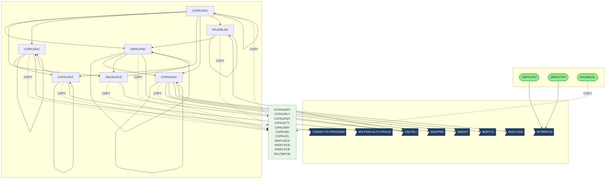
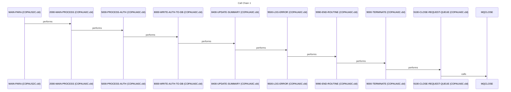
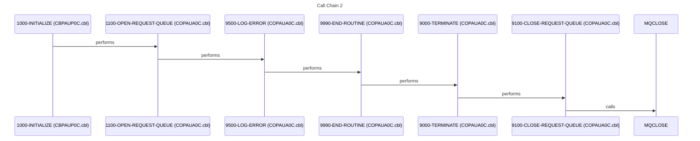
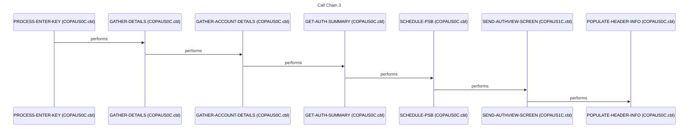
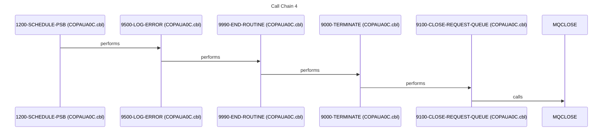
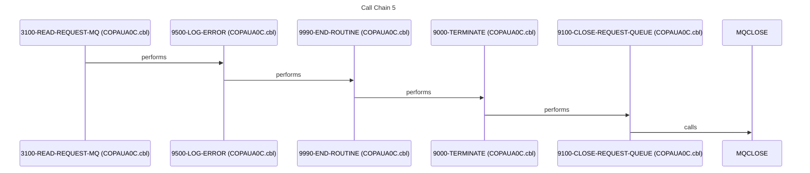

# System Design Document

## 1. Executive Summary

This authorization system is a critical component of the financial transaction processing infrastructure, responsible for validating and approving financial transactions in real-time. Its primary mission is to prevent fraudulent activities and ensure that only authorized transactions are processed, thereby safeguarding the financial assets of both the institution and its customers. The system serves a diverse range of users, including internal staff, external merchants, and customers initiating transactions through various channels. The authorization system acts as a gatekeeper, meticulously examining each transaction against a set of predefined rules and risk parameters.

The system's core functionality revolves around processing authorization requests, which involves receiving transaction details, verifying account status, checking available funds, and applying fraud detection algorithms. Key workflows include online transaction authorization via [COPAUS1C](cbl/COPAUS1C.cbl.md) and [COPAUS0C](cbl/COPAUS0C.cbl.md), batch processing of authorization summaries using [CBPAUP0C](cbl/CBPAUP0C.cbl.md), and database maintenance performed by [PAUDBUNL](cbl/PAUDBUNL.CBL.md) and [PAUDBLOD](cbl/PAUDBLOD.CBL.md). The online authorization process leverages CICS screens defined in BMS maps like [COPAU00](bms/COPAU00.bms.md) and [COPAU01](bms/COPAU01.bms.md) to present authorization details and capture responses. The system also incorporates sophisticated fraud detection mechanisms, including real-time risk scoring and rule-based analysis, to identify and flag suspicious transactions. Message queuing via IBM MQ, handled in [COPAUA0C](cbl/COPAUA0C.cbl.md), enables asynchronous communication between different components of the system.

The system is built upon a robust technical foundation, primarily utilizing COBOL for its core business logic, JCL for batch processing, CICS for online transaction processing, and IMS for hierarchical data storage. COBOL programs like [COPAUS1C](cbl/COPAUS1C.cbl.md) and [CBPAUP0C](cbl/CBPAUP0C.cbl.md) encapsulate the authorization rules and transaction processing logic. JCL jobs such as [CBPAUP0J](jcl/CBPAUP0J.jcl.md) and [DBPAUTP0](jcl/DBPAUTP0.jcl.md) automate batch processes like database updates and report generation. IMS databases, defined by DBDs like [DBPAUTP0](ims/DBPAUTP0.dbd.md) and [PADFLDBD](ims/PADFLDBD.DBD.md) and accessed via PSBs like [PSBPAUTL](ims/PSBPAUTL.psb.md), provide persistent storage for authorization data and related information. Copybooks such as [CIPAUDTY](cpy/CIPAUDTY.cpy.md) and [CIPAUSMY](cpy/CIPAUSMY.cpy.md) define common data structures used across multiple programs.

The system's boundaries are defined by its inputs, outputs, and external integrations. It receives transaction requests from various channels, including online terminals, point-of-sale systems, and mobile applications. The system outputs authorization responses, which indicate whether a transaction has been approved or declined. It integrates with external systems such as fraud detection services, account management systems, and payment networks. The system also relies on external routines like [CBLTDLI](CBLTDLI) for IMS database access.

The authorization system is of paramount business value, as it directly impacts the institution's ability to process financial transactions securely and efficiently. Its availability and reliability are crucial for maintaining customer trust and preventing financial losses due to fraud. Any disruption to the system's operation could result in significant financial repercussions, reputational damage, and regulatory penalties. The system's ability to adapt to evolving fraud patterns and regulatory requirements is essential for ensuring its continued effectiveness and relevance.

## 2. Architecture Overview

The system architecture comprises batch jobs, online CICS transactions, and IMS database interactions. The system processes authorization requests, manages authorization details, and handles fraud updates.


```mermaid
flowchart TD

    subgraph jobs[" "]
        CBPAUP0J([CBPAUP0J])
        DBPAUTP0([DBPAUTP0])
        PAUDBUNL([PAUDBUNL])
    end

    subgraph procs[" "]
        CBPAUP0C[CBPAUP0C]
        COPAUA0C[COPAUA0C]
        COPAUS0C[COPAUS0C]
        COPAUS1C[COPAUS1C]
        COPAUS2C[COPAUS2C]
        DBUNLDGS[DBUNLDGS]
        PAUDBLOD[PAUDBLOD]
    end

    COPYBOOKS["/CCPAUERY<br>CCPAURLY<br>CCPAURQY<br>CIPAUDTY<br>CIPAUSMY<br>COPAU00<br>COPAU01<br>IMSFUNCS<br>PADFLPCB<br>PASFLPCB<br>PAUTBPCB/"]

    subgraph external[" "]
        CBLTDLI>CBLTDLI]
        CDEMO_TO_PROGRAM>CDEMO-TO-PROGRAM]
        DFSRRC00>DFSRRC00]
        MQCLOSE>MQCLOSE]
        MQGET>MQGET]
        MQOPEN>MQOPEN]
        MQPUT1>MQPUT1]
        WS_PGM_AUTH_FRAUD>WS-PGM-AUTH-FRAUD]
    end

    %% Call relationships
    CBPAUP0C --> CBPAUP0C
    CBPAUP0C --> COPAUA0C
    CBPAUP0C --> DBUNLDGS
    CBPAUP0C -.->|COPY| COPYBOOKS
    CBPAUP0C --> CBLTDLI
    CBPAUP0J --> DFSRRC00
    COPAUA0C --> COPAUA0C
    COPAUA0C -.->|COPY| COPYBOOKS
    COPAUA0C --> MQOPEN
    COPAUA0C --> MQGET
    COPAUA0C --> MQPUT1
    COPAUA0C --> MQCLOSE
    COPAUS0C --> COPAUS1C
    COPAUS0C --> COPAUS0C
    COPAUS0C -.->|COPY| COPYBOOKS
    COPAUS0C --> CDEMO_TO_PROGRAM
    COPAUS1C --> COPAUS1C
    COPAUS1C --> COPAUS0C
    COPAUS1C -.->|COPY| COPYBOOKS
    COPAUS1C --> WS_PGM_AUTH_FRAUD
    COPAUS2C --> CBPAUP0C
    COPAUS2C --> DBUNLDGS
    COPAUS2C --> COPAUS0C
    COPAUS2C --> COPAUS1C
    COPAUS2C --> COPAUA0C
    COPAUS2C --> PAUDBLOD
    COPAUS2C --> COPAUS2C
    COPAUS2C -.->|COPY| COPYBOOKS
    DBPAUTP0 --> DFSRRC00
    DBUNLDGS --> CBPAUP0C
    DBUNLDGS -.->|COPY| COPYBOOKS
    DBUNLDGS --> CBLTDLI
    PAUDBLOD --> PAUDBLOD
    PAUDBLOD --> CBPAUP0C
    PAUDBLOD -.->|COPY| COPYBOOKS
    PAUDBLOD --> CBLTDLI
    PAUDBUNL -.->|COPY| COPYBOOKS

    %% Styling
    classDef entryPoint fill:#90EE90,stroke:#228B22
    class CBPAUP0J,DBPAUTP0,LOADPADB,PAUDBUNL,UNLDGSAM,UNLDPADB entryPoint
    classDef copybook fill:#E8F5E9,stroke:#4CAF50
    class COPYBOOKS copybook
    classDef missing fill:#1E3A5F,stroke:#2E5A8F,color:#FFFFFF
    class CBLTDLI,CDEMO_TO_PROGRAM,DFSRRC00,MQCLOSE,MQGET,MQOPEN,MQPUT1,WS_PGM_AUTH_FRAUD missing
```

The architecture includes the following key components:

**1. Batch Processing:**

*   **[CBPAUP0J](jcl/CBPAUP0J.jcl.md)**: This job likely performs periodic updates or maintenance tasks related to authorization processing. It calls [DFSRRC00](DFSRRC00), which suggests it interacts with IMS.
*   **[DBPAUTP0](jcl/DBPAUTP0.jcl.md)**: This job also calls [DFSRRC00](DFSRRC00), indicating IMS database processing. It also calls [IEFBR14](IEFBR14), which is a utility for dataset deletion. This suggests it might be involved in reorganizing or cleaning up IMS datasets.
*   **[PAUDBUNL](cbl/PAUDBUNL.CBL.md)**: This program unloads data from IMS database. It uses copybooks like [CIPAUDTY](cpy/CIPAUDTY.cpy.md), [CIPAUSMY](cpy/CIPAUSMY.cpy.md), [IMSFUNCS](cpy/IMSFUNCS.cpy.md), and [PAUTBPCB](cpy/PAUTBPCB.CPY.md).

**2. Online CICS Transactions:**

*   **[COPAUS0C](cbl/COPAUS0C.cbl.md)**: This program appears to be a central component for online authorization processing. It calls [COPAUS1C](cbl/COPAUS1C.cbl.md) and interacts with various copybooks related to screen layouts ([COPAU00](bms/COPAU00.bms.md), [COPAU01](bms/COPAU01.bms.md)) and data structures ([[CVACT01Y](cpy/CVACT01Y.cpy.md)](CVACT01Y), [[CVACT03Y](cpy/CVACT03Y.cpy.md)](CVACT03Y), [[CVCUS01Y](cpy/CVCUS01Y.cpy.md)](CVCUS01Y)). It also calls [CDEMO-TO-PROGRAM](CDEMO_TO_PROGRAM), which suggests interaction with a demo program.
*   **[COPAUS1C](cbl/COPAUS1C.cbl.md)**: This program seems to handle authorization views and fraud marking. It interacts with screen definitions ([[DFHAID](cpy/DFHAID.cpy.md)](DFHAID), [[DFHBMSCA](cpy/DFHBMSCA.cpy.md)](DFHBMSCA)) and calls [WS-PGM-AUTH-FRAUD](WS_PGM_AUTH_FRAUD), indicating a fraud processing component.
*   **[COPAUA0C](cbl/COPAUA0C.cbl.md)**: This program handles authorization requests via MQ messaging. It opens, gets, puts, and closes MQ queues, suggesting it's a message-driven component.
*   **[COPAUS2C](cbl/COPAUS2C.cbl.md)**: This program updates fraud information. It calls [COPAUS0C](cbl/COPAUS0C.cbl.md), [COPAUS1C](cbl/COPAUS1C.cbl.md), [COPAUA0C](cbl/COPAUA0C.cbl.md), and [PAUDBLOD](cbl/PAUDBLOD.CBL.md), indicating it coordinates multiple processes.

**3. Data Access and Storage:**

*   **IMS Databases**: The system heavily relies on IMS databases for storing authorization data. Programs like [PAUDBUNL](cbl/PAUDBUNL.CBL.md), [PAUDBLOD](cbl/PAUDBLOD.CBL.md), [DBUNLDGS](cbl/DBUNLDGS.CBL.md) interact with IMS databases using [CBLTDLI](CBLTDLI) calls. The DBDs ([PADFLDBD](ims/PADFLDBD.DBD.md), [PASFLDBD](ims/PASFLDBD.DBD.md), [DBPAUTP0](ims/DBPAUTP0.dbd.md), [DBPAUTX0](ims/DBPAUTX0.dbd.md)) and PSBs ([PSBPAUTL](ims/PSBPAUTL.psb.md), [PSBPAUTB](ims/PSBPAUTB.psb.md), [PAUTBUNL](ims/PAUTBUNL.PSB.md), [DLIGSAMP](ims/DLIGSAMP.PSB.md)) define the structure and access methods for these databases.
*   **GSAM**: [DBUNLDGS](cbl/DBUNLDGS.CBL.md) uses GSAM to store data, likely for reporting or archival purposes.
*   **Copybooks**: The system uses various copybooks ([CIPAUDTY](cpy/CIPAUDTY.cpy.md), [CIPAUSMY](cpy/CIPAUSMY.cpy.md), [COPAU00](cpy-bms/COPAU00.cpy.md), [COPAU01](cpy-bms/COPAU01.cpy.md), [PADFLPCB](cpy/PADFLPCB.CPY.md), [PASFLPCB](cpy/PASFLPCB.CPY.md), [PAUTBPCB](cpy/PAUTBPCB.CPY.md)) to define data structures and screen layouts, ensuring consistency across programs.

**4. Integration Points:**

*   **IBM MQ**: [COPAUA0C](cbl/COPAUA0C.cbl.md) uses IBM MQ for receiving authorization requests, enabling asynchronous communication between different parts of the system.
*   **CICS**: Online transactions are managed through CICS, providing a user interface for authorization processing and fraud management.

**Component Interactions:**

*   The online transaction [COPAUS0C](cbl/COPAUS0C.cbl.md) calls [COPAUS1C](cbl/COPAUS1C.cbl.md) to display authorization details.
*   [COPAUA0C](cbl/COPAUA0C.cbl.md) receives authorization requests via MQ and processes them.
*   [COPAUS2C](cbl/COPAUS2C.cbl.md) updates fraud information, potentially triggered by events in [COPAUS1C](cbl/COPAUS1C.cbl.md).
*   Batch jobs like [CBPAUP0J](jcl/CBPAUP0J.jcl.md) and [DBPAUTP0](jcl/DBPAUTP0.jcl.md) perform maintenance and data reorganization tasks on the IMS databases.
*   [PAUDBUNL](cbl/PAUDBUNL.CBL.md) and [PAUDBLOD](cbl/PAUDBLOD.CBL.md) are used for unloading and loading data to/from IMS databases.

The system exhibits a layered architecture with batch jobs for data maintenance, online transactions for real-time processing, and IMS databases for persistent data storage. MQ messaging facilitates asynchronous communication between components.

## 3. Component Catalog

This section provides a detailed catalog of all components in the system, including COBOL programs, JCL jobs, copybooks, BMS maps, IMS database definitions (DBDs and PSBs), and data definition files (DDL). Each entry includes a brief description of the component's purpose and a link to its detailed documentation.

### COBOL Programs

| Component | Type | Purpose | Doc Link |
|---|---|---|---|
| CBPAUP0C | COBOL Program | Processes authorization summaries and details, deleting expired records and taking checkpoints. | [CBPAUP0C](cbl/CBPAUP0C.cbl.md) |
| COPAUA0C | COBOL Program | Processes authorization requests received via MQ, reads related data, and initiates authorization processing. | [COPAUA0C](cbl/COPAUA0C.cbl.md) |
| COPAUS0C | COBOL Program | Gathers account and customer details and retrieves authorization summaries and authorizations. | [COPAUS0C](cbl/COPAUS0C.cbl.md) |
| COPAUS1C | COBOL Program | Handles online authorization viewing and fraud marking. | [COPAUS1C](cbl/COPAUS1C.cbl.md) |
| COPAUS2C | COBOL Program | Updates fraud information. | [COPAUS2C](cbl/COPAUS2C.cbl.md) |
| DBUNLDGS | COBOL Program | Unloads authorization summary and detail data to a GSAM file. | [DBUNLDGS](cbl/DBUNLDGS.CBL.md) |
| PAUDBLOD | COBOL Program | Loads authorization summary and detail data into IMS database. | [PAUDBLOD](cbl/PAUDBLOD.CBL.md) |
| PAUDBUNL | COBOL Program | Unloads authorization summary and detail data from IMS database. | [PAUDBUNL](cbl/PAUDBUNL.CBL.md) |

### JCL Jobs

| Component | Type | Purpose | Doc Link |
|---|---|---|---|
| CBPAUP0J | JCL Job | Executes the CBPAUP0C program to process authorization data. | [CBPAUP0J](jcl/CBPAUP0J.jcl.md) |
| DBPAUTP0 | JCL Job | Executes a database processing utility (DFSRRC00). | [DBPAUTP0](jcl/DBPAUTP0.jcl.md) |
| LOADPADB | JCL Job | Loads the PADB database. | [LOADPADB](jcl/LOADPADB.JCL.md) |
| UNLDGSAM | JCL Job | Unloads data to a GSAM file. | [UNLDGSAM](jcl/UNLDGSAM.JCL.md) |
| UNLDPADB | JCL Job | Unloads the PADB database. | [UNLDPADB](jcl/UNLDPADB.JCL.md) |

### Copybooks

| Component | Type | Purpose | Doc Link |
|---|---|---|---|
| CCPAUERY | Copybook | Defines record layouts for authorization data. | [CCPAUERY](cpy/CCPAUERY.cpy.md) |
| CCPAURLY | Copybook | Defines record layouts for authorization data. | [CCPAURLY](cpy/CCPAURLY.cpy.md) |
| CCPAURQY | Copybook | Defines record layouts for authorization data. | [CCPAURQY](cpy/CCPAURQY.cpy.md) |
| CIPAUDTY | Copybook | Defines authorization detail record layouts. | [CIPAUDTY](cpy/CIPAUDTY.cpy.md) |
| CIPAUSMY | Copybook | Defines authorization summary record layouts. | [CIPAUSMY](cpy/CIPAUSMY.cpy.md) |
| IMSFUNCS | Copybook | Defines IMS function call structures. | [IMSFUNCS](cpy/IMSFUNCS.cpy.md) |
| PADFLPCB | Copybook | Defines PCB layouts for database access. | [PADFLPCB](cpy/PADFLPCB.CPY.md) |
| PASFLPCB | Copybook | Defines PCB layouts for database access. | [PASFLPCB](cpy/PASFLPCB.CPY.md) |
| PAUTBPCB | Copybook | Defines PCB layouts for database access. | [PAUTBPCB](cpy/PAUTBPCB.CPY.md) |
| COPAU00 | Copybook | BMS map definition for COPAU00 screen. | [COPAU00](cpy-bms/COPAU00.cpy.md) |
| COPAU01 | Copybook | BMS map definition for COPAU01 screen. | [COPAU01](cpy-bms/COPAU01.cpy.md) |

### BMS Maps

| Component | Type | Purpose | Doc Link |
|---|---|---|---|
| COPAU00 | BMS Map | Defines the screen layout for authorization processing. | [COPAU00](bms/COPAU00.bms.md) |
| COPAU01 | BMS Map | Defines the screen layout for authorization processing. | [COPAU01](bms/COPAU01.bms.md) |

### IMS Database Definitions (DBD and PSB)

| Component | Type | Purpose | Doc Link |
|---|---|---|---|
| DBPAUTP0 | DBD | Defines the database structure for authorization data. | [DBPAUTP0](ims/DBPAUTP0.dbd.md) |
| DBPAUTX0 | DBD | Defines the database structure for authorization data. | [DBPAUTX0](ims/DBPAUTX0.dbd.md) |
| PADFLDBD | DBD | Defines the database structure for authorization data. | [PADFLDBD](ims/PADFLDBD.DBD.md) |
| PSBPAUTL | PSB | Defines the program specification block for authorization processing. | [PSBPAUTL](ims/PSBPAUTL.psb.md) |
| PSBPAUTB | PSB | Defines the program specification block for authorization processing. | [PSBPAUTB](ims/PSBPAUTB.psb.md) |
| PASFLDBD | DBD | Defines the database structure for authorization data. | [PASFLDBD](ims/PASFLDBD.DBD.md) |
| PAUTBUNL | PSB | Defines the program specification block for database unloading. | [PAUTBUNL](ims/PAUTBUNL.PSB.md) |
| DLIGSAMP | PSB | Defines the program specification block for database access. | [DLIGSAMP](ims/DLIGSAMP.PSB.md) |

### Data Definition Files (DDL)

| Component | Type | Purpose | Doc Link |
|---|---|---|---|
| XAUTHFRD | DDL | Defines the table structure for fraud data. | [XAUTHFRD](ddl/XAUTHFRD.ddl.md) |
| AUTHFRDS | DDL | Defines the table structure for fraud data. | [AUTHFRDS](ddl/AUTHFRDS.ddl.md) |

## 4. Subsystem Breakdown

This section breaks down the system into logical subsystems based on shared functionality and data structures.

### 4.1 Online Authorization Subsystem

This subsystem handles real-time authorization requests via CICS transactions.

**Programs:**

*   [COPAUS0C](cbl/COPAUS0C.cbl.md): Provides the main screen and calls other modules to gather authorization details.
*   [COPAUS1C](cbl/COPAUS1C.cbl.md): Handles screen processing and fraud marking.
*   [COPAUA0C](cbl/COPAUA0C.cbl.md): Processes authorization requests, reads data from IMS, and interacts with MQ.
*   [COPAUS2C](cbl/COPAUS2C.cbl.md): Updates fraud information.
*   [COPAU00](bms/COPAU00.bms.md): BMS map for the main authorization screen.
*   [COPAU01](bms/COPAU01.bms.md): BMS map for another authorization screen.

**Responsibility:**

The Online Authorization Subsystem is responsible for processing real-time authorization requests. It receives requests, retrieves necessary data from IMS databases, applies business rules, and returns an authorization decision. It also handles fraud marking.

**Interactions:**

*   This subsystem interacts with the IMS database to retrieve account, customer, and authorization data.
*   It uses IBM MQ to communicate with other systems, potentially for request origination or result reporting.
*   It calls external programs like `CDEMO_TO_PROGRAM` and `WS_PGM_AUTH_FRAUD` (details unavailable).

**Shared Copybooks:**

This subsystem heavily relies on shared copybooks for data definitions:

*   [CIPAUDTY](cpy/CIPAUDTY.cpy.md)
*   [CIPAUSMY](cpy/CIPAUSMY.cpy.md)
*   [CVACT01Y](cpy/CVACT01Y.cpy.md)
*   [CVACT03Y](cpy/CVACT03Y.cpy.md)
*   [CVCUS01Y](cpy/CVCUS01Y.cpy.md)
*   [DFHAID](cpy/DFHAID.cpy.md)
*   [DFHBMSCA](cpy/DFHBMSCA.cpy.md)

### 4.2 Batch Authorization Processing Subsystem

This subsystem handles batch processing related to authorization data.

**Programs:**

*   [CBPAUP0C](cbl/CBPAUP0C.cbl.md): Processes authorization summaries and details, potentially for purging expired data.
*   [PAUDBUNL](cbl/PAUDBUNL.CBL.md): Unloads authorization data from IMS.
*   [PAUDBLOD](cbl/PAUDBLOD.CBL.md): Loads authorization data into IMS.
*   [DBUNLDGS](cbl/DBUNLDGS.CBL.md): Unloads authorization data to GSAM files.
*   [CBPAUP0J](jcl/CBPAUP0J.jcl.md): JCL job that executes `CBPAUP0C`.
*   [DBPAUTP0](jcl/DBPAUTP0.jcl.md): JCL job related to authorization processing.
*   [LOADPADB](jcl/LOADPADB.JCL.md): JCL job to load authorization data.
*   [UNLDGSAM](jcl/UNLDGSAM.JCL.md): JCL job to unload data to GSAM.
*   [UNLDPADB](jcl/UNLDPADB.JCL.md): JCL job to unload authorization data.

**Responsibility:**

The Batch Authorization Processing Subsystem is responsible for tasks such as unloading, loading, and purging authorization data in batch mode. It interacts with IMS databases and GSAM files.

**Interactions:**

*   This subsystem interacts heavily with the IMS database for data extraction and loading.
*   It uses GSAM files as intermediate storage for unloaded data.
*   It is triggered by scheduled JCL jobs.

**Shared Copybooks:**

This subsystem shares copybooks with the Online Authorization Subsystem, indicating shared data structures:

*   [CIPAUDTY](cpy/CIPAUDTY.cpy.md)
*   [CIPAUSMY](cpy/CIPAUSMY.cpy.md)
*   [IMSFUNCS](cpy/IMSFUNCS.cpy.md)
*   [PAUTBPCB](cpy/PAUTBPCB.CPY.md)

### 4.3 IMS Database Management Subsystem

This subsystem defines the structure and access methods for the IMS databases used by the authorization system.

**Components:**

*   [DBPAUTP0](ims/DBPAUTP0.dbd.md): DBD for authorization data.
*   [DBPAUTX0](ims/DBPAUTX0.dbd.md): DBD for authorization data.
*   [PADFLDBD](ims/PADFLDBD.DBD.md): DBD related to authorization data.
*   [PSBPAUTL](ims/PSBPAUTL.psb.md): PSB for authorization processing.
*   [PSBPAUTB](ims/PSBPAUTB.psb.md): PSB for authorization processing.
*   [PASFLDBD](ims/PASFLDBD.DBD.md): DBD related to authorization data.
*   [PAUTBUNL](ims/PAUTBUNL.PSB.md): PSB for unloading authorization data.
*   [DLIGSAMP](ims/DLIGSAMP.PSB.md): PSB used for DLI calls.

**Responsibility:**

This subsystem defines the structure of the IMS databases and the program specification blocks (PSBs) used to access them.

**Interactions:**

*   The Online Authorization Subsystem and Batch Authorization Processing Subsystem both rely on the IMS Database Management Subsystem for data storage and retrieval.

### 4.4 Data Definition Subsystem

This subsystem defines the data structures used by the authorization system.

**Components:**

*   [XAUTHFRD](ddl/XAUTHFRD.ddl.md): Data definition for fraud data.
*   [AUTHFRDS](ddl/AUTHFRDS.ddl.md): Data definition for fraud data.

**Responsibility:**

This subsystem defines the data structures used by the authorization system, specifically related to fraud data.

**Interactions:**

*   The Online Authorization Subsystem and Batch Authorization Processing Subsystem both rely on the Data Definition Subsystem for data structures.

## 5. Data Architecture

This section describes the data architecture of the authorization system, including key datasets, databases, data flows, and shared data structures.

### Key Datasets and Databases

The system utilizes various datasets and databases for storing and managing authorization-related information. These include IMS databases, VSAM datasets, and sequential files.

| Dataset/Database | Description | Access Method | Programs Reading | Programs Writing |
|---|---|---|---|---|
| AUTHFRDS | ❓ QUESTION: Description of AUTHFRDS dataset | ❓ QUESTION: Access method for AUTHFRDS | ❓ QUESTION: Programs reading AUTHFRDS | ❓ QUESTION: Programs writing AUTHFRDS |
| XAUTHFRD | ❓ QUESTION: Description of XAUTHFRD dataset | ❓ QUESTION: Access method for XAUTHFRD | ❓ QUESTION: Programs reading XAUTHFRD | ❓ QUESTION: Programs writing XAUTHFRD |
| [PADFLDBD](ims/PADFLDBD.DBD.md) | This is an IMS database. | IMS | [PAUDBUNL](cbl/PAUDBUNL.CBL.md), [PAUDBLOD](cbl/PAUDBLOD.CBL.md) | [PAUDBLOD](cbl/PAUDBLOD.CBL.md) |
| [PASFLDBD](ims/PASFLDBD.DBD.md) | This is an IMS database. | IMS | ❓ QUESTION: Programs reading PASFLDBD | ❓ QUESTION: Programs writing PASFLDBD |
| [DBPAUTP0](ims/DBPAUTP0.dbd.md) | This is an IMS database. | IMS | ❓ QUESTION: Programs reading DBPAUTP0 | ❓ QUESTION: Programs writing DBPAUTP0 |

### Data Flow Patterns

The system employs different data flow patterns depending on the specific data being accessed and the processing requirements. These patterns include:

*   **Sequential Access:** Used for processing datasets in a sequential manner, such as reading transaction logs or generating reports.
*   **VSAM Access:** Used for accessing datasets with indexed or relative record organization, providing efficient retrieval of specific records.
*   **IMS Database Access:** Used for accessing hierarchical data stored in IMS databases, enabling complex data relationships and efficient data retrieval.

### Shared Data Structures (Copybooks)

Several copybooks are used to define shared data structures across multiple programs, ensuring data consistency and simplifying data access. Key copybooks include:

*   [CIPAUDTY](cpy/CIPAUDTY.cpy.md): Contains common data definitions related to authorization processing. Used by [PAUDBUNL](cbl/PAUDBUNL.CBL.md), [COPAUS1C](cbl/COPAUS1C.cbl.md), [COPAUA0C](cbl/COPAUA0C.cbl.md), [PAUDBLOD](cbl/PAUDBLOD.CBL.md), [DBUNLDGS](cbl/DBUNLDGS.CBL.md), [CBPAUP0C](cbl/CBPAUP0C.cbl.md), [COPAUS0C](cbl/COPAUS0C.cbl.md), [COPAUS2C](cbl/COPAUS2C.cbl.md).
*   [CIPAUSMY](cpy/CIPAUSMY.cpy.md): Contains data definitions related to authorization summaries. Used by [PAUDBUNL](cbl/PAUDBUNL.CBL.md), [COPAUS1C](cbl/COPAUS1C.cbl.md), [COPAUA0C](cbl/COPAUA0C.cbl.md), [PAUDBLOD](cbl/PAUDBLOD.CBL.md), [DBUNLDGS](cbl/DBUNLDGS.CBL.md), [CBPAUP0C](cbl/CBPAUP0C.cbl.md), [COPAUS0C](cbl/COPAUS0C.cbl.md).
*   [IMSFUNCS](cpy/IMSFUNCS.cpy.md): Contains definitions for IMS function calls. Used by [PAUDBUNL](cbl/PAUDBUNL.CBL.md), [PAUDBLOD](cbl/PAUDBLOD.CBL.md), [DBUNLDGS](cbl/DBUNLDGS.CBL.md).
*   [PAUTBPCB](cpy/PAUTBPCB.CPY.md): Contains PCB definitions for IMS database access. Used by [PAUDBUNL](cbl/PAUDBUNL.CBL.md), [PAUDBLOD](cbl/PAUDBLOD.CBL.md), [DBUNLDGS](cbl/DBUNLDGS.CBL.md).

### Data Flow Narrative

The following table illustrates the data flow between different programs and datasets/databases:

| Producer | Dataset/Database | Consumer | Description |
|---|---|---|---|
| [COPAUA0C](cbl/COPAUA0C.cbl.md) | MQ Queues | [COPAUA0C](cbl/COPAUA0C.cbl.md) | [COPAUA0C](cbl/COPAUA0C.cbl.md) reads authorization requests from MQ queues. |
| [PAUDBLOD](cbl/PAUDBLOD.CBL.md) | [PADFLDBD](ims/PADFLDBD.DBD.md) |  | [PAUDBLOD](cbl/PAUDBLOD.CBL.md) loads data into the PADFLDBD IMS database. |
| [CBPAUP0C](cbl/CBPAUP0C.cbl.md) | [PADFLDBD](ims/PADFLDBD.DBD.md) |  | [CBPAUP0C](cbl/CBPAUP0C.cbl.md) processes data from the PADFLDBD IMS database. |
| [PAUDBUNL](cbl/PAUDBUNL.CBL.md) | [PADFLDBD](ims/PADFLDBD.DBD.md) |  | [PAUDBUNL](cbl/PAUDBUNL.CBL.md) unloads data from the PADFLDBD IMS database. |
| [DBUNLDGS](cbl/DBUNLDGS.CBL.md) | GSAM Files |  | [DBUNLDGS](cbl/DBUNLDGS.CBL.md) unloads data into GSAM files. |

## 6. Integration Points

This section details the integration points of the authorization system, including external interfaces, batch job scheduling, CICS transactions, and data exchanges with other systems.

### 6.1 External System Interfaces

The system interacts with external systems through various interfaces, including files, MQ queues, and potentially APIs.

#### 6.1.1 MQ Queues

The [COPAUA0C](cbl/COPAUA0C.cbl.md) program interacts with IBM MQ for message queuing. Based on the call graph, it uses the following MQ functions:

*   `MQOPEN`: Opens a connection to a specific MQ queue.
*   `MQGET`: Retrieves messages from an MQ queue.
*   `MQPUT1`: Sends messages to an MQ queue.
*   `MQCLOSE`: Closes the connection to the MQ queue.

❓ QUESTION: What are the specific MQ queue names used by COPAUA0C? What is the message format?

#### 6.1.2 File Interfaces

Several batch jobs and programs interact with files for data input and output.

*   [PAUDBUNL](cbl/PAUDBUNL.CBL.md) unloads data from IMS databases to sequential files.
*   [PAUDBLOD](cbl/PAUDBLOD.CBL.md) loads data from sequential files into IMS databases.
*   [DBUNLDGS](cbl/DBUNLDGS.CBL.md) unloads data from IMS databases to GSAM datasets.

The [UNLDPADB](jcl/UNLDPADB.JCL.md) JCL job unloads the PADB database. The [UNLDGSAM](jcl/UNLDGSAM.JCL.md) JCL job unloads GSAM datasets. The [LOADPADB](jcl/LOADPADB.JCL.md) JCL job loads the PADB database.

❓ QUESTION: What are the specific file names and formats used by these programs and jobs?

#### 6.1.3 API Interfaces

The [COPAUS1C](cbl/COPAUS1C.cbl.md) program calls `WS_PGM_AUTH_FRAUD`, which suggests an external API call to a fraud detection system.

The [COPAUS0C](cbl/COPAUS0C.cbl.md) and [COPAUS1C](cbl/COPAUS1C.cbl.md) programs call `CDEMO_TO_PROGRAM`.

❓ QUESTION: What are the details of the `WS_PGM_AUTH_FRAUD` and `CDEMO_TO_PROGRAM` APIs, including their parameters and return values?

### 6.2 Batch Job Scheduling

The system includes several batch jobs that are likely scheduled for regular execution.

*   [CBPAUP0J](jcl/CBPAUP0J.jcl.md): This job likely performs periodic updates to authorization summaries.
*   [DBPAUTP0](jcl/DBPAUTP0.jcl.md): This job likely performs database maintenance or updates related to authorization data.
*   [PAUDBUNL](cbl/PAUDBUNL.CBL.md): This program is responsible for unloading IMS database data.
*   [PAUDBLOD](cbl/PAUDBLOD.CBL.md): This program is responsible for loading IMS database data.
*   [DBUNLDGS](cbl/DBUNLDGS.CBL.md): This program unloads data to GSAM datasets.
*   [UNLDPADB](jcl/UNLDPADB.JCL.md): This job unloads the PADB database.
*   [UNLDGSAM](jcl/UNLDGSAM.JCL.md): This job unloads GSAM datasets.
*   [LOADPADB](jcl/LOADPADB.JCL.md): This job loads the PADB database.

❓ QUESTION: What are the scheduling dependencies and frequencies for these batch jobs? Are they triggered by specific events or run on a fixed schedule?

### 6.3 CICS Transaction Entry Points

The [COPAUS0C](cbl/COPAUS0C.cbl.md) and [COPAUS1C](cbl/COPAUS1C.cbl.md) programs are CICS transactions that provide online user interfaces for authorization management.

*   [COPAUS0C](cbl/COPAUS0C.cbl.md): This transaction likely provides a main menu or entry point for authorization functions.
*   [COPAUS1C](cbl/COPAUS1C.cbl.md): This transaction likely handles specific authorization tasks, such as viewing or modifying authorization records.

The BMS maps [COPAU00](bms/COPAU00.bms.md) and [COPAU01](bms/COPAU01.bms.md) are associated with these transactions, defining the screen layouts and data fields.

❓ QUESTION: What are the specific transaction IDs associated with COPAUS0C and COPAUS1C? How are these transactions secured and authorized?

### 6.4 Cross-System Data Exchanges

The system exchanges data with other systems through files, MQ queues, and potentially APIs. The [COPAUA0C](cbl/COPAUA0C.cbl.md) program receives authorization requests via MQ and processes them. The [CBPAUP0C](cbl/CBPAUP0C.cbl.md) program updates authorization summaries based on these requests. The [COPAUS1C](cbl/COPAUS1C.cbl.md) program interacts with a fraud detection system via the `WS_PGM_AUTH_FRAUD` API.

❓ QUESTION: What other systems are involved in these data exchanges? What are the data formats and protocols used?

## 7. Business Rules

This section documents the business rules implemented within the authorization system. The rules are grouped by business domain for clarity.

### 7.1. Authorization Processing

*   **Authorization Amount Limit Check:** The system validates if the requested authorization amount exceeds the pre-defined limit for a given account. If the limit is exceeded, the transaction is declined. Source: [COPAUS1C](cbl/COPAUS1C.cbl.md)
*   **Fraudulent Activity Detection:** The system flags transactions as potentially fraudulent based on predefined rules and patterns, such as unusual transaction amounts, locations, or frequencies. Source: [COPAUS1C](cbl/COPAUS1C.cbl.md)
*   **Authorization Record Retrieval:** The system retrieves authorization records based on account number and other criteria to determine if a transaction should be approved. Source: [COPAUS1C](cbl/COPAUS1C.cbl.md)

### 7.2. Account Processing

*   **Account Status Validation:** The system verifies that the account is in good standing (e.g., not closed, not blocked) before processing any transactions. Source: [COPAUA0C](cbl/COPAUA0C.cbl.md)
*   **Cross-Reference Validation:** The system validates the cross-reference between account and customer records. Source: [COPAUA0C](cbl/COPAUA0C.cbl.md)
*   **Customer Data Retrieval:** The system retrieves customer data based on customer ID for authorization processing. Source: [COPAUA0C](cbl/COPAUA0C.cbl.md)

### 7.3. Data Validation

*   **Input Data Validation:** The system validates the format and content of input data, such as account numbers, transaction amounts, and dates, to ensure data integrity. Source: [COPAUS0C](cbl/COPAUS0C.cbl.md)
*   **Expiry Date Check:** The system checks if an authorization detail record has expired. Expired records are deleted. Source: [CBPAUP0C](cbl/CBPAUP0C.cbl.md)

### 7.4. IMS Database Operations

*   **GSAM Insertion:** The [DBUNLDGS](cbl/DBUNLDGS.CBL.md) program inserts parent and child segments into GSAM datasets.
*   **IMS Segment Insertion:** The [PAUDBLOD](cbl/PAUDBLOD.CBL.md) program inserts root and child segments into the IMS database.
*   **IMS Call Logging:** The [PAUDBLOD](cbl/PAUDBLOD.CBL.md) program logs IMS calls.


## 8. Error Handling Patterns

This section describes common error handling patterns observed across the authorization system, including abend codes, recovery procedures, logging, and monitoring.

### Common Error Handling Patterns

The system employs several common error handling patterns, including:

*   **Abend Codes**: Programs often use ABENDs to terminate execution when unrecoverable errors occur. Specific abend codes are used to indicate the type of error encountered.
*   **Return Codes**: COBOL programs use return codes (e.g., in the `RETURN-CODE` special register) to signal the success or failure of a program or subroutine.
*   **File Status Checks**: COBOL programs frequently check the `FILE STATUS` after file I/O operations to detect errors.
*   **ON EXCEPTION**: COBOL programs use `ON EXCEPTION` clauses to handle exceptions raised during procedure calls.

### Abend Codes

Several programs use specific abend codes to signal errors. For example, the [CBPAUP0C](CBPAUP0C.cbl.md) program includes a `9999-ABEND` paragraph that is called when an unrecoverable error occurs.

```cobol
       9999-ABEND.
           DISPLAY 'ABENDING CBPAUP0C' UPON CONSOLE.
           MOVE 8  TO RETURN-CODE.
           GOBACK.
```

The [DBUNLDGS](DBUNLDGS.CBL.md) and [PAUDBLOD](PAUDBLOD.CBL.md) programs also contain similar `9999-ABEND` paragraphs.

### Recovery Procedures and Restart Logic

The system incorporates some recovery procedures and restart logic. For instance, [CBPAUP0C](CBPAUP0C.cbl.md) includes a `9000-TAKE-CHECKPOINT` paragraph, suggesting a checkpoint/restart mechanism.

```cobol
       9000-TAKE-CHECKPOINT.
           DISPLAY 'TAKING CHECKPOINT' UPON CONSOLE.
```

❓ QUESTION: Are checkpoints actually implemented and used for recovery?

### Logging and Monitoring Patterns

Logging and monitoring are implemented through `DISPLAY` statements to the console. For example, [CBPAUP0C](CBPAUP0C.cbl.md) displays messages when taking a checkpoint or abending.

```cobol
           DISPLAY 'ABENDING CBPAUP0C' UPON CONSOLE.
```

❓ QUESTION: Is there a centralized logging facility or monitoring dashboard?

### Error Escalation Chains

The [COPAUA0C](COPAUA0C.cbl.md) program interacts with IBM MQ queues. Error escalation may involve sending error messages to specific queues for further investigation.

❓ QUESTION: How are errors escalated from COPAUA0C to other systems or teams?

### Examples in Specific Programs

*   **[CBPAUP0C](CBPAUP0C.cbl.md)**: Includes `9999-ABEND` for unrecoverable errors and `9000-TAKE-CHECKPOINT` for potential restart.
*   **[COPAUA0C](COPAUA0C.cbl.md)**: Handles MQ errors and may escalate them via MQ messages.
*   **[DBUNLDGS](DBUNLDGS.CBL.md)** and **[PAUDBLOD](PAUDBLOD.CBL.md)**: Contain `9999-ABEND` paragraphs for error termination.

## 9. Open Questions and Uncertainties

This section consolidates open questions and uncertainties identified during the documentation process. Addressing these points will improve the system's understanding and maintainability.

### Architecture

*   **❓ QUESTION: How does the system handle transaction rollbacks and data consistency in case of failures during the authorization process, especially when involving multiple systems (CICS, IMS, MQ)?**
    *   **Why it matters:** Inconsistent data can lead to incorrect authorization decisions and financial discrepancies.
    *   **Possible resolution:** Investigate the transaction management mechanisms used in the COPAUA0C program and related components. Analyze the error handling routines in the called programs to understand how failures are handled and if rollbacks are implemented.

### Data Flow

*   **❓ QUESTION: What is the exact purpose and structure of the GSAM dataset used by DBUNLDGS, and how does it relate to the IMS database?**
    *   **Why it matters:** Understanding the GSAM dataset is crucial for data recovery and auditing purposes.
    *   **Possible resolution:** Examine the JCL for the DBUNLDGS job and the COBOL code to determine the GSAM dataset definition and usage. Compare the GSAM data structure with the IMS database schema to understand the relationship.

### Business Rules

*   **❓ QUESTION: What specific criteria determine when an authorization detail is considered "expired" in CBPAUP0C?**
    *   **Why it matters:** Incorrect expiration logic can lead to premature or delayed authorization denials.
    *   **Possible resolution:** Analyze the 4000-CHECK-IF-EXPIRED paragraph in [CBPAUP0C.cbl.md] to understand the expiration criteria. Review any related documentation or business requirements to confirm the accuracy of the logic.

### Assumptions

*   **Assumption:** The documentation assumes that the provided source code is the most current and accurate representation of the system.
    *   **Implication:** If the source code is outdated, the documentation may be inaccurate, leading to misunderstandings and potential errors.
*   **Assumption:** The analysis relies on static code analysis, which may not capture all dynamic behavior or runtime dependencies.
    *   **Implication:** The documentation may not fully reflect the system's behavior in all scenarios. Dynamic analysis or runtime monitoring may be required for a more complete understanding.

## Flows

The following sequence diagrams illustrate key call sequences identified in the codebase.

### Flow 1


```mermaid
sequenceDiagram
    title Call Chain 1
    participant MAIN_PARA as MAIN-PARA (COPAUS2C.cbl)
    participant 2000_MAIN_PROCESS as 2000-MAIN-PROCESS (COPAUA0C.cbl)
    participant 5000_PROCESS_AUTH as 5000-PROCESS-AUTH (COPAUA0C.cbl)
    participant 8000_WRITE_AUTH_TO_DB as 8000-WRITE-AUTH-TO-DB (COPAUA0C.cbl)
    participant 8400_UPDATE_SUMMARY as 8400-UPDATE-SUMMARY (COPAUA0C.cbl)
    participant 9500_LOG_ERROR as 9500-LOG-ERROR (COPAUA0C.cbl)
    participant 9990_END_ROUTINE as 9990-END-ROUTINE (COPAUA0C.cbl)
    participant 9000_TERMINATE as 9000-TERMINATE (COPAUA0C.cbl)
    participant 9100_CLOSE_REQUEST_QUEUE as 9100-CLOSE-REQUEST-QUEUE (COPAUA0C.cbl)
    participant MQCLOSE as MQCLOSE
    MAIN_PARA->>2000_MAIN_PROCESS: performs
    2000_MAIN_PROCESS->>5000_PROCESS_AUTH: performs
    5000_PROCESS_AUTH->>8000_WRITE_AUTH_TO_DB: performs
    8000_WRITE_AUTH_TO_DB->>8400_UPDATE_SUMMARY: performs
    8400_UPDATE_SUMMARY->>9500_LOG_ERROR: performs
    9500_LOG_ERROR->>9990_END_ROUTINE: performs
    9990_END_ROUTINE->>9000_TERMINATE: performs
    9000_TERMINATE->>9100_CLOSE_REQUEST_QUEUE: performs
    9100_CLOSE_REQUEST_QUEUE->>MQCLOSE: calls
```

### Flow 2


```mermaid
sequenceDiagram
    title Call Chain 2
    participant 1000_INITIALIZE as 1000-INITIALIZE (CBPAUP0C.cbl)
    participant 1100_OPEN_REQUEST_QUEUE as 1100-OPEN-REQUEST-QUEUE (COPAUA0C.cbl)
    participant 9500_LOG_ERROR as 9500-LOG-ERROR (COPAUA0C.cbl)
    participant 9990_END_ROUTINE as 9990-END-ROUTINE (COPAUA0C.cbl)
    participant 9000_TERMINATE as 9000-TERMINATE (COPAUA0C.cbl)
    participant 9100_CLOSE_REQUEST_QUEUE as 9100-CLOSE-REQUEST-QUEUE (COPAUA0C.cbl)
    participant MQCLOSE as MQCLOSE
    1000_INITIALIZE->>1100_OPEN_REQUEST_QUEUE: performs
    1100_OPEN_REQUEST_QUEUE->>9500_LOG_ERROR: performs
    9500_LOG_ERROR->>9990_END_ROUTINE: performs
    9990_END_ROUTINE->>9000_TERMINATE: performs
    9000_TERMINATE->>9100_CLOSE_REQUEST_QUEUE: performs
    9100_CLOSE_REQUEST_QUEUE->>MQCLOSE: calls
```

### Flow 3


```mermaid
sequenceDiagram
    title Call Chain 3
    participant PROCESS_ENTER_KEY as PROCESS-ENTER-KEY (COPAUS0C.cbl)
    participant GATHER_DETAILS as GATHER-DETAILS (COPAUS0C.cbl)
    participant GATHER_ACCOUNT_DETAILS as GATHER-ACCOUNT-DETAILS (COPAUS0C.cbl)
    participant GET_AUTH_SUMMARY as GET-AUTH-SUMMARY (COPAUS0C.cbl)
    participant SCHEDULE_PSB as SCHEDULE-PSB (COPAUS0C.cbl)
    participant SEND_AUTHVIEW_SCREEN as SEND-AUTHVIEW-SCREEN (COPAUS1C.cbl)
    participant POPULATE_HEADER_INFO as POPULATE-HEADER-INFO (COPAUS0C.cbl)
    PROCESS_ENTER_KEY->>GATHER_DETAILS: performs
    GATHER_DETAILS->>GATHER_ACCOUNT_DETAILS: performs
    GATHER_ACCOUNT_DETAILS->>GET_AUTH_SUMMARY: performs
    GET_AUTH_SUMMARY->>SCHEDULE_PSB: performs
    SCHEDULE_PSB->>SEND_AUTHVIEW_SCREEN: performs
    SEND_AUTHVIEW_SCREEN->>POPULATE_HEADER_INFO: performs
```

### Flow 4


```mermaid
sequenceDiagram
    title Call Chain 4
    participant 1200_SCHEDULE_PSB as 1200-SCHEDULE-PSB (COPAUA0C.cbl)
    participant 9500_LOG_ERROR as 9500-LOG-ERROR (COPAUA0C.cbl)
    participant 9990_END_ROUTINE as 9990-END-ROUTINE (COPAUA0C.cbl)
    participant 9000_TERMINATE as 9000-TERMINATE (COPAUA0C.cbl)
    participant 9100_CLOSE_REQUEST_QUEUE as 9100-CLOSE-REQUEST-QUEUE (COPAUA0C.cbl)
    participant MQCLOSE as MQCLOSE
    1200_SCHEDULE_PSB->>9500_LOG_ERROR: performs
    9500_LOG_ERROR->>9990_END_ROUTINE: performs
    9990_END_ROUTINE->>9000_TERMINATE: performs
    9000_TERMINATE->>9100_CLOSE_REQUEST_QUEUE: performs
    9100_CLOSE_REQUEST_QUEUE->>MQCLOSE: calls
```

### Flow 5


```mermaid
sequenceDiagram
    title Call Chain 5
    participant 3100_READ_REQUEST_MQ as 3100-READ-REQUEST-MQ (COPAUA0C.cbl)
    participant 9500_LOG_ERROR as 9500-LOG-ERROR (COPAUA0C.cbl)
    participant 9990_END_ROUTINE as 9990-END-ROUTINE (COPAUA0C.cbl)
    participant 9000_TERMINATE as 9000-TERMINATE (COPAUA0C.cbl)
    participant 9100_CLOSE_REQUEST_QUEUE as 9100-CLOSE-REQUEST-QUEUE (COPAUA0C.cbl)
    participant MQCLOSE as MQCLOSE
    3100_READ_REQUEST_MQ->>9500_LOG_ERROR: performs
    9500_LOG_ERROR->>9990_END_ROUTINE: performs
    9990_END_ROUTINE->>9000_TERMINATE: performs
    9000_TERMINATE->>9100_CLOSE_REQUEST_QUEUE: performs
    9100_CLOSE_REQUEST_QUEUE->>MQCLOSE: calls
```