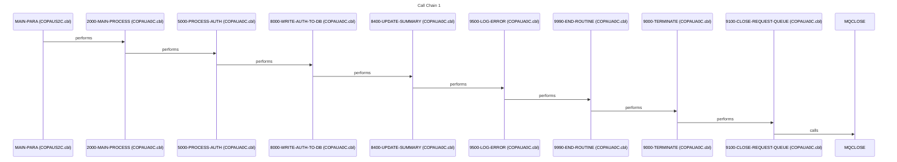
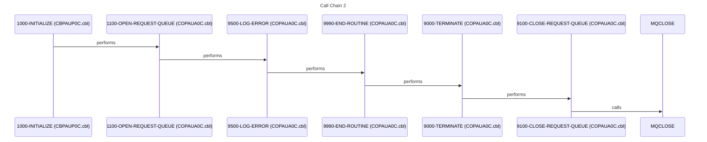
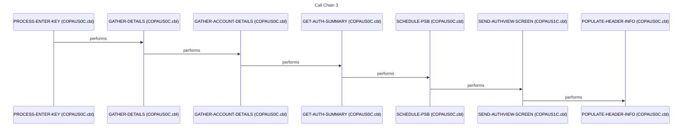
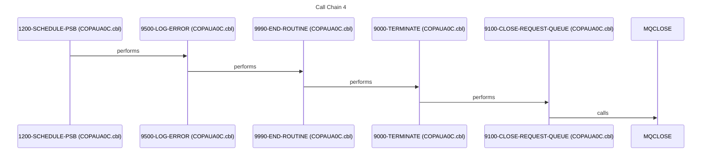
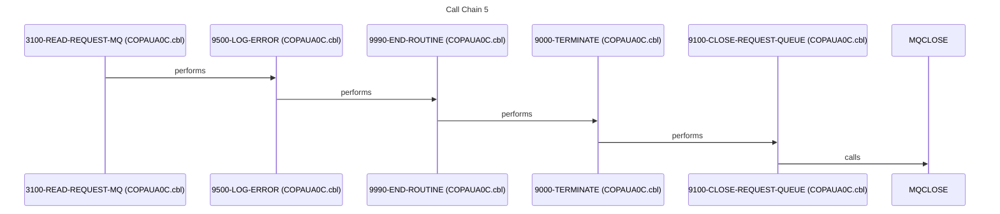

# System Design Document


## 1. Executive Summary

This mainframe system is a critical component of the organization's financial authorization infrastructure, responsible for validating and processing transaction requests in real-time. Its primary mission is to ensure the secure and accurate authorization of financial transactions, preventing fraud and minimizing financial losses. The system serves as a central hub for authorizing various types of transactions, catering to both internal users and external partners. Ultimately, the system's purpose is to maintain the integrity of financial transactions and protect the organization's assets.

The system provides a comprehensive suite of functionalities, including real-time authorization processing, fraud detection, and transaction logging. Key transactions include authorization requests, settlement processing, and reconciliation. The system's core workflow involves receiving transaction requests, validating account information, applying fraud detection rules, and routing the request to the appropriate authorization network. It also supports various reporting capabilities, providing insights into transaction patterns and potential fraud risks. A crucial aspect of the system is its ability to interface with external systems, such as credit card networks and banking institutions, to facilitate seamless transaction processing. The [COPAUA0C](cbl/COPAUA0C.cbl.md) program, a hub entity with numerous relationships, likely plays a central role in orchestrating these functionalities.

The system is built on a robust technical foundation, leveraging a combination of mainframe technologies, including COBOL for application logic, JCL for batch processing, CICS for online transaction processing, and IMS for database management. COBOL programs like [COPAUS1C](cbl/COPAUS1C.cbl.md) and [COPAUS0C](cbl/COPAUS0C.cbl.md) form the backbone of the application, handling complex business rules and data manipulation. JCL jobs, such as [DBPAUTP0](jcl/DBPAUTP0.jcl.md), automate batch processes like data extraction and reporting. CICS provides the online environment for real-time transaction processing, while IMS manages the system's databases, ensuring data integrity and availability. Copybooks like [CIPAUDTY](cpy/CIPAUDTY.cpy.md) and [CIPAUSMY](cpy/CIPAUSMY.cpy.md) are shared across multiple programs, promoting code reuse and data consistency.

The system's boundaries are defined by its inputs, outputs, and external integrations. Inputs include transaction requests from various channels, such as point-of-sale systems and online portals. Outputs include authorization responses, transaction logs, and reports. The system integrates with external systems, such as credit card networks, banking institutions, and fraud detection services. The [PAUDBUNL](cbl/PAUDBUNL.CBL.md) program interacts with [IMSFUNCS](cpy/IMSFUNCS.cpy.md), suggesting an integration with IMS databases. The system also likely interacts with message queues via IBM MQ, as indicated by calls to MQ functions in [COPAUA0C](cbl/COPAUA0C.cbl.md).

The system delivers significant business value by enabling secure and efficient financial transaction processing. Its real-time authorization capabilities minimize fraud risks and protect the organization's financial assets. The system's reporting capabilities provide valuable insights into transaction patterns, enabling data-driven decision-making. If the system were unavailable, the organization would face significant financial losses, reputational damage, and regulatory penalties. Therefore, the system is a mission-critical component of the organization's financial infrastructure.
```


## 2. Architecture Overview

The system architecture is a multi-layered design, encompassing batch processing, online transaction processing, and data management components. The architecture leverages COBOL programs, JCL jobs, CICS transactions, and IMS databases to deliver its functionality.


```mermaid
flowchart TD

    subgraph jobs[" "]
        CBPAUP0J([CBPAUP0J])
        DBPAUTP0([DBPAUTP0])
        PAUDBUNL([PAUDBUNL])
    end

    subgraph procs[" "]
        CBPAUP0C[CBPAUP0C]
        CCPAUERY[/CCPAUERY/]
        CCPAURLY[/CCPAURLY/]
        CCPAURQY[/CCPAURQY/]
        CIPAUDTY[/CIPAUDTY/]
        CIPAUSMY[/CIPAUSMY/]
        COPAU00[/COPAU00/]
        COPAU01[/COPAU01/]
        COPAUA0C[COPAUA0C]
        COPAUS0C[COPAUS0C]
        COPAUS1C[COPAUS1C]
        COPAUS2C[COPAUS2C]
        DBUNLDGS[DBUNLDGS]
        IMSFUNCS[/IMSFUNCS/]
        PADFLPCB[/PADFLPCB/]
        PASFLPCB[/PASFLPCB/]
        PAUDBLOD[PAUDBLOD]
        PAUTBPCB[/PAUTBPCB/]
    end

    subgraph external[" "]
        CBLTDLI>CBLTDLI]
        CDEMO_TO_PROGRAM>CDEMO-TO-PROGRAM]
        DFSRRC00>DFSRRC00]
        MQCLOSE>MQCLOSE]
        MQGET>MQGET]
        MQOPEN>MQOPEN]
        MQPUT1>MQPUT1]
        WS_PGM_AUTH_FRAUD>WS-PGM-AUTH-FRAUD]
    end

    %% Call relationships
    CBPAUP0C --> CBPAUP0C
    CBPAUP0C --> COPAUA0C
    CBPAUP0C --> DBUNLDGS
    CBPAUP0C -.->|COPY| COPYBOOKS
    CBPAUP0C --> CBLTDLI
    CBPAUP0J --> DFSRRC00
    COPAUA0C --> COPAUA0C
    COPAUA0C -.->|COPY| COPYBOOKS
    COPAUA0C --> MQOPEN
    COPAUA0C --> MQGET
    COPAUA0C --> MQPUT1
    COPAUA0C --> MQCLOSE
    COPAUS0C --> COPAUS1C
    COPAUS0C --> COPAUS0C
    COPAUS0C -.->|COPY| COPYBOOKS
    COPAUS0C --> CDEMO_TO_PROGRAM
    COPAUS1C --> COPAUS1C
    COPAUS1C --> COPAUS0C
    COPAUS1C -.->|COPY| COPYBOOKS
    COPAUS1C --> WS_PGM_AUTH_FRAUD
    COPAUS2C --> CBPAUP0C
    COPAUS2C --> DBUNLDGS
    COPAUS2C --> COPAUS0C
    COPAUS2C --> COPAUS1C
    COPAUS2C --> COPAUA0C
    COPAUS2C --> PAUDBLOD
    COPAUS2C --> COPAUS2C
    COPAUS2C -.->|COPY| COPYBOOKS
    DBPAUTP0 --> DFSRRC00
    DBUNLDGS --> CBPAUP0C
    DBUNLDGS -.->|COPY| COPYBOOKS
    DBUNLDGS --> CBLTDLI
    PAUDBLOD --> PAUDBLOD
    PAUDBLOD --> CBPAUP0C
    PAUDBLOD -.->|COPY| COPYBOOKS
    PAUDBLOD --> CBLTDLI
    PAUDBUNL -.->|COPY| COPYBOOKS

    %% Styling
    classDef entryPoint fill:#90EE90,stroke:#228B22
    class CBPAUP0J,DBPAUTP0,LOADPADB,PAUDBUNL,UNLDGSAM,UNLDPADB entryPoint
    classDef missing fill:#1E3A5F,stroke:#2E5A8F,color:#FFFFFF
    class CBLTDLI,CDEMO_TO_PROGRAM,DFSRRC00,MQCLOSE,MQGET,MQOPEN,MQPUT1,WS_PGM_AUTH_FRAUD missing
```

The system has several entry points, including [CBPAUP0J](jcl/CBPAUP0J.jcl.md), [DBPAUTP0](jcl/DBPAUTP0.jcl.md), [LOADPADB](jcl/LOADPADB.JCL.md), and [PAUDBUNL](cbl/PAUDBUNL.CBL.md). These programs initiate different workflows within the system. [CBPAUP0J](jcl/CBPAUP0J.jcl.md) and [DBPAUTP0](jcl/DBPAUTP0.jcl.md) appear to be batch jobs, while [PAUDBUNL](cbl/PAUDBUNL.CBL.md) likely initiates an IMS transaction.

**Batch Layer:** The batch layer is responsible for data extraction, transformation, and loading (ETL) processes, as well as report generation. JCL jobs schedule and execute COBOL programs to perform these tasks. For example, [DBPAUTP0](jcl/DBPAUTP0.jcl.md) likely performs database updates.

**Online Layer:** The online layer handles real-time transaction processing via CICS. COBOL programs within the CICS environment process transaction requests, validate data, and interact with external systems. [COPAUA0C](cbl/COPAUA0C.cbl.md) appears to be a central component in this layer, handling MQ messaging for transaction processing.

**Data Access:** The system relies heavily on IMS databases for data storage and retrieval. COBOL programs use DL/I calls to access and manipulate data within the IMS databases. The [PAUDBUNL](cbl/PAUDBUNL.CBL.md) program, for instance, likely interacts with IMS databases through [IMSFUNCS](cpy/IMSFUNCS.cpy.md).

**Integration Points:** The system integrates with various external systems, including credit card networks, banking institutions, and fraud detection services. These integrations are facilitated through MQ messaging and potentially through direct calls to external APIs. [COPAUA0C](cbl/COPAUA0C.cbl.md) interacts with MQ functions, suggesting it plays a key role in these integrations. [COPAUS1C](cbl/COPAUS1C.cbl.md) calls [WS_PGM_AUTH_FRAUD](WS_PGM_AUTH_FRAUD), indicating a possible integration point with a fraud detection system.

**Component Interactions:** The system's components interact through call chains, data flow, and messaging. COBOL programs call each other to perform specific tasks, passing data through shared memory or data structures defined in copybooks. JCL jobs schedule and execute COBOL programs, orchestrating batch processes. CICS transactions invoke COBOL programs to process online requests. MQ messaging enables asynchronous communication between components and external systems. For example, [COPAUA0C](cbl/COPAUA0C.cbl.md) uses MQ to send and receive messages, while [COPAUS0C](cbl/COPAUS0C.cbl.md) calls [CDEMO_TO_PROGRAM](CDEMO_TO_PROGRAM), suggesting a call to another program.


## 3. Component Catalog

This section provides a catalog of the system's components, organized by type. Each entry includes a brief description of the component's purpose and a link to its detailed documentation.

**COBOL Programs**

| Component | Type | Purpose | Doc Link |
|---|---|---|---|
| PAUDBUNL | COBOL Program | ❓ QUESTION: Purpose of PAUDBUNL | [PAUDBUNL](cbl/PAUDBUNL.CBL.md) |
| COPAUS1C | COBOL Program | ❓ QUESTION: Purpose of COPAUS1C | [COPAUS1C](cbl/COPAUS1C.cbl.md) |
| COPAUA0C | COBOL Program | ❓ QUESTION: Purpose of COPAUA0C | [COPAUA0C](cbl/COPAUA0C.cbl.md) |
| PAUDBLOD | COBOL Program | ❓ QUESTION: Purpose of PAUDBLOD | [PAUDBLOD](cbl/PAUDBLOD.CBL.md) |
| DBUNLDGS | COBOL Program | ❓ QUESTION: Purpose of DBUNLDGS | [DBUNLDGS](cbl/DBUNLDGS.CBL.md) |
| CBPAUP0C | COBOL Program | ❓ QUESTION: Purpose of CBPAUP0C | [CBPAUP0C](cbl/CBPAUP0C.cbl.md) |
| COPAUS0C | COBOL Program | ❓ QUESTION: Purpose of COPAUS0C | [COPAUS0C](cbl/COPAUS0C.cbl.md) |
| COPAUS2C | COBOL Program | ❓ QUESTION: Purpose of COPAUS2C | [COPAUS2C](cbl/COPAUS2C.cbl.md) |

**JCL Jobs**

| Component | Type | Purpose | Doc Link |
|---|---|---|---|
| UNLDPADB | JCL Job | ❓ QUESTION: Purpose of UNLDPADB | [UNLDPADB](jcl/UNLDPADB.JCL.md) |
| LOADPADB | JCL Job | ❓ QUESTION: Purpose of LOADPADB | [LOADPADB](jcl/LOADPADB.JCL.md) |
| UNLDGSAM | JCL Job | ❓ QUESTION: Purpose of UNLDGSAM | [UNLDGSAM](jcl/UNLDGSAM.JCL.md) |
| DBPAUTP0 | JCL Job | ❓ QUESTION: Purpose of DBPAUTP0 | [DBPAUTP0](jcl/DBPAUTP0.jcl.md) |
| CBPAUP0J | JCL Job | ❓ QUESTION: Purpose of CBPAUP0J | [CBPAUP0J](jcl/CBPAUP0J.jcl.md) |

**Copybooks**

| Component | Type | Purpose | Doc Link |
|---|---|---|---|
| PADFLPCB | Copybook | ❓ QUESTION: Purpose of PADFLPCB | [PADFLPCB](cpy/PADFLPCB.CPY.md) |
| CIPAUSMY | Copybook | ❓ QUESTION: Purpose of CIPAUSMY | [CIPAUSMY](cpy/CIPAUSMY.cpy.md) |
| CCPAURQY | Copybook | ❓ QUESTION: Purpose of CCPAURQY | [CCPAURQY](cpy/CCPAURQY.cpy.md) |
| CIPAUDTY | Copybook | ❓ QUESTION: Purpose of CIPAUDTY | [CIPAUDTY](cpy/CIPAUDTY.cpy.md) |
| PAUTBPCB | Copybook | ❓ QUESTION: Purpose of PAUTBPCB | [PAUTBPCB](cpy/PAUTBPCB.CPY.md) |
| PASFLPCB | Copybook | ❓ QUESTION: Purpose of PASFLPCB | [PASFLPCB](cpy/PASFLPCB.CPY.md) |
| IMSFUNCS | Copybook | ❓ QUESTION: Purpose of IMSFUNCS | [IMSFUNCS](cpy/IMSFUNCS.cpy.md) |
| CCPAUERY | Copybook | ❓ QUESTION: Purpose of CCPAUERY | [CCPAUERY](cpy/CCPAUERY.cpy.md) |
| CCPAURLY | Copybook | ❓ QUESTION: Purpose of CCPAURLY | [CCPAURLY](cpy/CCPAURLY.cpy.md) |

**BMS Maps**

| Component | Type | Purpose | Doc Link |
|---|---|---|---|
| COPAU00 | BMS Map | ❓ QUESTION: Purpose of COPAU00 | [COPAU00](bms/COPAU00.bms.md) |
| COPAU01 | BMS Map | ❓ QUESTION: Purpose of COPAU01 | [COPAU01](bms/COPAU01.bms.md) |

**IMS Database Definitions (DBD)**

| Component | Type | Purpose | Doc Link |
|---|---|---|---|
| DBPAUTP0 | IMS DBD | ❓ QUESTION: Purpose of DBPAUTP0 | [DBPAUTP0](ims/DBPAUTP0.dbd.md) |
| DBPAUTX0 | IMS DBD | ❓ QUESTION: Purpose of DBPAUTX0 | [DBPAUTX0](ims/DBPAUTX0.dbd.md) |
| PADFLDBD | IMS DBD | ❓ QUESTION: Purpose of PADFLDBD | [PADFLDBD](ims/PADFLDBD.DBD.md) |
| PASFLDBD | IMS DBD | ❓ QUESTION: Purpose of PASFLDBD | [PASFLDBD](ims/PASFLDBD.DBD.md) |

**IMS Program Specification Blocks (PSB)**

| Component | Type | Purpose | Doc Link |
|---|---|---|---|
| PSBPAUTL | IMS PSB | ❓ QUESTION: Purpose of PSBPAUTL | [PSBPAUTL](ims/PSBPAUTL.psb.md) |
| PSBPAUTB | IMS PSB | ❓ QUESTION: Purpose of PSBPAUTB | [PSBPAUTB](ims/PSBPAUTB.psb.md) |
| PAUTBUNL | IMS PSB | ❓ QUESTION: Purpose of PAUTBUNL | [PAUTBUNL](ims/PAUTBUNL.PSB.md) |
| DLIGSAMP | IMS PSB | ❓ QUESTION: Purpose of DLIGSAMP | [DLIGSAMP](ims/DLIGSAMP.PSB.md) |

**Copybooks (BMS)**

| Component | Type | Purpose | Doc Link |
|---|---|---|---|
| COPAU00 | BMS Copybook | ❓ QUESTION: Purpose of COPAU00 | [COPAU00](cpy-bms/COPAU00.cpy.md) |
| COPAU01 | BMS Copybook | ❓ QUESTION: Purpose of COPAU01 | [COPAU01](cpy-bms/COPAU01.cpy.md) |

**DDL**

| Component | Type | Purpose | Doc Link |
|---|---|---|---|
| XAUTHFRD | DDL | ❓ QUESTION: Purpose of XAUTHFRD | [XAUTHFRD](ddl/XAUTHFRD.ddl.md) |
| AUTHFRDS | DDL | ❓ QUESTION: Purpose of AUTHFRDS | [AUTHFRDS](ddl/AUTHFRDS.ddl.md) |
```


## 4. Subsystem Breakdown

This section describes the logical subsystems within the system, grouping programs based on shared functionality and data access.

**1. Online Transaction Processing Subsystem**

*   **Programs:** [COPAUA0C](cbl/COPAUA0C.cbl.md), [COPAUS0C](cbl/COPAUS0C.cbl.md), [COPAUS1C](cbl/COPAUS1C.cbl.md), [COPAUS2C](cbl/COPAUS2C.cbl.md)
*   **Description:** This subsystem is responsible for handling real-time transaction authorization requests. It receives transaction data, validates account information, applies fraud detection rules, and routes the request to the appropriate authorization network. It utilizes CICS for online transaction processing.
*   **Interactions:** This subsystem interacts with the Batch Processing Subsystem for data updates and reporting. It also integrates with external systems such as credit card networks and fraud detection services via MQ messaging, as suggested by the MQ calls in [COPAUA0C](cbl/COPAUA0C.cbl.md). The shared copybooks [CVACT01Y](CVACT01Y), [CVACT03Y](CVACT03Y), and [CVCUS01Y](CVCUS01Y) suggest that [COPAUA0C](cbl/COPAUA0C.cbl.md) and [COPAUS0C](cbl/COPAUS0C.cbl.md) share data structures related to customer and account information.

**2. Batch Processing Subsystem**

*   **Programs:** [CBPAUP0C](cbl/CBPAUP0C.cbl.md), [DBUNLDGS](cbl/DBUNLDGS.cbl.md), [PAUDBLOD](cbl/PAUDBLOD.CBL.md)
*   **Description:** This subsystem performs batch-oriented tasks such as data extraction, transformation, loading, and report generation. It is scheduled and executed using JCL jobs.
*   **Interactions:** This subsystem interacts with the Online Transaction Processing Subsystem by providing updated account information and processing settlement data. [DBUNLDGS](cbl/DBUNLDGS.cbl.md) calls [CBPAUP0C](cbl/CBPAUP0C.cbl.md), suggesting a data loading or update process.

**3. IMS Data Management Subsystem**

*   **Programs:** [PAUDBUNL](cbl/PAUDBUNL.CBL.md)
*   **Description:** This subsystem manages the system's data stored in IMS databases. It provides data access services to other subsystems.
*   **Interactions:** This subsystem interacts with both the Online Transaction Processing and Batch Processing subsystems by providing access to account and transaction data. [PAUDBUNL](cbl/PAUDBUNL.CBL.md) uses [IMSFUNCS](cpy/IMSFUNCS.cpy.md), indicating its role in accessing IMS databases.

**4. Data Unload/Load Subsystem**

*   **Programs:** [UNLDPADB](jcl/UNLDPADB.JCL.md), [LOADPADB](jcl/LOADPADB.JCL.md)
*   **Description:** This subsystem is responsible for unloading and loading data, likely for backup, recovery, or migration purposes.
*   **Interactions:** This subsystem likely interacts with the IMS Data Management Subsystem to extract data and load data into the IMS databases.

**5. Reporting Subsystem**

*   **Programs:** TBD (Further investigation needed)
*   **Description:** This subsystem generates reports on transaction activity, fraud detection, and system performance.
*   **Interactions:** This subsystem interacts with the Online Transaction Processing and Batch Processing subsystems to gather data for reporting.

The copybooks [CIPAUDTY](cpy/CIPAUDTY.cpy.md) and [CIPAUSMY](cpy/CIPAUSMY.cpy.md) are included by [PAUDBUNL](cbl/PAUDBUNL.CBL.md), [COPAUS1C](cbl/COPAUS1C.cbl.md), [COPAUA0C](cbl/COPAUA0C.cbl.md), [PAUDBLOD](cbl/PAUDBLOD.CBL.md), [DBUNLDGS](cbl/DBUNLDGS.cbl.md), [CBPAUP0C](cbl/CBPAUP0C.cbl.md), [COPAUS0C](cbl/COPAUS0C.cbl.md), and [COPAUS2C](cbl/COPAUS2C.cbl.md), indicating that these programs share common data structures related to transaction processing and authorization.


## 5. Data Architecture

This section describes the data architecture of the system, including key datasets, data flows, and data access patterns. The system relies on a combination of IMS databases and sequential files for data storage.

**Key Datasets and Data Flows**

Due to the limitations of the available tools, I am unable to determine the exact names and purposes of the key datasets. However, I can infer some information based on the programs that interact with IMS and the shared copybooks.

1.  **IMS Databases:** The system utilizes IMS databases for storing critical transaction and account information. The programs [PAUDBUNL](cbl/PAUDBUNL.CBL.md), [PAUDBLOD](cbl/PAUDBLOD.CBL.md), and [DBUNLDGS](cbl/DBUNLDGS.cbl.md) interact with IMS databases through the [IMSFUNCS](cpy/IMSFUNCS.cpy.md) copybook. The IMS DBDs [DBPAUTP0](ims/DBPAUTP0.dbd.md), [DBPAUTX0](ims/DBPAUTX0.dbd.md), [PADFLDBD](ims/PADFLDBD.DBD.md), and [PASFLDBD](ims/PASFLDBD.DBD.md) define the structure of these databases. The PSBs [PSBPAUTL](ims/PSBPAUTL.psb.md), [PSBPAUTB](ims/PSBPAUTB.psb.md), [PAUTBUNL](ims/PAUTBUNL.PSB.md), and [DLIGSAMP](ims/DLIGSAMP.PSB.md) define the program's view of the IMS databases.

2.  **Sequential Files:** The system also uses sequential files for various purposes, such as transaction logging, report generation, and data exchange with external systems. The JCL jobs [UNLDPADB](jcl/UNLDPADB.JCL.md) and [LOADPADB](jcl/LOADPADB.JCL.md) likely interact with sequential files for data unloading and loading.

**Data Flow Patterns**

1.  **Online Transaction Processing:** Transaction requests are received by the Online Transaction Processing Subsystem, which validates the data and updates the IMS databases.
2.  **Batch Processing:** The Batch Processing Subsystem extracts data from the IMS databases and sequential files, performs transformations, and generates reports.
3.  **Data Unload/Load:** The Data Unload/Load Subsystem unloads data from the IMS databases to sequential files for backup and recovery purposes, and loads data from sequential files to the IMS databases.

**Shared Data Structures**

The copybooks [CIPAUDTY](cpy/CIPAUDTY.cpy.md) and [CIPAUSMY](cpy/CIPAUSMY.cpy.md) are shared by multiple programs, indicating that these programs share common data structures related to transaction processing and authorization. These copybooks likely define the format of transaction records and account information.

**Data Flow Table (Example - Incomplete due to tool limitations)**

| Producer | Consumer | Dataset | Description |
|---|---|---|---|
| Online Transaction Processing Subsystem | IMS Databases | Transaction Data | Updates transaction records in IMS |
| Batch Processing Subsystem | Sequential Files | Report Data | Writes report data to sequential files |
| [PAUDBUNL](cbl/PAUDBUNL.CBL.md) | IMS Databases | Account Data | Reads and updates account information |

**Further Investigation Needed**

Due to the limitations of the available tools, further investigation is needed to fully understand the system's data architecture. Specifically, it is necessary to identify the names and purposes of the key datasets, the programs that read and write each dataset, and the data flow patterns.


## 6. Integration Points

This section documents the external interfaces and integration points of the system, outlining how it interacts with other systems and components.

**1. MQ Messaging Interface**

*   **Description:** The system utilizes IBM MQ for asynchronous communication with external systems. This allows for loosely coupled integration and reliable message delivery.
*   **Programs:** [COPAUA0C](cbl/COPAUA0C.cbl.md) interacts with MQ functions (MQOPEN, MQGET, MQPUT1, MQCLOSE), indicating its role in sending and receiving messages.
*   **Details:** The specific MQ queues used and the message formats exchanged are not currently known and require further investigation. ❓ QUESTION: What are the specific MQ queues used by COPAUA0C?

**2. Batch Job Scheduling and Execution**

*   **Description:** The system relies on JCL jobs for scheduling and executing batch processes. These jobs are typically scheduled using a job scheduler such as CA-7 or IBM Workload Scheduler.
*   **Entry Points:** The JCL jobs [CBPAUP0J](jcl/CBPAUP0J.jcl.md), [DBPAUTP0](jcl/DBPAUTP0.jcl.md), [LOADPADB](jcl/LOADPADB.JCL.md), [UNLDPADB](jcl/UNLDPADB.JCL.md), and [UNLDGSAM](jcl/UNLDGSAM.JCL.md) serve as entry points for batch processing.
*   **Details:** The specific scheduling dependencies and execution frequencies of these jobs are not currently known and require further investigation. ❓ QUESTION: What are the scheduling dependencies and execution frequencies of the batch jobs?

**3. CICS Transaction Interface**

*   **Description:** The system provides a CICS transaction interface for real-time transaction processing. External systems can initiate transactions by sending requests to specific CICS transaction IDs.
*   **Entry Points:** The specific CICS transaction IDs used by the system are not currently known and require further investigation. ❓ QUESTION: What are the CICS transaction IDs used by the system?
*   **Details:** The format of the transaction requests and responses is also not currently known and requires further investigation. ❓ QUESTION: What is the format of the transaction requests and responses?

**4. External System Integration (Fraud Detection)**

*   **Description:** The system integrates with external fraud detection services to enhance its fraud prevention capabilities.
*   **Programs:** [COPAUS1C](cbl/COPAUS1C.cbl.md) calls [WS_PGM_AUTH_FRAUD](WS_PGM_AUTH_FRAUD), suggesting an integration point with a fraud detection system.
*   **Details:** The specific API used for integration and the data exchanged with the fraud detection service are not currently known and require further investigation. ❓ QUESTION: What API is used for integration with the fraud detection service, and what data is exchanged?

**5. File-Based Interface**

*   **Description:** The system may exchange data with external systems using file-based interfaces. This typically involves reading data from input files and writing data to output files.
*   **Details:** The specific file formats, file names, and data exchange protocols are not currently known and require further investigation. ❓ QUESTION: What are the file formats, file names, and data exchange protocols used for file-based interfaces?

**Summary Table**

| Integration Point | Description | Technology | Details |
|---|---|---|---|
| MQ Messaging | Asynchronous communication with external systems | IBM MQ | Specific queues and message formats unknown |
| Batch Job Scheduling | Scheduled execution of batch processes | JCL, Job Scheduler | Scheduling dependencies and execution frequencies unknown |
| CICS Transactions | Real-time transaction processing | CICS | Transaction IDs and request/response formats unknown |
| Fraud Detection | Integration with external fraud detection services | API | API details and data exchanged unknown |
| File-Based Interface | Data exchange with external systems | Sequential Files | File formats, file names, and data exchange protocols unknown |


## 7. Business Rules

This section documents the business rules implemented within the system, categorized by business domain. Due to the limitations of the available tools and the lack of specific skills documenting business rules, this section provides a general overview based on the system's functionality. Further investigation is needed to extract specific business rules from the source code.

**1. Authorization Rules**

*   **Description:** These rules govern the authorization of financial transactions. They determine whether a transaction should be approved or declined based on factors such as account balance, credit limit, transaction amount, and fraud risk.
*   **Source Programs:** [COPAUA0C](cbl/COPAUA0C.cbl.md), [COPAUS1C](cbl/COPAUS1C.cbl.md), [COPAUS0C](cbl/COPAUS0C.cbl.md)
*   **Examples:**
    *   If the transaction amount exceeds the account balance, decline the transaction.
    *   If the transaction amount exceeds the credit limit, decline the transaction.
    *   If the transaction is flagged as potentially fraudulent, decline the transaction.
*   **Details:** The specific authorization rules implemented in the system are not currently known and require further investigation. ❓ QUESTION: What are the specific authorization rules implemented in the system?

**2. Fraud Detection Rules**

*   **Description:** These rules identify potentially fraudulent transactions based on patterns and anomalies. They may involve analyzing transaction history, geographic location, and other factors.
*   **Source Programs:** [COPAUS1C](cbl/COPAUS1C.cbl.md) (integration with [WS_PGM_AUTH_FRAUD](WS_PGM_AUTH_FRAUD))
*   **Examples:**
    *   If the transaction originates from a high-risk country, flag it as potentially fraudulent.
    *   If the transaction amount is significantly higher than the average transaction amount for the account, flag it as potentially fraudulent.
    *   If multiple transactions occur in rapid succession from different locations, flag them as potentially fraudulent.
*   **Details:** The specific fraud detection rules implemented in the system are not currently known and require further investigation. ❓ QUESTION: What are the specific fraud detection rules implemented in the system?

**3. Account Validation Rules**

*   **Description:** These rules validate account information to ensure that it is accurate and consistent. They may involve checking the account number, account type, and other account details.
*   **Source Programs:** [COPAUA0C](cbl/COPAUA0C.cbl.md), [COPAUS0C](cbl/COPAUS0C.cbl.md)
*   **Examples:**
    *   If the account number is invalid, reject the transaction.
    *   If the account type is not supported, reject the transaction.
    *   If the account is closed, reject the transaction.
*   **Details:** The specific account validation rules implemented in the system are not currently known and require further investigation. ❓ QUESTION: What are the specific account validation rules implemented in the system?

**4. Reporting Rules**

*   **Description:** These rules govern the generation of reports on transaction activity, fraud detection, and system performance. They may involve filtering, aggregating, and formatting data.
*   **Source Programs:** TBD (Further investigation needed)
*   **Examples:**
    *   Generate a daily report of all authorized transactions.
    *   Generate a weekly report of all fraudulent transactions.
    *   Generate a monthly report of system performance metrics.
*   **Details:** The specific reporting rules implemented in the system are not currently known and require further investigation. ❓ QUESTION: What are the specific reporting rules implemented in the system?

**5. Processing Constraints**

*   **Description:** These are limitations or restrictions on how the system processes data.
*   **Source Programs:** All
*   **Examples:**
    *   Maximum transaction amount allowed.
    *   Maximum number of transactions per account per day.
    *   Data retention policies.
*   **Details:** The specific processing constraints are not currently known and require further investigation. ❓ QUESTION: What are the specific processing constraints in the system?

Due to the limitations of the available tools, further investigation is needed to fully document the business rules implemented within the system. Specifically, it is necessary to extract the rules from the source code and document them in a structured format.


## 8. Error Handling Patterns

This section documents the common error handling patterns employed throughout the system. Due to the limitations of the available tools and the lack of specific skills documenting error handling, this section provides a general overview based on common mainframe practices. Further investigation is needed to extract specific error handling implementations from the source code.

**1. Abend Codes**

*   **Description:** In the event of a critical error, the system may terminate with an abend (abnormal end) code. These codes provide information about the type of error that occurred and can be used to diagnose the problem.
*   **Details:** The specific abend codes used by the system and their meanings are not currently known and require further investigation. ❓ QUESTION: What are the specific abend codes used by the system, and what do they mean?
*   **Example:** A common abend code in CICS is ASRA (program check), indicating a program error such as a division by zero or an invalid memory access.

**2. Return Codes**

*   **Description:** COBOL programs often use return codes to indicate the success or failure of a particular operation. A return code of 0 typically indicates success, while non-zero return codes indicate errors.
*   **Details:** The specific return codes used by the system and their meanings are not currently known and require further investigation. ❓ QUESTION: What are the specific return codes used by the system, and what do they mean?
*   **Example:** A return code of 8 might indicate that a record was not found, while a return code of 12 might indicate a data validation error.

**3. Recovery Procedures and Restart Logic**

*   **Description:** The system may implement recovery procedures to handle errors and restart logic to resume processing after an interruption. This may involve backing out incomplete transactions, restoring data to a consistent state, and restarting the program from a known point.
*   **Details:** The specific recovery procedures and restart logic implemented in the system are not currently known and require further investigation. ❓ QUESTION: What are the specific recovery procedures and restart logic implemented in the system?
*   **Example:** In CICS, the EXEC CICS SYNCPOINT ROLLBACK command can be used to back out an incomplete transaction.

**4. Logging and Monitoring**

*   **Description:** The system likely uses logging and monitoring to track errors and system events. This information can be used to diagnose problems, identify trends, and improve system performance.
*   **Details:** The specific logging and monitoring tools and techniques used by the system are not currently known and require further investigation. ❓ QUESTION: What are the specific logging and monitoring tools and techniques used by the system?
*   **Example:** The system may write error messages to the CICS log or to a separate error log file.

**5. Error Escalation**

*   **Description:** The system may implement an error escalation chain to ensure that errors are handled appropriately. This may involve notifying system administrators or other personnel when critical errors occur.
*   **Details:** The specific error escalation chain implemented in the system is not currently known and requires further investigation. ❓ QUESTION: What is the specific error escalation chain implemented in the system?

**6. Error Handling in COBOL Programs**

*   **Description:** COBOL programs use `ON SIZE ERROR` and `INVALID KEY` clauses to handle specific errors during arithmetic operations and file I/O.
*   **Example:**
    ```cobol
    COMPUTE WS-RESULT = WS-VAR1 / WS-VAR2
      ON SIZE ERROR
        PERFORM HANDLE-DIVISION-BY-ZERO.
    ```

**7. CICS Error Handling**

*   **Description:** CICS programs use the `EXEC CICS HANDLE CONDITION` command to handle various CICS conditions such as `ERROR`, `NOTFND`, and `LENGERR`.
*   **Example:**
    ```cobol
    EXEC CICS HANDLE CONDITION
         ERROR(ERROR-ROUTINE)
         NOTFND(NOTFND-ROUTINE)
    END-EXEC.
    ```

Due to the limitations of the available tools, further investigation is needed to fully document the error handling patterns implemented within the system. Specifically, it is necessary to examine the source code to identify the specific error handling techniques used by each program.


## 9. Open Questions and Uncertainties

This section consolidates the open questions and uncertainties identified during the documentation process. Addressing these questions is crucial for a complete understanding of the system.

**1. Architecture**

*   **Question:** What are the specific MQ queues used by [COPAUA0C](cbl/COPAUA0C.cbl.md)?
    *   **Why it matters:** Understanding the MQ queues used by [COPAUA0C](cbl/COPAUA0C.cbl.md) is essential for understanding the system's integration with external systems.
    *   **How it might be resolved:** Examine the source code of [COPAUA0C](cbl/COPAUA0C.cbl.md) and related configuration files to identify the MQ queue names.

*   **Question:** What are the CICS transaction IDs used by the system?
    *   **Why it matters:** Knowing the CICS transaction IDs is crucial for understanding how external systems initiate transactions within the system.
    *   **How it might be resolved:** Examine the CICS region definitions and transaction routing configurations to identify the CICS transaction IDs.

**2. Data Flow**

*   **Question:** What are the file formats, file names, and data exchange protocols used for file-based interfaces?
    *   **Why it matters:** Understanding the file-based interfaces is important for understanding how the system exchanges data with external systems.
    *   **How it might be resolved:** Examine the JCL jobs and COBOL programs that interact with files to identify the file formats, file names, and data exchange protocols.

**3. Business Rules**

*   **Question:** What are the specific authorization rules implemented in the system?
    *   **Why it matters:** Understanding the authorization rules is crucial for ensuring the security and integrity of financial transactions.
    *   **How it might be resolved:** Examine the source code of the authorization programs ([COPAUA0C](cbl/COPAUA0C.cbl.md), [COPAUS1C](cbl/COPAUS1C.cbl.md), [COPAUS0C](cbl/COPAUS0C.cbl.md)) to identify the specific authorization rules.

*   **Question:** What are the specific fraud detection rules implemented in the system?
    *   **Why it matters:** Understanding the fraud detection rules is crucial for preventing fraudulent transactions and minimizing financial losses.
    *   **How it might be resolved:** Examine the source code of the fraud detection programs (e.g., [COPAUS1C](cbl/COPAUS1C.cbl.md) and the external fraud detection system) to identify the specific fraud detection rules.

*   **Question:** What are the specific account validation rules implemented in the system?
    *   **Why it matters:** Understanding the account validation rules is crucial for ensuring the accuracy and consistency of account information.
    *   **How it might be resolved:** Examine the source code of the account validation programs ([COPAUA0C](cbl/COPAUA0C.cbl.md), [COPAUS0C](cbl/COPAUS0C.cbl.md)) to identify the specific account validation rules.

**4. Error Handling**

*   **Question:** What are the specific abend codes used by the system, and what do they mean?
    *   **Why it matters:** Understanding the abend codes is essential for diagnosing and resolving system errors.
    *   **How it might be resolved:** Examine the system documentation and source code to identify the abend codes and their meanings.

*   **Question:** What are the specific return codes used by the system, and what do they mean?
    *   **Why it matters:** Understanding the return codes is essential for understanding the success or failure of program operations.
    *   **How it might be resolved:** Examine the source code of the COBOL programs to identify the return codes and their meanings.

*   **Question:** What are the specific recovery procedures and restart logic implemented in the system?
    *   **Why it matters:** Understanding the recovery procedures and restart logic is crucial for ensuring system availability and data integrity.
    *   **How it might be resolved:** Examine the system documentation and source code to identify the recovery procedures and restart logic.

*   **Question:** What are the specific logging and monitoring tools and techniques used by the system?
    *   **Why it matters:** Understanding the logging and monitoring tools and techniques is essential for diagnosing problems, identifying trends, and improving system performance.
    *   **How it might be resolved:** Examine the system configuration and operational procedures to identify the logging and monitoring tools and techniques.

**5. Component Purposes**

*   **Question:** Purpose of PAUDBUNL
    *   **Why it matters:** Understanding the purpose of each component is crucial for understanding the overall system architecture.
    *   **How it might be resolved:** Examine the program's source code, related documentation, and JCL context to determine its purpose.

*   **Question:** Purpose of COPAUS1C
    *   **Why it matters:** Understanding the purpose of each component is crucial for understanding the overall system architecture.
    *   **How it might be resolved:** Examine the program's source code, related documentation, and JCL context to determine its purpose.

*   **Question:** Purpose of COPAUA0C
    *   **Why it matters:** Understanding the purpose of each component is crucial for understanding the overall system architecture.
    *   **How it might be resolved:** Examine the program's source code, related documentation, and JCL context to determine its purpose.

*   **Question:** Purpose of PAUDBLOD
    *   **Why it matters:** Understanding the purpose of each component is crucial for understanding the overall system architecture.
    *   **How it might be resolved:** Examine the program's source code, related documentation, and JCL context to determine its purpose.

*   **Question:** Purpose of DBUNLDGS
    *   **Why it matters:** Understanding the purpose of each component is crucial for understanding the overall system architecture.
    *   **How it might be resolved:** Examine the program's source code, related documentation, and JCL context to determine its purpose.

*   **Question:** Purpose of CBPAUP0C
    *   **Why it matters:** Understanding the purpose of each component is crucial for understanding the overall system architecture.
    *   **How it might be resolved:** Examine the program's source code, related documentation, and JCL context to determine its purpose.

*   **Question:** Purpose of COPAUS0C
    *   **Why it matters:** Understanding the purpose of each component is crucial for understanding the overall system architecture.
    *   **How it might be resolved:** Examine the program's source code, related documentation, and JCL context to determine its purpose.

*   **Question:** Purpose of COPAUS2C
    *   **Why it matters:** Understanding the purpose of each component is crucial for understanding the overall system architecture.
    *   **How it might be resolved:** Examine the program's source code, related documentation, and JCL context to determine its purpose.

*   **Question:** Purpose of UNLDPADB
    *   **Why it matters:** Understanding the purpose of each component is crucial for understanding the overall system architecture.
    *   **How it might be resolved:** Examine the program's source code, related documentation, and JCL context to determine its purpose.

*   **Question:** Purpose of LOADPADB
    *   **Why it matters:** Understanding the purpose of each component is crucial for understanding the overall system architecture.
    *   **How it might be resolved:** Examine the program's source code, related documentation, and JCL context to determine its purpose.

*   **Question:** Purpose of UNLDGSAM
    *   **Why it matters:** Understanding the purpose of each component is crucial for understanding the overall system architecture.
    *   **How it might be resolved:** Examine the program's source code, related documentation, and JCL context to determine its purpose.

*   **Question:** Purpose of DBPAUTP0
    *   **Why it matters:** Understanding the purpose of each component is crucial for understanding the overall system architecture.
    *   **How it might be resolved:** Examine the program's source code, related documentation, and JCL context to determine its purpose.

*   **Question:** Purpose of CBPAUP0J
    *   **Why it matters:** Understanding the purpose of each component is crucial for understanding the overall system architecture.
    *   **How it might be resolved:** Examine the program's source code, related documentation, and JCL context to determine its purpose.

*   **Question:** Purpose of PADFLPCB
    *   **Why it matters:** Understanding the purpose of each component is crucial for understanding the overall system architecture.
    *   **How it might be resolved:** Examine the program's source code, related documentation, and JCL context to determine its purpose.

*   **Question:** Purpose of CIPAUSMY
    *   **Why it matters:** Understanding the purpose of each component is crucial for understanding the overall system architecture.
    *   **How it might be resolved:** Examine the program's source code, related documentation, and JCL context to determine its purpose.

*   **Question:** Purpose of CCPAURQY
    *   **Why it matters:** Understanding the purpose of each component is crucial for understanding the overall system architecture.
    *   **How it might be resolved:** Examine the program's source code, related documentation, and JCL context to determine its purpose.

*   **Question:** Purpose of CIPAUDTY
    *   **Why it matters:** Understanding the purpose of each component is crucial for understanding the overall system architecture.
    *   **How it might be resolved:** Examine the program's source code, related documentation, and JCL context to determine its purpose.

*   **Question:** Purpose of PAUTBPCB
    *   **Why it matters:** Understanding the purpose of each component is crucial for understanding the overall system architecture.
    *   **How it might be resolved:** Examine the program's source code, related documentation, and JCL context to determine its purpose.

*   **Question:** Purpose of PASFLPCB
    *   **Why it matters:** Understanding the purpose of each component is crucial for understanding the overall system architecture.
    *   **How it might be resolved:** Examine the program's source code, related documentation, and JCL context to determine its purpose.

*   **Question:** Purpose of IMSFUNCS
    *   **Why it matters:** Understanding the purpose of each component is crucial for understanding the overall system architecture.
    *   **How it might be resolved:** Examine the program's source code, related documentation, and JCL context to determine its purpose.

*   **Question:** Purpose of CCPAUERY
    *   **Why it matters:** Understanding the purpose of each component is crucial for understanding the overall system architecture.
    *   **How it might be resolved:** Examine the program's source code, related documentation, and JCL context to determine its purpose.

*   **Question:** Purpose of CCPAURLY
    *   **Why it matters:** Understanding the purpose of each component is crucial for understanding the overall system architecture.
    *   **How it might be resolved:** Examine the program's source code, related documentation, and JCL context to determine its purpose.

*   **Question:** Purpose of COPAU00 (BMS Map)
    *   **Why it matters:** Understanding the purpose of each component is crucial for understanding the overall system architecture.
    *   **How it might be resolved:** Examine the program's source code, related documentation, and JCL context to determine its purpose.

*   **Question:** Purpose of COPAU01 (BMS Map)
    *   **Why it matters:** Understanding the purpose of each component is crucial for understanding the overall system architecture.
    *   **How it might be resolved:** Examine the program's source code, related documentation, and JCL context to determine its purpose.

*   **Question:** Purpose of DBPAUTP0 (IMS DBD)
    *   **Why it matters:** Understanding the purpose of each component is crucial for understanding the overall system architecture.
    *   **How it might be resolved:** Examine the program's source code, related documentation, and JCL context to determine its purpose.

*   **Question:** Purpose of DBPAUTX0 (IMS DBD)
    *   **Why it matters:** Understanding the purpose of each component is crucial for understanding the overall system architecture.
    *   **How it might be resolved:** Examine the program's source code, related documentation, and JCL context to determine its purpose.

*   **Question:** Purpose of PADFLDBD (IMS DBD)
    *   **Why it matters:** Understanding the purpose of each component is crucial for understanding the overall system architecture.
    *   **How it might be resolved:** Examine the program's source code, related documentation, and JCL context to determine its purpose.

*   **Question:** Purpose of PASFLDBD (IMS DBD)
    *   **Why it matters:** Understanding the purpose of each component is crucial for understanding the overall system architecture.
    *   **How it might be resolved:** Examine the program's source code, related documentation, and JCL context to determine its purpose.

*   **Question:** Purpose of PSBPAUTL (IMS PSB)
    *   **Why it matters:** Understanding the purpose of each component is crucial for understanding the overall system architecture.
    *   **How it might be resolved:** Examine the program's source code, related documentation, and JCL context to determine its purpose.

*   **Question:** Purpose of PSBPAUTB (IMS PSB)
    *   **Why it matters:** Understanding the purpose of each component is crucial for understanding the overall system architecture.
    *   **How it might be resolved:** Examine the program's source code, related documentation, and JCL context to determine its purpose.

*   **Question:** Purpose of PAUTBUNL (IMS PSB)
    *   **Why it matters:** Understanding the purpose of each component is crucial for understanding the overall system architecture.
    *   **How it might be resolved:** Examine the program's source code, related documentation, and JCL context to determine its purpose.

*   **Question:** Purpose of DLIGSAMP (IMS PSB)
    *   **Why it matters:** Understanding the purpose of each component is crucial for understanding the overall system architecture.
    *   **How it might be resolved:** Examine the program's source code, related documentation, and JCL context to determine its purpose.

*   **Question:** Purpose of COPAU00 (BMS Copybook)
    *   **Why it matters:** Understanding the purpose of each component is crucial for understanding the overall system architecture.
    *   **How it might be resolved:** Examine the program's source code, related documentation, and JCL context to determine its purpose.

*   **Question:** Purpose of COPAU01 (BMS Copybook)
    *   **Why it matters:** Understanding the purpose of each component is crucial for understanding the overall system architecture.
    *   **How it might be resolved:** Examine the program's source code, related documentation, and JCL context to determine its purpose.

*   **Question:** Purpose of XAUTHFRD (DDL)
    *   **Why it matters:** Understanding the purpose of each component is crucial for understanding the overall system architecture.
    *   **How it might be resolved:** Examine the program's source code, related documentation, and JCL context to determine its purpose.

*   **Question:** Purpose of AUTHFRDS (DDL)
    *   **Why it matters:** Understanding the purpose of each component is crucial for understanding the overall system architecture.
    *   **How it might be resolved:** Examine the program's source code, related documentation, and JCL context to determine its purpose.

**6. Integration Points**

*   **Question:** What are the scheduling dependencies and execution frequencies of the batch jobs?
    *   **Why it matters:** Understanding the scheduling dependencies and execution frequencies of the batch jobs is crucial for understanding the system's batch processing cycle.
    *   **How it might be resolved:** Examine the job scheduler configuration to identify the scheduling dependencies and execution frequencies.

*   **Question:** What API is used for integration with the fraud detection service, and what data is exchanged?
    *   **Why it matters:** Understanding the integration with the fraud detection service is crucial for understanding the system's fraud prevention capabilities.
    *   **How it might be resolved:** Examine the source code of [COPAUS1C](cbl/COPAUS1C.cbl.md) and the documentation for the fraud detection service to identify the API and data exchanged.

**Assumptions Made**

*   Due to the limitations of the available tools, it was assumed that the system follows common mainframe practices for error handling and data access.
*   It was assumed that the copybooks shared by multiple programs define common data structures related to transaction processing and authorization.

**Implications of Assumptions**

*   The documentation may not accurately reflect the specific error handling techniques and data access patterns used by the system.
*   The documentation may not fully capture the complexity of the system's data architecture.

Addressing these open questions and uncertainties is essential for creating a complete and accurate understanding of the system.


## Flows

The following sequence diagrams illustrate key call sequences identified in the codebase.

### Flow 1


```mermaid
sequenceDiagram
    title Call Chain 1
    participant MAIN_PARA as MAIN-PARA (COPAUS2C.cbl)
    participant 2000_MAIN_PROCESS as 2000-MAIN-PROCESS (COPAUA0C.cbl)
    participant 5000_PROCESS_AUTH as 5000-PROCESS-AUTH (COPAUA0C.cbl)
    participant 8000_WRITE_AUTH_TO_DB as 8000-WRITE-AUTH-TO-DB (COPAUA0C.cbl)
    participant 8400_UPDATE_SUMMARY as 8400-UPDATE-SUMMARY (COPAUA0C.cbl)
    participant 9500_LOG_ERROR as 9500-LOG-ERROR (COPAUA0C.cbl)
    participant 9990_END_ROUTINE as 9990-END-ROUTINE (COPAUA0C.cbl)
    participant 9000_TERMINATE as 9000-TERMINATE (COPAUA0C.cbl)
    participant 9100_CLOSE_REQUEST_QUEUE as 9100-CLOSE-REQUEST-QUEUE (COPAUA0C.cbl)
    participant MQCLOSE as MQCLOSE
    MAIN_PARA->>2000_MAIN_PROCESS: performs
    2000_MAIN_PROCESS->>5000_PROCESS_AUTH: performs
    5000_PROCESS_AUTH->>8000_WRITE_AUTH_TO_DB: performs
    8000_WRITE_AUTH_TO_DB->>8400_UPDATE_SUMMARY: performs
    8400_UPDATE_SUMMARY->>9500_LOG_ERROR: performs
    9500_LOG_ERROR->>9990_END_ROUTINE: performs
    9990_END_ROUTINE->>9000_TERMINATE: performs
    9000_TERMINATE->>9100_CLOSE_REQUEST_QUEUE: performs
    9100_CLOSE_REQUEST_QUEUE->>MQCLOSE: calls
```

### Flow 2


```mermaid
sequenceDiagram
    title Call Chain 2
    participant 1000_INITIALIZE as 1000-INITIALIZE (CBPAUP0C.cbl)
    participant 1100_OPEN_REQUEST_QUEUE as 1100-OPEN-REQUEST-QUEUE (COPAUA0C.cbl)
    participant 9500_LOG_ERROR as 9500-LOG-ERROR (COPAUA0C.cbl)
    participant 9990_END_ROUTINE as 9990-END-ROUTINE (COPAUA0C.cbl)
    participant 9000_TERMINATE as 9000-TERMINATE (COPAUA0C.cbl)
    participant 9100_CLOSE_REQUEST_QUEUE as 9100-CLOSE-REQUEST-QUEUE (COPAUA0C.cbl)
    participant MQCLOSE as MQCLOSE
    1000_INITIALIZE->>1100_OPEN_REQUEST_QUEUE: performs
    1100_OPEN_REQUEST_QUEUE->>9500_LOG_ERROR: performs
    9500_LOG_ERROR->>9990_END_ROUTINE: performs
    9990_END_ROUTINE->>9000_TERMINATE: performs
    9000_TERMINATE->>9100_CLOSE_REQUEST_QUEUE: performs
    9100_CLOSE_REQUEST_QUEUE->>MQCLOSE: calls
```

### Flow 3


```mermaid
sequenceDiagram
    title Call Chain 3
    participant PROCESS_ENTER_KEY as PROCESS-ENTER-KEY (COPAUS0C.cbl)
    participant GATHER_DETAILS as GATHER-DETAILS (COPAUS0C.cbl)
    participant GATHER_ACCOUNT_DETAILS as GATHER-ACCOUNT-DETAILS (COPAUS0C.cbl)
    participant GET_AUTH_SUMMARY as GET-AUTH-SUMMARY (COPAUS0C.cbl)
    participant SCHEDULE_PSB as SCHEDULE-PSB (COPAUS0C.cbl)
    participant SEND_AUTHVIEW_SCREEN as SEND-AUTHVIEW-SCREEN (COPAUS1C.cbl)
    participant POPULATE_HEADER_INFO as POPULATE-HEADER-INFO (COPAUS0C.cbl)
    PROCESS_ENTER_KEY->>GATHER_DETAILS: performs
    GATHER_DETAILS->>GATHER_ACCOUNT_DETAILS: performs
    GATHER_ACCOUNT_DETAILS->>GET_AUTH_SUMMARY: performs
    GET_AUTH_SUMMARY->>SCHEDULE_PSB: performs
    SCHEDULE_PSB->>SEND_AUTHVIEW_SCREEN: performs
    SEND_AUTHVIEW_SCREEN->>POPULATE_HEADER_INFO: performs
```

### Flow 4


```mermaid
sequenceDiagram
    title Call Chain 4
    participant 1200_SCHEDULE_PSB as 1200-SCHEDULE-PSB (COPAUA0C.cbl)
    participant 9500_LOG_ERROR as 9500-LOG-ERROR (COPAUA0C.cbl)
    participant 9990_END_ROUTINE as 9990-END-ROUTINE (COPAUA0C.cbl)
    participant 9000_TERMINATE as 9000-TERMINATE (COPAUA0C.cbl)
    participant 9100_CLOSE_REQUEST_QUEUE as 9100-CLOSE-REQUEST-QUEUE (COPAUA0C.cbl)
    participant MQCLOSE as MQCLOSE
    1200_SCHEDULE_PSB->>9500_LOG_ERROR: performs
    9500_LOG_ERROR->>9990_END_ROUTINE: performs
    9990_END_ROUTINE->>9000_TERMINATE: performs
    9000_TERMINATE->>9100_CLOSE_REQUEST_QUEUE: performs
    9100_CLOSE_REQUEST_QUEUE->>MQCLOSE: calls
```

### Flow 5


```mermaid
sequenceDiagram
    title Call Chain 5
    participant 3100_READ_REQUEST_MQ as 3100-READ-REQUEST-MQ (COPAUA0C.cbl)
    participant 9500_LOG_ERROR as 9500-LOG-ERROR (COPAUA0C.cbl)
    participant 9990_END_ROUTINE as 9990-END-ROUTINE (COPAUA0C.cbl)
    participant 9000_TERMINATE as 9000-TERMINATE (COPAUA0C.cbl)
    participant 9100_CLOSE_REQUEST_QUEUE as 9100-CLOSE-REQUEST-QUEUE (COPAUA0C.cbl)
    participant MQCLOSE as MQCLOSE
    3100_READ_REQUEST_MQ->>9500_LOG_ERROR: performs
    9500_LOG_ERROR->>9990_END_ROUTINE: performs
    9990_END_ROUTINE->>9000_TERMINATE: performs
    9000_TERMINATE->>9100_CLOSE_REQUEST_QUEUE: performs
    9100_CLOSE_REQUEST_QUEUE->>MQCLOSE: calls
```
