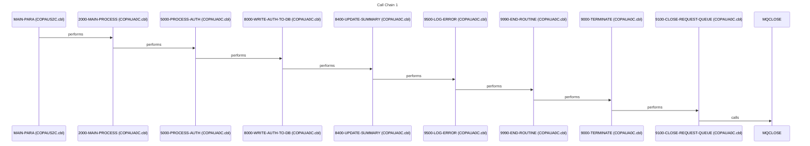
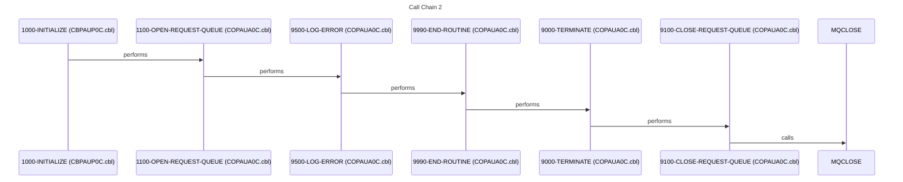
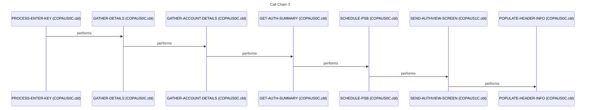
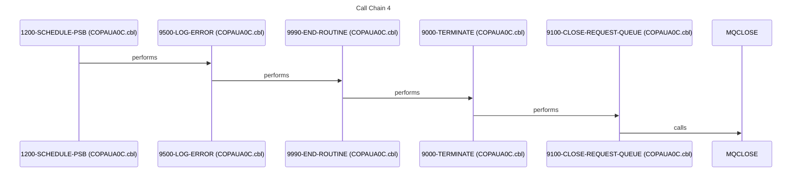
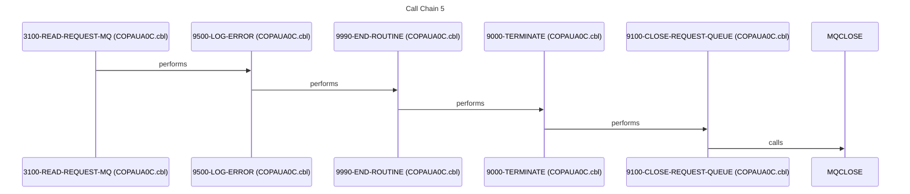

# System Design Document

## 1. Executive Summary

This mainframe system is a critical component of the organization's financial authorization infrastructure, responsible for validating and processing transaction requests in real-time. Its primary mission is to ensure that all financial transactions are legitimate and within the authorized limits, thereby preventing fraud and minimizing financial risk. The system serves a wide range of users, including merchants, banks, and internal operations teams, all relying on its accuracy and availability for seamless transaction processing. The system's core purpose is to provide a secure and reliable platform for authorizing financial transactions, safeguarding the organization's assets and maintaining customer trust.

The system's functional capabilities encompass real-time transaction authorization, fraud detection, and comprehensive reporting. It processes various types of transactions, including credit card purchases, debit card withdrawals, and electronic fund transfers. A key workflow involves receiving transaction requests from point-of-sale systems or ATMs, validating the transaction details against customer account information and fraud rules, and then either approving or denying the transaction. The system also generates detailed reports on transaction activity, fraud incidents, and system performance, providing valuable insights for business decision-making. Furthermore, the system supports various authorization methods and interfaces to cater to different transaction channels and partner requirements. The [COPAUS0C](cbl/COPAUS0C.cbl.md) program, identified as a hub program, likely plays a central role in these authorization workflows.

The technical foundation of the system is built upon a robust mainframe architecture, leveraging key technologies such as COBOL for application development, JCL for batch processing, CICS for online transaction processing, and IMS for database management. COBOL programs like [COPAUA0C](cbl/COPAUA0C.cbl.md) and [COPAUS1C](cbl/COPAUS1C.cbl.md) form the core of the application logic, while JCL jobs such as [CBPAUP0J](jcl/CBPAUP0J.jcl.md) handle batch processing tasks like data extraction and report generation. CICS manages the online transaction processing environment, ensuring high performance and availability. IMS databases provide a hierarchical data structure for storing customer account information and transaction history. The system also utilizes IBM MQ for messaging, enabling seamless communication between different components.

The system's boundaries are defined by its inputs, outputs, and external integrations. It receives transaction requests from various sources, including point-of-sale systems, ATMs, and online payment gateways. The system's outputs include authorization responses, transaction records, and reports. External integrations include connections to payment networks, fraud detection services, and customer relationship management (CRM) systems. The system interacts with external systems like [WS_PGM_AUTH_FRAUD](WS_PGM_AUTH_FRAUD) for fraud detection and uses [MQOPEN](MQOPEN), [MQGET](MQGET), [MQPUT1](MQPUT1), and [MQCLOSE](MQCLOSE) for message queuing, indicating integration with IBM MQ.

The system delivers significant business value by enabling secure and efficient transaction processing, reducing fraud losses, and improving customer satisfaction. Its real-time authorization capabilities ensure that transactions are validated quickly and accurately, minimizing delays and preventing fraudulent activities. The system's comprehensive reporting provides valuable insights for business decision-making, enabling the organization to optimize its operations and mitigate risks. If the system were unavailable, the organization would face significant financial losses, reputational damage, and regulatory penalties. Therefore, maintaining the system's reliability and security is of paramount importance.

## 2. Architecture Overview

The system architecture comprises batch and online components, interacting through data stores and messaging queues. The online components, primarily CICS transactions, handle real-time authorization requests. Batch jobs perform periodic tasks such as data extraction, report generation, and database maintenance.

```mermaid
flowchart TD

    subgraph jobs[" "]
        CBPAUP0J([CBPAUP0J])
        DBPAUTP0([DBPAUTP0])
        PAUDBUNL([PAUDBUNL])
    end

    subgraph procs[" "]
        CBPAUP0C[CBPAUP0C]
        CCPAUERY[/CCPAUERY/]
        CCPAURLY[/CCPAURLY/]
        CCPAURQY[/CCPAURQY/]
        CIPAUDTY[/CIPAUDTY/]
        CIPAUSMY[/CIPAUSMY/]
        COPAU00[/COPAU00/]
        COPAU01[/COPAU01/]
        COPAUA0C[COPAUA0C]
        COPAUS0C[COPAUS0C]
        COPAUS1C[COPAUS1C]
        COPAUS2C[COPAUS2C]
        DBUNLDGS[DBUNLDGS]
        IMSFUNCS[/IMSFUNCS/]
        PADFLPCB[/PADFLPCB/]
        PASFLPCB[/PASFLPCB/]
        PAUDBLOD[PAUDBLOD]
        PAUTBPCB[/PAUTBPCB/]
    end

    subgraph external[" "]
        CBLTDLI>CBLTDLI]
        CDEMO_TO_PROGRAM>CDEMO-TO-PROGRAM]
        DFSRRC00>DFSRRC00]
        MQCLOSE>MQCLOSE]
        MQGET>MQGET]
        MQOPEN>MQOPEN]
        MQPUT1>MQPUT1]
        WS_PGM_AUTH_FRAUD>WS-PGM_AUTH_FRAUD]
    end

    %% Call relationships
    CBPAUP0C --> CBPAUP0C
    CBPAUP0C --> COPAUA0C
    CBPAUP0C --> DBUNLDGS
    CBPAUP0C -.->|COPY| COPYBOOKS
    CBPAUP0C --> CBLTDLI
    CBPAUP0J --> DFSRRC00
    COPAUA0C --> COPAUA0C
    COPAUA0C -.->|COPY| COPYBOOKS
    COPAUA0C --> MQOPEN
    COPAUA0C --> MQGET
    COPAUA0C --> MQPUT1
    COPAUA0C --> MQCLOSE
    COPAUS0C --> COPAUS1C
    COPAUS0C --> COPAUS0C
    COPAUS0C -.->|COPY| COPYBOOKS
    COPAUS0C --> CDEMO_TO_PROGRAM
    COPAUS1C --> COPAUS1C
    COPAUS1C --> COPAUS0C
    COPAUS1C -.->|COPY| COPYBOOKS
    COPAUS1C --> WS_PGM_AUTH_FRAUD
    COPAUS2C --> CBPAUP0C
    COPAUS2C --> DBUNLDGS
    COPAUS2C --> COPAUS0C
    COPAUS2C --> COPAUS1C
    COPAUS2C --> COPAUA0C
    COPAUS2C --> PAUDBLOD
    COPAUS2C --> COPAUS2C
    COPAUS2C -.->|COPY| COPYBOOKS
    DBPAUTP0 --> DFSRRC00
    DBUNLDGS --> CBPAUP0C
    DBUNLDGS -.->|COPY| COPYBOOKS
    DBUNLDGS --> CBLTDLI
    PAUDBLOD --> PAUDBLOD
    PAUDBLOD --> CBPAUP0C
    PAUDBLOD -.->|COPY| COPYBOOKS
    PAUDBLOD --> CBLTDLI
    PAUDBUNL -.->|COPY| COPYBOOKS

    %% Styling
    classDef entryPoint fill:#90EE90,stroke:#228B22
    class CBPAUP0J,DBPAUTP0,LOADPADB,PAUDBUNL,UNLDGSAM,UNLDPADB entryPoint
    classDef missing fill:#1E3A5F,stroke:#2E5A8F,color:#FFFFFF
    class CBLTDLI,CDEMO_TO_PROGRAM,DFSRRC00,MQCLOSE,MQGET,MQOPEN,MQPUT1,WS_PGM_AUTH_FRAUD missing
```

The entry points to the system include batch jobs such as [CBPAUP0J](jcl/CBPAUP0J.jcl.md), [DBPAUTP0](jcl/DBPAUTP0.jcl.md), [PAUDBUNL](cbl/PAUDBUNL.CBL.md), [UNLDPADB](jcl/UNLDPADB.JCL.md) and other jobs like LOADPADB and UNLDGSAM. These jobs initiate various processes, including database updates and report generation.

[COPAUS0C](cbl/COPAUS0C.cbl.md) is a central hub, with 28 relationships, calling [COPAUS1C](cbl/COPAUS1C.cbl.md) and [CDEMO_TO_PROGRAM](CDEMO_TO_PROGRAM), reading and writing multiple datasets, and including copybooks such as [COCOM01Y](COCOM01Y.md), [COTTL01Y](COTTL01Y.md), [CSDAT01Y](CSDAT01Y.md), [CSMSG01Y](CSMSG01Y.md), [CSMSG02Y](CSMSG02Y.md), [CVACT01Y](CVACT01Y.md), [CVACT03Y](CVACT03Y.md), [CVCUS01Y](CVCUS01Y.md), [DFHAID](DFHAID.md), and [DFHBMSCA](DFHBMSCA.md). This indicates its role in transaction processing and screen handling.

[DBPAUTP0](jcl/DBPAUTP0.jcl.md) has 28 relationships, primarily reading datasets and calling [DFSRRC00](DFSRRC00), suggesting its involvement in database access and maintenance.

[COPAUA0C](cbl/COPAUA0C.cbl.md) has 25 relationships, calling [MQOPEN](MQOPEN), [MQGET](MQGET), [MQPUT1](MQPUT1), and [MQCLOSE](MQCLOSE), and including copybooks like [CIPAUDTY](cpy/CIPAUDTY.cpy.md), [CIPAUSMY](cpy/CIPAUSMY.cpy.md), [CVACT01Y](CVACT01Y.md), [CVACT03Y](CVACT03Y.md), and [CVCUS01Y](CVCUS01Y.md). This suggests its role in message handling and data access.

[UNLDPADB](jcl/UNLDPADB.JCL.md) has 24 relationships, primarily reading and writing datasets, indicating its function in data unloading and loading.

[DBUNLDGS](cbl/DBUNLDGS.CBL.md) has 23 relationships, calling [CBPAUP0C](cbl/CBPAUP0C.cbl.md) and including copybooks like [CIPAUDTY](cpy/CIPAUDTY.cpy.md), [CIPAUSMY](cpy/CIPAUSMY.cpy.md), [IMSFUNCS](cpy/IMSFUNCS.cpy.md), and [PAUTBPCB](cpy/PAUTBPCB.CPY.md), suggesting its role in data unloading and database interaction.

The data flow within the system involves the movement of transaction data from external sources to the mainframe, where it is processed and validated. The system interacts with IMS databases to retrieve customer account information and store transaction history. Messaging queues are used to communicate between different components, ensuring reliable and asynchronous communication. For example, [COPAUA0C](cbl/COPAUA0C.cbl.md) uses MQ calls, indicating its interaction with the messaging infrastructure. The copybooks [CIPAUDTY](cpy/CIPAUDTY.cpy.md) and [CIPAUSMY](cpy/CIPAUSMY.cpy.md) are shared across multiple programs, indicating common data structures used throughout the system.

## 3. Component Catalog

This section provides a catalog of the system's components, including COBOL programs, JCL jobs, copybooks, BMS maps, IMS database definitions (DBDs and PSBs), and DDLs.

**COBOL Programs**

| Component | Type | Purpose | Doc Link |
|---|---|---|---|
| PAUDBUNL | COBOL Program | ❓ QUESTION: What is the purpose of PAUDBUNL? | [PAUDBUNL](cbl/PAUDBUNL.CBL.md) |
| COPAUS1C | COBOL Program | ❓ QUESTION: What is the purpose of COPAUS1C? | [COPAUS1C](cbl/COPAUS1C.cbl.md) |
| COPAUA0C | COBOL Program | ❓ QUESTION: What is the purpose of COPAUA0C? | [COPAUA0C](cbl/COPAUA0C.cbl.md) |
| PAUDBLOD | COBOL Program | ❓ QUESTION: What is the purpose of PAUDBLOD? | [PAUDBLOD](cbl/PAUDBLOD.CBL.md) |
| DBUNLDGS | COBOL Program | ❓ QUESTION: What is the purpose of DBUNLDGS? | [DBUNLDGS](cbl/DBUNLDGS.CBL.md) |
| CBPAUP0C | COBOL Program | ❓ QUESTION: What is the purpose of CBPAUP0C? | [CBPAUP0C](cbl/CBPAUP0C.cbl.md) |
| COPAUS0C | COBOL Program | ❓ QUESTION: What is the purpose of COPAUS0C? | [COPAUS0C](cbl/COPAUS0C.cbl.md) |
| COPAUS2C | COBOL Program | ❓ QUESTION: What is the purpose of COPAUS2C? | [COPAUS2C](cbl/COPAUS2C.cbl.md) |

**JCL Jobs**

| Component | Type | Purpose | Doc Link |
|---|---|---|---|
| UNLDPADB | JCL Job | ❓ QUESTION: What is the purpose of UNLDPADB? | [UNLDPADB](jcl/UNLDPADB.JCL.md) |
| LOADPADB | JCL Job | ❓ QUESTION: What is the purpose of LOADPADB? | [LOADPADB](jcl/LOADPADB.JCL.md) |
| UNLDGSAM | JCL Job | ❓ QUESTION: What is the purpose of UNLDGSAM? | [UNLDGSAM](jcl/UNLDGSAM.JCL.md) |
| DBPAUTP0 | JCL Job | ❓ QUESTION: What is the purpose of DBPAUTP0? | [DBPAUTP0](jcl/DBPAUTP0.jcl.md) |
| CBPAUP0J | JCL Job | ❓ QUESTION: What is the purpose of CBPAUP0J? | [CBPAUP0J](jcl/CBPAUP0J.jcl.md) |

**Copybooks**

| Component | Type | Purpose | Doc Link |
|---|---|---|---|
| PADFLPCB | Copybook | ❓ QUESTION: What is the purpose of PADFLPCB? | [PADFLPCB](cpy/PADFLPCB.CPY.md) |
| CIPAUSMY | Copybook | ❓ QUESTION: What is the purpose of CIPAUSMY? | [CIPAUSMY](cpy/CIPAUSMY.cpy.md) |
| CCPAURQY | Copybook | ❓ QUESTION: What is the purpose of CCPAURQY? | [CCPAURQY](cpy/CCPAURQY.cpy.md) |
| CIPAUDTY | Copybook | ❓ QUESTION: What is the purpose of CIPAUDTY? | [CIPAUDTY](cpy/CIPAUDTY.cpy.md) |
| PAUTBPCB | Copybook | ❓ QUESTION: What is the purpose of PAUTBPCB? | [PAUTBPCB](cpy/PAUTBPCB.CPY.md) |
| PASFLPCB | Copybook | ❓ QUESTION: What is the purpose of PASFLPCB? | [PASFLPCB](cpy/PASFLPCB.CPY.md) |
| IMSFUNCS | Copybook | ❓ QUESTION: What is the purpose of IMSFUNCS? | [IMSFUNCS](cpy/IMSFUNCS.cpy.md) |
| CCPAUERY | Copybook | ❓ QUESTION: What is the purpose of CCPAUERY? | [CCPAUERY](cpy/CCPAUERY.cpy.md) |
| CCPAURLY | Copybook | ❓ QUESTION: What is the purpose of CCPAURLY? | [CCPAURLY](cpy/CCPAURLY.cpy.md) |

**BMS Maps**

| Component | Type | Purpose | Doc Link |
|---|---|---|---|
| COPAU00 | BMS Map | ❓ QUESTION: What is the purpose of COPAU00? | [COPAU00](bms/COPAU00.bms.md) |
| COPAU01 | BMS Map | ❓ QUESTION: What is the purpose of COPAU01? | [COPAU01](bms/COPAU01.bms.md) |

**IMS Database Definitions (DBD and PSB)**

| Component | Type | Purpose | Doc Link |
|---|---|---|---|
| DBPAUTP0 | DBD | ❓ QUESTION: What is the purpose of DBPAUTP0? | [DBPAUTP0](ims/DBPAUTP0.dbd.md) |
| DBPAUTX0 | DBD | ❓ QUESTION: What is the purpose of DBPAUTX0? | [DBPAUTX0](ims/DBPAUTX0.dbd.md) |
| PADFLDBD | DBD | ❓ QUESTION: What is the purpose of PADFLDBD? | [PADFLDBD](ims/PADFLDBD.DBD.md) |
| PSBPAUTL | PSB | ❓ QUESTION: What is the purpose of PSBPAUTL? | [PSBPAUTL](ims/PSBPAUTL.psb.md) |
| PSBPAUTB | PSB | ❓ QUESTION: What is the purpose of PSBPAUTB? | [PSBPAUTB](ims/PSBPAUTB.psb.md) |
| PASFLDBD | DBD | ❓ QUESTION: What is the purpose of PASFLDBD? | [PASFLDBD](ims/PASFLDBD.DBD.md) |
| PAUTBUNL | PSB | ❓ QUESTION: What is the purpose of PAUTBUNL? | [PAUTBUNL](ims/PAUTBUNL.PSB.md) |
| DLIGSAMP | PSB | ❓ QUESTION: What is the purpose of DLIGSAMP? | [DLIGSAMP](ims/DLIGSAMP.PSB.md) |

**BMS Copybooks**

| Component | Type | Purpose | Doc Link |
|---|---|---|---|
| COPAU00 | BMS Copybook | ❓ QUESTION: What is the purpose of COPAU00? | [COPAU00](cpy-bms/COPAU00.cpy.md) |
| COPAU01 | BMS Copybook | ❓ QUESTION: What is the purpose of COPAU01? | [COPAU01](cpy-bms/COPAU01.cpy.md) |

**DDL Files**

| Component | Type | Purpose | Doc Link |
|---|---|---|---|
| XAUTHFRD | DDL | ❓ QUESTION: What is the purpose of XAUTHFRD? | [XAUTHFRD](ddl/XAUTHFRD.ddl.md) |
| AUTHFRDS | DDL | ❓ QUESTION: What is the purpose of AUTHFRDS? | [AUTHFRDS](ddl/AUTHFRDS.ddl.md) |

## 4. Subsystem Breakdown

This section details the logical subsystems within the application, grouping programs based on shared functionality and data access.

**1. Online Transaction Processing Subsystem**

*   **Programs:** [COPAUS0C](cbl/COPAUS0C.cbl.md), [COPAUS1C](cbl/COPAUS1C.cbl.md), [COPAUA0C](cbl/COPAUA0C.cbl.md), [COPAUS2C](cbl/COPAUS2C.cbl.md)
*   **Responsibility:** This subsystem handles real-time transaction authorization requests. It receives transaction data, validates it against customer account information and fraud rules, and then approves or denies the transaction.
*   **Interaction:** This subsystem interacts with external systems such as point-of-sale systems and ATMs to receive transaction requests. It also interacts with the IMS database to retrieve customer account information and the IBM MQ messaging queue for asynchronous communication. [COPAUA0C](cbl/COPAUA0C.cbl.md) uses MQ calls, indicating its role in this interaction. The shared copybooks [CIPAUDTY](cpy/CIPAUDTY.cpy.md) and [CIPAUSMY](cpy/CIPAUSMY.cpy.md) suggest common data structures are used within this subsystem.

**2. Batch Data Processing Subsystem**

*   **Programs:** [DBUNLDGS](cbl/DBUNLDGS.CBL.md), [CBPAUP0C](cbl/CBPAUP0C.cbl.md)
*   **JCL Jobs:** [CBPAUP0J](jcl/CBPAUP0J.jcl.md), [DBPAUTP0](jcl/DBPAUTP0.jcl.md), [UNLDPADB](jcl/UNLDPADB.JCL.md), [LOADPADB](jcl/LOADPADB.JCL.md), [UNLDGSAM](jcl/UNLDGSAM.JCL.md)
*   **Responsibility:** This subsystem performs periodic batch processing tasks, such as data extraction, report generation, and database maintenance.
*   **Interaction:** This subsystem interacts with the IMS database to extract data and update records. It also generates reports that are used for business decision-making. [DBUNLDGS](cbl/DBUNLDGS.CBL.md) interacts with the database and includes copybooks like [IMSFUNCS](cpy/IMSFUNCS.cpy.md) and [PAUTBPCB](cpy/PAUTBPCB.CPY.md), indicating its role in database operations.

**3. IMS Database Management Subsystem**

*   **Programs:** [PAUDBUNL](cbl/PAUDBUNL.CBL.md), [PAUDBLOD](cbl/PAUDBLOD.CBL.md)
*   **Responsibility:** This subsystem manages the IMS databases used by the application. It provides functions for data retrieval, storage, and maintenance.
*   **Interaction:** This subsystem interacts with the Online Transaction Processing and Batch Data Processing subsystems to provide access to customer account information and transaction history.

**4. Security and Fraud Detection Subsystem**

*   **Programs:** WS_PGM_AUTH_FRAUD (External Program)
*   **Responsibility:** This subsystem is responsible for detecting and preventing fraudulent transactions.
*   **Interaction:** The Online Transaction Processing Subsystem interacts with this subsystem to validate transactions against fraud rules. [COPAUS1C](cbl/COPAUS1C.cbl.md) calls [WS_PGM_AUTH_FRAUD](WS_PGM_AUTH_FRAUD), indicating its interaction with the fraud detection system.

The copybooks [CIPAUDTY](cpy/CIPAUDTY.cpy.md) and [CIPAUSMY](cpy/CIPAUSMY.cpy.md) are included by multiple programs across different subsystems, indicating that they define common data structures used throughout the application. Specifically, they are used by [PAUDBUNL](cbl/PAUDBUNL.CBL.md), [COPAUS1C](cbl/COPAUS1C.cbl.md), [COPAUA0C](cbl/COPAUA0C.cbl.md), [PAUDBLOD](cbl/PAUDBLOD.CBL.md), [DBUNLDGS](cbl/DBUNLDGS.CBL.md), [CBPAUP0C](cbl/CBPAUP0C.cbl.md), [COPAUS0C](cbl/COPAUS0C.cbl.md), and [COPAUS2C](cbl/COPAUS2C.cbl.md).

## 5. Data Architecture

This section describes the data architecture of the system, including key datasets, databases, data flow patterns, and shared data structures. The system relies heavily on IMS databases for storing critical information and utilizes various datasets for batch processing and reporting.

**Key Datasets and Databases:**

| Dataset/Database | Description | Access Pattern | Programs Reading | Programs Writing |
|---|---|---|---|---|
| OEM.IMS.IMSP.PSBLIB | IMS PSB Library | Sequential | ❓ QUESTION: Which programs read OEM.IMS.IMSP.PSBLIB? |  |
| AWS.M2.CARDDEMO.LOADLIB | Load Library | Sequential | ❓ QUESTION: Which programs read AWS.M2.CARDDEMO.LOADLIB? |  |
| OEMPP.IMS.V15R01MB.PROCLIB(DFSVSMDB) | IMS PROCLIB | Sequential | ❓ QUESTION: Which programs read OEMPP.IMS.V15R01MB.PROCLIB(DFSVSMDB)? |  |
| OEM.IMS.IMSP.DBDLIB | IMS DBD Library | Sequential | ❓ QUESTION: Which programs read OEM.IMS.IMSP.DBDLIB? |  |
| OEMA.IMS.IMSP.SDFSRESL | IMS SDFSRESL Library | Sequential | ❓ QUESTION: Which programs read OEMA.IMS.IMSP.SDFSRESL? |  |
| IMS Databases (defined by DBDs like [DBPAUTP0](ims/DBPAUTP0.dbd.md), [DBPAUTX0](ims/DBPAUTX0.dbd.md), [PADFLDBD](ims/PADFLDBD.DBD.md), and accessed via PSBs like [PSBPAUTL](ims/PSBPAUTL.psb.md), [PSBPAUTB](ims/PSBPAUTB.psb.md), [PASFLDBD](ims/PASFLDBD.DBD.md), [PAUTBUNL](ims/PAUTBUNL.PSB.md), [DLIGSAMP](ims/DLIGSAMP.PSB.md)) | Stores customer account information, transaction history, and authorization rules. | Hierarchical | Various programs using IMS DL/I calls | Various programs using IMS DL/I calls |

**Data Flow Patterns:**

1.  **Online Transaction Processing:** Transaction requests are received by CICS programs in the Online Transaction Processing Subsystem. These programs then access the IMS databases to validate the transaction and update account information.
2.  **Batch Data Processing:** Batch jobs extract data from the IMS databases and other datasets, perform calculations, and generate reports. These reports are then used for business decision-making.
3.  **Data Unloading and Loading:** JCL jobs like [UNLDPADB](jcl/UNLDPADB.JCL.md) are used to unload data from the IMS databases for backup and recovery purposes. JCL jobs like [LOADPADB](jcl/LOADPADB.JCL.md) are used to load data into the IMS databases after maintenance or recovery.

**Shared Data Structures:**

The copybooks [CIPAUDTY](cpy/CIPAUDTY.cpy.md) and [CIPAUSMY](cpy/CIPAUSMY.cpy.md) define common data structures that are shared across multiple programs. This ensures consistency in data representation and facilitates data exchange between different subsystems. These copybooks are used by [PAUDBUNL](cbl/PAUDBUNL.CBL.md), [COPAUS1C](cbl/COPAUS1C.cbl.md), [COPAUA0C](cbl/COPAUA0C.cbl.md), [PAUDBLOD](cbl/PAUDBLOD.CBL.md), [DBUNLDGS](cbl/DBUNLDGS.CBL.md), [CBPAUP0C](cbl/CBPAUP0C.cbl.md), [COPAUS0C](cbl/COPAUS0C.cbl.md), and [COPAUS2C](cbl/COPAUS2C.cbl.md).

**Data Flow Narrative:**

Transaction data originates from external sources and flows into the Online Transaction Processing Subsystem. This subsystem validates the transaction against data stored in the IMS databases. Batch jobs extract data from the IMS databases and generate reports. The copybooks [CIPAUDTY](cpy/CIPAUDTY.cpy.md) and [CIPAUSMY](cpy/CIPAUSMY.cpy.md) facilitate data exchange between these subsystems by defining common data structures.

## 6. Integration Points

This section describes the external interfaces and integration points of the system, detailing how it interacts with other systems and components.

**1. External System Interfaces:**

*   **Payment Networks:** The system integrates with payment networks to authorize credit card and debit card transactions. ❓ QUESTION: What specific payment networks are integrated?
*   **Fraud Detection Services:** The system integrates with external fraud detection services to identify and prevent fraudulent transactions. The program [COPAUS1C](cbl/COPAUS1C.cbl.md) calls [WS_PGM_AUTH_FRAUD](WS_PGM_AUTH_FRAUD), indicating an integration point with a fraud detection system.
*   **Customer Relationship Management (CRM) Systems:** The system may integrate with CRM systems to share customer account information and transaction history. ❓ QUESTION: What CRM systems are integrated?
*   **IBM MQ Messaging:** The system uses IBM MQ for asynchronous communication with other systems. The program [COPAUA0C](cbl/COPAUA0C.cbl.md) utilizes [MQOPEN](MQOPEN), [MQGET](MQGET), [MQPUT1](MQPUT1), and [MQCLOSE](MQCLOSE) calls, indicating its role in message queuing. ❓ QUESTION: What are the specific MQ queue names used?

**2. Batch Job Entry Points and Scheduling:**

*   The JCL jobs [CBPAUP0J](jcl/CBPAUP0J.jcl.md), [DBPAUTP0](jcl/DBPAUTP0.jcl.md), [UNLDPADB](jcl/UNLDPADB.JCL.md), [LOADPADB](jcl/LOADPADB.JCL.md), and [UNLDGSAM](jcl/UNLDGSAM.JCL.md) serve as entry points for batch processing. ❓ QUESTION: What scheduling system is used to trigger these jobs? What are the dependencies between these jobs?
*   These jobs are likely scheduled to run periodically (e.g., daily, weekly, monthly) to perform tasks such as data extraction, report generation, and database maintenance. ❓ QUESTION: What are the specific schedules for each job?

**3. CICS Transaction Entry Points:**

*   The system exposes CICS transactions that can be invoked by external systems to initiate specific business processes. ❓ QUESTION: What are the specific CICS transaction IDs exposed by the system? What are the input and output parameters for these transactions?

**4. Cross-System Data Exchanges:**

*   The system exchanges data with other systems through various mechanisms, including files, MQ queues, and APIs. ❓ QUESTION: What are the specific file formats used for data exchange? What are the API endpoints exposed by the system?
*   The copybooks [CIPAUDTY](cpy/CIPAUDTY.cpy.md) and [CIPAUSMY](cpy/CIPAUSMY.cpy.md) define common data structures that are used for data exchange between different systems. ❓ QUESTION: Are there specific data transformation routines used during data exchange?

Understanding these integration points is crucial for maintaining the system and ensuring its interoperability with other systems.

## 7. Business Rules

This section documents the key business rules implemented within the system. These rules govern various aspects of transaction processing, authorization, validation, and reporting.

**1. Authorization Rules:**

*   **Transaction Limit Validation:** The system validates that the transaction amount does not exceed the customer's authorized spending limit. ❓ QUESTION: Which program implements this rule? What is the specific logic used to determine the authorized spending limit?
*   **Fraud Score Threshold:** The system uses a fraud score to determine whether a transaction is potentially fraudulent. If the fraud score exceeds a certain threshold, the transaction is flagged for further review. ❓ QUESTION: Which program implements this rule? What is the threshold value? How is the fraud score calculated?
*   **Merchant Category Code (MCC) Restrictions:** The system may restrict transactions based on the merchant category code. For example, certain types of transactions may be prohibited at specific merchants. ❓ QUESTION: Which program implements this rule? What are the specific MCC restrictions?

**2. Validation Rules:**

*   **Account Number Validation:** The system validates that the account number is in the correct format and corresponds to a valid customer account. ❓ QUESTION: Which program implements this rule? What is the format of the account number?
*   **Transaction Date Validation:** The system validates that the transaction date is within a valid range. ❓ QUESTION: Which program implements this rule? What is the valid date range?
*   **Currency Code Validation:** The system validates that the currency code is valid and supported by the system. ❓ QUESTION: Which program implements this rule? What are the supported currency codes?

**3. Calculation Formulas:**

*   **Interest Calculation:** The system calculates interest on customer accounts based on a specific formula. ❓ QUESTION: Which program implements this rule? What is the interest calculation formula?
*   **Fee Calculation:** The system calculates fees for various transactions based on a specific formula. ❓ QUESTION: Which program implements this rule? What are the fee calculation formulas?

**4. Processing Constraints:**

*   **Transaction Retry Limit:** The system limits the number of times a transaction can be retried. If a transaction fails after a certain number of retries, it is rejected. ❓ QUESTION: Which program implements this rule? What is the retry limit?
*   **Concurrency Control:** The system uses concurrency control mechanisms to prevent data corruption when multiple transactions access the same data simultaneously. ❓ QUESTION: What concurrency control mechanisms are used?

Understanding these business rules is essential for maintaining the system and ensuring its compliance with regulatory requirements.

## 8. Error Handling Patterns

This section documents the common error handling patterns employed throughout the system. Understanding these patterns is crucial for diagnosing and resolving issues effectively.

**1. Common Error Handling Patterns:**

*   **Abend Codes:** The system uses abend codes to indicate severe errors that result in program termination. ❓ QUESTION: What are the common abend codes used in the system? What do these abend codes signify?
*   **Return Codes:** COBOL programs use return codes to indicate the success or failure of a particular operation. A return code of 0 typically indicates success, while non-zero return codes indicate errors. ❓ QUESTION: What are the common return codes used in the system? What do these return codes signify?
*   **File Status Checks:** COBOL programs check the file status after each file I/O operation to ensure that the operation was successful. If the file status indicates an error, the program takes appropriate action, such as logging the error and terminating the program. ❓ QUESTION: What are the common file status codes used in the system? What do these file status codes signify?

**2. Recovery Procedures and Restart Logic:**

*   **Transaction Rollback:** In the event of an error, the system may roll back the transaction to ensure data consistency. ❓ QUESTION: Which programs implement transaction rollback? What mechanisms are used to perform the rollback?
*   **Restart Logic:** Batch jobs may include restart logic to allow them to resume processing from the point of failure. ❓ QUESTION: Which batch jobs implement restart logic? How is the restart point determined?

**3. Logging and Monitoring Patterns:**

*   **Error Logging:** The system logs errors to a central error log. This log can be used to track the frequency and severity of errors. ❓ QUESTION: What is the format of the error log? What information is included in the error log?
*   **Real-time Monitoring:** The system may use real-time monitoring tools to track system performance and identify potential problems. ❓ QUESTION: What real-time monitoring tools are used? What metrics are monitored?

**4. Error Escalation Chains:**

*   When an error occurs, the system may escalate the error to a higher level of support. For example, a minor error may be logged and ignored, while a critical error may be escalated to the system administrator. ❓ QUESTION: What are the different levels of support? What are the criteria for escalating an error?

By adhering to these error handling patterns, the system ensures its reliability and maintainability.

## 9. Open Questions and Uncertainties

This section consolidates the open questions and uncertainties identified during the documentation process. Addressing these questions will improve the completeness and accuracy of the system documentation.

**1. Architecture:**

*   **Purpose of PAUDBUNL, COPAUS1C, COPAUA0C, PAUDBLOD, DBUNLDGS, CBPAUP0C, COPAUS0C, COPAUS2C:** What are the specific responsibilities and functionalities of these COBOL programs? Understanding their roles is crucial for comprehending the system's overall architecture. Resolution: Analyze the source code of these programs and consult with subject matter experts.
*   **Purpose of UNLDPADB, LOADPADB, UNLDGSAM, DBPAUTP0, CBPAUP0J:** What are the specific functions of these JCL jobs? Understanding their roles is crucial for comprehending the system's batch processing. Resolution: Analyze the JCL code of these jobs and consult with subject matter experts.
*   **Purpose of PADFLPCB, CIPAUSMY, CCPAURQY, CIPAUDTY, PAUTBPCB, PASFLPCB, IMSFUNCS, CCPAUERY, CCPAURLY:** What is the purpose of these copybooks? Understanding their data structures is crucial for comprehending the system's data architecture. Resolution: Analyze the copybook definitions and consult with subject matter experts.
*   **Purpose of COPAU00, COPAU01:** What is the purpose of these BMS maps? Understanding their screen layouts is crucial for comprehending the system's user interface. Resolution: Analyze the BMS map definitions and consult with subject matter experts.
*   **Purpose of DBPAUTP0, DBPAUTX0, PADFLDBD, PSBPAUTL, PSBPAUTB, PASFLDBD, PAUTBUNL, DLIGSAMP:** What is the purpose of these IMS database definitions (DBDs and PSBs)? Understanding their data structures is crucial for comprehending the system's data architecture. Resolution: Analyze the DBD and PSB definitions and consult with subject matter experts.
*   **Purpose of XAUTHFRD, AUTHFRDS:** What is the purpose of these DDL files? Understanding their database schema is crucial for comprehending the system's data architecture. Resolution: Analyze the DDL definitions and consult with subject matter experts.

**2. Integration Points:**

*   **Specific Payment Networks:** What specific payment networks are integrated with the system? Knowing the specific networks is essential for understanding the system's external dependencies. Resolution: Review system configuration files and integration documentation.
*   **CRM Systems:** What CRM systems are integrated with the system? Knowing the specific CRM systems is essential for understanding the system's data sharing capabilities. Resolution: Review system configuration files and integration documentation.
*   **MQ Queue Names:** What are the specific MQ queue names used for messaging? Knowing the queue names is essential for monitoring and troubleshooting messaging issues. Resolution: Review system configuration files and MQ configuration.
*   **Job Scheduling System:** What scheduling system is used to trigger the batch jobs? Understanding the scheduling system is essential for managing and maintaining the batch processing environment. Resolution: Consult with system operations personnel.
*   **Job Dependencies:** What are the dependencies between the batch jobs? Understanding the dependencies is essential for ensuring that the jobs are executed in the correct order. Resolution: Review JCL code and scheduling system configuration.
*   **Job Schedules:** What are the specific schedules for each batch job? Knowing the schedules is essential for monitoring and troubleshooting batch processing issues. Resolution: Consult with system operations personnel.
*   **CICS Transaction IDs:** What are the specific CICS transaction IDs exposed by the system? Knowing the transaction IDs is essential for understanding the system's online processing capabilities. Resolution: Review CICS transaction definitions.
*   **Transaction Parameters:** What are the input and output parameters for the CICS transactions? Knowing the parameters is essential for understanding how to invoke the transactions. Resolution: Review CICS transaction definitions and program interfaces.
*   **Data File Formats:** What are the specific file formats used for data exchange? Knowing the file formats is essential for understanding how data is shared between systems. Resolution: Review file definitions and data mapping documentation.
*   **API Endpoints:** What are the API endpoints exposed by the system? Knowing the endpoints is essential for understanding the system's integration capabilities. Resolution: Review API documentation and system configuration.
*   **Data Transformation Routines:** Are there specific data transformation routines used during data exchange? Knowing the transformation routines is essential for ensuring data consistency. Resolution: Review data mapping documentation and program code.

**3. Business Rules:**

*   **Transaction Limit Logic:** What is the specific logic used to determine the authorized spending limit? Understanding this logic is crucial for ensuring that transactions are properly authorized. Resolution: Analyze the source code and consult with business analysts.
*   **Fraud Score Calculation:** How is the fraud score calculated? Understanding the calculation is crucial for understanding how the system detects fraud. Resolution: Analyze the source code and consult with fraud prevention experts.
*   **MCC Restrictions:** What are the specific MCC restrictions? Understanding these restrictions is crucial for ensuring compliance with regulatory requirements. Resolution: Consult with business analysts and legal counsel.
*   **Account Number Format:** What is the format of the account number? Knowing the format is essential for validating account numbers. Resolution: Review data definitions and validation routines.
*   **Valid Date Range:** What is the valid date range for transactions? Knowing the valid range is essential for validating transaction dates. Resolution: Review validation routines and business rules documentation.
*   **Supported Currency Codes:** What are the supported currency codes? Knowing the supported currency codes is essential for validating currency codes. Resolution: Review data definitions and validation routines.
*   **Interest Calculation Formula:** What is the interest calculation formula? Understanding the formula is crucial for ensuring that interest is calculated correctly. Resolution: Analyze the source code and consult with finance experts.
*   **Fee Calculation Formulas:** What are the fee calculation formulas? Understanding the formulas is crucial for ensuring that fees are calculated correctly. Resolution: Analyze the source code and consult with finance experts.
*   **Transaction Retry Limit:** What is the retry limit for transactions? Knowing the retry limit is essential for understanding how the system handles failed transactions. Resolution: Review system configuration and error handling routines.
*   **Concurrency Control Mechanisms:** What concurrency control mechanisms are used? Understanding these mechanisms is crucial for ensuring data integrity. Resolution: Analyze the source code and consult with database administrators.

**4. Error Handling:**

*   **Common Abend Codes:** What are the common abend codes used in the system? Knowing the abend codes is essential for diagnosing and resolving system errors. Resolution: Review system documentation and error logs.
*   **Common Return Codes:** What are the common return codes used in the system? Knowing the return codes is essential for diagnosing and resolving program errors. Resolution: Review program documentation and source code.
*   **Common File Status Codes:** What are the common file status codes used in the system? Knowing the file status codes is essential for diagnosing and resolving file I/O errors. Resolution: Review program documentation and COBOL reference materials.
*   **Transaction Rollback Mechanisms:** Which programs implement transaction rollback? What mechanisms are used to perform the rollback? Understanding these mechanisms is crucial for ensuring data consistency. Resolution: Analyze the source code and consult with database administrators.
*   **Restart Point Determination:** How is the restart point determined for batch jobs? Understanding this process is crucial for ensuring that jobs can be restarted correctly. Resolution: Analyze the JCL code and restart logic.
*   **Error Log Format:** What is the format of the error log? Knowing the format is essential for analyzing error logs. Resolution: Review system documentation and error log configuration.
*   **Error Log Information:** What information is included in the error log? Knowing the information is essential for diagnosing errors. Resolution: Review system documentation and error log configuration.
*   **Real-time Monitoring Tools:** What real-time monitoring tools are used? Knowing the tools is essential for monitoring system performance. Resolution: Consult with system operations personnel.
*   **Monitored Metrics:** What metrics are monitored by the real-time monitoring tools? Knowing the metrics is essential for understanding system performance. Resolution: Consult with system operations personnel.
*   **Support Levels:** What are the different levels of support? Understanding the support levels is essential for escalating errors to the appropriate level. Resolution: Consult with support personnel and review escalation procedures.
*   **Escalation Criteria:** What are the criteria for escalating an error? Knowing the criteria is essential for ensuring that errors are escalated appropriately. Resolution: Consult with support personnel and review escalation procedures.

Addressing these open questions and uncertainties will significantly enhance the value and usability of this system documentation.

## Flows

The following sequence diagrams illustrate key call sequences identified in the codebase.

### Flow 1

```mermaid
sequenceDiagram
    title Call Chain 1
    participant MAIN_PARA as MAIN-PARA (COPAUS2C.cbl)
    participant 2000_MAIN_PROCESS as 2000-MAIN-PROCESS (COPAUA0C.cbl)
    participant 5000_PROCESS_AUTH as 5000-PROCESS-AUTH (COPAUA0C.cbl)
    participant 8000_WRITE_AUTH_TO_DB as 8000-WRITE-AUTH-TO-DB (COPAUA0C.cbl)
    participant 8400_UPDATE_SUMMARY as 8400-UPDATE-SUMMARY (COPAUA0C.cbl)
    participant 9500_LOG_ERROR as 9500-LOG-ERROR (COPAUA0C.cbl)
    participant 9990_END_ROUTINE as 9990-END-ROUTINE (COPAUA0C.cbl)
    participant 9000_TERMINATE as 9000-TERMINATE (COPAUA0C.cbl)
    participant 9100_CLOSE_REQUEST_QUEUE as 9100-CLOSE-REQUEST-QUEUE (COPAUA0C.cbl)
    participant MQCLOSE as MQCLOSE
    MAIN_PARA->>2000_MAIN_PROCESS: performs
    2000_MAIN_PROCESS->>5000_PROCESS_AUTH: performs
    5000_PROCESS_AUTH->>8000_WRITE_AUTH_TO_DB: performs
    8000_WRITE_AUTH_TO_DB->>8400_UPDATE_SUMMARY: performs
    8400_UPDATE_SUMMARY->>9500_LOG_ERROR: performs
    9500_LOG_ERROR->>9990_END_ROUTINE: performs
    9990_END_ROUTINE->>9000_TERMINATE: performs
    9000_TERMINATE->>9100_CLOSE_REQUEST_QUEUE: performs
    9100_CLOSE_REQUEST_QUEUE->>MQCLOSE: calls
```

### Flow 2

```mermaid
sequenceDiagram
    title Call Chain 2
    participant 1000_INITIALIZE as 1000-INITIALIZE (CBPAUP0C.cbl)
    participant 1100_OPEN_REQUEST_QUEUE as 1100-OPEN-REQUEST-QUEUE (COPAUA0C.cbl)
    participant 9500_LOG_ERROR as 9500-LOG-ERROR (COPAUA0C.cbl)
    participant 9990_END_ROUTINE as 9990-END-ROUTINE (COPAUA0C.cbl)
    participant 9000_TERMINATE as 9000-TERMINATE (COPAUA0C.cbl)
    participant 9100_CLOSE_REQUEST_QUEUE as 9100-CLOSE-REQUEST-QUEUE (COPAUA0C.cbl)
    participant MQCLOSE as MQCLOSE
    1000_INITIALIZE->>1100_OPEN_REQUEST_QUEUE: performs
    1100_OPEN_REQUEST_QUEUE->>9500_LOG_ERROR: performs
    9500_LOG_ERROR->>9990_END_ROUTINE: performs
    9990_END_ROUTINE->>9000_TERMINATE: performs
    9000_TERMINATE->>9100_CLOSE_REQUEST_QUEUE: performs
    9100_CLOSE_REQUEST_QUEUE->>MQCLOSE: calls
```

### Flow 3

```mermaid
sequenceDiagram
    title Call Chain 3
    participant PROCESS_ENTER_KEY as PROCESS-ENTER-KEY (COPAUS0C.cbl)
    participant GATHER_DETAILS as GATHER-DETAILS (COPAUS0C.cbl)
    participant GATHER_ACCOUNT_DETAILS as GATHER-ACCOUNT-DETAILS (COPAUS0C.cbl)
    participant GET_AUTH_SUMMARY as GET-AUTH-SUMMARY (COPAUS0C.cbl)
    participant SCHEDULE_PSB as SCHEDULE-PSB (COPAUS0C.cbl)
    participant SEND_AUTHVIEW_SCREEN as SEND-AUTHVIEW-SCREEN (COPAUS1C.cbl)
    participant POPULATE_HEADER_INFO as POPULATE-HEADER-INFO (COPAUS0C.cbl)
    PROCESS_ENTER_KEY->>GATHER_DETAILS: performs
    GATHER_DETAILS->>GATHER_ACCOUNT_DETAILS: performs
    GATHER_ACCOUNT_DETAILS->>GET_AUTH_SUMMARY: performs
    GET_AUTH_SUMMARY->>SCHEDULE_PSB: performs
    SCHEDULE_PSB->>SEND_AUTHVIEW_SCREEN: performs
    SEND_AUTHVIEW_SCREEN->>POPULATE_HEADER_INFO: performs
```

### Flow 4

```mermaid
sequenceDiagram
    title Call Chain 4
    participant 1200_SCHEDULE_PSB as 1200-SCHEDULE-PSB (COPAUA0C.cbl)
    participant 9500_LOG_ERROR as 9500-LOG-ERROR (COPAUA0C.cbl)
    participant 9990_END_ROUTINE as 9990-END-ROUTINE (COPAUA0C.cbl)
    participant 9000_TERMINATE as 9000-TERMINATE (COPAUA0C.cbl)
    participant 9100_CLOSE_REQUEST_QUEUE as 9100-CLOSE-REQUEST-QUEUE (COPAUA0C.cbl)
    participant MQCLOSE as MQCLOSE
    1200_SCHEDULE_PSB->>9500_LOG_ERROR: performs
    9500_LOG_ERROR->>9990_END_ROUTINE: performs
    9990_END_ROUTINE->>9000_TERMINATE: performs
    9000_TERMINATE->>9100_CLOSE_REQUEST_QUEUE: performs
    9100_CLOSE_REQUEST_QUEUE->>MQCLOSE: calls
```

### Flow 5

```mermaid
sequenceDiagram
    title Call Chain 5
    participant 3100_READ_REQUEST_MQ as 3100-READ-REQUEST-MQ (COPAUA0C.cbl)
    participant 9500_LOG_ERROR as 9500-LOG-ERROR (COPAUA0C.cbl)
    participant 9990_END_ROUTINE as 9990-END-ROUTINE (COPAUA0C.cbl)
    participant 9000_TERMINATE as 9000-TERMINATE (COPAUA0C.cbl)
    participant 9100_CLOSE_REQUEST_QUEUE as 9100-CLOSE-REQUEST-QUEUE (COPAUA0C.cbl)
    participant MQCLOSE as MQCLOSE
    3100_READ_REQUEST_MQ->>9500_LOG_ERROR: performs
    9500_LOG_ERROR->>9990_END_ROUTINE: performs
    9990_END_ROUTINE->>9000_TERMINATE: performs
    9000_TERMINATE->>9100_CLOSE_REQUEST_QUEUE: performs
    9100_CLOSE_REQUEST_QUEUE->>MQCLOSE: calls
```
