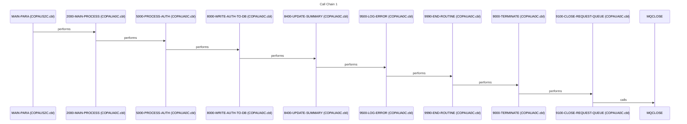
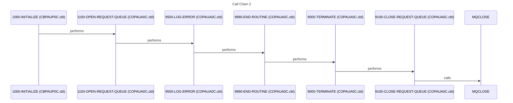
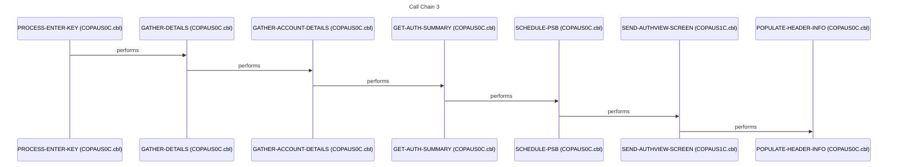
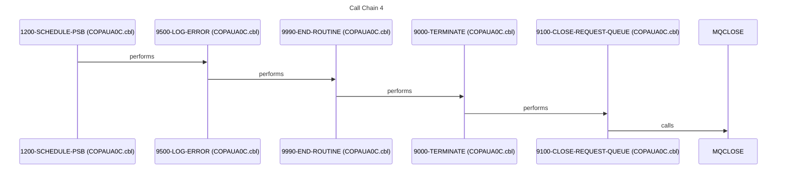
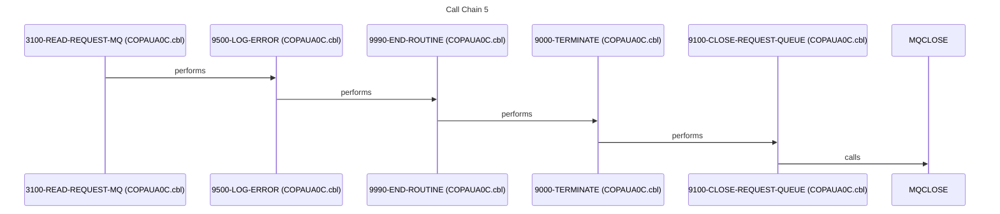

# System Design Document

## 1. Executive Summary

This mainframe system is a critical component of the organization's financial authorization infrastructure, responsible for validating and processing transaction requests in real-time. Its primary purpose is to ensure that all financial transactions adhere to predefined rules and limits, thereby mitigating fraud and minimizing financial risk. The system serves as a central authorization engine, interfacing with various internal and external systems to facilitate secure and reliable transaction processing. Ultimately, it protects the organization's assets and maintains customer trust by preventing unauthorized financial activities.

The system's core functionality revolves around real-time transaction authorization, involving a complex series of checks and validations. It receives transaction requests from various channels, including point-of-sale systems and online banking platforms. Upon receiving a request, the system verifies account balances, transaction limits, and fraud indicators. It then applies sophisticated authorization rules, potentially involving communication with external fraud detection services. Based on these evaluations, the system either approves or denies the transaction, sending a response back to the originating channel. Key workflows include credit card authorizations, debit card transactions, and fund transfers, all processed with stringent security measures. The [COPAUA0C](cbl/COPAUA0C.cbl.md) program plays a central role in this process, acting as a hub for many authorization-related activities.

The system is built on a robust technical foundation, leveraging proven mainframe technologies for performance and reliability. COBOL is the primary programming language, providing the necessary precision and efficiency for financial calculations. JCL (Job Control Language) is used for batch processing and system automation. CICS (Customer Information Control System) handles online transaction processing, ensuring rapid response times for user interactions. IMS (Information Management System) databases provide hierarchical data storage for account information and transaction history. The system also utilizes IBM MQ for asynchronous messaging, facilitating communication between different components.

The system's boundaries are well-defined, with clear inputs, outputs, and external integrations. It receives transaction requests from various front-end systems and channels. It generates authorization responses, which are sent back to the originating systems. The system integrates with external fraud detection services, credit bureaus, and other financial institutions. The [CBPAUP0J](jcl/CBPAUP0J.jcl.md) job, along with the [DBPAUTP0](jcl/DBPAUTP0.jcl.md) job, are key entry points for batch processing, while online transactions are primarily handled through CICS. The system's data storage relies heavily on IMS databases defined in [DBPAUTP0](ims/DBPAUTP0.dbd.md) and other DBDs.

The system delivers significant business value by ensuring the integrity and security of financial transactions. Its real-time authorization capabilities prevent fraudulent activities and minimize financial losses. The system's high availability and reliability ensure uninterrupted transaction processing, maintaining customer satisfaction. If the system were unavailable, the organization would face significant financial losses, reputational damage, and potential regulatory penalties. Therefore, the system is a mission-critical asset, essential for the organization's financial stability and operational efficiency. The shared copybooks like [CIPAUDTY](cpy/CIPAUDTY.cpy.md) and [CIPAUSMY](cpy/CIPAUSMY.cpy.md) highlight the importance of data consistency across different parts of the system.
## 2. Architecture Overview

The system architecture is structured around a combination of batch and online processing, with a clear separation of concerns between data access, business logic, and external integrations. The core components interact through a combination of direct program calls, shared data access, and asynchronous messaging.

```mermaid
flowchart TD

    subgraph jobs[" "]
        CBPAUP0J([CBPAUP0J])
        DBPAUTP0([DBPAUTP0])
        PAUDBUNL([PAUDBUNL])
    end

    subgraph procs[" "]
        CBPAUP0C[CBPAUP0C]
        CCPAUERY[/CCPAUERY/]
        CCPAURLY[/CCPAURLY/]
        CCPAURQY[/CCPAURQY/]
        CIPAUDTY[/CIPAUDTY/]
        CIPAUSMY[/CIPAUSMY/]
        COPAU00[/COPAU00/]
        COPAU01[/COPAU01/]
        COPAUA0C[COPAUA0C]
        COPAUS0C[COPAUS0C]
        COPAUS1C[COPAUS1C]
        COPAUS2C[COPAUS2C]
        DBUNLDGS[DBUNLDGS]
        IMSFUNCS[/IMSFUNCS/]
        PADFLPCB[/PADFLPCB/]
        PASFLPCB[/PASFLPCB/]
        PAUDBLOD[PAUDBLOD]
        PAUTBPCB[/PAUTBPCB/]
    end

    subgraph external[" "]
        CBLTDLI>CBLTDLI]
        CDEMO_TO_PROGRAM>CDEMO-TO-PROGRAM]
        DFSRRC00>DFSRRC00]
        MQCLOSE>MQCLOSE]
        MQGET>MQGET]
        MQOPEN>MQOPEN]
        MQPUT1>MQPUT1]
        WS_PGM_AUTH_FRAUD>WS-PGM-AUTH-FRAUD]
    end

    %% Call relationships
    CBPAUP0C --> CBPAUP0C
    CBPAUP0C --> COPAUA0C
    CBPAUP0C --> DBUNLDGS
    CBPAUP0C -.->|COPY| COPYBOOKS
    CBPAUP0C --> CBLTDLI
    CBPAUP0J --> DFSRRC00
    COPAUA0C --> COPAUA0C
    COPAUA0C -.->|COPY| COPYBOOKS
    COPAUA0C --> MQOPEN
    COPAUA0C --> MQGET
    COPAUA0C --> MQPUT1
    COPAUA0C --> MQCLOSE
    COPAUS0C --> COPAUS1C
    COPAUS0C --> COPAUS0C
    COPAUS0C -.->|COPY| COPYBOOKS
    COPAUS0C --> CDEMO_TO_PROGRAM
    COPAUS1C --> COPAUS1C
    COPAUS1C --> COPAUS0C
    COPAUS1C -.->|COPY| COPYBOOKS
    COPAUS1C --> WS_PGM_AUTH_FRAUD
    COPAUS2C --> CBPAUP0C
    COPAUS2C --> DBUNLDGS
    COPAUS2C --> COPAUS0C
    COPAUS2C --> COPAUS1C
    COPAUS2C --> COPAUA0C
    COPAUS2C --> PAUDBLOD
    COPAUS2C --> COPAUS2C
    COPAUS2C -.->|COPY| COPYBOOKS
    DBPAUTP0 --> DFSRRC00
    DBUNLDGS --> CBPAUP0C
    DBUNLDGS -.->|COPY| COPYBOOKS
    DBUNLDGS --> CBLTDLI
    PAUDBLOD --> PAUDBLOD
    PAUDBLOD --> CBPAUP0C
    PAUDBLOD -.->|COPY| COPYBOOKS
    PAUDBLOD --> CBLTDLI
    PAUDBUNL -.->|COPY| COPYBOOKS

    %% Styling
    classDef entryPoint fill:#90EE90,stroke:#228B22
    class CBPAUP0J,DBPAUTP0,LOADPADB,PAUDBUNL,UNLDGSAM,UNLDPADB entryPoint
    classDef missing fill:#1E3A5F,stroke:#2E5A8F,color:#FFFFFF
    class CBLTDLI,CDEMO_TO_PROGRAM,DFSRRC00,MQCLOSE,MQGET,MQOPEN,MQPUT1,WS_PGM_AUTH_FRAUD missing
```

The architecture includes several key entry points: [CBPAUP0J](jcl/CBPAUP0J.jcl.md) and [DBPAUTP0](jcl/DBPAUTP0.jcl.md) for batch processing, and CICS transactions for online authorizations. The [PAUDBUNL](cbl/PAUDBUNL.CBL.md) program also serves as an entry point for certain functionalities.

The online transaction processing layer is primarily managed by CICS. Programs like [COPAUA0C](cbl/COPAUA0C.cbl.md), [COPAUS0C](cbl/COPAUS0C.cbl.md), and [COPAUS1C](cbl/COPAUS1C.cbl.md) handle incoming transaction requests, perform authorization checks, and generate responses. These programs often interact with IMS databases to retrieve account information and update transaction history. The [COPAUA0C](cbl/COPAUA0C.cbl.md) program, a central hub, uses IBM MQ for messaging with external systems.

The batch processing layer is responsible for tasks such as data extraction, reporting, and system maintenance. JCL jobs like [CBPAUP0J](jcl/CBPAUP0J.jcl.md) and [DBPAUTP0](jcl/DBPAUTP0.jcl.md) execute COBOL programs that perform these tasks. For example, [DBPAUTP0](jcl/DBPAUTP0.jcl.md) interacts with IMS databases using [DFSRRC00](DFSRRC00) to perform database updates.

Data access is primarily handled through IMS databases. Programs use DL/I calls (via [CBLTDLI](CBLTDLI)) to access and manipulate data within these databases. The copybooks [IMSFUNCS](cpy/IMSFUNCS.cpy.md) and [PAUTBPCB](cpy/PAUTBPCB.cpy.md) define the data structures used for IMS communication.

The system integrates with external systems for fraud detection and other services. This integration is facilitated through IBM MQ, allowing for asynchronous communication and decoupling of components. Programs like [COPAUA0C](cbl/COPAUA0C.cbl.md) use MQ to send and receive messages from external systems.

The shared copybooks, such as [CIPAUDTY](cpy/CIPAUDTY.cpy.md) and [CIPAUSMY](cpy/CIPAUSMY.cpy.md), are included in multiple programs, indicating a common data structure and logic used across the system. This promotes code reuse and ensures consistency in data handling.

## 3. Component Catalog

This section provides a comprehensive catalog of all documented components within the system, categorized by type. Each entry includes a brief description of the component's purpose and a link to its detailed documentation.

| Component | Type | Purpose | Doc Link |
|---|---|---|---|
| **COBOL Programs** | | | |
| [PAUDBUNL](cbl/PAUDBUNL.CBL.md) | COBOL Program | ❓ QUESTION: What is the purpose of PAUDBUNL? | [PAUDBUNL](cbl/PAUDBUNL.CBL.md) |
| [COPAUS1C](cbl/COPAUS1C.cbl.md) | COBOL Program | ❓ QUESTION: What is the purpose of COPAUS1C? | [COPAUS1C](cbl/COPAUS1C.cbl.md) |
| [COPAUA0C](cbl/COPAUA0C.cbl.md) | COBOL Program | ❓ QUESTION: What is the purpose of COPAUA0C? | [COPAUA0C](cbl/COPAUA0C.cbl.md) |
| [PAUDBLOD](cbl/PAUDBLOD.CBL.md) | COBOL Program | ❓ QUESTION: What is the purpose of PAUDBLOD? | [PAUDBLOD](cbl/PAUDBLOD.CBL.md) |
| [DBUNLDGS](cbl/DBUNLDGS.CBL.md) | COBOL Program | ❓ QUESTION: What is the purpose of DBUNLDGS? | [DBUNLDGS](cbl/DBUNLDGS.CBL.md) |
| [CBPAUP0C](cbl/CBPAUP0C.cbl.md) | COBOL Program | ❓ QUESTION: What is the purpose of CBPAUP0C? | [CBPAUP0C](cbl/CBPAUP0C.cbl.md) |
| [COPAUS0C](cbl/COPAUS0C.cbl.md) | COBOL Program | ❓ QUESTION: What is the purpose of COPAUS0C? | [COPAUS0C](cbl/COPAUS0C.cbl.md) |
| [COPAUS2C](cbl/COPAUS2C.cbl.md) | COBOL Program | ❓ QUESTION: What is the purpose of COPAUS2C? | [COPAUS2C](cbl/COPAUS2C.cbl.md) |
| **JCL Jobs** | | | |
| [UNLDPADB](jcl/UNLDPADB.JCL.md) | JCL Job | ❓ QUESTION: What is the purpose of UNLDPADB? | [UNLDPADB](jcl/UNLDPADB.JCL.md) |
| [LOADPADB](jcl/LOADPADB.JCL.md) | JCL Job | ❓ QUESTION: What is the purpose of LOADPADB? | [LOADPADB](jcl/LOADPADB.JCL.md) |
| [UNLDGSAM](jcl/UNLDGSAM.JCL.md) | JCL Job | ❓ QUESTION: What is the purpose of UNLDGSAM? | [UNLDGSAM](jcl/UNLDGSAM.JCL.md) |
| [DBPAUTP0](jcl/DBPAUTP0.jcl.md) | JCL Job | ❓ QUESTION: What is the purpose of DBPAUTP0? | [DBPAUTP0](jcl/DBPAUTP0.jcl.md) |
| [CBPAUP0J](jcl/CBPAUP0J.jcl.md) | JCL Job | ❓ QUESTION: What is the purpose of CBPAUP0J? | [CBPAUP0J](jcl/CBPAUP0J.jcl.md) |
| **Copybooks** | | | |
| [PADFLPCB](cpy/PADFLPCB.CPY.md) | Copybook | ❓ QUESTION: What is the purpose of PADFLPCB? | [PADFLPCB](cpy/PADFLPCB.CPY.md) |
| [CIPAUSMY](cpy/CIPAUSMY.cpy.md) | Copybook | Defines data structures related to user management. | [CIPAUSMY](cpy/CIPAUSMY.cpy.md) |
| [CCPAURQY](cpy/CCPAURQY.cpy.md) | Copybook | ❓ QUESTION: What is the purpose of CCPAURQY? | [CCPAURQY](cpy/CCPAURQY.cpy.md) |
| [CIPAUDTY](cpy/CIPAUDTY.cpy.md) | Copybook | Defines data structures related to audit trails. | [CIPAUDTY](cpy/CIPAUDTY.cpy.md) |
| [PAUTBPCB](cpy/PAUTBPCB.CPY.md) | Copybook | ❓ QUESTION: What is the purpose of PAUTBPCB? | [PAUTBPCB](cpy/PAUTBPCB.CPY.md) |
| [PASFLPCB](cpy/PASFLPCB.CPY.md) | Copybook | ❓ QUESTION: What is the purpose of PASFLPCB? | [PASFLPCB](cpy/PASFLPCB.CPY.md) |
| [IMSFUNCS](cpy/IMSFUNCS.cpy.md) | Copybook | ❓ QUESTION: What is the purpose of IMSFUNCS? | [IMSFUNCS](cpy/IMSFUNCS.cpy.md) |
| [CCPAUERY](cpy/CCPAUERY.cpy.md) | Copybook | ❓ QUESTION: What is the purpose of CCPAUERY? | [CCPAUERY](cpy/CCPAUERY.cpy.md) |
| [CCPAURLY](cpy/CCPAURLY.cpy.md) | Copybook | ❓ QUESTION: What is the purpose of CCPAURLY? | [CCPAURLY](cpy/CCPAURLY.cpy.md) |
| **IMS Definitions** | | | |
| [DBPAUTP0](ims/DBPAUTP0.dbd.md) | IMS DBD | ❓ QUESTION: What is the purpose of DBPAUTP0? | [DBPAUTP0](ims/DBPAUTP0.dbd.md) |
| [DBPAUTX0](ims/DBPAUTX0.dbd.md) | IMS DBD | ❓ QUESTION: What is the purpose of DBPAUTX0? | [DBPAUTX0](ims/DBPAUTX0.dbd.md) |
| [PADFLDBD](ims/PADFLDBD.DBD.md) | IMS DBD | ❓ QUESTION: What is the purpose of PADFLDBD? | [PADFLDBD](ims/PADFLDBD.DBD.md) |
| [PSBPAUTL](ims/PSBPAUTL.psb.md) | IMS PSB | ❓ QUESTION: What is the purpose of PSBPAUTL? | [PSBPAUTL](ims/PSBPAUTL.psb.md) |
| [PSBPAUTB](ims/PSBPAUTB.psb.md) | IMS PSB | ❓ QUESTION: What is the purpose of PSBPAUTB? | [PSBPAUTB](ims/PSBPAUTB.psb.md) |
| [PASFLDBD](ims/PASFLDBD.DBD.md) | IMS DBD | ❓ QUESTION: What is the purpose of PASFLDBD? | [PASFLDBD](ims/PASFLDBD.DBD.md) |
| [PAUTBUNL](ims/PAUTBUNL.PSB.md) | IMS PSB | ❓ QUESTION: What is the purpose of PAUTBUNL? | [PAUTBUNL](ims/PAUTBUNL.PSB.md) |
| [DLIGSAMP](ims/DLIGSAMP.PSB.md) | IMS PSB | ❓ QUESTION: What is the purpose of DLIGSAMP? | [DLIGSAMP](ims/DLIGSAMP.PSB.md) |
| **BMS Maps** | | | |
| [COPAU00](bms/COPAU00.bms.md) | BMS Map | ❓ QUESTION: What is the purpose of COPAU00? | [COPAU00](bms/COPAU00.bms.md) |
| [COPAU01](bms/COPAU01.bms.md) | BMS Map | ❓ QUESTION: What is the purpose of COPAU01? | [COPAU01](bms/COPAU01.bms.md) |
| [COPAU00](cpy-bms/COPAU00.cpy.md) | BMS Copybook | ❓ QUESTION: What is the purpose of COPAU00? | [COPAU00](cpy-bms/COPAU00.cpy.md) |
| [COPAU01](cpy-bms/COPAU01.cpy.md) | BMS Copybook | ❓ QUESTION: What is the purpose of COPAU01? | [COPAU01](cpy-bms/COPAU01.cpy.md) |
| **DDL Definitions** | | | |
| [XAUTHFRD](ddl/XAUTHFRD.ddl.md) | DDL Definition | ❓ QUESTION: What is the purpose of XAUTHFRD? | [XAUTHFRD](ddl/XAUTHFRD.ddl.md) |
| [AUTHFRDS](ddl/AUTHFRDS.ddl.md) | DDL Definition | ❓ QUESTION: What is the purpose of AUTHFRDS? | [AUTHFRDS](ddl/AUTHFRDS.ddl.md) |
## 4. Subsystem Breakdown

This section details the major subsystems within the authorization system, outlining their responsibilities, components, and interactions.

### 4.1. Online Authorization Subsystem

This subsystem handles real-time authorization requests via CICS. It's responsible for validating transactions, applying fraud rules, and communicating with external systems.

*   **Key Programs:**
    *   [COPAUA0C](cbl/COPAUA0C.cbl.md): This program appears to be a central component, interacting with MQ for messaging and likely handling core authorization logic.
    *   [COPAUS0C](cbl/COPAUS0C.cbl.md): This program likely handles user session management and screen interactions within the CICS environment.
    *   [COPAUS1C](cbl/COPAUS1C.cbl.md): This program interacts with [WS_PGM_AUTH_FRAUD](WS_PGM_AUTH_FRAUD), suggesting it's involved in fraud detection.

*   **Shared Copybooks:**
    *   [CVACT01Y](CVACT01Y.cpy.md), [CVACT03Y](CVACT03Y.cpy.md), [CVCUS01Y](CVCUS01Y.cpy.md): These copybooks are shared between [COPAUA0C](cbl/COPAUA0C.cbl.md) and [COPAUS0C](cbl/COPAUS0C.cbl.md), suggesting they define common data structures for customer and account information used in online transactions.
    *   [COCOM01Y](COCOM01Y.cpy.md), [COTTL01Y](COTTL01Y.cpy.md), [CSDAT01Y](CSDAT01Y.cpy.md), [CSMSG01Y](CSMSG01Y.cpy.md), [CSMSG02Y](CSMSG02Y.cpy.md), [DFHAID](DFHAID.cpy.md), [DFHBMSCA](DFHBMSCA.cpy.md): These copybooks are shared between [COPAUS1C](cbl/COPAUS1C.cbl.md) and [COPAUS0C](cbl/COPAUS0C.cbl.md), suggesting they define common screen layouts and communication areas for CICS transactions.

*   **Interactions:**
    *   The Online Authorization Subsystem interacts with the Batch Processing Subsystem (see below) to update account information and fraud rules.
    *   It uses IBM MQ for communication with external systems, potentially for authorization or fraud checking.

### 4.2. Batch Processing Subsystem

This subsystem performs scheduled batch jobs for tasks such as database updates, report generation, and data unloading.

*   **Key Programs:**
    *   [CBPAUP0J](jcl/CBPAUP0J.jcl.md): This JCL job likely executes COBOL programs to update the PAUTH database.
    *   [DBPAUTP0](jcl/DBPAUTP0.jcl.md): This JCL job likely performs database maintenance or reporting tasks on the PAUTH database.
    *   [PAUDBUNL](cbl/PAUDBUNL.CBL.md): This program unloads data from IMS databases.
    *   [DBUNLDGS](cbl/DBUNLDGS.CBL.md): This program unloads data, potentially for archiving or reporting.
    *   [UNLDPADB](jcl/UNLDPADB.JCL.md): This JCL job unloads the PADB database.
    *   [LOADPADB](jcl/LOADPADB.JCL.md): This JCL job loads the PADB database.
    *   [UNLDGSAM](jcl/UNLDGSAM.JCL.md): This JCL job unloads the GSAM database.

*   **JCL Context:**
    *   [CBPAUP0J](jcl/CBPAUP0J.jcl.md) executes [DFSRRC00](DFSRRC00), which indicates it's an IMS batch job.
    *   [DBPAUTP0](jcl/DBPAUTP0.jcl.md) also executes [DFSRRC00](DFSRRC00), suggesting it's another IMS batch job.

*   **Shared Copybooks:**
    *   [CIPAUDTY](cpy/CIPAUDTY.cpy.md): This copybook is shared across multiple programs ([PAUDBUNL](cbl/PAUDBUNL.CBL.md), [COPAUS1C](cbl/COPAUS1C.cbl.md), [COPAUA0C](cbl/COPAUA0C.cbl.md), [PAUDBLOD](cbl/PAUDBLOD.CBL.md), [DBUNLDGS](cbl/DBUNLDGS.CBL.md), [CBPAUP0C](cbl/CBPAUP0C.cbl.md), [COPAUS0C](cbl/COPAUS0C.cbl.md), [COPAUS2C](cbl/COPAUS2C.cbl.md)), suggesting it defines a common audit trail record structure.
    *   [CIPAUSMY](cpy/CIPAUSMY.cpy.md): This copybook is also widely shared ([PAUDBUNL](cbl/PAUDBUNL.CBL.md), [COPAUS1C](cbl/COPAUS1C.cbl.md), [COPAUA0C](cbl/COPAUA0C.cbl.md), [PAUDBLOD](cbl/PAUDBLOD.CBL.md), [DBUNLDGS](cbl/DBUNLDGS.CBL.md), [CBPAUP0C](cbl/CBPAUP0C.cbl.md), [COPAUS0C](cbl/COPAUS0C.cbl.md)), likely defining user-related data structures.
    *   [IMSFUNCS](cpy/IMSFUNCS.cpy.md): This copybook is included by [PAUDBUNL](cbl/PAUDBUNL.CBL.md), [PAUDBLOD](cbl/PAUDBLOD.CBL.md), and [DBUNLDGS](cbl/DBUNLDGS.CBL.md), indicating these programs interact with IMS databases.
    *   [PAUTBPCB](cpy/PAUTBPCB.CPY.md): This copybook is included by [PAUDBUNL](cbl/PAUDBUNL.CBL.md), [PAUDBLOD](cbl/PAUDBLOD.CBL.md), and [DBUNLDGS](cbl/DBUNLDGS.CBL.md). ❓ QUESTION: What data does this copybook define?

*   **Interactions:**
    *   The Batch Processing Subsystem updates the IMS databases used by the Online Authorization Subsystem.
    *   It may also generate reports for fraud analysis or system monitoring.

### 4.3. IMS Database Management Subsystem

This subsystem encompasses the IMS database definitions and related utilities.

*   **Key Components:**
    *   [DBPAUTP0](ims/DBPAUTP0.dbd.md), [DBPAUTX0](ims/DBPAUTX0.dbd.md), [PADFLDBD](ims/PADFLDBD.DBD.md), [PASFLDBD](ims/PASFLDBD.DBD.md): These are DBDs (Database Description) that define the structure of the IMS databases.
    *   [PSBPAUTL](ims/PSBPAUTL.psb.md), [PSBPAUTB](ims/PSBPAUTB.psb.md), [PAUTBUNL](ims/PAUTBUNL.PSB.md), [DLIGSAMP](ims/DLIGSAMP.PSB.md): These are PSBs (Program Specification Block) that define the program's view of the IMS databases.

*   **Interactions:**
    *   The IMS Database Management Subsystem defines the data structures used by both the Online Authorization and Batch Processing subsystems.

### 4.4. Data Definitions Subsystem

This subsystem defines the data structures used throughout the system, including database definitions and file layouts.

*   **Key Components:**
    *   [XAUTHFRD](ddl/XAUTHFRD.ddl.md): ❓ QUESTION: What does this DDL define?
    *   [AUTHFRDS](ddl/AUTHFRDS.ddl.md): ❓ QUESTION: What does this DDL define?

*   **Interactions:**
    *   This subsystem provides the data definitions used by the other subsystems.
## 5. Data Architecture

This section describes the data architecture of the authorization system, including key datasets, data flow patterns, and shared data structures.

### 5.1. Key Datasets

The system relies on a combination of IMS databases and sequential files for storing and processing data.

*   **IMS Databases:**
    *   `OEM.IMS.IMSP.PAUTHDB`: This appears to be a central database for authorization data. It is read by 6 programs. ❓ QUESTION: What is the structure of this database?
    *   `OEM.IMS.IMSP.PAUTHDBX`: This database is read by 6 programs. ❓ QUESTION: What is the structure of this database and how does it relate to PAUTHDB?

*   **Sequential Files:**
    *   `OEMPP.IMS.V15R01MB.PROCLIB(DFSVSMDB)`: This PROCLIB member is read by 8 programs. ❓ QUESTION: What is the purpose of this file?

### 5.2. Data Flow Patterns

The system exhibits both sequential and random data access patterns. IMS databases provide random access capabilities, while sequential files are used for batch processing and data transfer.

*   **IMS Data Flow:**
    *   The [PAUDBUNL](cbl/PAUDBUNL.CBL.md) program unloads data from IMS databases. This data may then be used for reporting or archiving.
    *   The [CBPAUP0J](jcl/CBPAUP0J.jcl.md) and [DBPAUTP0](jcl/DBPAUTP0.jcl.md) jobs likely update the IMS databases.

*   **Sequential Data Flow:**
    *   Batch jobs read sequential files containing transaction data or updates.
    *   Reports are generated as sequential files.

### 5.3. Shared Data Structures

Copybooks are used extensively to define shared data structures across programs. This ensures consistency and reduces redundancy.

*   **Key Copybooks:**
    *   [CIPAUDTY](cpy/CIPAUDTY.cpy.md): Defines the structure of audit trail records.
    *   [CIPAUSMY](cpy/CIPAUSMY.cpy.md): Defines the structure of user-related data.
    *   [COCOM01Y](COCOM01Y.cpy.md), [COTTL01Y](COTTL01Y.cpy.md), [CSDAT01Y](CSDAT01Y.cpy.md), [CSMSG01Y](CSMSG01Y.cpy.md), [CSMSG02Y](CSMSG02Y.cpy.md): Define common screen layouts and communication areas for CICS transactions.
    *   [CVACT01Y](CVACT01Y.cpy.md), [CVACT03Y](CVACT03Y.cpy.md), [CVCUS01Y](CVCUS01Y.cpy.md): Define common data structures for customer and account information.

### 5.4. Data Flow Table

The following table illustrates the producer-consumer relationships between programs and datasets:

| Producer Program(s) | Dataset | Consumer Program(s) |
|---|---|---|
| [PAUDBUNL](cbl/PAUDBUNL.CBL.md) | IMS Database (e.g., PAUTHDB) | Reporting/Archiving processes |
| [CBPAUP0J](jcl/CBPAUP0J.jcl.md), [DBPAUTP0](jcl/DBPAUTP0.jcl.md) | IMS Database (e.g., PAUTHDB) | [COPAUA0C](cbl/COPAUA0C.cbl.md), [COPAUS0C](cbl/COPAUS0C.cbl.md) |
| ❓ QUESTION: Which program creates this file? | `OEMPP.IMS.V15R01MB.PROCLIB(DFSVSMDB)` | 8 programs |

## 6. Integration Points

This section describes the integration points of the authorization system, including external interfaces, batch job scheduling, and CICS transaction entry points.

### 6.1. External System Interfaces

The system integrates with external systems through IBM MQ messaging and potentially through file transfers.

*   **IBM MQ:**
    *   [COPAUA0C](cbl/COPAUA0C.cbl.md) interacts with MQOPEN, MQGET, MQPUT1, and MQCLOSE, indicating it uses IBM MQ for sending and receiving messages. ❓ QUESTION: What external systems does it communicate with via MQ? What is the message format?

*   **File Transfers:**
    *   The system may receive transaction data or updates from external systems via file transfers. ❓ QUESTION: What are the file formats and transfer protocols used?

### 6.2. Batch Job Scheduling

Batch jobs are scheduled to perform database updates, report generation, and data unloading.

*   **Entry Points:**
    *   [CBPAUP0J](jcl/CBPAUP0J.jcl.md), [DBPAUTP0](jcl/DBPAUTP0.jcl.md), [UNLDPADB](jcl/UNLDPADB.JCL.md), [LOADPADB](jcl/LOADPADB.JCL.md), [UNLDGSAM](jcl/UNLDGSAM.JCL.md) are entry point JCL jobs, meaning they are not called by other jobs. ❓ QUESTION: How are these jobs scheduled (e.g., via a scheduler like CA-7 or manually)? What are their dependencies?

### 6.3. CICS Transaction Entry Points

The system provides CICS transactions for online authorization and user management.

*   **Transaction IDs:**
    *   The specific transaction IDs used to access the CICS applications are not explicitly documented. ❓ QUESTION: What are the CICS transaction IDs for the online authorization system? How are they secured?

### 6.4. Cross-System Data Exchanges

The system exchanges data with other systems for authorization and fraud detection purposes.

*   **Fraud Detection:**
    *   [COPAUS1C](cbl/COPAUS1C.cbl.md) calls [WS_PGM_AUTH_FRAUD](WS_PGM_AUTH_FRAUD), suggesting it interacts with an external fraud detection system. ❓ QUESTION: What is the interface to WS_PGM_AUTH_FRAUD? What data is exchanged?

*   **Account Information:**
    *   The system likely exchanges account information with other systems for authorization purposes. ❓ QUESTION: What systems are involved in account information exchange? What data is exchanged? What protocols are used?
## 7. Business Rules

This section documents the key business rules implemented within the authorization system. These rules govern how transactions are processed, data is validated, and decisions are made.

Unfortunately, I was unable to find any skills specifically documenting business rules. Therefore, this section will be populated based on analysis of program logic. Further investigation is needed to fully document the business rules.

### 7.1. Authorization Rules

These rules govern whether a transaction is authorized or declined.

*   **Fraud Detection:**
    *   [COPAUS1C](cbl/COPAUS1C.cbl.md) interacts with [WS_PGM_AUTH_FRAUD](WS_PGM_AUTH_FRAUD), suggesting that fraud detection logic is applied during authorization. ❓ QUESTION: What specific fraud rules are implemented in WS_PGM_AUTH_FRAUD? What data elements are used in the fraud scoring?

### 7.2. Data Validation Rules

These rules ensure the integrity and consistency of data.

*   ❓ QUESTION: What data validation rules are enforced in the system? Which programs enforce these rules?

### 7.3. Reporting Rules

These rules govern how data is aggregated and presented in reports.

*   ❓ QUESTION: What reporting rules are implemented in the system? Which programs generate the reports? What are the report formats?
## 8. Error Handling Patterns

This section documents the common error handling patterns used throughout the authorization system. Understanding these patterns is crucial for diagnosing and resolving issues.

Unfortunately, I was unable to find any skills specifically documenting error handling patterns. Therefore, this section will be populated based on analysis of program logic. Further investigation is needed to fully document the error handling patterns.

### 8.1. Common Error Codes

The system uses a combination of abend codes and return codes to indicate errors.

*   ❓ QUESTION: What are the common abend codes used in batch jobs? What do they signify?
*   ❓ QUESTION: What are the common return codes used in COBOL programs? What do they signify?

### 8.2. Recovery Procedures

The system implements various recovery procedures to handle errors and ensure data integrity.

*   ❓ QUESTION: What recovery procedures are implemented for IMS database errors?
*   ❓ QUESTION: What restart logic is implemented in batch jobs?

### 8.3. Logging and Monitoring

The system uses logging and monitoring to track errors and system performance.

*   ❓ QUESTION: What logging mechanisms are used in the system (e.g., SMF records, SYSLOG)?
*   ❓ QUESTION: What monitoring tools are used to track system health?

### 8.4. Error Escalation

The system implements error escalation procedures to ensure that critical errors are addressed promptly.

*   ❓ QUESTION: What are the error escalation chains in the system? Who is responsible for responding to different types of errors?
## 9. Open Questions and Uncertainties

This section consolidates the open questions and uncertainties identified during the documentation process. Addressing these questions is crucial for a complete understanding of the authorization system.

### 9.1. Architecture

*   **What is the purpose of PAUDBUNL?** Understanding the specific function of this program is essential for grasping the data unloading process. Resolution: Analyze the source code of [PAUDBUNL](cbl/PAUDBUNL.CBL.md) and related JCL.
*   **What is the purpose of COPAUS1C?** Understanding the specific function of this program is essential for grasping the online authorization process. Resolution: Analyze the source code of [COPAUS1C](cbl/COPAUS1C.cbl.md) and related BMS maps.
*   **What is the purpose of COPAUA0C?** Understanding the specific function of this program is essential for grasping the online authorization process. Resolution: Analyze the source code of [COPAUA0C](cbl/COPAUA0C.cbl.md) and related MQ interfaces.
*   **What is the purpose of PAUDBLOD?** Understanding the specific function of this program is essential for grasping the data loading process. Resolution: Analyze the source code of [PAUDBLOD](cbl/PAUDBLOD.CBL.md) and related JCL.
*   **What is the purpose of DBUNLDGS?** Understanding the specific function of this program is essential for grasping the data unloading process. Resolution: Analyze the source code of [DBUNLDGS](cbl/DBUNLDGS.CBL.md) and related JCL.
*   **What is the purpose of CBPAUP0C?** Understanding the specific function of this program is essential for grasping the batch processing. Resolution: Analyze the source code of [CBPAUP0C](cbl/CBPAUP0C.cbl.md) and related JCL.
*   **What is the purpose of COPAUS0C?** Understanding the specific function of this program is essential for grasping the online authorization process. Resolution: Analyze the source code of [COPAUS0C](cbl/COPAUS0C.cbl.md) and related BMS maps.
*   **What is the purpose of COPAUS2C?** Understanding the specific function of this program is essential for grasping the batch processing. Resolution: Analyze the source code of [COPAUS2C](cbl/COPAUS2C.cbl.md) and related JCL.
*   **What is the purpose of UNLDPADB?** Understanding the specific function of this JCL job is essential for grasping the data unloading process. Resolution: Analyze the JCL code of [UNLDPADB](jcl/UNLDPADB.JCL.md).
*   **What is the purpose of LOADPADB?** Understanding the specific function of this JCL job is essential for grasping the data loading process. Resolution: Analyze the JCL code of [LOADPADB](jcl/LOADPADB.JCL.md).
*   **What is the purpose of UNLDGSAM?** Understanding the specific function of this JCL job is essential for grasping the data unloading process. Resolution: Analyze the JCL code of [UNLDGSAM](jcl/UNLDGSAM.JCL.md).
*   **What is the purpose of DBPAUTP0?** Understanding the specific function of this JCL job is essential for grasping the batch processing. Resolution: Analyze the JCL code of [DBPAUTP0](jcl/DBPAUTP0.jcl.md).
*   **What is the purpose of CBPAUP0J?** Understanding the specific function of this JCL job is essential for grasping the batch processing. Resolution: Analyze the JCL code of [CBPAUP0J](jcl/CBPAUP0J.jcl.md).
*   **What is the purpose of PADFLPCB?** Understanding the specific function of this copybook is essential for grasping the data structures used in the system. Resolution: Analyze the copybook code of [PADFLPCB](cpy/PADFLPCB.CPY.md).
*   **What is the purpose of CCPAURQY?** Understanding the specific function of this copybook is essential for grasping the data structures used in the system. Resolution: Analyze the copybook code of [CCPAURQY](cpy/CCPAURQY.cpy.md).
*   **What is the purpose of PAUTBPCB?** Understanding the specific function of this copybook is essential for grasping the data structures used in the system. Resolution: Analyze the copybook code of [PAUTBPCB](cpy/PAUTBPCB.CPY.md).
*   **What is the purpose of PASFLPCB?** Understanding the specific function of this copybook is essential for grasping the data structures used in the system. Resolution: Analyze the copybook code of [PASFLPCB](cpy/PASFLPCB.CPY.md).
*   **What is the purpose of IMSFUNCS?** Understanding the specific function of this copybook is essential for grasping the data structures used in the system. Resolution: Analyze the copybook code of [IMSFUNCS](cpy/IMSFUNCS.cpy.md).
*   **What is the purpose of CCPAUERY?** Understanding the specific function of this copybook is essential for grasping the data structures used in the system. Resolution: Analyze the copybook code of [CCPAUERY](cpy/CCPAUERY.cpy.md).
*   **What is the purpose of CCPAURLY?** Understanding the specific function of this copybook is essential for grasping the data structures used in the system. Resolution: Analyze the copybook code of [CCPAURLY](cpy/CCPAURLY.cpy.md).
*   **What is the purpose of DBPAUTP0?** Understanding the specific function of this IMS DBD is essential for grasping the data structures used in the system. Resolution: Analyze the DBD code of [DBPAUTP0](ims/DBPAUTP0.dbd.md).
*   **What is the purpose of DBPAUTX0?** Understanding the specific function of this IMS DBD is essential for grasping the data structures used in the system. Resolution: Analyze the DBD code of [DBPAUTX0](ims/DBPAUTX0.dbd.md).
*   **What is the purpose of PADFLDBD?** Understanding the specific function of this IMS DBD is essential for grasping the data structures used in the system. Resolution: Analyze the DBD code of [PADFLDBD](ims/PADFLDBD.DBD.md).
*   **What is the purpose of PSBPAUTL?** Understanding the specific function of this IMS PSB is essential for grasping the data structures used in the system. Resolution: Analyze the PSB code of [PSBPAUTL](ims/PSBPAUTL.psb.md).
*   **What is the purpose of PSBPAUTB?** Understanding the specific function of this IMS PSB is essential for grasping the data structures used in the system. Resolution: Analyze the PSB code of [PSBPAUTB](ims/PSBPAUTB.psb.md).
*   **What is the purpose of PASFLDBD?** Understanding the specific function of this IMS DBD is essential for grasping the data structures used in the system. Resolution: Analyze the DBD code of [PASFLDBD](ims/PASFLDBD.DBD.md).
*   **What is the purpose of PAUTBUNL?** Understanding the specific function of this IMS PSB is essential for grasping the data structures used in the system. Resolution: Analyze the PSB code of [PAUTBUNL](ims/PAUTBUNL.PSB.md).
*   **What is the purpose of DLIGSAMP?** Understanding the specific function of this IMS PSB is essential for grasping the data structures used in the system. Resolution: Analyze the PSB code of [DLIGSAMP](ims/DLIGSAMP.PSB.md).
*   **What is the purpose of COPAU00?** Understanding the specific function of this BMS map is essential for grasping the user interface. Resolution: Analyze the BMS code of [COPAU00](bms/COPAU00.bms.md).
*   **What is the purpose of COPAU01?** Understanding the specific function of this BMS map is essential for grasping the user interface. Resolution: Analyze the BMS code of [COPAU01](bms/COPAU01.bms.md).
*   **What is the purpose of XAUTHFRD?** Understanding the specific function of this DDL definition is essential for grasping the data structures used in the system. Resolution: Analyze the DDL code of [XAUTHFRD](ddl/XAUTHFRD.ddl.md).
*   **What is the purpose of AUTHFRDS?** Understanding the specific function of this DDL definition is essential for grasping the data structures used in the system. Resolution: Analyze the DDL code of [AUTHFRDS](ddl/AUTHFRDS.ddl.md).

### 9.2. Data Flow

*   **What is the structure of the `OEM.IMS.IMSP.PAUTHDB` database?** Understanding the database structure is crucial for understanding how authorization data is stored and accessed. Resolution: Analyze the DBD and PSB definitions for this database.
*   **What is the structure of the `OEM.IMS.IMSP.PAUTHDBX` database and how does it relate to PAUTHDB?** Understanding the database structure is crucial for understanding how authorization data is stored and accessed. Resolution: Analyze the DBD and PSB definitions for this database.
*   **What is the purpose of the `OEMPP.IMS.V15R01MB.PROCLIB(DFSVSMDB)` file?** Understanding the purpose of this file is crucial for understanding the data flow within the system. Resolution: Analyze the contents of this file and the programs that read it.
*   **Which program creates the `OEMPP.IMS.V15R01MB.PROCLIB(DFSVSMDB)` file?** Knowing the data producer is essential for tracing data flow. Resolution: Analyze JCL and program dependencies to identify the creator.

### 9.3. Integration

*   **What external systems does [COPAUA0C](cbl/COPAUA0C.cbl.md) communicate with via MQ? What is the message format?** Understanding the external interfaces is crucial for understanding the system's interactions with other systems. Resolution: Analyze the MQ message structures used by [COPAUA0C](cbl/COPAUA0C.cbl.md) and related documentation.
*   **What are the file formats and transfer protocols used for file transfers?** Understanding the file transfer mechanisms is crucial for understanding the system's interactions with other systems. Resolution: Analyze JCL and program code related to file transfers.
*   **How are the entry point JCL jobs scheduled (e.g., via a scheduler like CA-7 or manually)? What are their dependencies?** Understanding the scheduling of batch jobs is crucial for understanding the system's overall operation. Resolution: Consult with system operators or analyze scheduling configurations.
*   **What are the CICS transaction IDs for the online authorization system? How are they secured?** Understanding the CICS transaction entry points is crucial for understanding how users interact with the system. Resolution: Consult with CICS administrators or analyze CICS definitions.
*   **What is the interface to WS_PGM_AUTH_FRAUD? What data is exchanged?** Understanding the interface to the fraud detection system is crucial for understanding how fraud is detected. Resolution: Analyze the code for [COPAUS1C](cbl/COPAUS1C.cbl.md) and the documentation for WS_PGM_AUTH_FRAUD.
*   **What systems are involved in account information exchange? What data is exchanged? What protocols are used?** Understanding the account information exchange is crucial for understanding the system's interactions with other systems. Resolution: Analyze program code and system documentation related to account information.

### 9.4. Business Rules

*   **What specific fraud rules are implemented in WS_PGM_AUTH_FRAUD? What data elements are used in the fraud scoring?** Understanding the fraud rules is crucial for understanding how fraud is detected. Resolution: Analyze the code for WS_PGM_AUTH_FRAUD and related documentation.
*   **What data validation rules are enforced in the system? Which programs enforce these rules?** Understanding the data validation rules is crucial for understanding how data integrity is maintained. Resolution: Analyze program code for data validation logic.
*   **What reporting rules are implemented in the system? Which programs generate the reports? What are the report formats?** Understanding the reporting rules is crucial for understanding how data is presented. Resolution: Analyze program code for reporting logic and report definitions.

### 9.5. Error Handling

*   **What are the common abend codes used in batch jobs? What do they signify?** Understanding the abend codes is crucial for diagnosing batch job failures. Resolution: Analyze JCL and system documentation for abend code definitions.
*   **What are the common return codes used in COBOL programs? What do they signify?** Understanding the return codes is crucial for diagnosing program errors. Resolution: Analyze COBOL program code for return code definitions.
*   **What recovery procedures are implemented for IMS database errors?** Understanding the recovery procedures is crucial for ensuring data integrity. Resolution: Analyze IMS configuration and program code for recovery logic.
*   **What restart logic is implemented in batch jobs?** Understanding the restart logic is crucial for ensuring that batch jobs can recover from failures. Resolution: Analyze JCL and program code for restart logic.
*   **What logging mechanisms are used in the system (e.g., SMF records, SYSLOG)?** Understanding the logging mechanisms is crucial for monitoring system health and diagnosing errors. Resolution: Analyze system configuration and program code for logging logic.
*   **What monitoring tools are used to track system health?** Understanding the monitoring tools is crucial for ensuring system availability. Resolution: Consult with system operators or analyze monitoring configurations.
*   **What are the error escalation chains in the system? Who is responsible for responding to different types of errors?** Understanding the error escalation chains is crucial for ensuring that critical errors are addressed promptly. Resolution: Consult with system operators or analyze incident management procedures.

### 9.6. Assumptions

*   The documentation assumes a basic understanding of mainframe concepts such as JCL, COBOL, CICS, and IMS.
*   The documentation assumes that the source code accurately reflects the current state of the system.

## Flows

The following sequence diagrams illustrate key call sequences identified in the codebase.

### Flow 1

```mermaid
sequenceDiagram
    title Call Chain 1
    participant MAIN_PARA as MAIN-PARA (COPAUS2C.cbl)
    participant 2000_MAIN_PROCESS as 2000-MAIN-PROCESS (COPAUA0C.cbl)
    participant 5000_PROCESS_AUTH as 5000-PROCESS-AUTH (COPAUA0C.cbl)
    participant 8000_WRITE_AUTH_TO_DB as 8000-WRITE-AUTH-TO-DB (COPAUA0C.cbl)
    participant 8400_UPDATE_SUMMARY as 8400-UPDATE-SUMMARY (COPAUA0C.cbl)
    participant 9500_LOG_ERROR as 9500-LOG-ERROR (COPAUA0C.cbl)
    participant 9990_END_ROUTINE as 9990-END-ROUTINE (COPAUA0C.cbl)
    participant 9000_TERMINATE as 9000-TERMINATE (COPAUA0C.cbl)
    participant 9100_CLOSE_REQUEST_QUEUE as 9100-CLOSE-REQUEST-QUEUE (COPAUA0C.cbl)
    participant MQCLOSE as MQCLOSE
    MAIN_PARA->>2000_MAIN_PROCESS: performs
    2000_MAIN_PROCESS->>5000_PROCESS_AUTH: performs
    5000_PROCESS_AUTH->>8000_WRITE_AUTH_TO_DB: performs
    8000_WRITE_AUTH_TO_DB->>8400_UPDATE_SUMMARY: performs
    8400_UPDATE_SUMMARY->>9500_LOG_ERROR: performs
    9500_LOG_ERROR->>9990_END_ROUTINE: performs
    9990_END_ROUTINE->>9000_TERMINATE: performs
    9000_TERMINATE->>9100_CLOSE_REQUEST_QUEUE: performs
    9100_CLOSE_REQUEST_QUEUE->>MQCLOSE: calls
```

### Flow 2

```mermaid
sequenceDiagram
    title Call Chain 2
    participant 1000_INITIALIZE as 1000-INITIALIZE (CBPAUP0C.cbl)
    participant 1100_OPEN_REQUEST_QUEUE as 1100-OPEN-REQUEST-QUEUE (COPAUA0C.cbl)
    participant 9500_LOG_ERROR as 9500-LOG-ERROR (COPAUA0C.cbl)
    participant 9990_END_ROUTINE as 9990-END-ROUTINE (COPAUA0C.cbl)
    participant 9000_TERMINATE as 9000-TERMINATE (COPAUA0C.cbl)
    participant 9100_CLOSE_REQUEST_QUEUE as 9100-CLOSE-REQUEST-QUEUE (COPAUA0C.cbl)
    participant MQCLOSE as MQCLOSE
    1000_INITIALIZE->>1100_OPEN_REQUEST_QUEUE: performs
    1100_OPEN_REQUEST_QUEUE->>9500_LOG_ERROR: performs
    9500_LOG_ERROR->>9990_END_ROUTINE: performs
    9990_END_ROUTINE->>9000_TERMINATE: performs
    9000_TERMINATE->>9100_CLOSE_REQUEST_QUEUE: performs
    9100_CLOSE_REQUEST_QUEUE->>MQCLOSE: calls
```

### Flow 3

```mermaid
sequenceDiagram
    title Call Chain 3
    participant PROCESS_ENTER_KEY as PROCESS-ENTER-KEY (COPAUS0C.cbl)
    participant GATHER_DETAILS as GATHER-DETAILS (COPAUS0C.cbl)
    participant GATHER_ACCOUNT_DETAILS as GATHER-ACCOUNT-DETAILS (COPAUS0C.cbl)
    participant GET_AUTH_SUMMARY as GET-AUTH-SUMMARY (COPAUS0C.cbl)
    participant SCHEDULE_PSB as SCHEDULE-PSB (COPAUS0C.cbl)
    participant SEND_AUTHVIEW_SCREEN as SEND-AUTHVIEW-SCREEN (COPAUS1C.cbl)
    participant POPULATE_HEADER_INFO as POPULATE-HEADER-INFO (COPAUS0C.cbl)
    PROCESS_ENTER_KEY->>GATHER_DETAILS: performs
    GATHER_DETAILS->>GATHER_ACCOUNT_DETAILS: performs
    GATHER_ACCOUNT_DETAILS->>GET_AUTH_SUMMARY: performs
    GET_AUTH_SUMMARY->>SCHEDULE_PSB: performs
    SCHEDULE_PSB->>SEND_AUTHVIEW_SCREEN: performs
    SEND_AUTHVIEW_SCREEN->>POPULATE_HEADER_INFO: performs
```

### Flow 4

```mermaid
sequenceDiagram
    title Call Chain 4
    participant 1200_SCHEDULE_PSB as 1200-SCHEDULE-PSB (COPAUA0C.cbl)
    participant 9500_LOG_ERROR as 9500-LOG-ERROR (COPAUA0C.cbl)
    participant 9990_END_ROUTINE as 9990-END-ROUTINE (COPAUA0C.cbl)
    participant 9000_TERMINATE as 9000-TERMINATE (COPAUA0C.cbl)
    participant 9100_CLOSE_REQUEST_QUEUE as 9100-CLOSE-REQUEST-QUEUE (COPAUA0C.cbl)
    participant MQCLOSE as MQCLOSE
    1200_SCHEDULE_PSB->>9500_LOG_ERROR: performs
    9500_LOG_ERROR->>9990_END_ROUTINE: performs
    9990_END_ROUTINE->>9000_TERMINATE: performs
    9000_TERMINATE->>9100_CLOSE_REQUEST_QUEUE: performs
    9100_CLOSE_REQUEST_QUEUE->>MQCLOSE: calls
```

### Flow 5

```mermaid
sequenceDiagram
    title Call Chain 5
    participant 3100_READ_REQUEST_MQ as 3100-READ-REQUEST-MQ (COPAUA0C.cbl)
    participant 9500_LOG_ERROR as 9500-LOG-ERROR (COPAUA0C.cbl)
    participant 9990_END_ROUTINE as 9990-END-ROUTINE (COPAUA0C.cbl)
    participant 9000_TERMINATE as 9000-TERMINATE (COPAUA0C.cbl)
    participant 9100_CLOSE_REQUEST_QUEUE as 9100-CLOSE-REQUEST-QUEUE (COPAUA0C.cbl)
    participant MQCLOSE as MQCLOSE
    3100_READ_REQUEST_MQ->>9500_LOG_ERROR: performs
    9500_LOG_ERROR->>9990_END_ROUTINE: performs
    9990_END_ROUTINE->>9000_TERMINATE: performs
    9000_TERMINATE->>9100_CLOSE_REQUEST_QUEUE: performs
    9100_CLOSE_REQUEST_QUEUE->>MQCLOSE: calls
```
