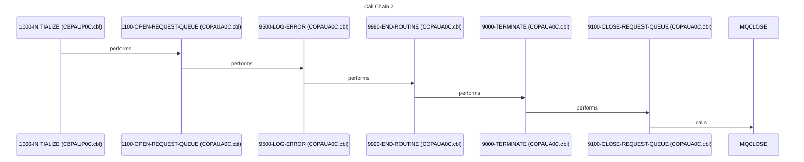
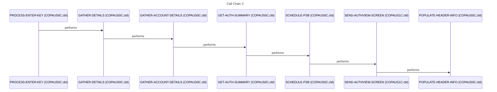
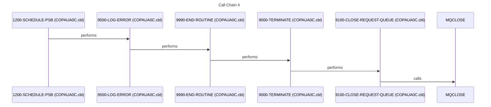
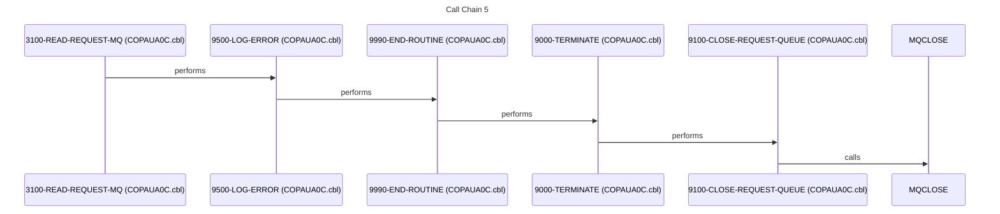

# SYSTEM_DESIGN.md

## 1. Executive Summary

This system revolves around the management and processing of authorization data, likely related to financial transactions or access control. The primary purpose is to provide a robust and reliable mechanism for authorizing transactions, managing user profiles, and detecting potential fraud. The system supports both batch processing for data loading and unloading, as well as online transaction processing for real-time authorization requests. Key users include customer service representatives, fraud analysts, and potentially end-users interacting through online channels. Stakeholders include the business units responsible for transaction processing, risk management, and regulatory compliance.

Functionally, the system handles authorization requests, retrieves and updates user account information, and manages authorization summaries. It involves reading requests from message queues, processing these requests against various data sources (customer, account, and authorization data), making authorization decisions, and sending responses back through message queues. The system also includes batch processes for unloading and loading IMS databases, ensuring data integrity and availability. Key workflows include the real-time authorization process triggered by an incoming request, and the batch processes for database maintenance and data archival. The system also supports fraud detection and updating authorization details based on fraud reports.

The technical foundation is built on a mainframe environment, utilizing COBOL for the core business logic, JCL for batch job control, IMS for database management, and MQSeries for message queuing. COBOL programs perform data manipulation, business rule execution, and database interactions. JCL jobs automate batch processes like database unloading and loading. IMS databases store critical authorization and user data. MQSeries facilitates asynchronous communication between different system components. The [CBLTDLI](cbl/CBPAUP0C.cbl.md) interface is used extensively for interacting with the IMS databases.

The system's inputs include authorization requests received via MQSeries, batch input files for database loading, and potentially user input through CICS screens. Outputs include authorization responses sent via MQSeries, unloaded database files, and updated IMS database records. The system integrates with external systems through MQSeries for receiving requests and sending responses, and potentially with other databases or systems for retrieving customer and account information. The system interacts with IMS databases [DBPAUTP0](ims/DBPAUTP0.dbd.md) and [DBPAUTX0](ims/DBPAUTX0.dbd.md) for authorization data.

This system is crucial for the organization because it enables secure and efficient transaction processing. If the system were to fail, it would halt transaction processing, leading to significant financial losses, customer dissatisfaction, and potential regulatory penalties. The system supports key business metrics such as transaction throughput, authorization approval rates, and fraud detection effectiveness. The system's ability to quickly and accurately authorize transactions directly impacts revenue generation and customer satisfaction. Furthermore, its fraud detection capabilities protect the organization from financial losses and reputational damage. The system also ensures compliance with relevant regulations by maintaining detailed audit trails of authorization decisions. The batch processes ensure data availability and integrity, which are essential for accurate reporting and analysis.

## 2. Architecture Overview

The system architecture is a hybrid of batch and online transaction processing, centered around an IMS database. Online transactions are driven by messages received via MQSeries, processed by COBOL programs, and ultimately result in updates to the IMS database. Batch jobs are used for database maintenance, including unloading and loading the IMS database. The system also includes CICS screens for user interaction.

```mermaid
flowchart TD

    subgraph jobs[" "]
        CBPAUP0J([CBPAUP0J])
        DBPAUTP0([DBPAUTP0])
        PAUDBUNL([PAUDBUNL])
    end

    subgraph procs[" "]
        CBPAUP0C[CBPAUP0C]
        CCPAUERY[/CCPAUERY/]
        CCPAURLY[/CCPAURLY/]
        CCPAURQY[/CCPAURQY/]
        CIPAUDTY[/CIPAUDTY/]
        CIPAUSMY[/CIPAUSMY/]
        COPAU00[/COPAU00/]
        COPAU01[/COPAU01/]
        COPAUA0C[COPAUA0C]
        COPAUS0C[COPAUS0C]
        COPAUS1C[COPAUS1C]
        COPAUS2C[COPAUS2C]
        DBUNLDGS[DBUNLDGS]
        IMSFUNCS[/IMSFUNCS/]
        PADFLPCB[/PADFLPCB/]
        PASFLPCB[/PASFLPCB/]
        PAUDBLOD[PAUDBLOD]
        PAUTBPCB[/PAUTBPCB/]
    end

    subgraph external[" "]
        CBLTDLI>CBLTDLI]
        CDEMO_TO_PROGRAM>CDEMO-TO-PROGRAM]
        DFSRRC00>DFSRRC00]
        MQCLOSE>MQCLOSE]
        MQGET>MQGET]
        MQOPEN>MQOPEN]
        MQPUT1>MQPUT1]
        WS_PGM_AUTH_FRAUD>WS-PGM-AUTH-FRAUD]
    end

    %% Call relationships
    CBPAUP0C --> CBPAUP0C
    CBPAUP0C --> CBPAUP0C
    CBPAUP0C --> CBPAUP0C
    CBPAUP0C --> CBPAUP0C
    CBPAUP0C --> COPAUA0C
    CBPAUP0C --> COPAUA0C
    CBPAUP0C --> DBUNLDGS
    CBPAUP0C --> DBUNLDGS
    CBPAUP0C --> CBPAUP0C
    CBPAUP0C --> CBPAUP0C
    CBPAUP0C --> CBPAUP0C
    CBPAUP0C -.->|COPY| COPYBOOKS
    CBPAUP0C --> CBLTDLI
    CBPAUP0C --> CBLTDLI
    CBPAUP0C --> CBLTDLI
    CBPAUP0C --> CBLTDLI
    CBPAUP0J --> DFSRRC00
    CBPAUP0J --> DFSRRC00
    CBPAUP0J --> DFSRRC00
    CBPAUP0J --> DFSRRC00
    COPAUA0C --> COPAUA0C
    COPAUA0C --> COPAUA0C
    COPAUA0C --> COPAUA0C
    COPAUA0C --> COPAUA0C
    COPAUA0C --> COPAUA0C
    COPAUA0C --> COPAUA0C
    COPAUA0C --> COPAUA0C
    COPAUA0C --> COPAUA0C
    COPAUA0C --> COPAUA0C
    COPAUA0C --> COPAUA0C
    COPAUA0C --> COPAUA0C
    COPAUA0C --> COPAUA0C
    COPAUA0C --> COPAUA0C
    COPAUA0C --> COPAUA0C
    COPAUA0C --> COPAUA0C
    COPAUA0C --> COPAUA0C
    COPAUA0C --> COPAUA0C
    COPAUA0C --> COPAUA0C
    COPAUA0C --> COPAUA0C
    COPAUA0C --> COPAUA0C
    COPAUA0C --> COPAUA0C
    COPAUA0C --> COPAUA0C
    COPAUA0C --> COPAUA0C
    COPAUA0C --> COPAUA0C
    COPAUA0C --> COPAUA0C
    COPAUA0C --> COPAUA0C
    COPAUA0C --> COPAUA0C
    COPAUA0C --> COPAUA0C
    COPAUA0C --> COPAUA0C
    COPAUA0C -.->|COPY| COPYBOOKS
    COPAUA0C --> MQOPEN
    COPAUA0C --> MQGET
    COPAUA0C --> MQPUT1
    COPAUA0C --> MQCLOSE
    COPAUS0C --> COPAUS1C
    COPAUS0C --> COPAUS1C
    COPAUS0C --> COPAUS1C
    COPAUS0C --> COPAUS1C
    COPAUS0C --> COPAUS1C
    COPAUS0C --> COPAUS1C
    COPAUS0C --> COPAUS1C
    COPAUS0C --> COPAUS1C
    COPAUS0C --> COPAUS0C
    COPAUS0C --> COPAUS0C
    COPAUS0C --> COPAUS0C
    COPAUS0C --> COPAUS0C
    COPAUS0C --> COPAUS0C
    COPAUS0C --> COPAUS0C
    COPAUS0C --> COPAUS0C
    COPAUS0C --> COPAUS0C
    COPAUS0C --> COPAUS0C
    COPAUS0C --> COPAUS0C
    COPAUS0C --> COPAUS0C
    COPAUS0C --> COPAUS0C
    COPAUS0C --> COPAUS0C
    COPAUS0C --> COPAUS0C
    COPAUS0C --> COPAUS0C
    COPAUS0C --> COPAUS0C
    COPAUS0C --> COPAUS0C
    COPAUS0C --> COPAUS0C
    COPAUS0C --> COPAUS0C
    COPAUS0C --> COPAUS0C
    COPAUS0C --> COPAUS0C
    COPAUS0C --> COPAUS0C
    COPAUS0C --> COPAUS0C
    COPAUS0C --> COPAUS0C
    COPAUS0C --> COPAUS0C
    COPAUS0C --> COPAUS0C
    COPAUS0C --> COPAUS0C
    COPAUS0C -.->|COPY| COPYBOOKS
    COPAUS0C --> CDEMO_TO_PROGRAM
    COPAUS0C --> CDEMO_TO_PROGRAM
    COPAUS0C --> CDEMO_TO_PROGRAM
    COPAUS1C --> COPAUS1C
    COPAUS1C --> COPAUS1C
    COPAUS1C --> COPAUS1C
    COPAUS1C --> COPAUS1C
    COPAUS1C --> COPAUS0C
    COPAUS1C --> COPAUS0C
    COPAUS1C --> COPAUS1C
    COPAUS1C --> COPAUS1C
    COPAUS1C --> COPAUS1C
    COPAUS1C --> COPAUS1C
    COPAUS1C --> COPAUS1C
    COPAUS1C -.->|COPY| COPYBOOKS
    COPAUS1C --> WS_PGM_AUTH_FRAUD
    COPAUS2C --> CBPAUP0C
    COPAUS2C --> CBPAUP0C
    COPAUS2C --> DBUNLDGS
    COPAUS2C --> COPAUS0C
    COPAUS2C --> COPAUS0C
    COPAUS2C --> COPAUS1C
    COPAUS2C --> COPAUS1C
    COPAUS2C --> COPAUS1C
    COPAUS2C --> COPAUS0C
    COPAUS2C --> COPAUA0C
    COPAUS2C --> COPAUA0C
    COPAUS2C --> PAUDBLOD
    COPAUS2C --> PAUDBLOD
    COPAUS2C --> CBPAUP0C
    COPAUS2C --> CBPAUP0C
    COPAUS2C --> CBPAUP0C
    COPAUS2C --> CBPAUP0C
    COPAUS2C --> CBPAUP0C
    COPAUS2C --> COPAUS0C
    COPAUS2C --> COPAUS0C
    COPAUS2C --> COPAUS0C
    COPAUS2C --> COPAUS0C
    COPAUS2C --> COPAUS2C
    COPAUS2C -.->|COPY| COPYBOOKS
    DBPAUTP0 --> DFSRRC00
    DBUNLDGS --> CBPAUP0C
    DBUNLDGS --> CBPAUP0C
    DBUNLDGS -.->|COPY| COPYBOOKS
    DBUNLDGS --> CBLTDLI
    DBUNLDGS --> CBLTDLI
    PAUDBLOD --> PAUDBLOD
    PAUDBLOD --> CBPAUP0C
    PAUDBLOD --> PAUDBLOD
    PAUDBLOD --> PAUDBLOD
    PAUDBLOD --> CBPAUP0C
    PAUDBLOD --> CBPAUP0C
    PAUDBLOD -.->|COPY| COPYBOOKS
    PAUDBLOD --> CBLTDLI
    PAUDBLOD --> CBLTDLI
    PAUDBLOD --> CBLTDLI
    PAUDBUNL -.->|COPY| COPYBOOKS

    %% Styling
    classDef entryPoint fill:#90EE90,stroke:#228B22
    class CBPAUP0J,DBPAUTP0,LOADPADB,PAUDBUNL,UNLDGSAM,UNLDPADB entryPoint
    classDef missing fill:#1E3A5F,stroke:#2E5A8F,color:#FFFFFF
    class CBLTDLI,CDEMO_TO_PROGRAM,DFSRRC00,MQCLOSE,MQGET,MQOPEN,MQPUT1,WS_PGM_AUTH_FRAUD missing
```

**Entry Points:**

- **MQSeries**: The primary entry point for online transactions is through MQSeries messages. Programs like [COPAUA0C](cbl/COPAUA0C.cbl.md) interact with MQSeries using verbs like [MQOPEN](cbl/COPAUA0C.cbl.md), [MQGET](cbl/COPAUA0C.cbl.md), [MQPUT1](cbl/COPAUA0C.cbl.md), and [MQCLOSE](cbl/COPAUA0C.cbl.md).
- **JCL Jobs**: Batch processing is initiated through JCL jobs such as [CBPAUP0J](jcl/CBPAUP0J.jcl.md), [DBPAUTP0](jcl/DBPAUTP0.jcl.md), and [PAUDBUNL](cbl/PAUDBUNL.CBL.md). These jobs execute COBOL programs for database unloading, loading, and other maintenance tasks.
- **CICS Screens**: Programs like [COPAUS0C](cbl/COPAUS0C.cbl.md) and [COPAUS1C](cbl/COPAUS1C.cbl.md) likely interact with users through CICS screens defined by BMS maps such as [COPAU00](bms/COPAU00.bms.md) and [COPAU01](bms/COPAU01.bms.md).

**Integration Patterns:**

- **Message Queuing (MQSeries)**: Asynchronous communication between components using MQSeries.
- **Batch Processing (JCL)**: Scheduled execution of batch jobs for database maintenance.
- **Database Access (IMS)**: Direct access to IMS databases using [CBLTDLI](cbl/CBPAUP0C.cbl.md) calls.
- **Online Transaction Processing (CICS)**: Interactive user interface through CICS screens.

**Architectural Patterns:**

- **Layered Architecture**: The system appears to have a layered architecture, with presentation (CICS screens), business logic (COBOL programs), and data access (IMS database) layers.
- **Batch Processing Pipeline**: Batch jobs form a pipeline for database unloading, transformation, and loading.

## 3. Component Catalog

| Component | Type | Purpose | Dependencies | Doc Link |
|-----------|------|---------|--------------|----------|
| [PAUDBUNL](cbl/PAUDBUNL.CBL.md) | COBOL | Unloads IMS database | [CIPAUDTY](cpy/CIPAUDTY.cpy.md), [CIPAUSMY](cpy/CIPAUSMY.cpy.md), [IMSFUNCS](cpy/IMSFUNCS.cpy.md), [PAUTBPCB](cpy/PAUTBPCB.CPY.md) | [cbl/PAUDBUNL.CBL.md](cbl/PAUDBUNL.CBL.md) |
| [COPAUS1C](cbl/COPAUS1C.cbl.md) | COBOL | Processes CICS transactions | [COPAUS0C](cbl/COPAUS0C.cbl.md), [CIPAUDTY](cpy/CIPAUDTY.cpy.md), [CIPAUSMY](cpy/CIPAUSMY.cpy.md) | [cbl/COPAUS1C.cbl.md](cbl/COPAUS1C.cbl.md) |
| [COPAUA0C](cbl/COPAUA0C.cbl.md) | COBOL | Processes MQSeries messages | [CIPAUDTY](cpy/CIPAUDTY.cpy.md), [CIPAUSMY](cpy/CIPAUSMY.cpy.md) | [cbl/COPAUA0C.cbl.md](cbl/COPAUA0C.cbl.md) |
| [PAUDBLOD](cbl/PAUDBLOD.CBL.md) | COBOL | Loads IMS database | [CIPAUDTY](cpy/CIPAUDTY.cpy.md), [CIPAUSMY](cpy/CIPAUSMY.cpy.md), [IMSFUNCS](cpy/IMSFUNCS.cpy.md), [PAUTBPCB](cpy/PAUTBPCB.CPY.md) | [cbl/PAUDBLOD.CBL.md](cbl/PAUDBLOD.CBL.md) |
| [DBUNLDGS](cbl/DBUNLDGS.CBL.md) | COBOL | Unloads GSAM database | [CIPAUDTY](cpy/CIPAUDTY.cpy.md), [CIPAUSMY](cpy/CIPAUSMY.cpy.md), [IMSFUNCS](cpy/IMSFUNCS.cpy.md), [PAUTBPCB](cpy/PAUTBPCB.CPY.md) | [cbl/DBUNLDGS.CBL.md](cbl/DBUNLDGS.CBL.md) |
| [CBPAUP0C](cbl/CBPAUP0C.cbl.md) | COBOL | Processes IMS database | [CIPAUDTY](cpy/CIPAUDTY.cpy.md), [CIPAUSMY](cpy/CIPAUSMY.cpy.md) | [cbl/CBPAUP0C.cbl.md](cbl/CBPAUP0C.cbl.md) |
| [COPAUS0C](cbl/COPAUS0C.cbl.md) | COBOL | Handles CICS screen interactions | [COPAUS1C](cbl/COPAUS1C.cbl.md), [CIPAUDTY](cpy/CIPAUDTY.cpy.md), [CIPAUSMY](cpy/CIPAUSMY.cpy.md) | [cbl/COPAUS0C.cbl.md](cbl/COPAUS0C.cbl.md) |
| [COPAUS2C](cbl/COPAUS2C.cbl.md) | COBOL | Main program orchestrating other COBOL programs | [CBPAUP0C](cbl/CBPAUP0C.cbl.md), [COPAUS0C](cbl/COPAUS0C.cbl.md), [COPAUS1C](cbl/COPAUS1C.cbl.md), [COPAUA0C](cbl/COPAUA0C.cbl.md), [PAUDBLOD](cbl/PAUDBLOD.CBL.md) | [cbl/COPAUS2C.cbl.md](cbl/COPAUS2C.cbl.md) |
| [COPAU00](bms/COPAU00.bms.md) | BMS | Defines CICS screen layout | - | [bms/COPAU00.bms.md](bms/COPAU00.bms.md) |
| [COPAU01](bms/COPAU01.bms.md) | BMS | Defines CICS screen layout | - | [bms/COPAU01.bms.md](bms/COPAU01.bms.md) |
| [PADFLPCB](cpy/PADFLPCB.CPY.md) | COPY | PCB definition | - | [cpy/PADFLPCB.CPY.md](cpy/PADFLPCB.CPY.md) |
| [CIPAUSMY](cpy/CIPAUSMY.cpy.md) | COPY | Data structure definition | - | [cpy/CIPAUSMY.cpy.md](cpy/CIPAUSMY.cpy.md) |
| [CCPAURQY](cpy/CCPAURQY.cpy.md) | COPY | Data structure definition | - | [cpy/CCPAURQY.cpy.md](cpy/CCPAURQY.cpy.md) |
| [CIPAUDTY](cpy/CIPAUDTY.cpy.md) | COPY | Data structure definition | - | [cpy/CIPAUDTY.cpy.md](cpy/CIPAUDTY.cpy.md) |
| [PAUTBPCB](cpy/PAUTBPCB.CPY.md) | COPY | PCB definition | - | [cpy/PAUTBPCB.CPY.md](cpy/PAUTBPCB.CPY.md) |
| [PASFLPCB](cpy/PASFLPCB.CPY.md) | COPY | PCB definition | - | [cpy/PASFLPCB.CPY.md](cpy/PASFLPCB.CPY.md) |
| [IMSFUNCS](cpy/IMSFUNCS.cpy.md) | COPY | IMS function definitions | - | [cpy/IMSFUNCS.cpy.md](cpy/IMSFUNCS.cpy.md) |
| [CCPAUERY](cpy/CCPAUERY.cpy.md) | COPY | Data structure definition | - | [cpy/CCPAUERY.cpy.md](cpy/CCPAUERY.cpy.md) |
| [CCPAURLY](cpy/CCPAURLY.cpy.md) | COPY | Data structure definition | - | [cpy/CCPAURLY.cpy.md](cpy/CCPAURLY.cpy.md) |
| [XAUTHFRD](ddl/XAUTHFRD.ddl.md) | DDL | Table definition | - | [ddl/XAUTHFRD.ddl.md](ddl/XAUTHFRD.ddl.md) |
| [AUTHFRDS](ddl/AUTHFRDS.ddl.md) | DDL | Table definition | - | [ddl/AUTHFRDS.ddl.md](ddl/AUTHFRDS.ddl.md) |
| [DBPAUTP0](ims/DBPAUTP0.dbd.md) | DBD | IMS database definition | - | [ims/DBPAUTP0.dbd.md](ims/DBPAUTP0.dbd.md) |
| [DBPAUTX0](ims/DBPAUTX0.dbd.md) | DBD | IMS database definition | - | [ims/DBPAUTX0.dbd.md](ims/DBPAUTX0.dbd.md) |
| [PADFLDBD](ims/PADFLDBD.DBD.md) | DBD | IMS database definition | - | [ims/PADFLDBD.DBD.md](ims/PADFLDBD.DBD.md) |
| [PSBPAUTL](ims/PSBPAUTL.psb.md) | PSB | IMS program specification block | - | [ims/PSBPAUTL.psb.md](ims/PSBPAUTL.psb.md) |
| [PSBPAUTB](ims/PSBPAUTB.psb.md) | PSB | IMS program specification block | - | [ims/PSBPAUTB.psb.md](ims/PSBPAUTB.psb.md) |
| [PASFLDBD](ims/PASFLDBD.DBD.md) | DBD | IMS database definition | - | [ims/PASFLDBD.DBD.md](ims/PASFLDBD.DBD.md) |
| [PAUTBUNL](ims/PAUTBUNL.PSB.md) | PSB | IMS program specification block | - | [ims/PAUTBUNL.PSB.md](ims/PAUTBUNL.PSB.md) |
| [DLIGSAMP](ims/DLIGSAMP.PSB.md) | PSB | IMS program specification block | - | [ims/DLIGSAMP.PSB.md](ims/DLIGSAMP.PSB.md) |
| [COPAU00](cpy-bms/COPAU00.cpy.md) | COPY | Copybook for BMS map COPAU00 | - | [cpy-bms/COPAU00.cpy.md](cpy-bms/COPAU00.cpy.md) |
| [COPAU01](cpy-bms/COPAU01.cpy.md) | COPY | Copybook for BMS map COPAU01 | - | [cpy-bms/COPAU01.cpy.md](cpy-bms/COPAU01.cpy.md) |
| [UNLDPADB](jcl/UNLDPADB.JCL.md) | JCL | Unloads IMS database | [PAUDBUNL](cbl/PAUDBUNL.CBL.md) | [jcl/UNLDPADB.JCL.md](jcl/UNLDPADB.JCL.md) |
| [LOADPADB](jcl/LOADPADB.JCL.md) | JCL | Loads IMS database | [PAUDBLOD](cbl/PAUDBLOD.CBL.md) | [jcl/LOADPADB.JCL.md](jcl/LOADPADB.JCL.md) |
| [UNLDGSAM](jcl/UNLDGSAM.JCL.md) | JCL | Unloads GSAM database | [DBUNLDGS](cbl/DBUNLDGS.CBL.md) | [jcl/UNLDGSAM.JCL.md](jcl/UNLDGSAM.JCL.md) |
| [DBPAUTP0](jcl/DBPAUTP0.jcl.md) | JCL | Executes IMS program | [DFSRRC00](cbl/CBPAUP0C.cbl.md) ❓ QUESTION: Which COBOL program is executed by this JCL? | [jcl/DBPAUTP0.jcl.md](jcl/DBPAUTP0.jcl.md) |
| [CBPAUP0J](jcl/CBPAUP0J.jcl.md) | JCL | Executes COBOL program | [CBPAUP0C](cbl/CBPAUP0C.cbl.md) | [jcl/CBPAUP0J.jcl.md](jcl/CBPAUP0J.jcl.md) |

## 4. Subsystem Breakdown

- **IMS Database Maintenance Subsystem**: This subsystem is responsible for unloading and loading the IMS database. It consists of the following components:
    - [UNLDPADB](jcl/UNLDPADB.JCL.md): JCL job that executes the [PAUDBUNL](cbl/PAUDBUNL.CBL.md) program to unload the IMS database.
    - [PAUDBUNL](cbl/PAUDBUNL.CBL.md): COBOL program that unloads the IMS database.
    - [LOADPADB](jcl/LOADPADB.JCL.md): JCL job that executes the [PAUDBLOD](cbl/PAUDBLOD.CBL.md) program to load the IMS database.
    - [PAUDBLOD](cbl/PAUDBLOD.CBL.md): COBOL program that loads the IMS database.
    - [UNLDGSAM](jcl/UNLDGSAM.JCL.md): JCL job that executes the [DBUNLDGS](cbl/DBUNLDGS.CBL.md) program to unload the GSAM database.
    - [DBUNLDGS](cbl/DBUNLDGS.CBL.md): COBOL program that unloads the GSAM database.

- **Online Transaction Processing Subsystem**: This subsystem handles online authorization requests. It consists of the following components:
    - [COPAUA0C](cbl/COPAUA0C.cbl.md): COBOL program that processes MQSeries messages and initiates the authorization process.
    - [COPAUS0C](cbl/COPAUS0C.cbl.md): COBOL program that handles CICS screen interactions and displays authorization information.
    - [COPAUS1C](cbl/COPAUS1C.cbl.md): COBOL program that processes CICS transactions related to authorization.
    - [COPAU00](bms/COPAU00.bms.md): BMS map that defines the layout of the CICS screen for authorization information.
    - [COPAU01](bms/COPAU01.bms.md): BMS map that defines the layout of another CICS screen.

- **IMS Database Access Subsystem**: This subsystem provides access to the IMS database. It consists of the following components:
    - [CBPAUP0C](cbl/CBPAUP0C.cbl.md): COBOL program that accesses the IMS database using [CBLTDLI](cbl/CBPAUP0C.cbl.md) calls.
    - [DBPAUTP0](jcl/DBPAUTP0.jcl.md): JCL job that executes an IMS program.
    - [PSBPAUTL](ims/PSBPAUTL.psb.md): IMS program specification block.
    - [PSBPAUTB](ims/PSBPAUTB.psb.md): IMS program specification block.
    - [DBPAUTP0](ims/DBPAUTP0.dbd.md): IMS database definition.
    - [DBPAUTX0](ims/DBPAUTX0.dbd.md): IMS database definition.
    - [PADFLDBD](ims/PADFLDBD.DBD.md): IMS database definition.
    - [PASFLDBD](ims/PASFLDBD.DBD.md): IMS database definition.

- **Shared Services and Utilities**:
    - [IMSFUNCS](cpy/IMSFUNCS.cpy.md): Copybook containing common IMS function definitions used by multiple programs.

## 5. Data Architecture

- **Data Stores:**
    - **IMS Database**: The primary data store for authorization data, likely using a hierarchical structure defined by [DBPAUTP0](ims/DBPAUTP0.dbd.md), [DBPAUTX0](ims/DBPAUTX0.dbd.md), and other DBDs.
    - **GSAM Database**: Another database, possibly used for audit logging or historical data.
    - **MQSeries Queues**: Used for asynchronous communication of authorization requests and responses.
    - **VSAM Files**: The programs [5100-READ-XREF-RECORD], [5200-READ-ACCT-RECORD], and [5300-READ-CUST-RECORD] read from VSAM files [WS-CCXREF-FILE], [WS-ACCTFILENAME], and [WS-CUSTFILENAME] respectively.
    - **CARDDEMO.AUTHFRDS**: This file is updated by the [FRAUD-UPDATE] paragraph and read by the [MAIN-PARA] paragraph.

- **Data Flow:**
    1. Authorization requests are received via MQSeries.
    2. [COPAUA0C](cbl/COPAUA0C.cbl.md) reads the request from the MQSeries queue.
    3. [COPAUA0C](cbl/COPAUA0C.cbl.md) processes the request and retrieves data from the IMS database using [CBPAUP0C](cbl/CBPAUP0C.cbl.md).
    4. [CBPAUP0C](cbl/CBPAUP0C.cbl.md) interacts with the IMS database using [CBLTDLI](cbl/CBPAUP0C.cbl.md) calls.
    5. The authorization decision is made based on the retrieved data and business rules.
    6. [COPAUA0C](cbl/COPAUA0C.cbl.md) sends the authorization response via MQSeries.
    7. Batch jobs [UNLDPADB](jcl/UNLDPADB.JCL.md) and [LOADPADB](jcl/LOADPADB.JCL.md) unload and load the IMS database for maintenance purposes.
    8. The [FRAUD-UPDATE] paragraph updates the [CARDDEMO.AUTHFRDS] file.

- **Input Sources:**
    - MQSeries queues for authorization requests.
    - Input files for batch database loading ([PAUDBLOD](cbl/PAUDBLOD.CBL.md)).
    - User input via CICS screens ([COPAUS0C](cbl/COPAUS0C.cbl.md), [COPAUS1C](cbl/COPAUS1C.cbl.md)).

- **Output Destinations:**
    - MQSeries queues for authorization responses.
    - Output files from batch database unloading ([PAUDBUNL](cbl/PAUDBUNL.CBL.md)).
    - Updated IMS database records.
    - CICS screens displaying authorization information.

- **Key Data Structures:**
    - Data structures defined in copybooks like [CIPAUDTY](cpy/CIPAUDTY.cpy.md), [CIPAUSMY](cpy/CIPAUSMY.cpy.md), [CCPAURQY](cpy/CCPAURQY.cpy.md), [CCPAUERY](cpy/CCPAUERY.cpy.md), and [CCPAURLY](cpy/CCPAURLY.cpy.md).
    - PCB definitions in copybooks like [PADFLPCB](cpy/PADFLPCB.CPY.md), [PAUTBPCB](cpy/PAUTBPCB.CPY.md), and [PASFLPCB](cpy/PASFLPCB.CPY.md).

## 6. Integration Points

- **External System Interfaces:**
    - **MQSeries**: Integration with external systems for receiving authorization requests and sending responses.
    - **CICS**: User interface for interacting with the system.
    - **Potential Integration with other Databases**: The programs [5100-READ-XREF-RECORD], [5200-READ-ACCT-RECORD], and [5300-READ-CUST-RECORD] suggest integration with other systems or databases that store customer and account information.

- **Batch Job Dependencies and Scheduling:**
    - The database unloading job ([UNLDPADB](jcl/UNLDPADB.JCL.md)) must be executed

## Flows

The following sequence diagrams illustrate key call sequences identified in the codebase, showing how programs interact during execution.

### Flow 1

### Flow 2

### Flow 3

### Flow 4

### Flow 5

