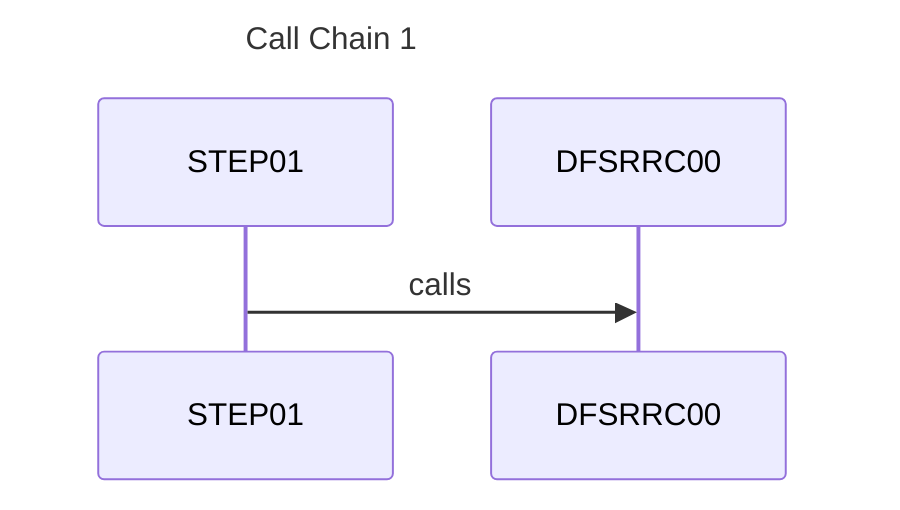
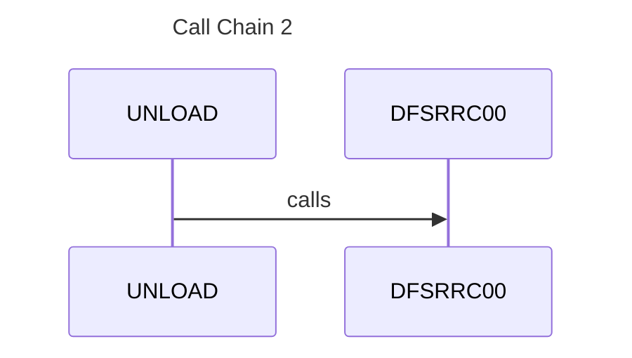
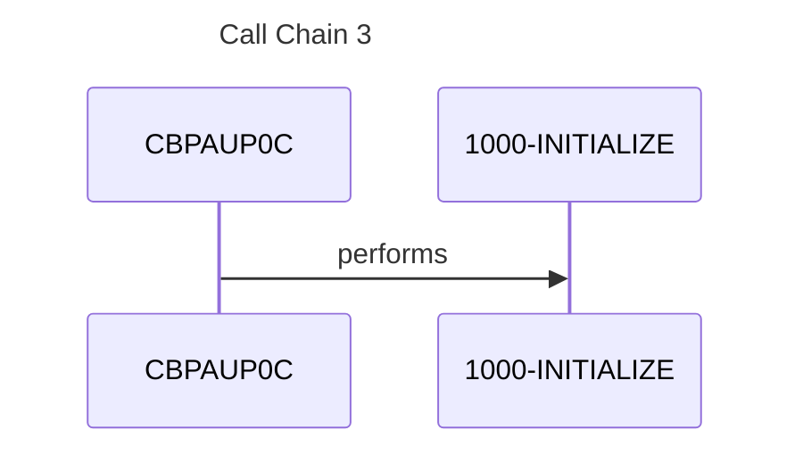
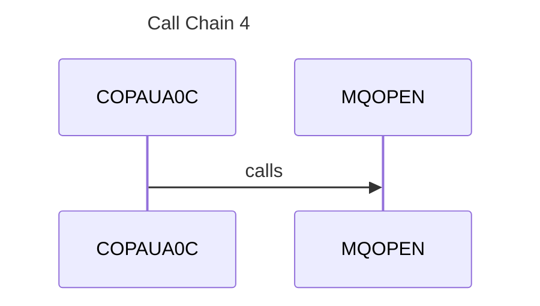
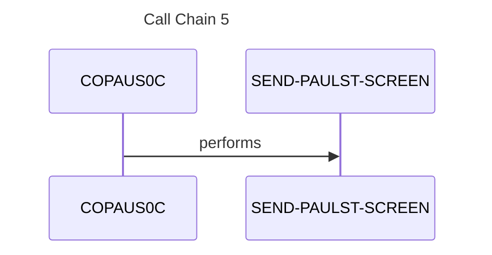

# System Design

*Generated: 2026-01-26 02:28:53*

## 1. Executive Summary

The CardDemo Authorization System is a mission-critical mainframe application designed to manage, process, and audit credit card transaction authorizations within a financial services environment. The primary business problem it solves is the real-time and batch management of "pending" authorizations, ensuring that credit limits are respected and fraudulent activities are identified before final settlement. The system serves bank administrators, fraud investigators, and automated transaction processing engines by providing a robust framework for authorization lifecycle management. At its core, the system handles the ingestion of authorization requests, the maintenance of a hierarchical IMS database for pending records, and the provision of online interfaces for manual review. Major functional capabilities include paginated summary views of account authorizations, detailed drill-downs into specific transaction metadata, and the ability to flag suspicious transactions for fraud investigation. Key workflows involve the batch loading of transaction data from external sources, the automated purging of expired pending authorizations to maintain database performance, and the real-time update of fraud status via DB2 integration.

Technically, the system is built on a foundation of COBOL, utilizing CICS for online transaction processing and IMS (Information Management System) for hierarchical data storage. It leverages BMS (Basic Mapping Support) for screen definition and MQSeries for asynchronous message-based communication between components. The system architecture is hybrid, combining high-performance batch JCL routines for data movement with interactive online programs for user-driven workflows. System boundaries are defined by inputs from external transaction gateways via MQ and sequential files, while outputs include updated DB2 fraud tables and GSAM (Generalized Sequential Access Method) files for downstream reporting. Integration points include VSAM files for customer and account cross-references and DB2 for persistent fraud record storage. The business value of this system is immense, as it directly supports the organization's risk management strategy and regulatory compliance requirements. If this system were unavailable, the bank would lose the ability to track pending liabilities against customer credit lines, leading to potential over-limit spending and increased exposure to fraudulent transactions. It supports key business metrics such as authorization turnaround time, fraud detection rates, and database storage efficiency.

## 2. Architecture Overview

The system follows a classic mainframe multi-tier architecture, separating presentation (BMS/CICS), business logic (COBOL), and data persistence (IMS/DB2/VSAM). 

- **Online Tier**: CICS-based programs ([COPAUS0C](cbl/COPAUS0C.md), [COPAUS1C](cbl/COPAUS1C.md)) provide the user interface for searching and viewing authorizations.
- **Messaging Tier**: [COPAUA0C](cbl/COPAUA0C.md) acts as a bridge, utilizing MQSeries to ingest authorization requests.
- **Batch Tier**: A suite of JCL jobs ([LOADPADB](jcl/LOADPADB.md), [UNLDPADB](jcl/UNLDPADB.md)) and COBOL utilities ([PAUDBLOD](cbl/PAUDBLOD.md), [PAUDBUNL](cbl/PAUDBUNL.md)) manage bulk data movement and database maintenance.
- **Data Tier**: IMS DB serves as the primary store for hierarchical authorization data (Summary and Detail segments), while DB2 is used for specialized fraud tracking ([COPAUS2C](cbl/COPAUS2C.md)).

### Actual System Call Graph

```mermaid
flowchart TD

    subgraph jobs[" "]
        COPAUA0C([COPAUA0C])
        COPAUS0C([COPAUS0C])
        COPAUS1C([COPAUS1C])
        DBPAUTP0([DBPAUTP0])
        DBUNLDGS([DBUNLDGS])
        PAUDBLOD([PAUDBLOD])
        PAUDBUNL([PAUDBUNL])
        UNLDPADB([UNLDPADB])
    end

    subgraph external[" "]
        CBLTDLI>CBLTDLI]
        CDEMO_TO_PROGRAM>CDEMO-TO-PROGRAM]
        DFSRRC00>DFSRRC00]
        MQCLOSE>MQCLOSE]
        MQGET>MQGET]
        MQOPEN>MQOPEN]
        MQPUT1>MQPUT1]
        WS_PGM_AUTH_FRAUD>WS-PGM-AUTH-FRAUD]
    end

    %% Call relationships
    COPAUA0C --> MQOPEN
    COPAUA0C --> MQGET
    COPAUA0C --> MQPUT1
    COPAUA0C --> MQCLOSE
    COPAUS0C --> CDEMO_TO_PROGRAM
    COPAUS0C --> CDEMO_TO_PROGRAM
    COPAUS1C --> WS_PGM_AUTH_FRAUD
    COPAUS1C --> CDEMO_TO_PROGRAM
    DBPAUTP0 --> DFSRRC00
    DBUNLDGS --> CBLTDLI
    DBUNLDGS --> CBLTDLI
    DBUNLDGS --> CBLTDLI
    DBUNLDGS --> CBLTDLI
    PAUDBLOD --> CBLTDLI
    PAUDBLOD --> CBLTDLI
    PAUDBLOD --> CBLTDLI
    PAUDBUNL --> CBLTDLI
    PAUDBUNL --> CBLTDLI
    UNLDPADB --> DFSRRC00
    UNLDPADB --> DFSRRC00
    UNLDPADB --> DFSRRC00
    UNLDPADB --> DFSRRC00

    %% Styling
    classDef entryPoint fill:#90EE90,stroke:#228B22
    class CBPAUP0C,CBPAUP0J,COPAUA0C,COPAUS0C,COPAUS1C,COPAUS2C,DBPAUTP0,DBUNLDGS,LOADPADB,PAUDBLOD,PAUDBUNL,UNLDGSAM,UNLDPADB entryPoint
    classDef missing fill:#1E3A5F,stroke:#2E5A8F,color:#FFFFFF
    class CBLTDLI,CDEMO_TO_PROGRAM,DFSRRC00,MQCLOSE,MQGET,MQOPEN,MQPUT1,WS_PGM_AUTH_FRAUD missing
```

## 3. Component Catalog

| Component | Type | Purpose | Dependencies | Doc Link |
|-----------|------|---------|--------------|----------|
| [CBPAUP0C](cbl/CBPAUP0C.md) | COBOL | Purges expired authorizations from IMS | [PAUTBPCB](cpy/PAUTBPCB.md) | [Link](cbl/CBPAUP0C.md) |
| [COPAUA0C](cbl/COPAUA0C.md) | COBOL | MQ-based authorization request processor | MQSeries, [CIPAUDTY](cpy/CIPAUDTY.md) | [Link](cbl/COPAUA0C.md) |
| [COPAUS0C](cbl/COPAUS0C.md) | COBOL | Online Authorization Summary Screen | [COPAU00](bms/COPAU00.md), IMS | [Link](cbl/COPAUS0C.md) |
| [COPAUS1C](cbl/COPAUS1C.md) | COBOL | Online Authorization Detail Screen | [COPAU01](bms/COPAU01.md), IMS | [Link](cbl/COPAUS1C.md) |
| [COPAUS2C](cbl/COPAUS2C.md) | COBOL | DB2 Fraud record update routine | [AUTHFRDS](ddl/AUTHFRDS.md) | [Link](cbl/COPAUS2C.md) |
| [PAUDBLOD](cbl/PAUDBLOD.md) | COBOL | Batch IMS Database Loader | [IMSFUNCS](cpy/IMSFUNCS.md) | [Link](cbl/PAUDBLOD.md) |
| [PAUDBUNL](cbl/PAUDBUNL.md) | COBOL | Batch IMS Database Unloader | [PAUTBPCB](cpy/PAUTBPCB.md) | [Link](cbl/PAUDBUNL.md) |
| [DBUNLDGS](cbl/DBUNLDGS.md) | COBOL | IMS to GSAM Unload Utility | [PASFLPCB](cpy/PASFLPCB.md) | [Link](cbl/DBUNLDGS.md) |
| [LOADPADB](jcl/LOADPADB.md) | JCL | Job to load Pending Auth DB | [PAUDBLOD](cbl/PAUDBLOD.md) | [Link](jcl/LOADPADB.md) |
| [UNLDPADB](jcl/UNLDPADB.md) | JCL | Job to unload Pending Auth DB | [PAUDBUNL](cbl/PAUDBUNL.md) | [Link](jcl/UNLDPADB.md) |
| [DBPAUTP0](jcl/DBPAUTP0.md) | JCL | IMS DB Unload Utility Job | DFSRRC00 | [Link](jcl/DBPAUTP0.md) |
| [CBPAUP0J](jcl/CBPAUP0J.md) | JCL | Purge Job Execution | [CBPAUP0C](cbl/CBPAUP0C.md) | [Link](jcl/CBPAUP0J.md) |
| [UNLDGSAM](jcl/UNLDGSAM.md) | JCL | GSAM Unload Execution | [DBUNLDGS](cbl/DBUNLDGS.md) | [Link](jcl/UNLDGSAM.md) |
| [CIPAUDTY](cpy/CIPAUDTY.md) | COPY | Auth Detail Data Structure | - | [Link](cpy/CIPAUDTY.md) |
| [CIPAUSMY](cpy/CIPAUSMY.md) | COPY | Auth Summary Data Structure | - | [Link](cpy/CIPAUSMY.md) |
| [PAUTBPCB](cpy/PAUTBPCB.md) | COPY | IMS PCB for Auth Database | - | [Link](cpy/PAUTBPCB.md) |
| [PADFLDBD](ims/PADFLDBD.md) | DBD | IMS DBD for Detail Segments | - | [Link](ims/PADFLDBD.md) |
| [PASFLDBD](ims/PASFLDBD.md) | DBD | IMS DBD for Summary Segments | - | [Link](ims/PASFLDBD.md) |
| [AUTHFRDS](ddl/AUTHFRDS.md) | DDL | DB2 Fraud Table Definition | - | [Link](ddl/AUTHFRDS.md) |

## 4. Subsystem Breakdown

### Authorization Inquiry Subsystem (Online)
This subsystem allows users to interactively query the status of authorizations.
- **Entry Point**: [COPAUS0C](cbl/COPAUS0C.md) (Summary Screen)
- **Flow**: Users enter an Account ID -> [COPAUS0C](cbl/COPAUS0C.md) fetches data from IMS -> User selects a record -> [COPAUS1C](cbl/COPAUS1C.md) displays details -> User can flag fraud via [COPAUS2C](cbl/COPAUS2C.md).
- **Maps**: [COPAU00](bms/COPAU00.md), [COPAU01](bms/COPAU01.md).

### Database Maintenance Subsystem (Batch)
Handles the lifecycle of the IMS database.
- **Loading**: [LOADPADB](jcl/LOADPADB.md) executes [PAUDBLOD](cbl/PAUDBLOD.md) to populate the database from sequential files.
- **Unloading**: [UNLDPADB](jcl/UNLDPADB.md) and [DBPAUTP0](jcl/DBPAUTP0.md) extract data for backup or migration.
- **Purging**: [CBPAUP0J](jcl/CBPAUP0J.md) runs [CBPAUP0C](cbl/CBPAUP0C.md) to remove expired records based on a retention parameter.

### Integration & Messaging Subsystem
Processes incoming requests from external systems.
- **MQ Processing**: [COPAUA0C](cbl/COPAUA0C.md) listens to request queues, extracts transaction data, and updates the IMS database.
- **GSAM Export**: [UNLDGSAM](jcl/UNLDGSAM.md) uses [DBUNLDGS](cbl/DBUNLDGS.md) to bridge IMS data to GSAM files for external reporting.

## 5. Data Architecture

### Data Stores
1. **IMS Database (PAUTDB)**:
   - **Root Segment (PAUTSUM0)**: Authorization Summary (Account ID, Total Amounts).
   - **Child Segment (PAUTDTL1)**: Authorization Details (Transaction ID, Date, Time, Merchant Info).
   - Defined by [PADFLDBD](ims/PADFLDBD.md) and [PASFLDBD](ims/PASFLDBD.md).
2. **DB2 Table (AUTHFRDS)**:
   - Stores fraud-flagged transactions.
   - Defined by [AUTHFRDS](ddl/AUTHFRDS.md) and [XAUTHFRD](ddl/XAUTHFRD.md).
3. **VSAM Files**:
   - `WS-CCXREF-FILE`: Card to Account cross-reference.
   - `WS-ACCTFILENAME`: Account master data.
   - `WS-CUSTFILENAME`: Customer master data.

### Data Flow Narrative
Authorization requests enter via MQ ([COPAUA0C](cbl/COPAUA0C.md)). The system validates the account against VSAM files. If valid, a summary segment is created or updated in IMS, and a detail segment is inserted. Online users view this data via CICS. If a transaction is marked as fraud, [COPAUS2C](cbl/COPAUS2C.md) writes a record to the DB2 `AUTHFRDS` table. Periodically, [CBPAUP0C](cbl/CBPAUP0C.md) scans IMS and deletes detail segments older than the configured threshold.

## 6. Integration Points

- **MQSeries**: Used by [COPAUA0C](cbl/COPAUA0C.md) for receiving authorization requests (`MQGET`) and sending responses (`MQPUT1`).
- **CICS-to-CICS**: [COPAUS0C](cbl/COPAUS0C.md) uses `XCTL` to transfer control to [COPAUS1C](cbl/COPAUS1C.md) for detailed views.
- **IMS DLI/BMP**: Batch jobs use `DFSRRC00` to interface with IMS databases in both DLI (Direct) and BMP (Batch Message Processing) modes.
- **External Programs**: References to `CDEMO-TO-PROGRAM` suggest a standard navigation or security utility used across the CardDemo suite.

## 7. Business Rules Summary

- **Expiration Logic**: [CBPAUP0C](cbl/CBPAUP0C.md) calculates record age by comparing the transaction date in `PAUTDTL1` against a system parameter. If `Current Date - Trans Date > Threshold`, the record is deleted.
- **Summary Integrity**: If all child detail segments for a summary are deleted, the parent summary segment ([CIPAUSMY](cpy/CIPAUSMY.md)) must also be deleted to prevent orphaned roots.
- **Fraud Handling**: [COPAUS2C](cbl/COPAUS2C.md) enforces a "Upsert" rule: if a fraud record already exists (SQLCODE -803), it updates the existing record instead of failing.
- **Pagination**: [COPAUS0C](cbl/COPAUS0C.md) implements PF7/PF8 logic to navigate large sets of authorizations for a single account.

## 8. Error Handling Patterns

- **IMS Status Codes**: Programs like [PAUDBLOD](cbl/PAUDBLOD.md) check for 'II' (Duplicate) or 'GE' (Not Found) and handle them gracefully, while other non-zero codes trigger a `9999-ABEND`.
- **SQL Error Handling**: [COPAUS2C](cbl/COPAUS2C.md) explicitly checks for duplicate keys and general SQL errors, returning status codes to the calling COMMAREA.
- **MQ Errors**: [COPAUA0C](cbl/COPAUA0C.md) includes a `9500-LOG-ERROR` routine for MQ-related failures.
- **Checkpointing**: [CBPAUP0C](cbl/CBPAUP0C.md) performs periodic IMS checkpoints (`9000-TAKE-CHECKPOINT`) to allow for restartability in long-running batch purges.

## 9. Open Questions and Uncertainties

- ❓ **QUESTION**: [COPAUA0C](cbl/COPAUA0C.md) was previously noted as empty, but the call graph shows it calling MQ functions. Is there a missing version of this source?
- ❓ **QUESTION**: What is the specific retention period used by [CBPAUP0C](cbl/CBPAUP0C.md)? Is it hardcoded or read from a control file?
- ❓ **QUESTION**: The JCL [UNLDGSAM](jcl/UNLDGSAM.md) lacks `UNLOADnn` DD statements. How is the sequential data actually persisted?
- ❓ **QUESTION**: What is the relationship between `WS-PGM-AUTH-FRAUD` and [COPAUS2C](cbl/COPAUS2C.md)? Are they the same program or different layers of the fraud subsystem?

## Flows

The following sequence diagrams illustrate key call sequences identified in the codebase, showing how programs interact during execution.

### Flow 1

### Flow 2

### Flow 3

### Flow 4

### Flow 5

