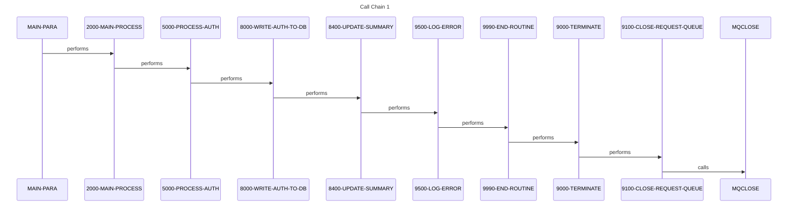
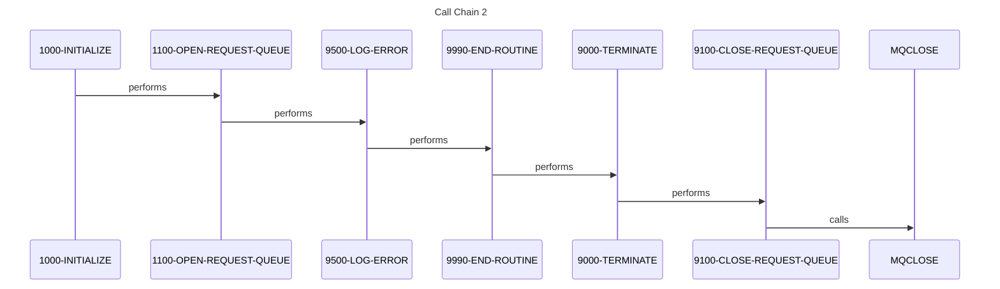
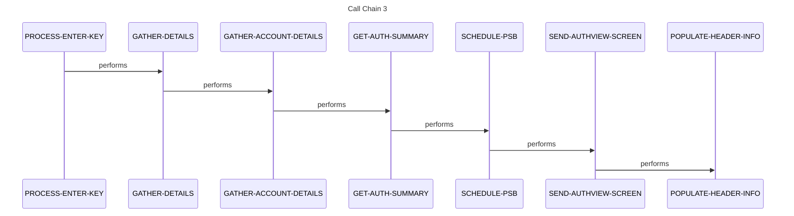
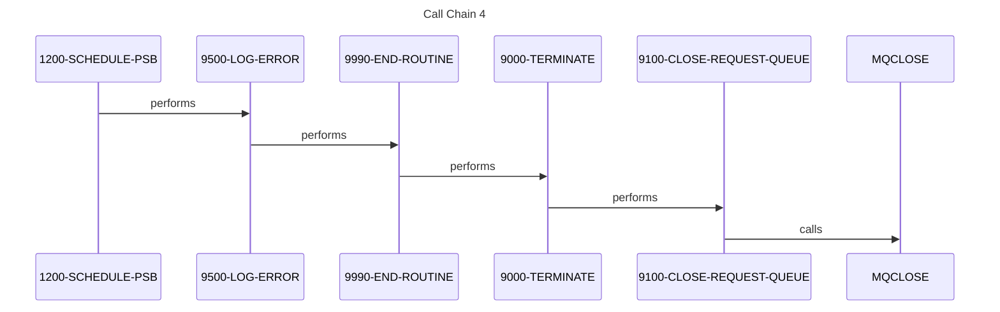
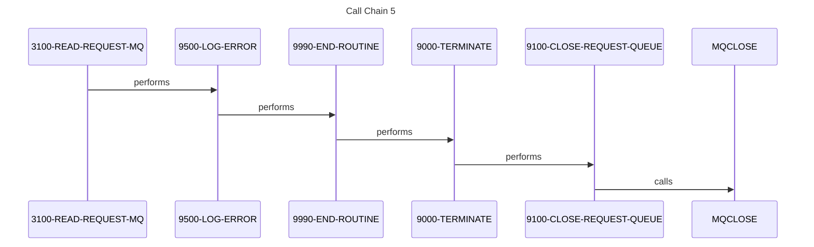

# System Design

*Generated: 2026-01-26 17:36:11*

## 1. Executive Summary

The Credit Card Authorization and Fraud Management System is a mission-critical mainframe application designed to handle the end-to-end lifecycle of credit card transaction authorizations and fraud detection. The primary business problem this system solves is the real-time and batch-oriented validation of credit card transactions, ensuring that cardholders have sufficient credit and that transactions do not exhibit fraudulent patterns. Its mission is to protect the financial integrity of the institution and its customers by providing a robust framework for transaction approval, rejection, and subsequent audit. The primary users of this system include financial analysts, fraud investigators, and automated transaction processing gateways.

Functionally, the system manages a complex workflow that includes receiving authorization requests via message queues, validating them against customer and account databases, and maintaining a historical record of all decisions. It handles major transactions such as real-time authorization processing, fraud marking for suspicious activities, and comprehensive reporting of authorization summaries. Key workflows involve the extraction of request messages from IBM MQ, cross-referencing card data with account and customer records, and updating IMS databases with transaction outcomes. The system also provides online interfaces for investigators to view authorization lists and drill down into specific transaction details.

The technical foundation of the system is built on a classic IBM mainframe stack, utilizing COBOL for business logic and JCL for batch orchestration. Data persistence is managed through a hybrid approach using IMS (Information Management System) for hierarchical transaction data and DB2/VSAM for relational or indexed file access. Integration is achieved through IBM MQ for asynchronous messaging and CICS for online transaction processing, with BMS (Basic Mapping Support) defining the user interface screens. These technologies work in concert to provide high-throughput, low-latency processing required for financial services.

System boundaries are clearly defined by its inputs and outputs, which include MQSeries message queues for incoming requests and outgoing responses. It integrates with external account management systems and customer information files to gather necessary context for authorization decisions. Data sources include IMS DB for transaction history and VSAM files for account cross-references, while outputs include updated fraud databases and audit logs. The system acts as a central hub between the point-of-sale (POS) interfaces and the core banking ledgers.

The business value of this system is immense, as it directly impacts the organization's bottom line by preventing unauthorized transactions and reducing fraud losses. If this system were unavailable, the institution would be unable to process credit card transactions, leading to significant revenue loss, reputational damage, and potential regulatory non-compliance. It supports key business metrics such as the fraud-to-sales ratio, authorization response time, and customer satisfaction scores. By providing a reliable and scalable authorization engine, the system enables the organization to expand its credit card portfolio with confidence.

## 2. Architecture Overview

The system follows a multi-tier architectural pattern common in mainframe environments, separating the presentation layer (CICS/BMS), the application logic layer (COBOL), and the data persistence layer (IMS/DB2/VSAM).

### Integration Patterns
- **Batch Processing**: JCL-driven jobs manage large-scale data movements, database backups, and unloads.
- **Online Transaction Processing (OLTP)**: CICS transactions provide real-time access to authorization data for internal users.
- **Messaging**: IBM MQ is used for decoupled, asynchronous communication between the authorization engine and external requestors.
- **Database Access**: The system uses `CBLTDLI` for IMS database interactions and standard SQL for DB2/DDL-defined structures.

### Actual System Call Graph
The following diagram represents the static analysis of program-to-program and program-to-utility calls within the system:

```mermaid
flowchart TD

    subgraph jobs[" "]
        DBPAUTP0([DBPAUTP0])
        UNLDPADB([UNLDPADB])
    end

    subgraph procs[" "]
        CBPAUP0C[CBPAUP0C]
        CCPAUERY[/CCPAUERY/]
        CCPAURLY[/CCPAURLY/]
        CCPAURQY[/CCPAURQY/]
        CIPAUDTY[/CIPAUDTY/]
        CIPAUSMY[/CIPAUSMY/]
        COPAU00[/COPAU00/]
        COPAU01[/COPAU01/]
        COPAUA0C[COPAUA0C]
        COPAUS0C[COPAUS0C]
        COPAUS1C[COPAUS1C]
        COPAUS2C[COPAUS2C]
        DBUNLDGS[DBUNLDGS]
        IMSFUNCS[/IMSFUNCS/]
        PADFLPCB[/PADFLPCB/]
        PASFLPCB[/PASFLPCB/]
        PAUDBLOD[PAUDBLOD]
        PAUDBUNL[PAUDBUNL]
        PAUTBPCB[/PAUTBPCB/]
    end

    subgraph external[" "]
        CBLTDLI>CBLTDLI]
        CDEMO_TO_PROGRAM>CDEMO-TO-PROGRAM]
        DFSRRC00>DFSRRC00]
        MQCLOSE>MQCLOSE]
        MQGET>MQGET]
        MQOPEN>MQOPEN]
        MQPUT1>MQPUT1]
        WS_PGM_AUTH_FRAUD>WS-PGM-AUTH-FRAUD]
    end

    %% Call relationships
    CBPAUP0C --> PAUDBUNL
    CBPAUP0C --> PAUDBUNL
    CBPAUP0C --> PAUDBUNL
    CBPAUP0C -.->|COPY| COPYBOOKS
    COPAUA0C --> COPAUA0C
    COPAUA0C --> COPAUA0C
    COPAUA0C --> COPAUA0C
    COPAUA0C --> COPAUA0C
    COPAUA0C --> COPAUA0C
    COPAUA0C --> COPAUA0C
    COPAUA0C --> COPAUA0C
    COPAUA0C --> COPAUA0C
    COPAUA0C --> COPAUA0C
    COPAUA0C --> COPAUA0C
    COPAUA0C --> COPAUA0C
    COPAUA0C --> COPAUA0C
    COPAUA0C --> COPAUA0C
    COPAUA0C --> COPAUA0C
    COPAUA0C --> COPAUA0C
    COPAUA0C --> COPAUA0C
    COPAUA0C --> COPAUA0C
    COPAUA0C --> COPAUA0C
    COPAUA0C --> COPAUA0C
    COPAUA0C --> COPAUA0C
    COPAUA0C --> COPAUA0C
    COPAUA0C --> COPAUA0C
    COPAUA0C --> COPAUA0C
    COPAUA0C --> COPAUA0C
    COPAUA0C --> COPAUA0C
    COPAUA0C --> COPAUA0C
    COPAUA0C --> COPAUA0C
    COPAUA0C --> COPAUA0C
    COPAUA0C -.->|COPY| COPYBOOKS
    COPAUA0C --> MQOPEN
    COPAUA0C --> MQGET
    COPAUA0C --> MQPUT1
    COPAUA0C --> MQCLOSE
    COPAUS0C --> PAUDBUNL
    COPAUS0C --> PAUDBLOD
    COPAUS0C --> PAUDBLOD
    COPAUS0C --> PAUDBUNL
    COPAUS0C --> COPAUS2C
    COPAUS0C --> COPAUA0C
    COPAUS0C --> COPAUA0C
    COPAUS0C --> PAUDBUNL
    COPAUS0C --> PAUDBUNL
    COPAUS0C --> CBPAUP0C
    COPAUS0C --> CBPAUP0C
    COPAUS0C --> CBPAUP0C
    COPAUS0C --> CBPAUP0C
    COPAUS0C --> COPAUS0C
    COPAUS0C --> COPAUS0C
    COPAUS0C --> COPAUS1C
    COPAUS0C --> COPAUS1C
    COPAUS0C --> COPAUS1C
    COPAUS0C --> COPAUS0C
    COPAUS0C --> COPAUS1C
    COPAUS0C --> COPAUS1C
    COPAUS0C --> COPAUS1C
    COPAUS0C --> COPAUS1C
    COPAUS0C --> COPAUS1C
    COPAUS0C --> COPAUS1C
    COPAUS0C --> COPAUS1C
    COPAUS0C --> COPAUS1C
    COPAUS0C --> COPAUS0C
    COPAUS0C --> COPAUS0C
    COPAUS0C --> COPAUS0C
    COPAUS0C --> COPAUS0C
    COPAUS0C --> COPAUS0C
    COPAUS0C --> COPAUS0C
    COPAUS0C --> COPAUS0C
    COPAUS0C --> COPAUS0C
    COPAUS0C --> COPAUS0C
    COPAUS0C --> COPAUS0C
    COPAUS0C --> COPAUS0C
    COPAUS0C --> COPAUS0C
    COPAUS0C --> COPAUS0C
    COPAUS0C --> COPAUS0C
    COPAUS0C --> COPAUS0C
    COPAUS0C --> COPAUS0C
    COPAUS0C --> COPAUS0C
    COPAUS0C --> COPAUS0C
    COPAUS0C --> COPAUS0C
    COPAUS0C --> COPAUS0C
    COPAUS0C --> COPAUS0C
    COPAUS0C --> COPAUS0C
    COPAUS0C --> COPAUS0C
    COPAUS0C --> COPAUS0C
    COPAUS0C --> COPAUS0C
    COPAUS0C --> COPAUS0C
    COPAUS0C --> COPAUS0C
    COPAUS0C --> COPAUS0C
    COPAUS0C --> COPAUS0C
    COPAUS0C --> COPAUS0C
    COPAUS0C --> COPAUS0C
    COPAUS0C -.->|COPY| COPYBOOKS
    COPAUS0C --> CDEMO_TO_PROGRAM
    COPAUS0C --> CDEMO_TO_PROGRAM
    COPAUS0C --> CDEMO_TO_PROGRAM
    COPAUS1C --> COPAUS1C
    COPAUS1C --> COPAUS1C
    COPAUS1C --> COPAUS1C
    COPAUS1C --> COPAUS1C
    COPAUS1C --> COPAUS0C
    COPAUS1C --> COPAUS0C
    COPAUS1C --> COPAUS1C
    COPAUS1C --> COPAUS1C
    COPAUS1C --> COPAUS1C
    COPAUS1C --> COPAUS1C
    COPAUS1C --> COPAUS1C
    COPAUS1C -.->|COPY| COPYBOOKS
    COPAUS1C --> WS_PGM_AUTH_FRAUD
    COPAUS2C -.->|COPY| COPYBOOKS
    DBPAUTP0 --> DFSRRC00
    DBUNLDGS --> PAUDBUNL
    DBUNLDGS --> PAUDBUNL
    DBUNLDGS -.->|COPY| COPYBOOKS
    DBUNLDGS --> CBLTDLI
    DBUNLDGS --> CBLTDLI
    PAUDBLOD --> PAUDBLOD
    PAUDBLOD --> PAUDBUNL
    PAUDBLOD --> PAUDBLOD
    PAUDBLOD --> PAUDBLOD
    PAUDBLOD --> PAUDBUNL
    PAUDBLOD --> PAUDBUNL
    PAUDBLOD -.->|COPY| COPYBOOKS
    PAUDBLOD --> CBLTDLI
    PAUDBLOD --> CBLTDLI
    PAUDBLOD --> CBLTDLI
    PAUDBUNL --> PAUDBUNL
    PAUDBUNL --> COPAUA0C
    PAUDBUNL --> COPAUA0C
    PAUDBUNL --> DBUNLDGS
    PAUDBUNL --> PAUDBUNL
    PAUDBUNL --> PAUDBUNL
    PAUDBUNL --> DBUNLDGS
    PAUDBUNL --> PAUDBUNL
    PAUDBUNL -.->|COPY| COPYBOOKS
    PAUDBUNL --> CBLTDLI
    PAUDBUNL --> CBLTDLI
    PAUDBUNL --> CBLTDLI
    PAUDBUNL --> CBLTDLI
    UNLDPADB --> DFSRRC00
    UNLDPADB --> DFSRRC00
    UNLDPADB --> DFSRRC00
    UNLDPADB --> DFSRRC00

    %% Styling
    classDef entryPoint fill:#90EE90,stroke:#228B22
    class CBPAUP0J,DBPAUTP0,LOADPADB,UNLDGSAM,UNLDPADB entryPoint
    classDef missing fill:#1E3A5F,stroke:#2E5A8F,color:#FFFFFF
    class CBLTDLI,CDEMO_TO_PROGRAM,DFSRRC00,MQCLOSE,MQGET,MQOPEN,MQPUT1,WS_PGM_AUTH_FRAUD missing
```

## 3. Component Catalog

| Component | Type | Purpose | Dependencies | Doc Link |
|-----------|------|---------|--------------|----------|
| **COPAUA0C** | COBOL | Authorization Request Processor (MQ) | MQSeries, IMS | [Link](cbl/COPAUA0C.cbl.md) |
| **COPAUS0C** | COBOL | Authorization List Online Handler | CICS, BMS | [Link](cbl/COPAUS0C.cbl.md) |
| **COPAUS1C** | COBOL | Authorization Detail/Fraud Handler | CICS, BMS | [Link](cbl/COPAUS1C.cbl.md) |
| **PAUDBLOD** | COBOL | IMS Database Load Utility | IMS, GSAM | [Link](cbl/PAUDBLOD.CBL.md) |
| **PAUDBUNL** | COBOL | IMS Database Unload Utility | IMS, GSAM | [Link](cbl/PAUDBUNL.CBL.md) |
| **DBUNLDGS** | COBOL | GSAM Unload Utility | IMS, GSAM | [Link](cbl/DBUNLDGS.CBL.md) |
| **CBPAUP0C** | COBOL | Batch Authorization Processor | PAUDBUNL | [Link](cbl/CBPAUP0C.cbl.md) |
| **LOADPADB** | JCL | Job to Load Authorization Database | PAUDBLOD | [Link](jcl/LOADPADB.JCL.md) |
| **UNLDPADB** | JCL | Job to Unload Authorization Database | PAUDBUNL | [Link](jcl/UNLDPADB.JCL.md) |
| **DBPAUTP0** | JCL | IMS Database Maintenance Job | DFSRRC00 | [Link](jcl/DBPAUTP0.jcl.md) |
| **UNLDGSAM** | JCL | GSAM Unload Job | DBUNLDGS | [Link](jcl/UNLDGSAM.JCL.md) |
| **CBPAUP0J** | JCL | Batch Processing Orchestration | CBPAUP0C | [Link](jcl/CBPAUP0J.jcl.md) |
| **COPAU00** | BMS | Authorization List Screen Map | - | [Link](bms/COPAU00.bms.md) |
| **COPAU01** | BMS | Authorization Detail Screen Map | - | [Link](bms/COPAU01.bms.md) |
| **CIPAUDTY** | COPY | Authorization Detail Layout | - | [Link](cpy/CIPAUDTY.cpy.md) |
| **CIPAUSMY** | COPY | Authorization Summary Layout | - | [Link](cpy/CIPAUSMY.cpy.md) |
| **IMSFUNCS** | COPY | Standard IMS Function Codes | - | [Link](cpy/IMSFUNCS.cpy.md) |
| **PAUTBPCB** | COPY | IMS PCB Definitions | - | [Link](cpy/PAUTBPCB.CPY.md) |
| **PADFLDBD** | DBD | Authorization Database Definition | - | [Link](ims/PADFLDBD.DBD.md) |
| **PSBPAUTB** | PSB | Batch Program Specification Block | - | [Link](ims/PSBPAUTB.psb.md) |

## 4. Subsystem Breakdown

### Authorization Processing (Real-time)
This subsystem handles incoming requests from MQSeries.
- **Core Program**: [COPAUA0C](cbl/COPAUA0C.cbl.md)
- **Workflow**: Reads from Request Queue -> Gathers Account/Customer details -> Makes Decision -> Writes to IMS -> Sends Response to MQ.
- **Key Copybooks**: [CCPAURQY](cpy/CCPAURQY.cpy.md) (Request), [CCPAURLY](cpy/CCPAURLY.cpy.md) (Reply).

### Online Fraud Management
Provides the user interface for investigators to review and mark transactions.
- **List View**: [COPAUS0C](cbl/COPAUS0C.cbl.md) using [COPAU00](bms/COPAU00.bms.md).
- **Detail View**: [COPAUS1C](cbl/COPAUS1C.cbl.md) using [COPAU01](bms/COPAU01.bms.md).
- **Functionality**: PF-key driven navigation, fraud marking, and transaction history browsing.

### Database Utilities & Maintenance
Handles the lifecycle of the IMS hierarchical databases.
- **Loading**: [LOADPADB](jcl/LOADPADB.JCL.md) triggers [PAUDBLOD](cbl/PAUDBLOD.CBL.md).
- **Unloading**: [UNLDPADB](jcl/UNLDPADB.JCL.md) triggers [PAUDBUNL](cbl/PAUDBUNL.CBL.md).
- **GSAM Support**: [DBUNLDGS](cbl/DBUNLDGS.CBL.md) manages sequential access to IMS data via GSAM.

## 5. Data Architecture

### Data Stores
- **IMS DB (PADFLDBD)**: Hierarchical database storing Authorization Summaries as roots and Authorization Details as children.
- **VSAM Files**:
    - `WS-CCXREF-FILE`: Cross-reference between card numbers and account IDs.
    - `WS-ACCTFILENAME`: Master account records.
    - `WS-CUSTFILENAME`: Master customer information.
- **DB2 Tables**:
    - `CARDDEMO.AUTHFRDS`: Relational table for tracking fraud-marked transactions (defined in [AUTHFRDS](ddl/AUTHFRDS.ddl.md)).

### Data Flow Narrative
1.  **Input**: A transaction request arrives via MQGET in [COPAUA0C](cbl/COPAUA0C.cbl.md).
2.  **Enrichment**: The program performs lookups in VSAM files to identify the customer and account status.
3.  **Persistence**: The decision is stored in the IMS database defined by [PADFLDBD](ims/PADFLDBD.DBD.md).
4.  **Audit/Fraud**: If a user marks a transaction as fraud in [COPAUS1C](cbl/COPAUS1C.cbl.md), the `CARDDEMO.AUTHFRDS` table is updated.

## 6. Integration Points

- **IBM MQ**: Primary interface for external authorization requests. Uses `MQOPEN`, `MQGET`, `MQPUT1`, and `MQCLOSE`.
- **CICS-to-CICS**: Uses `CDEMO-TO-PROGRAM` for navigation between different online modules.
- **IMS DL/I**: All database interactions are performed via the `CBLTDLI` interface using standard function codes (GU, GN, ISRT, REPL) defined in [IMSFUNCS](cpy/IMSFUNCS.cpy.md).

## 7. Business Rules Summary

- **Authorization Decisioning**: Logic within [COPAUA0C](cbl/COPAUA0C.cbl.md) (specifically `6000-MAKE-DECISION`) determines approval based on account status and available credit.
- **Fraud Marking**: Users can manually flag transactions as fraudulent, which triggers an update to the fraud database in `MARK-AUTH-FRAUD` within [COPAUS1C](cbl/COPAUS1C.cbl.md).
- **Expiration Logic**: Batch processes check for expired authorizations in [CBPAUP0C](cbl/CBPAUP0C.cbl.md) using the `4000-CHECK-IF-EXPIRED` routine.

## 8. Error Handling Patterns

- **Standard Abend**: Most programs implement a `9999-ABEND` routine for fatal errors.
- **MQ Error Logging**: [COPAUA0C](cbl/COPAUA0C.cbl.md) uses `9500-LOG-ERROR` to capture MQRC (Reason Codes).
- **IMS Status Codes**: Programs check the PCB status codes (e.g., 'GE' for not found) after every `CBLTDLI` call.
- **Transaction Integrity**: Online programs use `TAKE-SYNCPOINT` and `ROLL-BACK` to ensure database consistency during updates.

## 9. Open Questions and Uncertainties

- ❓ **QUESTION**: What is the specific logic inside `6000-MAKE-DECISION` in [COPAUA0C](cbl/COPAUA0C.cbl.md)? The documentation mentions it, but the exact thresholds for approval are not detailed.
- ❓ **QUESTION**: Is there a real-time fraud scoring engine integration, or is fraud detection purely manual/rule-based?
- ❓ **QUESTION**: What is the retention policy for the IMS authorization segments before they are purged or moved to history?
- ❓ **QUESTION**: The program `WS-PGM-AUTH-FRAUD` is called by [COPAUS1C](cbl/COPAUS1C.cbl.md) but its source is not provided. What is its specific role?

## Flows

The following sequence diagrams illustrate key call sequences identified in the codebase, showing how programs interact during execution.

### Flow 1

### Flow 2

### Flow 3

### Flow 4

### Flow 5

