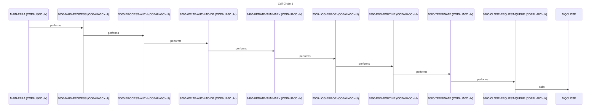
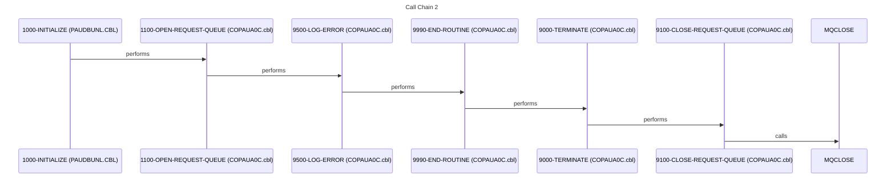
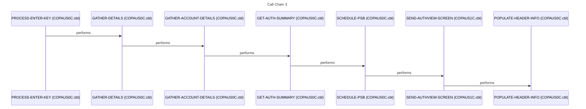
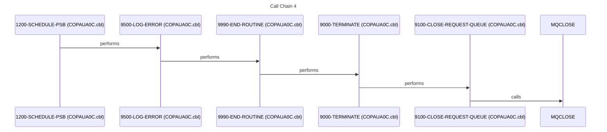
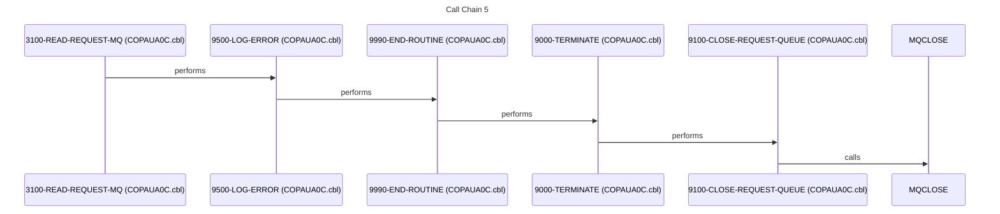

# System Design

*Generated: 2026-01-27 02:39:17*

## 1. Executive Summary

The Credit Card Authorization and Fraud Management System is a mission-critical mainframe application designed to handle the end-to-end lifecycle of credit card transaction authorizations. Its primary purpose is to provide a robust, high-performance environment for validating transaction requests against customer account data while simultaneously monitoring for fraudulent activity. The system serves financial institutions, customer service representatives, and fraud investigators who require real-time and batch access to transaction histories. At its core, the system manages the complex relationship between cardholders, their accounts, and the individual authorization events that occur at points of sale.

Functional capabilities include real-time authorization request processing via message queuing, comprehensive batch database maintenance, and interactive online inquiry screens. The system handles the ingestion of transaction requests, performs cross-referencing against account and customer master files, and executes business logic to approve or decline transactions. Key workflows involve the loading and unloading of IMS databases, the extraction of authorization summaries for reporting, and the manual marking of transactions as fraudulent by authorized personnel. Users can navigate through transaction histories using paged inquiry screens, allowing for detailed forensic analysis of account activity.

The technical foundation of the system is built on a classic IBM mainframe stack, utilizing COBOL for business logic and JCL for batch orchestration. Data persistence is managed through a hybrid approach using IMS (Information Management System) for hierarchical transaction data and VSAM/Flat files for account and customer cross-references. Integration is achieved through IBM MQ for asynchronous messaging and CICS for online transaction processing and screen management (BMS). The system utilizes standard IBM utilities like DFSRRC00 for IMS region controller execution and IEFBR14 for file management.

System boundaries are clearly defined by its inputs and outputs, which include MQ series request/response queues, GSAM (Generalized Sequential Access Method) files for batch reporting, and physical database datasets. It integrates with external cardholder systems through account cross-reference files and customer master records. The system acts as a central hub, receiving raw transaction data from external sources and producing validated, audited authorization records for downstream financial settlement.

The business value of this system is immense, as it directly supports the financial integrity and security of the organization's credit card portfolio. It provides the necessary controls to prevent unauthorized spending and identifies patterns of fraud that could lead to significant financial loss. If this system were unavailable, the organization would be unable to process new credit card transactions, leading to immediate revenue loss and severe damage to customer trust. Furthermore, the system supports regulatory compliance by maintaining a detailed audit trail of every authorization decision made.

## 2. Architecture Overview

The system follows a multi-tier architecture common in mainframe environments, separating concerns between presentation (BMS/CICS), business logic (COBOL), and data management (IMS/VSAM).

### Architectural Patterns
- **Batch Processing Pipeline**: Utilizes JCL to orchestrate the loading, unloading, and maintenance of IMS databases.
- **Message-Driven Processing**: Uses MQ Series to handle asynchronous authorization requests, ensuring decoupling between the requester and the processor.
- **Online Inquiry**: CICS-based transactions provide real-time access to data stored in IMS and VSAM.
- **Hierarchical Data Modeling**: Leverages IMS DBDs to represent the parent-child relationship between authorization summaries and detailed transaction records.

### Actual System Call Graph

## 3. Component Catalog

| Component | Type | Purpose | Dependencies | Doc Link |
|-----------|------|---------|--------------|----------|
| [PAUDBLOD](cbl/PAUDBLOD.CBL.md) | COBOL | IMS Database Load Utility | [IMSFUNCS](cpy/IMSFUNCS.cpy.md), [PAUTBPCB](cpy/PAUTBPCB.CPY.md) | [Link](cbl/PAUDBLOD.CBL.md) |
| [PAUDBUNL](cbl/PAUDBUNL.CBL.md) | COBOL | IMS Database Unload Utility | [IMSFUNCS](cpy/IMSFUNCS.cpy.md), [PAUTBPCB](cpy/PAUTBPCB.CPY.md) | [Link](cbl/PAUDBUNL.CBL.md) |
| [COPAUA0C](cbl/COPAUA0C.cbl.md) | COBOL | MQ Authorization Processor | [CCPAURQY](cpy/CCPAURQY.cpy.md), [CCPAURLY](cpy/CCPAURLY.cpy.md) | [Link](cbl/COPAUA0C.cbl.md) |
| [COPAUS0C](cbl/COPAUS0C.cbl.md) | COBOL | Online Authorization List Handler | [COPAU00](bms/COPAU00.bms.md), [CIPAUSMY](cpy/CIPAUSMY.cpy.md) | [Link](cbl/COPAUS0C.cbl.md) |
| [COPAUS1C](cbl/COPAUS1C.cbl.md) | COBOL | Online Authorization Detail/Fraud Handler | [COPAU01](bms/COPAU01.bms.md), [CIPAUDTY](cpy/CIPAUDTY.cpy.md) | [Link](cbl/COPAUS1C.cbl.md) |
| [DBUNLDGS](cbl/DBUNLDGS.CBL.md) | COBOL | GSAM Unload Utility | [IMSFUNCS](cpy/IMSFUNCS.cpy.md), [PASFLPCB](cpy/PASFLPCB.CPY.md) | [Link](cbl/DBUNLDGS.CBL.md) |
| [CBPAUP0C](cbl/CBPAUP0C.cbl.md) | COBOL | Batch Purge/Maintenance Routine | [PAUDBUNL](cbl/PAUDBUNL.CBL.md) | [Link](cbl/CBPAUP0C.cbl.md) |
| [LOADPADB](jcl/LOADPADB.JCL.md) | JCL | Job to load Authorization Database | [PAUDBLOD](cbl/PAUDBLOD.CBL.md) | [Link](jcl/LOADPADB.JCL.md) |
| [UNLDPADB](jcl/UNLDPADB.JCL.md) | JCL | Job to unload Authorization Database | [PAUDBUNL](cbl/PAUDBUNL.CBL.md) | [Link](jcl/UNLDPADB.JCL.md) |
| [DBPAUTP0](jcl/DBPAUTP0.jcl.md) | JCL | IMS Database Maintenance Job | [DFSRRC00](external) | [Link](jcl/DBPAUTP0.jcl.md) |
| [CBPAUP0J](jcl/CBPAUP0J.jcl.md) | JCL | Batch Purge Job Execution | [CBPAUP0C](cbl/CBPAUP0C.cbl.md) | [Link](jcl/CBPAUP0J.jcl.md) |
| [UNLDGSAM](jcl/UNLDGSAM.JCL.md) | JCL | GSAM Unload Job Execution | [DBUNLDGS](cbl/DBUNLDGS.CBL.md) | [Link](jcl/UNLDGSAM.JCL.md) |
| [PADFLDBD](ims/PADFLDBD.DBD.md) | DBD | Auth Detail Database Definition | - | [Link](ims/PADFLDBD.DBD.md) |
| [PASFLDBD](ims/PASFLDBD.DBD.md) | DBD | Auth Summary Database Definition | - | [Link](ims/PASFLDBD.DBD.md) |
| [PSBPAUTB](ims/PSBPAUTB.psb.md) | PSB | Batch Program Specification Block | - | [Link](ims/PSBPAUTB.psb.md) |
| [PSBPAUTL](ims/PSBPAUTL.psb.md) | PSB | Online Program Specification Block | - | [Link](ims/PSBPAUTL.psb.md) |
| [CIPAUDTY](cpy/CIPAUDTY.cpy.md) | COPY | Auth Detail Data Structure | - | [Link](cpy/CIPAUDTY.cpy.md) |
| [CIPAUSMY](cpy/CIPAUSMY.cpy.md) | COPY | Auth Summary Data Structure | - | [Link](cpy/CIPAUSMY.cpy.md) |
| [CCPAURQY](cpy/CCPAURQY.cpy.md) | COPY | MQ Request Message Layout | - | [Link](cpy/CCPAURQY.cpy.md) |
| [CCPAURLY](cpy/CCPAURLY.cpy.md) | COPY | MQ Reply Message Layout | - | [Link](cpy/CCPAURLY.cpy.md) |
| [CCPAUERY](cpy/CCPAUERY.cpy.md) | COPY | MQ Error Message Layout | - | [Link](cpy/CCPAUERY.cpy.md) |
| [IMSFUNCS](cpy/IMSFUNCS.cpy.md) | COPY | Standard IMS Function Codes | - | [Link](cpy/IMSFUNCS.cpy.md) |
| [PAUTBPCB](cpy/PAUTBPCB.CPY.md) | COPY | IMS PCB Mask for Auth DB | - | [Link](cpy/PAUTBPCB.CPY.md) |
| [PASFLPCB](cpy/PASFLPCB.CPY.md) | COPY | IMS PCB Mask for Summary DB | - | [Link](cpy/PASFLPCB.CPY.md) |
| [PADFLPCB](cpy/PADFLPCB.CPY.md) | COPY | IMS PCB Mask for Detail DB | - | [Link](cpy/PADFLPCB.CPY.md) |
| [COPAU00](bms/COPAU00.bms.md) | BMS | Auth List Screen Map | - | [Link](bms/COPAU00.bms.md) |
| [COPAU01](bms/COPAU01.bms.md) | BMS | Auth Detail Screen Map | - | [Link](bms/COPAU01.bms.md) |
| [XAUTHFRD](ddl/XAUTHFRD.ddl.md) | DDL | Fraud Index Definition | - | [Link](ddl/XAUTHFRD.ddl.md) |
| [AUTHFRDS](ddl/AUTHFRDS.ddl.md) | DDL | Fraud Table Definition | - | [Link](ddl/AUTHFRDS.ddl.md) |

## 4. Subsystem Breakdown

### Authorization Processing (Online/MQ)
This subsystem handles real-time transaction requests.
- **Programs**: [COPAUA0C](cbl/COPAUA0C.cbl.md)
- **Workflow**: Reads from MQ Request Queue -> Validates via [CVACT01Y](cpy/CVACT01Y.cpy.md) -> Updates IMS Auth DB -> Sends MQ Response.

### User Inquiry & Fraud Management (CICS)
Provides the interface for staff to view and manage authorizations.
- **Programs**: [COPAUS0C](cbl/COPAUS0C.cbl.md), [COPAUS1C](cbl/COPAUS1C.cbl.md)
- **Screens**: [COPAU00](bms/COPAU00.bms.md) (List), [COPAU01](bms/COPAU01.bms.md) (Detail)
- **Features**: Page forward/backward through history, mark transactions as fraud via `MARK-AUTH-FRAUD`.

### Database Maintenance (Batch)
Handles the bulk movement and cleanup of authorization data.
- **Jobs**: [LOADPADB](jcl/LOADPADB.JCL.md), [UNLDPADB](jcl/UNLDPADB.JCL.md), [CBPAUP0J](jcl/CBPAUP0J.jcl.md)
- **Utilities**: [PAUDBLOD](cbl/PAUDBLOD.CBL.md), [PAUDBUNL](cbl/PAUDBUNL.CBL.md), [CBPAUP0C](cbl/CBPAUP0C.cbl.md)

## 5. Data Architecture

### Data Stores
- **IMS Databases**:
    - `PADFLDBD`: Stores detailed authorization records.
    - `PASFLDBD`: Stores summary-level authorization data.
- **VSAM Files**:
    - `WS-CCXREF-FILE`: Cross-reference between card numbers and accounts.
    - `WS-ACCTFILENAME`: Master account records.
    - `WS-CUSTFILENAME`: Master customer information.
- **Relational (DB2/DDL)**:
    - `AUTHFRDS`: Table for tracking fraudulent authorizations.

### Data Flow Narrative
1. **Ingestion**: [COPAUA0C](cbl/COPAUA0C.cbl.md) receives a message from MQ.
2. **Validation**: The program reads `WS-CCXREF-FILE` to find the account, then checks `WS-ACCTFILENAME` for credit limits.
3. **Persistence**: If approved, a record is written to the IMS Auth DB using [CBLTDLI](external).
4. **Reporting**: [PAUDBUNL](cbl/PAUDBUNL.CBL.md) extracts these records to flat files for downstream processing.
5. **Inquiry**: [COPAUS0C](cbl/COPAUS0C.cbl.md) reads the IMS DB to display transaction lists to CICS users.

## 6. Integration Points

- **MQ Series**: Primary interface for external authorization requests. Uses `MQGET` for requests and `MQPUT1` for responses.
- **CICS-to-Program**: Uses `CDEMO-TO-PROGRAM` for navigating between different online modules.
- **IMS Interface**: All database interactions are performed via `CBLTDLI` calls using specific PCBs defined in [PSBPAUTB](ims/PSBPAUTB.psb.md) and [PSBPAUTL](ims/PSBPAUTL.psb.md).

## 7. Business Rules Summary

- **Authorization Validation**: Transactions must be cross-referenced against a valid card-to-account mapping ([CVACT01Y](cpy/CVACT01Y.cpy.md)).
- **Fraud Marking**: Users can manually flag a transaction as fraud, which triggers an update to the `AUTHFRDS` table and potentially a rollback of the current screen state if the update fails.
- **Expiration Logic**: The batch purge routine ([CBPAUP0C](cbl/CBPAUP0C.cbl.md)) identifies and removes authorization records based on a retention period.
- **Pagination**: Online lists must support forward ([PROCESS-PF8-KEY]) and backward ([PROCESS-PF7-KEY]) navigation through hierarchical IMS data.

## 8. Error Handling Patterns

- **Standard Abend**: Programs utilize a `9999-ABEND` routine for unrecoverable errors, typically involving a display of the error code and a forced termination.
- **MQ Error Logging**: [COPAUA0C](cbl/COPAUA0C.cbl.md) uses `9500-LOG-ERROR` to capture MQ-specific return codes.
- **IMS Status Codes**: Every `CBLTDLI` call is followed by a check of the status code in the PCB (e.g., `GA` for successful sequential retrieval).
- **CICS Recovery**: Online updates to fraud status use `TAKE-SYNCPOINT` and `ROLL-BACK` to ensure data integrity during manual updates.

## 9. Open Questions and Uncertainties

- ❓ QUESTION: What is the specific retention period used by [CBPAUP0C](cbl/CBPAUP0C.cbl.md) to determine "expired" authorizations?
- ❓ QUESTION: Is there a real-time fraud scoring engine integrated, or is fraud detection purely manual/post-facto via [COPAUS1C](cbl/COPAUS1C.cbl.md)?
- ❓ QUESTION: What are the specific MQ queue names used for `REQUEST-QUEUE` and `REPLY-QUEUE`?
- ❓ QUESTION: The program `WS-PGM-AUTH-FRAUD` is called by [COPAUS1C](cbl/COPAUS1C.cbl.md) but its source is not in the provided list. Is this an external fraud management system?

## Flows

The following sequence diagrams illustrate key call sequences identified in the codebase, showing how programs interact during execution.

### Flow 1

### Flow 2

### Flow 3

### Flow 4

### Flow 5

