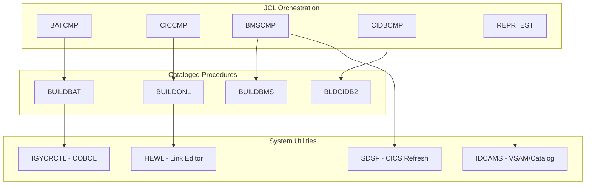

# System Design

*Generated: 2026-01-24 15:20:30*
*Review Cycle: 5*

## 1. Executive Summary
The system serves as a comprehensive Build and Maintenance Framework for the **CardDemo** application, a mainframe-based credit card management system. Its primary purpose is to automate the compilation, linkage, and deployment of various mainframe artifacts, including Batch COBOL programs, Online CICS transactions, DB2-integrated modules, and BMS (Basic Mapping Support) screens. By providing a standardized set of JCL procedures, the system ensures consistent environment configurations across the AWS Mainframe Modernization platform.

Key business functions served include the automated refresh of CICS resources (Newcopy), the management of VSAM datasets for transaction records, and the maintenance of security profiles via RACF. For example, when a developer updates a credit card transaction screen, this system handles the assembly of the map, the compilation of the underlying COBOL logic, and the notification to the CICS region to use the updated executable.

The technology stack is centered on IBM Mainframe standards, utilizing **COBOL (Enterprise V6)**, **Assembler (ASMA90)**, **CICS TS**, **DB2**, and **VSAM**. It leverages standard system utilities such as **IDCAMS** for file management, **IGYCRCTL** for compilation, and **IKJEFT01** for TSO/RACF command execution.

The system boundaries interface with the AWS M2 environment (High-Level Qualifier `AWS.M2`), CICS regions (specifically `CICSAWSA`), and DB2 subsystems (SSID `DAZ1`). It acts as the bridge between source code repositories and the operational runtime environment.

## 2. Architecture Overview
The system follows a **Modular Build Pipeline** architectural pattern. It is structured into two primary layers:
1.  **Orchestration Layer (JCL)**: High-level jobs that define specific execution parameters (member names, libraries, DB2 plans).
2.  **Functional Layer (PROCs)**: Reusable cataloged procedures that encapsulate the complex logic of compilation, pre-compilation, and link-editing.

### Integration Patterns
-   **Batch Processing**: Heavy use of JCL and Cataloged Procedures for lifecycle management.
-   **Online Integration**: Automated CICS resource updates using SDSF batch commands to issue `CEMT` transactions.
-   **Database Integration**: DB2 pre-compilation and BIND processes integrated into the build stream for CICS-DB2 programs.
-   **Security Integration**: Direct manipulation of RACF profiles to manage user access and transaction permissions.

### Component Relationship Diagram

## 3. Component Catalog

| Component | Type | Purpose | Dependencies | Doc Link |
|-----------|------|---------|--------------|----------|
| [BUILDBAT](docs/proc/BUILDBAT.doc.json) | PROC | Compiles/Links Batch COBOL | IGYCRCTL, HEWL | [Link](docs/proc/BUILDBAT.doc.json) |
| [BUILDBMS](docs/proc/BUILDBMS.doc.json) | PROC | Assembles BMS Maps & DSECTs | ASMA90, HEWL | [Link](docs/proc/BUILDBMS.doc.json) |
| [BUILDONL](docs/proc/BUILDONL.doc.json) | PROC | Compiles/Links CICS COBOL | IGYCRCTL, DFHEILID | [Link](docs/proc/BUILDONL.doc.json) |
| [BLDCIDB2](docs/proc/BLDCIDB2.doc.json) | PROC | DB2 Precompile/Compile/Bind | DSNHPC, IGYCRCTL | [Link](docs/proc/BLDCIDB2.doc.json) |
| [BATCMP](docs/jcl/BATCMP.doc.json) | JCL | Orchestrates Batch Build | [BUILDBAT](docs/proc/BUILDBAT.doc.json) | [Link](docs/jcl/BATCMP.doc.json) |
| [BMSCMP](docs/jcl/BMSCMP.doc.json) | JCL | Orchestrates BMS Build/Refresh | [BUILDBMS](docs/proc/BUILDBMS.doc.json), SDSF | [Link](docs/jcl/BMSCMP.doc.json) |
| [CICCMP](docs/jcl/CICCMP.doc.json) | JCL | Orchestrates CICS Build/Refresh | [BUILDONL](docs/proc/BUILDONL.doc.json), SDSF | [Link](docs/jcl/CICCMP.doc.json) |
| [CICDBCMP](docs/jcl/CICDBCMP.doc.json) | JCL | Orchestrates CICS-DB2 Build | [BLDCIDB2](docs/proc/BLDCIDB2.doc.json) | [Link](docs/jcl/CICDBCMP.doc.json) |
| [IMSMQCMP](docs/jcl/IMSMQCMP.doc.json) | JCL | CICS/IMS/MQ Integrated Build | DFHECP1$, IGYCRCTL | [Link](docs/jcl/IMSMQCMP.doc.json) |
| [LISTCAT](docs/jcl/LISTCAT.doc.json) | JCL | Catalog Inventory Utility | IDCAMS, IEFBR14 | [Link](docs/jcl/LISTCAT.doc.json) |
| [RACFCMDS](docs/jcl/RACFCMDS.doc.json) | JCL | Security Profile Management | IKJEFT01 | [Link](docs/jcl/RACFCMDS.doc.json) |
| [REPRTEST](docs/jcl/REPRTEST.doc.json) | JCL | VSAM Backup (REPRO) | IDCAMS | [Link](docs/jcl/REPRTEST.doc.json) |
| [SORTTEST](docs/jcl/SORTTEST.doc.json) | JCL | Data Filtering/Sorting Test | SORT | [Link](docs/jcl/SORTTEST.doc.json) |

## 4. Subsystem Breakdown

### 4.1 Build & Deployment Subsystem
This subsystem handles the transformation of source code into executable modules.
- **Batch Build**: Uses [BATCMP](docs/jcl/BATCMP.doc.json) and [BUILDBAT](docs/proc/BUILDBAT.doc.json) to generate standard load modules.
- **Online Build**: Uses [CICCMP](docs/jcl/CICCMP.doc.json) and [BUILDONL](docs/proc/BUILDONL.doc.json). It includes a post-linkage step to refresh the CICS region using `NEWCOPY`.
- **Screen Management**: [BMSCMP](docs/jcl/BMSCMP.doc.json) and [BUILDBMS](docs/proc/BUILDBMS.doc.json) manage the dual-output nature of BMS (Physical maps for CICS and Symbolic maps/Copybooks for COBOL).
- **Database Programs**: [CICDBCMP](docs/jcl/CICDBCMP.doc.json) manages the complex 4-step process of DB2 pre-compilation, compilation, link-editing, and BINDing the DBRM to a plan.

### 4.2 Data Management Subsystem
Responsible for the integrity and lifecycle of the CardDemo data files.
- **Backup/Recovery**: [REPRTEST](docs/jcl/REPRTEST.doc.json) utilizes IDCAMS REPRO to create Generation Data Group (GDG) backups of the transaction KSDS.
- **Data Analysis**: [SORTTEST](docs/jcl/SORTTEST.doc.json) provides a template for filtering transaction data based on specific business dates (e.g., '2022-06-02').
- **Inventory**: [LISTCAT](docs/jcl/LISTCAT.doc.json) provides visibility into the allocated datasets under the `AWS.M2.CARDDEMO` qualifier.

### 4.3 Security & Administration Subsystem
- **Access Control**: [RACFCMDS](docs/jcl/RACFCMDS.doc.json) automates the granting of permissions, such as connecting users to the `M2APPDEV` group and defining CICS transaction profiles.

## 5. Data Architecture
The system interacts with several data formats:
- **VSAM KSDS**: The primary storage for CardDemo transactions (`AWS.M2.CARDDEMO.TRANSACT.VSAM.KSDS`).
- **Sequential Files**: Used for backups (`BKUP(+1)`) and temporary compiler work files.
- **PDS/PDSE**: Libraries for Source code, Copybooks, Object modules, and Load modules.
- **DBRM (Database Request Modules)**: Intermediate files produced by the DB2 pre-compiler, stored in `DBRMLIB`.

❓ QUESTION: Are there specific retention policies for the GDG backups created in [REPRTEST](docs/jcl/REPRTEST.doc.json)?

## 6. Integration Points
- **CICS Interface**: The system integrates with CICS via SDSF batch commands. It issues `MODIFY` commands to the `CICSAWSA` region to execute `CEMT` transactions.
- **DB2 Interface**: Integration is handled via the `DSNHPC` pre-compiler and the `BIND` command executed within the [BLDCIDB2](docs/proc/BLDCIDB2.doc.json) procedure.
- **External Scheduler**: While not explicitly documented, the use of GDGs and standardized JCL suggests integration with a batch scheduler (e.g., Control-M or IWS).

## 7. Business Rules Summary
- **Compilation Integrity**: A load module must only be created if the compilation return code is less than 8 ([BUILDBAT](docs/proc/BUILDBAT.doc.json)).
- **Environment Consistency**: All CardDemo components must use the `AWS.M2` High-Level Qualifier to ensure environment isolation.
- **Security Compliance**: New transactions (e.g., `CT02`) must be explicitly added to the `GCICSTRN` RACF profile before use ([RACFCMDS](docs/jcl/RACFCMDS.doc.json)).
- **Data Validation**: Sorting and filtering of transaction data must use standardized field offsets (e.g., Card Number at position 1, Process Date at position 50) as defined in [SORTTEST](docs/jcl/SORTTEST.doc.json).

## 8. Error Handling Patterns
- **Conditional Execution**: Use of `COND=(8,LT)` or `IF/THEN/ELSE` constructs in JCL to prevent link-editing of failed compilations.
- **Cleanup Steps**: Procedures like [BUILDBMS](docs/proc/BUILDBMS.doc.json) include `DELTEMP` steps to ensure work datasets are removed regardless of prior step success.
- **Logging**: All compiler listings and utility outputs are routed to `SYSOUT=*` for centralized review in the spool.

## 9. Open Questions and Uncertainties
- ❓ QUESTION: The [IMSMQCMP](docs/jcl/IMSMQCMP.doc.json) JCL contains several commented-out sections. Are these intended for a specific environment (e.g., Production vs. UAT)?
- ❓ QUESTION: Is there a reason [SORTTEST](docs/jcl/SORTTEST.doc.json) comments out the persistent output dataset? Is this strictly for ad-hoc validation?
- ❓ QUESTION: What is the specific purpose of the `DFHEILID` module copied in [BUILDONL](docs/proc/BUILDONL.doc.json)? Is it a site-specific CICS stub?
- ❓ QUESTION: The [LISTCAT](docs/jcl/LISTCAT.doc.json) job deletes the output dataset before recreating it. Is there a risk of losing historical inventory logs?