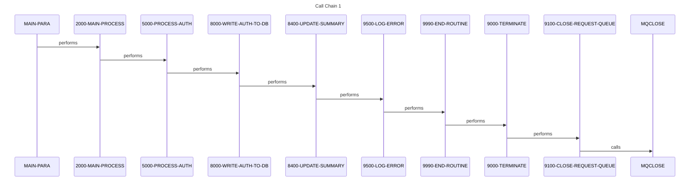
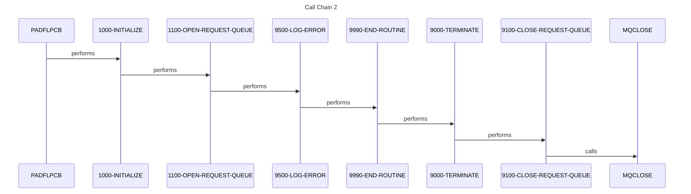
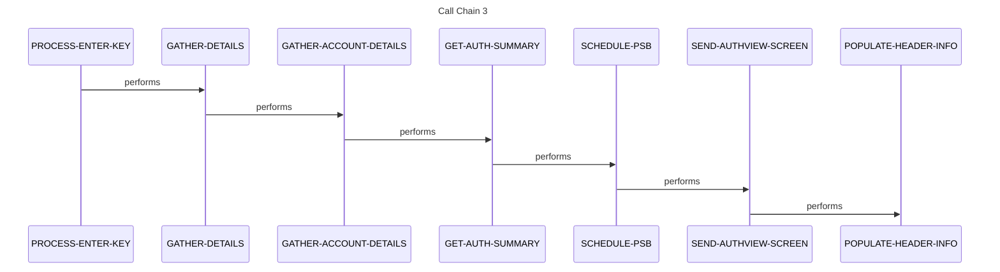
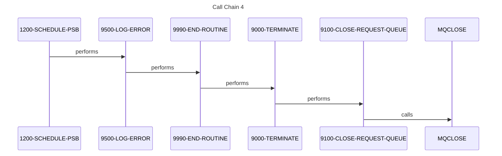
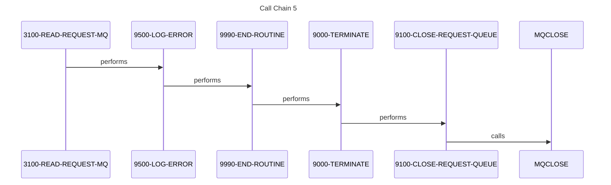

# System Design

*Generated: 2026-01-26 14:19:16*

## 1. Executive Summary

The Credit Card Authorization and Fraud Management System is a mission-critical financial processing platform designed to handle the end-to-end lifecycle of credit card transaction authorizations. Its primary purpose is to provide a robust, high-availability environment where transaction requests can be validated against account balances, customer profiles, and fraud risk parameters in real-time and batch modes. The system serves financial institutions, customer service representatives, and fraud analysts who require immediate access to transaction history and the ability to flag suspicious activity.

Functionally, the system manages several key workflows, including the ingestion of authorization requests via IBM MQ, the validation of these requests against IMS hierarchical databases, and the maintenance of transaction summaries. It provides online interfaces for users to view authorization lists, drill down into specific transaction details, and update the fraud status of individual records. The system also includes comprehensive batch utilities for database maintenance, such as unloading and loading IMS segments to ensure data integrity and performance. Key transactions involve reading cross-reference records, account data, and customer profiles to make informed "approve/decline" decisions.

The technical foundation of the system is built on a classic mainframe stack, utilizing COBOL for business logic and JCL for batch orchestration. Data persistence is managed through IMS (Information Management System) databases, utilizing both Full Function databases and GSAM (Generalized Sequential Access Method) for sequential processing. Online interactions are powered by CICS and BMS (Basic Mapping Support) for screen definition, while inter-system communication is facilitated through IBM MQ for asynchronous messaging. The integration of these technologies allows for high-throughput processing and reliable data consistency across different storage mediums.

System boundaries are clearly defined by its inputs and outputs, which include MQ message queues for incoming requests and outgoing responses, and VSAM files for cross-referencing account and customer data. It integrates with external fraud detection modules and provides data extracts for downstream reporting systems. The system acts as a central hub between the point-of-sale (POS) entry points and the core banking ledgers.

The business value of this system is immense, as it directly supports the organization's revenue generation by enabling secure credit card transactions while simultaneously protecting against financial loss through fraud detection. If this system were to become unavailable, the organization would face significant reputational damage, immediate financial loss from unprocessed transactions, and increased exposure to fraudulent activity. It supports critical business metrics such as transaction approval rates, fraud detection accuracy, and system response latency, which are vital for maintaining customer trust and regulatory compliance.

## 2. Architecture Overview

The system follows a multi-tier architectural pattern common in mainframe environments, separating the presentation layer (BMS/CICS), the application logic layer (COBOL), and the data persistence layer (IMS/VSAM). 

### Integration Patterns
- **Batch Processing**: Heavy use of JCL to orchestrate IMS database utilities (Unload/Load) and sequential file processing.
- **Online Transaction Processing (OLTP)**: CICS-based programs handling real-time screen interactions and MQ message processing.
- **Messaging**: IBM MQ is used for asynchronous request/response handling, allowing the system to decouple from external requestors.
- **Database Access**: Standard DL/I (Data Language Interface) calls via `CBLTDLI` are used to navigate IMS hierarchies.

### Actual System Call Graph

```mermaid
flowchart TD

    subgraph jobs[" "]
        DBPAUTP0([DBPAUTP0])
        UNLDPADB([UNLDPADB])
    end

    subgraph procs[" "]
        CBPAUP0C[CBPAUP0C]
        COPAUA0C[COPAUA0C]
        COPAUS0C[COPAUS0C]
        COPAUS1C[COPAUS1C]
        COPAUS2C[/COPAUS2C/]
        DBUNLDGS[DBUNLDGS]
        PAUDBLOD[PAUDBLOD]
        PAUDBUNL[PAUDBUNL]
    end

    subgraph external[" "]
        CBLTDLI>CBLTDLI]
        CDEMO_TO_PROGRAM>CDEMO-TO-PROGRAM]
        DFSRRC00>DFSRRC00]
        MQCLOSE>MQCLOSE]
        MQGET>MQGET]
        MQOPEN>MQOPEN]
        MQPUT1>MQPUT1]
        WS_PGM_AUTH_FRAUD>WS-PGM-AUTH-FRAUD]
    end

    %% Call relationships
    CBPAUP0C --> PAUDBUNL
    CBPAUP0C --> PAUDBUNL
    CBPAUP0C --> PAUDBUNL
    COPAUA0C --> COPAUA0C
    COPAUA0C --> COPAUA0C
    COPAUA0C --> COPAUA0C
    COPAUA0C --> COPAUA0C
    COPAUA0C --> COPAUA0C
    COPAUA0C --> COPAUA0C
    COPAUA0C --> COPAUA0C
    COPAUA0C --> COPAUA0C
    COPAUA0C --> COPAUA0C
    COPAUA0C --> COPAUA0C
    COPAUA0C --> COPAUA0C
    COPAUA0C --> COPAUA0C
    COPAUA0C --> COPAUA0C
    COPAUA0C --> COPAUA0C
    COPAUA0C --> COPAUA0C
    COPAUA0C --> COPAUA0C
    COPAUA0C --> COPAUA0C
    COPAUA0C --> COPAUA0C
    COPAUA0C --> COPAUA0C
    COPAUA0C --> COPAUA0C
    COPAUA0C --> COPAUA0C
    COPAUA0C --> COPAUA0C
    COPAUA0C --> COPAUA0C
    COPAUA0C --> COPAUA0C
    COPAUA0C --> COPAUA0C
    COPAUA0C --> COPAUA0C
    COPAUA0C --> COPAUA0C
    COPAUA0C --> COPAUA0C
    COPAUA0C --> MQOPEN
    COPAUA0C --> MQGET
    COPAUA0C --> MQPUT1
    COPAUA0C --> MQCLOSE
    COPAUS0C --> PAUDBUNL
    COPAUS0C --> PAUDBLOD
    COPAUS0C --> PAUDBLOD
    COPAUS0C --> PAUDBUNL
    COPAUS0C --> COPAUS2C
    COPAUS0C --> COPAUA0C
    COPAUS0C --> COPAUA0C
    COPAUS0C --> PAUDBUNL
    COPAUS0C --> PAUDBUNL
    COPAUS0C --> CBPAUP0C
    COPAUS0C --> CBPAUP0C
    COPAUS0C --> CBPAUP0C
    COPAUS0C --> CBPAUP0C
    COPAUS0C --> COPAUS0C
    COPAUS0C --> COPAUS0C
    COPAUS0C --> COPAUS1C
    COPAUS0C --> COPAUS1C
    COPAUS0C --> COPAUS1C
    COPAUS0C --> COPAUS0C
    COPAUS0C --> COPAUS1C
    COPAUS0C --> COPAUS1C
    COPAUS0C --> COPAUS1C
    COPAUS0C --> COPAUS1C
    COPAUS0C --> COPAUS1C
    COPAUS0C --> COPAUS1C
    COPAUS0C --> COPAUS1C
    COPAUS0C --> COPAUS1C
    COPAUS0C --> COPAUS0C
    COPAUS0C --> COPAUS0C
    COPAUS0C --> COPAUS0C
    COPAUS0C --> COPAUS0C
    COPAUS0C --> COPAUS0C
    COPAUS0C --> COPAUS0C
    COPAUS0C --> COPAUS0C
    COPAUS0C --> COPAUS0C
    COPAUS0C --> COPAUS0C
    COPAUS0C --> COPAUS0C
    COPAUS0C --> COPAUS0C
    COPAUS0C --> COPAUS0C
    COPAUS0C --> COPAUS0C
    COPAUS0C --> COPAUS0C
    COPAUS0C --> COPAUS0C
    COPAUS0C --> COPAUS0C
    COPAUS0C --> COPAUS0C
    COPAUS0C --> COPAUS0C
    COPAUS0C --> COPAUS0C
    COPAUS0C --> COPAUS0C
    COPAUS0C --> COPAUS0C
    COPAUS0C --> COPAUS0C
    COPAUS0C --> COPAUS0C
    COPAUS0C --> COPAUS0C
    COPAUS0C --> COPAUS0C
    COPAUS0C --> COPAUS0C
    COPAUS0C --> COPAUS0C
    COPAUS0C --> COPAUS0C
    COPAUS0C --> COPAUS0C
    COPAUS0C --> COPAUS0C
    COPAUS0C --> COPAUS0C
    COPAUS0C --> CDEMO_TO_PROGRAM
    COPAUS0C --> CDEMO_TO_PROGRAM
    COPAUS0C --> CDEMO_TO_PROGRAM
    COPAUS1C --> COPAUS1C
    COPAUS1C --> COPAUS1C
    COPAUS1C --> COPAUS1C
    COPAUS1C --> COPAUS1C
    COPAUS1C --> COPAUS0C
    COPAUS1C --> COPAUS0C
    COPAUS1C --> COPAUS1C
    COPAUS1C --> COPAUS1C
    COPAUS1C --> COPAUS1C
    COPAUS1C --> COPAUS1C
    COPAUS1C --> COPAUS1C
    COPAUS1C --> WS_PGM_AUTH_FRAUD
    DBPAUTP0 --> DFSRRC00
    DBUNLDGS --> PAUDBUNL
    DBUNLDGS --> PAUDBUNL
    DBUNLDGS --> PAUDBUNL
    DBUNLDGS --> PAUDBUNL
    DBUNLDGS --> PAUDBUNL
    DBUNLDGS --> CBLTDLI
    DBUNLDGS --> CBLTDLI
    PAUDBLOD --> PAUDBLOD
    PAUDBLOD --> PAUDBLOD
    PAUDBLOD --> PAUDBLOD
    PAUDBLOD --> PAUDBUNL
    PAUDBLOD --> CBLTDLI
    PAUDBLOD --> CBLTDLI
    PAUDBLOD --> CBLTDLI
    PAUDBUNL --> PAUDBUNL
    PAUDBUNL --> PAUDBUNL
    PAUDBUNL --> PAUDBUNL
    PAUDBUNL --> COPAUA0C
    PAUDBUNL --> COPAUA0C
    PAUDBUNL --> DBUNLDGS
    PAUDBUNL --> PAUDBUNL
    PAUDBUNL --> DBUNLDGS
    PAUDBUNL --> PAUDBUNL
    PAUDBUNL --> PAUDBUNL
    PAUDBUNL --> CBLTDLI
    PAUDBUNL --> CBLTDLI
    PAUDBUNL --> CBLTDLI
    PAUDBUNL --> CBLTDLI
    UNLDPADB --> DFSRRC00
    UNLDPADB --> DFSRRC00
    UNLDPADB --> DFSRRC00
    UNLDPADB --> DFSRRC00

    %% Styling
    classDef entryPoint fill:#90EE90,stroke:#228B22
    class CBPAUP0J,DBPAUTP0,LOADPADB,UNLDGSAM,UNLDPADB entryPoint
    classDef missing fill:#1E3A5F,stroke:#2E5A8F,color:#FFFFFF
    class CBLTDLI,CDEMO_TO_PROGRAM,DFSRRC00,MQCLOSE,MQGET,MQOPEN,MQPUT1,WS_PGM_AUTH_FRAUD missing
```

## 3. Component Catalog

| Component | Type | Purpose | Dependencies | Doc Link |
|-----------|------|---------|--------------|----------|
| [PAUDBLOD](cbl/PAUDBLOD.md) | COBOL | IMS Database Load Utility | [PAUTBPCB](cpy/PAUTBPCB.md), [IMSFUNCS](cpy/IMSFUNCS.md) | [Link](cbl/PAUDBLOD.md) |
| [COPAUS2C](cbl/COPAUS2C.md) | COBOL | Authorization Detail View | [CIPAUDTY](cpy/CIPAUDTY.md) | [Link](cbl/COPAUS2C.md) |
| [COPAUA0C](cbl/COPAUA0C.md) | COBOL | MQ Authorization Processor | [CCPAURQY](cpy/CCPAURQY.md), [CCPAURLY](cpy/CCPAURLY.md) | [Link](cbl/COPAUA0C.md) |
| [DBUNLDGS](cbl/DBUNLDGS.md) | COBOL | GSAM Unload Utility | [PAUTBPCB](cpy/PAUTBPCB.md), [IMSFUNCS](cpy/IMSFUNCS.md) | [Link](cbl/DBUNLDGS.md) |
| [CBPAUP0C](cbl/CBPAUP0C.md) | COBOL | Batch Authorization Processor | [PAUDBUNL](cbl/PAUDBUNL.md) | [Link](cbl/CBPAUP0C.md) |
| [PAUDBUNL](cbl/PAUDBUNL.md) | COBOL | IMS Database Unload Utility | [PAUTBPCB](cpy/PAUTBPCB.md), [IMSFUNCS](cpy/IMSFUNCS.md) | [Link](cbl/PAUDBUNL.md) |
| [COPAUS1C](cbl/COPAUS1C.md) | COBOL | Fraud Update Controller | [COPAU01](cpy-bms/COPAU01.md) | [Link](cbl/COPAUS1C.md) |
| [COPAUS0C](cbl/COPAUS0C.md) | COBOL | Authorization List Handler | [COPAU00](cpy-bms/COPAU00.md) | [Link](cbl/COPAUS0C.md) |
| [LOADPADB](jcl/LOADPADB.md) | JCL | Job to load Authorization DB | [PAUDBLOD](cbl/PAUDBLOD.md) | [Link](jcl/LOADPADB.md) |
| [UNLDPADB](jcl/UNLDPADB.md) | JCL | Job to unload Authorization DB | [PAUDBUNL](cbl/PAUDBUNL.md) | [Link](jcl/UNLDPADB.md) |
| [DBPAUTP0](jcl/DBPAUTP0.md) | JCL | IMS Database Maintenance Job | [DFSRRC00](external) | [Link](jcl/DBPAUTP0.md) |
| [UNLDGSAM](jcl/UNLDGSAM.md) | JCL | GSAM Unload Job | [DBUNLDGS](cbl/DBUNLDGS.md) | [Link](jcl/UNLDGSAM.md) |
| [CBPAUP0J](jcl/CBPAUP0J.md) | JCL | Batch Authorization Job | [CBPAUP0C](cbl/CBPAUP0C.md) | [Link](jcl/CBPAUP0J.md) |
| [PADFLDBD](ims/PADFLDBD.md) | DBD | Authorization DB Definition | - | [Link](ims/PADFLDBD.md) |
| [PASFLDBD](ims/PASFLDBD.md) | DBD | Summary DB Definition | - | [Link](ims/PASFLDBD.md) |
| [PSBPAUTB](ims/PSBPAUTB.md) | PSB | Batch Processing PSB | - | [Link](ims/PSBPAUTB.md) |
| [PSBPAUTL](ims/PSBPAUTL.md) | PSB | Online Processing PSB | - | [Link](ims/PSBPAUTL.md) |

## 4. Subsystem Breakdown

### Authorization Processing (Online)
Handles real-time requests and user interactions.
- [COPAUA0C](cbl/COPAUA0C.md): The core MQ listener that processes incoming authorization requests.
- [COPAUS0C](cbl/COPAUS0C.md): Provides the list view of authorizations for analysts.
- [COPAUS2C](cbl/COPAUS2C.md): Provides detailed views of specific authorization records.
- [COPAUS1C](cbl/COPAUS1C.md): Manages the update of fraud status for transactions.

### Database Maintenance (Batch)
Ensures the IMS databases are backed up, reorganized, and loaded correctly.
- [PAUDBUNL](cbl/PAUDBUNL.md) & [UNLDPADB](jcl/UNLDPADB.md): Unloads the hierarchical IMS structure to flat files.
- [PAUDBLOD](cbl/PAUDBLOD.md) & [LOADPADB](jcl/LOADPADB.md): Loads data from flat files back into the IMS structure.
- [DBUNLDGS](cbl/DBUNLDGS.md) & [UNLDGSAM](jcl/UNLDGSAM.md): Specialized unload for GSAM databases.

### Shared Services
Common routines and data structures used across the system.
- [IMSFUNCS](cpy/IMSFUNCS.md): Standard DL/I function codes (GU, GN, REPL, etc.).
- [PAUTBPCB](cpy/PAUTBPCB.md): Program Communication Block for Authorization database access.
- [CIPAUDTY](cpy/CIPAUDTY.md): Data structure for Authorization Detail records.

## 5. Data Architecture

### Data Stores
- **IMS Full Function DB**: Stores the primary authorization hierarchy (Root: Summary, Child: Detail). Defined in [PADFLDBD](ims/PADFLDBD.md).
- **IMS GSAM**: Used for sequential logging and batch extracts. Defined in [PASFLDBD](ims/PASFLDBD.md).
- **VSAM KSDS**: Used for Account ([CVACT01Y](cpy/CVACT01Y.md)) and Customer ([CVCUS01Y](cpy/CVCUS01Y.md)) cross-references.
- **IBM MQ Queues**: Transient storage for authorization requests ([CCPAURQY](cpy/CCPAURQY.md)) and replies ([CCPAURLY](cpy/CCPAURLY.md)).

### Data Flow Narrative
1. **Request Ingestion**: [COPAUA0C](cbl/COPAUA0C.md) reads a request from MQ.
2. **Validation**: The program reads Account and Customer VSAM files to verify status.
3. **Decisioning**: Logic in `6000-MAKE-DECISION` determines approval.
4. **Persistence**: The result is written to the IMS Authorization DB via [PAUTBPCB](cpy/PAUTBPCB.md).
5. **Response**: A reply message is sent back via MQ.
6. **Maintenance**: Periodically, [UNLDPADB](jcl/UNLDPADB.md) extracts this data for archival.

## 6. Integration Points

- **External Fraud System**: The system calls `WS-PGM-AUTH-FRAUD` (referenced in [COPAUS1C](cbl/COPAUS1C.md)) to synchronize fraud status updates.
- **CICS Online**: Screens [COPAU00](bms/COPAU00.md) and [COPAU01](bms/COPAU01.md) provide the user interface.
- **MQ Series**: Primary interface for external transaction requestors.

## 7. Business Rules Summary

- **Fraud Flagging**: Users can manually mark an authorization as fraudulent, which triggers an update to the IMS database and an external notification ([COPAUS1C](cbl/COPAUS1C.md)).
- **Authorization Expiry**: Batch processes check for expired authorizations and perform cleanup (`4000-CHECK-IF-EXPIRED` in [CBPAUP0C](cbl/CBPAUP0C.md)).
- **Hierarchical Integrity**: Authorization details cannot exist without a parent summary record in the IMS structure.
- **Decision Logic**: Approvals are based on a combination of account balance, card status (Active/Expired), and customer credit limits.

## 8. Error Handling Patterns

- **Abend Routine**: Most COBOL programs implement a `9999-ABEND` paragraph for catastrophic failures.
- **MQ Error Logging**: [COPAUA0C](cbl/COPAUA0C.md) uses `9500-LOG-ERROR` to capture MQRC (Return Codes) and log them before terminating.
- **IMS Status Codes**: Every DL/I call checks the PCB status code (e.g., 'GE' for not found, ' ' for success).
- **Restartability**: Batch jobs are designed to be restartable by using IMS checkpoints (`9000-TAKE-CHECKPOINT`).

## 9. Open Questions and Uncertainties

- ❓ **QUESTION**: What is the specific logic inside `WS-PGM-AUTH-FRAUD`? Is it a local COBOL program or a remote service call?
- ❓ **QUESTION**: Are there specific latency requirements for the MQ Authorization Processor ([COPAUA0C](cbl/COPAUA0C.md))?
- ❓ **QUESTION**: How are the VSAM files (Account/Customer) synchronized with the core banking system?
- ❓ **QUESTION**: Is there a secondary site for disaster recovery of the IMS databases?

## Flows

The following sequence diagrams illustrate key call sequences identified in the codebase, showing how programs interact during execution.

### Flow 1

### Flow 2

### Flow 3

### Flow 4

### Flow 5

