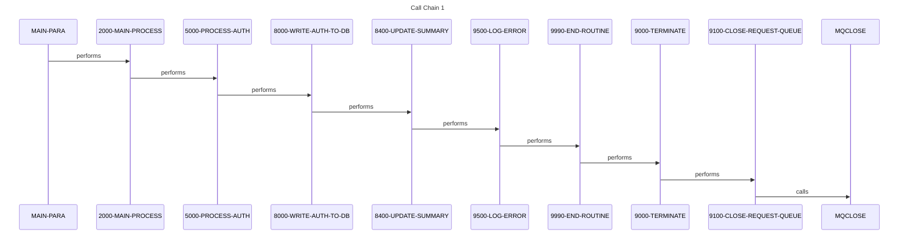
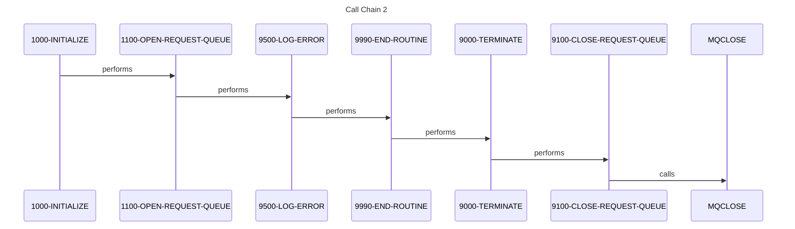
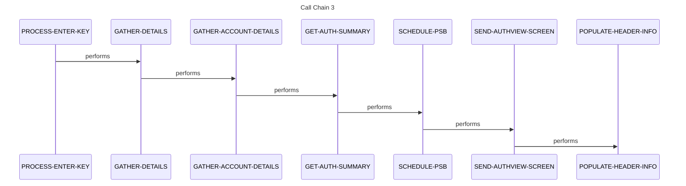
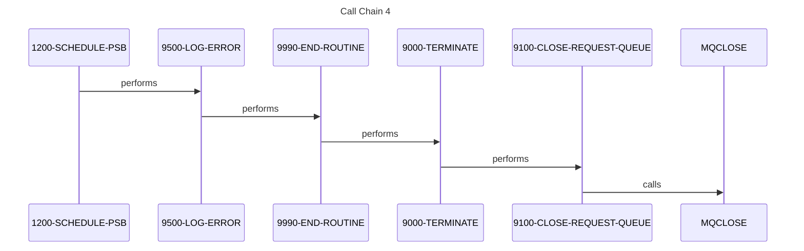
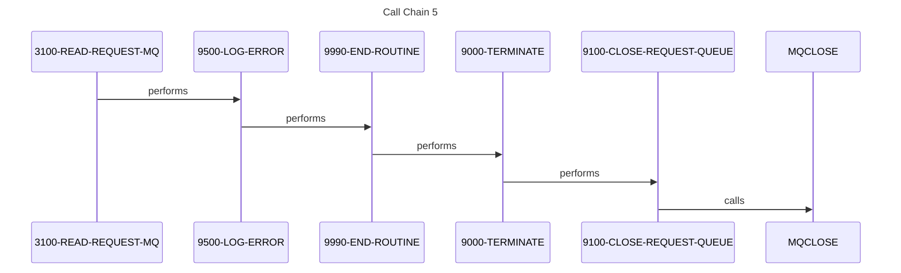

# System Design

*Generated: 2026-01-26 15:10:06*

## 1. Executive Summary

The Credit Card Authorization and Fraud Management System is a mission-critical mainframe application designed to handle the end-to-end lifecycle of credit card transaction authorizations. Its primary purpose is to provide a robust, high-availability platform for processing real-time authorization requests while maintaining a historical audit trail for fraud detection and regulatory compliance. The system serves financial institutions, customer service representatives, and fraud investigators who require immediate access to transaction statuses and the ability to flag suspicious activity. At its core, the system manages the complex relationship between cardholders, accounts, and individual transaction authorizations through a multi-tiered data architecture.

Functional capabilities include real-time message processing via IBM MQ, comprehensive batch database maintenance, and interactive CICS-based online screens for transaction inquiry and fraud marking. The workflow begins with authorization requests arriving through message queues, which are then validated against account and customer cross-reference files before being persisted into IMS hierarchical databases. Key transactions allow users to view detailed authorization summaries, drill down into specific transaction metadata, and update fraud indicators. Batch processes complement these online functions by providing high-speed data loading, unloading, and synchronization between IMS databases and sequential files.

The technical foundation of the system is built on IBM Z/OS technologies, utilizing COBOL as the primary programming language for business logic. Data persistence is managed through IMS (Information Management System) for hierarchical transaction data and VSAM for account and customer cross-references. Integration is achieved through IBM MQ for asynchronous messaging and CICS for the online user interface, with JCL (Job Control Language) orchestrating the batch environment. The system utilizes standard IBM interfaces like CBLTDLI for IMS database communication and DFSRRC00 for batch region execution.

System boundaries are clearly defined by its integration with external payment networks via MQ and its reliance on master account files for validation. Inputs consist of MQ authorization request messages and batch flat files for database initialization, while outputs include MQ response messages, printed reports, and unloaded data files for downstream analytics. The system integrates tightly with the "CardDemo" application suite, sharing common copybooks and navigation routines.

The business value of this system is immense, as it directly supports the revenue-generating authorization path and protects the organization from financial loss through fraud mitigation. If this system were unavailable, the institution would be unable to authorize credit card transactions, leading to immediate customer dissatisfaction and significant financial liability. It supports key business metrics such as transaction success rates, fraud detection accuracy, and system response latency, making it a cornerstone of the organization's financial infrastructure.

## 2. Architecture Overview

The system follows a classic mainframe multi-tier architecture, separating the presentation layer (CICS/BMS), the application logic layer (COBOL), and the data persistence layer (IMS/VSAM). It employs both real-time event-driven patterns via MQ and scheduled batch processing patterns.

### Actual System Call Graph (from static analysis)

```mermaid
flowchart TD

    subgraph jobs[" "]
        DBPAUTP0([DBPAUTP0])
        UNLDPADB([UNLDPADB])
    end

    subgraph procs[" "]
        CBPAUP0C[CBPAUP0C]
        COPAUA0C[COPAUA0C]
        COPAUS0C[COPAUS0C]
        COPAUS1C[COPAUS1C]
        COPAUS2C[/COPAUS2C/]
        DBUNLDGS[DBUNLDGS]
        PAUDBLOD[PAUDBLOD]
        PAUDBUNL[PAUDBUNL]
    end

    subgraph external[" "]
        CBLTDLI>CBLTDLI]
        CDEMO_TO_PROGRAM>CDEMO-TO-PROGRAM]
        DFSRRC00>DFSRRC00]
        MQCLOSE>MQCLOSE]
        MQGET>MQGET]
        MQOPEN>MQOPEN]
        MQPUT1>MQPUT1]
        WS_PGM_AUTH_FRAUD>WS-PGM-AUTH-FRAUD]
    end

    %% Call relationships
    CBPAUP0C --> PAUDBUNL
    CBPAUP0C --> PAUDBUNL
    CBPAUP0C --> PAUDBUNL
    COPAUA0C --> COPAUA0C
    COPAUA0C --> COPAUA0C
    COPAUA0C --> COPAUA0C
    COPAUA0C --> COPAUA0C
    COPAUA0C --> COPAUA0C
    COPAUA0C --> COPAUA0C
    COPAUA0C --> COPAUA0C
    COPAUA0C --> COPAUA0C
    COPAUA0C --> COPAUA0C
    COPAUA0C --> COPAUA0C
    COPAUA0C --> COPAUA0C
    COPAUA0C --> COPAUA0C
    COPAUA0C --> COPAUA0C
    COPAUA0C --> COPAUA0C
    COPAUA0C --> COPAUA0C
    COPAUA0C --> COPAUA0C
    COPAUA0C --> COPAUA0C
    COPAUA0C --> COPAUA0C
    COPAUA0C --> COPAUA0C
    COPAUA0C --> COPAUA0C
    COPAUA0C --> COPAUA0C
    COPAUA0C --> COPAUA0C
    COPAUA0C --> COPAUA0C
    COPAUA0C --> COPAUA0C
    COPAUA0C --> COPAUA0C
    COPAUA0C --> COPAUA0C
    COPAUA0C --> COPAUA0C
    COPAUA0C --> COPAUA0C
    COPAUA0C --> MQOPEN
    COPAUA0C --> MQGET
    COPAUA0C --> MQPUT1
    COPAUA0C --> MQCLOSE
    COPAUS0C --> PAUDBUNL
    COPAUS0C --> PAUDBLOD
    COPAUS0C --> PAUDBLOD
    COPAUS0C --> PAUDBUNL
    COPAUS0C --> COPAUS2C
    COPAUS0C --> COPAUA0C
    COPAUS0C --> COPAUA0C
    COPAUS0C --> PAUDBUNL
    COPAUS0C --> PAUDBUNL
    COPAUS0C --> CBPAUP0C
    COPAUS0C --> CBPAUP0C
    COPAUS0C --> CBPAUP0C
    COPAUS0C --> CBPAUP0C
    COPAUS0C --> COPAUS0C
    COPAUS0C --> COPAUS0C
    COPAUS0C --> COPAUS1C
    COPAUS0C --> COPAUS1C
    COPAUS0C --> COPAUS1C
    COPAUS0C --> COPAUS0C
    COPAUS0C --> COPAUS1C
    COPAUS0C --> COPAUS1C
    COPAUS0C --> COPAUS1C
    COPAUS0C --> COPAUS1C
    COPAUS0C --> COPAUS1C
    COPAUS0C --> COPAUS1C
    COPAUS0C --> COPAUS1C
    COPAUS0C --> COPAUS1C
    COPAUS0C --> COPAUS0C
    COPAUS0C --> COPAUS0C
    COPAUS0C --> COPAUS0C
    COPAUS0C --> COPAUS0C
    COPAUS0C --> COPAUS0C
    COPAUS0C --> COPAUS0C
    COPAUS0C --> COPAUS0C
    COPAUS0C --> COPAUS0C
    COPAUS0C --> COPAUS0C
    COPAUS0C --> COPAUS0C
    COPAUS0C --> COPAUS0C
    COPAUS0C --> COPAUS0C
    COPAUS0C --> COPAUS0C
    COPAUS0C --> COPAUS0C
    COPAUS0C --> COPAUS0C
    COPAUS0C --> COPAUS0C
    COPAUS0C --> COPAUS0C
    COPAUS0C --> COPAUS0C
    COPAUS0C --> COPAUS0C
    COPAUS0C --> COPAUS0C
    COPAUS0C --> COPAUS0C
    COPAUS0C --> COPAUS0C
    COPAUS0C --> COPAUS0C
    COPAUS0C --> COPAUS0C
    COPAUS0C --> COPAUS0C
    COPAUS0C --> COPAUS0C
    COPAUS0C --> COPAUS0C
    COPAUS0C --> COPAUS0C
    COPAUS0C --> COPAUS0C
    COPAUS0C --> COPAUS0C
    COPAUS0C --> COPAUS0C
    COPAUS0C --> CDEMO_TO_PROGRAM
    COPAUS0C --> CDEMO_TO_PROGRAM
    COPAUS0C --> CDEMO_TO_PROGRAM
    COPAUS1C --> COPAUS1C
    COPAUS1C --> COPAUS1C
    COPAUS1C --> COPAUS1C
    COPAUS1C --> COPAUS1C
    COPAUS1C --> COPAUS0C
    COPAUS1C --> COPAUS0C
    COPAUS1C --> COPAUS1C
    COPAUS1C --> COPAUS1C
    COPAUS1C --> COPAUS1C
    COPAUS1C --> COPAUS1C
    COPAUS1C --> COPAUS1C
    COPAUS1C --> WS_PGM_AUTH_FRAUD
    DBPAUTP0 --> DFSRRC00
    DBUNLDGS --> PAUDBUNL
    DBUNLDGS --> PAUDBUNL
    DBUNLDGS --> CBLTDLI
    DBUNLDGS --> CBLTDLI
    PAUDBLOD --> PAUDBLOD
    PAUDBLOD --> PAUDBUNL
    PAUDBLOD --> PAUDBLOD
    PAUDBLOD --> PAUDBLOD
    PAUDBLOD --> PAUDBUNL
    PAUDBLOD --> PAUDBUNL
    PAUDBLOD --> CBLTDLI
    PAUDBLOD --> CBLTDLI
    PAUDBLOD --> CBLTDLI
    PAUDBUNL --> PAUDBUNL
    PAUDBUNL --> COPAUA0C
    PAUDBUNL --> COPAUA0C
    PAUDBUNL --> DBUNLDGS
    PAUDBUNL --> PAUDBUNL
    PAUDBUNL --> PAUDBUNL
    PAUDBUNL --> DBUNLDGS
    PAUDBUNL --> PAUDBUNL
    PAUDBUNL --> CBLTDLI
    PAUDBUNL --> CBLTDLI
    PAUDBUNL --> CBLTDLI
    PAUDBUNL --> CBLTDLI
    UNLDPADB --> DFSRRC00
    UNLDPADB --> DFSRRC00
    UNLDPADB --> DFSRRC00
    UNLDPADB --> DFSRRC00

    %% Styling
    classDef entryPoint fill:#90EE90,stroke:#228B22
    class CBPAUP0J,DBPAUTP0,LOADPADB,UNLDGSAM,UNLDPADB entryPoint
    classDef missing fill:#1E3A5F,stroke:#2E5A8F,color:#FFFFFF
    class CBLTDLI,CDEMO_TO_PROGRAM,DFSRRC00,MQCLOSE,MQGET,MQOPEN,MQPUT1,WS_PGM_AUTH_FRAUD missing
```

## 3. Component Catalog

| Component | Type | Purpose | Dependencies | Doc Link |
|-----------|------|---------|--------------|----------|
| [CBPAUP0C](cbl/CBPAUP0C.md) | COBOL | Batch Authorization Processor | [PAUDBUNL](cbl/PAUDBUNL.md) | [Link](cbl/CBPAUP0C.md) |
| [CBPAUP0J](jcl/CBPAUP0J.md) | JCL | Job to run Authorization Processor | [CBPAUP0C](cbl/CBPAUP0C.md) | [Link](jcl/CBPAUP0J.md) |
| [COPAUA0C](cbl/COPAUA0C.md) | COBOL | MQ Authorization Request Handler | MQSeries, IMS | [Link](cbl/COPAUA0C.md) |
| [COPAUS0C](cbl/COPAUS0C.md) | COBOL | Authorization List Online Screen | CICS, IMS | [Link](cbl/COPAUS0C.md) |
| [COPAUS1C](cbl/COPAUS1C.md) | COBOL | Authorization Detail/Fraud Screen | CICS, IMS | [Link](cbl/COPAUS1C.md) |
| [COPAUS2C](cbl/COPAUS2C.md) | COBOL | Authorization Summary Utility | IMS | [Link](cbl/COPAUS2C.md) |
| [DBPAUTP0](jcl/DBPAUTP0.md) | JCL | IMS Database Utility Job | DFSRRC00 | [Link](jcl/DBPAUTP0.md) |
| [DBUNLDGS](cbl/DBUNLDGS.md) | COBOL | GSAM Database Unload Utility | [PAUDBUNL](cbl/PAUDBUNL.md), CBLTDLI | [Link](cbl/DBUNLDGS.md) |
| [LOADPADB](jcl/LOADPADB.md) | JCL | Load Authorization Database | [PAUDBLOD](cbl/PAUDBLOD.md) | [Link](jcl/LOADPADB.md) |
| [PAUDBLOD](cbl/PAUDBLOD.md) | COBOL | IMS Database Load Program | [PAUDBUNL](cbl/PAUDBUNL.md), CBLTDLI | [Link](cbl/PAUDBLOD.md) |
| [PAUDBUNL](cbl/PAUDBUNL.md) | COBOL | IMS Database Unload Program | [COPAUA0C](cbl/COPAUA0C.md), CBLTDLI | [Link](cbl/PAUDBUNL.md) |
| [UNLDGSAM](jcl/UNLDGSAM.md) | JCL | Unload GSAM Database Job | [DBUNLDGS](cbl/DBUNLDGS.md) | [Link](jcl/UNLDGSAM.md) |
| [UNLDPADB](jcl/UNLDPADB.md) | JCL | Unload Authorization Database Job | DFSRRC00 | [Link](jcl/UNLDPADB.md) |
| [COPAU00](bms/COPAU00.md) | BMS | Authorization List Mapset | - | [Link](bms/COPAU00.md) |
| [COPAU01](bms/COPAU01.md) | BMS | Authorization Detail Mapset | - | [Link](bms/COPAU01.md) |
| [CIPAUDTY](cpy/CIPAUDTY.md) | COPY | Auth Detail Data Structure | - | [Link](cpy/CIPAUDTY.md) |
| [CIPAUSMY](cpy/CIPAUSMY.md) | COPY | Auth Summary Data Structure | - | [Link](cpy/CIPAUSMY.md) |
| [IMSFUNCS](cpy/IMSFUNCS.md) | COPY | IMS Function Codes | - | [Link](cpy/IMSFUNCS.md) |
| [PAUTBPCB](cpy/PAUTBPCB.md) | COPY | IMS PCB Definitions | - | [Link](cpy/PAUTBPCB.md) |
| [PADFLDBD](ims/PADFLDBD.md) | DBD | Auth Database Definition | - | [Link](ims/PADFLDBD.md) |
| [PSBPAUTB](ims/PSBPAUTB.md) | PSB | Auth Batch Program Specification | - | [Link](ims/PSBPAUTB.md) |

## 4. Subsystem Breakdown

### Online Authorization Inquiry (CICS)
This subsystem provides the user interface for managing authorizations.
- **Programs**: [COPAUS0C](cbl/COPAUS0C.md) (List View), [COPAUS1C](cbl/COPAUS1C.md) (Detail View).
- **Maps**: [COPAU00](bms/COPAU00.md), [COPAU01](bms/COPAU01.md).
- **Workflow**: Users enter the system to view a list of authorizations for a specific account. They can select a transaction to view details or mark it as fraudulent.

### Real-time Message Processing (MQ)
Handles incoming authorization requests from external sources.
- **Programs**: [COPAUA0C](cbl/COPAUA0C.md).
- **Workflow**: Listens on a request queue, validates the request against account/customer files, updates the IMS database, and sends a response message.

### Database Maintenance (Batch)
Provides utilities for high-volume data movement and database health.
- **Programs**: [PAUDBLOD](cbl/PAUDBLOD.md), [PAUDBUNL](cbl/PAUDBUNL.md), [DBUNLDGS](cbl/DBUNLDGS.md).
- **Jobs**: [LOADPADB](jcl/LOADPADB.md), [UNLDPADB](jcl/UNLDPADB.md), [UNLDGSAM](jcl/UNLDGSAM.md).
- **Workflow**: Sequential files are loaded into IMS segments or unloaded for backup and reporting.

## 5. Data Architecture

The system utilizes a hierarchical data model implemented in IMS DB, supplemented by VSAM files for cross-referencing.

### Data Stores
- **IMS Database (PADFLDBD)**: Stores the primary authorization records.
  - **Root Segment**: Authorization Summary ([CIPAUSMY](cpy/CIPAUSMY.md)).
  - **Child Segment**: Authorization Detail ([CIPAUDTY](cpy/CIPAUDTY.md)).
- **VSAM Files**:
  - **Account Master**: Account-level details.
  - **Customer Master**: Customer-level details.
  - **Card XREF**: Maps card numbers to account numbers.
- **GSAM Database**: Used for sequential processing within IMS batch regions.

### Data Flow Narrative
1. **Input**: An MQ message arrives containing a card number and transaction amount.
2. **Validation**: [COPAUA0C](cbl/COPAUA0C.md) reads the Card XREF VSAM to find the account, then checks the Account Master for status and limits.
3. **Persistence**: If valid, a new segment is inserted into the IMS `PADFLDBD` database using `CBLTDLI`.
4. **Reporting**: Batch jobs like [UNLDPADB](jcl/UNLDPADB.md) extract these segments into flat files for downstream processing.

## 6. Integration Points

- **IBM MQ**: The primary interface for real-time transactions. Uses `MQGET` for requests and `MQPUT1` for responses.
- **CICS**: The hosting environment for online screens, utilizing `EXEC CICS` commands for screen I/O and program linking.
- **IMS DB**: Accessed via the `CBLTDLI` interface using standard function codes (GU, GN, ISRT, REPL) defined in [IMSFUNCS](cpy/IMSFUNCS.md).
- **External Fraud System**: Referenced via `WS-PGM-AUTH-FRAUD` in [COPAUS1C](cbl/COPAUS1C.md).

## 7. Business Rules Summary

- **Authorization Validation**: Requests must be cross-referenced against a valid card-to-account mapping before processing.
- **Fraud Marking**: Only authorized users can update the fraud flag on a transaction detail record.
- **Hierarchical Integrity**: Authorization details cannot exist without a corresponding summary root segment in the IMS database.
- **Pagination**: Online list views must support forward (PF8) and backward (PF7) scrolling through transaction history.

## 8. Error Handling Patterns

- **Abend Routine**: Programs utilize a centralized `9999-ABEND` or `9500-LOG-ERROR` routine to capture failure context.
- **IMS Status Codes**: Every `CBLTDLI` call is followed by a check of the PCB status code (e.g., 'GE' for not found).
- **MQ Completion Codes**: MQ calls check `MQCC` and `MQRC` to handle queue depth or connection issues.
- **CICS Syncpoints**: Online updates use `TAKE-SYNCPOINT` and `ROLL-BACK` to ensure UOW (Unit of Work) integrity.

## 9. Open Questions and Uncertainties

- ❓ **QUESTION**: What is the specific logic inside `WS-PGM-AUTH-FRAUD`? Is it a scoring engine or a simple flag update?
- ❓ **QUESTION**: Are there specific retention policies for the IMS authorization segments before they are purged or archived?
- ❓ **QUESTION**: The call graph shows `COPAUA0C` calling itself recursively; is this a genuine recursive logic or a static analysis artifact?
- ❓ **QUESTION**: What external system populates the initial VSAM Account and Customer master files?

## External Dependencies

### Missing Custom Programs

| Program | Called By | Call Type |
|---------|-----------|-----------|
| CBLTDLI | [PAUDBLOD](cbl/PAUDBLOD.md) | EXEC |
| CDEMO-TO-PROGRAM | [COPAUS0C](cbl/COPAUS0C.md) | EXEC |
| DFSRRC00 | [DBPAUTP0](jcl/DBPAUTP0.md) | EXEC |
| MQOPEN/GET/PUT | [COPAUA0C](cbl/COPAUA0C.md) | EXEC |
| WS-PGM-AUTH-FRAUD | [COPAUS1C](cbl/COPAUS1C.md) | EXEC |

## Flows

The following sequence diagrams illustrate key call sequences identified in the codebase, showing how programs interact during execution.

### Flow 1

### Flow 2

### Flow 3

### Flow 4

### Flow 5

