# COPAUA0C

**File**: `cbl/.specter_build_COPAUA0C/COPAUA0C.mock.cbl`
**Type**: FileType.COBOL
**Analyzed**: 2026-04-21 13:50:41.652890

## Purpose

This COBOL program, COPAUA0C, is part of the CardDemo application and serves as a card authorization decision program. It appears to be designed for a CICS environment and interacts with IMS and MQ. The program utilizes a mock file for testing purposes.

**Business Context**: Card authorization within the CardDemo application.

## Inputs

| Name | Type | Description |
|------|------|-------------|
| MOCK-FILE | IOType.FILE_SEQUENTIAL | Mock data for testing the card authorization logic. |

## Paragraphs/Procedures

### MAIN-PARA
> [Source: MAIN-PARA.cbl.md](COPAUA0C.mock.cbl.d/MAIN-PARA.cbl.md)

```
MAIN-PARA  (13 statements, depth=1)
PARAGRAPH
├── OPEN: OPEN INPUT MOCK-FILE
├── DISPLAY: DISPLAY 'SPECTER-TRACE:MAIN-PARA'
├── DISPLAY: DISPLAY 'SPECTER-CALL:FROM=MAIN-PARA:TO=1000-INITIALIZE'
├── PERFORM_THRU: PERFORM 1000-INITIALIZE    THRU 1000-EXIT
├── DISPLAY: DISPLAY 'SPECTER-CALL:FROM=MAIN-PARA:TO=2000-MAIN-PROCESS'
├── PERFORM_THRU: PERFORM 2000-MAIN-PROCESS  THRU 2000-EXIT
├── DISPLAY: DISPLAY 'SPECTER-CALL:FROM=MAIN-PARA:TO=9000-TERMINATE'
├── PERFORM_THRU: PERFORM 9000-TERMINATE     THRU 9000-EXIT
├── DISPLAY: DISPLAY 'SPECTER-MOCK:CICS-RETURN'
├── READ: READ MOCK-FILE INTO MOCK-RECORD
AT END
├── MOVE: MOVE '00' TO MOCK-ALPHA-STATUS
├── MOVE: MOVE 0 TO MOCK-NUM-STATUS
END-READ
└── CONTINUE: CONTINUE
```
This is the main control paragraph of the program. It opens the MOCK-FILE, then calls 1000-INITIALIZE, 2000-MAIN-PROCESS, and 9000-TERMINATE in sequence to perform the program's core functions. After these calls, it attempts to read a record from MOCK-FILE and moves values to MOCK-ALPHA-STATUS and MOCK-NUM-STATUS based on the read status. The paragraph simulates a CICS RETURN using a DISPLAY statement. It reads the MOCK-FILE to simulate external calls.

### 1000-INITIALIZE
> [Source: 1000-INITIALIZE.cbl.md](COPAUA0C.mock.cbl.d/1000-INITIALIZE.cbl.md)

```
1000-INITIALIZE  (13 statements, depth=2)
PARAGRAPH
├── DISPLAY: DISPLAY 'SPECTER-TRACE:1000-INITIALIZE'
├── DISPLAY: DISPLAY 'SPECTER-MOCK:CICS'
├── READ: READ MOCK-FILE INTO MOCK-RECORD
AT END
├── MOVE: MOVE '00' TO MOCK-ALPHA-STATUS
├── MOVE: MOVE 0 TO MOCK-NUM-STATUS
END-READ
├── IF: IF WS-RESP-CD = 0
│   ├── MOVE: MOVE WS-REQUEST-QNAME       TO WS-REQUEST-QNAME
│   └── MOVE: MOVE SPACES                 TO WS-TRIGGER-DATA
├── MOVE: MOVE 5000                       TO WS-WAIT-INTERVAL
├── DISPLAY: DISPLAY 'SPECTER-CALL:FROM=1000-INITIALIZE:TO=1100-OPEN-REQ'
├── PERFORM_THRU: PERFORM 1100-OPEN-REQUEST-QUEUE THRU 1100-EXIT
├── DISPLAY: DISPLAY 'SPECTER-CALL:FROM=1000-INITIALIZE:TO=3100-READ-REQ'
└── PERFORM_THRU: PERFORM 3100-READ-REQUEST-MQ    THRU 3100-EXIT
```
This paragraph performs initialization tasks. It simulates a CICS RETRIEVE command using a DISPLAY statement and reads a record from MOCK-FILE, moving values to MOCK-ALPHA-STATUS and MOCK-NUM-STATUS based on the read status. It checks WS-RESP-CD and moves WS-REQUEST-QNAME to itself and spaces to WS-TRIGGER-DATA if WS-RESP-CD is 0. It sets WS-WAIT-INTERVAL to 5000. Finally, it calls 1100-OPEN-REQUEST-QUEUE and 3100-READ-REQUEST-MQ to open the request queue and read a request message, respectively. The paragraph uses mock data from MOCK-FILE to simulate CICS and MQSeries interactions.

### 1000-EXIT
> [Source: 1000-EXIT.cbl.md](COPAUA0C.mock.cbl.d/1000-EXIT.cbl.md)

```
1000-EXIT  (2 statements, depth=1)
PARAGRAPH
├── DISPLAY: DISPLAY 'SPECTER-TRACE:1000-EXIT'
└── EXIT: EXIT
```
This paragraph serves as the exit point for the 1000-INITIALIZE paragraph. It contains a DISPLAY statement for tracing and an EXIT statement to return control to the calling paragraph.

### 1100-OPEN-REQUEST-QUEUE
> [Source: 1100-OPEN-REQUEST-QUEUE.cbl.md](COPAUA0C.mock.cbl.d/1100-OPEN-REQUEST-QUEUE.cbl.md)

```
1100-OPEN-REQUEST-QUEUE  (21 statements, depth=3)
PARAGRAPH
├── DISPLAY: DISPLAY 'SPECTER-TRACE:1100-OPEN-REQUEST-QUEUE'
├── MOVE: MOVE 1                  TO MQOD-OBJECTTYPE
├── MOVE: MOVE WS-REQUEST-QNAME   TO MQOD-OBJECTNAME
├── COMPUTE: COMPUTE WS-OPTIONS = 2048
├── DISPLAY: DISPLAY 'SPECTER-MOCK:CALL:MQOPEN'
├── READ: READ MOCK-FILE INTO MOCK-RECORD
AT END
├── MOVE: MOVE 0 TO MOCK-NUM-STATUS
END-READ
├── MOVE: MOVE MOCK-NUM-STATUS TO RETURN-CODE
└── IF: IF WS-COMPCODE = 0
    ├── SET: SET WS-REQUEST-MQ-OPEN TO TRUE
    └── ELSE: ELSE
        ├── MOVE: MOVE 'M001'          TO ERR-LOCATION
        ├── SET: SET  ERR-CRITICAL    TO TRUE
        ├── SET: SET  ERR-MQ          TO TRUE
        ├── MOVE: MOVE WS-COMPCODE     TO WS-CODE-DISPLAY
        ├── MOVE: MOVE WS-CODE-DISPLAY TO ERR-CODE-1
        ├── MOVE: MOVE WS-REASON       TO WS-CODE-DISPLAY
        ├── MOVE: MOVE WS-CODE-DISPLAY TO ERR-CODE-2
        ├── MOVE: MOVE 'REQ MQ OPEN ERROR'
TO ERR-MESSAGE
        ├── DISPLAY: DISPLAY 'SPECTER-CALL:FROM=1100-OPEN-REQUEST-QUEUE:TO=9500-'
        └── PERFORM: PERFORM 9500-LOG-ERROR
```
This paragraph simulates opening a request queue. It moves 1 to MQOD-OBJECTTYPE and WS-REQUEST-QNAME to MQOD-OBJECTNAME. It computes WS-OPTIONS as 2048. It simulates a MQOPEN call using a DISPLAY statement and reads a record from MOCK-FILE, moving the value of MOCK-NUM-STATUS to RETURN-CODE. If WS-COMPCODE is 0, it sets WS-REQUEST-MQ-OPEN to TRUE; otherwise, it sets error flags and calls 9500-LOG-ERROR to log the error. The paragraph uses mock data from MOCK-FILE to simulate MQSeries interactions and sets error codes based on simulated MQSeries responses.

### 1100-EXIT
> [Source: 1100-EXIT.cbl.md](COPAUA0C.mock.cbl.d/1100-EXIT.cbl.md)

```
1100-EXIT  (2 statements, depth=1)
PARAGRAPH
├── DISPLAY: DISPLAY 'SPECTER-TRACE:1100-EXIT'
└── EXIT: EXIT
```
This paragraph serves as the exit point for the 1100-OPEN-REQUEST-QUEUE paragraph. It contains a DISPLAY statement for tracing and an EXIT statement to return control to the calling paragraph.

### 1200-SCHEDULE-PSB
> [Source: 1200-SCHEDULE-PSB.cbl.md](COPAUA0C.mock.cbl.d/1200-SCHEDULE-PSB.cbl.md)

```
1200-SCHEDULE-PSB  (26 statements, depth=3)
PARAGRAPH
├── DISPLAY: DISPLAY 'SPECTER-TRACE:1200-SCHEDULE-PSB'
├── DISPLAY: DISPLAY 'SPECTER-MOCK:DLI-SCHD'
├── READ: READ MOCK-FILE INTO MOCK-RECORD
AT END
├── MOVE: MOVE '  ' TO MOCK-ALPHA-STATUS
├── MOVE: MOVE 0 TO MOCK-NUM-STATUS
END-READ
├── MOVE: MOVE MOCK-ALPHA-STATUS TO DIBSTAT
├── MOVE: MOVE DIBSTAT        TO IMS-RETURN-CODE
├── IF: IF PSB-SCHEDULED-MORE-THAN-ONCE
│   ├── DISPLAY: DISPLAY 'SPECTER-MOCK:DLI-TERM'
│   ├── CONTINUE: CONTINUE
│   ├── DISPLAY: DISPLAY 'SPECTER-MOCK:DLI-SCHD'
│   ├── READ: READ MOCK-FILE INTO MOCK-RECORD
AT END
│   ├── MOVE: MOVE '  ' TO MOCK-ALPHA-STATUS
│   ├── MOVE: MOVE 0 TO MOCK-NUM-STATUS
END-READ
│   ├── MOVE: MOVE MOCK-ALPHA-STATUS TO DIBSTAT
│   └── MOVE: MOVE DIBSTAT     TO IMS-RETURN-CODE
└── IF: IF STATUS-OK
    ├── SET: SET IMS-PSB-SCHD           TO TRUE
    └── ELSE: ELSE
        ├── MOVE: MOVE 'I001'                TO ERR-LOCATION
        ├── SET: SET  ERR-CRITICAL          TO TRUE
        ├── SET: SET  ERR-IMS               TO TRUE
        ├── MOVE: MOVE IMS-RETURN-CODE       TO ERR-CODE-1
        ├── MOVE: MOVE 'IMS SCHD FAILED'     TO ERR-MESSAGE
        ├── DISPLAY: DISPLAY 'SPECTER-CALL:FROM=1200-SCHEDULE-PSB:TO=9500-LOG-ER'
        └── PERFORM: PERFORM 9500-LOG-ERROR
```
This paragraph simulates scheduling a PSB (Program Specification Block) in IMS. It simulates a DLI SCHD call using a DISPLAY statement and reads a record from MOCK-FILE, moving the value of MOCK-ALPHA-STATUS to DIBSTAT and IMS-RETURN-CODE. If PSB-SCHEDULED-MORE-THAN-ONCE is true, it simulates a DLI TERM call and another DLI SCHD call, reading mock data after each. If STATUS-OK is true, it sets IMS-PSB-SCHD to TRUE; otherwise, it sets error flags and calls 9500-LOG-ERROR to log the error. The paragraph uses mock data from MOCK-FILE to simulate IMS interactions and sets error codes based on simulated IMS responses.

### 1200-EXIT
> [Source: 1200-EXIT.cbl.md](COPAUA0C.mock.cbl.d/1200-EXIT.cbl.md)

```
1200-EXIT  (2 statements, depth=1)
PARAGRAPH
├── DISPLAY: DISPLAY 'SPECTER-TRACE:1200-EXIT'
└── EXIT: EXIT
```
This paragraph serves as the exit point for the 1200-SCHEDULE-PSB paragraph. It contains a DISPLAY statement for tracing and an EXIT statement to return control to the calling paragraph.

### 2000-MAIN-PROCESS
> [Source: 2000-MAIN-PROCESS.cbl.md](COPAUA0C.mock.cbl.d/2000-MAIN-PROCESS.cbl.md)

```
2000-MAIN-PROCESS  (15 statements, depth=4)
PARAGRAPH
├── DISPLAY: DISPLAY 'SPECTER-TRACE:2000-MAIN-PROCESS'
└── PERFORM_INLINE: PERFORM UNTIL NO-MORE-MSG-AVAILABLE OR WS-LOOP-END
    ├── DISPLAY: DISPLAY 'SPECTER-CALL:FROM=2000-MAIN-PROCESS:TO=2100-EXTRAC'
    ├── PERFORM_THRU: PERFORM 2100-EXTRACT-REQUEST-MSG THRU 2100-EXIT
    ├── DISPLAY: DISPLAY 'SPECTER-CALL:FROM=2000-MAIN-PROCESS:TO=5000-PROCES'
    ├── PERFORM_THRU: PERFORM 5000-PROCESS-AUTH        THRU 5000-EXIT
    ├── ADD: ADD 1                            TO WS-MSG-PROCESSED
    ├── DISPLAY: DISPLAY 'SPECTER-CICS:SYNCPOINT'
    ├── CONTINUE: CONTINUE
    ├── SET: SET IMS-PSB-NOT-SCHD            TO TRUE
    └── IF: IF WS-MSG-PROCESSED > WS-REQSTS-PROCESS-LIMIT
        ├── SET: SET  WS-LOOP-END             TO TRUE
        └── ELSE: ELSE
            ├── DISPLAY: DISPLAY 'SPECTER-CALL:FROM=2000-MAIN-PROCESS:TO=3100-READ-R'
            └── PERFORM_THRU: PERFORM 3100-READ-REQUEST-MQ THRU 3100-EXIT
```
This paragraph represents the main processing loop of the program. It performs 2100-EXTRACT-REQUEST-MSG and 5000-PROCESS-AUTH repeatedly until NO-MORE-MSG-AVAILABLE or WS-LOOP-END is true. After each iteration, it increments WS-MSG-PROCESSED. It simulates a CICS SYNCPOINT using a DISPLAY statement. If WS-MSG-PROCESSED exceeds WS-REQSTS-PROCESS-LIMIT, it sets WS-LOOP-END to TRUE; otherwise, it calls 3100-READ-REQUEST-MQ to read another request message. The paragraph controls the overall processing flow, extracting requests, processing authorizations, and managing loop termination based on message availability and processing limits.

### 2000-EXIT
> [Source: 2000-EXIT.cbl.md](COPAUA0C.mock.cbl.d/2000-EXIT.cbl.md)

```
2000-EXIT  (2 statements, depth=1)
PARAGRAPH
├── DISPLAY: DISPLAY 'SPECTER-TRACE:2000-EXIT'
└── EXIT: EXIT
```
This paragraph serves as the exit point for the 2000-MAIN-PROCESS paragraph. It contains a DISPLAY statement for tracing and an EXIT statement to return control to the calling paragraph.

### 2100-EXTRACT-REQUEST-MSG
> [Source: 2100-EXTRACT-REQUEST-MSG.cbl.md](COPAUA0C.mock.cbl.d/2100-EXTRACT-REQUEST-MSG.cbl.md)

```
2100-EXTRACT-REQUEST-MSG  (4 statements, depth=1)
PARAGRAPH
├── DISPLAY: DISPLAY 'SPECTER-TRACE:2100-EXTRACT-REQUEST-MSG'
├── UNSTRING: UNSTRING W01-GET-BUFFER(1:W01-DATALEN)
DELIMITED BY ','
INTO PA-RQ-AUTH-DATE
PA-RQ-AUTH-TIME
PA-RQ-CARD-NUM
PA-RQ-AUTH-TYPE
PA-RQ-CARD-EXPIRY-DATE
PA-RQ-MESSAGE-TYPE
PA-RQ-MESSAGE-SOURCE
PA-RQ-PROCESSING-CODE
WS-TRANSACTION-AMT-AN
PA-RQ-MERCHANT-CATAGORY-CODE
PA-RQ-ACQR-COUNTRY-CODE
PA-RQ-POS-ENTRY-MODE
PA-RQ-MERCHANT-ID
PA-RQ-MERCHANT-NAME
PA-RQ-MERCHANT-CITY
PA-RQ-MERCHANT-STATE
PA-RQ-MERCHANT-ZIP
PA-RQ-TRANSACTION-ID
END-UNSTRING
├── COMPUTE: COMPUTE PA-RQ-TRANSACTION-AMT =
FUNCTION NUMVAL(WS-TRANSACTION-AMT-AN)
└── MOVE: MOVE PA-RQ-TRANSACTION-AMT  TO WS-TRANSACTION-AMT
```
This paragraph extracts data from the input message buffer W01-GET-BUFFER. It uses the UNSTRING statement to parse the comma-delimited message into individual fields such as authorization date, time, card number, authorization type, card expiry date, message type, message source, processing code, transaction amount, merchant category code, acquirer country code, POS entry mode, merchant ID, merchant name, merchant city, merchant state, merchant zip, and transaction ID. It then converts the alphanumeric transaction amount (WS-TRANSACTION-AMT-AN) to a numeric value (PA-RQ-TRANSACTION-AMT) using the NUMVAL function. The extracted data is used in subsequent processing steps. No error handling is explicitly performed in this paragraph. After extracting the data, control passes to the next paragraph in sequence.

### 2100-EXIT
> [Source: 2100-EXIT.cbl.md](COPAUA0C.mock.cbl.d/2100-EXIT.cbl.md)

```
2100-EXIT  (2 statements, depth=1)
PARAGRAPH
├── DISPLAY: DISPLAY 'SPECTER-TRACE:2100-EXIT'
└── EXIT: EXIT
```
This paragraph serves as the exit point for the 2100-EXTRACT-REQUEST-MSG paragraph. It contains a DISPLAY statement for tracing purposes, indicating that the program has reached this point. The EXIT statement then returns control to the calling paragraph. No data manipulation or error handling is performed here. This paragraph ensures a clean exit from the 2100-EXTRACT-REQUEST-MSG routine.

### 3100-READ-REQUEST-MQ
> [Source: 3100-READ-REQUEST-MQ.cbl.md](COPAUA0C.mock.cbl.d/3100-READ-REQUEST-MQ.cbl.md)

```
3100-READ-REQUEST-MQ  (2 statements, depth=1)
PARAGRAPH
├── DISPLAY: DISPLAY 'SPECTER-TRACE:3100-READ-REQUEST-MQ'
└── CONTINUE: CONTINUE
```
This paragraph is a placeholder for reading a request from a message queue (MQ). Currently, it only contains a DISPLAY statement for tracing and a CONTINUE statement, indicating that no actual MQ read operation is implemented in this mock version. It is likely intended to interface with a message queuing system in a production environment. No data is read or processed in this paragraph. Control simply proceeds to the next paragraph after the CONTINUE statement.

### 3100-EXIT
> [Source: 3100-EXIT.cbl.md](COPAUA0C.mock.cbl.d/3100-EXIT.cbl.md)

```
3100-EXIT  (2 statements, depth=1)
PARAGRAPH
├── DISPLAY: DISPLAY 'SPECTER-TRACE:3100-EXIT'
└── EXIT: EXIT
```
This paragraph serves as the exit point for the 3100-READ-REQUEST-MQ paragraph. It contains a DISPLAY statement for tracing purposes. The EXIT statement then returns control to the calling paragraph. No data manipulation or error handling is performed here. This paragraph ensures a clean exit from the 3100-READ-REQUEST-MQ routine.

### 5000-PROCESS-AUTH
> [Source: 5000-PROCESS-AUTH.cbl.md](COPAUA0C.mock.cbl.d/5000-PROCESS-AUTH.cbl.md)

```
5000-PROCESS-AUTH  (24 statements, depth=2)
PARAGRAPH
├── DISPLAY: DISPLAY 'SPECTER-TRACE:5000-PROCESS-AUTH'
├── SET: SET APPROVE-AUTH                  TO TRUE
├── DISPLAY: DISPLAY 'SPECTER-CALL:FROM=5000-PROCESS-AUTH:TO=1200-SCHEDU'
├── PERFORM_THRU: PERFORM 1200-SCHEDULE-PSB         THRU 1200-EXIT
├── SET: SET CARD-FOUND-XREF               TO TRUE
├── SET: SET FOUND-ACCT-IN-MSTR            TO TRUE
├── DISPLAY: DISPLAY 'SPECTER-CALL:FROM=5000-PROCESS-AUTH:TO=5100-READ-X'
├── PERFORM_THRU: PERFORM 5100-READ-XREF-RECORD     THRU 5100-EXIT
├── IF: IF CARD-FOUND-XREF
│   ├── DISPLAY: DISPLAY 'SPECTER-CALL:FROM=5000-PROCESS-AUTH:TO=5200-READ-A'
│   ├── PERFORM_THRU: PERFORM 5200-READ-ACCT-RECORD  THRU 5200-EXIT
│   ├── DISPLAY: DISPLAY 'SPECTER-CALL:FROM=5000-PROCESS-AUTH:TO=5300-READ-C'
│   ├── PERFORM_THRU: PERFORM 5300-READ-CUST-RECORD  THRU 5300-EXIT
│   ├── DISPLAY: DISPLAY 'SPECTER-CALL:FROM=5000-PROCESS-AUTH:TO=5500-READ-A'
│   ├── PERFORM_THRU: PERFORM 5500-READ-AUTH-SUMMRY  THRU 5500-EXIT
│   ├── DISPLAY: DISPLAY 'SPECTER-CALL:FROM=5000-PROCESS-AUTH:TO=5600-READ-P'
│   └── PERFORM_THRU: PERFORM 5600-READ-PROFILE-DATA THRU 5600-EXIT
├── DISPLAY: DISPLAY 'SPECTER-CALL:FROM=5000-PROCESS-AUTH:TO=6000-MAKE-D'
├── PERFORM_THRU: PERFORM 6000-MAKE-DECISION        THRU 6000-EXIT
├── DISPLAY: DISPLAY 'SPECTER-CALL:FROM=5000-PROCESS-AUTH:TO=7100-SEND-R'
├── PERFORM_THRU: PERFORM 7100-SEND-RESPONSE        THRU 7100-EXIT
└── IF: IF CARD-FOUND-XREF
    ├── DISPLAY: DISPLAY 'SPECTER-CALL:FROM=5000-PROCESS-AUTH:TO=8000-WRITE-'
    └── PERFORM_THRU: PERFORM 8000-WRITE-AUTH-TO-DB  THRU 8000-EXIT
```
This paragraph is the main processing routine for authorization requests. It begins by setting APPROVE-AUTH to TRUE, indicating an initial approval status. It then performs several subroutines, including 1200-SCHEDULE-PSB, 5100-READ-XREF-RECORD, 5200-READ-ACCT-RECORD, 5300-READ-CUST-RECORD, 5500-READ-AUTH-SUMMRY, 5600-READ-PROFILE-DATA, 6000-MAKE-DECISION, 7100-SEND-RESPONSE and 8000-WRITE-AUTH-TO-DB. The calls to 5200-READ-ACCT-RECORD, 5300-READ-CUST-RECORD, 5500-READ-AUTH-SUMMRY, 5600-READ-PROFILE-DATA, and 8000-WRITE-AUTH-TO-DB are conditionally executed based on the CARD-FOUND-XREF flag. The paragraph sets CARD-FOUND-XREF and FOUND-ACCT-IN-MSTR to TRUE before calling 5100-READ-XREF-RECORD. The overall purpose is to orchestrate the steps required to authorize a transaction.

### 5000-EXIT
> [Source: 5000-EXIT.cbl.md](COPAUA0C.mock.cbl.d/5000-EXIT.cbl.md)

```
5000-EXIT  (2 statements, depth=1)
PARAGRAPH
├── DISPLAY: DISPLAY 'SPECTER-TRACE:5000-EXIT'
└── EXIT: EXIT
```
This paragraph serves as the exit point for the 5000-PROCESS-AUTH paragraph. It contains a DISPLAY statement for tracing purposes. The EXIT statement then returns control to the calling paragraph. No data manipulation or error handling is performed here. This paragraph ensures a clean exit from the 5000-PROCESS-AUTH routine.

### 5100-READ-XREF-RECORD
> [Source: 5100-READ-XREF-RECORD.cbl.md](COPAUA0C.mock.cbl.d/5100-READ-XREF-RECORD.cbl.md)

```
5100-READ-XREF-RECORD  (33 statements, depth=3)
PARAGRAPH
├── DISPLAY: DISPLAY 'SPECTER-TRACE:5100-READ-XREF-RECORD'
├── MOVE: MOVE PA-RQ-CARD-NUM           TO WS-CARD-RID-CARD-NUM
├── DISPLAY: DISPLAY 'SPECTER-MOCK:CICS-READ'
├── READ: READ MOCK-FILE INTO MOCK-RECORD
AT END
├── MOVE: MOVE '00' TO MOCK-ALPHA-STATUS
├── MOVE: MOVE 0 TO MOCK-NUM-STATUS
END-READ
├── MOVE: MOVE MOCK-NUM-STATUS TO WS-RESP-CD
├── MOVE: MOVE 0 TO WS-REAS-CD
└── EVALUATE: EVALUATE WS-RESP-CD
    ├── WHEN: WHEN 0
    │   └── SET: SET  CARD-FOUND-XREF  TO TRUE
    ├── WHEN: WHEN 13
    │   ├── SET: SET  CARD-NFOUND-XREF TO TRUE
    │   ├── SET: SET  NFOUND-ACCT-IN-MSTR TO TRUE
    │   ├── MOVE: MOVE 'A001'          TO ERR-LOCATION
    │   ├── SET: SET  ERR-WARNING     TO TRUE
    │   ├── SET: SET  ERR-APP         TO TRUE
    │   ├── MOVE: MOVE 'CARD NOT FOUND IN XREF'
TO ERR-MESSAGE
    │   ├── MOVE: MOVE WS-CARD-RID-CARD-NUM TO ERR-EVENT-KEY
    │   ├── DISPLAY: DISPLAY 'SPECTER-CALL:FROM=5100-READ-XREF-RECORD:TO=9500-LO'
    │   └── PERFORM: PERFORM 9500-LOG-ERROR
    └── WHEN: WHEN OTHER
        ├── MOVE: MOVE 'C001'          TO ERR-LOCATION
        ├── SET: SET  ERR-CRITICAL    TO TRUE
        ├── SET: SET  ERR-CICS        TO TRUE
        ├── MOVE: MOVE WS-RESP-CD      TO WS-CODE-DISPLAY
        ├── MOVE: MOVE WS-CODE-DISPLAY TO ERR-CODE-1
        ├── MOVE: MOVE WS-REAS-CD      TO WS-CODE-DISPLAY
        ├── MOVE: MOVE WS-CODE-DISPLAY TO ERR-CODE-2
        ├── MOVE: MOVE 'FAILED TO READ XREF FILE'
TO ERR-MESSAGE
        ├── MOVE: MOVE WS-CARD-RID-CARD-NUM TO ERR-EVENT-KEY
        ├── DISPLAY: DISPLAY 'SPECTER-CALL:FROM=5100-READ-XREF-RECORD:TO=9500-LO'
        └── PERFORM: PERFORM 9500-LOG-ERROR
```
This paragraph reads the card cross-reference (XREF) record based on the card number (PA-RQ-CARD-NUM). It moves the card number to WS-CARD-RID-CARD-NUM and then attempts to read the XREF record. The CICS READ command is commented out, and instead, a READ statement from a MOCK-FILE is used for testing. The paragraph evaluates the WS-RESP-CD to determine the outcome of the read operation. If WS-RESP-CD is 0, CARD-FOUND-XREF is set to TRUE. If WS-RESP-CD is 13, CARD-NFOUND-XREF and NFOUND-ACCT-IN-MSTR are set to TRUE, and an error message is logged using 9500-LOG-ERROR. If WS-RESP-CD is any other value, an error message is logged indicating a failure to read the XREF file. The paragraph uses MOCK-NUM-STATUS from the MOCK-FILE to populate WS-RESP-CD.

### 5100-EXIT
> [Source: 5100-EXIT.cbl.md](COPAUA0C.mock.cbl.d/5100-EXIT.cbl.md)

```
5100-EXIT  (2 statements, depth=1)
PARAGRAPH
├── DISPLAY: DISPLAY 'SPECTER-TRACE:5100-EXIT'
└── EXIT: EXIT
```
This paragraph serves as the exit point for the 5100-READ-XREF-RECORD paragraph. It contains a DISPLAY statement for tracing purposes. The EXIT statement then returns control to the calling paragraph. No data manipulation or error handling is performed here. This paragraph ensures a clean exit from the 5100-READ-XREF-RECORD routine.

### 5200-READ-ACCT-RECORD
> [Source: 5200-READ-ACCT-RECORD.cbl.md](COPAUA0C.mock.cbl.d/5200-READ-ACCT-RECORD.cbl.md)

```
5200-READ-ACCT-RECORD  (32 statements, depth=3)
PARAGRAPH
├── DISPLAY: DISPLAY 'SPECTER-TRACE:5200-READ-ACCT-RECORD'
├── MOVE: MOVE WS-CARD-RID-ACCT-ID   TO WS-CARD-RID-ACCT-ID
├── DISPLAY: DISPLAY 'SPECTER-MOCK:CICS-READ'
├── READ: READ MOCK-FILE INTO MOCK-RECORD
AT END
├── MOVE: MOVE '00' TO MOCK-ALPHA-STATUS
├── MOVE: MOVE 0 TO MOCK-NUM-STATUS
END-READ
├── MOVE: MOVE MOCK-NUM-STATUS TO WS-RESP-CD
├── MOVE: MOVE 0 TO WS-REAS-CD
└── EVALUATE: EVALUATE WS-RESP-CD
    ├── WHEN: WHEN 0
    │   └── SET: SET FOUND-ACCT-IN-MSTR     TO TRUE
    ├── WHEN: WHEN 13
    │   ├── SET: SET NFOUND-ACCT-IN-MSTR    TO TRUE
    │   ├── MOVE: MOVE 'A002'                TO ERR-LOCATION
    │   ├── SET: SET  ERR-WARNING           TO TRUE
    │   ├── SET: SET  ERR-APP               TO TRUE
    │   ├── MOVE: MOVE 'ACCT NOT FOUND IN XREF'
TO ERR-MESSAGE
    │   ├── MOVE: MOVE WS-CARD-RID-ACCT-ID-X TO ERR-EVENT-KEY
    │   ├── DISPLAY: DISPLAY 'SPECTER-CALL:FROM=5200-READ-ACCT-RECORD:TO=9500-LO'
    │   └── PERFORM: PERFORM 9500-LOG-ERROR
    └── WHEN: WHEN OTHER
        ├── MOVE: MOVE 'C002'                TO ERR-LOCATION
        ├── SET: SET  ERR-CRITICAL          TO TRUE
        ├── SET: SET  ERR-CICS              TO TRUE
        ├── MOVE: MOVE WS-RESP-CD            TO WS-CODE-DISPLAY
        ├── MOVE: MOVE WS-CODE-DISPLAY       TO ERR-CODE-1
        ├── MOVE: MOVE WS-REAS-CD            TO WS-CODE-DISPLAY
        ├── MOVE: MOVE WS-CODE-DISPLAY       TO ERR-CODE-2
        ├── MOVE: MOVE 'FAILED TO READ ACCT FILE'
TO ERR-MESSAGE
        ├── MOVE: MOVE WS-CARD-RID-ACCT-ID-X TO ERR-EVENT-KEY
        ├── DISPLAY: DISPLAY 'SPECTER-CALL:FROM=5200-READ-ACCT-RECORD:TO=9500-LO'
        └── PERFORM: PERFORM 9500-LOG-ERROR
```
This paragraph reads the account record based on the account ID (WS-CARD-RID-ACCT-ID). It moves the account ID to WS-CARD-RID-ACCT-ID and then attempts to read the account record. The CICS READ command is commented out, and instead, a READ statement from a MOCK-FILE is used for testing. The paragraph evaluates the WS-RESP-CD to determine the outcome of the read operation. If WS-RESP-CD is 0, FOUND-ACCT-IN-MSTR is set to TRUE. If WS-RESP-CD is 13, NFOUND-ACCT-IN-MSTR is set to TRUE, and an error message is logged using 9500-LOG-ERROR. If WS-RESP-CD is any other value, an error message is logged indicating a failure to read the account file. The paragraph uses MOCK-NUM-STATUS from the MOCK-FILE to populate WS-RESP-CD.

### 5200-EXIT
> [Source: 5200-EXIT.cbl.md](COPAUA0C.mock.cbl.d/5200-EXIT.cbl.md)

```
5200-EXIT  (2 statements, depth=1)
PARAGRAPH
├── DISPLAY: DISPLAY 'SPECTER-TRACE:5200-EXIT'
└── EXIT: EXIT
```
This paragraph serves as the exit point for the 5200-READ-ACCT-RECORD paragraph. It contains a DISPLAY statement for tracing purposes. The EXIT statement then returns control to the calling paragraph. No data manipulation or error handling is performed here. This paragraph ensures a clean exit from the 5200-READ-ACCT-RECORD routine.

### 5300-READ-CUST-RECORD
> [Source: 5300-READ-CUST-RECORD.cbl.md](COPAUA0C.mock.cbl.d/5300-READ-CUST-RECORD.cbl.md)

```
5300-READ-CUST-RECORD  (32 statements, depth=3)
PARAGRAPH
├── DISPLAY: DISPLAY 'SPECTER-TRACE:5300-READ-CUST-RECORD'
├── MOVE: MOVE WS-CARD-RID-CUST-ID   TO WS-CARD-RID-CUST-ID
├── DISPLAY: DISPLAY 'SPECTER-MOCK:CICS-READ'
├── READ: READ MOCK-FILE INTO MOCK-RECORD
AT END
├── MOVE: MOVE '00' TO MOCK-ALPHA-STATUS
├── MOVE: MOVE 0 TO MOCK-NUM-STATUS
END-READ
├── MOVE: MOVE MOCK-NUM-STATUS TO WS-RESP-CD
├── MOVE: MOVE 0 TO WS-REAS-CD
└── EVALUATE: EVALUATE WS-RESP-CD
    ├── WHEN: WHEN 0
    │   └── SET: SET FOUND-CUST-IN-MSTR     TO TRUE
    ├── WHEN: WHEN 13
    │   ├── SET: SET NFOUND-CUST-IN-MSTR    TO TRUE
    │   ├── MOVE: MOVE 'A003'                TO ERR-LOCATION
    │   ├── SET: SET  ERR-WARNING           TO TRUE
    │   ├── SET: SET  ERR-APP               TO TRUE
    │   ├── MOVE: MOVE 'CUST NOT FOUND IN XREF'
TO ERR-MESSAGE
    │   ├── MOVE: MOVE WS-CARD-RID-CUST-ID   TO ERR-EVENT-KEY
    │   ├── DISPLAY: DISPLAY 'SPECTER-CALL:FROM=5300-READ-CUST-RECORD:TO=9500-LO'
    │   └── PERFORM: PERFORM 9500-LOG-ERROR
    └── WHEN: WHEN OTHER
        ├── MOVE: MOVE 'C003'                TO ERR-LOCATION
        ├── SET: SET  ERR-CRITICAL          TO TRUE
        ├── SET: SET  ERR-CICS              TO TRUE
        ├── MOVE: MOVE WS-RESP-CD            TO WS-CODE-DISPLAY
        ├── MOVE: MOVE WS-CODE-DISPLAY       TO ERR-CODE-1
        ├── MOVE: MOVE WS-REAS-CD            TO WS-CODE-DISPLAY
        ├── MOVE: MOVE WS-CODE-DISPLAY       TO ERR-CODE-2
        ├── MOVE: MOVE 'FAILED TO READ CUST FILE'
TO ERR-MESSAGE
        ├── MOVE: MOVE WS-CARD-RID-CUST-ID   TO ERR-EVENT-KEY
        ├── DISPLAY: DISPLAY 'SPECTER-CALL:FROM=5300-READ-CUST-RECORD:TO=9500-LO'
        └── PERFORM: PERFORM 9500-LOG-ERROR
```
This paragraph reads a customer record. It moves WS-CARD-RID-CUST-ID to itself (likely a placeholder). It then attempts to read a customer record from MOCK-FILE, simulating a CICS READ operation. If the read is successful, FOUND-CUST-IN-MSTR is set to TRUE. If the record is not found, NFOUND-CUST-IN-MSTR is set to TRUE, an error message is generated, and 9500-LOG-ERROR is performed. If any other error occurs during the read, an error message is generated with the CICS response codes, and 9500-LOG-ERROR is performed. The paragraph uses MOCK-NUM-STATUS from the MOCK-FILE to simulate the CICS response code.

### 5300-EXIT
> [Source: 5300-EXIT.cbl.md](COPAUA0C.mock.cbl.d/5300-EXIT.cbl.md)

```
5300-EXIT  (2 statements, depth=1)
PARAGRAPH
├── DISPLAY: DISPLAY 'SPECTER-TRACE:5300-EXIT'
└── EXIT: EXIT
```
This paragraph serves as the exit point for the 5300-READ-CUST-RECORD paragraph. It displays a trace message and then executes the EXIT statement to return control to the calling paragraph. It does not perform any data manipulation or error handling.

### 5500-READ-AUTH-SUMMRY
> [Source: 5500-READ-AUTH-SUMMRY.cbl.md](COPAUA0C.mock.cbl.d/5500-READ-AUTH-SUMMRY.cbl.md)

```
5500-READ-AUTH-SUMMRY  (22 statements, depth=3)
PARAGRAPH
├── DISPLAY: DISPLAY 'SPECTER-TRACE:5500-READ-AUTH-SUMMRY'
├── MOVE: MOVE WS-CARD-RID-ACCT-ID-X    TO PA-ACCT-ID
├── DISPLAY: DISPLAY 'SPECTER-MOCK:DLI-GU'
├── READ: READ MOCK-FILE INTO MOCK-RECORD
AT END
├── MOVE: MOVE '  ' TO MOCK-ALPHA-STATUS
├── MOVE: MOVE 0 TO MOCK-NUM-STATUS
END-READ
├── MOVE: MOVE MOCK-ALPHA-STATUS TO DIBSTAT
├── MOVE: MOVE DIBSTAT                          TO IMS-RETURN-CODE
└── EVALUATE: EVALUATE TRUE
    ├── WHEN: WHEN STATUS-OK
    │   └── SET: SET FOUND-PAUT-SMRY-SEG        TO TRUE
    ├── WHEN: WHEN SEGMENT-NOT-FOUND
    │   └── SET: SET NFOUND-PAUT-SMRY-SEG       TO TRUE
    └── WHEN: WHEN OTHER
        ├── MOVE: MOVE 'I002'                    TO ERR-LOCATION
        ├── SET: SET  ERR-CRITICAL              TO TRUE
        ├── SET: SET  ERR-IMS                   TO TRUE
        ├── MOVE: MOVE IMS-RETURN-CODE           TO ERR-CODE-1
        ├── MOVE: MOVE 'IMS GET SUMMARY FAILED'  TO ERR-MESSAGE
        ├── MOVE: MOVE PA-CARD-NUM               TO ERR-EVENT-KEY
        ├── DISPLAY: DISPLAY 'SPECTER-CALL:FROM=5500-READ-AUTH-SUMMRY:TO=9500-LO'
        └── PERFORM: PERFORM 9500-LOG-ERROR
```
This paragraph reads the authorization summary. It moves WS-CARD-RID-ACCT-ID-X to PA-ACCT-ID. It then attempts to read the authorization summary from MOCK-FILE, simulating an IMS GET UNIQUE (GU) call. The DIBSTAT field is moved to IMS-RETURN-CODE. Based on the value of DIBSTAT (simulated IMS return code), FOUND-PAUT-SMRY-SEG or NFOUND-PAUT-SMRY-SEG is set to TRUE. If an error occurs (DIBSTAT is not STATUS-OK or SEGMENT-NOT-FOUND), an error message is generated, and 9500-LOG-ERROR is performed. The paragraph uses MOCK-ALPHA-STATUS from the MOCK-FILE to simulate the IMS return code.

### 5500-EXIT
> [Source: 5500-EXIT.cbl.md](COPAUA0C.mock.cbl.d/5500-EXIT.cbl.md)

```
5500-EXIT  (2 statements, depth=1)
PARAGRAPH
├── DISPLAY: DISPLAY 'SPECTER-TRACE:5500-EXIT'
└── EXIT: EXIT
```
This paragraph serves as the exit point for the 5500-READ-AUTH-SUMMRY paragraph. It displays a trace message and then executes the EXIT statement to return control to the calling paragraph. It does not perform any data manipulation or error handling.

### 5600-READ-PROFILE-DATA
> [Source: 5600-READ-PROFILE-DATA.cbl.md](COPAUA0C.mock.cbl.d/5600-READ-PROFILE-DATA.cbl.md)

```
5600-READ-PROFILE-DATA  (2 statements, depth=1)
PARAGRAPH
├── DISPLAY: DISPLAY 'SPECTER-TRACE:5600-READ-PROFILE-DATA'
└── CONTINUE: CONTINUE
```
This paragraph is a placeholder for reading profile data. It displays a trace message and then executes a CONTINUE statement, effectively doing nothing. It's likely a stub for future implementation or a section that was removed but the paragraph structure was kept. No data is read or processed in this paragraph.

### 5600-EXIT
> [Source: 5600-EXIT.cbl.md](COPAUA0C.mock.cbl.d/5600-EXIT.cbl.md)

```
5600-EXIT  (2 statements, depth=1)
PARAGRAPH
├── DISPLAY: DISPLAY 'SPECTER-TRACE:5600-EXIT'
└── EXIT: EXIT
```
This paragraph serves as the exit point for the 5600-READ-PROFILE-DATA paragraph. It displays a trace message and then executes the EXIT statement to return control to the calling paragraph. It does not perform any data manipulation or error handling.

### 6000-MAKE-DECISION
> [Source: 6000-MAKE-DECISION.cbl.md](COPAUA0C.mock.cbl.d/6000-MAKE-DECISION.cbl.md)

```
6000-MAKE-DECISION  (2 statements, depth=1)
PARAGRAPH
├── DISPLAY: DISPLAY 'SPECTER-TRACE:6000-MAKE-DECISION'
└── CONTINUE: CONTINUE
```
This paragraph is a placeholder for making a decision. It displays a trace message and then executes a CONTINUE statement, effectively doing nothing. It's likely a stub for future implementation or a section that was removed but the paragraph structure was kept. No data is read, processed, or decisions made in this paragraph.

### 6000-EXIT
> [Source: 6000-EXIT.cbl.md](COPAUA0C.mock.cbl.d/6000-EXIT.cbl.md)

```
6000-EXIT  (2 statements, depth=1)
PARAGRAPH
├── DISPLAY: DISPLAY 'SPECTER-TRACE:6000-EXIT'
└── EXIT: EXIT
```
This paragraph serves as the exit point for the 6000-MAKE-DECISION paragraph. It displays a trace message and then executes the EXIT statement to return control to the calling paragraph. It does not perform any data manipulation or error handling.

### 7100-SEND-RESPONSE
> [Source: 7100-SEND-RESPONSE.cbl.md](COPAUA0C.mock.cbl.d/7100-SEND-RESPONSE.cbl.md)

```
7100-SEND-RESPONSE  (23 statements, depth=2)
PARAGRAPH
├── DISPLAY: DISPLAY 'SPECTER-TRACE:7100-SEND-RESPONSE'
├── MOVE: MOVE 2                    TO MQMD-MSGTYPE
├── MOVE: MOVE SPACES               TO MQMD-REPLYTOQMGR
├── MOVE: MOVE 0                    TO MQMD-PERSISTENCE
├── MOVE: MOVE 50                   TO MQMD-EXPIRY
├── COMPUTE: COMPUTE MQPMO-OPTIONS = 2 +
4
├── MOVE: MOVE WS-RESP-LENGTH       TO W02-BUFFLEN
├── DISPLAY: DISPLAY 'SPECTER-MOCK:CALL:MQPUT1'
├── READ: READ MOCK-FILE INTO MOCK-RECORD
AT END
├── MOVE: MOVE 0 TO MOCK-NUM-STATUS
END-READ
├── MOVE: MOVE MOCK-NUM-STATUS TO RETURN-CODE
└── IF: IF WS-COMPCODE NOT = 0
    ├── MOVE: MOVE 'M004'                TO ERR-LOCATION
    ├── SET: SET  ERR-CRITICAL          TO TRUE
    ├── SET: SET  ERR-MQ                TO TRUE
    ├── MOVE: MOVE WS-COMPCODE           TO WS-CODE-DISPLAY
    ├── MOVE: MOVE WS-CODE-DISPLAY       TO ERR-CODE-1
    ├── MOVE: MOVE WS-REASON             TO WS-CODE-DISPLAY
    ├── MOVE: MOVE WS-CODE-DISPLAY       TO ERR-CODE-2
    ├── MOVE: MOVE 'FAILED TO PUT ON REPLY MQ'
TO ERR-MESSAGE
    ├── MOVE: MOVE PA-CARD-NUM           TO ERR-EVENT-KEY
    ├── DISPLAY: DISPLAY 'SPECTER-CALL:FROM=7100-SEND-RESPONSE:TO=9500-LOG-E'
    └── PERFORM: PERFORM 9500-LOG-ERROR
```
This paragraph sends a response message via MQ. It moves constants to MQ message descriptor fields (MQMD) such as MQMD-MSGTYPE, MQMD-REPLYTOQMGR, MQMD-PERSISTENCE, and MQMD-EXPIRY. It computes MQPMO-OPTIONS. It then attempts to call MQPUT1 to send the message, simulating the call with a READ from MOCK-FILE. If the MQPUT1 call fails (WS-COMPCODE is not 0), an error message is generated, and 9500-LOG-ERROR is performed. The paragraph uses MOCK-NUM-STATUS from the MOCK-FILE to simulate the MQ return code, which is then moved to RETURN-CODE.

### 7100-EXIT
> [Source: 7100-EXIT.cbl.md](COPAUA0C.mock.cbl.d/7100-EXIT.cbl.md)

```
7100-EXIT  (2 statements, depth=1)
PARAGRAPH
├── DISPLAY: DISPLAY 'SPECTER-TRACE:7100-EXIT'
└── EXIT: EXIT
```
This paragraph serves as the exit point for the 7100-SEND-RESPONSE paragraph. It displays a trace message and then executes the EXIT statement to return control to the calling paragraph. It does not perform any data manipulation or error handling.

### 8000-WRITE-AUTH-TO-DB
> [Source: 8000-WRITE-AUTH-TO-DB.cbl.md](COPAUA0C.mock.cbl.d/8000-WRITE-AUTH-TO-DB.cbl.md)

```
8000-WRITE-AUTH-TO-DB  (5 statements, depth=1)
PARAGRAPH
├── DISPLAY: DISPLAY 'SPECTER-TRACE:8000-WRITE-AUTH-TO-DB'
├── DISPLAY: DISPLAY 'SPECTER-CALL:FROM=8000-WRITE-AUTH-TO-DB:TO=8400-UP'
├── PERFORM_THRU: PERFORM 8400-UPDATE-SUMMARY      THRU 8400-EXIT
├── DISPLAY: DISPLAY 'SPECTER-CALL:FROM=8000-WRITE-AUTH-TO-DB:TO=8500-IN'
└── PERFORM_THRU: PERFORM 8500-INSERT-AUTH         THRU 8500-EXIT
```
This paragraph serves as a high-level control point for writing authorization data to the database. It orchestrates the update of the authorization summary and the insertion of authorization details. It first calls 8400-UPDATE-SUMMARY to update the pending authorization summary with the current transaction's information. Then, it calls 8500-INSERT-AUTH to insert the authorization details into the database. The paragraph uses PERFORM statements to execute these subroutines. The DISPLAY statements are mock traces, indicating the start of the paragraph and the calls to other paragraphs. No explicit error handling is present within this paragraph; it relies on the called paragraphs to handle errors.

### 8000-EXIT
> [Source: 8000-EXIT.cbl.md](COPAUA0C.mock.cbl.d/8000-EXIT.cbl.md)

```
8000-EXIT  (2 statements, depth=1)
PARAGRAPH
├── DISPLAY: DISPLAY 'SPECTER-TRACE:8000-EXIT'
└── EXIT: EXIT
```
This paragraph provides a standard exit point for the 8000-WRITE-AUTH-TO-DB paragraph. It contains a DISPLAY statement for tracing purposes, indicating the exit from the paragraph. The EXIT statement ensures proper control flow by returning to the calling paragraph. This paragraph does not handle any data manipulation, business logic, or error conditions. It serves solely as a clean exit point.

### 8400-UPDATE-SUMMARY
> [Source: 8400-UPDATE-SUMMARY.cbl.md](COPAUA0C.mock.cbl.d/8400-UPDATE-SUMMARY.cbl.md)

```
8400-UPDATE-SUMMARY  (39 statements, depth=3)
PARAGRAPH
├── DISPLAY: DISPLAY 'SPECTER-TRACE:8400-UPDATE-SUMMARY'
├── IF: IF NFOUND-PAUT-SMRY-SEG
│   ├── INITIALIZE: INITIALIZE PENDING-AUTH-SUMMARY
REPLACING NUMERIC DATA BY ZERO
│   ├── MOVE: MOVE XREF-ACCT-ID             TO PA-ACCT-ID
│   └── MOVE: MOVE WS-CARD-RID-CUST-ID   TO PA-CUST-ID
├── MOVE: MOVE WS-ACCT-CREDIT-LIMIT        TO PA-CREDIT-LIMIT
├── MOVE: MOVE WS-ACCT-CASH-LIMIT         TO PA-CASH-LIMIT
├── IF: IF AUTH-RESP-APPROVED
│   ├── ADD: ADD 1                         TO PA-APPROVED-AUTH-CNT
│   ├── ADD: ADD WS-APPROVED-AMT           TO PA-APPROVED-AUTH-AMT
│   ├── ADD: ADD WS-APPROVED-AMT           TO PA-CREDIT-BALANCE
│   ├── MOVE: MOVE 0                        TO PA-CASH-BALANCE
│   └── ELSE: ELSE
│       ├── ADD: ADD 1                         TO PA-DECLINED-AUTH-CNT
│       └── ADD: ADD PA-TRANSACTION-AMT        TO PA-DECLINED-AUTH-AMT
├── IF: IF FOUND-PAUT-SMRY-SEG
│   ├── DISPLAY: DISPLAY 'SPECTER-MOCK:DLI-REPL'
│   ├── READ: READ MOCK-FILE INTO MOCK-RECORD
AT END
│   ├── MOVE: MOVE '  ' TO MOCK-ALPHA-STATUS
│   ├── MOVE: MOVE 0 TO MOCK-NUM-STATUS
END-READ
│   ├── MOVE: MOVE MOCK-ALPHA-STATUS TO DIBSTAT
│   └── ELSE: ELSE
│       ├── DISPLAY: DISPLAY 'SPECTER-MOCK:DLI-ISRT'
│       ├── READ: READ MOCK-FILE INTO MOCK-RECORD
AT END
│       ├── MOVE: MOVE '  ' TO MOCK-ALPHA-STATUS
│       ├── MOVE: MOVE 0 TO MOCK-NUM-STATUS
END-READ
│       └── MOVE: MOVE MOCK-ALPHA-STATUS TO DIBSTAT
├── MOVE: MOVE DIBSTAT                     TO IMS-RETURN-CODE
└── IF: IF STATUS-OK
    ├── CONTINUE: CONTINUE
    └── ELSE: ELSE
        ├── MOVE: MOVE 'I003'                    TO ERR-LOCATION
        ├── SET: SET  ERR-CRITICAL              TO TRUE
        ├── SET: SET  ERR-IMS                   TO TRUE
        ├── MOVE: MOVE IMS-RETURN-CODE           TO ERR-CODE-1
        ├── MOVE: MOVE 'IMS UPDATE SUMRY FAILED' TO ERR-MESSAGE
        ├── MOVE: MOVE PA-CARD-NUM               TO ERR-EVENT-KEY
        ├── DISPLAY: DISPLAY 'SPECTER-CALL:FROM=8400-UPDATE-SUMMARY:TO=9500-LOG-'
        └── PERFORM: PERFORM 9500-LOG-ERROR
```
This paragraph updates the pending authorization summary (PAUTSUM0) in the database. It first checks if a summary segment already exists (NFOUND-PAUT-SMRY-SEG). If not, it initializes the PENDING-AUTH-SUMMARY with zeros and moves the account ID (XREF-ACCT-ID) and customer ID (WS-CARD-RID-CUST-ID) into the summary record. It then moves the credit and cash limits (WS-ACCT-CREDIT-LIMIT, WS-ACCT-CASH-LIMIT) into the summary. Based on whether the authorization was approved (AUTH-RESP-APPROVED), it increments the approved or declined authorization counts and amounts. Finally, it attempts to update or insert the summary segment using mocked DLI calls. If the IMS update fails, it logs an error. The paragraph uses MOCK-FILE to simulate database I/O.

### 8400-EXIT
> [Source: 8400-EXIT.cbl.md](COPAUA0C.mock.cbl.d/8400-EXIT.cbl.md)

```
8400-EXIT  (2 statements, depth=1)
PARAGRAPH
├── DISPLAY: DISPLAY 'SPECTER-TRACE:8400-EXIT'
└── EXIT: EXIT
```
This paragraph provides a standard exit point for the 8400-UPDATE-SUMMARY paragraph. It includes a DISPLAY statement for tracing and an EXIT statement to return control to the calling paragraph. It does not perform any data manipulation, business logic, or error handling. Its sole purpose is to ensure a clean exit from the 8400-UPDATE-SUMMARY paragraph.

### 8500-INSERT-AUTH
> [Source: 8500-INSERT-AUTH.cbl.md](COPAUA0C.mock.cbl.d/8500-INSERT-AUTH.cbl.md)

```
8500-INSERT-AUTH  (59 statements, depth=3)
PARAGRAPH
├── DISPLAY: DISPLAY 'SPECTER-TRACE:8500-INSERT-AUTH'
├── DISPLAY: DISPLAY 'SPECTER-MOCK:CICS'
├── READ: READ MOCK-FILE INTO MOCK-RECORD
AT END
├── MOVE: MOVE '00' TO MOCK-ALPHA-STATUS
├── MOVE: MOVE 0 TO MOCK-NUM-STATUS
END-READ
├── DISPLAY: DISPLAY 'SPECTER-MOCK:CICS'
├── READ: READ MOCK-FILE INTO MOCK-RECORD
AT END
├── MOVE: MOVE '00' TO MOCK-ALPHA-STATUS
├── MOVE: MOVE 0 TO MOCK-NUM-STATUS
END-READ
├── MOVE: MOVE WS-CUR-DATE-X6(1:5)         TO WS-YYDDD
├── MOVE: MOVE WS-CUR-TIME-X6              TO WS-CUR-TIME-N6
├── COMPUTE: COMPUTE WS-TIME-WITH-MS = (WS-CUR-TIME-N6 * 1000) +
WS-CUR-TIME-MS
├── COMPUTE: COMPUTE PA-AUTH-DATE-9C = 99999 - WS-YYDDD
├── COMPUTE: COMPUTE PA-AUTH-TIME-9C = 999999999 - WS-TIME-WITH-MS
├── MOVE: MOVE PA-RQ-AUTH-DATE             TO PA-AUTH-ORIG-DATE
├── MOVE: MOVE PA-RQ-AUTH-TIME             TO PA-AUTH-ORIG-TIME
├── MOVE: MOVE PA-RQ-CARD-NUM              TO PA-CARD-NUM
├── MOVE: MOVE PA-RQ-AUTH-TYPE             TO PA-AUTH-TYPE
├── MOVE: MOVE PA-RQ-CARD-EXPIRY-DATE      TO PA-CARD-EXPIRY-DATE
├── MOVE: MOVE PA-RQ-MESSAGE-TYPE          TO PA-MESSAGE-TYPE
├── MOVE: MOVE PA-RQ-MESSAGE-SOURCE        TO PA-MESSAGE-SOURCE
├── MOVE: MOVE PA-RQ-PROCESSING-CODE       TO PA-PROCESSING-CODE
├── MOVE: MOVE PA-RQ-TRANSACTION-AMT       TO PA-TRANSACTION-AMT
├── MOVE: MOVE PA-RQ-MERCHANT-CATAGORY-CODE
TO PA-MERCHANT-CATAGORY-CODE
├── MOVE: MOVE PA-RQ-ACQR-COUNTRY-CODE     TO PA-ACQR-COUNTRY-CODE
├── MOVE: MOVE PA-RQ-POS-ENTRY-MODE        TO PA-POS-ENTRY-MODE
├── MOVE: MOVE PA-RQ-MERCHANT-ID           TO PA-MERCHANT-ID
├── MOVE: MOVE PA-RQ-MERCHANT-NAME         TO PA-MERCHANT-NAME
├── MOVE: MOVE PA-RQ-MERCHANT-CITY         TO PA-MERCHANT-CITY
├── MOVE: MOVE PA-RQ-MERCHANT-STATE        TO PA-MERCHANT-STATE
├── MOVE: MOVE PA-RQ-MERCHANT-ZIP          TO PA-MERCHANT-ZIP
├── MOVE: MOVE PA-RQ-TRANSACTION-ID        TO PA-TRANSACTION-ID
├── MOVE: MOVE PA-RL-AUTH-ID-CODE          TO PA-AUTH-ID-CODE
├── MOVE: MOVE PA-RL-AUTH-RESP-CODE        TO PA-AUTH-RESP-CODE
├── MOVE: MOVE PA-RL-AUTH-RESP-REASON      TO PA-AUTH-RESP-REASON
├── MOVE: MOVE PA-RL-APPROVED-AMT          TO PA-APPROVED-AMT
├── IF: IF AUTH-RESP-APPROVED
│   ├── SET: SET  PA-MATCH-PENDING         TO TRUE
│   └── ELSE: ELSE
│       └── SET: SET  PA-MATCH-AUTH-DECLINED   TO TRUE
├── MOVE: MOVE SPACE                       TO PA-AUTH-FRAUD
PA-FRAUD-RPT-DATE
├── MOVE: MOVE XREF-ACCT-ID                TO PA-ACCT-ID
├── DISPLAY: DISPLAY 'SPECTER-MOCK:DLI-ISRT'
├── READ: READ MOCK-FILE INTO MOCK-RECORD
AT END
├── MOVE: MOVE '  ' TO MOCK-ALPHA-STATUS
├── MOVE: MOVE 0 TO MOCK-NUM-STATUS
END-READ
├── MOVE: MOVE MOCK-ALPHA-STATUS TO DIBSTAT
├── MOVE: MOVE DIBSTAT                     TO IMS-RETURN-CODE
└── IF: IF STATUS-OK
    ├── CONTINUE: CONTINUE
    └── ELSE: ELSE
        ├── MOVE: MOVE 'I004'                    TO ERR-LOCATION
        ├── SET: SET  ERR-CRITICAL              TO TRUE
        ├── SET: SET  ERR-IMS                   TO TRUE
        ├── MOVE: MOVE IMS-RETURN-CODE           TO ERR-CODE-1
        ├── MOVE: MOVE 'IMS INSERT DETL FAILED'  TO ERR-MESSAGE
        ├── MOVE: MOVE PA-CARD-NUM               TO ERR-EVENT-KEY
        ├── DISPLAY: DISPLAY 'SPECTER-CALL:FROM=8500-INSERT-AUTH:TO=9500-LOG-ERR'
        └── PERFORM: PERFORM 9500-LOG-ERROR
```
This paragraph inserts authorization details into the database. It retrieves the current date and time using mocked CICS calls. It then calculates PA-AUTH-DATE-9C and PA-AUTH-TIME-9C by subtracting the current date and time from constant values. It moves various fields from the request and response structures (PA-RQ-*, PA-RL-*) into the pending authorization details record. Based on whether the authorization was approved (AUTH-RESP-APPROVED), it sets either PA-MATCH-PENDING or PA-MATCH-AUTH-DECLINED to TRUE. It then attempts to insert the authorization details segment using a mocked DLI call. If the IMS insert fails, it logs an error. The paragraph uses MOCK-FILE to simulate CICS and database I/O.

### 8500-EXIT
> [Source: 8500-EXIT.cbl.md](COPAUA0C.mock.cbl.d/8500-EXIT.cbl.md)

```
8500-EXIT  (2 statements, depth=1)
PARAGRAPH
├── DISPLAY: DISPLAY 'SPECTER-TRACE:8500-EXIT'
└── EXIT: EXIT
```
This paragraph provides a standard exit point for the 8500-INSERT-AUTH paragraph. It contains a DISPLAY statement for tracing and an EXIT statement to return control to the calling paragraph. It does not perform any data manipulation, business logic, or error handling. Its sole purpose is to ensure a clean exit from the 8500-INSERT-AUTH paragraph.

### 9000-TERMINATE
> [Source: 9000-TERMINATE.cbl.md](COPAUA0C.mock.cbl.d/9000-TERMINATE.cbl.md)

```
9000-TERMINATE  (6 statements, depth=2)
PARAGRAPH
├── DISPLAY: DISPLAY 'SPECTER-TRACE:9000-TERMINATE'
├── IF: IF IMS-PSB-SCHD
│   ├── DISPLAY: DISPLAY 'SPECTER-MOCK:DLI-TERM'
│   └── CONTINUE: CONTINUE
├── DISPLAY: DISPLAY 'SPECTER-CALL:FROM=9000-TERMINATE:TO=9100-CLOSE-REQ'
└── PERFORM_THRU: PERFORM 9100-CLOSE-REQUEST-QUEUE THRU 9100-EXIT
```
This paragraph handles the termination of the program. It first checks if the IMS PSB has been scheduled (IMS-PSB-SCHD). If so, it attempts to terminate the IMS connection using a mocked DLI TERM call. Then, it calls 9100-CLOSE-REQUEST-QUEUE to close the request MQSeries queue. The DISPLAY statements are used for tracing the program's execution flow. The paragraph ensures that resources are released before the program ends.

### 9000-EXIT
> [Source: 9000-EXIT.cbl.md](COPAUA0C.mock.cbl.d/9000-EXIT.cbl.md)

```
9000-EXIT  (2 statements, depth=1)
PARAGRAPH
├── DISPLAY: DISPLAY 'SPECTER-TRACE:9000-EXIT'
└── EXIT: EXIT
```
This paragraph provides a standard exit point for the 9000-TERMINATE paragraph. It includes a DISPLAY statement for tracing and an EXIT statement to return control to the calling paragraph. It does not perform any data manipulation, business logic, or error handling. Its sole purpose is to ensure a clean exit from the 9000-TERMINATE paragraph.

### 9100-CLOSE-REQUEST-QUEUE
> [Source: 9100-CLOSE-REQUEST-QUEUE.cbl.md](COPAUA0C.mock.cbl.d/9100-CLOSE-REQUEST-QUEUE.cbl.md)

```
9100-CLOSE-REQUEST-QUEUE  (19 statements, depth=4)
PARAGRAPH
├── DISPLAY: DISPLAY 'SPECTER-TRACE:9100-CLOSE-REQUEST-QUEUE'
└── IF: IF WS-REQUEST-MQ-OPEN
    ├── DISPLAY: DISPLAY 'SPECTER-MOCK:CALL:MQCLOSE'
    ├── READ: READ MOCK-FILE INTO MOCK-RECORD
AT END
    ├── MOVE: MOVE 0 TO MOCK-NUM-STATUS
END-READ
    ├── MOVE: MOVE MOCK-NUM-STATUS TO RETURN-CODE
    └── IF: IF WS-COMPCODE = 0
        ├── SET: SET WS-REQUEST-MQ-CLSE TO TRUE
        └── ELSE: ELSE
            ├── MOVE: MOVE 'M005'                TO ERR-LOCATION
            ├── SET: SET  ERR-WARNING           TO TRUE
            ├── SET: SET  ERR-MQ                TO TRUE
            ├── MOVE: MOVE WS-COMPCODE           TO WS-CODE-DISPLAY
            ├── MOVE: MOVE WS-CODE-DISPLAY       TO ERR-CODE-1
            ├── MOVE: MOVE WS-REASON             TO WS-CODE-DISPLAY
            ├── MOVE: MOVE WS-CODE-DISPLAY       TO ERR-CODE-2
            ├── MOVE: MOVE 'FAILED TO CLOSE REQUEST MQ'
TO ERR-MESSAGE
            ├── DISPLAY: DISPLAY 'SPECTER-CALL:FROM=9100-CLOSE-REQUEST-QUEUE:TO=9500'
            └── PERFORM: PERFORM 9500-LOG-ERROR
```
This paragraph attempts to close the request MQSeries queue. It first checks if the queue is open (WS-REQUEST-MQ-OPEN). If so, it calls the MQCLOSE program using mocked CALL statement. The parameters passed to MQCLOSE include the connection handle (W01-HCONN-REQUEST), object handle (W01-HOBJ-REQUEST), and variables for the completion code (WS-COMPCODE) and reason code (WS-REASON). If the MQCLOSE call fails (WS-COMPCODE is not 0), it logs an error. The paragraph uses MOCK-FILE to simulate the MQCLOSE call and RETURN-CODE to store the return code. The DISPLAY statements are used for tracing and debugging.

### 9100-EXIT
> [Source: 9100-EXIT.cbl.md](COPAUA0C.mock.cbl.d/9100-EXIT.cbl.md)

```
9100-EXIT  (2 statements, depth=1)
PARAGRAPH
├── DISPLAY: DISPLAY 'SPECTER-TRACE:9100-EXIT'
└── EXIT: EXIT
```
This paragraph provides a standard exit point for the 9100-CLOSE-REQUEST-QUEUE paragraph. It contains a DISPLAY statement for tracing and an EXIT statement to return control to the calling paragraph. It does not perform any data manipulation, business logic, or error handling. Its sole purpose is to ensure a clean exit from the 9100-CLOSE-REQUEST-QUEUE paragraph.

### 9500-LOG-ERROR
> [Source: 9500-LOG-ERROR.cbl.md](COPAUA0C.mock.cbl.d/9500-LOG-ERROR.cbl.md)

```
9500-LOG-ERROR  (20 statements, depth=2)
PARAGRAPH
├── DISPLAY: DISPLAY 'SPECTER-TRACE:9500-LOG-ERROR'
├── DISPLAY: DISPLAY 'SPECTER-MOCK:CICS'
├── READ: READ MOCK-FILE INTO MOCK-RECORD
AT END
├── MOVE: MOVE '00' TO MOCK-ALPHA-STATUS
├── MOVE: MOVE 0 TO MOCK-NUM-STATUS
END-READ
├── DISPLAY: DISPLAY 'SPECTER-MOCK:CICS'
├── READ: READ MOCK-FILE INTO MOCK-RECORD
AT END
├── MOVE: MOVE '00' TO MOCK-ALPHA-STATUS
├── MOVE: MOVE 0 TO MOCK-NUM-STATUS
END-READ
├── MOVE: MOVE WS-CICS-TRANID            TO ERR-APPLICATION
├── MOVE: MOVE WS-PGM-AUTH               TO ERR-PROGRAM
├── MOVE: MOVE WS-CUR-DATE-X6            TO ERR-DATE
├── MOVE: MOVE WS-CUR-TIME-X6            TO ERR-TIME
├── DISPLAY: DISPLAY 'SPECTER-MOCK:CICS-WRITEQ'
├── READ: READ MOCK-FILE INTO MOCK-RECORD
AT END
├── MOVE: MOVE '00' TO MOCK-ALPHA-STATUS
├── MOVE: MOVE 0 TO MOCK-NUM-STATUS
END-READ
└── IF: IF ERR-CRITICAL
    ├── DISPLAY: DISPLAY 'SPECTER-CALL:FROM=9500-LOG-ERROR:TO=9990-END-ROUTI'
    └── PERFORM: PERFORM 9990-END-ROUTINE
```
This paragraph logs errors encountered during program execution. It reads from MOCK-FILE to simulate CICS interactions. It moves data to ERR-APPLICATION, ERR-PROGRAM, ERR-DATE, and ERR-TIME fields. It then simulates writing to a CICS temporary data queue. If the error is critical (ERR-CRITICAL), it calls 9990-END-ROUTINE to terminate the program. The paragraph's primary purpose is to record error information for debugging and auditing. It consumes data from WS-CICS-TRANID, WS-PGM-AUTH, WS-CUR-DATE-X6, and WS-CUR-TIME-X6. It calls 9990-END-ROUTINE when ERR-CRITICAL is true, initiating program termination.

### 9500-EXIT
> [Source: 9500-EXIT.cbl.md](COPAUA0C.mock.cbl.d/9500-EXIT.cbl.md)

```
9500-EXIT  (2 statements, depth=1)
PARAGRAPH
├── DISPLAY: DISPLAY 'SPECTER-TRACE:9500-EXIT'
└── EXIT: EXIT
```
This paragraph serves as the exit point for the 9500-LOG-ERROR paragraph. Its primary purpose is to provide a clean and controlled exit from the error logging routine. It does not consume any specific inputs or produce any outputs other than the program flow control. It simply executes an EXIT statement to return control to the calling paragraph. It is a standard practice in COBOL to have an explicit exit paragraph for each procedure.

### 9990-END-ROUTINE
> [Source: 9990-END-ROUTINE.cbl.md](COPAUA0C.mock.cbl.d/9990-END-ROUTINE.cbl.md)

```
9990-END-ROUTINE  (8 statements, depth=1)
PARAGRAPH
├── DISPLAY: DISPLAY 'SPECTER-TRACE:9990-END-ROUTINE'
├── DISPLAY: DISPLAY 'SPECTER-CALL:FROM=9990-END-ROUTINE:TO=9000-TERMINA'
├── PERFORM: PERFORM 9000-TERMINATE
├── DISPLAY: DISPLAY 'SPECTER-MOCK:CICS-RETURN'
├── READ: READ MOCK-FILE INTO MOCK-RECORD
AT END
├── MOVE: MOVE '00' TO MOCK-ALPHA-STATUS
├── MOVE: MOVE 0 TO MOCK-NUM-STATUS
END-READ
└── CONTINUE: CONTINUE
```
This paragraph initiates the program termination process. It calls 9000-TERMINATE to perform termination procedures. It simulates a CICS RETURN. It reads from MOCK-FILE to simulate CICS interactions. The primary purpose is to ensure a controlled shutdown of the program. It calls 9000-TERMINATE to handle file closures and other termination tasks. It consumes no specific inputs other than the program flow. It produces no specific outputs other than initiating the termination sequence.

### 9990-EXIT
> [Source: 9990-EXIT.cbl.md](COPAUA0C.mock.cbl.d/9990-EXIT.cbl.md)

```
9990-EXIT  (2 statements, depth=1)
PARAGRAPH
├── DISPLAY: DISPLAY 'SPECTER-TRACE:9990-EXIT'
└── EXIT: EXIT
```
This paragraph serves as the exit point for the 9990-END-ROUTINE paragraph. Its primary purpose is to provide a clean and controlled exit from the end routine. It does not consume any specific inputs or produce any outputs other than the program flow control. It simply executes an EXIT statement to return control to the calling paragraph. It is a standard practice in COBOL to have an explicit exit paragraph for each procedure.

### SPECTER-EXIT-PARA
> [Source: SPECTER-EXIT-PARA.cbl.md](COPAUA0C.mock.cbl.d/SPECTER-EXIT-PARA.cbl.md)

```
SPECTER-EXIT-PARA  (2 statements, depth=1)
PARAGRAPH
├── CLOSE: CLOSE MOCK-FILE
└── STOP_RUN: STOP RUN
```
This paragraph closes the MOCK-FILE and terminates the program using STOP RUN. Its primary purpose is to finalize the program execution and release resources. It consumes no specific inputs other than the program flow. It produces the termination of the program as its output. It closes the MOCK-FILE to ensure data integrity and prevent resource leaks.

### COPAUA0C
This is the main paragraph and entry point of the COPAUA0C program. Currently, it contains no executable statements or logic. The paragraph serves as a placeholder, indicating the program's start but performing no specific actions. It does not consume any inputs, produce any outputs, implement any business logic, handle any errors, or call any other paragraphs or programs. The program's functionality is currently undefined.

## Control Flow

```mermaid
flowchart TD
    %% Title: COPAUA0C.mock.cbl
    1000_EXIT["1000-EXIT"]
    1000_INITIALIZE["1000-INITIALIZE"]
    1100_OPEN_REQUEST_QUEUE["1100-OPEN-REQUEST-QUEUE"]
    3100_READ_REQUEST_MQ["3100-READ-REQUEST-MQ"]
    1100_EXIT["1100-EXIT"]
    9500_LOG_ERROR["9500-LOG-ERROR"]
    1200_EXIT["1200-EXIT"]
    1200_SCHEDULE_PSB["1200-SCHEDULE-PSB"]
    2000_EXIT["2000-EXIT"]
    2000_MAIN_PROCESS["2000-MAIN-PROCESS"]
    2100_EXTRACT_REQUEST_MSG["2100-EXTRACT-REQUEST-MSG"]
    5000_PROCESS_AUTH["5000-PROCESS-AUTH"]
    2100_EXIT["2100-EXIT"]
    3100_EXIT["3100-EXIT"]
    5000_EXIT["5000-EXIT"]
    5100_READ_XREF_RECORD["5100-READ-XREF-RECORD"]
    5200_READ_ACCT_RECORD["5200-READ-ACCT-RECORD"]
    5300_READ_CUST_RECORD["5300-READ-CUST-RECORD"]
    5500_READ_AUTH_SUMMRY["5500-READ-AUTH-SUMMRY"]
    5600_READ_PROFILE_DATA["5600-READ-PROFILE-DATA"]
    6000_MAKE_DECISION["6000-MAKE-DECISION"]
    7100_SEND_RESPONSE["7100-SEND-RESPONSE"]
    8000_WRITE_AUTH_TO_DB["8000-WRITE-AUTH-TO-DB"]
    5100_EXIT["5100-EXIT"]
    5200_EXIT["5200-EXIT"]
    5300_EXIT["5300-EXIT"]
    5500_EXIT["5500-EXIT"]
    5600_EXIT["5600-EXIT"]
    6000_EXIT["6000-EXIT"]
    7100_EXIT["7100-EXIT"]
    8000_EXIT["8000-EXIT"]
    8400_UPDATE_SUMMARY["8400-UPDATE-SUMMARY"]
    8500_INSERT_AUTH["8500-INSERT-AUTH"]
    8400_EXIT["8400-EXIT"]
    8500_EXIT["8500-EXIT"]
    9000_EXIT["9000-EXIT"]
    9000_TERMINATE["9000-TERMINATE"]
    9100_CLOSE_REQUEST_QUEUE["9100-CLOSE-REQUEST-QUEUE"]
    9100_EXIT["9100-EXIT"]
    9500_EXIT["9500-EXIT"]
    9990_END_ROUTINE["9990-END-ROUTINE"]
    9990_EXIT["9990-EXIT"]
    MAIN_PARA["MAIN-PARA"]
    SPECTER_EXIT_PARA["SPECTER-EXIT-PARA"]
    1000_INITIALIZE --> 1100_OPEN_REQUEST_QUEUE
    1000_INITIALIZE --> 3100_READ_REQUEST_MQ
    1100_OPEN_REQUEST_QUEUE --> 9500_LOG_ERROR
    1200_SCHEDULE_PSB --> 9500_LOG_ERROR
    2000_MAIN_PROCESS --> 2100_EXTRACT_REQUEST_MSG
    2000_MAIN_PROCESS --> 3100_READ_REQUEST_MQ
    2000_MAIN_PROCESS --> 5000_PROCESS_AUTH
    5000_PROCESS_AUTH --> 1200_SCHEDULE_PSB
    5000_PROCESS_AUTH --> 5100_READ_XREF_RECORD
    5000_PROCESS_AUTH --> 5200_READ_ACCT_RECORD
    5000_PROCESS_AUTH --> 5300_READ_CUST_RECORD
    5000_PROCESS_AUTH --> 5500_READ_AUTH_SUMMRY
    5000_PROCESS_AUTH --> 5600_READ_PROFILE_DATA
    5000_PROCESS_AUTH --> 6000_MAKE_DECISION
    5000_PROCESS_AUTH --> 7100_SEND_RESPONSE
    5000_PROCESS_AUTH --> 8000_WRITE_AUTH_TO_DB
    5100_READ_XREF_RECORD --> 9500_LOG_ERROR
    5200_READ_ACCT_RECORD --> 9500_LOG_ERROR
    5300_READ_CUST_RECORD --> 9500_LOG_ERROR
    5500_READ_AUTH_SUMMRY --> 9500_LOG_ERROR
    7100_SEND_RESPONSE --> 9500_LOG_ERROR
    8000_WRITE_AUTH_TO_DB --> 8400_UPDATE_SUMMARY
    8000_WRITE_AUTH_TO_DB --> 8500_INSERT_AUTH
    8400_UPDATE_SUMMARY --> 9500_LOG_ERROR
    8500_INSERT_AUTH --> 9500_LOG_ERROR
    9000_TERMINATE --> 9100_CLOSE_REQUEST_QUEUE
    9100_CLOSE_REQUEST_QUEUE --> 9500_LOG_ERROR
    9500_LOG_ERROR --> 9990_END_ROUTINE
    9990_END_ROUTINE --> 9000_TERMINATE
    MAIN_PARA --> 1000_INITIALIZE
    MAIN_PARA --> 2000_MAIN_PROCESS
    MAIN_PARA --> 9000_TERMINATE
```



## Open Questions

- ? What is the purpose of the SPECTER PATCH declarations?
  - Context: The variables MQGMO-OPTIONS through XREF-ACCT-ID are declared but their usage is unclear from this code snippet.
- ? What is the structure and content of the MOCK-FILE?
  - Context: The program reads from MOCK-FILE, but the structure of the data is not defined beyond a single 80-character record.
- ? What specific card authorization logic is implemented?
  - Context: The program is described as a card authorization decision program, but the actual authorization rules are not present in this snippet.
