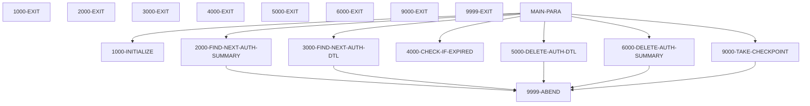

# CBPAUP0C

**File**: `cbl/CBPAUP0C.cbl`
**Type**: FileType.COBOL
**Analyzed**: 2026-01-27 23:05:04.209077

## Purpose

This batch COBOL IMS program, CBPAUP0C, deletes expired pending authorization messages from the IMS database. It reads pending authorization summary and detail segments, checks if the authorization has expired based on a configurable expiry period, and deletes the detail segment if expired. It also deletes the summary segment if all associated detail segments have been deleted.

**Business Context**: This program is part of the CardDemo application's authorization module and is used to maintain the pending authorization database by removing expired records.

## Inputs

| Name | Type | Description |
|------|------|-------------|
| SYSIN | IOType.PARAMETER | Contains parameters for expiry days, checkpoint frequency, checkpoint display frequency, and debug flag. |
| PAUTSUM0 | IOType.IMS_SEGMENT | Pending Authorization Summary segment from IMS database. |
| PAUTDTL1 | IOType.IMS_SEGMENT | Pending Authorization Detail segment from IMS database. |

## Business Rules

- **BR001**: An authorization detail is considered expired if the difference between the current date and the authorization date is greater than or equal to the expiry days specified in the input parameters.
- **BR002**: If an authorization detail is expired and the authorization response code is '00' (approved), the approved authorization count and amount in the summary segment are decremented. Otherwise, the declined authorization count and amount are decremented.
- **BR003**: The authorization summary segment is deleted if both the approved and declined authorization counts are zero.

## Paragraphs/Procedures

### MAIN-PARA
This is the main control paragraph of the CBPAUP0C program. It orchestrates the process of finding and deleting expired pending authorization messages. It begins by calling 1000-INITIALIZE to set up the program environment and read input parameters. Then, it enters a loop that continues until either an error flag is set or the end of the authorization database is reached. Inside this loop, it calls 3000-FIND-NEXT-AUTH-DTL to retrieve the next authorization detail record. Another nested loop iterates through the detail records associated with the current summary record, calling 4000-CHECK-IF-EXPIRED to determine if the detail record has expired. If a detail record is expired (QUALIFIED-FOR-DELETE is true), 5000-DELETE-AUTH-DTL is called to delete the detail record from the database. After processing all detail records for a summary record, the program checks if both the approved and declined authorization counts in the summary record are zero. If so, it calls 6000-DELETE-AUTH-SUMMARY to delete the summary record. Finally, before retrieving the next summary record, the program checks if the number of processed summary records exceeds the checkpoint frequency specified in the input parameters. If it does, 9000-TAKE-CHECKPOINT is called to take a checkpoint and reset the summary record count. Once all summary records have been processed, the program calls 9000-TAKE-CHECKPOINT one last time and then terminates.

### 1000-INITIALIZE
This paragraph initializes the program by accepting the current date and parameters from SYSIN. It accepts the current date from the system and stores it in CURRENT-DATE and CURRENT-YYDDD. It then reads the PRM-INFO parameter string from SYSIN, which contains the expiry days, checkpoint frequency, checkpoint display frequency, and debug flag. It displays the starting program message, the received parameters, and today's date for debugging purposes. It validates the input parameters, setting default values if they are invalid. If P-EXPIRY-DAYS is not numeric, it defaults to 5. If P-CHKP-FREQ or P-CHKP-DIS-FREQ are spaces, 0, or LOW-VALUES, they default to 5 and 10, respectively. If P-DEBUG-FLAG is not 'Y', it defaults to 'N'. There is no explicit error handling in this paragraph, but invalid parameter values are handled by assigning default values. This paragraph does not call any other paragraphs or programs.

### 2000-FIND-NEXT-AUTH-SUMMARY
This paragraph retrieves the next pending authorization summary segment from the IMS database. It uses the IMS command 'GN' (Get Next) to read the PAUTSUM0 segment into the PENDING-AUTH-SUMMARY data structure. Before executing the IMS command, it checks if the debug flag is on and displays a debug message indicating the number of summary records read so far. After the IMS call, it evaluates the DIBSTAT variable to determine the outcome of the call. If DIBSTAT is '  ', it means the segment was successfully read, so it sets NOT-END-OF-AUTHDB to TRUE, increments the summary read count (WS-NO-SUMRY-READ), increments the summary processed count (WS-AUTH-SMRY-PROC-CNT), and moves the account ID (PA-ACCT-ID) to WS-CURR-APP-ID. If DIBSTAT is 'GB', it means the end of the database has been reached, so it sets END-OF-AUTHDB to TRUE. If DIBSTAT is any other value, it indicates an error, so it displays an error message including the DIBSTAT value and the number of summary records read before the error, and then calls 9999-ABEND to terminate the program. This paragraph consumes the IMS database and produces the PENDING-AUTH-SUMMARY data. It handles errors by abending the program.

### 3000-FIND-NEXT-AUTH-DTL
This paragraph retrieves the next pending authorization detail segment from the IMS database for the current summary segment. It uses the IMS command 'GNP' (Get Next within Parent) to read the PAUTDTL1 segment into the PENDING-AUTH-DETAILS data structure. Before executing the IMS command, it checks if the debug flag is on and displays a debug message indicating the number of detail records read so far. After the IMS call, it evaluates the DIBSTAT variable to determine the outcome of the call. If DIBSTAT is '  ', it means the segment was successfully read, so it sets MORE-AUTHS to TRUE and increments the detail read count (WS-NO-DTL-READ). If DIBSTAT is 'GE' or 'GB', it means either the end of the current parent (summary) or the end of the database has been reached, so it sets NO-MORE-AUTHS to TRUE. If DIBSTAT is any other value, it indicates an error, so it displays an error message including the DIBSTAT value, the summary account ID (PA-ACCT-ID), and the number of detail records read before the error, and then calls 9999-ABEND to terminate the program. This paragraph consumes the IMS database and produces the PENDING-AUTH-DETAILS data. It handles errors by abending the program.

### 4000-CHECK-IF-EXPIRED
This paragraph determines if the current pending authorization detail record has expired based on the authorization date and the configured expiry period. It calculates the authorization date (WS-AUTH-DATE) by subtracting the PA-AUTH-DATE-9C from 99999. It then calculates the difference (WS-DAY-DIFF) between the current date (CURRENT-YYDDD) and the calculated authorization date. If the difference is greater than or equal to the expiry days (WS-EXPIRY-DAYS), the authorization is considered expired, and QUALIFIED-FOR-DELETE is set to TRUE. If the authorization response code (PA-AUTH-RESP-CODE) is '00' (approved), the approved authorization count (PA-APPROVED-AUTH-CNT) and amount (PA-APPROVED-AUTH-AMT) in the summary segment are decremented. Otherwise, the declined authorization count (PA-DECLINED-AUTH-CNT) and transaction amount (PA-TRANSACTION-AMT) are decremented. If the authorization is not expired, NOT-QUALIFIED-FOR-DELETE is set to TRUE. This paragraph consumes the CURRENT-YYDDD, PA-AUTH-DATE-9C, PA-AUTH-RESP-CODE, PA-APPROVED-AUTH-CNT, PA-APPROVED-AUTH-AMT, PA-DECLINED-AUTH-CNT, PA-TRANSACTION-AMT, and WS-EXPIRY-DAYS. It produces QUALIFIED-FOR-DELETE, NOT-QUALIFIED-FOR-DELETE, PA-APPROVED-AUTH-CNT, PA-APPROVED-AUTH-AMT, PA-DECLINED-AUTH-CNT, and PA-TRANSACTION-AMT. The business logic implemented is to determine if an authorization is expired based on the date difference and to update the summary segment counts and amounts accordingly.

### 5000-DELETE-AUTH-DTL
This paragraph deletes the current pending authorization detail segment from the IMS database. It uses the IMS command 'DLET' (Delete) to delete the PAUTDTL1 segment. Before executing the IMS command, it checks if the debug flag is on and displays a debug message indicating the account ID (PA-ACCT-ID) of the detail record being deleted. After the IMS call, it checks the DIBSTAT variable. If DIBSTAT is spaces, it means the segment was successfully deleted, so it increments the detail deleted count (WS-NO-DTL-DELETED). Otherwise, it indicates an error, so it displays an error message including the DIBSTAT value and the account ID, and then calls 9999-ABEND to terminate the program. This paragraph consumes the PENDING-AUTH-DETAILS and produces the deletion of the corresponding record in the IMS database. It handles errors by abending the program.

### 6000-DELETE-AUTH-SUMMARY
This paragraph deletes the current pending authorization summary segment from the IMS database. It uses the IMS command 'DLET' (Delete) to delete the PAUTSUM0 segment. Before executing the IMS command, it checks if the debug flag is on and displays a debug message indicating the account ID (PA-ACCT-ID) of the summary record being deleted. After the IMS call, it checks the DIBSTAT variable. If DIBSTAT is spaces, it means the segment was successfully deleted, so it increments the summary deleted count (WS-NO-SUMRY-DELETED). Otherwise, it indicates an error, so it displays an error message including the DIBSTAT value and the account ID, and then calls 9999-ABEND to terminate the program. This paragraph consumes the PENDING-AUTH-SUMMARY and produces the deletion of the corresponding record in the IMS database. It handles errors by abending the program.

### 9000-TAKE-CHECKPOINT
This paragraph takes an IMS checkpoint. It executes the 'CHKP' (Checkpoint) command using WK-CHKPT-ID as the checkpoint ID. After the checkpoint call, it checks the DIBSTAT variable. If DIBSTAT is spaces, it means the checkpoint was successful, so it increments the checkpoint count (WS-NO-CHKP). If the checkpoint count is greater than or equal to the checkpoint display frequency (P-CHKP-DIS-FREQ), it resets the checkpoint count to zero and displays a message indicating the checkpoint success, the authorization count (WS-NO-SUMRY-READ), and the application ID (WS-CURR-APP-ID). If DIBSTAT is not spaces, it indicates an error, so it displays an error message including the DIBSTAT value, the record count, and the application ID, and then calls 9999-ABEND to terminate the program. The WK-CHKPT-ID is composed of 'RMAD' and a counter WK-CHKPT-ID-CTR. This paragraph consumes the DIBSTAT, P-CHKP-DIS-FREQ, WS-NO-CHKP, WS-NO-SUMRY-READ, and WS-CURR-APP-ID. It produces the IMS checkpoint and potentially a display message. It handles errors by abending the program.

### 9999-ABEND
This paragraph handles program termination due to an error condition. It displays a message indicating that the program is abending. It sets the RETURN-CODE to 16, indicating an abnormal termination. Finally, it executes a GOBACK statement to return control to the calling program or operating system. This paragraph does not consume any specific input data. It produces a display message and sets the RETURN-CODE. It is called by other paragraphs when an unrecoverable error occurs. The purpose of this paragraph is to ensure a consistent and controlled program termination in case of errors.

## Dead Code

The following artifacts were identified as dead code by static analysis:

| Artifact | Type | Line | Reason |
|----------|------|------|--------|
| 9999-EXIT | paragraph | 384 | Paragraph '9999-EXIT' is never PERFORMed or referenced by any other paragraph or program |

## Control Flow

