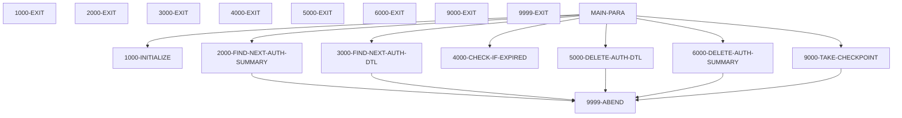
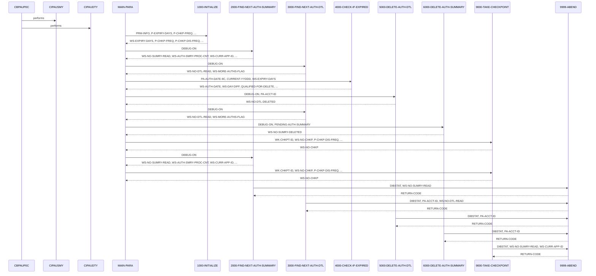

# CBPAUP0C

**File**: `cbl/CBPAUP0C.cbl`
**Type**: COBOL
**Analyzed**: 2026-02-10 17:12:47.449725

## Purpose

This program CBPAUP0C purges expired authorization details from the IMS database. It reads authorization summary and detail segments, checks if the authorization is expired based on a configurable expiry period, and deletes the expired details. It also updates the authorization summary counts and amounts accordingly and takes checkpoints periodically.

**Business Context**: This program is likely part of a larger authorization management system, responsible for maintaining the authorization database by removing outdated entries, thus optimizing storage and improving query performance.

## Inputs

| Name | Type | Description |
|------|------|-------------|
| PENDING-AUTH-SUMMARY | IMS_SEGMENT | Contains summary information for pending authorizations, including account ID, approved/declined counts and amounts, and authorization date. |
| PENDING-AUTH-DETAILS | IMS_SEGMENT | Contains details for individual pending authorizations, including authorization response code and transaction amount. |
| SYSIN | PARAMETER | Contains parameter information, including expiry days, checkpoint frequency, debug flag, checkpoint display frequency. |

## Outputs

| Name | Type | Description |
|------|------|-------------|
| IMS Database | IMS_SEGMENT | The program updates and deletes authorization detail and summary segments in the IMS database. |
| SYSOUT | REPORT | The program writes informational messages, debug messages (if enabled), and summary statistics to SYSOUT. |

## Called Programs

| Program | Call Type | Purpose |
|---------|-----------|---------|
| CIPAUSMY | UNKNOWN | UNKNOWN |
| CIPAUDTY | UNKNOWN | UNKNOWN |

## Business Rules

- **BR001**: Authorization details are considered expired if the difference between the current date and the authorization date is greater than or equal to the expiry days parameter.
- **BR002**: The program takes a checkpoint after processing a configurable number of authorization summary records.

## Paragraphs/Procedures

### CBPAUP0C
This is the program entry point. It calls CIPAUSMY and CIPAUDTY, but the purpose of these calls is unknown. Further investigation is needed to determine the functionality of these called programs and their role in the overall process. Without more information, it's impossible to describe the paragraph's purpose in detail.

### MAIN-PARA
This paragraph controls the main processing loop of the program. It first calls 1000-INITIALIZE to initialize variables and read parameters. Then, it enters a loop that continues until either an error flag is set (ERR-FLG-ON) or the end of the authorization database is reached (END-OF-AUTHDB). Inside this main loop, it calls 3000-FIND-NEXT-AUTH-DTL to retrieve authorization details. Another nested loop processes these details until no more authorization details are found (NO-MORE-AUTHS). Within this nested loop, 4000-CHECK-IF-EXPIRED determines if the authorization detail is expired. If it is, 5000-DELETE-AUTH-DTL deletes the expired detail. After processing all details for a summary, the program checks if both approved and declined authorization counts are zero. If so, 6000-DELETE-AUTH-SUMMARY deletes the summary record. Finally, based on WS-AUTH-SMRY-PROC-CNT and P-CHKP-FREQ, 9000-TAKE-CHECKPOINT is called to take a checkpoint. The paragraph displays summary statistics before terminating.

### 1000-INITIALIZE
This paragraph initializes the program. It accepts the current date and day from the system (lines 52-53). It then accepts parameter information from SYSIN (line 55) and displays it along with the current date. It checks if the P-EXPIRY-DAYS parameter is numeric (line 62). If it is, it moves the value to WS-EXPIRY-DAYS; otherwise, it defaults to 5 (line 65). It also checks if P-CHKP-FREQ, P-CHKP-DIS-FREQ are spaces, 0, or low-values, defaulting to 5 and 10 respectively if they are (lines 67-72). Finally, it checks if P-DEBUG-FLAG is not 'Y', and if so, moves 'N' to it (lines 73-75).

### 1000-EXIT
This paragraph simply contains the EXIT statement, marking the end of the 1000-INITIALIZE paragraph. It serves as a target for the PERFORM THRU statement in MAIN-PARA.

### 2000-FIND-NEXT-AUTH-SUMMARY
This paragraph retrieves the next authorization summary record from the IMS database. If the DEBUG-ON flag is set, it displays a debug message indicating the number of summary records read (lines 84-86). It then executes a DLI GN (Get Next) command to read the PAUTSUM0 segment into PENDING-AUTH-SUMMARY (lines 88-91). The DIBSTAT return code is evaluated. If it's '  ', NOT-END-OF-AUTHDB is set to TRUE, counters WS-NO-SUMRY-READ and WS-AUTH-SMRY-PROC-CNT are incremented, and PA-ACCT-ID is moved to WS-CURR-APP-ID (lines 94-98). If DIBSTAT is 'GB', END-OF-AUTHDB is set to TRUE (line 100). If DIBSTAT is any other value, an error message is displayed, along with the number of summary records read, and the program abends via 9999-ABEND (lines 102-105).

### 2000-EXIT
This paragraph simply contains the EXIT statement, marking the end of the 2000-FIND-NEXT-AUTH-SUMMARY paragraph. It serves as a target for the PERFORM THRU statement in MAIN-PARA.

### 3000-FIND-NEXT-AUTH-DTL
This paragraph retrieves the next authorization detail record from the IMS database. If the DEBUG-ON flag is set, it displays a debug message indicating the number of detail records read (lines 115-117). It then executes a DLI GNP (Get Next within Parent) command to read the PAUTDTL1 segment into PENDING-AUTH-DETAILS (lines 119-122). The DIBSTAT return code is evaluated. If it's '  ', MORE-AUTHS is set to TRUE, and the WS-NO-DTL-READ counter is incremented (lines 124-126). If DIBSTAT is 'GE' or 'GB', NO-MORE-AUTHS is set to TRUE (lines 127-129). If DIBSTAT is any other value, an error message is displayed, along with the summary account ID and the number of detail records read, and the program abends via 9999-ABEND (lines 131-134).

### 3000-EXIT
This paragraph simply contains the EXIT statement, marking the end of the 3000-FIND-NEXT-AUTH-DTL paragraph. It serves as a target for the PERFORM THRU statement in MAIN-PARA.

### 4000-CHECK-IF-EXPIRED
This paragraph determines if an authorization detail record is expired. It calculates WS-AUTH-DATE by subtracting PA-AUTH-DATE-9C from 99999 (line 144). It then calculates WS-DAY-DIFF, the difference between the current date (CURRENT-YYDDD) and WS-AUTH-DATE (line 146). If WS-DAY-DIFF is greater than or equal to WS-EXPIRY-DAYS, QUALIFIED-FOR-DELETE is set to TRUE (lines 148-149). If the authorization response code (PA-AUTH-RESP-CODE) is '00', the approved authorization count and amount are decremented (lines 151-153); otherwise, the declined authorization count and amount are decremented (lines 155-156). If the authorization is not expired, NOT-QUALIFIED-FOR-DELETE is set to TRUE (line 159).

### 4000-EXIT
This paragraph simply contains the EXIT statement, marking the end of the 4000-CHECK-IF-EXPIRED paragraph. It serves as a target for the PERFORM THRU statement in MAIN-PARA.

### 5000-DELETE-AUTH-DTL
This paragraph deletes an authorization detail record from the IMS database. It first checks if debugging is enabled and displays the account ID if it is. It then executes a DLI DLET command to delete the PAUTDTL1 segment from the PENDING-AUTH-DETAILS using the PAUT-PCB-NUM. After the delete operation, it checks the DIBSTAT variable to determine if the deletion was successful. If DIBSTAT is spaces, it increments the WS-NO-DTL-DELETED counter. If the deletion fails (DIBSTAT is not spaces), it displays an error message including the DIBSTAT value and the authorization account ID, then calls the 9999-ABEND paragraph to terminate the program.

### 5000-EXIT
This paragraph simply exits the 5000-DELETE-AUTH-DTL paragraph, returning control to the calling paragraph.

### 6000-DELETE-AUTH-SUMMARY
This paragraph deletes an authorization summary record from the IMS database. It first checks if debugging is enabled and displays the account ID if it is. It then executes a DLI DLET command to delete the PAUTSUM0 segment from the PENDING-AUTH-SUMMARY using the PAUT-PCB-NUM. After the delete operation, it checks the DIBSTAT variable to determine if the deletion was successful. If DIBSTAT is spaces, it increments the WS-NO-SUMRY-DELETED counter. If the deletion fails (DIBSTAT is not spaces), it displays an error message including the DIBSTAT value and the authorization account ID, then calls the 9999-ABEND paragraph to terminate the program.

### 6000-EXIT
This paragraph simply exits the 6000-DELETE-AUTH-SUMMARY paragraph, returning control to the calling paragraph.

### 9000-TAKE-CHECKPOINT
This paragraph takes a checkpoint using the DLI CHKP command. It uses WK-CHKPT-ID as the checkpoint ID. After the checkpoint operation, it checks the DIBSTAT variable to determine if the checkpoint was successful. If DIBSTAT is spaces, it increments the WS-NO-CHKP counter. If the WS-NO-CHKP counter is greater than or equal to P-CHKP-DIS-FREQ, it resets WS-NO-CHKP to zero and displays a checkpoint success message including the authorization count (WS-NO-SUMRY-READ) and the current application ID (WS-CURR-APP-ID). If the checkpoint fails (DIBSTAT is not spaces), it displays an error message including the DIBSTAT value, the record count (WS-NO-SUMRY-READ), and the application ID (WS-CURR-APP-ID), then calls the 9999-ABEND paragraph to terminate the program.

### 9000-EXIT
This paragraph simply exits the 9000-TAKE-CHECKPOINT paragraph, returning control to the calling paragraph.

### 9999-ABEND
This paragraph is the program's abend routine. It displays a message indicating that the program is abending, sets the RETURN-CODE to 16, and then terminates the program using the GOBACK statement.

### ~~9999-EXIT~~ (Dead Code)
*Paragraph '9999-EXIT' is never PERFORMed or referenced by any other paragraph or program*

## Dead Code

The following artifacts were identified as dead code by static analysis:

| Artifact | Type | Line | Reason |
|----------|------|------|--------|
| 9999-EXIT | paragraph | 385 | Paragraph '9999-EXIT' is never PERFORMed or referenced by any other paragraph or program |

## Control Flow

## Open Questions

- ? What is the purpose of the CIPAUSMY and CIPAUDTY programs called at the beginning of CBPAUP0C?
  - Context: The program calls these two programs at the beginning, but their function is not clear from the provided code snippet.
- ? What is the structure of the PRM-INFO parameter received from SYSIN?
  - Context: The code accepts PRM-INFO from SYSIN, but the structure and meaning of the individual fields within PRM-INFO are not defined in the provided code snippet.
- ? What is the purpose of the 9000-TAKE-CHECKPOINT paragraph?
  - Context: The code calls 9000-TAKE-CHECKPOINT, but the implementation of this paragraph is not provided in the snippet. Therefore, it is unclear what actions are performed during the checkpoint process.

## Sequence Diagram

