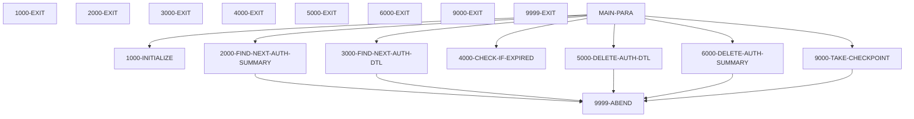
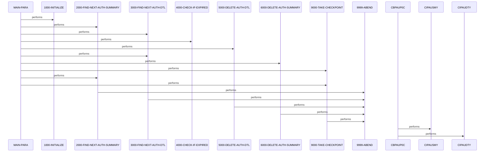

# CBPAUP0C

**File**: `cbl/CBPAUP0C.cbl`
**Type**: COBOL
**Analyzed**: 2026-02-24 04:01:12.666933

## Purpose

This batch COBOL IMS program purges expired pending authorization messages from an IMS database. It sequentially reads root summary segments (PAUTSUM0) and their child detail segments (PAUTDTL1), checks the age of each detail against a configurable expiry period, deletes expired details while adjusting summary counters, and deletes empty summaries. Periodic checkpoints ensure restartability, and final statistics are displayed.

**Business Context**: CardDemo Authorization Module: Maintains pending authorization database by removing expired entries to manage storage and data freshness.

## Inputs

| Name | Type | Description |
|------|------|-------------|
| PRM-INFO | PARAMETER | Command-line parameters from SYSIN containing expiry days (P-EXPIRY-DAYS), checkpoint frequency (P-CHKP-FREQ), display frequency (P-CHKP-DIS-FREQ), and debug flag (P-DEBUG-FLAG) |
| PAUTSUM0 | IMS_SEGMENT | Pending Authorization Summary root segment containing account ID, approved/declined auth counts and amounts |
| PAUTDTL1 | IMS_SEGMENT | Pending Authorization Details child segment containing auth date, response code, amounts for expiry check |

## Outputs

| Name | Type | Description |
|------|------|-------------|
| STATS-REPORT | REPORT | Console display of final processing statistics including summaries read/deleted and details read/deleted |

## Business Rules

- **BR001**: An authorization detail qualifies for deletion if its age (current YYDDD minus converted auth date) exceeds the expiry days parameter
- **BR002**: When deleting an expired detail, decrement the appropriate summary counter (approved or declined) and subtract the amount
- **BR003**: Delete the summary segment only if both approved and declined authorization counts are zero or less after detail processing

## Paragraphs/Procedures

### MAIN-PARA
> [Source: MAIN-PARA.cbl.md](CBPAUP0C.cbl.d/MAIN-PARA.cbl.md)
This is the primary orchestration paragraph controlling the entire program execution flow. It consumes no direct inputs but relies on initialized variables and IMS PCB from linkage. It first performs 1000-INITIALIZE to set up dates, parameters, and flags. It then initiates reading of summary segments via 2000-FIND-NEXT-AUTH-SUMMARY and enters an outer loop processing each summary until end-of-DB or error flag. For each summary, it enters an inner loop calling 3000-FIND-NEXT-AUTH-DTL to read child details, invoking 4000-CHECK-IF-EXPIRED to assess expiry, and conditionally 5000-DELETE-AUTH-DTL while adjusting summary counters. After details, it checks if summary counters are zero via business rule BR003 and calls 6000-DELETE-AUTH-SUMMARY if so. Periodically calls 9000-TAKE-CHECKPOINT based on P-CHKP-FREQ to ensure restartability. No explicit error handling beyond loop exit on ERR-FLG-ON (unused). At EOF, final checkpoint and displays statistics report. Produces control flow to GOBACK.

### 1000-INITIALIZE
> [Source: 1000-INITIALIZE.cbl.md](CBPAUP0C.cbl.d/1000-INITIALIZE.cbl.md)
This initialization paragraph sets up program variables and parameters before main processing. It reads CURRENT-DATE and CURRENT-YYDDD from system, accepts PRM-INFO parameter from SYSIN, and displays startup info. It validates and sets WS-EXPIRY-DAYS from P-EXPIRY-DAYS (default 5), normalizes P-CHKP-FREQ/DIS-FREQ (defaults 5/10), and ensures P-DEBUG-FLAG is 'Y' or 'N'. No IMS or file I/O; consumes system dates and parameters. Produces initialized WS-VARIABLES, PRM-INFO, and flags for use throughout program. No business decisions beyond parameter validation. No error handling; assumes ACCEPT succeeds. Calls no other paragraphs. Exits cleanly to MAIN-PARA.

### 2000-FIND-NEXT-AUTH-SUMMARY
> [Source: 2000-FIND-NEXT-AUTH-SUMMARY.cbl.md](CBPAUP0C.cbl.d/2000-FIND-NEXT-AUTH-SUMMARY.cbl.md)
This paragraph retrieves the next Pending Authorization Summary root segment using IMS DL/I GN call. It conditionally displays debug info if DEBUG-ON. Performs EXEC DLI GN on PAUTSUM0 into PENDING-AUTH-SUMMARY via PAUT-PCB-NUM PCB. Evaluates DIBSTAT: on '  ' sets NOT-END-OF-AUTHDB, increments read counters, moves PA-ACCT-ID to WS-CURR-APP-ID; on 'GB' sets END-OF-AUTHDB; other statuses display error and abend via 9999-ABEND. Consumes IMS database via PCB. Produces populated PENDING-AUTH-SUMMARY and counters for main loop. Business logic enforces sequential root access. Error handling abends on non-success/non-EOF. Called repeatedly by MAIN-PARA. No subordinate calls.

### 3000-FIND-NEXT-AUTH-DTL
> [Source: 3000-FIND-NEXT-AUTH-DTL.cbl.md](CBPAUP0C.cbl.d/3000-FIND-NEXT-AUTH-DTL.cbl.md)
This paragraph fetches the next child Pending Authorization Details segment under current summary using IMS DL/I GNP call. Debug display if enabled. EXEC DLI GNP on PAUTDTL1 into PENDING-AUTH-DETAILS. Evaluates DIBSTAT: '  ' sets MORE-AUTHS and increments detail read count; 'GE' or 'GB' sets NO-MORE-AUTHS; others display errors (including current PA-ACCT-ID) and abend. Consumes IMS database positioned by prior summary GN. Produces PENDING-AUTH-DETAILS for expiry check or EOF flag for inner loop. Implements child segment navigation logic. Errors trigger abend. Called in loop by MAIN-PARA. No other calls.

### 4000-CHECK-IF-EXPIRED
> [Source: 4000-CHECK-IF-EXPIRED.cbl.md](CBPAUP0C.cbl.d/4000-CHECK-IF-EXPIRED.cbl.md)
This paragraph implements the core expiry business rule (BR001, BR002) on current detail segment. Consumes PENDING-AUTH-DETAILS fields (PA-AUTH-DATE-9C, PA-AUTH-RESP-CODE, amounts) and global dates/counters. Computes WS-AUTH-DATE and WS-DAY-DIFF; if >= WS-EXPIRY-DAYS sets QUALIFIED-FOR-DELETE and adjusts summary counters (decrements count, subtracts amount based on resp code '00'). Otherwise sets NOT-QUALIFIED-FOR-DELETE. Modifies PENDING-AUTH-SUMMARY counters in memory for potential later delete. No I/O. No explicit errors; assumes valid data. No calls. Produces delete flag and updated summary for MAIN-PARA decision.

### 5000-DELETE-AUTH-DTL
> [Source: 5000-DELETE-AUTH-DTL.cbl.md](CBPAUP0C.cbl.d/5000-DELETE-AUTH-DTL.cbl.md)
This paragraph physically deletes a qualified expired detail segment from IMS. Debug display of PA-ACCT-ID if enabled. Performs EXEC DLI DLET on PAUTDTL1 from PENDING-AUTH-DETAILS. On DIBSTAT spaces, increments WS-NO-DTL-DELETED; else displays error and abends. Consumes positioned IMS cursor and detail data. Produces database mutation (deletion) and updated counter. Business logic confirms delete success before count. Error handling abends on failure. Called conditionally by MAIN-PARA. No subordinate calls.

### 6000-DELETE-AUTH-SUMMARY
> [Source: 6000-DELETE-AUTH-SUMMARY.cbl.md](CBPAUP0C.cbl.d/6000-DELETE-AUTH-SUMMARY.cbl.md)
Deletes the current summary segment if counters indicate empty (per BR003). Debug display if enabled. EXEC DLI DLET on PAUTSUM0 from PENDING-AUTH-SUMMARY. Success (spaces) increments WS-NO-SUMRY-DELETED; failure displays error/PA-ACCT-ID and abends. Consumes positioned IMS and summary data. Produces database deletion and stat counter. Ensures only empty summaries removed. Errors abend program. Called conditionally by MAIN-PARA post-details. No other calls.

### 9000-TAKE-CHECKPOINT
> [Source: 9000-TAKE-CHECKPOINT.cbl.md](CBPAUP0C.cbl.d/9000-TAKE-CHECKPOINT.cbl.md)
Takes IMS checkpoint for restartability using current WK-CHKPT-ID. EXEC DLI CHKP ID(WK-CHKPT-ID). Success increments WS-NO-CHKP and displays summary if threshold P-CHKP-DIS-FREQ met (resets counter); failure displays details and abends. Consumes IMS PCB and counters. Produces committed position in DB and optional display. Logic enforces periodic display. Errors abend. Called by MAIN-PARA on frequency and at end. No subordinate calls.

### 9999-ABEND
> [Source: 9999-ABEND.cbl.md](CBPAUP0C.cbl.d/9999-ABEND.cbl.md)
Universal error handler paragraph invoked on all IMS failures or invalid statuses. Displays abend message 'CBPAUP0C ABENDING ...'. Sets RETURN-CODE to 16 and GOBACKs to terminate program abnormally. Consumes no specific data; triggered by callers. Produces non-zero return code for batch scheduler. No business logic or decisions. No validation. Called by multiple paragraphs on errors. Contains 9999-EXIT as its exit point.

### 9999-EXIT
> [Source: 9999-EXIT.cbl.md](CBPAUP0C.cbl.d/9999-EXIT.cbl.md)
This is the exit label within the 9999-ABEND paragraph, providing a standard EXIT statement to return control to the caller (9999-ABEND). It consumes no data and performs no logic, validation, or I/O. Produces no outputs beyond flow control. No decisions or error handling as it is purely procedural. Called implicitly by 9999-ABEND. No further calls.

### CBPAUP0C
> [Source: CBPAUP0C.cbl.md](CBPAUP0C.cbl.d/CBPAUP0C.cbl.md)
No paragraph named 'CBPAUP0C' found in source code; this matches PROGRAM-ID only (line 23) and is not a PROCEDURE DIVISION paragraph label. Cannot document as executable code block. Potentially a static analysis misidentification of PROGRAM-ID.

## Control Flow

## Open Questions

- ? Exact layouts and all fields in copybooks CIPAUSMY and CIPAUDTY
  - Context: Referenced fields like PA-ACCT-ID, PA-AUTH-DATE-9C inferred from usage but full structures unknown without copybooks
- ? Usage of WS-ERR-FLG (88 ERR-FLG-ON used in MAIN-PARA loop exit but never set to 'Y')
  - Context: Defined but not activated in provided code

## Sequence Diagram

