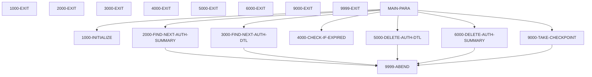
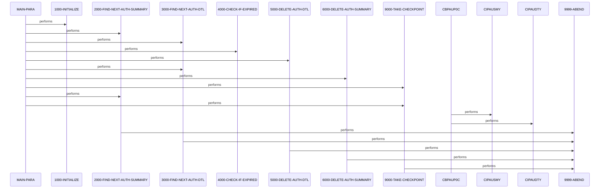

# CBPAUP0C

**File**: `cbl/CBPAUP0C.cbl`
**Type**: FileType.COBOL
**Analyzed**: 2026-02-25 15:35:51.897205

## Purpose

CBPAUP0C is a batch COBOL IMS DL/I program that purges expired pending authorization detail segments from the authorization database and deletes their parent summary segments if no remaining details exist. It iterates through summary segments (PAUTSUM0), processes child detail segments (PAUTDTL1), checks authorization dates against an expiry threshold from parameters, deletes qualified details, updates in-memory summary counters, and takes periodic checkpoints. Final statistics on processed and deleted records are displayed before termination.

**Business Context**: CardDemo Authorization Module - performs housekeeping by deleting expired pending authorization messages to maintain database efficiency.

## Inputs

| Name | Type | Description |
|------|------|-------------|
| PAUT-PCB (PAUTSUM0 segment) | IOType.IMS_SEGMENT | Pending Authorization Summary root segments containing account ID, approved/declined auth counts and amounts |
| PAUT-PCB (PAUTDTL1 segment) | IOType.IMS_SEGMENT | Pending Authorization Detail child segments containing authorization date, response code, transaction amount |
| SYSIN | IOType.PARAMETER | Program parameters: expiry days, checkpoint frequency, display frequency, debug flag |

## Outputs

| Name | Type | Description |
|------|------|-------------|
| SYSPRINT | IOType.REPORT | Displays initialization parameters, debug info, processing statistics, checkpoint status, and error messages |

## Business Rules

- **BR001**: Delete authorization detail if days elapsed since authorization date exceeds expiry days threshold
- **BR002**: Delete summary segment only if both approved and declined auth counts are zero or less after processing all children

## Paragraphs/Procedures

### MAIN-PARA
> [Source: MAIN-PARA.cbl.md](CBPAUP0C.cbl.d/MAIN-PARA.cbl.md)
This is the primary orchestration paragraph serving as the main entry point (labeled MAIN-PARA under PROCEDURE DIVISION for program CBPAUP0C) that controls the overall program flow for purging expired authorizations. It consumes parameters from SYSIN indirectly via initialization and IMS PCB masks from LINKAGE. It initializes via 1000-INITIALIZE, then enters a loop reading summary segments until end-of-DB or error, processing each summary's detail children by checking expiry and deleting qualified ones, updating in-memory counters, deleting empty summaries, and taking checkpoints every P-CHKP-FREQ summaries. Outputs include final statistics displayed to SYSPRINT. Business logic decides deletions based on expiry and zero-count summaries. Errors from subordinates trigger ABEND via 9999-ABEND. It calls 1000-INITIALIZE for setup, 2000-FIND-NEXT-AUTH-SUMMARY to read summaries, 3000-FIND-NEXT-AUTH-DTL for details, 4000-CHECK-IF-EXPIRED for qualification, 5000-DELETE-AUTH-DTL and 6000-DELETE-AUTH-SUMMARY for deletions, 9000-TAKE-CHECKPOINT for restartability, and displays stats before GOBACK.

### CBPAUP0C
> [Source: CBPAUP0C.cbl.md](CBPAUP0C.cbl.d/CBPAUP0C.cbl.md)
This paragraph represents the main program entry point associated with PROGRAM-ID CBPAUP0C, implemented via MAIN-PARA. It consumes IMS PCB masks from LINKAGE SECTION and parameters via SYSIN. It produces control flow to subordinate paragraphs for initialization, processing loops, deletions, and termination. Business logic orchestrates the expiry purge process across IMS database. No explicit error handling here; defers to callees. Calls all processing paragraphs to execute the full purge cycle.

### 1000-INITIALIZE
> [Source: 1000-INITIALIZE.cbl.md](CBPAUP0C.cbl.d/1000-INITIALIZE.cbl.md)
This initialization paragraph sets up program variables and parameters for the expiry purge process. It consumes current date from system (DATE/DAY), parameters from SYSIN into PRM-INFO. It produces initialized WS-EXPIRY-DAYS (default 5), checkpoint frequencies (defaults 5/10), debug flag, and displays startup info. Business logic validates and defaults numeric/spaces parameters. No error handling beyond numeric check; sets flags appropriately. Calls no others; exited to MAIN-PARA.

### 2000-FIND-NEXT-AUTH-SUMMARY
> [Source: 2000-FIND-NEXT-AUTH-SUMMARY.cbl.md](CBPAUP0C.cbl.d/2000-FIND-NEXT-AUTH-SUMMARY.cbl.md)
This paragraph reads the next Pending Auth Summary root segment using IMS GN call. It consumes IMS PCB and prior position. It produces PENDING-AUTH-SUMMARY data, increments read counters, sets flags (END-OF-AUTHDB on GB). Business logic evaluates DIBSTAT: OK increments counters and sets current app ID; GB sets EOF; others ABEND with display. Error handling abends on non-OK/GB statuses. Calls no others.

### 3000-FIND-NEXT-AUTH-DTL
> [Source: 3000-FIND-NEXT-AUTH-DTL.cbl.md](CBPAUP0C.cbl.d/3000-FIND-NEXT-AUTH-DTL.cbl.md)
This paragraph reads the next Pending Auth Detail child segment under current summary using IMS GNP call. It consumes IMS PCB and parent summary position. It produces PENDING-AUTH-DETAILS data, increments detail read counter, sets MORE-AUTHS flag. Business logic evaluates DIBSTAT: OK sets more flag; GE/GB sets no-more; others ABEND with displays. Error handling abends on unexpected statuses. Calls no others.

### 4000-CHECK-IF-EXPIRED
> [Source: 4000-CHECK-IF-EXPIRED.cbl.md](CBPAUP0C.cbl.d/4000-CHECK-IF-EXPIRED.cbl.md)
This paragraph determines if a detail authorization is expired and prepares summary for potential deletion. It consumes detail's PA-AUTH-DATE-9C, current date, response code, amounts, and expiry days. It produces WS-QUALIFY-DELETE-FLAG and modifies in-memory summary counters (decrements approved/declined counts/amts if expired). Business logic unpacks date, computes day diff, qualifies if >= expiry, decrements based on resp code '00'. No error handling. Calls no others.

### 5000-DELETE-AUTH-DTL
> [Source: 5000-DELETE-AUTH-DTL.cbl.md](CBPAUP0C.cbl.d/5000-DELETE-AUTH-DTL.cbl.md)
This paragraph deletes the current expired detail segment from IMS database. It consumes current PENDING-AUTH-DETAILS in position. It produces deletion confirmation via counter increment on success. Business logic performs DLI DLET; success increments WS-NO-DTL-DELETED; failure displays and ABENDs. Error handling abends on non-blank DIBSTAT. Calls no others.

### 6000-DELETE-AUTH-SUMMARY
> [Source: 6000-DELETE-AUTH-SUMMARY.cbl.md](CBPAUP0C.cbl.d/6000-DELETE-AUTH-SUMMARY.cbl.md)
This paragraph deletes the current empty summary segment from IMS database. It consumes current PENDING-AUTH-SUMMARY in position after child processing. It produces deletion confirmation via counter increment on success. Business logic performs DLI DLET; success increments WS-NO-SUMRY-DELETED; failure displays and ABENDs. Error handling abends on non-blank DIBSTAT. Calls no others.

### 9000-TAKE-CHECKPOINT
> [Source: 9000-TAKE-CHECKPOINT.cbl.md](CBPAUP0C.cbl.d/9000-TAKE-CHECKPOINT.cbl.md)
This paragraph takes an IMS checkpoint for restartability after processing checkpoint frequency summaries. It consumes current IMS position via WK-CHKPT-ID. It produces checkpoint success/failure status and periodic display. Business logic performs DLI CHKP; success increments counter and displays every P-CHKP-DIS-FREQ; failure displays and ABENDs. Error handling abends on non-blank DIBSTAT. Calls no others.

### 9999-ABEND
> [Source: 9999-ABEND.cbl.md](CBPAUP0C.cbl.d/9999-ABEND.cbl.md)
This terminal error handling paragraph abends the program on IMS or other failures. It consumes no specific inputs beyond context. It produces display of abend message and sets RETURN-CODE 16 before GOBACK. Business logic simply displays and exits with code 16. No further error handling. Calls no others; flows to 9999-EXIT.

### 9999-EXIT
> [Source: 9999-EXIT.cbl.md](CBPAUP0C.cbl.d/9999-EXIT.cbl.md)
This is the exit paragraph for the 9999-ABEND routine, providing standard flow control exit. It consumes no data. It produces no outputs, simply exits to caller or end. No business logic, decisions, or error handling. Called implicitly after 9999-ABEND body.

## Dead Code

The following artifacts were identified as dead code by static analysis:

| Artifact | Type | Line | Reason |
|----------|------|------|--------|
| IO-PCB-MASK | record_layout | 128 | Record layout 'IO-PCB-MASK' is never used by any program |
| PGM-PCB-MASK | record_layout | 129 | Record layout 'PGM-PCB-MASK' is never used by any program |

## Control Flow

## Sequence Diagram

