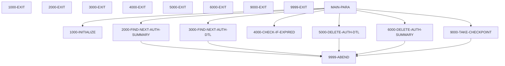
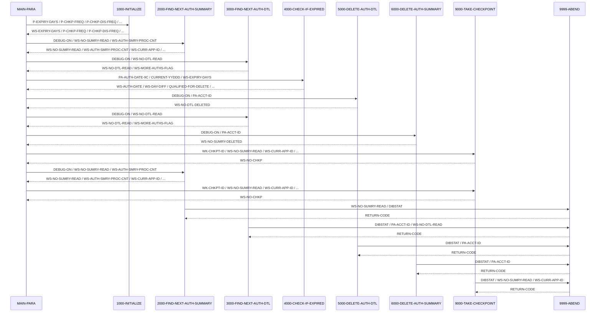

# CBPAUP0C

**File**: `cbl/CBPAUP0C.cbl`
**Type**: FileType.COBOL
**Analyzed**: 2026-02-24 17:46:08.902712

## Purpose

This batch COBOL IMS program deletes expired pending authorization messages from the IMS database. It reads pending authorization summary and detail segments, checks if the authorization has expired based on a configurable expiry period, and deletes the detail segment if expired. If all detail segments for a summary are deleted, the summary segment is also deleted.

**Business Context**: This program is part of the CardDemo application, specifically the authorization module, and is used to maintain the pending authorization database by removing expired records.

## Inputs

| Name | Type | Description |
|------|------|-------------|
| SYSIN | IOType.PARAMETER | Contains parameters for expiry days, checkpoint frequency, checkpoint display frequency, and debug flag. |
| PENDING-AUTH-SUMMARY | IOType.IMS_SEGMENT | Pending authorization summary segment (PAUTSUM0) containing summary information about pending authorizations. |
| PENDING-AUTH-DETAILS | IOType.IMS_SEGMENT | Pending authorization detail segment (PAUTDTL1) containing detailed information about individual pending authorizations. |

## Business Rules

- **BR001**: An authorization detail is considered expired if the difference between the current date and the authorization date is greater than or equal to the expiry days parameter.
- **BR002**: If an expired authorization detail has an approved authorization response code, the approved authorization count and amount in the summary segment are decremented.
- **BR003**: If an expired authorization detail has a declined authorization response code, the declined authorization count and amount in the summary segment are decremented.
- **BR004**: A pending authorization summary record is deleted if both the approved and declined authorization counts are zero.

## Paragraphs/Procedures

### MAIN-PARA
> [Source: MAIN-PARA.cbl.md](CBPAUP0C.cbl.d/MAIN-PARA.cbl.md)
This is the main control paragraph of the program. It orchestrates the deletion of expired authorization details and summaries. It first calls 1000-INITIALIZE to set up the program environment. Then, it enters a loop that continues until an error occurs or the end of the authorization database is reached. Inside this loop, it retrieves the next authorization summary using 2000-FIND-NEXT-AUTH-SUMMARY. For each summary, it enters another loop to process authorization details, calling 3000-FIND-NEXT-AUTH-DTL to retrieve the next detail. It then calls 4000-CHECK-IF-EXPIRED to determine if the detail has expired. If expired, 5000-DELETE-AUTH-DTL is called to delete the detail. After processing all details for a summary, 6000-DELETE-AUTH-SUMMARY is called if both the approved and declined authorization counts are zero. Finally, 9000-TAKE-CHECKPOINT is called periodically to establish a restart point. The paragraph displays summary statistics before terminating.

### 1000-INITIALIZE
> [Source: 1000-INITIALIZE.cbl.md](CBPAUP0C.cbl.d/1000-INITIALIZE.cbl.md)
This paragraph initializes the program. It accepts the current date and day from the system and the program parameters from SYSIN. It then displays the program name, parameters, and current date. It validates the expiry days, checkpoint frequency, checkpoint display frequency, and debug flag parameters. If the expiry days parameter is not numeric, it defaults to 5. If the checkpoint frequency or display frequency parameters are spaces, 0, or low-values, they default to 5 and 10 respectively. If the debug flag is not 'Y', it defaults to 'N'.

### 2000-FIND-NEXT-AUTH-SUMMARY
> [Source: 2000-FIND-NEXT-AUTH-SUMMARY.cbl.md](CBPAUP0C.cbl.d/2000-FIND-NEXT-AUTH-SUMMARY.cbl.md)
This paragraph retrieves the next pending authorization summary segment from the IMS database. It uses the EXEC DLI GN command with the PAUTSUM0 segment name. If the read is successful (DIBSTAT = '  '), it sets the NOT-END-OF-AUTHDB flag to TRUE, increments the summary read count (WS-NO-SUMRY-READ), increments the summary processed count (WS-AUTH-SMRY-PROC-CNT), and moves the account ID to WS-CURR-APP-ID. If the end of the database is reached (DIBSTAT = 'GB'), it sets the END-OF-AUTHDB flag to TRUE. If any other error occurs, it displays an error message and abends the program.

### 3000-FIND-NEXT-AUTH-DTL
> [Source: 3000-FIND-NEXT-AUTH-DTL.cbl.md](CBPAUP0C.cbl.d/3000-FIND-NEXT-AUTH-DTL.cbl.md)
This paragraph retrieves the next pending authorization detail segment from the IMS database. It uses the EXEC DLI GNP command with the PAUTDTL1 segment name. If the read is successful (DIBSTAT = '  '), it sets the MORE-AUTHS flag to TRUE and increments the detail read count (WS-NO-DTL-READ). If the end of the parent is reached (DIBSTAT = 'GE' or 'GB'), it sets the NO-MORE-AUTHS flag to TRUE. If any other error occurs, it displays an error message and abends the program.

### 4000-CHECK-IF-EXPIRED
> [Source: 4000-CHECK-IF-EXPIRED.cbl.md](CBPAUP0C.cbl.d/4000-CHECK-IF-EXPIRED.cbl.md)
This paragraph checks if a pending authorization detail has expired. It calculates the authorization date by subtracting the PA-AUTH-DATE-9C field from 99999 and then calculates the difference between the current year/day and the authorization date. If the difference is greater than or equal to the expiry days parameter (WS-EXPIRY-DAYS), it sets the QUALIFIED-FOR-DELETE flag to TRUE. It then checks the authorization response code (PA-AUTH-RESP-CODE). If the code is '00' (approved), it decrements the approved authorization count and amount in the summary segment. Otherwise (declined), it decrements the declined authorization count and amount in the summary segment. If the authorization is not expired, it sets the NOT-QUALIFIED-FOR-DELETE flag to TRUE.

### 5000-DELETE-AUTH-DTL
> [Source: 5000-DELETE-AUTH-DTL.cbl.md](CBPAUP0C.cbl.d/5000-DELETE-AUTH-DTL.cbl.md)
This paragraph deletes a pending authorization detail segment from the IMS database. It uses the EXEC DLI DLET command with the PAUTDTL1 segment name. If the delete is successful (DIBSTAT = SPACES), it increments the detail deleted count (WS-NO-DTL-DELETED). If the delete fails, it displays an error message and abends the program.

### 6000-DELETE-AUTH-SUMMARY
> [Source: 6000-DELETE-AUTH-SUMMARY.cbl.md](CBPAUP0C.cbl.d/6000-DELETE-AUTH-SUMMARY.cbl.md)
This paragraph deletes a pending authorization summary segment from the IMS database. It uses the EXEC DLI DLET command with the PAUTSUM0 segment name. If the delete is successful (DIBSTAT = SPACES), it increments the summary deleted count (WS-NO-SUMRY-DELETED). If the delete fails, it displays an error message and abends the program.

### 9000-TAKE-CHECKPOINT
> [Source: 9000-TAKE-CHECKPOINT.cbl.md](CBPAUP0C.cbl.d/9000-TAKE-CHECKPOINT.cbl.md)
This paragraph takes an IMS checkpoint. It uses the EXEC DLI CHKP command with a checkpoint ID. If the checkpoint is successful (DIBSTAT = SPACES), it increments the checkpoint count (WS-NO-CHKP). If the checkpoint count reaches the checkpoint display frequency (P-CHKP-DIS-FREQ), it resets the checkpoint count and displays a checkpoint success message. If the checkpoint fails, it displays an error message and abends the program.

### 9999-ABEND
> [Source: 9999-ABEND.cbl.md](CBPAUP0C.cbl.d/9999-ABEND.cbl.md)
This paragraph handles program abends. It displays an abend message, sets the return code to 16, and terminates the program.

## Dead Code

The following artifacts were identified as dead code by static analysis:

| Artifact | Type | Line | Reason |
|----------|------|------|--------|
| 9999-EXIT | paragraph | 385 | Paragraph '9999-EXIT' is never PERFORMed or referenced by any other paragraph or program |

## Control Flow

## Sequence Diagram

