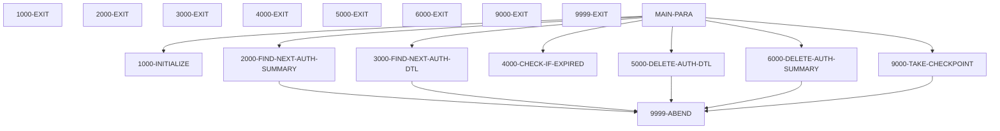
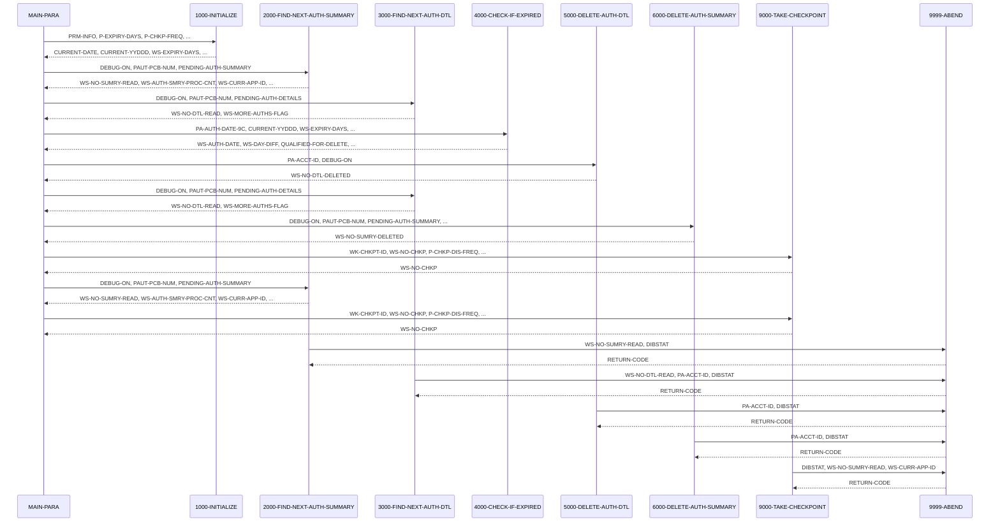

# CBPAUP0C

**File**: `cbl/CBPAUP0C.cbl`
**Type**: FileType.COBOL
**Analyzed**: 2026-02-09 15:46:20.435789

## Purpose

This COBOL batch IMS program, CBPAUP0C, deletes expired pending authorization messages from the IMS database. It reads pending authorization summary and detail segments, checks if the authorization has expired based on a configurable expiry period, and deletes the expired detail segments. It also deletes the summary segment if all its detail segments have been deleted, and takes checkpoints periodically.

**Business Context**: This program is part of the CardDemo application and is used to maintain the pending authorization database by removing expired records.

## Inputs

| Name | Type | Description |
|------|------|-------------|
| SYSIN | IOType.PARAMETER | Contains parameters for expiry days, checkpoint frequency, checkpoint display frequency, and debug flag. |
| PAUTSUM0 | IOType.IMS_SEGMENT | Pending Authorization Summary segment from the IMS database. |
| PAUTDTL1 | IOType.IMS_SEGMENT | Pending Authorization Detail segment from the IMS database. |

## Business Rules

- **BR001**: An authorization is considered expired if the difference between the current date and the authorization date is greater than or equal to the expiry days specified in the input parameters.
- **BR002**: If an expired authorization detail record has an approved authorization response code ('00'), the approved authorization count and amount in the summary record are decremented. Otherwise, the declined authorization count and amount are decremented.

## Paragraphs/Procedures

### MAIN-PARA
This is the main control paragraph of the program. It orchestrates the deletion of expired pending authorization messages. It first calls 1000-INITIALIZE to initialize variables and read input parameters. Then, it enters a loop that continues until either an error occurs or the end of the authorization database is reached. Inside the loop, it calls 2000-FIND-NEXT-AUTH-SUMMARY to read the next authorization summary segment. For each summary segment, it enters another loop to process the detail segments by calling 3000-FIND-NEXT-AUTH-DTL.  Within the detail loop, 4000-CHECK-IF-EXPIRED determines if a detail record is expired. If expired, 5000-DELETE-AUTH-DTL deletes the detail record. After processing all detail segments for a summary, 6000-DELETE-AUTH-SUMMARY deletes the summary if all detail records are gone.  9000-TAKE-CHECKPOINT is called periodically to establish restart points. Finally, the program displays summary statistics and terminates.

### 1000-INITIALIZE
This paragraph initializes the program by accepting the current date and parameters from SYSIN. It moves the expiry days from the parameter to WS-EXPIRY-DAYS, defaulting to 5 if the parameter is not numeric. It also sets default values for checkpoint frequency and display frequency if they are not provided in the input parameters. The debug flag is also initialized to 'N' if not set to 'Y'. Finally, it displays the starting message, parameters received, and today's date.

### 2000-FIND-NEXT-AUTH-SUMMARY
This paragraph reads the next pending authorization summary segment from the IMS database using the GN (Get Next) command. If the DEBUG-ON flag is set, it displays the number of summary records read. It then evaluates the DIBSTAT return code. If the return code is spaces, it sets the NOT-END-OF-AUTHDB flag to TRUE, increments the summary read count and the summary process count, and moves the account ID to WS-CURR-APP-ID. If the return code is 'GB', it sets the END-OF-AUTHDB flag to TRUE. If any other return code is received, it displays an error message and calls 9999-ABEND to terminate the program.

### 3000-FIND-NEXT-AUTH-DTL
This paragraph reads the next pending authorization detail segment from the IMS database using the GNP (Get Next within Parent) command. If the DEBUG-ON flag is set, it displays the number of detail records read. It then evaluates the DIBSTAT return code. If the return code is spaces, it sets the MORE-AUTHS flag to TRUE and increments the detail read count. If the return code is 'GE' or 'GB', it sets the NO-MORE-AUTHS flag to TRUE. If any other return code is received, it displays an error message and calls 9999-ABEND to terminate the program.

### 4000-CHECK-IF-EXPIRED
This paragraph checks if the current authorization detail record has expired. It calculates the authorization date by subtracting the PA-AUTH-DATE-9C from 99999 and then computes the difference between the current date and the authorization date. If the difference is greater than or equal to the expiry days, it sets the QUALIFIED-FOR-DELETE flag to TRUE. It also adjusts the approved or declined authorization counts and amounts in the summary record based on the authorization response code. If the authorization has not expired, it sets the NOT-QUALIFIED-FOR-DELETE flag to TRUE.

### 5000-DELETE-AUTH-DTL
This paragraph deletes the current authorization detail segment from the IMS database using the DLET (Delete) command. If the DEBUG-ON flag is set, it displays the account ID. It then checks the DIBSTAT return code. If the return code is spaces, it increments the detail deleted count. If any other return code is received, it displays an error message and calls 9999-ABEND to terminate the program.

### 6000-DELETE-AUTH-SUMMARY
This paragraph deletes the current authorization summary segment from the IMS database using the DLET (Delete) command. If the DEBUG-ON flag is set, it displays the account ID. It then checks the DIBSTAT return code. If the return code is spaces, it increments the summary deleted count. If any other return code is received, it displays an error message and calls 9999-ABEND to terminate the program.

### 9000-TAKE-CHECKPOINT
This paragraph takes a checkpoint using the CHKP (Checkpoint) command. It then checks the DIBSTAT return code. If the return code is spaces, it increments the checkpoint count. If the checkpoint count reaches the checkpoint display frequency, it resets the checkpoint count and displays a checkpoint success message. If the DIBSTAT is not spaces, it displays a checkpoint failed message and calls 9999-ABEND to terminate the program.

### 9999-ABEND
This paragraph is called when an error occurs during program execution. It displays an abending message, sets the return code to 16, and terminates the program.

## Dead Code

The following artifacts were identified as dead code by static analysis:

| Artifact | Type | Line | Reason |
|----------|------|------|--------|
| 9999-EXIT | paragraph | 385 | Paragraph '9999-EXIT' is never PERFORMed or referenced by any other paragraph or program |

## Control Flow

## Open Questions

- ? What is the structure of the IO-PCB-MASK and PGM-PCB-MASK?
  - Context: The program uses IO-PCB-MASK and PGM-PCB-MASK in the PROCEDURE DIVISION USING statement, but their structure is not defined in the provided code. This information is needed to fully understand how the program interacts with the IMS database.

## Sequence Diagram

