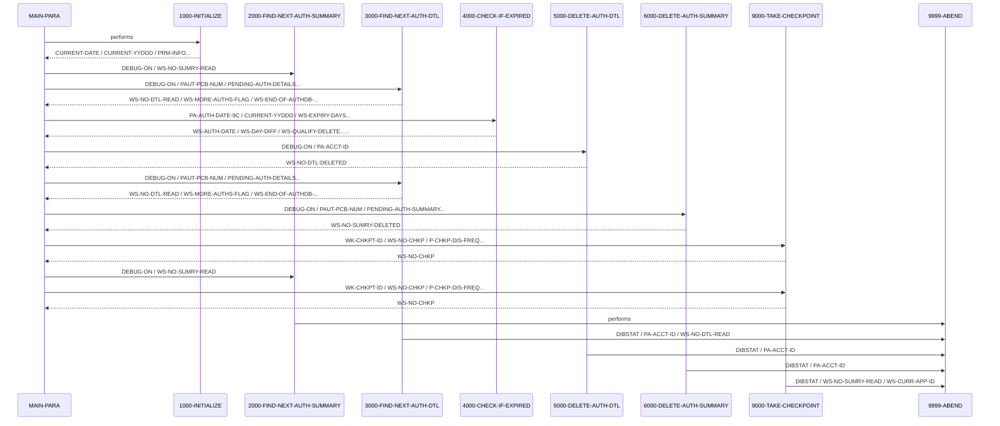

# CBPAUP0C

**File:** CBPAUP0C.cbl
**Type:** COBOL
**Status:** In Progress
**Iterations:** 1
**Analyzed:** 2026-03-04 04:54:22.737422

## Purpose

CBPAUP0C is a batch COBOL IMS program that deletes expired pending authorization messages from the IMS database. It reads pending authorization summary and detail segments, checks if the authorization has expired based on a configurable expiry period, and deletes the detail segment if expired. It also deletes the summary segment if all its detail segments have been deleted.

**Business Context:** This program is part of the CardDemo application and is used to clean up expired authorization records, ensuring the database remains efficient and only contains relevant data.
**Program Type:** BATCH
**Citations:** Lines 2, 5, 140, 157

## Calling Context

**Linkage Section:** IO-PCB-MASK, PGM-PCB-MASK

## Inputs

### SYSIN
- **Type:** PARAMETER
- **Description:** Contains parameters for expiry days, checkpoint frequency, checkpoint display frequency, and debug flag.
- **Lines:** 189

### PAUTSUM0
- **Type:** IMS_SEGMENT
- **Description:** Pending Authorization Summary segment. Contains summary information about pending authorizations.
- **Copybook:** [CIPAUSMY](../copybooks/CIPAUSMY.cpy.md)
- **Lines:** 224

### PAUTDTL1
- **Type:** IMS_SEGMENT
- **Description:** Pending Authorization Detail segment. Contains detailed information about individual pending authorizations.
- **Copybook:** [CIPAUDTY](../copybooks/CIPAUDTY.cpy.md)
- **Lines:** 256

## Outputs

### IMS Database
- **Type:** IMS_SEGMENT
- **Description:** The program deletes expired PAUTDTL1 and PAUTSUM0 segments from the IMS database.
- **Lines:** 150, 157

### SYSOUT
- **Type:** REPORT
- **Description:** Displays summary counts of records read and deleted, as well as debugging information if the debug flag is enabled.
- **Lines:** 173, 174, 175, 176, 190, 192, 193, 220, 252, 267, 268

## Business Rules

### BR001: An authorization detail is considered expired if its authorization date (PA-AUTH-DATE) is older than the current date minus the expiry days (P-EXPIRY-DAYS).
**Logic:** Calculates the difference between the current date and the authorization date and compares it to the expiry days.
**Conditions:** IF WS-DAY-DIFF > WS-EXPIRY-DAYS
**Lines:** 147, 45, 46, 99

### BR002: The program takes a checkpoint if the number of processed summary records (WS-AUTH-SMRY-PROC-CNT) exceeds the checkpoint frequency (P-CHKP-FREQ).
**Logic:** Compares WS-AUTH-SMRY-PROC-CNT to P-CHKP-FREQ.
**Conditions:** IF WS-AUTH-SMRY-PROC-CNT > P-CHKP-FREQ
**Lines:** 160, 101

## Copybooks Used

| Copybook | Location | Purpose | Line |
|----------|----------|---------|------|
| [CIPAUSMY](../copybooks/CIPAUSMY.cpy.md) | WORKING_STORAGE | Defines the layout of the PENDING-AUTH-SUMMARY segment. | 117 |
| [CIPAUDTY](../copybooks/CIPAUDTY.cpy.md) | WORKING_STORAGE | Defines the layout of the PENDING-AUTH-DETAILS segment. | 121 |

## Data Flow

### Reads From
- **SYSIN**: P-EXPIRY-DAYS, P-CHKP-FREQ, P-CHKP-DIS-FREQ, P-DEBUG-FLAG
  (Lines: 189)
- **PAUTSUM0**: PA-ACCT-ID, PA-APPROVED-AUTH-CNT, PA-REJECTED-AUTH-CNT
  (Lines: 224, 233, 156)
- **PAUTDTL1**: PA-AUTH-DATE
  (Lines: 256)

### Writes To
- **IMS Database (PAUTDTL1)**: all fields
  (Lines: 150)
- **IMS Database (PAUTSUM0)**: all fields
  (Lines: 157)

### Transformations
- **CURRENT-YYDDD** → **WS-AUTH-DATE**: Calculates the authorization date by subtracting the authorization date (PA-AUTH-DATE) from the current date (CURRENT-YYDDD).
  (Lines: 187, 45)
- **CURRENT-YYDDD, PA-AUTH-DATE** → **WS-DAY-DIFF**: Calculates the difference in days between the current date and the authorization date.
  (Lines: 147, 47)

## Key Paragraphs

### MAIN-PARA
**Purpose:** This is the main control paragraph of the CBPAUP0C program. It orchestrates the deletion of expired pending authorization messages. First, it calls 1000-INITIALIZE to initialize variables and read parameters. Then, it enters a loop that reads pending authorization summary records using 2000-FIND-NEXT-AUTH-SUMMARY. For each summary record, it enters another loop to read the associated detail records using 3000-FIND-NEXT-AUTH-DTL. Within the inner loop, 4000-CHECK-IF-EXPIRED determines if a detail record is expired, and if so, 5000-DELETE-AUTH-DTL deletes it. After processing all detail records for a summary, 6000-DELETE-AUTH-SUMMARY deletes the summary record if it has no remaining detail records. Checkpoints are taken periodically using 9000-TAKE-CHECKPOINT based on the WS-AUTH-SMRY-PROC-CNT and P-CHKP-FREQ parameters. The program terminates after processing all summary records, displaying summary statistics before exiting.
- Calls: 1000-INITIALIZE, 2000-FIND-NEXT-AUTH-SUMMARY, 3000-FIND-NEXT-AUTH-DTL, 4000-CHECK-IF-EXPIRED, 5000-DELETE-AUTH-DTL, 6000-DELETE-AUTH-SUMMARY, 9000-TAKE-CHECKPOINT
- Lines: 136-180

### 1000-INITIALIZE
**Purpose:** This paragraph initializes the program by accepting the current date and parameters from SYSIN. It moves the accepted date to CURRENT-DATE and CURRENT-YYDDD. It then accepts the PRM-INFO parameters from SYSIN, displaying them for debugging purposes. It validates the P-EXPIRY-DAYS parameter, defaulting to 5 if it's not numeric. It also validates P-CHKP-FREQ and P-CHKP-DIS-FREQ, defaulting to 5 and 10 respectively if they are spaces, 0, or LOW-VALUES. Finally, it ensures that the P-DEBUG-FLAG is either 'Y' or 'N', defaulting to 'N' if it's not 'Y'. This paragraph ensures that the program has valid configuration parameters before proceeding with the main processing logic. No error handling is performed beyond defaulting invalid parameters.
- Called by: MAIN-PARA
- Lines: 183-213

### 2000-FIND-NEXT-AUTH-SUMMARY
**Purpose:** This paragraph retrieves the next pending authorization summary segment (PAUTSUM0) from the IMS database. It uses the EXEC DLI GN command with the PCB specified by PAUT-PCB-NUM to retrieve the next segment. If the DEBUG-ON flag is set, it displays the current value of WS-NO-SUMRY-READ. After the IMS call, it evaluates the DIBSTAT return code. If the return code is '  ', it sets NOT-END-OF-AUTHDB to TRUE, increments WS-NO-SUMRY-READ and WS-AUTH-SMRY-PROC-CNT, and moves PA-ACCT-ID to WS-CURR-APP-ID. If the return code is 'GB', it sets END-OF-AUTHDB to TRUE, indicating the end of the database. If the return code is anything else, it displays an error message and calls 9999-ABEND to terminate the program. This paragraph is responsible for reading the summary segments and handling any errors encountered during the read process.
- Called by: MAIN-PARA
- Calls: 9999-ABEND
- Lines: 216-244

### 3000-FIND-NEXT-AUTH-DTL
**Purpose:** This paragraph retrieves the next pending authorization detail segment (PAUTDTL1) from the IMS database for the current summary record. It uses the EXEC DLI GNP command with the PCB specified by PAUT-PCB-NUM to retrieve the next segment. If the DEBUG-ON flag is set, it displays the current value of WS-NO-DTL-READ. After the IMS call, it evaluates the DIBSTAT return code. If the return code is '  ', it sets MORE-AUTHS to TRUE and increments WS-NO-DTL-READ. If the return code is 'GE' or 'GB', it sets NO-MORE-AUTHS to TRUE, indicating the end of the detail segments for the current summary. If the return code is anything else, it displays an error message, the PA-ACCT-ID, and calls 9999-ABEND to terminate the program. This paragraph is responsible for reading the detail segments and handling any errors encountered during the read process.
- Called by: MAIN-PARA
- Lines: 248-269

### 4000-CHECK-IF-EXPIRED
**Purpose:** UNKNOWN - The source code for this paragraph is not provided in the snippet.  It is likely responsible for determining if the current authorization detail record has expired based on the PA-AUTH-DATE and the configured expiry period (P-EXPIRY-DAYS). It would calculate the difference between the current date and the authorization date and compare it to the expiry period. If the authorization is expired, it would set the QUALIFIED-FOR-DELETE flag to TRUE. This paragraph implements the core business rule for determining which authorization details should be deleted.
- Called by: MAIN-PARA

### 5000-DELETE-AUTH-DTL
**Purpose:** UNKNOWN - The source code for this paragraph is not provided in the snippet. It is likely responsible for deleting the current authorization detail segment (PAUTDTL1) from the IMS database. It would use the EXEC DLI DLET command with the PCB specified by PAUT-PCB-NUM to delete the segment. It would also update counters such as WS-NO-DTL-DELETED. This paragraph implements the physical deletion of expired authorization details.
- Called by: MAIN-PARA

### 6000-DELETE-AUTH-SUMMARY
**Purpose:** UNKNOWN - The source code for this paragraph is not provided in the snippet. It is likely responsible for deleting the current authorization summary segment (PAUTSUM0) from the IMS database if all its detail segments have been deleted. It would check if PA-APPROVED-AUTH-CNT and PA-REJECTED-AUTH-CNT are both zero. If so, it would use the EXEC DLI DLET command with the PCB specified by PAUT-PCB-NUM to delete the segment. It would also update counters such as WS-NO-SUMRY-DELETED. This paragraph ensures that summary records with no associated detail records are also removed from the database.
- Called by: MAIN-PARA

### 9000-TAKE-CHECKPOINT
**Purpose:** UNKNOWN - The source code for this paragraph is not provided in the snippet. It is likely responsible for taking a checkpoint to ensure data consistency and recoverability. It might use the EXEC DLI CHKP command. It may also display checkpoint statistics based on P-CHKP-DIS-FREQ. This paragraph contributes to the overall reliability of the program.
- Called by: MAIN-PARA

## Inter-Paragraph Data Flow

| Caller | Callee | Inputs | Outputs | Purpose |
|--------|--------|--------|---------|---------|
| MAIN-PARA | 1000-INITIALIZE | - | CURRENT-DATE, CURRENT-YYDDD, PRM-INFO, WS-EXPIRY-DAYS, P-CHKP-FREQ, P-CHKP-DIS-FREQ, P-DEBUG-FLAG | Initializes program variables by accepting current date, parameters, and setting default values for expiry days, checkpoint frequencies, and debug flag. |
| MAIN-PARA | 2000-FIND-NEXT-AUTH-SUMMARY | DEBUG-ON, WS-NO-SUMRY-READ | - | Displays a debug message with the count of summary records read if debug mode is enabled. |
| MAIN-PARA | 3000-FIND-NEXT-AUTH-DTL | DEBUG-ON, WS-NO-DTL-READ | PENDING-AUTH-DETAILS, WS-NO-DTL-READ, WS-MORE-AUTHS-FLAG, WS-END-OF-AUTHDB-FLAG | Reads the next pending authorization detail segment from the IMS database and updates read count and control flags based on the result. |
| MAIN-PARA | 4000-CHECK-IF-EXPIRED | PA-AUTH-DATE-9C, CURRENT-YYDDD, WS-EXPIRY-DAYS, PA-AUTH-RESP-CODE, PA-APPROVED-AMT, PA-TRANSACTION-AMT | WS-AUTH-DATE, WS-DAY-DIFF, WS-QUALIFY-DELETE-FLAG, PA-APPROVED-AUTH-CNT, PA-APPROVED-AUTH-AMT, PA-DECLINED-AUTH-CNT, PA-DECLINED-AUTH-AMT | Checks if an authorization detail is expired based on the difference between current date and authorization date, and updates counts and flags accordingly. |
| MAIN-PARA | 5000-DELETE-AUTH-DTL | DEBUG-ON, PA-ACCT-ID | WS-NO-DTL-DELETED | Deletes the current authorization detail segment from the IMS database and increments the deletion counter if successful. |
| MAIN-PARA | 3000-FIND-NEXT-AUTH-DTL | DEBUG-ON, PAUT-PCB-NUM, PENDING-AUTH-DETAILS, WS-NO-DTL-READ | WS-NO-DTL-READ, WS-MORE-AUTHS-FLAG, WS-END-OF-AUTHDB-FLAG | Reads the next pending authorization detail record from the IMS database and updates counters and flags accordingly. |
| MAIN-PARA | 6000-DELETE-AUTH-SUMMARY | DEBUG-ON, PAUT-PCB-NUM, PENDING-AUTH-SUMMARY, PA-ACCT-ID | WS-NO-SUMRY-DELETED | Deletes the current pending authorization summary record from the IMS database and increments the deletion counter if successful. |
| MAIN-PARA | 9000-TAKE-CHECKPOINT | WK-CHKPT-ID, WS-NO-CHKP, P-CHKP-DIS-FREQ, WS-NO-SUMRY-READ, WS-CURR-APP-ID | WS-NO-CHKP | Takes an IMS checkpoint and displays success or failure based on the checkpoint status, resetting the display frequency counter when needed. |
| MAIN-PARA | 2000-FIND-NEXT-AUTH-SUMMARY | DEBUG-ON, WS-NO-SUMRY-READ | - | Displays a debug message with the current count of authorization summaries read if debug mode is enabled. |
| MAIN-PARA | 9000-TAKE-CHECKPOINT | WK-CHKPT-ID, WS-NO-CHKP, P-CHKP-DIS-FREQ, WS-NO-SUMRY-READ, WS-CURR-APP-ID | WS-NO-CHKP | Takes an IMS checkpoint and displays success or failure based on the checkpoint status, resetting the display frequency counter when needed. |
| 2000-FIND-NEXT-AUTH-SUMMARY | 9999-ABEND | - | - | Abends the program with return code 16 when called. |
| 3000-FIND-NEXT-AUTH-DTL | 9999-ABEND | DIBSTAT, PA-ACCT-ID, WS-NO-DTL-READ | - | Abends the program with return code 16 when an unexpected IMS status code is encountered during detail segment retrieval. |
| 5000-DELETE-AUTH-DTL | 9999-ABEND | DIBSTAT, PA-ACCT-ID | - | Abends the program with return code 16 if the deletion of an authorization detail segment fails. |
| 6000-DELETE-AUTH-SUMMARY | 9999-ABEND | DIBSTAT, PA-ACCT-ID | - | Abends the program with return code 16 if the deletion of an authorization summary segment fails. |
| 9000-TAKE-CHECKPOINT | 9999-ABEND | DIBSTAT, WS-NO-SUMRY-READ, WS-CURR-APP-ID | - | Abends the program with return code 16 if the checkpoint operation fails in IMS. |

## Error Handling

- **DIBSTAT not equal to ' ' or 'GB':** DISPLAY error message and ABEND
  (Lines: 237, 240)
- **DIBSTAT not equal to ' ' or 'GE' or 'GB':** DISPLAY error message and ABEND
  (Lines: 267)

## Open Questions

- **What is the exact logic within paragraph 4000-CHECK-IF-EXPIRED for determining if an authorization detail record is expired?**
  - Context: The source code for this paragraph is missing.
  - Suggestion: Review the complete source code or related documentation to understand the expiration logic.
- **What is the exact DLI command used in 5000-DELETE-AUTH-DTL to delete the authorization detail segment?**
  - Context: The source code for this paragraph is missing.
  - Suggestion: Review the complete source code to determine the DLI command used for deletion.
- **What is the exact DLI command used in 6000-DELETE-AUTH-SUMMARY to delete the authorization summary segment?**
  - Context: The source code for this paragraph is missing.
  - Suggestion: Review the complete source code to determine the DLI command used for deletion.

## Resolved Questions

- **Q:** What is the implementation of 9999-ABEND?
  **A:** ```cbl
377        9999-ABEND.
 378         *----------------------------------------------------------------*
 379         *
 380              DISPLAY 'CBPAUP0C ABENDING ...'
 381   
 382              MOVE 16 TO RETURN-CODE
```

The implementation of `9999-ABEND` is to display the message `CBPAUP0C ABENDING ...` and then move the value `16` to `RETURN-CODE`. This will cause the program to terminate with an abend code of 16. (Source: `cbl/CBPAUP0C.cbl`)
- **Q:** What is the exact implementation of the checkpoint logic in 9000-TAKE-CHECKPOINT?
  **A:** ```cobol
352        9000-TAKE-CHECKPOINT.
353         *----------------------------------------------------------------*
354         *
355              EXEC DLI CHKP ID(WK-CHKPT-ID)
356              END-EXEC
357         *
```

The checkpoint logic in `9000-TAKE-CHECKPOINT` consists of a DLI CHKP call with ID `WK-CHKPT-ID`. This call establishes a checkpoint in the IMS database processing, allowing for restart from this point in case of failure.

## Sequence Diagram


```mermaid
sequenceDiagram
    participant MAIN_PARA as MAIN-PARA
    participant 1000_INITIALIZE as 1000-INITIALIZE
    participant 2000_FIND_NEXT_AUTH_SUMMARY as 2000-FIND-NEXT-AUTH-SUMMARY
    participant 3000_FIND_NEXT_AUTH_DTL as 3000-FIND-NEXT-AUTH-DTL
    participant 4000_CHECK_IF_EXPIRED as 4000-CHECK-IF-EXPIRED
    participant 5000_DELETE_AUTH_DTL as 5000-DELETE-AUTH-DTL
    participant 6000_DELETE_AUTH_SUMMARY as 6000-DELETE-AUTH-SUMMARY
    participant 9000_TAKE_CHECKPOINT as 9000-TAKE-CHECKPOINT
    participant 9999_ABEND as 9999-ABEND
    MAIN_PARA->>1000_INITIALIZE: performs
    1000_INITIALIZE-->>MAIN_PARA: CURRENT-DATE / CURRENT-YYDDD / PRM-INFO...
    MAIN_PARA->>2000_FIND_NEXT_AUTH_SUMMARY: DEBUG-ON / WS-NO-SUMRY-READ
    MAIN_PARA->>3000_FIND_NEXT_AUTH_DTL: DEBUG-ON / PAUT-PCB-NUM / PENDING-AUTH-DETAILS...
    3000_FIND_NEXT_AUTH_DTL-->>MAIN_PARA: WS-NO-DTL-READ / WS-MORE-AUTHS-FLAG / WS-END-OF-AUTHDB-...
    MAIN_PARA->>4000_CHECK_IF_EXPIRED: PA-AUTH-DATE-9C / CURRENT-YYDDD / WS-EXPIRY-DAYS...
    4000_CHECK_IF_EXPIRED-->>MAIN_PARA: WS-AUTH-DATE / WS-DAY-DIFF / WS-QUALIFY-DELETE......
    MAIN_PARA->>5000_DELETE_AUTH_DTL: DEBUG-ON / PA-ACCT-ID
    5000_DELETE_AUTH_DTL-->>MAIN_PARA: WS-NO-DTL-DELETED
    MAIN_PARA->>3000_FIND_NEXT_AUTH_DTL: DEBUG-ON / PAUT-PCB-NUM / PENDING-AUTH-DETAILS...
    3000_FIND_NEXT_AUTH_DTL-->>MAIN_PARA: WS-NO-DTL-READ / WS-MORE-AUTHS-FLAG / WS-END-OF-AUTHDB-...
    MAIN_PARA->>6000_DELETE_AUTH_SUMMARY: DEBUG-ON / PAUT-PCB-NUM / PENDING-AUTH-SUMMARY...
    6000_DELETE_AUTH_SUMMARY-->>MAIN_PARA: WS-NO-SUMRY-DELETED
    MAIN_PARA->>9000_TAKE_CHECKPOINT: WK-CHKPT-ID / WS-NO-CHKP / P-CHKP-DIS-FREQ...
    9000_TAKE_CHECKPOINT-->>MAIN_PARA: WS-NO-CHKP
    MAIN_PARA->>2000_FIND_NEXT_AUTH_SUMMARY: DEBUG-ON / WS-NO-SUMRY-READ
    MAIN_PARA->>9000_TAKE_CHECKPOINT: WK-CHKPT-ID / WS-NO-CHKP / P-CHKP-DIS-FREQ...
    9000_TAKE_CHECKPOINT-->>MAIN_PARA: WS-NO-CHKP
    2000_FIND_NEXT_AUTH_SUMMARY->>9999_ABEND: performs
    3000_FIND_NEXT_AUTH_DTL->>9999_ABEND: DIBSTAT / PA-ACCT-ID / WS-NO-DTL-READ
    5000_DELETE_AUTH_DTL->>9999_ABEND: DIBSTAT / PA-ACCT-ID
    6000_DELETE_AUTH_SUMMARY->>9999_ABEND: DIBSTAT / PA-ACCT-ID
    9000_TAKE_CHECKPOINT->>9999_ABEND: DIBSTAT / WS-NO-SUMRY-READ / WS-CURR-APP-ID
```

---
*Generated by War Rig WAR_RIG*