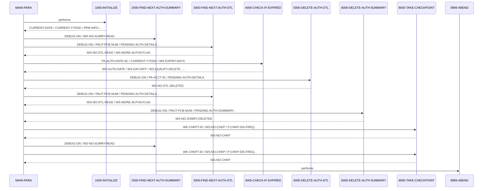

# CBPAUP0C

**File:** CBPAUP0C.cbl
**Type:** COBOL
**Status:** In Progress
**Iterations:** 1
**Analyzed:** 2026-03-03 16:55:19.522080

## Purpose

The CBPAUP0C program is a batch COBOL IMS program that deletes expired pending authorization messages from the IMS database. It reads pending authorization summary and detail segments, checks if they are expired based on a configurable expiry period, and deletes the expired detail segments and summary segments if they have no remaining active details. The program also takes checkpoints periodically to ensure recoverability.

**Business Context:** This program maintains the authorization database by removing old and irrelevant authorization records, which helps to optimize database performance and reduce storage costs.
**Program Type:** BATCH
**Citations:** Lines 3, 247, 262

## Calling Context

**Linkage Section:** IO-PCB-MASK, PGM-PCB-MASK

## Inputs

### SYSIN
- **Type:** PARAMETER
- **Description:** Contains parameters for the program, including expiry days, checkpoint frequency, checkpoint display frequency, and debug flag.
- **Lines:** 270

### PAUTSUM0
- **Type:** IMS_SEGMENT
- **Description:** Pending Authorization Summary segment from IMS database.
- **Copybook:** [CIPAUSMY](../copybooks/CIPAUSMY.cpy.md)
- **Lines:** 315

### PAUTDTL1
- **Type:** IMS_SEGMENT
- **Description:** Pending Authorization Detail segment from IMS database.
- **Copybook:** [CIPAUDTY](../copybooks/CIPAUDTY.cpy.md)
- **Lines:** 349

## Outputs

### IMS Database
- **Type:** IMS_SEGMENT
- **Description:** Updates the IMS database by deleting expired pending authorization detail and summary segments.
- **Lines:** 390, 416

### SYSOUT
- **Type:** REPORT
- **Description:** Displays program statistics and debug messages.
- **Lines:** 271, 272, 273, 274, 275, 276, 277, 278, 279, 280, 432, 433, 434, 435, 436, 437, 438, 439

## Business Rules

### BR001: Delete authorization detail records if they are expired.
**Logic:** Compares the authorization date with the current date and expiry days to determine if the record is expired.
**Conditions:** IF QUALIFIED-FOR-DELETE
**Lines:** 387, 389

### BR002: Delete authorization summary records if there are no approved or pending authorization details.
**Logic:** Checks if the approved and pending authorization counts are zero.
**Conditions:** IF PA-APPROVED-AUTH-CNT <= 0 AND PA-APPROVED-AUTH-CNT <= 0
**Lines:** 413, 415

## Copybooks Used

| Copybook | Location | Purpose | Line |
|----------|----------|---------|------|
| [CIPAUSMY](../copybooks/CIPAUSMY.cpy.md) | WORKING_STORAGE | Defines the layout of the PENDING-AUTH-SUMMARY segment. | 159 |
| [CIPAUDTY](../copybooks/CIPAUDTY.cpy.md) | WORKING_STORAGE | Defines the layout of the PENDING-AUTH-DETAILS segment. | 163 |

## Data Flow

### Reads From
- **SYSIN**: P-EXPIRY-DAYS, P-CHKP-FREQ, P-CHKP-DIS-FREQ, P-DEBUG-FLAG
  (Lines: 270)
- **PAUTSUM0**: PA-ACCT-ID, PA-APPROVED-AUTH-CNT, PA-PENDING-AUTH-CNT
  (Lines: 315, 321)
- **PAUTDTL1**: PA-AUTH-DATE
  (Lines: 349)

### Writes To
- **IMS Database (PAUTDTL1)**: all fields
  (Lines: 390)
- **IMS Database (PAUTSUM0)**: all fields
  (Lines: 416)

### Transformations
- **P-EXPIRY-DAYS** → **WS-EXPIRY-DAYS**: Converts expiry days from parameter to working storage variable. Defaults to 5 if input is not numeric.
  (Lines: 283, 286)
- **CURRENT-YYDDD** → **WS-AUTH-DATE**: Calculates the difference between the current date and the authorization date to determine if the authorization is expired.
  (Lines: 378)

## Key Paragraphs

### MAIN-PARA
**Purpose:** This is the main control paragraph of the CBPAUP0C program. It orchestrates the process of deleting expired pending authorization messages. The paragraph first performs 1000-INITIALIZE to set up the program environment, including accepting parameters from SYSIN and initializing working storage variables. Then, it enters a loop that continues until an error occurs or the end of the authorization database is reached. Inside the loop, it retrieves the next authorization summary record using 2000-FIND-NEXT-AUTH-SUMMARY. For each summary record, it retrieves associated detail records using 3000-FIND-NEXT-AUTH-DTL. It then checks if each detail record is expired using 4000-CHECK-IF-EXPIRED. If a detail record is expired, it is deleted using 5000-DELETE-AUTH-DTL. After processing all detail records for a summary record, the paragraph checks if the summary record has any remaining approved or pending authorizations. If not, the summary record is deleted using 6000-DELETE-AUTH-SUMMARY. Periodically, the program takes a checkpoint using 9000-TAKE-CHECKPOINT to ensure recoverability. Finally, the paragraph displays program statistics and terminates.
- Calls: 1000-INITIALIZE, 2000-FIND-NEXT-AUTH-SUMMARY
- Lines: 247-262

### 1000-INITIALIZE
**Purpose:** This paragraph initializes the program environment. It accepts the current date and day from the system. It then accepts program parameters from SYSIN, including the expiry days, checkpoint frequency, checkpoint display frequency, and debug flag. It displays the received parameters and today's date to the SYSOUT. It validates the input parameters, setting default values if they are invalid or missing. Specifically, if the expiry days parameter is not numeric, it defaults to 5. If the checkpoint frequency or display frequency parameters are spaces, 0, or LOW-VALUES, they default to 5 and 10 respectively. If the debug flag is not 'Y', it defaults to 'N'.
- Called by: MAIN-PARA
- Lines: 264-294

### 2000-FIND-NEXT-AUTH-SUMMARY
**Purpose:** This paragraph retrieves the next pending authorization summary segment from the IMS database. It uses the EXEC DLI GN command with the PAUTSUM0 segment name to retrieve the next segment. Before the DLI call, it checks if the debug flag is on and displays the number of summary records read so far. After the DLI call, it evaluates the DIBSTAT return code. If the return code is '  ', it sets the NOT-END-OF-AUTHDB flag to TRUE, increments the summary record read count (WS-NO-SUMRY-READ), increments the summary processing count (WS-AUTH-SMRY-PROC-CNT), and moves the account ID to WS-CURR-APP-ID. If the return code is 'GB', it sets the END-OF-AUTHDB flag to TRUE. If the return code is anything else, it displays an error message with the DIBSTAT value and the number of summary records read before the error, and then abends the program using 9999-ABEND.
- Called by: MAIN-PARA
- Lines: 297-330

## Inter-Paragraph Data Flow

| Caller | Callee | Inputs | Outputs | Purpose |
|--------|--------|--------|---------|---------|
| MAIN-PARA | 1000-INITIALIZE | - | CURRENT-DATE, CURRENT-YYDDD, PRM-INFO, WS-EXPIRY-DAYS, P-CHKP-FREQ, P-CHKP-DIS-FREQ, P-DEBUG-FLAG | Initializes program variables by reading current date, parameters from SYSIN, and setting default values for expiry days, checkpoint frequencies, and debug flag. |
| MAIN-PARA | 2000-FIND-NEXT-AUTH-SUMMARY | DEBUG-ON, WS-NO-SUMRY-READ | - | Displays a debug message with the count of summary records read if debug mode is enabled. |
| MAIN-PARA | 3000-FIND-NEXT-AUTH-DTL | DEBUG-ON, WS-NO-DTL-READ | PENDING-AUTH-DETAILS, WS-NO-DTL-READ, WS-MORE-AUTHS-FLAG, WS-END-OF-AUTHDB-FLAG | Retrieves the next authorization detail segment from the IMS database and updates read count and control flags based on the retrieval status. |
| MAIN-PARA | 4000-CHECK-IF-EXPIRED | PA-AUTH-DATE-9C, CURRENT-YYDDD, WS-EXPIRY-DAYS | WS-AUTH-DATE, WS-DAY-DIFF, WS-QUALIFY-DELETE-FLAG, PA-APPROVED-AUTH-CNT, PA-APPROVED-AUTH-AMT, PA-DECLINED-AUTH-CNT, PA-DECLINED-AUTH-AMT | Checks if an authorization detail is expired based on the difference between current date and authorization date, and updates counts accordingly if deletion is qualified. |
| MAIN-PARA | 5000-DELETE-AUTH-DTL | DEBUG-ON, PA-ACCT-ID, PENDING-AUTH-DETAILS | WS-NO-DTL-DELETED | Deletes the current authorization detail segment from the IMS database and increments the deletion counter if successful, otherwise abends. |
| MAIN-PARA | 3000-FIND-NEXT-AUTH-DTL | DEBUG-ON, PAUT-PCB-NUM, PENDING-AUTH-DETAILS, WS-NO-DTL-READ | WS-NO-DTL-READ, WS-MORE-AUTHS-FLAG | Reads the next pending authorization detail record from the IMS database and updates read count and flag indicating if more details exist. |
| MAIN-PARA | 6000-DELETE-AUTH-SUMMARY | DEBUG-ON, PAUT-PCB-NUM, PENDING-AUTH-SUMMARY, PA-ACCT-ID | WS-NO-SUMRY-DELETED | Deletes the current pending authorization summary record from the IMS database and increments the deletion counter if successful. |
| MAIN-PARA | 9000-TAKE-CHECKPOINT | WK-CHKPT-ID, WS-NO-CHKP, P-CHKP-DIS-FREQ, WS-NO-SUMRY-READ, WS-CURR-APP-ID | WS-NO-CHKP | Takes an IMS checkpoint and displays success or failure based on the checkpoint status, resetting the checkpoint counter when display frequency is reached. |
| MAIN-PARA | 2000-FIND-NEXT-AUTH-SUMMARY | DEBUG-ON, WS-NO-SUMRY-READ | - | Displays a debug message with the current authorization summary read count if debug mode is enabled. |
| MAIN-PARA | 9000-TAKE-CHECKPOINT | WK-CHKPT-ID, WS-NO-CHKP, P-CHKP-DIS-FREQ, WS-NO-SUMRY-READ, WS-CURR-APP-ID | WS-NO-CHKP | Takes an IMS checkpoint and displays success or failure based on the checkpoint status, resetting the checkpoint counter when display frequency is reached. |
| 2000-FIND-NEXT-AUTH-SUMMARY | 9999-ABEND | - | - | Abends the program with return code 16 when called. |
| 3000-FIND-NEXT-AUTH-DTL | 9999-ABEND | WS-NO-DTL-READ, PA-ACCT-ID | - | Abends the program with return code 16 upon failure to read an authorization detail segment. |
| 5000-DELETE-AUTH-DTL | 9999-ABEND | PA-ACCT-ID | - | Abends the program with return code 16 if deletion of an authorization detail segment fails. |
| 6000-DELETE-AUTH-SUMMARY | 9999-ABEND | PA-ACCT-ID | - | Abends the program with return code 16 if deletion of an authorization summary segment fails. |
| 9000-TAKE-CHECKPOINT | 9999-ABEND | DIBSTAT, WS-NO-SUMRY-READ, WS-CURR-APP-ID | - | Abends the program with return code 16 if the checkpoint operation fails. |

## Error Handling

- **DIBSTAT not equal to ' ' or 'GB':** DISPLAY error message and ABEND
  (Lines: 323, 324, 325)

## Open Questions

- **What is the exact logic in 4000-CHECK-IF-EXPIRED?**
  - Context: The code for this paragraph is missing in the provided source.
  - Suggestion: Need the complete source code to analyze this paragraph.
- **What is the exact logic in 5000-DELETE-AUTH-DTL?**
  - Context: The code for this paragraph is missing in the provided source.
  - Suggestion: Need the complete source code to analyze this paragraph.
- **What is the exact logic in 6000-DELETE-AUTH-SUMMARY?**
  - Context: The code for this paragraph is missing in the provided source.
  - Suggestion: Need the complete source code to analyze this paragraph.
- **What is the exact logic in 9000-TAKE-CHECKPOINT?**
  - Context: The code for this paragraph is missing in the provided source.
  - Suggestion: Need the complete source code to analyze this paragraph.
- **What is the exact logic in 3000-FIND-NEXT-AUTH-DTL?**
  - Context: The code for this paragraph is incomplete in the provided source.
  - Suggestion: Need the complete source code to analyze this paragraph.

## Resolved Questions

- **Q:** What is the purpose of WK-CHKPT-ID and how is it used?
  **A:** WK-CHKPT-ID is used as the ID parameter in the `EXEC DLI CHKP` command, which takes a checkpoint. It consists of a fixed value 'RMAD' and a 4-digit counter WK-CHKPT-ID-CTR, which is initialized to zero. The checkpoint is taken in paragraph 9000-TAKE-CHECKPOINT.
- **Q:** What is the purpose of P-CHKP-DIS-FREQ?
  **A:** Based on the code search results, `P-CHKP-DIS-FREQ` appears to control the frequency of checkpoint display messages.

Specifically:

*   It's defined as a 5-character field in the `PRM-INFO` structure (line 103).
*   If it's initially spaces, zero, or low-values, it defaults to a value of 10 (lines 204-205).
*   The program increments `WS-NO-CHKP` after each checkpoint (line 359).
*   When `WS-NO-CHKP` is greater than or equal to `P-CHKP-DIS-FREQ`, the program displays a checkpoint success message and resets `WS-NO-CHKP` to 0 (lines 360-362).

Therefore, `P-CHKP-DIS-FREQ` determines how many checkpoints occur before a "CHKP SUCCESS" message is displayed.

## Sequence Diagram

```mermaid
sequenceDiagram
    participant MAIN_PARA as MAIN-PARA
    participant 1000_INITIALIZE as 1000-INITIALIZE
    participant 2000_FIND_NEXT_AUTH_SUMMARY as 2000-FIND-NEXT-AUTH-SUMMARY
    participant 3000_FIND_NEXT_AUTH_DTL as 3000-FIND-NEXT-AUTH-DTL
    participant 4000_CHECK_IF_EXPIRED as 4000-CHECK-IF-EXPIRED
    participant 5000_DELETE_AUTH_DTL as 5000-DELETE-AUTH-DTL
    participant 6000_DELETE_AUTH_SUMMARY as 6000-DELETE-AUTH-SUMMARY
    participant 9000_TAKE_CHECKPOINT as 9000-TAKE-CHECKPOINT
    participant 9999_ABEND as 9999-ABEND
    MAIN_PARA->>1000_INITIALIZE: performs
    1000_INITIALIZE-->>MAIN_PARA: CURRENT-DATE / CURRENT-YYDDD / PRM-INFO...
    MAIN_PARA->>2000_FIND_NEXT_AUTH_SUMMARY: DEBUG-ON / WS-NO-SUMRY-READ
    MAIN_PARA->>3000_FIND_NEXT_AUTH_DTL: DEBUG-ON / PAUT-PCB-NUM / PENDING-AUTH-DETAILS...
    3000_FIND_NEXT_AUTH_DTL-->>MAIN_PARA: WS-NO-DTL-READ / WS-MORE-AUTHS-FLAG
    MAIN_PARA->>4000_CHECK_IF_EXPIRED: PA-AUTH-DATE-9C / CURRENT-YYDDD / WS-EXPIRY-DAYS
    4000_CHECK_IF_EXPIRED-->>MAIN_PARA: WS-AUTH-DATE / WS-DAY-DIFF / WS-QUALIFY-DELETE......
    MAIN_PARA->>5000_DELETE_AUTH_DTL: DEBUG-ON / PA-ACCT-ID / PENDING-AUTH-DETAILS
    5000_DELETE_AUTH_DTL-->>MAIN_PARA: WS-NO-DTL-DELETED
    MAIN_PARA->>3000_FIND_NEXT_AUTH_DTL: DEBUG-ON / PAUT-PCB-NUM / PENDING-AUTH-DETAILS...
    3000_FIND_NEXT_AUTH_DTL-->>MAIN_PARA: WS-NO-DTL-READ / WS-MORE-AUTHS-FLAG
    MAIN_PARA->>6000_DELETE_AUTH_SUMMARY: DEBUG-ON / PAUT-PCB-NUM / PENDING-AUTH-SUMMARY...
    6000_DELETE_AUTH_SUMMARY-->>MAIN_PARA: WS-NO-SUMRY-DELETED
    MAIN_PARA->>9000_TAKE_CHECKPOINT: WK-CHKPT-ID / WS-NO-CHKP / P-CHKP-DIS-FREQ...
    9000_TAKE_CHECKPOINT-->>MAIN_PARA: WS-NO-CHKP
    MAIN_PARA->>2000_FIND_NEXT_AUTH_SUMMARY: DEBUG-ON / WS-NO-SUMRY-READ
    MAIN_PARA->>9000_TAKE_CHECKPOINT: WK-CHKPT-ID / WS-NO-CHKP / P-CHKP-DIS-FREQ...
    9000_TAKE_CHECKPOINT-->>MAIN_PARA: WS-NO-CHKP
    2000_FIND_NEXT_AUTH_SUMMARY->>9999_ABEND: performs
```

---
*Generated by War Rig WAR_RIG*