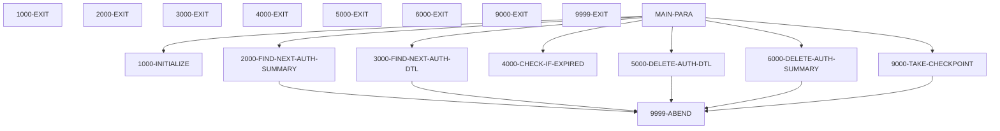
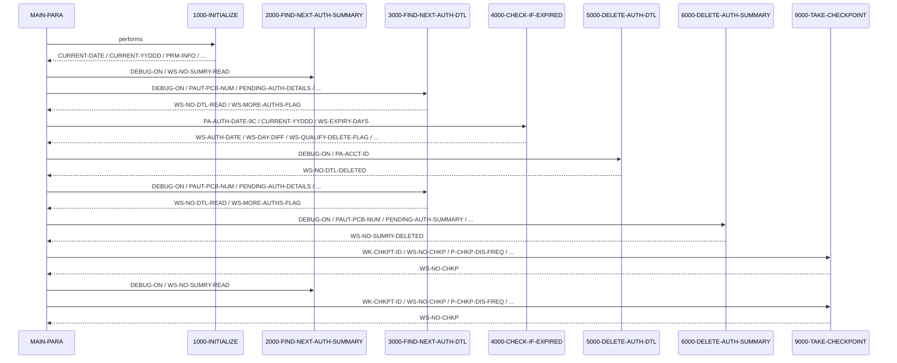

# CBPAUP0C

**File**: `cbl/CBPAUP0C.cbl`
**Type**: FileType.COBOL
**Analyzed**: 2026-03-04 03:39:41.179287

## Purpose

This batch COBOL IMS program, CBPAUP0C, deletes expired pending authorization messages from the IMS database. It reads pending authorization summary and detail segments, checks if the authorization has expired based on the expiry days parameter, and deletes the detail and summary segments if they qualify for deletion. The program takes checkpoint periodically and at the end of processing, and displays summary statistics of records read and deleted.

**Business Context**: This program is part of the CardDemo application's authorization module and is used to purge expired authorization records, likely to maintain database performance and reduce storage costs.

## Inputs

| Name | Type | Description |
|------|------|-------------|
| SYSIN | IOType.PARAMETER | Contains parameters for expiry days, checkpoint frequency, checkpoint display frequency, and debug flag. |
| PENDING-AUTH-SUMMARY | IOType.IMS_SEGMENT | IMS segment containing summary information for pending authorizations. |
| PENDING-AUTH-DETAILS | IOType.IMS_SEGMENT | IMS segment containing detail information for pending authorizations. |

## Outputs

| Name | Type | Description |
|------|------|-------------|
| PENDING-AUTH-SUMMARY | IOType.IMS_SEGMENT | IMS segment containing summary information for pending authorizations (deleted). |
| PENDING-AUTH-DETAILS | IOType.IMS_SEGMENT | IMS segment containing detail information for pending authorizations (deleted). |
| SYSOUT | IOType.REPORT | Displays program start message, parameter values, and summary statistics of records read and deleted. |

## Business Rules

- **BR001**: An authorization detail record is considered expired and qualified for deletion if the difference between the current date and the authorization date exceeds the expiry days specified in the input parameters.
- **BR002**: If the approved and declined authorization counts in the summary record are both zero, the summary record is deleted.

## Paragraphs/Procedures

### MAIN-PARA
> [Source: MAIN-PARA.cbl.md](CBPAUP0C.cbl.d/MAIN-PARA.cbl.md)
This is the main control paragraph of the program. It orchestrates the process of deleting expired pending authorization messages. It first calls 1000-INITIALIZE to perform initial setup tasks like accepting the current date and parameters from SYSIN. Then, it enters a loop that reads pending authorization summary records using 2000-FIND-NEXT-AUTH-SUMMARY. Inside this loop, it reads pending authorization detail records using 3000-FIND-NEXT-AUTH-DTL and checks if each detail record is expired using 4000-CHECK-IF-EXPIRED. If a detail record is expired (QUALIFIED-FOR-DELETE), it is deleted using 5000-DELETE-AUTH-DTL. After processing all detail records for a summary record, it checks if both the approved and declined authorization counts in the summary record are zero. If so, it deletes the summary record using 6000-DELETE-AUTH-SUMMARY. Periodically, based on the checkpoint frequency parameter (P-CHKP-FREQ), it takes a checkpoint using 9000-TAKE-CHECKPOINT. Finally, after processing all summary records, it takes a final checkpoint and displays summary statistics.

### 1000-INITIALIZE
> [Source: 1000-INITIALIZE.cbl.md](CBPAUP0C.cbl.d/1000-INITIALIZE.cbl.md)
This paragraph performs the initialization tasks for the program. It accepts the current date from the system using the ACCEPT statement and stores it in CURRENT-DATE and CURRENT-YYDDD. It also accepts the program parameters from SYSIN, storing them in the PRM-INFO group item. These parameters include the expiry days for pending authorizations (P-EXPIRY-DAYS), the checkpoint frequency (P-CHKP-FREQ), the checkpoint display frequency (P-CHKP-DIS-FREQ), and a debug flag (P-DEBUG-FLAG). Finally, it displays a starting message to the console, including the parameters received. No error handling is performed in this paragraph. It does not call any other paragraphs or programs.

## Dead Code

The following artifacts were identified as dead code by static analysis:

| Artifact | Type | Line | Reason |
|----------|------|------|--------|
| 9999-EXIT | paragraph | 385 | Paragraph '9999-EXIT' is never PERFORMed or referenced by any other paragraph or program |
| IO-PCB-MASK | record_layout | 128 | Record layout 'IO-PCB-MASK' is never used by any program |
| PGM-PCB-MASK | record_layout | 129 | Record layout 'PGM-PCB-MASK' is never used by any program |
| PRM-INFO | record_layout | 98 | Record layout 'PRM-INFO' is never used by any program |

## Control Flow

```mermaid
flowchart TD
    %% Title: CBPAUP0C.cbl
    1000_EXIT["1000-EXIT"]
    1000_INITIALIZE["1000-INITIALIZE"]
    2000_EXIT["2000-EXIT"]
    2000_FIND_NEXT_AUTH_SUMMARY["2000-FIND-NEXT-AUTH-SUMMARY"]
    9999_ABEND["9999-ABEND"]
    3000_EXIT["3000-EXIT"]
    3000_FIND_NEXT_AUTH_DTL["3000-FIND-NEXT-AUTH-DTL"]
    4000_CHECK_IF_EXPIRED["4000-CHECK-IF-EXPIRED"]
    4000_EXIT["4000-EXIT"]
    5000_DELETE_AUTH_DTL["5000-DELETE-AUTH-DTL"]
    5000_EXIT["5000-EXIT"]
    6000_DELETE_AUTH_SUMMARY["6000-DELETE-AUTH-SUMMARY"]
    6000_EXIT["6000-EXIT"]
    9000_EXIT["9000-EXIT"]
    9000_TAKE_CHECKPOINT["9000-TAKE-CHECKPOINT"]
    9999_EXIT["9999-EXIT"]
    MAIN_PARA["MAIN-PARA"]
    2000_FIND_NEXT_AUTH_SUMMARY --> 9999_ABEND
    3000_FIND_NEXT_AUTH_DTL --> 9999_ABEND
    5000_DELETE_AUTH_DTL --> 9999_ABEND
    6000_DELETE_AUTH_SUMMARY --> 9999_ABEND
    9000_TAKE_CHECKPOINT --> 9999_ABEND
    MAIN_PARA --> 1000_INITIALIZE
    MAIN_PARA --> 2000_FIND_NEXT_AUTH_SUMMARY
    MAIN_PARA --> 3000_FIND_NEXT_AUTH_DTL
    MAIN_PARA --> 4000_CHECK_IF_EXPIRED
    MAIN_PARA --> 5000_DELETE_AUTH_DTL
    MAIN_PARA --> 6000_DELETE_AUTH_SUMMARY
    MAIN_PARA --> 9000_TAKE_CHECKPOINT
```

## Open Questions

- ? What are the exact layouts of the CIPAUSMY and CIPAUDTY copybooks?
  - Context: The program uses these copybooks to define the IMS segment structures, but the copybooks themselves are not provided.
- ? What is the purpose of the IO-PCB-MASK and PGM-PCB-MASK linkage section variables?
  - Context: These are passed to the procedure division but not used in the visible code.
- ? What is the logic within paragraphs 2000-FIND-NEXT-AUTH-SUMMARY, 3000-FIND-NEXT-AUTH-DTL, 5000-DELETE-AUTH-DTL, 6000-DELETE-AUTH-SUMMARY and 9000-TAKE-CHECKPOINT?
  - Context: The code only shows that these paragraphs are performed, but not what they do.

## Sequence Diagram

```mermaid
sequenceDiagram
    participant MAIN_PARA as MAIN-PARA
    participant 1000_INITIALIZE as 1000-INITIALIZE
    participant 2000_FIND_NEXT_AUTH_SUMMARY as 2000-FIND-NEXT-AUTH-SUMMARY
    participant 3000_FIND_NEXT_AUTH_DTL as 3000-FIND-NEXT-AUTH-DTL
    participant 4000_CHECK_IF_EXPIRED as 4000-CHECK-IF-EXPIRED
    participant 5000_DELETE_AUTH_DTL as 5000-DELETE-AUTH-DTL
    participant 6000_DELETE_AUTH_SUMMARY as 6000-DELETE-AUTH-SUMMARY
    participant 9000_TAKE_CHECKPOINT as 9000-TAKE-CHECKPOINT
    MAIN_PARA->>1000_INITIALIZE: performs
    1000_INITIALIZE-->>MAIN_PARA: CURRENT-DATE / CURRENT-YYDDD / PRM-INFO / ...
    MAIN_PARA->>2000_FIND_NEXT_AUTH_SUMMARY: DEBUG-ON / WS-NO-SUMRY-READ
    MAIN_PARA->>3000_FIND_NEXT_AUTH_DTL: DEBUG-ON / PAUT-PCB-NUM / PENDING-AUTH-DETAILS / ...
    3000_FIND_NEXT_AUTH_DTL-->>MAIN_PARA: WS-NO-DTL-READ / WS-MORE-AUTHS-FLAG
    MAIN_PARA->>4000_CHECK_IF_EXPIRED: PA-AUTH-DATE-9C / CURRENT-YYDDD / WS-EXPIRY-DAYS
    4000_CHECK_IF_EXPIRED-->>MAIN_PARA: WS-AUTH-DATE / WS-DAY-DIFF / WS-QUALIFY-DELETE-FLAG / ...
    MAIN_PARA->>5000_DELETE_AUTH_DTL: DEBUG-ON / PA-ACCT-ID
    5000_DELETE_AUTH_DTL-->>MAIN_PARA: WS-NO-DTL-DELETED
    MAIN_PARA->>3000_FIND_NEXT_AUTH_DTL: DEBUG-ON / PAUT-PCB-NUM / PENDING-AUTH-DETAILS / ...
    3000_FIND_NEXT_AUTH_DTL-->>MAIN_PARA: WS-NO-DTL-READ / WS-MORE-AUTHS-FLAG
    MAIN_PARA->>6000_DELETE_AUTH_SUMMARY: DEBUG-ON / PAUT-PCB-NUM / PENDING-AUTH-SUMMARY / ...
    6000_DELETE_AUTH_SUMMARY-->>MAIN_PARA: WS-NO-SUMRY-DELETED
    MAIN_PARA->>9000_TAKE_CHECKPOINT: WK-CHKPT-ID / WS-NO-CHKP / P-CHKP-DIS-FREQ / ...
    9000_TAKE_CHECKPOINT-->>MAIN_PARA: WS-NO-CHKP
    MAIN_PARA->>2000_FIND_NEXT_AUTH_SUMMARY: DEBUG-ON / WS-NO-SUMRY-READ
    MAIN_PARA->>9000_TAKE_CHECKPOINT: WK-CHKPT-ID / WS-NO-CHKP / P-CHKP-DIS-FREQ / ...
    9000_TAKE_CHECKPOINT-->>MAIN_PARA: WS-NO-CHKP
```
