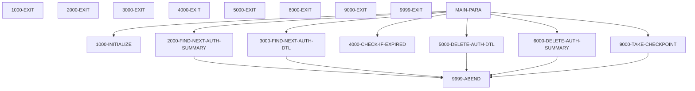
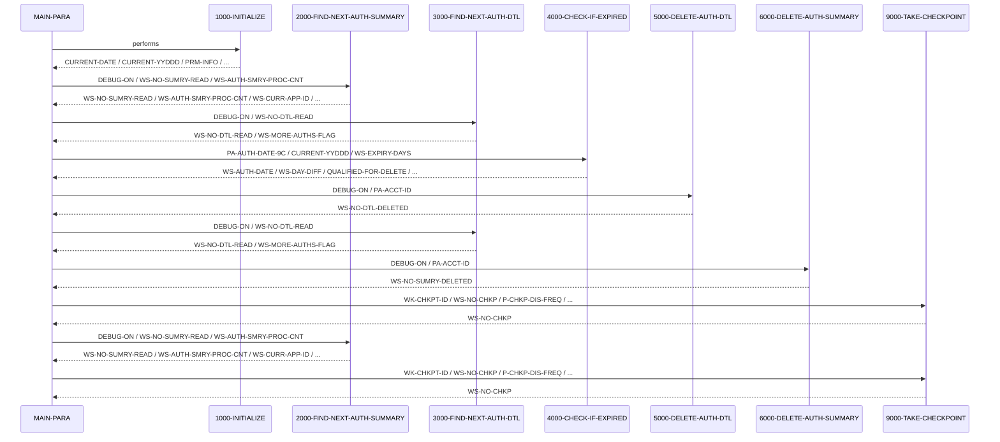

# CBPAUP0C

**File**: `cbl/CBPAUP0C.cbl`
**Type**: FileType.COBOL
**Analyzed**: 2026-02-27 14:51:49.033787

## Purpose

This COBOL batch IMS program, CBPAUP0C, deletes expired pending authorization messages from the IMS database. It reads pending authorization summary and detail segments, checks if the authorization has expired based on a configurable expiry period, and deletes the detail segment if expired. If all detail segments for a summary segment are deleted, the summary segment is also deleted.

**Business Context**: This program is part of a card authorization system, likely used to clean up old, unused authorization requests to maintain database performance and reduce storage costs.

## Inputs

| Name | Type | Description |
|------|------|-------------|
| PENDING-AUTH-SUMMARY | IOType.IMS_SEGMENT | Pending authorization summary segment from the IMS database. Contains summary information about pending authorizations. |
| PENDING-AUTH-DETAILS | IOType.IMS_SEGMENT | Pending authorization detail segment from the IMS database. Contains detailed information about individual pending authorizations. |
| SYSIN | IOType.PARAMETER | Parameter input from JCL containing expiry days, checkpoint frequency, checkpoint display frequency and debug flag. |

## Business Rules

- **BR001**: An authorization detail is considered expired if the difference between the current Julian date and the authorization date exceeds the configured expiry days.
- **BR002**: A pending authorization summary record is deleted if both the approved and declined authorization counts are zero.

## Paragraphs/Procedures

### MAIN-PARA
> [Source: MAIN-PARA.cbl.md](CBPAUP0C.cbl.d/MAIN-PARA.cbl.md)

```
MAIN-PARA  (25 statements, depth=3)
PARAGRAPH
├── PERFORM_THRU: PERFORM 1000-INITIALIZE                THRU 1000-EXIT
├── PERFORM_THRU: PERFORM 2000-FIND-NEXT-AUTH-SUMMARY    THRU 2000-EXIT
├── PERFORM_INLINE: PERFORM UNTIL ERR-FLG-ON OR END-OF-AUTHDB
│   ├── PERFORM_THRU: PERFORM 3000-FIND-NEXT-AUTH-DTL     THRU 3000-EXIT
│   ├── PERFORM_INLINE: PERFORM UNTIL NO-MORE-AUTHS
│   │   ├── PERFORM_THRU: PERFORM 4000-CHECK-IF-EXPIRED    THRU 4000-EXIT
│   │   ├── IF: IF QUALIFIED-FOR-DELETE
│   │   │   └── PERFORM_THRU: PERFORM 5000-DELETE-AUTH-DTL  THRU 5000-EXIT
│   │   └── PERFORM_THRU: PERFORM 3000-FIND-NEXT-AUTH-DTL  THRU 3000-EXIT
│   ├── IF: IF PA-APPROVED-AUTH-CNT <= 0 AND PA-APPROVED-AUTH-CNT <= 0
│   │   └── PERFORM_THRU: PERFORM 6000-DELETE-AUTH-SUMMARY THRU 6000-EXIT
│   ├── IF: IF WS-AUTH-SMRY-PROC-CNT > P-CHKP-FREQ
│   │   ├── PERFORM_THRU: PERFORM 9000-TAKE-CHECKPOINT     THRU 9000-EXIT
│   │   └── MOVE: MOVE 0                         TO WS-AUTH-SMRY-PROC-CNT
│   └── PERFORM_THRU: PERFORM 2000-FIND-NEXT-AUTH-SUMMARY THRU 2000-EXIT
├── PERFORM_THRU: PERFORM 9000-TAKE-CHECKPOINT           THRU 9000-EXIT
├── DISPLAY: DISPLAY ' '
├── DISPLAY: DISPLAY '*-------------------------------------*'
├── DISPLAY: DISPLAY '# TOTAL SUMMARY READ  :' WS-NO-SUMRY-READ
├── DISPLAY: DISPLAY '# SUMMARY REC DELETED :' WS-NO-SUMRY-DELETED
├── DISPLAY: DISPLAY '# TOTAL DETAILS READ  :' WS-NO-DTL-READ
├── DISPLAY: DISPLAY '# DETAILS REC DELETED :' WS-NO-DTL-DELETED
├── DISPLAY: DISPLAY '*-------------------------------------*'
├── DISPLAY: DISPLAY ' '
└── GOBACK: GOBACK
```
This is the main control paragraph of the CBPAUP0C program. It orchestrates the deletion of expired pending authorization messages. First, it calls 1000-INITIALIZE to set up the program environment by accepting the current date and parameters from SYSIN. Then, it enters a loop that continues until an error occurs or the end of the authorization database is reached. Inside the loop, it retrieves the next authorization summary record using 2000-FIND-NEXT-AUTH-SUMMARY. For each summary record, it enters another loop to process the detail records, calling 3000-FIND-NEXT-AUTH-DTL to retrieve the next detail record. Each detail record is checked for expiry in 4000-CHECK-IF-EXPIRED. If expired, 5000-DELETE-AUTH-DTL is called to delete the detail record. After processing all detail records for a summary, the program checks if both approved and declined authorization counts are zero. If so, it calls 6000-DELETE-AUTH-SUMMARY to delete the summary record. Checkpoints are taken periodically using 9000-TAKE-CHECKPOINT based on the WS-AUTH-SMRY-PROC-CNT and P-CHKP-FREQ. Finally, the program displays summary statistics and terminates.

### 1000-INITIALIZE
> [Source: 1000-INITIALIZE.cbl.md](CBPAUP0C.cbl.d/1000-INITIALIZE.cbl.md)

```
1000-INITIALIZE  (18 statements, depth=1)
PARAGRAPH
├── ACCEPT: ACCEPT CURRENT-DATE     FROM DATE
├── ACCEPT: ACCEPT CURRENT-YYDDD    FROM DAY
├── ACCEPT: ACCEPT PRM-INFO FROM SYSIN
├── DISPLAY: DISPLAY 'STARTING PROGRAM CBPAUP0C::'
├── DISPLAY: DISPLAY '*-------------------------------------*'
├── DISPLAY: DISPLAY 'CBPAUP0C PARM RECEIVED :' PRM-INFO
├── DISPLAY: DISPLAY 'TODAYS DATE            :' CURRENT-YYDDD
├── DISPLAY: DISPLAY ' '
├── IF: IF P-EXPIRY-DAYS IS NUMERIC
│   ├── MOVE: MOVE P-EXPIRY-DAYS     TO WS-EXPIRY-DAYS
│   └── ELSE: ELSE
│       └── MOVE: MOVE 5                 TO WS-EXPIRY-DAYS
├── IF: IF P-CHKP-FREQ = SPACES OR 0 OR LOW-VALUES
│   └── MOVE: MOVE 5                 TO P-CHKP-FREQ
├── IF: IF P-CHKP-DIS-FREQ = SPACES OR 0 OR LOW-VALUES
│   └── MOVE: MOVE 10                TO P-CHKP-DIS-FREQ
└── IF: IF P-DEBUG-FLAG NOT = 'Y'
    └── MOVE: MOVE 'N'               TO P-DEBUG-FLAG
```
This paragraph initializes the program environment. It accepts the current date and Julian date from the system. It then accepts parameters from SYSIN, including the expiry days, checkpoint frequency, checkpoint display frequency, and debug flag. It displays the received parameters and today's date. It validates the P-EXPIRY-DAYS parameter, defaulting to 5 if the input is non-numeric. It also validates P-CHKP-FREQ and P-CHKP-DIS-FREQ, defaulting to 5 and 10 respectively if the input is invalid. Finally, it ensures that the debug flag is either 'Y' or 'N', defaulting to 'N' if the input is different.

## Dead Code

The following artifacts were identified as dead code by static analysis:

| Artifact | Type | Line | Reason |
|----------|------|------|--------|
| 9999-EXIT | paragraph | 385 | Paragraph '9999-EXIT' is never PERFORMed or referenced by any other paragraph or program |
| IO-PCB-MASK | record_layout | 128 | Record layout 'IO-PCB-MASK' is never used by any program |
| PGM-PCB-MASK | record_layout | 129 | Record layout 'PGM-PCB-MASK' is never used by any program |
| PRM-INFO | record_layout | 98 | Record layout 'PRM-INFO' is never used by any program |

## Control Flow


```mermaid
flowchart TD
    %% Title: CBPAUP0C.cbl
    1000_EXIT["1000-EXIT"]
    1000_INITIALIZE["1000-INITIALIZE"]
    2000_EXIT["2000-EXIT"]
    2000_FIND_NEXT_AUTH_SUMMARY["2000-FIND-NEXT-AUTH-SUMMARY"]
    9999_ABEND["9999-ABEND"]
    3000_EXIT["3000-EXIT"]
    3000_FIND_NEXT_AUTH_DTL["3000-FIND-NEXT-AUTH-DTL"]
    4000_CHECK_IF_EXPIRED["4000-CHECK-IF-EXPIRED"]
    4000_EXIT["4000-EXIT"]
    5000_DELETE_AUTH_DTL["5000-DELETE-AUTH-DTL"]
    5000_EXIT["5000-EXIT"]
    6000_DELETE_AUTH_SUMMARY["6000-DELETE-AUTH-SUMMARY"]
    6000_EXIT["6000-EXIT"]
    9000_EXIT["9000-EXIT"]
    9000_TAKE_CHECKPOINT["9000-TAKE-CHECKPOINT"]
    9999_EXIT["9999-EXIT"]
    MAIN_PARA["MAIN-PARA"]
    2000_FIND_NEXT_AUTH_SUMMARY --> 9999_ABEND
    3000_FIND_NEXT_AUTH_DTL --> 9999_ABEND
    5000_DELETE_AUTH_DTL --> 9999_ABEND
    6000_DELETE_AUTH_SUMMARY --> 9999_ABEND
    9000_TAKE_CHECKPOINT --> 9999_ABEND
    MAIN_PARA --> 1000_INITIALIZE
    MAIN_PARA --> 2000_FIND_NEXT_AUTH_SUMMARY
    MAIN_PARA --> 3000_FIND_NEXT_AUTH_DTL
    MAIN_PARA --> 4000_CHECK_IF_EXPIRED
    MAIN_PARA --> 5000_DELETE_AUTH_DTL
    MAIN_PARA --> 6000_DELETE_AUTH_SUMMARY
    MAIN_PARA --> 9000_TAKE_CHECKPOINT
```

## Open Questions

- ? The program uses IMS calls to access the database. The specifics of these calls (e.g., which PCB is used, the exact DL/I calls) are not apparent from this code snippet. 
  - Context: The provided code does not include the DL/I calls themselves, only the PSB name and PCB offset.

## Sequence Diagram


```mermaid
sequenceDiagram
    participant MAIN_PARA as MAIN-PARA
    participant 1000_INITIALIZE as 1000-INITIALIZE
    participant 2000_FIND_NEXT_AUTH_SUMMARY as 2000-FIND-NEXT-AUTH-SUMMARY
    participant 3000_FIND_NEXT_AUTH_DTL as 3000-FIND-NEXT-AUTH-DTL
    participant 4000_CHECK_IF_EXPIRED as 4000-CHECK-IF-EXPIRED
    participant 5000_DELETE_AUTH_DTL as 5000-DELETE-AUTH-DTL
    participant 6000_DELETE_AUTH_SUMMARY as 6000-DELETE-AUTH-SUMMARY
    participant 9000_TAKE_CHECKPOINT as 9000-TAKE-CHECKPOINT
    MAIN_PARA->>1000_INITIALIZE: performs
    1000_INITIALIZE-->>MAIN_PARA: CURRENT-DATE / CURRENT-YYDDD / PRM-INFO / ...
    MAIN_PARA->>2000_FIND_NEXT_AUTH_SUMMARY: DEBUG-ON / WS-NO-SUMRY-READ / WS-AUTH-SMRY-PROC-CNT
    2000_FIND_NEXT_AUTH_SUMMARY-->>MAIN_PARA: WS-NO-SUMRY-READ / WS-AUTH-SMRY-PROC-CNT / WS-CURR-APP-ID / ...
    MAIN_PARA->>3000_FIND_NEXT_AUTH_DTL: DEBUG-ON / WS-NO-DTL-READ
    3000_FIND_NEXT_AUTH_DTL-->>MAIN_PARA: WS-NO-DTL-READ / WS-MORE-AUTHS-FLAG
    MAIN_PARA->>4000_CHECK_IF_EXPIRED: PA-AUTH-DATE-9C / CURRENT-YYDDD / WS-EXPIRY-DAYS
    4000_CHECK_IF_EXPIRED-->>MAIN_PARA: WS-AUTH-DATE / WS-DAY-DIFF / QUALIFIED-FOR-DELETE / ...
    MAIN_PARA->>5000_DELETE_AUTH_DTL: DEBUG-ON / PA-ACCT-ID
    5000_DELETE_AUTH_DTL-->>MAIN_PARA: WS-NO-DTL-DELETED
    MAIN_PARA->>3000_FIND_NEXT_AUTH_DTL: DEBUG-ON / WS-NO-DTL-READ
    3000_FIND_NEXT_AUTH_DTL-->>MAIN_PARA: WS-NO-DTL-READ / WS-MORE-AUTHS-FLAG
    MAIN_PARA->>6000_DELETE_AUTH_SUMMARY: DEBUG-ON / PA-ACCT-ID
    6000_DELETE_AUTH_SUMMARY-->>MAIN_PARA: WS-NO-SUMRY-DELETED
    MAIN_PARA->>9000_TAKE_CHECKPOINT: WK-CHKPT-ID / WS-NO-CHKP / P-CHKP-DIS-FREQ / ...
    9000_TAKE_CHECKPOINT-->>MAIN_PARA: WS-NO-CHKP
    MAIN_PARA->>2000_FIND_NEXT_AUTH_SUMMARY: DEBUG-ON / WS-NO-SUMRY-READ / WS-AUTH-SMRY-PROC-CNT
    2000_FIND_NEXT_AUTH_SUMMARY-->>MAIN_PARA: WS-NO-SUMRY-READ / WS-AUTH-SMRY-PROC-CNT / WS-CURR-APP-ID / ...
    MAIN_PARA->>9000_TAKE_CHECKPOINT: WK-CHKPT-ID / WS-NO-CHKP / P-CHKP-DIS-FREQ / ...
    9000_TAKE_CHECKPOINT-->>MAIN_PARA: WS-NO-CHKP
```
