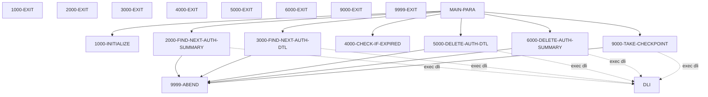

# CBPAUP0C

**File**: `cbl/CBPAUP0C.cbl`
**Type**: FileType.COBOL
**Analyzed**: 2026-03-16 20:04:37.254874

## Purpose

This batch COBOL IMS program deletes expired pending authorization messages from the IMS database. It reads pending authorization summary and detail segments, checks if the authorization has expired based on the configured expiry days, and deletes the detail segment if expired. It also deletes the summary segment if all its detail segments are deleted and takes checkpoints periodically.

**Business Context**: This program is part of the CardDemo application's authorization module and is used to purge old pending authorization data.

## Inputs

| Name | Type | Description |
|------|------|-------------|
| SYSIN | IOType.PARAMETER | Contains parameters for expiry days, checkpoint frequency, checkpoint display frequency and debug flag. |
| PAUTSUM0 | IOType.IMS_SEGMENT | Pending authorization summary segment. Contains summary information about pending authorizations. |
| PAUTDTL1 | IOType.IMS_SEGMENT | Pending authorization detail segment. Contains details of individual pending authorizations. |

## Business Rules

- **BR001**: The program determines the expiry date by subtracting the authorization date from 99999.
- **BR002**: An authorization detail is considered expired if the difference between the current date and the authorization date is greater than or equal to the configured expiry days.
- **BR003**: If an authorization detail is expired, the approved or declined authorization count and transaction amount in the summary record are decremented based on the authorization response code.
- **BR004**: The authorization summary record is deleted if both the approved and declined authorization counts are less than or equal to 0.

## Paragraphs/Procedures

### MAIN-PARA
> [Source: MAIN-PARA.cbl.md](CBPAUP0C.cbl.d/MAIN-PARA.cbl.md)

```
MAIN-PARA  (25 statements, depth=4)
PARAGRAPH
├── PERFORM_THRU: PERFORM 1000-INITIALIZE                THRU 1000-EXIT
├── PERFORM_THRU: PERFORM 2000-FIND-NEXT-AUTH-SUMMARY    THRU 2000-EXIT
├── PERFORM_INLINE: PERFORM UNTIL ERR-FLG-ON OR END-OF-AUTHDB
│   ├── PERFORM_THRU: PERFORM 3000-FIND-NEXT-AUTH-DTL     THRU 3000-EXIT
│   ├── PERFORM_INLINE: PERFORM UNTIL NO-MORE-AUTHS
│   │   ├── PERFORM_THRU: PERFORM 4000-CHECK-IF-EXPIRED    THRU 4000-EXIT
│   │   ├── IF: IF QUALIFIED-FOR-DELETE
│   │   │   └── PERFORM_THRU: PERFORM 5000-DELETE-AUTH-DTL  THRU 5000-EXIT
│   │   └── PERFORM_THRU: PERFORM 3000-FIND-NEXT-AUTH-DTL  THRU 3000-EXIT
│   ├── IF: IF PA-APPROVED-AUTH-CNT <= 0 AND PA-APPROVED-AUTH-CNT <= 0
│   │   └── PERFORM_THRU: PERFORM 6000-DELETE-AUTH-SUMMARY THRU 6000-EXIT
│   ├── IF: IF WS-AUTH-SMRY-PROC-CNT > P-CHKP-FREQ
│   │   ├── PERFORM_THRU: PERFORM 9000-TAKE-CHECKPOINT     THRU 9000-EXIT
│   │   └── MOVE: MOVE 0                         TO WS-AUTH-SMRY-PROC-CNT
│   └── PERFORM_THRU: PERFORM 2000-FIND-NEXT-AUTH-SUMMARY THRU 2000-EXIT
├── PERFORM_THRU: PERFORM 9000-TAKE-CHECKPOINT           THRU 9000-EXIT
├── DISPLAY: DISPLAY ' '
├── DISPLAY: DISPLAY '*-------------------------------------*'
├── DISPLAY: DISPLAY '# TOTAL SUMMARY READ  :' WS-NO-SUMRY-READ
├── DISPLAY: DISPLAY '# SUMMARY REC DELETED :' WS-NO-SUMRY-DELETED
├── DISPLAY: DISPLAY '# TOTAL DETAILS READ  :' WS-NO-DTL-READ
├── DISPLAY: DISPLAY '# DETAILS REC DELETED :' WS-NO-DTL-DELETED
├── DISPLAY: DISPLAY '*-------------------------------------*'
├── DISPLAY: DISPLAY ' '
└── GOBACK: GOBACK
```
This is the main paragraph that controls the overall program flow. It first calls 1000-INITIALIZE to initialize variables and read parameters. Then, it enters a loop to process each authorization summary record. Inside this loop, it calls 3000-FIND-NEXT-AUTH-DTL to retrieve the detail records for the current summary. Another loop iterates through the detail records, calling 4000-CHECK-IF-EXPIRED to determine if a detail record is expired. If a detail record is expired, 5000-DELETE-AUTH-DTL is called to delete it. After processing all detail records for a summary, 6000-DELETE-AUTH-SUMMARY is called to delete the summary record if it has no remaining detail records. Checkpoints are taken periodically by calling 9000-TAKE-CHECKPOINT. The program terminates after processing all summary records, displaying summary statistics before exiting.

### 1000-INITIALIZE
> [Source: 1000-INITIALIZE.cbl.md](CBPAUP0C.cbl.d/1000-INITIALIZE.cbl.md)

```
1000-INITIALIZE  (18 statements, depth=3)
PARAGRAPH
├── ACCEPT: ACCEPT CURRENT-DATE     FROM DATE
├── ACCEPT: ACCEPT CURRENT-YYDDD    FROM DAY
├── ACCEPT: ACCEPT PRM-INFO FROM SYSIN
├── DISPLAY: DISPLAY 'STARTING PROGRAM CBPAUP0C::'
├── DISPLAY: DISPLAY '*-------------------------------------*'
├── DISPLAY: DISPLAY 'CBPAUP0C PARM RECEIVED :' PRM-INFO
├── DISPLAY: DISPLAY 'TODAYS DATE            :' CURRENT-YYDDD
├── DISPLAY: DISPLAY ' '
├── IF: IF P-EXPIRY-DAYS IS NUMERIC
│   ├── MOVE: MOVE P-EXPIRY-DAYS     TO WS-EXPIRY-DAYS
│   └── ELSE: ELSE
│       └── MOVE: MOVE 5                 TO WS-EXPIRY-DAYS
├── IF: IF P-CHKP-FREQ = SPACES OR 0 OR LOW-VALUES
│   └── MOVE: MOVE 5                 TO P-CHKP-FREQ
├── IF: IF P-CHKP-DIS-FREQ = SPACES OR 0 OR LOW-VALUES
│   └── MOVE: MOVE 10                TO P-CHKP-DIS-FREQ
└── IF: IF P-DEBUG-FLAG NOT = 'Y'
    └── MOVE: MOVE 'N'               TO P-DEBUG-FLAG
```
This paragraph initializes the program by accepting the current date and parameters from SYSIN. It moves the accepted date into CURRENT-DATE and CURRENT-YYDDD. It then validates the input parameters P-EXPIRY-DAYS, P-CHKP-FREQ, P-CHKP-DIS-FREQ, and P-DEBUG-FLAG. If P-EXPIRY-DAYS is not numeric, it defaults to 5. If P-CHKP-FREQ or P-CHKP-DIS-FREQ are spaces, 0, or LOW-VALUES, they default to 5 and 10 respectively. If P-DEBUG-FLAG is not 'Y', it defaults to 'N'. Finally, it displays the starting message, parameters received and today's date.

### 2000-FIND-NEXT-AUTH-SUMMARY
> [Source: 2000-FIND-NEXT-AUTH-SUMMARY.cbl.md](CBPAUP0C.cbl.d/2000-FIND-NEXT-AUTH-SUMMARY.cbl.md)

```
2000-FIND-NEXT-AUTH-SUMMARY  (15 statements, depth=3)
PARAGRAPH
├── IF: IF DEBUG-ON
│   └── DISPLAY: DISPLAY 'DEBUG: AUTH SMRY READ : ' WS-NO-SUMRY-READ
├── EXEC_DLI: EXEC DLI GN USING PCB(PAUT-PCB-NUM) SEGMENT (PAUTSUM0) INTO (PENDING-AUTH-SUMMARY) END-EXEC
└── EVALUATE: EVALUATE DIBSTAT
    ├── WHEN: WHEN '  '
    │   ├── SET: SET NOT-END-OF-AUTHDB TO TRUE
    │   ├── ADD: ADD 1                 TO WS-NO-SUMRY-READ
    │   ├── ADD: ADD 1                 TO WS-AUTH-SMRY-PROC-CNT
    │   └── MOVE: MOVE PA-ACCT-ID       TO WS-CURR-APP-ID
    ├── WHEN: WHEN 'GB'
    │   └── SET: SET END-OF-AUTHDB     TO TRUE
    └── WHEN: WHEN OTHER
        ├── DISPLAY: DISPLAY 'AUTH SUMMARY READ FAILED  :' DIBSTAT
        ├── DISPLAY: DISPLAY 'SUMMARY READ BEFORE ABEND :'
WS-NO-SUMRY-READ
        └── PERFORM: PERFORM 9999-ABEND
```
This paragraph retrieves the next pending authorization summary segment from the IMS database. It uses the EXEC DLI GN command to get the next PAUTSUM0 segment. If the read is successful (DIBSTAT = '  '), it sets NOT-END-OF-AUTHDB to TRUE, increments the summary read counter (WS-NO-SUMRY-READ), increments the summary processed counter (WS-AUTH-SMRY-PROC-CNT), and moves the account ID (PA-ACCT-ID) to WS-CURR-APP-ID. If the end of the database is reached (DIBSTAT = 'GB'), it sets END-OF-AUTHDB to TRUE. If any other error occurs, it displays an error message and calls 9999-ABEND to terminate the program.

### 3000-FIND-NEXT-AUTH-DTL
> [Source: 3000-FIND-NEXT-AUTH-DTL.cbl.md](CBPAUP0C.cbl.d/3000-FIND-NEXT-AUTH-DTL.cbl.md)

```
3000-FIND-NEXT-AUTH-DTL  (15 statements, depth=3)
PARAGRAPH
├── IF: IF DEBUG-ON
│   └── DISPLAY: DISPLAY 'DEBUG: AUTH DTL READ : ' WS-NO-DTL-READ
├── EXEC_DLI: EXEC DLI GNP USING PCB(PAUT-PCB-NUM) SEGMENT (PAUTDTL1) INTO (PENDING-AUTH-DETAILS) END-EXEC
└── EVALUATE: EVALUATE DIBSTAT
    ├── WHEN: WHEN '  '
    │   ├── SET: SET MORE-AUTHS       TO TRUE
    │   └── ADD: ADD 1                TO WS-NO-DTL-READ
    ├── WHEN: WHEN 'GE'
    ├── WHEN: WHEN 'GB'
    │   └── SET: SET NO-MORE-AUTHS    TO TRUE
    └── WHEN: WHEN OTHER
        ├── DISPLAY: DISPLAY 'AUTH DETAIL READ FAILED  :' DIBSTAT
        ├── DISPLAY: DISPLAY 'SUMMARY AUTH APP ID      :' PA-ACCT-ID
        ├── DISPLAY: DISPLAY 'DETAIL READ BEFORE ABEND :' WS-NO-DTL-READ
        └── PERFORM: PERFORM 9999-ABEND
```
This paragraph retrieves the next pending authorization detail segment from the IMS database. It uses the EXEC DLI GNP command to get the next PAUTDTL1 segment. If the read is successful (DIBSTAT = '  '), it sets MORE-AUTHS to TRUE and increments the detail read counter (WS-NO-DTL-READ). If the end of the parent (summary) is reached (DIBSTAT = 'GE' or 'GB'), it sets NO-MORE-AUTHS to TRUE. If any other error occurs, it displays an error message and calls 9999-ABEND to terminate the program.

### 4000-CHECK-IF-EXPIRED
> [Source: 4000-CHECK-IF-EXPIRED.cbl.md](CBPAUP0C.cbl.d/4000-CHECK-IF-EXPIRED.cbl.md)

```
4000-CHECK-IF-EXPIRED  (12 statements, depth=4)
PARAGRAPH
├── COMPUTE: COMPUTE WS-AUTH-DATE = 99999 - PA-AUTH-DATE-9C
├── COMPUTE: COMPUTE WS-DAY-DIFF = CURRENT-YYDDD - WS-AUTH-DATE
└── IF: IF WS-DAY-DIFF >= WS-EXPIRY-DAYS
    ├── SET: SET QUALIFIED-FOR-DELETE       TO TRUE
    ├── IF: IF PA-AUTH-RESP-CODE = '00'
    │   ├── SUBTRACT: SUBTRACT 1                  FROM PA-APPROVED-AUTH-CNT
    │   ├── SUBTRACT: SUBTRACT PA-APPROVED-AMT    FROM PA-APPROVED-AUTH-AMT
    │   └── ELSE: ELSE
    │       ├── SUBTRACT: SUBTRACT 1                  FROM PA-DECLINED-AUTH-CNT
    │       └── SUBTRACT: SUBTRACT PA-TRANSACTION-AMT FROM PA-DECLINED-AUTH-AMT
    └── ELSE: ELSE
        └── SET: SET NOT-QUALIFIED-FOR-DELETE   TO TRUE
```
This paragraph checks if the current authorization detail record has expired. It calculates the authorization date (WS-AUTH-DATE) and the difference between the current date and the authorization date (WS-DAY-DIFF). If the difference is greater than or equal to the configured expiry days (WS-EXPIRY-DAYS), it sets QUALIFIED-FOR-DELETE to TRUE. It then decrements either the approved or declined authorization count and amount in the summary record, based on the authorization response code (PA-AUTH-RESP-CODE). If the authorization response code is '00', it decrements PA-APPROVED-AUTH-CNT and PA-APPROVED-AUTH-AMT; otherwise, it decrements PA-DECLINED-AUTH-CNT and PA-TRANSACTION-AMT. If the authorization detail is not expired, it sets NOT-QUALIFIED-FOR-DELETE to TRUE.

### 5000-DELETE-AUTH-DTL
> [Source: 5000-DELETE-AUTH-DTL.cbl.md](CBPAUP0C.cbl.d/5000-DELETE-AUTH-DTL.cbl.md)

```
5000-DELETE-AUTH-DTL  (9 statements, depth=3)
PARAGRAPH
├── IF: IF DEBUG-ON
│   └── DISPLAY: DISPLAY 'DEBUG: AUTH DTL DLET : ' PA-ACCT-ID
├── EXEC_DLI: EXEC DLI DLET USING PCB(PAUT-PCB-NUM) SEGMENT (PAUTDTL1) FROM (PENDING-AUTH-DETAILS) END-EXEC
└── IF: IF DIBSTAT = SPACES
    ├── ADD: ADD 1                     TO WS-NO-DTL-DELETED
    └── ELSE: ELSE
        ├── DISPLAY: DISPLAY 'AUTH DETAIL DELETE FAILED :' DIBSTAT
        ├── DISPLAY: DISPLAY 'AUTH APP ID               :' PA-ACCT-ID
        └── PERFORM: PERFORM 9999-ABEND
```
This paragraph deletes the current authorization detail segment from the IMS database. It uses the EXEC DLI DLET command to delete the PAUTDTL1 segment. If the delete is successful (DIBSTAT = SPACES), it increments the detail deleted counter (WS-NO-DTL-DELETED). If the delete fails, it displays an error message and calls 9999-ABEND to terminate the program.

### 6000-DELETE-AUTH-SUMMARY
> [Source: 6000-DELETE-AUTH-SUMMARY.cbl.md](CBPAUP0C.cbl.d/6000-DELETE-AUTH-SUMMARY.cbl.md)

```
6000-DELETE-AUTH-SUMMARY  (9 statements, depth=3)
PARAGRAPH
├── IF: IF DEBUG-ON
│   └── DISPLAY: DISPLAY 'DEBUG: AUTH SMRY DLET : ' PA-ACCT-ID
├── EXEC_DLI: EXEC DLI DLET USING PCB(PAUT-PCB-NUM) SEGMENT (PAUTSUM0) FROM (PENDING-AUTH-SUMMARY) END-EXEC
└── IF: IF DIBSTAT = SPACES
    ├── ADD: ADD 1                     TO WS-NO-SUMRY-DELETED
    └── ELSE: ELSE
        ├── DISPLAY: DISPLAY 'AUTH SUMMARY DELETE FAILED :' DIBSTAT
        ├── DISPLAY: DISPLAY 'AUTH APP ID                :' PA-ACCT-ID
        └── PERFORM: PERFORM 9999-ABEND
```
This paragraph deletes the current authorization summary segment from the IMS database. It uses the EXEC DLI DLET command to delete the PAUTSUM0 segment. If the delete is successful (DIBSTAT = SPACES), it increments the summary deleted counter (WS-NO-SUMRY-DELETED). If the delete fails, it displays an error message and calls 9999-ABEND to terminate the program.

### 9000-TAKE-CHECKPOINT
> [Source: 9000-TAKE-CHECKPOINT.cbl.md](CBPAUP0C.cbl.d/9000-TAKE-CHECKPOINT.cbl.md)

```
9000-TAKE-CHECKPOINT  (9 statements, depth=3)
PARAGRAPH
├── EXEC_DLI: EXEC DLI CHKP ID(WK-CHKPT-ID) END-EXEC
└── IF: IF DIBSTAT = SPACES
    ├── ADD: ADD 1                      TO WS-NO-CHKP
    ├── IF: IF WS-NO-CHKP >= P-CHKP-DIS-FREQ
    │   ├── MOVE: MOVE 0                  TO WS-NO-CHKP
    │   └── DISPLAY: DISPLAY 'CHKP SUCCESS: AUTH COUNT - ' WS-NO-SUMRY-READ
', APP ID - ' WS-CURR-APP-ID
    └── ELSE: ELSE
        ├── DISPLAY: DISPLAY 'CHKP FAILED: DIBSTAT - ' DIBSTAT
', REC COUNT - ' WS-NO-SUMRY-READ
', APP ID - ' WS-CURR-APP-ID
        └── PERFORM: PERFORM 9999-ABEND
```
This paragraph takes an IMS checkpoint. It uses the EXEC DLI CHKP command to establish a checkpoint. If the checkpoint is successful (DIBSTAT = SPACES), it increments the checkpoint counter (WS-NO-CHKP). If the checkpoint display frequency (P-CHKP-DIS-FREQ) has been reached, it displays a checkpoint success message. If the checkpoint fails, it displays an error message and calls 9999-ABEND to terminate the program.

### 9999-ABEND
> [Source: 9999-ABEND.cbl.md](CBPAUP0C.cbl.d/9999-ABEND.cbl.md)

```
9999-ABEND  (3 statements, depth=1)
PARAGRAPH
├── DISPLAY: DISPLAY 'CBPAUP0C ABENDING ...'
├── MOVE: MOVE 16 TO RETURN-CODE
└── GOBACK: GOBACK
```
This paragraph handles program termination due to an error. It displays an abend message, sets the return code to 16, and returns control to the calling program.

## Control Flow


```mermaid
flowchart TD
    %% Title: CBPAUP0C.cbl
    1000_EXIT["1000-EXIT"]
    1000_INITIALIZE["1000-INITIALIZE"]
    2000_EXIT["2000-EXIT"]
    2000_FIND_NEXT_AUTH_SUMMARY["2000-FIND-NEXT-AUTH-SUMMARY"]
    9999_ABEND["9999-ABEND"]
    DLI__ext["DLI"]
    3000_EXIT["3000-EXIT"]
    3000_FIND_NEXT_AUTH_DTL["3000-FIND-NEXT-AUTH-DTL"]
    4000_CHECK_IF_EXPIRED["4000-CHECK-IF-EXPIRED"]
    4000_EXIT["4000-EXIT"]
    5000_DELETE_AUTH_DTL["5000-DELETE-AUTH-DTL"]
    5000_EXIT["5000-EXIT"]
    6000_DELETE_AUTH_SUMMARY["6000-DELETE-AUTH-SUMMARY"]
    6000_EXIT["6000-EXIT"]
    9000_EXIT["9000-EXIT"]
    9000_TAKE_CHECKPOINT["9000-TAKE-CHECKPOINT"]
    9999_EXIT["9999-EXIT"]
    MAIN_PARA["MAIN-PARA"]
    2000_FIND_NEXT_AUTH_SUMMARY --> 9999_ABEND
    2000_FIND_NEXT_AUTH_SUMMARY -.->|exec dli| DLI__ext
    3000_FIND_NEXT_AUTH_DTL --> 9999_ABEND
    3000_FIND_NEXT_AUTH_DTL -.->|exec dli| DLI__ext
    5000_DELETE_AUTH_DTL --> 9999_ABEND
    5000_DELETE_AUTH_DTL -.->|exec dli| DLI__ext
    6000_DELETE_AUTH_SUMMARY --> 9999_ABEND
    6000_DELETE_AUTH_SUMMARY -.->|exec dli| DLI__ext
    9000_TAKE_CHECKPOINT --> 9999_ABEND
    9000_TAKE_CHECKPOINT -.->|exec dli| DLI__ext
    MAIN_PARA --> 1000_INITIALIZE
    MAIN_PARA --> 2000_FIND_NEXT_AUTH_SUMMARY
    MAIN_PARA --> 3000_FIND_NEXT_AUTH_DTL
    MAIN_PARA --> 4000_CHECK_IF_EXPIRED
    MAIN_PARA --> 5000_DELETE_AUTH_DTL
    MAIN_PARA --> 6000_DELETE_AUTH_SUMMARY
    MAIN_PARA --> 9000_TAKE_CHECKPOINT
```
