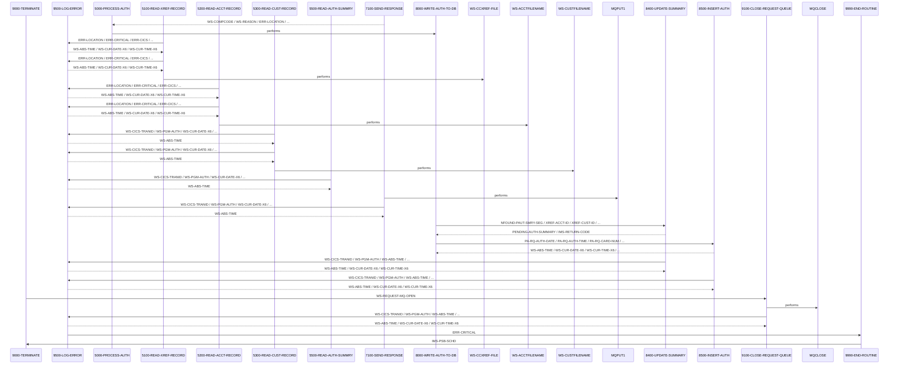

# COPAUA0C

**File**: `cbl/COPAUA0C.cbl`
**Type**: FileType.COBOL
**Analyzed**: 2026-02-24 17:53:03.023344

## Purpose

This is an empty COBOL program. It does not perform any operations or contain any logic.

## Paragraphs/Procedures

### COPAUA0C
> [Source: COPAUA0C.cbl.md](COPAUA0C.cbl.d/COPAUA0C.cbl.md)
This is the program identifier. It does not contain any executable code. It serves as a label to identify the COPAUA0C program within the system. This paragraph does not directly consume any inputs or produce any outputs. It is the starting point for the program's execution, but it immediately passes control to other paragraphs. No business logic or error handling is present in this paragraph. It calls other paragraphs to perform the actual processing.

### MAIN-PARA
> [Source: MAIN-PARA.cbl.md](COPAUA0C.cbl.d/MAIN-PARA.cbl.md)
This paragraph serves as the main control flow for the COPAUA0C program. It orchestrates the initialization, main processing, and termination steps. First, it performs 1000-INITIALIZE to set up the environment and open the necessary resources. Then, it performs 2000-MAIN-PROCESS to handle the core authorization processing logic. Finally, it performs 9000-TERMINATE to close resources and clean up before exiting. The paragraph does not directly consume any input data, but it relies on the initialization step to prepare the environment. It also does not directly produce any output, but it triggers the main processing and termination steps that generate outputs. This paragraph contains no business logic or error handling itself, but it calls other paragraphs that implement these functions. After the termination step, the program returns to CICS.

### 1000-INITIALIZE
> [Source: 1000-INITIALIZE.cbl.md](COPAUA0C.cbl.d/1000-INITIALIZE.cbl.md)
This paragraph initializes the program environment by retrieving MQ trigger monitor data and opening the request queue. It starts by retrieving the MQTM data using EXEC CICS RETRIEVE, which contains the queue name (MQTM-QNAME) and trigger data (MQTM-TRIGGERDATA). These values are then moved to working storage variables WS-REQUEST-QNAME and WS-TRIGGER-DATA, respectively. A wait interval of 5000 is set in WS-WAIT-INTERVAL. Next, it calls 1100-OPEN-REQUEST-QUEUE to open the request queue and 3100-READ-REQUEST-MQ to read the first request message. The paragraph consumes MQTM data as input and prepares the environment for further processing. It does not produce any direct output but sets up the necessary resources. The paragraph checks if the CICS RETRIEVE command was successful (EIBRESP = DFHRESP(NORMAL)). If not, the program continues without initializing the queue name and trigger data. This paragraph calls 1100-OPEN-REQUEST-QUEUE and 3100-READ-REQUEST-MQ to perform the actual queue operations.

### 1000-EXIT
> [Source: 1000-EXIT.cbl.md](COPAUA0C.cbl.d/1000-EXIT.cbl.md)
This paragraph serves as the exit point for the 1000-INITIALIZE paragraph. It simply contains the EXIT statement, which returns control to the calling paragraph (MAIN-PARA). It does not consume any inputs, produce any outputs, implement any business logic, or handle any errors. It is a standard COBOL construct to define the end of a PERFORM THRU range.

### 1100-OPEN-REQUEST-QUEUE
> [Source: 1100-OPEN-REQUEST-QUEUE.cbl.md](COPAUA0C.cbl.d/1100-OPEN-REQUEST-QUEUE.cbl.md)
This paragraph opens the WebSphere MQ request queue for shared input. It moves MQOT-Q to MQOD-OBJECTTYPE of MQM-OD-REQUEST and WS-REQUEST-QNAME to MQOD-OBJECTNAME of MQM-OD-REQUEST, defining the queue object. It then computes WS-OPTIONS as MQOO-INPUT-SHARED, specifying shared input access. The MQOPEN call is then made using the connection handle (W01-HCONN-REQUEST), object descriptor (MQM-OD-REQUEST), options (WS-OPTIONS), object handle (W01-HOBJ-REQUEST), completion code (WS-COMPCODE), and reason code (WS-REASON). If the MQOPEN call is successful (WS-COMPCODE = MQCC-OK), WS-REQUEST-MQ-OPEN is set to TRUE. Otherwise, an error is logged using 9500-LOG-ERROR. The paragraph consumes WS-REQUEST-QNAME as input and produces the opened queue handle (W01-HOBJ-REQUEST) as output. The business logic involves setting the correct options for opening the queue. Error handling is performed by checking the completion code and logging an error if the queue could not be opened. This paragraph calls 9500-LOG-ERROR to log any errors encountered during the queue opening process.

### 1100-EXIT
> [Source: 1100-EXIT.cbl.md](COPAUA0C.cbl.d/1100-EXIT.cbl.md)
This paragraph serves as the exit point for the 1100-OPEN-REQUEST-QUEUE paragraph. It contains the EXIT statement, which returns control to the calling paragraph (1000-INITIALIZE). It does not consume any inputs, produce any outputs, implement any business logic, or handle any errors. It is a standard COBOL construct to define the end of a PERFORM THRU range.

### 1200-SCHEDULE-PSB
> [Source: 1200-SCHEDULE-PSB.cbl.md](COPAUA0C.cbl.d/1200-SCHEDULE-PSB.cbl.md)
This paragraph schedules a PSB (Program Specification Block) in IMS. It executes a DLI SCHD command with the PSB-NAME. The DIBSTAT is moved to IMS-RETURN-CODE. If the PSB is scheduled more than once, it terminates the PSB and schedules it again. If the status is OK, IMS-PSB-SCHD is set to TRUE. Otherwise, an error is logged using 9500-LOG-ERROR. This paragraph takes PSB-NAME as input and sets IMS-PSB-SCHD as output. The business logic involves scheduling the PSB and handling the case where it's scheduled more than once. Error handling is performed by checking the DIBSTAT and logging an error if the scheduling fails. This paragraph calls 9500-LOG-ERROR to log any errors encountered during the PSB scheduling process.

### 1200-EXIT
> [Source: 1200-EXIT.cbl.md](COPAUA0C.cbl.d/1200-EXIT.cbl.md)
This paragraph serves as the exit point for the 1200-SCHEDULE-PSB paragraph. It contains the EXIT statement, which returns control to the calling paragraph. It does not consume any inputs, produce any outputs, implement any business logic, or handle any errors. It is a standard COBOL construct to define the end of a PERFORM THRU range.

### 2000-MAIN-PROCESS
> [Source: 2000-MAIN-PROCESS.cbl.md](COPAUA0C.cbl.d/2000-MAIN-PROCESS.cbl.md)
This paragraph is the main processing loop of the program, handling authorization requests from the message queue. It repeatedly performs 2100-EXTRACT-REQUEST-MSG to extract the request message and 5000-PROCESS-AUTH to process the authorization. The loop continues until either NO-MORE-MSG-AVAILABLE is true or WS-LOOP-END is true. After processing each message, it increments WS-MSG-PROCESSED and issues a CICS SYNCPOINT. IMS-PSB-NOT-SCHD is set to TRUE. If WS-MSG-PROCESSED exceeds WS-REQSTS-PROCESS-LIMIT, WS-LOOP-END is set to TRUE, terminating the loop. Otherwise, it calls 3100-READ-REQUEST-MQ to read the next request message. The paragraph consumes request messages from the queue and produces authorization responses and updates to IMS. The business logic involves processing each message and limiting the number of messages processed in a single execution. Error handling is not explicitly shown in this snippet, but it's likely handled within the called paragraphs. This paragraph calls 2100-EXTRACT-REQUEST-MSG, 5000-PROCESS-AUTH, and 3100-READ-REQUEST-MQ to perform the actual message processing and queue operations.

### 2000-EXIT
> [Source: 2000-EXIT.cbl.md](COPAUA0C.cbl.d/2000-EXIT.cbl.md)
This paragraph serves as the exit point for the 2000-MAIN-PROCESS paragraph. It contains the EXIT statement, which returns control to the calling paragraph (MAIN-PARA). It does not consume any inputs, produce any outputs, implement any business logic, or handle any errors. It is a standard COBOL construct to define the end of a PERFORM THRU range.

### 2100-EXTRACT-REQUEST-MSG
> [Source: 2100-EXTRACT-REQUEST-MSG.cbl.md](COPAUA0C.cbl.d/2100-EXTRACT-REQUEST-MSG.cbl.md)
This paragraph extracts data from the MQ message buffer (W01-GET-BUFFER) into individual fields. It uses the UNSTRING statement to parse the comma-delimited message. The extracted fields include authorization date, time, card number, authorization type, card expiry date, message type, message source, processing code, transaction amount (alphanumeric), merchant category code, acquirer country code, POS entry mode, merchant ID, merchant name, merchant city, merchant state, merchant zip, and transaction ID. It then converts the alphanumeric transaction amount (WS-TRANSACTION-AMT-AN) to a numeric value (PA-RQ-TRANSACTION-AMT) using the NUMVAL function and moves it to WS-TRANSACTION-AMT. No error handling is explicitly performed within this paragraph. It does not call any other paragraphs or programs.

### 2100-EXIT
> [Source: 2100-EXIT.cbl.md](COPAUA0C.cbl.d/2100-EXIT.cbl.md)
This paragraph simply exits the 2100-EXTRACT-REQUEST-MSG paragraph. It serves as a standard exit point and does not perform any specific logic or data manipulation. It does not consume any inputs or produce any outputs. It does not make any decisions or handle any errors. It does not call any other paragraphs or programs.

### 3100-READ-REQUEST-MQ
> [Source: 3100-READ-REQUEST-MQ.cbl.md](COPAUA0C.cbl.d/3100-READ-REQUEST-MQ.cbl.md)
This paragraph reads a request message from the MQ queue. It sets the MQGMO options for no syncpoint, waiting, conversion, and failing if quiescing. It moves the wait interval to MQGMO-WAITINTERVAL. It initializes the message ID and correlation ID in the MQMD. It then calls the MQGET API to retrieve the message from the queue, using the connection and object handles, message descriptor, get message options, buffer length, and buffer. If the MQGET call is successful (WS-COMPCODE = MQCC-OK), it saves the correlation ID and reply-to queue name. If the call fails, it checks if the reason code is MQRC-NO-MSG-AVAILABLE and sets the NO-MORE-MSG-AVAILABLE flag. Otherwise, it logs an error message using 9500-LOG-ERROR, including the component code, reason code, and a descriptive message. The paragraph consumes the W01-HCONN-REQUEST, W01-HOBJ-REQUEST, MQM-MD-REQUEST, MQM-GET-MESSAGE-OPTIONS, W01-BUFFLEN and produces the W01-GET-BUFFER, W01-DATALEN, WS-COMPCODE, WS-REASON.

### 3100-EXIT
> [Source: 3100-EXIT.cbl.md](COPAUA0C.cbl.d/3100-EXIT.cbl.md)
This paragraph simply exits the 3100-READ-REQUEST-MQ paragraph. It serves as a standard exit point and does not perform any specific logic or data manipulation. It does not consume any inputs or produce any outputs. It does not make any decisions or handle any errors. It does not call any other paragraphs or programs.

### 5000-PROCESS-AUTH
> [Source: 5000-PROCESS-AUTH.cbl.md](COPAUA0C.cbl.d/5000-PROCESS-AUTH.cbl.md)
This paragraph is the main processing logic for authorization requests. It starts by setting APPROVE-AUTH to TRUE. It then performs 1200-SCHEDULE-PSB. It sets CARD-FOUND-XREF and FOUND-ACCT-IN-MSTR to TRUE. It then performs 5100-READ-XREF-RECORD to read the card cross-reference record. If the card is found in the cross-reference file (CARD-FOUND-XREF), it performs 5200-READ-ACCT-RECORD, 5300-READ-CUST-RECORD, 5500-READ-AUTH-SUMMRY, and 5600-READ-PROFILE-DATA. After reading the records, it performs 6000-MAKE-DECISION to determine whether to approve or decline the authorization. It then performs 7100-SEND-RESPONSE to send the response. Finally, if the card was found in the cross-reference file, it performs 8000-WRITE-AUTH-TO-DB to write the authorization data to the database. This paragraph orchestrates the entire authorization process, reading data from various sources, making a decision, sending a response, and writing data to the database. The inputs are PA-RQ-CARD-NUM, and the outputs are the authorization decision and the data written to the database. It calls several other paragraphs to perform specific tasks.

### 5000-EXIT
> [Source: 5000-EXIT.cbl.md](COPAUA0C.cbl.d/5000-EXIT.cbl.md)
This paragraph simply exits the 5000-PROCESS-AUTH paragraph. It serves as a standard exit point and does not perform any specific logic or data manipulation. It does not consume any inputs or produce any outputs. It does not make any decisions or handle any errors. It does not call any other paragraphs or programs.

### 5100-READ-XREF-RECORD
> [Source: 5100-READ-XREF-RECORD.cbl.md](COPAUA0C.cbl.d/5100-READ-XREF-RECORD.cbl.md)
This paragraph reads the card cross-reference record from the WS-CCXREF-FILE. It moves the card number (PA-RQ-CARD-NUM) to the XREF-CARD-NUM field. It then executes a CICS READ command to read the CARD-XREF-RECORD from the WS-CCXREF-FILE using the XREF-CARD-NUM as the RIDFLD. It evaluates the CICS response code (WS-RESP-CD). If the response is DFHRESP(NORMAL), it sets CARD-FOUND-XREF to TRUE. If the response is DFHRESP(NOTFND), it sets CARD-NFOUND-XREF and NFOUND-ACCT-IN-MSTR to TRUE and logs a warning message using 9500-LOG-ERROR. If the response is OTHER, it logs a critical error message using 9500-LOG-ERROR. The input is PA-RQ-CARD-NUM, and the output is the CARD-XREF-RECORD. It calls 9500-LOG-ERROR in case of errors.

### 5100-EXIT
> [Source: 5100-EXIT.cbl.md](COPAUA0C.cbl.d/5100-EXIT.cbl.md)
This paragraph simply exits the 5100-READ-XREF-RECORD paragraph. It serves as a standard exit point and does not perform any specific logic or data manipulation. It does not consume any inputs or produce any outputs. It does not make any decisions or handle any errors. It does not call any other paragraphs or programs.

### 5200-READ-ACCT-RECORD
> [Source: 5200-READ-ACCT-RECORD.cbl.md](COPAUA0C.cbl.d/5200-READ-ACCT-RECORD.cbl.md)
This paragraph reads the account record from the WS-ACCTFILENAME. It moves the account ID (XREF-ACCT-ID) to WS-CARD-RID-ACCT-ID. It then executes a CICS READ command to read the ACCOUNT-RECORD from the WS-ACCTFILENAME using WS-CARD-RID-ACCT-ID-X as the RIDFLD. It evaluates the CICS response code (WS-RESP-CD). If the response is DFHRESP(NORMAL), it sets FOUND-ACCT-IN-MSTR to TRUE. If the response is DFHRESP(NOTFND), it sets NFOUND-ACCT-IN-MSTR to TRUE and logs a warning message using 9500-LOG-ERROR. If the response is OTHER, it logs a critical error message using 9500-LOG-ERROR. The input is XREF-ACCT-ID, and the output is the ACCOUNT-RECORD. It calls 9500-LOG-ERROR in case of errors.

### 5200-EXIT
> [Source: 5200-EXIT.cbl.md](COPAUA0C.cbl.d/5200-EXIT.cbl.md)
This paragraph simply exits the 5200-READ-ACCT-RECORD paragraph. It serves as a standard exit point and does not perform any specific logic or data manipulation. It does not consume any inputs or produce any outputs. It does not make any decisions or handle any errors. It does not call any other paragraphs or programs.

### 5300-READ-CUST-RECORD
> [Source: 5300-READ-CUST-RECORD.cbl.md](COPAUA0C.cbl.d/5300-READ-CUST-RECORD.cbl.md)
This paragraph reads the customer record from the VSAM file specified by WS-CUSTFILENAME. It first moves the XREF-CUST-ID to WS-CARD-RID-CUST-ID for use as the record ID. It then executes a CICS READ command to retrieve the CUSTOMER-RECORD. The CICS response code (WS-RESP-CD) is evaluated to determine if the read was successful. If the record is found (NORMAL), FOUND-CUST-IN-MSTR is set to TRUE. If the record is not found (NOTFND), NFOUND-CUST-IN-MSTR is set to TRUE, an error message is constructed, and 9500-LOG-ERROR is performed. If any other error occurs, an error message with the CICS response codes is constructed, and 9500-LOG-ERROR is performed. The paragraph consumes XREF-CUST-ID and produces CUSTOMER-RECORD. It calls 9500-LOG-ERROR in case of errors.

### 5300-EXIT
> [Source: 5300-EXIT.cbl.md](COPAUA0C.cbl.d/5300-EXIT.cbl.md)
This paragraph simply contains the EXIT statement, providing a standard exit point for the 5300-READ-CUST-RECORD paragraph. It does not consume any inputs or produce any outputs. It serves as a return point after the customer record is read and processed. No business logic or error handling is performed here. It is called by 5300-READ-CUST-RECORD after the CICS READ command and subsequent error handling.

### 5500-READ-AUTH-SUMMRY
> [Source: 5500-READ-AUTH-SUMMRY.cbl.md](COPAUA0C.cbl.d/5500-READ-AUTH-SUMMRY.cbl.md)
This paragraph reads the pending authorization summary from the IMS database. It moves the XREF-ACCT-ID to PA-ACCT-ID and then executes a DLI GU (Get Unique) command to retrieve the PAUTSUM0 segment into PENDING-AUTH-SUMMARY. The IMS return code (DIBSTAT) is moved to IMS-RETURN-CODE and evaluated. If the status is OK, FOUND-PAUT-SMRY-SEG is set to TRUE. If the segment is not found, NFOUND-PAUT-SMRY-SEG is set to TRUE. If any other error occurs, an error message is constructed, and 9500-LOG-ERROR is performed. This paragraph consumes XREF-ACCT-ID and produces PENDING-AUTH-SUMMARY. It calls 9500-LOG-ERROR in case of errors.

### 5500-EXIT
> [Source: 5500-EXIT.cbl.md](COPAUA0C.cbl.d/5500-EXIT.cbl.md)
This paragraph simply contains the EXIT statement, providing a standard exit point for the 5500-READ-AUTH-SUMMRY paragraph. It does not consume any inputs or produce any outputs. It serves as a return point after the pending authorization summary is read and processed. No business logic or error handling is performed here. It is called by 5500-READ-AUTH-SUMMRY after the IMS READ command and subsequent error handling.

### 5600-READ-PROFILE-DATA
> [Source: 5600-READ-PROFILE-DATA.cbl.md](COPAUA0C.cbl.d/5600-READ-PROFILE-DATA.cbl.md)
This paragraph currently contains only a CONTINUE statement, indicating that it does not perform any actions. It is likely a placeholder for future functionality to read profile data. It does not consume any inputs or produce any outputs. No business logic or error handling is performed here. It does not call any other paragraphs or programs.

### 5600-EXIT
> [Source: 5600-EXIT.cbl.md](COPAUA0C.cbl.d/5600-EXIT.cbl.md)
This paragraph simply contains the EXIT statement, providing a standard exit point for the 5600-READ-PROFILE-DATA paragraph. It does not consume any inputs or produce any outputs. It serves as a return point after the profile data is (or would be) read and processed. No business logic or error handling is performed here. It is called by 5600-READ-PROFILE-DATA.

### 6000-MAKE-DECISION
> [Source: 6000-MAKE-DECISION.cbl.md](COPAUA0C.cbl.d/6000-MAKE-DECISION.cbl.md)
This paragraph makes the authorization decision based on available credit. It moves data from request fields (PA-RQ-*) to response fields (PA-RL-*). If a pending authorization summary is found (FOUND-PAUT-SMRY-SEG), it calculates available credit using PA-CREDIT-LIMIT and PA-CREDIT-BALANCE. Otherwise, if an account is found in the account master (FOUND-ACCT-IN-MSTR), it calculates available credit using ACCT-CREDIT-LIMIT and ACCT-CURR-BAL. If neither is found, the authorization is declined. If the transaction amount exceeds the available credit, the authorization is declined (DECLINE-AUTH is set to TRUE). If the authorization is declined, PA-RL-AUTH-RESP-CODE is set to '05', and PA-RL-APPROVED-AMT is set to 0. Otherwise, PA-RL-AUTH-RESP-CODE is set to '00', and PA-RL-APPROVED-AMT is set to the transaction amount. Finally, PA-RL-AUTH-RESP-REASON is set based on various conditions like card not found, insufficient funds, etc. The paragraph consumes PA-RQ-* fields, PENDING-AUTH-SUMMARY, and ACCT-MASTER. It produces PA-RL-* fields and WS-APPROVED-AMT. It does not call any other paragraphs.

### 6000-EXIT
> [Source: 6000-EXIT.cbl.md](COPAUA0C.cbl.d/6000-EXIT.cbl.md)
This paragraph simply contains the EXIT statement, providing a standard exit point for the 6000-MAKE-DECISION paragraph. It does not consume any inputs or produce any outputs. It serves as a return point after the authorization decision is made. No business logic or error handling is performed here. It is called by 6000-MAKE-DECISION after the authorization logic is complete.

### 7100-SEND-RESPONSE
> [Source: 7100-SEND-RESPONSE.cbl.md](COPAUA0C.cbl.d/7100-SEND-RESPONSE.cbl.md)
This paragraph sends the authorization response to a reply queue using MQSeries. It sets the MQSeries message descriptor (MQM-MD-REPLY) fields, including message type, correlation ID, message ID, reply-to queue, persistence, expiry, and format. It then calls MQPUT1 to put the message on the reply queue specified by WS-REPLY-QNAME. If the MQPUT1 call fails, an error message is constructed, and 9500-LOG-ERROR is performed. The paragraph consumes WS-REPLY-QNAME, WS-SAVE-CORRELID, and W02-PUT-BUFFER. It produces the MQSeries message on the reply queue. It calls MQPUT1 and 9500-LOG-ERROR.

### 7100-EXIT
> [Source: 7100-EXIT.cbl.md](COPAUA0C.cbl.d/7100-EXIT.cbl.md)
This paragraph simply contains the EXIT statement, providing a standard exit point for the 7100-SEND-RESPONSE paragraph. It does not consume any inputs or produce any outputs. It serves as a return point after the authorization response is sent. No business logic or error handling is performed here. It is called by 7100-SEND-RESPONSE after the MQPUT1 call and subsequent error handling.

### 8000-WRITE-AUTH-TO-DB
> [Source: 8000-WRITE-AUTH-TO-DB.cbl.md](COPAUA0C.cbl.d/8000-WRITE-AUTH-TO-DB.cbl.md)
This paragraph is the main driver for writing authorization data to the database. It orchestrates the update of the authorization summary and the insertion of authorization details. It does not directly consume any input data but relies on data prepared by calling programs. It calls 8400-UPDATE-SUMMARY to update the summary record in the IMS database and 8500-INSERT-AUTH to insert the detailed authorization record. There is no explicit business logic or error handling within this paragraph itself; it relies on the called paragraphs to handle those aspects. After the two PERFORM statements, control falls through to the next paragraph. The primary purpose is to sequence the two database operations.

### 8000-EXIT
> [Source: 8000-EXIT.cbl.md](COPAUA0C.cbl.d/8000-EXIT.cbl.md)
This paragraph serves as the exit point for the 8000-WRITE-AUTH-TO-DB paragraph. Its sole purpose is to provide a common exit point, ensuring proper control flow when 8000-WRITE-AUTH-TO-DB is performed using a THRU clause. It does not perform any data manipulation, business logic, or error handling. It simply contains the EXIT statement, which returns control to the calling paragraph. This paragraph does not consume any inputs or produce any outputs. It is a standard practice in COBOL to use EXIT paragraphs to define the end of a performed section.

### 8400-UPDATE-SUMMARY
> [Source: 8400-UPDATE-SUMMARY.cbl.md](COPAUA0C.cbl.d/8400-UPDATE-SUMMARY.cbl.md)
This paragraph updates the pending authorization summary in the IMS database. It first checks if a summary segment already exists (NFOUND-PAUT-SMRY-SEG). If not, it initializes the PENDING-AUTH-SUMMARY record with zeros and moves the account and customer IDs (XREF-ACCT-ID, XREF-CUST-ID) into the summary record. It then moves the account credit limits (ACCT-CREDIT-LIMIT, ACCT-CASH-CREDIT-LIMIT) into the summary record. Based on whether the authorization was approved (AUTH-RESP-APPROVED), it increments the approved or declined authorization counts and amounts in the summary record. It then attempts to either replace (if the segment exists) or insert (if it doesn't) the PAUTSUM0 segment in the IMS database using EXEC DLI REPL or ISRT. If the IMS operation fails (STATUS-OK is false), it logs an error using 9500-LOG-ERROR, including the IMS return code and a descriptive message. The paragraph consumes input data such as account IDs, credit limits, and authorization response flags, and updates the PENDING-AUTH-SUMMARY record before writing it to the IMS database.

### 8400-EXIT
> [Source: 8400-EXIT.cbl.md](COPAUA0C.cbl.d/8400-EXIT.cbl.md)
This paragraph serves as the exit point for the 8400-UPDATE-SUMMARY paragraph. Its sole purpose is to provide a common exit point, ensuring proper control flow when 8400-UPDATE-SUMMARY is performed using a THRU clause. It does not perform any data manipulation, business logic, or error handling. It simply contains the EXIT statement, which returns control to the calling paragraph. This paragraph does not consume any inputs or produce any outputs. It is a standard practice in COBOL to use EXIT paragraphs to define the end of a performed section.

### 8500-INSERT-AUTH
> [Source: 8500-INSERT-AUTH.cbl.md](COPAUA0C.cbl.d/8500-INSERT-AUTH.cbl.md)
This paragraph inserts a detailed authorization record into the IMS database. It first retrieves the current date and time using CICS ASKTIME and FORMATTIME commands, storing the values in WS-CUR-DATE-X6, WS-CUR-TIME-X6, and WS-CUR-TIME-MS. It then performs calculations to derive PA-AUTH-DATE-9C and PA-AUTH-TIME-9C. It moves various fields from the authorization request (PA-RQ-*) and response (PA-RL-*) into the PENDING-AUTH-DETAILS record. Based on whether the authorization was approved (AUTH-RESP-APPROVED), it sets either PA-MATCH-PENDING or PA-MATCH-AUTH-DECLINED to TRUE. It then inserts the PAUTDTL1 segment into the IMS database using EXEC DLI ISRT. If the IMS operation fails (STATUS-OK is false), it logs an error using 9500-LOG-ERROR, including the IMS return code and a descriptive message. The paragraph consumes input data from the authorization request and response, as well as the current date and time, and writes a detailed authorization record to the IMS database.

### 8500-EXIT
> [Source: 8500-EXIT.cbl.md](COPAUA0C.cbl.d/8500-EXIT.cbl.md)
This paragraph serves as the exit point for the 8500-INSERT-AUTH paragraph. Its sole purpose is to provide a common exit point, ensuring proper control flow when 8500-INSERT-AUTH is performed using a THRU clause. It does not perform any data manipulation, business logic, or error handling. It simply contains the EXIT statement, which returns control to the calling paragraph. This paragraph does not consume any inputs or produce any outputs. It is a standard practice in COBOL to use EXIT paragraphs to define the end of a performed section.

### 9000-TERMINATE
> [Source: 9000-TERMINATE.cbl.md](COPAUA0C.cbl.d/9000-TERMINATE.cbl.md)
This paragraph handles the termination logic of the program. It first checks if the IMS PSB is scheduled (IMS-PSB-SCHD). If so, it terminates the IMS PSB using EXEC DLI TERM. It then performs 9100-CLOSE-REQUEST-QUEUE to close the request MQ queue. This paragraph consumes the IMS-PSB-SCHD flag as input. The primary purpose is to ensure proper cleanup and resource release before the program ends. It calls 9100-CLOSE-REQUEST-QUEUE to handle the MQ queue closure.

### 9000-EXIT
> [Source: 9000-EXIT.cbl.md](COPAUA0C.cbl.d/9000-EXIT.cbl.md)
This paragraph serves as the exit point for the 9000-TERMINATE paragraph. Its sole purpose is to provide a common exit point, ensuring proper control flow when 9000-TERMINATE is performed using a THRU clause. It does not perform any data manipulation, business logic, or error handling. It simply contains the EXIT statement, which returns control to the calling paragraph. This paragraph does not consume any inputs or produce any outputs. It is a standard practice in COBOL to use EXIT paragraphs to define the end of a performed section.

### 9100-CLOSE-REQUEST-QUEUE
> [Source: 9100-CLOSE-REQUEST-QUEUE.cbl.md](COPAUA0C.cbl.d/9100-CLOSE-REQUEST-QUEUE.cbl.md)
This paragraph closes the request MQ queue. It first checks if the request MQ queue is open (WS-REQUEST-MQ-OPEN). If so, it calls the MQCLOSE program to close the queue, passing the connection handle (W01-HCONN-REQUEST), object handle (W01-HOBJ-REQUEST), and other MQ parameters. After the MQCLOSE call, it checks the completion code (WS-COMPCODE). If the closure was successful (WS-COMPCODE = MQCC-OK), it sets WS-REQUEST-MQ-CLSE to TRUE. Otherwise, it logs an error using 9500-LOG-ERROR, including the completion code, reason code, and a descriptive message. The paragraph consumes the WS-REQUEST-MQ-OPEN flag, the MQ connection and object handles, and produces the WS-REQUEST-MQ-CLSE flag. The primary purpose is to ensure that the MQ queue is properly closed to release resources and prevent potential issues.

### 9100-EXIT
> [Source: 9100-EXIT.cbl.md](COPAUA0C.cbl.d/9100-EXIT.cbl.md)
This paragraph serves as the exit point for the 9100-CLOSE-REQUEST-QUEUE paragraph. Its sole purpose is to provide a common exit point, ensuring proper control flow when 9100-CLOSE-REQUEST-QUEUE is performed using a THRU clause. It does not perform any data manipulation, business logic, or error handling. It simply contains the EXIT statement, which returns control to the calling paragraph. This paragraph does not consume any inputs or produce any outputs. It is a standard practice in COBOL to use EXIT paragraphs to define the end of a performed section.

### 9500-LOG-ERROR
> [Source: 9500-LOG-ERROR.cbl.md](COPAUA0C.cbl.d/9500-LOG-ERROR.cbl.md)
This paragraph logs error information to a CICS temporary data queue named 'CSSL'. It first retrieves the current date and time using CICS ASKTIME and FORMATTIME commands and stores them in WS-CUR-DATE-X6 and WS-CUR-TIME-X6 respectively. It then moves the transaction ID (WS-CICS-TRANID) and program ID (WS-PGM-AUTH) into the ERROR-LOG-RECORD. The current date and time are also moved into the ERROR-LOG-RECORD. Finally, it writes the ERROR-LOG-RECORD to the 'CSSL' queue using the CICS WRITEQ TD command. If the error is critical (ERR-CRITICAL), it performs the 9990-END-ROUTINE paragraph to terminate the transaction. The paragraph consumes WS-CICS-TRANID, WS-PGM-AUTH, WS-ABS-TIME, WS-CUR-DATE-X6, WS-CUR-TIME-X6, and ERR-CRITICAL. It outputs the ERROR-LOG-RECORD to the 'CSSL' queue. No specific error handling is performed within this paragraph beyond the CICS NOHANDLE option. It calls 9990-END-ROUTINE if ERR-CRITICAL is true.

### ~~9500-EXIT~~ (Dead Code)
> [Source: 9500-EXIT.cbl.md](COPAUA0C.cbl.d/9500-EXIT.cbl.md)
*Paragraph '9500-EXIT' is never PERFORMed or referenced by any other paragraph or program*

### 9990-END-ROUTINE
> [Source: 9990-END-ROUTINE.cbl.md](COPAUA0C.cbl.d/9990-END-ROUTINE.cbl.md)
This paragraph performs the necessary steps to terminate the CICS transaction. It first calls the 9000-TERMINATE paragraph to perform any required termination processing. Then, it issues a CICS RETURN command to end the transaction. This paragraph ensures that the program terminates cleanly after an error. It consumes no direct inputs, but relies on the 9000-TERMINATE paragraph to handle any necessary cleanup. It does not directly produce any outputs, but the CICS RETURN command effectively terminates the transaction. No specific business logic is implemented within this paragraph. No error handling is performed here. It calls 9000-TERMINATE and the CICS RETURN command.

### ~~9990-EXIT~~ (Dead Code)
> [Source: 9990-EXIT.cbl.md](COPAUA0C.cbl.d/9990-EXIT.cbl.md)
*Paragraph '9990-EXIT' is never PERFORMed or referenced by any other paragraph or program*

## Dead Code

The following artifacts were identified as dead code by static analysis:

| Artifact | Type | Line | Reason |
|----------|------|------|--------|
| 9500-EXIT | paragraph | 1012 | Paragraph '9500-EXIT' is never PERFORMed or referenced by any other paragraph or program |
| 9990-EXIT | paragraph | 1024 | Paragraph '9990-EXIT' is never PERFORMed or referenced by any other paragraph or program |

## Control Flow

## Open Questions

- ? What is the intended purpose of this empty program?
  - Context: The program contains no code, so its function is unknown.

## Sequence Diagram

### Part 1 of 2

```mermaid
sequenceDiagram
    participant COPAUA0C as COPAUA0C
    participant CMQODV as CMQODV
    participant CMQMDV as CMQMDV
    participant CMQV as CMQV
    participant CMQTML as CMQTML
    participant CMQPMOV as CMQPMOV
    participant CMQGMOV as CMQGMOV
    participant CCPAURQY as CCPAURQY
    participant CCPAURLY as CCPAURLY
    participant CCPAUERY as CCPAUERY
    participant CIPAUSMY as CIPAUSMY
    participant CIPAUDTY as CIPAUDTY
    participant CVACT03Y as CVACT03Y
    participant CVACT01Y as CVACT01Y
    participant CVCUS01Y as CVCUS01Y
    participant MAIN_PARA as MAIN-PARA
    participant 1000_INITIALIZE as 1000-INITIALIZE
    participant 2000_MAIN_PROCESS as 2000-MAIN-PROCESS
    participant 9000_TERMINATE as 9000-TERMINATE
    participant 1100_OPEN_REQUEST_QUEUE as 1100-OPEN-REQUEST-QUEUE
    participant 3100_READ_REQUEST_MQ as 3100-READ-REQUEST-MQ
    participant MQOPEN as MQOPEN
    participant 9500_LOG_ERROR as 9500-LOG-ERROR
    participant 1200_SCHEDULE_PSB as 1200-SCHEDULE-PSB
    participant 2100_EXTRACT_REQUEST_MSG as 2100-EXTRACT-REQUEST-MSG
    participant 5000_PROCESS_AUTH as 5000-PROCESS-AUTH
    participant MQGET as MQGET
    participant 5100_READ_XREF_RECORD as 5100-READ-XREF-RECORD
    participant 5200_READ_ACCT_RECORD as 5200-READ-ACCT-RECORD
    participant 5300_READ_CUST_RECORD as 5300-READ-CUST-RECORD
    participant 5500_READ_AUTH_SUMMRY as 5500-READ-AUTH-SUMMRY
    participant 5600_READ_PROFILE_DATA as 5600-READ-PROFILE-DATA
    participant 6000_MAKE_DECISION as 6000-MAKE-DECISION
    participant 7100_SEND_RESPONSE as 7100-SEND-RESPONSE
    COPAUA0C->>CMQODV: performs
    COPAUA0C->>CMQMDV: performs
    COPAUA0C->>CMQODV: performs
    COPAUA0C->>CMQMDV: performs
    COPAUA0C->>CMQV: performs
    COPAUA0C->>CMQTML: performs
    COPAUA0C->>CMQPMOV: performs
    COPAUA0C->>CMQGMOV: performs
    COPAUA0C->>CCPAURQY: performs
    COPAUA0C->>CCPAURLY: performs
    COPAUA0C->>CCPAUERY: performs
    COPAUA0C->>CIPAUSMY: performs
    COPAUA0C->>CIPAUDTY: performs
    COPAUA0C->>CVACT03Y: performs
    COPAUA0C->>CVACT01Y: performs
    COPAUA0C->>CVCUS01Y: performs
    MAIN_PARA->>1000_INITIALIZE: performs
    1000_INITIALIZE-->>MAIN_PARA: WS-REQUEST-QNAME / WS-TRIGGER-DATA / WS-WAIT-INTERVAL
    MAIN_PARA->>2000_MAIN_PROCESS: WS-REQSTS-PROCESS-LIMIT / WS-MSG-PROCESSED
    2000_MAIN_PROCESS-->>MAIN_PARA: WS-MSG-PROCESSED
    MAIN_PARA->>9000_TERMINATE: performs
    1000_INITIALIZE->>1100_OPEN_REQUEST_QUEUE: WS-REQUEST-QNAME / WS-OPTIONS
    1100_OPEN_REQUEST_QUEUE-->>1000_INITIALIZE: WS-COMPCODE / WS-REASON / W01-HOBJ-REQUEST
    1000_INITIALIZE->>3100_READ_REQUEST_MQ: WS-WAIT-INTERVAL / W01-HCONN-REQUEST / W01-HOBJ-REQUEST
    3100_READ_REQUEST_MQ-->>1000_INITIALIZE: WS-COMPCODE / WS-REASON / WS-SAVE-CORRELID / ...
    1100_OPEN_REQUEST_QUEUE->>MQOPEN: performs
    1100_OPEN_REQUEST_QUEUE->>9500_LOG_ERROR: WS-CICS-TRANID / WS-PGM-AUTH / WS-COMPCODE / ...
    9500_LOG_ERROR-->>1100_OPEN_REQUEST_QUEUE: WS-ABS-TIME / WS-CUR-DATE-X6 / WS-CUR-TIME-X6
    1200_SCHEDULE_PSB->>9500_LOG_ERROR: WS-CICS-TRANID / WS-PGM-AUTH / ERR-LOCATION / ...
    9500_LOG_ERROR-->>1200_SCHEDULE_PSB: WS-ABS-TIME / WS-CUR-DATE-X6 / WS-CUR-TIME-X6
    2000_MAIN_PROCESS->>2100_EXTRACT_REQUEST_MSG: performs
    2000_MAIN_PROCESS->>5000_PROCESS_AUTH: performs
    2000_MAIN_PROCESS->>3100_READ_REQUEST_MQ: WS-WAIT-INTERVAL / MQMI-NONE / MQCI-NONE / ...
    3100_READ_REQUEST_MQ-->>2000_MAIN_PROCESS: MQGMO-OPTIONS / MQMD-MSGID / MQMD-CORRELID / ...
    3100_READ_REQUEST_MQ->>MQGET: performs
    3100_READ_REQUEST_MQ->>9500_LOG_ERROR: WS-COMPCODE / WS-REASON / WS-CICS-TRANID / ...
    5000_PROCESS_AUTH->>1200_SCHEDULE_PSB: PSB-NAME
    1200_SCHEDULE_PSB-->>5000_PROCESS_AUTH: IMS-RETURN-CODE / IMS-PSB-SCHD
    5000_PROCESS_AUTH->>5100_READ_XREF_RECORD: PA-RQ-CARD-NUM / WS-CCXREF-FILE / WS-RESP-CD / ...
    5100_READ_XREF_RECORD-->>5000_PROCESS_AUTH: XREF-CARD-NUM / CARD-FOUND-XREF / CARD-NFOUND-XREF / ...
    5000_PROCESS_AUTH->>5200_READ_ACCT_RECORD: XREF-ACCT-ID / WS-ACCTFILENAME / WS-RESP-CD / ...
    5200_READ_ACCT_RECORD-->>5000_PROCESS_AUTH: WS-CARD-RID-ACCT-ID / WS-CARD-RID-ACCT-ID-X / FOUND-ACCT-IN-MSTR / ...
    5000_PROCESS_AUTH->>5300_READ_CUST_RECORD: XREF-CUST-ID / WS-CUSTFILENAME / WS-RESP-CD / ...
    5300_READ_CUST_RECORD-->>5000_PROCESS_AUTH: WS-CARD-RID-CUST-ID / WS-CARD-RID-CUST-ID-X / FOUND-CUST-IN-MSTR / ...
    5000_PROCESS_AUTH->>5500_READ_AUTH_SUMMRY: XREF-ACCT-ID / PA-ACCT-ID / DIBSTAT / ...
    5500_READ_AUTH_SUMMRY-->>5000_PROCESS_AUTH: FOUND-PAUT-SMRY-SEG / NFOUND-PAUT-SMRY-SEG / ERR-LOCATION / ...
    5000_PROCESS_AUTH->>5600_READ_PROFILE_DATA: performs
    5000_PROCESS_AUTH->>6000_MAKE_DECISION: FOUND-PAUT-SMRY-SEG / PA-CREDIT-LIMIT / PA-CREDIT-BALANCE / ...
    6000_MAKE_DECISION-->>5000_PROCESS_AUTH: DECLINE-AUTH / INSUFFICIENT-FUND / AUTH-RESP-DECLINED / ...
    5000_PROCESS_AUTH->>7100_SEND_RESPONSE: MQOT-Q / WS-REPLY-QNAME / MQMT-REPLY / ...
```

### Part 2 of 2

