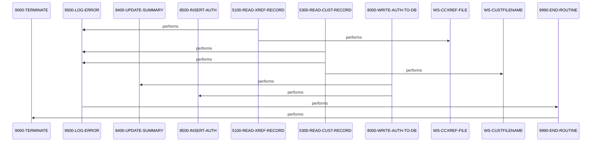

# COPAUA0C

**File**: `cbl/COPAUA0C.cbl`
**Type**: FileType.COBOL
**Analyzed**: 2026-02-24 04:02:30.082862

## Purpose

This CICS COBOL program processes credit card authorization requests received via MQ queue triggered by CICS transaction. It parses the request, looks up card cross-reference, account and customer records via CICS VSAM READ, retrieves pending authorization summary segment from IMS database, computes available credit, decides approve/decline based on transaction amount exceeding limit, populates response, sends reply via MQ to reply queue, and updates/inserts IMS summary and detail segments accordingly.

**Business Context**: CardDemo Authorization Module for real-time credit card transaction authorization decisions

## Inputs

| Name | Type | Description |
|------|------|-------------|
| REQUEST-QNAME (MQ Queue) | IOType.CICS_QUEUE | Incoming authorization request messages in string format, parsed into PENDING-AUTH-REQUEST layout |
| XREF-FILE (VSAM?) | IOType.FILE_VSAM | Card cross-reference records providing account ID and customer ID from card number |
| ACCT-FILE | IOType.FILE_VSAM | Account master records with credit limits and balances |
| CUST-FILE | IOType.FILE_VSAM | Customer master records |
| PAUTSUM0 (IMS Segment) | IOType.IMS_SEGMENT | Pending authorization summary segment for account, containing credit limits, balances, auth counts |
| MQTM (Trigger Message) | IOType.CICS_COMMAREA | CICS trigger message providing request queue name and trigger data |

## Outputs

| Name | Type | Description |
|------|------|-------------|
| REPLY-QNAME (MQ Queue) | IOType.CICS_QUEUE | Authorization response message in string format from PENDING-AUTH-RESPONSE layout |
| PAUTSUM0 (IMS Update/Insert) | IOType.IMS_SEGMENT | Updated or new pending auth summary segment with incremented auth counts and adjusted balances |
| PAUTDTL1 (IMS Insert) | IOType.IMS_SEGMENT | New pending auth detail segment capturing transaction details and decision |
| ERROR-LOG | IOType.OTHER | Application error log entries for warnings, critical errors from MQ, IMS, CICS |

## Business Rules

- **BR001**: Decline authorization if transaction amount exceeds available credit (credit limit minus current balance)
- **BR002**: Set decline reason code '4100' for insufficient funds
- **BR003**: Decline with reason '3100' if card/account/customer not found in masters
- **BR004**: On approval, set response code '00', approved amount = transaction amount; on decline '05', approved amount 0
- **BR005**: Update IMS summary: increment approved/declined auth counts and add amounts to balances on approval/decline

## Paragraphs/Procedures

### MAIN-PARA
> [Source: MAIN-PARA.cbl.md](COPAUA0C.cbl.d/MAIN-PARA.cbl.md)
This is the primary entry point paragraph that orchestrates the entire program flow for a single authorization request. It consumes no direct inputs but relies on CICS EIB and MQ trigger data retrieved in initialization. It sequentially performs 1000-INITIALIZE to setup MQ queue, read request, and IMS PSB; then 2000-MAIN-PROCESS to perform lookups (xref, acct, cust, IMS summary), make decision, prepare response; finally 9000-TERMINATE for cleanup, followed by CICS RETURN. No business decisions are made here, but it ensures orderly execution. Errors in subordinates are handled via flags and logging in called paragraphs. It calls 1000-INITIALIZE for setup, 2000-MAIN-PROCESS for core logic, 9000-TERMINATE for closeout. Upon completion, program returns control to CICS without setting return code explicitly.

### 1000-INITIALIZE
> [Source: 1000-INITIALIZE.cbl.md](COPAUA0C.cbl.d/1000-INITIALIZE.cbl.md)
This initialization paragraph sets up the environment by retrieving CICS trigger message for queue name, opening the MQ request queue, and reading the first request message. It consumes EIB data via CICS RETRIEVE into MQTM for WS-REQUEST-QNAME and WS-TRIGGER-DATA, then calls MQOPEN for input-shared access. It produces opened MQ handle W01-HOBJ-REQUEST and request buffer W01-GET-BUFFER populated via MQGET with wait interval. No business logic or decisions; focuses on setup with error handling for MQOPEN/MQGET failures by logging via 9500-LOG-ERROR if compcode != OK. Calls 1100-OPEN-REQUEST-QUEUE to perform MQOPEN and 3100-READ-REQUEST-MQ for MQGET. On MQ errors, sets error flags and logs but continues to exit without abend unless critical.

### 1100-OPEN-REQUEST-QUEUE
> [Source: 1100-OPEN-REQUEST-QUEUE.cbl.md](COPAUA0C.cbl.d/1100-OPEN-REQUEST-QUEUE.cbl.md)
This paragraph opens the MQ request queue for input-shared reading. It consumes WS-REQUEST-QNAME from trigger, sets MQOD for queue object, options MQOO-INPUT-SHARED. Produces W01-HOBJ-REQUEST handle if successful. No business logic, purely MQ setup. On failure (compcode != MQCC-OK), sets critical MQ error, populates ERR-CODE-1/2 from compcode/reason, message 'REQ MQ OPEN ERROR', performs 9500-LOG-ERROR. Calls no other paragraphs.

### 3100-READ-REQUEST-MQ
> [Source: 3100-READ-REQUEST-MQ.cbl.md](COPAUA0C.cbl.d/3100-READ-REQUEST-MQ.cbl.md)
This paragraph reads the authorization request from MQ queue with wait and convert options. Consumes opened queue handle, sets MD for correlid none, format string, options no-sync/wait/convert/fail-quiescing. Produces W01-GET-BUFFER with request data (datalen), saves correlid and reply-qname from MD. No business decisions. On compcode != OK, logs error (not shown fully). Calls no others.

### 5200-READ-ACCT-RECORD
> [Source: 5200-READ-ACCT-RECORD.cbl.md](COPAUA0C.cbl.d/5200-READ-ACCT-RECORD.cbl.md)
This paragraph reads the account master record using account ID from xref. Consumes WS-CARD-RID-ACCT-ID from xref lookup, performs CICS READ DATASET into ACCOUNT-RECORD. Produces account data or sets NFOUND-ACCT-IN-MSTR flag. Evaluates RESP: NORMAL sets FOUND-ACCT-IN-MSTR, NOTFND sets flag and warning log 'ACCT NOT FOUND IN XREF', other errors critical app log. Calls 9500-LOG-ERROR on errors. Business logic: determines if account exists for auth decision.

### 5500-READ-AUTH-SUMMRY
> [Source: 5500-READ-AUTH-SUMMRY.cbl.md](COPAUA0C.cbl.d/5500-READ-AUTH-SUMMRY.cbl.md)
This paragraph retrieves IMS pending auth summary segment for the account. Consumes PA-ACCT-ID from xref/acct, EXEC DLI GU on PAUTSUM0 where ACCNTID=PA-ACCT-ID into PENDING-AUTH-SUMMARY. Produces summary data or NFOUND-PAUT-SMRY-SEG flag. Evaluates IMS status: OK sets FOUND, GE sets not found, others critical IMS error log 'IMS GET SUMMARY FAILED'. Calls 9500-LOG-ERROR on error. Key for computing current pending auth balances.

### 6000-MAKE-DECISION
> [Source: 6000-MAKE-DECISION.cbl.md](COPAUA0C.cbl.d/6000-MAKE-DECISION.cbl.md)
Core decision paragraph that determines approve/decline and populates response layout. Consumes request fields (PA-RQ-*) moved to response, flags from lookups, computes available amt preferring IMS summary then acct. Produces PA-RL-* fields with codes '00'/'05', reason '0000'/specific, approved amt. Business logic: decline if trans > available (sets INSUFFICIENT-FUND), sets reasons based on flags (3100 notfound, 4100 insuff, etc.), approve copies trans amt. No explicit error handling here, relies on prior flags. Calls no paragraphs, but logic flows to MQ put.

### 8400-UPDATE-SUMMARY
> [Source: 8400-UPDATE-SUMMARY.cbl.md](COPAUA0C.cbl.d/8400-UPDATE-SUMMARY.cbl.md)
This paragraph updates or inserts IMS pending auth summary based on decision. Consumes decision fields/flags, initializes if not found, sets limits from acct, adjusts counts/balances (approved: +cnt +amt to balance; declined: +decl cnt +decl amt). Produces updated/inserted PAUTSUM0 segment via REPL if found else ISRT. Error handling: on non-OK status, critical IMS log 'IMS UPDATE SUMRY FAILED'. Calls 9500-LOG-ERROR. Ensures persistent auth history.

### 8500-INSERT-AUTH
> [Source: 8500-INSERT-AUTH.cbl.md](COPAUA0C.cbl.d/8500-INSERT-AUTH.cbl.md)
Inserts IMS pending auth detail child segment under summary. Consumes request/response/merchant fields moved to PENDING-AUTH-DETAILS, sets PA-MATCH-PENDING/AUTH-DECLINED flag. Produces new PAUTDTL1 via DLI ISRT under PAUTSUM0 where ACCNTID match. Error handling: non-OK status critical IMS log 'IMS INSERT DETL FAILED'. Calls 9500-LOG-ERROR. Captures transaction audit trail.

### 1200-SCHEDULE-PSB
> [Source: 1200-SCHEDULE-PSB.cbl.md](COPAUA0C.cbl.d/1200-SCHEDULE-PSB.cbl.md)
Schedules the IMS PSB 'PSBPAUTB' for database access required for authorization validation. Consumes PSB-NAME from working storage. Executes DL/I SCHD with NODHABEND; if PSB scheduled more than once (TC), terminates prior and reschedules. Moves DIBSTAT to IMS-RETURN-CODE and checks STATUS-OK; if not, logs critical IMS error 'I001' with return code via 9500-LOG-ERROR. Sets IMS-PSB-SCHD flag on success. No inputs/outputs beyond flags; enables IMS segment access for account/customer/card checks. Handles retry conditions implicitly via status checks. Critical for data validation flow.

### 2100-EXTRACT-REQUEST-MSG
> [Source: 2100-EXTRACT-REQUEST-MSG.cbl.md](COPAUA0C.cbl.d/2100-EXTRACT-REQUEST-MSG.cbl.md)
Parses the raw MQ message buffer from W01-GET-BUFFER into structured authorization request fields. Consumes W01-DATALEN to unstring comma-delimited data into PA-RQ-* fields like date, time, card-num, auth-type, expiry, source, amt (alphanumeric), merchant details. Performs NUMVAL on WS-TRANSACTION-AMT-AN to populate numeric PA-RQ-TRANSACTION-AMT. No conditions or decisions; pure data extraction/transformation. Outputs populated PA-RQ-* for downstream validation. No error handling shown (assumes valid format). Prepares data for IMS lookups and auth logic.

### 7100-SEND-RESPONSE
> [Source: 7100-SEND-RESPONSE.cbl.md](COPAUA0C.cbl.d/7100-SEND-RESPONSE.cbl.md)
Sends authorization decision response to reply queue. Consumes WS-REPLY-QNAME, WS-SAVE-CORRELID, response fields like PA-RL-*, WS-APPROVED-AMT-DIS to populate MQM-OD-REPLY/MQM-MD-REPLY (reply msgtype, non-persistent, expiry 50). Sets MQPMO options (no-sync, default context). Calls MQPUT1 with buffer length WS-RESP-LENGTH. If not OK, logs critical MQ error 'M004' with codes. No validations; assumes response built upstream. Outputs formatted comma-delimited reply message.

### 9000-TERMINATE
> [Source: 9000-TERMINATE.cbl.md](COPAUA0C.cbl.d/9000-TERMINATE.cbl.md)
Program termination cleanup. Checks IMS-PSB-SCHD and executes DL/I TERM if scheduled. Performs 9100-CLOSE-REQUEST-QUEUE to release MQ handle. No inputs consumed; produces clean shutdown state. No business logic or errors handled here; relies on subordinates. Ensures resources released before CICS return.

### 9100-CLOSE-REQUEST-QUEUE
> [Source: 9100-CLOSE-REQUEST-QUEUE.cbl.md](COPAUA0C.cbl.d/9100-CLOSE-REQUEST-QUEUE.cbl.md)
Closes MQ request queue handle if open. Consumes W01-HOBJ-REQUEST flag WS-REQUEST-MQ-OPEN. Calls MQCLOSE with none options. On OK sets WS-REQUEST-MQ-CLSE; else logs warning MQ error 'M005'. Outputs closed handles; warning-level error.

### COPAUA0C
> [Source: COPAUA0C.cbl.md](COPAUA0C.cbl.d/COPAUA0C.cbl.md)
UNKNOWN - line 23 is blank in provided code; outline indicates it calls multiple MQ subroutines (CMQODV, CMQMDV, etc.) likely for MQ structure initialization before MAIN-PARA. No inputs consumed directly visible. No outputs produced directly. No business logic or decisions visible. No error handling shown. Calls numerous MQ setup routines for object descriptors and messages.

### 1000-EXIT
> [Source: 1000-EXIT.cbl.md](COPAUA0C.cbl.d/1000-EXIT.cbl.md)
This is a simple exit paragraph for 1000-INITIALIZE, providing a clean return point after initialization activities. It consumes no data. It produces no outputs or modifications. No business logic or decisions implemented. No error handling. Called implicitly by THRU 1000-EXIT from performers; calls nothing.

### 1100-EXIT
> [Source: 1100-EXIT.cbl.md](COPAUA0C.cbl.d/1100-EXIT.cbl.md)
Simple exit paragraph for 1100-OPEN-REQUEST-QUEUE, allowing THRU return after MQ open logic. Consumes no data. Produces no changes. No logic, conditions, or errors. No calls.

### 1200-EXIT
> [Source: 1200-EXIT.cbl.md](COPAUA0C.cbl.d/1200-EXIT.cbl.md)
Simple exit for 1200-SCHEDULE-PSB after IMS PSB management. No inputs/outputs/logic/errors/calls.

### 2000-MAIN-PROCESS
> [Source: 2000-MAIN-PROCESS.cbl.md](COPAUA0C.cbl.d/2000-MAIN-PROCESS.cbl.md)
Core processing loop for authorization requests, handling multiple messages up to limit. Consumes MQ messages via prior reads, WS-MSG-PROCESSED counter, WS-REQSTS-PROCESS-LIMIT. Produces increments to WS-MSG-PROCESSED, sets IMS-PSB-NOT-SCHD=TRUE post-syncpoint, sets WS-LOOP-END if limit hit. Business logic: PERFORM UNTIL NO-MORE-MSG-AVAILABLE OR WS-LOOP-END (103); extract msg (105), process auth (107), add 1 to processed (109), SYNCPOINT (112), set not-scheduled (114), if processed > limit set end else read next (116-119). Error handling delegated to callees. Calls 2100-EXTRACT-REQUEST-MSG for parsing, 5000-PROCESS-AUTH for business logic, 3100-READ-REQUEST-MQ for next iteration.

### 2000-EXIT
> [Source: 2000-EXIT.cbl.md](COPAUA0C.cbl.d/2000-EXIT.cbl.md)
Exit for 2000-MAIN-PROCESS after loop completion. No inputs/outputs/logic/errors/calls.

### 2100-EXIT
> [Source: 2100-EXIT.cbl.md](COPAUA0C.cbl.d/2100-EXIT.cbl.md)
This is an exit paragraph that simply returns control to the calling paragraph. It consumes no inputs and produces no outputs or modifications. No business logic, decisions, error handling, or calls are implemented. Its sole role is to mark the end of the 2100-EXTRACT-REQUEST-MSG processing block and allow flow to resume at the next statement after the THRU clause if called that way. It is invoked implicitly after 2100-EXTRACT-REQUEST-MSG completes.

### 3100-EXIT
> [Source: 3100-EXIT.cbl.md](COPAUA0C.cbl.d/3100-EXIT.cbl.md)
This exit paragraph returns control to the caller after MQ read processing. No inputs consumed, no outputs produced, no logic or error handling. Serves as endpoint for THRU 3100-EXIT invocations.

### 5000-PROCESS-AUTH
> [Source: 5000-PROCESS-AUTH.cbl.md](COPAUA0C.cbl.d/5000-PROCESS-AUTH.cbl.md)
This is the main authorization processing orchestration paragraph handling a single request. It initializes APPROVE-AUTH to TRUE (line 89), schedules PSB via 1200-SCHEDULE-PSB (line 91), assumes card and account found initially (lines 93-94). It performs sequential reads: 5100-READ-XREF-RECORD (line 96), conditional account/customer/profile/auth-summary reads if xref found (lines 98-105), then 6000-MAKE-DECISION (line 107), 7100-SEND-RESPONSE (line 109), and conditional DB write if xref found (lines 111-113). Inputs are parsed request data (PA-RQ-*) and flags from subordinate reads; outputs are updated flags, decision, response, and DB record. Business logic conditionally skips reads/writes based on CARD-FOUND-XREF flag, centralizing flow control. No explicit error handling here; relies on subordinates. Calls multiple read and processing paragraphs to gather data for decision. Control to 5000-EXIT.

### 5000-EXIT
> [Source: 5000-EXIT.cbl.md](COPAUA0C.cbl.d/5000-EXIT.cbl.md)
Exit paragraph returning control after authorization processing. No inputs, outputs, logic, errors, or calls.

### 5100-READ-XREF-RECORD
> [Source: 5100-READ-XREF-RECORD.cbl.md](COPAUA0C.cbl.d/5100-READ-XREF-RECORD.cbl.md)
This paragraph reads the card cross-reference record from VSAM file WS-CCXREF-FILE using CICS READ with key XREF-CARD-NUM from request (line 122). Input is PA-RQ-CARD-NUM moved to key; outputs CARD-XREF-RECORD into working storage and sets CARD-FOUND-XREF or CARD-NFOUND-XREF based on response (lines 135-139). Evaluates WS-RESP-CD: NORMAL sets found flag (line 136); NOTFND logs app warning 'A001' via 9500-LOG-ERROR and sets not found flags (lines 141-147); OTHER logs critical CICS error 'C001' with resp/reas codes (lines 149-159). Business logic classifies read outcome to drive downstream processing like skipping further reads if not found. Error handling uses EVALUATE for all resp codes, logging appropriately without abending on NOTFND. Calls 9500-LOG-ERROR twice on errors. Control to 5100-EXIT.

### 5100-EXIT
> [Source: 5100-EXIT.cbl.md](COPAUA0C.cbl.d/5100-EXIT.cbl.md)
Exit paragraph after xref read. No logic or changes.

### 5200-EXIT
> [Source: 5200-EXIT.cbl.md](COPAUA0C.cbl.d/5200-EXIT.cbl.md)
Exit after account read. Minimal, no actions.

### 5300-READ-CUST-RECORD
> [Source: 5300-READ-CUST-RECORD.cbl.md](COPAUA0C.cbl.d/5300-READ-CUST-RECORD.cbl.md)
This paragraph reads the customer record from the VSAM customer file using CICS READ with RIDFLD based on XREF-CUST-ID moved to WS-CARD-RID-CUST-ID-X. It consumes the customer ID from prior XREF processing (line 4). It produces the populated CUSTOMER-RECORD area and sets flags FOUND-CUST-IN-MSTR or NFOUND-CUST-IN-MSTR based on response. Business logic evaluates WS-RESP-CD: NORMAL sets found flag (17-18); NOTFND sets not found, logs warning 'A003' with message 'CUST NOT FOUND IN XREF' (19-28); OTHER logs critical CICS error 'C003' with resp/reas codes and 'FAILED TO READ CUST FILE' (30-41). Error handling logs via 9500-LOG-ERROR for both warning and critical cases, using ERR-LOCATION, flags, codes, message, and key. It calls 9500-LOG-ERROR twice potentially, once for NOTFND and once for OTHER.

### 5300-EXIT
> [Source: 5300-EXIT.cbl.md](COPAUA0C.cbl.d/5300-EXIT.cbl.md)
This is an exit paragraph that simply performs EXIT to return control to the caller paragraph. It consumes no inputs and produces no outputs. There is no business logic, conditions, or error handling. It calls no other paragraphs or programs. Its role is to cleanly exit the 5300-READ-CUST-RECORD logic.

### 5500-EXIT
> [Source: 5500-EXIT.cbl.md](COPAUA0C.cbl.d/5500-EXIT.cbl.md)
This is an exit paragraph that simply performs EXIT to return control to the caller. It consumes no data and produces nothing. No logic, decisions, or error handling is present. No calls are made. Its purpose is to terminate the 5500-READ-AUTH-SUMMRY paragraph flow.

### 5600-READ-PROFILE-DATA
> [Source: 5600-READ-PROFILE-DATA.cbl.md](COPAUA0C.cbl.d/5600-READ-PROFILE-DATA.cbl.md)
This paragraph is a placeholder for reading profile data but currently contains only CONTINUE with no actual logic implemented. It consumes no inputs and produces no outputs or flags. There are no business decisions, validations, or error handling. No other paragraphs or programs are called. Its intended role appears to be retrieving profile data, but it is not functional in this code.

### 5600-EXIT
> [Source: 5600-EXIT.cbl.md](COPAUA0C.cbl.d/5600-EXIT.cbl.md)
This exit paragraph performs EXIT to return control. No inputs consumed, no outputs produced. No logic or errors handled. No calls. Standard exit for 5600-READ-PROFILE-DATA.

### 6000-EXIT
> [Source: 6000-EXIT.cbl.md](COPAUA0C.cbl.d/6000-EXIT.cbl.md)
Exit paragraph performing EXIT. No inputs/outputs/logic/errors/calls. Returns control after decision logic.

### 7100-EXIT
> [Source: 7100-EXIT.cbl.md](COPAUA0C.cbl.d/7100-EXIT.cbl.md)
Standard exit paragraph with EXIT. No data flow, logic, errors, or calls. Terminates send response flow.

### 8000-WRITE-AUTH-TO-DB
> [Source: 8000-WRITE-AUTH-TO-DB.cbl.md](COPAUA0C.cbl.d/8000-WRITE-AUTH-TO-DB.cbl.md)
This paragraph is the primary orchestrator for persisting authorization outcomes to the IMS database during the write phase. It consumes pre-populated working storage data including account cross-references (XREF-ACCT-ID, XREF-CUST-ID), credit limits (ACCT-CREDIT-LIMIT), approval status (AUTH-RESP-APPROVED), approved amount (WS-APPROVED-AMT), and request/response details (PA-RQ-*, PA-RL-*). It produces updates to the PAUTSUM0 summary segment and a new PAUTDTL1 detail segment via subordinate paragraphs. The business logic sequences summary update first followed by detail insert to ensure hierarchical integrity under the account ID. No direct error handling occurs here; errors are managed in called paragraphs with critical flags set if IMS fails. It unconditionally calls 8400-UPDATE-SUMMARY THRU 8400-EXIT to handle summary logic and IMS I/O, then 8500-INSERT-AUTH THRU 8500-EXIT for detail insertion with fresh timestamps. Upon completion of both, control passes to 8000-EXIT to return to the main flow.

### 8000-EXIT
> [Source: 8000-EXIT.cbl.md](COPAUA0C.cbl.d/8000-EXIT.cbl.md)
This paragraph serves as the dedicated exit point for 8000-WRITE-AUTH-TO-DB, ensuring clean return of control to the invoking paragraph. It consumes no inputs and produces no outputs or modifications to data areas. There is no business logic, conditions, or decisions implemented within it. No validation or error handling is performed, as any issues are resolved prior to reaching this point. It is invoked immediately after the PERFORM THRU statements in 8000-WRITE-AUTH-TO-DB. No subordinate paragraphs or external programs are called from here. The sole statement is EXIT, which transfers control back up the perform stack.

### 8400-EXIT
> [Source: 8400-EXIT.cbl.md](COPAUA0C.cbl.d/8400-EXIT.cbl.md)
This is the exit routine for 8400-UPDATE-SUMMARY, providing a standard return point after IMS summary operations. It reads no data and writes nothing. No logic or conditions are evaluated. Error conditions are handled prior in the main body. Invoked via THRU in 8000-WRITE-AUTH-TO-DB. No calls are made. Executes EXIT to resume in caller.

### 8500-EXIT
> [Source: 8500-EXIT.cbl.md](COPAUA0C.cbl.d/8500-EXIT.cbl.md)
Exit point for 8500-INSERT-AUTH following detail segment insertion. No inputs consumed or outputs produced. No decisions or logic. Errors handled upstream. Called via THRU from 8000. No calls. EXIT statement only.

### 9000-EXIT
> [Source: 9000-EXIT.cbl.md](COPAUA0C.cbl.d/9000-EXIT.cbl.md)
Standard exit for 9000-TERMINATE after resource closure. No I/O, logic, or errors here. Returns control to prior flow. Invoked via THRU. No calls. EXIT.

### 9100-EXIT
> [Source: 9100-EXIT.cbl.md](COPAUA0C.cbl.d/9100-EXIT.cbl.md)
Exit routine for 9100-CLOSE-REQUEST-QUEUE post-MQ closure. No data access or modification. No conditions checked. Errors logged prior. Called via THRU. No further calls. EXIT to return.

### 9500-LOG-ERROR
> [Source: 9500-LOG-ERROR.cbl.md](COPAUA0C.cbl.d/9500-LOG-ERROR.cbl.md)
This paragraph serves as the primary error logging routine in the program, invoked when an error condition occurs to record details for auditing and diagnostics. It consumes working storage variables such as WS-CICS-TRANID, WS-PGM-AUTH, and ERR-CRITICAL, as well as internally populating WS-ABS-TIME via CICS ASKTIME and deriving WS-CUR-DATE-X6 and WS-CUR-TIME-X6 via FORMATTIME. It produces a populated ERROR-LOG-RECORD by moving transaction ID to ERR-APPLICATION, program auth to ERR-PROGRAM, formatted date to ERR-DATE, and time to ERR-TIME, then writes the entire record to the CSSL TD queue. The business logic centers on deciding whether to terminate based on the ERR-CRITICAL flag: if true, it performs 9990-END-ROUTINE to shut down; otherwise, it falls through to exit. Error handling for CICS commands uses NOHANDLE, suppressing exceptions silently. It calls 9990-END-ROUTINE conditionally for critical errors to ensure proper program termination. This routine supports operational reliability by logging errors without interrupting non-critical flows. No files are opened or closed here; it relies on prior setup.

### ~~9500-EXIT~~ (Dead Code)
> [Source: 9500-EXIT.cbl.md](COPAUA0C.cbl.d/9500-EXIT.cbl.md)
*Paragraph '9500-EXIT' is never PERFORMed or referenced by any other paragraph or program*

### 9990-END-ROUTINE
> [Source: 9990-END-ROUTINE.cbl.md](COPAUA0C.cbl.d/9990-END-ROUTINE.cbl.md)
This paragraph orchestrates the final termination of the program in response to critical errors, ensuring cleanup and return to CICS. It consumes no explicit inputs, relying on prior state from calling context. It produces program shutdown by performing 9000-TERMINATE (presumably for resource cleanup) and issuing EXEC CICS RETURN to release control back to CICS. There is no conditional business logic; it unconditionally executes termination steps. No specific error handling or validations are performed here, deferring to 9000-TERMINATE. It calls 9000-TERMINATE to handle any necessary file closures, variable resets, or other end-of-task activities before returning. This routine is critical for preventing resource leaks in CICS environment. Control flows to 9990-EXIT afterward. Its invocation only occurs from 9500-LOG-ERROR for critical cases.

### ~~9990-EXIT~~ (Dead Code)
> [Source: 9990-EXIT.cbl.md](COPAUA0C.cbl.d/9990-EXIT.cbl.md)
*Paragraph '9990-EXIT' is never PERFORMed or referenced by any other paragraph or program*

## Dead Code

The following artifacts were identified as dead code by static analysis:

| Artifact | Type | Line | Reason |
|----------|------|------|--------|
| 9500-EXIT | paragraph | 1012 | Paragraph '9500-EXIT' is never PERFORMed or referenced by any other paragraph or program |
| 9990-EXIT | paragraph | 1024 | Paragraph '9990-EXIT' is never PERFORMed or referenced by any other paragraph or program |

## Control Flow

## Open Questions

- ? Details of 2000-MAIN-PROCESS, 5100-READ-XREF, 5300-READ-CUST, MQ reply put paragraph, 9000-TERMINATE, 9500-LOG-ERROR
  - Context: Source is sampled (55.2%), many lines omitted including these key paragraphs
- ? Exact logic for CARD-NOT-ACTIVE, ACCOUNT-CLOSED, CARD-FRAUD, MERCHANT-FRAUD flags
  - Context: Flags defined but setting logic not in sampled lines (e.g., likely in acct/cust reads)
- ? Customer read details and usage in decision
  - Context: Flag FOUND-CUST-IN-MSTR referenced in BR but read logic partially omitted at 604

## Sequence Diagram

### Part 1 of 2

```mermaid
sequenceDiagram
    participant MAIN_PARA as MAIN-PARA
    participant 1000_INITIALIZE as 1000-INITIALIZE
    participant 2000_MAIN_PROCESS as 2000-MAIN-PROCESS
    participant 9000_TERMINATE as 9000-TERMINATE
    participant 1100_OPEN_REQUEST_QUEUE as 1100-OPEN-REQUEST-QUEUE
    participant 3100_READ_REQUEST_MQ as 3100-READ-REQUEST-MQ
    participant MQOPEN as MQOPEN
    participant 9500_LOG_ERROR as 9500-LOG-ERROR
    participant MQGET as MQGET
    participant 5200_READ_ACCT_RECORD as 5200-READ-ACCT-RECORD
    participant WS_ACCTFILENAME as WS-ACCTFILENAME
    participant 5500_READ_AUTH_SUMMRY as 5500-READ-AUTH-SUMMRY
    participant 8400_UPDATE_SUMMARY as 8400-UPDATE-SUMMARY
    participant 8500_INSERT_AUTH as 8500-INSERT-AUTH
    participant 1200_SCHEDULE_PSB as 1200-SCHEDULE-PSB
    participant 7100_SEND_RESPONSE as 7100-SEND-RESPONSE
    participant MQPUT1 as MQPUT1
    participant 9100_CLOSE_REQUEST_QUEUE as 9100-CLOSE-REQUEST-QUEUE
    participant MQCLOSE as MQCLOSE
    participant COPAUA0C as COPAUA0C
    participant CMQODV as CMQODV
    participant CMQMDV as CMQMDV
    participant CMQV as CMQV
    participant CMQTML as CMQTML
    participant CMQPMOV as CMQPMOV
    participant CMQGMOV as CMQGMOV
    participant CCPAURQY as CCPAURQY
    participant CCPAURLY as CCPAURLY
    participant CCPAUERY as CCPAUERY
    participant CIPAUSMY as CIPAUSMY
    participant CIPAUDTY as CIPAUDTY
    participant CVACT03Y as CVACT03Y
    participant CVACT01Y as CVACT01Y
    participant CVCUS01Y as CVCUS01Y
    participant 2100_EXTRACT_REQUEST_MSG as 2100-EXTRACT-REQUEST-MSG
    participant 5000_PROCESS_AUTH as 5000-PROCESS-AUTH
    participant 5100_READ_XREF_RECORD as 5100-READ-XREF-RECORD
    participant 5300_READ_CUST_RECORD as 5300-READ-CUST-RECORD
    participant 5600_READ_PROFILE_DATA as 5600-READ-PROFILE-DATA
    participant 6000_MAKE_DECISION as 6000-MAKE-DECISION
    participant 8000_WRITE_AUTH_TO_DB as 8000-WRITE-AUTH-TO-DB
    MAIN_PARA->>1000_INITIALIZE: performs
    MAIN_PARA->>2000_MAIN_PROCESS: performs
    MAIN_PARA->>9000_TERMINATE: performs
    1000_INITIALIZE->>1100_OPEN_REQUEST_QUEUE: performs
    1000_INITIALIZE->>3100_READ_REQUEST_MQ: performs
    1100_OPEN_REQUEST_QUEUE->>MQOPEN: performs
    1100_OPEN_REQUEST_QUEUE->>9500_LOG_ERROR: performs
    3100_READ_REQUEST_MQ->>MQGET: performs
    3100_READ_REQUEST_MQ->>9500_LOG_ERROR: performs
    5200_READ_ACCT_RECORD->>9500_LOG_ERROR: performs
    5200_READ_ACCT_RECORD->>9500_LOG_ERROR: performs
    5200_READ_ACCT_RECORD->>WS_ACCTFILENAME: performs
    5500_READ_AUTH_SUMMRY->>9500_LOG_ERROR: performs
    8400_UPDATE_SUMMARY->>9500_LOG_ERROR: performs
    8500_INSERT_AUTH->>9500_LOG_ERROR: performs
    1200_SCHEDULE_PSB->>9500_LOG_ERROR: performs
    7100_SEND_RESPONSE->>MQPUT1: performs
    7100_SEND_RESPONSE->>9500_LOG_ERROR: performs
    9000_TERMINATE->>9100_CLOSE_REQUEST_QUEUE: performs
    9100_CLOSE_REQUEST_QUEUE->>MQCLOSE: performs
    9100_CLOSE_REQUEST_QUEUE->>9500_LOG_ERROR: performs
    COPAUA0C->>CMQODV: performs
    COPAUA0C->>CMQMDV: performs
    COPAUA0C->>CMQODV: performs
    COPAUA0C->>CMQMDV: performs
    COPAUA0C->>CMQV: performs
    COPAUA0C->>CMQTML: performs
    COPAUA0C->>CMQPMOV: performs
    COPAUA0C->>CMQGMOV: performs
    COPAUA0C->>CCPAURQY: performs
    COPAUA0C->>CCPAURLY: performs
    COPAUA0C->>CCPAUERY: performs
    COPAUA0C->>CIPAUSMY: performs
    COPAUA0C->>CIPAUDTY: performs
    COPAUA0C->>CVACT03Y: performs
    COPAUA0C->>CVACT01Y: performs
    COPAUA0C->>CVCUS01Y: performs
    2000_MAIN_PROCESS->>2100_EXTRACT_REQUEST_MSG: performs
    2000_MAIN_PROCESS->>5000_PROCESS_AUTH: performs
    2000_MAIN_PROCESS->>3100_READ_REQUEST_MQ: performs
    5000_PROCESS_AUTH->>1200_SCHEDULE_PSB: performs
    5000_PROCESS_AUTH->>5100_READ_XREF_RECORD: performs
    5000_PROCESS_AUTH->>5200_READ_ACCT_RECORD: performs
    5000_PROCESS_AUTH->>5300_READ_CUST_RECORD: performs
    5000_PROCESS_AUTH->>5500_READ_AUTH_SUMMRY: performs
    5000_PROCESS_AUTH->>5600_READ_PROFILE_DATA: performs
    5000_PROCESS_AUTH->>6000_MAKE_DECISION: performs
    5000_PROCESS_AUTH->>7100_SEND_RESPONSE: performs
    5000_PROCESS_AUTH->>8000_WRITE_AUTH_TO_DB: performs
    5100_READ_XREF_RECORD->>9500_LOG_ERROR: performs
```

### Part 2 of 2

