# COPAUA0C

**File**: `cbl/COPAUA0C.cbl`
**Type**: FileType.COBOL
**Analyzed**: 2026-02-09 15:46:17.395901

## Purpose

This COBOL program processes authorization requests, reads card, account, and customer information, makes a decision on whether to approve or decline the authorization, sends a response, and updates the authorization summary in a database. It uses CICS to read VSAM files and IMS to update the PAUTSUM0 segment.

**Business Context**: This program is likely part of a credit card or payment processing system, handling real-time authorization requests.

## Inputs

| Name | Type | Description |
|------|------|-------------|
| W01-GET-BUFFER | IOType.CICS_QUEUE | Contains the authorization request message received from the MQ queue. The message includes authorization date, time, card number, authorization type, card expiry date, message type, message source, processing code, transaction amount, merchant category code, acquirer country code, POS entry mode, merchant ID, merchant name, merchant city, merchant state, merchant zip, and transaction ID. |
| WS-CCXREF-FILE | IOType.FILE_VSAM | Card Cross-Reference file, used to retrieve account and customer IDs based on the card number. |
| WS-ACCTFILENAME | IOType.FILE_VSAM | Account master file, used to retrieve account information based on the account ID. |
| WS-CUSTFILENAME | IOType.FILE_VSAM | Customer master file, used to retrieve customer information based on the customer ID. |

## Outputs

| Name | Type | Description |
|------|------|-------------|
| W02-PUT-BUFFER | IOType.CICS_QUEUE | Contains the authorization response message sent to the reply MQ queue. The message includes card number, transaction ID, authorization ID code, authorization response code, authorization response reason, and approved amount. |
| PAUTSUM0 | IOType.IMS_SEGMENT | Pending Authorization Summary segment in IMS database, updated with authorization details. |

## Called Programs

| Program | Call Type | Purpose |
|---------|-----------|---------|
| MQGET | CallType.STATIC_CALL | Retrieves a message from the request MQ queue. |
| MQPUT1 | CallType.STATIC_CALL | Sends a message to the reply MQ queue. |

## Business Rules

- **BR001**: Decline authorization if the transaction amount exceeds the available credit limit, using the pending authorization summary if available, otherwise using the account master data.
- **BR002**: Decline authorization if the card, account, or customer is not found in the respective master files.

## Paragraphs/Procedures

### 2100-EXTRACT-REQUEST-MSG
This paragraph extracts data from the incoming MQ message (W01-GET-BUFFER) and populates various PA-RQ-* fields. It uses the UNSTRING statement to parse the comma-delimited message. The extracted data includes authorization date, time, card number, authorization type, card expiry date, message type, message source, processing code, transaction amount, merchant category code, acquirer country code, POS entry mode, merchant ID, merchant name, merchant city, merchant state, merchant zip, and transaction ID. It then converts the alphanumeric transaction amount (WS-TRANSACTION-AMT-AN) to a numeric value (PA-RQ-TRANSACTION-AMT) using the NUMVAL function and moves it to WS-TRANSACTION-AMT. No error handling is explicitly present within this paragraph. It does not call any other paragraphs or programs.

### 3100-READ-REQUEST-MQ
This paragraph reads a request message from the MQ queue. It sets the MQGMO options for MQGET, including no syncpoint, wait, convert, and fail if quiescing. It also sets the MQMD message and correlation IDs to MQMI-NONE and MQCI-NONE, respectively, and the format to MQFMT-STRING. It then calls the MQGET program to retrieve the message from the queue, using W01-GET-BUFFER to store the message. If the MQGET call is successful (WS-COMPCODE = MQCC-OK), it saves the correlation ID and reply queue name from the MQMD. If the call fails, it checks the reason code (WS-REASON). If the reason is MQRC-NO-MSG-AVAILABLE, it sets the NO-MORE-MSG-AVAILABLE flag to TRUE. Otherwise, it logs an error message with location 'M003', sets error flags, and performs 9500-LOG-ERROR. The paragraph consumes the W01-HCONN-REQUEST, W01-HOBJ-REQUEST, MQM-MD-REQUEST, MQM-GET-MESSAGE-OPTIONS, W01-BUFFLEN, and W01-GET-BUFFER parameters for the MQGET call. It produces the W01-GET-BUFFER containing the message and updates WS-COMPCODE and WS-REASON with the MQGET results.

### 5000-PROCESS-AUTH
This paragraph orchestrates the authorization processing. It starts by setting APPROVE-AUTH to TRUE and scheduling a PSB (Program Specification Block) using PERFORM 1200-SCHEDULE-PSB. It then sets CARD-FOUND-XREF and FOUND-ACCT-IN-MSTR to TRUE. It proceeds to read the card cross-reference record (5100-READ-XREF-RECORD). If the card is found in the cross-reference (CARD-FOUND-XREF), it reads the account record (5200-READ-ACCT-RECORD), the customer record (5300-READ-CUST-RECORD), the authorization summary (5500-READ-AUTH-SUMMRY), and the profile data (5600-READ-PROFILE-DATA). After reading the necessary data, it makes a decision on whether to approve or decline the authorization (6000-MAKE-DECISION) and sends the response (7100-SEND-RESPONSE). Finally, if the card was found in the cross-reference, it writes the authorization to the database (8000-WRITE-AUTH-TO-DB). This paragraph consumes data from the request message and the various master files. It produces the authorization response and updates the database. Error handling is delegated to the called paragraphs.

### 5100-READ-XREF-RECORD
This paragraph reads the card cross-reference record from the VSAM file WS-CCXREF-FILE. It moves the card number from the request (PA-RQ-CARD-NUM) to the XREF-CARD-NUM field, which is used as the RIDFLD for the CICS READ command. The CICS READ command retrieves the CARD-XREF-RECORD. The paragraph then evaluates the CICS response code (WS-RESP-CD). If the response is NORMAL, it sets CARD-FOUND-XREF to TRUE. If the response is NOTFND, it sets CARD-NFOUND-XREF and NFOUND-ACCT-IN-MSTR to TRUE, logs a warning message with location 'A001', and performs 9500-LOG-ERROR. If the response is OTHER, it logs a critical error message with location 'C001', sets error flags, and performs 9500-LOG-ERROR. This paragraph consumes the PA-RQ-CARD-NUM as input and produces the CARD-XREF-RECORD as output. The error handling involves logging errors and setting appropriate flags based on the CICS response code.

### 5200-READ-ACCT-RECORD
This paragraph reads the account record from the VSAM file WS-ACCTFILENAME. It moves the account ID from the cross-reference record (XREF-ACCT-ID) to the WS-CARD-RID-ACCT-ID field, which is used as the RIDFLD for the CICS READ command. The CICS READ command retrieves the ACCOUNT-RECORD. The paragraph then evaluates the CICS response code (WS-RESP-CD). If the response is NORMAL, it sets FOUND-ACCT-IN-MSTR to TRUE. If the response is NOTFND, it sets NFOUND-ACCT-IN-MSTR to TRUE, logs a warning message with location 'A002', and performs 9500-LOG-ERROR. If the response is OTHER, it logs a critical error message with location 'C002', sets error flags, and performs 9500-LOG-ERROR. This paragraph consumes the XREF-ACCT-ID as input and produces the ACCOUNT-RECORD as output. The error handling involves logging errors and setting appropriate flags based on the CICS response code.

### 5300-READ-CUST-RECORD
This paragraph reads the customer record from the VSAM file WS-CUSTFILENAME. It moves the customer ID from the cross-reference record (XREF-CUST-ID) to the WS-CARD-RID-CUST-ID field, which is used as the RIDFLD for the CICS READ command. The CICS READ command retrieves the CUSTOMER-RECORD. The paragraph then evaluates the CICS response code (WS-RESP-CD). If the response is NORMAL, it sets FOUND-CUST-IN-MSTR to TRUE. If the response is NOTFND, it sets NFOUND-CUST-IN-MSTR to TRUE, logs a warning message with location 'A003', and performs 9500-LOG-ERROR. If the response is OTHER, it logs a critical error message with location 'C003', sets error flags, and performs 9500-LOG-ERROR. This paragraph consumes the XREF-CUST-ID as input and produces the CUSTOMER-RECORD as output. The error handling involves logging errors and setting appropriate flags based on the CICS response code.

### 5500-READ-AUTH-SUMMRY
This paragraph reads the pending authorization summary from the IMS database. It moves the account ID from the cross-reference record (XREF-ACCT-ID) to the PA-ACCT-ID field. It then executes a DLI GU (Get Unique) command to retrieve the PAUTSUM0 segment from the IMS database, using PA-ACCT-ID as the search argument. The retrieved segment is stored in PENDING-AUTH-SUMMARY. The paragraph then checks the IMS return code (DIBSTAT). If the status is OK, it sets FOUND-PAUT-SMRY-SEG to TRUE. If the segment is not found, it sets NFOUND-PAUT-SMRY-SEG to TRUE. If any other error occurs, it logs a critical error message with location 'I002', sets error flags, and performs 9500-LOG-ERROR. This paragraph consumes the XREF-ACCT-ID as input and produces the PENDING-AUTH-SUMMARY as output. The error handling involves logging errors and setting appropriate flags based on the IMS return code.

### 5600-READ-PROFILE-DATA
This paragraph currently contains only a CONTINUE statement, indicating that it does nothing. It serves as a placeholder for future functionality related to reading profile data. It consumes no inputs and produces no outputs. No error handling or calls to other paragraphs/programs are performed.

### 6000-MAKE-DECISION
This paragraph determines whether to approve or decline the authorization request. It moves data from the request to response fields. It checks if a pending authorization summary segment was found (FOUND-PAUT-SMRY-SEG). If found, it calculates the available amount (WS-AVAILABLE-AMT) by subtracting the credit balance (PA-CREDIT-BALANCE) from the credit limit (PA-CREDIT-LIMIT) from the summary segment. If the transaction amount (WS-TRANSACTION-AMT) exceeds the available amount, it declines the authorization. If no summary segment was found, it checks if the account was found in the master file (FOUND-ACCT-IN-MSTR). If found, it calculates the available amount using the account's credit limit (ACCT-CREDIT-LIMIT) and current balance (ACCT-CURR-BAL). If the transaction amount exceeds the available amount, it declines the authorization. If the account was not found, it declines the authorization. If the authorization is declined, it sets the AUTH-RESP-DECLINED flag to TRUE, moves '05' to the authorization response code (PA-RL-AUTH-RESP-CODE), and sets the approved amount (PA-RL-APPROVED-AMT) to 0. Otherwise, it sets the AUTH-RESP-APPROVED flag to TRUE, moves '00' to the authorization response code, and moves the transaction amount to the approved amount. Finally, it sets the authorization response reason code (PA-RL-AUTH-RESP-REASON) based on various conditions, such as card not found, insufficient funds, etc. This paragraph consumes data from the request, the pending authorization summary, and the account master file. It produces the authorization response code and reason. Error handling is performed by setting the appropriate response reason code.

### 7100-SEND-RESPONSE
This paragraph sends the authorization response to the reply MQ queue. It sets the MQOD object type and object name using the reply queue name (WS-REPLY-QNAME). It sets the MQMD message type to MQMT-REPLY, the correlation ID to the saved correlation ID (WS-SAVE-CORRELID), and other MQMD fields. It then sets the MQPMO options for the MQPUT1 call. It calls the MQPUT1 program to send the response message (W02-PUT-BUFFER) to the reply queue. If the MQPUT1 call fails, it logs an error message with location 'M004', sets error flags, and performs 9500-LOG-ERROR. This paragraph consumes the authorization response data and the MQ connection and object definitions. It produces the message sent to the reply queue. Error handling is performed by logging errors if the MQPUT1 call fails.

### 8000-WRITE-AUTH-TO-DB
This paragraph updates the authorization summary in the IMS database. It performs 8400-UPDATE-SUMMARY to update the PENDING-AUTH-SUMMARY segment and then performs 8500-INSERT-AUTH to insert the authorization record. It consumes the authorization details and updates the database. Error handling is delegated to the called paragraphs.

### 8400-UPDATE-SUMMARY
This paragraph updates the pending authorization summary segment (PAUTSUM0) in the IMS database. If the segment is not found (NFOUND-PAUT-SMRY-SEG), it initializes the PENDING-AUTH-SUMMARY, moves the account ID (XREF-ACCT-ID) and customer ID (XREF-CUST-ID) to the segment. It then moves the credit limit and cash credit limit from the account record to the segment. If the authorization was approved (AUTH-RESP-APPROVED), it increments the approved authorization count (PA-APPROVED-AUTH-CNT), adds the approved amount (WS-APPROVED-AMT) to the approved authorization amount (PA-APPROVED-AUTH-AMT), adds the approved amount to the credit balance (PA-CREDIT-BALANCE), and sets the cash balance to 0. Otherwise, it increments the declined authorization count (PA-DECLINED-AUTH-CNT) and adds the transaction amount (PA-TRANSACTION-AMT) to the declined authorization amount (PA-DECLINED-AUTH-AMT). Finally, it either replaces the existing segment (if FOUND-PAUT-SMRY-SEG) or inserts a new segment (if NFOUND-PAUT-SMRY-SEG) using DLI REPL or DLI ISRT, respectively. If the IMS call fails, it logs an error message with location 'I003', sets error flags. This paragraph consumes data from the account record, the authorization request, and the cross-reference record. It produces an updated or newly inserted PAUTSUM0 segment in the IMS database. Error handling is performed by logging errors if the IMS call fails.

### MAIN-PARA
This is the main control paragraph of the program. It orchestrates the entire process by calling other paragraphs in sequence. First, it calls 1000-INITIALIZE to perform initial setup tasks such as retrieving the MQ parameters and opening the request queue. Then, it calls 2000-MAIN-PROCESS to process the incoming messages from the queue. Finally, it calls 9000-TERMINATE to close the queue and perform any necessary cleanup before returning control to CICS. The paragraph itself doesn't directly handle any business logic or data manipulation, but it controls the overall flow of the program. After the subroutines are completed, the program returns to CICS.

### 1000-INITIALIZE
This paragraph performs the initialization tasks required before processing messages. It first retrieves the MQ parameters from the CICS COMMAREA (MQTM) using EXEC CICS RETRIEVE, storing the queue name and trigger data into working storage. It then sets the wait interval for reading messages from the queue to 5000. Next, it calls 1100-OPEN-REQUEST-QUEUE to open the request queue for processing. Finally, it calls 3100-READ-REQUEST-MQ to read the first message from the queue. If the RETRIEVE command fails, the program continues without error handling. The paragraph prepares the program to receive and process messages from the MQ.

### 1000-EXIT
This paragraph serves as the exit point for the 1000-INITIALIZE paragraph. It contains only the EXIT statement, which allows control to return to the calling paragraph (MAIN-PARA). It does not perform any specific actions or data manipulation. It is a standard practice to use EXIT paragraphs to provide a clear and consistent exit point for PERFORM THRU constructs.

### 1100-OPEN-REQUEST-QUEUE
This paragraph opens the request queue for processing messages. It first moves the MQOT-Q value to MQOD-OBJECTTYPE and the WS-REQUEST-QNAME to MQOD-OBJECTNAME, defining the object to be opened. Then, it computes the WS-OPTIONS by setting it to MQOO-INPUT-SHARED, indicating that the queue will be opened for shared input. The MQOPEN call is then made using the connection handle (W01-HCONN-REQUEST), the object descriptor (MQM-OD-REQUEST), the options (WS-OPTIONS), the object handle (W01-HOBJ-REQUEST), the completion code (WS-COMPCODE), and the reason code (WS-REASON). If the MQOPEN call is successful (WS-COMPCODE = MQCC-OK), it sets the WS-REQUEST-MQ-OPEN flag to TRUE. Otherwise, it moves error information to various error fields (ERR-LOCATION, ERR-CODE-1, ERR-CODE-2, ERR-MESSAGE), sets the error flags (ERR-CRITICAL, ERR-MQ), and calls the 9500-LOG-ERROR paragraph to log the error. The paragraph ensures the program can access the MQ to retrieve messages.

### 1100-EXIT
This paragraph serves as the exit point for the 1100-OPEN-REQUEST-QUEUE paragraph. It contains only the EXIT statement, which allows control to return to the calling paragraph (1000-INITIALIZE). It does not perform any specific actions or data manipulation. It is a standard practice to use EXIT paragraphs to provide a clear and consistent exit point for PERFORM THRU constructs.

### 1200-SCHEDULE-PSB
This paragraph schedules a PSB (Program Specification Block) for IMS database access. It uses the EXEC DLI SCHD command to schedule the PSB specified by PSB-NAME. If the PSB has been scheduled more than once, it terminates the current scheduling using EXEC DLI TERM and then schedules the PSB again. The DIBSTAT value is moved to IMS-RETURN-CODE after each scheduling attempt. If the scheduling is successful (STATUS-OK), the IMS-PSB-SCHD flag is set to TRUE. Otherwise, error information is moved to various error fields (ERR-LOCATION, ERR-CODE-1, ERR-MESSAGE), error flags (ERR-CRITICAL, ERR-IMS) are set, and the 9500-LOG-ERROR paragraph is called to log the error. This paragraph prepares the program to interact with the IMS database.

### 1200-EXIT
This paragraph serves as the exit point for the 1200-SCHEDULE-PSB paragraph. It contains only the EXIT statement, which allows control to return to the calling paragraph. It does not perform any specific actions or data manipulation. It is a standard practice to use EXIT paragraphs to provide a clear and consistent exit point for PERFORM THRU constructs.

### 2000-MAIN-PROCESS
This paragraph is the main processing loop of the program. It repeatedly processes authorization requests until either there are no more messages available (NO-MORE-MSG-AVAILABLE is TRUE) or the loop end flag is set (WS-LOOP-END is TRUE). Inside the loop, it first calls 2100-EXTRACT-REQUEST-MSG to extract the request message. Then, it calls 5000-PROCESS-AUTH to process the authorization request. After processing, it increments the message processed counter (WS-MSG-PROCESSED) and issues a CICS SYNCPOINT command. It then sets the IMS-PSB-NOT-SCHD flag to TRUE. If the number of messages processed exceeds the limit (WS-REQSTS-PROCESS-LIMIT), it sets the WS-LOOP-END flag to TRUE. Otherwise, it calls 3100-READ-REQUEST-MQ to read the next message from the queue. This paragraph drives the core business logic of the program by processing authorization requests from the MQ.

### 2000-EXIT
This paragraph serves as the exit point for the 2000-MAIN-PROCESS paragraph. It contains only the EXIT statement, which allows control to return to the calling paragraph (MAIN-PARA). It does not perform any specific actions or data manipulation. It is a standard practice to use EXIT paragraphs to provide a clear and consistent exit point for PERFORM THRU constructs.

### 2100-EXIT
This paragraph simply provides an exit point from the 2100-EXTRACT-REQUEST-MSG paragraph. It contains only the EXIT statement and does not perform any processing or data manipulation. It ensures a clean exit from the paragraph, returning control to the calling paragraph. No data is read or written in this paragraph. No error handling is performed. It does not call any other paragraphs or programs.

### 3100-EXIT
This paragraph provides an exit point from the 3100-READ-REQUEST-MQ paragraph. It contains only the EXIT statement and does not perform any processing or data manipulation. It ensures a clean exit from the paragraph, returning control to the calling paragraph. No data is read or written in this paragraph. No error handling is performed. It does not call any other paragraphs or programs.

### 5000-EXIT
This paragraph provides an exit point from the 5000-PROCESS-AUTH paragraph. It contains only the EXIT statement and does not perform any processing or data manipulation. It ensures a clean exit from the paragraph, returning control to the calling paragraph. No data is read or written in this paragraph. No error handling is performed. It does not call any other paragraphs or programs.

### 5100-EXIT
This paragraph provides an exit point from the 5100-READ-XREF-RECORD paragraph. It contains only the EXIT statement and does not perform any processing or data manipulation. It ensures a clean exit from the paragraph, returning control to the calling paragraph. No data is read or written in this paragraph. No error handling is performed. It does not call any other paragraphs or programs.

### 5200-EXIT
This paragraph provides an exit point from the 5200-READ-ACCT-RECORD paragraph. It contains only the EXIT statement and does not perform any processing or data manipulation. It ensures a clean exit from the paragraph, returning control to the calling paragraph. No data is read or written in this paragraph. No error handling is performed. It does not call any other paragraphs or programs.

### 5300-EXIT
This paragraph is a standard EXIT paragraph. It simply contains the EXIT statement, which returns control to the calling paragraph. It serves as a clean and consistent exit point for the 5300-READ-CUST-RECORD paragraph, ensuring proper program flow and maintainability. There are no inputs consumed or outputs produced by this paragraph. No business logic or error handling is performed here. It is called by 5300-READ-CUST-RECORD after the CICS READ operation and error handling are complete.

### 5500-EXIT
This paragraph is a standard EXIT paragraph. It simply contains the EXIT statement, which returns control to the calling paragraph. It serves as a clean and consistent exit point for the 5500-READ-AUTH-SUMMRY paragraph, ensuring proper program flow and maintainability. There are no inputs consumed or outputs produced by this paragraph. No business logic or error handling is performed here. It is called by 5500-READ-AUTH-SUMMRY after the IMS read operation and error handling are complete.

### 5600-EXIT
This paragraph is a standard EXIT paragraph. It simply contains the EXIT statement, which returns control to the calling paragraph. It serves as a clean and consistent exit point for the 5600-READ-PROFILE-DATA paragraph, ensuring proper program flow and maintainability. There are no inputs consumed or outputs produced by this paragraph. No business logic or error handling is performed here. It is called by 5600-READ-PROFILE-DATA after the (currently empty) profile data processing is complete.

### 6000-EXIT
This paragraph is a standard EXIT paragraph. It simply contains the EXIT statement, which returns control to the calling paragraph. It serves as a clean and consistent exit point for the 6000-MAKE-DECISION paragraph, ensuring proper program flow and maintainability. There are no inputs consumed or outputs produced by this paragraph. No business logic or error handling is performed here. It is called by 6000-MAKE-DECISION after the authorization decision-making and response formatting are complete.

### 7100-EXIT
This paragraph is a standard EXIT paragraph. It simply contains the EXIT statement, which returns control to the calling paragraph. It serves as a clean and consistent exit point for the 7100-SEND-RESPONSE paragraph, ensuring proper program flow and maintainability. There are no inputs consumed or outputs produced by this paragraph. No business logic or error handling is performed here. It is called by 7100-SEND-RESPONSE after the MQ message sending and error handling are complete.

### 8000-EXIT
This paragraph provides a standard exit point for the 8000-WRITE-AUTH-TO-DB paragraph. It serves no other purpose than to provide a common point for exiting the 8000-WRITE-AUTH-TO-DB paragraph, ensuring proper control flow. It does not consume any inputs, produce any outputs, implement any business logic, or perform any error handling. It does not call any other paragraphs or programs. The EXIT statement simply returns control to the calling paragraph.

### 8400-EXIT
This paragraph provides a standard exit point for the 8400-UPDATE-SUMMARY paragraph. It serves no other purpose than to provide a common point for exiting the 8400-UPDATE-SUMMARY paragraph, ensuring proper control flow. It does not consume any inputs, produce any outputs, implement any business logic, or perform any error handling. It does not call any other paragraphs or programs. The EXIT statement simply returns control to the calling paragraph.

### 8500-INSERT-AUTH
This paragraph inserts authorization details into the IMS database. It first retrieves the current date and time using CICS ASKTIME and FORMATTIME commands, storing them in WS-CUR-DATE-X6 and WS-CUR-TIME-X6, respectively. It then calculates WS-TIME-WITH-MS by combining WS-CUR-TIME-N6 and WS-CUR-TIME-MS. It computes PA-AUTH-DATE-9C and PA-AUTH-TIME-9C by subtracting the current date and time from fixed values. It moves various fields from the request queue (PA-RQ-*) and response (PA-RL-*) to the pending authorization details (PA-*). Based on the authorization response (AUTH-RESP-APPROVED), it sets either PA-MATCH-PENDING or PA-MATCH-AUTH-DECLINED to TRUE. It then inserts a new PAUTDTL1 segment into the IMS database using EXEC DLI. If the IMS operation fails, it logs an error using 9500-LOG-ERROR. This paragraph consumes data from the request queue, the authorization response, and the current date and time, and produces a new PAUTDTL1 segment in the IMS database.

### 8500-EXIT
This paragraph provides a standard exit point for the 8500-INSERT-AUTH paragraph. It serves no other purpose than to provide a common point for exiting the 8500-INSERT-AUTH paragraph, ensuring proper control flow. It does not consume any inputs, produce any outputs, implement any business logic, or perform any error handling. It does not call any other paragraphs or programs. The EXIT statement simply returns control to the calling paragraph.

### 9000-TERMINATE
This paragraph terminates the IMS PSB and closes the request MQ queue. It first checks if the IMS PSB is scheduled (IMS-PSB-SCHD). If so, it terminates the PSB using EXEC DLI TERM. Then, it performs 9100-CLOSE-REQUEST-QUEUE to close the request MQ queue. The paragraph consumes the IMS-PSB-SCHD indicator and produces the termination of the IMS PSB and the closure of the MQ queue. The business logic is to ensure that both the IMS and MQ resources are properly released. There is no explicit error handling within this paragraph, as error handling is delegated to the called paragraph. It calls 9100-CLOSE-REQUEST-QUEUE to close the request MQ queue.

### 9000-EXIT
This paragraph provides a standard exit point for the 9000-TERMINATE paragraph. It serves no other purpose than to provide a common point for exiting the 9000-TERMINATE paragraph, ensuring proper control flow. It does not consume any inputs, produce any outputs, implement any business logic, or perform any error handling. It does not call any other paragraphs or programs. The EXIT statement simply returns control to the calling paragraph.

### 9100-CLOSE-REQUEST-QUEUE
This paragraph closes the request MQ queue. It first checks if the request MQ queue is open (WS-REQUEST-MQ-OPEN). If so, it calls the MQCLOSE program to close the queue, passing the connection handle (W01-HCONN-REQUEST), object handle (W01-HOBJ-REQUEST), close options (MQCO-NONE), completion code (WS-COMPCODE), and reason code (WS-REASON) as parameters. If the MQCLOSE call is successful (WS-COMPCODE = MQCC-OK), it sets WS-REQUEST-MQ-CLSE to TRUE. Otherwise, it logs an error using 9500-LOG-ERROR. The paragraph consumes the WS-REQUEST-MQ-OPEN indicator and the MQ connection and object handles, and produces the closure of the MQ queue. The business logic is to ensure that the MQ queue is properly closed to release resources. If the MQCLOSE call fails, it logs an error. It calls the MQCLOSE program to close the MQ queue and 9500-LOG-ERROR to log any errors.

### 9100-EXIT
This paragraph provides a standard exit point for the 9100-CLOSE-REQUEST-QUEUE paragraph. It serves no other purpose than to provide a common point for exiting the 9100-CLOSE-REQUEST-QUEUE paragraph, ensuring proper control flow. It does not consume any inputs, produce any outputs, implement any business logic, or perform any error handling. It does not call any other paragraphs or programs. The EXIT statement simply returns control to the calling paragraph.

### 9500-LOG-ERROR
This paragraph logs errors encountered during program execution. It retrieves the current date and time using CICS services (ASKTIME and FORMATTIME) and populates the ERROR-LOG-RECORD with relevant information, including the transaction ID, program name, date, and time. The ERROR-LOG-RECORD is then written to the CSSL temporary data queue (TDQ) using a CICS WRITEQ TD command. The paragraph checks the ERR-CRITICAL flag. If the flag is set, indicating a critical error, the paragraph calls 9990-END-ROUTINE to terminate the CICS task. This ensures that critical errors are logged and the task is terminated to prevent further issues. The paragraph uses CICS commands ASKTIME, FORMATTIME, and WRITEQ TD to perform its functions.

### ~~9500-EXIT~~ (Dead Code)
*Paragraph '9500-EXIT' is never PERFORMed or referenced by any other paragraph or program*

### 9990-END-ROUTINE
This paragraph handles the termination of the CICS task. It first calls the 9000-TERMINATE paragraph, presumably to perform cleanup activities before termination. After cleanup, it issues a CICS RETURN command to terminate the task. This paragraph is called when a critical error is detected and the program needs to terminate the CICS task to prevent further processing or data corruption. The CICS RETURN command ensures a controlled termination of the CICS task.

### ~~9990-EXIT~~ (Dead Code)
*Paragraph '9990-EXIT' is never PERFORMed or referenced by any other paragraph or program*

### COPAUA0C
This is the main paragraph and entry point of the COPAUA0C program. Its primary purpose is to act as a driver, calling a series of other programs. Based on the provided code, it immediately calls CMQODV, CMQMDV, CMQV, and several other programs (the full list is truncated in the provided paragraph outline). The paragraph's logic appears to be a simple sequence of subroutine calls, without any explicit input processing, data transformation, or output generation within this specific paragraph. Error handling and conditional branching are not evident from the single line of code. The specific purpose of each called program and the overall function of COPAUA0C remain unclear without further code context.

## Dead Code

The following artifacts were identified as dead code by static analysis:

| Artifact | Type | Line | Reason |
|----------|------|------|--------|
| 9500-EXIT | paragraph | 1012 | Paragraph '9500-EXIT' is never PERFORMed or referenced by any other paragraph or program |
| 9990-EXIT | paragraph | 1024 | Paragraph '9990-EXIT' is never PERFORMed or referenced by any other paragraph or program |

## Control Flow

```mermaid
flowchart TD
    %% Title: COPAUA0C.cbl
    1000_EXIT["1000-EXIT"]
    1000_INITIALIZE["1000-INITIALIZE"]
    1100_OPEN_REQUEST_QUEUE["1100-OPEN-REQUEST-QUEUE"]
    3100_READ_REQUEST_MQ["3100-READ-REQUEST-MQ"]
    1100_EXIT["1100-EXIT"]
    9500_LOG_ERROR["9500-LOG-ERROR"]
    MQOPEN__ext(["MQOPEN"])
    1200_EXIT["1200-EXIT"]
    1200_SCHEDULE_PSB["1200-SCHEDULE-PSB"]
    2000_EXIT["2000-EXIT"]
    2000_MAIN_PROCESS["2000-MAIN-PROCESS"]
    2100_EXTRACT_REQUEST_MSG["2100-EXTRACT-REQUEST-MSG"]
    5000_PROCESS_AUTH["5000-PROCESS-AUTH"]
    2100_EXIT["2100-EXIT"]
    3100_EXIT["3100-EXIT"]
    MQGET__ext(["MQGET"])
    5000_EXIT["5000-EXIT"]
    5100_READ_XREF_RECORD["5100-READ-XREF-RECORD"]
    5200_READ_ACCT_RECORD["5200-READ-ACCT-RECORD"]
    5300_READ_CUST_RECORD["5300-READ-CUST-RECORD"]
    5500_READ_AUTH_SUMMRY["5500-READ-AUTH-SUMMRY"]
    5600_READ_PROFILE_DATA["5600-READ-PROFILE-DATA"]
    6000_MAKE_DECISION["6000-MAKE-DECISION"]
    7100_SEND_RESPONSE["7100-SEND-RESPONSE"]
    8000_WRITE_AUTH_TO_DB["8000-WRITE-AUTH-TO-DB"]
    5100_EXIT["5100-EXIT"]
    WS_CCXREF_FILE__ext[("WS-CCXREF-FILE")]
    5200_EXIT["5200-EXIT"]
    WS_ACCTFILENAME__ext[("WS-ACCTFILENAME")]
    5300_EXIT["5300-EXIT"]
    WS_CUSTFILENAME__ext[("WS-CUSTFILENAME")]
    5500_EXIT["5500-EXIT"]
    5600_EXIT["5600-EXIT"]
    6000_EXIT["6000-EXIT"]
    7100_EXIT["7100-EXIT"]
    MQPUT1__ext(["MQPUT1"])
    8000_EXIT["8000-EXIT"]
    8400_UPDATE_SUMMARY["8400-UPDATE-SUMMARY"]
    8500_INSERT_AUTH["8500-INSERT-AUTH"]
    8400_EXIT["8400-EXIT"]
    8500_EXIT["8500-EXIT"]
    9000_EXIT["9000-EXIT"]
    9000_TERMINATE["9000-TERMINATE"]
    9100_CLOSE_REQUEST_QUEUE["9100-CLOSE-REQUEST-QUEUE"]
    MQCLOSE__ext(["MQCLOSE"])
    9100_EXIT["9100-EXIT"]
    9500_EXIT["9500-EXIT"]
    9990_END_ROUTINE["9990-END-ROUTINE"]
    9990_EXIT["9990-EXIT"]
    MAIN_PARA["MAIN-PARA"]
    1000_INITIALIZE --> 1100_OPEN_REQUEST_QUEUE
    1000_INITIALIZE --> 3100_READ_REQUEST_MQ
    1100_OPEN_REQUEST_QUEUE --> 9500_LOG_ERROR
    1100_OPEN_REQUEST_QUEUE -.->|calls| MQOPEN__ext
    1200_SCHEDULE_PSB --> 9500_LOG_ERROR
    2000_MAIN_PROCESS --> 2100_EXTRACT_REQUEST_MSG
    2000_MAIN_PROCESS --> 3100_READ_REQUEST_MQ
    2000_MAIN_PROCESS --> 5000_PROCESS_AUTH
    3100_READ_REQUEST_MQ --> 9500_LOG_ERROR
    3100_READ_REQUEST_MQ -.->|calls| MQGET__ext
    5000_PROCESS_AUTH --> 1200_SCHEDULE_PSB
    5000_PROCESS_AUTH --> 5100_READ_XREF_RECORD
    5000_PROCESS_AUTH --> 5200_READ_ACCT_RECORD
    5000_PROCESS_AUTH --> 5300_READ_CUST_RECORD
    5000_PROCESS_AUTH --> 5500_READ_AUTH_SUMMRY
    5000_PROCESS_AUTH --> 5600_READ_PROFILE_DATA
    5000_PROCESS_AUTH --> 6000_MAKE_DECISION
    5000_PROCESS_AUTH --> 7100_SEND_RESPONSE
    5000_PROCESS_AUTH --> 8000_WRITE_AUTH_TO_DB
    5100_READ_XREF_RECORD --> 9500_LOG_ERROR
    5100_READ_XREF_RECORD -.->|reads| WS_CCXREF_FILE__ext
    5200_READ_ACCT_RECORD --> 9500_LOG_ERROR
    5200_READ_ACCT_RECORD -.->|reads| WS_ACCTFILENAME__ext
    5300_READ_CUST_RECORD --> 9500_LOG_ERROR
    5300_READ_CUST_RECORD -.->|reads| WS_CUSTFILENAME__ext
    5500_READ_AUTH_SUMMRY --> 9500_LOG_ERROR
    7100_SEND_RESPONSE --> 9500_LOG_ERROR
    7100_SEND_RESPONSE -.->|calls| MQPUT1__ext
    8000_WRITE_AUTH_TO_DB --> 8400_UPDATE_SUMMARY
    8000_WRITE_AUTH_TO_DB --> 8500_INSERT_AUTH
    8400_UPDATE_SUMMARY --> 9500_LOG_ERROR
    8500_INSERT_AUTH --> 9500_LOG_ERROR
    9000_TERMINATE --> 9100_CLOSE_REQUEST_QUEUE
    9100_CLOSE_REQUEST_QUEUE --> 9500_LOG_ERROR
    9100_CLOSE_REQUEST_QUEUE -.->|calls| MQCLOSE__ext
    9500_LOG_ERROR --> 9990_END_ROUTINE
    9990_END_ROUTINE --> 9000_TERMINATE
    MAIN_PARA --> 1000_INITIALIZE
    MAIN_PARA --> 2000_MAIN_PROCESS
    MAIN_PARA --> 9000_TERMINATE
```



## Open Questions

- ? What is the purpose of 1200-SCHEDULE-PSB?
  - Context: The code calls this paragraph but its function is unclear from the snippet.
- ? What is the purpose of 8500-INSERT-AUTH?
  - Context: The code calls this paragraph but its function is unclear from the snippet.
- ? What is the structure of the copybooks used for MQGET and MQPUT1?
  - Context: The copybook names are unknown, preventing a detailed analysis of the MQ message structures.

## Sequence Diagram

```mermaid
sequenceDiagram
    3100-READ-REQUEST-MQ->>MQGET: performs
    3100-READ-REQUEST-MQ->>9500-LOG-ERROR: WS-CICS-TRANID, WS-PGM-AUTH, WS-COMPCODE, ...
    9500-LOG-ERROR-->>3100-READ-REQUEST-MQ: WS-ABS-TIME, WS-CUR-DATE-X6, WS-CUR-TIME-X6
    5000-PROCESS-AUTH->>1200-SCHEDULE-PSB: PSB-NAME
    1200-SCHEDULE-PSB-->>5000-PROCESS-AUTH: IMS-RETURN-CODE, IMS-PSB-SCHD
    5000-PROCESS-AUTH->>5100-READ-XREF-RECORD: PA-RQ-CARD-NUM, WS-CCXREF-FILE
    5100-READ-XREF-RECORD-->>5000-PROCESS-AUTH: XREF-CARD-NUM, CARD-XREF-RECORD, WS-RESP-CD, ...
    5000-PROCESS-AUTH->>5200-READ-ACCT-RECORD: XREF-ACCT-ID, WS-ACCTFILENAME, WS-CARD-RID-ACCT-ID-X
    5200-READ-ACCT-RECORD-->>5000-PROCESS-AUTH: WS-CARD-RID-ACCT-ID, ACCOUNT-RECORD, WS-RESP-CD, ...
    5000-PROCESS-AUTH->>5300-READ-CUST-RECORD: XREF-CUST-ID, WS-CUSTFILENAME, WS-CARD-RID-CUST-ID, ...
    5300-READ-CUST-RECORD-->>5000-PROCESS-AUTH: WS-CARD-RID-CUST-ID, CUSTOMER-RECORD, WS-RESP-CD, ...
    5000-PROCESS-AUTH->>5500-READ-AUTH-SUMMRY: XREF-ACCT-ID
    5500-READ-AUTH-SUMMRY-->>5000-PROCESS-AUTH: IMS-RETURN-CODE, FOUND-PAUT-SMRY-SEG, NFOUND-PAUT-SMRY-SEG, ...
    5000-PROCESS-AUTH->>5600-READ-PROFILE-DATA: performs
    5000-PROCESS-AUTH->>6000-MAKE-DECISION: FOUND-PAUT-SMRY-SEG, PA-CREDIT-LIMIT, PA-CREDIT-BALANCE, ...
    6000-MAKE-DECISION-->>5000-PROCESS-AUTH: APPROVE-AUTH, DECLINE-AUTH, INSUFFICIENT-FUND, ...
    5000-PROCESS-AUTH->>7100-SEND-RESPONSE: MQOT-Q, WS-REPLY-QNAME, MQMT-REPLY, ...
    7100-SEND-RESPONSE-->>5000-PROCESS-AUTH: WS-COMPCODE, WS-REASON, ERR-LOCATION, ...
    5000-PROCESS-AUTH->>8000-WRITE-AUTH-TO-DB: performs
    5100-READ-XREF-RECORD->>9500-LOG-ERROR: ERR-LOCATION, ERR-WARNING, ERR-APP, ...
    9500-LOG-ERROR-->>5100-READ-XREF-RECORD: WS-ABS-TIME
    5100-READ-XREF-RECORD->>9500-LOG-ERROR: ERR-LOCATION, ERR-WARNING, ERR-APP, ...
    9500-LOG-ERROR-->>5100-READ-XREF-RECORD: WS-ABS-TIME
    5100-READ-XREF-RECORD->>WS-CCXREF-FILE: performs
    5200-READ-ACCT-RECORD->>9500-LOG-ERROR: ERR-LOCATION, ERR-WARNING, ERR-APP, ...
    9500-LOG-ERROR-->>5200-READ-ACCT-RECORD: WS-ABS-TIME
    5200-READ-ACCT-RECORD->>9500-LOG-ERROR: ERR-LOCATION, ERR-WARNING, ERR-APP, ...
    9500-LOG-ERROR-->>5200-READ-ACCT-RECORD: WS-ABS-TIME
    5200-READ-ACCT-RECORD->>WS-ACCTFILENAME: performs
    5300-READ-CUST-RECORD->>9500-LOG-ERROR: WS-CICS-TRANID, WS-PGM-AUTH, WS-CUR-DATE-X6, ...
    9500-LOG-ERROR-->>5300-READ-CUST-RECORD: WS-ABS-TIME
    5300-READ-CUST-RECORD->>9500-LOG-ERROR: WS-CICS-TRANID, WS-PGM-AUTH, WS-CUR-DATE-X6, ...
    9500-LOG-ERROR-->>5300-READ-CUST-RECORD: WS-ABS-TIME
    5300-READ-CUST-RECORD->>WS-CUSTFILENAME: performs
    5500-READ-AUTH-SUMMRY->>9500-LOG-ERROR: WS-CICS-TRANID, WS-PGM-AUTH, WS-CUR-DATE-X6, ...
    9500-LOG-ERROR-->>5500-READ-AUTH-SUMMRY: WS-ABS-TIME
    7100-SEND-RESPONSE->>MQPUT1: performs
    7100-SEND-RESPONSE->>9500-LOG-ERROR: WS-CICS-TRANID, WS-PGM-AUTH, WS-CUR-DATE-X6, ...
    9500-LOG-ERROR-->>7100-SEND-RESPONSE: WS-ABS-TIME
    8000-WRITE-AUTH-TO-DB->>8400-UPDATE-SUMMARY: NFOUND-PAUT-SMRY-SEG, XREF-ACCT-ID, XREF-CUST-ID, ...
    8400-UPDATE-SUMMARY-->>8000-WRITE-AUTH-TO-DB: PENDING-AUTH-SUMMARY, IMS-RETURN-CODE
    8000-WRITE-AUTH-TO-DB->>8500-INSERT-AUTH: PA-RQ-AUTH-DATE, PA-RQ-AUTH-TIME, PA-RQ-CARD-NUM, ...
    8500-INSERT-AUTH-->>8000-WRITE-AUTH-TO-DB: WS-ABS-TIME, WS-CUR-DATE-X6, WS-CUR-TIME-X6, ...
    8400-UPDATE-SUMMARY->>9500-LOG-ERROR: WS-CICS-TRANID, WS-PGM-AUTH, WS-ABS-TIME, ...
    MAIN-PARA->>1000-INITIALIZE: performs
    1000-INITIALIZE-->>MAIN-PARA: WS-REQUEST-QNAME, WS-TRIGGER-DATA, WS-WAIT-INTERVAL
    MAIN-PARA->>2000-MAIN-PROCESS: WS-REQSTS-PROCESS-LIMIT, WS-MSG-PROCESSED
    2000-MAIN-PROCESS-->>MAIN-PARA: WS-MSG-PROCESSED
    MAIN-PARA->>9000-TERMINATE: performs
    1000-INITIALIZE->>1100-OPEN-REQUEST-QUEUE: WS-REQUEST-QNAME, WS-WAIT-INTERVAL
    1100-OPEN-REQUEST-QUEUE-->>1000-INITIALIZE: W01-HOBJ-REQUEST, WS-COMPCODE, WS-REASON, ...
    1000-INITIALIZE->>3100-READ-REQUEST-MQ: WS-WAIT-INTERVAL, W01-HCONN-REQUEST, W01-HOBJ-REQUEST
    3100-READ-REQUEST-MQ-->>1000-INITIALIZE: WS-SAVE-CORRELID, WS-REPLY-QNAME, WS-COMPCODE, ...
    1100-OPEN-REQUEST-QUEUE->>MQOPEN: performs
    1100-OPEN-REQUEST-QUEUE->>9500-LOG-ERROR: WS-CICS-TRANID, WS-PGM-AUTH, WS-COMPCODE, ...
    9500-LOG-ERROR-->>1100-OPEN-REQUEST-QUEUE: WS-ABS-TIME, WS-CUR-DATE-X6, WS-CUR-TIME-X6
    1200-SCHEDULE-PSB->>9500-LOG-ERROR: WS-CICS-TRANID, WS-PGM-AUTH, IMS-RETURN-CODE, ...
    9500-LOG-ERROR-->>1200-SCHEDULE-PSB: WS-ABS-TIME, WS-CUR-DATE-X6, WS-CUR-TIME-X6
    2000-MAIN-PROCESS->>2100-EXTRACT-REQUEST-MSG: W01-GET-BUFFER, W01-DATALEN
    2100-EXTRACT-REQUEST-MSG-->>2000-MAIN-PROCESS: PA-RQ-AUTH-DATE, PA-RQ-AUTH-TIME, PA-RQ-CARD-NUM, ...
    2000-MAIN-PROCESS->>5000-PROCESS-AUTH: performs
    2000-MAIN-PROCESS->>3100-READ-REQUEST-MQ: WS-WAIT-INTERVAL, W01-HCONN-REQUEST, W01-HOBJ-REQUEST
    3100-READ-REQUEST-MQ-->>2000-MAIN-PROCESS: MQGMO-OPTIONS, MQMD-MSGID, MQMD-CORRELID, ...
    8500-INSERT-AUTH->>9500-LOG-ERROR: WS-CICS-TRANID, WS-PGM-AUTH, WS-ABS-TIME, ...
    9000-TERMINATE->>9100-CLOSE-REQUEST-QUEUE: WS-REQUEST-MQ-OPEN
    9100-CLOSE-REQUEST-QUEUE-->>9000-TERMINATE: WS-REQUEST-MQ-CLSE
    9100-CLOSE-REQUEST-QUEUE->>MQCLOSE: performs
    9100-CLOSE-REQUEST-QUEUE->>9500-LOG-ERROR: WS-CICS-TRANID, WS-PGM-AUTH, WS-ABS-TIME, ...
    9500-LOG-ERROR->>9990-END-ROUTINE: ERR-CRITICAL
    9990-END-ROUTINE->>9000-TERMINATE: performs
    COPAUA0C->>CMQODV: performs
    COPAUA0C->>CMQMDV: performs
    COPAUA0C->>CMQODV: performs
    COPAUA0C->>CMQMDV: performs
    COPAUA0C->>CMQV: performs
    COPAUA0C->>CMQTML: performs
    COPAUA0C->>CMQPMOV: performs
    COPAUA0C->>CMQGMOV: performs
    COPAUA0C->>CCPAURQY: performs
    COPAUA0C->>CCPAURLY: performs
    COPAUA0C->>CCPAUERY: performs
    COPAUA0C->>CIPAUSMY: performs
    COPAUA0C->>CIPAUDTY: performs
    COPAUA0C->>CVACT03Y: performs
    COPAUA0C->>CVACT01Y: performs
    COPAUA0C->>CVCUS01Y: performs
```
