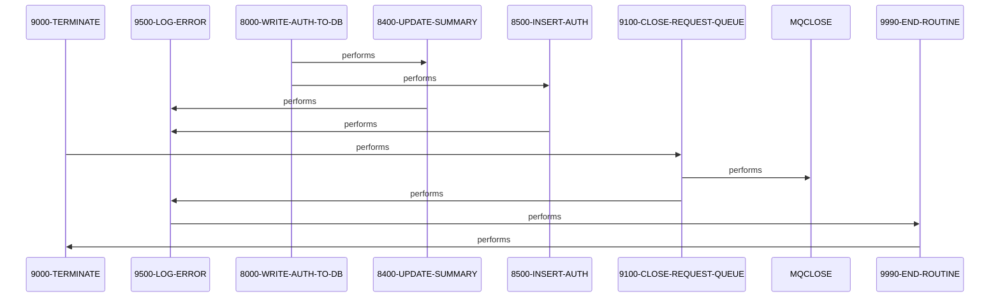

# COPAUA0C

**File**: `cbl/COPAUA0C.cbl`
**Type**: FileType.COBOL
**Analyzed**: 2026-02-25 15:21:23.456223

## Purpose

COPAUA0C is a CICS COBOL program that processes authorization requests from an IBM MQ request queue in a loop until a processing limit is reached or no more messages are available. It initializes by retrieving MQ trigger message data via CICS RETRIEVE, opens the request queue using MQOPEN, schedules an IMS PSB, extracts and processes each auth request involving IMS database reads and updates, commits via SYNCPOINT, and terminates by closing resources. The program logs errors to a common routine and returns to CICS upon completion.

**Business Context**: Serves credit card or payment authorization processing, validating card/account status from IMS databases (XREF, ACCT, CUST, AUTH-SUMMARY), making approve/decline decisions, and inserting auth records.

## Inputs

| Name | Type | Description |
|------|------|-------------|
| MQTM | IOType.CICS_COMMAREA | MQ trigger message containing queue name (MQTM-QNAME) and trigger data (MQTM-TRIGGERDATA) retrieved via CICS RETRIEVE to initialize request queue name |
| WS-REQUEST-QNAME (MQ Request Queue) | IOType.OTHER | IBM MQ queue for authorization request messages, read via MQGET in 3100-READ-REQUEST-MQ |
| IMS Databases (XREF, ACCT, CUST, AUTH-SUMMARY) | IOType.IMS_SEGMENT | IMS DL/I segments read for card cross-reference, account, customer, and auth summary records during auth processing |

## Outputs

| Name | Type | Description |
|------|------|-------------|
| Response MQ Queue | IOType.OTHER | IBM MQ queue for sending authorization responses via MQPUT in 7100-SEND-RESPONSE |
| IMS AUTH Records | IOType.IMS_SEGMENT | Updated/inserted authorization records and summary in IMS databases |

## Called Programs

| Program | Call Type | Purpose |
|---------|-----------|---------|
| MQOPEN | CallType.DYNAMIC_CALL | Opens the MQ request queue for input-shared access |

## Business Rules

- **BR001**: Approve or decline auth based on account status, available balance, and card validity
- **BR002**: Limit processing to WS-REQSTS-PROCESS-LIMIT messages per run
- **BR003**: Log critical errors (MQ open fail, IMS PSB sched fail) and continue or abend based on ERR-CRITICAL

## Paragraphs/Procedures

### COPAUA0C
> [Source: COPAUA0C.cbl.md](COPAUA0C.cbl.d/COPAUA0C.cbl.md)
This is the program entry point paragraph identified at line 23, likely the initial control section before MAIN-PARA. Its primary purpose is to serve as the starting point for program execution under CICS. It consumes no specific inputs beyond environment variables like EIB. It produces no direct outputs but transfers control to MAIN-PARA. No business logic or decisions are implemented here based on available analysis. No error handling is performed. It calls multiple MQ-related subroutines like CMQODV, CMQMDV, CMQV (11+ total), likely for MQ structure initialization or validation before main processing. These calls support MQ environment setup for queue operations.

### MAIN-PARA
> [Source: MAIN-PARA.cbl.md](COPAUA0C.cbl.d/MAIN-PARA.cbl.md)

```
MAIN-PARA  (4 statements, depth=0)
PARAGRAPH
├── PERFORM_THRU: PERFORM 1000-INITIALIZE    THRU 1000-EXIT
├── PERFORM_THRU: PERFORM 2000-MAIN-PROCESS  THRU 2000-EXIT
├── PERFORM_THRU: PERFORM 9000-TERMINATE     THRU 9000-EXIT
└── EXEC_CICS: EXEC CICS RETURN END-EXEC
```

MAIN-PARA is the primary orchestration paragraph that controls the overall program flow from lines 220-229. It begins by performing 1000-INITIALIZE THRU 1000-EXIT to set up MQ queue and IMS PSB. Next, it performs 2000-MAIN-PROCESS THRU 2000-EXIT to handle the message processing loop. Finally, it performs 9000-TERMINATE THRU 9000-EXIT for cleanup, followed by EXEC CICS RETURN to end the transaction. It consumes no direct data inputs but relies on initialization results like WS-REQUEST-QNAME. It produces program completion status via return to CICS. No specific business decisions are made here; it delegates all logic. Errors from subordinates are handled downstream via 9500-LOG-ERROR. It calls 1000-INITIALIZE, 2000-MAIN-PROCESS, and 9000-TERMINATE sequentially for structured flow.

### 1000-INITIALIZE
> [Source: 1000-INITIALIZE.cbl.md](COPAUA0C.cbl.d/1000-INITIALIZE.cbl.md)

```
1000-INITIALIZE  (7 statements, depth=1)
PARAGRAPH
├── EXEC_CICS: EXEC CICS RETRIEVE INTO(MQTM) NOHANDLE END-EXEC
├── IF: IF EIBRESP = DFHRESP(NORMAL)
│   ├── MOVE: MOVE MQTM-QNAME              TO WS-REQUEST-QNAME
│   └── MOVE: MOVE MQTM-TRIGGERDATA        TO WS-TRIGGER-DATA
├── MOVE: MOVE 5000                       TO WS-WAIT-INTERVAL
├── PERFORM_THRU: PERFORM 1100-OPEN-REQUEST-QUEUE THRU 1100-EXIT
└── PERFORM_THRU: PERFORM 3100-READ-REQUEST-MQ    THRU 3100-EXIT
```

1000-INITIALIZE handles program startup setup from lines 230-248. It consumes MQ trigger data via EXEC CICS RETRIEVE INTO(MQTM) NOHANDLE. If EIBRESP = NORMAL (decision point 1), it moves MQTM-QNAME to WS-REQUEST-QNAME and MQTM-TRIGGERDATA to WS-TRIGGER-DATA (transforms 3 variables). It sets WS-WAIT-INTERVAL to 5000. It then performs 1100-OPEN-REQUEST-QUEUE THRU 1100-EXIT to open MQ queue and 3100-READ-REQUEST-MQ THRU 3100-EXIT for initial read. Outputs are initialized working storage flags and queue handle. Business logic checks CICS response for normal retrieval (line 237 error handling hint). Errors set via NOHANDLE but checked. Calls subordinates for MQ open/read setup.

### 1000-EXIT
> [Source: 1000-EXIT.cbl.md](COPAUA0C.cbl.d/1000-EXIT.cbl.md)

```
1000-EXIT  (1 statements, depth=0)
PARAGRAPH
└── EXIT: EXIT
```

1000-EXIT is the exit routine for 1000-INITIALIZE from lines 249-254. Its primary purpose is to return control to the calling paragraph after initialization completes. It consumes no inputs or data. It produces no outputs or modifications. No business logic, decisions, or conditions are evaluated. No error handling is performed as errors are managed prior. It is called exclusively by 1000-INITIALIZE at its end. It simply executes EXIT with no further actions.

### 1100-OPEN-REQUEST-QUEUE
> [Source: 1100-OPEN-REQUEST-QUEUE.cbl.md](COPAUA0C.cbl.d/1100-OPEN-REQUEST-QUEUE.cbl.md)

```
1100-OPEN-REQUEST-QUEUE  (16 statements, depth=1)
PARAGRAPH
├── MOVE: MOVE MQOT-Q             TO MQOD-OBJECTTYPE OF MQM-OD-REQUEST
├── MOVE: MOVE WS-REQUEST-QNAME   TO MQOD-OBJECTNAME OF MQM-OD-REQUEST
├── COMPUTE: COMPUTE WS-OPTIONS = MQOO-INPUT-SHARED
├── CALL: CALL 'MQOPEN' USING W01-HCONN-REQUEST MQM-OD-REQUEST WS-OPTIONS W01-H...
└── IF: IF WS-COMPCODE = MQCC-OK
    ├── SET: SET WS-REQUEST-MQ-OPEN TO TRUE
    └── ELSE: ELSE
        ├── MOVE: MOVE 'M001'          TO ERR-LOCATION
        ├── SET: SET  ERR-CRITICAL    TO TRUE
        ├── SET: SET  ERR-MQ          TO TRUE
        ├── MOVE: MOVE WS-COMPCODE     TO WS-CODE-DISPLAY
        ├── MOVE: MOVE WS-CODE-DISPLAY TO ERR-CODE-1
        ├── MOVE: MOVE WS-REASON       TO WS-CODE-DISPLAY
        ├── MOVE: MOVE WS-CODE-DISPLAY TO ERR-CODE-2
        ├── MOVE: MOVE 'REQ MQ OPEN ERROR' TO ERR-MESSAGE
        └── PERFORM: PERFORM 9500-LOG-ERROR
```

1100-OPEN-REQUEST-QUEUE opens the MQ request queue from lines 255-285. It consumes WS-REQUEST-QNAME and sets MQOD-OBJECTTYPE to MQOT-Q, MQOD-OBJECTNAME (transforms 12 variables including WS-CODE-DISPLAY, MQOT-Q). Computes WS-OPTIONS = MQOO-INPUT-SHARED (line 260). Calls MQOPEN USING connection, descriptor, options, obtaining handle. If WS-COMPCODE = MQCC-OK (decision 1), sets WS-REQUEST-MQ-OPEN TRUE. Else (decision 2-3), sets ERR-LOCATION 'M001', ERR-CRITICAL TRUE, ERR-MQ TRUE, moves codes to ERR-CODE-1/2, ERR-MESSAGE 'REQ MQ OPEN ERROR', performs 9500-LOG-ERROR. Outputs queue handle or error flags. Business logic ensures shared input access for concurrent reads. Errors trigger logging without abend.

### 1100-EXIT
> [Source: 1100-EXIT.cbl.md](COPAUA0C.cbl.d/1100-EXIT.cbl.md)

```
1100-EXIT  (1 statements, depth=0)
PARAGRAPH
└── EXIT: EXIT
```

1100-EXIT is the exit routine for 1100-OPEN-REQUEST-QUEUE from lines 286-291. Its role is to cleanly return control after queue open attempt. No data consumed or produced. No logic, conditions, or errors handled. Called only by 1100-OPEN-REQUEST-QUEUE. Executes simple EXIT.

### 1200-SCHEDULE-PSB
> [Source: 1200-SCHEDULE-PSB.cbl.md](COPAUA0C.cbl.d/1200-SCHEDULE-PSB.cbl.md)

```
1200-SCHEDULE-PSB  (15 statements, depth=1)
PARAGRAPH
├── EXEC_DLI: EXEC DLI SCHD PSB((PSB-NAME)) NODHABEND END-EXEC
├── MOVE: MOVE DIBSTAT        TO IMS-RETURN-CODE
├── IF: IF PSB-SCHEDULED-MORE-THAN-ONCE
│   ├── EXEC_DLI: EXEC DLI TERM END-EXEC
│   ├── EXEC_DLI: EXEC DLI SCHD PSB((PSB-NAME)) NODHABEND END-EXEC
│   └── MOVE: MOVE DIBSTAT     TO IMS-RETURN-CODE
└── IF: IF STATUS-OK
    ├── SET: SET IMS-PSB-SCHD           TO TRUE
    └── ELSE: ELSE
        ├── MOVE: MOVE 'I001'                TO ERR-LOCATION
        ├── SET: SET  ERR-CRITICAL          TO TRUE
        ├── SET: SET  ERR-IMS               TO TRUE
        ├── MOVE: MOVE IMS-RETURN-CODE       TO ERR-CODE-1
        ├── MOVE: MOVE 'IMS SCHD FAILED'     TO ERR-MESSAGE
        └── PERFORM: PERFORM 9500-LOG-ERROR
```

1200-SCHEDULE-PSB schedules the IMS PSB from lines 292-318. It consumes PSB-NAME and executes DLI SCHD NODHABEND, moves DIBSTAT to IMS-RETURN-CODE (transforms 8 variables). If PSB-SCHEDULED-MORE-THAN-ONCE (decision 1), executes DLI TERM then SCHD again, updates IMS-RETURN-CODE. If STATUS-OK (decision 2), sets IMS-PSB-SCHD TRUE. Else (decision 3), sets ERR-LOCATION 'I001', ERR-CRITICAL/ERR-IMS TRUE, moves code to ERR-CODE-1, ERR-MESSAGE 'IMS SCHD FAILED', performs 9500-LOG-ERROR. Outputs PSB schedule status flag. Business logic handles rescheduling if multiply scheduled. Errors logged without immediate abend.

### 1200-EXIT
> [Source: 1200-EXIT.cbl.md](COPAUA0C.cbl.d/1200-EXIT.cbl.md)

```
1200-EXIT  (1 statements, depth=0)
PARAGRAPH
└── EXIT: EXIT
```

1200-EXIT serves as exit for 1200-SCHEDULE-PSB from lines 319-322. Purpose is control return post-PSB scheduling. No inputs/outputs/modifications. No decisions or error handling. Called by 1200-SCHEDULE-PSB. Simple EXIT.

### 2000-MAIN-PROCESS
> [Source: 2000-MAIN-PROCESS.cbl.md](COPAUA0C.cbl.d/2000-MAIN-PROCESS.cbl.md)

```
2000-MAIN-PROCESS  (10 statements, depth=2)
PARAGRAPH
└── PERFORM_INLINE: PERFORM UNTIL NO-MORE-MSG-AVAILABLE OR WS-LOOP-END
    ├── PERFORM_THRU: PERFORM 2100-EXTRACT-REQUEST-MSG THRU 2100-EXIT
    ├── PERFORM_THRU: PERFORM 5000-PROCESS-AUTH        THRU 5000-EXIT
    ├── ADD: ADD 1                            TO WS-MSG-PROCESSED
    ├── EXEC_CICS: EXEC CICS SYNCPOINT END-EXEC
    ├── SET: SET IMS-PSB-NOT-SCHD            TO TRUE
    └── IF: IF WS-MSG-PROCESSED > WS-REQSTS-PROCESS-LIMIT
        ├── SET: SET  WS-LOOP-END             TO TRUE
        └── ELSE: ELSE
            └── PERFORM_THRU: PERFORM 3100-READ-REQUEST-MQ THRU 3100-EXIT
```

2000-MAIN-PROCESS manages the core message processing loop from lines 323-346. It loops PERFORM UNTIL NO-MORE-MSG-AVAILABLE OR WS-LOOP-END (has loops, 4 decisions). For each iteration, performs 2100-EXTRACT-REQUEST-MSG THRU EXIT to parse message, 5000-PROCESS-AUTH THRU EXIT for auth logic (transforms IMS-PSB-NOT-SCHD, WS-LOOP-END, WS-MSG-PROCESSED). Adds 1 to WS-MSG-PROCESSED. Executes CICS SYNCPOINT for commit. Sets IMS-PSB-NOT-SCHD TRUE (unschedules PSB?). If WS-MSG-PROCESSED > WS-REQSTS-PROCESS-LIMIT (decision), sets WS-LOOP-END TRUE; else performs 3100-READ-REQUEST-MQ THRU EXIT. Inputs are MQ messages; outputs processed counts, IMS updates, response queue msgs. Business logic limits batch size, commits per message. Errors delegated to callees.

### 2000-EXIT
> [Source: 2000-EXIT.cbl.md](COPAUA0C.cbl.d/2000-EXIT.cbl.md)

```
2000-EXIT  (1 statements, depth=0)
PARAGRAPH
└── EXIT: EXIT
```

2000-EXIT exits the main process loop from lines 347-350. Role is to return control after loop termination. No data I/O or logic. No errors or calls. Called by 2000-MAIN-PROCESS. EXIT only.

### 2100-EXTRACT-REQUEST-MSG
> [Source: 2100-EXTRACT-REQUEST-MSG.cbl.md](COPAUA0C.cbl.d/2100-EXTRACT-REQUEST-MSG.cbl.md)

```
2100-EXTRACT-REQUEST-MSG  (3 statements, depth=0)
PARAGRAPH
├── UNSTRING: UNSTRING W01-GET-BUFFER(1:W01-DATALEN) DELIMITED BY ',' INTO PA-RQ-AU...
├── COMPUTE: COMPUTE PA-RQ-TRANSACTION-AMT = FUNCTION NUMVAL(WS-TRANSACTION-AMT-AN)
└── MOVE: MOVE PA-RQ-TRANSACTION-AMT  TO WS-TRANSACTION-AMT
```

This paragraph parses the incoming MQ request buffer into individual authorization request fields using UNSTRING delimited by commas. It consumes the raw buffer data from W01-GET-BUFFER after MQGET in prior paragraph, extracting fields like PA-RQ-AUTH-DATE, PA-RQ-CARD-NUM, merchant details, and transaction amount as alphanumeric. It produces populated PA-RQ-* working storage fields, including numeric conversion of transaction amount via FUNCTION NUMVAL into PA-RQ-TRANSACTION-AMT and WS-TRANSACTION-AMT. No business decisions or error handling here; it's pure data extraction. No calls to other paragraphs. Control flows to 2100-EXIT.

### 2100-EXIT
> [Source: 2100-EXIT.cbl.md](COPAUA0C.cbl.d/2100-EXIT.cbl.md)

```
2100-EXIT  (1 statements, depth=0)
PARAGRAPH
└── EXIT: EXIT
```

This is an exit paragraph that simply executes EXIT to return control to the calling paragraph. It consumes no inputs and produces no outputs. No business logic, decisions, error handling, or calls. Serves as a thru-exit point for 2100-EXTRACT-REQUEST-MSG.

### 3100-READ-REQUEST-MQ
> [Source: 3100-READ-REQUEST-MQ.cbl.md](COPAUA0C.cbl.d/3100-READ-REQUEST-MQ.cbl.md)

```
3100-READ-REQUEST-MQ  (24 statements, depth=3)
PARAGRAPH
├── COMPUTE: COMPUTE MQGMO-OPTIONS  =  MQGMO-NO-SYNCPOINT + MQGMO-WAIT +  MQGMO-CO...
├── MOVE: MOVE WS-WAIT-INTERVAL      TO MQGMO-WAITINTERVAL
├── MOVE: MOVE MQMI-NONE             TO MQMD-MSGID    OF MQM-MD-REQUEST
├── MOVE: MOVE MQCI-NONE             TO MQMD-CORRELID OF MQM-MD-REQUEST
├── MOVE: MOVE MQFMT-STRING          TO MQMD-FORMAT   OF MQM-MD-REQUEST
├── MOVE: MOVE LENGTH OF W01-GET-BUFFER TO W01-BUFFLEN
├── CALL: CALL 'MQGET' USING W01-HCONN-REQUEST W01-HOBJ-REQUEST MQM-MD-REQUEST ...
└── IF: IF WS-COMPCODE = MQCC-OK
    ├── MOVE: MOVE MQMD-CORRELID OF MQM-MD-REQUEST TO WS-SAVE-CORRELID
    ├── MOVE: MOVE MQMD-REPLYTOQ OF MQM-MD-REQUEST TO WS-REPLY-QNAME
    └── ELSE: ELSE
        └── IF: IF WS-REASON = MQRC-NO-MSG-AVAILABLE
            ├── SET: SET NO-MORE-MSG-AVAILABLE TO TRUE
            └── ELSE: ELSE
                ├── MOVE: MOVE 'M003'                TO ERR-LOCATION
                ├── SET: SET  ERR-CRITICAL          TO TRUE
                ├── SET: SET  ERR-CICS              TO TRUE
                ├── MOVE: MOVE WS-COMPCODE           TO WS-CODE-DISPLAY
                ├── MOVE: MOVE WS-CODE-DISPLAY       TO ERR-CODE-1
                ├── MOVE: MOVE WS-REASON             TO WS-CODE-DISPLAY
                ├── MOVE: MOVE WS-CODE-DISPLAY       TO ERR-CODE-2
                ├── MOVE: MOVE 'FAILED TO READ REQUEST MQ' TO ERR-MESSAGE
                ├── MOVE: MOVE PA-CARD-NUM           TO ERR-EVENT-KEY
                └── PERFORM: PERFORM 9500-LOG-ERROR
```

This paragraph reads the next authorization request message from the MQ queue using CALL 'MQGET' with options for no-syncpoint, wait interval, convert, and fail-if-quiescing. It consumes MQ connection/handle (W01-HCONN-REQUEST, W01-HOBJ-REQUEST) and sets message descriptor fields like MQMD-FORMAT to STRING. On success (MQCC-OK), it saves correlid and reply-to queue name, populates W01-DATALEN and buffer for subsequent parsing. On failure, if no message available (MQRC-NO-MSG-AVAILABLE), sets NO-MORE-MSG-AVAILABLE flag; otherwise, logs critical CICS error via 9500-LOG-ERROR with codes and 'FAILED TO READ REQUEST MQ' message using PA-CARD-NUM as key. Error handling distinguishes non-critical EOF from critical MQ errors. Calls 9500-LOG-ERROR on MQ failures.

### 3100-EXIT
> [Source: 3100-EXIT.cbl.md](COPAUA0C.cbl.d/3100-EXIT.cbl.md)

```
3100-EXIT  (1 statements, depth=0)
PARAGRAPH
└── EXIT: EXIT
```

This is an exit paragraph that simply executes EXIT to return control to the calling paragraph. It consumes no inputs and produces no outputs. No business logic, decisions, error handling, or calls. Serves as a thru-exit point for 3100-READ-REQUEST-MQ.

### 5000-PROCESS-AUTH
> [Source: 5000-PROCESS-AUTH.cbl.md](COPAUA0C.cbl.d/5000-PROCESS-AUTH.cbl.md)

```
5000-PROCESS-AUTH  (14 statements, depth=1)
PARAGRAPH
├── SET: SET APPROVE-AUTH                  TO TRUE
├── PERFORM_THRU: PERFORM 1200-SCHEDULE-PSB         THRU 1200-EXIT
├── SET: SET CARD-FOUND-XREF               TO TRUE
├── SET: SET FOUND-ACCT-IN-MSTR            TO TRUE
├── PERFORM_THRU: PERFORM 5100-READ-XREF-RECORD     THRU 5100-EXIT
├── IF: IF CARD-FOUND-XREF
│   ├── PERFORM_THRU: PERFORM 5200-READ-ACCT-RECORD  THRU 5200-EXIT
│   ├── PERFORM_THRU: PERFORM 5300-READ-CUST-RECORD  THRU 5300-EXIT
│   ├── PERFORM_THRU: PERFORM 5500-READ-AUTH-SUMMRY  THRU 5500-EXIT
│   └── PERFORM_THRU: PERFORM 5600-READ-PROFILE-DATA THRU 5600-EXIT
├── PERFORM_THRU: PERFORM 6000-MAKE-DECISION        THRU 6000-EXIT
├── PERFORM_THRU: PERFORM 7100-SEND-RESPONSE        THRU 7100-EXIT
└── IF: IF CARD-FOUND-XREF
    └── PERFORM_THRU: PERFORM 8000-WRITE-AUTH-TO-DB  THRU 8000-EXIT
```

This is the main authorization processing orchestration paragraph that handles a single request after extraction. It consumes parsed PA-RQ-* fields and flags like CARD-FOUND-XREF, setting initial APPROVE-AUTH to TRUE. It first performs 1200-SCHEDULE-PSB for PSB setup, then assumes/sets card and account found flags, and conditionally reads XREF, ACCT, CUST, AUTH-SUMMARY, PROFILE based on CARD-FOUND-XREF. After reads, it performs decision making (6000-MAKE-DECISION), sends response (7100-SEND-RESPONSE), and if card found, writes auth to DB (8000-WRITE-AUTH-TO-DB). No direct error handling here; relies on subordinate paragraphs. Calls multiple read and processing paragraphs to gather data for auth decision.

### 5000-EXIT
> [Source: 5000-EXIT.cbl.md](COPAUA0C.cbl.d/5000-EXIT.cbl.md)

```
5000-EXIT  (1 statements, depth=0)
PARAGRAPH
└── EXIT: EXIT
```

This is an exit paragraph that simply executes EXIT to return control to the calling paragraph. It consumes no inputs and produces no outputs. No business logic, decisions, error handling, or calls. Serves as a thru-exit point for 5000-PROCESS-AUTH.

### 5100-READ-XREF-RECORD
> [Source: 5100-READ-XREF-RECORD.cbl.md](COPAUA0C.cbl.d/5100-READ-XREF-RECORD.cbl.md)

```
5100-READ-XREF-RECORD  (25 statements, depth=1)
PARAGRAPH
├── MOVE: MOVE PA-RQ-CARD-NUM           TO XREF-CARD-NUM
├── EXEC_CICS: EXEC CICS READ DATASET   (WS-CCXREF-FILE) INTO      (CARD-XREF-RECORD...
└── EVALUATE: EVALUATE WS-RESP-CD
    ├── WHEN: WHEN DFHRESP(NORMAL)
    │   └── SET: SET  CARD-FOUND-XREF  TO TRUE
    ├── WHEN: WHEN DFHRESP(NOTFND)
    │   ├── SET: SET  CARD-NFOUND-XREF TO TRUE
    │   ├── SET: SET  NFOUND-ACCT-IN-MSTR TO TRUE
    │   ├── MOVE: MOVE 'A001'          TO ERR-LOCATION
    │   ├── SET: SET  ERR-WARNING     TO TRUE
    │   ├── SET: SET  ERR-APP         TO TRUE
    │   ├── MOVE: MOVE 'CARD NOT FOUND IN XREF' TO ERR-MESSAGE
    │   ├── MOVE: MOVE XREF-CARD-NUM   TO ERR-EVENT-KEY
    │   └── PERFORM: PERFORM 9500-LOG-ERROR
    └── WHEN: WHEN OTHER
        ├── MOVE: MOVE 'C001'          TO ERR-LOCATION
        ├── SET: SET  ERR-CRITICAL    TO TRUE
        ├── SET: SET  ERR-CICS        TO TRUE
        ├── MOVE: MOVE WS-RESP-CD      TO WS-CODE-DISPLAY
        ├── MOVE: MOVE WS-CODE-DISPLAY TO ERR-CODE-1
        ├── MOVE: MOVE WS-REAS-CD      TO WS-CODE-DISPLAY
        ├── MOVE: MOVE WS-CODE-DISPLAY TO ERR-CODE-2
        ├── MOVE: MOVE 'FAILED TO READ XREF FILE' TO ERR-MESSAGE
        ├── MOVE: MOVE XREF-CARD-NUM   TO ERR-EVENT-KEY
        └── PERFORM: PERFORM 9500-LOG-ERROR
```

This paragraph reads the card cross-reference record from VSAM file WS-CCXREF-FILE using CICS READ DATASET with key XREF-CARD-NUM from PA-RQ-CARD-NUM. It consumes PA-RQ-CARD-NUM moved to XREF-CARD-NUM and populates CARD-XREF-RECORD area. On NORMAL resp, sets CARD-FOUND-XREF TRUE; on NOTFND, sets CARD-NFOUND-XREF and NFOUND-ACCT-IN-MSTR TRUE, logs WARNING 'A001' 'CARD NOT FOUND IN XREF'; on other errors, logs CRITICAL 'C001' CICS error with resp/reas codes. Error handling via EVALUATE on WS-RESP-CD triggers 9500-LOG-ERROR with appropriate severity and event key. Provides XREF-ACCT-ID for subsequent account read. Calls 9500-LOG-ERROR on errors.

### 5100-EXIT
> [Source: 5100-EXIT.cbl.md](COPAUA0C.cbl.d/5100-EXIT.cbl.md)

```
5100-EXIT  (1 statements, depth=0)
PARAGRAPH
└── EXIT: EXIT
```

This is an exit paragraph that simply executes EXIT to return control to the calling paragraph. It consumes no inputs and produces no outputs. No business logic, decisions, error handling, or calls. Serves as a thru-exit point for 5100-READ-XREF-RECORD.

### 5200-READ-ACCT-RECORD
> [Source: 5200-READ-ACCT-RECORD.cbl.md](COPAUA0C.cbl.d/5200-READ-ACCT-RECORD.cbl.md)

```
5200-READ-ACCT-RECORD  (24 statements, depth=1)
PARAGRAPH
├── MOVE: MOVE XREF-ACCT-ID          TO WS-CARD-RID-ACCT-ID
├── EXEC_CICS: EXEC CICS READ DATASET   (WS-ACCTFILENAME) RIDFLD    (WS-CARD-RID-ACC...
└── EVALUATE: EVALUATE WS-RESP-CD
    ├── WHEN: WHEN DFHRESP(NORMAL)
    │   └── SET: SET FOUND-ACCT-IN-MSTR     TO TRUE
    ├── WHEN: WHEN DFHRESP(NOTFND)
    │   ├── SET: SET NFOUND-ACCT-IN-MSTR    TO TRUE
    │   ├── MOVE: MOVE 'A002'                TO ERR-LOCATION
    │   ├── SET: SET  ERR-WARNING           TO TRUE
    │   ├── SET: SET  ERR-APP               TO TRUE
    │   ├── MOVE: MOVE 'ACCT NOT FOUND IN XREF' TO ERR-MESSAGE
    │   ├── MOVE: MOVE WS-CARD-RID-ACCT-ID-X TO ERR-EVENT-KEY
    │   └── PERFORM: PERFORM 9500-LOG-ERROR
    └── WHEN: WHEN OTHER
        ├── MOVE: MOVE 'C002'                TO ERR-LOCATION
        ├── SET: SET  ERR-CRITICAL          TO TRUE
        ├── SET: SET  ERR-CICS              TO TRUE
        ├── MOVE: MOVE WS-RESP-CD            TO WS-CODE-DISPLAY
        ├── MOVE: MOVE WS-CODE-DISPLAY       TO ERR-CODE-1
        ├── MOVE: MOVE WS-REAS-CD            TO WS-CODE-DISPLAY
        ├── MOVE: MOVE WS-CODE-DISPLAY       TO ERR-CODE-2
        ├── MOVE: MOVE 'FAILED TO READ ACCT FILE' TO ERR-MESSAGE
        ├── MOVE: MOVE WS-CARD-RID-ACCT-ID-X TO ERR-EVENT-KEY
        └── PERFORM: PERFORM 9500-LOG-ERROR
```

This paragraph reads the account record from VSAM file WS-ACCTFILENAME using CICS READ DATASET with RIDFLD constructed from XREF-ACCT-ID. It consumes XREF-ACCT-ID moved to WS-CARD-RID-ACCT-ID-X and populates ACCOUNT-RECORD area. On NORMAL resp, sets FOUND-ACCT-IN-MSTR TRUE; on NOTFND, sets NFOUND-ACCT-IN-MSTR TRUE, logs WARNING 'A002' 'ACCT NOT FOUND IN XREF'; on other errors, logs CRITICAL 'C002' CICS error with resp/reas codes and event key WS-CARD-RID-ACCT-ID-X. Error handling via EVALUATE on WS-RESP-CD triggers 9500-LOG-ERROR. Provides account data for further processing like customer read.

### 5200-EXIT
> [Source: 5200-EXIT.cbl.md](COPAUA0C.cbl.d/5200-EXIT.cbl.md)

```
5200-EXIT  (1 statements, depth=0)
PARAGRAPH
└── EXIT: EXIT
```

This is an exit paragraph that simply executes EXIT to return control to the calling paragraph. It consumes no inputs and produces no outputs. No business logic, decisions, error handling, or calls. Serves as a thru-exit point for 5200-READ-ACCT-RECORD.

### 5300-READ-CUST-RECORD
> [Source: 5300-READ-CUST-RECORD.cbl.md](COPAUA0C.cbl.d/5300-READ-CUST-RECORD.cbl.md)

```
5300-READ-CUST-RECORD  (24 statements, depth=1)
PARAGRAPH
├── MOVE: MOVE XREF-CUST-ID                 TO WS-CARD-RID-CUST-ID
├── EXEC_CICS: EXEC CICS READ DATASET   (WS-CUSTFILENAME) RIDFLD    (WS-CARD-RID-CUS...
└── EVALUATE: EVALUATE WS-RESP-CD
    ├── WHEN: WHEN DFHRESP(NORMAL)
    │   └── SET: SET FOUND-CUST-IN-MSTR     TO TRUE
    ├── WHEN: WHEN DFHRESP(NOTFND)
    │   ├── SET: SET NFOUND-CUST-IN-MSTR    TO TRUE
    │   ├── MOVE: MOVE 'A003'                TO ERR-LOCATION
    │   ├── SET: SET  ERR-WARNING           TO TRUE
    │   ├── SET: SET  ERR-APP               TO TRUE
    │   ├── MOVE: MOVE 'CUST NOT FOUND IN XREF' TO ERR-MESSAGE
    │   ├── MOVE: MOVE WS-CARD-RID-CUST-ID   TO ERR-EVENT-KEY
    │   └── PERFORM: PERFORM 9500-LOG-ERROR
    └── WHEN: WHEN OTHER
        ├── MOVE: MOVE 'C003'                TO ERR-LOCATION
        ├── SET: SET  ERR-CRITICAL          TO TRUE
        ├── SET: SET  ERR-CICS              TO TRUE
        ├── MOVE: MOVE WS-RESP-CD            TO WS-CODE-DISPLAY
        ├── MOVE: MOVE WS-CODE-DISPLAY       TO ERR-CODE-1
        ├── MOVE: MOVE WS-REAS-CD            TO WS-CODE-DISPLAY
        ├── MOVE: MOVE WS-CODE-DISPLAY       TO ERR-CODE-2
        ├── MOVE: MOVE 'FAILED TO READ CUST FILE' TO ERR-MESSAGE
        ├── MOVE: MOVE WS-CARD-RID-CUST-ID   TO ERR-EVENT-KEY
        └── PERFORM: PERFORM 9500-LOG-ERROR
```

This paragraph reads the customer record from the VSAM customer master file using CICS READ with key derived from XREF-CUST-ID. It moves XREF-CUST-ID to WS-CARD-RID-CUST-ID and uses WS-CARD-RID-CUST-ID-X as RIDFLD into CUSTOMER-RECORD. On normal response (DFHRESP(NORMAL)), sets FOUND-CUST-IN-MSTR to TRUE. On NOTFND, sets NFOUND-CUST-IN-MSTR, logs warning error 'A003' with message 'CUST NOT FOUND IN XREF' via 9500-LOG-ERROR. For other responses, logs critical CICS error 'C003' with codes and message 'FAILED TO READ CUST FILE' via 9500-LOG-ERROR. No outputs are written; flags and error structures are updated for caller. It implements error handling for file not found and I/O failures, distinguishing warnings from critical errors. Called from main flow to fetch customer data before decision making.

### 5300-EXIT
> [Source: 5300-EXIT.cbl.md](COPAUA0C.cbl.d/5300-EXIT.cbl.md)

```
5300-EXIT  (1 statements, depth=0)
PARAGRAPH
└── EXIT: EXIT
```

This is the exit paragraph for 5300-READ-CUST-RECORD. It executes a simple EXIT statement to return control to the calling paragraph. No inputs are consumed or outputs produced in this paragraph. No business logic, conditions, validations, or error handling is performed. No other paragraphs or programs are called. It serves solely as a procedural exit point after the read and error handling logic completes, ensuring clean flow return.

### 5500-READ-AUTH-SUMMRY
> [Source: 5500-READ-AUTH-SUMMRY.cbl.md](COPAUA0C.cbl.d/5500-READ-AUTH-SUMMRY.cbl.md)

```
5500-READ-AUTH-SUMMRY  (16 statements, depth=1)
PARAGRAPH
├── MOVE: MOVE XREF-ACCT-ID                    TO PA-ACCT-ID
├── EXEC_DLI: EXEC DLI GU USING PCB(PAUT-PCB-NUM) SEGMENT (PAUTSUM0) INTO (PENDING-...
├── MOVE: MOVE DIBSTAT                          TO IMS-RETURN-CODE
└── EVALUATE: EVALUATE TRUE
    ├── WHEN: WHEN STATUS-OK
    │   └── SET: SET FOUND-PAUT-SMRY-SEG        TO TRUE
    ├── WHEN: WHEN SEGMENT-NOT-FOUND
    │   └── SET: SET NFOUND-PAUT-SMRY-SEG       TO TRUE
    └── WHEN: WHEN OTHER
        ├── MOVE: MOVE 'I002'                    TO ERR-LOCATION
        ├── SET: SET  ERR-CRITICAL              TO TRUE
        ├── SET: SET  ERR-IMS                   TO TRUE
        ├── MOVE: MOVE IMS-RETURN-CODE           TO ERR-CODE-1
        ├── MOVE: MOVE 'IMS GET SUMMARY FAILED'  TO ERR-MESSAGE
        ├── MOVE: MOVE PA-CARD-NUM               TO ERR-EVENT-KEY
        └── PERFORM: PERFORM 9500-LOG-ERROR
```

This paragraph retrieves the pending authorization summary segment from IMS using EXEC DLI GU on PAUT-PCB-NUM with key PA-ACCT-ID from XREF-ACCT-ID into PENDING-AUTH-SUMMARY. It moves XREF-ACCT-ID to PA-ACCT-ID before the call. Evaluates DIBSTAT/IMS-RETURN-CODE: sets FOUND-PAUT-SMRY-SEG on STATUS-OK, NFOUND-PAUT-SMRY-SEG on SEGMENT-NOT-FOUND. On other statuses, logs critical IMS error 'I002' with IMS return code and message 'IMS GET SUMMARY FAILED' via 9500-LOG-ERROR. Inputs are PCB and key data; outputs flags and potential error log. Error handling treats non-OK/non-NOTFND as critical failures. Used to fetch summary credit data for limit checks.

### 5500-EXIT
> [Source: 5500-EXIT.cbl.md](COPAUA0C.cbl.d/5500-EXIT.cbl.md)

```
5500-EXIT  (1 statements, depth=0)
PARAGRAPH
└── EXIT: EXIT
```

This is the exit paragraph for 5500-READ-AUTH-SUMMRY. It executes a simple EXIT statement to return control to the calling paragraph. No inputs are consumed or outputs produced. No business logic, conditions, or error handling occurs. No calls are made. It functions purely as an exit point post-IMS retrieval and evaluation.

### 5600-READ-PROFILE-DATA
> [Source: 5600-READ-PROFILE-DATA.cbl.md](COPAUA0C.cbl.d/5600-READ-PROFILE-DATA.cbl.md)

```
5600-READ-PROFILE-DATA  (1 statements, depth=0)
PARAGRAPH
└── CONTINUE: CONTINUE
```

This paragraph is intended to read profile data but currently contains only a CONTINUE statement, performing no actual I/O or data operations. It consumes no inputs and produces no outputs or modifications. No conditions are checked, no business logic implemented, and no error handling present. No flags are set or other paragraphs called. Likely a placeholder for future profile retrieval logic in the authorization process. As-is, it does nothing substantive upon invocation.

### 5600-EXIT
> [Source: 5600-EXIT.cbl.md](COPAUA0C.cbl.d/5600-EXIT.cbl.md)

```
5600-EXIT  (1 statements, depth=0)
PARAGRAPH
└── EXIT: EXIT
```

This is the exit paragraph for 5600-READ-PROFILE-DATA. It executes EXIT to return control to caller. No data I/O, logic, or changes occur. No errors handled or calls made. Standard exit point after non-functional continue.

### 6000-MAKE-DECISION
> [Source: 6000-MAKE-DECISION.cbl.md](COPAUA0C.cbl.d/6000-MAKE-DECISION.cbl.md)

```
6000-MAKE-DECISION  (45 statements, depth=4)
PARAGRAPH
├── MOVE: MOVE PA-RQ-CARD-NUM         TO PA-RL-CARD-NUM
├── MOVE: MOVE PA-RQ-TRANSACTION-ID   TO PA-RL-TRANSACTION-ID
├── MOVE: MOVE PA-RQ-AUTH-TIME        TO PA-RL-AUTH-ID-CODE
├── IF: IF FOUND-PAUT-SMRY-SEG
│   ├── COMPUTE: COMPUTE WS-AVAILABLE-AMT = PA-CREDIT-LIMIT - PA-CREDIT-BALANCE
│   ├── IF: IF WS-TRANSACTION-AMT > WS-AVAILABLE-AMT
│   │   ├── SET: SET DECLINE-AUTH      TO TRUE
│   │   └── SET: SET INSUFFICIENT-FUND TO TRUE
│   └── ELSE: ELSE
│       └── IF: IF FOUND-ACCT-IN-MSTR
│           ├── COMPUTE: COMPUTE WS-AVAILABLE-AMT = ACCT-CREDIT-LIMIT - ACCT-CURR-BAL
│           ├── IF: IF WS-TRANSACTION-AMT > WS-AVAILABLE-AMT
│           │   ├── SET: SET DECLINE-AUTH      TO TRUE
│           │   └── SET: SET INSUFFICIENT-FUND TO TRUE
│           └── ELSE: ELSE
│               └── SET: SET DECLINE-AUTH         TO TRUE
├── IF: IF DECLINE-AUTH
│   ├── SET: SET  AUTH-RESP-DECLINED     TO TRUE
│   ├── MOVE: MOVE '05'                   TO PA-RL-AUTH-RESP-CODE
│   ├── MOVE: MOVE 0                      TO PA-RL-APPROVED-AMT WS-APPROVED-AMT
│   └── ELSE: ELSE
│       ├── SET: SET  AUTH-RESP-APPROVED     TO TRUE
│       ├── MOVE: MOVE '00'                   TO PA-RL-AUTH-RESP-CODE
│       └── MOVE: MOVE PA-RQ-TRANSACTION-AMT  TO PA-RL-APPROVED-AMT WS-APPROVED-AMT
├── MOVE: MOVE '0000'                    TO PA-RL-AUTH-RESP-REASON
├── IF: IF AUTH-RESP-DECLINED
│   └── EVALUATE: EVALUATE TRUE
│       ├── WHEN: WHEN CARD-NFOUND-XREF
│       ├── WHEN: WHEN NFOUND-ACCT-IN-MSTR
│       ├── WHEN: WHEN NFOUND-CUST-IN-MSTR
│       │   └── MOVE: MOVE '3100'         TO PA-RL-AUTH-RESP-REASON
│       ├── WHEN: WHEN INSUFFICIENT-FUND
│       │   └── MOVE: MOVE '4100'         TO PA-RL-AUTH-RESP-REASON
│       ├── WHEN: WHEN CARD-NOT-ACTIVE
│       │   └── MOVE: MOVE '4200'         TO PA-RL-AUTH-RESP-REASON
│       ├── WHEN: WHEN ACCOUNT-CLOSED
│       │   └── MOVE: MOVE '4300'         TO PA-RL-AUTH-RESP-REASON
│       ├── WHEN: WHEN CARD-FRAUD
│       │   └── MOVE: MOVE '5100'         TO PA-RL-AUTH-RESP-REASON
│       ├── WHEN: WHEN MERCHANT-FRAUD
│       │   └── MOVE: MOVE '5200'         TO PA-RL-AUTH-RESP-REASON
│       └── WHEN: WHEN OTHER
│           └── MOVE: MOVE '9000'         TO PA-RL-AUTH-RESP-REASON
├── MOVE: MOVE WS-APPROVED-AMT        TO WS-APPROVED-AMT-DIS
└── STRING: STRING PA-RL-CARD-NUM         ',' PA-RL-TRANSACTION-ID   ',' PA-RL-AU...
```

This paragraph orchestrates the authorization decision logic. It first copies request data to response linkage fields: PA-RQ-CARD-NUM to PA-RL-CARD-NUM, etc. If IMS summary found, computes WS-AVAILABLE-AMT as PA-CREDIT-LIMIT minus PA-CREDIT-BALANCE; declines if WS-TRANSACTION-AMT exceeds it, setting INSUFFICIENT-FUND. Falls back to account master if no summary and account found, computing from ACCT-CREDIT-LIMIT minus ACCT-CURR-BAL. Declines if no account found. Sets AUTH-RESP-DECLINED/APPROVED, response code '05'/'00', approved amt to 0 or transaction amt. Assigns reason '3100' for not-founds, '4100' insufficient, etc., via EVALUATE. Edits WS-APPROVED-AMT-DISPLAY and STRINGs response fields into W02-PUT-BUFFER with length. Inputs from prior reads/flags/WS-TRANSACTION-AMT; outputs updated PA-RL-* and buffer for MQ. Implements core business rules for credit checks without explicit error handling beyond flags.

### 6000-EXIT
> [Source: 6000-EXIT.cbl.md](COPAUA0C.cbl.d/6000-EXIT.cbl.md)

```
6000-EXIT  (1 statements, depth=0)
PARAGRAPH
└── EXIT: EXIT
```

This is the exit paragraph for 6000-MAKE-DECISION. Executes EXIT to return control. No inputs/outputs modified, no logic or errors handled. No calls. Exit after decision and buffer prep.

### 7100-SEND-RESPONSE
> [Source: 7100-SEND-RESPONSE.cbl.md](COPAUA0C.cbl.d/7100-SEND-RESPONSE.cbl.md)

```
7100-SEND-RESPONSE  (24 statements, depth=1)
PARAGRAPH
├── MOVE: MOVE MQOT-Q               TO MQOD-OBJECTTYPE OF MQM-OD-REPLY
├── MOVE: MOVE WS-REPLY-QNAME       TO MQOD-OBJECTNAME OF MQM-OD-REPLY
├── MOVE: MOVE MQMT-REPLY           TO MQMD-MSGTYPE     OF MQM-MD-REPLY
├── MOVE: MOVE WS-SAVE-CORRELID     TO MQMD-CORRELID    OF MQM-MD-REPLY
├── MOVE: MOVE MQMI-NONE            TO MQMD-MSGID       OF MQM-MD-REPLY
├── MOVE: MOVE SPACES               TO MQMD-REPLYTOQ    OF MQM-MD-REPLY
├── MOVE: MOVE SPACES               TO MQMD-REPLYTOQMGR OF MQM-MD-REPLY
├── MOVE: MOVE MQPER-NOT-PERSISTENT TO MQMD-PERSISTENCE OF MQM-MD-REPLY
├── MOVE: MOVE 50                   TO MQMD-EXPIRY      OF MQM-MD-REPLY
├── MOVE: MOVE MQFMT-STRING         TO MQMD-FORMAT      OF MQM-MD-REPLY
├── COMPUTE: COMPUTE MQPMO-OPTIONS     =  MQPMO-NO-SYNCPOINT + MQPMO-DEFAULT-CONTEXT
├── MOVE: MOVE WS-RESP-LENGTH       TO W02-BUFFLEN
├── CALL: CALL 'MQPUT1' USING W02-HCONN-REPLY MQM-OD-REPLY MQM-MD-REPLY MQM-PUT...
└── IF: IF WS-COMPCODE NOT = MQCC-OK
    ├── MOVE: MOVE 'M004'                TO ERR-LOCATION
    ├── SET: SET  ERR-CRITICAL          TO TRUE
    ├── SET: SET  ERR-MQ                TO TRUE
    ├── MOVE: MOVE WS-COMPCODE           TO WS-CODE-DISPLAY
    ├── MOVE: MOVE WS-CODE-DISPLAY       TO ERR-CODE-1
    ├── MOVE: MOVE WS-REASON             TO WS-CODE-DISPLAY
    ├── MOVE: MOVE WS-CODE-DISPLAY       TO ERR-CODE-2
    ├── MOVE: MOVE 'FAILED TO PUT ON REPLY MQ' TO ERR-MESSAGE
    ├── MOVE: MOVE PA-CARD-NUM           TO ERR-EVENT-KEY
    └── PERFORM: PERFORM 9500-LOG-ERROR
```

This paragraph sends the authorization response via MQPUT1 to reply queue WS-REPLY-QNAME. Sets MQMD/MQOD fields: object type queue, msg type reply, correl ID from saved, format STRING, non-persistent, etc. Computes options NO-SYNCPOINT + DEFAULT-CONTEXT. Calls MQPUT1 with connection, OD, MD, options, buffer length, buffer, capturing compcode/reason. On non-MQCC-OK, logs critical MQ error 'M004' with codes and 'FAILED TO PUT ON REPLY MQ' via 9500-LOG-ERROR. Inputs MQ structures and W02-PUT-BUFFER from prior; outputs message to queue or error log. Handles MQ put failures as critical errors. Final step to return decision to requester.

### 7100-EXIT
> [Source: 7100-EXIT.cbl.md](COPAUA0C.cbl.d/7100-EXIT.cbl.md)

```
7100-EXIT  (1 statements, depth=0)
PARAGRAPH
└── EXIT: EXIT
```

Exit paragraph for 7100-SEND-RESPONSE. Simple EXIT to caller. No data changes, logic, or handling. No calls. Post-MQ send exit.

### 8000-WRITE-AUTH-TO-DB
> [Source: 8000-WRITE-AUTH-TO-DB.cbl.md](COPAUA0C.cbl.d/8000-WRITE-AUTH-TO-DB.cbl.md)

```
8000-WRITE-AUTH-TO-DB  (2 statements, depth=0)
PARAGRAPH
├── PERFORM_THRU: PERFORM 8400-UPDATE-SUMMARY      THRU 8400-EXIT
└── PERFORM_THRU: PERFORM 8500-INSERT-AUTH         THRU 8500-EXIT
```

This paragraph orchestrates the writing of authorization data to the IMS PAUT database after processing. It consumes working storage data including cross-reference IDs, account limits, approval status, and amounts from prior paragraphs. It produces calls to update/insert summary and details segments in IMS. The primary role is to ensure both summary statistics and detail records are persisted atomically in sequence. No direct business decisions here; it delegates to subordinates. Error handling is performed in callees via logging. It calls 8400-UPDATE-SUMMARY THRU 8400-EXIT to handle summary accumulation and IMS update/insert, then 8500-INSERT-AUTH THRU 8500-EXIT to insert the detail record with timestamps. Control then exits via 8000-EXIT.

### 8000-EXIT
> [Source: 8000-EXIT.cbl.md](COPAUA0C.cbl.d/8000-EXIT.cbl.md)

```
8000-EXIT  (1 statements, depth=0)
PARAGRAPH
└── EXIT: EXIT
```

This paragraph serves as the dedicated exit point for the 8000-WRITE-AUTH-TO-DB procedure. It consumes no inputs and produces no outputs or modifications. Its sole role is to execute an EXIT statement, returning control to the originating PERFORM statement. There are no business logic decisions, validations, error checks, or subordinate calls. It ensures modular flow control by cleanly terminating the procedure after subordinate processing completes. It is invoked implicitly via THRU 8000-EXIT in the PERFORM statements of 8000-WRITE-AUTH-TO-DB. This prevents fall-through and maintains program structure.

### 8400-UPDATE-SUMMARY
> [Source: 8400-UPDATE-SUMMARY.cbl.md](COPAUA0C.cbl.d/8400-UPDATE-SUMMARY.cbl.md)

```
8400-UPDATE-SUMMARY  (29 statements, depth=1)
PARAGRAPH
├── IF: IF NFOUND-PAUT-SMRY-SEG
│   ├── INITIALIZE: INITIALIZE PENDING-AUTH-SUMMARY REPLACING NUMERIC DATA BY ZERO
│   ├── MOVE: MOVE XREF-ACCT-ID             TO PA-ACCT-ID
│   └── MOVE: MOVE XREF-CUST-ID             TO PA-CUST-ID
├── MOVE: MOVE ACCT-CREDIT-LIMIT           TO PA-CREDIT-LIMIT
├── MOVE: MOVE ACCT-CASH-CREDIT-LIMIT      TO PA-CASH-LIMIT
├── IF: IF AUTH-RESP-APPROVED
│   ├── ADD: ADD 1                         TO PA-APPROVED-AUTH-CNT
│   ├── ADD: ADD WS-APPROVED-AMT           TO PA-APPROVED-AUTH-AMT
│   ├── ADD: ADD WS-APPROVED-AMT           TO PA-CREDIT-BALANCE
│   ├── MOVE: MOVE 0                        TO PA-CASH-BALANCE
│   └── ELSE: ELSE
│       ├── ADD: ADD 1                         TO PA-DECLINED-AUTH-CNT
│       └── ADD: ADD PA-TRANSACTION-AMT        TO PA-DECLINED-AUTH-AMT
├── IF: IF FOUND-PAUT-SMRY-SEG
│   ├── EXEC_DLI: EXEC DLI REPL USING PCB(PAUT-PCB-NUM) SEGMENT (PAUTSUM0) FROM (PENDIN...
│   └── ELSE: ELSE
│       └── EXEC_DLI: EXEC DLI ISRT USING PCB(PAUT-PCB-NUM) SEGMENT (PAUTSUM0) FROM (PENDIN...
├── MOVE: MOVE DIBSTAT                     TO IMS-RETURN-CODE
└── IF: IF STATUS-OK
    ├── CONTINUE: CONTINUE
    └── ELSE: ELSE
        ├── MOVE: MOVE 'I003'                    TO ERR-LOCATION
        ├── SET: SET  ERR-CRITICAL              TO TRUE
        ├── SET: SET  ERR-IMS                   TO TRUE
        ├── MOVE: MOVE IMS-RETURN-CODE           TO ERR-CODE-1
        ├── MOVE: MOVE 'IMS UPDATE SUMRY FAILED' TO ERR-MESSAGE
        ├── MOVE: MOVE PA-CARD-NUM               TO ERR-EVENT-KEY
        └── PERFORM: PERFORM 9500-LOG-ERROR
```

This paragraph manages the update or insertion of the pending authorization summary segment in IMS PAUTSUM0. It reads flags NFOUND-PAUT-SMRY-SEG and FOUND-PAUT-SMRY-SEG from prior IMS positioning, XREF-ACCT-ID/CUST-ID, ACCT credit limits, AUTH-RESP-APPROVED, WS-APPROVED-AMT, and PA-TRANSACTION-AMT. It produces an updated or new PENDING-AUTH-SUMMARY record written to IMS via REPL or ISRT, accumulating stats in PA-APPROVED-AUTH-CNT/AMT, PA-DECLINED-AUTH-CNT/AMT, PA-CREDIT-BALANCE, PA-CASH-BALANCE. Business logic: if not found, initialize summary and set IDs; always set limits; if approved add to approved stats and adjust balances, else add to declined; then REPL if found else ISRT. Error handling: if DLI fails (STATUS-OK false), set 'I003' error, CRITICAL/IMS flags, IMS-RETURN-CODE, message, card num key, PERFORM 9500-LOG-ERROR. Calls 9500-LOG-ERROR on IMS failure. Exits via 8400-EXIT.

### 8400-EXIT
> [Source: 8400-EXIT.cbl.md](COPAUA0C.cbl.d/8400-EXIT.cbl.md)

```
8400-EXIT  (1 statements, depth=0)
PARAGRAPH
└── EXIT: EXIT
```

This paragraph acts as the exit for 8400-UPDATE-SUMMARY. It performs no data reads, writes, or modifications. Its purpose is to issue an EXIT statement returning control to the caller. No conditions, validations, or error handling occur. No calls are made. It supports THRU clause usage for bounded procedure execution. Ensures no unintended code execution post-summary update.

### 8500-INSERT-AUTH
> [Source: 8500-INSERT-AUTH.cbl.md](COPAUA0C.cbl.d/8500-INSERT-AUTH.cbl.md)

```
8500-INSERT-AUTH  (47 statements, depth=1)
PARAGRAPH
├── EXEC_CICS: EXEC CICS ASKTIME NOHANDLE ABSTIME(WS-ABS-TIME) END-EXEC
├── EXEC_CICS: EXEC CICS FORMATTIME ABSTIME(WS-ABS-TIME) YYDDD(WS-CUR-DATE-X6) TIME(...
├── MOVE: MOVE WS-CUR-DATE-X6(1:5)         TO WS-YYDDD
├── MOVE: MOVE WS-CUR-TIME-X6              TO WS-CUR-TIME-N6
├── COMPUTE: COMPUTE WS-TIME-WITH-MS = (WS-CUR-TIME-N6 * 1000) + WS-CUR-TIME-MS
├── COMPUTE: COMPUTE PA-AUTH-DATE-9C = 99999 - WS-YYDDD
├── COMPUTE: COMPUTE PA-AUTH-TIME-9C = 999999999 - WS-TIME-WITH-MS
├── MOVE: MOVE PA-RQ-AUTH-DATE             TO PA-AUTH-ORIG-DATE
├── MOVE: MOVE PA-RQ-AUTH-TIME             TO PA-AUTH-ORIG-TIME
├── MOVE: MOVE PA-RQ-CARD-NUM              TO PA-CARD-NUM
├── MOVE: MOVE PA-RQ-AUTH-TYPE             TO PA-AUTH-TYPE
├── MOVE: MOVE PA-RQ-CARD-EXPIRY-DATE      TO PA-CARD-EXPIRY-DATE
├── MOVE: MOVE PA-RQ-MESSAGE-TYPE          TO PA-MESSAGE-TYPE
├── MOVE: MOVE PA-RQ-MESSAGE-SOURCE        TO PA-MESSAGE-SOURCE
├── MOVE: MOVE PA-RQ-PROCESSING-CODE       TO PA-PROCESSING-CODE
├── MOVE: MOVE PA-RQ-TRANSACTION-AMT       TO PA-TRANSACTION-AMT
├── MOVE: MOVE PA-RQ-MERCHANT-CATAGORY-CODE TO PA-MERCHANT-CATAGORY-CODE
├── MOVE: MOVE PA-RQ-ACQR-COUNTRY-CODE     TO PA-ACQR-COUNTRY-CODE
├── MOVE: MOVE PA-RQ-POS-ENTRY-MODE        TO PA-POS-ENTRY-MODE
├── MOVE: MOVE PA-RQ-MERCHANT-ID           TO PA-MERCHANT-ID
├── MOVE: MOVE PA-RQ-MERCHANT-NAME         TO PA-MERCHANT-NAME
├── MOVE: MOVE PA-RQ-MERCHANT-CITY         TO PA-MERCHANT-CITY
├── MOVE: MOVE PA-RQ-MERCHANT-STATE        TO PA-MERCHANT-STATE
├── MOVE: MOVE PA-RQ-MERCHANT-ZIP          TO PA-MERCHANT-ZIP
├── MOVE: MOVE PA-RQ-TRANSACTION-ID        TO PA-TRANSACTION-ID
├── MOVE: MOVE PA-RL-AUTH-ID-CODE          TO PA-AUTH-ID-CODE
├── MOVE: MOVE PA-RL-AUTH-RESP-CODE        TO PA-AUTH-RESP-CODE
├── MOVE: MOVE PA-RL-AUTH-RESP-REASON      TO PA-AUTH-RESP-REASON
├── MOVE: MOVE PA-RL-APPROVED-AMT          TO PA-APPROVED-AMT
├── IF: IF AUTH-RESP-APPROVED
│   ├── SET: SET  PA-MATCH-PENDING         TO TRUE
│   └── ELSE: ELSE
│       └── SET: SET  PA-MATCH-AUTH-DECLINED   TO TRUE
├── MOVE: MOVE SPACE                       TO PA-AUTH-FRAUD PA-FRAUD-RPT-DATE
├── MOVE: MOVE XREF-ACCT-ID                TO PA-ACCT-ID
├── EXEC_DLI: EXEC DLI ISRT USING PCB(PAUT-PCB-NUM) SEGMENT (PAUTSUM0) WHERE (ACCNT...
├── MOVE: MOVE DIBSTAT                     TO IMS-RETURN-CODE
└── IF: IF STATUS-OK
    ├── CONTINUE: CONTINUE
    └── ELSE: ELSE
        ├── MOVE: MOVE 'I004'                    TO ERR-LOCATION
        ├── SET: SET  ERR-CRITICAL              TO TRUE
        ├── SET: SET  ERR-IMS                   TO TRUE
        ├── MOVE: MOVE IMS-RETURN-CODE           TO ERR-CODE-1
        ├── MOVE: MOVE 'IMS INSERT DETL FAILED'  TO ERR-MESSAGE
        ├── MOVE: MOVE PA-CARD-NUM               TO ERR-EVENT-KEY
        └── PERFORM: PERFORM 9500-LOG-ERROR
```

This paragraph inserts the authorization detail record into IMS PAUTDTL1 under PAUTSUM0. It consumes PA-RQ-* request fields, PA-RL-* response fields, XREF-ACCT-ID, and computes timestamps from CICS time. It produces a new PENDING-AUTH-DETAILS segment with all auth details, orig dates/times, match status. Business logic: get/format current time via CICS ASKTIME/FORMATTIME, compute inverted date/time stamps, move all request/response/merchant fields, set match pending/declined based on approval, clear fraud fields, set acct ID. Performs DLI ISRT with WHERE ACCNTID. Error handling: if STATUS-OK false, set 'I004' error, CRITICAL/IMS, codes/message/card key, PERFORM 9500-LOG-ERROR. Calls CICS for time and 9500-LOG-ERROR on failure.

### 8500-EXIT
> [Source: 8500-EXIT.cbl.md](COPAUA0C.cbl.d/8500-EXIT.cbl.md)

```
8500-EXIT  (1 statements, depth=0)
PARAGRAPH
└── EXIT: EXIT
```

This is the exit paragraph for 8500-INSERT-AUTH. It executes only an EXIT statement with no data consumption or production. Role is to return control post-insert. No logic, conditions, errors, or calls. Supports THRU for procedure scoping. Prevents flow beyond detail insert.

### 9000-TERMINATE
> [Source: 9000-TERMINATE.cbl.md](COPAUA0C.cbl.d/9000-TERMINATE.cbl.md)

```
9000-TERMINATE  (3 statements, depth=1)
PARAGRAPH
├── IF: IF IMS-PSB-SCHD
│   └── EXEC_DLI: EXEC DLI TERM END-EXEC
└── PERFORM_THRU: PERFORM 9100-CLOSE-REQUEST-QUEUE THRU 9100-EXIT
```

This paragraph handles program termination procedures. It consumes IMS-PSB-SCHD flag and WS-REQUEST-MQ-OPEN status. It produces IMS TERM if scheduled and closes MQ queue. Business logic: if PSB scheduled, EXEC DLI TERM; always PERFORM 9100-CLOSE-REQUEST-QUEUE THRU EXIT. No direct validations beyond flags. Errors deferred to 9100. Calls 9100-CLOSE-REQUEST-QUEUE for MQ cleanup. Exits via 9000-EXIT.

### 9000-EXIT
> [Source: 9000-EXIT.cbl.md](COPAUA0C.cbl.d/9000-EXIT.cbl.md)

```
9000-EXIT  (1 statements, depth=0)
PARAGRAPH
└── EXIT: EXIT
```

Exit point for 9000-TERMINATE with single EXIT. No inputs/outputs/logic/calls. Returns control after termination steps. Supports THRU usage.

### 9100-CLOSE-REQUEST-QUEUE
> [Source: 9100-CLOSE-REQUEST-QUEUE.cbl.md](COPAUA0C.cbl.d/9100-CLOSE-REQUEST-QUEUE.cbl.md)

```
9100-CLOSE-REQUEST-QUEUE  (14 statements, depth=2)
PARAGRAPH
└── IF: IF WS-REQUEST-MQ-OPEN
    ├── CALL: CALL 'MQCLOSE' USING W01-HCONN-REQUEST W01-HOBJ-REQUEST MQCO-NONE WS-...
    └── IF: IF WS-COMPCODE = MQCC-OK
        ├── SET: SET WS-REQUEST-MQ-CLSE TO TRUE
        └── ELSE: ELSE
            ├── MOVE: MOVE 'M005'                TO ERR-LOCATION
            ├── SET: SET  ERR-WARNING           TO TRUE
            ├── SET: SET  ERR-MQ                TO TRUE
            ├── MOVE: MOVE WS-COMPCODE           TO WS-CODE-DISPLAY
            ├── MOVE: MOVE WS-CODE-DISPLAY       TO ERR-CODE-1
            ├── MOVE: MOVE WS-REASON             TO WS-CODE-DISPLAY
            ├── MOVE: MOVE WS-CODE-DISPLAY       TO ERR-CODE-2
            ├── MOVE: MOVE 'FAILED TO CLOSE REQUEST MQ' TO ERR-MESSAGE
            └── PERFORM: PERFORM 9500-LOG-ERROR
```

This paragraph closes the MQ request queue connection. It reads WS-REQUEST-MQ-OPEN flag. Produces MQ close via CALL 'MQCLOSE', sets WS-REQUEST-MQ-CLSE if OK. Business logic: if open, CALL MQCLOSE with HCONN/HOBJ/NONE, check COMPCODE=MQCC-OK. Error handling: if fail, set 'M005' WARNING/MQ errors, codes/message, PERFORM 9500-LOG-ERROR. Calls 'MQCLOSE' API and 9500-LOG-ERROR on failure. Ensures resource cleanup.

### 9100-EXIT
> [Source: 9100-EXIT.cbl.md](COPAUA0C.cbl.d/9100-EXIT.cbl.md)

```
9100-EXIT  (1 statements, depth=0)
PARAGRAPH
└── EXIT: EXIT
```

Exit for 9100-CLOSE-REQUEST-QUEUE via EXIT only. No data ops or logic. Returns post-MQ close.

### 9500-LOG-ERROR
> [Source: 9500-LOG-ERROR.cbl.md](COPAUA0C.cbl.d/9500-LOG-ERROR.cbl.md)

```
9500-LOG-ERROR  (9 statements, depth=1)
PARAGRAPH
├── EXEC_CICS: EXEC CICS ASKTIME NOHANDLE ABSTIME(WS-ABS-TIME) END-EXEC
├── EXEC_CICS: EXEC CICS FORMATTIME ABSTIME(WS-ABS-TIME) YYMMDD(WS-CUR-DATE-X6) TIME...
├── MOVE: MOVE WS-CICS-TRANID            TO ERR-APPLICATION
├── MOVE: MOVE WS-PGM-AUTH               TO ERR-PROGRAM
├── MOVE: MOVE WS-CUR-DATE-X6            TO ERR-DATE
├── MOVE: MOVE WS-CUR-TIME-X6            TO ERR-TIME
├── EXEC_CICS: EXEC CICS WRITEQ TD QUEUE('CSSL') FROM (ERROR-LOG-RECORD) LENGTH (LEN...
└── IF: IF ERR-CRITICAL
    └── PERFORM: PERFORM 9990-END-ROUTINE
```

This paragraph serves as the primary error logging routine in the program, invoked when an error condition occurs to record details for auditing and support. It consumes working storage variables such as WS-CICS-TRANID, WS-PGM-AUTH, and ERR-CRITICAL, along with timestamp data obtained via CICS ASKTIME and FORMATTIME. It produces a populated ERROR-LOG-RECORD by moving the transaction ID to ERR-APPLICATION, program authority to ERR-PROGRAM, formatted date to ERR-DATE, and time to ERR-TIME. The business logic involves unconditionally writing the error record to the CICS TD queue 'CSSL' using WRITEQ with NOHANDLE, ensuring logging even if CICS fails. It then evaluates the ERR-CRITICAL flag; if true, it performs 9990-END-ROUTINE to terminate the program gracefully. Error handling relies on NOHANDLE for CICS calls, suppressing exceptions without explicit checks. This paragraph is called from other parts of the program where errors are detected, ensuring consistent logging before potential exit.

### 9500-EXIT
> [Source: 9500-EXIT.cbl.md](COPAUA0C.cbl.d/9500-EXIT.cbl.md)

```
9500-EXIT  (1 statements, depth=0)
PARAGRAPH
└── EXIT: EXIT
```

This paragraph acts as the exit point for the 9500-LOG-ERROR routine, providing a standard control flow termination. It consumes no inputs or data explicitly, serving solely as a flow control marker. It produces no outputs or modifications to data structures. There is no business logic, decisions, or conditions implemented here. No error handling is present as it is a simple exit. It calls no other paragraphs or programs, simply executing an EXIT statement to return control to the caller. This ensures clean delineation of the logging routine's scope in the overall program flow.

### 9990-END-ROUTINE
> [Source: 9990-END-ROUTINE.cbl.md](COPAUA0C.cbl.d/9990-END-ROUTINE.cbl.md)

```
9990-END-ROUTINE  (3 statements, depth=0)
PARAGRAPH
├── PERFORM: PERFORM 9000-TERMINATE
├── EXEC_CICS: EXEC CICS RETURN END-EXEC
└── UNKNOWN
```

This paragraph handles final program termination invoked specifically for critical errors after logging. It consumes no explicit inputs but relies on prior setup from callers like 9500-LOG-ERROR. It produces program exit by performing 9000-TERMINATE for cleanup (files, resources) and issuing EXEC CICS RETURN to end the CICS task. The business logic is straightforward: always perform termination and return, with no conditional branching. Error handling is implicit via the PERFORM to 9000-TERMINATE, assuming that handles any final errors. It calls 9000-TERMINATE to ensure orderly shutdown before returning control to CICS, preventing resource leaks in the online environment.

### 9990-EXIT
> [Source: 9990-EXIT.cbl.md](COPAUA0C.cbl.d/9990-EXIT.cbl.md)

```
9990-EXIT  (1 statements, depth=0)
PARAGRAPH
└── EXIT: EXIT
```

This paragraph provides the exit point for the 9990-END-ROUTINE, marking the end of termination logic. It reads no data and makes no modifications. No outputs are produced beyond flow control. There are no decisions, validations, or business rules applied. Error handling is not applicable in this minimal stub. It invokes no subroutines, relying solely on the EXIT statement to return to the prior context, maintaining structured control flow.

## Dead Code

The following artifacts were identified as dead code by static analysis:

| Artifact | Type | Line | Reason |
|----------|------|------|--------|
| exec-017 | function | 986 | Function 'exec-017' is never called by any other artifact |
| exec-018 | function | 990 | Function 'exec-018' is never called by any other artifact |
| exec-019 | function | 1001 | Function 'exec-019' is never called by any other artifact |
| exec-020 | function | 1021 | Function 'exec-020' is never called by any other artifact |
| ERROR-LOG-RECORD | record_layout | 19 | Record layout 'ERROR-LOG-RECORD' is never used by any program |
| MQM-CONSTANTS | record_layout | 160 | Record layout 'MQM-CONSTANTS' is never used by any program |
| MQM-GET-MESSAGE-OPTIONS | record_layout | 169 | Record layout 'MQM-GET-MESSAGE-OPTIONS' is never used by any program |
| MQM-MD-REPLY | record_layout | 157 | Record layout 'MQM-MD-REPLY' is never used by any program |
| MQM-MD-REQUEST | record_layout | 151 | Record layout 'MQM-MD-REQUEST' is never used by any program |
| MQM-OD-REPLY | record_layout | 154 | Record layout 'MQM-OD-REPLY' is never used by any program |
| MQM-OD-REQUEST | record_layout | 148 | Record layout 'MQM-OD-REQUEST' is never used by any program |
| MQM-PUT-MESSAGE-OPTIONS | record_layout | 166 | Record layout 'MQM-PUT-MESSAGE-OPTIONS' is never used by any program |
| MQM-TRIGGER-DATA | record_layout | 163 | Record layout 'MQM-TRIGGER-DATA' is never used by any program |
| PENDING-AUTH-REQUEST | record_layout | 177 | Record layout 'PENDING-AUTH-REQUEST' is never used by any program |
| PENDING-AUTH-RESPONSE | record_layout | 181 | Record layout 'PENDING-AUTH-RESPONSE' is never used by any program |
| W01-BUFFLEN | record_layout | 101 | Record layout 'W01-BUFFLEN' is never used by any program |
| W01-DATALEN | record_layout | 102 | Record layout 'W01-DATALEN' is never used by any program |
| W01-GET-BUFFER | record_layout | 103 | Record layout 'W01-GET-BUFFER' is never used by any program |
| W01-HCONN-REQUEST | record_layout | 99 | Record layout 'W01-HCONN-REQUEST' is never used by any program |
| W01-HOBJ-REQUEST | record_layout | 100 | Record layout 'W01-HOBJ-REQUEST' is never used by any program |
| W02-BUFFLEN | record_layout | 106 | Record layout 'W02-BUFFLEN' is never used by any program |
| W02-DATALEN | record_layout | 107 | Record layout 'W02-DATALEN' is never used by any program |
| W02-HCONN-REPLY | record_layout | 105 | Record layout 'W02-HCONN-REPLY' is never used by any program |
| W02-PUT-BUFFER | record_layout | 108 | Record layout 'W02-PUT-BUFFER' is never used by any program |

## Control Flow


## Open Questions

- ? Full details of unshown paragraphs (2100-EXTRACT-REQUEST-MSG, 3100-READ-REQUEST-MQ, 5000-PROCESS-AUTH, etc.)
  - Context: AST snippet incomplete; only up to 2000-EXIT provided
- ? Exact copybook names and locations for all structures (e.g., PA-RL-AUTH-RESP-REASON, IMS segments)
  - Context: Inferred from variable usage but not explicitly COPY statements in AST
- ? Response queue name and exact MQPUT details
  - Context: Inferred from 7100-SEND-RESPONSE but not in AST snippet
- ? Calling transaction ID or commarea details
  - Context: CICS RETRIEVE source unclear (TS queue? commarea?)

## Sequence Diagram

### Part 1 of 2

```mermaid
sequenceDiagram
    participant COPAUA0C as COPAUA0C
    participant CMQODV as CMQODV
    participant CMQMDV as CMQMDV
    participant CMQV as CMQV
    participant CMQTML as CMQTML
    participant CMQPMOV as CMQPMOV
    participant CMQGMOV as CMQGMOV
    participant CCPAURQY as CCPAURQY
    participant CCPAURLY as CCPAURLY
    participant CCPAUERY as CCPAUERY
    participant CIPAUSMY as CIPAUSMY
    participant CIPAUDTY as CIPAUDTY
    participant CVACT03Y as CVACT03Y
    participant CVACT01Y as CVACT01Y
    participant CVCUS01Y as CVCUS01Y
    participant MAIN_PARA as MAIN-PARA
    participant 1000_INITIALIZE as 1000-INITIALIZE
    participant 2000_MAIN_PROCESS as 2000-MAIN-PROCESS
    participant 9000_TERMINATE as 9000-TERMINATE
    participant 1100_OPEN_REQUEST_QUEUE as 1100-OPEN-REQUEST-QUEUE
    participant 3100_READ_REQUEST_MQ as 3100-READ-REQUEST-MQ
    participant MQOPEN as MQOPEN
    participant 9500_LOG_ERROR as 9500-LOG-ERROR
    participant 1200_SCHEDULE_PSB as 1200-SCHEDULE-PSB
    participant 2100_EXTRACT_REQUEST_MSG as 2100-EXTRACT-REQUEST-MSG
    participant 5000_PROCESS_AUTH as 5000-PROCESS-AUTH
    participant MQGET as MQGET
    participant 5100_READ_XREF_RECORD as 5100-READ-XREF-RECORD
    participant 5200_READ_ACCT_RECORD as 5200-READ-ACCT-RECORD
    participant 5300_READ_CUST_RECORD as 5300-READ-CUST-RECORD
    participant 5500_READ_AUTH_SUMMRY as 5500-READ-AUTH-SUMMRY
    participant 5600_READ_PROFILE_DATA as 5600-READ-PROFILE-DATA
    participant 6000_MAKE_DECISION as 6000-MAKE-DECISION
    participant 7100_SEND_RESPONSE as 7100-SEND-RESPONSE
    participant 8000_WRITE_AUTH_TO_DB as 8000-WRITE-AUTH-TO-DB
    participant WS_CCXREF_FILE as WS-CCXREF-FILE
    participant WS_ACCTFILENAME as WS-ACCTFILENAME
    participant WS_CUSTFILENAME as WS-CUSTFILENAME
    participant MQPUT1 as MQPUT1
    COPAUA0C->>CMQODV: performs
    COPAUA0C->>CMQMDV: performs
    COPAUA0C->>CMQODV: performs
    COPAUA0C->>CMQMDV: performs
    COPAUA0C->>CMQV: performs
    COPAUA0C->>CMQTML: performs
    COPAUA0C->>CMQPMOV: performs
    COPAUA0C->>CMQGMOV: performs
    COPAUA0C->>CCPAURQY: performs
    COPAUA0C->>CCPAURLY: performs
    COPAUA0C->>CCPAUERY: performs
    COPAUA0C->>CIPAUSMY: performs
    COPAUA0C->>CIPAUDTY: performs
    COPAUA0C->>CVACT03Y: performs
    COPAUA0C->>CVACT01Y: performs
    COPAUA0C->>CVCUS01Y: performs
    MAIN_PARA->>1000_INITIALIZE: performs
    MAIN_PARA->>2000_MAIN_PROCESS: performs
    MAIN_PARA->>9000_TERMINATE: performs
    1000_INITIALIZE->>1100_OPEN_REQUEST_QUEUE: performs
    1000_INITIALIZE->>3100_READ_REQUEST_MQ: performs
    1100_OPEN_REQUEST_QUEUE->>MQOPEN: performs
    1100_OPEN_REQUEST_QUEUE->>9500_LOG_ERROR: performs
    1200_SCHEDULE_PSB->>9500_LOG_ERROR: performs
    2000_MAIN_PROCESS->>2100_EXTRACT_REQUEST_MSG: performs
    2000_MAIN_PROCESS->>5000_PROCESS_AUTH: performs
    2000_MAIN_PROCESS->>3100_READ_REQUEST_MQ: performs
    3100_READ_REQUEST_MQ->>MQGET: performs
    3100_READ_REQUEST_MQ->>9500_LOG_ERROR: performs
    5000_PROCESS_AUTH->>1200_SCHEDULE_PSB: performs
    5000_PROCESS_AUTH->>5100_READ_XREF_RECORD: performs
    5000_PROCESS_AUTH->>5200_READ_ACCT_RECORD: performs
    5000_PROCESS_AUTH->>5300_READ_CUST_RECORD: performs
    5000_PROCESS_AUTH->>5500_READ_AUTH_SUMMRY: performs
    5000_PROCESS_AUTH->>5600_READ_PROFILE_DATA: performs
    5000_PROCESS_AUTH->>6000_MAKE_DECISION: performs
    5000_PROCESS_AUTH->>7100_SEND_RESPONSE: performs
    5000_PROCESS_AUTH->>8000_WRITE_AUTH_TO_DB: performs
    5100_READ_XREF_RECORD->>9500_LOG_ERROR: performs
    5100_READ_XREF_RECORD->>9500_LOG_ERROR: performs
    5100_READ_XREF_RECORD->>WS_CCXREF_FILE: performs
    5200_READ_ACCT_RECORD->>9500_LOG_ERROR: performs
    5200_READ_ACCT_RECORD->>9500_LOG_ERROR: performs
    5200_READ_ACCT_RECORD->>WS_ACCTFILENAME: performs
    5300_READ_CUST_RECORD->>9500_LOG_ERROR: performs
    5300_READ_CUST_RECORD->>9500_LOG_ERROR: performs
    5300_READ_CUST_RECORD->>WS_CUSTFILENAME: performs
    5500_READ_AUTH_SUMMRY->>9500_LOG_ERROR: performs
    7100_SEND_RESPONSE->>MQPUT1: performs
    7100_SEND_RESPONSE->>9500_LOG_ERROR: performs
```


### Part 2 of 2

