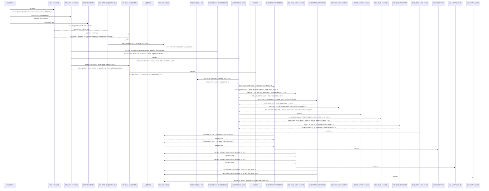
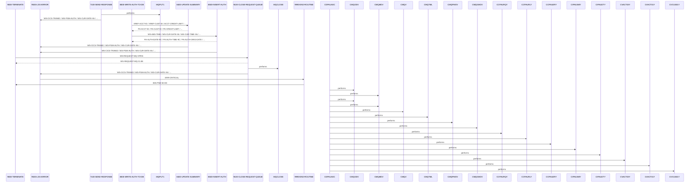

# COPAUA0C

**File**: `cbl/COPAUA0C.cbl`
**Type**: FileType.COBOL
**Analyzed**: 2026-02-27 14:38:55.303998

## Purpose

The COPAUA0C program processes authorization requests from a message queue, validates the requests, and updates relevant systems. It retrieves messages from a request queue, processes the authorization, and then either continues processing or terminates based on message volume or errors.

**Business Context**: This program likely serves as a component in a larger transaction processing system, handling authorization requests for financial transactions.

## Inputs

| Name | Type | Description |
|------|------|-------------|
| MQTM | IOType.CICS_COMMAREA | Message Queue Trigger Monitor data containing the request queue name and trigger data. |
| WS-REQUEST-QNAME | IOType.PARAMETER | The name of the request queue to read messages from. |

## Called Programs

| Program | Call Type | Purpose |
|---------|-----------|---------|
| MQOPEN | CallType.STATIC_CALL | Opens the request message queue for processing. |
| CMQODV | CallType.OTHER | UNKNOWN |
| CMQMDV | CallType.OTHER | UNKNOWN |
| CMQV | CallType.OTHER | UNKNOWN |

## Paragraphs/Procedures

### MAIN-PARA
> [Source: MAIN-PARA.cbl.md](COPAUA0C.cbl.d/MAIN-PARA.cbl.md)

```
MAIN-PARA  (4 statements, depth=0)
PARAGRAPH
├── PERFORM_THRU: PERFORM 1000-INITIALIZE    THRU 1000-EXIT
├── PERFORM_THRU: PERFORM 2000-MAIN-PROCESS  THRU 2000-EXIT
├── PERFORM_THRU: PERFORM 9000-TERMINATE     THRU 9000-EXIT
└── EXEC_CICS: EXEC CICS RETURN END-EXEC
```
This is the main control paragraph for the COPAUA0C program. It orchestrates the initialization, main processing, and termination steps. First, it performs 1000-INITIALIZE to set up the environment and open the request queue. Then, it performs 2000-MAIN-PROCESS to read and process authorization requests from the queue. Finally, it performs 9000-TERMINATE to close the queue and perform cleanup tasks. After the subroutines are completed, the program executes a CICS RETURN to terminate the transaction.

### 1000-INITIALIZE
> [Source: 1000-INITIALIZE.cbl.md](COPAUA0C.cbl.d/1000-INITIALIZE.cbl.md)

```
1000-INITIALIZE  (7 statements, depth=1)
PARAGRAPH
├── EXEC_CICS: EXEC CICS RETRIEVE INTO(MQTM) NOHANDLE END-EXEC
├── IF: IF EIBRESP = DFHRESP(NORMAL)
│   ├── MOVE: MOVE MQTM-QNAME              TO WS-REQUEST-QNAME
│   └── MOVE: MOVE MQTM-TRIGGERDATA        TO WS-TRIGGER-DATA
├── MOVE: MOVE 5000                       TO WS-WAIT-INTERVAL
├── PERFORM_THRU: PERFORM 1100-OPEN-REQUEST-QUEUE THRU 1100-EXIT
└── PERFORM_THRU: PERFORM 3100-READ-REQUEST-MQ    THRU 3100-EXIT
```
This paragraph initializes the program environment. It retrieves the MQTM (Message Queue Trigger Monitor) data using EXEC CICS RETRIEVE to obtain the request queue name and trigger data. It moves the queue name and trigger data to working storage variables WS-REQUEST-QNAME and WS-TRIGGER-DATA, respectively. It sets the wait interval to 5000. It then performs 1100-OPEN-REQUEST-QUEUE to open the request queue and 3100-READ-REQUEST-MQ to read the first message from the queue. Error handling is performed by checking EIBRESP.

### 1000-EXIT
> [Source: 1000-EXIT.cbl.md](COPAUA0C.cbl.d/1000-EXIT.cbl.md)

```
1000-EXIT  (1 statements, depth=0)
PARAGRAPH
└── EXIT: EXIT
```
This paragraph serves as the exit point for the 1000-INITIALIZE paragraph. It contains only the EXIT statement and ensures proper control flow.

### 1100-OPEN-REQUEST-QUEUE
> [Source: 1100-OPEN-REQUEST-QUEUE.cbl.md](COPAUA0C.cbl.d/1100-OPEN-REQUEST-QUEUE.cbl.md)

```
1100-OPEN-REQUEST-QUEUE  (16 statements, depth=1)
PARAGRAPH
├── MOVE: MOVE MQOT-Q             TO MQOD-OBJECTTYPE OF MQM-OD-REQUEST
├── MOVE: MOVE WS-REQUEST-QNAME   TO MQOD-OBJECTNAME OF MQM-OD-REQUEST
├── COMPUTE: COMPUTE WS-OPTIONS = MQOO-INPUT-SHARED
├── CALL: CALL 'MQOPEN' USING W01-HCONN-REQUEST MQM-OD-REQUEST WS-OPTIONS W01-H...
└── IF: IF WS-COMPCODE = MQCC-OK
    ├── SET: SET WS-REQUEST-MQ-OPEN TO TRUE
    └── ELSE: ELSE
        ├── MOVE: MOVE 'M001'          TO ERR-LOCATION
        ├── SET: SET  ERR-CRITICAL    TO TRUE
        ├── SET: SET  ERR-MQ          TO TRUE
        ├── MOVE: MOVE WS-COMPCODE     TO WS-CODE-DISPLAY
        ├── MOVE: MOVE WS-CODE-DISPLAY TO ERR-CODE-1
        ├── MOVE: MOVE WS-REASON       TO WS-CODE-DISPLAY
        ├── MOVE: MOVE WS-CODE-DISPLAY TO ERR-CODE-2
        ├── MOVE: MOVE 'REQ MQ OPEN ERROR' TO ERR-MESSAGE
        └── PERFORM: PERFORM 9500-LOG-ERROR
```
This paragraph opens the request queue for processing. It moves MQOT-Q to MQOD-OBJECTTYPE of MQM-OD-REQUEST and WS-REQUEST-QNAME to MQOD-OBJECTNAME of MQM-OD-REQUEST to define the queue to be opened. It computes WS-OPTIONS as MQOO-INPUT-SHARED, specifying that the queue should be opened for shared input. It then calls MQOPEN to open the queue, passing the connection handle, object descriptor, options, object handle, completion code, and reason code. If the completion code is MQCC-OK, it sets WS-REQUEST-MQ-OPEN to TRUE. Otherwise, it logs an error using 9500-LOG-ERROR, setting various error fields and flags.

### 1100-EXIT
> [Source: 1100-EXIT.cbl.md](COPAUA0C.cbl.d/1100-EXIT.cbl.md)

```
1100-EXIT  (1 statements, depth=0)
PARAGRAPH
└── EXIT: EXIT
```
This paragraph serves as the exit point for the 1100-OPEN-REQUEST-QUEUE paragraph. It contains only the EXIT statement and ensures proper control flow.

### 1200-SCHEDULE-PSB
> [Source: 1200-SCHEDULE-PSB.cbl.md](COPAUA0C.cbl.d/1200-SCHEDULE-PSB.cbl.md)

```
1200-SCHEDULE-PSB  (15 statements, depth=1)
PARAGRAPH
├── EXEC_DLI: EXEC DLI SCHD PSB((PSB-NAME)) NODHABEND END-EXEC
├── MOVE: MOVE DIBSTAT        TO IMS-RETURN-CODE
├── IF: IF PSB-SCHEDULED-MORE-THAN-ONCE
│   ├── EXEC_DLI: EXEC DLI TERM END-EXEC
│   ├── EXEC_DLI: EXEC DLI SCHD PSB((PSB-NAME)) NODHABEND END-EXEC
│   └── MOVE: MOVE DIBSTAT     TO IMS-RETURN-CODE
└── IF: IF STATUS-OK
    ├── SET: SET IMS-PSB-SCHD           TO TRUE
    └── ELSE: ELSE
        ├── MOVE: MOVE 'I001'                TO ERR-LOCATION
        ├── SET: SET  ERR-CRITICAL          TO TRUE
        ├── SET: SET  ERR-IMS               TO TRUE
        ├── MOVE: MOVE IMS-RETURN-CODE       TO ERR-CODE-1
        ├── MOVE: MOVE 'IMS SCHD FAILED'     TO ERR-MESSAGE
        └── PERFORM: PERFORM 9500-LOG-ERROR
```
This paragraph schedules a PSB (Program Specification Block) for IMS database access. It executes a DLI SCHD command with the PSB-NAME and NODHABEND option. The DIBSTAT is moved to IMS-RETURN-CODE. If the PSB is scheduled more than once, it terminates the PSB and schedules it again. If the status is OK, it sets IMS-PSB-SCHD to TRUE. Otherwise, it logs an error using 9500-LOG-ERROR, setting various error fields and flags.

### 1200-EXIT
> [Source: 1200-EXIT.cbl.md](COPAUA0C.cbl.d/1200-EXIT.cbl.md)

```
1200-EXIT  (1 statements, depth=0)
PARAGRAPH
└── EXIT: EXIT
```
This paragraph serves as the exit point for the 1200-SCHEDULE-PSB paragraph. It contains only the EXIT statement and ensures proper control flow.

### 2000-MAIN-PROCESS
> [Source: 2000-MAIN-PROCESS.cbl.md](COPAUA0C.cbl.d/2000-MAIN-PROCESS.cbl.md)

```
2000-MAIN-PROCESS  (10 statements, depth=2)
PARAGRAPH
└── PERFORM_INLINE: PERFORM UNTIL NO-MORE-MSG-AVAILABLE OR WS-LOOP-END
    ├── PERFORM_THRU: PERFORM 2100-EXTRACT-REQUEST-MSG THRU 2100-EXIT
    ├── PERFORM_THRU: PERFORM 5000-PROCESS-AUTH        THRU 5000-EXIT
    ├── ADD: ADD 1                            TO WS-MSG-PROCESSED
    ├── EXEC_CICS: EXEC CICS SYNCPOINT END-EXEC
    ├── SET: SET IMS-PSB-NOT-SCHD            TO TRUE
    └── IF: IF WS-MSG-PROCESSED > WS-REQSTS-PROCESS-LIMIT
        ├── SET: SET  WS-LOOP-END             TO TRUE
        └── ELSE: ELSE
            └── PERFORM_THRU: PERFORM 3100-READ-REQUEST-MQ THRU 3100-EXIT
```
This paragraph is the main processing loop for handling authorization requests. It performs 2100-EXTRACT-REQUEST-MSG to extract the request message, then performs 5000-PROCESS-AUTH to process the authorization. It increments WS-MSG-PROCESSED to track the number of processed messages. A CICS SYNCPOINT is issued. IMS-PSB-NOT-SCHD is set to TRUE. If the number of processed messages exceeds WS-REQSTS-PROCESS-LIMIT, WS-LOOP-END is set to TRUE to terminate the loop. Otherwise, it performs 3100-READ-REQUEST-MQ to read the next message from the queue. The loop continues until NO-MORE-MSG-AVAILABLE or WS-LOOP-END is TRUE.

### 2000-EXIT
> [Source: 2000-EXIT.cbl.md](COPAUA0C.cbl.d/2000-EXIT.cbl.md)

```
2000-EXIT  (1 statements, depth=0)
PARAGRAPH
└── EXIT: EXIT
```
This paragraph serves as the exit point for the 2000-MAIN-PROCESS paragraph. It contains only the EXIT statement and ensures proper control flow.

### 2100-EXTRACT-REQUEST-MSG
> [Source: 2100-EXTRACT-REQUEST-MSG.cbl.md](COPAUA0C.cbl.d/2100-EXTRACT-REQUEST-MSG.cbl.md)

```
2100-EXTRACT-REQUEST-MSG  (3 statements, depth=0)
PARAGRAPH
├── UNSTRING: UNSTRING W01-GET-BUFFER(1:W01-DATALEN) DELIMITED BY ',' INTO PA-RQ-AU...
├── COMPUTE: COMPUTE PA-RQ-TRANSACTION-AMT = FUNCTION NUMVAL(WS-TRANSACTION-AMT-AN)
└── MOVE: MOVE PA-RQ-TRANSACTION-AMT  TO WS-TRANSACTION-AMT
```
This paragraph extracts data from the authorization request message (W01-GET-BUFFER) received from the MQ queue. It uses the UNSTRING statement to parse the comma-delimited message into individual fields such as authorization date, time, card number, authorization type, and transaction amount. The transaction amount, initially in alphanumeric format (WS-TRANSACTION-AMT-AN), is converted to a numeric value (PA-RQ-TRANSACTION-AMT) using the NUMVAL function. The numeric transaction amount is then moved to WS-TRANSACTION-AMT. No error handling is explicitly performed within this paragraph. It consumes the W01-GET-BUFFER and produces individual data elements used in subsequent processing.

### 2100-EXIT
> [Source: 2100-EXIT.cbl.md](COPAUA0C.cbl.d/2100-EXIT.cbl.md)

```
2100-EXIT  (1 statements, depth=0)
PARAGRAPH
└── EXIT: EXIT
```
This paragraph serves as the exit point for the 2100-EXTRACT-REQUEST-MSG paragraph. It contains a simple EXIT statement and does not perform any specific operations. It is a standard practice in COBOL to have an explicit exit paragraph for each section to ensure proper control flow.

### 3100-READ-REQUEST-MQ
> [Source: 3100-READ-REQUEST-MQ.cbl.md](COPAUA0C.cbl.d/3100-READ-REQUEST-MQ.cbl.md)

```
3100-READ-REQUEST-MQ  (24 statements, depth=3)
PARAGRAPH
├── COMPUTE: COMPUTE MQGMO-OPTIONS  =  MQGMO-NO-SYNCPOINT + MQGMO-WAIT +  MQGMO-CO...
├── MOVE: MOVE WS-WAIT-INTERVAL      TO MQGMO-WAITINTERVAL
├── MOVE: MOVE MQMI-NONE             TO MQMD-MSGID    OF MQM-MD-REQUEST
├── MOVE: MOVE MQCI-NONE             TO MQMD-CORRELID OF MQM-MD-REQUEST
├── MOVE: MOVE MQFMT-STRING          TO MQMD-FORMAT   OF MQM-MD-REQUEST
├── MOVE: MOVE LENGTH OF W01-GET-BUFFER TO W01-BUFFLEN
├── CALL: CALL 'MQGET' USING W01-HCONN-REQUEST W01-HOBJ-REQUEST MQM-MD-REQUEST ...
└── IF: IF WS-COMPCODE = MQCC-OK
    ├── MOVE: MOVE MQMD-CORRELID OF MQM-MD-REQUEST TO WS-SAVE-CORRELID
    ├── MOVE: MOVE MQMD-REPLYTOQ OF MQM-MD-REQUEST TO WS-REPLY-QNAME
    └── ELSE: ELSE
        └── IF: IF WS-REASON = MQRC-NO-MSG-AVAILABLE
            ├── SET: SET NO-MORE-MSG-AVAILABLE TO TRUE
            └── ELSE: ELSE
                ├── MOVE: MOVE 'M003'                TO ERR-LOCATION
                ├── SET: SET  ERR-CRITICAL          TO TRUE
                ├── SET: SET  ERR-CICS              TO TRUE
                ├── MOVE: MOVE WS-COMPCODE           TO WS-CODE-DISPLAY
                ├── MOVE: MOVE WS-CODE-DISPLAY       TO ERR-CODE-1
                ├── MOVE: MOVE WS-REASON             TO WS-CODE-DISPLAY
                ├── MOVE: MOVE WS-CODE-DISPLAY       TO ERR-CODE-2
                ├── MOVE: MOVE 'FAILED TO READ REQUEST MQ' TO ERR-MESSAGE
                ├── MOVE: MOVE PA-CARD-NUM           TO ERR-EVENT-KEY
                └── PERFORM: PERFORM 9500-LOG-ERROR
```
This paragraph reads the authorization request message from the MQ queue. It sets MQGMO options for no syncpoint, waiting, conversion, and failing if quiescing. It moves the wait interval to MQGMO-WAITINTERVAL. It sets MQMD fields for message ID, correlation ID, and format. It then calls the MQGET program to retrieve the message from the queue, using W01-GET-BUFFER to store the message. If the MQGET call is successful (WS-COMPCODE = MQCC-OK), it saves the correlation ID and reply-to queue name. If the call fails, it checks if the reason is MQRC-NO-MSG-AVAILABLE and sets the NO-MORE-MSG-AVAILABLE flag. Otherwise, it logs an error using 9500-LOG-ERROR with error codes and messages indicating a failure to read the request MQ. The paragraph consumes MQ queue data and produces the W01-GET-BUFFER content.

### 3100-EXIT
> [Source: 3100-EXIT.cbl.md](COPAUA0C.cbl.d/3100-EXIT.cbl.md)

```
3100-EXIT  (1 statements, depth=0)
PARAGRAPH
└── EXIT: EXIT
```
This paragraph serves as the exit point for the 3100-READ-REQUEST-MQ paragraph. It contains a simple EXIT statement and does not perform any specific operations. It ensures proper control flow after reading the request message from the MQ queue.

### 5000-PROCESS-AUTH
> [Source: 5000-PROCESS-AUTH.cbl.md](COPAUA0C.cbl.d/5000-PROCESS-AUTH.cbl.md)

```
5000-PROCESS-AUTH  (14 statements, depth=1)
PARAGRAPH
├── SET: SET APPROVE-AUTH                  TO TRUE
├── PERFORM_THRU: PERFORM 1200-SCHEDULE-PSB         THRU 1200-EXIT
├── SET: SET CARD-FOUND-XREF               TO TRUE
├── SET: SET FOUND-ACCT-IN-MSTR            TO TRUE
├── PERFORM_THRU: PERFORM 5100-READ-XREF-RECORD     THRU 5100-EXIT
├── IF: IF CARD-FOUND-XREF
│   ├── PERFORM_THRU: PERFORM 5200-READ-ACCT-RECORD  THRU 5200-EXIT
│   ├── PERFORM_THRU: PERFORM 5300-READ-CUST-RECORD  THRU 5300-EXIT
│   ├── PERFORM_THRU: PERFORM 5500-READ-AUTH-SUMMRY  THRU 5500-EXIT
│   └── PERFORM_THRU: PERFORM 5600-READ-PROFILE-DATA THRU 5600-EXIT
├── PERFORM_THRU: PERFORM 6000-MAKE-DECISION        THRU 6000-EXIT
├── PERFORM_THRU: PERFORM 7100-SEND-RESPONSE        THRU 7100-EXIT
└── IF: IF CARD-FOUND-XREF
    └── PERFORM_THRU: PERFORM 8000-WRITE-AUTH-TO-DB  THRU 8000-EXIT
```
This paragraph is the main processing logic for authorization requests. It begins by setting APPROVE-AUTH to TRUE and scheduling a PSB using 1200-SCHEDULE-PSB. It then sets CARD-FOUND-XREF and FOUND-ACCT-IN-MSTR to TRUE. The paragraph proceeds to read the card cross-reference record (5100-READ-XREF-RECORD). If the card is found in the XREF, it reads the account record (5200-READ-ACCT-RECORD), customer record (5300-READ-CUST-RECORD), authorization summary (5500-READ-AUTH-SUMMRY), and profile data (5600-READ-PROFILE-DATA). After retrieving the necessary data, it makes an authorization decision (6000-MAKE-DECISION) and sends a response (7100-SEND-RESPONSE). Finally, if the card was found in the XREF, it writes the authorization to the database (8000-WRITE-AUTH-TO-DB).

### 5000-EXIT
> [Source: 5000-EXIT.cbl.md](COPAUA0C.cbl.d/5000-EXIT.cbl.md)

```
5000-EXIT  (1 statements, depth=0)
PARAGRAPH
└── EXIT: EXIT
```
This paragraph serves as the exit point for the 5000-PROCESS-AUTH paragraph. It contains a simple EXIT statement and does not perform any specific operations. It ensures proper control flow after processing the authorization request.

### 5100-READ-XREF-RECORD
> [Source: 5100-READ-XREF-RECORD.cbl.md](COPAUA0C.cbl.d/5100-READ-XREF-RECORD.cbl.md)

```
5100-READ-XREF-RECORD  (25 statements, depth=1)
PARAGRAPH
├── MOVE: MOVE PA-RQ-CARD-NUM           TO XREF-CARD-NUM
├── EXEC_CICS: EXEC CICS READ DATASET   (WS-CCXREF-FILE) INTO      (CARD-XREF-RECORD...
└── EVALUATE: EVALUATE WS-RESP-CD
    ├── WHEN: WHEN DFHRESP(NORMAL)
    │   └── SET: SET  CARD-FOUND-XREF  TO TRUE
    ├── WHEN: WHEN DFHRESP(NOTFND)
    │   ├── SET: SET  CARD-NFOUND-XREF TO TRUE
    │   ├── SET: SET  NFOUND-ACCT-IN-MSTR TO TRUE
    │   ├── MOVE: MOVE 'A001'          TO ERR-LOCATION
    │   ├── SET: SET  ERR-WARNING     TO TRUE
    │   ├── SET: SET  ERR-APP         TO TRUE
    │   ├── MOVE: MOVE 'CARD NOT FOUND IN XREF' TO ERR-MESSAGE
    │   ├── MOVE: MOVE XREF-CARD-NUM   TO ERR-EVENT-KEY
    │   └── PERFORM: PERFORM 9500-LOG-ERROR
    └── WHEN: WHEN OTHER
        ├── MOVE: MOVE 'C001'          TO ERR-LOCATION
        ├── SET: SET  ERR-CRITICAL    TO TRUE
        ├── SET: SET  ERR-CICS        TO TRUE
        ├── MOVE: MOVE WS-RESP-CD      TO WS-CODE-DISPLAY
        ├── MOVE: MOVE WS-CODE-DISPLAY TO ERR-CODE-1
        ├── MOVE: MOVE WS-REAS-CD      TO WS-CODE-DISPLAY
        ├── MOVE: MOVE WS-CODE-DISPLAY TO ERR-CODE-2
        ├── MOVE: MOVE 'FAILED TO READ XREF FILE' TO ERR-MESSAGE
        ├── MOVE: MOVE XREF-CARD-NUM   TO ERR-EVENT-KEY
        └── PERFORM: PERFORM 9500-LOG-ERROR
```
This paragraph reads the card cross-reference record from the CICS file WS-CCXREF-FILE. It moves the card number (PA-RQ-CARD-NUM) to XREF-CARD-NUM and then executes a CICS READ command to retrieve the CARD-XREF-RECORD based on the XREF-CARD-NUM. The paragraph evaluates the CICS response code (WS-RESP-CD). If the record is found (DFHRESP(NORMAL)), it sets CARD-FOUND-XREF to TRUE. If the record is not found (DFHRESP(NOTFND)), it sets CARD-NFOUND-XREF and NFOUND-ACCT-IN-MSTR to TRUE and logs a warning message using 9500-LOG-ERROR. If any other error occurs, it logs a critical error using 9500-LOG-ERROR. The paragraph consumes PA-RQ-CARD-NUM and produces CARD-XREF-RECORD. The CICS READ operation uses WS-CCXREF-FILE.

### 5100-EXIT
> [Source: 5100-EXIT.cbl.md](COPAUA0C.cbl.d/5100-EXIT.cbl.md)

```
5100-EXIT  (1 statements, depth=0)
PARAGRAPH
└── EXIT: EXIT
```
This paragraph serves as the exit point for the 5100-READ-XREF-RECORD paragraph. It contains a simple EXIT statement and does not perform any specific operations. It ensures proper control flow after reading the card cross-reference record.

### 5200-READ-ACCT-RECORD
> [Source: 5200-READ-ACCT-RECORD.cbl.md](COPAUA0C.cbl.d/5200-READ-ACCT-RECORD.cbl.md)

```
5200-READ-ACCT-RECORD  (24 statements, depth=1)
PARAGRAPH
├── MOVE: MOVE XREF-ACCT-ID          TO WS-CARD-RID-ACCT-ID
├── EXEC_CICS: EXEC CICS READ DATASET   (WS-ACCTFILENAME) RIDFLD    (WS-CARD-RID-ACC...
└── EVALUATE: EVALUATE WS-RESP-CD
    ├── WHEN: WHEN DFHRESP(NORMAL)
    │   └── SET: SET FOUND-ACCT-IN-MSTR     TO TRUE
    ├── WHEN: WHEN DFHRESP(NOTFND)
    │   ├── SET: SET NFOUND-ACCT-IN-MSTR    TO TRUE
    │   ├── MOVE: MOVE 'A002'                TO ERR-LOCATION
    │   ├── SET: SET  ERR-WARNING           TO TRUE
    │   ├── SET: SET  ERR-APP               TO TRUE
    │   ├── MOVE: MOVE 'ACCT NOT FOUND IN XREF' TO ERR-MESSAGE
    │   ├── MOVE: MOVE WS-CARD-RID-ACCT-ID-X TO ERR-EVENT-KEY
    │   └── PERFORM: PERFORM 9500-LOG-ERROR
    └── WHEN: WHEN OTHER
        ├── MOVE: MOVE 'C002'                TO ERR-LOCATION
        ├── SET: SET  ERR-CRITICAL          TO TRUE
        ├── SET: SET  ERR-CICS              TO TRUE
        ├── MOVE: MOVE WS-RESP-CD            TO WS-CODE-DISPLAY
        ├── MOVE: MOVE WS-CODE-DISPLAY       TO ERR-CODE-1
        ├── MOVE: MOVE WS-REAS-CD            TO WS-CODE-DISPLAY
        ├── MOVE: MOVE WS-CODE-DISPLAY       TO ERR-CODE-2
        ├── MOVE: MOVE 'FAILED TO READ ACCT FILE' TO ERR-MESSAGE
        ├── MOVE: MOVE WS-CARD-RID-ACCT-ID-X TO ERR-EVENT-KEY
        └── PERFORM: PERFORM 9500-LOG-ERROR
```
This paragraph reads the account record from the CICS file WS-ACCTFILENAME. It moves the account ID (XREF-ACCT-ID) to WS-CARD-RID-ACCT-ID and then executes a CICS READ command to retrieve the ACCOUNT-RECORD based on the WS-CARD-RID-ACCT-ID-X. The paragraph evaluates the CICS response code (WS-RESP-CD). If the record is found (DFHRESP(NORMAL)), it sets FOUND-ACCT-IN-MSTR to TRUE. If the record is not found (DFHRESP(NOTFND)), it sets NFOUND-ACCT-IN-MSTR to TRUE and logs a warning message using 9500-LOG-ERROR. If any other error occurs, it logs a critical error using 9500-LOG-ERROR. The paragraph consumes XREF-ACCT-ID and produces ACCOUNT-RECORD. The CICS READ operation uses WS-ACCTFILENAME.

### 5200-EXIT
> [Source: 5200-EXIT.cbl.md](COPAUA0C.cbl.d/5200-EXIT.cbl.md)

```
5200-EXIT  (1 statements, depth=0)
PARAGRAPH
└── EXIT: EXIT
```
This paragraph serves as the exit point for the 5200-READ-ACCT-RECORD paragraph. It contains a simple EXIT statement and does not perform any specific operations. It ensures proper control flow after reading the account record.

### 5300-READ-CUST-RECORD
> [Source: 5300-READ-CUST-RECORD.cbl.md](COPAUA0C.cbl.d/5300-READ-CUST-RECORD.cbl.md)

```
5300-READ-CUST-RECORD  (24 statements, depth=1)
PARAGRAPH
├── MOVE: MOVE XREF-CUST-ID                 TO WS-CARD-RID-CUST-ID
├── EXEC_CICS: EXEC CICS READ DATASET   (WS-CUSTFILENAME) RIDFLD    (WS-CARD-RID-CUS...
└── EVALUATE: EVALUATE WS-RESP-CD
    ├── WHEN: WHEN DFHRESP(NORMAL)
    │   └── SET: SET FOUND-CUST-IN-MSTR     TO TRUE
    ├── WHEN: WHEN DFHRESP(NOTFND)
    │   ├── SET: SET NFOUND-CUST-IN-MSTR    TO TRUE
    │   ├── MOVE: MOVE 'A003'                TO ERR-LOCATION
    │   ├── SET: SET  ERR-WARNING           TO TRUE
    │   ├── SET: SET  ERR-APP               TO TRUE
    │   ├── MOVE: MOVE 'CUST NOT FOUND IN XREF' TO ERR-MESSAGE
    │   ├── MOVE: MOVE WS-CARD-RID-CUST-ID   TO ERR-EVENT-KEY
    │   └── PERFORM: PERFORM 9500-LOG-ERROR
    └── WHEN: WHEN OTHER
        ├── MOVE: MOVE 'C003'                TO ERR-LOCATION
        ├── SET: SET  ERR-CRITICAL          TO TRUE
        ├── SET: SET  ERR-CICS              TO TRUE
        ├── MOVE: MOVE WS-RESP-CD            TO WS-CODE-DISPLAY
        ├── MOVE: MOVE WS-CODE-DISPLAY       TO ERR-CODE-1
        ├── MOVE: MOVE WS-REAS-CD            TO WS-CODE-DISPLAY
        ├── MOVE: MOVE WS-CODE-DISPLAY       TO ERR-CODE-2
        ├── MOVE: MOVE 'FAILED TO READ CUST FILE' TO ERR-MESSAGE
        ├── MOVE: MOVE WS-CARD-RID-CUST-ID   TO ERR-EVENT-KEY
        └── PERFORM: PERFORM 9500-LOG-ERROR
```
This paragraph reads the customer record from the VSAM file using the customer ID. It moves the XREF-CUST-ID to WS-CARD-RID-CUST-ID and then executes a CICS READ command to retrieve the CUSTOMER-RECORD. The paragraph evaluates the WS-RESP-CD to determine if the read was successful. If the customer record is found, FOUND-CUST-IN-MSTR is set to TRUE. If the customer record is not found, NFOUND-CUST-IN-MSTR is set to TRUE, an error message is logged using 9500-LOG-ERROR, and ERR-WARNING and ERR-APP flags are set. If any other error occurs during the read, an error message is logged with 9500-LOG-ERROR, and ERR-CRITICAL and ERR-CICS flags are set.

### 5300-EXIT
> [Source: 5300-EXIT.cbl.md](COPAUA0C.cbl.d/5300-EXIT.cbl.md)

```
5300-EXIT  (1 statements, depth=0)
PARAGRAPH
└── EXIT: EXIT
```
This paragraph is a standard EXIT paragraph, providing a single point of exit from the 5300-READ-CUST-RECORD paragraph. It ensures a clean and controlled return to the calling paragraph. It does not perform any specific logic or data manipulation. It simply contains the EXIT statement to facilitate structured programming practices. This paragraph is essential for maintaining code readability and simplifying maintenance efforts. It is called after the customer record is read and processed in 5300-READ-CUST-RECORD.

### 5500-READ-AUTH-SUMMRY
> [Source: 5500-READ-AUTH-SUMMRY.cbl.md](COPAUA0C.cbl.d/5500-READ-AUTH-SUMMRY.cbl.md)

```
5500-READ-AUTH-SUMMRY  (16 statements, depth=1)
PARAGRAPH
├── MOVE: MOVE XREF-ACCT-ID                    TO PA-ACCT-ID
├── EXEC_DLI: EXEC DLI GU USING PCB(PAUT-PCB-NUM) SEGMENT (PAUTSUM0) INTO (PENDING-...
├── MOVE: MOVE DIBSTAT                          TO IMS-RETURN-CODE
└── EVALUATE: EVALUATE TRUE
    ├── WHEN: WHEN STATUS-OK
    │   └── SET: SET FOUND-PAUT-SMRY-SEG        TO TRUE
    ├── WHEN: WHEN SEGMENT-NOT-FOUND
    │   └── SET: SET NFOUND-PAUT-SMRY-SEG       TO TRUE
    └── WHEN: WHEN OTHER
        ├── MOVE: MOVE 'I002'                    TO ERR-LOCATION
        ├── SET: SET  ERR-CRITICAL              TO TRUE
        ├── SET: SET  ERR-IMS                   TO TRUE
        ├── MOVE: MOVE IMS-RETURN-CODE           TO ERR-CODE-1
        ├── MOVE: MOVE 'IMS GET SUMMARY FAILED'  TO ERR-MESSAGE
        ├── MOVE: MOVE PA-CARD-NUM               TO ERR-EVENT-KEY
        └── PERFORM: PERFORM 9500-LOG-ERROR
```
This paragraph reads the pending authorization summary from the IMS database. It moves the XREF-ACCT-ID to PA-ACCT-ID and then executes a DLI GU (Get Unique) command to retrieve the PAUTSUM0 segment into PENDING-AUTH-SUMMARY. The paragraph evaluates the DIBSTAT to determine if the read was successful. If the segment is found, FOUND-PAUT-SMRY-SEG is set to TRUE. If the segment is not found, NFOUND-PAUT-SMRY-SEG is set to TRUE. If any other error occurs during the read, an error message is logged with 9500-LOG-ERROR, and ERR-CRITICAL and ERR-IMS flags are set. The IMS PCB number is PAUT-PCB-NUM.

### 5500-EXIT
> [Source: 5500-EXIT.cbl.md](COPAUA0C.cbl.d/5500-EXIT.cbl.md)

```
5500-EXIT  (1 statements, depth=0)
PARAGRAPH
└── EXIT: EXIT
```
This paragraph is a standard EXIT paragraph, providing a single point of exit from the 5500-READ-AUTH-SUMMRY paragraph. It ensures a clean and controlled return to the calling paragraph. It does not perform any specific logic or data manipulation. It simply contains the EXIT statement to facilitate structured programming practices. This paragraph is essential for maintaining code readability and simplifying maintenance efforts. It is called after the pending authorization summary is read and processed in 5500-READ-AUTH-SUMMRY.

### 5600-READ-PROFILE-DATA
> [Source: 5600-READ-PROFILE-DATA.cbl.md](COPAUA0C.cbl.d/5600-READ-PROFILE-DATA.cbl.md)

```
5600-READ-PROFILE-DATA  (1 statements, depth=0)
PARAGRAPH
└── CONTINUE: CONTINUE
```
This paragraph currently contains a CONTINUE statement, indicating that it does not perform any specific action. It might be a placeholder for future functionality related to reading profile data. It serves as a stub that can be expanded upon in later versions of the program. The paragraph's presence suggests that profile data retrieval was considered during the design phase, even if it's not currently implemented. It does not consume any inputs or produce any outputs.

### 5600-EXIT
> [Source: 5600-EXIT.cbl.md](COPAUA0C.cbl.d/5600-EXIT.cbl.md)

```
5600-EXIT  (1 statements, depth=0)
PARAGRAPH
└── EXIT: EXIT
```
This paragraph is a standard EXIT paragraph, providing a single point of exit from the 5600-READ-PROFILE-DATA paragraph. It ensures a clean and controlled return to the calling paragraph. It does not perform any specific logic or data manipulation. It simply contains the EXIT statement to facilitate structured programming practices. This paragraph is essential for maintaining code readability and simplifying maintenance efforts. It is called after the (currently empty) profile data reading logic in 5600-READ-PROFILE-DATA.

### 6000-MAKE-DECISION
> [Source: 6000-MAKE-DECISION.cbl.md](COPAUA0C.cbl.d/6000-MAKE-DECISION.cbl.md)

```
6000-MAKE-DECISION  (45 statements, depth=4)
PARAGRAPH
├── MOVE: MOVE PA-RQ-CARD-NUM         TO PA-RL-CARD-NUM
├── MOVE: MOVE PA-RQ-TRANSACTION-ID   TO PA-RL-TRANSACTION-ID
├── MOVE: MOVE PA-RQ-AUTH-TIME        TO PA-RL-AUTH-ID-CODE
├── IF: IF FOUND-PAUT-SMRY-SEG
│   ├── COMPUTE: COMPUTE WS-AVAILABLE-AMT = PA-CREDIT-LIMIT - PA-CREDIT-BALANCE
│   ├── IF: IF WS-TRANSACTION-AMT > WS-AVAILABLE-AMT
│   │   ├── SET: SET DECLINE-AUTH      TO TRUE
│   │   └── SET: SET INSUFFICIENT-FUND TO TRUE
│   └── ELSE: ELSE
│       └── IF: IF FOUND-ACCT-IN-MSTR
│           ├── COMPUTE: COMPUTE WS-AVAILABLE-AMT = ACCT-CREDIT-LIMIT - ACCT-CURR-BAL
│           ├── IF: IF WS-TRANSACTION-AMT > WS-AVAILABLE-AMT
│           │   ├── SET: SET DECLINE-AUTH      TO TRUE
│           │   └── SET: SET INSUFFICIENT-FUND TO TRUE
│           └── ELSE: ELSE
│               └── SET: SET DECLINE-AUTH         TO TRUE
├── IF: IF DECLINE-AUTH
│   ├── SET: SET  AUTH-RESP-DECLINED     TO TRUE
│   ├── MOVE: MOVE '05'                   TO PA-RL-AUTH-RESP-CODE
│   ├── MOVE: MOVE 0                      TO PA-RL-APPROVED-AMT WS-APPROVED-AMT
│   └── ELSE: ELSE
│       ├── SET: SET  AUTH-RESP-APPROVED     TO TRUE
│       ├── MOVE: MOVE '00'                   TO PA-RL-AUTH-RESP-CODE
│       └── MOVE: MOVE PA-RQ-TRANSACTION-AMT  TO PA-RL-APPROVED-AMT WS-APPROVED-AMT
├── MOVE: MOVE '0000'                    TO PA-RL-AUTH-RESP-REASON
├── IF: IF AUTH-RESP-DECLINED
│   └── EVALUATE: EVALUATE TRUE
│       ├── WHEN: WHEN CARD-NFOUND-XREF
│       ├── WHEN: WHEN NFOUND-ACCT-IN-MSTR
│       ├── WHEN: WHEN NFOUND-CUST-IN-MSTR
│       │   └── MOVE: MOVE '3100'         TO PA-RL-AUTH-RESP-REASON
│       ├── WHEN: WHEN INSUFFICIENT-FUND
│       │   └── MOVE: MOVE '4100'         TO PA-RL-AUTH-RESP-REASON
│       ├── WHEN: WHEN CARD-NOT-ACTIVE
│       │   └── MOVE: MOVE '4200'         TO PA-RL-AUTH-RESP-REASON
│       ├── WHEN: WHEN ACCOUNT-CLOSED
│       │   └── MOVE: MOVE '4300'         TO PA-RL-AUTH-RESP-REASON
│       ├── WHEN: WHEN CARD-FRAUD
│       │   └── MOVE: MOVE '5100'         TO PA-RL-AUTH-RESP-REASON
│       ├── WHEN: WHEN MERCHANT-FRAUD
│       │   └── MOVE: MOVE '5200'         TO PA-RL-AUTH-RESP-REASON
│       └── WHEN: WHEN OTHER
│           └── MOVE: MOVE '9000'         TO PA-RL-AUTH-RESP-REASON
├── MOVE: MOVE WS-APPROVED-AMT        TO WS-APPROVED-AMT-DIS
└── STRING: STRING PA-RL-CARD-NUM         ',' PA-RL-TRANSACTION-ID   ',' PA-RL-AU...
```
This paragraph makes the decision to approve or decline the authorization request based on available credit and account status. It first moves the request data to result fields. If a pending authorization summary is found, it calculates the available amount by subtracting the credit balance from the credit limit. If the transaction amount exceeds the available amount, the authorization is declined. If no authorization summary is found, it checks if the account is found in the master file and performs a similar calculation. If neither is found, the authorization is declined. If the authorization is declined, it sets the AUTH-RESP-DECLINED flag and moves '05' to PA-RL-AUTH-RESP-CODE. Otherwise, it sets AUTH-RESP-APPROVED and moves '00' to PA-RL-AUTH-RESP-CODE. It then moves a reason code to PA-RL-AUTH-RESP-REASON based on the decline reason. Finally, it formats the response data into W02-PUT-BUFFER for sending via MQ.

### 6000-EXIT
> [Source: 6000-EXIT.cbl.md](COPAUA0C.cbl.d/6000-EXIT.cbl.md)

```
6000-EXIT  (1 statements, depth=0)
PARAGRAPH
└── EXIT: EXIT
```
This paragraph is a standard EXIT paragraph, providing a single point of exit from the 6000-MAKE-DECISION paragraph. It ensures a clean and controlled return to the calling paragraph. It does not perform any specific logic or data manipulation. It simply contains the EXIT statement to facilitate structured programming practices. This paragraph is essential for maintaining code readability and simplifying maintenance efforts. It is called after the authorization decision is made and the response data is formatted in 6000-MAKE-DECISION.

### 7100-SEND-RESPONSE
> [Source: 7100-SEND-RESPONSE.cbl.md](COPAUA0C.cbl.d/7100-SEND-RESPONSE.cbl.md)

```
7100-SEND-RESPONSE  (24 statements, depth=1)
PARAGRAPH
├── MOVE: MOVE MQOT-Q               TO MQOD-OBJECTTYPE OF MQM-OD-REPLY
├── MOVE: MOVE WS-REPLY-QNAME       TO MQOD-OBJECTNAME OF MQM-OD-REPLY
├── MOVE: MOVE MQMT-REPLY           TO MQMD-MSGTYPE     OF MQM-MD-REPLY
├── MOVE: MOVE WS-SAVE-CORRELID     TO MQMD-CORRELID    OF MQM-MD-REPLY
├── MOVE: MOVE MQMI-NONE            TO MQMD-MSGID       OF MQM-MD-REPLY
├── MOVE: MOVE SPACES               TO MQMD-REPLYTOQ    OF MQM-MD-REPLY
├── MOVE: MOVE SPACES               TO MQMD-REPLYTOQMGR OF MQM-MD-REPLY
├── MOVE: MOVE MQPER-NOT-PERSISTENT TO MQMD-PERSISTENCE OF MQM-MD-REPLY
├── MOVE: MOVE 50                   TO MQMD-EXPIRY      OF MQM-MD-REPLY
├── MOVE: MOVE MQFMT-STRING         TO MQMD-FORMAT      OF MQM-MD-REPLY
├── COMPUTE: COMPUTE MQPMO-OPTIONS     =  MQPMO-NO-SYNCPOINT + MQPMO-DEFAULT-CONTEXT
├── MOVE: MOVE WS-RESP-LENGTH       TO W02-BUFFLEN
├── CALL: CALL 'MQPUT1' USING W02-HCONN-REPLY MQM-OD-REPLY MQM-MD-REPLY MQM-PUT...
└── IF: IF WS-COMPCODE NOT = MQCC-OK
    ├── MOVE: MOVE 'M004'                TO ERR-LOCATION
    ├── SET: SET  ERR-CRITICAL          TO TRUE
    ├── SET: SET  ERR-MQ                TO TRUE
    ├── MOVE: MOVE WS-COMPCODE           TO WS-CODE-DISPLAY
    ├── MOVE: MOVE WS-CODE-DISPLAY       TO ERR-CODE-1
    ├── MOVE: MOVE WS-REASON             TO WS-CODE-DISPLAY
    ├── MOVE: MOVE WS-CODE-DISPLAY       TO ERR-CODE-2
    ├── MOVE: MOVE 'FAILED TO PUT ON REPLY MQ' TO ERR-MESSAGE
    ├── MOVE: MOVE PA-CARD-NUM           TO ERR-EVENT-KEY
    └── PERFORM: PERFORM 9500-LOG-ERROR
```
This paragraph sends the authorization response message to the MQ reply queue. It moves the queue type and name to the MQ object descriptor. It sets the message type, correlation ID, message ID, reply-to queue, reply-to queue manager, persistence, expiry, and format in the MQ message descriptor. It sets the MQPMO options to MQPMO-NO-SYNCPOINT and MQPMO-DEFAULT-CONTEXT. It then calls the MQPUT1 API to send the message. If the MQPUT1 call fails, it logs an error message using 9500-LOG-ERROR, and ERR-CRITICAL and ERR-MQ flags are set. The input is the formatted message in W02-PUT-BUFFER, and the output is the message sent to the MQ reply queue.

### 7100-EXIT
> [Source: 7100-EXIT.cbl.md](COPAUA0C.cbl.d/7100-EXIT.cbl.md)

```
7100-EXIT  (1 statements, depth=0)
PARAGRAPH
└── EXIT: EXIT
```
This paragraph is a standard EXIT paragraph, providing a single point of exit from the 7100-SEND-RESPONSE paragraph. It ensures a clean and controlled return to the calling paragraph. It does not perform any specific logic or data manipulation. It simply contains the EXIT statement to facilitate structured programming practices. This paragraph is essential for maintaining code readability and simplifying maintenance efforts. It is called after the authorization response is sent via MQ in 7100-SEND-RESPONSE.

### 8000-WRITE-AUTH-TO-DB
> [Source: 8000-WRITE-AUTH-TO-DB.cbl.md](COPAUA0C.cbl.d/8000-WRITE-AUTH-TO-DB.cbl.md)

```
8000-WRITE-AUTH-TO-DB  (2 statements, depth=0)
PARAGRAPH
├── PERFORM_THRU: PERFORM 8400-UPDATE-SUMMARY      THRU 8400-EXIT
└── PERFORM_THRU: PERFORM 8500-INSERT-AUTH         THRU 8500-EXIT
```
This paragraph is the main driver for writing authorization information to the database. It orchestrates the update of the pending authorization summary and the insertion of the authorization details. It first calls 8400-UPDATE-SUMMARY to update the summary information. Then, it calls 8500-INSERT-AUTH to insert the detailed authorization record. No direct data manipulation or error handling is performed within this paragraph; it serves as a control point for the two sub-processes. The paragraph consumes no direct input and produces no direct output other than triggering the two subordinate paragraphs.

### 8000-EXIT
> [Source: 8000-EXIT.cbl.md](COPAUA0C.cbl.d/8000-EXIT.cbl.md)

```
8000-EXIT  (1 statements, depth=0)
PARAGRAPH
└── EXIT: EXIT
```
This paragraph simply provides an exit point for the 8000-WRITE-AUTH-TO-DB paragraph, allowing for a structured return. It does not perform any operations or data manipulation. It serves as a standard COBOL exit paragraph.

### 8400-UPDATE-SUMMARY
> [Source: 8400-UPDATE-SUMMARY.cbl.md](COPAUA0C.cbl.d/8400-UPDATE-SUMMARY.cbl.md)

```
8400-UPDATE-SUMMARY  (29 statements, depth=1)
PARAGRAPH
├── IF: IF NFOUND-PAUT-SMRY-SEG
│   ├── INITIALIZE: INITIALIZE PENDING-AUTH-SUMMARY REPLACING NUMERIC DATA BY ZERO
│   ├── MOVE: MOVE XREF-ACCT-ID             TO PA-ACCT-ID
│   └── MOVE: MOVE XREF-CUST-ID             TO PA-CUST-ID
├── MOVE: MOVE ACCT-CREDIT-LIMIT           TO PA-CREDIT-LIMIT
├── MOVE: MOVE ACCT-CASH-CREDIT-LIMIT      TO PA-CASH-LIMIT
├── IF: IF AUTH-RESP-APPROVED
│   ├── ADD: ADD 1                         TO PA-APPROVED-AUTH-CNT
│   ├── ADD: ADD WS-APPROVED-AMT           TO PA-APPROVED-AUTH-AMT
│   ├── ADD: ADD WS-APPROVED-AMT           TO PA-CREDIT-BALANCE
│   ├── MOVE: MOVE 0                        TO PA-CASH-BALANCE
│   └── ELSE: ELSE
│       ├── ADD: ADD 1                         TO PA-DECLINED-AUTH-CNT
│       └── ADD: ADD PA-TRANSACTION-AMT        TO PA-DECLINED-AUTH-AMT
├── IF: IF FOUND-PAUT-SMRY-SEG
│   ├── EXEC_DLI: EXEC DLI REPL USING PCB(PAUT-PCB-NUM) SEGMENT (PAUTSUM0) FROM (PENDIN...
│   └── ELSE: ELSE
│       └── EXEC_DLI: EXEC DLI ISRT USING PCB(PAUT-PCB-NUM) SEGMENT (PAUTSUM0) FROM (PENDIN...
├── MOVE: MOVE DIBSTAT                     TO IMS-RETURN-CODE
└── IF: IF STATUS-OK
    ├── CONTINUE: CONTINUE
    └── ELSE: ELSE
        ├── MOVE: MOVE 'I003'                    TO ERR-LOCATION
        ├── SET: SET  ERR-CRITICAL              TO TRUE
        ├── SET: SET  ERR-IMS                   TO TRUE
        ├── MOVE: MOVE IMS-RETURN-CODE           TO ERR-CODE-1
        ├── MOVE: MOVE 'IMS UPDATE SUMRY FAILED' TO ERR-MESSAGE
        ├── MOVE: MOVE PA-CARD-NUM               TO ERR-EVENT-KEY
        └── PERFORM: PERFORM 9500-LOG-ERROR
```
This paragraph updates the pending authorization summary in the IMS database. It first checks if a summary segment already exists (NFOUND-PAUT-SMRY-SEG). If not, it initializes the PENDING-AUTH-SUMMARY segment. It then moves account and customer IDs, credit limits, and cash credit limits into the summary segment. Based on whether the authorization was approved (AUTH-RESP-APPROVED), it increments the approved or declined authorization counts and amounts. Finally, it either updates (REPL) or inserts (ISRT) the PENDING-AUTH-SUMMARY segment into the IMS database using EXEC DLI commands. Error handling is performed by checking the IMS return code (DIBSTAT) and calling 9500-LOG-ERROR if the update or insert fails.

### 8400-EXIT
> [Source: 8400-EXIT.cbl.md](COPAUA0C.cbl.d/8400-EXIT.cbl.md)

```
8400-EXIT  (1 statements, depth=0)
PARAGRAPH
└── EXIT: EXIT
```
This paragraph provides an exit point for the 8400-UPDATE-SUMMARY paragraph, enabling structured control flow. It does not perform any data manipulation or processing. It serves as a standard COBOL exit paragraph.

### 8500-INSERT-AUTH
> [Source: 8500-INSERT-AUTH.cbl.md](COPAUA0C.cbl.d/8500-INSERT-AUTH.cbl.md)

```
8500-INSERT-AUTH  (47 statements, depth=1)
PARAGRAPH
├── EXEC_CICS: EXEC CICS ASKTIME NOHANDLE ABSTIME(WS-ABS-TIME) END-EXEC
├── EXEC_CICS: EXEC CICS FORMATTIME ABSTIME(WS-ABS-TIME) YYDDD(WS-CUR-DATE-X6) TIME(...
├── MOVE: MOVE WS-CUR-DATE-X6(1:5)         TO WS-YYDDD
├── MOVE: MOVE WS-CUR-TIME-X6              TO WS-CUR-TIME-N6
├── COMPUTE: COMPUTE WS-TIME-WITH-MS = (WS-CUR-TIME-N6 * 1000) + WS-CUR-TIME-MS
├── COMPUTE: COMPUTE PA-AUTH-DATE-9C = 99999 - WS-YYDDD
├── COMPUTE: COMPUTE PA-AUTH-TIME-9C = 999999999 - WS-TIME-WITH-MS
├── MOVE: MOVE PA-RQ-AUTH-DATE             TO PA-AUTH-ORIG-DATE
├── MOVE: MOVE PA-RQ-AUTH-TIME             TO PA-AUTH-ORIG-TIME
├── MOVE: MOVE PA-RQ-CARD-NUM              TO PA-CARD-NUM
├── MOVE: MOVE PA-RQ-AUTH-TYPE             TO PA-AUTH-TYPE
├── MOVE: MOVE PA-RQ-CARD-EXPIRY-DATE      TO PA-CARD-EXPIRY-DATE
├── MOVE: MOVE PA-RQ-MESSAGE-TYPE          TO PA-MESSAGE-TYPE
├── MOVE: MOVE PA-RQ-MESSAGE-SOURCE        TO PA-MESSAGE-SOURCE
├── MOVE: MOVE PA-RQ-PROCESSING-CODE       TO PA-PROCESSING-CODE
├── MOVE: MOVE PA-RQ-TRANSACTION-AMT       TO PA-TRANSACTION-AMT
├── MOVE: MOVE PA-RQ-MERCHANT-CATAGORY-CODE TO PA-MERCHANT-CATAGORY-CODE
├── MOVE: MOVE PA-RQ-ACQR-COUNTRY-CODE     TO PA-ACQR-COUNTRY-CODE
├── MOVE: MOVE PA-RQ-POS-ENTRY-MODE        TO PA-POS-ENTRY-MODE
├── MOVE: MOVE PA-RQ-MERCHANT-ID           TO PA-MERCHANT-ID
├── MOVE: MOVE PA-RQ-MERCHANT-NAME         TO PA-MERCHANT-NAME
├── MOVE: MOVE PA-RQ-MERCHANT-CITY         TO PA-MERCHANT-CITY
├── MOVE: MOVE PA-RQ-MERCHANT-STATE        TO PA-MERCHANT-STATE
├── MOVE: MOVE PA-RQ-MERCHANT-ZIP          TO PA-MERCHANT-ZIP
├── MOVE: MOVE PA-RQ-TRANSACTION-ID        TO PA-TRANSACTION-ID
├── MOVE: MOVE PA-RL-AUTH-ID-CODE          TO PA-AUTH-ID-CODE
├── MOVE: MOVE PA-RL-AUTH-RESP-CODE        TO PA-AUTH-RESP-CODE
├── MOVE: MOVE PA-RL-AUTH-RESP-REASON      TO PA-AUTH-RESP-REASON
├── MOVE: MOVE PA-RL-APPROVED-AMT          TO PA-APPROVED-AMT
├── IF: IF AUTH-RESP-APPROVED
│   ├── SET: SET  PA-MATCH-PENDING         TO TRUE
│   └── ELSE: ELSE
│       └── SET: SET  PA-MATCH-AUTH-DECLINED   TO TRUE
├── MOVE: MOVE SPACE                       TO PA-AUTH-FRAUD PA-FRAUD-RPT-DATE
├── MOVE: MOVE XREF-ACCT-ID                TO PA-ACCT-ID
├── EXEC_DLI: EXEC DLI ISRT USING PCB(PAUT-PCB-NUM) SEGMENT (PAUTSUM0) WHERE (ACCNT...
├── MOVE: MOVE DIBSTAT                     TO IMS-RETURN-CODE
└── IF: IF STATUS-OK
    ├── CONTINUE: CONTINUE
    └── ELSE: ELSE
        ├── MOVE: MOVE 'I004'                    TO ERR-LOCATION
        ├── SET: SET  ERR-CRITICAL              TO TRUE
        ├── SET: SET  ERR-IMS                   TO TRUE
        ├── MOVE: MOVE IMS-RETURN-CODE           TO ERR-CODE-1
        ├── MOVE: MOVE 'IMS INSERT DETL FAILED'  TO ERR-MESSAGE
        ├── MOVE: MOVE PA-CARD-NUM               TO ERR-EVENT-KEY
        └── PERFORM: PERFORM 9500-LOG-ERROR
```
This paragraph inserts authorization details into the IMS database. It first retrieves the current date and time from CICS using EXEC CICS ASKTIME and FORMATTIME commands, converting them into usable formats. It then calculates authorization dates and times by subtracting the current date and time from a maximum value. The paragraph moves data from request and response fields (PA-RQ-* and PA-RL-*) into the PENDING-AUTH-DETAILS segment. It sets flags based on whether the authorization was approved or declined. Finally, it inserts the PENDING-AUTH-DETAILS segment into the IMS database using an EXEC DLI ISRT command. Error handling is performed by checking the IMS return code (DIBSTAT) and calling 9500-LOG-ERROR if the insert fails.

### 8500-EXIT
> [Source: 8500-EXIT.cbl.md](COPAUA0C.cbl.d/8500-EXIT.cbl.md)

```
8500-EXIT  (1 statements, depth=0)
PARAGRAPH
└── EXIT: EXIT
```
This paragraph serves as the exit point for the 8500-INSERT-AUTH paragraph, ensuring structured program flow. It performs no data processing or manipulation. It is a standard COBOL exit paragraph.

### 9000-TERMINATE
> [Source: 9000-TERMINATE.cbl.md](COPAUA0C.cbl.d/9000-TERMINATE.cbl.md)

```
9000-TERMINATE  (3 statements, depth=1)
PARAGRAPH
├── IF: IF IMS-PSB-SCHD
│   └── EXEC_DLI: EXEC DLI TERM END-EXEC
└── PERFORM_THRU: PERFORM 9100-CLOSE-REQUEST-QUEUE THRU 9100-EXIT
```
This paragraph handles the termination of the program. It first checks if the IMS PSB is scheduled (IMS-PSB-SCHD) and, if so, terminates the IMS connection using EXEC DLI TERM. It then calls 9100-CLOSE-REQUEST-QUEUE to close the request message queue. This paragraph ensures proper cleanup and resource release before the program ends.

### 9000-EXIT
> [Source: 9000-EXIT.cbl.md](COPAUA0C.cbl.d/9000-EXIT.cbl.md)

```
9000-EXIT  (1 statements, depth=0)
PARAGRAPH
└── EXIT: EXIT
```
This paragraph provides a standard exit point for the 9000-TERMINATE paragraph, maintaining structured program control. It does not perform any data manipulation or processing. It is a typical COBOL exit paragraph.

### 9100-CLOSE-REQUEST-QUEUE
> [Source: 9100-CLOSE-REQUEST-QUEUE.cbl.md](COPAUA0C.cbl.d/9100-CLOSE-REQUEST-QUEUE.cbl.md)

```
9100-CLOSE-REQUEST-QUEUE  (14 statements, depth=2)
PARAGRAPH
└── IF: IF WS-REQUEST-MQ-OPEN
    ├── CALL: CALL 'MQCLOSE' USING W01-HCONN-REQUEST W01-HOBJ-REQUEST MQCO-NONE WS-...
    └── IF: IF WS-COMPCODE = MQCC-OK
        ├── SET: SET WS-REQUEST-MQ-CLSE TO TRUE
        └── ELSE: ELSE
            ├── MOVE: MOVE 'M005'                TO ERR-LOCATION
            ├── SET: SET  ERR-WARNING           TO TRUE
            ├── SET: SET  ERR-MQ                TO TRUE
            ├── MOVE: MOVE WS-COMPCODE           TO WS-CODE-DISPLAY
            ├── MOVE: MOVE WS-CODE-DISPLAY       TO ERR-CODE-1
            ├── MOVE: MOVE WS-REASON             TO WS-CODE-DISPLAY
            ├── MOVE: MOVE WS-CODE-DISPLAY       TO ERR-CODE-2
            ├── MOVE: MOVE 'FAILED TO CLOSE REQUEST MQ' TO ERR-MESSAGE
            └── PERFORM: PERFORM 9500-LOG-ERROR
```
This paragraph closes the request message queue. It checks if the request message queue is open (WS-REQUEST-MQ-OPEN). If it is, it calls the MQCLOSE program to close the queue, passing the connection handle (W01-HCONN-REQUEST), object handle (W01-HOBJ-REQUEST), and other parameters. It then checks the completion code (WS-COMPCODE). If the close operation is successful (MQCC-OK), it sets WS-REQUEST-MQ-CLSE to TRUE. If the close operation fails, it logs an error using 9500-LOG-ERROR.

### 9100-EXIT
> [Source: 9100-EXIT.cbl.md](COPAUA0C.cbl.d/9100-EXIT.cbl.md)

```
9100-EXIT  (1 statements, depth=0)
PARAGRAPH
└── EXIT: EXIT
```
This paragraph serves as the exit point for the 9100-CLOSE-REQUEST-QUEUE paragraph, ensuring structured program flow. It does not perform any data processing or manipulation. It is a standard COBOL exit paragraph.

### 9500-LOG-ERROR
> [Source: 9500-LOG-ERROR.cbl.md](COPAUA0C.cbl.d/9500-LOG-ERROR.cbl.md)

```
9500-LOG-ERROR  (9 statements, depth=1)
PARAGRAPH
├── EXEC_CICS: EXEC CICS ASKTIME NOHANDLE ABSTIME(WS-ABS-TIME) END-EXEC
├── EXEC_CICS: EXEC CICS FORMATTIME ABSTIME(WS-ABS-TIME) YYMMDD(WS-CUR-DATE-X6) TIME...
├── MOVE: MOVE WS-CICS-TRANID            TO ERR-APPLICATION
├── MOVE: MOVE WS-PGM-AUTH               TO ERR-PROGRAM
├── MOVE: MOVE WS-CUR-DATE-X6            TO ERR-DATE
├── MOVE: MOVE WS-CUR-TIME-X6            TO ERR-TIME
├── EXEC_CICS: EXEC CICS WRITEQ TD QUEUE('CSSL') FROM (ERROR-LOG-RECORD) LENGTH (LEN...
└── IF: IF ERR-CRITICAL
    └── PERFORM: PERFORM 9990-END-ROUTINE
```
This paragraph logs error information to a CICS temporary data queue named 'CSSL'. It first retrieves the current date and time from CICS using the ASKTIME and FORMATTIME commands, storing the results in WS-CUR-DATE-X6 and WS-CUR-TIME-X6 respectively. It then moves the transaction ID (WS-CICS-TRANID), program name (WS-PGM-AUTH), current date (WS-CUR-DATE-X6), and current time (WS-CUR-TIME-X6) into the ERROR-LOG-RECORD. The ERROR-LOG-RECORD is then written to the 'CSSL' queue using the WRITEQ TD command. Finally, it checks the ERR-CRITICAL flag. If ERR-CRITICAL is set, it performs the 9990-END-ROUTINE to terminate the program.

### 9500-EXIT
> [Source: 9500-EXIT.cbl.md](COPAUA0C.cbl.d/9500-EXIT.cbl.md)

```
9500-EXIT  (1 statements, depth=0)
PARAGRAPH
└── EXIT: EXIT
```
This paragraph serves as an exit point for the 9500-LOG-ERROR paragraph. It contains only the EXIT statement, which returns control to the calling paragraph. It does not perform any data manipulation, error handling, or call any other paragraphs or programs. Its sole purpose is to provide a standard exit point.

### 9990-END-ROUTINE
> [Source: 9990-END-ROUTINE.cbl.md](COPAUA0C.cbl.d/9990-END-ROUTINE.cbl.md)

```
9990-END-ROUTINE  (3 statements, depth=0)
PARAGRAPH
├── PERFORM: PERFORM 9000-TERMINATE
├── EXEC_CICS: EXEC CICS RETURN END-EXEC
└── UNKNOWN
```
This paragraph is responsible for terminating the CICS program. It first performs the 9000-TERMINATE paragraph, presumably to perform any necessary cleanup or finalization tasks. After performing 9000-TERMINATE, it executes a CICS RETURN command to terminate the CICS task and return control to CICS. This paragraph does not receive any direct input, but relies on the state of the program as set by previous paragraphs. It does not perform any error handling beyond the actions taken in the 9000-TERMINATE paragraph.

### 9990-EXIT
> [Source: 9990-EXIT.cbl.md](COPAUA0C.cbl.d/9990-EXIT.cbl.md)

```
9990-EXIT  (1 statements, depth=0)
PARAGRAPH
└── EXIT: EXIT
```
This paragraph serves as an exit point for the 9990-END-ROUTINE paragraph. It consists solely of the EXIT statement, which returns control to the calling paragraph. It does not perform any data manipulation, error handling, or call any other paragraphs or programs. Its sole purpose is to provide a standard exit point.

### COPAUA0C
> [Source: COPAUA0C.cbl.md](COPAUA0C.cbl.d/COPAUA0C.cbl.md)
This is the main paragraph of the COPAUA0C program. It appears to call a series of subprograms: CMQODV, CMQMDV, CMQV, CMQ1DV, CMQ2DV, CMQ3DV, CMQ4DV, CMQ5DV, CMQ6DV, CMQ7DV, CMQ8DV, CMQ9DV, CMQADV, CMQBDV, and CMQCDV. The specific purpose of these calls, the data passed to them, and the overall function of the paragraph cannot be determined from the provided code snippet. Without further context or code, it is impossible to determine what inputs are consumed, what outputs are produced, what business logic is implemented, or how errors are handled. The paragraph's primary purpose seems to be orchestrating calls to other programs, but the details are unclear.

## Dead Code

The following artifacts were identified as dead code by static analysis:

| Artifact | Type | Line | Reason |
|----------|------|------|--------|
| exec-017 | function | 986 | Function 'exec-017' is never called by any other artifact |
| exec-018 | function | 990 | Function 'exec-018' is never called by any other artifact |
| exec-019 | function | 1001 | Function 'exec-019' is never called by any other artifact |
| exec-020 | function | 1021 | Function 'exec-020' is never called by any other artifact |
| ERROR-LOG-RECORD | record_layout | 19 | Record layout 'ERROR-LOG-RECORD' is never used by any program |
| MQM-CONSTANTS | record_layout | 160 | Record layout 'MQM-CONSTANTS' is never used by any program |
| MQM-GET-MESSAGE-OPTIONS | record_layout | 169 | Record layout 'MQM-GET-MESSAGE-OPTIONS' is never used by any program |
| MQM-MD-REPLY | record_layout | 157 | Record layout 'MQM-MD-REPLY' is never used by any program |
| MQM-MD-REQUEST | record_layout | 151 | Record layout 'MQM-MD-REQUEST' is never used by any program |
| MQM-OD-REPLY | record_layout | 154 | Record layout 'MQM-OD-REPLY' is never used by any program |
| MQM-OD-REQUEST | record_layout | 148 | Record layout 'MQM-OD-REQUEST' is never used by any program |
| MQM-PUT-MESSAGE-OPTIONS | record_layout | 166 | Record layout 'MQM-PUT-MESSAGE-OPTIONS' is never used by any program |
| MQM-TRIGGER-DATA | record_layout | 163 | Record layout 'MQM-TRIGGER-DATA' is never used by any program |
| PENDING-AUTH-REQUEST | record_layout | 177 | Record layout 'PENDING-AUTH-REQUEST' is never used by any program |
| PENDING-AUTH-RESPONSE | record_layout | 181 | Record layout 'PENDING-AUTH-RESPONSE' is never used by any program |
| W01-BUFFLEN | record_layout | 101 | Record layout 'W01-BUFFLEN' is never used by any program |
| W01-DATALEN | record_layout | 102 | Record layout 'W01-DATALEN' is never used by any program |
| W01-GET-BUFFER | record_layout | 103 | Record layout 'W01-GET-BUFFER' is never used by any program |
| W01-HCONN-REQUEST | record_layout | 99 | Record layout 'W01-HCONN-REQUEST' is never used by any program |
| W01-HOBJ-REQUEST | record_layout | 100 | Record layout 'W01-HOBJ-REQUEST' is never used by any program |
| W02-BUFFLEN | record_layout | 106 | Record layout 'W02-BUFFLEN' is never used by any program |
| W02-DATALEN | record_layout | 107 | Record layout 'W02-DATALEN' is never used by any program |
| W02-HCONN-REPLY | record_layout | 105 | Record layout 'W02-HCONN-REPLY' is never used by any program |
| W02-PUT-BUFFER | record_layout | 108 | Record layout 'W02-PUT-BUFFER' is never used by any program |

## Control Flow


```mermaid
flowchart TD
    %% Title: COPAUA0C.cbl
    1000_EXIT["1000-EXIT"]
    1000_INITIALIZE["1000-INITIALIZE"]
    1100_OPEN_REQUEST_QUEUE["1100-OPEN-REQUEST-QUEUE"]
    3100_READ_REQUEST_MQ["3100-READ-REQUEST-MQ"]
    1100_EXIT["1100-EXIT"]
    9500_LOG_ERROR["9500-LOG-ERROR"]
    MQOPEN__ext(["MQOPEN"])
    1200_EXIT["1200-EXIT"]
    1200_SCHEDULE_PSB["1200-SCHEDULE-PSB"]
    2000_EXIT["2000-EXIT"]
    2000_MAIN_PROCESS["2000-MAIN-PROCESS"]
    2100_EXTRACT_REQUEST_MSG["2100-EXTRACT-REQUEST-MSG"]
    5000_PROCESS_AUTH["5000-PROCESS-AUTH"]
    2100_EXIT["2100-EXIT"]
    3100_EXIT["3100-EXIT"]
    MQGET__ext(["MQGET"])
    5000_EXIT["5000-EXIT"]
    5100_READ_XREF_RECORD["5100-READ-XREF-RECORD"]
    5200_READ_ACCT_RECORD["5200-READ-ACCT-RECORD"]
    5300_READ_CUST_RECORD["5300-READ-CUST-RECORD"]
    5500_READ_AUTH_SUMMRY["5500-READ-AUTH-SUMMRY"]
    5600_READ_PROFILE_DATA["5600-READ-PROFILE-DATA"]
    6000_MAKE_DECISION["6000-MAKE-DECISION"]
    7100_SEND_RESPONSE["7100-SEND-RESPONSE"]
    8000_WRITE_AUTH_TO_DB["8000-WRITE-AUTH-TO-DB"]
    5100_EXIT["5100-EXIT"]
    WS_CCXREF_FILE__ext[("WS-CCXREF-FILE")]
    5200_EXIT["5200-EXIT"]
    WS_ACCTFILENAME__ext[("WS-ACCTFILENAME")]
    5300_EXIT["5300-EXIT"]
    WS_CUSTFILENAME__ext[("WS-CUSTFILENAME")]
    5500_EXIT["5500-EXIT"]
    5600_EXIT["5600-EXIT"]
    6000_EXIT["6000-EXIT"]
    7100_EXIT["7100-EXIT"]
    MQPUT1__ext(["MQPUT1"])
    8000_EXIT["8000-EXIT"]
    8400_UPDATE_SUMMARY["8400-UPDATE-SUMMARY"]
    8500_INSERT_AUTH["8500-INSERT-AUTH"]
    8400_EXIT["8400-EXIT"]
    8500_EXIT["8500-EXIT"]
    9000_EXIT["9000-EXIT"]
    9000_TERMINATE["9000-TERMINATE"]
    9100_CLOSE_REQUEST_QUEUE["9100-CLOSE-REQUEST-QUEUE"]
    MQCLOSE__ext(["MQCLOSE"])
    9100_EXIT["9100-EXIT"]
    9500_EXIT["9500-EXIT"]
    9990_END_ROUTINE["9990-END-ROUTINE"]
    9990_EXIT["9990-EXIT"]
    MAIN_PARA["MAIN-PARA"]
    1000_INITIALIZE --> 1100_OPEN_REQUEST_QUEUE
    1000_INITIALIZE --> 3100_READ_REQUEST_MQ
    1100_OPEN_REQUEST_QUEUE --> 9500_LOG_ERROR
    1100_OPEN_REQUEST_QUEUE -.->|calls| MQOPEN__ext
    1200_SCHEDULE_PSB --> 9500_LOG_ERROR
    2000_MAIN_PROCESS --> 2100_EXTRACT_REQUEST_MSG
    2000_MAIN_PROCESS --> 3100_READ_REQUEST_MQ
    2000_MAIN_PROCESS --> 5000_PROCESS_AUTH
    3100_READ_REQUEST_MQ --> 9500_LOG_ERROR
    3100_READ_REQUEST_MQ -.->|calls| MQGET__ext
    5000_PROCESS_AUTH --> 1200_SCHEDULE_PSB
    5000_PROCESS_AUTH --> 5100_READ_XREF_RECORD
    5000_PROCESS_AUTH --> 5200_READ_ACCT_RECORD
    5000_PROCESS_AUTH --> 5300_READ_CUST_RECORD
    5000_PROCESS_AUTH --> 5500_READ_AUTH_SUMMRY
    5000_PROCESS_AUTH --> 5600_READ_PROFILE_DATA
    5000_PROCESS_AUTH --> 6000_MAKE_DECISION
    5000_PROCESS_AUTH --> 7100_SEND_RESPONSE
    5000_PROCESS_AUTH --> 8000_WRITE_AUTH_TO_DB
    5100_READ_XREF_RECORD --> 9500_LOG_ERROR
    5100_READ_XREF_RECORD -.->|reads| WS_CCXREF_FILE__ext
    5200_READ_ACCT_RECORD --> 9500_LOG_ERROR
    5200_READ_ACCT_RECORD -.->|reads| WS_ACCTFILENAME__ext
    5300_READ_CUST_RECORD --> 9500_LOG_ERROR
    5300_READ_CUST_RECORD -.->|reads| WS_CUSTFILENAME__ext
    5500_READ_AUTH_SUMMRY --> 9500_LOG_ERROR
    7100_SEND_RESPONSE --> 9500_LOG_ERROR
    7100_SEND_RESPONSE -.->|calls| MQPUT1__ext
    8000_WRITE_AUTH_TO_DB --> 8400_UPDATE_SUMMARY
    8000_WRITE_AUTH_TO_DB --> 8500_INSERT_AUTH
    8400_UPDATE_SUMMARY --> 9500_LOG_ERROR
    8500_INSERT_AUTH --> 9500_LOG_ERROR
    9000_TERMINATE --> 9100_CLOSE_REQUEST_QUEUE
    9100_CLOSE_REQUEST_QUEUE --> 9500_LOG_ERROR
    9100_CLOSE_REQUEST_QUEUE -.->|calls| MQCLOSE__ext
    9500_LOG_ERROR --> 9990_END_ROUTINE
    9990_END_ROUTINE --> 9000_TERMINATE
    MAIN_PARA --> 1000_INITIALIZE
    MAIN_PARA --> 2000_MAIN_PROCESS
    MAIN_PARA --> 9000_TERMINATE
```

## Open Questions

- ? What is the purpose of the CMQODV, CMQMDV, and CMQV calls in the COPAUA0C paragraph?
  - Context: The purpose of these calls is not clear from the provided code snippet.
- ? What is the structure and content of the messages read from the request queue?
  - Context: The structure of the messages is not defined in the provided code.
- ? What is the purpose of the PSB scheduled in 1200-SCHEDULE-PSB?
  - Context: The purpose of the PSB and the data it accesses is not clear from the provided code.

## Sequence Diagram

### Part 1 of 2

```mermaid
sequenceDiagram
    participant MAIN_PARA as MAIN-PARA
    participant 1000_INITIALIZE as 1000-INITIALIZE
    participant 2000_MAIN_PROCESS as 2000-MAIN-PROCESS
    participant 9000_TERMINATE as 9000-TERMINATE
    participant 1100_OPEN_REQUEST_QUEUE as 1100-OPEN-REQUEST-QUEUE
    participant 3100_READ_REQUEST_MQ as 3100-READ-REQUEST-MQ
    participant MQOPEN as MQOPEN
    participant 9500_LOG_ERROR as 9500-LOG-ERROR
    participant 1200_SCHEDULE_PSB as 1200-SCHEDULE-PSB
    participant 2100_EXTRACT_REQUEST_MSG as 2100-EXTRACT-REQUEST-MSG
    participant 5000_PROCESS_AUTH as 5000-PROCESS-AUTH
    participant MQGET as MQGET
    participant 5100_READ_XREF_RECORD as 5100-READ-XREF-RECORD
    participant 5200_READ_ACCT_RECORD as 5200-READ-ACCT-RECORD
    participant 5300_READ_CUST_RECORD as 5300-READ-CUST-RECORD
    participant 5500_READ_AUTH_SUMMRY as 5500-READ-AUTH-SUMMRY
    participant 5600_READ_PROFILE_DATA as 5600-READ-PROFILE-DATA
    participant 6000_MAKE_DECISION as 6000-MAKE-DECISION
    participant 7100_SEND_RESPONSE as 7100-SEND-RESPONSE
    participant 8000_WRITE_AUTH_TO_DB as 8000-WRITE-AUTH-TO-DB
    participant WS_CCXREF_FILE as WS-CCXREF-FILE
    participant WS_ACCTFILENAME as WS-ACCTFILENAME
    participant WS_CUSTFILENAME as WS-CUSTFILENAME
    MAIN_PARA->>1000_INITIALIZE: performs
    1000_INITIALIZE-->>MAIN_PARA: WS-REQUEST-QNAME / WS-TRIGGER-DATA / WS-WAIT-INTERVAL
    MAIN_PARA->>2000_MAIN_PROCESS: WS-REQSTS-PROCESS-LIMIT
    2000_MAIN_PROCESS-->>MAIN_PARA: WS-MSG-PROCESSED
    MAIN_PARA->>9000_TERMINATE: IMS-PSB-SCHD
    1000_INITIALIZE->>1100_OPEN_REQUEST_QUEUE: WS-REQUEST-QNAME / WS-OPTIONS
    1100_OPEN_REQUEST_QUEUE-->>1000_INITIALIZE: WS-REQUEST-MQ-OPEN
    1000_INITIALIZE->>3100_READ_REQUEST_MQ: WS-WAIT-INTERVAL
    3100_READ_REQUEST_MQ-->>1000_INITIALIZE: WS-SAVE-CORRELID / WS-REPLY-QNAME / NO-MORE-MSG-AVAILABLE
    1100_OPEN_REQUEST_QUEUE->>MQOPEN: performs
    1100_OPEN_REQUEST_QUEUE->>9500_LOG_ERROR: ERR-LOCATION / ERR-CRITICAL / ERR-MQ / ...
    1200_SCHEDULE_PSB->>9500_LOG_ERROR: ERR-LOCATION / ERR-CRITICAL / ERR-IMS / ...
    2000_MAIN_PROCESS->>2100_EXTRACT_REQUEST_MSG: W01-GET-BUFFER / W01-DATALEN / WS-TRANSACTION-AMT-AN
    2100_EXTRACT_REQUEST_MSG-->>2000_MAIN_PROCESS: PA-RQ-AUTH-CODE / PA-RQ-CARD-NUM / PA-RQ-EXPIRY-DATE / ...
    2000_MAIN_PROCESS->>5000_PROCESS_AUTH: performs
    5000_PROCESS_AUTH-->>2000_MAIN_PROCESS: APPROVE-AUTH / CARD-FOUND-XREF / FOUND-ACCT-IN-MSTR
    2000_MAIN_PROCESS->>3100_READ_REQUEST_MQ: WS-WAIT-INTERVAL / MQMI-NONE / MQCI-NONE / ...
    3100_READ_REQUEST_MQ-->>2000_MAIN_PROCESS: WS-SAVE-CORRELID / WS-REPLY-QNAME / NO-MORE-MSG-AVAILABLE / ...
    3100_READ_REQUEST_MQ->>MQGET: performs
    3100_READ_REQUEST_MQ->>9500_LOG_ERROR: WS-COMPCODE / WS-REASON / WS-CODE-DISPLAY / ...
    5000_PROCESS_AUTH->>1200_SCHEDULE_PSB: PSB-NAME / DIBSTAT / IMS-RETURN-CODE / ...
    1200_SCHEDULE_PSB-->>5000_PROCESS_AUTH: IMS-RETURN-CODE / IMS-PSB-SCHD
    5000_PROCESS_AUTH->>5100_READ_XREF_RECORD: PA-RQ-CARD-NUM / WS-CCXREF-FILE / WS-RESP-CD / ...
    5100_READ_XREF_RECORD-->>5000_PROCESS_AUTH: CARD-FOUND-XREF / CARD-NFOUND-XREF / NFOUND-ACCT-IN-MSTR
    5000_PROCESS_AUTH->>5200_READ_ACCT_RECORD: XREF-ACCT-ID / WS-ACCTFILENAME / WS-CARD-RID-ACCT-ID / ...
    5200_READ_ACCT_RECORD-->>5000_PROCESS_AUTH: FOUND-ACCT-IN-MSTR / NFOUND-ACCT-IN-MSTR
    5000_PROCESS_AUTH->>5300_READ_CUST_RECORD: XREF-CUST-ID / WS-CUSTFILENAME / WS-CARD-RID-CUST-ID / ...
    5300_READ_CUST_RECORD-->>5000_PROCESS_AUTH: FOUND-CUST-IN-MSTR / NFOUND-CUST-IN-MSTR
    5000_PROCESS_AUTH->>5500_READ_AUTH_SUMMRY: XREF-ACCT-ID / PAUT-PCB-NUM / PENDING-AUTH-SUMMARY / ...
    5500_READ_AUTH_SUMMRY-->>5000_PROCESS_AUTH: IMS-RETURN-CODE / FOUND-PAUT-SMRY-SEG / NFOUND-PAUT-SMRY-SEG / ...
    5000_PROCESS_AUTH->>5600_READ_PROFILE_DATA: performs
    5000_PROCESS_AUTH->>6000_MAKE_DECISION: PA-RQ-CARD-NUM / PA-RQ-TRANSACTION-ID / PA-RQ-AUTH-TIME / ...
    6000_MAKE_DECISION-->>5000_PROCESS_AUTH: PA-RL-CARD-NUM / PA-RL-TRANSACTION-ID / PA-RL-AUTH-ID-CODE / ...
    5000_PROCESS_AUTH->>7100_SEND_RESPONSE: MQOT-Q / WS-REPLY-QNAME / MQMT-REPLY / ...
    7100_SEND_RESPONSE-->>5000_PROCESS_AUTH: MQMD-CORRELID / MQMD-MSGID / MQMD-REPLYTOQ / ...
    5000_PROCESS_AUTH->>8000_WRITE_AUTH_TO_DB: performs
    5100_READ_XREF_RECORD->>9500_LOG_ERROR: WS-RESP-CD / WS-CICS-TRANID / WS-PGM-AUTH / ...
    9500_LOG_ERROR-->>5100_READ_XREF_RECORD: WS-ABS-TIME
    5100_READ_XREF_RECORD->>9500_LOG_ERROR: WS-RESP-CD / WS-CICS-TRANID / WS-PGM-AUTH / ...
    9500_LOG_ERROR-->>5100_READ_XREF_RECORD: WS-ABS-TIME
    5100_READ_XREF_RECORD->>WS_CCXREF_FILE: performs
    5200_READ_ACCT_RECORD->>9500_LOG_ERROR: WS-RESP-CD / WS-CICS-TRANID / WS-PGM-AUTH / ...
    9500_LOG_ERROR-->>5200_READ_ACCT_RECORD: WS-ABS-TIME
    5200_READ_ACCT_RECORD->>9500_LOG_ERROR: WS-RESP-CD / WS-CICS-TRANID / WS-PGM-AUTH / ...
    9500_LOG_ERROR-->>5200_READ_ACCT_RECORD: WS-ABS-TIME
    5200_READ_ACCT_RECORD->>WS_ACCTFILENAME: performs
    5300_READ_CUST_RECORD->>9500_LOG_ERROR: WS-CICS-TRANID / WS-PGM-AUTH / WS-CUR-DATE-X6 / ...
    5300_READ_CUST_RECORD->>9500_LOG_ERROR: WS-CICS-TRANID / WS-PGM-AUTH / WS-CUR-DATE-X6 / ...
    5300_READ_CUST_RECORD->>WS_CUSTFILENAME: performs
    5500_READ_AUTH_SUMMRY->>9500_LOG_ERROR: WS-CICS-TRANID / WS-PGM-AUTH / WS-CUR-DATE-X6 / ...
```

### Part 2 of 2

```mermaid
sequenceDiagram
    participant 9000_TERMINATE as 9000-TERMINATE
    participant 9500_LOG_ERROR as 9500-LOG-ERROR
    participant 7100_SEND_RESPONSE as 7100-SEND-RESPONSE
    participant 8000_WRITE_AUTH_TO_DB as 8000-WRITE-AUTH-TO-DB
    participant MQPUT1 as MQPUT1
    participant 8400_UPDATE_SUMMARY as 8400-UPDATE-SUMMARY
    participant 8500_INSERT_AUTH as 8500-INSERT-AUTH
    participant 9100_CLOSE_REQUEST_QUEUE as 9100-CLOSE-REQUEST-QUEUE
    participant MQCLOSE as MQCLOSE
    participant 9990_END_ROUTINE as 9990-END-ROUTINE
    participant COPAUA0C as COPAUA0C
    participant CMQODV as CMQODV
    participant CMQMDV as CMQMDV
    participant CMQV as CMQV
    participant CMQTML as CMQTML
    participant CMQPMOV as CMQPMOV
    participant CMQGMOV as CMQGMOV
    participant CCPAURQY as CCPAURQY
    participant CCPAURLY as CCPAURLY
    participant CCPAUERY as CCPAUERY
    participant CIPAUSMY as CIPAUSMY
    participant CIPAUDTY as CIPAUDTY
    participant CVACT03Y as CVACT03Y
    participant CVACT01Y as CVACT01Y
    participant CVCUS01Y as CVCUS01Y
    7100_SEND_RESPONSE->>MQPUT1: performs
    7100_SEND_RESPONSE->>9500_LOG_ERROR: WS-CICS-TRANID / WS-PGM-AUTH / WS-CUR-DATE-X6 / ...
    8000_WRITE_AUTH_TO_DB->>8400_UPDATE_SUMMARY: XREF-ACCT-ID / XREF-CUST-ID / ACCT-CREDIT-LIMIT / ...
    8400_UPDATE_SUMMARY-->>8000_WRITE_AUTH_TO_DB: PA-ACCT-ID / PA-CUST-ID / PA-CREDIT-LIMIT / ...
    8000_WRITE_AUTH_TO_DB->>8500_INSERT_AUTH: WS-ABS-TIME / WS-CUR-DATE-X6 / WS-CUR-TIME-X6 / ...
    8500_INSERT_AUTH-->>8000_WRITE_AUTH_TO_DB: PA-AUTH-DATE-9C / PA-AUTH-TIME-9C / PA-AUTH-ORIG-DATE / ...
    8400_UPDATE_SUMMARY->>9500_LOG_ERROR: WS-CICS-TRANID / WS-PGM-AUTH / WS-CUR-DATE-X6 / ...
    8500_INSERT_AUTH->>9500_LOG_ERROR: WS-CICS-TRANID / WS-PGM-AUTH / WS-CUR-DATE-X6 / ...
    9000_TERMINATE->>9100_CLOSE_REQUEST_QUEUE: WS-REQUEST-MQ-OPEN
    9100_CLOSE_REQUEST_QUEUE-->>9000_TERMINATE: WS-REQUEST-MQ-CLSE
    9100_CLOSE_REQUEST_QUEUE->>MQCLOSE: performs
    9100_CLOSE_REQUEST_QUEUE->>9500_LOG_ERROR: WS-CICS-TRANID / WS-PGM-AUTH / WS-CUR-DATE-X6 / ...
    9500_LOG_ERROR->>9990_END_ROUTINE: ERR-CRITICAL
    9990_END_ROUTINE->>9000_TERMINATE: IMS-PSB-SCHD
    COPAUA0C->>CMQODV: performs
    COPAUA0C->>CMQMDV: performs
    COPAUA0C->>CMQODV: performs
    COPAUA0C->>CMQMDV: performs
    COPAUA0C->>CMQV: performs
    COPAUA0C->>CMQTML: performs
    COPAUA0C->>CMQPMOV: performs
    COPAUA0C->>CMQGMOV: performs
    COPAUA0C->>CCPAURQY: performs
    COPAUA0C->>CCPAURLY: performs
    COPAUA0C->>CCPAUERY: performs
    COPAUA0C->>CIPAUSMY: performs
    COPAUA0C->>CIPAUDTY: performs
    COPAUA0C->>CVACT03Y: performs
    COPAUA0C->>CVACT01Y: performs
    COPAUA0C->>CVCUS01Y: performs
```
