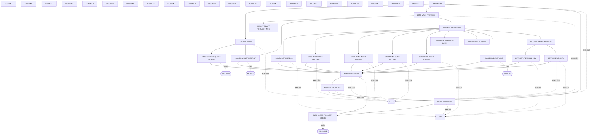

# COPAUA0C

**File**: `cbl/COPAUA0C.cbl`
**Type**: FileType.COBOL
**Analyzed**: 2026-04-21 13:50:53.550188

## Purpose

COPAUA0C is a CICS COBOL IMS MQ program that functions as a card authorization decision program. It likely receives authorization requests via MQ, processes them, and makes authorization decisions, potentially interacting with IMS and CICS resources. The program also includes routines for summarizing transaction data and terminating the application.

**Business Context**: Card authorization processing within the CardDemo application.

## Inputs

| Name | Type | Description |
|------|------|-------------|
| REQUEST-MQ | IOType.OTHER | Authorization requests received via MQ. The structure of the request is UNKNOWN. |

## Paragraphs/Procedures

### MAIN-PARA
> [Source: MAIN-PARA.cbl.md](COPAUA0C.cbl.d/MAIN-PARA.cbl.md)

```
MAIN-PARA  (4 statements, depth=1)
PARAGRAPH
├── PERFORM_THRU: PERFORM 1000-INITIALIZE    THRU 1000-EXIT
├── PERFORM_THRU: PERFORM 2000-MAIN-PROCESS  THRU 2000-EXIT
├── PERFORM_THRU: PERFORM 9000-TERMINATE     THRU 9000-EXIT
└── EXEC_CICS: EXEC CICS RETURN END-EXEC
```
This is the main control paragraph of the program. It orchestrates the initialization, main processing, and termination steps. It first performs 1000-INITIALIZE to set up the environment and open the necessary resources. Then, it performs 2000-MAIN-PROCESS to read and process authorization requests. Finally, it performs 9000-TERMINATE to close resources and clean up. After these steps, the program returns control to CICS.

### 1000-INITIALIZE
> [Source: 1000-INITIALIZE.cbl.md](COPAUA0C.cbl.d/1000-INITIALIZE.cbl.md)

```
1000-INITIALIZE  (7 statements, depth=2)
PARAGRAPH
├── EXEC_CICS: EXEC CICS RETRIEVE INTO(MQTM) NOHANDLE END-EXEC
├── IF: IF EIBRESP = DFHRESP(NORMAL)
│   ├── MOVE: MOVE MQTM-QNAME              TO WS-REQUEST-QNAME
│   └── MOVE: MOVE MQTM-TRIGGERDATA        TO WS-TRIGGER-DATA
├── MOVE: MOVE 5000                       TO WS-WAIT-INTERVAL
├── PERFORM_THRU: PERFORM 1100-OPEN-REQUEST-QUEUE THRU 1100-EXIT
└── PERFORM_THRU: PERFORM 3100-READ-REQUEST-MQ    THRU 3100-EXIT
```
This paragraph initializes the program environment. It retrieves the MQ trigger monitor data (MQTM) from CICS, which contains the MQ queue name and trigger data. It moves the queue name and trigger data to working storage. It sets the wait interval for MQGET to 5000. It then performs 1100-OPEN-REQUEST-QUEUE to open the MQ request queue and 3100-READ-REQUEST-MQ to read the first message from the queue. This paragraph prepares the program to begin processing authorization requests.

### 1000-EXIT
> [Source: 1000-EXIT.cbl.md](COPAUA0C.cbl.d/1000-EXIT.cbl.md)

```
1000-EXIT  (1 statements, depth=1)
PARAGRAPH
└── EXIT: EXIT
```
This paragraph serves as the exit point for the 1000-INITIALIZE paragraph. It simply contains an EXIT statement, allowing control to return to the calling paragraph (MAIN-PARA).

### 1100-OPEN-REQUEST-QUEUE
> [Source: 1100-OPEN-REQUEST-QUEUE.cbl.md](COPAUA0C.cbl.d/1100-OPEN-REQUEST-QUEUE.cbl.md)

```
1100-OPEN-REQUEST-QUEUE  (16 statements, depth=3)
PARAGRAPH
├── MOVE: MOVE MQOT-Q             TO MQOD-OBJECTTYPE OF MQM-OD-REQUEST
├── MOVE: MOVE WS-REQUEST-QNAME   TO MQOD-OBJECTNAME OF MQM-OD-REQUEST
├── COMPUTE: COMPUTE WS-OPTIONS = MQOO-INPUT-SHARED
├── CALL: CALL 'MQOPEN' USING W01-HCONN-REQUEST
MQM-OD-REQUEST
WS-OPTIONS
W01-HOBJ-REQUEST
WS-COMPCODE
WS-REASON
END-CALL
└── IF: IF WS-COMPCODE = MQCC-OK
    ├── SET: SET WS-REQUEST-MQ-OPEN TO TRUE
    └── ELSE: ELSE
        ├── MOVE: MOVE 'M001'          TO ERR-LOCATION
        ├── SET: SET  ERR-CRITICAL    TO TRUE
        ├── SET: SET  ERR-MQ          TO TRUE
        ├── MOVE: MOVE WS-COMPCODE     TO WS-CODE-DISPLAY
        ├── MOVE: MOVE WS-CODE-DISPLAY TO ERR-CODE-1
        ├── MOVE: MOVE WS-REASON       TO WS-CODE-DISPLAY
        ├── MOVE: MOVE WS-CODE-DISPLAY TO ERR-CODE-2
        ├── MOVE: MOVE 'REQ MQ OPEN ERROR'
TO ERR-MESSAGE
        └── PERFORM: PERFORM 9500-LOG-ERROR
```
This paragraph opens the MQ request queue for shared input. It moves the MQ queue type (MQOT-Q) to the MQ object descriptor (MQOD) and the request queue name (WS-REQUEST-QNAME) to the MQOD. It computes the options for MQOPEN, setting it to MQOO-INPUT-SHARED. It then calls the MQOPEN API to open the queue. If the MQOPEN call is successful, it sets the WS-REQUEST-MQ-OPEN flag to TRUE. If the call fails, it moves error information to error variables, sets the error flags, and calls 9500-LOG-ERROR to log the error.

### 1100-EXIT
> [Source: 1100-EXIT.cbl.md](COPAUA0C.cbl.d/1100-EXIT.cbl.md)

```
1100-EXIT  (1 statements, depth=1)
PARAGRAPH
└── EXIT: EXIT
```
This paragraph serves as the exit point for the 1100-OPEN-REQUEST-QUEUE paragraph. It simply contains an EXIT statement, allowing control to return to the calling paragraph (1000-INITIALIZE).

### 1200-SCHEDULE-PSB
> [Source: 1200-SCHEDULE-PSB.cbl.md](COPAUA0C.cbl.d/1200-SCHEDULE-PSB.cbl.md)

```
1200-SCHEDULE-PSB  (15 statements, depth=3)
PARAGRAPH
├── EXEC_DLI: EXEC DLI SCHD PSB((PSB-NAME)) NODHABEND END-EXEC
├── MOVE: MOVE DIBSTAT        TO IMS-RETURN-CODE
├── IF: IF PSB-SCHEDULED-MORE-THAN-ONCE
│   ├── EXEC_DLI: EXEC DLI TERM END-EXEC
│   ├── EXEC_DLI: EXEC DLI SCHD PSB((PSB-NAME)) NODHABEND END-EXEC
│   └── MOVE: MOVE DIBSTAT     TO IMS-RETURN-CODE
└── IF: IF STATUS-OK
    ├── SET: SET IMS-PSB-SCHD           TO TRUE
    └── ELSE: ELSE
        ├── MOVE: MOVE 'I001'                TO ERR-LOCATION
        ├── SET: SET  ERR-CRITICAL          TO TRUE
        ├── SET: SET  ERR-IMS               TO TRUE
        ├── MOVE: MOVE IMS-RETURN-CODE       TO ERR-CODE-1
        ├── MOVE: MOVE 'IMS SCHD FAILED'     TO ERR-MESSAGE
        └── PERFORM: PERFORM 9500-LOG-ERROR
```
This paragraph schedules the IMS PSB. It executes a DLI SCHD command to schedule the PSB specified by PSB-NAME. If the PSB has been scheduled more than once, it first issues a DLI TERM command to terminate the PSB and then issues another DLI SCHD command. It moves the DIBSTAT value to IMS-RETURN-CODE. If the status is OK, it sets the IMS-PSB-SCHD flag to TRUE. Otherwise, it moves error information to error variables, sets the error flags, and calls 9500-LOG-ERROR to log the error.

### 1200-EXIT
> [Source: 1200-EXIT.cbl.md](COPAUA0C.cbl.d/1200-EXIT.cbl.md)

```
1200-EXIT  (1 statements, depth=1)
PARAGRAPH
└── EXIT: EXIT
```
This paragraph serves as the exit point for the 1200-SCHEDULE-PSB paragraph. It simply contains an EXIT statement, allowing control to return to the calling paragraph.

### 2000-MAIN-PROCESS
> [Source: 2000-MAIN-PROCESS.cbl.md](COPAUA0C.cbl.d/2000-MAIN-PROCESS.cbl.md)

```
2000-MAIN-PROCESS  (10 statements, depth=4)
PARAGRAPH
└── PERFORM_INLINE: PERFORM UNTIL NO-MORE-MSG-AVAILABLE OR WS-LOOP-END
    ├── PERFORM_THRU: PERFORM 2100-EXTRACT-REQUEST-MSG THRU 2100-EXIT
    ├── PERFORM_THRU: PERFORM 5000-PROCESS-AUTH        THRU 5000-EXIT
    ├── ADD: ADD 1                            TO WS-MSG-PROCESSED
    ├── EXEC_CICS: EXEC CICS SYNCPOINT END-EXEC
    ├── SET: SET IMS-PSB-NOT-SCHD            TO TRUE
    └── IF: IF WS-MSG-PROCESSED > WS-REQSTS-PROCESS-LIMIT
        ├── SET: SET  WS-LOOP-END             TO TRUE
        └── ELSE: ELSE
            └── PERFORM_THRU: PERFORM 3100-READ-REQUEST-MQ THRU 3100-EXIT
```
This paragraph is the main processing loop of the program. It repeatedly performs 2100-EXTRACT-REQUEST-MSG and 5000-PROCESS-AUTH until either there are no more messages available (NO-MORE-MSG-AVAILABLE is TRUE) or the loop is ended (WS-LOOP-END is TRUE). After processing each message, it increments WS-MSG-PROCESSED and issues a CICS SYNCPOINT. It then sets IMS-PSB-NOT-SCHD to TRUE. If the number of messages processed (WS-MSG-PROCESSED) exceeds the request processing limit (WS-REQSTS-PROCESS-LIMIT), it sets WS-LOOP-END to TRUE; otherwise, it performs 3100-READ-REQUEST-MQ to read the next message from the queue.

### 2000-EXIT
> [Source: 2000-EXIT.cbl.md](COPAUA0C.cbl.d/2000-EXIT.cbl.md)

```
2000-EXIT  (1 statements, depth=1)
PARAGRAPH
└── EXIT: EXIT
```
This paragraph serves as the exit point for the 2000-MAIN-PROCESS paragraph. It simply contains an EXIT statement, allowing control to return to the calling paragraph (MAIN-PARA).

### 2100-EXTRACT-REQUEST-MSG
> [Source: 2100-EXTRACT-REQUEST-MSG.cbl.md](COPAUA0C.cbl.d/2100-EXTRACT-REQUEST-MSG.cbl.md)

```
2100-EXTRACT-REQUEST-MSG  (3 statements, depth=1)
PARAGRAPH
├── UNSTRING: UNSTRING W01-GET-BUFFER(1:W01-DATALEN)
DELIMITED BY ','
INTO PA-RQ-AUTH-DATE
PA-RQ-AUTH-TIME
PA-RQ-CARD-NUM
PA-RQ-AUTH-TYPE
PA-RQ-CARD-EXPIRY-DATE
PA-RQ-MESSAGE-TYPE
PA-RQ-MESSAGE-SOURCE
PA-RQ-PROCESSING-CODE
WS-TRANSACTION-AMT-AN
PA-RQ-MERCHANT-CATAGORY-CODE
PA-RQ-ACQR-COUNTRY-CODE
PA-RQ-POS-ENTRY-MODE
PA-RQ-MERCHANT-ID
PA-RQ-MERCHANT-NAME
PA-RQ-MERCHANT-CITY
PA-RQ-MERCHANT-STATE
PA-RQ-MERCHANT-ZIP
PA-RQ-TRANSACTION-ID
END-UNSTRING
├── COMPUTE: COMPUTE PA-RQ-TRANSACTION-AMT =
FUNCTION NUMVAL(WS-TRANSACTION-AMT-AN)
└── MOVE: MOVE PA-RQ-TRANSACTION-AMT  TO WS-TRANSACTION-AMT
```
This paragraph extracts the authorization request message from the MQ message buffer (W01-GET-BUFFER). It uses the UNSTRING statement to parse the comma-delimited message into individual fields such as authorization date, time, card number, authorization type, and transaction amount. The alphanumeric transaction amount (WS-TRANSACTION-AMT-AN) is converted to a numeric value (PA-RQ-TRANSACTION-AMT) using the NUMVAL function. The numeric transaction amount is then moved to WS-TRANSACTION-AMT. The extracted fields are used in subsequent processing steps to validate the transaction and update account information. No error handling is performed within this paragraph; errors in the MQ message are assumed to be handled elsewhere. This paragraph does not call any other paragraphs.

### 2100-EXIT
> [Source: 2100-EXIT.cbl.md](COPAUA0C.cbl.d/2100-EXIT.cbl.md)

```
2100-EXIT  (1 statements, depth=1)
PARAGRAPH
└── EXIT: EXIT
```
This paragraph simply provides an exit point for the 2100-EXTRACT-REQUEST-MSG paragraph. It contains only the EXIT statement and serves as a standard COBOL paragraph exit. It does not perform any processing or error handling. It is called by the THRU option in PERFORM statements. It does not consume any inputs or produce any outputs.

### 3100-READ-REQUEST-MQ
> [Source: 3100-READ-REQUEST-MQ.cbl.md](COPAUA0C.cbl.d/3100-READ-REQUEST-MQ.cbl.md)

```
3100-READ-REQUEST-MQ  (24 statements, depth=5)
PARAGRAPH
├── COMPUTE: COMPUTE MQGMO-OPTIONS  =  MQGMO-NO-SYNCPOINT + MQGMO-WAIT
+  MQGMO-CONVERT
+  MQGMO-FAIL-IF-QUIESCING
├── MOVE: MOVE WS-WAIT-INTERVAL      TO MQGMO-WAITINTERVAL
├── MOVE: MOVE MQMI-NONE             TO MQMD-MSGID    OF MQM-MD-REQUEST
├── MOVE: MOVE MQCI-NONE             TO MQMD-CORRELID OF MQM-MD-REQUEST
├── MOVE: MOVE MQFMT-STRING          TO MQMD-FORMAT   OF MQM-MD-REQUEST
├── MOVE: MOVE LENGTH OF W01-GET-BUFFER TO W01-BUFFLEN
├── CALL: CALL 'MQGET' USING W01-HCONN-REQUEST
W01-HOBJ-REQUEST
MQM-MD-REQUEST
MQM-GET-MESSAGE-OPTIONS
W01-BUFFLEN
W01-GET-BUFFER
W01-DATALEN
WS-COMPCODE
WS-REASON
END-CALL
└── IF: IF WS-COMPCODE = MQCC-OK
    ├── MOVE: MOVE MQMD-CORRELID OF MQM-MD-REQUEST
TO WS-SAVE-CORRELID
    ├── MOVE: MOVE MQMD-REPLYTOQ OF MQM-MD-REQUEST
TO WS-REPLY-QNAME
    └── ELSE: ELSE
        └── IF: IF WS-REASON = MQRC-NO-MSG-AVAILABLE
            ├── SET: SET NO-MORE-MSG-AVAILABLE TO TRUE
            └── ELSE: ELSE
                ├── MOVE: MOVE 'M003'                TO ERR-LOCATION
                ├── SET: SET  ERR-CRITICAL          TO TRUE
                ├── SET: SET  ERR-CICS              TO TRUE
                ├── MOVE: MOVE WS-COMPCODE           TO WS-CODE-DISPLAY
                ├── MOVE: MOVE WS-CODE-DISPLAY       TO ERR-CODE-1
                ├── MOVE: MOVE WS-REASON             TO WS-CODE-DISPLAY
                ├── MOVE: MOVE WS-CODE-DISPLAY       TO ERR-CODE-2
                ├── MOVE: MOVE 'FAILED TO READ REQUEST MQ'
TO ERR-MESSAGE
                ├── MOVE: MOVE PA-CARD-NUM           TO ERR-EVENT-KEY
                └── PERFORM: PERFORM 9500-LOG-ERROR
```
This paragraph reads the authorization request message from the MQ queue. It sets the MQGMO options for message retrieval, including no sync point, wait, convert, and fail if quiescing. It moves the wait interval to MQGMO-WAITINTERVAL. It initializes the MQMD message descriptor with default values. It then calls the MQGET API to retrieve the message from the queue, passing the connection handle, object handle, message descriptor, get message options, buffer length, buffer, data length, completion code, and reason code. If the MQGET call is successful (WS-COMPCODE = MQCC-OK), it saves the correlation ID and reply queue name from the MQMD. If the call fails, it checks if the reason code is MQRC-NO-MSG-AVAILABLE, and if so, sets the NO-MORE-MSG-AVAILABLE flag to TRUE. Otherwise, it logs an error message with location 'M003', sets error flags, moves the completion code and reason code to the error codes, and calls the 9500-LOG-ERROR paragraph. The input is the MQ queue, and the output is the message in W01-GET-BUFFER, or an error log entry.

### 3100-EXIT
> [Source: 3100-EXIT.cbl.md](COPAUA0C.cbl.d/3100-EXIT.cbl.md)

```
3100-EXIT  (1 statements, depth=1)
PARAGRAPH
└── EXIT: EXIT
```
This paragraph provides an exit point for the 3100-READ-REQUEST-MQ paragraph. It contains only the EXIT statement and serves as a standard COBOL paragraph exit. It does not perform any processing or error handling. It is called by the THRU option in PERFORM statements. It does not consume any inputs or produce any outputs.

### 5000-PROCESS-AUTH
> [Source: 5000-PROCESS-AUTH.cbl.md](COPAUA0C.cbl.d/5000-PROCESS-AUTH.cbl.md)

```
5000-PROCESS-AUTH  (14 statements, depth=2)
PARAGRAPH
├── SET: SET APPROVE-AUTH                  TO TRUE
├── PERFORM_THRU: PERFORM 1200-SCHEDULE-PSB         THRU 1200-EXIT
├── SET: SET CARD-FOUND-XREF               TO TRUE
├── SET: SET FOUND-ACCT-IN-MSTR            TO TRUE
├── PERFORM_THRU: PERFORM 5100-READ-XREF-RECORD     THRU 5100-EXIT
├── IF: IF CARD-FOUND-XREF
│   ├── PERFORM_THRU: PERFORM 5200-READ-ACCT-RECORD  THRU 5200-EXIT
│   ├── PERFORM_THRU: PERFORM 5300-READ-CUST-RECORD  THRU 5300-EXIT
│   ├── PERFORM_THRU: PERFORM 5500-READ-AUTH-SUMMRY  THRU 5500-EXIT
│   └── PERFORM_THRU: PERFORM 5600-READ-PROFILE-DATA THRU 5600-EXIT
├── PERFORM_THRU: PERFORM 6000-MAKE-DECISION        THRU 6000-EXIT
├── PERFORM_THRU: PERFORM 7100-SEND-RESPONSE        THRU 7100-EXIT
└── IF: IF CARD-FOUND-XREF
    └── PERFORM_THRU: PERFORM 8000-WRITE-AUTH-TO-DB  THRU 8000-EXIT
```
This paragraph orchestrates the authorization process. It starts by setting APPROVE-AUTH to TRUE and scheduling a PSB. It then sets flags indicating that the card and account are found in the cross-reference and master files, respectively. It performs paragraphs to read the card cross-reference record, account record, customer record, authorization summary, and profile data, conditionally executing the latter four paragraphs only if the card is found in the cross-reference file. After retrieving the necessary data, it performs paragraphs to make an authorization decision and send a response. Finally, if the card is found in the cross-reference file, it performs a paragraph to write the authorization to the database. The inputs are the card number and related data from the MQ message, and the outputs are the authorization decision and the updated account information in the database. The paragraph calls several other paragraphs to perform specific tasks within the authorization process.

### 5000-EXIT
> [Source: 5000-EXIT.cbl.md](COPAUA0C.cbl.d/5000-EXIT.cbl.md)

```
5000-EXIT  (1 statements, depth=1)
PARAGRAPH
└── EXIT: EXIT
```
This paragraph provides an exit point for the 5000-PROCESS-AUTH paragraph. It contains only the EXIT statement and serves as a standard COBOL paragraph exit. It does not perform any processing or error handling. It is called by the THRU option in PERFORM statements. It does not consume any inputs or produce any outputs.

### 5100-READ-XREF-RECORD
> [Source: 5100-READ-XREF-RECORD.cbl.md](COPAUA0C.cbl.d/5100-READ-XREF-RECORD.cbl.md)

```
5100-READ-XREF-RECORD  (25 statements, depth=3)
PARAGRAPH
├── MOVE: MOVE PA-RQ-CARD-NUM           TO XREF-CARD-NUM
├── EXEC_CICS: EXEC CICS READ DATASET   (WS-CCXREF-FILE) INTO      (CARD-XREF-RECORD) LENGTH    (LENGTH OF CARD-XREF-RECORD) RIDFLD    (XREF-CARD-NUM) KEYLENGTH (LENGTH OF XREF-CARD-NUM) RESP      (WS-RESP-CD) RESP2     (WS-REAS-CD) END-EXEC
└── EVALUATE: EVALUATE WS-RESP-CD
    ├── WHEN: WHEN DFHRESP(NORMAL)
    │   └── SET: SET  CARD-FOUND-XREF  TO TRUE
    ├── WHEN: WHEN DFHRESP(NOTFND)
    │   ├── SET: SET  CARD-NFOUND-XREF TO TRUE
    │   ├── SET: SET  NFOUND-ACCT-IN-MSTR TO TRUE
    │   ├── MOVE: MOVE 'A001'          TO ERR-LOCATION
    │   ├── SET: SET  ERR-WARNING     TO TRUE
    │   ├── SET: SET  ERR-APP         TO TRUE
    │   ├── MOVE: MOVE 'CARD NOT FOUND IN XREF'
TO ERR-MESSAGE
    │   ├── MOVE: MOVE XREF-CARD-NUM   TO ERR-EVENT-KEY
    │   └── PERFORM: PERFORM 9500-LOG-ERROR
    └── WHEN: WHEN OTHER
        ├── MOVE: MOVE 'C001'          TO ERR-LOCATION
        ├── SET: SET  ERR-CRITICAL    TO TRUE
        ├── SET: SET  ERR-CICS        TO TRUE
        ├── MOVE: MOVE WS-RESP-CD      TO WS-CODE-DISPLAY
        ├── MOVE: MOVE WS-CODE-DISPLAY TO ERR-CODE-1
        ├── MOVE: MOVE WS-REAS-CD      TO WS-CODE-DISPLAY
        ├── MOVE: MOVE WS-CODE-DISPLAY TO ERR-CODE-2
        ├── MOVE: MOVE 'FAILED TO READ XREF FILE'
TO ERR-MESSAGE
        ├── MOVE: MOVE XREF-CARD-NUM   TO ERR-EVENT-KEY
        └── PERFORM: PERFORM 9500-LOG-ERROR
```
This paragraph reads the card cross-reference record from the WS-CCXREF-FILE using the card number (PA-RQ-CARD-NUM) as the key. It moves the card number to XREF-CARD-NUM and then executes a CICS READ command to retrieve the CARD-XREF-RECORD. The CICS READ command uses WS-CCXREF-FILE as the dataset name, CARD-XREF-RECORD as the INTO area, and XREF-CARD-NUM as the RIDFLD. The paragraph checks the CICS response code (WS-RESP-CD) to determine the outcome of the read operation. If the response is NORMAL, it sets CARD-FOUND-XREF to TRUE. If the response is NOTFND, it sets CARD-NFOUND-XREF and NFOUND-ACCT-IN-MSTR to TRUE, logs a warning message with location 'A001', and calls the 9500-LOG-ERROR paragraph. If the response is OTHER, it logs a critical error message with location 'C001', sets error flags, moves the response and reason codes to the error codes, and calls the 9500-LOG-ERROR paragraph. The input is the card number, and the output is the card cross-reference record or an error log entry.

### 5100-EXIT
> [Source: 5100-EXIT.cbl.md](COPAUA0C.cbl.d/5100-EXIT.cbl.md)

```
5100-EXIT  (1 statements, depth=1)
PARAGRAPH
└── EXIT: EXIT
```
This paragraph provides an exit point for the 5100-READ-XREF-RECORD paragraph. It contains only the EXIT statement and serves as a standard COBOL paragraph exit. It does not perform any processing or error handling. It is called by the THRU option in PERFORM statements. It does not consume any inputs or produce any outputs.

### 5200-READ-ACCT-RECORD
> [Source: 5200-READ-ACCT-RECORD.cbl.md](COPAUA0C.cbl.d/5200-READ-ACCT-RECORD.cbl.md)

```
5200-READ-ACCT-RECORD  (24 statements, depth=3)
PARAGRAPH
├── MOVE: MOVE XREF-ACCT-ID          TO WS-CARD-RID-ACCT-ID
├── EXEC_CICS: EXEC CICS READ DATASET   (WS-ACCTFILENAME) RIDFLD    (WS-CARD-RID-ACCT-ID-X) KEYLENGTH (LENGTH OF WS-CARD-RID-ACCT-ID-X) INTO      (ACCOUNT-RECORD) LENGTH    (LENGTH OF ACCOUNT-RECORD) RESP      (WS-RESP-CD) RESP2     (WS-REAS-CD) END-EXEC
└── EVALUATE: EVALUATE WS-RESP-CD
    ├── WHEN: WHEN DFHRESP(NORMAL)
    │   └── SET: SET FOUND-ACCT-IN-MSTR     TO TRUE
    ├── WHEN: WHEN DFHRESP(NOTFND)
    │   ├── SET: SET NFOUND-ACCT-IN-MSTR    TO TRUE
    │   ├── MOVE: MOVE 'A002'                TO ERR-LOCATION
    │   ├── SET: SET  ERR-WARNING           TO TRUE
    │   ├── SET: SET  ERR-APP               TO TRUE
    │   ├── MOVE: MOVE 'ACCT NOT FOUND IN XREF'
TO ERR-MESSAGE
    │   ├── MOVE: MOVE WS-CARD-RID-ACCT-ID-X TO ERR-EVENT-KEY
    │   └── PERFORM: PERFORM 9500-LOG-ERROR
    └── WHEN: WHEN OTHER
        ├── MOVE: MOVE 'C002'                TO ERR-LOCATION
        ├── SET: SET  ERR-CRITICAL          TO TRUE
        ├── SET: SET  ERR-CICS              TO TRUE
        ├── MOVE: MOVE WS-RESP-CD            TO WS-CODE-DISPLAY
        ├── MOVE: MOVE WS-CODE-DISPLAY       TO ERR-CODE-1
        ├── MOVE: MOVE WS-REAS-CD            TO WS-CODE-DISPLAY
        ├── MOVE: MOVE WS-CODE-DISPLAY       TO ERR-CODE-2
        ├── MOVE: MOVE 'FAILED TO READ ACCT FILE'
TO ERR-MESSAGE
        ├── MOVE: MOVE WS-CARD-RID-ACCT-ID-X TO ERR-EVENT-KEY
        └── PERFORM: PERFORM 9500-LOG-ERROR
```
This paragraph reads the account record from the WS-ACCTFILENAME using the account ID (XREF-ACCT-ID) obtained from the card cross-reference record. It moves the account ID to WS-CARD-RID-ACCT-ID and then executes a CICS READ command to retrieve the ACCOUNT-RECORD. The CICS READ command uses WS-ACCTFILENAME as the dataset name, ACCOUNT-RECORD as the INTO area, and WS-CARD-RID-ACCT-ID-X as the RIDFLD. The paragraph checks the CICS response code (WS-RESP-CD) to determine the outcome of the read operation. If the response is NORMAL, it sets FOUND-ACCT-IN-MSTR to TRUE. If the response is NOTFND, it sets NFOUND-ACCT-IN-MSTR to TRUE, logs a warning message with location 'A002', and calls the 9500-LOG-ERROR paragraph. If the response is OTHER, it logs a critical error message with location 'C002', sets error flags, moves the response and reason codes to the error codes, and calls the 9500-LOG-ERROR paragraph. The input is the account ID, and the output is the account record or an error log entry.

### 5200-EXIT
> [Source: 5200-EXIT.cbl.md](COPAUA0C.cbl.d/5200-EXIT.cbl.md)

```
5200-EXIT  (1 statements, depth=1)
PARAGRAPH
└── EXIT: EXIT
```
This paragraph provides an exit point for the 5200-READ-ACCT-RECORD paragraph. It contains only the EXIT statement and serves as a standard COBOL paragraph exit. It does not perform any processing or error handling. It is called by the THRU option in PERFORM statements. It is called by the THRU option in PERFORM statements. It does not consume any inputs or produce any outputs.

### 5300-READ-CUST-RECORD
> [Source: 5300-READ-CUST-RECORD.cbl.md](COPAUA0C.cbl.d/5300-READ-CUST-RECORD.cbl.md)

```
5300-READ-CUST-RECORD  (24 statements, depth=3)
PARAGRAPH
├── MOVE: MOVE XREF-CUST-ID                 TO WS-CARD-RID-CUST-ID
├── EXEC_CICS: EXEC CICS READ DATASET   (WS-CUSTFILENAME) RIDFLD    (WS-CARD-RID-CUST-ID-X) KEYLENGTH (LENGTH OF WS-CARD-RID-CUST-ID-X) INTO      (CUSTOMER-RECORD) LENGTH    (LENGTH OF CUSTOMER-RECORD) RESP      (WS-RESP-CD) RESP2     (WS-REAS-CD) END-EXEC
└── EVALUATE: EVALUATE WS-RESP-CD
    ├── WHEN: WHEN DFHRESP(NORMAL)
    │   └── SET: SET FOUND-CUST-IN-MSTR     TO TRUE
    ├── WHEN: WHEN DFHRESP(NOTFND)
    │   ├── SET: SET NFOUND-CUST-IN-MSTR    TO TRUE
    │   ├── MOVE: MOVE 'A003'                TO ERR-LOCATION
    │   ├── SET: SET  ERR-WARNING           TO TRUE
    │   ├── SET: SET  ERR-APP               TO TRUE
    │   ├── MOVE: MOVE 'CUST NOT FOUND IN XREF'
TO ERR-MESSAGE
    │   ├── MOVE: MOVE WS-CARD-RID-CUST-ID   TO ERR-EVENT-KEY
    │   └── PERFORM: PERFORM 9500-LOG-ERROR
    └── WHEN: WHEN OTHER
        ├── MOVE: MOVE 'C003'                TO ERR-LOCATION
        ├── SET: SET  ERR-CRITICAL          TO TRUE
        ├── SET: SET  ERR-CICS              TO TRUE
        ├── MOVE: MOVE WS-RESP-CD            TO WS-CODE-DISPLAY
        ├── MOVE: MOVE WS-CODE-DISPLAY       TO ERR-CODE-1
        ├── MOVE: MOVE WS-REAS-CD            TO WS-CODE-DISPLAY
        ├── MOVE: MOVE WS-CODE-DISPLAY       TO ERR-CODE-2
        ├── MOVE: MOVE 'FAILED TO READ CUST FILE'
TO ERR-MESSAGE
        ├── MOVE: MOVE WS-CARD-RID-CUST-ID   TO ERR-EVENT-KEY
        └── PERFORM: PERFORM 9500-LOG-ERROR
```
This paragraph reads a customer record from the VSAM file identified by WS-CUSTFILENAME. It uses the XREF-CUST-ID to build the key (WS-CARD-RID-CUST-ID) for the READ command. The paragraph checks the CICS response code (WS-RESP-CD) to determine if the read was successful. If the record is found (NORMAL), it sets FOUND-CUST-IN-MSTR to TRUE. If the record is not found (NOTFND), it sets NFOUND-CUST-IN-MSTR to TRUE, logs an error message to the error log, and sets error flags. If any other error occurs during the read, it logs a critical error message including the CICS response and reason codes to the error log. It calls 9500-LOG-ERROR to log errors.

### 5300-EXIT
> [Source: 5300-EXIT.cbl.md](COPAUA0C.cbl.d/5300-EXIT.cbl.md)

```
5300-EXIT  (1 statements, depth=1)
PARAGRAPH
└── EXIT: EXIT
```
This paragraph serves as the exit point for the 5300-READ-CUST-RECORD paragraph. It contains only the EXIT statement, which returns control to the calling paragraph.

### 5500-READ-AUTH-SUMMRY
> [Source: 5500-READ-AUTH-SUMMRY.cbl.md](COPAUA0C.cbl.d/5500-READ-AUTH-SUMMRY.cbl.md)

```
5500-READ-AUTH-SUMMRY  (16 statements, depth=3)
PARAGRAPH
├── MOVE: MOVE XREF-ACCT-ID                    TO PA-ACCT-ID
├── EXEC_DLI: EXEC DLI GU USING PCB(PAUT-PCB-NUM) SEGMENT (PAUTSUM0) INTO (PENDING-AUTH-SUMMARY) WHERE (ACCNTID = PA-ACCT-ID) END-EXEC
├── MOVE: MOVE DIBSTAT                          TO IMS-RETURN-CODE
└── EVALUATE: EVALUATE TRUE
    ├── WHEN: WHEN STATUS-OK
    │   └── SET: SET FOUND-PAUT-SMRY-SEG        TO TRUE
    ├── WHEN: WHEN SEGMENT-NOT-FOUND
    │   └── SET: SET NFOUND-PAUT-SMRY-SEG       TO TRUE
    └── WHEN: WHEN OTHER
        ├── MOVE: MOVE 'I002'                    TO ERR-LOCATION
        ├── SET: SET  ERR-CRITICAL              TO TRUE
        ├── SET: SET  ERR-IMS                   TO TRUE
        ├── MOVE: MOVE IMS-RETURN-CODE           TO ERR-CODE-1
        ├── MOVE: MOVE 'IMS GET SUMMARY FAILED'  TO ERR-MESSAGE
        ├── MOVE: MOVE PA-CARD-NUM               TO ERR-EVENT-KEY
        └── PERFORM: PERFORM 9500-LOG-ERROR
```
This paragraph reads the pending authorization summary from the IMS database. It uses the XREF-ACCT-ID to build the key (PA-ACCT-ID) for the IMS GET UNIQUE (GU) call. The paragraph checks the IMS return code (DIBSTAT) to determine if the read was successful. If the segment is found (STATUS-OK), it sets FOUND-PAUT-SMRY-SEG to TRUE. If the segment is not found (SEGMENT-NOT-FOUND), it sets NFOUND-PAUT-SMRY-SEG to TRUE. If any other error occurs during the read, it logs a critical error message including the IMS return code to the error log. It calls 9500-LOG-ERROR to log errors.

### 5500-EXIT
> [Source: 5500-EXIT.cbl.md](COPAUA0C.cbl.d/5500-EXIT.cbl.md)

```
5500-EXIT  (1 statements, depth=1)
PARAGRAPH
└── EXIT: EXIT
```
This paragraph serves as the exit point for the 5500-READ-AUTH-SUMMRY paragraph. It contains only the EXIT statement, which returns control to the calling paragraph.

### 5600-READ-PROFILE-DATA
> [Source: 5600-READ-PROFILE-DATA.cbl.md](COPAUA0C.cbl.d/5600-READ-PROFILE-DATA.cbl.md)

```
5600-READ-PROFILE-DATA  (1 statements, depth=1)
PARAGRAPH
└── CONTINUE: CONTINUE
```
This paragraph is a placeholder and currently contains only a CONTINUE statement. It does not perform any data retrieval or processing. It might be intended for future use to read profile data, but is currently not implemented.

### 5600-EXIT
> [Source: 5600-EXIT.cbl.md](COPAUA0C.cbl.d/5600-EXIT.cbl.md)

```
5600-EXIT  (1 statements, depth=1)
PARAGRAPH
└── EXIT: EXIT
```
This paragraph serves as the exit point for the 5600-READ-PROFILE-DATA paragraph. It contains only the EXIT statement, which returns control to the calling paragraph.

### 6000-MAKE-DECISION
> [Source: 6000-MAKE-DECISION.cbl.md](COPAUA0C.cbl.d/6000-MAKE-DECISION.cbl.md)

```
6000-MAKE-DECISION  (45 statements, depth=5)
PARAGRAPH
├── MOVE: MOVE PA-RQ-CARD-NUM         TO PA-RL-CARD-NUM
├── MOVE: MOVE PA-RQ-TRANSACTION-ID   TO PA-RL-TRANSACTION-ID
├── MOVE: MOVE PA-RQ-AUTH-TIME        TO PA-RL-AUTH-ID-CODE
├── IF: IF FOUND-PAUT-SMRY-SEG
│   ├── COMPUTE: COMPUTE WS-AVAILABLE-AMT = PA-CREDIT-LIMIT
- PA-CREDIT-BALANCE
│   ├── IF: IF WS-TRANSACTION-AMT > WS-AVAILABLE-AMT
│   │   ├── SET: SET DECLINE-AUTH      TO TRUE
│   │   └── SET: SET INSUFFICIENT-FUND TO TRUE
│   └── ELSE: ELSE
│       └── IF: IF FOUND-ACCT-IN-MSTR
│           ├── COMPUTE: COMPUTE WS-AVAILABLE-AMT = ACCT-CREDIT-LIMIT
- ACCT-CURR-BAL
│           ├── IF: IF WS-TRANSACTION-AMT > WS-AVAILABLE-AMT
│           │   ├── SET: SET DECLINE-AUTH      TO TRUE
│           │   └── SET: SET INSUFFICIENT-FUND TO TRUE
│           └── ELSE: ELSE
│               └── SET: SET DECLINE-AUTH         TO TRUE
├── IF: IF DECLINE-AUTH
│   ├── SET: SET  AUTH-RESP-DECLINED     TO TRUE
│   ├── MOVE: MOVE '05'                   TO PA-RL-AUTH-RESP-CODE
│   ├── MOVE: MOVE 0                      TO PA-RL-APPROVED-AMT
WS-APPROVED-AMT
│   └── ELSE: ELSE
│       ├── SET: SET  AUTH-RESP-APPROVED     TO TRUE
│       ├── MOVE: MOVE '00'                   TO PA-RL-AUTH-RESP-CODE
│       └── MOVE: MOVE PA-RQ-TRANSACTION-AMT  TO PA-RL-APPROVED-AMT
WS-APPROVED-AMT
├── MOVE: MOVE '0000'                    TO PA-RL-AUTH-RESP-REASON
├── IF: IF AUTH-RESP-DECLINED
│   └── EVALUATE: EVALUATE TRUE
│       ├── WHEN: WHEN CARD-NFOUND-XREF
│       ├── WHEN: WHEN NFOUND-ACCT-IN-MSTR
│       ├── WHEN: WHEN NFOUND-CUST-IN-MSTR
│       │   └── MOVE: MOVE '3100'         TO PA-RL-AUTH-RESP-REASON
│       ├── WHEN: WHEN INSUFFICIENT-FUND
│       │   └── MOVE: MOVE '4100'         TO PA-RL-AUTH-RESP-REASON
│       ├── WHEN: WHEN CARD-NOT-ACTIVE
│       │   └── MOVE: MOVE '4200'         TO PA-RL-AUTH-RESP-REASON
│       ├── WHEN: WHEN ACCOUNT-CLOSED
│       │   └── MOVE: MOVE '4300'         TO PA-RL-AUTH-RESP-REASON
│       ├── WHEN: WHEN CARD-FRAUD
│       │   └── MOVE: MOVE '5100'         TO PA-RL-AUTH-RESP-REASON
│       ├── WHEN: WHEN MERCHANT-FRAUD
│       │   └── MOVE: MOVE '5200'         TO PA-RL-AUTH-RESP-REASON
│       └── WHEN: WHEN OTHER
│           └── MOVE: MOVE '9000'         TO PA-RL-AUTH-RESP-REASON
├── MOVE: MOVE WS-APPROVED-AMT        TO WS-APPROVED-AMT-DIS
└── STRING: STRING PA-RL-CARD-NUM         ','
PA-RL-TRANSACTION-ID   ','
PA-RL-AUTH-ID-CODE     ','
PA-RL-AUTH-RESP-CODE   ','
PA-RL-AUTH-RESP-REASON ','
WS-APPROVED-AMT-DIS    ','
DELIMITED BY SIZE
INTO W02-PUT-BUFFER
WITH POINTER WS-RESP-LENGTH
END-STRING
```
This paragraph determines whether to approve or decline the authorization request. It first moves the request data (card number, transaction ID, and authorization time) to the reply fields. It then checks if a pending authorization summary was found. If so, it calculates the available amount by subtracting the credit balance from the credit limit. If the transaction amount exceeds the available amount, the authorization is declined and INSUFFICIENT-FUND is set to TRUE. If no pending authorization summary is found, it checks if the account is found in the customer master file and performs the same calculation. If neither the summary nor the account is found, the authorization is declined. If the authorization is declined, it sets the AUTH-RESP-DECLINED flag and sets the authorization response code to '05' and the approved amount to 0. Otherwise, it sets the AUTH-RESP-APPROVED flag, sets the authorization response code to '00', and sets the approved amount to the transaction amount. Finally, it sets the authorization response reason code based on various conditions such as card not found, insufficient funds, card not active, account closed, or fraud. It then formats the response data into W02-PUT-BUFFER for sending via MQ.

### 6000-EXIT
> [Source: 6000-EXIT.cbl.md](COPAUA0C.cbl.d/6000-EXIT.cbl.md)

```
6000-EXIT  (1 statements, depth=1)
PARAGRAPH
└── EXIT: EXIT
```
This paragraph serves as the exit point for the 6000-MAKE-DECISION paragraph. It contains only the EXIT statement, which returns control to the calling paragraph.

### 7100-SEND-RESPONSE
> [Source: 7100-SEND-RESPONSE.cbl.md](COPAUA0C.cbl.d/7100-SEND-RESPONSE.cbl.md)

```
7100-SEND-RESPONSE  (24 statements, depth=2)
PARAGRAPH
├── MOVE: MOVE MQOT-Q               TO MQOD-OBJECTTYPE OF MQM-OD-REPLY
├── MOVE: MOVE WS-REPLY-QNAME       TO MQOD-OBJECTNAME OF MQM-OD-REPLY
├── MOVE: MOVE MQMT-REPLY           TO MQMD-MSGTYPE     OF MQM-MD-REPLY
├── MOVE: MOVE WS-SAVE-CORRELID     TO MQMD-CORRELID    OF MQM-MD-REPLY
├── MOVE: MOVE MQMI-NONE            TO MQMD-MSGID       OF MQM-MD-REPLY
├── MOVE: MOVE SPACES               TO MQMD-REPLYTOQ    OF MQM-MD-REPLY
├── MOVE: MOVE SPACES               TO MQMD-REPLYTOQMGR OF MQM-MD-REPLY
├── MOVE: MOVE MQPER-NOT-PERSISTENT TO MQMD-PERSISTENCE OF MQM-MD-REPLY
├── MOVE: MOVE 50                   TO MQMD-EXPIRY      OF MQM-MD-REPLY
├── MOVE: MOVE MQFMT-STRING         TO MQMD-FORMAT      OF MQM-MD-REPLY
├── COMPUTE: COMPUTE MQPMO-OPTIONS     =  MQPMO-NO-SYNCPOINT +
MQPMO-DEFAULT-CONTEXT
├── MOVE: MOVE WS-RESP-LENGTH       TO W02-BUFFLEN
├── CALL: CALL 'MQPUT1' USING W02-HCONN-REPLY
MQM-OD-REPLY
MQM-MD-REPLY
MQM-PUT-MESSAGE-OPTIONS
W02-BUFFLEN
W02-PUT-BUFFER
WS-COMPCODE
WS-REASON
END-CALL
└── IF: IF WS-COMPCODE NOT = MQCC-OK
    ├── MOVE: MOVE 'M004'                TO ERR-LOCATION
    ├── SET: SET  ERR-CRITICAL          TO TRUE
    ├── SET: SET  ERR-MQ                TO TRUE
    ├── MOVE: MOVE WS-COMPCODE           TO WS-CODE-DISPLAY
    ├── MOVE: MOVE WS-CODE-DISPLAY       TO ERR-CODE-1
    ├── MOVE: MOVE WS-REASON             TO WS-CODE-DISPLAY
    ├── MOVE: MOVE WS-CODE-DISPLAY       TO ERR-CODE-2
    ├── MOVE: MOVE 'FAILED TO PUT ON REPLY MQ'
TO ERR-MESSAGE
    ├── MOVE: MOVE PA-CARD-NUM           TO ERR-EVENT-KEY
    └── PERFORM: PERFORM 9500-LOG-ERROR
```
This paragraph sends the authorization response message to the reply queue using MQ. It sets the MQ object type and object name in the MQ object descriptor (MQM-OD-REPLY). It sets the message type, correlation ID, message ID, reply-to queue, reply-to queue manager, persistence, expiry, and format in the MQ message descriptor (MQM-MD-REPLY). It sets the MQPMO-OPTIONS for no syncpoint and default context. It then calls the MQPUT1 API to send the message. If the MQPUT1 call fails, it logs a critical error message including the completion code and reason code to the error log. It calls 9500-LOG-ERROR to log errors.

### 7100-EXIT
> [Source: 7100-EXIT.cbl.md](COPAUA0C.cbl.d/7100-EXIT.cbl.md)

```
7100-EXIT  (1 statements, depth=1)
PARAGRAPH
└── EXIT: EXIT
```
This paragraph serves as the exit point for the 7100-SEND-RESPONSE paragraph. It contains only the EXIT statement, which returns control to the calling paragraph.

### 8000-WRITE-AUTH-TO-DB
> [Source: 8000-WRITE-AUTH-TO-DB.cbl.md](COPAUA0C.cbl.d/8000-WRITE-AUTH-TO-DB.cbl.md)

```
8000-WRITE-AUTH-TO-DB  (2 statements, depth=1)
PARAGRAPH
├── PERFORM_THRU: PERFORM 8400-UPDATE-SUMMARY      THRU 8400-EXIT
└── PERFORM_THRU: PERFORM 8500-INSERT-AUTH         THRU 8500-EXIT
```
This paragraph serves as a high-level routine to update the pending authorization summary and insert the authorization details into the IMS database. It orchestrates the calls to 8400-UPDATE-SUMMARY and 8500-INSERT-AUTH. It does not directly consume any input data, but relies on data prepared by other parts of the program. It does not produce any direct output, but triggers the IMS updates and inserts performed by the called paragraphs. The business logic involves ensuring that both the summary and detail records are updated/inserted for each authorization. There is no explicit error handling within this paragraph itself; error handling is delegated to the called paragraphs. It calls 8400-UPDATE-SUMMARY to update the pending authorization summary and 8500-INSERT-AUTH to insert the authorization details.

### 8000-EXIT
> [Source: 8000-EXIT.cbl.md](COPAUA0C.cbl.d/8000-EXIT.cbl.md)

```
8000-EXIT  (1 statements, depth=1)
PARAGRAPH
└── EXIT: EXIT
```
This paragraph provides a standard exit point for the 8000-WRITE-AUTH-TO-DB paragraph. It ensures a consistent return from the paragraph. It does not consume any inputs or produce any outputs. It does not implement any business logic or error handling. It does not call any other paragraphs or programs. Its sole purpose is to provide a clean exit.

### 8400-UPDATE-SUMMARY
> [Source: 8400-UPDATE-SUMMARY.cbl.md](COPAUA0C.cbl.d/8400-UPDATE-SUMMARY.cbl.md)

```
8400-UPDATE-SUMMARY  (29 statements, depth=3)
PARAGRAPH
├── IF: IF NFOUND-PAUT-SMRY-SEG
│   ├── INITIALIZE: INITIALIZE PENDING-AUTH-SUMMARY
REPLACING NUMERIC DATA BY ZERO
│   ├── MOVE: MOVE XREF-ACCT-ID             TO PA-ACCT-ID
│   └── MOVE: MOVE XREF-CUST-ID             TO PA-CUST-ID
├── MOVE: MOVE ACCT-CREDIT-LIMIT           TO PA-CREDIT-LIMIT
├── MOVE: MOVE ACCT-CASH-CREDIT-LIMIT      TO PA-CASH-LIMIT
├── IF: IF AUTH-RESP-APPROVED
│   ├── ADD: ADD 1                         TO PA-APPROVED-AUTH-CNT
│   ├── ADD: ADD WS-APPROVED-AMT           TO PA-APPROVED-AUTH-AMT
│   ├── ADD: ADD WS-APPROVED-AMT           TO PA-CREDIT-BALANCE
│   ├── MOVE: MOVE 0                        TO PA-CASH-BALANCE
│   └── ELSE: ELSE
│       ├── ADD: ADD 1                         TO PA-DECLINED-AUTH-CNT
│       └── ADD: ADD PA-TRANSACTION-AMT        TO PA-DECLINED-AUTH-AMT
├── IF: IF FOUND-PAUT-SMRY-SEG
│   ├── EXEC_DLI: EXEC DLI REPL USING PCB(PAUT-PCB-NUM) SEGMENT (PAUTSUM0) FROM (PENDING-AUTH-SUMMARY) END-EXEC
│   └── ELSE: ELSE
│       └── EXEC_DLI: EXEC DLI ISRT USING PCB(PAUT-PCB-NUM) SEGMENT (PAUTSUM0) FROM (PENDING-AUTH-SUMMARY) END-EXEC
├── MOVE: MOVE DIBSTAT                     TO IMS-RETURN-CODE
└── IF: IF STATUS-OK
    ├── CONTINUE: CONTINUE
    └── ELSE: ELSE
        ├── MOVE: MOVE 'I003'                    TO ERR-LOCATION
        ├── SET: SET  ERR-CRITICAL              TO TRUE
        ├── SET: SET  ERR-IMS                   TO TRUE
        ├── MOVE: MOVE IMS-RETURN-CODE           TO ERR-CODE-1
        ├── MOVE: MOVE 'IMS UPDATE SUMRY FAILED' TO ERR-MESSAGE
        ├── MOVE: MOVE PA-CARD-NUM               TO ERR-EVENT-KEY
        └── PERFORM: PERFORM 9500-LOG-ERROR
```
This paragraph updates the pending authorization summary in the IMS database. It checks if a summary segment already exists for the account. If not, it initializes a new summary segment with account and customer IDs. It then updates the credit and cash limits from the account. Based on whether the authorization was approved or declined, it increments the appropriate counters and amounts in the summary segment. Finally, it either inserts or replaces the summary segment in the IMS database using EXEC DLI commands. If the IMS update fails, it logs an error. The paragraph consumes XREF-ACCT-ID, XREF-CUST-ID, ACCT-CREDIT-LIMIT, ACCT-CASH-CREDIT-LIMIT, AUTH-RESP-APPROVED, WS-APPROVED-AMT, and PA-TRANSACTION-AMT as inputs. It updates the PENDING-AUTH-SUMMARY segment in IMS as output. The business logic involves updating the summary based on the authorization response. Error handling includes checking the IMS return code and logging an error if the update fails. It calls 9500-LOG-ERROR if an error occurs.

### 8400-EXIT
> [Source: 8400-EXIT.cbl.md](COPAUA0C.cbl.d/8400-EXIT.cbl.md)

```
8400-EXIT  (1 statements, depth=1)
PARAGRAPH
└── EXIT: EXIT
```
This paragraph provides a standard exit point for the 8400-UPDATE-SUMMARY paragraph. It ensures a consistent return from the paragraph. It does not consume any inputs or produce any outputs. It does not implement any business logic or error handling. It does not call any other paragraphs or programs. Its sole purpose is to provide a clean exit.

### 8500-INSERT-AUTH
> [Source: 8500-INSERT-AUTH.cbl.md](COPAUA0C.cbl.d/8500-INSERT-AUTH.cbl.md)

```
8500-INSERT-AUTH  (47 statements, depth=3)
PARAGRAPH
├── EXEC_CICS: EXEC CICS ASKTIME NOHANDLE ABSTIME(WS-ABS-TIME) END-EXEC
├── EXEC_CICS: EXEC CICS FORMATTIME ABSTIME(WS-ABS-TIME) YYDDD(WS-CUR-DATE-X6) TIME(WS-CUR-TIME-X6) MILLISECONDS(WS-CUR-TIME-MS) END-EXEC
├── MOVE: MOVE WS-CUR-DATE-X6(1:5)         TO WS-YYDDD
├── MOVE: MOVE WS-CUR-TIME-X6              TO WS-CUR-TIME-N6
├── COMPUTE: COMPUTE WS-TIME-WITH-MS = (WS-CUR-TIME-N6 * 1000) +
WS-CUR-TIME-MS
├── COMPUTE: COMPUTE PA-AUTH-DATE-9C = 99999 - WS-YYDDD
├── COMPUTE: COMPUTE PA-AUTH-TIME-9C = 999999999 - WS-TIME-WITH-MS
├── MOVE: MOVE PA-RQ-AUTH-DATE             TO PA-AUTH-ORIG-DATE
├── MOVE: MOVE PA-RQ-AUTH-TIME             TO PA-AUTH-ORIG-TIME
├── MOVE: MOVE PA-RQ-CARD-NUM              TO PA-CARD-NUM
├── MOVE: MOVE PA-RQ-AUTH-TYPE             TO PA-AUTH-TYPE
├── MOVE: MOVE PA-RQ-CARD-EXPIRY-DATE      TO PA-CARD-EXPIRY-DATE
├── MOVE: MOVE PA-RQ-MESSAGE-TYPE          TO PA-MESSAGE-TYPE
├── MOVE: MOVE PA-RQ-MESSAGE-SOURCE        TO PA-MESSAGE-SOURCE
├── MOVE: MOVE PA-RQ-PROCESSING-CODE       TO PA-PROCESSING-CODE
├── MOVE: MOVE PA-RQ-TRANSACTION-AMT       TO PA-TRANSACTION-AMT
├── MOVE: MOVE PA-RQ-MERCHANT-CATAGORY-CODE
TO PA-MERCHANT-CATAGORY-CODE
├── MOVE: MOVE PA-RQ-ACQR-COUNTRY-CODE     TO PA-ACQR-COUNTRY-CODE
├── MOVE: MOVE PA-RQ-POS-ENTRY-MODE        TO PA-POS-ENTRY-MODE
├── MOVE: MOVE PA-RQ-MERCHANT-ID           TO PA-MERCHANT-ID
├── MOVE: MOVE PA-RQ-MERCHANT-NAME         TO PA-MERCHANT-NAME
├── MOVE: MOVE PA-RQ-MERCHANT-CITY         TO PA-MERCHANT-CITY
├── MOVE: MOVE PA-RQ-MERCHANT-STATE        TO PA-MERCHANT-STATE
├── MOVE: MOVE PA-RQ-MERCHANT-ZIP          TO PA-MERCHANT-ZIP
├── MOVE: MOVE PA-RQ-TRANSACTION-ID        TO PA-TRANSACTION-ID
├── MOVE: MOVE PA-RL-AUTH-ID-CODE          TO PA-AUTH-ID-CODE
├── MOVE: MOVE PA-RL-AUTH-RESP-CODE        TO PA-AUTH-RESP-CODE
├── MOVE: MOVE PA-RL-AUTH-RESP-REASON      TO PA-AUTH-RESP-REASON
├── MOVE: MOVE PA-RL-APPROVED-AMT          TO PA-APPROVED-AMT
├── IF: IF AUTH-RESP-APPROVED
│   ├── SET: SET  PA-MATCH-PENDING         TO TRUE
│   └── ELSE: ELSE
│       └── SET: SET  PA-MATCH-AUTH-DECLINED   TO TRUE
├── MOVE: MOVE SPACE                       TO PA-AUTH-FRAUD
PA-FRAUD-RPT-DATE
├── MOVE: MOVE XREF-ACCT-ID                TO PA-ACCT-ID
├── EXEC_DLI: EXEC DLI ISRT USING PCB(PAUT-PCB-NUM) SEGMENT (PAUTSUM0) WHERE (ACCNTID = PA-ACCT-ID) SEGMENT (PAUTDTL1) FROM (PENDING-AUTH-DETAILS) SEGLENGTH (LENGTH OF PENDING-AUTH-DETAILS) END-EXEC
├── MOVE: MOVE DIBSTAT                     TO IMS-RETURN-CODE
└── IF: IF STATUS-OK
    ├── CONTINUE: CONTINUE
    └── ELSE: ELSE
        ├── MOVE: MOVE 'I004'                    TO ERR-LOCATION
        ├── SET: SET  ERR-CRITICAL              TO TRUE
        ├── SET: SET  ERR-IMS                   TO TRUE
        ├── MOVE: MOVE IMS-RETURN-CODE           TO ERR-CODE-1
        ├── MOVE: MOVE 'IMS INSERT DETL FAILED'  TO ERR-MESSAGE
        ├── MOVE: MOVE PA-CARD-NUM               TO ERR-EVENT-KEY
        └── PERFORM: PERFORM 9500-LOG-ERROR
```
This paragraph inserts the pending authorization details into the IMS database. It first retrieves the current date and time using CICS ASKTIME and FORMATTIME commands, and calculates adjusted date and time values. It then moves data from the pending authorization request and response fields (PA-RQ-* and PA-RL-*) to the pending authorization details segment. Based on whether the authorization was approved or declined, it sets either PA-MATCH-PENDING or PA-MATCH-AUTH-DECLINED to TRUE. Finally, it inserts the details segment into the IMS database using an EXEC DLI command. If the IMS insert fails, it logs an error. The paragraph consumes PA-RQ-*, PA-RL-*, and XREF-ACCT-ID as inputs. It inserts the PENDING-AUTH-DETAILS segment into IMS as output. The business logic involves preparing the data for the IMS insert. Error handling includes checking the IMS return code and logging an error if the insert fails. It calls 9500-LOG-ERROR if an error occurs.

### 8500-EXIT
> [Source: 8500-EXIT.cbl.md](COPAUA0C.cbl.d/8500-EXIT.cbl.md)

```
8500-EXIT  (1 statements, depth=1)
PARAGRAPH
└── EXIT: EXIT
```
This paragraph provides a standard exit point for the 8500-INSERT-AUTH paragraph. It ensures a consistent return from the paragraph. It does not consume any inputs or produce any outputs. It does not implement any business logic or error handling. It does not call any other paragraphs or programs. Its sole purpose is to provide a clean exit.

### 9000-TERMINATE
> [Source: 9000-TERMINATE.cbl.md](COPAUA0C.cbl.d/9000-TERMINATE.cbl.md)

```
9000-TERMINATE  (3 statements, depth=2)
PARAGRAPH
├── IF: IF IMS-PSB-SCHD
│   └── EXEC_DLI: EXEC DLI TERM END-EXEC
└── PERFORM_THRU: PERFORM 9100-CLOSE-REQUEST-QUEUE THRU 9100-EXIT
```
This paragraph performs termination tasks for the program. It first checks if the IMS PSB is scheduled (IMS-PSB-SCHD). If so, it terminates the IMS connection using EXEC DLI TERM. Then, it calls 9100-CLOSE-REQUEST-QUEUE to close the request message queue. The paragraph consumes IMS-PSB-SCHD as input. It does not produce any direct output, but triggers the IMS termination and MQ queue closure. The business logic involves ensuring that the IMS connection is terminated and the MQ queue is closed before the program ends. There is no explicit error handling within this paragraph itself; error handling is delegated to the called paragraph. It calls 9100-CLOSE-REQUEST-QUEUE to close the request message queue.

### 9000-EXIT
> [Source: 9000-EXIT.cbl.md](COPAUA0C.cbl.d/9000-EXIT.cbl.md)

```
9000-EXIT  (1 statements, depth=1)
PARAGRAPH
└── EXIT: EXIT
```
This paragraph provides a standard exit point for the 9000-TERMINATE paragraph. It ensures a consistent return from the paragraph. It does not consume any inputs or produce any outputs. It does not implement any business logic or error handling. It does not call any other paragraphs or programs. Its sole purpose is to provide a clean exit.

### 9100-CLOSE-REQUEST-QUEUE
> [Source: 9100-CLOSE-REQUEST-QUEUE.cbl.md](COPAUA0C.cbl.d/9100-CLOSE-REQUEST-QUEUE.cbl.md)

```
9100-CLOSE-REQUEST-QUEUE  (14 statements, depth=4)
PARAGRAPH
└── IF: IF WS-REQUEST-MQ-OPEN
    ├── CALL: CALL 'MQCLOSE' USING W01-HCONN-REQUEST
W01-HOBJ-REQUEST
MQCO-NONE
WS-COMPCODE
WS-REASON
END-CALL
    └── IF: IF WS-COMPCODE = MQCC-OK
        ├── SET: SET WS-REQUEST-MQ-CLSE TO TRUE
        └── ELSE: ELSE
            ├── MOVE: MOVE 'M005'                TO ERR-LOCATION
            ├── SET: SET  ERR-WARNING           TO TRUE
            ├── SET: SET  ERR-MQ                TO TRUE
            ├── MOVE: MOVE WS-COMPCODE           TO WS-CODE-DISPLAY
            ├── MOVE: MOVE WS-CODE-DISPLAY       TO ERR-CODE-1
            ├── MOVE: MOVE WS-REASON             TO WS-CODE-DISPLAY
            ├── MOVE: MOVE WS-CODE-DISPLAY       TO ERR-CODE-2
            ├── MOVE: MOVE 'FAILED TO CLOSE REQUEST MQ'
TO ERR-MESSAGE
            └── PERFORM: PERFORM 9500-LOG-ERROR
```
This paragraph closes the request message queue. It checks if the request MQ is open (WS-REQUEST-MQ-OPEN). If so, it calls the MQCLOSE API to close the queue. It then checks the completion code (WS-COMPCODE). If the closure is successful (MQCC-OK), it sets WS-REQUEST-MQ-CLSE to TRUE. Otherwise, it logs an error. The paragraph consumes WS-REQUEST-MQ-OPEN, W01-HCONN-REQUEST, and W01-HOBJ-REQUEST as inputs. It potentially sets WS-REQUEST-MQ-CLSE to TRUE as output. The business logic involves ensuring that the request MQ is properly closed. Error handling includes checking the MQ completion code and logging an error if the closure fails. It calls 9500-LOG-ERROR if an error occurs.

### 9100-EXIT
> [Source: 9100-EXIT.cbl.md](COPAUA0C.cbl.d/9100-EXIT.cbl.md)

```
9100-EXIT  (1 statements, depth=1)
PARAGRAPH
└── EXIT: EXIT
```
This paragraph provides a standard exit point for the 9100-CLOSE-REQUEST-QUEUE paragraph. It ensures a consistent return from the paragraph. It does not consume any inputs or produce any outputs. It does not implement any business logic or error handling. It does not call any other paragraphs or programs. Its sole purpose is to provide a clean exit.

### 9500-LOG-ERROR
> [Source: 9500-LOG-ERROR.cbl.md](COPAUA0C.cbl.d/9500-LOG-ERROR.cbl.md)

```
9500-LOG-ERROR  (9 statements, depth=2)
PARAGRAPH
├── EXEC_CICS: EXEC CICS ASKTIME NOHANDLE ABSTIME(WS-ABS-TIME) END-EXEC
├── EXEC_CICS: EXEC CICS FORMATTIME ABSTIME(WS-ABS-TIME) YYMMDD(WS-CUR-DATE-X6) TIME(WS-CUR-TIME-X6) END-EXEC
├── MOVE: MOVE WS-CICS-TRANID            TO ERR-APPLICATION
├── MOVE: MOVE WS-PGM-AUTH               TO ERR-PROGRAM
├── MOVE: MOVE WS-CUR-DATE-X6            TO ERR-DATE
├── MOVE: MOVE WS-CUR-TIME-X6            TO ERR-TIME
├── EXEC_CICS: EXEC CICS WRITEQ TD QUEUE('CSSL') FROM (ERROR-LOG-RECORD) LENGTH (LENGTH OF ERROR-LOG-RECORD) NOHANDLE END-EXEC
└── IF: IF ERR-CRITICAL
    └── PERFORM: PERFORM 9990-END-ROUTINE
```
This paragraph logs errors encountered during the CICS transaction to the CSSL transient data queue. It retrieves the current date and time using CICS ASKTIME and FORMATTIME commands and moves the transaction ID and program authorization ID to the error log record. It then writes the error log record to the CSSL queue using a CICS WRITEQ TD command. If the error is critical, it performs the 9990-END-ROUTINE to terminate the transaction. The paragraph consumes WS-CICS-TRANID, WS-PGM-AUTH, WS-ABS-TIME, ERROR-LOG-RECORD and produces an output to the CSSL queue. The paragraph determines if the error is critical based on ERR-CRITICAL field.

### 9500-EXIT
> [Source: 9500-EXIT.cbl.md](COPAUA0C.cbl.d/9500-EXIT.cbl.md)

```
9500-EXIT  (1 statements, depth=1)
PARAGRAPH
└── EXIT: EXIT
```
This paragraph provides a standard exit point from the 9500-LOG-ERROR paragraph. It simply contains an EXIT statement and returns control to the calling paragraph. It does not consume or produce any data. It is a simple control point for structured programming.

### 9990-END-ROUTINE
> [Source: 9990-END-ROUTINE.cbl.md](COPAUA0C.cbl.d/9990-END-ROUTINE.cbl.md)

```
9990-END-ROUTINE  (3 statements, depth=1)
PARAGRAPH
├── PERFORM: PERFORM 9000-TERMINATE
├── EXEC_CICS: EXEC CICS RETURN END-EXEC
└── UNKNOWN
```
This paragraph performs the necessary steps to terminate the CICS transaction. It first calls the 9000-TERMINATE paragraph to perform any application-specific termination processing, such as closing files or releasing resources. After the 9000-TERMINATE paragraph completes, it issues a CICS RETURN command to return control to CICS. It consumes no input data directly but relies on the 9000-TERMINATE paragraph to handle resource cleanup. It produces no direct output but terminates the CICS transaction. The paragraph unconditionally calls 9000-TERMINATE and then returns to CICS.

### 9990-EXIT
> [Source: 9990-EXIT.cbl.md](COPAUA0C.cbl.d/9990-EXIT.cbl.md)

```
9990-EXIT  (1 statements, depth=1)
PARAGRAPH
└── EXIT: EXIT
```
This paragraph provides a standard exit point from the 9990-END-ROUTINE paragraph. It contains an EXIT statement and returns control to the calling paragraph. It does not consume or produce any data. It serves as a control point for structured programming, ensuring a single exit point from the routine.

### COPAUA0C
This paragraph is the program's entry point, as indicated by the PROGRAM-ID. However, the provided code snippet only declares the program's name and does not contain any executable statements or logic. Therefore, it does not perform any specific actions, read any inputs, produce any outputs, implement any business rules, handle any errors, or call any other paragraphs or programs. It serves as a minimal program definition without any functional implementation.

## Control Flow


```mermaid
flowchart TD
    %% Title: COPAUA0C.cbl
    1000_EXIT["1000-EXIT"]
    1000_INITIALIZE["1000-INITIALIZE"]
    1100_OPEN_REQUEST_QUEUE["1100-OPEN-REQUEST-QUEUE"]
    3100_READ_REQUEST_MQ["3100-READ-REQUEST-MQ"]
    CICS__ext{{"CICS"}}
    1100_EXIT["1100-EXIT"]
    9500_LOG_ERROR["9500-LOG-ERROR"]
    MQOPEN__ext(["MQOPEN"])
    1200_EXIT["1200-EXIT"]
    1200_SCHEDULE_PSB["1200-SCHEDULE-PSB"]
    DLI__ext["DLI"]
    2000_EXIT["2000-EXIT"]
    2000_MAIN_PROCESS["2000-MAIN-PROCESS"]
    2100_EXTRACT_REQUEST_MSG["2100-EXTRACT-REQUEST-MSG"]
    5000_PROCESS_AUTH["5000-PROCESS-AUTH"]
    2100_EXIT["2100-EXIT"]
    3100_EXIT["3100-EXIT"]
    MQGET__ext(["MQGET"])
    5000_EXIT["5000-EXIT"]
    5100_READ_XREF_RECORD["5100-READ-XREF-RECORD"]
    5200_READ_ACCT_RECORD["5200-READ-ACCT-RECORD"]
    5300_READ_CUST_RECORD["5300-READ-CUST-RECORD"]
    5500_READ_AUTH_SUMMRY["5500-READ-AUTH-SUMMRY"]
    5600_READ_PROFILE_DATA["5600-READ-PROFILE-DATA"]
    6000_MAKE_DECISION["6000-MAKE-DECISION"]
    7100_SEND_RESPONSE["7100-SEND-RESPONSE"]
    8000_WRITE_AUTH_TO_DB["8000-WRITE-AUTH-TO-DB"]
    5100_EXIT["5100-EXIT"]
    5200_EXIT["5200-EXIT"]
    5300_EXIT["5300-EXIT"]
    5500_EXIT["5500-EXIT"]
    5600_EXIT["5600-EXIT"]
    6000_EXIT["6000-EXIT"]
    7100_EXIT["7100-EXIT"]
    MQPUT1__ext(["MQPUT1"])
    8000_EXIT["8000-EXIT"]
    8400_UPDATE_SUMMARY["8400-UPDATE-SUMMARY"]
    8500_INSERT_AUTH["8500-INSERT-AUTH"]
    8400_EXIT["8400-EXIT"]
    8500_EXIT["8500-EXIT"]
    9000_EXIT["9000-EXIT"]
    9000_TERMINATE["9000-TERMINATE"]
    9100_CLOSE_REQUEST_QUEUE["9100-CLOSE-REQUEST-QUEUE"]
    MQCLOSE__ext(["MQCLOSE"])
    9100_EXIT["9100-EXIT"]
    9500_EXIT["9500-EXIT"]
    9990_END_ROUTINE["9990-END-ROUTINE"]
    9990_EXIT["9990-EXIT"]
    MAIN_PARA["MAIN-PARA"]
    1000_INITIALIZE --> 1100_OPEN_REQUEST_QUEUE
    1000_INITIALIZE --> 3100_READ_REQUEST_MQ
    1000_INITIALIZE -.->|exec cics| CICS__ext
    1100_OPEN_REQUEST_QUEUE --> 9500_LOG_ERROR
    1100_OPEN_REQUEST_QUEUE -.->|calls| MQOPEN__ext
    1200_SCHEDULE_PSB --> 9500_LOG_ERROR
    1200_SCHEDULE_PSB -.->|exec dli| DLI__ext
    2000_MAIN_PROCESS --> 2100_EXTRACT_REQUEST_MSG
    2000_MAIN_PROCESS --> 3100_READ_REQUEST_MQ
    2000_MAIN_PROCESS --> 5000_PROCESS_AUTH
    2000_MAIN_PROCESS -.->|exec cics| CICS__ext
    3100_READ_REQUEST_MQ --> 9500_LOG_ERROR
    3100_READ_REQUEST_MQ -.->|calls| MQGET__ext
    5000_PROCESS_AUTH --> 1200_SCHEDULE_PSB
    5000_PROCESS_AUTH --> 5100_READ_XREF_RECORD
    5000_PROCESS_AUTH --> 5200_READ_ACCT_RECORD
    5000_PROCESS_AUTH --> 5300_READ_CUST_RECORD
    5000_PROCESS_AUTH --> 5500_READ_AUTH_SUMMRY
    5000_PROCESS_AUTH --> 5600_READ_PROFILE_DATA
    5000_PROCESS_AUTH --> 6000_MAKE_DECISION
    5000_PROCESS_AUTH --> 7100_SEND_RESPONSE
    5000_PROCESS_AUTH --> 8000_WRITE_AUTH_TO_DB
    5100_READ_XREF_RECORD --> 9500_LOG_ERROR
    5100_READ_XREF_RECORD -.->|exec cics| CICS__ext
    5200_READ_ACCT_RECORD --> 9500_LOG_ERROR
    5200_READ_ACCT_RECORD -.->|exec cics| CICS__ext
    5300_READ_CUST_RECORD --> 9500_LOG_ERROR
    5300_READ_CUST_RECORD -.->|exec cics| CICS__ext
    5500_READ_AUTH_SUMMRY --> 9500_LOG_ERROR
    5500_READ_AUTH_SUMMRY -.->|exec dli| DLI__ext
    7100_SEND_RESPONSE --> 9500_LOG_ERROR
    7100_SEND_RESPONSE -.->|calls| MQPUT1__ext
    8000_WRITE_AUTH_TO_DB --> 8400_UPDATE_SUMMARY
    8000_WRITE_AUTH_TO_DB --> 8500_INSERT_AUTH
    8400_UPDATE_SUMMARY --> 9500_LOG_ERROR
    8400_UPDATE_SUMMARY -.->|exec dli| DLI__ext
    8500_INSERT_AUTH --> 9500_LOG_ERROR
    8500_INSERT_AUTH -.->|exec cics| CICS__ext
    8500_INSERT_AUTH -.->|exec dli| DLI__ext
    9000_TERMINATE --> 9100_CLOSE_REQUEST_QUEUE
    9000_TERMINATE -.->|exec dli| DLI__ext
    9100_CLOSE_REQUEST_QUEUE --> 9500_LOG_ERROR
    9100_CLOSE_REQUEST_QUEUE -.->|calls| MQCLOSE__ext
    9500_LOG_ERROR --> 9990_END_ROUTINE
    9500_LOG_ERROR -.->|exec cics| CICS__ext
    9990_END_ROUTINE --> 9000_TERMINATE
    9990_END_ROUTINE -.->|exec cics| CICS__ext
    MAIN_PARA --> 1000_INITIALIZE
    MAIN_PARA --> 2000_MAIN_PROCESS
    MAIN_PARA --> 9000_TERMINATE
    MAIN_PARA -.->|exec cics| CICS__ext
```

## Open Questions

- ? What is the structure of the MQ message received?
  - Context: The program uses MQGET, but the data structure of the message is not defined in the provided code snippet.
- ? What IMS resources are accessed, and what is the purpose of the IMS interaction?
  - Context: The program is identified as an IMS program, but the code snippet does not show any explicit IMS calls.
- ? What CICS resources are used, and what is the purpose of the CICS interaction?
  - Context: The program is identified as a CICS program, but the code snippet does not show any explicit CICS calls.
- ? What are the specific authorization rules implemented by the program?
  - Context: The program is described as a card authorization decision program, but the authorization logic is not visible in the provided snippet.
