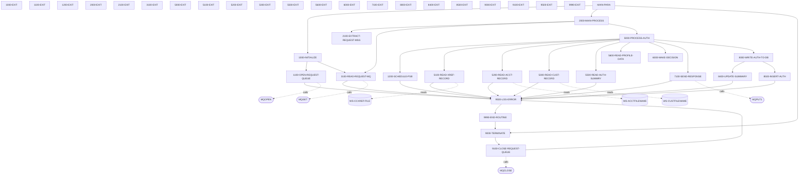
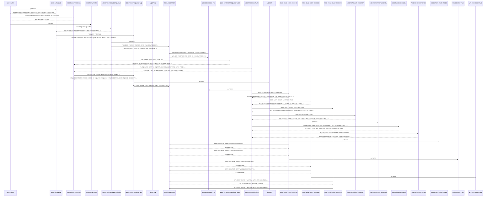
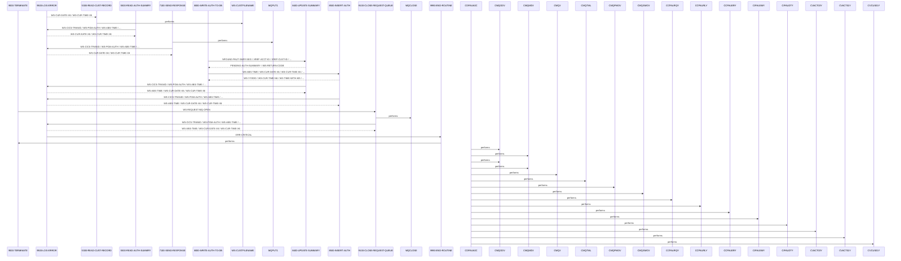

# COPAUA0C

**File**: `cbl/COPAUA0C.cbl`
**Type**: FileType.COBOL
**Analyzed**: 2026-03-04 04:39:30.289826

## Purpose

COPAUA0C is a CICS COBOL program that processes authorization requests from a message queue, validates them, and updates relevant IMS databases. It retrieves messages from a request queue, processes each request, and synchronizes with CICS before terminating.

**Business Context**: This program is likely part of a larger transaction processing system, handling authorization requests for financial transactions.

## Inputs

| Name | Type | Description |
|------|------|-------------|
| MQTM | IOType.CICS_COMMAREA | Message Queue Trigger Monitor data containing the request queue name and trigger data. |
| REQUEST-QUEUE | IOType.CICS_QUEUE | The IBM MQ queue from which authorization requests are read. |

## Called Programs

| Program | Call Type | Purpose |
|---------|-----------|---------|
| MQOPEN | CallType.STATIC_CALL | Opens the request message queue. |
| CMQODV | CallType.OTHER | UNKNOWN |
| CMQMDV | CallType.OTHER | UNKNOWN |
| CMQV | CallType.OTHER | UNKNOWN |

## Paragraphs/Procedures

### MAIN-PARA
> [Source: MAIN-PARA.cbl.md](COPAUA0C.cbl.d/MAIN-PARA.cbl.md)

```
MAIN-PARA  (4 statements, depth=1)
PARAGRAPH
├── PERFORM_THRU: PERFORM 1000-INITIALIZE THRU 1000-EXIT
├── PERFORM_THRU: PERFORM 2000-MAIN-PROCESS THRU 2000-EXIT
├── PERFORM_THRU: PERFORM 9000-TERMINATE THRU 9000-EXIT
└── EXEC_CICS: *>EXECCICS EXEC CICS RETURN *>EXECCICS END-EXEC }
```
This is the main control paragraph of the COPAUA0C program. It orchestrates the initialization, main processing, and termination routines. It first calls 1000-INITIALIZE to set up the environment and open the necessary resources. Then, it calls 2000-MAIN-PROCESS to handle the core business logic of processing authorization requests. Finally, it calls 9000-TERMINATE to close resources and clean up before returning control to CICS. The paragraph ends with an EXEC CICS RETURN statement, which terminates the CICS transaction.

### 1000-INITIALIZE
> [Source: 1000-INITIALIZE.cbl.md](COPAUA0C.cbl.d/1000-INITIALIZE.cbl.md)

```
1000-INITIALIZE  (7 statements, depth=2)
PARAGRAPH
├── EXEC_CICS: *>EXECCICS EXEC CICS RETRIEVE *>EXECCICS INTO(MQTM) *>EXECCICS NOHAND...
├── IF: IF EIBRESP = DFHRESP(NORMAL) MOVE MQTM-QNAME TO WS-REQUEST-QNAME MOVE...
│   ├── MOVE: MOVE MQTM-QNAME TO WS-REQUEST-QNAME
│   └── MOVE: MOVE MQTM-TRIGGERDATA TO WS-TRIGGER-DATA
├── MOVE: MOVE 5000 TO WS-WAIT-INTERVAL
├── PERFORM_THRU: PERFORM 1100-OPEN-REQUEST-QUEUE THRU 1100-EXIT
└── PERFORM_THRU: PERFORM 3100-READ-REQUEST-MQ THRU 3100-EXIT
```
This paragraph initializes the program environment. It retrieves the MQTM (Message Queue Trigger Monitor) data using EXEC CICS RETRIEVE to obtain the queue name and trigger data. It moves the queue name and trigger data from the MQTM to working storage variables WS-REQUEST-QNAME and WS-TRIGGER-DATA, respectively. It sets the WS-WAIT-INTERVAL to 5000. It then performs 1100-OPEN-REQUEST-QUEUE to open the request queue and 3100-READ-REQUEST-MQ to read the first message from the queue. Error handling is performed via RESP checks, although the specific error handling logic is not detailed in this code snippet.

### 1000-EXIT
> [Source: 1000-EXIT.cbl.md](COPAUA0C.cbl.d/1000-EXIT.cbl.md)

```
1000-EXIT  (1 statements, depth=1)
PARAGRAPH
└── EXIT: EXIT
```
This paragraph serves as the exit point for the 1000-INITIALIZE paragraph. It contains only the EXIT statement, which allows control to return to the calling paragraph (MAIN-PARA). It does not perform any specific actions or logic.

### 1100-OPEN-REQUEST-QUEUE
> [Source: 1100-OPEN-REQUEST-QUEUE.cbl.md](COPAUA0C.cbl.d/1100-OPEN-REQUEST-QUEUE.cbl.md)

```
1100-OPEN-REQUEST-QUEUE  (16 statements, depth=3)
PARAGRAPH
├── MOVE: MOVE MQOT-Q TO MQOD-OBJECTTYPE OF MQM-OD-REQUEST
├── MOVE: MOVE WS-REQUEST-QNAME TO MQOD-OBJECTNAME OF MQM-OD-REQUEST
├── COMPUTE: COMPUTE WS-OPTIONS = MQOO-INPUT-SHARED
├── CALL: CALL 'MQOPEN' USING W01-HCONN-REQUEST MQM-OD-REQUEST WS-OPTIONS W01-H...
└── IF: IF WS-COMPCODE = MQCC-OK SET WS-REQUEST-MQ-OPEN TO TRUE ELSE MOVE 'M0...
    ├── SET: SET WS-REQUEST-MQ-OPEN TO TRUE
    └── ELSE: ELSE
        ├── MOVE: MOVE 'M001' TO ERR-LOCATION
        ├── SET: SET ERR-CRITICAL TO TRUE
        ├── SET: SET ERR-MQ TO TRUE
        ├── MOVE: MOVE WS-COMPCODE TO WS-CODE-DISPLAY
        ├── MOVE: MOVE WS-CODE-DISPLAY TO ERR-CODE-1
        ├── MOVE: MOVE WS-REASON TO WS-CODE-DISPLAY
        ├── MOVE: MOVE WS-CODE-DISPLAY TO ERR-CODE-2
        ├── MOVE: MOVE 'REQ MQ OPEN ERROR' TO ERR-MESSAGE
        └── PERFORM: PERFORM 9500-LOG-ERROR
```
This paragraph opens the request queue for processing messages. It moves MQOT-Q to MQOD-OBJECTTYPE OF MQM-OD-REQUEST and WS-REQUEST-QNAME to MQOD-OBJECTNAME OF MQM-OD-REQUEST to define the queue object. It computes WS-OPTIONS as MQOO-INPUT-SHARED, specifying that the queue is opened for shared input. It then calls the MQOPEN API to open the queue, passing the connection handle, object descriptor, options, object handle, completion code, and reason code. If the completion code (WS-COMPCODE) is MQCC-OK, it sets WS-REQUEST-MQ-OPEN to TRUE. Otherwise, it logs an error using 9500-LOG-ERROR, setting various error fields and flags to indicate a critical MQ error.

### 1100-EXIT
> [Source: 1100-EXIT.cbl.md](COPAUA0C.cbl.d/1100-EXIT.cbl.md)

```
1100-EXIT  (1 statements, depth=1)
PARAGRAPH
└── EXIT: EXIT
```
This paragraph serves as the exit point for the 1100-OPEN-REQUEST-QUEUE paragraph. It contains only the EXIT statement, which allows control to return to the calling paragraph (1000-INITIALIZE). It does not perform any specific actions or logic.

### 1200-SCHEDULE-PSB
> [Source: 1200-SCHEDULE-PSB.cbl.md](COPAUA0C.cbl.d/1200-SCHEDULE-PSB.cbl.md)

```
1200-SCHEDULE-PSB  (0 statements, depth=0)
PARAGRAPH
```
This paragraph schedules a PSB (Program Specification Block) in IMS. It uses the EXEC DLI SCHD command to schedule the PSB specified by PSB-NAME. It checks the DIBSTAT (Data Base Interface Status) after the SCHD call and moves it to IMS-RETURN-CODE. If the PSB was scheduled more than once (PSB-SCHEDULED-MORE-THAN-ONCE), it terminates the PSB using EXEC DLI TERM and then schedules it again. If the status is OK (STATUS-OK), it sets IMS-PSB-SCHD to TRUE. Otherwise, it logs an error using 9500-LOG-ERROR, setting various error fields and flags to indicate a critical IMS error.

### 1200-EXIT
> [Source: 1200-EXIT.cbl.md](COPAUA0C.cbl.d/1200-EXIT.cbl.md)
This paragraph serves as the exit point for the 1200-SCHEDULE-PSB paragraph. It contains only the EXIT statement, which allows control to return to the calling paragraph. It does not perform any specific actions or logic.

### 2000-MAIN-PROCESS
> [Source: 2000-MAIN-PROCESS.cbl.md](COPAUA0C.cbl.d/2000-MAIN-PROCESS.cbl.md)
This paragraph is the main processing loop of the program. It repeatedly processes authorization requests until either NO-MORE-MSG-AVAILABLE is TRUE or WS-LOOP-END is TRUE. Inside the loop, it first performs 2100-EXTRACT-REQUEST-MSG to extract the request message. Then, it performs 5000-PROCESS-AUTH to process the authorization request. It increments WS-MSG-PROCESSED to keep track of the number of messages processed. It issues an EXEC CICS SYNCPOINT to synchronize the CICS transaction. It sets IMS-PSB-NOT-SCHD to TRUE. If WS-MSG-PROCESSED exceeds WS-REQSTS-PROCESS-LIMIT, it sets WS-LOOP-END to TRUE to terminate the loop. Otherwise, it performs 3100-READ-REQUEST-MQ to read the next request message.

### 2000-EXIT
> [Source: 2000-EXIT.cbl.md](COPAUA0C.cbl.d/2000-EXIT.cbl.md)
This paragraph serves as the exit point for the 2000-MAIN-PROCESS paragraph. It contains only the EXIT statement, which allows control to return to the calling paragraph (MAIN-PARA). It does not perform any specific actions or logic.

### 2100-EXTRACT-REQUEST-MSG
> [Source: 2100-EXTRACT-REQUEST-MSG.cbl.md](COPAUA0C.cbl.d/2100-EXTRACT-REQUEST-MSG.cbl.md)
This paragraph extracts data from the MQ message buffer (W01-GET-BUFFER) into individual fields. It uses the UNSTRING statement to parse the comma-delimited message, moving the extracted values into corresponding fields such as PA-RQ-AUTH-DATE, PA-RQ-AUTH-TIME, PA-RQ-CARD-NUM, and others related to the authorization request. It then converts the alphanumeric transaction amount (WS-TRANSACTION-AMT-AN) to a numeric value (PA-RQ-TRANSACTION-AMT) using the NUMVAL function and moves it to WS-TRANSACTION-AMT. This paragraph prepares the data for subsequent processing. No error handling is performed within this paragraph, and it does not call any other paragraphs or programs. The input is the MQ message buffer, and the outputs are the individual data fields populated from the message.

### 2100-EXIT
> [Source: 2100-EXIT.cbl.md](COPAUA0C.cbl.d/2100-EXIT.cbl.md)
This paragraph simply contains the EXIT statement, providing a standard exit point for the 2100-EXTRACT-REQUEST-MSG paragraph. It serves as a target for THRU clauses in PERFORM statements, allowing control to return to the calling paragraph after the extraction process is complete. It does not perform any data manipulation, error handling, or call any other paragraphs or programs. It is a structural element for controlling program flow.

### 3100-READ-REQUEST-MQ
> [Source: 3100-READ-REQUEST-MQ.cbl.md](COPAUA0C.cbl.d/3100-READ-REQUEST-MQ.cbl.md)
This paragraph reads a message from the MQ queue. It sets the MQGMO options for the MQGET call, including no sync point, waiting for a message, conversion, and failing if quiescing. It also sets the message ID, correlation ID, and format in the MQMD. The MQGET call retrieves the message from the queue into W01-GET-BUFFER, and the actual length of the data is stored in W01-DATALEN. If the MQGET call is successful (WS-COMPCODE = MQCC-OK), the correlation ID and reply-to queue name are saved. If the call fails, it checks if the reason is MQRC-NO-MSG-AVAILABLE; if so, it sets a flag. Otherwise, it logs an error message using 9500-LOG-ERROR, including the completion code, reason code, and card number. The inputs are the MQ queue connection and object handles, and the output is the message in W01-GET-BUFFER. Error handling is performed for MQGET failures.

### 3100-EXIT
> [Source: 3100-EXIT.cbl.md](COPAUA0C.cbl.d/3100-EXIT.cbl.md)
This paragraph simply contains the EXIT statement, providing a standard exit point for the 3100-READ-REQUEST-MQ paragraph. It serves as a target for THRU clauses in PERFORM statements, allowing control to return to the calling paragraph after the MQ read process is complete. It does not perform any data manipulation, error handling, or call any other paragraphs or programs. It is a structural element for controlling program flow.

### 5000-PROCESS-AUTH
> [Source: 5000-PROCESS-AUTH.cbl.md](COPAUA0C.cbl.d/5000-PROCESS-AUTH.cbl.md)
This paragraph orchestrates the authorization processing logic. It starts by scheduling a PSB (Program Specification Block) using 1200-SCHEDULE-PSB. It then attempts to read the card cross-reference record using 5100-READ-XREF-RECORD. If the card is found in the cross-reference file, it proceeds to read the account record (5200-READ-ACCT-RECORD), customer record (5300-READ-CUST-RECORD), authorization summary (5500-READ-AUTH-SUMMRY), and profile data (5600-READ-PROFILE-DATA). After retrieving the necessary data, it makes an authorization decision using 6000-MAKE-DECISION and sends a response using 7100-SEND-RESPONSE. Finally, if the card was found in the cross-reference file, it writes the authorization to the database using 8000-WRITE-AUTH-TO-DB. The inputs are the authorization request data extracted from the MQ message, and the outputs are the authorization response and the updated database records. The paragraph calls several other paragraphs to perform specific tasks, and the overall flow depends on whether the card is found in the cross-reference file.

### 5000-EXIT
> [Source: 5000-EXIT.cbl.md](COPAUA0C.cbl.d/5000-EXIT.cbl.md)
This paragraph simply contains the EXIT statement, providing a standard exit point for the 5000-PROCESS-AUTH paragraph. It serves as a target for THRU clauses in PERFORM statements, allowing control to return to the calling paragraph after the authorization processing is complete. It does not perform any data manipulation, error handling, or call any other paragraphs or programs. It is a structural element for controlling program flow.

### 5100-READ-XREF-RECORD
> [Source: 5100-READ-XREF-RECORD.cbl.md](COPAUA0C.cbl.d/5100-READ-XREF-RECORD.cbl.md)
This paragraph reads the card cross-reference record from the VSAM file WS-CCXREF-FILE using the card number (PA-RQ-CARD-NUM) as the key. It moves the card number to XREF-CARD-NUM and then executes a CICS READ command to retrieve the CARD-XREF-RECORD. The CICS READ command uses the XREF-CARD-NUM as the RIDFLD and specifies the key length. The paragraph then evaluates the CICS response code (WS-RESP-CD). If the record is found (DFHRESP(NORMAL)), it sets CARD-FOUND-XREF to TRUE. If the record is not found (DFHRESP(NOTFND)), it sets CARD-NFOUND-XREF and NFOUND-ACCT-IN-MSTR to TRUE and logs a warning message using 9500-LOG-ERROR. If any other error occurs, it logs a critical error message using 9500-LOG-ERROR. The input is the card number, and the output is the CARD-XREF-RECORD. Error handling is performed for CICS READ errors.

### 5100-EXIT
> [Source: 5100-EXIT.cbl.md](COPAUA0C.cbl.d/5100-EXIT.cbl.md)
This paragraph simply contains the EXIT statement, providing a standard exit point for the 5100-READ-XREF-RECORD paragraph. It serves as a target for THRU clauses in PERFORM statements, allowing control to return to the calling paragraph after the cross-reference record read process is complete. It does not perform any data manipulation, error handling, or call any other paragraphs or programs. It is a structural element for controlling program flow.

### 5200-READ-ACCT-RECORD
> [Source: 5200-READ-ACCT-RECORD.cbl.md](COPAUA0C.cbl.d/5200-READ-ACCT-RECORD.cbl.md)
This paragraph reads the account record from the VSAM file WS-ACCTFILENAME using the account ID (XREF-ACCT-ID) obtained from the cross-reference record. It moves the account ID to WS-CARD-RID-ACCT-ID and then executes a CICS READ command to retrieve the ACCOUNT-RECORD. The CICS READ command uses WS-CARD-RID-ACCT-ID-X as the RIDFLD and specifies the key length. The paragraph then evaluates the CICS response code (WS-RESP-CD). If the record is found (DFHRESP(NORMAL)), it sets FOUND-ACCT-IN-MSTR to TRUE. If the record is not found (DFHRESP(NOTFND)), it sets NFOUND-ACCT-IN-MSTR to TRUE and logs a warning message using 9500-LOG-ERROR. If any other error occurs, it logs a critical error message using 9500-LOG-ERROR. The input is the account ID, and the output is the ACCOUNT-RECORD. Error handling is performed for CICS READ errors.

### 5200-EXIT
> [Source: 5200-EXIT.cbl.md](COPAUA0C.cbl.d/5200-EXIT.cbl.md)
This paragraph simply contains the EXIT statement, providing a standard exit point for the 5200-READ-ACCT-RECORD paragraph. It serves as a target for THRU clauses in PERFORM statements, allowing control to return to the calling paragraph after the account record read process is complete. It does not perform any data manipulation, error handling, or call any other paragraphs or programs. It is a structural element for controlling program flow.

### 5300-READ-CUST-RECORD
> [Source: 5300-READ-CUST-RECORD.cbl.md](COPAUA0C.cbl.d/5300-READ-CUST-RECORD.cbl.md)
This paragraph reads a customer record from a VSAM file using CICS. It moves the XREF-CUST-ID to WS-CARD-RID-CUST-ID to be used as the record ID. It then executes a CICS READ command to retrieve the CUSTOMER-RECORD from the VSAM file specified by WS-CUSTFILENAME. The paragraph evaluates the CICS response code (WS-RESP-CD) to determine if the read was successful. If the record is found (DFHRESP(NORMAL)), it sets FOUND-CUST-IN-MSTR to TRUE. If the record is not found (DFHRESP(NOTFND)), it sets NFOUND-CUST-IN-MSTR to TRUE, populates error fields, and calls 9500-LOG-ERROR to log the error. If any other error occurs, it sets error flags, moves the CICS response codes to error fields, and calls 9500-LOG-ERROR to log the error. The paragraph consumes XREF-CUST-ID from the commarea and outputs the CUSTOMER-RECORD.

### 5300-EXIT
> [Source: 5300-EXIT.cbl.md](COPAUA0C.cbl.d/5300-EXIT.cbl.md)
This paragraph is a standard EXIT paragraph. It simply contains the EXIT statement and is used to provide a common exit point for the 5300-READ-CUST-RECORD paragraph. It does not perform any specific logic or data manipulation. It ensures a clean and controlled exit from the paragraph.

### 5500-READ-AUTH-SUMMRY
> [Source: 5500-READ-AUTH-SUMMRY.cbl.md](COPAUA0C.cbl.d/5500-READ-AUTH-SUMMRY.cbl.md)
This paragraph reads a pending authorization summary from an IMS database. It moves the XREF-ACCT-ID to PA-ACCT-ID to be used as the search key. It then executes a DLI GU (Get Unique) command to retrieve the PAUTSUM0 segment from the IMS database using the PAUT-PCB-NUM PCB. The retrieved data is placed into the PENDING-AUTH-SUMMARY. The paragraph checks the IMS return code (DIBSTAT) to determine the outcome of the read. If the segment is found (STATUS-OK), it sets FOUND-PAUT-SMRY-SEG to TRUE. If the segment is not found (SEGMENT-NOT-FOUND), it sets NFOUND-PAUT-SMRY-SEG to TRUE. If any other error occurs, it sets error flags, moves the IMS return code to error fields, and calls 9500-LOG-ERROR to log the error. The paragraph consumes XREF-ACCT-ID from the commarea and outputs the PENDING-AUTH-SUMMARY.

### 5500-EXIT
> [Source: 5500-EXIT.cbl.md](COPAUA0C.cbl.d/5500-EXIT.cbl.md)
This paragraph is a standard EXIT paragraph. It simply contains the EXIT statement and is used to provide a common exit point for the 5500-READ-AUTH-SUMMRY paragraph. It does not perform any specific logic or data manipulation. It ensures a clean and controlled exit from the paragraph.

### 5600-READ-PROFILE-DATA
> [Source: 5600-READ-PROFILE-DATA.cbl.md](COPAUA0C.cbl.d/5600-READ-PROFILE-DATA.cbl.md)
This paragraph currently contains only a CONTINUE statement, indicating that it does not perform any specific action. It serves as a placeholder for potentially reading profile data in the future. It does not consume any inputs or produce any outputs at this time. The paragraph's purpose is currently undefined, and it does not interact with any other paragraphs or programs.

### 5600-EXIT
> [Source: 5600-EXIT.cbl.md](COPAUA0C.cbl.d/5600-EXIT.cbl.md)
This paragraph is a standard EXIT paragraph. It simply contains the EXIT statement and is used to provide a common exit point for the 5600-READ-PROFILE-DATA paragraph. It does not perform any specific logic or data manipulation. It ensures a clean and controlled exit from the paragraph.

### 6000-MAKE-DECISION
> [Source: 6000-MAKE-DECISION.cbl.md](COPAUA0C.cbl.d/6000-MAKE-DECISION.cbl.md)
This paragraph determines whether to authorize or decline a transaction based on available credit. It first moves data from request fields (PA-RQ-*) to response fields (PA-RL-*). It then checks if a pending authorization summary was found (FOUND-PAUT-SMRY-SEG). If so, it calculates available credit using the credit limit and balance from the summary. If not, it checks if the account was found in the customer master (FOUND-ACCT-IN-MSTR) and calculates available credit using the account data. If neither a summary nor account data is found, the transaction is declined. If the transaction amount exceeds the available credit, the transaction is declined and a reason code is set. Otherwise, the transaction is approved. Finally, the paragraph formats the response data into W02-PUT-BUFFER for sending to the reply queue. The paragraph consumes data from PENDING-AUTH-SUMMARY, CUSTOMER-RECORD, and the CICS commarea and outputs data to W02-PUT-BUFFER.

### 6000-EXIT
> [Source: 6000-EXIT.cbl.md](COPAUA0C.cbl.d/6000-EXIT.cbl.md)
This paragraph is a standard EXIT paragraph. It simply contains the EXIT statement and is used to provide a common exit point for the 6000-MAKE-DECISION paragraph. It does not perform any specific logic or data manipulation. It ensures a clean and controlled exit from the paragraph.

### 7100-SEND-RESPONSE
> [Source: 7100-SEND-RESPONSE.cbl.md](COPAUA0C.cbl.d/7100-SEND-RESPONSE.cbl.md)
This paragraph sends the authorization response message to the MQ reply queue. It moves the queue name (WS-REPLY-QNAME) and other relevant data into the MQ message descriptor (MQM-MD-REPLY) and object descriptor (MQM-OD-REPLY). It sets the message type to MQMT-REPLY and copies the correlation ID (WS-SAVE-CORRELID). It then calls the MQPUT1 API to put the message on the queue. If the MQPUT1 call fails, it logs an error using 9500-LOG-ERROR. The paragraph consumes data from WS-REPLY-QNAME, WS-SAVE-CORRELID, and W02-PUT-BUFFER and outputs the message to the MQ reply queue. The paragraph uses the MQPUT1 API to send the response to the reply queue specified in WS-REPLY-QNAME.

### 7100-EXIT
> [Source: 7100-EXIT.cbl.md](COPAUA0C.cbl.d/7100-EXIT.cbl.md)
This paragraph is a standard EXIT paragraph. It simply contains the EXIT statement and is used to provide a common exit point for the 7100-SEND-RESPONSE paragraph. It does not perform any specific logic or data manipulation. It ensures a clean and controlled exit from the paragraph.

### 8000-WRITE-AUTH-TO-DB
> [Source: 8000-WRITE-AUTH-TO-DB.cbl.md](COPAUA0C.cbl.d/8000-WRITE-AUTH-TO-DB.cbl.md)
This paragraph is responsible for writing authorization information to the database. It orchestrates the update of the pending authorization summary and the insertion of the authorization details. It first performs 8400-UPDATE-SUMMARY to update the summary information in the IMS database. Then, it performs 8500-INSERT-AUTH to insert the detailed authorization information into the IMS database. The paragraph does not directly handle any data manipulation or error conditions, but relies on the called paragraphs to perform these tasks. The purpose of this paragraph is to ensure both the summary and detailed information are written to the database.

### 8000-EXIT
> [Source: 8000-EXIT.cbl.md](COPAUA0C.cbl.d/8000-EXIT.cbl.md)
This paragraph serves as the exit point for the 8000-WRITE-AUTH-TO-DB paragraph. It contains only the EXIT statement, which allows control to return to the calling paragraph. It does not perform any data manipulation, error handling, or call any other paragraphs. Its sole purpose is to provide a standard exit point.

### 8400-UPDATE-SUMMARY
> [Source: 8400-UPDATE-SUMMARY.cbl.md](COPAUA0C.cbl.d/8400-UPDATE-SUMMARY.cbl.md)
This paragraph updates the pending authorization summary in the IMS database. It first checks if a summary segment already exists. If not (NFOUND-PAUT-SMRY-SEG is true), it initializes the PENDING-AUTH-SUMMARY segment with zeros and moves the account and customer IDs (XREF-ACCT-ID, XREF-CUST-ID) into the segment. It then moves the account credit limits (ACCT-CREDIT-LIMIT, ACCT-CASH-CREDIT-LIMIT) into the summary segment. Based on whether the authorization was approved (AUTH-RESP-APPROVED), it increments the appropriate counters (PA-APPROVED-AUTH-CNT or PA-DECLINED-AUTH-CNT) and amounts (PA-APPROVED-AUTH-AMT or PA-DECLINED-AUTH-AMT) in the summary segment. Finally, it either updates an existing summary segment (if FOUND-PAUT-SMRY-SEG is true) or inserts a new one into the IMS database using EXEC DLI REPL or EXEC DLI ISRT, respectively. If the IMS operation fails, it logs an error using 9500-LOG-ERROR.

### 8400-EXIT
> [Source: 8400-EXIT.cbl.md](COPAUA0C.cbl.d/8400-EXIT.cbl.md)
This paragraph serves as the exit point for the 8400-UPDATE-SUMMARY paragraph. It contains only the EXIT statement, which allows control to return to the calling paragraph. It does not perform any data manipulation, error handling, or call any other paragraphs. Its sole purpose is to provide a standard exit point.

### 8500-INSERT-AUTH
> [Source: 8500-INSERT-AUTH.cbl.md](COPAUA0C.cbl.d/8500-INSERT-AUTH.cbl.md)
This paragraph inserts the pending authorization details into the IMS database. It first retrieves the current date and time using CICS ASKTIME and FORMATTIME commands, storing the values in WS-CUR-DATE-X6 and WS-CUR-TIME-X6. It then calculates adjusted date and time values (PA-AUTH-DATE-9C, PA-AUTH-TIME-9C) by subtracting the current date and time from a constant. The paragraph moves various fields from the authorization request (PA-RQ-*) and response (PA-RL-*) into the PENDING-AUTH-DETAILS segment. Based on the authorization response (AUTH-RESP-APPROVED), it sets either PA-MATCH-PENDING or PA-MATCH-AUTH-DECLINED to TRUE. It then inserts the PENDING-AUTH-DETAILS segment into the IMS database using EXEC DLI ISRT. If the IMS operation fails, it logs an error using 9500-LOG-ERROR.

### 8500-EXIT
> [Source: 8500-EXIT.cbl.md](COPAUA0C.cbl.d/8500-EXIT.cbl.md)
This paragraph serves as the exit point for the 8500-INSERT-AUTH paragraph. It contains only the EXIT statement, which allows control to return to the calling paragraph. It does not perform any data manipulation, error handling, or call any other paragraphs. Its sole purpose is to provide a standard exit point.

### 9000-TERMINATE
> [Source: 9000-TERMINATE.cbl.md](COPAUA0C.cbl.d/9000-TERMINATE.cbl.md)
This paragraph performs termination procedures for the program. It first checks if the IMS PSB is scheduled (IMS-PSB-SCHD). If so, it terminates the PSB using EXEC DLI TERM. Then, it performs 9100-CLOSE-REQUEST-QUEUE to close the MQSeries request queue. This ensures that all resources are released before the program ends.

### 9000-EXIT
> [Source: 9000-EXIT.cbl.md](COPAUA0C.cbl.d/9000-EXIT.cbl.md)
This paragraph serves as the exit point for the 9000-TERMINATE paragraph. It contains only the EXIT statement, which allows control to return to the calling paragraph. It does not perform any data manipulation, error handling, or call any other paragraphs. Its sole purpose is to provide a standard exit point.

### 9100-CLOSE-REQUEST-QUEUE
> [Source: 9100-CLOSE-REQUEST-QUEUE.cbl.md](COPAUA0C.cbl.d/9100-CLOSE-REQUEST-QUEUE.cbl.md)
This paragraph closes the MQSeries request queue. It first checks if the request queue is open (WS-REQUEST-MQ-OPEN). If so, it calls the MQCLOSE program to close the queue, passing the connection handle (W01-HCONN-REQUEST), object handle (W01-HOBJ-REQUEST), and other parameters. After the MQCLOSE call, it checks the completion code (WS-COMPCODE). If the completion code is not MQCC-OK, it logs an error using 9500-LOG-ERROR, indicating that the attempt to close the request queue failed. If the close is successful, WS-REQUEST-MQ-CLSE is set to TRUE.

### 9100-EXIT
> [Source: 9100-EXIT.cbl.md](COPAUA0C.cbl.d/9100-EXIT.cbl.md)
This paragraph serves as the exit point for the 9100-CLOSE-REQUEST-QUEUE paragraph. It contains only the EXIT statement, which allows control to return to the calling paragraph. It does not perform any data manipulation, error handling, or call any other paragraphs. Its sole purpose is to provide a standard exit point.

### 9500-LOG-ERROR
> [Source: 9500-LOG-ERROR.cbl.md](COPAUA0C.cbl.d/9500-LOG-ERROR.cbl.md)
This paragraph logs error information to a CICS transient data queue (TDQ) named CSSL. It first retrieves the current date and time using CICS ASKTIME and FORMATTIME commands and stores them in WS-CUR-DATE-X6 and WS-CUR-TIME-X6 respectively. It then moves the CICS transaction ID (WS-CICS-TRANID) and program authorization ID (WS-PGM-AUTH) along with the date and time into the ERROR-LOG-RECORD. The ERROR-LOG-RECORD is then written to the CSSL queue using a CICS WRITEQ TD command. Finally, it checks the ERR-CRITICAL flag, and if set, performs the 9990-END-ROUTINE to terminate the CICS task. This paragraph is responsible for capturing and recording error events within the CICS environment.

### 9500-EXIT
> [Source: 9500-EXIT.cbl.md](COPAUA0C.cbl.d/9500-EXIT.cbl.md)
This paragraph serves as a simple exit point for the 9500-LOG-ERROR paragraph. It contains only the EXIT statement, which returns control to the calling paragraph. It does not perform any specific logic or data manipulation.

### 9990-END-ROUTINE
> [Source: 9990-END-ROUTINE.cbl.md](COPAUA0C.cbl.d/9990-END-ROUTINE.cbl.md)
This paragraph is responsible for terminating the CICS task. It first calls the 9000-TERMINATE paragraph to perform any necessary cleanup or resource release procedures. After the 9000-TERMINATE paragraph completes, it issues a CICS RETURN command to terminate the current CICS task and return control to CICS. This paragraph ensures a clean and controlled exit from the CICS application.

### 9990-EXIT
> [Source: 9990-EXIT.cbl.md](COPAUA0C.cbl.d/9990-EXIT.cbl.md)
This paragraph serves as a simple exit point for the 9990-END-ROUTINE paragraph. It contains only the EXIT statement, which returns control to the calling paragraph. It does not perform any specific logic or data manipulation.

### COPAUA0C
> [Source: COPAUA0C.cbl.md](COPAUA0C.cbl.d/COPAUA0C.cbl.md)
This is the main program paragraph, but without the full source code, its purpose cannot be determined. Based on the paragraph outline, it calls several other programs (CMQODV, CMQMDV, CMQV, etc.). Without the source code, it is impossible to determine what inputs are consumed, what outputs are produced, what business logic is implemented, what error handling is performed, or why the other programs are called. The line range provided is only a single line, which is the PROGRAM-ID declaration.

## Dead Code

The following artifacts were identified as dead code by static analysis:

| Artifact | Type | Line | Reason |
|----------|------|------|--------|
| exec-017 | function | 986 | Function 'exec-017' is never called by any other artifact |
| exec-018 | function | 990 | Function 'exec-018' is never called by any other artifact |
| exec-019 | function | 1001 | Function 'exec-019' is never called by any other artifact |
| exec-020 | function | 1021 | Function 'exec-020' is never called by any other artifact |
| ERROR-LOG-RECORD | record_layout | 19 | Record layout 'ERROR-LOG-RECORD' is never used by any program |
| MQM-CONSTANTS | record_layout | 160 | Record layout 'MQM-CONSTANTS' is never used by any program |
| MQM-GET-MESSAGE-OPTIONS | record_layout | 169 | Record layout 'MQM-GET-MESSAGE-OPTIONS' is never used by any program |
| MQM-MD-REPLY | record_layout | 157 | Record layout 'MQM-MD-REPLY' is never used by any program |
| MQM-MD-REQUEST | record_layout | 151 | Record layout 'MQM-MD-REQUEST' is never used by any program |
| MQM-OD-REPLY | record_layout | 154 | Record layout 'MQM-OD-REPLY' is never used by any program |
| MQM-OD-REQUEST | record_layout | 148 | Record layout 'MQM-OD-REQUEST' is never used by any program |
| MQM-PUT-MESSAGE-OPTIONS | record_layout | 166 | Record layout 'MQM-PUT-MESSAGE-OPTIONS' is never used by any program |
| MQM-TRIGGER-DATA | record_layout | 163 | Record layout 'MQM-TRIGGER-DATA' is never used by any program |
| PENDING-AUTH-REQUEST | record_layout | 177 | Record layout 'PENDING-AUTH-REQUEST' is never used by any program |
| PENDING-AUTH-RESPONSE | record_layout | 181 | Record layout 'PENDING-AUTH-RESPONSE' is never used by any program |
| W01-BUFFLEN | record_layout | 101 | Record layout 'W01-BUFFLEN' is never used by any program |
| W01-DATALEN | record_layout | 102 | Record layout 'W01-DATALEN' is never used by any program |
| W01-GET-BUFFER | record_layout | 103 | Record layout 'W01-GET-BUFFER' is never used by any program |
| W01-HCONN-REQUEST | record_layout | 99 | Record layout 'W01-HCONN-REQUEST' is never used by any program |
| W01-HOBJ-REQUEST | record_layout | 100 | Record layout 'W01-HOBJ-REQUEST' is never used by any program |
| W02-BUFFLEN | record_layout | 106 | Record layout 'W02-BUFFLEN' is never used by any program |
| W02-DATALEN | record_layout | 107 | Record layout 'W02-DATALEN' is never used by any program |
| W02-HCONN-REPLY | record_layout | 105 | Record layout 'W02-HCONN-REPLY' is never used by any program |
| W02-PUT-BUFFER | record_layout | 108 | Record layout 'W02-PUT-BUFFER' is never used by any program |

## Control Flow


```mermaid
flowchart TD
    %% Title: COPAUA0C.cbl
    1000_EXIT["1000-EXIT"]
    1000_INITIALIZE["1000-INITIALIZE"]
    1100_OPEN_REQUEST_QUEUE["1100-OPEN-REQUEST-QUEUE"]
    3100_READ_REQUEST_MQ["3100-READ-REQUEST-MQ"]
    1100_EXIT["1100-EXIT"]
    9500_LOG_ERROR["9500-LOG-ERROR"]
    MQOPEN__ext(["MQOPEN"])
    1200_EXIT["1200-EXIT"]
    1200_SCHEDULE_PSB["1200-SCHEDULE-PSB"]
    2000_EXIT["2000-EXIT"]
    2000_MAIN_PROCESS["2000-MAIN-PROCESS"]
    2100_EXTRACT_REQUEST_MSG["2100-EXTRACT-REQUEST-MSG"]
    5000_PROCESS_AUTH["5000-PROCESS-AUTH"]
    2100_EXIT["2100-EXIT"]
    3100_EXIT["3100-EXIT"]
    MQGET__ext(["MQGET"])
    5000_EXIT["5000-EXIT"]
    5100_READ_XREF_RECORD["5100-READ-XREF-RECORD"]
    5200_READ_ACCT_RECORD["5200-READ-ACCT-RECORD"]
    5300_READ_CUST_RECORD["5300-READ-CUST-RECORD"]
    5500_READ_AUTH_SUMMRY["5500-READ-AUTH-SUMMRY"]
    5600_READ_PROFILE_DATA["5600-READ-PROFILE-DATA"]
    6000_MAKE_DECISION["6000-MAKE-DECISION"]
    7100_SEND_RESPONSE["7100-SEND-RESPONSE"]
    8000_WRITE_AUTH_TO_DB["8000-WRITE-AUTH-TO-DB"]
    5100_EXIT["5100-EXIT"]
    WS_CCXREF_FILE__ext[("WS-CCXREF-FILE")]
    5200_EXIT["5200-EXIT"]
    WS_ACCTFILENAME__ext[("WS-ACCTFILENAME")]
    5300_EXIT["5300-EXIT"]
    WS_CUSTFILENAME__ext[("WS-CUSTFILENAME")]
    5500_EXIT["5500-EXIT"]
    5600_EXIT["5600-EXIT"]
    6000_EXIT["6000-EXIT"]
    7100_EXIT["7100-EXIT"]
    MQPUT1__ext(["MQPUT1"])
    8000_EXIT["8000-EXIT"]
    8400_UPDATE_SUMMARY["8400-UPDATE-SUMMARY"]
    8500_INSERT_AUTH["8500-INSERT-AUTH"]
    8400_EXIT["8400-EXIT"]
    8500_EXIT["8500-EXIT"]
    9000_EXIT["9000-EXIT"]
    9000_TERMINATE["9000-TERMINATE"]
    9100_CLOSE_REQUEST_QUEUE["9100-CLOSE-REQUEST-QUEUE"]
    MQCLOSE__ext(["MQCLOSE"])
    9100_EXIT["9100-EXIT"]
    9500_EXIT["9500-EXIT"]
    9990_END_ROUTINE["9990-END-ROUTINE"]
    9990_EXIT["9990-EXIT"]
    MAIN_PARA["MAIN-PARA"]
    1000_INITIALIZE --> 1100_OPEN_REQUEST_QUEUE
    1000_INITIALIZE --> 3100_READ_REQUEST_MQ
    1100_OPEN_REQUEST_QUEUE --> 9500_LOG_ERROR
    1100_OPEN_REQUEST_QUEUE -.->|calls| MQOPEN__ext
    1200_SCHEDULE_PSB --> 9500_LOG_ERROR
    2000_MAIN_PROCESS --> 2100_EXTRACT_REQUEST_MSG
    2000_MAIN_PROCESS --> 3100_READ_REQUEST_MQ
    2000_MAIN_PROCESS --> 5000_PROCESS_AUTH
    3100_READ_REQUEST_MQ --> 9500_LOG_ERROR
    3100_READ_REQUEST_MQ -.->|calls| MQGET__ext
    5000_PROCESS_AUTH --> 1200_SCHEDULE_PSB
    5000_PROCESS_AUTH --> 5100_READ_XREF_RECORD
    5000_PROCESS_AUTH --> 5200_READ_ACCT_RECORD
    5000_PROCESS_AUTH --> 5300_READ_CUST_RECORD
    5000_PROCESS_AUTH --> 5500_READ_AUTH_SUMMRY
    5000_PROCESS_AUTH --> 5600_READ_PROFILE_DATA
    5000_PROCESS_AUTH --> 6000_MAKE_DECISION
    5000_PROCESS_AUTH --> 7100_SEND_RESPONSE
    5000_PROCESS_AUTH --> 8000_WRITE_AUTH_TO_DB
    5100_READ_XREF_RECORD --> 9500_LOG_ERROR
    5100_READ_XREF_RECORD -.->|reads| WS_CCXREF_FILE__ext
    5200_READ_ACCT_RECORD --> 9500_LOG_ERROR
    5200_READ_ACCT_RECORD -.->|reads| WS_ACCTFILENAME__ext
    5300_READ_CUST_RECORD --> 9500_LOG_ERROR
    5300_READ_CUST_RECORD -.->|reads| WS_CUSTFILENAME__ext
    5500_READ_AUTH_SUMMRY --> 9500_LOG_ERROR
    7100_SEND_RESPONSE --> 9500_LOG_ERROR
    7100_SEND_RESPONSE -.->|calls| MQPUT1__ext
    8000_WRITE_AUTH_TO_DB --> 8400_UPDATE_SUMMARY
    8000_WRITE_AUTH_TO_DB --> 8500_INSERT_AUTH
    8400_UPDATE_SUMMARY --> 9500_LOG_ERROR
    8500_INSERT_AUTH --> 9500_LOG_ERROR
    9000_TERMINATE --> 9100_CLOSE_REQUEST_QUEUE
    9100_CLOSE_REQUEST_QUEUE --> 9500_LOG_ERROR
    9100_CLOSE_REQUEST_QUEUE -.->|calls| MQCLOSE__ext
    9500_LOG_ERROR --> 9990_END_ROUTINE
    9990_END_ROUTINE --> 9000_TERMINATE
    MAIN_PARA --> 1000_INITIALIZE
    MAIN_PARA --> 2000_MAIN_PROCESS
    MAIN_PARA --> 9000_TERMINATE
```

## Open Questions

- ? What is the purpose of the CMQODV, CMQMDV, and CMQV programs?
  - Context: These programs are called but their purpose is not clear from the code.
- ? What is the structure and content of the messages in the request queue?
  - Context: The program reads messages from the request queue, but the format of the messages is not defined in this code snippet.

## Sequence Diagram

### Part 1 of 2

```mermaid
sequenceDiagram
    participant MAIN_PARA as MAIN-PARA
    participant 1000_INITIALIZE as 1000-INITIALIZE
    participant 2000_MAIN_PROCESS as 2000-MAIN-PROCESS
    participant 9000_TERMINATE as 9000-TERMINATE
    participant 1100_OPEN_REQUEST_QUEUE as 1100-OPEN-REQUEST-QUEUE
    participant 3100_READ_REQUEST_MQ as 3100-READ-REQUEST-MQ
    participant MQOPEN as MQOPEN
    participant 9500_LOG_ERROR as 9500-LOG-ERROR
    participant 1200_SCHEDULE_PSB as 1200-SCHEDULE-PSB
    participant 2100_EXTRACT_REQUEST_MSG as 2100-EXTRACT-REQUEST-MSG
    participant 5000_PROCESS_AUTH as 5000-PROCESS-AUTH
    participant MQGET as MQGET
    participant 5100_READ_XREF_RECORD as 5100-READ-XREF-RECORD
    participant 5200_READ_ACCT_RECORD as 5200-READ-ACCT-RECORD
    participant 5300_READ_CUST_RECORD as 5300-READ-CUST-RECORD
    participant 5500_READ_AUTH_SUMMRY as 5500-READ-AUTH-SUMMRY
    participant 5600_READ_PROFILE_DATA as 5600-READ-PROFILE-DATA
    participant 6000_MAKE_DECISION as 6000-MAKE-DECISION
    participant 7100_SEND_RESPONSE as 7100-SEND-RESPONSE
    participant 8000_WRITE_AUTH_TO_DB as 8000-WRITE-AUTH-TO-DB
    participant WS_CCXREF_FILE as WS-CCXREF-FILE
    participant WS_ACCTFILENAME as WS-ACCTFILENAME
    MAIN_PARA->>1000_INITIALIZE: performs
    1000_INITIALIZE-->>MAIN_PARA: WS-REQUEST-QNAME / WS-TRIGGER-DATA / WS-WAIT-INTERVAL
    MAIN_PARA->>2000_MAIN_PROCESS: WS-REQSTS-PROCESS-LIMIT / WS-MSG-PROCESSED
    2000_MAIN_PROCESS-->>MAIN_PARA: WS-MSG-PROCESSED
    MAIN_PARA->>9000_TERMINATE: performs
    1000_INITIALIZE->>1100_OPEN_REQUEST_QUEUE: WS-REQUEST-QNAME
    1100_OPEN_REQUEST_QUEUE-->>1000_INITIALIZE: WS-REQUEST-MQ-OPEN / ERR-LOCATION / ERR-CRITICAL / ...
    1000_INITIALIZE->>3100_READ_REQUEST_MQ: WS-WAIT-INTERVAL
    3100_READ_REQUEST_MQ-->>1000_INITIALIZE: WS-SAVE-CORRELID / WS-REPLY-QNAME / NO-MORE-MSG-AVAILABLE / ...
    1100_OPEN_REQUEST_QUEUE->>MQOPEN: performs
    1100_OPEN_REQUEST_QUEUE->>9500_LOG_ERROR: WS-CICS-TRANID / WS-PGM-AUTH / WS-COMPCODE / ...
    9500_LOG_ERROR-->>1100_OPEN_REQUEST_QUEUE: WS-ABS-TIME / WS-CUR-DATE-X6 / WS-CUR-TIME-X6
    1200_SCHEDULE_PSB->>9500_LOG_ERROR: WS-CICS-TRANID / WS-PGM-AUTH / ERR-CRITICAL / ...
    9500_LOG_ERROR-->>1200_SCHEDULE_PSB: WS-ABS-TIME / WS-CUR-DATE-X6 / WS-CUR-TIME-X6
    2000_MAIN_PROCESS->>2100_EXTRACT_REQUEST_MSG: W01-GET-BUFFER / W01-DATALEN
    2100_EXTRACT_REQUEST_MSG-->>2000_MAIN_PROCESS: PA-RQ-AUTH-DATE / PA-RQ-AUTH-TIME / PA-RQ-CARD-NUM / ...
    2000_MAIN_PROCESS->>5000_PROCESS_AUTH: PA-RQ-CARD-NUM / PA-RQ-TRANSACTION-AMT / PA-RQ-AUTH-TYPE / ...
    5000_PROCESS_AUTH-->>2000_MAIN_PROCESS: APPROVE-AUTH / CARD-FOUND-XREF / FOUND-ACCT-IN-MSTR
    2000_MAIN_PROCESS->>3100_READ_REQUEST_MQ: WS-WAIT-INTERVAL / MQMI-NONE / MQCI-NONE / ...
    3100_READ_REQUEST_MQ-->>2000_MAIN_PROCESS: MQGMO-OPTIONS / MQMD-MSGID OF MQM-MD-REQUEST / MQMD-CORRELID OF MQM-MD-REQUEST / ...
    3100_READ_REQUEST_MQ->>MQGET: performs
    3100_READ_REQUEST_MQ->>9500_LOG_ERROR: WS-CICS-TRANID / WS-PGM-AUTH / WS-CUR-DATE-X6 / ...
    5000_PROCESS_AUTH->>1200_SCHEDULE_PSB: performs
    5000_PROCESS_AUTH->>5100_READ_XREF_RECORD: PA-RQ-CARD-NUM / WS-CCXREF-FILE
    5100_READ_XREF_RECORD-->>5000_PROCESS_AUTH: CARD-FOUND-XREF / CARD-NFOUND-XREF / NFOUND-ACCT-IN-MSTR / ...
    5000_PROCESS_AUTH->>5200_READ_ACCT_RECORD: XREF-ACCT-ID / WS-ACCTFILENAME
    5200_READ_ACCT_RECORD-->>5000_PROCESS_AUTH: FOUND-ACCT-IN-MSTR / NFOUND-ACCT-IN-MSTR / ERR-LOCATION / ...
    5000_PROCESS_AUTH->>5300_READ_CUST_RECORD: XREF-CUST-ID / WS-CUSTFILENAME
    5300_READ_CUST_RECORD-->>5000_PROCESS_AUTH: FOUND-CUST-IN-MSTR / NFOUND-CUST-IN-MSTR / ERR-LOCATION / ...
    5000_PROCESS_AUTH->>5500_READ_AUTH_SUMMRY: XREF-ACCT-ID / PA-ACCT-ID
    5500_READ_AUTH_SUMMRY-->>5000_PROCESS_AUTH: IMS-RETURN-CODE / FOUND-PAUT-SMRY-SEG / NFOUND-PAUT-SMRY-SEG / ...
    5000_PROCESS_AUTH->>5600_READ_PROFILE_DATA: performs
    5000_PROCESS_AUTH->>6000_MAKE_DECISION: FOUND-PAUT-SMRY-SEG / PA-CREDIT-LIMIT / PA-CREDIT-BALANCE / ...
    6000_MAKE_DECISION-->>5000_PROCESS_AUTH: WS-AVAILABLE-AMT / DECLINE-AUTH / INSUFFICIENT-FUND / ...
    5000_PROCESS_AUTH->>7100_SEND_RESPONSE: MQOT-Q / WS-REPLY-QNAME / MQMT-REPLY / ...
    7100_SEND_RESPONSE-->>5000_PROCESS_AUTH: WS-COMPCODE / WS-REASON / ERR-LOCATION / ...
    5000_PROCESS_AUTH->>8000_WRITE_AUTH_TO_DB: performs
    5100_READ_XREF_RECORD->>9500_LOG_ERROR: ERR-LOCATION / ERR-WARNING / ERR-APP / ...
    9500_LOG_ERROR-->>5100_READ_XREF_RECORD: WS-ABS-TIME
    5100_READ_XREF_RECORD->>9500_LOG_ERROR: ERR-LOCATION / ERR-WARNING / ERR-APP / ...
    9500_LOG_ERROR-->>5100_READ_XREF_RECORD: WS-ABS-TIME
    5100_READ_XREF_RECORD->>WS_CCXREF_FILE: performs
    5200_READ_ACCT_RECORD->>9500_LOG_ERROR: ERR-LOCATION / ERR-WARNING / ERR-APP / ...
    9500_LOG_ERROR-->>5200_READ_ACCT_RECORD: WS-ABS-TIME
    5200_READ_ACCT_RECORD->>9500_LOG_ERROR: ERR-LOCATION / ERR-WARNING / ERR-APP / ...
    9500_LOG_ERROR-->>5200_READ_ACCT_RECORD: WS-ABS-TIME
    5200_READ_ACCT_RECORD->>WS_ACCTFILENAME: performs
    5300_READ_CUST_RECORD->>9500_LOG_ERROR: WS-CICS-TRANID / WS-PGM-AUTH / WS-ABS-TIME / ...
    9500_LOG_ERROR-->>5300_READ_CUST_RECORD: WS-CUR-DATE-X6 / WS-CUR-TIME-X6
    5300_READ_CUST_RECORD->>9500_LOG_ERROR: WS-CICS-TRANID / WS-PGM-AUTH / WS-ABS-TIME / ...
```

### Part 2 of 2

```mermaid
sequenceDiagram
    participant 9000_TERMINATE as 9000-TERMINATE
    participant 9500_LOG_ERROR as 9500-LOG-ERROR
    participant 5300_READ_CUST_RECORD as 5300-READ-CUST-RECORD
    participant 5500_READ_AUTH_SUMMRY as 5500-READ-AUTH-SUMMRY
    participant 7100_SEND_RESPONSE as 7100-SEND-RESPONSE
    participant 8000_WRITE_AUTH_TO_DB as 8000-WRITE-AUTH-TO-DB
    participant WS_CUSTFILENAME as WS-CUSTFILENAME
    participant MQPUT1 as MQPUT1
    participant 8400_UPDATE_SUMMARY as 8400-UPDATE-SUMMARY
    participant 8500_INSERT_AUTH as 8500-INSERT-AUTH
    participant 9100_CLOSE_REQUEST_QUEUE as 9100-CLOSE-REQUEST-QUEUE
    participant MQCLOSE as MQCLOSE
    participant 9990_END_ROUTINE as 9990-END-ROUTINE
    participant COPAUA0C as COPAUA0C
    participant CMQODV as CMQODV
    participant CMQMDV as CMQMDV
    participant CMQV as CMQV
    participant CMQTML as CMQTML
    participant CMQPMOV as CMQPMOV
    participant CMQGMOV as CMQGMOV
    participant CCPAURQY as CCPAURQY
    participant CCPAURLY as CCPAURLY
    participant CCPAUERY as CCPAUERY
    participant CIPAUSMY as CIPAUSMY
    participant CIPAUDTY as CIPAUDTY
    participant CVACT03Y as CVACT03Y
    participant CVACT01Y as CVACT01Y
    participant CVCUS01Y as CVCUS01Y
    9500_LOG_ERROR-->>5300_READ_CUST_RECORD: WS-CUR-DATE-X6 / WS-CUR-TIME-X6
    5300_READ_CUST_RECORD->>WS_CUSTFILENAME: performs
    5500_READ_AUTH_SUMMRY->>9500_LOG_ERROR: WS-CICS-TRANID / WS-PGM-AUTH / WS-ABS-TIME / ...
    9500_LOG_ERROR-->>5500_READ_AUTH_SUMMRY: WS-CUR-DATE-X6 / WS-CUR-TIME-X6
    7100_SEND_RESPONSE->>MQPUT1: performs
    7100_SEND_RESPONSE->>9500_LOG_ERROR: WS-CICS-TRANID / WS-PGM-AUTH / WS-ABS-TIME / ...
    9500_LOG_ERROR-->>7100_SEND_RESPONSE: WS-CUR-DATE-X6 / WS-CUR-TIME-X6
    8000_WRITE_AUTH_TO_DB->>8400_UPDATE_SUMMARY: NFOUND-PAUT-SMRY-SEG / XREF-ACCT-ID / XREF-CUST-ID / ...
    8400_UPDATE_SUMMARY-->>8000_WRITE_AUTH_TO_DB: PENDING-AUTH-SUMMARY / IMS-RETURN-CODE
    8000_WRITE_AUTH_TO_DB->>8500_INSERT_AUTH: WS-ABS-TIME / WS-CUR-DATE-X6 / WS-CUR-TIME-X6 / ...
    8500_INSERT_AUTH-->>8000_WRITE_AUTH_TO_DB: WS-YYDDD / WS-CUR-TIME-N6 / WS-TIME-WITH-MS / ...
    8400_UPDATE_SUMMARY->>9500_LOG_ERROR: WS-CICS-TRANID / WS-PGM-AUTH / WS-ABS-TIME / ...
    9500_LOG_ERROR-->>8400_UPDATE_SUMMARY: WS-ABS-TIME / WS-CUR-DATE-X6 / WS-CUR-TIME-X6
    8500_INSERT_AUTH->>9500_LOG_ERROR: WS-CICS-TRANID / WS-PGM-AUTH / WS-ABS-TIME / ...
    9500_LOG_ERROR-->>8500_INSERT_AUTH: WS-ABS-TIME / WS-CUR-DATE-X6 / WS-CUR-TIME-X6
    9000_TERMINATE->>9100_CLOSE_REQUEST_QUEUE: WS-REQUEST-MQ-OPEN
    9100_CLOSE_REQUEST_QUEUE->>MQCLOSE: performs
    9100_CLOSE_REQUEST_QUEUE->>9500_LOG_ERROR: WS-CICS-TRANID / WS-PGM-AUTH / WS-ABS-TIME / ...
    9500_LOG_ERROR-->>9100_CLOSE_REQUEST_QUEUE: WS-ABS-TIME / WS-CUR-DATE-X6 / WS-CUR-TIME-X6
    9500_LOG_ERROR->>9990_END_ROUTINE: ERR-CRITICAL
    9990_END_ROUTINE->>9000_TERMINATE: performs
    COPAUA0C->>CMQODV: performs
    COPAUA0C->>CMQMDV: performs
    COPAUA0C->>CMQODV: performs
    COPAUA0C->>CMQMDV: performs
    COPAUA0C->>CMQV: performs
    COPAUA0C->>CMQTML: performs
    COPAUA0C->>CMQPMOV: performs
    COPAUA0C->>CMQGMOV: performs
    COPAUA0C->>CCPAURQY: performs
    COPAUA0C->>CCPAURLY: performs
    COPAUA0C->>CCPAUERY: performs
    COPAUA0C->>CIPAUSMY: performs
    COPAUA0C->>CIPAUDTY: performs
    COPAUA0C->>CVACT03Y: performs
    COPAUA0C->>CVACT01Y: performs
    COPAUA0C->>CVCUS01Y: performs
```
