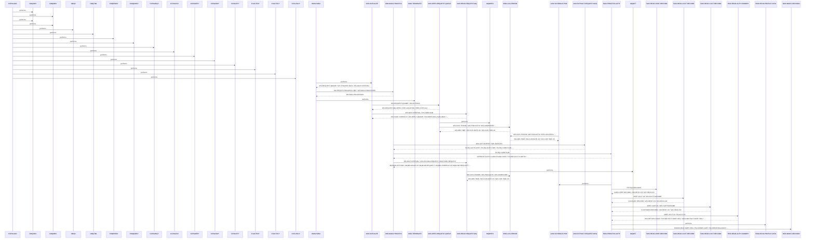
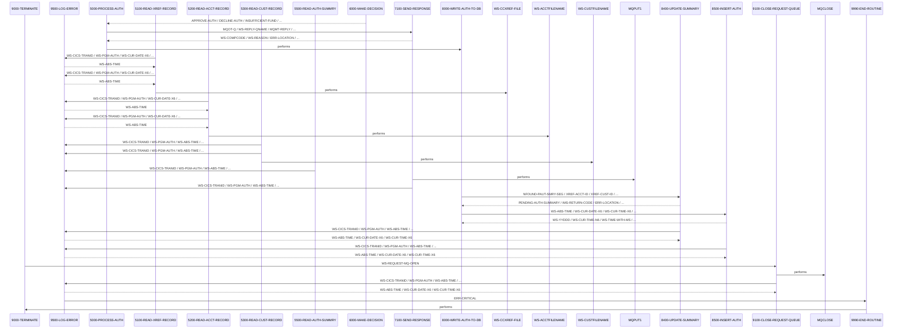

# COPAUA0C

**File**: `cbl/COPAUA0C.cbl`
**Type**: FileType.COBOL
**Analyzed**: 2026-03-04 03:39:38.119915

## Purpose

This is an empty COBOL program. It does not contain any code or logic.

## Paragraphs/Procedures

### COPAUA0C
> [Source: COPAUA0C.cbl.md](COPAUA0C.cbl.d/COPAUA0C.cbl.md)
This is the program identifier. It does not contain any executable code but serves as the entry point for the program's definition. It implicitly defines the program's name and type. The paragraph calls several CMQ*V programs, but their purpose is unknown.

### MAIN-PARA
> [Source: MAIN-PARA.cbl.md](COPAUA0C.cbl.d/MAIN-PARA.cbl.md)
This paragraph serves as the main control flow for the COPAUA0C program. It orchestrates the initialization, main processing, and termination routines. It first performs 1000-INITIALIZE to set up the environment and open the necessary resources. Then, it calls 2000-MAIN-PROCESS to handle the core business logic of processing authorization requests. Finally, it executes 9000-TERMINATE to close resources and prepare for program termination. After the termination routine, the program returns control to CICS.

### 1000-INITIALIZE
> [Source: 1000-INITIALIZE.cbl.md](COPAUA0C.cbl.d/1000-INITIALIZE.cbl.md)
This paragraph initializes the program environment. It retrieves MQTM data from CICS, which contains the request queue name and trigger data, and moves this data to working storage. It sets the wait interval for reading messages from the queue to 5000. It then performs 1100-OPEN-REQUEST-QUEUE to open the request queue and 3100-READ-REQUEST-MQ to read the first request message from the queue. The retrieved MQTM data is used to populate WS-REQUEST-QNAME and WS-TRIGGER-DATA.

### 1000-EXIT
> [Source: 1000-EXIT.cbl.md](COPAUA0C.cbl.d/1000-EXIT.cbl.md)
This paragraph is a simple exit point for the 1000-INITIALIZE paragraph, ensuring proper control flow.

### 1100-OPEN-REQUEST-QUEUE
> [Source: 1100-OPEN-REQUEST-QUEUE.cbl.md](COPAUA0C.cbl.d/1100-OPEN-REQUEST-QUEUE.cbl.md)
This paragraph opens the request queue for processing. It moves MQOT-Q to MQOD-OBJECTTYPE and WS-REQUEST-QNAME to MQOD-OBJECTNAME to define the queue to be opened. It computes WS-OPTIONS as MQOO-INPUT-SHARED, indicating that the queue is opened for shared input. It then calls MQOPEN to open the queue, passing the connection handle, object descriptor, options, object handle, completion code, and reason code. If the completion code is MQCC-OK, it sets WS-REQUEST-MQ-OPEN to TRUE; otherwise, it logs an error using 9500-LOG-ERROR, setting various error codes and messages.

### 1100-EXIT
> [Source: 1100-EXIT.cbl.md](COPAUA0C.cbl.d/1100-EXIT.cbl.md)
This paragraph is a simple exit point for the 1100-OPEN-REQUEST-QUEUE paragraph, ensuring proper control flow.

### 1200-SCHEDULE-PSB
> [Source: 1200-SCHEDULE-PSB.cbl.md](COPAUA0C.cbl.d/1200-SCHEDULE-PSB.cbl.md)
This paragraph schedules a PSB (Program Specification Block) for IMS database access. It executes a DLI SCHD command with the PSB-NAME. If the PSB has been scheduled more than once, it terminates the PSB and schedules it again. If the scheduling is successful (STATUS-OK), it sets IMS-PSB-SCHD to TRUE; otherwise, it logs an error using 9500-LOG-ERROR, setting various error codes and messages. The IMS-RETURN-CODE is updated with the DIBSTAT value after each SCHD call.

### 1200-EXIT
> [Source: 1200-EXIT.cbl.md](COPAUA0C.cbl.d/1200-EXIT.cbl.md)
This paragraph is a simple exit point for the 1200-SCHEDULE-PSB paragraph, ensuring proper control flow.

### 2000-MAIN-PROCESS
> [Source: 2000-MAIN-PROCESS.cbl.md](COPAUA0C.cbl.d/2000-MAIN-PROCESS.cbl.md)
This paragraph is the main processing loop of the program. It repeatedly performs 2100-EXTRACT-REQUEST-MSG to extract the request message, 5000-PROCESS-AUTH to process the authorization, and then increments WS-MSG-PROCESSED. It issues a CICS SYNCPOINT to commit changes. If WS-MSG-PROCESSED exceeds WS-REQSTS-PROCESS-LIMIT, it sets WS-LOOP-END to TRUE to terminate the loop. Otherwise, it performs 3100-READ-REQUEST-MQ to read the next request message. The loop continues until NO-MORE-MSG-AVAILABLE is TRUE or WS-LOOP-END is TRUE. IMS-PSB-NOT-SCHD is set to TRUE after each SYNCPOINT.

### 2000-EXIT
> [Source: 2000-EXIT.cbl.md](COPAUA0C.cbl.d/2000-EXIT.cbl.md)
This paragraph is a simple exit point for the 2000-MAIN-PROCESS paragraph, ensuring proper control flow.

### 2100-EXTRACT-REQUEST-MSG
> [Source: 2100-EXTRACT-REQUEST-MSG.cbl.md](COPAUA0C.cbl.d/2100-EXTRACT-REQUEST-MSG.cbl.md)
This paragraph extracts data from the authorization request message (W01-GET-BUFFER) received from the MQ queue. It uses the UNSTRING statement to parse the message based on the comma delimiter, moving individual data elements into corresponding fields such as PA-RQ-AUTH-DATE, PA-RQ-AUTH-TIME, PA-RQ-CARD-NUM, and others. It then converts the alphanumeric transaction amount (WS-TRANSACTION-AMT-AN) to a numeric value (PA-RQ-TRANSACTION-AMT) using the NUMVAL function. Finally, it moves PA-RQ-TRANSACTION-AMT to WS-TRANSACTION-AMT. This paragraph prepares the extracted data for subsequent processing and validation. No error handling is explicitly performed within this paragraph. It does not call any other paragraphs or programs.

### 2100-EXIT
> [Source: 2100-EXIT.cbl.md](COPAUA0C.cbl.d/2100-EXIT.cbl.md)
This paragraph serves as the exit point for the 2100-EXTRACT-REQUEST-MSG paragraph. It contains only the EXIT statement, which returns control to the calling paragraph. It does not perform any data manipulation, error handling, or call any other paragraphs or programs. Its sole purpose is to provide a standard exit point for the 2100-EXTRACT-REQUEST-MSG paragraph.

### 3100-READ-REQUEST-MQ
> [Source: 3100-READ-REQUEST-MQ.cbl.md](COPAUA0C.cbl.d/3100-READ-REQUEST-MQ.cbl.md)
This paragraph reads an authorization request message from the MQ queue. It sets the MQGMO options for the MQGET call, including MQGMO-NO-SYNCPOINT, MQGMO-WAIT, MQGMO-CONVERT, and MQGMO-FAIL-IF-QUIESCING. It moves the wait interval to MQGMO-WAITINTERVAL and sets the MQMD fields for the request. The MQGET call retrieves the message from the queue, placing it into W01-GET-BUFFER. After the MQGET call, it checks the completion code (WS-COMPCODE). If the completion code is MQCC-OK, it saves the correlation ID and reply-to queue name. If the completion code indicates an error, it checks the reason code (WS-REASON). If the reason code is MQRC-NO-MSG-AVAILABLE, it sets the NO-MORE-MSG-AVAILABLE flag to TRUE. Otherwise, it logs an error using the 9500-LOG-ERROR paragraph, including the completion code, reason code, and an error message. The paragraph consumes the MQ queue connection and object handles, and produces the message in W01-GET-BUFFER.

### 3100-EXIT
> [Source: 3100-EXIT.cbl.md](COPAUA0C.cbl.d/3100-EXIT.cbl.md)
This paragraph serves as the exit point for the 3100-READ-REQUEST-MQ paragraph. It contains only the EXIT statement, which returns control to the calling paragraph. It does not perform any data manipulation, error handling, or call any other paragraphs or programs. Its sole purpose is to provide a standard exit point for the 3100-READ-REQUEST-MQ paragraph.

### 5000-PROCESS-AUTH
> [Source: 5000-PROCESS-AUTH.cbl.md](COPAUA0C.cbl.d/5000-PROCESS-AUTH.cbl.md)
This paragraph orchestrates the authorization processing logic. It starts by setting APPROVE-AUTH to TRUE. It then performs 1200-SCHEDULE-PSB. It sets CARD-FOUND-XREF and FOUND-ACCT-IN-MSTR to TRUE. It then calls several paragraphs to read data from different files: 5100-READ-XREF-RECORD, 5200-READ-ACCT-RECORD, 5300-READ-CUST-RECORD, 5500-READ-AUTH-SUMMRY, and 5600-READ-PROFILE-DATA. These reads are conditional on CARD-FOUND-XREF being TRUE. After reading the data, it performs 6000-MAKE-DECISION and 7100-SEND-RESPONSE. Finally, if CARD-FOUND-XREF is TRUE, it performs 8000-WRITE-AUTH-TO-DB. This paragraph controls the overall flow of the authorization process, reading data, making a decision, sending a response, and writing to the database.

### 5000-EXIT
> [Source: 5000-EXIT.cbl.md](COPAUA0C.cbl.d/5000-EXIT.cbl.md)
This paragraph serves as the exit point for the 5000-PROCESS-AUTH paragraph. It contains only the EXIT statement, which returns control to the calling paragraph. It does not perform any data manipulation, error handling, or call any other paragraphs or programs. Its sole purpose is to provide a standard exit point for the 5000-PROCESS-AUTH paragraph.

### 5100-READ-XREF-RECORD
> [Source: 5100-READ-XREF-RECORD.cbl.md](COPAUA0C.cbl.d/5100-READ-XREF-RECORD.cbl.md)
This paragraph reads the card cross-reference record from the VSAM file WS-CCXREF-FILE. It moves the card number (PA-RQ-CARD-NUM) to the XREF-CARD-NUM field, which is then used as the RIDFLD for the CICS READ command. The CICS READ command retrieves the CARD-XREF-RECORD from the WS-CCXREF-FILE. The paragraph then evaluates the CICS response code (WS-RESP-CD). If the response is DFHRESP(NORMAL), it sets CARD-FOUND-XREF to TRUE. If the response is DFHRESP(NOTFND), it sets CARD-NFOUND-XREF and NFOUND-ACCT-IN-MSTR to TRUE and logs a warning message using 9500-LOG-ERROR. If the response is any other value, it logs a critical error message using 9500-LOG-ERROR. The paragraph consumes the card number from the request message and produces the card cross-reference record, or an error message if the read fails.

### 5100-EXIT
> [Source: 5100-EXIT.cbl.md](COPAUA0C.cbl.d/5100-EXIT.cbl.md)
This paragraph serves as the exit point for the 5100-READ-XREF-RECORD paragraph. It contains only the EXIT statement, which returns control to the calling paragraph. It does not perform any data manipulation, error handling, or call any other paragraphs or programs. Its sole purpose is to provide a standard exit point for the 5100-READ-XREF-RECORD paragraph.

### 5200-READ-ACCT-RECORD
> [Source: 5200-READ-ACCT-RECORD.cbl.md](COPAUA0C.cbl.d/5200-READ-ACCT-RECORD.cbl.md)
This paragraph reads the account record from the VSAM file WS-ACCTFILENAME. It moves the account ID (XREF-ACCT-ID) from the cross-reference record to WS-CARD-RID-ACCT-ID. This field is then used as the RIDFLD for the CICS READ command. The CICS READ command retrieves the ACCOUNT-RECORD from the WS-ACCTFILENAME. The paragraph then evaluates the CICS response code (WS-RESP-CD). If the response is DFHRESP(NORMAL), it sets FOUND-ACCT-IN-MSTR to TRUE. If the response is DFHRESP(NOTFND), it sets NFOUND-ACCT-IN-MSTR to TRUE and logs a warning message using 9500-LOG-ERROR. If the response is any other value, it logs a critical error message using 9500-LOG-ERROR. The paragraph consumes the account ID from the cross-reference record and produces the account record, or an error message if the read fails.

### 5200-EXIT
> [Source: 5200-EXIT.cbl.md](COPAUA0C.cbl.d/5200-EXIT.cbl.md)
This paragraph serves as the exit point for the 5200-READ-ACCT-RECORD paragraph. It contains only the EXIT statement, which returns control to the calling paragraph. It does not perform any data manipulation, error handling, or call any other paragraphs or programs. Its sole purpose is to provide a standard exit point for the 5200-READ-ACCT-RECORD paragraph.

### 5300-READ-CUST-RECORD
> [Source: 5300-READ-CUST-RECORD.cbl.md](COPAUA0C.cbl.d/5300-READ-CUST-RECORD.cbl.md)
This paragraph reads a customer record from a VSAM file (WS-CUSTFILENAME) using the customer ID (XREF-CUST-ID) as the key. It moves the customer ID to WS-CARD-RID-CUST-ID for the READ command. The paragraph uses EXEC CICS READ to retrieve the CUSTOMER-RECORD. After the read, it evaluates the CICS response code (WS-RESP-CD). If the record is found (DFHRESP(NORMAL)), it sets FOUND-CUST-IN-MSTR to TRUE. If the record is not found (DFHRESP(NOTFND)), it sets NFOUND-CUST-IN-MSTR to TRUE, logs an error message using 9500-LOG-ERROR, and sets error flags. If any other error occurs during the read, it logs a critical error with the CICS response codes to the error log using 9500-LOG-ERROR and sets appropriate error flags. This paragraph is crucial for obtaining customer details needed for authorization.

### 5300-EXIT
> [Source: 5300-EXIT.cbl.md](COPAUA0C.cbl.d/5300-EXIT.cbl.md)
This paragraph provides a standard exit point for the 5300-READ-CUST-RECORD paragraph. It simply contains an EXIT statement, allowing control to return to the calling paragraph. This ensures a consistent and structured way to leave the 5300-READ-CUST-RECORD paragraph, regardless of the path taken through its logic. It does not perform any specific actions or data manipulation. It is a simple control statement for structured programming.

### 5500-READ-AUTH-SUMMRY
> [Source: 5500-READ-AUTH-SUMMRY.cbl.md](COPAUA0C.cbl.d/5500-READ-AUTH-SUMMRY.cbl.md)
This paragraph reads a pending authorization summary from an IMS database using the account ID (XREF-ACCT-ID) as the key. It moves the account ID to PA-ACCT-ID for the IMS call. The paragraph uses EXEC DLI GU to retrieve the PAUTSUM0 segment into PENDING-AUTH-SUMMARY. After the read, it checks the IMS return code (DIBSTAT) and moves it to IMS-RETURN-CODE. If the segment is found (STATUS-OK), it sets FOUND-PAUT-SMRY-SEG to TRUE. If the segment is not found (SEGMENT-NOT-FOUND), it sets NFOUND-PAUT-SMRY-SEG to TRUE. If any other error occurs during the read, it logs a critical error with the IMS return code to the error log using 9500-LOG-ERROR and sets appropriate error flags. This paragraph is crucial for obtaining pending authorization details needed for the authorization decision.

### 5500-EXIT
> [Source: 5500-EXIT.cbl.md](COPAUA0C.cbl.d/5500-EXIT.cbl.md)
This paragraph provides a standard exit point for the 5500-READ-AUTH-SUMMRY paragraph. It simply contains an EXIT statement, allowing control to return to the calling paragraph. This ensures a consistent and structured way to leave the 5500-READ-AUTH-SUMMRY paragraph, regardless of the path taken through its logic. It does not perform any specific actions or data manipulation. It is a simple control statement for structured programming.

### 5600-READ-PROFILE-DATA
> [Source: 5600-READ-PROFILE-DATA.cbl.md](COPAUA0C.cbl.d/5600-READ-PROFILE-DATA.cbl.md)
This paragraph is a placeholder and currently contains only a CONTINUE statement. It does not perform any data retrieval or processing. It serves as a stub that might be implemented in future versions to read profile data. Currently, it does not interact with any files or databases, nor does it call any other paragraphs. The presence of this paragraph suggests that profile data might be relevant to the authorization process in the future.

### 5600-EXIT
> [Source: 5600-EXIT.cbl.md](COPAUA0C.cbl.d/5600-EXIT.cbl.md)
This paragraph provides a standard exit point for the 5600-READ-PROFILE-DATA paragraph. It simply contains an EXIT statement, allowing control to return to the calling paragraph. This ensures a consistent and structured way to leave the 5600-READ-PROFILE-DATA paragraph, regardless of the path taken through its logic. It does not perform any specific actions or data manipulation. It is a simple control statement for structured programming.

### 6000-MAKE-DECISION
> [Source: 6000-MAKE-DECISION.cbl.md](COPAUA0C.cbl.d/6000-MAKE-DECISION.cbl.md)
This paragraph determines whether to approve or decline the authorization request. It first moves data from request fields (PA-RQ-*) to response fields (PA-RL-*). It then checks if a pending authorization summary was found (FOUND-PAUT-SMRY-SEG). If so, it calculates available credit (WS-AVAILABLE-AMT) based on the pending authorization summary's credit limit and balance. If not, it checks if an account master record was found (FOUND-ACCT-IN-MSTR) and calculates available credit based on the account master's credit limit and current balance. If neither is found, the transaction is declined. If the transaction amount (WS-TRANSACTION-AMT) exceeds the available credit, the transaction is declined (DECLINE-AUTH is set to TRUE). Based on the authorization decision, it sets the authorization response code (PA-RL-AUTH-RESP-CODE) and approved amount (PA-RL-APPROVED-AMT). Finally, it sets the authorization response reason code (PA-RL-AUTH-RESP-REASON) based on various conditions, such as card not found, insufficient funds, or fraud. The paragraph then formats the response message into W02-PUT-BUFFER using the STRING statement.

### 6000-EXIT
> [Source: 6000-EXIT.cbl.md](COPAUA0C.cbl.d/6000-EXIT.cbl.md)
This paragraph provides a standard exit point for the 6000-MAKE-DECISION paragraph. It simply contains an EXIT statement, allowing control to return to the calling paragraph. This ensures a consistent and structured way to leave the 6000-MAKE-DECISION paragraph, regardless of the path taken through its logic. It does not perform any specific actions or data manipulation. It is a simple control statement for structured programming.

### 7100-SEND-RESPONSE
> [Source: 7100-SEND-RESPONSE.cbl.md](COPAUA0C.cbl.d/7100-SEND-RESPONSE.cbl.md)
This paragraph sends the authorization response message to the MQSeries reply queue. It sets the MQSeries object type (MQOT-Q) and object name (WS-REPLY-QNAME) in the MQ object descriptor (MQM-OD-REPLY). It sets the message type (MQMT-REPLY) and correlation ID (WS-SAVE-CORRELID) in the MQ message descriptor (MQM-MD-REPLY). It also sets other MQ message descriptor fields, such as persistence and expiry. The paragraph then calls MQPUT1 to send the message, passing the connection handle, object descriptor, message descriptor, put message options, buffer length, buffer, completion code, and reason code. If the MQPUT1 call fails, it logs a critical error with the completion code and reason code to the error log using 9500-LOG-ERROR and sets appropriate error flags. This paragraph is crucial for sending the authorization decision back to the requesting application.

### 7100-EXIT
> [Source: 7100-EXIT.cbl.md](COPAUA0C.cbl.d/7100-EXIT.cbl.md)
This paragraph provides a standard exit point for the 7100-SEND-RESPONSE paragraph. It simply contains an EXIT statement, allowing control to return to the calling paragraph. This ensures a consistent and structured way to leave the 7100-SEND-RESPONSE paragraph, regardless of the path taken through its logic. It does not perform any specific actions or data manipulation. It is a simple control statement for structured programming.

### 8000-WRITE-AUTH-TO-DB
> [Source: 8000-WRITE-AUTH-TO-DB.cbl.md](COPAUA0C.cbl.d/8000-WRITE-AUTH-TO-DB.cbl.md)
This paragraph serves as a control point for writing authorization information to the database. It orchestrates the update of the pending authorization summary and the insertion of the authorization details. It first performs 8400-UPDATE-SUMMARY to update the summary record in the IMS database with information about the approved or declined authorization. Then, it performs 8500-INSERT-AUTH to insert the detailed authorization information into the IMS database. This paragraph does not directly handle any data manipulation or error conditions; it delegates these tasks to the called paragraphs. The paragraph ensures that both the summary and detail records are updated for each authorization processed.

### 8000-EXIT
> [Source: 8000-EXIT.cbl.md](COPAUA0C.cbl.d/8000-EXIT.cbl.md)
This paragraph provides a standard exit point for the 8000-WRITE-AUTH-TO-DB paragraph. It contains only the EXIT statement, which allows control to return to the calling paragraph. This paragraph does not perform any processing or data manipulation. It serves solely as a structural element to facilitate the PERFORM THRU construct used in the calling paragraph. This ensures a clean and controlled exit from the 8000-WRITE-AUTH-TO-DB process.

### 8400-UPDATE-SUMMARY
> [Source: 8400-UPDATE-SUMMARY.cbl.md](COPAUA0C.cbl.d/8400-UPDATE-SUMMARY.cbl.md)
This paragraph updates the pending authorization summary in the IMS database. It first checks if a summary record already exists for the account. If not (NFOUND-PAUT-SMRY-SEG is true), it initializes the PENDING-AUTH-SUMMARY, moves the account and customer IDs from XREF-ACCT-ID and XREF-CUST-ID to the summary record. It then moves the account credit limits to the summary record. Based on whether the authorization was approved or declined (AUTH-RESP-APPROVED), it increments the appropriate counters and amounts in the summary record. Finally, it either updates the existing summary record (FOUND-PAUT-SMRY-SEG) or inserts a new one into the IMS database using EXEC DLI REPL or ISRT respectively. If the IMS update fails, it logs an error using 9500-LOG-ERROR.

### 8400-EXIT
> [Source: 8400-EXIT.cbl.md](COPAUA0C.cbl.d/8400-EXIT.cbl.md)
This paragraph provides a standard exit point for the 8400-UPDATE-SUMMARY paragraph. It contains only the EXIT statement, which allows control to return to the calling paragraph. This paragraph does not perform any processing or data manipulation. It serves solely as a structural element to facilitate the PERFORM THRU construct used in the calling paragraph. This ensures a clean and controlled exit from the 8400-UPDATE-SUMMARY process.

### 8500-INSERT-AUTH
> [Source: 8500-INSERT-AUTH.cbl.md](COPAUA0C.cbl.d/8500-INSERT-AUTH.cbl.md)
This paragraph inserts detailed authorization information into the IMS database. It first retrieves the current date and time using CICS ASKTIME and FORMATTIME commands, converting them into specific formats for storage. It then moves data from the authorization request (PA-RQ-*) and response (PA-RL-*) fields into the PENDING-AUTH-DETAILS record. Based on whether the authorization was approved or declined (AUTH-RESP-APPROVED), it sets either PA-MATCH-PENDING or PA-MATCH-AUTH-DECLINED to TRUE. It then inserts the detailed authorization record into the IMS database using EXEC DLI ISRT. If the IMS insert fails, it logs an error using 9500-LOG-ERROR.

### 8500-EXIT
> [Source: 8500-EXIT.cbl.md](COPAUA0C.cbl.d/8500-EXIT.cbl.md)
This paragraph provides a standard exit point for the 8500-INSERT-AUTH paragraph. It contains only the EXIT statement, which allows control to return to the calling paragraph. This paragraph does not perform any processing or data manipulation. It serves solely as a structural element to facilitate the PERFORM THRU construct used in the calling paragraph. This ensures a clean and controlled exit from the 8500-INSERT-AUTH process.

### 9000-TERMINATE
> [Source: 9000-TERMINATE.cbl.md](COPAUA0C.cbl.d/9000-TERMINATE.cbl.md)
This paragraph handles the termination of the program. It first checks if the IMS PSB has been scheduled (IMS-PSB-SCHD). If so, it terminates the IMS PSB using EXEC DLI TERM. It then performs 9100-CLOSE-REQUEST-QUEUE to close the MQSeries request queue. This paragraph ensures that both the IMS connection and the MQSeries queue are properly closed before the program ends. The paragraph does not directly handle any data manipulation; it delegates the queue closure to the 9100-CLOSE-REQUEST-QUEUE paragraph.

### 9000-EXIT
> [Source: 9000-EXIT.cbl.md](COPAUA0C.cbl.d/9000-EXIT.cbl.md)
This paragraph provides a standard exit point for the 9000-TERMINATE paragraph. It contains only the EXIT statement, which allows control to return to the calling paragraph. This paragraph does not perform any processing or data manipulation. It serves solely as a structural element to facilitate the PERFORM THRU construct used in the calling paragraph. This ensures a clean and controlled exit from the 9000-TERMINATE process.

### 9100-CLOSE-REQUEST-QUEUE
> [Source: 9100-CLOSE-REQUEST-QUEUE.cbl.md](COPAUA0C.cbl.d/9100-CLOSE-REQUEST-QUEUE.cbl.md)
This paragraph closes the MQSeries request queue if it is open. It checks if the queue is open (WS-REQUEST-MQ-OPEN). If so, it calls the MQCLOSE program to close the queue, passing the connection handle (W01-HCONN-REQUEST), object handle (W01-HOBJ-REQUEST), and other necessary parameters. After the MQCLOSE call, it checks the completion code (WS-COMPCODE). If the closure was successful (MQCC-OK), it sets WS-REQUEST-MQ-CLSE to TRUE. Otherwise, it logs an error using 9500-LOG-ERROR, including the completion code and reason code from the MQCLOSE call.

### 9100-EXIT
> [Source: 9100-EXIT.cbl.md](COPAUA0C.cbl.d/9100-EXIT.cbl.md)
This paragraph provides a standard exit point for the 9100-CLOSE-REQUEST-QUEUE paragraph. It contains only the EXIT statement, which allows control to return to the calling paragraph. This paragraph does not perform any processing or data manipulation. It serves solely as a structural element to facilitate the PERFORM THRU construct used in the calling paragraph. This ensures a clean and controlled exit from the 9100-CLOSE-REQUEST-QUEUE process.

### 9500-LOG-ERROR
> [Source: 9500-LOG-ERROR.cbl.md](COPAUA0C.cbl.d/9500-LOG-ERROR.cbl.md)
This paragraph is the main error logging routine. It retrieves the current date and time using CICS ASKTIME and FORMATTIME commands (lines 4-12). It then moves the CICS transaction ID (WS-CICS-TRANID), program name (WS-PGM-AUTH), current date (WS-CUR-DATE-X6), and current time (WS-CUR-TIME-X6) into the ERROR-LOG-RECORD (lines 14-17). The ERROR-LOG-RECORD is then written to the CSSL transient data queue using a CICS WRITEQ TD command (lines 19-24). Finally, it checks if the error is critical (ERR-CRITICAL) and, if so, performs the 9990-END-ROUTINE to terminate the CICS task (lines 26-28).

### 9500-EXIT
> [Source: 9500-EXIT.cbl.md](COPAUA0C.cbl.d/9500-EXIT.cbl.md)
This paragraph provides a standard exit point from the 9500-LOG-ERROR paragraph. It consists solely of the EXIT statement and returns control to the calling paragraph.

### 9990-END-ROUTINE
> [Source: 9990-END-ROUTINE.cbl.md](COPAUA0C.cbl.d/9990-END-ROUTINE.cbl.md)
This paragraph is responsible for terminating the CICS task. It first calls the 9000-TERMINATE paragraph (line 37), presumably to perform cleanup or other termination procedures. After 9000-TERMINATE completes, it issues a CICS RETURN command (lines 39-40) to end the current CICS task and return control to CICS.

### 9990-EXIT
> [Source: 9990-EXIT.cbl.md](COPAUA0C.cbl.d/9990-EXIT.cbl.md)
This paragraph provides a standard exit point from the 9990-END-ROUTINE paragraph. It consists solely of the EXIT statement and returns control to the calling paragraph.

## Dead Code

The following artifacts were identified as dead code by static analysis:

| Artifact | Type | Line | Reason |
|----------|------|------|--------|
| exec-017 | function | 986 | Function 'exec-017' is never called by any other artifact |
| exec-018 | function | 990 | Function 'exec-018' is never called by any other artifact |
| exec-019 | function | 1001 | Function 'exec-019' is never called by any other artifact |
| exec-020 | function | 1021 | Function 'exec-020' is never called by any other artifact |
| ERROR-LOG-RECORD | record_layout | 19 | Record layout 'ERROR-LOG-RECORD' is never used by any program |
| MQM-CONSTANTS | record_layout | 160 | Record layout 'MQM-CONSTANTS' is never used by any program |
| MQM-GET-MESSAGE-OPTIONS | record_layout | 169 | Record layout 'MQM-GET-MESSAGE-OPTIONS' is never used by any program |
| MQM-MD-REPLY | record_layout | 157 | Record layout 'MQM-MD-REPLY' is never used by any program |
| MQM-MD-REQUEST | record_layout | 151 | Record layout 'MQM-MD-REQUEST' is never used by any program |
| MQM-OD-REPLY | record_layout | 154 | Record layout 'MQM-OD-REPLY' is never used by any program |
| MQM-OD-REQUEST | record_layout | 148 | Record layout 'MQM-OD-REQUEST' is never used by any program |
| MQM-PUT-MESSAGE-OPTIONS | record_layout | 166 | Record layout 'MQM-PUT-MESSAGE-OPTIONS' is never used by any program |
| MQM-TRIGGER-DATA | record_layout | 163 | Record layout 'MQM-TRIGGER-DATA' is never used by any program |
| PENDING-AUTH-REQUEST | record_layout | 177 | Record layout 'PENDING-AUTH-REQUEST' is never used by any program |
| PENDING-AUTH-RESPONSE | record_layout | 181 | Record layout 'PENDING-AUTH-RESPONSE' is never used by any program |
| W01-BUFFLEN | record_layout | 101 | Record layout 'W01-BUFFLEN' is never used by any program |
| W01-DATALEN | record_layout | 102 | Record layout 'W01-DATALEN' is never used by any program |
| W01-GET-BUFFER | record_layout | 103 | Record layout 'W01-GET-BUFFER' is never used by any program |
| W01-HCONN-REQUEST | record_layout | 99 | Record layout 'W01-HCONN-REQUEST' is never used by any program |
| W01-HOBJ-REQUEST | record_layout | 100 | Record layout 'W01-HOBJ-REQUEST' is never used by any program |
| W02-BUFFLEN | record_layout | 106 | Record layout 'W02-BUFFLEN' is never used by any program |
| W02-DATALEN | record_layout | 107 | Record layout 'W02-DATALEN' is never used by any program |
| W02-HCONN-REPLY | record_layout | 105 | Record layout 'W02-HCONN-REPLY' is never used by any program |
| W02-PUT-BUFFER | record_layout | 108 | Record layout 'W02-PUT-BUFFER' is never used by any program |

## Control Flow

```mermaid
flowchart TD
    %% Title: COPAUA0C.cbl
    1000_EXIT["1000-EXIT"]
    1000_INITIALIZE["1000-INITIALIZE"]
    1100_OPEN_REQUEST_QUEUE["1100-OPEN-REQUEST-QUEUE"]
    3100_READ_REQUEST_MQ["3100-READ-REQUEST-MQ"]
    1100_EXIT["1100-EXIT"]
    9500_LOG_ERROR["9500-LOG-ERROR"]
    MQOPEN__ext(["MQOPEN"])
    1200_EXIT["1200-EXIT"]
    1200_SCHEDULE_PSB["1200-SCHEDULE-PSB"]
    2000_EXIT["2000-EXIT"]
    2000_MAIN_PROCESS["2000-MAIN-PROCESS"]
    2100_EXTRACT_REQUEST_MSG["2100-EXTRACT-REQUEST-MSG"]
    5000_PROCESS_AUTH["5000-PROCESS-AUTH"]
    2100_EXIT["2100-EXIT"]
    3100_EXIT["3100-EXIT"]
    MQGET__ext(["MQGET"])
    5000_EXIT["5000-EXIT"]
    5100_READ_XREF_RECORD["5100-READ-XREF-RECORD"]
    5200_READ_ACCT_RECORD["5200-READ-ACCT-RECORD"]
    5300_READ_CUST_RECORD["5300-READ-CUST-RECORD"]
    5500_READ_AUTH_SUMMRY["5500-READ-AUTH-SUMMRY"]
    5600_READ_PROFILE_DATA["5600-READ-PROFILE-DATA"]
    6000_MAKE_DECISION["6000-MAKE-DECISION"]
    7100_SEND_RESPONSE["7100-SEND-RESPONSE"]
    8000_WRITE_AUTH_TO_DB["8000-WRITE-AUTH-TO-DB"]
    5100_EXIT["5100-EXIT"]
    WS_CCXREF_FILE__ext[("WS-CCXREF-FILE")]
    5200_EXIT["5200-EXIT"]
    WS_ACCTFILENAME__ext[("WS-ACCTFILENAME")]
    5300_EXIT["5300-EXIT"]
    WS_CUSTFILENAME__ext[("WS-CUSTFILENAME")]
    5500_EXIT["5500-EXIT"]
    5600_EXIT["5600-EXIT"]
    6000_EXIT["6000-EXIT"]
    7100_EXIT["7100-EXIT"]
    MQPUT1__ext(["MQPUT1"])
    8000_EXIT["8000-EXIT"]
    8400_UPDATE_SUMMARY["8400-UPDATE-SUMMARY"]
    8500_INSERT_AUTH["8500-INSERT-AUTH"]
    8400_EXIT["8400-EXIT"]
    8500_EXIT["8500-EXIT"]
    9000_EXIT["9000-EXIT"]
    9000_TERMINATE["9000-TERMINATE"]
    9100_CLOSE_REQUEST_QUEUE["9100-CLOSE-REQUEST-QUEUE"]
    MQCLOSE__ext(["MQCLOSE"])
    9100_EXIT["9100-EXIT"]
    9500_EXIT["9500-EXIT"]
    9990_END_ROUTINE["9990-END-ROUTINE"]
    9990_EXIT["9990-EXIT"]
    MAIN_PARA["MAIN-PARA"]
    1000_INITIALIZE --> 1100_OPEN_REQUEST_QUEUE
    1000_INITIALIZE --> 3100_READ_REQUEST_MQ
    1100_OPEN_REQUEST_QUEUE --> 9500_LOG_ERROR
    1100_OPEN_REQUEST_QUEUE -.->|calls| MQOPEN__ext
    1200_SCHEDULE_PSB --> 9500_LOG_ERROR
    2000_MAIN_PROCESS --> 2100_EXTRACT_REQUEST_MSG
    2000_MAIN_PROCESS --> 3100_READ_REQUEST_MQ
    2000_MAIN_PROCESS --> 5000_PROCESS_AUTH
    3100_READ_REQUEST_MQ --> 9500_LOG_ERROR
    3100_READ_REQUEST_MQ -.->|calls| MQGET__ext
    5000_PROCESS_AUTH --> 1200_SCHEDULE_PSB
    5000_PROCESS_AUTH --> 5100_READ_XREF_RECORD
    5000_PROCESS_AUTH --> 5200_READ_ACCT_RECORD
    5000_PROCESS_AUTH --> 5300_READ_CUST_RECORD
    5000_PROCESS_AUTH --> 5500_READ_AUTH_SUMMRY
    5000_PROCESS_AUTH --> 5600_READ_PROFILE_DATA
    5000_PROCESS_AUTH --> 6000_MAKE_DECISION
    5000_PROCESS_AUTH --> 7100_SEND_RESPONSE
    5000_PROCESS_AUTH --> 8000_WRITE_AUTH_TO_DB
    5100_READ_XREF_RECORD --> 9500_LOG_ERROR
    5100_READ_XREF_RECORD -.->|reads| WS_CCXREF_FILE__ext
    5200_READ_ACCT_RECORD --> 9500_LOG_ERROR
    5200_READ_ACCT_RECORD -.->|reads| WS_ACCTFILENAME__ext
    5300_READ_CUST_RECORD --> 9500_LOG_ERROR
    5300_READ_CUST_RECORD -.->|reads| WS_CUSTFILENAME__ext
    5500_READ_AUTH_SUMMRY --> 9500_LOG_ERROR
    7100_SEND_RESPONSE --> 9500_LOG_ERROR
    7100_SEND_RESPONSE -.->|calls| MQPUT1__ext
    8000_WRITE_AUTH_TO_DB --> 8400_UPDATE_SUMMARY
    8000_WRITE_AUTH_TO_DB --> 8500_INSERT_AUTH
    8400_UPDATE_SUMMARY --> 9500_LOG_ERROR
    8500_INSERT_AUTH --> 9500_LOG_ERROR
    9000_TERMINATE --> 9100_CLOSE_REQUEST_QUEUE
    9100_CLOSE_REQUEST_QUEUE --> 9500_LOG_ERROR
    9100_CLOSE_REQUEST_QUEUE -.->|calls| MQCLOSE__ext
    9500_LOG_ERROR --> 9990_END_ROUTINE
    9990_END_ROUTINE --> 9000_TERMINATE
    MAIN_PARA --> 1000_INITIALIZE
    MAIN_PARA --> 2000_MAIN_PROCESS
    MAIN_PARA --> 9000_TERMINATE
```

## Open Questions

- ? What is the intended purpose of this empty COBOL program?
  - Context: The program contains no code, making it impossible to determine its purpose.

## Sequence Diagram

### Part 1 of 2

```mermaid
sequenceDiagram
    participant COPAUA0C as COPAUA0C
    participant CMQODV as CMQODV
    participant CMQMDV as CMQMDV
    participant CMQV as CMQV
    participant CMQTML as CMQTML
    participant CMQPMOV as CMQPMOV
    participant CMQGMOV as CMQGMOV
    participant CCPAURQY as CCPAURQY
    participant CCPAURLY as CCPAURLY
    participant CCPAUERY as CCPAUERY
    participant CIPAUSMY as CIPAUSMY
    participant CIPAUDTY as CIPAUDTY
    participant CVACT03Y as CVACT03Y
    participant CVACT01Y as CVACT01Y
    participant CVCUS01Y as CVCUS01Y
    participant MAIN_PARA as MAIN-PARA
    participant 1000_INITIALIZE as 1000-INITIALIZE
    participant 2000_MAIN_PROCESS as 2000-MAIN-PROCESS
    participant 9000_TERMINATE as 9000-TERMINATE
    participant 1100_OPEN_REQUEST_QUEUE as 1100-OPEN-REQUEST-QUEUE
    participant 3100_READ_REQUEST_MQ as 3100-READ-REQUEST-MQ
    participant MQOPEN as MQOPEN
    participant 9500_LOG_ERROR as 9500-LOG-ERROR
    participant 1200_SCHEDULE_PSB as 1200-SCHEDULE-PSB
    participant 2100_EXTRACT_REQUEST_MSG as 2100-EXTRACT-REQUEST-MSG
    participant 5000_PROCESS_AUTH as 5000-PROCESS-AUTH
    participant MQGET as MQGET
    participant 5100_READ_XREF_RECORD as 5100-READ-XREF-RECORD
    participant 5200_READ_ACCT_RECORD as 5200-READ-ACCT-RECORD
    participant 5300_READ_CUST_RECORD as 5300-READ-CUST-RECORD
    participant 5500_READ_AUTH_SUMMRY as 5500-READ-AUTH-SUMMRY
    participant 5600_READ_PROFILE_DATA as 5600-READ-PROFILE-DATA
    participant 6000_MAKE_DECISION as 6000-MAKE-DECISION
    COPAUA0C->>CMQODV: performs
    COPAUA0C->>CMQMDV: performs
    COPAUA0C->>CMQODV: performs
    COPAUA0C->>CMQMDV: performs
    COPAUA0C->>CMQV: performs
    COPAUA0C->>CMQTML: performs
    COPAUA0C->>CMQPMOV: performs
    COPAUA0C->>CMQGMOV: performs
    COPAUA0C->>CCPAURQY: performs
    COPAUA0C->>CCPAURLY: performs
    COPAUA0C->>CCPAUERY: performs
    COPAUA0C->>CIPAUSMY: performs
    COPAUA0C->>CIPAUDTY: performs
    COPAUA0C->>CVACT03Y: performs
    COPAUA0C->>CVACT01Y: performs
    COPAUA0C->>CVCUS01Y: performs
    MAIN_PARA->>1000_INITIALIZE: performs
    1000_INITIALIZE-->>MAIN_PARA: WS-REQUEST-QNAME / WS-TRIGGER-DATA / WS-WAIT-INTERVAL
    MAIN_PARA->>2000_MAIN_PROCESS: WS-REQSTS-PROCESS-LIMIT / WS-MSG-PROCESSED
    2000_MAIN_PROCESS-->>MAIN_PARA: WS-MSG-PROCESSED
    MAIN_PARA->>9000_TERMINATE: performs
    1000_INITIALIZE->>1100_OPEN_REQUEST_QUEUE: WS-REQUEST-QNAME / WS-OPTIONS
    1100_OPEN_REQUEST_QUEUE-->>1000_INITIALIZE: WS-REQUEST-MQ-OPEN / ERR-LOCATION / ERR-CRITICAL / ...
    1000_INITIALIZE->>3100_READ_REQUEST_MQ: WS-WAIT-INTERVAL / PA-CARD-NUM
    3100_READ_REQUEST_MQ-->>1000_INITIALIZE: WS-SAVE-CORRELID / WS-REPLY-QNAME / NO-MORE-MSG-AVAILABLE / ...
    1100_OPEN_REQUEST_QUEUE->>MQOPEN: performs
    1100_OPEN_REQUEST_QUEUE->>9500_LOG_ERROR: WS-CICS-TRANID / WS-PGM-AUTH / WS-COMPCODE / ...
    9500_LOG_ERROR-->>1100_OPEN_REQUEST_QUEUE: WS-ABS-TIME / WS-CUR-DATE-X6 / WS-CUR-TIME-X6
    1200_SCHEDULE_PSB->>9500_LOG_ERROR: WS-CICS-TRANID / WS-PGM-AUTH / ERR-LOCATION / ...
    9500_LOG_ERROR-->>1200_SCHEDULE_PSB: WS-ABS-TIME / WS-CUR-DATE-X6 / WS-CUR-TIME-X6
    2000_MAIN_PROCESS->>2100_EXTRACT_REQUEST_MSG: W01-GET-BUFFER / W01-DATALEN
    2100_EXTRACT_REQUEST_MSG-->>2000_MAIN_PROCESS: PA-RQ-AUTH-DATE / PA-RQ-AUTH-TIME / PA-RQ-CARD-NUM / ...
    2000_MAIN_PROCESS->>5000_PROCESS_AUTH: PA-RQ-CARD-NUM
    5000_PROCESS_AUTH-->>2000_MAIN_PROCESS: APPROVE-AUTH / CARD-FOUND-XREF / FOUND-ACCT-IN-MSTR / ...
    2000_MAIN_PROCESS->>3100_READ_REQUEST_MQ: WS-WAIT-INTERVAL / W01-HCONN-REQUEST / W01-HOBJ-REQUEST
    3100_READ_REQUEST_MQ-->>2000_MAIN_PROCESS: MQGMO-OPTIONS / MQMD-MSGID OF MQM-MD-REQUEST / MQMD-CORRELID OF MQM-MD-REQUEST / ...
    3100_READ_REQUEST_MQ->>MQGET: performs
    3100_READ_REQUEST_MQ->>9500_LOG_ERROR: WS-CICS-TRANID / WS-PGM-AUTH / WS-COMPCODE / ...
    9500_LOG_ERROR-->>3100_READ_REQUEST_MQ: WS-ABS-TIME / WS-CUR-DATE-X6 / WS-CUR-TIME-X6
    5000_PROCESS_AUTH->>1200_SCHEDULE_PSB: performs
    5000_PROCESS_AUTH->>5100_READ_XREF_RECORD: PA-RQ-CARD-NUM
    5100_READ_XREF_RECORD-->>5000_PROCESS_AUTH: CARD-XREF-RECORD / WS-RESP-CD / WS-REAS-CD
    5000_PROCESS_AUTH->>5200_READ_ACCT_RECORD: XREF-ACCT-ID / WS-ACCTFILENAME
    5200_READ_ACCT_RECORD-->>5000_PROCESS_AUTH: ACCOUNT-RECORD / WS-RESP-CD / WS-REAS-CD
    5000_PROCESS_AUTH->>5300_READ_CUST_RECORD: XREF-CUST-ID / WS-CUSTFILENAME
    5300_READ_CUST_RECORD-->>5000_PROCESS_AUTH: CUSTOMER-RECORD / WS-RESP-CD / WS-REAS-CD
    5000_PROCESS_AUTH->>5500_READ_AUTH_SUMMRY: XREF-ACCT-ID / PA-ACCT-ID
    5500_READ_AUTH_SUMMRY-->>5000_PROCESS_AUTH: IMS-RETURN-CODE / FOUND-PAUT-SMRY-SEG / NFOUND-PAUT-SMRY-SEG / ...
    5000_PROCESS_AUTH->>5600_READ_PROFILE_DATA: performs
    5000_PROCESS_AUTH->>6000_MAKE_DECISION: FOUND-PAUT-SMRY-SEG / PA-CREDIT-LIMIT / PA-CREDIT-BALANCE / ...
```

### Part 2 of 2

```mermaid
sequenceDiagram
    participant 9000_TERMINATE as 9000-TERMINATE
    participant 9500_LOG_ERROR as 9500-LOG-ERROR
    participant 5000_PROCESS_AUTH as 5000-PROCESS-AUTH
    participant 5100_READ_XREF_RECORD as 5100-READ-XREF-RECORD
    participant 5200_READ_ACCT_RECORD as 5200-READ-ACCT-RECORD
    participant 5300_READ_CUST_RECORD as 5300-READ-CUST-RECORD
    participant 5500_READ_AUTH_SUMMRY as 5500-READ-AUTH-SUMMRY
    participant 6000_MAKE_DECISION as 6000-MAKE-DECISION
    participant 7100_SEND_RESPONSE as 7100-SEND-RESPONSE
    participant 8000_WRITE_AUTH_TO_DB as 8000-WRITE-AUTH-TO-DB
    participant WS_CCXREF_FILE as WS-CCXREF-FILE
    participant WS_ACCTFILENAME as WS-ACCTFILENAME
    participant WS_CUSTFILENAME as WS-CUSTFILENAME
    participant MQPUT1 as MQPUT1
    participant 8400_UPDATE_SUMMARY as 8400-UPDATE-SUMMARY
    participant 8500_INSERT_AUTH as 8500-INSERT-AUTH
    participant 9100_CLOSE_REQUEST_QUEUE as 9100-CLOSE-REQUEST-QUEUE
    participant MQCLOSE as MQCLOSE
    participant 9990_END_ROUTINE as 9990-END-ROUTINE
    6000_MAKE_DECISION-->>5000_PROCESS_AUTH: APPROVE-AUTH / DECLINE-AUTH / INSUFFICIENT-FUND / ...
    5000_PROCESS_AUTH->>7100_SEND_RESPONSE: MQOT-Q / WS-REPLY-QNAME / MQMT-REPLY / ...
    7100_SEND_RESPONSE-->>5000_PROCESS_AUTH: WS-COMPCODE / WS-REASON / ERR-LOCATION / ...
    5000_PROCESS_AUTH->>8000_WRITE_AUTH_TO_DB: performs
    5100_READ_XREF_RECORD->>9500_LOG_ERROR: WS-CICS-TRANID / WS-PGM-AUTH / WS-CUR-DATE-X6 / ...
    9500_LOG_ERROR-->>5100_READ_XREF_RECORD: WS-ABS-TIME
    5100_READ_XREF_RECORD->>9500_LOG_ERROR: WS-CICS-TRANID / WS-PGM-AUTH / WS-CUR-DATE-X6 / ...
    9500_LOG_ERROR-->>5100_READ_XREF_RECORD: WS-ABS-TIME
    5100_READ_XREF_RECORD->>WS_CCXREF_FILE: performs
    5200_READ_ACCT_RECORD->>9500_LOG_ERROR: WS-CICS-TRANID / WS-PGM-AUTH / WS-CUR-DATE-X6 / ...
    9500_LOG_ERROR-->>5200_READ_ACCT_RECORD: WS-ABS-TIME
    5200_READ_ACCT_RECORD->>9500_LOG_ERROR: WS-CICS-TRANID / WS-PGM-AUTH / WS-CUR-DATE-X6 / ...
    9500_LOG_ERROR-->>5200_READ_ACCT_RECORD: WS-ABS-TIME
    5200_READ_ACCT_RECORD->>WS_ACCTFILENAME: performs
    5300_READ_CUST_RECORD->>9500_LOG_ERROR: WS-CICS-TRANID / WS-PGM-AUTH / WS-ABS-TIME / ...
    5300_READ_CUST_RECORD->>9500_LOG_ERROR: WS-CICS-TRANID / WS-PGM-AUTH / WS-ABS-TIME / ...
    5300_READ_CUST_RECORD->>WS_CUSTFILENAME: performs
    5500_READ_AUTH_SUMMRY->>9500_LOG_ERROR: WS-CICS-TRANID / WS-PGM-AUTH / WS-ABS-TIME / ...
    7100_SEND_RESPONSE->>MQPUT1: performs
    7100_SEND_RESPONSE->>9500_LOG_ERROR: WS-CICS-TRANID / WS-PGM-AUTH / WS-ABS-TIME / ...
    8000_WRITE_AUTH_TO_DB->>8400_UPDATE_SUMMARY: NFOUND-PAUT-SMRY-SEG / XREF-ACCT-ID / XREF-CUST-ID / ...
    8400_UPDATE_SUMMARY-->>8000_WRITE_AUTH_TO_DB: PENDING-AUTH-SUMMARY / IMS-RETURN-CODE / ERR-LOCATION / ...
    8000_WRITE_AUTH_TO_DB->>8500_INSERT_AUTH: WS-ABS-TIME / WS-CUR-DATE-X6 / WS-CUR-TIME-X6 / ...
    8500_INSERT_AUTH-->>8000_WRITE_AUTH_TO_DB: WS-YYDDD / WS-CUR-TIME-N6 / WS-TIME-WITH-MS / ...
    8400_UPDATE_SUMMARY->>9500_LOG_ERROR: WS-CICS-TRANID / WS-PGM-AUTH / WS-ABS-TIME / ...
    9500_LOG_ERROR-->>8400_UPDATE_SUMMARY: WS-ABS-TIME / WS-CUR-DATE-X6 / WS-CUR-TIME-X6
    8500_INSERT_AUTH->>9500_LOG_ERROR: WS-CICS-TRANID / WS-PGM-AUTH / WS-ABS-TIME / ...
    9500_LOG_ERROR-->>8500_INSERT_AUTH: WS-ABS-TIME / WS-CUR-DATE-X6 / WS-CUR-TIME-X6
    9000_TERMINATE->>9100_CLOSE_REQUEST_QUEUE: WS-REQUEST-MQ-OPEN
    9100_CLOSE_REQUEST_QUEUE->>MQCLOSE: performs
    9100_CLOSE_REQUEST_QUEUE->>9500_LOG_ERROR: WS-CICS-TRANID / WS-PGM-AUTH / WS-ABS-TIME / ...
    9500_LOG_ERROR-->>9100_CLOSE_REQUEST_QUEUE: WS-ABS-TIME / WS-CUR-DATE-X6 / WS-CUR-TIME-X6
    9500_LOG_ERROR->>9990_END_ROUTINE: ERR-CRITICAL
    9990_END_ROUTINE->>9000_TERMINATE: performs
```
