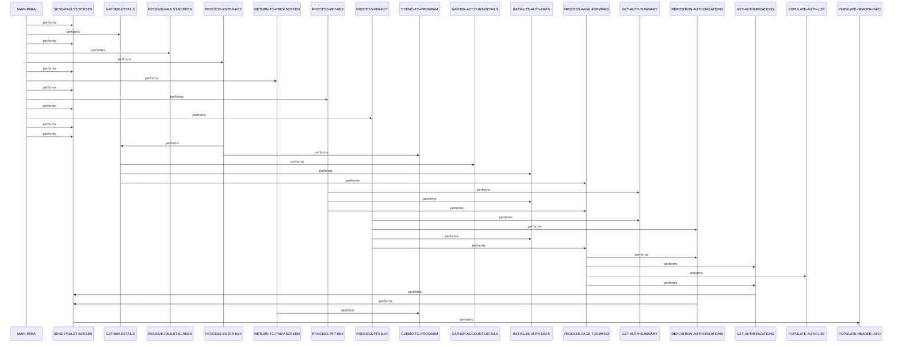

# COPAUS0C

**File**: `cbl/COPAUS0C.cbl`
**Type**: FileType.COBOL
**Analyzed**: 2026-02-25 15:36:04.043458

## Purpose

COPAUS0C is a CICS transaction program (CPVS) that displays a paginated summary list of up to 5 pending authorization transactions for a specified account ID using BMS map COPAU0A. It supports user interactions via ENTER to validate account/selection and XCTL to details, PF7/PF8 for backward/forward paging through IMS PAUTDTL1 segments, PF3 to return to menu. Authorization data is fetched from IMS database using DLI GNP calls, formatted, and displayed with status, date, time, amount.

**Business Context**: CardDemo application Authorization Module - provides summary view of authorization messages for accounts.

## Inputs

| Name | Type | Description |
|------|------|-------------|
| COPAU0AI | IOType.CICS_MAP | BMS input map containing user-entered account ID (ACCTIDI), selection fields (SEL0001I-SEL0005I), and other screen inputs |
| DFHCOMMAREA | IOType.CICS_COMMAREA | CARDDEMO-COMMAREA holding persistent state like CDEMO-ACCT-ID, page number, previous auth keys (CDEMO-CPVS-PAUKEY-PREV-PG), selected auth, next page flag |
| PENDING-AUTH-DETAILS | IOType.IMS_SEGMENT | IMS database child segment PAUTDTL1 containing pending auth details like key, amount, date, time, resp code, transaction ID, type, match status |

## Outputs

| Name | Type | Description |
|------|------|-------------|
| COPAU0AO | IOType.CICS_MAP | BMS output map populated with header (titles, program name, date, tran id), auth list details (TRNID*O, PDATE*O etc implied), error message (ERRMSGO), account id display |
| CARDDEMO-COMMAREA | IOType.CICS_COMMAREA | Updated with current page num, auth keys for paging, selected auth key/flag, acct id, context flags before RETURN |

## Called Programs

| Program | Call Type | Purpose |
|---------|-----------|---------|
| COPAUS1C | CallType.CICS_XCTL | Transfer to authorization details display for user-selected summary line (when 'S' entered) |
| COMEN01C | CallType.CICS_XCTL | Return to main menu screen on PF3 |

## Business Rules

- **BR001**: Account ID entry must be numeric and non-blank
- **BR002**: Line selection must be 'S' or 's' to invoke details program
- **BR003**: PF7 backward only if current page > 1
- **BR004**: Approval status derived from response code '00' = Approved 'A' else Declined 'D'

## Paragraphs/Procedures

### MAIN-PARA
> [Source: MAIN-PARA.cbl.md](COPAUS0C.cbl.d/MAIN-PARA.cbl.md)
This is the primary orchestration paragraph serving as the program entry point, handling initial load, reentry, and AID-based dispatching for the authorization summary screen. It consumes EIBCALEN, DFHCOMMAREA (on reentry), and map inputs via RECEIVE-PAULST-SCREEN, initializing flags (ERR-FLG, AUTHS-EOF, SEND-ERASE, NEXT-PAGE) and clearing messages/ACCTIDL. On first entry (EIBCALEN=0), initializes commarea with program name, low-values map, performs SEND-PAULST-SCREEN for blank screen. On reentry, loads commarea, sets reenter flag, optionally gathers details from prior ACCT-ID, sends screen; or receives map and dispatches: ENTER to process selection/acct, PF3 to menu via RETURN-TO-PREV-SCREEN, PF7/PF8 paging, other invalid AID error. Produces updated map output via SEND-PAULST-SCREEN and updated commarea for RETURN. Business logic includes reenter state management to distinguish initial vs subsequent calls. No explicit error handling beyond flag/message sets which trigger screen resend. Calls subordinate paragraphs for screen I/O, data gather, key processing, and XCTL return.

### PROCESS-ENTER-KEY
> [Source: PROCESS-ENTER-KEY.cbl.md](COPAUS0C.cbl.d/PROCESS-ENTER-KEY.cbl.md)
This paragraph processes the ENTER keypress to validate and act on user input for account ID and line selection. It reads ACCTIDI and SEL000*I from COPAU0AI map, checks if ACCTIDI blank/low-values (error 'Please enter Acct Id'), or non-numeric (error 'Acct Id must be Numeric'). If valid, moves to WS-ACCT-ID/CDEMO-ACCT-ID, evaluates which SEL000*I non-blank/low to set CDEMO-CPVS-PAU-SEL-FLG and matching CDEMO-CPVS-AUTH-KEYS(n) to PAU-SELECTED. If valid selection and flag='S'/'s', sets XCTL to COPAUS1C details with context flags; else invalid selection error. Always performs GATHER-DETAILS post-validation to refresh data. Error handling sets WS-ERR-FLG, message, clears ACCTIDL display. No direct calls except GATHER-DETAILS; integrates with main flow for screen resend.

### GATHER-DETAILS
> [Source: GATHER-DETAILS.cbl.md](COPAUS0C.cbl.d/GATHER-DETAILS.cbl.md)
Prepares data for screen display by resetting ACCTIDL display, page num to 0, and conditionally gathering account details and auth data. Consumes WS-ACCT-ID; if valid (not low-values), performs GATHER-ACCOUNT-DETAILS (missing code, likely sets account flags/validates existence), initializes auth list data, and if PAUT summary seg found, performs PROCESS-PAGE-FORWARD to load first page. Produces updated CDEMO-CPVS-PAGE-NUM=1+, auth keys in commarea for paging. Business logic gates paging on account-linked summary segment existence. Error handling inherited from callees via flags. Calls missing GATHER-ACCOUNT-DETAILS for acct validation and INITIALIZE-AUTH-DATA/PROCESS-PAGE-FORWARD for list population.

### PROCESS-PF7-KEY
> [Source: PROCESS-PF7-KEY.cbl.md](COPAUS0C.cbl.d/PROCESS-PF7-KEY.cbl.md)
Handles PF7 (previous page) by decrementing CDEMO-CPVS-PAGE-NUM if >1, loading prior auth key from CDEMO-CPVS-PAUKEY-PREV-PG into WS-AUTH-KEY-SAVE, performing GET-AUTH-SUMMARY (missing, likely summary seg read), sets no-erase/next-page-yes, clears ACCTIDL, initializes list, processes forward page. If at page 1, sets top-of-list error message, no-erase. Consumes current page num/keys from commarea; produces repositioned page data, updated page num/keys. Business logic prevents backward from first page. Error handling via message/flag. Calls GET-AUTH-SUMMARY, INITIALIZE-AUTH-DATA, PROCESS-PAGE-FORWARD.

### PROCESS-PF8-KEY
> [Source: PROCESS-PF8-KEY.cbl.md](COPAUS0C.cbl.d/PROCESS-PF8-KEY.cbl.md)
Handles PF8 (next/bottom page) by using CDEMO-CPVS-PAUKEY-LAST or low-values for WS-AUTH-KEY-SAVE, performs GET-AUTH-SUMMARY and REPOSITION-AUTHORIZATIONS to position at last known, clears ACCTIDL, no-erase. If next-page-yes after forward process, initializes and loads next page; else bottom-of-list message. Consumes last key/page flag from commarea; produces updated keys/page flag. Business logic checks for more data post-reposition. Error handling via flags/message. Calls GET-AUTH-SUMMARY, REPOSITION-AUTHORIZATIONS, INITIALIZE-AUTH-DATA, PROCESS-PAGE-FORWARD.

### PROCESS-PAGE-FORWARD
> [Source: PROCESS-PAGE-FORWARD.cbl.md](COPAUS0C.cbl.d/PROCESS-PAGE-FORWARD.cbl.md)
Loads one page (5 auths) of data into map/commarea by looping WS-IDX 1-5 or EOF/error, conditionally repositioning on PF7 first item, calling GET-AUTHORIZATIONS to fetch next PAUTDTL1 seg, populates list if success, tracks last key and prev-pg keys/page num. After loop, peeks one more GET to set NEXT-PAGE-YES/NO. Consumes IMS PCB, current position/key; produces map fields (*I TRNID etc.), commarea keys/page/next-flag. Business logic stops at 5 or EOF/error, builds prev history. Error handling aborts loop on ERR-FLG-ON. Calls REPOSITION-AUTHORIZATIONS (conditional), GET-AUTHORIZATIONS, POPULATE-AUTH-LIST.

### GET-AUTHORIZATIONS
> [Source: GET-AUTHORIZATIONS.cbl.md](COPAUS0C.cbl.d/GET-AUTHORIZATIONS.cbl.md)
Performs unqualified IMS DLI GNP call on PAUTDTL1 segment into PENDING-AUTH-DETAILS to fetch next sequential authorization detail. Evaluates IMS-RETURN-CODE (DIBSTAT): OK sets not-EOF, GE/GB sets EOF, others error flag/message with code and SEND screen. Consumes IMS PCB(PAUT-PCB-NUM); produces filled PENDING-AUTH-DETAILS or EOF/error. Business logic for sequential read post-GU/GNP position. Error handling immediate screen send on non-retry codes. No calls.

### REPOSITION-AUTHORIZATIONS
> [Source: REPOSITION-AUTHORIZATIONS.cbl.md](COPAUS0C.cbl.d/REPOSITION-AUTHORIZATIONS.cbl.md)
Repositions IMS cursor for paging by setting PA-AUTHORIZATION-KEY = WS-AUTH-KEY-SAVE, DLI GNP with WHERE on PAUT9CTS matching key into PENDING-AUTH-DETAILS. Evaluates IMS-RETURN-CODE: OK not-EOF, GE/GB EOF, others error message/SEND. Consumes WS-AUTH-KEY-SAVE, IMS PCB; produces positioned PENDING-AUTH-DETAILS or EOF/error. Business logic for exact key restart on page change. Error handling sends screen. No calls.

### POPULATE-AUTH-LIST
> [Source: POPULATE-AUTH-LIST.cbl.md](COPAUS0C.cbl.d/POPULATE-AUTH-LIST.cbl.md)
Transforms current PENDING-AUTH-DETAILS into nth screen line (WS-IDX 1-5) and commarea CDEMO-CPVS-AUTH-KEYS(n): moves/formats amt/date/time/status, sets *I fields on COPAU0AI (TRNID01I-PAMT005I, PAPRV* etc.), unprotected attr SEL000nA. Tracks LAST key, prev-pg on page 2+. Consumes PENDING-AUTH-DETAILS, WS-IDX; produces map fields, commarea keys. Business logic derives status A/D from resp code '00', formats display. No validation/error, assumes valid seg. No calls.

### INITIALIZE-AUTH-DATA
> [Source: INITIALIZE-AUTH-DATA.cbl.md](COPAUS0C.cbl.d/INITIALIZE-AUTH-DATA.cbl.md)
Clears auth list display for new page by varying WS-IDX 1-5, setting protected attr DFHBMPRO on SEL000nA, spaces on all *I fields (TRNID01I-PAMT005I etc.) of COPAU0AI. Consumes nothing specific; produces blanked map lines ready for population. Business logic full clear before load. No conditions/error. No calls.

### RETURN-TO-PREV-SCREEN
> [Source: RETURN-TO-PREV-SCREEN.cbl.md](COPAUS0C.cbl.d/RETURN-TO-PREV-SCREEN.cbl.md)
Prepares XCTL return to previous program (PF3 handling): defaults CDEMO-TO-PROGRAM to 'COSGN00C' if blank, sets from-tran/program/context=0, XCTL with commarea. Consumes CDEMO-TO-PROGRAM (set to menu); produces control transfer. Business logic menu fallback. No error. No calls.

### SEND-PAULST-SCREEN
> [Source: SEND-PAULST-SCREEN.cbl.md](COPAUS0C.cbl.d/SEND-PAULST-SCREEN.cbl.md)
Sends BMS map COPAU0A: if PSB scheduled SYNCPOINT first (unschedule), performs POPULATE-HEADER-INFO, moves message to ERRMSGO AO, conditional ERASE on SEND-ERASE-FLAG with CURSOR. Consumes flags, WS-MESSAGE, header data; produces screen display. Business logic commit before send, erase on init/refresh. Error via prior flags. Calls POPULATE-HEADER-INFO.

### RECEIVE-PAULST-SCREEN
> [Source: RECEIVE-PAULST-SCREEN.cbl.md](COPAUS0C.cbl.d/RECEIVE-PAULST-SCREEN.cbl.md)
Receives user input from BMS map COPAU0A into COPAU0AI, captures RESP/RESP2 codes (unused). Consumes screen data; produces filled COPAU0AI fields. No logic/error handling on RESP. No calls.

### POPULATE-HEADER-INFO
> [Source: POPULATE-HEADER-INFO.cbl.md](COPAUS0C.cbl.d/POPULATE-HEADER-INFO.cbl.md)
Populates static screen header: current date via FUNCTION CURRENT-DATE parsed to MM/DD/YY, titles from CSMSG, tran/program names. Consumes date func, WS vars; produces TITLE01O/02O, TRNNAMEO, PGMNAMEO, CURDATEO on COPAU0AO. No conditions/error. No calls.

## Dead Code

The following artifacts were identified as dead code by static analysis:

| Artifact | Type | Line | Reason |
|----------|------|------|--------|
| exec-001 | function | 254 | Function 'exec-001' is never called by any other artifact |
| exec-002 | function | 322 | Function 'exec-002' is never called by any other artifact |
| exec-003 | function | 461 | Function 'exec-003' is never called by any other artifact |
| exec-004 | function | 493 | Function 'exec-004' is never called by any other artifact |
| exec-005 | function | 674 | Function 'exec-005' is never called by any other artifact |
| exec-006 | function | 686 | Function 'exec-006' is never called by any other artifact |
| exec-007 | function | 695 | Function 'exec-007' is never called by any other artifact |
| exec-008 | function | 703 | Function 'exec-008' is never called by any other artifact |
| exec-009 | function | 715 | Function 'exec-009' is never called by any other artifact |
| exec-010 | function | 818 | Function 'exec-010' is never called by any other artifact |
| exec-011 | function | 869 | Function 'exec-011' is never called by any other artifact |
| exec-012 | function | 920 | Function 'exec-012' is never called by any other artifact |
| exec-013 | function | 973 | Function 'exec-013' is never called by any other artifact |
| exec-014 | function | 1002 | Function 'exec-014' is never called by any other artifact |
| exec-015 | function | 1008 | Function 'exec-015' is never called by any other artifact |
| exec-016 | function | 1011 | Function 'exec-016' is never called by any other artifact |
| COPAU0AI | record_layout | 17 | Record layout 'COPAU0AI' is never used by any program |
| COPAU0AO | record_layout | 391 | Record layout 'COPAU0AO' is never used by any program |
| DFHCOMMAREA | record_layout | 172 | Record layout 'DFHCOMMAREA' is never used by any program |
| PENDING-AUTH-DETAILS | record_layout | 164 | Record layout 'PENDING-AUTH-DETAILS' is never used by any program |
| PENDING-AUTH-SUMMARY | record_layout | 160 | Record layout 'PENDING-AUTH-SUMMARY' is never used by any program |
| WS-IMS-VARIABLES | record_layout | 74 | Record layout 'WS-IMS-VARIABLES' is never used by any program |
| WS-SWITCHES | record_layout | 93 | Record layout 'WS-SWITCHES' is never used by any program |
| WS-VARIABLES | record_layout | 32 | Record layout 'WS-VARIABLES' is never used by any program |

## Control Flow

## Open Questions

- ? Definitions/code for paragraphs: GATHER-ACCOUNT-DETAILS, GET-AUTH-SUMMARY, GETACCTDATA-BYACCT, GETCARDXREF-BYACCT, GETCUSTDATA-BYCUST, SCHEDULE-PSB
  - Context: Source input truncated; these are PERFORMed but not provided, likely handle VSAM/IMS reads for ACCTDAT/CUSTDAT/CARDDAT/CXACAIX/CCXREF files, PSB schedule, summary seg fetch, set FOUND-* flags
- ? Role/purpose of VSAM-like filenames (ACCTDAT, CUSTDAT etc.) and related flags (WS-ACCT-MASTER-READ-FLG etc.)
  - Context: No FILE SECTION or VSAM I/O visible; likely in missing GATHER-ACCOUNT-DETAILS
- ? How PAUT summary segment read (FOUND-PAUT-SMRY-SEG set)?
  - Context: GNP on details only visible; summary likely GNP on root PAUTSMY1 or similar
- ? CICS RESP/RESP2 from RECEIVE handling
  - Context: Captured but not evaluated

## Sequence Diagram

