# COPAUS0C

**File**: `cbl/COPAUS0C.cbl`
**Type**: FileType.COBOL
**Analyzed**: 2026-02-09 15:41:49.523419

## Purpose

This COBOL program is a CICS transaction that retrieves and displays account, customer, and authorization summary information based on an account ID. It interacts with VSAM files for card, account, and customer data, and an IMS database for authorization summaries, displaying the information on a CICS screen.

**Business Context**: This program likely supports customer service or fraud investigation by providing a consolidated view of customer and account information.

## Inputs

| Name | Type | Description |
|------|------|-------------|
| COPAU0AI | IOType.CICS_MAP | Input map for the COPAU0A screen, containing account ID and other input fields. |
| CARDDEMO-COMMAREA | IOType.CICS_COMMAREA | Communication area passed to other programs. |

## Outputs

| Name | Type | Description |
|------|------|-------------|
| COPAU0AO | IOType.CICS_MAP | Output map for the COPAU0A screen, containing account details, customer information, and authorization summary. |

## Called Programs

| Program | Call Type | Purpose |
|---------|-----------|---------|
| CDEMO-TO-PROGRAM | CallType.CICS_XCTL | Transfers control to a different CICS program, likely to return to a previous screen or menu. |

## Business Rules

- **BR001**: If a Card XREF record is not found, display an error message on the screen.
- **BR002**: If an Account record is not found, display an error message on the screen.
- **BR003**: If a Customer record is not found, display an error message on the screen.
- **BR004**: If no authorization summary segment is found in the IMS database, set output fields to zero.

## Paragraphs/Procedures

### INITIALIZE-AUTH-DATA
This paragraph initializes the authorization data fields in the COPAU0AI map. It iterates five times, setting the selection field (SEL000xA) to 'DFHBMPRO' and clearing the transaction ID (TRNID0xI), date (PDATE0xI), time (PTIME0xI), type (PTYPE0xI), approval (PAPRV0xI), status (PSTAT0xI), and amount (PAMT00xI) fields for each of the five authorization entries on the screen. The purpose is to clear any residual data from previous transactions or initial program load. The paragraph consumes no external input other than the COPAU0AI map. It outputs the initialized data to the COPAU0AI map. No business logic or error handling is present in this paragraph. It does not call any other paragraphs or programs.

### RETURN-TO-PREV-SCREEN
This paragraph transfers control to another CICS program, effectively returning to a previous screen or menu. It first checks if the CDEMO-TO-PROGRAM field is empty; if so, it defaults to 'COSGN00C'. It then moves the current transaction ID (WS-CICS-TRANID) to CDEMO-FROM-TRANID, the program ID (WS-PGM-AUTH-SMRY) to CDEMO-FROM-PROGRAM, and zeros to CDEMO-PGM-CONTEXT. Finally, it executes a CICS XCTL command to transfer control to the program specified in CDEMO-TO-PROGRAM, passing the CARDDEMO-COMMAREA. This paragraph consumes WS-CICS-TRANID, WS-PGM-AUTH-SMRY, and CDEMO-TO-PROGRAM as input. It outputs data to the CARDDEMO-COMMAREA and transfers control to another program. There is a default assignment for CDEMO-TO-PROGRAM if it is initially blank. The paragraph calls the CDEMO-TO-PROGRAM via a CICS XCTL.

### SEND-PAULST-SCREEN
This paragraph sends the COPAU0A screen to the terminal. It first checks if IMS-PSB-SCHD is set, and if so, it performs a CICS SYNCPOINT. Then, it calls POPULATE-HEADER-INFO to populate the header information on the screen. It moves the message in WS-MESSAGE to the ERRMSGO field in the output map. Finally, it sends the COPAU0A screen using the COPAU00 mapset. If SEND-ERASE-YES is set, it sends the screen with the ERASE option, otherwise it sends the screen without erasing. The cursor is positioned on the screen. This paragraph consumes IMS-PSB-SCHD, WS-MESSAGE, and SEND-ERASE-YES as input. It outputs the screen to the terminal. It calls POPULATE-HEADER-INFO and uses CICS SEND command. There is conditional logic to determine whether to erase the screen.

### RECEIVE-PAULST-SCREEN
This paragraph receives data from the COPAU0A CICS screen. It executes a CICS RECEIVE command to receive data from the COPAU0A screen using the COPAU00 mapset and stores the received data into the COPAU0AI map. It also captures the CICS response code (RESP) and reason code (RESP2) into WS-RESP-CD and WS-REAS-CD respectively. This paragraph consumes data entered by the user on the COPAU0A screen. It outputs the received data to the COPAU0AI map and the response/reason codes to WS-RESP-CD and WS-REAS-CD. No business logic or error handling is performed directly within this paragraph, but the response codes are captured for later evaluation. It does not call any other paragraphs or programs.

### POPULATE-HEADER-INFO
This paragraph populates the header information on the COPAU0A screen. It moves the current date and time to the corresponding fields in the output map (COPAU0AO). Specifically, it moves CCDA-TITLE01 and CCDA-TITLE02 to TITLE01O and TITLE02O, respectively. It moves the transaction ID (WS-CICS-TRANID) to TRNNAMEO and the program ID (WS-PGM-AUTH-SMRY) to PGMNAMEO. It formats the current date into MM/DD/YY format and moves it to CURDATEO. It formats the current time into HH:MM:SS format and moves it to CURTIMEO. This paragraph consumes the current date and time, CCDA-TITLE01, CCDA-TITLE02, WS-CICS-TRANID, and WS-PGM-AUTH-SMRY as input. It outputs the formatted header information to the COPAU0AO map. No business logic or error handling is present. It does not call any other paragraphs or programs.

### GATHER-ACCOUNT-DETAILS
This paragraph orchestrates the retrieval of account, customer, and authorization summary information. It calls GETCARDXREF-BYACCT to retrieve the card cross-reference record, GETACCTDATA-BYACCT to retrieve the account data, and GETCUSTDATA-BYCUST to retrieve the customer data. It then moves the customer ID to CUSTIDO and concatenates the customer's first, middle initial, and last name into CNAMEO. It also concatenates the customer's address lines into ADDR001O and ADDR002O. It moves the customer's phone number to PHONE1O, the account credit limit to CREDLIMO, and the account cash credit limit to CASHLIMO. Finally, it calls GET-AUTH-SUMMARY to retrieve the authorization summary. If a pending authorization summary segment is found, it moves the approved/declined authorization counts and amounts, and credit/cash balances to the corresponding output fields. Otherwise, it sets these output fields to zero. This paragraph consumes data from CARD-XREF-RECORD, ACCOUNT-RECORD, CUSTOMER-RECORD, and PENDING-AUTH-SUMMARY. It outputs data to the COPAU0AO map. It calls GETCARDXREF-BYACCT, GETACCTDATA-BYACCT, GETCUSTDATA-BYCUST, and GET-AUTH-SUMMARY. It also handles the case where the authorization summary segment is not found.

### GETCARDXREF-BYACCT
This paragraph retrieves the card cross-reference record from the CARD-XREF file based on the account ID. It moves the account ID (WS-ACCT-ID) to the record ID field (WS-CARD-RID-ACCT-ID-X). It then executes a CICS READ command to read the CARD-XREF-RECORD from the file specified by WS-CARDXREFNAME-ACCT-PATH using the alternate index on account ID. If the read is successful (DFHRESP(NORMAL)), it moves the customer ID (XREF-CUST-ID) and card number (XREF-CARD-NUM) to CDEMO-CUST-ID and CDEMO-CARD-NUM, respectively. If the record is not found (DFHRESP(NOTFND)), it constructs an error message and calls SEND-PAULST-SCREEN to display the message. If any other error occurs, it sets an error flag (WS-ERR-FLG), constructs an error message, and calls SEND-PAULST-SCREEN. This paragraph consumes WS-ACCT-ID and WS-CARDXREFNAME-ACCT-PATH as input. It outputs data to CARD-XREF-RECORD, CDEMO-CUST-ID, CDEMO-CARD-NUM, and WS-MESSAGE. It calls SEND-PAULST-SCREEN in case of errors. It performs error handling based on the CICS response code.

### GETACCTDATA-BYACCT
This paragraph retrieves the account data from the ACCOUNT file based on the account ID. It moves the account ID (XREF-ACCT-ID) to the record ID field (WS-CARD-RID-ACCT-ID-X). It then executes a CICS READ command to read the ACCOUNT-RECORD from the file specified by WS-ACCTFILENAME. If the read is successful (DFHRESP(NORMAL)), it continues processing. If the record is not found (DFHRESP(NOTFND)), it constructs an error message and calls SEND-PAULST-SCREEN to display the message. If any other error occurs, it sets an error flag (WS-ERR-FLG), constructs an error message, and calls SEND-PAULST-SCREEN. This paragraph consumes XREF-ACCT-ID and WS-ACCTFILENAME as input. It outputs data to ACCOUNT-RECORD and WS-MESSAGE. It calls SEND-PAULST-SCREEN in case of errors. It performs error handling based on the CICS response code.

### GETCUSTDATA-BYCUST
This paragraph retrieves the customer data from the CUSTOMER file based on the customer ID. It moves the customer ID (XREF-CUST-ID) to the record ID field (WS-CARD-RID-CUST-ID-X). It then executes a CICS READ command to read the CUSTOMER-RECORD from the file specified by WS-CUSTFILENAME. If the read is successful (DFHRESP(NORMAL)), it continues processing. If the record is not found (DFHRESP(NOTFND)), it constructs an error message and calls SEND-PAULST-SCREEN to display the message. If any other error occurs, it sets an error flag (WS-ERR-FLG), constructs an error message, and calls SEND-PAULST-SCREEN. This paragraph consumes XREF-CUST-ID and WS-CUSTFILENAME as input. It outputs data to CUSTOMER-RECORD and WS-MESSAGE. It calls SEND-PAULST-SCREEN in case of errors. It performs error handling based on the CICS response code.

### GET-AUTH-SUMMARY
This paragraph retrieves the authorization summary from the IMS database. It first calls SCHEDULE-PSB to schedule the PSB. It then moves the account ID (CDEMO-ACCT-ID) to the PA-ACCT-ID field. It executes a DLI GU (Get Unique) command to retrieve the PAUTSUM0 segment from the IMS database using the PAUT-PCB-NUM PCB. The segment is retrieved into the PENDING-AUTH-SUMMARY area. It then checks the IMS return code (DIBSTAT). If the status is OK, it sets FOUND-PAUT-SMRY-SEG to TRUE. If the segment is not found, it sets NFOUND-PAUT-SMRY-SEG to TRUE. If any other error occurs, it sets an error flag (WS-ERR-FLG), constructs an error message, and calls SEND-PAULST-SCREEN. This paragraph consumes CDEMO-ACCT-ID and PAUT-PCB-NUM as input. It outputs data to PENDING-AUTH-SUMMARY and WS-MESSAGE. It calls SCHEDULE-PSB and SEND-PAULST-SCREEN. It performs error handling based on the IMS return code.

### SCHEDULE-PSB
The SCHEDULE-PSB paragraph is responsible for scheduling a Program Specification Block (PSB) within an IMS (Information Management System) environment. It begins by attempting to schedule the PSB using the EXEC DLI SCHD command, specifying the PSB name and indicating that a user abend should not occur (NODHABEND) if an error occurs during scheduling. The DIBSTAT variable, containing the IMS return code, is then moved to IMS-RETURN-CODE for analysis. If the PSB has been scheduled more than once (indicated by the PSB-SCHEDULED-MORE-THAN-ONCE flag), the paragraph first terminates the previous scheduling using EXEC DLI TERM before attempting to schedule the PSB again. If the PSB scheduling is successful (STATUS-OK is true), the IMS-PSB-SCHD flag is set to TRUE. However, if the scheduling fails, the WS-ERR-FLG is set to 'Y', an error message is constructed containing the IMS return code, and the SEND-PAULST-SCREEN paragraph is called to display the error message on the screen. The ACCTIDL field of COPAU0AI is also set to -1 before calling SEND-PAULST-SCREEN.

### COPAUS0C
This is the program ID definition. It doesn't contain any executable code but serves as the entry point for the program within the CICS environment. It essentially names the program and links it to its source code. The program is invoked as a CICS transaction. It calls several other programs and paragraphs to perform its functions, including COCOM01Y, COPAU00, COTTL01Y, CSDAT01Y, CSMSG01Y, and others, likely for common routines, data access, and message handling. The absence of code within this paragraph means it doesn't directly consume any inputs or produce any outputs, instead delegating these tasks to the called subroutines.

### MAIN-PARA
This paragraph serves as the main control logic for the COPAUS0C program. It first initializes flags and variables, including setting error flags off, authorization EOF flags, and message areas. It then checks if the communication area (DFHCOMMAREA) has been passed any data (EIBCALEN > 0). If not, it initializes the CARDDEMO-COMMAREA and sets the program context for authorization summary. If data exists in the COMMAREA, it moves the data into CARDDEMO-COMMAREA and checks if it's a re-entry to the program. Depending on the EIBAID (CICS attention identifier), it performs different actions: ENTER key triggers PROCESS-ENTER-KEY to validate and process the entered account ID, PF3 returns to the previous screen, PF7 and PF8 handle paging through authorization summaries by calling PROCESS-PF7-KEY and PROCESS-PF8-KEY respectively. Invalid keys trigger an error message. Finally, it returns control to CICS with the updated CARDDEMO-COMMAREA. This paragraph consumes data from DFHCOMMAREA and COPAU0AI, and produces output to COPAU0AO and CARDDEMO-COMMAREA. It calls SEND-PAULST-SCREEN, GATHER-DETAILS, RECEIVE-PAULST-SCREEN, PROCESS-ENTER-KEY, RETURN-TO-PREV-SCREEN, PROCESS-PF7-KEY, PROCESS-PF8-KEY.

### PROCESS-ENTER-KEY
This paragraph processes the input from the PAULST screen when the ENTER key is pressed. It validates the account ID entered by the user. If the account ID is spaces, low-values, or non-numeric, it sets an error flag and displays an appropriate error message on the screen. If the account ID is valid, it moves the entered account ID to WS-ACCT-ID and CDEMO-ACCT-ID. It also evaluates the selection fields (SEL0001I to SEL0005I) to determine if an authorization has been selected. If an authorization is selected (indicated by 'S' or 's'), it sets up the CDEMO-COMMAREA to call the authorization detail program (CDEMO-TO-PROGRAM) via XCTL. If the selection is invalid, it displays an error message. Finally, it calls GATHER-DETAILS to refresh the authorization summary. This paragraph consumes input from COPAU0AI and produces output to CDEMO-COMMAREA and COPAU0AO (via GATHER-DETAILS). It calls GATHER-DETAILS and CDEMO-TO-PROGRAM.

### GATHER-DETAILS
This paragraph prepares the data for displaying the authorization summary. It moves -1 to ACCTIDL of COPAU0AI and 0 to CDEMO-CPVS-PAGE-NUM to reset the screen and page number. If WS-ACCT-ID is not low-values, it calls GATHER-ACCOUNT-DETAILS to retrieve account-specific details (details of which are not present in the provided code). It then calls INITIALIZE-AUTH-DATA to initialize authorization data structures. If FOUND-PAUT-SMRY-SEG is true, it calls PROCESS-PAGE-FORWARD to retrieve and display the first page of authorizations. This paragraph consumes WS-ACCT-ID and produces output to COPAU0AI and CDEMO-CPVS-PAGE-NUM. It calls GATHER-ACCOUNT-DETAILS, INITIALIZE-AUTH-DATA, and PROCESS-PAGE-FORWARD.

### PROCESS-PF7-KEY
This paragraph handles the processing when the PF7 key (previous page) is pressed. It checks if the current page number (CDEMO-CPVS-PAGE-NUM) is greater than 1. If it is, it decrements the page number and retrieves the authorization key for the previous page from CDEMO-CPVS-PAUKEY-PREV-PG. It then calls GET-AUTH-SUMMARY (details not provided in code) to retrieve the authorization summary for the previous page. It sets flags to indicate no screen erase and that there is a next page. It then calls INITIALIZE-AUTH-DATA to initialize authorization data structures and PROCESS-PAGE-FORWARD to display the previous page of authorizations. If the current page is already the first page, it displays a message indicating that the user is at the top of the page. This paragraph consumes CDEMO-CPVS-PAGE-NUM and CDEMO-CPVS-PAUKEY-PREV-PG and potentially modifies the screen display via calls to other paragraphs. It calls GET-AUTH-SUMMARY, INITIALIZE-AUTH-DATA, and PROCESS-PAGE-FORWARD.

### PROCESS-PF8-KEY
This paragraph handles the processing when the PF8 key (next page) is pressed. It checks if CDEMO-CPVS-PAUKEY-LAST contains spaces or low-values. If it does, it means there is no next page, so it moves low-values to WS-AUTH-KEY-SAVE. Otherwise, it moves the value of CDEMO-CPVS-PAUKEY-LAST to WS-AUTH-KEY-SAVE and calls GET-AUTH-SUMMARY to retrieve the authorization summary based on the last key and REPOSITION-AUTHORIZATIONS to position the IMS database. It sets a flag to indicate no screen erase. If NEXT-PAGE-YES is true, it calls INITIALIZE-AUTH-DATA and PROCESS-PAGE-FORWARD to display the next page of authorizations. If NEXT-PAGE-YES is false, it displays a message indicating that the user is at the bottom of the page. This paragraph consumes CDEMO-CPVS-PAUKEY-LAST and NEXT-PAGE-YES and potentially modifies the screen display via calls to other paragraphs. It calls GET-AUTH-SUMMARY, REPOSITION-AUTHORIZATIONS, INITIALIZE-AUTH-DATA, and PROCESS-PAGE-FORWARD.

### PROCESS-PAGE-FORWARD
This paragraph retrieves and displays a page of authorization details. It first checks if ERR-FLG-OFF is set. If so, it initializes WS-IDX to 1 and CDEMO-CPVS-PAUKEY-LAST to low-values. It then enters a loop that continues until WS-IDX is greater than 5, AUTHS-EOF is true, or ERR-FLG-ON is true. Inside the loop, it checks if EIBAID is DFHPF7 and WS-IDX is 1. If so, it calls REPOSITION-AUTHORIZATIONS; otherwise, it calls GET-AUTHORIZATIONS to retrieve an authorization record. If AUTHS-NOT-EOF and ERR-FLG-OFF are true, it calls POPULATE-AUTH-LIST to populate the screen with the authorization details, increments WS-IDX, and moves PA-AUTHORIZATION-KEY to CDEMO-CPVS-PAUKEY-LAST. If WS-IDX is 2, it increments CDEMO-CPVS-PAGE-NUM and moves PA-AUTHORIZATION-KEY to CDEMO-CPVS-PAUKEY-PREV-PG. After the loop, if AUTHS-NOT-EOF and ERR-FLG-OFF are true, it calls GET-AUTHORIZATIONS to check if there is another page. If so, it sets NEXT-PAGE-YES to true; otherwise, it sets NEXT-PAGE-NO to true. This paragraph consumes ERR-FLG-OFF, EIBAID, AUTHS-EOF, AUTHS-NOT-EOF, PA-AUTHORIZATION-KEY, and potentially modifies the screen display via calls to other paragraphs. It calls REPOSITION-AUTHORIZATIONS, GET-AUTHORIZATIONS, and POPULATE-AUTH-LIST.

### GET-AUTHORIZATIONS
This paragraph retrieves the next authorization detail segment (PAUTDTL1) from the IMS database. It uses the DLI GNP (Get Next within Parent) command with the PAUT-PCB-NUM PCB. It moves the retrieved data into PENDING-AUTH-DETAILS. It then checks the DIBSTAT (Data Base Interface Block Status) code to determine the status of the retrieval. If the status is OK, it sets AUTHS-NOT-EOF to true. If the status indicates segment not found or end of database, it sets AUTHS-EOF to true. If any other error occurs, it sets WS-ERR-FLG to 'Y', constructs an error message containing the IMS return code, and displays the message on the screen by calling SEND-PAULST-SCREEN. This paragraph consumes PAUT-PCB-NUM and produces PENDING-AUTH-DETAILS. It calls SEND-PAULST-SCREEN in case of an error.

### REPOSITION-AUTHORIZATIONS
This paragraph repositions the IMS database cursor to a specific authorization record. It moves the value in WS-AUTH-KEY-SAVE to PA-AUTHORIZATION-KEY. It then uses the DLI GNP command with the WHERE clause to retrieve the PAUTDTL1 segment where PAUT9CTS (authorization key) matches PA-AUTHORIZATION-KEY. It moves the retrieved data into PENDING-AUTH-DETAILS. It then checks the DIBSTAT code to determine the status of the retrieval. If the status is OK, it sets AUTHS-NOT-EOF to true. If the status indicates segment not found or end of database, it sets AUTHS-EOF to true. If any other error occurs, it sets WS-ERR-FLG to 'Y', constructs an error message containing the IMS return code, and displays the message on the screen by calling SEND-PAULST-SCREEN. This paragraph consumes WS-AUTH-KEY-SAVE and produces PENDING-AUTH-DETAILS. It calls SEND-PAULST-SCREEN in case of an error.

### POPULATE-AUTH-LIST
This paragraph populates the authorization list on the screen (COPAU0AI) with data from the retrieved authorization record (PAUTDTL1). It moves PA-APPROVED-AMT to WS-AUTH-AMT, formats PA-AUTH-ORIG-TIME into WS-AUTH-TIME, and formats PA-AUTH-ORIG-DATE into WS-AUTH-DATE. It then checks PA-AUTH-RESP-CODE. If it's '00', it moves 'A' to WS-AUTH-APRV-STAT; otherwise, it moves 'D' to WS-AUTH-APRV-STAT. Based on the value of WS-IDX (1 to 5), it moves the authorization details (PA-TRANSACTION-ID, WS-AUTH-DATE, WS-AUTH-TIME, PA-AUTH-TYPE, WS-AUTH-APRV-STAT, PA-MATCH-STATUS, WS-AUTH-AMT) into the corresponding fields (TRNID01I to TRNID05I, PDATE01I to PDATE05I, etc.) in the COPAU0AI map. It also sets the selection attribute (SEL0001A to SEL0005A) to DFHBMUNP (unprotected). This paragraph consumes data from PAUTDTL1 and WS-IDX and produces output to COPAU0AI. It does not call any other paragraphs.

## Control Flow

## Open Questions

- ? What is the purpose of SCHEDULE-PSB?
  - Context: The code calls SCHEDULE-PSB before the IMS database access, but the implementation of this paragraph is not provided in the snippet.
- ? What is the purpose of the CDEMO-TO-PROGRAM?
  - Context: The code uses CDEMO-TO-PROGRAM to XCTL to another program, but the purpose of that program is unknown.

## Sequence Diagram

```mermaid
sequenceDiagram
    RETURN-TO-PREV-SCREEN->>CDEMO-TO-PROGRAM: performs
    SEND-PAULST-SCREEN->>POPULATE-HEADER-INFO: WS-CICS-TRANID, WS-PGM-AUTH-SMRY, WS-CURDATE-DATA, ...
    POPULATE-HEADER-INFO-->>SEND-PAULST-SCREEN: WS-CURDATE-MM, WS-CURDATE-DD, WS-CURDATE-YY, ...
    GATHER-ACCOUNT-DETAILS->>GETCARDXREF-BYACCT: WS-ACCT-ID, WS-CARDXREFNAME-ACCT-PATH
    GETCARDXREF-BYACCT-->>GATHER-ACCOUNT-DETAILS: WS-RESP-CD, WS-REAS-CD, WS-RESP-CD-DIS, ...
    GATHER-ACCOUNT-DETAILS->>GETACCTDATA-BYACCT: XREF-ACCT-ID, WS-ACCTFILENAME
    GETACCTDATA-BYACCT-->>GATHER-ACCOUNT-DETAILS: WS-RESP-CD, WS-REAS-CD, WS-RESP-CD-DIS, ...
    GATHER-ACCOUNT-DETAILS->>GETCUSTDATA-BYCUST: XREF-CUST-ID, WS-CUSTFILENAME
    GETCUSTDATA-BYCUST-->>GATHER-ACCOUNT-DETAILS: WS-RESP-CD, WS-REAS-CD, WS-RESP-CD-DIS, ...
    GATHER-ACCOUNT-DETAILS->>GET-AUTH-SUMMARY: CDEMO-ACCT-ID
    GET-AUTH-SUMMARY-->>GATHER-ACCOUNT-DETAILS: PA-ACCT-ID, IMS-RETURN-CODE, WS-ERR-FLG, ...
    GETCARDXREF-BYACCT->>SEND-PAULST-SCREEN: WS-MESSAGE, IMS-PSB-SCHD, SEND-ERASE-YES
    GETCARDXREF-BYACCT->>SEND-PAULST-SCREEN: WS-MESSAGE, IMS-PSB-SCHD, SEND-ERASE-YES
    GETCARDXREF-BYACCT->>WS-CARDXREFNAME-ACCT-PATH: performs
    GETACCTDATA-BYACCT->>SEND-PAULST-SCREEN: WS-MESSAGE, IMS-PSB-SCHD, SEND-ERASE-YES
    GETACCTDATA-BYACCT->>SEND-PAULST-SCREEN: WS-MESSAGE, IMS-PSB-SCHD, SEND-ERASE-YES
    GETACCTDATA-BYACCT->>WS-ACCTFILENAME: performs
    GETCUSTDATA-BYCUST->>SEND-PAULST-SCREEN: WS-MESSAGE, IMS-PSB-SCHD, SEND-ERASE-YES
    GETCUSTDATA-BYCUST->>SEND-PAULST-SCREEN: WS-MESSAGE, IMS-PSB-SCHD, SEND-ERASE-YES
    GETCUSTDATA-BYCUST->>WS-CUSTFILENAME: performs
    GET-AUTH-SUMMARY->>SCHEDULE-PSB: PSB-NAME
    SCHEDULE-PSB-->>GET-AUTH-SUMMARY: IMS-RETURN-CODE, IMS-PSB-SCHD
    GET-AUTH-SUMMARY->>SEND-PAULST-SCREEN: WS-MESSAGE, IMS-PSB-SCHD, SEND-ERASE-YES
    SCHEDULE-PSB->>SEND-PAULST-SCREEN: WS-MESSAGE, IMS-PSB-SCHD, SEND-ERASE-YES
    COPAUS0C->>COCOM01Y: performs
    COPAUS0C->>COPAU00: performs
    COPAUS0C->>COTTL01Y: performs
    COPAUS0C->>CSDAT01Y: performs
    COPAUS0C->>CSMSG01Y: performs
    COPAUS0C->>CSMSG02Y: performs
    COPAUS0C->>CVACT01Y: performs
    COPAUS0C->>CVACT02Y: performs
    COPAUS0C->>CVACT03Y: performs
    COPAUS0C->>CVCUS01Y: performs
    COPAUS0C->>CIPAUSMY: performs
    COPAUS0C->>CIPAUDTY: performs
    COPAUS0C->>DFHAID: performs
    COPAUS0C->>DFHBMSCA: performs
    MAIN-PARA->>SEND-PAULST-SCREEN: IMS-PSB-SCHD, WS-MESSAGE, SEND-ERASE-YES
    MAIN-PARA->>GATHER-DETAILS: WS-ACCT-ID
    MAIN-PARA->>SEND-PAULST-SCREEN: IMS-PSB-SCHD, WS-MESSAGE, SEND-ERASE-YES
    MAIN-PARA->>RECEIVE-PAULST-SCREEN: performs
    RECEIVE-PAULST-SCREEN-->>MAIN-PARA: WS-RESP-CD, WS-REAS-CD
    MAIN-PARA->>PROCESS-ENTER-KEY: ACCTIDI OF COPAU0AI, SEL0001I OF COPAU0AI, SEL0002I OF COPAU0AI, ...
    PROCESS-ENTER-KEY-->>MAIN-PARA: WS-ACCT-ID, WS-ERR-FLG, WS-MESSAGE, ...
    MAIN-PARA->>SEND-PAULST-SCREEN: IMS-PSB-SCHD, WS-MESSAGE, SEND-ERASE-YES
    MAIN-PARA->>RETURN-TO-PREV-SCREEN: WS-CICS-TRANID, WS-PGM-AUTH-SMRY, CDEMO-TO-PROGRAM
    RETURN-TO-PREV-SCREEN-->>MAIN-PARA: CDEMO-FROM-TRANID, CDEMO-FROM-PROGRAM, CDEMO-PGM-CONTEXT
    MAIN-PARA->>SEND-PAULST-SCREEN: IMS-PSB-SCHD, WS-MESSAGE, SEND-ERASE-YES
    MAIN-PARA->>PROCESS-PF7-KEY: CDEMO-CPVS-PAGE-NUM, CDEMO-CPVS-PAUKEY-PREV-PG
    PROCESS-PF7-KEY-->>MAIN-PARA: WS-AUTH-KEY-SAVE, SEND-ERASE-NO, NEXT-PAGE-YES, ...
    MAIN-PARA->>SEND-PAULST-SCREEN: IMS-PSB-SCHD, WS-MESSAGE, SEND-ERASE-YES
    MAIN-PARA->>PROCESS-PF8-KEY: CDEMO-CPVS-PAUKEY-LAST, WS-ACCT-ID, NEXT-PAGE-YES
    PROCESS-PF8-KEY-->>MAIN-PARA: WS-AUTH-KEY-SAVE
    MAIN-PARA->>SEND-PAULST-SCREEN: IMS-PSB-SCHD, WS-MESSAGE, SEND-ERASE-YES
    MAIN-PARA->>SEND-PAULST-SCREEN: IMS-PSB-SCHD, WS-MESSAGE, SEND-ERASE-YES
    PROCESS-ENTER-KEY->>GATHER-DETAILS: WS-ACCT-ID
    PROCESS-ENTER-KEY->>CDEMO-TO-PROGRAM: performs
    GATHER-DETAILS->>GATHER-ACCOUNT-DETAILS: WS-ACCT-ID
    GATHER-ACCOUNT-DETAILS-->>GATHER-DETAILS: CUSTIDO, CNAMEO, ADDR001O, ...
    GATHER-DETAILS->>INITIALIZE-AUTH-DATA: performs
    INITIALIZE-AUTH-DATA-->>GATHER-DETAILS: SEL0001A OF COPAU0AI, TRNID01I OF COPAU0AI, PDATE01I OF COPAU0AI, ...
    GATHER-DETAILS->>PROCESS-PAGE-FORWARD: EIBAID, ERR-FLG-OFF, FOUND-PAUT-SMRY-SEG
    PROCESS-PAGE-FORWARD-->>GATHER-DETAILS: WS-IDX, CDEMO-CPVS-PAUKEY-LAST, CDEMO-CPVS-PAGE-NUM, ...
    PROCESS-PF7-KEY->>GET-AUTH-SUMMARY: CDEMO-ACCT-ID
    GET-AUTH-SUMMARY-->>PROCESS-PF7-KEY: PA-ACCT-ID, PENDING-AUTH-SUMMARY, IMS-RETURN-CODE, ...
    PROCESS-PF7-KEY->>INITIALIZE-AUTH-DATA: performs
    INITIALIZE-AUTH-DATA-->>PROCESS-PF7-KEY: SEL0001A OF COPAU0AI, TRNID01I OF COPAU0AI, PDATE01I OF COPAU0AI, ...
    PROCESS-PF7-KEY->>PROCESS-PAGE-FORWARD: EIBAID, ERR-FLG-OFF
    PROCESS-PAGE-FORWARD-->>PROCESS-PF7-KEY: WS-IDX, CDEMO-CPVS-PAUKEY-LAST, CDEMO-CPVS-PAGE-NUM, ...
    PROCESS-PF8-KEY->>GET-AUTH-SUMMARY: CDEMO-ACCT-ID, PA-ACCT-ID
    GET-AUTH-SUMMARY-->>PROCESS-PF8-KEY: IMS-RETURN-CODE, WS-ERR-FLG, WS-MESSAGE
    PROCESS-PF8-KEY->>REPOSITION-AUTHORIZATIONS: WS-AUTH-KEY-SAVE, PA-AUTHORIZATION-KEY
    REPOSITION-AUTHORIZATIONS-->>PROCESS-PF8-KEY: IMS-RETURN-CODE, WS-ERR-FLG, WS-MESSAGE
    PROCESS-PF8-KEY->>INITIALIZE-AUTH-DATA: performs
    INITIALIZE-AUTH-DATA-->>PROCESS-PF8-KEY: SEL0001A, TRNID01I, PDATE01I, ...
    PROCESS-PF8-KEY->>PROCESS-PAGE-FORWARD: ERR-FLG-OFF, EIBAID, DFHPF7, ...
    PROCESS-PAGE-FORWARD-->>PROCESS-PF8-KEY: WS-IDX, CDEMO-CPVS-PAUKEY-LAST, CDEMO-CPVS-PAGE-NUM, ...
    PROCESS-PAGE-FORWARD->>REPOSITION-AUTHORIZATIONS: WS-AUTH-KEY-SAVE, PA-AUTHORIZATION-KEY
    REPOSITION-AUTHORIZATIONS-->>PROCESS-PAGE-FORWARD: IMS-RETURN-CODE, WS-ERR-FLG, WS-MESSAGE
    PROCESS-PAGE-FORWARD->>GET-AUTHORIZATIONS: PAUT-PCB-NUM, PENDING-AUTH-DETAILS
    GET-AUTHORIZATIONS-->>PROCESS-PAGE-FORWARD: IMS-RETURN-CODE, WS-ERR-FLG, WS-MESSAGE, ...
    PROCESS-PAGE-FORWARD->>POPULATE-AUTH-LIST: PA-AUTHORIZATION-KEY, PA-APPROVED-AMT, PA-AUTH-ORIG-TIME, ...
    POPULATE-AUTH-LIST-->>PROCESS-PAGE-FORWARD: WS-AUTH-AMT, WS-AUTH-TIME, WS-AUTH-DATE, ...
    PROCESS-PAGE-FORWARD->>GET-AUTHORIZATIONS: PAUT-PCB-NUM, PENDING-AUTH-DETAILS
    GET-AUTHORIZATIONS-->>PROCESS-PAGE-FORWARD: IMS-RETURN-CODE, WS-ERR-FLG, WS-MESSAGE, ...
    GET-AUTHORIZATIONS->>SEND-PAULST-SCREEN: WS-MESSAGE, ACCTIDL, IMS-PSB-SCHD, ...
    SEND-PAULST-SCREEN-->>GET-AUTHORIZATIONS: IMS-PSB-NOT-SCHD
    REPOSITION-AUTHORIZATIONS->>SEND-PAULST-SCREEN: WS-MESSAGE, ACCTIDL, IMS-PSB-SCHD, ...
    SEND-PAULST-SCREEN-->>REPOSITION-AUTHORIZATIONS: IMS-PSB-NOT-SCHD
```

