# UNKNOWN

**File**: `cbl/COPAUS0C.cbl`
**Type**: COBOL
**Analyzed**: 2026-02-24 17:50:42.772318

## Purpose

The purpose of this COBOL program is unknown due to the lack of source code provided.

## Paragraphs/Procedures

### COPAUS0C
> [Source: COPAUS0C.cbl.md](COPAUS0C.cbl.d/COPAUS0C.cbl.md)
This is the main paragraph and entry point of the CICS program. It determines whether the program is being called for the first time or re-entered. If it's the first time, it initializes the CARDDEMO-COMMAREA and sets the CDEMO-TO-PROGRAM to WS-PGM-AUTH-SMRY. If it's a re-entry, it moves the DFHCOMMAREA to CARDDEMO-COMMAREA. It then checks if CDEMO-PGM-REENTER is set. If not, it initializes the COPAU0AO map and moves the CDEMO-ACCT-ID to WS-ACCT-ID and ACCTIDO of COPAU0AO. It calls GATHER-DETAILS to retrieve account and authorization details. Finally, it calls SEND-PAULST-SCREEN to display the initial screen. The paragraph ends by returning control to CICS using EXEC CICS RETURN.

### MAIN-PARA
> [Source: MAIN-PARA.cbl.md](COPAUS0C.cbl.d/MAIN-PARA.cbl.md)
This paragraph serves as the main control logic for the CICS transaction. It first initializes flags and variables, including setting ERR-FLG-OFF, AUTHS-NOT-EOF, and NEXT-PAGE-NO to TRUE, and moving SPACES to WS-MESSAGE. It checks if the EIBCALEN is 0, indicating a first-time call. If so, it initializes the CARDDEMO-COMMAREA, sets CDEMO-TO-PROGRAM to WS-PGM-AUTH-SMRY, and moves LOW-VALUES to COPAU0AO. If not, it moves the DFHCOMMAREA to CARDDEMO-COMMAREA. It then checks if CDEMO-PGM-REENTER is set. If not, it moves LOW-VALUES to COPAU0AO and calls GATHER-DETAILS to retrieve account details and authorization summaries. If CDEMO-PGM-REENTER is set, it receives the screen data using RECEIVE-PAULST-SCREEN and evaluates the EIBAID to determine the action to perform based on the user's input (ENTER, PF3, PF7, PF8). Depending on the key pressed, it calls different paragraphs (PROCESS-ENTER-KEY, RETURN-TO-PREV-SCREEN, PROCESS-PF7-KEY, PROCESS-PF8-KEY) to handle the user's request. Finally, it returns control to CICS with the updated CARDDEMO-COMMAREA.

### PROCESS-ENTER-KEY
> [Source: PROCESS-ENTER-KEY.cbl.md](COPAUS0C.cbl.d/PROCESS-ENTER-KEY.cbl.md)
This paragraph processes the user's input when the ENTER key is pressed. It first checks if the account ID entered on the screen (ACCTIDI of COPAU0AI) is spaces or LOW-VALUES. If so, it sets an error flag and displays an error message. If the account ID is not numeric, it also sets an error flag and displays an error message. Otherwise, it moves the entered account ID to WS-ACCT-ID and CDEMO-ACCT-ID. It then evaluates the selection fields (SEL0001I to SEL0005I) to determine if an authorization has been selected. If an authorization is selected, it moves the corresponding authorization key to CDEMO-CPVS-PAU-SELECTED. If a valid selection is made (CDEMO-CPVS-PAU-SEL-FLG is 'S'), it sets the program context and transfers control to the authorization details program (CDEMO-TO-PROGRAM) using EXEC CICS XCTL. If the selection is invalid, it displays an error message. Finally, it calls GATHER-DETAILS to refresh the account and authorization details.

### GATHER-DETAILS
> [Source: GATHER-DETAILS.cbl.md](COPAUS0C.cbl.d/GATHER-DETAILS.cbl.md)
This paragraph gathers account and authorization details. It first moves -1 to ACCTIDL of COPAU0AI and 0 to CDEMO-CPVS-PAGE-NUM. If WS-ACCT-ID is not LOW-VALUES, it calls GATHER-ACCOUNT-DETAILS to retrieve account-specific information. It then calls INITIALIZE-AUTH-DATA to initialize authorization data. If FOUND-PAUT-SMRY-SEG is set, indicating that authorization summary data was found, it calls PROCESS-PAGE-FORWARD to retrieve and display the authorization details. This paragraph orchestrates the retrieval and initialization of data related to the account and its authorizations, preparing the data for display on the screen.

### PROCESS-PF7-KEY
> [Source: PROCESS-PF7-KEY.cbl.md](COPAUS0C.cbl.d/PROCESS-PF7-KEY.cbl.md)
This paragraph handles the processing when the PF7 key (previous page) is pressed. It first checks if the current page number (CDEMO-CPVS-PAGE-NUM) is greater than 1. If it is, it decrements the page number by 1 using `COMPUTE CDEMO-CPVS-PAGE-NUM = CDEMO-CPVS-PAGE-NUM - 1` (line 366). It then moves the authorization key for the previous page from CDEMO-CPVS-PAUKEY-PREV-PG to WS-AUTH-KEY-SAVE. It calls GET-AUTH-SUMMARY to retrieve the authorization summary for the previous page. It sets SEND-ERASE-NO to TRUE to prevent the screen from being erased and sets NEXT-PAGE-YES to TRUE. It calls INITIALIZE-AUTH-DATA to initialize the authorization data and then calls PROCESS-PAGE-FORWARD to retrieve and display the authorization details for the previous page. If the current page number is not greater than 1, it displays a message indicating that the user is already at the top of the page and sets SEND-ERASE-NO to TRUE.

### PROCESS-PF8-KEY
> [Source: PROCESS-PF8-KEY.cbl.md](COPAUS0C.cbl.d/PROCESS-PF8-KEY.cbl.md)
This paragraph handles the processing when the PF8 key (next page) is pressed. It first checks if the last authorization key (CDEMO-CPVS-PAUKEY-LAST) is spaces or LOW-VALUES. If it is, it moves LOW-VALUES to WS-AUTH-KEY-SAVE. Otherwise, it moves CDEMO-CPVS-PAUKEY-LAST to WS-AUTH-KEY-SAVE and calls GET-AUTH-SUMMARY and REPOSITION-AUTHORIZATIONS. It sets SEND-ERASE-NO to TRUE to prevent the screen from being erased. If NEXT-PAGE-YES is set, it calls INITIALIZE-AUTH-DATA and PROCESS-PAGE-FORWARD to retrieve and display the authorization details for the next page. If NEXT-PAGE-YES is not set, it displays a message indicating that the user is already at the bottom of the page.

### PROCESS-PAGE-FORWARD
> [Source: PROCESS-PAGE-FORWARD.cbl.md](COPAUS0C.cbl.d/PROCESS-PAGE-FORWARD.cbl.md)
This paragraph processes the retrieval and display of authorization details for a page. It first checks if ERR-FLG-OFF is set. If it is, it moves 1 to WS-IDX and LOW-VALUES to CDEMO-CPVS-PAUKEY-LAST. It then enters a loop that continues until WS-IDX is greater than 5, AUTHS-EOF is set, or ERR-FLG-ON is set. Inside the loop, it checks if EIBAID is DFHPF7 and WS-IDX is 1. If so, it calls REPOSITION-AUTHORIZATIONS. Otherwise, it calls GET-AUTHORIZATIONS. If AUTHS-NOT-EOF and ERR-FLG-OFF are set, it calls POPULATE-AUTH-LIST to populate the authorization list on the screen, increments WS-IDX using `COMPUTE WS-IDX = WS-IDX + 1` (line 432), moves PA-AUTHORIZATION-KEY to CDEMO-CPVS-PAUKEY-LAST, and checks if WS-IDX is 2. If it is, it increments CDEMO-CPVS-PAGE-NUM using `COMPUTE CDEMO-CPVS-PAGE-NUM = CDEMO-CPVS-PAGE-NUM + 1` (line 437) and moves PA-AUTHORIZATION-KEY to CDEMO-CPVS-PAUKEY-PREV-PG. After the loop, it checks if AUTHS-NOT-EOF and ERR-FLG-OFF are set. If so, it calls GET-AUTHORIZATIONS and checks if AUTHS-NOT-EOF and ERR-FLG-OFF are still set. If they are, it sets NEXT-PAGE-YES to TRUE. Otherwise, it sets NEXT-PAGE-NO to TRUE. The loop terminates when WS-IDX > 5 (line 424), AUTHS-EOF or ERR-FLG-ON.

### GET-AUTHORIZATIONS
> [Source: GET-AUTHORIZATIONS.cbl.md](COPAUS0C.cbl.d/GET-AUTHORIZATIONS.cbl.md)
This paragraph retrieves authorization details from the IMS database. It executes a GNP (Get Next within Parent) command using EXEC DLI GNP to retrieve the next PAUTDTL1 segment from the IMS database, placing the data into PENDING-AUTH-DETAILS. It then moves the DIBSTAT value to IMS-RETURN-CODE. It evaluates the IMS-RETURN-CODE to determine the status of the retrieval. If the status is STATUS-OK, it sets AUTHS-NOT-EOF to TRUE. If the status is SEGMENT-NOT-FOUND or END-OF-DB, it sets AUTHS-EOF to TRUE. If the status is OTHER, it sets WS-ERR-FLG to 'Y', constructs an error message containing the IMS-RETURN-CODE, moves -1 to ACCTIDL of COPAU0AI, and calls SEND-PAULST-SCREEN to display the error message.

### REPOSITION-AUTHORIZATIONS
> [Source: REPOSITION-AUTHORIZATIONS.cbl.md](COPAUS0C.cbl.d/REPOSITION-AUTHORIZATIONS.cbl.md)
This paragraph repositions the IMS cursor to a specific authorization. It moves WS-AUTH-KEY-SAVE to PA-AUTHORIZATION-KEY. It then executes a GNP (Get Next within Parent) command using EXEC DLI GNP to retrieve the PAUTDTL1 segment from the IMS database where PAUT9CTS matches PA-AUTHORIZATION-KEY. The retrieved data is placed into PENDING-AUTH-DETAILS. It moves the DIBSTAT value to IMS-RETURN-CODE. It evaluates the IMS-RETURN-CODE to determine the status of the retrieval. If the status is STATUS-OK, it sets AUTHS-NOT-EOF to TRUE. If the status is SEGMENT-NOT-FOUND or END-OF-DB, it sets AUTHS-EOF to TRUE. If the status is OTHER, it sets WS-ERR-FLG to 'Y', constructs an error message containing the IMS-RETURN-CODE, moves -1 to ACCTIDL of COPAU0AI, and calls SEND-PAULST-SCREEN to display the error message.

### POPULATE-AUTH-LIST
> [Source: POPULATE-AUTH-LIST.cbl.md](COPAUS0C.cbl.d/POPULATE-AUTH-LIST.cbl.md)
This paragraph populates the authorization list on the CICS screen with data from the PENDING-AUTH-DETAILS segment. It moves PA-APPROVED-AMT to WS-AUTH-AMT, formats the authorization time by moving portions of PA-AUTH-ORIG-TIME to WS-AUTH-TIME, and formats the authorization date by moving portions of PA-AUTH-ORIG-DATE to WS-CURDATE-YY, WS-CURDATE-MM and WS-CURDATE-DD, then moving WS-CURDATE-MM-DD-YY to WS-AUTH-DATE. It determines the authorization approval status by checking PA-AUTH-RESP-CODE. If it's '00', it moves 'A' to WS-AUTH-APRV-STAT; otherwise, it moves 'D' to WS-AUTH-APRV-STAT. It then evaluates WS-IDX to determine which row on the screen to populate. For each value of WS-IDX (1 to 5), it moves PA-AUTHORIZATION-KEY to the corresponding CDEMO-CPVS-AUTH-KEYS element and moves PA-TRANSACTION-ID, WS-AUTH-DATE, WS-AUTH-TIME, PA-AUTH-TYPE, WS-AUTH-APRV-STAT, PA-MATCH-STATUS, and WS-AUTH-AMT to the corresponding fields in the COPAU0AI map. It also moves DFHBMUNP to the corresponding SEL000xA field to allow the user to select the authorization. The paragraph effectively transforms and moves data from the IMS segment to the CICS screen for display. The loop terminates implicitly when WS-IDX exceeds 5 in PROCESS-PAGE-FORWARD (line 424).

### INITIALIZE-AUTH-DATA
> [Source: INITIALIZE-AUTH-DATA.cbl.md](COPAUS0C.cbl.d/INITIALIZE-AUTH-DATA.cbl.md)
This paragraph initializes the authorization data fields in the COPAU0AI map. It iterates through five authorization slots (WS-IDX from 1 to 5) and sets the selection field (SEL000xA), transaction ID (TRNID0xI), date (PDATE0xI), time (PTIME0xI), type (PTYPE0xI), approval code (PAPRV0xI), status (PSTAT0xI), and amount (PAMT00xI) fields to either 'DFHBMPRO' or spaces. The purpose is to clear any previous authorization data displayed on the screen and prepare the fields for new data. It consumes WS-IDX as the loop counter and uses the COPAU0AI map as the target for initialization. It produces initialized fields within the COPAU0AI map. There is no explicit business logic or error handling within this paragraph. It does not call any other paragraphs or programs.

### RETURN-TO-PREV-SCREEN
> [Source: RETURN-TO-PREV-SCREEN.cbl.md](COPAUS0C.cbl.d/RETURN-TO-PREV-SCREEN.cbl.md)
This paragraph returns control to the previous screen using a CICS XCTL command. It first checks if CDEMO-TO-PROGRAM is empty (LOW-VALUES or SPACES). If it is, it defaults the target program to 'COSGN00C'. Then, it moves the current transaction ID (WS-CICS-TRANID) to CDEMO-FROM-TRANID, the current program name (WS-PGM-AUTH-SMRY) to CDEMO-FROM-PROGRAM, and zeros to CDEMO-PGM-CONTEXT. Finally, it executes a CICS XCTL command to transfer control to the program specified in CDEMO-TO-PROGRAM, passing the CARDDEMO-COMMAREA. The purpose is to navigate back to the calling screen, preserving context information. It consumes WS-CICS-TRANID and WS-PGM-AUTH-SMRY. It produces values in CDEMO-FROM-TRANID, CDEMO-FROM-PROGRAM, and CDEMO-PGM-CONTEXT. There is a conditional check for CDEMO-TO-PROGRAM. It calls the CDEMO-TO-PROGRAM via CICS XCTL.

### SEND-PAULST-SCREEN
> [Source: SEND-PAULST-SCREEN.cbl.md](COPAUS0C.cbl.d/SEND-PAULST-SCREEN.cbl.md)
This paragraph sends the COPAU0A screen to the terminal. It first checks if IMS-PSB-SCHD is set to TRUE. If so, it sets IMS-PSB-NOT-SCHD to TRUE and issues a CICS SYNCPOINT command. Then, it performs the POPULATE-HEADER-INFO paragraph to populate the header fields of the output map. It moves the contents of WS-MESSAGE to the ERRMSGO field in the output map. Finally, it sends the COPAU0A screen using a CICS SEND MAP command, either with the ERASE option (if SEND-ERASE-YES is TRUE) or without it. The purpose is to display the formatted data on the screen. It consumes IMS-PSB-SCHD, WS-MESSAGE, and SEND-ERASE-YES. It produces the displayed screen. There is a conditional check for IMS-PSB-SCHD and SEND-ERASE-YES. It calls POPULATE-HEADER-INFO.

### RECEIVE-PAULST-SCREEN
> [Source: RECEIVE-PAULST-SCREEN.cbl.md](COPAUS0C.cbl.d/RECEIVE-PAULST-SCREEN.cbl.md)
This paragraph receives data from the COPAU0A screen. It executes a CICS RECEIVE MAP command to receive the data from the COPAU0A mapset COPAU00 into the COPAU0AI input map. It also captures the CICS response code (RESP) and reason code (RESP2) into WS-RESP-CD and WS-REAS-CD, respectively. The primary purpose is to retrieve the account ID entered by the user on the screen. It consumes the COPAU0A screen input. It produces data in the COPAU0AI map, WS-RESP-CD, and WS-REAS-CD. There is no business logic or error handling within this paragraph (error handling is likely done by checking WS-RESP-CD after the RECEIVE). It does not call any other paragraphs or programs.

### POPULATE-HEADER-INFO
> [Source: POPULATE-HEADER-INFO.cbl.md](COPAUS0C.cbl.d/POPULATE-HEADER-INFO.cbl.md)
This paragraph populates the header information in the output map (COPAU0AO). It moves the current date and time to the corresponding fields in the map. It moves CCDA-TITLE01 to TITLE01O, CCDA-TITLE02 to TITLE02O, WS-CICS-TRANID to TRNNAMEO, and WS-PGM-AUTH-SMRY to PGMNAMEO. It formats the current date and time into WS-CURDATE-MM-DD-YY and WS-CURTIME-HH-MM-SS, respectively, and then moves them to CURDATEO and CURTIMEO in the output map. The purpose is to display the current date, time, transaction ID, and program name on the screen. It consumes CCDA-TITLE01, CCDA-TITLE02, WS-CICS-TRANID, WS-PGM-AUTH-SMRY, and the current date and time. It produces populated header fields in the COPAU0AO map. There is no business logic or error handling within this paragraph. It does not call any other paragraphs or programs.

### GATHER-ACCOUNT-DETAILS
> [Source: GATHER-ACCOUNT-DETAILS.cbl.md](COPAUS0C.cbl.d/GATHER-ACCOUNT-DETAILS.cbl.md)
This paragraph orchestrates the retrieval of account, customer, and authorization summary data. It performs GETCARDXREF-BYACCT to retrieve the card cross-reference record, GETACCTDATA-BYACCT to retrieve the account data, and GETCUSTDATA-BYCUST to retrieve the customer data. It then moves the customer ID to CUSTIDO and concatenates the customer's first, middle initial, and last name into CNAMEO. It also concatenates the customer's address lines into ADDR001O and ADDR002O. It moves the customer's phone number to PHONE1O, the account credit limit to CREDLIMO, and the account cash credit limit to CASHLIMO. Finally, it performs GET-AUTH-SUMMARY to retrieve the authorization summary data. The purpose is to gather all the necessary data for displaying the account details on the screen. It consumes data from CARD-XREF-RECORD, ACCOUNT-RECORD, CUSTOMER-RECORD, and PENDING-AUTH-SUMMARY (indirectly through called paragraphs). It produces populated fields in the COPAU0AO map. There is a conditional check for FOUND-PAUT-SMRY-SEG. It calls GETCARDXREF-BYACCT, GETACCTDATA-BYACCT, GETCUSTDATA-BYCUST, and GET-AUTH-SUMMARY.

### GETCARDXREF-BYACCT
> [Source: GETCARDXREF-BYACCT.cbl.md](COPAUS0C.cbl.d/GETCARDXREF-BYACCT.cbl.md)
This paragraph retrieves the card cross-reference record from the VSAM file specified by WS-CARDXREFNAME-ACCT-PATH using the account ID. It moves the account ID (WS-ACCT-ID) to WS-CARD-RID-ACCT-ID-X. It then executes a CICS READ command to read the CARD-XREF-RECORD from the VSAM file. If the read is successful (DFHRESP(NORMAL)), it moves the customer ID (XREF-CUST-ID) to CDEMO-CUST-ID and the card number (XREF-CARD-NUM) to CDEMO-CARD-NUM. If the record is not found (DFHRESP(NOTFND)), it constructs an error message and calls SEND-PAULST-SCREEN to display the error. If any other error occurs, it sets WS-ERR-FLG to 'Y', constructs an error message, and calls SEND-PAULST-SCREEN. The purpose is to retrieve the customer ID and card number associated with the given account ID. It consumes WS-ACCT-ID and WS-CARDXREFNAME-ACCT-PATH. It produces CDEMO-CUST-ID and CDEMO-CARD-NUM if the record is found, or an error message on the screen if not. There are conditional checks for DFHRESP(NORMAL), DFHRESP(NOTFND), and OTHER. It calls SEND-PAULST-SCREEN.

### GETACCTDATA-BYACCT
> [Source: GETACCTDATA-BYACCT.cbl.md](COPAUS0C.cbl.d/GETACCTDATA-BYACCT.cbl.md)
This paragraph retrieves the account record from the VSAM file specified by WS-ACCTFILENAME using the account ID. It moves the account ID (XREF-ACCT-ID) to WS-CARD-RID-ACCT-ID-X. It then executes a CICS READ command to read the ACCOUNT-RECORD from the VSAM file. If the read is successful (DFHRESP(NORMAL)), it continues processing. If the record is not found (DFHRESP(NOTFND)), it constructs an error message and calls SEND-PAULST-SCREEN to display the error. If any other error occurs, it sets WS-ERR-FLG to 'Y', constructs an error message, and calls SEND-PAULST-SCREEN. The purpose is to retrieve the account data associated with the given account ID. It consumes XREF-ACCT-ID and WS-ACCTFILENAME. It produces ACCOUNT-RECORD if the record is found, or an error message on the screen if not. There are conditional checks for DFHRESP(NORMAL), DFHRESP(NOTFND), and OTHER. It calls SEND-PAULST-SCREEN.

### GETCUSTDATA-BYCUST
> [Source: GETCUSTDATA-BYCUST.cbl.md](COPAUS0C.cbl.d/GETCUSTDATA-BYCUST.cbl.md)
This paragraph retrieves the customer record from the VSAM file specified by WS-CUSTFILENAME using the customer ID. It moves the customer ID (XREF-CUST-ID) to WS-CARD-RID-CUST-ID. It then executes a CICS READ command to read the CUSTOMER-RECORD from the VSAM file. If the read is successful (DFHRESP(NORMAL)), it continues processing. If the record is not found (DFHRESP(NOTFND)), it constructs an error message and calls SEND-PAULST-SCREEN to display the error. If any other error occurs, it sets WS-ERR-FLG to 'Y', constructs an error message, and calls SEND-PAULST-SCREEN. The purpose is to retrieve the customer data associated with the given customer ID. It consumes XREF-CUST-ID and WS-CUSTFILENAME. It produces CUSTOMER-RECORD if the record is found, or an error message on the screen if not. There are conditional checks for DFHRESP(NORMAL), DFHRESP(NOTFND), and OTHER. It calls SEND-PAULST-SCREEN.

### GET-AUTH-SUMMARY
> [Source: GET-AUTH-SUMMARY.cbl.md](COPAUS0C.cbl.d/GET-AUTH-SUMMARY.cbl.md)
This paragraph retrieves the authorization summary from the IMS database. It first performs SCHEDULE-PSB to schedule the PSB. It then moves the account ID (CDEMO-ACCT-ID) to PA-ACCT-ID. It executes a DLI GU (Get Unique) command using the PAUT-PCB-NUM PCB to retrieve the PAUTSUM0 segment from the IMS database, placing the data into PENDING-AUTH-SUMMARY. It checks the IMS return code (DIBSTAT). If the segment is found (STATUS-OK), it sets FOUND-PAUT-SMRY-SEG to TRUE. If the segment is not found (SEGMENT-NOT-FOUND), it sets NFOUND-PAUT-SMRY-SEG to TRUE. If any other error occurs, it sets WS-ERR-FLG to 'Y', constructs an error message, and calls SEND-PAULST-SCREEN. The purpose is to retrieve the authorization summary data for the given account ID. It consumes CDEMO-ACCT-ID and PAUT-PCB-NUM. It produces PENDING-AUTH-SUMMARY if the segment is found, or an error message on the screen if not. There are conditional checks for STATUS-OK, SEGMENT-NOT-FOUND, and OTHER. It calls SCHEDULE-PSB and SEND-PAULST-SCREEN.

### SCHEDULE-PSB
> [Source: SCHEDULE-PSB.cbl.md](COPAUS0C.cbl.d/SCHEDULE-PSB.cbl.md)
This paragraph is responsible for scheduling a Program Specification Block (PSB) for IMS database interaction. It first attempts to schedule the PSB using the DLI SCHD command, specifying the PSB name. The DIBSTAT variable is then moved to IMS-RETURN-CODE to capture the status of the scheduling operation. If the PSB has been scheduled more than once, the paragraph terminates the current PSB before scheduling it again. If the PSB scheduling is successful (STATUS-OK is true), it sets the IMS-PSB-SCHD flag to TRUE. Otherwise, it sets an error flag (WS-ERR-FLG), constructs an error message containing the IMS return code, and calls the SEND-PAULST-SCREEN program to display the error message on the screen. The paragraph also sets ACCTIDL of COPAU0AI to -1 before calling SEND-PAULST-SCREEN.

## Control Flow

## Open Questions

- ? What is the purpose of this program?
  - Context: The source code file is empty.

## Sequence Diagram

### Part 1 of 2

```mermaid
sequenceDiagram
    participant COPAUS0C as COPAUS0C
    participant COCOM01Y as COCOM01Y
    participant COPAU00 as COPAU00
    participant COTTL01Y as COTTL01Y
    participant CSDAT01Y as CSDAT01Y
    participant CSMSG01Y as CSMSG01Y
    participant CSMSG02Y as CSMSG02Y
    participant CVACT01Y as CVACT01Y
    participant CVACT02Y as CVACT02Y
    participant CVACT03Y as CVACT03Y
    participant CVCUS01Y as CVCUS01Y
    participant CIPAUSMY as CIPAUSMY
    participant CIPAUDTY as CIPAUDTY
    participant DFHAID as DFHAID
    participant DFHBMSCA as DFHBMSCA
    participant MAIN_PARA as MAIN-PARA
    participant SEND_PAULST_SCREEN as SEND-PAULST-SCREEN
    participant GATHER_DETAILS as GATHER-DETAILS
    participant RECEIVE_PAULST_SCREEN as RECEIVE-PAULST-SCREEN
    participant PROCESS_ENTER_KEY as PROCESS-ENTER-KEY
    participant RETURN_TO_PREV_SCREEN as RETURN-TO-PREV-SCREEN
    participant PROCESS_PF7_KEY as PROCESS-PF7-KEY
    participant PROCESS_PF8_KEY as PROCESS-PF8-KEY
    participant CDEMO_TO_PROGRAM as CDEMO-TO-PROGRAM
    participant GATHER_ACCOUNT_DETAILS as GATHER-ACCOUNT-DETAILS
    participant INITIALIZE_AUTH_DATA as INITIALIZE-AUTH-DATA
    participant PROCESS_PAGE_FORWARD as PROCESS-PAGE-FORWARD
    participant GET_AUTH_SUMMARY as GET-AUTH-SUMMARY
    participant REPOSITION_AUTHORIZATIONS as REPOSITION-AUTHORIZATIONS
    COPAUS0C->>COCOM01Y: performs
    COPAUS0C->>COPAU00: performs
    COPAUS0C->>COTTL01Y: performs
    COPAUS0C->>CSDAT01Y: performs
    COPAUS0C->>CSMSG01Y: performs
    COPAUS0C->>CSMSG02Y: performs
    COPAUS0C->>CVACT01Y: performs
    COPAUS0C->>CVACT02Y: performs
    COPAUS0C->>CVACT03Y: performs
    COPAUS0C->>CVCUS01Y: performs
    COPAUS0C->>CIPAUSMY: performs
    COPAUS0C->>CIPAUDTY: performs
    COPAUS0C->>DFHAID: performs
    COPAUS0C->>DFHBMSCA: performs
    MAIN_PARA->>SEND_PAULST_SCREEN: IMS-PSB-SCHD / WS-MESSAGE / SEND-ERASE-YES / ...
    MAIN_PARA->>GATHER_DETAILS: WS-ACCT-ID
    MAIN_PARA->>SEND_PAULST_SCREEN: IMS-PSB-SCHD / WS-MESSAGE / SEND-ERASE-YES / ...
    MAIN_PARA->>RECEIVE_PAULST_SCREEN: performs
    RECEIVE_PAULST_SCREEN-->>MAIN_PARA: WS-RESP-CD / WS-REAS-CD
    MAIN_PARA->>PROCESS_ENTER_KEY: ACCTIDI OF COPAU0AI / SEL0001I OF COPAU0AI / SEL0002I OF COPAU0AI / ...
    PROCESS_ENTER_KEY-->>MAIN_PARA: WS-ACCT-ID / WS-ERR-FLG / WS-MESSAGE / ...
    MAIN_PARA->>SEND_PAULST_SCREEN: IMS-PSB-SCHD / WS-MESSAGE / SEND-ERASE-YES / ...
    MAIN_PARA->>RETURN_TO_PREV_SCREEN: WS-CICS-TRANID / WS-PGM-AUTH-SMRY / CDEMO-TO-PROGRAM
    RETURN_TO_PREV_SCREEN-->>MAIN_PARA: CDEMO-FROM-TRANID / CDEMO-FROM-PROGRAM / CDEMO-PGM-CONTEXT
    MAIN_PARA->>SEND_PAULST_SCREEN: IMS-PSB-SCHD / WS-MESSAGE / SEND-ERASE-YES / ...
    MAIN_PARA->>PROCESS_PF7_KEY: CDEMO-CPVS-PAGE-NUM / CDEMO-CPVS-PAUKEY-PREV-PG
    PROCESS_PF7_KEY-->>MAIN_PARA: WS-AUTH-KEY-SAVE / SEND-ERASE-NO / NEXT-PAGE-YES / ...
    MAIN_PARA->>SEND_PAULST_SCREEN: IMS-PSB-SCHD / WS-MESSAGE / SEND-ERASE-YES / ...
    MAIN_PARA->>PROCESS_PF8_KEY: CDEMO-CPVS-PAUKEY-LAST / NEXT-PAGE-YES / WS-ACCT-ID
    PROCESS_PF8_KEY-->>MAIN_PARA: WS-AUTH-KEY-SAVE / ACCTIDL OF COPAU0AI
    MAIN_PARA->>SEND_PAULST_SCREEN: IMS-PSB-SCHD / WS-MESSAGE / SEND-ERASE-YES / ...
    MAIN_PARA->>SEND_PAULST_SCREEN: IMS-PSB-SCHD / WS-MESSAGE / SEND-ERASE-YES / ...
    PROCESS_ENTER_KEY->>GATHER_DETAILS: WS-ACCT-ID
    GATHER_DETAILS-->>PROCESS_ENTER_KEY: ACCTIDL OF COPAU0AI / CDEMO-CPVS-PAGE-NUM
    PROCESS_ENTER_KEY->>CDEMO_TO_PROGRAM: performs
    GATHER_DETAILS->>GATHER_ACCOUNT_DETAILS: WS-ACCT-ID
    GATHER_ACCOUNT_DETAILS-->>GATHER_DETAILS: CUSTIDO / CNAMEO / ADDR001O / ...
    GATHER_DETAILS->>INITIALIZE_AUTH_DATA: performs
    INITIALIZE_AUTH_DATA-->>GATHER_DETAILS: WS-IDX
    GATHER_DETAILS->>PROCESS_PAGE_FORWARD: ERR-FLG-OFF / FOUND-PAUT-SMRY-SEG / EIBAID / ...
    PROCESS_PAGE_FORWARD-->>GATHER_DETAILS: WS-IDX / CDEMO-CPVS-PAUKEY-LAST / CDEMO-CPVS-PAGE-NUM / ...
    PROCESS_PF7_KEY->>GET_AUTH_SUMMARY: CDEMO-ACCT-ID / WS-AUTH-KEY-SAVE
    GET_AUTH_SUMMARY-->>PROCESS_PF7_KEY: PA-ACCT-ID / PENDING-AUTH-SUMMARY / IMS-RETURN-CODE / ...
    PROCESS_PF7_KEY->>INITIALIZE_AUTH_DATA: performs
    INITIALIZE_AUTH_DATA-->>PROCESS_PF7_KEY: WS-IDX
    PROCESS_PF7_KEY->>PROCESS_PAGE_FORWARD: ERR-FLG-OFF / EIBAID / CDEMO-CPVS-PAGE-NUM / ...
    PROCESS_PAGE_FORWARD-->>PROCESS_PF7_KEY: WS-IDX / CDEMO-CPVS-PAUKEY-LAST / CDEMO-CPVS-PAGE-NUM / ...
    PROCESS_PF8_KEY->>GET_AUTH_SUMMARY: CDEMO-ACCT-ID / PA-ACCT-ID
    GET_AUTH_SUMMARY-->>PROCESS_PF8_KEY: IMS-RETURN-CODE / WS-ERR-FLG / WS-MESSAGE / ...
    PROCESS_PF8_KEY->>REPOSITION_AUTHORIZATIONS: WS-AUTH-KEY-SAVE
```

### Part 2 of 2

```mermaid
sequenceDiagram
    participant SEND_PAULST_SCREEN as SEND-PAULST-SCREEN
    participant RETURN_TO_PREV_SCREEN as RETURN-TO-PREV-SCREEN
    participant PROCESS_PF8_KEY as PROCESS-PF8-KEY
    participant CDEMO_TO_PROGRAM as CDEMO-TO-PROGRAM
    participant GATHER_ACCOUNT_DETAILS as GATHER-ACCOUNT-DETAILS
    participant INITIALIZE_AUTH_DATA as INITIALIZE-AUTH-DATA
    participant PROCESS_PAGE_FORWARD as PROCESS-PAGE-FORWARD
    participant GET_AUTH_SUMMARY as GET-AUTH-SUMMARY
    participant REPOSITION_AUTHORIZATIONS as REPOSITION-AUTHORIZATIONS
    participant GET_AUTHORIZATIONS as GET-AUTHORIZATIONS
    participant POPULATE_AUTH_LIST as POPULATE-AUTH-LIST
    participant POPULATE_HEADER_INFO as POPULATE-HEADER-INFO
    participant GETCARDXREF_BYACCT as GETCARDXREF-BYACCT
    participant GETACCTDATA_BYACCT as GETACCTDATA-BYACCT
    participant GETCUSTDATA_BYCUST as GETCUSTDATA-BYCUST
    participant WS_CARDXREFNAME_ACCT_PATH as WS-CARDXREFNAME-ACCT-PATH
    participant WS_ACCTFILENAME as WS-ACCTFILENAME
    participant WS_CUSTFILENAME as WS-CUSTFILENAME
    participant SCHEDULE_PSB as SCHEDULE-PSB
    REPOSITION_AUTHORIZATIONS-->>PROCESS_PF8_KEY: IMS-RETURN-CODE / WS-ERR-FLG / WS-MESSAGE / ...
    PROCESS_PF8_KEY->>INITIALIZE_AUTH_DATA: performs
    INITIALIZE_AUTH_DATA-->>PROCESS_PF8_KEY: SEL0001A OF COPAU0AI / TRNID01I OF COPAU0AI / PDATE01I OF COPAU0AI / ...
    PROCESS_PF8_KEY->>PROCESS_PAGE_FORWARD: ERR-FLG-OFF / EIBAID / DFHPF7 / ...
    PROCESS_PAGE_FORWARD-->>PROCESS_PF8_KEY: WS-IDX / CDEMO-CPVS-PAUKEY-LAST / CDEMO-CPVS-PAGE-NUM / ...
    PROCESS_PAGE_FORWARD->>REPOSITION_AUTHORIZATIONS: WS-AUTH-KEY-SAVE
    REPOSITION_AUTHORIZATIONS-->>PROCESS_PAGE_FORWARD: IMS-RETURN-CODE / WS-ERR-FLG / WS-MESSAGE / ...
    PROCESS_PAGE_FORWARD->>GET_AUTHORIZATIONS: PAUT-PCB-NUM / PENDING-AUTH-DETAILS
    GET_AUTHORIZATIONS-->>PROCESS_PAGE_FORWARD: IMS-RETURN-CODE / WS-ERR-FLG / WS-MESSAGE / ...
    PROCESS_PAGE_FORWARD->>POPULATE_AUTH_LIST: PA-APPROVED-AMT / PA-AUTH-ORIG-TIME / PA-AUTH-ORIG-DATE / ...
    POPULATE_AUTH_LIST-->>PROCESS_PAGE_FORWARD: WS-AUTH-AMT / WS-AUTH-TIME / WS-CURDATE-YY / ...
    PROCESS_PAGE_FORWARD->>GET_AUTHORIZATIONS: PAUT-PCB-NUM / PENDING-AUTH-DETAILS
    GET_AUTHORIZATIONS-->>PROCESS_PAGE_FORWARD: IMS-RETURN-CODE / WS-ERR-FLG / WS-MESSAGE / ...
    GET_AUTHORIZATIONS->>SEND_PAULST_SCREEN: WS-MESSAGE / ACCTIDL / IMS-PSB-SCHD / ...
    SEND_PAULST_SCREEN-->>GET_AUTHORIZATIONS: IMS-PSB-NOT-SCHD
    REPOSITION_AUTHORIZATIONS->>SEND_PAULST_SCREEN: WS-MESSAGE / ACCTIDL / IMS-PSB-SCHD / ...
    SEND_PAULST_SCREEN-->>REPOSITION_AUTHORIZATIONS: IMS-PSB-NOT-SCHD
    RETURN_TO_PREV_SCREEN->>CDEMO_TO_PROGRAM: performs
    SEND_PAULST_SCREEN->>POPULATE_HEADER_INFO: WS-CICS-TRANID / WS-PGM-AUTH-SMRY
    POPULATE_HEADER_INFO-->>SEND_PAULST_SCREEN: WS-CURDATE-MM / WS-CURDATE-DD / WS-CURDATE-YY / ...
    GATHER_ACCOUNT_DETAILS->>GETCARDXREF_BYACCT: WS-ACCT-ID / WS-CARDXREFNAME-ACCT-PATH
    GETCARDXREF_BYACCT-->>GATHER_ACCOUNT_DETAILS: WS-CARD-RID-ACCT-ID-X / WS-RESP-CD / WS-REAS-CD / ...
    GATHER_ACCOUNT_DETAILS->>GETACCTDATA_BYACCT: XREF-ACCT-ID / WS-ACCTFILENAME
    GETACCTDATA_BYACCT-->>GATHER_ACCOUNT_DETAILS: WS-CARD-RID-ACCT-ID-X / WS-RESP-CD / WS-REAS-CD / ...
    GATHER_ACCOUNT_DETAILS->>GETCUSTDATA_BYCUST: XREF-CUST-ID / WS-CUSTFILENAME
    GETCUSTDATA_BYCUST-->>GATHER_ACCOUNT_DETAILS: WS-CARD-RID-CUST-ID-X / WS-RESP-CD / WS-REAS-CD / ...
    GATHER_ACCOUNT_DETAILS->>GET_AUTH_SUMMARY: CDEMO-ACCT-ID
    GET_AUTH_SUMMARY-->>GATHER_ACCOUNT_DETAILS: PA-ACCT-ID / IMS-RETURN-CODE / WS-ERR-FLG / ...
    GETCARDXREF_BYACCT->>SEND_PAULST_SCREEN: WS-MESSAGE / IMS-PSB-SCHD / SEND-ERASE-YES
    GETCARDXREF_BYACCT->>SEND_PAULST_SCREEN: WS-MESSAGE / IMS-PSB-SCHD / SEND-ERASE-YES
    GETCARDXREF_BYACCT->>WS_CARDXREFNAME_ACCT_PATH: performs
    GETACCTDATA_BYACCT->>SEND_PAULST_SCREEN: WS-MESSAGE / IMS-PSB-SCHD / SEND-ERASE-YES
    GETACCTDATA_BYACCT->>SEND_PAULST_SCREEN: WS-MESSAGE / IMS-PSB-SCHD / SEND-ERASE-YES
    GETACCTDATA_BYACCT->>WS_ACCTFILENAME: performs
    GETCUSTDATA_BYCUST->>SEND_PAULST_SCREEN: WS-MESSAGE / IMS-PSB-SCHD / SEND-ERASE-YES
    GETCUSTDATA_BYCUST->>SEND_PAULST_SCREEN: WS-MESSAGE / IMS-PSB-SCHD / SEND-ERASE-YES
    GETCUSTDATA_BYCUST->>WS_CUSTFILENAME: performs
    GET_AUTH_SUMMARY->>SCHEDULE_PSB: PSB-NAME
    SCHEDULE_PSB-->>GET_AUTH_SUMMARY: IMS-RETURN-CODE / IMS-PSB-SCHD
    GET_AUTH_SUMMARY->>SEND_PAULST_SCREEN: WS-MESSAGE / IMS-PSB-SCHD / SEND-ERASE-YES
    SCHEDULE_PSB->>SEND_PAULST_SCREEN: WS-MESSAGE / IMS-PSB-SCHD / SEND-ERASE-YES
```

