# COPAUS0C

**File**: `cbl/COPAUS0C.cbl`
**Type**: FileType.COBOL
**Analyzed**: 2026-02-10 17:13:48.110179

## Purpose

COPAUS0C is a CICS program that displays pending authorization details for a given account. It retrieves authorization summaries and details from an IMS database and presents them on a CICS screen, allowing users to navigate through multiple pages of authorizations and select an authorization for further details.

## Inputs

| Name | Type | Description |
|------|------|-------------|
| DFHCOMMAREA | IOType.CICS_COMMAREA | Communication area passed between CICS transactions, containing account ID and program context. |
| PAUTDTL1 | IOType.IMS_SEGMENT | IMS segment containing pending authorization details. |
| COPAU0AI | IOType.CICS_MAP | CICS Map input, receives account ID and selection from the user. |

## Outputs

| Name | Type | Description |
|------|------|-------------|
| COPAU0AO | IOType.CICS_MAP | CICS Map output, displays authorization details to the user. |
| CARDDEMO-COMMAREA | IOType.CICS_COMMAREA | Updated communication area passed to subsequent CICS transactions. |

## Called Programs

| Program | Call Type | Purpose |
|---------|-----------|---------|
| CDEMO-TO-PROGRAM | CallType.CICS_XCTL | Transfers control to the authorization detail program. |

## Business Rules

- **BR001**: Account ID must be numeric.
- **BR002**: If an authorization is selected, the program transfers control to the authorization detail program.
- **BR003**: Determines authorization status based on response code.

## Paragraphs/Procedures

### COPAUS0C
> [Source: COPAUS0C.cbl](COPAUS0C.cbl.d/COPAUS0C.cbl)
This is the main paragraph of the COPAUS0C program. It serves as the entry point for the CICS transaction. It initializes flags and variables, checks the EIBCALEN to determine if it's the first time the program is being called, and then calls SEND-PAULST-SCREEN to display the initial screen. If EIBCALEN is not zero, it moves the DFHCOMMAREA to CARDDEMO-COMMAREA, checks if it's a re-enter program, moves LOW-VALUES to COPAU0AO, and calls GATHER-DETAILS to retrieve account details. Finally, it calls SEND-PAULST-SCREEN to display the screen with the retrieved data. The paragraph does not directly handle any errors but relies on called paragraphs to set error flags. It calls COCOM01Y, COPAU00, COTTL01Y, CSDAT01Y, CSMSG01Y, CSNBK01Y, CSUTL01, DFHBMAPI, DLI, and CICS.

### MAIN-PARA
> [Source: MAIN-PARA.cbl](COPAUS0C.cbl.d/MAIN-PARA.cbl)
This paragraph controls the main flow of the CICS program. It initializes flags and variables, then checks if the EIBCALEN is zero, indicating the first time the program is called. If it is, it initializes the CARDDEMO-COMMAREA, sets the CDEMO-TO-PROGRAM to WS-PGM-AUTH-SMRY, sets the CDEMO-PGM-REENTER flag, moves LOW-VALUES to COPAU0AO, and calls SEND-PAULST-SCREEN to display the initial screen. Otherwise, it moves the DFHCOMMAREA to CARDDEMO-COMMAREA and checks if it's a re-entry. If not a re-entry, it sets the CDEMO-PGM-REENTER flag, moves LOW-VALUES to COPAU0AO, checks if the CDEMO-ACCT-ID is numeric, moves the CDEMO-ACCT-ID to WS-ACCT-ID and ACCTIDO of COPAU0AO, performs GATHER-DETAILS, sets SEND-ERASE-YES, and calls SEND-PAULST-SCREEN. If it is a re-entry, it performs RECEIVE-PAULST-SCREEN, evaluates the EIBAID, and performs different actions based on the key pressed (ENTER, PF3, PF7, PF8, or OTHER). Based on the key pressed, it calls different paragraphs such as PROCESS-ENTER-KEY, RETURN-TO-PREV-SCREEN, PROCESS-PF7-KEY, PROCESS-PF8-KEY, and SEND-PAULST-SCREEN. Finally, it executes a CICS RETURN command, passing the CARDDEMO-COMMAREA.

### PROCESS-ENTER-KEY
> [Source: PROCESS-ENTER-KEY.cbl](COPAUS0C.cbl.d/PROCESS-ENTER-KEY.cbl)
This paragraph processes the ENTER key press. It first checks if the ACCTIDI field in the COPAU0AI map is spaces or LOW-VALUES. If so, it moves LOW-VALUES to WS-ACCT-ID, sets the WS-ERR-FLG to 'Y', moves an error message to WS-MESSAGE, and moves -1 to ACCTIDL of COPAU0AI. If the ACCTIDI field is not spaces or LOW-VALUES, it checks if it's numeric. If not, it moves LOW-VALUES to WS-ACCT-ID, sets the WS-ERR-FLG to 'Y', moves an error message to WS-MESSAGE, and moves -1 to ACCTIDL of COPAU0AI. If the ACCTIDI field is numeric, it moves the ACCTIDI value to WS-ACCT-ID and CDEMO-ACCT-ID. Then, it evaluates which selection field (SEL0001I to SEL0005I) is not spaces or LOW-VALUES and moves the corresponding authorization key to CDEMO-CPVS-PAU-SELECTED. If a selection is made, it checks if the selection flag is 'S' or 's'. If so, it moves WS-PGM-AUTH-DTL to CDEMO-TO-PROGRAM, sets the CDEMO-PGM-ENTER flag, and executes a CICS XCTL to CDEMO-TO-PROGRAM, passing the CARDDEMO-COMMAREA. If the selection flag is not 'S' or 's', it moves an error message to WS-MESSAGE and moves -1 to ACCTIDL of COPAU0AI. Finally, it performs GATHER-DETAILS.

### GATHER-DETAILS
> [Source: GATHER-DETAILS.cbl](COPAUS0C.cbl.d/GATHER-DETAILS.cbl)
This paragraph gathers account details and prepares for displaying authorization information. It first moves -1 to ACCTIDL of COPAU0AI and 0 to CDEMO-CPVS-PAGE-NUM. If WS-ACCT-ID is not LOW-VALUES, it performs GATHER-ACCOUNT-DETAILS to retrieve account-specific data. Then, it performs INITIALIZE-AUTH-DATA to initialize authorization-related variables. If the FOUND-PAUT-SMRY-SEG flag is set, it performs PROCESS-PAGE-FORWARD to retrieve and display the first page of authorization details. This paragraph orchestrates the retrieval and initialization of data needed for displaying authorization summaries, delegating the actual data retrieval and processing to other paragraphs. It handles the overall flow of gathering details but doesn't directly perform any error handling or validation.

### PROCESS-PF7-KEY
> [Source: PROCESS-PF7-KEY.cbl](COPAUS0C.cbl.d/PROCESS-PF7-KEY.cbl)
This paragraph handles the processing when the PF7 key (previous page) is pressed. It first checks if the current page number (CDEMO-CPVS-PAGE-NUM) is greater than 1. If it is, it decrements the page number by 1 using COMPUTE CDEMO-CPVS-PAGE-NUM = CDEMO-CPVS-PAGE-NUM - 1 (line 366). It then moves the authorization key for the previous page from CDEMO-CPVS-PAUKEY-PREV-PG to WS-AUTH-KEY-SAVE. It performs GET-AUTH-SUMMARY to retrieve the authorization summary for the previous page. It sets the SEND-ERASE-NO flag to TRUE, the NEXT-PAGE-YES flag to TRUE, and moves -1 to ACCTIDL of COPAU0AI. It then performs INITIALIZE-AUTH-DATA and PROCESS-PAGE-FORWARD to display the previous page of authorizations. If the current page number is not greater than 1, it moves a message indicating that the user is already at the top of the page to WS-MESSAGE and sets the SEND-ERASE-NO flag to TRUE. This paragraph manages the navigation to the previous page of authorization details, handling the logic for decrementing the page number and retrieving the corresponding data.

### PROCESS-PF8-KEY
> [Source: PROCESS-PF8-KEY.cbl](COPAUS0C.cbl.d/PROCESS-PF8-KEY.cbl)
This paragraph handles the processing when the PF8 key (next page) is pressed. It first checks if the last authorization key (CDEMO-CPVS-PAUKEY-LAST) is spaces or LOW-VALUES. If it is, it moves LOW-VALUES to WS-AUTH-KEY-SAVE. Otherwise, it moves the last authorization key to WS-AUTH-KEY-SAVE. It then performs GET-AUTH-SUMMARY and REPOSITION-AUTHORIZATIONS. It moves -1 to ACCTIDL of COPAU0AI and sets the SEND-ERASE-NO flag to TRUE. If the NEXT-PAGE-YES flag is set, it performs INITIALIZE-AUTH-DATA and PROCESS-PAGE-FORWARD to display the next page of authorizations. Otherwise, it moves a message indicating that the user is already at the bottom of the page to WS-MESSAGE. This paragraph manages the navigation to the next page of authorization details, handling the logic for retrieving the last authorization key and repositioning the authorization list.

### PROCESS-PAGE-FORWARD
> [Source: PROCESS-PAGE-FORWARD.cbl](COPAUS0C.cbl.d/PROCESS-PAGE-FORWARD.cbl)
This paragraph processes the retrieval and display of authorization details for a page. It first checks if the ERR-FLG-OFF flag is set. If it is, it moves 1 to WS-IDX and LOW-VALUES to CDEMO-CPVS-PAUKEY-LAST. It then enters a loop that continues until WS-IDX is greater than 5, AUTHS-EOF is set, or ERR-FLG-ON is set. Inside the loop, it checks if EIBAID is DFHPF7 and WS-IDX is 1. If so, it performs REPOSITION-AUTHORIZATIONS; otherwise, it performs GET-AUTHORIZATIONS. If AUTHS-NOT-EOF and ERR-FLG-OFF are set, it performs POPULATE-AUTH-LIST, increments WS-IDX using COMPUTE WS-IDX = WS-IDX + 1 (line 432), moves PA-AUTHORIZATION-KEY to CDEMO-CPVS-PAUKEY-LAST, and checks if WS-IDX is 2. If so, it increments CDEMO-CPVS-PAGE-NUM using COMPUTE CDEMO-CPVS-PAGE-NUM = CDEMO-CPVS-PAGE-NUM + 1 (line 437) and moves PA-AUTHORIZATION-KEY to CDEMO-CPVS-PAUKEY-PREV-PG. After the loop, it checks if AUTHS-NOT-EOF and ERR-FLG-OFF are set. If so, it performs GET-AUTHORIZATIONS and checks if AUTHS-NOT-EOF and ERR-FLG-OFF are set again. If so, it sets NEXT-PAGE-YES to TRUE; otherwise, it sets NEXT-PAGE-NO to TRUE. The loop terminates when WS-IDX > 5 OR AUTHS-EOF OR ERR-FLG-ON (line 424). This paragraph controls the pagination logic and retrieves authorization details for each page, handling the loop and conditional logic for displaying the correct data.

### GET-AUTHORIZATIONS
> [Source: GET-AUTHORIZATIONS.cbl](COPAUS0C.cbl.d/GET-AUTHORIZATIONS.cbl)
This paragraph retrieves authorization details from the IMS database. It executes a DLI GNP (Get Next within Parent) command using the PAUT-PCB-NUM PCB to retrieve the PAUTDTL1 segment into the PENDING-AUTH-DETAILS area. It then moves the DIBSTAT value to IMS-RETURN-CODE and evaluates the status code. If the status is STATUS-OK, it sets the AUTHS-NOT-EOF flag to TRUE. If the status is SEGMENT-NOT-FOUND or END-OF-DB, it sets the AUTHS-EOF flag to TRUE. If the status is OTHER, it sets the WS-ERR-FLG to 'Y', constructs an error message containing the IMS-RETURN-CODE, moves the error message to WS-MESSAGE, moves -1 to ACCTIDL of COPAU0AI, and performs SEND-PAULST-SCREEN to display the error message. This paragraph handles the retrieval of authorization details from the IMS database and sets appropriate flags based on the IMS return code, handling potential errors during the retrieval process.

### REPOSITION-AUTHORIZATIONS
> [Source: REPOSITION-AUTHORIZATIONS.cbl](COPAUS0C.cbl.d/REPOSITION-AUTHORIZATIONS.cbl)
This paragraph repositions the cursor in the IMS database to a specific authorization. It moves the value in WS-AUTH-KEY-SAVE to PA-AUTHORIZATION-KEY. It then executes a DLI GNP (Get Next within Parent) command using the PAUT-PCB-NUM PCB to retrieve the PAUTDTL1 segment into the PENDING-AUTH-DETAILS area, specifying a WHERE clause to retrieve the segment where PAUT9CTS equals PA-AUTHORIZATION-KEY. It moves the DIBSTAT value to IMS-RETURN-CODE and evaluates the status code. If the status is STATUS-OK, it sets the AUTHS-NOT-EOF flag to TRUE. If the status is SEGMENT-NOT-FOUND or END-OF-DB, it sets the AUTHS-EOF flag to TRUE. If the status is OTHER, it sets the WS-ERR-FLG to 'Y', constructs an error message containing the IMS-RETURN-CODE, moves the error message to WS-MESSAGE, moves -1 to ACCTIDL of COPAU0AI, and performs SEND-PAULST-SCREEN to display the error message. This paragraph repositions the IMS cursor to a specific authorization key, enabling navigation to a specific point in the authorization list.

### POPULATE-AUTH-LIST
> [Source: POPULATE-AUTH-LIST.cbl](COPAUS0C.cbl.d/POPULATE-AUTH-LIST.cbl)
This paragraph populates the authorization list on the screen with data from the retrieved authorization details. It moves PA-APPROVED-AMT to WS-AUTH-AMT. It transforms the PA-AUTH-ORIG-TIME and PA-AUTH-ORIG-DATE into WS-AUTH-TIME and WS-AUTH-DATE respectively, rearranging the characters. It then checks the PA-AUTH-RESP-CODE. If it's '00', it moves 'A' to WS-AUTH-APRV-STAT; otherwise, it moves 'D' to WS-AUTH-APRV-STAT. It then evaluates the value of WS-IDX. Based on the value of WS-IDX (1 to 5), it moves the corresponding authorization details (PA-AUTHORIZATION-KEY, PA-TRANSACTION-ID, WS-AUTH-DATE, WS-AUTH-TIME, PA-AUTH-TYPE, WS-AUTH-APRV-STAT, PA-MATCH-STATUS, WS-AUTH-AMT) to the corresponding fields in the COPAU0AI map (TRNID01I to TRNID05I, PDATE01I to PDATE05I, PTIME01I to PTIME05I, PTYPE01I to PTYPE05I, PAPRV01I to PAPRV05I, PSTAT01I to PSTAT05I, PAMT001I to PAMT005I) and moves DFHBMUNP to the corresponding selection attribute field (SEL0001A to SEL0005A). If WS-IDX is not 1 to 5, it continues. This paragraph formats and moves the authorization details to the screen fields, handling the conditional logic for displaying the data in the correct positions.

### INITIALIZE-AUTH-DATA
> [Source: INITIALIZE-AUTH-DATA.cbl](COPAUS0C.cbl.d/INITIALIZE-AUTH-DATA.cbl)
This paragraph initializes the authorization data fields on the COPAU0AI input map. It iterates through five authorization slots (SEL0001A to SEL0005A) using a PERFORM VARYING loop. For each slot, it moves DFHBMPRO to the selection field (e.g., SEL0001A) and spaces to the transaction ID (TRNID01I), date (PDATE01I), time (PTIME01I), type (PTYPE01I), approval (PAPRV01I), status (PSTAT01I), and amount (PAMT001I) fields. This effectively clears any previous authorization data displayed on the screen. The EVALUATE statement handles each slot individually, ensuring that the correct fields are initialized. This paragraph is crucial for ensuring a clean display when the program is first invoked or when displaying a new account's information.

### RETURN-TO-PREV-SCREEN
> [Source: RETURN-TO-PREV-SCREEN.cbl](COPAUS0C.cbl.d/RETURN-TO-PREV-SCREEN.cbl)
This paragraph handles the transfer of control back to the calling program. It first checks if CDEMO-TO-PROGRAM is empty or contains spaces; if so, it defaults to 'COSGN00C'. It then moves the current transaction ID (WS-CICS-TRANID) to CDEMO-FROM-TRANID, the program ID (WS-PGM-AUTH-SMRY) to CDEMO-FROM-PROGRAM, and zeros to CDEMO-PGM-CONTEXT. Finally, it executes a CICS XCTL command to transfer control to the program specified in CDEMO-TO-PROGRAM, passing the CARDDEMO-COMMAREA. This paragraph ensures a smooth return to the previous screen or program, preserving the context and data through the COMMAREA. The XCTL command is used to transfer control without returning, making it suitable for screen-to-screen navigation within a CICS application.

### SEND-PAULST-SCREEN
> [Source: SEND-PAULST-SCREEN.cbl](COPAUS0C.cbl.d/SEND-PAULST-SCREEN.cbl)
This paragraph sends the COPAU0A screen to the terminal. It first checks if IMS-PSB-SCHD is set to true. If it is, it sets IMS-PSB-NOT-SCHD to true and issues a CICS SYNCPOINT command. This is likely related to synchronizing CICS and IMS resources. Next, it performs the POPULATE-HEADER-INFO paragraph to populate the header fields on the screen. It then moves the contents of WS-MESSAGE to the ERRMSGO field in the output map. Finally, it executes a CICS SEND MAP command to send the COPAU0A mapset to the terminal. The ERASE option is used if SEND-ERASE-YES is true, which clears the screen before sending the new data. The CURSOR option positions the cursor on the screen. This paragraph is the primary mechanism for displaying information to the user.

### RECEIVE-PAULST-SCREEN
> [Source: RECEIVE-PAULST-SCREEN.cbl](COPAUS0C.cbl.d/RECEIVE-PAULST-SCREEN.cbl)
This paragraph receives data from the COPAU0A screen. It executes a CICS RECEIVE MAP command to receive the data entered by the user. The data is received into the COPAU0AI input map. The RESP and RESP2 options capture the CICS response codes in WS-RESP-CD and WS-REAS-CD, respectively. This paragraph is responsible for capturing the user's input, such as the account ID, which is then used to retrieve the corresponding account information. The received data is stored in the COPAU0AI map for subsequent processing.

### POPULATE-HEADER-INFO
> [Source: POPULATE-HEADER-INFO.cbl](COPAUS0C.cbl.d/POPULATE-HEADER-INFO.cbl)
This paragraph populates the header information on the COPAU0AO output map. It moves the current date to WS-CURDATE-DATA using the FUNCTION CURRENT-DATE. It then moves CCDA-TITLE01 and CCDA-TITLE02 to TITLE01O and TITLE02O, respectively. The transaction ID (WS-CICS-TRANID) is moved to TRNNAMEO, and the program ID (WS-PGM-AUTH-SMRY) is moved to PGMNAMEO. The current date is then formatted into MM/DD/YY format and moved to CURDATEO. Similarly, the current time is formatted into HH-MM-SS format and moved to CURTIMEO. This paragraph ensures that the screen header displays the correct date, time, transaction ID, and program ID, providing context for the user.

### GATHER-ACCOUNT-DETAILS
> [Source: GATHER-ACCOUNT-DETAILS.cbl](COPAUS0C.cbl.d/GATHER-ACCOUNT-DETAILS.cbl)
This paragraph orchestrates the retrieval and formatting of account, customer, and authorization summary data. It first performs GETCARDXREF-BYACCT to retrieve the customer ID and card number based on the account ID. Then, it performs GETACCTDATA-BYACCT to retrieve the account details. Next, it performs GETCUSTDATA-BYCUST to retrieve the customer details. It then moves the customer ID to CUSTIDO and concatenates the customer's first, middle initial, and last name into CNAMEO. The customer's address is formatted and moved into ADDR001O and ADDR002O. The customer's phone number is moved to PHONE1O. The account's credit and cash credit limits are formatted and moved to CREDLIMO and CASHLIMO, respectively. Finally, it performs GET-AUTH-SUMMARY to retrieve the authorization summary data. If the authorization summary segment is found, it moves the approved and declined authorization counts and amounts, as well as the credit and cash balances, to the corresponding output fields. If the segment is not found, it moves zeros to these fields. This paragraph consolidates data from multiple sources and formats it for display on the screen.

### GETCARDXREF-BYACCT
> [Source: GETCARDXREF-BYACCT.cbl](COPAUS0C.cbl.d/GETCARDXREF-BYACCT.cbl)
This paragraph retrieves the card cross-reference record from the VSAM file WS-CARDXREFNAME-ACCT-PATH based on the account ID. It moves the account ID (WS-ACCT-ID) to the key field WS-CARD-RID-ACCT-ID-X. It then executes a CICS READ command to read the CARD-XREF-RECORD. If the read is successful (DFHRESP(NORMAL)), it moves the customer ID (XREF-CUST-ID) and card number (XREF-CARD-NUM) to CDEMO-CUST-ID and CDEMO-CARD-NUM, respectively. If the record is not found (DFHRESP(NOTFND)), it constructs an error message and performs SEND-PAULST-SCREEN to display the message. If any other error occurs, it sets WS-ERR-FLG to 'Y', constructs an error message, and performs SEND-PAULST-SCREEN. This paragraph handles the retrieval of the cross-reference record and any potential errors during the process.

### GETACCTDATA-BYACCT
> [Source: GETACCTDATA-BYACCT.cbl](COPAUS0C.cbl.d/GETACCTDATA-BYACCT.cbl)
This paragraph retrieves the account record from the VSAM file WS-ACCTFILENAME based on the account ID. It moves the account ID (XREF-ACCT-ID) to WS-CARD-RID-ACCT-ID. It then executes a CICS READ command to read the ACCOUNT-RECORD. If the read is successful (DFHRESP(NORMAL)), it continues processing. If the record is not found (DFHRESP(NOTFND)), it constructs an error message and performs SEND-PAULST-SCREEN to display the message. If any other error occurs, it sets WS-ERR-FLG to 'Y', constructs an error message, and performs SEND-PAULST-SCREEN. This paragraph handles the retrieval of the account record and any potential errors during the process.

### GETCUSTDATA-BYCUST
> [Source: GETCUSTDATA-BYCUST.cbl](COPAUS0C.cbl.d/GETCUSTDATA-BYCUST.cbl)
This paragraph retrieves the customer record from the VSAM file WS-CUSTFILENAME based on the customer ID. It moves the customer ID (XREF-CUST-ID) to WS-CARD-RID-CUST-ID. It then executes a CICS READ command to read the CUSTOMER-RECORD. If the read is successful (DFHRESP(NORMAL)), it continues processing. If the record is not found (DFHRESP(NOTFND)), it constructs an error message and performs SEND-PAULST-SCREEN to display the message. If any other error occurs, it sets WS-ERR-FLG to 'Y', constructs an error message, and performs SEND-PAULST-SCREEN. This paragraph handles the retrieval of the customer record and any potential errors during the process.

### GET-AUTH-SUMMARY
> [Source: GET-AUTH-SUMMARY.cbl](COPAUS0C.cbl.d/GET-AUTH-SUMMARY.cbl)
This paragraph retrieves the authorization summary data from the IMS database. It first performs SCHEDULE-PSB to schedule the PSB (Program Specification Block) for IMS access. It then moves the account ID (CDEMO-ACCT-ID) to PA-ACCT-ID. It executes a DLI GU (Get Unique) command using the PAUT-PCB-NUM PCB (Program Communication Block) to retrieve the PAUTSUM0 segment into PENDING-AUTH-SUMMARY, where the ACCNTID field matches PA-ACCT-ID. It then moves the DIBSTAT return code to IMS-RETURN-CODE. If the status is OK, it sets FOUND-PAUT-SMRY-SEG to true. If the segment is not found, it sets NFOUND-PAUT-SMRY-SEG to true. If any other error occurs, it sets WS-ERR-FLG to 'Y', constructs an error message, and performs SEND-PAULST-SCREEN. This paragraph handles the retrieval of the authorization summary data from IMS and any potential errors during the process.

### SCHEDULE-PSB
> [Source: SCHEDULE-PSB.cbl](COPAUS0C.cbl.d/SCHEDULE-PSB.cbl)
The SCHEDULE-PSB paragraph is responsible for scheduling a Program Specification Block (PSB) for IMS database interaction. It first attempts to schedule the PSB using the EXEC DLI SCHD command, specifying the PSB name. The DIBSTAT field is then moved to IMS-RETURN-CODE to capture the status of the scheduling operation. If the PSB has been scheduled more than once, it terminates the current PSB and schedules it again. If the scheduling is successful (STATUS-OK), it sets the IMS-PSB-SCHD flag to TRUE. If the scheduling fails, it sets the WS-ERR-FLG to 'Y', constructs an error message containing the IMS return code, moves -1 to ACCTIDL of COPAU0AI, and calls the SEND-PAULST-SCREEN paragraph to display the error message on the screen. This paragraph ensures that the PSB is properly scheduled and handles any errors that may occur during the scheduling process.

## Control Flow

## Open Questions

- ? What is the purpose of the called programs COCOM01Y, COPAU00, COTTL01Y, CSDAT01Y, CSMSG01Y, CSNBK01Y, CSUTL01, DFHBMAPI, and DLI?
  - Context: The program calls these programs, but their specific functions are not clear from the code.

## Sequence Diagram

```mermaid
sequenceDiagram
    COPAUS0C->>COCOM01Y: performs
    COPAUS0C->>COPAU00: performs
    COPAUS0C->>COTTL01Y: performs
    COPAUS0C->>CSDAT01Y: performs
    COPAUS0C->>CSMSG01Y: performs
    COPAUS0C->>CSMSG02Y: performs
    COPAUS0C->>CVACT01Y: performs
    COPAUS0C->>CVACT02Y: performs
    COPAUS0C->>CVACT03Y: performs
    COPAUS0C->>CVCUS01Y: performs
    COPAUS0C->>CIPAUSMY: performs
    COPAUS0C->>CIPAUDTY: performs
    COPAUS0C->>DFHAID: performs
    COPAUS0C->>DFHBMSCA: performs
    MAIN-PARA->>SEND-PAULST-SCREEN: WS-MESSAGE, SEND-ERASE-YES
    MAIN-PARA->>GATHER-DETAILS: WS-ACCT-ID
    MAIN-PARA->>SEND-PAULST-SCREEN: WS-MESSAGE, SEND-ERASE-YES
    MAIN-PARA->>RECEIVE-PAULST-SCREEN: performs
    RECEIVE-PAULST-SCREEN-->>MAIN-PARA: WS-RESP-CD, WS-REAS-CD
    MAIN-PARA->>PROCESS-ENTER-KEY: ACCTIDI OF COPAU0AI, SEL0001I OF COPAU0AI, SEL0002I OF COPAU0AI, ...
    PROCESS-ENTER-KEY-->>MAIN-PARA: WS-ACCT-ID, WS-ERR-FLG, WS-MESSAGE, ...
    MAIN-PARA->>SEND-PAULST-SCREEN: WS-MESSAGE, SEND-ERASE-YES
    MAIN-PARA->>RETURN-TO-PREV-SCREEN: WS-PGM-MENU, WS-CICS-TRANID, WS-PGM-AUTH-SMRY, ...
    RETURN-TO-PREV-SCREEN-->>MAIN-PARA: CDEMO-TO-PROGRAM, CDEMO-FROM-TRANID, CDEMO-FROM-PROGRAM, ...
    MAIN-PARA->>SEND-PAULST-SCREEN: WS-MESSAGE, SEND-ERASE-YES
    MAIN-PARA->>PROCESS-PF7-KEY: CDEMO-CPVS-PAGE-NUM, CDEMO-CPVS-PAUKEY-PREV-PG
    PROCESS-PF7-KEY-->>MAIN-PARA: CDEMO-CPVS-PAGE-NUM, WS-AUTH-KEY-SAVE, WS-MESSAGE, ...
    MAIN-PARA->>SEND-PAULST-SCREEN: WS-MESSAGE, SEND-ERASE-YES
    MAIN-PARA->>PROCESS-PF8-KEY: CDEMO-CPVS-PAUKEY-LAST, WS-ACCT-ID, NEXT-PAGE-YES
    PROCESS-PF8-KEY-->>MAIN-PARA: WS-AUTH-KEY-SAVE, SEND-ERASE-NO
    MAIN-PARA->>SEND-PAULST-SCREEN: WS-MESSAGE, SEND-ERASE-YES
    MAIN-PARA->>SEND-PAULST-SCREEN: WS-MESSAGE, SEND-ERASE-YES
    PROCESS-ENTER-KEY->>GATHER-DETAILS: WS-ACCT-ID
    GATHER-DETAILS-->>PROCESS-ENTER-KEY: ACCTIDL, CDEMO-CPVS-PAGE-NUM
    PROCESS-ENTER-KEY->>CDEMO-TO-PROGRAM: performs
    GATHER-DETAILS->>GATHER-ACCOUNT-DETAILS: WS-ACCT-ID
    GATHER-ACCOUNT-DETAILS-->>GATHER-DETAILS: CUSTIDO, CNAMEO, ADDR001O, ...
    GATHER-DETAILS->>INITIALIZE-AUTH-DATA: performs
    INITIALIZE-AUTH-DATA-->>GATHER-DETAILS: SEL0001A OF COPAU0AI, TRNID01I OF COPAU0AI, PDATE01I OF COPAU0AI, ...
    GATHER-DETAILS->>PROCESS-PAGE-FORWARD: ERR-FLG-OFF, EIBAID, DFHPF7, ...
    PROCESS-PAGE-FORWARD-->>GATHER-DETAILS: WS-IDX, CDEMO-CPVS-PAUKEY-LAST, CDEMO-CPVS-PAGE-NUM, ...
    PROCESS-PF7-KEY->>GET-AUTH-SUMMARY: CDEMO-ACCT-ID
    GET-AUTH-SUMMARY-->>PROCESS-PF7-KEY: PA-ACCT-ID, IMS-RETURN-CODE, WS-ERR-FLG, ...
    PROCESS-PF7-KEY->>INITIALIZE-AUTH-DATA: performs
    INITIALIZE-AUTH-DATA-->>PROCESS-PF7-KEY: SEL0001A OF COPAU0AI, TRNID01I OF COPAU0AI, PDATE01I OF COPAU0AI, ...
    PROCESS-PF7-KEY->>PROCESS-PAGE-FORWARD: ERR-FLG-OFF, EIBAID, DFHPF7, ...
    PROCESS-PAGE-FORWARD-->>PROCESS-PF7-KEY: WS-IDX, CDEMO-CPVS-PAUKEY-LAST, CDEMO-CPVS-PAGE-NUM, ...
    PROCESS-PF8-KEY->>GET-AUTH-SUMMARY: CDEMO-ACCT-ID, PA-ACCT-ID
    GET-AUTH-SUMMARY-->>PROCESS-PF8-KEY: IMS-RETURN-CODE, WS-ERR-FLG, WS-MESSAGE
    PROCESS-PF8-KEY->>REPOSITION-AUTHORIZATIONS: WS-AUTH-KEY-SAVE, PA-AUTHORIZATION-KEY
    REPOSITION-AUTHORIZATIONS-->>PROCESS-PF8-KEY: IMS-RETURN-CODE, WS-ERR-FLG, WS-MESSAGE
    PROCESS-PF8-KEY->>INITIALIZE-AUTH-DATA: performs
    INITIALIZE-AUTH-DATA-->>PROCESS-PF8-KEY: SEL0001A, TRNID01I, PDATE01I, ...
    PROCESS-PF8-KEY->>PROCESS-PAGE-FORWARD: ERR-FLG-OFF, EIBAID, DFHPF7, ...
    PROCESS-PAGE-FORWARD-->>PROCESS-PF8-KEY: WS-IDX, CDEMO-CPVS-PAUKEY-LAST, CDEMO-CPVS-PAGE-NUM, ...
    PROCESS-PAGE-FORWARD->>REPOSITION-AUTHORIZATIONS: WS-AUTH-KEY-SAVE, PA-AUTHORIZATION-KEY
    REPOSITION-AUTHORIZATIONS-->>PROCESS-PAGE-FORWARD: IMS-RETURN-CODE, WS-ERR-FLG, WS-MESSAGE
    PROCESS-PAGE-FORWARD->>GET-AUTHORIZATIONS: PAUT-PCB-NUM, PAUTDTL1, PENDING-AUTH-DETAILS
    GET-AUTHORIZATIONS-->>PROCESS-PAGE-FORWARD: IMS-RETURN-CODE, WS-ERR-FLG, WS-MESSAGE, ...
    PROCESS-PAGE-FORWARD->>POPULATE-AUTH-LIST: PA-AUTHORIZATION-KEY, PA-TRANSACTION-ID, PA-AUTH-ORIG-DATE, ...
    POPULATE-AUTH-LIST-->>PROCESS-PAGE-FORWARD: WS-AUTH-AMT, WS-AUTH-TIME, WS-AUTH-DATE, ...
    PROCESS-PAGE-FORWARD->>GET-AUTHORIZATIONS: PAUT-PCB-NUM, PAUTDTL1, PENDING-AUTH-DETAILS
    GET-AUTHORIZATIONS-->>PROCESS-PAGE-FORWARD: IMS-RETURN-CODE, WS-ERR-FLG, WS-MESSAGE, ...
    GET-AUTHORIZATIONS->>SEND-PAULST-SCREEN: WS-MESSAGE, ACCTIDL, IMS-PSB-SCHD, ...
    SEND-PAULST-SCREEN-->>GET-AUTHORIZATIONS: IMS-PSB-NOT-SCHD
    REPOSITION-AUTHORIZATIONS->>SEND-PAULST-SCREEN: WS-MESSAGE, ACCTIDL, IMS-PSB-SCHD, ...
    SEND-PAULST-SCREEN-->>REPOSITION-AUTHORIZATIONS: IMS-PSB-NOT-SCHD
    RETURN-TO-PREV-SCREEN->>CDEMO-TO-PROGRAM: performs
    SEND-PAULST-SCREEN->>POPULATE-HEADER-INFO: WS-CICS-TRANID, WS-PGM-AUTH-SMRY, WS-CURDATE-DATA, ...
    GATHER-ACCOUNT-DETAILS->>GETCARDXREF-BYACCT: WS-ACCT-ID, WS-CARDXREFNAME-ACCT-PATH
    GETCARDXREF-BYACCT-->>GATHER-ACCOUNT-DETAILS: CDEMO-CUST-ID, CDEMO-CARD-NUM, WS-RESP-CD, ...
    GATHER-ACCOUNT-DETAILS->>GETACCTDATA-BYACCT: XREF-ACCT-ID, WS-ACCTFILENAME
    GETACCTDATA-BYACCT-->>GATHER-ACCOUNT-DETAILS: WS-CARD-RID-ACCT-ID-X, WS-RESP-CD, WS-REAS-CD, ...
    GATHER-ACCOUNT-DETAILS->>GETCUSTDATA-BYCUST: XREF-CUST-ID, WS-CUSTFILENAME
    GETCUSTDATA-BYCUST-->>GATHER-ACCOUNT-DETAILS: WS-CARD-RID-CUST-ID-X, WS-RESP-CD, WS-REAS-CD, ...
    GATHER-ACCOUNT-DETAILS->>GET-AUTH-SUMMARY: CDEMO-ACCT-ID
    GET-AUTH-SUMMARY-->>GATHER-ACCOUNT-DETAILS: PA-ACCT-ID, IMS-RETURN-CODE, WS-ERR-FLG, ...
    GETCARDXREF-BYACCT->>SEND-PAULST-SCREEN: WS-MESSAGE, IMS-PSB-SCHD, SEND-ERASE-YES
    GETCARDXREF-BYACCT->>SEND-PAULST-SCREEN: WS-MESSAGE, IMS-PSB-SCHD, SEND-ERASE-YES
    GETCARDXREF-BYACCT->>WS-CARDXREFNAME-ACCT-PATH: performs
    GETACCTDATA-BYACCT->>SEND-PAULST-SCREEN: WS-MESSAGE, IMS-PSB-SCHD, SEND-ERASE-YES
    GETACCTDATA-BYACCT->>SEND-PAULST-SCREEN: WS-MESSAGE, IMS-PSB-SCHD, SEND-ERASE-YES
    GETACCTDATA-BYACCT->>WS-ACCTFILENAME: performs
    GETCUSTDATA-BYCUST->>SEND-PAULST-SCREEN: WS-MESSAGE, IMS-PSB-SCHD, SEND-ERASE-YES
    GETCUSTDATA-BYCUST->>SEND-PAULST-SCREEN: WS-MESSAGE, IMS-PSB-SCHD, SEND-ERASE-YES
    GETCUSTDATA-BYCUST->>WS-CUSTFILENAME: performs
    GET-AUTH-SUMMARY->>SCHEDULE-PSB: PSB-NAME
    SCHEDULE-PSB-->>GET-AUTH-SUMMARY: IMS-RETURN-CODE, IMS-PSB-SCHD
    GET-AUTH-SUMMARY->>SEND-PAULST-SCREEN: WS-MESSAGE, IMS-PSB-SCHD, SEND-ERASE-YES
    SCHEDULE-PSB->>SEND-PAULST-SCREEN: WS-MESSAGE, IMS-PSB-SCHD, SEND-ERASE-YES
```

