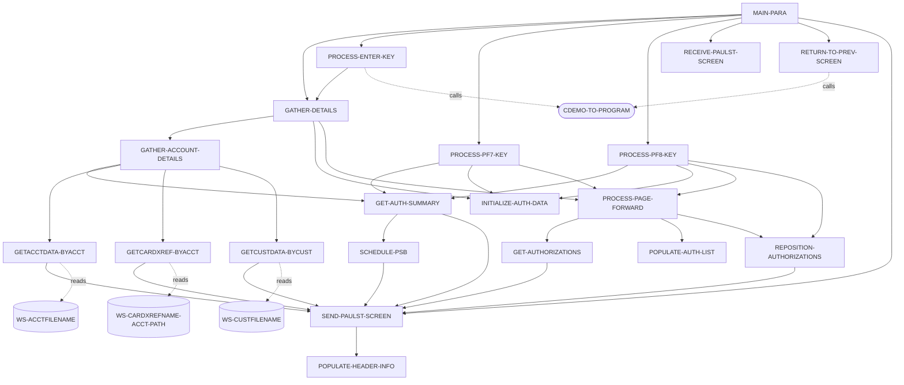

# COPAUS0C

**File**: `cbl/COPAUS0C.cbl`
**Type**: FileType.COBOL
**Analyzed**: 2026-02-24 04:02:40.883365

## Purpose

COPAUS0C is a CICS online program that provides a paginated summary view of pending authorization messages for a specified account ID in the CardDemo authorization module. It retrieves account, customer, and card cross-reference details from VSAM files, fetches IMS summary and detail segments for authorizations, and displays a list of up to 5 authorizations per page with navigation via PF7 (previous) and PF8 (next). Users can select an authorization with 'S' to XCTL to detail view COPAUS1C.

**Business Context**: Serves the CardDemo application for viewing authorization summaries to support credit card transaction authorization review and decision-making.

## Inputs

| Name | Type | Description |
|------|------|-------------|
| CARDDEMO-COMMAREA | IOType.CICS_COMMAREA | Common area containing account ID, program context, transaction details, and pagination keys for authorizations |
| COPAU0AI | IOType.CICS_MAP | Input map fields for account ID entry (ACCTIDI), selection fields (SEL0001I-SEL0005I), and other screen inputs |
| CXACAIX | IOType.FILE_VSAM | Card cross-reference file accessed by account ID to get customer ID and card number |
| ACCTDAT | IOType.FILE_VSAM | Account master file read by account ID for credit limits and status |
| CUSTDAT | IOType.FILE_VSAM | Customer master file read by customer ID for name, address, phone |
| PAUTSUM0 | IOType.IMS_SEGMENT | Pending authorization summary root segment qualified by account ID containing counts and balances |
| PAUTDTL1 | IOType.IMS_SEGMENT | Pending authorization details child segments for list population with GNP calls |

## Outputs

| Name | Type | Description |
|------|------|-------------|
| COPAU0AO | IOType.CICS_MAP | Output map populated with header info, account/customer details, auth summary counts, and paginated auth list |
| CARDDEMO-COMMAREA | IOType.CICS_COMMAREA | Updated commarea with pagination keys, selected auth key, page num for return or XCTL |

## Called Programs

| Program | Call Type | Purpose |
|---------|-----------|---------|
| COPAUS1C | CallType.CICS_XCTL | Transfer control to authorization details program when user selects an auth with 'S' |
| COMEN01C | CallType.CICS_XCTL | Return to menu screen on PF3 via CDEMO-TO-PROGRAM set to WS-PGM-MENU |
| COSGN00C | CallType.CICS_XCTL | Fallback to signon screen if no previous program set on return |

## Business Rules

- **BR001**: Account ID must be numeric and non-blank to fetch details; otherwise display error message
- **BR002**: Authorization selection must be 'S' or 's' to XCTL to details; invalid shows error
- **BR003**: Approval status 'A' if PA-AUTH-RESP-CODE = '00', else 'D' for display

## Paragraphs/Procedures

### MAIN-PARA
> [Source: MAIN-PARA.cbl.md](COPAUS0C.cbl.d/MAIN-PARA.cbl.md)
This is the primary entry point and orchestration paragraph that initializes flags, handles first-time entry vs reentry via commarea, receives map data if applicable, and dispatches to key processing based on AID (ENTER, PF3, PF7, PF8). It consumes EIBCALEN, DFHCOMMAREA, and map inputs COPAU0AI, reading account ID and selections. It produces updated commarea CARDDEMO-COMMAREA and screen output via SEND-PAULST-SCREEN. Business logic evaluates EIBAID to route: ENTER processes input and regathers details, PF3 returns to menu, PF7/PF8 handle pagination, invalid AID sets error. Errors set WS-ERR-FLG and display messages. It calls GATHER-DETAILS for data refresh, PROCESS-*-KEY for actions, RECEIVE-PAULST-SCREEN/SEND-PAULST-SCREEN for I/O, and finally CICS RETURN with TRANSID CPVS. On initial call (EIBCALEN=0), initializes and sends first screen.

### PROCESS-ENTER-KEY
> [Source: PROCESS-ENTER-KEY.cbl.md](COPAUS0C.cbl.d/PROCESS-ENTER-KEY.cbl.md)
Handles ENTER key press by validating and processing account ID input and authorization selection from map fields SEL0001I-SEL0005I. It reads ACCTIDI and SEL*IDI from COPAU0AI, checks if account ID is blank/low or non-numeric, sets errors and messages accordingly. If valid, maps selection to CDEMO-CPVS-PAU-SELECTED from CDEMO-CPVS-AUTH-KEYS index, and if 'S'/'s' XCTLs to COPAUS1C details program. Outputs error messages to WS-MESSAGE if invalid, repositions cursor with ACCTIDL=-1. Calls GATHER-DETAILS to refresh screen data post-processing. Error handling includes invalid selection message. Maintains WS-ACCT-ID and commarea updates.

### GATHER-DETAILS
> [Source: GATHER-DETAILS.cbl.md](COPAUS0C.cbl.d/GATHER-DETAILS.cbl.md)
Orchestrates fetching and displaying account-related authorization data by first gathering VSAM account/customer/xref details if WS-ACCT-ID valid, then initializing auth list, and processing first page of summaries from IMS. Consumes WS-ACCT-ID to drive GATHER-ACCOUNT-DETAILS and GET-AUTH-SUMMARY. Produces screen fields via subordinate calls populating COPAU0AO indirectly. Business logic checks WS-ACCT-ID <> LOW-VALUES before proceeding, sets page num to 0. Calls GATHER-ACCOUNT-DETAILS, INITIALIZE-AUTH-DATA, PROCESS-PAGE-FORWARD if summary segment found. No explicit error handling here, relies on subordinates.

### PROCESS-PF7-KEY
> [Source: PROCESS-PF7-KEY.cbl.md](COPAUS0C.cbl.d/PROCESS-PF7-KEY.cbl.md)
Handles PF7 (previous page) by decrementing page num if >1, repositioning to previous page's first auth key saved in CDEMO-CPVS-PAUKEY-PREV-PG, fetching that summary, and processing forward to repopulate current page. Reads CDEMO-CPVS-PAGE-NUM and PAUKEY-PREV-PG from commarea. Writes updated page num and sets NEXT-PAGE-YES, SEND-ERASE-NO. Logic checks page >1 else error message 'already at top'. Calls GET-AUTH-SUMMARY, INITIALIZE-AUTH-DATA, PROCESS-PAGE-FORWARD. Error handling via WS-MESSAGE.

### PROCESS-PF8-KEY
> [Source: PROCESS-PF8-KEY.cbl.md](COPAUS0C.cbl.d/PROCESS-PF8-KEY.cbl.md)
Handles PF8 (next page) by using last key CDEMO-CPVS-PAUKEY-LAST to reposition and fetch next summary, setting flags for forward processing. Consumes CDEMO-CPVS-PAUKEY-LAST, calls GET-AUTH-SUMMARY and REPOSITION-AUTHORIZATIONS. Produces updated pagination data and screen refresh. Logic sets SEND-ERASE-NO, if NEXT-PAGE-YES calls INITIALIZE/PROCESS-PAGE-FORWARD else 'already at bottom' message. Error handling in subordinates.

### PROCESS-PAGE-FORWARD
> [Source: PROCESS-PAGE-FORWARD.cbl.md](COPAUS0C.cbl.d/PROCESS-PAGE-FORWARD.cbl.md)
Populates one page (5 auths) by looping GET-AUTHORIZATIONS or REPOSITION for first, then POPULATE-AUTH-LIST until 5 or EOF/ERR, peeks one more for NEXT-PAGE flag. Consumes WS-IDX starting 1, IMS PCB via GNP. Writes to CDEMO-CPVS-AUTH-KEYS, COPAU0A* fields (TRNID*1I etc.), PAUKEY-LAST/PREV-PG, PAGE-NUM. Business logic PERFORM UNTIL WS-IDX>5 or EOF/ERR, special REPOSITION if PF7 and IDX=1. Handles errors by breaking loop if ERR-FLG-ON. Calls GET-AUTHORIZATIONS, REPOSITION-AUTHORIZATIONS (conditional), POPULATE-AUTH-LIST.

### GET-AUTHORIZATIONS
> [Source: GET-AUTHORIZATIONS.cbl.md](COPAUS0C.cbl.d/GET-AUTHORIZATIONS.cbl.md)
Performs unqualified IMS GNP on PAUTDTL1 details segment into PENDING-AUTH-DETAILS to get next sequential auth. Consumes IMS PCB(PAUT-PCB-NUM). Evaluates IMS-RETURN-CODE (DIBSTAT): OK sets NOT-EOF, GE/GB sets EOF, others ERR-FLG with message and SEND screen. No outputs directly, sets flags for loop control.

### REPOSITION-AUTHORIZATIONS
> [Source: REPOSITION-AUTHORIZATIONS.cbl.md](COPAUS0C.cbl.d/REPOSITION-AUTHORIZATIONS.cbl.md)
Repositions IMS cursor to specific PAUTDTL1 segment using PA-AUTHORIZATION-KEY = WS-AUTH-KEY-SAVE via qualified GNP WHERE PAUT9CTS. Consumes WS-AUTH-KEY-SAVE moved to PA-AUTH-KEY. Sets NOT-EOF on OK, EOF on GE/GB, ERR on others with message and SEND. Used for pagination start points.

### POPULATE-AUTH-LIST
> [Source: POPULATE-AUTH-LIST.cbl.md](COPAUS0C.cbl.d/POPULATE-AUTH-LIST.cbl.md)
Transforms current PENDING-AUTH-DETAILS into screen fields for one list entry based on WS-IDX (1-5), reformats date/time/amt, sets status A/D, moves to specific *01I-*05I fields and CDEMO-CPVS-AUTH-KEYS(WS-IDX). Consumes PA-* fields from IMS segment, WS-IDX. Writes to TRNID*1I, PDATE*1I, PTIME*1I, PTYPE*1I, PAPRV*1I, PSTAT*1I, PAMT**1I, SEL000*I A=DFHBMUNP. Business logic EVALUATE WS-IDX WHEN 1-5. No calls, no error handling.

### INITIALIZE-AUTH-DATA
> [Source: INITIALIZE-AUTH-DATA.cbl.md](COPAUS0C.cbl.d/INITIALIZE-AUTH-DATA.cbl.md)
Clears the 5 authorization list fields on screen map by VARYING WS-IDX 1-5 setting *I fields to SPACES and SEL000*A to DFHBMPRO (protected). Consumes nothing directly. Writes to TRNID*1I-*05I, PDATE*1I etc., SEL0001A-SEL0005A. No conditions or errors, preparatory for population.

### RETURN-TO-PREV-SCREEN
> [Source: RETURN-TO-PREV-SCREEN.cbl.md](COPAUS0C.cbl.d/RETURN-TO-PREV-SCREEN.cbl.md)
Prepares XCTL back to previous or default menu program by setting CDEMO-TO-PROGRAM (fallback COSGN00C), FROM-TRANID/PROGRAM, CONTEXT=0. Consumes CDEMO-TO-PROGRAM if set. Performs XCTL PROGRAM(CDEMO-TO-PROGRAM) COMMAREA. Called on PF3.

### SEND-PAULST-SCREEN
> [Source: SEND-PAULST-SCREEN.cbl.md](COPAUS0C.cbl.d/SEND-PAULST-SCREEN.cbl.md)
Sends the COPAU0A map to terminal, erasing if SEND-ERASE-YES (initial/refresh), else no erase for overlays, always CURSOR. First unschedules IMS PSB if scheduled via SYNCPOINT. Calls POPULATE-HEADER-INFO before send, moves WS-MESSAGE to ERRMSGO. Handles IMS cleanup.

### RECEIVE-PAULST-SCREEN
> [Source: RECEIVE-PAULST-SCREEN.cbl.md](COPAUS0C.cbl.d/RECEIVE-PAULST-SCREEN.cbl.md)
Receives map data from terminal into COPAU0AI with RESP codes. Simple wrapper for CICS RECEIVE MAP('COPAU0A') INTO(COPAU0AI). Called when CDEMO-PGM-REENTER true.

### POPULATE-HEADER-INFO
> [Source: POPULATE-HEADER-INFO.cbl.md](COPAUS0C.cbl.d/POPULATE-HEADER-INFO.cbl.md)
Fills static screen header with current date/time via FUNCTION CURRENT-DATE, transaction/program names, titles from copybooks. Formats date MM/DD/YY, time HH:MM:SS from WS-CURDATE-DATA. Moves to TITLE01O/TITLE02O, TRNNAMEO, PGMNAMEO, CURDATEO, CURTIMEO. No conditions.

### GATHER-ACCOUNT-DETAILS
> [Source: GATHER-ACCOUNT-DETAILS.cbl.md](COPAUS0C.cbl.d/GATHER-ACCOUNT-DETAILS.cbl.md)
Fetches and displays VSAM account/customer/xref data plus IMS summary counts/balances for header. Calls GETCARDXREF-BYACCT, GETACCTDATA-BYACCT, GETCUSTDATA-BYCUST, GET-AUTH-SUMMARY. Transforms customer name/address via STRING to CNAMEO/ADDR*O, moves limits PHONE etc. If summary found, moves counts/amts to APPRCNTO etc., else zeros. Error handling in file reads sends screen.

### GETCARDXREF-BYACCT
> [Source: GETCARDXREF-BYACCT.cbl.md](COPAUS0C.cbl.d/GETCARDXREF-BYACCT.cbl.md)
Reads card xref VSAM via alternate path CXACAIX by ACCT-ID into CARD-XREF-RECORD, sets CDEMO-CUST-ID/CARD-NUM. On NORMAL ok, NOTFND/OTHER error message with RESP and SEND screen. Key WS-CARD-RID-ACCT-ID-X.

### GETACCTDATA-BYACCT
> [Source: GETACCTDATA-BYACCT.cbl.md](COPAUS0C.cbl.d/GETACCTDATA-BYACCT.cbl.md)
Reads account VSAM ACCTDAT by ACCT-ID (from xref) into ACCOUNT-RECORD for limits. NORMAL continue, NOTFND/OTHER error message with RESP and SEND.

### GETCUSTDATA-BYCUST
> [Source: GETCUSTDATA-BYCUST.cbl.md](COPAUS0C.cbl.d/GETCUSTDATA-BYCUST.cbl.md)
Reads customer VSAM CUSTDAT by CUST-ID (from xref) into CUSTOMER-RECORD for name/addr/phone. NORMAL continue, NOTFND/OTHER error message with RESP and SEND.

### GET-AUTH-SUMMARY
> [Source: GET-AUTH-SUMMARY.cbl.md](COPAUS0C.cbl.d/GET-AUTH-SUMMARY.cbl.md)
Schedules PSB if needed, then qualified IMS GU on PAUTSUM0 by PA-ACCT-ID = CDEMO-ACCT-ID into PENDING-AUTH-SUMMARY. Sets FOUND/NFOUND flags on OK/GE, other ERR with message and SEND.

### SCHEDULE-PSB
> [Source: SCHEDULE-PSB.cbl.md](COPAUS0C.cbl.d/SCHEDULE-PSB.cbl.md)
Schedules IMS PSB 'PSBPAUTB' via DLI SCHD NODHABEND, terms if already scheduled more than once, sets IMS-PSB-SCHD flag on OK else ERR message and SEND. Handles TC by rescheduling.

## Control Flow

## Sequence Diagram

```mermaid
sequenceDiagram
    participant MAIN_PARA as MAIN-PARA
    participant SEND_PAULST_SCREEN as SEND-PAULST-SCREEN
    participant GATHER_DETAILS as GATHER-DETAILS
    participant RECEIVE_PAULST_SCREEN as RECEIVE-PAULST-SCREEN
    participant PROCESS_ENTER_KEY as PROCESS-ENTER-KEY
    participant RETURN_TO_PREV_SCREEN as RETURN-TO-PREV-SCREEN
    participant PROCESS_PF7_KEY as PROCESS-PF7-KEY
    participant PROCESS_PF8_KEY as PROCESS-PF8-KEY
    participant CDEMO_TO_PROGRAM as CDEMO-TO-PROGRAM
    participant GATHER_ACCOUNT_DETAILS as GATHER-ACCOUNT-DETAILS
    participant INITIALIZE_AUTH_DATA as INITIALIZE-AUTH-DATA
    participant PROCESS_PAGE_FORWARD as PROCESS-PAGE-FORWARD
    participant GET_AUTH_SUMMARY as GET-AUTH-SUMMARY
    participant REPOSITION_AUTHORIZATIONS as REPOSITION-AUTHORIZATIONS
    participant GET_AUTHORIZATIONS as GET-AUTHORIZATIONS
    participant POPULATE_AUTH_LIST as POPULATE-AUTH-LIST
    participant POPULATE_HEADER_INFO as POPULATE-HEADER-INFO
    participant GETCARDXREF_BYACCT as GETCARDXREF-BYACCT
    participant GETACCTDATA_BYACCT as GETACCTDATA-BYACCT
    participant GETCUSTDATA_BYCUST as GETCUSTDATA-BYCUST
    participant WS_CARDXREFNAME_ACCT_PATH as WS-CARDXREFNAME-ACCT-PATH
    participant WS_ACCTFILENAME as WS-ACCTFILENAME
    participant WS_CUSTFILENAME as WS-CUSTFILENAME
    participant SCHEDULE_PSB as SCHEDULE-PSB
    MAIN_PARA->>SEND_PAULST_SCREEN: performs
    MAIN_PARA->>GATHER_DETAILS: performs
    MAIN_PARA->>SEND_PAULST_SCREEN: performs
    MAIN_PARA->>RECEIVE_PAULST_SCREEN: performs
    MAIN_PARA->>PROCESS_ENTER_KEY: performs
    MAIN_PARA->>SEND_PAULST_SCREEN: performs
    MAIN_PARA->>RETURN_TO_PREV_SCREEN: performs
    MAIN_PARA->>SEND_PAULST_SCREEN: performs
    MAIN_PARA->>PROCESS_PF7_KEY: performs
    MAIN_PARA->>SEND_PAULST_SCREEN: performs
    MAIN_PARA->>PROCESS_PF8_KEY: performs
    MAIN_PARA->>SEND_PAULST_SCREEN: performs
    MAIN_PARA->>SEND_PAULST_SCREEN: performs
    PROCESS_ENTER_KEY->>GATHER_DETAILS: performs
    PROCESS_ENTER_KEY->>CDEMO_TO_PROGRAM: performs
    GATHER_DETAILS->>GATHER_ACCOUNT_DETAILS: performs
    GATHER_DETAILS->>INITIALIZE_AUTH_DATA: performs
    GATHER_DETAILS->>PROCESS_PAGE_FORWARD: performs
    PROCESS_PF7_KEY->>GET_AUTH_SUMMARY: performs
    PROCESS_PF7_KEY->>INITIALIZE_AUTH_DATA: performs
    PROCESS_PF7_KEY->>PROCESS_PAGE_FORWARD: performs
    PROCESS_PF8_KEY->>GET_AUTH_SUMMARY: performs
    PROCESS_PF8_KEY->>REPOSITION_AUTHORIZATIONS: performs
    PROCESS_PF8_KEY->>INITIALIZE_AUTH_DATA: performs
    PROCESS_PF8_KEY->>PROCESS_PAGE_FORWARD: performs
    PROCESS_PAGE_FORWARD->>REPOSITION_AUTHORIZATIONS: performs
    PROCESS_PAGE_FORWARD->>GET_AUTHORIZATIONS: performs
    PROCESS_PAGE_FORWARD->>POPULATE_AUTH_LIST: performs
    PROCESS_PAGE_FORWARD->>GET_AUTHORIZATIONS: performs
    GET_AUTHORIZATIONS->>SEND_PAULST_SCREEN: performs
    REPOSITION_AUTHORIZATIONS->>SEND_PAULST_SCREEN: performs
    RETURN_TO_PREV_SCREEN->>CDEMO_TO_PROGRAM: performs
    SEND_PAULST_SCREEN->>POPULATE_HEADER_INFO: performs
    GATHER_ACCOUNT_DETAILS->>GETCARDXREF_BYACCT: performs
    GATHER_ACCOUNT_DETAILS->>GETACCTDATA_BYACCT: performs
    GATHER_ACCOUNT_DETAILS->>GETCUSTDATA_BYCUST: performs
    GATHER_ACCOUNT_DETAILS->>GET_AUTH_SUMMARY: performs
    GETCARDXREF_BYACCT->>SEND_PAULST_SCREEN: performs
    GETCARDXREF_BYACCT->>SEND_PAULST_SCREEN: performs
    GETCARDXREF_BYACCT->>WS_CARDXREFNAME_ACCT_PATH: performs
    GETACCTDATA_BYACCT->>SEND_PAULST_SCREEN: performs
    GETACCTDATA_BYACCT->>SEND_PAULST_SCREEN: performs
    GETACCTDATA_BYACCT->>WS_ACCTFILENAME: performs
    GETCUSTDATA_BYCUST->>SEND_PAULST_SCREEN: performs
    GETCUSTDATA_BYCUST->>SEND_PAULST_SCREEN: performs
    GETCUSTDATA_BYCUST->>WS_CUSTFILENAME: performs
    GET_AUTH_SUMMARY->>SCHEDULE_PSB: performs
    GET_AUTH_SUMMARY->>SEND_PAULST_SCREEN: performs
    SCHEDULE_PSB->>SEND_PAULST_SCREEN: performs
```

