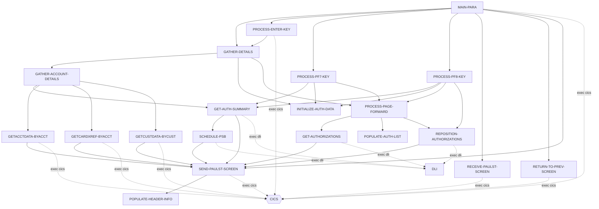

# COPAUS0C

**File**: `cbl/COPAUS0C.cbl`
**Type**: FileType.COBOL
**Analyzed**: 2026-04-21 13:43:17.678937

## Purpose

This CICS COBOL program, COPAUS0C, retrieves and displays pending authorization summaries for a given account ID. It allows users to navigate through multiple pages of authorization details and select an authorization for further details.

**Business Context**: This program is likely used by customer service representatives or fraud analysts to review and manage pending authorizations for customer accounts.

## Inputs

| Name | Type | Description |
|------|------|-------------|
| COPAU0AI | IOType.CICS_MAP | CICS Map containing input fields, including the account ID (ACCTIDI) and selection flags for authorizations (SEL0001I - SEL0005I). |
| CARDDEMO-COMMAREA | IOType.CICS_COMMAREA | CICS Commarea used to pass data between this program and other CARDDEMO programs. Contains account ID (CDEMO-ACCT-ID), program context (CDEMO-PGM-CONTEXT), and authorization keys (CDEMO-CPVS-AUTH-KEYS). |
| PAUTDTL1 | IOType.IMS_SEGMENT | IMS segment containing pending authorization details, including authorization key (PAUT9CTS), transaction ID (PA-TRANSACTION-ID), date (PA-AUTH-ORIG-DATE), time (PA-AUTH-ORIG-TIME), type (PA-AUTH-TYPE), approval status (PA-AUTH-RESP-CODE), match status (PA-MATCH-STATUS), and approved amount (PA-APPROVED-AMT). |

## Outputs

| Name | Type | Description |
|------|------|-------------|
| COPAU0AO | IOType.CICS_MAP | CICS Map containing output fields to display authorization summaries, including transaction IDs (TRNID01I - TRNID05I), dates (PDATE01I - PDATE05I), times (PTIME01I - PTIME05I), types (PTYPE01I - PTYPE05I), approval statuses (PAPRV01I - PAPRV05I), match statuses (PSTAT01I - PSTAT05I), amounts (PAMT001I - PAMT005I), and selection indicators (SEL0001A - SEL0005A). |
| CARDDEMO-COMMAREA | IOType.CICS_COMMAREA | Updated CICS Commarea passed to other programs.  Contains account ID (CDEMO-ACCT-ID), program context (CDEMO-PGM-CONTEXT), and authorization keys (CDEMO-CPVS-AUTH-KEYS). |

## Called Programs

| Program | Call Type | Purpose |
|---------|-----------|---------|
| CDEMO-TO-PROGRAM | CallType.CICS_XCTL | Transfers control to another CARDDEMO program based on user selection (e.g., authorization details screen). |
| SEND-PAULST-SCREEN | CallType.STATIC_CALL | Sends the COPAU0AO map to the terminal to display the authorization summary screen. |
| RECEIVE-PAULST-SCREEN | CallType.STATIC_CALL | Receives the COPAU0AI map from the terminal to get the user's input. |
| RETURN-TO-PREV-SCREEN | CallType.STATIC_CALL | Returns to the previous screen (likely the main menu) when the user presses PF3. |
| GATHER-DETAILS | CallType.STATIC_CALL | Gathers account details and authorization information to populate the screen. |
| PROCESS-ENTER-KEY | CallType.STATIC_CALL | Processes the user's input when the ENTER key is pressed, validating the account ID and handling authorization selections. |
| PROCESS-PF7-KEY | CallType.STATIC_CALL | Processes the user's input when the PF7 key is pressed, navigating to the previous page of authorization details. |
| PROCESS-PF8-KEY | CallType.STATIC_CALL | Processes the user's input when the PF8 key is pressed, navigating to the next page of authorization details. |
| GATHER-ACCOUNT-DETAILS | CallType.STATIC_CALL | Retrieves and formats account details for display on the screen. |
| INITIALIZE-AUTH-DATA | CallType.STATIC_CALL | Initializes the authorization data area before retrieving and displaying authorization details. |
| PROCESS-PAGE-FORWARD | CallType.STATIC_CALL | Retrieves and populates the authorization details for the current page. |
| GET-AUTH-SUMMARY | CallType.STATIC_CALL | Retrieves the authorization summary information based on the authorization key. |
| REPOSITION-AUTHORIZATIONS | CallType.STATIC_CALL | Repositions the IMS database to the correct authorization record based on the authorization key. |
| GET-AUTHORIZATIONS | CallType.STATIC_CALL | Retrieves the next authorization detail record from the IMS database. |
| POPULATE-AUTH-LIST | CallType.STATIC_CALL | Populates the authorization list on the screen with the retrieved authorization details. |

## Business Rules

- **BR001**: Account ID must be numeric and not spaces or LOW-VALUES.
- **BR002**: If an authorization is selected, the selected value must be 'S' or 's' to proceed to the authorization details screen.
- **BR003**: The program handles PF7 and PF8 keys to navigate through pages of authorization details.

## Paragraphs/Procedures

### COPAUS0C
This is the program ID paragraph. It simply defines the program name COPAUS0C. It does not perform any logic or operations. It serves as a marker for the start of the program definition. No inputs are consumed or outputs produced. No business logic or error handling is present. It does not call any other paragraphs or programs.

### MAIN-PARA
> [Source: MAIN-PARA.cbl.md](COPAUS0C.cbl.d/MAIN-PARA.cbl.md)

```
MAIN-PARA  (132 statements, depth=9)
PARAGRAPH
├── UNKNOWN: 03 PAPRV01A    PICTURE X
├── UNKNOWN: 02  FILLER   PICTURE X(4)
├── UNKNOWN: 02  PAPRV01I  PIC X(1)
├── UNKNOWN: 02  PSTAT01L    COMP  PIC  S9(4)
├── UNKNOWN: 02  PSTAT01F    PICTURE X
├── UNKNOWN: 02  FILLER REDEFINES PSTAT01F
├── UNKNOWN: 03 PSTAT01A    PICTURE X
├── UNKNOWN: 02  FILLER   PICTURE X(4)
├── UNKNOWN: 02  PSTAT01I  PIC X(1)
├── UNKNOWN: 02  PAMT001L    COMP  PIC  S9(4)
├── UNKNOWN: 02  PAMT001F    PICTURE X
├── UNKNOWN: 02  FILLER REDEFINES PAMT001F
├── UNKNOWN: 03 PAMT001A    PICTURE X
├── UNKNOWN: 02  FILLER   PICTURE X(4)
├── UNKNOWN: 02  PAMT001I  PIC X(12)
├── UNKNOWN: 02  SEL0002L    COMP  PIC  S9(4)
├── UNKNOWN: 02  SEL0002F    PICTURE X
├── UNKNOWN: 02  FILLER REDEFINES SEL0002F
├── UNKNOWN: 03 SEL0002A    PICTURE X
├── UNKNOWN: 02  FILLER   PICTURE X(4)
├── UNKNOWN: 02  SEL0002I  PIC X(1)
├── UNKNOWN: 02  TRNID02L    COMP  PIC  S9(4)
├── UNKNOWN: 02  TRNID02F    PICTURE X
├── UNKNOWN: 02  FILLER REDEFINES TRNID02F
├── UNKNOWN: 03 TRNID02A    PICTURE X
├── UNKNOWN: 02  FILLER   PICTURE X(4)
├── UNKNOWN: 02  TRNID02I  PIC X(16)
├── UNKNOWN: 02  PDATE02L    COMP  PIC  S9(4)
├── UNKNOWN: 02  PDATE02F    PICTURE X
├── UNKNOWN: 02  FILLER REDEFINES PDATE02F
├── UNKNOWN: 03 PDATE02A    PICTURE X
├── UNKNOWN: 02  FILLER   PICTURE X(4)
├── UNKNOWN: 02  PDATE02I  PIC X(8)
├── UNKNOWN: 02  PTIME02L    COMP  PIC  S9(4)
├── UNKNOWN: 02  PTIME02F    PICTURE X
├── UNKNOWN: 02  FILLER REDEFINES PTIME02F
├── UNKNOWN: 03 PTIME02A    PICTURE X
├── UNKNOWN: 02  FILLER   PICTURE X(4)
├── UNKNOWN: 02  PTIME02I  PIC X(8)
├── UNKNOWN: 02  PTYPE02L    COMP  PIC  S9(4)
├── UNKNOWN: 02  PTYPE02F    PICTURE X
├── UNKNOWN: 02  FILLER REDEFINES PTYPE02F
├── UNKNOWN: 03 PTYPE02A    PICTURE X
├── UNKNOWN: 02  FILLER   PICTURE X(4)
├── UNKNOWN: 02  PTYPE02I  PIC X(4)
├── UNKNOWN: 02  PAPRV02L    COMP  PIC  S9(4)
├── UNKNOWN: 02  PAPRV02F    PICTURE X
├── UNKNOWN: 02  FILLER REDEFINES PAPRV02F
├── UNKNOWN: 03 PAPRV02A    PICTURE X
├── UNKNOWN: 02  FILLER   PICTURE X(4)
├── UNKNOWN: 02  PAPRV02I  PIC X(1)
├── UNKNOWN: 02  PSTAT02L    COMP  PIC  S9(4)
├── UNKNOWN: 02  PSTAT02F    PICTURE X
├── UNKNOWN: 02  FILLER REDEFINES PSTAT02F
├── UNKNOWN: 03 PSTAT02A    PICTURE X
├── UNKNOWN: 02  FILLER   PICTURE X(4)
├── UNKNOWN: 02  PSTAT02I  PIC X(1)
├── UNKNOWN: 02  PAMT002L    COMP  PIC  S9(4)
├── UNKNOWN: 02  PAMT002F    PICTURE X
├── UNKNOWN: 02  FILLER REDEFINES PAMT002F
├── UNKNOWN: 03 PAMT002A    PICTURE X
├── UNKNOWN: 02  FILLER   PICTURE X(4)
├── UNKNOWN: 02  PAMT002I  PIC X(12)
├── UNKNOWN: 02  SEL0003L    COMP  PIC  S9(4)
├── UNKNOWN: 02  SEL0003F    PICTURE X
├── UNKNOWN: 02  FILLER REDEFINES SEL0003F
├── UNKNOWN: 03 SEL0003A    PICTURE X
├── UNKNOWN: 02  FILLER   PICTURE X(4)
├── UNKNOWN: 02  SEL0003I  PIC X(1)
├── UNKNOWN: 02  TRNID03L    COMP  PIC  S9(4)
├── UNKNOWN: 02  TRNID03F    PICTURE X
├── UNKNOWN: 02  FILLER REDEFINES TRNID03F
├── UNKNOWN: 03 TRNID03A    PICTURE X
├── UNKNOWN: 02  FILLER   PICTURE X(4)
├── UNKNOWN: 02  TRNID03I  PIC X(16)
├── UNKNOWN: 02  PDATE03L    COMP  PIC  S9(4)
├── UNKNOWN: 02  PDATE03F    PICTURE X
├── UNKNOWN: 02  FILLER REDEFINES PDATE03F
├── UNKNOWN: 03 PDATE03A    PICTURE X
├── UNKNOWN: 02  FILLER   PICTURE X(4)
├── SET: SET ERR-FLG-OFF TO TRUE
├── SET: SET AUTHS-NOT-EOF TO TRUE
├── SET: SET NEXT-PAGE-NO TO TRUE
├── SET: SET SEND-ERASE-YES TO TRUE
├── MOVE: MOVE SPACES TO WS-MESSAGE ERRMSGO OF COPAU0AO
├── MOVE: MOVE -1       TO ACCTIDL OF COPAU0AI
├── IF: IF EIBCALEN = 0
│   ├── INITIALIZE: INITIALIZE CARDDEMO-COMMAREA
│   ├── MOVE: MOVE WS-PGM-AUTH-SMRY    TO CDEMO-TO-PROGRAM
│   ├── SET: SET CDEMO-PGM-REENTER    TO TRUE
│   ├── MOVE: MOVE LOW-VALUES          TO COPAU0AO
│   ├── MOVE: MOVE -1                  TO ACCTIDL OF COPAU0AI
│   ├── PERFORM: PERFORM SEND-PAULST-SCREEN
│   └── ELSE: ELSE
│       ├── MOVE: MOVE DFHCOMMAREA(1:EIBCALEN) TO CARDDEMO-COMMAREA
│       └── IF: IF NOT CDEMO-PGM-REENTER
│           ├── SET: SET CDEMO-PGM-REENTER     TO TRUE
│           ├── MOVE: MOVE LOW-VALUES           TO COPAU0AO
│           ├── IF: IF CDEMO-ACCT-ID IS NUMERIC
│           │   ├── MOVE: MOVE CDEMO-ACCT-ID     TO WS-ACCT-ID
ACCTIDO OF COPAU0AO
│           │   └── ELSE: ELSE
│           │       ├── MOVE: MOVE SPACE             TO ACCTIDO OF COPAU0AO
│           │       └── MOVE: MOVE LOW-VALUES        TO WS-ACCT-ID
│           ├── PERFORM: PERFORM GATHER-DETAILS
│           ├── SET: SET SEND-ERASE-YES TO TRUE
│           ├── PERFORM: PERFORM SEND-PAULST-SCREEN
│           └── ELSE: ELSE
│               ├── PERFORM: PERFORM RECEIVE-PAULST-SCREEN
│               └── EVALUATE: EVALUATE EIBAID
│                   ├── WHEN: WHEN DFHENTER
│                   │   ├── PERFORM: PERFORM PROCESS-ENTER-KEY
│                   │   ├── IF: IF WS-ACCT-ID = LOW-VALUES
│                   │   │   ├── MOVE: MOVE SPACE           TO ACCTIDO   OF COPAU0AO
│                   │   │   └── ELSE: ELSE
│                   │   │       └── MOVE: MOVE WS-ACCT-ID      TO ACCTIDO   OF COPAU0AO
│                   │   └── PERFORM: PERFORM SEND-PAULST-SCREEN
│                   ├── WHEN: WHEN DFHPF3
│                   │   ├── MOVE: MOVE WS-PGM-MENU        TO CDEMO-TO-PROGRAM
│                   │   ├── PERFORM: PERFORM RETURN-TO-PREV-SCREEN
│                   │   └── PERFORM: PERFORM SEND-PAULST-SCREEN
│                   ├── WHEN: WHEN DFHPF7
│                   │   ├── PERFORM: PERFORM PROCESS-PF7-KEY
│                   │   └── PERFORM: PERFORM SEND-PAULST-SCREEN
│                   ├── WHEN: WHEN DFHPF8
│                   │   ├── PERFORM: PERFORM PROCESS-PF8-KEY
│                   │   └── PERFORM: PERFORM SEND-PAULST-SCREEN
│                   └── WHEN: WHEN OTHER
│                       ├── MOVE: MOVE 'Y'              TO WS-ERR-FLG
│                       ├── MOVE: MOVE -1               TO ACCTIDL OF COPAU0AI
│                       ├── MOVE: MOVE CCDA-MSG-INVALID-KEY  TO WS-MESSAGE
│                       └── PERFORM: PERFORM SEND-PAULST-SCREEN
└── EXEC_CICS: EXEC CICS RETURN TRANSID (WS-CICS-TRANID) COMMAREA (CARDDEMO-COMMAREA) END-EXEC
```
This paragraph serves as the main control logic for the CICS transaction. It first initializes flags and working storage. It then checks if the commarea (CARDDEMO-COMMAREA) is empty, indicating a first-time entry. If it's the first time, it initializes the commarea, sets the 'to program' field to WS-PGM-AUTH-SMRY, and sends the initial screen. If not the first time, it receives the screen input and evaluates the EIBAID to determine the action to perform based on the pressed key. Depending on the key pressed (ENTER, PF3, PF7, PF8), it calls different paragraphs to process the input or navigate between screens. If an invalid key is pressed, it sets an error flag and displays an error message. Finally, it returns control to CICS, passing the updated commarea.

### PROCESS-ENTER-KEY
> [Source: PROCESS-ENTER-KEY.cbl.md](COPAUS0C.cbl.d/PROCESS-ENTER-KEY.cbl.md)

```
PROCESS-ENTER-KEY  (124 statements, depth=8)
PARAGRAPH
├── UNKNOWN: 02  FILLER REDEFINES PTIME03F
├── UNKNOWN: 03 PTIME03A    PICTURE X
├── UNKNOWN: 02  FILLER   PICTURE X(4)
├── UNKNOWN: 02  PTIME03I  PIC X(8)
├── UNKNOWN: 02  PTYPE03L    COMP  PIC  S9(4)
├── UNKNOWN: 02  PTYPE03F    PICTURE X
├── UNKNOWN: 02  FILLER REDEFINES PTYPE03F
├── UNKNOWN: 03 PTYPE03A    PICTURE X
├── UNKNOWN: 02  FILLER   PICTURE X(4)
├── UNKNOWN: 02  PTYPE03I  PIC X(4)
├── UNKNOWN: 02  PAPRV03L    COMP  PIC  S9(4)
├── UNKNOWN: 02  PAPRV03F    PICTURE X
├── UNKNOWN: 02  FILLER REDEFINES PAPRV03F
├── UNKNOWN: 03 PAPRV03A    PICTURE X
├── UNKNOWN: 02  FILLER   PICTURE X(4)
├── UNKNOWN: 02  PAPRV03I  PIC X(1)
├── UNKNOWN: 02  PSTAT03L    COMP  PIC  S9(4)
├── UNKNOWN: 02  PSTAT03F    PICTURE X
├── UNKNOWN: 02  FILLER REDEFINES PSTAT03F
├── UNKNOWN: 03 PSTAT03A    PICTURE X
├── UNKNOWN: 02  FILLER   PICTURE X(4)
├── UNKNOWN: 02  PSTAT03I  PIC X(1)
├── UNKNOWN: 02  PAMT003L    COMP  PIC  S9(4)
├── UNKNOWN: 02  PAMT003F    PICTURE X
├── UNKNOWN: 02  FILLER REDEFINES PAMT003F
├── UNKNOWN: 03 PAMT003A    PICTURE X
├── UNKNOWN: 02  FILLER   PICTURE X(4)
├── UNKNOWN: 02  PAMT003I  PIC X(12)
├── UNKNOWN: 02  SEL0004L    COMP  PIC  S9(4)
├── UNKNOWN: 02  SEL0004F    PICTURE X
├── UNKNOWN: 02  FILLER REDEFINES SEL0004F
├── UNKNOWN: 03 SEL0004A    PICTURE X
├── UNKNOWN: 02  FILLER   PICTURE X(4)
├── UNKNOWN: 02  SEL0004I  PIC X(1)
├── UNKNOWN: 02  TRNID04L    COMP  PIC  S9(4)
├── UNKNOWN: 02  TRNID04F    PICTURE X
├── UNKNOWN: 02  FILLER REDEFINES TRNID04F
├── UNKNOWN: 03 TRNID04A    PICTURE X
├── UNKNOWN: 02  FILLER   PICTURE X(4)
├── UNKNOWN: 02  TRNID04I  PIC X(16)
├── UNKNOWN: 02  PDATE04L    COMP  PIC  S9(4)
├── UNKNOWN: 02  PDATE04F    PICTURE X
├── UNKNOWN: 02  FILLER REDEFINES PDATE04F
├── UNKNOWN: 03 PDATE04A    PICTURE X
├── UNKNOWN: 02  FILLER   PICTURE X(4)
├── UNKNOWN: 02  PDATE04I  PIC X(8)
├── UNKNOWN: 02  PTIME04L    COMP  PIC  S9(4)
├── UNKNOWN: 02  PTIME04F    PICTURE X
├── UNKNOWN: 02  FILLER REDEFINES PTIME04F
├── UNKNOWN: 03 PTIME04A    PICTURE X
├── UNKNOWN: 02  FILLER   PICTURE X(4)
├── UNKNOWN: 02  PTIME04I  PIC X(8)
├── UNKNOWN: 02  PTYPE04L    COMP  PIC  S9(4)
├── UNKNOWN: 02  PTYPE04F    PICTURE X
├── UNKNOWN: 02  FILLER REDEFINES PTYPE04F
├── UNKNOWN: 03 PTYPE04A    PICTURE X
├── UNKNOWN: 02  FILLER   PICTURE X(4)
├── UNKNOWN: 02  PTYPE04I  PIC X(4)
├── UNKNOWN: 02  PAPRV04L    COMP  PIC  S9(4)
├── UNKNOWN: 02  PAPRV04F    PICTURE X
├── UNKNOWN: 02  FILLER REDEFINES PAPRV04F
├── UNKNOWN: 03 PAPRV04A    PICTURE X
├── UNKNOWN: 02  FILLER   PICTURE X(4)
├── UNKNOWN: 02  PAPRV04I  PIC X(1)
├── UNKNOWN: 02  PSTAT04L    COMP  PIC  S9(4)
├── UNKNOWN: 02  PSTAT04F    PICTURE X
├── UNKNOWN: 02  FILLER REDEFINES PSTAT04F
├── UNKNOWN: 03 PSTAT04A    PICTURE X
├── UNKNOWN: 02  FILLER   PICTURE X(4)
├── UNKNOWN: 02  PSTAT04I  PIC X(1)
├── UNKNOWN: 02  PAMT004L    COMP  PIC  S9(4)
├── UNKNOWN: 02  PAMT004F    PICTURE X
├── UNKNOWN: 02  FILLER REDEFINES PAMT004F
├── UNKNOWN: 03 PAMT004A    PICTURE X
├── UNKNOWN: 02  FILLER   PICTURE X(4)
├── UNKNOWN: 02  PAMT004I  PIC X(12)
├── UNKNOWN: 02  TRNID05L    COMP  PIC  S9(4)
├── UNKNOWN: 02  TRNID05F    PICTURE X
├── IF: IF ACCTIDI OF COPAU0AI = SPACES OR LOW-VALUES
│   ├── MOVE: MOVE LOW-VALUES                 TO WS-ACCT-ID
│   ├── MOVE: MOVE 'Y'                        TO WS-ERR-FLG
│   ├── MOVE: MOVE
'Please enter Acct Id...'       TO WS-MESSAGE
│   ├── MOVE: MOVE -1                         TO ACCTIDL OF COPAU0AI
│   └── ELSE: ELSE
│       └── IF: IF ACCTIDI OF COPAU0AI IS NOT NUMERIC
│           ├── MOVE: MOVE LOW-VALUES               TO WS-ACCT-ID
│           ├── MOVE: MOVE 'Y'                      TO WS-ERR-FLG
│           ├── MOVE: MOVE
'Acct Id must be Numeric ...' TO WS-MESSAGE
│           ├── MOVE: MOVE -1                       TO ACCTIDL OF COPAU0AI
│           └── ELSE: ELSE
│               ├── MOVE: MOVE ACCTIDI OF COPAU0AI      TO WS-ACCT-ID
CDEMO-ACCT-ID
│               ├── EVALUATE: EVALUATE TRUE
│               │   ├── WHEN: WHEN SEL0001I OF COPAU0AI NOT = SPACES AND LOW-VALUES
│               │   │   ├── MOVE: MOVE SEL0001I OF COPAU0AI TO CDEMO-CPVS-PAU-SEL-FLG
│               │   │   └── MOVE: MOVE CDEMO-CPVS-AUTH-KEYS(1)
TO CDEMO-CPVS-PAU-SELECTED
│               │   ├── WHEN: WHEN SEL0002I OF COPAU0AI NOT = SPACES AND LOW-VALUES
│               │   │   ├── MOVE: MOVE SEL0002I OF COPAU0AI TO CDEMO-CPVS-PAU-SEL-FLG
│               │   │   └── MOVE: MOVE CDEMO-CPVS-AUTH-KEYS(2)
TO CDEMO-CPVS-PAU-SELECTED
│               │   ├── WHEN: WHEN SEL0003I OF COPAU0AI NOT = SPACES AND LOW-VALUES
│               │   │   ├── MOVE: MOVE SEL0003I OF COPAU0AI TO CDEMO-CPVS-PAU-SEL-FLG
│               │   │   └── MOVE: MOVE CDEMO-CPVS-AUTH-KEYS(3)
TO CDEMO-CPVS-PAU-SELECTED
│               │   ├── WHEN: WHEN SEL0004I OF COPAU0AI NOT = SPACES AND LOW-VALUES
│               │   │   ├── MOVE: MOVE SEL0004I OF COPAU0AI TO CDEMO-CPVS-PAU-SEL-FLG
│               │   │   └── MOVE: MOVE CDEMO-CPVS-AUTH-KEYS(4)
TO CDEMO-CPVS-PAU-SELECTED
│               │   ├── WHEN: WHEN SEL0005I OF COPAU0AI NOT = SPACES AND LOW-VALUES
│               │   │   ├── MOVE: MOVE SEL0005I OF COPAU0AI TO CDEMO-CPVS-PAU-SEL-FLG
│               │   │   └── MOVE: MOVE CDEMO-CPVS-AUTH-KEYS(5)
TO CDEMO-CPVS-PAU-SELECTED
│               │   └── WHEN: WHEN OTHER
│               │       ├── MOVE: MOVE SPACES   TO CDEMO-CPVS-PAU-SEL-FLG
│               │       └── MOVE: MOVE SPACES   TO CDEMO-CPVS-PAU-SELECTED
│               └── IF: IF (CDEMO-CPVS-PAU-SEL-FLG NOT = SPACES AND LOW-VALUES)
AND
(CDEMO-CPVS-PAU-SELECTED NOT = SPACES AND LOW-VALUES)
│                   └── EVALUATE: EVALUATE CDEMO-CPVS-PAU-SEL-FLG
│                       ├── WHEN: WHEN 'S'
│                       ├── WHEN: WHEN 's'
│                       │   ├── MOVE: MOVE WS-PGM-AUTH-DTL  TO CDEMO-TO-PROGRAM
│                       │   ├── MOVE: MOVE WS-CICS-TRANID   TO CDEMO-FROM-TRANID
│                       │   ├── MOVE: MOVE WS-PGM-AUTH-SMRY TO CDEMO-FROM-PROGRAM
│                       │   ├── MOVE: MOVE 0                TO CDEMO-PGM-CONTEXT
│                       │   ├── SET: SET CDEMO-PGM-ENTER   TO TRUE
│                       │   └── EXEC_CICS: EXEC CICS XCTL PROGRAM(CDEMO-TO-PROGRAM) COMMAREA(CARDDEMO-COMMAREA) END-EXEC
│                       └── WHEN: WHEN OTHER
│                           ├── MOVE: MOVE
'Invalid selection. Valid value is S'
TO WS-MESSAGE
│                           └── MOVE: MOVE -1                TO ACCTIDL OF COPAU0AI
└── PERFORM: PERFORM GATHER-DETAILS
```
This paragraph processes the input received when the user presses the ENTER key. It validates the account ID entered by the user, ensuring it is not spaces, LOW-VALUES, or non-numeric. If the account ID is invalid, it sets an error flag and displays an appropriate error message. If the account ID is valid, it moves the account ID to working storage and the commarea. It then evaluates the selection fields (SEL0001I - SEL0005I) to determine if an authorization has been selected. If an authorization is selected, it moves the corresponding authorization key to the commarea and transfers control to the authorization details program (CDEMO-TO-PROGRAM). If the selection is invalid, it displays an error message. Finally, it calls GATHER-DETAILS to refresh the authorization summary information.

### GATHER-DETAILS
> [Source: GATHER-DETAILS.cbl.md](COPAUS0C.cbl.d/GATHER-DETAILS.cbl.md)

```
GATHER-DETAILS  (24 statements, depth=3)
PARAGRAPH
├── UNKNOWN: 02  TRNID05I  PIC X(16)
├── UNKNOWN: 02  PDATE05L    COMP  PIC  S9(4)
├── UNKNOWN: 02  PDATE05F    PICTURE X
├── UNKNOWN: 02  FILLER REDEFINES PDATE05F
├── UNKNOWN: 03 PDATE05A    PICTURE X
├── UNKNOWN: 02  FILLER   PICTURE X(4)
├── UNKNOWN: 02  PDATE05I  PIC X(8)
├── UNKNOWN: 02  PTIME05L    COMP  PIC  S9(4)
├── UNKNOWN: 02  PTIME05F    PICTURE X
├── UNKNOWN: 02  FILLER REDEFINES PTIME05F
├── UNKNOWN: 03 PTIME05A    PICTURE X
├── UNKNOWN: 02  FILLER   PICTURE X(4)
├── UNKNOWN: 02  PTIME05I  PIC X(8)
├── UNKNOWN: 02  PTYPE05L    COMP  PIC  S9(4)
├── UNKNOWN: 02  PTYPE05F    PICTURE X
├── UNKNOWN: 02  FILLER REDEFINES PTYPE05F
├── UNKNOWN: 03 PTYPE05A    PICTURE X
├── MOVE: MOVE -1       TO ACCTIDL OF COPAU0AI
├── MOVE: MOVE 0        TO CDEMO-CPVS-PAGE-NUM
└── IF: IF WS-ACCT-ID NOT = LOW-VALUES
    ├── PERFORM: PERFORM GATHER-ACCOUNT-DETAILS
    ├── PERFORM: PERFORM INITIALIZE-AUTH-DATA
    └── IF: IF FOUND-PAUT-SMRY-SEG
        └── PERFORM: PERFORM PROCESS-PAGE-FORWARD
```
This paragraph orchestrates the retrieval and preparation of data for the authorization summary screen. It first moves -1 to ACCTIDL of COPAU0AI and 0 to CDEMO-CPVS-PAGE-NUM. If a valid account ID (WS-ACCT-ID) is present, it calls GATHER-ACCOUNT-DETAILS to retrieve account-specific information. It then calls INITIALIZE-AUTH-DATA to clear the authorization display area. If the PAUT-SMRY segment is found, it calls PROCESS-PAGE-FORWARD to retrieve and format the authorization details for the first page. This paragraph acts as a central point for data retrieval and formatting before displaying the authorization summary screen.

### PROCESS-PF7-KEY
> [Source: PROCESS-PF7-KEY.cbl.md](COPAUS0C.cbl.d/PROCESS-PF7-KEY.cbl.md)

```
PROCESS-PF7-KEY  (36 statements, depth=3)
PARAGRAPH
├── UNKNOWN: 02  PAPRV05F    PICTURE X
├── UNKNOWN: 02  FILLER REDEFINES PAPRV05F
├── UNKNOWN: 03 PAPRV05A    PICTURE X
├── UNKNOWN: 02  FILLER   PICTURE X(4)
├── UNKNOWN: 02  PAPRV05I  PIC X(1)
├── UNKNOWN: 02  PSTAT05L    COMP  PIC  S9(4)
├── UNKNOWN: 02  PSTAT05F    PICTURE X
├── UNKNOWN: 02  FILLER REDEFINES PSTAT05F
├── UNKNOWN: 03 PSTAT05A    PICTURE X
├── UNKNOWN: 02  FILLER   PICTURE X(4)
├── UNKNOWN: 02  PSTAT05I  PIC X(1)
├── UNKNOWN: 02  PAMT005L    COMP  PIC  S9(4)
├── UNKNOWN: 02  PAMT005F    PICTURE X
├── UNKNOWN: 02  FILLER REDEFINES PAMT005F
├── UNKNOWN: 03 PAMT005A    PICTURE X
├── UNKNOWN: 02  FILLER   PICTURE X(4)
├── UNKNOWN: 02  PAMT005I  PIC X(12)
├── UNKNOWN: 02  SEL0005L    COMP  PIC  S9(4)
├── UNKNOWN: 02  SEL0005F    PICTURE X
├── UNKNOWN: 02  FILLER REDEFINES SEL0005F
├── UNKNOWN: 03 SEL0005A    PICTURE X
├── UNKNOWN: 02  FILLER   PICTURE X(4)
├── UNKNOWN: 02  SEL0005I  PIC X(1)
├── UNKNOWN: 02  ERRMSGL    COMP  PIC  S9(4)
└── IF: IF CDEMO-CPVS-PAGE-NUM > 1
    ├── COMPUTE: COMPUTE CDEMO-CPVS-PAGE-NUM = CDEMO-CPVS-PAGE-NUM - 1
    ├── MOVE: MOVE CDEMO-CPVS-PAUKEY-PREV-PG(CDEMO-CPVS-PAGE-NUM)
TO WS-AUTH-KEY-SAVE
    ├── PERFORM: PERFORM GET-AUTH-SUMMARY
    ├── SET: SET SEND-ERASE-NO            TO TRUE
    ├── SET: SET NEXT-PAGE-YES            TO TRUE
    ├── MOVE: MOVE -1                      TO ACCTIDL OF COPAU0AI
    ├── PERFORM: PERFORM INITIALIZE-AUTH-DATA
    ├── PERFORM: PERFORM PROCESS-PAGE-FORWARD
    └── ELSE: ELSE
        ├── MOVE: MOVE 'You are already at the top of the page...' TO
WS-MESSAGE
        └── SET: SET SEND-ERASE-NO            TO TRUE
```
This paragraph handles the logic for navigating to the previous page of authorization details when the PF7 key is pressed. It first checks if the current page number (CDEMO-CPVS-PAGE-NUM) is greater than 1. If it is, it decrements the page number and retrieves the authorization key for the previous page from CDEMO-CPVS-PAUKEY-PREV-PG. It then calls GET-AUTH-SUMMARY to retrieve the authorization summary for the previous page. It sets the SEND-ERASE-NO flag to prevent erasing the screen and calls INITIALIZE-AUTH-DATA to clear the authorization display area. Finally, it calls PROCESS-PAGE-FORWARD to retrieve and format the authorization details for the previous page. If the current page number is not greater than 1, it displays a message indicating that the user is already at the top of the page.

### PROCESS-PF8-KEY
> [Source: PROCESS-PF8-KEY.cbl.md](COPAUS0C.cbl.d/PROCESS-PF8-KEY.cbl.md)

```
PROCESS-PF8-KEY  (38 statements, depth=3)
PARAGRAPH
├── UNKNOWN: 03 ERRMSGA    PICTURE X
├── UNKNOWN: 02  FILLER   PICTURE X(4)
├── UNKNOWN: 02  ERRMSGI  PIC X(78)
├── UNKNOWN: 01  COPAU0AO REDEFINES COPAU0AI
├── UNKNOWN: 02  FILLER PIC X(12)
├── UNKNOWN: 02  FILLER PICTURE X(3)
├── UNKNOWN: 02  TRNNAMEC    PICTURE X
├── UNKNOWN: 02  TRNNAMEP    PICTURE X
├── UNKNOWN: 02  TRNNAMEH    PICTURE X
├── UNKNOWN: 02  TRNNAMEV    PICTURE X
├── UNKNOWN: 02  TRNNAMEO  PIC X(4)
├── UNKNOWN: 02  FILLER PICTURE X(3)
├── UNKNOWN: 02  TITLE01C    PICTURE X
├── UNKNOWN: 02  TITLE01P    PICTURE X
├── UNKNOWN: 02  TITLE01H    PICTURE X
├── UNKNOWN: 02  TITLE01V    PICTURE X
├── UNKNOWN: 02  TITLE01O  PIC X(40)
├── UNKNOWN: 02  FILLER PICTURE X(3)
├── UNKNOWN: 02  CURDATEC    PICTURE X
├── UNKNOWN: 02  CURDATEP    PICTURE X
├── UNKNOWN: 02  CURDATEH    PICTURE X
├── UNKNOWN: 02  CURDATEV    PICTURE X
├── UNKNOWN: 02  CURDATEO  PIC X(8)
├── UNKNOWN: 02  FILLER PICTURE X(3)
├── UNKNOWN: 02  PGMNAMEC    PICTURE X
├── IF: IF CDEMO-CPVS-PAUKEY-LAST = SPACES OR LOW-VALUES
│   ├── MOVE: MOVE LOW-VALUES             TO WS-AUTH-KEY-SAVE
│   └── ELSE: ELSE
│       ├── MOVE: MOVE CDEMO-CPVS-PAUKEY-LAST TO WS-AUTH-KEY-SAVE
│       ├── PERFORM: PERFORM GET-AUTH-SUMMARY
│       └── PERFORM: PERFORM REPOSITION-AUTHORIZATIONS
├── MOVE: MOVE -1                         TO ACCTIDL OF COPAU0AI
├── SET: SET SEND-ERASE-NO               TO TRUE
└── IF: IF NEXT-PAGE-YES
    ├── PERFORM: PERFORM INITIALIZE-AUTH-DATA
    ├── PERFORM: PERFORM PROCESS-PAGE-FORWARD
    └── ELSE: ELSE
        └── MOVE: MOVE 'You are already at the bottom of the page...'
TO WS-MESSAGE
```
This paragraph handles the logic for navigating to the next page of authorization details when the PF8 key is pressed. It first checks if CDEMO-CPVS-PAUKEY-LAST is spaces or LOW-VALUES. If it is, it moves LOW-VALUES to WS-AUTH-KEY-SAVE. Otherwise, it moves CDEMO-CPVS-PAUKEY-LAST to WS-AUTH-KEY-SAVE and calls GET-AUTH-SUMMARY and REPOSITION-AUTHORIZATIONS. It then sets the SEND-ERASE-NO flag to prevent erasing the screen. If NEXT-PAGE-YES is set, it calls INITIALIZE-AUTH-DATA and PROCESS-PAGE-FORWARD to retrieve and format the authorization details for the next page. Otherwise, it displays a message indicating that the user is already at the bottom of the page.

### PROCESS-PAGE-FORWARD
> [Source: PROCESS-PAGE-FORWARD.cbl.md](COPAUS0C.cbl.d/PROCESS-PAGE-FORWARD.cbl.md)

```
PROCESS-PAGE-FORWARD  (61 statements, depth=5)
PARAGRAPH
├── UNKNOWN: 02  PGMNAMEV    PICTURE X
├── UNKNOWN: 02  PGMNAMEO  PIC X(8)
├── UNKNOWN: 02  FILLER PICTURE X(3)
├── UNKNOWN: 02  TITLE02C    PICTURE X
├── UNKNOWN: 02  TITLE02P    PICTURE X
├── UNKNOWN: 02  TITLE02H    PICTURE X
├── UNKNOWN: 02  TITLE02V    PICTURE X
├── UNKNOWN: 02  TITLE02O  PIC X(40)
├── UNKNOWN: 02  FILLER PICTURE X(3)
├── UNKNOWN: 02  CURTIMEC    PICTURE X
├── UNKNOWN: 02  CURTIMEP    PICTURE X
├── UNKNOWN: 02  CURTIMEH    PICTURE X
├── UNKNOWN: 02  CURTIMEV    PICTURE X
├── UNKNOWN: 02  CURTIMEO  PIC X(8)
├── UNKNOWN: 02  FILLER PICTURE X(3)
├── UNKNOWN: 02  ACCTIDC    PICTURE X
├── UNKNOWN: 02  ACCTIDP    PICTURE X
├── UNKNOWN: 02  ACCTIDH    PICTURE X
├── UNKNOWN: 02  ACCTIDV    PICTURE X
├── UNKNOWN: 02  ACCTIDO  PIC X(11)
├── UNKNOWN: 02  FILLER PICTURE X(3)
├── UNKNOWN: 02  CNAMEC    PICTURE X
├── UNKNOWN: 02  CNAMEP    PICTURE X
├── UNKNOWN: 02  CNAMEH    PICTURE X
├── UNKNOWN: 02  CNAMEV    PICTURE X
├── UNKNOWN: 02  CNAMEO  PIC X(25)
├── UNKNOWN: 02  FILLER PICTURE X(3)
├── UNKNOWN: 02  CUSTIDC    PICTURE X
├── UNKNOWN: 02  CUSTIDP    PICTURE X
├── UNKNOWN: 02  CUSTIDH    PICTURE X
├── UNKNOWN: 02  CUSTIDV    PICTURE X
├── UNKNOWN: 02  CUSTIDO  PIC X(9)
├── UNKNOWN: 02  FILLER PICTURE X(3)
├── UNKNOWN: 02  ADDR001C    PICTURE X
├── UNKNOWN: 02  ADDR001P    PICTURE X
├── UNKNOWN: 02  ADDR001H    PICTURE X
├── UNKNOWN: 02  ADDR001V    PICTURE X
├── UNKNOWN: 02  ADDR001O  PIC X(25)
├── UNKNOWN: 02  FILLER PICTURE X(3)
├── UNKNOWN: 02  ACCSTATC    PICTURE X
└── IF: IF ERR-FLG-OFF
    ├── MOVE: MOVE 1             TO  WS-IDX
    ├── MOVE: MOVE LOW-VALUES    TO CDEMO-CPVS-PAUKEY-LAST
    ├── PERFORM_INLINE: PERFORM UNTIL WS-IDX > 5 OR AUTHS-EOF OR ERR-FLG-ON
    │   ├── IF: IF EIBAID = DFHPF7 AND WS-IDX = 1
    │   │   ├── PERFORM: PERFORM REPOSITION-AUTHORIZATIONS
    │   │   └── ELSE: ELSE
    │   │       └── PERFORM: PERFORM GET-AUTHORIZATIONS
    │   └── IF: IF AUTHS-NOT-EOF AND ERR-FLG-OFF
    │       ├── PERFORM: PERFORM POPULATE-AUTH-LIST
    │       ├── COMPUTE: COMPUTE WS-IDX = WS-IDX + 1
    │       ├── MOVE: MOVE PA-AUTHORIZATION-KEY TO
CDEMO-CPVS-PAUKEY-LAST
    │       └── IF: IF WS-IDX = 2
    │           ├── COMPUTE: COMPUTE CDEMO-CPVS-PAGE-NUM =
CDEMO-CPVS-PAGE-NUM + 1
    │           └── MOVE: MOVE PA-AUTHORIZATION-KEY TO
CDEMO-CPVS-PAUKEY-PREV-PG(CDEMO-CPVS-PAGE-NUM)
    └── IF: IF AUTHS-NOT-EOF AND ERR-FLG-OFF
        ├── PERFORM: PERFORM GET-AUTHORIZATIONS
        └── IF: IF AUTHS-NOT-EOF AND ERR-FLG-OFF
            ├── SET: SET NEXT-PAGE-YES TO TRUE
            └── ELSE: ELSE
                └── SET: SET NEXT-PAGE-NO TO TRUE
```
This paragraph retrieves and populates the authorization details for the current page. It initializes WS-IDX to 1 and CDEMO-CPVS-PAUKEY-LAST to LOW-VALUES. It then enters a loop that continues until WS-IDX is greater than 5, AUTHS-EOF is set, or ERR-FLG-ON is set. Inside the loop, it calls GET-AUTHORIZATIONS to retrieve the next authorization detail record. If AUTHS-NOT-EOF and ERR-FLG-OFF are set, it calls POPULATE-AUTH-LIST to populate the authorization list on the screen and increments WS-IDX. It also moves PA-AUTHORIZATION-KEY to CDEMO-CPVS-PAUKEY-LAST and, if WS-IDX is 2, it increments CDEMO-CPVS-PAGE-NUM and moves PA-AUTHORIZATION-KEY to CDEMO-CPVS-PAUKEY-PREV-PG. After the loop, if AUTHS-NOT-EOF and ERR-FLG-OFF are set, it calls GET-AUTHORIZATIONS again to check if there are more authorizations. If there are, it sets NEXT-PAGE-YES to TRUE; otherwise, it sets NEXT-PAGE-NO to TRUE.

### GET-AUTHORIZATIONS
> [Source: GET-AUTHORIZATIONS.cbl.md](COPAUS0C.cbl.d/GET-AUTHORIZATIONS.cbl.md)

```
GET-AUTHORIZATIONS  (42 statements, depth=3)
PARAGRAPH
├── UNKNOWN: 02  ACCSTATO  PIC X(1)
├── UNKNOWN: 02  FILLER PICTURE X(3)
├── UNKNOWN: 02  ADDR002C    PICTURE X
├── UNKNOWN: 02  ADDR002P    PICTURE X
├── UNKNOWN: 02  ADDR002H    PICTURE X
├── UNKNOWN: 02  ADDR002V    PICTURE X
├── UNKNOWN: 02  ADDR002O  PIC X(25)
├── UNKNOWN: 02  FILLER PICTURE X(3)
├── UNKNOWN: 02  PHONE1C    PICTURE X
├── UNKNOWN: 02  PHONE1P    PICTURE X
├── UNKNOWN: 02  PHONE1H    PICTURE X
├── UNKNOWN: 02  PHONE1V    PICTURE X
├── UNKNOWN: 02  PHONE1O  PIC X(13)
├── UNKNOWN: 02  FILLER PICTURE X(3)
├── UNKNOWN: 02  APPRCNTC    PICTURE X
├── UNKNOWN: 02  APPRCNTP    PICTURE X
├── UNKNOWN: 02  APPRCNTH    PICTURE X
├── UNKNOWN: 02  APPRCNTV    PICTURE X
├── UNKNOWN: 02  APPRCNTO  PIC X(3)
├── UNKNOWN: 02  FILLER PICTURE X(3)
├── UNKNOWN: 02  DECLCNTC    PICTURE X
├── UNKNOWN: 02  DECLCNTP    PICTURE X
├── UNKNOWN: 02  DECLCNTH    PICTURE X
├── UNKNOWN: 02  DECLCNTV    PICTURE X
├── UNKNOWN: 02  DECLCNTO  PIC X(3)
├── UNKNOWN: 02  FILLER PICTURE X(3)
├── UNKNOWN: 02  CREDLIMC    PICTURE X
├── UNKNOWN: 02  CREDLIMP    PICTURE X
├── UNKNOWN: 02  CREDLIMH    PICTURE X
├── EXEC_DLI: EXEC DLI GNP USING PCB(PAUT-PCB-NUM) SEGMENT (PAUTDTL1) INTO (PENDING-AUTH-DETAILS) END-EXEC
├── MOVE: MOVE DIBSTAT                          TO IMS-RETURN-CODE
└── EVALUATE: EVALUATE TRUE
    ├── WHEN: WHEN STATUS-OK
    │   └── SET: SET AUTHS-NOT-EOF              TO TRUE
    ├── WHEN: WHEN SEGMENT-NOT-FOUND
    ├── WHEN: WHEN END-OF-DB
    │   └── SET: SET AUTHS-EOF                  TO TRUE
    └── WHEN: WHEN OTHER
        ├── MOVE: MOVE 'Y'     TO WS-ERR-FLG
        ├── STRING: STRING
' System error while reading AUTH Details: Code:'
IMS-RETURN-CODE
DELIMITED BY SIZE
INTO WS-MESSAGE
END-STRING
        ├── MOVE: MOVE -1       TO ACCTIDL OF COPAU0AI
        └── PERFORM: PERFORM SEND-PAULST-SCREEN
```
This paragraph retrieves the next pending authorization detail segment (PAUTDTL1) from the IMS database using a GNP (Get Next within Parent) call. It uses the PAUT-PCB-NUM to specify the PCB (Program Communication Block) for the PAUT database. The retrieved data is placed into the PENDING-AUTH-DETAILS area. The paragraph then checks the DIBSTAT (Data Base Interface Status) code to determine the outcome of the call. If the status is STATUS-OK, it sets AUTHS-NOT-EOF to TRUE. If the status indicates the end of the database or a segment not found, it sets AUTHS-EOF to TRUE. If any other error occurs, it sets WS-ERR-FLG to 'Y', constructs an error message containing the IMS return code, and calls SEND-PAULST-SCREEN to display the error message to the user.

### REPOSITION-AUTHORIZATIONS
> [Source: REPOSITION-AUTHORIZATIONS.cbl.md](COPAUS0C.cbl.d/REPOSITION-AUTHORIZATIONS.cbl.md)

```
REPOSITION-AUTHORIZATIONS  (46 statements, depth=3)
PARAGRAPH
├── UNKNOWN: 02  CREDLIMO  PIC X(12)
├── UNKNOWN: 02  FILLER PICTURE X(3)
├── UNKNOWN: 02  CASHLIMC    PICTURE X
├── UNKNOWN: 02  CASHLIMP    PICTURE X
├── UNKNOWN: 02  CASHLIMH    PICTURE X
├── UNKNOWN: 02  CASHLIMV    PICTURE X
├── UNKNOWN: 02  CASHLIMO  PIC X(9)
├── UNKNOWN: 02  FILLER PICTURE X(3)
├── UNKNOWN: 02  APPRAMTC    PICTURE X
├── UNKNOWN: 02  APPRAMTP    PICTURE X
├── UNKNOWN: 02  APPRAMTH    PICTURE X
├── UNKNOWN: 02  APPRAMTV    PICTURE X
├── UNKNOWN: 02  APPRAMTO  PIC X(10)
├── UNKNOWN: 02  FILLER PICTURE X(3)
├── UNKNOWN: 02  CREDBALC    PICTURE X
├── UNKNOWN: 02  CREDBALP    PICTURE X
├── UNKNOWN: 02  CREDBALH    PICTURE X
├── UNKNOWN: 02  CREDBALV    PICTURE X
├── UNKNOWN: 02  CREDBALO  PIC X(12)
├── UNKNOWN: 02  FILLER PICTURE X(3)
├── UNKNOWN: 02  CASHBALC    PICTURE X
├── UNKNOWN: 02  CASHBALP    PICTURE X
├── UNKNOWN: 02  CASHBALH    PICTURE X
├── UNKNOWN: 02  CASHBALV    PICTURE X
├── UNKNOWN: 02  CASHBALO  PIC X(9)
├── UNKNOWN: 02  FILLER PICTURE X(3)
├── UNKNOWN: 02  DECLAMTC    PICTURE X
├── UNKNOWN: 02  DECLAMTP    PICTURE X
├── UNKNOWN: 02  DECLAMTH    PICTURE X
├── UNKNOWN: 02  DECLAMTV    PICTURE X
├── UNKNOWN: 02  DECLAMTO  PIC X(10)
├── UNKNOWN: 02  FILLER PICTURE X(3)
├── MOVE: MOVE WS-AUTH-KEY-SAVE          TO PA-AUTHORIZATION-KEY
├── EXEC_DLI: EXEC DLI GNP USING PCB(PAUT-PCB-NUM) SEGMENT (PAUTDTL1) INTO (PENDING-AUTH-DETAILS) WHERE (PAUT9CTS = PA-AUTHORIZATION-KEY) END-EXEC
├── MOVE: MOVE DIBSTAT                          TO IMS-RETURN-CODE
└── EVALUATE: EVALUATE TRUE
    ├── WHEN: WHEN STATUS-OK
    │   └── SET: SET AUTHS-NOT-EOF              TO TRUE
    ├── WHEN: WHEN SEGMENT-NOT-FOUND
    ├── WHEN: WHEN END-OF-DB
    │   └── SET: SET AUTHS-EOF                  TO TRUE
    └── WHEN: WHEN OTHER
        ├── MOVE: MOVE 'Y'     TO WS-ERR-FLG
        ├── STRING: STRING
' System error while repos. AUTH Details: Code:'
IMS-RETURN-CODE
DELIMITED BY SIZE
INTO WS-MESSAGE
END-STRING
        ├── MOVE: MOVE -1       TO ACCTIDL OF COPAU0AI
        └── PERFORM: PERFORM SEND-PAULST-SCREEN
```
This paragraph repositions the IMS database to a specific authorization record based on the authorization key (WS-AUTH-KEY-SAVE). It moves the authorization key to PA-AUTHORIZATION-KEY and then executes a DLI GNP (Get Next within Parent) call with a WHERE clause to retrieve the PAUTDTL1 segment where PAUT9CTS matches PA-AUTHORIZATION-KEY. The retrieved data is placed into the PENDING-AUTH-DETAILS area. The paragraph then checks the DIBSTAT code to determine the outcome of the call. If the status is STATUS-OK, it sets AUTHS-NOT-EOF to TRUE. If the status indicates the end of the database or a segment not found, it sets AUTHS-EOF to TRUE. If any other error occurs, it sets WS-ERR-FLG to 'Y', constructs an error message containing the IMS return code, and calls SEND-PAULST-SCREEN to display the error message to the user.

### POPULATE-AUTH-LIST
> [Source: POPULATE-AUTH-LIST.cbl.md](COPAUS0C.cbl.d/POPULATE-AUTH-LIST.cbl.md)

```
POPULATE-AUTH-LIST  (149 statements, depth=3)
PARAGRAPH
├── UNKNOWN: 02  SEL0001H    PICTURE X
├── UNKNOWN: 02  SEL0001V    PICTURE X
├── UNKNOWN: 02  SEL0001O  PIC X(1)
├── UNKNOWN: 02  FILLER PICTURE X(3)
├── UNKNOWN: 02  TRNID01C    PICTURE X
├── UNKNOWN: 02  TRNID01P    PICTURE X
├── UNKNOWN: 02  TRNID01H    PICTURE X
├── UNKNOWN: 02  TRNID01V    PICTURE X
├── UNKNOWN: 02  TRNID01O  PIC X(16)
├── UNKNOWN: 02  FILLER PICTURE X(3)
├── UNKNOWN: 02  PDATE01C    PICTURE X
├── UNKNOWN: 02  PDATE01P    PICTURE X
├── UNKNOWN: 02  PDATE01H    PICTURE X
├── UNKNOWN: 02  PDATE01V    PICTURE X
├── UNKNOWN: 02  PDATE01O  PIC X(8)
├── UNKNOWN: 02  FILLER PICTURE X(3)
├── UNKNOWN: 02  PTIME01C    PICTURE X
├── UNKNOWN: 02  PTIME01P    PICTURE X
├── UNKNOWN: 02  PTIME01H    PICTURE X
├── UNKNOWN: 02  PTIME01V    PICTURE X
├── UNKNOWN: 02  PTIME01O  PIC X(8)
├── UNKNOWN: 02  FILLER PICTURE X(3)
├── UNKNOWN: 02  PTYPE01C    PICTURE X
├── UNKNOWN: 02  PTYPE01P    PICTURE X
├── UNKNOWN: 02  PTYPE01H    PICTURE X
├── UNKNOWN: 02  PTYPE01V    PICTURE X
├── UNKNOWN: 02  PTYPE01O  PIC X(4)
├── UNKNOWN: 02  FILLER PICTURE X(3)
├── UNKNOWN: 02  PAPRV01C    PICTURE X
├── UNKNOWN: 02  PAPRV01P    PICTURE X
├── UNKNOWN: 02  PAPRV01H    PICTURE X
├── UNKNOWN: 02  PAPRV01V    PICTURE X
├── UNKNOWN: 02  PAPRV01O  PIC X(1)
├── UNKNOWN: 02  FILLER PICTURE X(3)
├── UNKNOWN: 02  PSTAT01C    PICTURE X
├── UNKNOWN: 02  PSTAT01P    PICTURE X
├── UNKNOWN: 02  PSTAT01H    PICTURE X
├── UNKNOWN: 02  PSTAT01V    PICTURE X
├── UNKNOWN: 02  PSTAT01O  PIC X(1)
├── UNKNOWN: 02  FILLER PICTURE X(3)
├── UNKNOWN: 02  PAMT001C    PICTURE X
├── UNKNOWN: 02  PAMT001P    PICTURE X
├── UNKNOWN: 02  PAMT001H    PICTURE X
├── UNKNOWN: 02  PAMT001V    PICTURE X
├── UNKNOWN: 02  PAMT001O  PIC X(12)
├── UNKNOWN: 02  FILLER PICTURE X(3)
├── UNKNOWN: 02  SEL0002C    PICTURE X
├── UNKNOWN: 02  SEL0002P    PICTURE X
├── UNKNOWN: 02  SEL0002H    PICTURE X
├── UNKNOWN: 02  SEL0002V    PICTURE X
├── UNKNOWN: 02  SEL0002O  PIC X(1)
├── UNKNOWN: 02  FILLER PICTURE X(3)
├── UNKNOWN: 02  TRNID02C    PICTURE X
├── UNKNOWN: 02  TRNID02P    PICTURE X
├── UNKNOWN: 02  TRNID02H    PICTURE X
├── UNKNOWN: 02  TRNID02V    PICTURE X
├── UNKNOWN: 02  TRNID02O  PIC X(16)
├── UNKNOWN: 02  FILLER PICTURE X(3)
├── UNKNOWN: 02  PDATE02C    PICTURE X
├── UNKNOWN: 02  PDATE02P    PICTURE X
├── UNKNOWN: 02  PDATE02H    PICTURE X
├── UNKNOWN: 02  PDATE02V    PICTURE X
├── UNKNOWN: 02  PDATE02O  PIC X(8)
├── UNKNOWN: 02  FILLER PICTURE X(3)
├── UNKNOWN: 02  PTIME02C    PICTURE X
├── UNKNOWN: 02  PTIME02P    PICTURE X
├── UNKNOWN: 02  PTIME02H    PICTURE X
├── UNKNOWN: 02  PTIME02V    PICTURE X
├── UNKNOWN: 02  PTIME02O  PIC X(8)
├── UNKNOWN: 02  FILLER PICTURE X(3)
├── UNKNOWN: 02  PTYPE02C    PICTURE X
├── UNKNOWN: 02  PTYPE02P    PICTURE X
├── UNKNOWN: 02  PTYPE02H    PICTURE X
├── UNKNOWN: 02  PTYPE02V    PICTURE X
├── UNKNOWN: 02  PTYPE02O  PIC X(4)
├── UNKNOWN: 02  FILLER PICTURE X(3)
├── UNKNOWN: 02  PAPRV02C    PICTURE X
├── UNKNOWN: 02  PAPRV02P    PICTURE X
├── UNKNOWN: 02  PAPRV02H    PICTURE X
├── UNKNOWN: 02  PAPRV02V    PICTURE X
├── UNKNOWN: 02  PAPRV02O  PIC X(1)
├── UNKNOWN: 02  FILLER PICTURE X(3)
├── UNKNOWN: 02  PSTAT02C    PICTURE X
├── UNKNOWN: 02  PSTAT02P    PICTURE X
├── MOVE: MOVE PA-APPROVED-AMT           TO WS-AUTH-AMT
├── MOVE: MOVE PA-AUTH-ORIG-TIME(1:2)    TO WS-AUTH-TIME(1:2)
├── MOVE: MOVE PA-AUTH-ORIG-TIME(3:2)    TO WS-AUTH-TIME(4:2)
├── MOVE: MOVE PA-AUTH-ORIG-TIME(5:2)    TO WS-AUTH-TIME(7:2)
├── MOVE: MOVE PA-AUTH-ORIG-DATE(1:2)    TO WS-CURDATE-YY
├── MOVE: MOVE PA-AUTH-ORIG-DATE(3:2)    TO WS-CURDATE-MM
├── MOVE: MOVE PA-AUTH-ORIG-DATE(5:2)    TO WS-CURDATE-DD
├── MOVE: MOVE WS-CURDATE-MM-DD-YY       TO WS-AUTH-DATE
├── IF: IF PA-AUTH-RESP-CODE = '00'
│   ├── MOVE: MOVE 'A'               TO WS-AUTH-APRV-STAT
│   └── ELSE: ELSE
│       └── MOVE: MOVE 'D'               TO WS-AUTH-APRV-STAT
└── EVALUATE: EVALUATE WS-IDX
    ├── WHEN: WHEN 1
    │   ├── MOVE: MOVE PA-AUTHORIZATION-KEY
TO CDEMO-CPVS-AUTH-KEYS(1)
    │   ├── MOVE: MOVE PA-TRANSACTION-ID TO TRNID01I OF COPAU0AI
    │   ├── MOVE: MOVE WS-AUTH-DATE      TO PDATE01I OF COPAU0AI
    │   ├── MOVE: MOVE WS-AUTH-TIME      TO PTIME01I OF COPAU0AI
    │   ├── MOVE: MOVE PA-AUTH-TYPE      TO PTYPE01I OF COPAU0AI
    │   ├── MOVE: MOVE WS-AUTH-APRV-STAT TO PAPRV01I OF COPAU0AI
    │   ├── MOVE: MOVE PA-MATCH-STATUS   TO PSTAT01I OF COPAU0AI
    │   ├── MOVE: MOVE WS-AUTH-AMT       TO PAMT001I OF COPAU0AI
    │   └── MOVE: MOVE DFHBMUNP          TO SEL0001A OF COPAU0AI
    ├── WHEN: WHEN 2
    │   ├── MOVE: MOVE PA-AUTHORIZATION-KEY
TO CDEMO-CPVS-AUTH-KEYS(2)
    │   ├── MOVE: MOVE PA-TRANSACTION-ID TO TRNID02I OF COPAU0AI
    │   ├── MOVE: MOVE WS-AUTH-DATE      TO PDATE02I OF COPAU0AI
    │   ├── MOVE: MOVE WS-AUTH-TIME      TO PTIME02I OF COPAU0AI
    │   ├── MOVE: MOVE PA-AUTH-TYPE      TO PTYPE02I OF COPAU0AI
    │   ├── MOVE: MOVE WS-AUTH-APRV-STAT TO PAPRV02I OF COPAU0AI
    │   ├── MOVE: MOVE PA-MATCH-STATUS   TO PSTAT02I OF COPAU0AI
    │   ├── MOVE: MOVE WS-AUTH-AMT       TO PAMT002I OF COPAU0AI
    │   └── MOVE: MOVE DFHBMUNP          TO SEL0002A OF COPAU0AI
    ├── WHEN: WHEN 3
    │   ├── MOVE: MOVE PA-AUTHORIZATION-KEY
TO CDEMO-CPVS-AUTH-KEYS(3)
    │   ├── MOVE: MOVE PA-TRANSACTION-ID TO TRNID03I OF COPAU0AI
    │   ├── MOVE: MOVE WS-AUTH-DATE      TO PDATE03I OF COPAU0AI
    │   ├── MOVE: MOVE WS-AUTH-TIME      TO PTIME03I OF COPAU0AI
    │   ├── MOVE: MOVE PA-AUTH-TYPE      TO PTYPE03I OF COPAU0AI
    │   ├── MOVE: MOVE WS-AUTH-APRV-STAT TO PAPRV03I OF COPAU0AI
    │   ├── MOVE: MOVE PA-MATCH-STATUS   TO PSTAT03I OF COPAU0AI
    │   ├── MOVE: MOVE WS-AUTH-AMT       TO PAMT003I OF COPAU0AI
    │   └── MOVE: MOVE DFHBMUNP          TO SEL0003A OF COPAU0AI
    ├── WHEN: WHEN 4
    │   ├── MOVE: MOVE PA-AUTHORIZATION-KEY
TO CDEMO-CPVS-AUTH-KEYS(4)
    │   ├── MOVE: MOVE PA-TRANSACTION-ID TO TRNID04I OF COPAU0AI
    │   ├── MOVE: MOVE WS-AUTH-DATE      TO PDATE04I OF COPAU0AI
    │   ├── MOVE: MOVE WS-AUTH-TIME      TO PTIME04I OF COPAU0AI
    │   ├── MOVE: MOVE PA-AUTH-TYPE      TO PTYPE04I OF COPAU0AI
    │   ├── MOVE: MOVE WS-AUTH-APRV-STAT TO PAPRV04I OF COPAU0AI
    │   ├── MOVE: MOVE PA-MATCH-STATUS   TO PSTAT04I OF COPAU0AI
    │   ├── MOVE: MOVE WS-AUTH-AMT       TO PAMT004I OF COPAU0AI
    │   └── MOVE: MOVE DFHBMUNP          TO SEL0004A OF COPAU0AI
    ├── WHEN: WHEN 5
    │   ├── MOVE: MOVE PA-AUTHORIZATION-KEY
TO CDEMO-CPVS-AUTH-KEYS(5)
    │   ├── MOVE: MOVE PA-TRANSACTION-ID TO TRNID05I OF COPAU0AI
    │   ├── MOVE: MOVE WS-AUTH-DATE      TO PDATE05I OF COPAU0AI
    │   ├── MOVE: MOVE WS-AUTH-TIME      TO PTIME05I OF COPAU0AI
    │   ├── MOVE: MOVE PA-AUTH-TYPE      TO PTYPE05I OF COPAU0AI
    │   ├── MOVE: MOVE WS-AUTH-APRV-STAT TO PAPRV05I OF COPAU0AI
    │   ├── MOVE: MOVE PA-MATCH-STATUS   TO PSTAT05I OF COPAU0AI
    │   ├── MOVE: MOVE WS-AUTH-AMT       TO PAMT005I OF COPAU0AI
    │   └── MOVE: MOVE DFHBMUNP          TO SEL0005A OF COPAU0AI
    └── WHEN: WHEN OTHER
        └── CONTINUE: CONTINUE
```
This paragraph populates the authorization list on the screen (COPAU0AI) with data from the pending authorization details (PAUTDTL1). It moves the approved amount (PA-APPROVED-AMT) to WS-AUTH-AMT, formats the authorization date and time into WS-AUTH-DATE and WS-AUTH-TIME, and determines the authorization approval status (WS-AUTH-APRV-STAT) based on the response code (PA-AUTH-RESP-CODE). It then uses an EVALUATE statement based on WS-IDX to move the authorization details to the corresponding fields in the COPAU0AI map (TRNID01I-TRNID05I, PDATE01I-PDATE05I, etc.). The DFHBMUNP attribute is moved to the corresponding SEL000xA field to allow the user to select the authorization. This paragraph effectively formats and displays the authorization details on the screen.

### INITIALIZE-AUTH-DATA
> [Source: INITIALIZE-AUTH-DATA.cbl.md](COPAUS0C.cbl.d/INITIALIZE-AUTH-DATA.cbl.md)

```
INITIALIZE-AUTH-DATA  (104 statements, depth=4)
PARAGRAPH
├── UNKNOWN: 02  PSTAT02O  PIC X(1)
├── UNKNOWN: 02  FILLER PICTURE X(3)
├── UNKNOWN: 02  PAMT002C    PICTURE X
├── UNKNOWN: 02  PAMT002P    PICTURE X
├── UNKNOWN: 02  PAMT002H    PICTURE X
├── UNKNOWN: 02  PAMT002V    PICTURE X
├── UNKNOWN: 02  PAMT002O  PIC X(12)
├── UNKNOWN: 02  FILLER PICTURE X(3)
├── UNKNOWN: 02  SEL0003C    PICTURE X
├── UNKNOWN: 02  SEL0003P    PICTURE X
├── UNKNOWN: 02  SEL0003H    PICTURE X
├── UNKNOWN: 02  SEL0003V    PICTURE X
├── UNKNOWN: 02  SEL0003O  PIC X(1)
├── UNKNOWN: 02  FILLER PICTURE X(3)
├── UNKNOWN: 02  TRNID03C    PICTURE X
├── UNKNOWN: 02  TRNID03P    PICTURE X
├── UNKNOWN: 02  TRNID03H    PICTURE X
├── UNKNOWN: 02  TRNID03V    PICTURE X
├── UNKNOWN: 02  TRNID03O  PIC X(16)
├── UNKNOWN: 02  FILLER PICTURE X(3)
├── UNKNOWN: 02  PDATE03C    PICTURE X
├── UNKNOWN: 02  PDATE03P    PICTURE X
├── UNKNOWN: 02  PDATE03H    PICTURE X
├── UNKNOWN: 02  PDATE03V    PICTURE X
├── UNKNOWN: 02  PDATE03O  PIC X(8)
├── UNKNOWN: 02  FILLER PICTURE X(3)
├── UNKNOWN: 02  PTIME03C    PICTURE X
├── UNKNOWN: 02  PTIME03P    PICTURE X
├── UNKNOWN: 02  PTIME03H    PICTURE X
├── UNKNOWN: 02  PTIME03V    PICTURE X
├── UNKNOWN: 02  PTIME03O  PIC X(8)
├── UNKNOWN: 02  FILLER PICTURE X(3)
├── UNKNOWN: 02  PTYPE03C    PICTURE X
├── UNKNOWN: 02  PTYPE03P    PICTURE X
├── UNKNOWN: 02  PTYPE03H    PICTURE X
├── UNKNOWN: 02  PTYPE03V    PICTURE X
├── UNKNOWN: 02  PTYPE03O  PIC X(4)
├── UNKNOWN: 02  FILLER PICTURE X(3)
├── UNKNOWN: 02  PAPRV03C    PICTURE X
├── UNKNOWN: 02  PAPRV03P    PICTURE X
├── UNKNOWN: 02  PAPRV03H    PICTURE X
├── UNKNOWN: 02  PAPRV03V    PICTURE X
├── UNKNOWN: 02  PAPRV03O  PIC X(1)
├── UNKNOWN: 02  FILLER PICTURE X(3)
├── UNKNOWN: 02  PSTAT03C    PICTURE X
├── UNKNOWN: 02  PSTAT03P    PICTURE X
├── UNKNOWN: 02  PSTAT03H    PICTURE X
├── UNKNOWN: 02  PSTAT03V    PICTURE X
├── UNKNOWN: 02  PSTAT03O  PIC X(1)
├── UNKNOWN: 02  FILLER PICTURE X(3)
├── UNKNOWN: 02  PAMT003C    PICTURE X
├── UNKNOWN: 02  PAMT003P    PICTURE X
├── UNKNOWN: 02  PAMT003H    PICTURE X
├── UNKNOWN: 02  PAMT003V    PICTURE X
├── UNKNOWN: 02  PAMT003O  PIC X(12)
└── PERFORM_INLINE: PERFORM VARYING WS-IDX FROM 1 BY 1 UNTIL WS-IDX > 5
    └── EVALUATE: EVALUATE WS-IDX
        ├── WHEN: WHEN 1
        │   ├── MOVE: MOVE DFHBMPRO TO SEL0001A OF COPAU0AI
        │   ├── MOVE: MOVE SPACES   TO TRNID01I OF COPAU0AI
        │   ├── MOVE: MOVE SPACES   TO PDATE01I OF COPAU0AI
        │   ├── MOVE: MOVE SPACES   TO PTIME01I OF COPAU0AI
        │   ├── MOVE: MOVE SPACES   TO PTYPE01I OF COPAU0AI
        │   ├── MOVE: MOVE SPACES   TO PAPRV01I OF COPAU0AI
        │   ├── MOVE: MOVE SPACES   TO PSTAT01I OF COPAU0AI
        │   └── MOVE: MOVE SPACES   TO PAMT001I OF COPAU0AI
        ├── WHEN: WHEN 2
        │   ├── MOVE: MOVE DFHBMPRO TO SEL0002A OF COPAU0AI
        │   ├── MOVE: MOVE SPACES   TO TRNID02I OF COPAU0AI
        │   ├── MOVE: MOVE SPACES   TO PDATE02I OF COPAU0AI
        │   ├── MOVE: MOVE SPACES   TO PTIME02I OF COPAU0AI
        │   ├── MOVE: MOVE SPACES   TO PTYPE02I OF COPAU0AI
        │   ├── MOVE: MOVE SPACES   TO PAPRV02I OF COPAU0AI
        │   ├── MOVE: MOVE SPACES   TO PSTAT02I OF COPAU0AI
        │   └── MOVE: MOVE SPACES   TO PAMT002I OF COPAU0AI
        ├── WHEN: WHEN 3
        │   ├── MOVE: MOVE DFHBMPRO TO SEL0003A OF COPAU0AI
        │   ├── MOVE: MOVE SPACES   TO TRNID03I OF COPAU0AI
        │   ├── MOVE: MOVE SPACES   TO PDATE03I OF COPAU0AI
        │   ├── MOVE: MOVE SPACES   TO PTIME03I OF COPAU0AI
        │   ├── MOVE: MOVE SPACES   TO PTYPE03I OF COPAU0AI
        │   ├── MOVE: MOVE SPACES   TO PAPRV03I OF COPAU0AI
        │   ├── MOVE: MOVE SPACES   TO PSTAT03I OF COPAU0AI
        │   └── MOVE: MOVE SPACES   TO PAMT003I OF COPAU0AI
        ├── WHEN: WHEN 4
        │   ├── MOVE: MOVE DFHBMPRO TO SEL0004A OF COPAU0AI
        │   ├── MOVE: MOVE SPACES   TO TRNID04I OF COPAU0AI
        │   ├── MOVE: MOVE SPACES   TO PDATE04I OF COPAU0AI
        │   ├── MOVE: MOVE SPACES   TO PTIME04I OF COPAU0AI
        │   ├── MOVE: MOVE SPACES   TO PTYPE04I OF COPAU0AI
        │   ├── MOVE: MOVE SPACES   TO PAPRV04I OF COPAU0AI
        │   ├── MOVE: MOVE SPACES   TO PSTAT04I OF COPAU0AI
        │   └── MOVE: MOVE SPACES   TO PAMT004I OF COPAU0AI
        ├── WHEN: WHEN 5
        │   ├── MOVE: MOVE DFHBMPRO TO SEL0005A OF COPAU0AI
        │   ├── MOVE: MOVE SPACES   TO TRNID05I OF COPAU0AI
        │   ├── MOVE: MOVE SPACES   TO PDATE05I OF COPAU0AI
        │   ├── MOVE: MOVE SPACES   TO PTIME05I OF COPAU0AI
        │   ├── MOVE: MOVE SPACES   TO PTYPE05I OF COPAU0AI
        │   ├── MOVE: MOVE SPACES   TO PAPRV05I OF COPAU0AI
        │   ├── MOVE: MOVE SPACES   TO PSTAT05I OF COPAU0AI
        │   └── MOVE: MOVE SPACES   TO PAMT005I OF COPAU0AI
        └── WHEN: WHEN OTHER
            └── CONTINUE: CONTINUE
```
This paragraph initializes the authorization data fields on the COPAU0A screen. It iterates through five authorization data sets (SEL0001A to SEL0005A) within the COPAU0AI map. For each set, it moves 'DFHBMPRO' to the selection field (e.g., SEL0001A) and spaces to the transaction ID (TRNID01I), date (PDATE01I), time (PTIME01I), type (PTYPE01I), approval (PAPRV01I), status (PSTAT01I), and amount (PAMT001I) fields. This effectively clears out any previous authorization data displayed on the screen, preparing it for new information. The loop ensures that all five authorization data sets are initialized before proceeding to other parts of the program. The paragraph uses an EVALUATE statement to handle each of the five cases individually. No error handling is explicitly performed within this paragraph.

### RETURN-TO-PREV-SCREEN
> [Source: RETURN-TO-PREV-SCREEN.cbl.md](COPAUS0C.cbl.d/RETURN-TO-PREV-SCREEN.cbl.md)

```
RETURN-TO-PREV-SCREEN  (19 statements, depth=2)
PARAGRAPH
├── UNKNOWN: 02  SEL0004P    PICTURE X
├── UNKNOWN: 02  SEL0004H    PICTURE X
├── UNKNOWN: 02  SEL0004V    PICTURE X
├── UNKNOWN: 02  SEL0004O  PIC X(1)
├── UNKNOWN: 02  FILLER PICTURE X(3)
├── UNKNOWN: 02  TRNID04C    PICTURE X
├── UNKNOWN: 02  TRNID04P    PICTURE X
├── UNKNOWN: 02  TRNID04H    PICTURE X
├── UNKNOWN: 02  TRNID04V    PICTURE X
├── UNKNOWN: 02  TRNID04O  PIC X(16)
├── UNKNOWN: 02  FILLER PICTURE X(3)
├── UNKNOWN: 02  PDATE04C    PICTURE X
├── UNKNOWN: 02  PDATE04P    PICTURE X
├── IF: IF CDEMO-TO-PROGRAM = LOW-VALUES OR SPACES
│   └── MOVE: MOVE 'COSGN00C' TO CDEMO-TO-PROGRAM
├── MOVE: MOVE WS-CICS-TRANID  TO CDEMO-FROM-TRANID
├── MOVE: MOVE WS-PGM-AUTH-SMRY TO CDEMO-FROM-PROGRAM
├── MOVE: MOVE ZEROS           TO CDEMO-PGM-CONTEXT
└── EXEC_CICS: EXEC CICS XCTL PROGRAM(CDEMO-TO-PROGRAM) COMMAREA(CARDDEMO-COMMAREA) END-EXEC
```
This paragraph returns control to the previously active CICS screen. It checks if the `CDEMO-TO-PROGRAM` field is empty or contains low-values; if so, it defaults the target program to `COSGN00C`. It then moves the current transaction ID (`WS-CICS-TRANID`) to `CDEMO-FROM-TRANID`, the current program ID (`WS-PGM-AUTH-SMRY`) to `CDEMO-FROM-PROGRAM`, and zeroes to `CDEMO-PGM-CONTEXT`. Finally, it executes a CICS XCTL command to transfer control to the program specified in `CDEMO-TO-PROGRAM`, passing the `CARDDEMO-COMMAREA` as the communication area. This allows data to be passed back to the calling program. The primary purpose is to navigate back to the previous screen in the CICS application flow. No error handling is explicitly performed; any errors during the XCTL command will be handled by CICS.

### SEND-PAULST-SCREEN
> [Source: SEND-PAULST-SCREEN.cbl.md](COPAUS0C.cbl.d/SEND-PAULST-SCREEN.cbl.md)

```
SEND-PAULST-SCREEN  (38 statements, depth=3)
PARAGRAPH
├── UNKNOWN: 02  FILLER PICTURE X(3)
├── UNKNOWN: 02  PTIME04C    PICTURE X
├── UNKNOWN: 02  PTIME04P    PICTURE X
├── UNKNOWN: 02  PTIME04H    PICTURE X
├── UNKNOWN: 02  PTIME04V    PICTURE X
├── UNKNOWN: 02  PTIME04O  PIC X(8)
├── UNKNOWN: 02  FILLER PICTURE X(3)
├── UNKNOWN: 02  PTYPE04C    PICTURE X
├── UNKNOWN: 02  PTYPE04P    PICTURE X
├── UNKNOWN: 02  PTYPE04H    PICTURE X
├── UNKNOWN: 02  PTYPE04V    PICTURE X
├── UNKNOWN: 02  PTYPE04O  PIC X(4)
├── UNKNOWN: 02  FILLER PICTURE X(3)
├── UNKNOWN: 02  PAPRV04C    PICTURE X
├── UNKNOWN: 02  PAPRV04P    PICTURE X
├── UNKNOWN: 02  PAPRV04H    PICTURE X
├── UNKNOWN: 02  PAPRV04V    PICTURE X
├── UNKNOWN: 02  PAPRV04O  PIC X(1)
├── UNKNOWN: 02  FILLER PICTURE X(3)
├── UNKNOWN: 02  PSTAT04C    PICTURE X
├── UNKNOWN: 02  PSTAT04P    PICTURE X
├── UNKNOWN: 02  PSTAT04H    PICTURE X
├── UNKNOWN: 02  PSTAT04V    PICTURE X
├── UNKNOWN: 02  PSTAT04O  PIC X(1)
├── UNKNOWN: 02  FILLER PICTURE X(3)
├── UNKNOWN: 02  PAMT004C    PICTURE X
├── UNKNOWN: 02  PAMT004P    PICTURE X
├── UNKNOWN: 02  PAMT004H    PICTURE X
├── UNKNOWN: 02  PAMT004V    PICTURE X
├── IF: IF IMS-PSB-SCHD
│   ├── SET: SET IMS-PSB-NOT-SCHD      TO TRUE
│   └── EXEC_CICS: EXEC CICS SYNCPOINT END-EXEC
├── PERFORM: PERFORM POPULATE-HEADER-INFO
├── MOVE: MOVE WS-MESSAGE TO ERRMSGO OF COPAU0AO
└── IF: IF SEND-ERASE-YES
    ├── EXEC_CICS: EXEC CICS SEND MAP('COPAU0A') MAPSET('COPAU00') FROM(COPAU0AO) ERASE CURSOR END-EXEC
    └── ELSE: ELSE
        └── EXEC_CICS: EXEC CICS SEND MAP('COPAU0A') MAPSET('COPAU00') FROM(COPAU0AO) CURSOR END-EXEC
```
This paragraph sends the COPAU0A screen to the terminal. It first checks if IMS PSB scheduling is active (`IMS-PSB-SCHD`). If it is, it sets `IMS-PSB-NOT-SCHD` to TRUE and issues a CICS SYNCPOINT command. This is likely related to IMS database synchronization. It then calls the `POPULATE-HEADER-INFO` paragraph to populate the header information on the screen. The paragraph moves the content of `WS-MESSAGE` to the `ERRMSGO` field in the output map (`COPAU0AO`). Finally, it sends the map to the terminal using a CICS SEND command. If `SEND-ERASE-YES` is true, the screen is erased before sending the map; otherwise, the map is sent without erasing the screen. The CURSOR option is used to position the cursor on the screen. This paragraph is responsible for displaying information and error messages to the user. Error handling related to the CICS SEND command is not explicitly shown in this paragraph.

### RECEIVE-PAULST-SCREEN
> [Source: RECEIVE-PAULST-SCREEN.cbl.md](COPAUS0C.cbl.d/RECEIVE-PAULST-SCREEN.cbl.md)

```
RECEIVE-PAULST-SCREEN  (13 statements, depth=1)
PARAGRAPH
├── UNKNOWN: 02  TRNID05C    PICTURE X
├── UNKNOWN: 02  TRNID05P    PICTURE X
├── UNKNOWN: 02  TRNID05H    PICTURE X
├── UNKNOWN: 02  TRNID05V    PICTURE X
├── UNKNOWN: 02  TRNID05O  PIC X(16)
├── UNKNOWN: 02  FILLER PICTURE X(3)
├── UNKNOWN: 02  PDATE05C    PICTURE X
├── UNKNOWN: 02  PDATE05P    PICTURE X
├── UNKNOWN: 02  PDATE05H    PICTURE X
├── UNKNOWN: 02  PDATE05V    PICTURE X
├── UNKNOWN: 02  PDATE05O  PIC X(8)
├── EXEC_CICS: EXEC CICS RECEIVE MAP('COPAU0A') MAPSET('COPAU00') INTO(COPAU0AI) RESP(WS-RESP-CD) RESP2(WS-REAS-CD) END-EXEC
└── UNKNOWN
```
This paragraph receives data from the COPAU0A screen. It executes a CICS RECEIVE command to receive the map `COPAU0A` from mapset `COPAU00` into the input map `COPAU0AI`. The `RESP` and `RESP2` options are used to capture the CICS response codes in `WS-RESP-CD` and `WS-REAS-CD`, respectively. This paragraph retrieves the data entered by the user on the screen. The received data will be used in subsequent processing steps. Error handling is performed by checking the `WS-RESP-CD` and `WS-REAS-CD` fields after the RECEIVE command. The paragraph's primary purpose is to get input from the user via the CICS screen.

### POPULATE-HEADER-INFO
> [Source: POPULATE-HEADER-INFO.cbl.md](COPAUS0C.cbl.d/POPULATE-HEADER-INFO.cbl.md)

```
POPULATE-HEADER-INFO  (35 statements, depth=1)
PARAGRAPH
├── UNKNOWN: 02  PTIME05H    PICTURE X
├── UNKNOWN: 02  PTIME05V    PICTURE X
├── UNKNOWN: 02  PTIME05O  PIC X(8)
├── UNKNOWN: 02  FILLER PICTURE X(3)
├── UNKNOWN: 02  PTYPE05C    PICTURE X
├── UNKNOWN: 02  PTYPE05P    PICTURE X
├── UNKNOWN: 02  PTYPE05H    PICTURE X
├── UNKNOWN: 02  PTYPE05V    PICTURE X
├── UNKNOWN: 02  PTYPE05O  PIC X(4)
├── UNKNOWN: 02  FILLER PICTURE X(3)
├── UNKNOWN: 02  PAPRV05C    PICTURE X
├── UNKNOWN: 02  PAPRV05P    PICTURE X
├── UNKNOWN: 02  PAPRV05H    PICTURE X
├── UNKNOWN: 02  PAPRV05V    PICTURE X
├── UNKNOWN: 02  PAPRV05O  PIC X(1)
├── UNKNOWN: 02  FILLER PICTURE X(3)
├── UNKNOWN: 02  PSTAT05C    PICTURE X
├── UNKNOWN: 02  PSTAT05P    PICTURE X
├── UNKNOWN: 02  PSTAT05H    PICTURE X
├── UNKNOWN: 02  PSTAT05V    PICTURE X
├── UNKNOWN: 02  PSTAT05O  PIC X(1)
├── UNKNOWN: 02  FILLER PICTURE X(3)
├── MOVE: MOVE FUNCTION CURRENT-DATE  TO WS-CURDATE-DATA
├── MOVE: MOVE CCDA-TITLE01           TO TITLE01O OF COPAU0AO
├── MOVE: MOVE CCDA-TITLE02           TO TITLE02O OF COPAU0AO
├── MOVE: MOVE WS-CICS-TRANID         TO TRNNAMEO OF COPAU0AO
├── MOVE: MOVE WS-PGM-AUTH-SMRY       TO PGMNAMEO OF COPAU0AO
├── MOVE: MOVE WS-CURDATE-MONTH       TO WS-CURDATE-MM
├── MOVE: MOVE WS-CURDATE-DAY         TO WS-CURDATE-DD
├── MOVE: MOVE WS-CURDATE-YEAR(3:2)   TO WS-CURDATE-YY
├── MOVE: MOVE WS-CURDATE-MM-DD-YY    TO CURDATEO OF COPAU0AO
├── MOVE: MOVE WS-CURTIME-HOURS       TO WS-CURTIME-HH
├── MOVE: MOVE WS-CURTIME-MINUTE      TO WS-CURTIME-MM
├── MOVE: MOVE WS-CURTIME-SECOND      TO WS-CURTIME-SS
└── MOVE: MOVE WS-CURTIME-HH-MM-SS    TO CURTIMEO OF COPAU0AO
```
This paragraph populates the header information on the COPAU0A screen. It moves the current date to `WS-CURDATE-DATA` using the `FUNCTION CURRENT-DATE`. It then moves `CCDA-TITLE01` and `CCDA-TITLE02` to `TITLE01O` and `TITLE02O` in the output map (`COPAU0AO`), respectively. The transaction ID (`WS-CICS-TRANID`) is moved to `TRNNAMEO`, and the program ID (`WS-PGM-AUTH-SMRY`) is moved to `PGMNAMEO`. The current date is then formatted into `MM-DD-YY` format and moved to `CURDATEO`. Similarly, the current time is formatted into `HH-MM-SS` format and moved to `CURTIMEO`. This paragraph ensures that the header section of the screen displays the correct date, time, transaction ID, and program ID. No explicit error handling is performed within this paragraph. The data is moved from working storage variables to the output map fields.

### GATHER-ACCOUNT-DETAILS
> [Source: GATHER-ACCOUNT-DETAILS.cbl.md](COPAUS0C.cbl.d/GATHER-ACCOUNT-DETAILS.cbl.md)

```
GATHER-ACCOUNT-DETAILS  (43 statements, depth=3)
PARAGRAPH
├── UNKNOWN: 02  PAMT005H    PICTURE X
├── UNKNOWN: 02  PAMT005V    PICTURE X
├── UNKNOWN: 02  PAMT005O  PIC X(12)
├── UNKNOWN: 02  FILLER PICTURE X(3)
├── UNKNOWN: 02  SEL0005C    PICTURE X
├── UNKNOWN: 02  SEL0005P    PICTURE X
├── UNKNOWN: 02  SEL0005H    PICTURE X
├── UNKNOWN: 02  SEL0005V    PICTURE X
├── UNKNOWN: 02  SEL0005O  PIC X(1)
├── UNKNOWN: 02  FILLER PICTURE X(3)
├── UNKNOWN: 02  ERRMSGC    PICTURE X
├── UNKNOWN: 02  ERRMSGP    PICTURE X
├── UNKNOWN: 02  ERRMSGH    PICTURE X
├── UNKNOWN: 02  ERRMSGV    PICTURE X
├── UNKNOWN: 02  ERRMSGO  PIC X(78)
├── PERFORM: PERFORM GETCARDXREF-BYACCT
├── PERFORM: PERFORM GETACCTDATA-BYACCT
├── PERFORM: PERFORM GETCUSTDATA-BYCUST
├── MOVE: MOVE CUST-ID                TO CUSTIDO
├── STRING: STRING CUST-FIRST-NAME DELIMITED BY SPACES
' ' DELIMITED BY SIZE
CUST-MIDDLE-NAME(1:1) DELIMITED BY SIZE
' ' DELIMITED BY SIZE
CUST-LAST-NAME DELIMITED BY SPACES
INTO CNAMEO
END-STRING
├── STRING: STRING CUST-ADDR-LINE-1 DELIMITED BY '  '
',' DELIMITED BY SIZE
CUST-ADDR-LINE-2 DELIMITED BY '  '
INTO ADDR001O
END-STRING
├── STRING: STRING CUST-ADDR-LINE-3 DELIMITED BY '  '
',' DELIMITED BY SIZE
CUST-ADDR-STATE-CD DELIMITED BY SIZE
',' DELIMITED BY SIZE
CUST-ADDR-ZIP(1:5) DELIMITED BY SIZE
INTO ADDR002O
END-STRING
├── MOVE: MOVE CUST-PHONE-NUM-1       TO PHONE1O
├── MOVE: MOVE ACCT-CREDIT-LIMIT      TO WS-DISPLAY-AMT12
├── MOVE: MOVE WS-DISPLAY-AMT12       TO CREDLIMO
├── MOVE: MOVE ACCT-CASH-CREDIT-LIMIT TO WS-DISPLAY-AMT9
├── MOVE: MOVE WS-DISPLAY-AMT9        TO CASHLIMO
├── PERFORM: PERFORM GET-AUTH-SUMMARY
└── IF: IF FOUND-PAUT-SMRY-SEG
    ├── MOVE: MOVE PA-APPROVED-AUTH-CNT   TO WS-DISPLAY-COUNT
    ├── MOVE: MOVE WS-DISPLAY-COUNT       TO APPRCNTO
    ├── MOVE: MOVE PA-DECLINED-AUTH-CNT   TO WS-DISPLAY-COUNT
    ├── MOVE: MOVE WS-DISPLAY-COUNT       TO DECLCNTO
    ├── MOVE: MOVE PA-CREDIT-BALANCE      TO WS-DISPLAY-AMT12
    ├── MOVE: MOVE WS-DISPLAY-AMT12       TO CREDBALO
    ├── MOVE: MOVE PA-CASH-BALANCE        TO WS-DISPLAY-AMT9
    ├── MOVE: MOVE WS-DISPLAY-AMT9        TO CASHBALO
    ├── MOVE: MOVE PA-APPROVED-AUTH-AMT   TO WS-DISPLAY-AMT9
    ├── MOVE: MOVE WS-DISPLAY-AMT9        TO APPRAMTO
    ├── MOVE: MOVE PA-DECLINED-AUTH-AMT   TO WS-DISPLAY-AMT9
    ├── MOVE: MOVE WS-DISPLAY-AMT9        TO DECLAMTO
    └── ELSE: ELSE
        └── MOVE: MOVE ZERO                   TO APPRCNTO
DECLCNTO
CREDBALO
CASHBALO
APPRAMTO
DECLAMTO
```
This paragraph orchestrates the retrieval and population of account and customer details for display on the screen. It calls `GETCARDXREF-BYACCT` to retrieve the card cross-reference data based on the account ID. It then calls `GETACCTDATA-BYACCT` to retrieve account data and `GETCUSTDATA-BYCUST` to retrieve customer data. After retrieving the data, it moves the customer ID to `CUSTIDO` and concatenates the customer's first name, middle initial, and last name into `CNAMEO`. It also concatenates the customer's address lines into `ADDR001O` and `ADDR002O`. The customer's phone number is moved to `PHONE1O`. The account's credit limit and cash credit limit are moved to `CREDLIMO` and `CASHLIMO`, respectively, after being formatted for display. Finally, it calls `GET-AUTH-SUMMARY` to retrieve the authorization summary. If the authorization summary is found, the approved and declined authorization counts and amounts, as well as credit and cash balances, are moved to the corresponding output fields. If the authorization summary is not found, these fields are set to zero. This paragraph consolidates data from multiple sources and formats it for display on the screen. Error handling is delegated to the called paragraphs.

### GETCARDXREF-BYACCT
> [Source: GETCARDXREF-BYACCT.cbl.md](COPAUS0C.cbl.d/GETCARDXREF-BYACCT.cbl.md)

```
GETCARDXREF-BYACCT  (19 statements, depth=3)
PARAGRAPH
├── MOVE: MOVE WS-ACCT-ID          TO WS-CARD-RID-ACCT-ID-X
├── EXEC_CICS: EXEC CICS READ DATASET   (WS-CARDXREFNAME-ACCT-PATH) RIDFLD    (WS-CARD-RID-ACCT-ID-X) KEYLENGTH (LENGTH OF WS-CARD-RID-ACCT-ID-X) INTO      (CARD-XREF-RECORD) LENGTH    (LENGTH OF CARD-XREF-RECORD) RESP      (WS-RESP-CD) RESP2     (WS-REAS-CD) END-EXEC
└── EVALUATE: EVALUATE WS-RESP-CD
    ├── WHEN: WHEN DFHRESP(NORMAL)
    │   ├── MOVE: MOVE XREF-CUST-ID               TO CDEMO-CUST-ID
    │   └── MOVE: MOVE XREF-CARD-NUM              TO CDEMO-CARD-NUM
    ├── WHEN: WHEN DFHRESP(NOTFND)
    │   ├── MOVE: MOVE WS-RESP-CD        TO WS-RESP-CD-DIS
    │   ├── MOVE: MOVE WS-REAS-CD        TO WS-REAS-CD-DIS
    │   ├── STRING: STRING
'Account:'
WS-ACCT-ID
' not found in XREF file. Resp:' WS-RESP-CD-DIS
' Reas:' WS-REAS-CD-DIS
DELIMITED BY SIZE
INTO WS-MESSAGE
END-STRING
    │   ├── MOVE: MOVE -1       TO ACCTIDL OF COPAU0AI
    │   └── PERFORM: PERFORM SEND-PAULST-SCREEN
    └── WHEN: WHEN OTHER
        ├── MOVE: MOVE 'Y'     TO WS-ERR-FLG
        ├── MOVE: MOVE WS-RESP-CD        TO WS-RESP-CD-DIS
        ├── MOVE: MOVE WS-REAS-CD        TO WS-REAS-CD-DIS
        ├── STRING: STRING
'Account:'
WS-CARD-RID-ACCT-ID-X
' System error while reading XREF file. Resp:'
WS-RESP-CD-DIS ' Reas:' WS-REAS-CD-DIS
DELIMITED BY SIZE
INTO WS-MESSAGE
END-STRING
        ├── MOVE: MOVE -1       TO ACCTIDL OF COPAU0AI
        └── PERFORM: PERFORM SEND-PAULST-SCREEN
```
This paragraph retrieves the card cross-reference record from the `CARDXREF` file based on the account ID. It moves the account ID (`WS-ACCT-ID`) to the key field (`WS-CARD-RID-ACCT-ID-X`). It then executes a CICS READ command to read the record from the `CARDXREF` file using the alternate index `ACCTID`. If the read is successful (`DFHRESP(NORMAL)`), it moves the customer ID and card number from the cross-reference record to `CDEMO-CUST-ID` and `CDEMO-CARD-NUM`, respectively. If the record is not found (`DFHRESP(NOTFND)`), it constructs an error message and calls `SEND-PAULST-SCREEN` to display the message. If any other error occurs, it sets an error flag (`WS-ERR-FLG`), constructs an error message, and calls `SEND-PAULST-SCREEN` to display the message. This paragraph handles the retrieval of the card cross-reference data and displays an error message if the record is not found or if a system error occurs. The file name is stored in `WS-CARDXREFNAME-ACCT-PATH`.

### GETACCTDATA-BYACCT
> [Source: GETACCTDATA-BYACCT.cbl.md](COPAUS0C.cbl.d/GETACCTDATA-BYACCT.cbl.md)

```
GETACCTDATA-BYACCT  (18 statements, depth=3)
PARAGRAPH
├── MOVE: MOVE XREF-ACCT-ID            TO WS-CARD-RID-ACCT-ID
├── EXEC_CICS: EXEC CICS READ DATASET   (WS-ACCTFILENAME) RIDFLD    (WS-CARD-RID-ACCT-ID-X) KEYLENGTH (LENGTH OF WS-CARD-RID-ACCT-ID-X) INTO      (ACCOUNT-RECORD) LENGTH    (LENGTH OF ACCOUNT-RECORD) RESP      (WS-RESP-CD) RESP2     (WS-REAS-CD) END-EXEC
└── EVALUATE: EVALUATE WS-RESP-CD
    ├── WHEN: WHEN DFHRESP(NORMAL)
    │   └── CONTINUE: continue
    ├── WHEN: WHEN DFHRESP(NOTFND)
    │   ├── MOVE: MOVE WS-RESP-CD        TO WS-RESP-CD-DIS
    │   ├── MOVE: MOVE WS-REAS-CD        TO WS-REAS-CD-DIS
    │   ├── STRING: STRING
'Account:'
WS-CARD-RID-ACCT-ID-X
' not found in ACCT file. Resp:' WS-RESP-CD-DIS
' Reas:' WS-REAS-CD-DIS
DELIMITED BY SIZE
INTO WS-MESSAGE
END-STRING
    │   ├── MOVE: MOVE -1       TO ACCTIDL OF COPAU0AI
    │   └── PERFORM: PERFORM SEND-PAULST-SCREEN
    └── WHEN: WHEN OTHER
        ├── MOVE: MOVE 'Y'     TO WS-ERR-FLG
        ├── MOVE: MOVE WS-RESP-CD        TO WS-RESP-CD-DIS
        ├── MOVE: MOVE WS-REAS-CD        TO WS-REAS-CD-DIS
        ├── STRING: STRING
'Account:'
WS-CARD-RID-ACCT-ID-X
' System error while reading ACCT file. Resp:'
WS-RESP-CD-DIS ' Reas:' WS-REAS-CD-DIS
DELIMITED BY SIZE
INTO WS-MESSAGE
END-STRING
        ├── MOVE: MOVE -1       TO ACCTIDL OF COPAU0AI
        └── PERFORM: PERFORM SEND-PAULST-SCREEN
```
This paragraph retrieves the account record from the `ACCOUNT` file based on the account ID. It moves the account ID (`XREF-ACCT-ID`) to the key field (`WS-CARD-RID-ACCT-ID-X`). It then executes a CICS READ command to read the record from the `ACCOUNT` file. If the read is successful (`DFHRESP(NORMAL)`), it continues processing. If the record is not found (`DFHRESP(NOTFND)`), it constructs an error message and calls `SEND-PAULST-SCREEN` to display the message. If any other error occurs, it sets an error flag (`WS-ERR-FLG`), constructs an error message, and calls `SEND-PAULST-SCREEN` to display the message. This paragraph handles the retrieval of the account data and displays an error message if the record is not found or if a system error occurs. The file name is stored in `WS-ACCTFILENAME`.

### GETCUSTDATA-BYCUST
> [Source: GETCUSTDATA-BYCUST.cbl.md](COPAUS0C.cbl.d/GETCUSTDATA-BYCUST.cbl.md)

```
GETCUSTDATA-BYCUST  (18 statements, depth=3)
PARAGRAPH
├── MOVE: MOVE XREF-CUST-ID              TO WS-CARD-RID-CUST-ID
├── EXEC_CICS: EXEC CICS READ DATASET   (WS-CUSTFILENAME) RIDFLD    (WS-CARD-RID-CUST-ID-X) KEYLENGTH (LENGTH OF WS-CARD-RID-CUST-ID-X) INTO      (CUSTOMER-RECORD) LENGTH    (LENGTH OF CUSTOMER-RECORD) RESP      (WS-RESP-CD) RESP2     (WS-REAS-CD) END-EXEC
└── EVALUATE: EVALUATE WS-RESP-CD
    ├── WHEN: WHEN DFHRESP(NORMAL)
    │   └── CONTINUE: CONTINUE
    ├── WHEN: WHEN DFHRESP(NOTFND)
    │   ├── MOVE: MOVE WS-RESP-CD        TO WS-RESP-CD-DIS
    │   ├── MOVE: MOVE WS-REAS-CD        TO WS-REAS-CD-DIS
    │   ├── STRING: STRING
'Customer:'
WS-CARD-RID-CUST-ID-X
' not found in CUST file. Resp:' WS-RESP-CD-DIS
' Reas:' WS-REAS-CD-DIS
DELIMITED BY SIZE
INTO WS-MESSAGE
END-STRING
    │   ├── MOVE: MOVE -1       TO ACCTIDL OF COPAU0AI
    │   └── PERFORM: PERFORM SEND-PAULST-SCREEN
    └── WHEN: WHEN OTHER
        ├── MOVE: MOVE 'Y'     TO WS-ERR-FLG
        ├── MOVE: MOVE WS-RESP-CD        TO WS-RESP-CD-DIS
        ├── MOVE: MOVE WS-REAS-CD        TO WS-REAS-CD-DIS
        ├── STRING: STRING
'Customer:'
WS-CARD-RID-CUST-ID-X
' System error while reading CUST file. Resp:'
WS-RESP-CD-DIS ' Reas:' WS-REAS-CD-DIS
DELIMITED BY SIZE
INTO WS-MESSAGE
END-STRING
        ├── MOVE: MOVE -1       TO ACCTIDL OF COPAU0AI
        └── PERFORM: PERFORM SEND-PAULST-SCREEN
```
This paragraph retrieves the customer record from the `CUSTOMER` file based on the customer ID. It moves the customer ID (`XREF-CUST-ID`) to the key field (`WS-CARD-RID-CUST-ID`). It then executes a CICS READ command to read the record from the `CUSTOMER` file. If the read is successful (`DFHRESP(NORMAL)`), it continues processing. If the record is not found (`DFHRESP(NOTFND)`), it constructs an error message and calls `SEND-PAULST-SCREEN` to display the message. If any other error occurs, it sets an error flag (`WS-ERR-FLG`), constructs an error message, and calls `SEND-PAULST-SCREEN` to display the message. This paragraph handles the retrieval of the customer data and displays an error message if the record is not found or if a system error occurs. The file name is stored in `WS-CUSTFILENAME`.

### GET-AUTH-SUMMARY
> [Source: GET-AUTH-SUMMARY.cbl.md](COPAUS0C.cbl.d/GET-AUTH-SUMMARY.cbl.md)

```
GET-AUTH-SUMMARY  (14 statements, depth=3)
PARAGRAPH
├── PERFORM: PERFORM SCHEDULE-PSB
├── MOVE: MOVE CDEMO-ACCT-ID                   TO PA-ACCT-ID
├── EXEC_DLI: EXEC DLI GU USING PCB(PAUT-PCB-NUM) SEGMENT (PAUTSUM0) INTO (PENDING-AUTH-SUMMARY) WHERE (ACCNTID = PA-ACCT-ID) END-EXEC
├── MOVE: MOVE DIBSTAT                          TO IMS-RETURN-CODE
└── EVALUATE: EVALUATE TRUE
    ├── WHEN: WHEN STATUS-OK
    │   └── SET: SET FOUND-PAUT-SMRY-SEG        TO TRUE
    ├── WHEN: WHEN SEGMENT-NOT-FOUND
    │   └── SET: SET NFOUND-PAUT-SMRY-SEG       TO TRUE
    └── WHEN: WHEN OTHER
        ├── MOVE: MOVE 'Y'     TO WS-ERR-FLG
        ├── STRING: STRING
' System error while reading AUTH Summary: Code:'
IMS-RETURN-CODE
DELIMITED BY SIZE
INTO WS-MESSAGE
END-STRING
        ├── MOVE: MOVE -1       TO ACCTIDL OF COPAU0AI
        └── PERFORM: PERFORM SEND-PAULST-SCREEN
```
This paragraph retrieves the authorization summary from the IMS database for the given account. It first calls `SCHEDULE-PSB` to schedule the PSB (Program Specification Block) for IMS access. It then moves the account ID (`CDEMO-ACCT-ID`) to the `PA-ACCT-ID` field. It executes a DLI GU (Get Unique) command to retrieve the `PAUTSUM0` segment from the IMS database, using the `PAUT-PCB-NUM` PCB (Program Communication Block). The retrieved segment is placed into the `PENDING-AUTH-SUMMARY` area. The IMS return code (`DIBSTAT`) is moved to `IMS-RETURN-CODE`. The paragraph then evaluates the IMS return code. If the status is OK (`STATUS-OK`), it sets `FOUND-PAUT-SMRY-SEG` to TRUE. If the segment is not found (`SEGMENT-NOT-FOUND`), it sets `NFOUND-PAUT-SMRY-SEG` to TRUE. If any other error occurs, it sets an error flag (`WS-ERR-FLG`), constructs an error message, and calls `SEND-PAULST-SCREEN` to display the message. This paragraph handles the retrieval of the authorization summary from IMS and displays an error message if an error occurs. The paragraph relies on the `SCHEDULE-PSB` paragraph, which is not defined in the provided code snippet.

### SCHEDULE-PSB
> [Source: SCHEDULE-PSB.cbl.md](COPAUS0C.cbl.d/SCHEDULE-PSB.cbl.md)

```
SCHEDULE-PSB  (13 statements, depth=3)
PARAGRAPH
├── EXEC_DLI: EXEC DLI SCHD PSB((PSB-NAME)) NODHABEND END-EXEC
├── MOVE: MOVE DIBSTAT        TO IMS-RETURN-CODE
├── IF: IF PSB-SCHEDULED-MORE-THAN-ONCE
│   ├── EXEC_DLI: EXEC DLI TERM END-EXEC
│   ├── EXEC_DLI: EXEC DLI SCHD PSB((PSB-NAME)) NODHABEND END-EXEC
│   └── MOVE: MOVE DIBSTAT     TO IMS-RETURN-CODE
└── IF: IF STATUS-OK
    ├── SET: SET IMS-PSB-SCHD           TO TRUE
    └── ELSE: ELSE
        ├── MOVE: MOVE 'Y'     TO WS-ERR-FLG
        ├── STRING: STRING
' System error while scheduling PSB: Code:'
IMS-RETURN-CODE
DELIMITED BY SIZE
INTO WS-MESSAGE
END-STRING
        ├── MOVE: MOVE -1       TO ACCTIDL OF COPAU0AI
        └── PERFORM: PERFORM SEND-PAULST-SCREEN
```
The SCHEDULE-PSB paragraph is responsible for scheduling a Program Specification Block (PSB) within an IMS environment. It first attempts to schedule the PSB using the `EXEC DLI SCHD` command, specifying the PSB name and disabling Dhabend abend processing (lines 3-6). The DIBSTAT value is moved to IMS-RETURN-CODE for checking the status of the scheduling. If the PSB has been scheduled more than once (PSB-SCHEDULED-MORE-THAN-ONCE), it terminates the current PSB and schedules it again (lines 8-17). If the scheduling is successful (STATUS-OK), the IMS-PSB-SCHD flag is set to TRUE (lines 18-19). If the scheduling fails, an error flag (WS-ERR-FLG) is set to 'Y', an error message is constructed including the IMS-RETURN-CODE, and the message is stored in WS-MESSAGE (lines 21-28). Finally, it moves -1 to ACCTIDL of COPAU0AI and calls the SEND-PAULST-SCREEN program to display the error message (lines 29-30).

## Control Flow


```mermaid
flowchart TD
    %% Title: COPAUS0C.cbl
    GATHER_ACCOUNT_DETAILS["GATHER-ACCOUNT-DETAILS"]
    GET_AUTH_SUMMARY["GET-AUTH-SUMMARY"]
    GETACCTDATA_BYACCT["GETACCTDATA-BYACCT"]
    GETCARDXREF_BYACCT["GETCARDXREF-BYACCT"]
    GETCUSTDATA_BYCUST["GETCUSTDATA-BYCUST"]
    GATHER_DETAILS["GATHER-DETAILS"]
    INITIALIZE_AUTH_DATA["INITIALIZE-AUTH-DATA"]
    PROCESS_PAGE_FORWARD["PROCESS-PAGE-FORWARD"]
    SCHEDULE_PSB["SCHEDULE-PSB"]
    SEND_PAULST_SCREEN["SEND-PAULST-SCREEN"]
    DLI__ext["DLI"]
    GET_AUTHORIZATIONS["GET-AUTHORIZATIONS"]
    CICS__ext{{"CICS"}}
    MAIN_PARA["MAIN-PARA"]
    PROCESS_ENTER_KEY["PROCESS-ENTER-KEY"]
    PROCESS_PF7_KEY["PROCESS-PF7-KEY"]
    PROCESS_PF8_KEY["PROCESS-PF8-KEY"]
    RECEIVE_PAULST_SCREEN["RECEIVE-PAULST-SCREEN"]
    RETURN_TO_PREV_SCREEN["RETURN-TO-PREV-SCREEN"]
    POPULATE_AUTH_LIST["POPULATE-AUTH-LIST"]
    POPULATE_HEADER_INFO["POPULATE-HEADER-INFO"]
    REPOSITION_AUTHORIZATIONS["REPOSITION-AUTHORIZATIONS"]
    GATHER_ACCOUNT_DETAILS --> GET_AUTH_SUMMARY
    GATHER_ACCOUNT_DETAILS --> GETACCTDATA_BYACCT
    GATHER_ACCOUNT_DETAILS --> GETCARDXREF_BYACCT
    GATHER_ACCOUNT_DETAILS --> GETCUSTDATA_BYCUST
    GATHER_DETAILS --> GATHER_ACCOUNT_DETAILS
    GATHER_DETAILS --> INITIALIZE_AUTH_DATA
    GATHER_DETAILS --> PROCESS_PAGE_FORWARD
    GET_AUTH_SUMMARY --> SCHEDULE_PSB
    GET_AUTH_SUMMARY --> SEND_PAULST_SCREEN
    GET_AUTH_SUMMARY -.->|exec dli| DLI__ext
    GET_AUTHORIZATIONS --> SEND_PAULST_SCREEN
    GET_AUTHORIZATIONS -.->|exec dli| DLI__ext
    GETACCTDATA_BYACCT --> SEND_PAULST_SCREEN
    GETACCTDATA_BYACCT -.->|exec cics| CICS__ext
    GETCARDXREF_BYACCT --> SEND_PAULST_SCREEN
    GETCARDXREF_BYACCT -.->|exec cics| CICS__ext
    GETCUSTDATA_BYCUST --> SEND_PAULST_SCREEN
    GETCUSTDATA_BYCUST -.->|exec cics| CICS__ext
    MAIN_PARA --> GATHER_DETAILS
    MAIN_PARA --> PROCESS_ENTER_KEY
    MAIN_PARA --> PROCESS_PF7_KEY
    MAIN_PARA --> PROCESS_PF8_KEY
    MAIN_PARA --> RECEIVE_PAULST_SCREEN
    MAIN_PARA --> RETURN_TO_PREV_SCREEN
    MAIN_PARA --> SEND_PAULST_SCREEN
    MAIN_PARA -.->|exec cics| CICS__ext
    PROCESS_ENTER_KEY --> GATHER_DETAILS
    PROCESS_ENTER_KEY -.->|exec cics| CICS__ext
    PROCESS_PAGE_FORWARD --> GET_AUTHORIZATIONS
    PROCESS_PAGE_FORWARD --> POPULATE_AUTH_LIST
    PROCESS_PAGE_FORWARD --> REPOSITION_AUTHORIZATIONS
    PROCESS_PF7_KEY --> GET_AUTH_SUMMARY
    PROCESS_PF7_KEY --> INITIALIZE_AUTH_DATA
    PROCESS_PF7_KEY --> PROCESS_PAGE_FORWARD
    PROCESS_PF8_KEY --> GET_AUTH_SUMMARY
    PROCESS_PF8_KEY --> INITIALIZE_AUTH_DATA
    PROCESS_PF8_KEY --> PROCESS_PAGE_FORWARD
    PROCESS_PF8_KEY --> REPOSITION_AUTHORIZATIONS
    RECEIVE_PAULST_SCREEN -.->|exec cics| CICS__ext
    REPOSITION_AUTHORIZATIONS --> SEND_PAULST_SCREEN
    REPOSITION_AUTHORIZATIONS -.->|exec dli| DLI__ext
    RETURN_TO_PREV_SCREEN -.->|exec cics| CICS__ext
    SCHEDULE_PSB --> SEND_PAULST_SCREEN
    SCHEDULE_PSB -.->|exec dli| DLI__ext
    SEND_PAULST_SCREEN --> POPULATE_HEADER_INFO
    SEND_PAULST_SCREEN -.->|exec cics| CICS__ext
```
