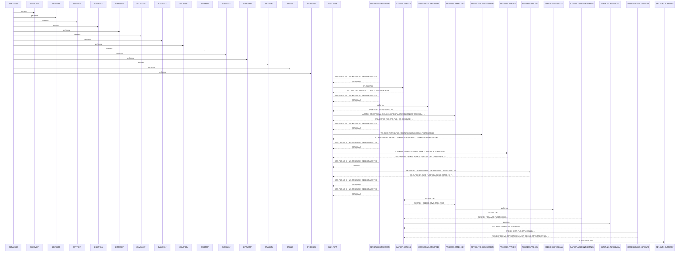
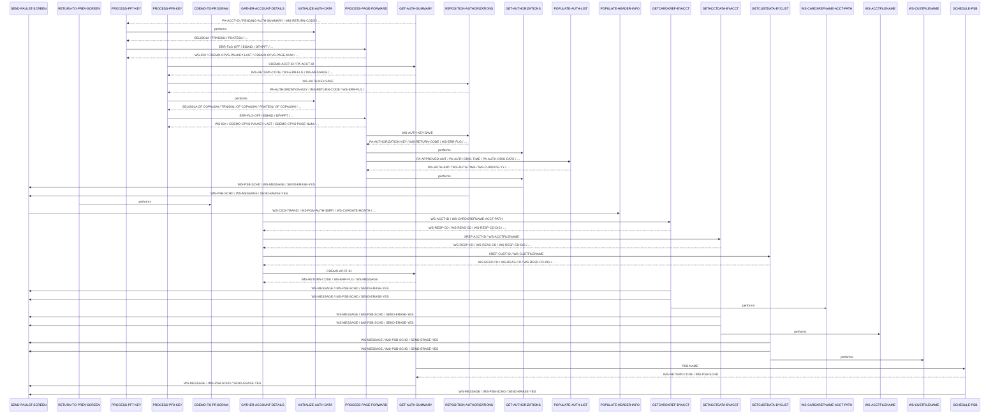

# COPAUS0C

**File**: `cbl/COPAUS0C.cbl`
**Type**: FileType.COBOL
**Analyzed**: 2026-03-04 03:24:16.475166

## Purpose

This CICS program displays a summary of authorizations for a given account. It retrieves authorization details from an IMS database and presents them on a screen, allowing the user to page through the authorizations and select one for further details.

**Business Context**: This program is part of a card authorization system, allowing users to view and select authorizations for an account.

## Inputs

| Name | Type | Description |
|------|------|-------------|
| DFHCOMMAREA | IOType.CICS_COMMAREA | The CICS communication area, used to pass data between this program and other programs. It contains the CARDDEMO-COMMAREA, which holds account ID and program context information. |
| COPAU0AI | IOType.CICS_MAP | CICS BMS map input, receives data entered by the user on the screen, including the account ID and selection of an authorization. |
| PAUTDTL1 | IOType.IMS_SEGMENT | IMS segment containing pending authorization details. |

## Outputs

| Name | Type | Description |
|------|------|-------------|
| COPAU0AO | IOType.CICS_MAP | CICS BMS map output, displays the authorization summary screen to the user. |
| CARDDEMO-COMMAREA | IOType.CICS_COMMAREA | Updated CARDDEMO-COMMAREA is passed to the next program. |

## Called Programs

| Program | Call Type | Purpose |
|---------|-----------|---------|
| CDEMO-TO-PROGRAM | CallType.CICS_XCTL | Transfers control to either the authorization detail program or the menu program, based on user selection. |

## Business Rules

- **BR001**: Account ID must be numeric.
- **BR002**: Selection must be 'S' to view authorization details.

## Paragraphs/Procedures

### COPAUS0C
> [Source: COPAUS0C.cbl.md](COPAUS0C.cbl.d/COPAUS0C.cbl.md)
This is the program entry point. It doesn't contain any logic, but the static analysis identified it as a paragraph. It is likely a placeholder or a naming convention artifact.

### MAIN-PARA
> [Source: MAIN-PARA.cbl.md](COPAUS0C.cbl.d/MAIN-PARA.cbl.md)

```
MAIN-PARA  (52 statements, depth=9)
PARAGRAPH
├── SET: SET ERR-FLG-OFF TO TRUE
├── SET: SET AUTHS-NOT-EOF TO TRUE
├── SET: SET NEXT-PAGE-NO TO TRUE
├── SET: SET SEND-ERASE-YES TO TRUE
├── MOVE: MOVE SPACES TO WS-MESSAGE ERRMSGO OF COPAU0AO
├── MOVE: MOVE -1 TO ACCTIDL OF COPAU0AI
├── IF: IF EIBCALEN = 0 INITIALIZE CARDDEMO-COMMAREA MOVE WS-PGM-AUTH-SMRY TO...
│   ├── INITIALIZE: INITIALIZE CARDDEMO-COMMAREA
│   ├── MOVE: MOVE WS-PGM-AUTH-SMRY TO CDEMO-TO-PROGRAM
│   ├── SET: SET CDEMO-PGM-REENTER TO TRUE
│   ├── MOVE: MOVE LOW-VALUES TO COPAU0AO
│   ├── MOVE: MOVE -1 TO ACCTIDL OF COPAU0AI
│   ├── PERFORM: PERFORM SEND-PAULST-SCREEN
│   └── ELSE: ELSE
│       ├── MOVE: MOVE DFHCOMMAREA(1:EIBCALEN) TO CARDDEMO-COMMAREA
│       └── IF: IF NOT CDEMO-PGM-REENTER SET CDEMO-PGM-REENTER TO TRUE MOVE LOW-VALUE...
│           ├── SET: SET CDEMO-PGM-REENTER TO TRUE
│           ├── MOVE: MOVE LOW-VALUES TO COPAU0AO
│           ├── IF: IF CDEMO-ACCT-ID IS NUMERIC MOVE CDEMO-ACCT-ID TO WS-ACCT-ID ACCTIDO ...
│           │   ├── MOVE: MOVE CDEMO-ACCT-ID TO WS-ACCT-ID ACCTIDO OF COPAU0AO
│           │   └── ELSE: ELSE
│           │       ├── MOVE: MOVE SPACE TO ACCTIDO OF COPAU0AO
│           │       └── MOVE: MOVE LOW-VALUES TO WS-ACCT-ID
│           ├── PERFORM: PERFORM GATHER-DETAILS
│           ├── SET: SET SEND-ERASE-YES TO TRUE
│           ├── PERFORM: PERFORM SEND-PAULST-SCREEN
│           └── ELSE: ELSE
│               ├── PERFORM: PERFORM RECEIVE-PAULST-SCREEN
│               └── EVALUATE: EVALUATE EIBAID WHEN DFHENTER PERFORM PROCESS-ENTER-KEY IF WS-ACCT-ID...
│                   ├── WHEN: WHEN WHEN DFHENTER
│                   │   ├── PERFORM: PERFORM PROCESS-ENTER-KEY
│                   │   ├── IF: IF WS-ACCT-ID = LOW-VALUES MOVE SPACE TO ACCTIDO OF COPAU0AO ELSE MOV...
│                   │   │   ├── MOVE: MOVE SPACE TO ACCTIDO OF COPAU0AO
│                   │   │   └── ELSE: ELSE
│                   │   │       └── MOVE: MOVE WS-ACCT-ID TO ACCTIDO OF COPAU0AO
│                   │   └── PERFORM: PERFORM SEND-PAULST-SCREEN
│                   ├── WHEN: WHEN WHEN DFHPF3
│                   │   ├── MOVE: MOVE WS-PGM-MENU TO CDEMO-TO-PROGRAM
│                   │   ├── PERFORM: PERFORM RETURN-TO-PREV-SCREEN
│                   │   └── PERFORM: PERFORM SEND-PAULST-SCREEN
│                   ├── WHEN: WHEN WHEN DFHPF7
│                   │   ├── PERFORM: PERFORM PROCESS-PF7-KEY
│                   │   └── PERFORM: PERFORM SEND-PAULST-SCREEN
│                   ├── WHEN: WHEN WHEN DFHPF8
│                   │   ├── PERFORM: PERFORM PROCESS-PF8-KEY
│                   │   └── PERFORM: PERFORM SEND-PAULST-SCREEN
│                   └── WHEN: WHEN OTHER
│                       ├── MOVE: MOVE 'Y' TO WS-ERR-FLG
│                       ├── MOVE: MOVE -1 TO ACCTIDL OF COPAU0AI
│                       ├── MOVE: MOVE CCDA-MSG-INVALID-KEY TO WS-MESSAGE
│                       └── PERFORM: PERFORM SEND-PAULST-SCREEN
└── EXEC_CICS: *>EXECCICS EXEC CICS RETURN *>EXECCICS TRANSID (WS-CICS-TRANID) *>EXE...
```
This paragraph serves as the main control logic for the CICS transaction. It first checks if the program is being entered for the first time (EIBCALEN = 0). If so, it initializes the CARDDEMO-COMMAREA and displays the initial authorization summary screen using SEND-PAULST-SCREEN. Otherwise, it receives input from the screen (RECEIVE-PAULST-SCREEN) and processes it based on the EIBAID value. If the ENTER key is pressed, it calls PROCESS-ENTER-KEY to validate the account ID and potentially transfer control to the authorization detail program. If PF3 is pressed, it returns to the previous menu. PF7 and PF8 are handled by PROCESS-PF7-KEY and PROCESS-PF8-KEY respectively, to page through authorizations. Invalid key presses result in an error message. Finally, it returns control to CICS with the updated CARDDEMO-COMMAREA.

### PROCESS-ENTER-KEY
> [Source: PROCESS-ENTER-KEY.cbl.md](COPAUS0C.cbl.d/PROCESS-ENTER-KEY.cbl.md)

```
PROCESS-ENTER-KEY  (45 statements, depth=8)
PARAGRAPH
├── IF: IF ACCTIDI OF COPAU0AI = SPACES OR LOW-VALUES MOVE LOW-VALUES TO WS-A...
│   ├── MOVE: MOVE LOW-VALUES TO WS-ACCT-ID
│   ├── MOVE: MOVE 'Y' TO WS-ERR-FLG
│   ├── MOVE: MOVE 'Please enter Acct Id...' TO WS-MESSAGE
│   ├── MOVE: MOVE -1 TO ACCTIDL OF COPAU0AI
│   └── ELSE: ELSE
│       └── IF: IF ACCTIDI OF COPAU0AI IS NOT NUMERIC MOVE LOW-VALUES TO WS-ACCT-ID M...
│           ├── MOVE: MOVE LOW-VALUES TO WS-ACCT-ID
│           ├── MOVE: MOVE 'Y' TO WS-ERR-FLG
│           ├── MOVE: MOVE 'Acct Id must be Numeric ...' TO WS-MESSAGE
│           ├── MOVE: MOVE -1 TO ACCTIDL OF COPAU0AI
│           └── ELSE: ELSE
│               ├── MOVE: MOVE ACCTIDI OF COPAU0AI TO WS-ACCT-ID CDEMO-ACCT-ID
│               ├── EVALUATE: EVALUATE TRUE WHEN SEL0001I OF COPAU0AI NOT = SPACES AND LOW-VALUES M...
│               │   ├── WHEN: WHEN WHEN SEL0001I OF COPAU0AI NOT = SPACES AND LOW-VALUES
│               │   │   ├── MOVE: MOVE SEL0001I OF COPAU0AI TO CDEMO-CPVS-PAU-SEL-FLG
│               │   │   └── MOVE: MOVE CDEMO-CPVS-AUTH-KEYS(1) TO CDEMO-CPVS-PAU-SELECTED
│               │   ├── WHEN: WHEN WHEN SEL0002I OF COPAU0AI NOT = SPACES AND LOW-VALUES
│               │   │   ├── MOVE: MOVE SEL0002I OF COPAU0AI TO CDEMO-CPVS-PAU-SEL-FLG
│               │   │   └── MOVE: MOVE CDEMO-CPVS-AUTH-KEYS(2) TO CDEMO-CPVS-PAU-SELECTED
│               │   ├── WHEN: WHEN WHEN SEL0003I OF COPAU0AI NOT = SPACES AND LOW-VALUES
│               │   │   ├── MOVE: MOVE SEL0003I OF COPAU0AI TO CDEMO-CPVS-PAU-SEL-FLG
│               │   │   └── MOVE: MOVE CDEMO-CPVS-AUTH-KEYS(3) TO CDEMO-CPVS-PAU-SELECTED
│               │   ├── WHEN: WHEN WHEN SEL0004I OF COPAU0AI NOT = SPACES AND LOW-VALUES
│               │   │   ├── MOVE: MOVE SEL0004I OF COPAU0AI TO CDEMO-CPVS-PAU-SEL-FLG
│               │   │   └── MOVE: MOVE CDEMO-CPVS-AUTH-KEYS(4) TO CDEMO-CPVS-PAU-SELECTED
│               │   ├── WHEN: WHEN WHEN SEL0005I OF COPAU0AI NOT = SPACES AND LOW-VALUES
│               │   │   ├── MOVE: MOVE SEL0005I OF COPAU0AI TO CDEMO-CPVS-PAU-SEL-FLG
│               │   │   └── MOVE: MOVE CDEMO-CPVS-AUTH-KEYS(5) TO CDEMO-CPVS-PAU-SELECTED
│               │   └── WHEN: WHEN OTHER
│               │       ├── MOVE: MOVE SPACES TO CDEMO-CPVS-PAU-SEL-FLG
│               │       └── MOVE: MOVE SPACES TO CDEMO-CPVS-PAU-SELECTED
│               └── IF: IF (CDEMO-CPVS-PAU-SEL-FLG NOT = SPACES AND LOW-VALUES) AND (CDEMO-CP...
│                   └── EVALUATE: EVALUATE CDEMO-CPVS-PAU-SEL-FLG WHEN 'S' WHEN 's' MOVE WS-PGM-AUTH-DT...
│                       ├── WHEN: WHEN WHEN 'S'
│                       │   ├── MOVE: MOVE WS-PGM-AUTH-DTL TO CDEMO-TO-PROGRAM
│                       │   ├── MOVE: MOVE WS-CICS-TRANID TO CDEMO-FROM-TRANID
│                       │   ├── MOVE: MOVE WS-PGM-AUTH-SMRY TO CDEMO-FROM-PROGRAM
│                       │   ├── MOVE: MOVE 0 TO CDEMO-PGM-CONTEXT
│                       │   ├── SET: SET CDEMO-PGM-ENTER TO TRUE
│                       │   └── EXEC_CICS: *>EXECCICS EXEC CICS *>EXECCICS XCTL PROGRAM(CDEMO-TO-PROGRAM) *>EXEC...
│                       └── WHEN: WHEN OTHER
│                           ├── MOVE: MOVE 'Invalid selection. Valid value is S' TO WS-MESSAGE
│                           └── MOVE: MOVE -1 TO ACCTIDL OF COPAU0AI
└── PERFORM: PERFORM GATHER-DETAILS
```
This paragraph processes the input received when the user presses the ENTER key. It first validates the account ID entered by the user, ensuring it is not blank, LOW-VALUES, or non-numeric. If the account ID is invalid, an error message is displayed. If the account ID is valid, it checks if an authorization has been selected by the user. If an authorization is selected (SEL0001I to SEL0005I are not spaces or LOW-VALUES), it moves the corresponding authorization key to CDEMO-CPVS-PAU-SELECTED. If a valid authorization is selected (CDEMO-CPVS-PAU-SEL-FLG is 'S' or 's'), it sets up the CARDDEMO-COMMAREA to call the authorization detail program (CDEMO-TO-PROGRAM) using XCTL. If the selection is invalid, an error message is displayed. Finally, it calls GATHER-DETAILS to refresh the authorization summary.

### GATHER-DETAILS
> [Source: GATHER-DETAILS.cbl.md](COPAUS0C.cbl.d/GATHER-DETAILS.cbl.md)

```
GATHER-DETAILS  (7 statements, depth=3)
PARAGRAPH
├── MOVE: MOVE -1 TO ACCTIDL OF COPAU0AI
├── MOVE: MOVE 0 TO CDEMO-CPVS-PAGE-NUM
└── IF: IF WS-ACCT-ID NOT = LOW-VALUES PERFORM GATHER-ACCOUNT-DETAILS PERFORM...
    ├── PERFORM: PERFORM GATHER-ACCOUNT-DETAILS
    ├── PERFORM: PERFORM INITIALIZE-AUTH-DATA
    └── IF: IF FOUND-PAUT-SMRY-SEG PERFORM PROCESS-PAGE-FORWARD END-IF
        └── PERFORM: PERFORM PROCESS-PAGE-FORWARD
```
This paragraph orchestrates the retrieval of account and authorization details. It first resets the ACCTIDL field in COPAU0AI and sets the CDEMO-CPVS-PAGE-NUM to 0. If a valid account ID (WS-ACCT-ID) is present, it calls GATHER-ACCOUNT-DETAILS to retrieve account-specific information. Then, it calls INITIALIZE-AUTH-DATA to initialize variables related to authorization data. Finally, if the PAUT-SMRY segment is found (FOUND-PAUT-SMRY-SEG), it calls PROCESS-PAGE-FORWARD to retrieve and display the authorization details for the first page.

### PROCESS-PF7-KEY
> [Source: PROCESS-PF7-KEY.cbl.md](COPAUS0C.cbl.d/PROCESS-PF7-KEY.cbl.md)

```
PROCESS-PF7-KEY  (12 statements, depth=3)
PARAGRAPH
└── IF: IF CDEMO-CPVS-PAGE-NUM > 1 COMPUTE CDEMO-CPVS-PAGE-NUM = CDEMO-CPVS-P...
    ├── COMPUTE: COMPUTE CDEMO-CPVS-PAGE-NUM = CDEMO-CPVS-PAGE-NUM - 1
    ├── MOVE: MOVE CDEMO-CPVS-PAUKEY-PREV-PG(CDEMO-CPVS-PAGE-NUM) TO WS-AUTH-KEY-SAVE
    ├── PERFORM: PERFORM GET-AUTH-SUMMARY
    ├── SET: SET SEND-ERASE-NO TO TRUE
    ├── SET: SET NEXT-PAGE-YES TO TRUE
    ├── MOVE: MOVE -1 TO ACCTIDL OF COPAU0AI
    ├── PERFORM: PERFORM INITIALIZE-AUTH-DATA
    ├── PERFORM: PERFORM PROCESS-PAGE-FORWARD
    └── ELSE: ELSE
        ├── MOVE: MOVE 'You are already at the top of the page...' TO WS-MESSAGE
        └── SET: SET SEND-ERASE-NO TO TRUE
```
This paragraph handles the logic for when the PF7 key (previous page) is pressed. It checks if the current page number (CDEMO-CPVS-PAGE-NUM) is greater than 1. If it is, it decrements the page number and retrieves the authorization key for the previous page from CDEMO-CPVS-PAUKEY-PREV-PG. It then calls GET-AUTH-SUMMARY to retrieve the authorization summary for the previous page. The SEND-ERASE-NO flag is set to TRUE to prevent the screen from being erased. NEXT-PAGE-YES is set to TRUE. INITIALIZE-AUTH-DATA is called to reset the authorization data, and PROCESS-PAGE-FORWARD is called to display the previous page of authorizations. If the user is already on the first page, a message is displayed indicating they are at the top of the page.

### PROCESS-PF8-KEY
> [Source: PROCESS-PF8-KEY.cbl.md](COPAUS0C.cbl.d/PROCESS-PF8-KEY.cbl.md)

```
PROCESS-PF8-KEY  (13 statements, depth=3)
PARAGRAPH
├── IF: IF CDEMO-CPVS-PAUKEY-LAST = SPACES OR LOW-VALUES MOVE LOW-VALUES TO W...
│   ├── MOVE: MOVE LOW-VALUES TO WS-AUTH-KEY-SAVE
│   └── ELSE: ELSE
│       ├── MOVE: MOVE CDEMO-CPVS-PAUKEY-LAST TO WS-AUTH-KEY-SAVE
│       ├── PERFORM: PERFORM GET-AUTH-SUMMARY
│       └── PERFORM: PERFORM REPOSITION-AUTHORIZATIONS
├── MOVE: MOVE -1 TO ACCTIDL OF COPAU0AI
├── SET: SET SEND-ERASE-NO TO TRUE
└── IF: IF NEXT-PAGE-YES PERFORM INITIALIZE-AUTH-DATA PERFORM PROCESS-PAGE-FO...
    ├── PERFORM: PERFORM INITIALIZE-AUTH-DATA
    ├── PERFORM: PERFORM PROCESS-PAGE-FORWARD
    └── ELSE: ELSE
        └── MOVE: MOVE 'You are already at the bottom of the page...' TO WS-MESSAGE
```
This paragraph handles the logic for when the PF8 key (next page) is pressed. It first checks if the last authorization key (CDEMO-CPVS-PAUKEY-LAST) is SPACES or LOW-VALUES. If it is, it means there are no more authorizations to display, so WS-AUTH-KEY-SAVE is set to LOW-VALUES. Otherwise, WS-AUTH-KEY-SAVE is set to the value of CDEMO-CPVS-PAUKEY-LAST, and GET-AUTH-SUMMARY and REPOSITION-AUTHORIZATIONS are called to retrieve and reposition the authorization data. SEND-ERASE-NO is set to TRUE to prevent the screen from being erased. If NEXT-PAGE-YES is set, it calls INITIALIZE-AUTH-DATA to reset the authorization data and PROCESS-PAGE-FORWARD to display the next page of authorizations. Otherwise, a message is displayed indicating that the user is already at the bottom of the page.

### PROCESS-PAGE-FORWARD
> [Source: PROCESS-PAGE-FORWARD.cbl.md](COPAUS0C.cbl.d/PROCESS-PAGE-FORWARD.cbl.md)

```
PROCESS-PAGE-FORWARD  (21 statements, depth=5)
PARAGRAPH
└── IF: IF ERR-FLG-OFF MOVE 1 TO WS-IDX MOVE LOW-VALUES TO CDEMO-CPVS-PAUKEY-...
    ├── MOVE: MOVE 1 TO WS-IDX
    ├── MOVE: MOVE LOW-VALUES TO CDEMO-CPVS-PAUKEY-LAST
    ├── PERFORM_INLINE: PERFORM UNTIL WS-IDX > 5 OR AUTHS-EOF OR ERR-FLG-ON IF EIBAID = DFHPF...
    │   ├── IF: IF EIBAID = DFHPF7 AND WS-IDX = 1 PERFORM REPOSITION-AUTHORIZATIONS E...
    │   │   ├── PERFORM: PERFORM REPOSITION-AUTHORIZATIONS
    │   │   └── ELSE: ELSE
    │   │       └── PERFORM: PERFORM GET-AUTHORIZATIONS
    │   └── IF: IF AUTHS-NOT-EOF AND ERR-FLG-OFF PERFORM POPULATE-AUTH-LIST COMPUTE W...
    │       ├── PERFORM: PERFORM POPULATE-AUTH-LIST
    │       ├── COMPUTE: COMPUTE WS-IDX = WS-IDX + 1
    │       ├── MOVE: MOVE PA-AUTHORIZATION-KEY TO CDEMO-CPVS-PAUKEY-LAST
    │       └── IF: IF WS-IDX = 2 COMPUTE CDEMO-CPVS-PAGE-NUM = CDEMO-CPVS-PAGE-NUM + 1 M...
    │           ├── COMPUTE: COMPUTE CDEMO-CPVS-PAGE-NUM = CDEMO-CPVS-PAGE-NUM + 1
    │           └── MOVE: MOVE PA-AUTHORIZATION-KEY TO CDEMO-CPVS-PAUKEY-PREV-PG(CDEMO-CPVS-PAG...
    └── IF: IF AUTHS-NOT-EOF AND ERR-FLG-OFF PERFORM GET-AUTHORIZATIONS IF AUTHS-...
        ├── PERFORM: PERFORM GET-AUTHORIZATIONS
        └── IF: IF AUTHS-NOT-EOF AND ERR-FLG-OFF SET NEXT-PAGE-YES TO TRUE ELSE SET N...
            ├── SET: SET NEXT-PAGE-YES TO TRUE
            └── ELSE: ELSE
                └── SET: SET NEXT-PAGE-NO TO TRUE
```
This paragraph retrieves and displays a page of authorization details. It first checks if ERR-FLG-OFF is set. If it is, it initializes WS-IDX to 1 and CDEMO-CPVS-PAUKEY-LAST to LOW-VALUES. It then enters a loop that continues until WS-IDX is greater than 5, AUTHS-EOF is set, or ERR-FLG-ON is set. Inside the loop, it checks if EIBAID is DFHPF7 and WS-IDX is 1. If so, it calls REPOSITION-AUTHORIZATIONS. Otherwise, it calls GET-AUTHORIZATIONS to retrieve the next authorization. If AUTHS-NOT-EOF and ERR-FLG-OFF are set, it calls POPULATE-AUTH-LIST to populate the screen with the authorization details, increments WS-IDX, and moves the PA-AUTHORIZATION-KEY to CDEMO-CPVS-PAUKEY-LAST. If WS-IDX is 2, it increments CDEMO-CPVS-PAGE-NUM and moves PA-AUTHORIZATION-KEY to CDEMO-CPVS-PAUKEY-PREV-PG. After the loop, if AUTHS-NOT-EOF and ERR-FLG-OFF are set, it calls GET-AUTHORIZATIONS to check if there are more authorizations. If there are, NEXT-PAGE-YES is set to TRUE; otherwise, NEXT-PAGE-NO is set to TRUE.

### GET-AUTHORIZATIONS
> [Source: GET-AUTHORIZATIONS.cbl.md](COPAUS0C.cbl.d/GET-AUTHORIZATIONS.cbl.md)

```
GET-AUTHORIZATIONS  (0 statements, depth=0)
PARAGRAPH
```
This paragraph retrieves the next authorization detail segment (PAUTDTL1) from the IMS database using a GNP (Get Next within Parent) call. It moves the DIBSTAT value to IMS-RETURN-CODE. It then evaluates the IMS-RETURN-CODE. If the status is STATUS-OK, AUTHS-NOT-EOF is set to TRUE. If the status is SEGMENT-NOT-FOUND or END-OF-DB, AUTHS-EOF is set to TRUE. If the status is OTHER, it sets WS-ERR-FLG to 'Y', constructs an error message containing the IMS-RETURN-CODE, moves it to WS-MESSAGE, sets ACCTIDL to -1, and calls SEND-PAULST-SCREEN to display the error message.

### REPOSITION-AUTHORIZATIONS
> [Source: REPOSITION-AUTHORIZATIONS.cbl.md](COPAUS0C.cbl.d/REPOSITION-AUTHORIZATIONS.cbl.md)
This paragraph repositions the IMS cursor to a specific authorization detail segment (PAUTDTL1) based on the value of WS-AUTH-KEY-SAVE. It moves WS-AUTH-KEY-SAVE to PA-AUTHORIZATION-KEY and then executes a GNP (Get Next within Parent) call with a WHERE clause to retrieve the segment where PAUT9CTS matches PA-AUTHORIZATION-KEY. It moves the DIBSTAT value to IMS-RETURN-CODE. It then evaluates the IMS-RETURN-CODE. If the status is STATUS-OK, AUTHS-NOT-EOF is set to TRUE. If the status is SEGMENT-NOT-FOUND or END-OF-DB, AUTHS-EOF is set to TRUE. If the status is OTHER, it sets WS-ERR-FLG to 'Y', constructs an error message containing the IMS-RETURN-CODE, moves it to WS-MESSAGE, sets ACCTIDL to -1, and calls SEND-PAULST-SCREEN to display the error message.

### POPULATE-AUTH-LIST
> [Source: POPULATE-AUTH-LIST.cbl.md](COPAUS0C.cbl.d/POPULATE-AUTH-LIST.cbl.md)
This paragraph populates the authorization list on the screen with data from the current authorization detail segment. It moves PA-APPROVED-AMT to WS-AUTH-AMT. It re-formats the PA-AUTH-ORIG-TIME and PA-AUTH-ORIG-DATE into WS-AUTH-TIME and WS-AUTH-DATE respectively. It determines the authorization approval status (WS-AUTH-APRV-STAT) based on PA-AUTH-RESP-CODE ('A' for approved, 'D' for denied). Then, based on the value of WS-IDX (1 to 5), it moves the authorization details (PA-TRANSACTION-ID, WS-AUTH-DATE, WS-AUTH-TIME, PA-AUTH-TYPE, WS-AUTH-APRV-STAT, PA-MATCH-STATUS, WS-AUTH-AMT) to the corresponding fields in the COPAU0AI map (TRNID01I to TRNID05I, PDATE01I to PDATE05I, etc.). It also sets the corresponding selection field (SEL0001A to SEL0005A) to DFHBMUNP to make it unmodifiable.

### INITIALIZE-AUTH-DATA
> [Source: INITIALIZE-AUTH-DATA.cbl.md](COPAUS0C.cbl.d/INITIALIZE-AUTH-DATA.cbl.md)
This paragraph initializes the authorization data fields in the COPAU0AI map. It iterates through five authorization slots (SEL0001A to SEL0005A) and sets the corresponding transaction ID (TRNIDnnI), date (PDATEnnI), time (PTIMEnnI), type (PTYPEnnI), approval (PAPRVnnI), status (PSTATnnI), and amount (PAMT00nI) fields to spaces. The selection field (SEL000nA) is initialized to DFHBMPRO. This initialization ensures that the screen displays a clean slate of authorization data before retrieving and displaying the actual information. No error handling is performed in this paragraph, and it does not call any other paragraphs or programs. The paragraph consumes WS-IDX as a counter and writes to the COPAU0AI map.

### RETURN-TO-PREV-SCREEN
> [Source: RETURN-TO-PREV-SCREEN.cbl.md](COPAUS0C.cbl.d/RETURN-TO-PREV-SCREEN.cbl.md)
This paragraph handles the return to the previous screen. It checks if CDEMO-TO-PROGRAM is LOW-VALUES or SPACES, and if so, it sets CDEMO-TO-PROGRAM to 'COSGN00C'. It then moves the current transaction ID (WS-CICS-TRANID) to CDEMO-FROM-TRANID, the program ID (WS-PGM-AUTH-SMRY) to CDEMO-FROM-PROGRAM, and ZEROS to CDEMO-PGM-CONTEXT. Finally, it performs a CICS XCTL to the program specified in CDEMO-TO-PROGRAM, passing the CARDDEMO-COMMAREA. This paragraph essentially transfers control to another program, likely the calling program, passing data through the COMMAREA. The paragraph consumes WS-CICS-TRANID, WS-PGM-AUTH-SMRY, CDEMO-TO-PROGRAM, and CARDDEMO-COMMAREA and calls the CDEMO-TO-PROGRAM via XCTL.

### SEND-PAULST-SCREEN
> [Source: SEND-PAULST-SCREEN.cbl.md](COPAUS0C.cbl.d/SEND-PAULST-SCREEN.cbl.md)
This paragraph sends the COPAU0A screen to the terminal. It first checks if IMS-PSB-SCHD is true, and if so, it sets IMS-PSB-NOT-SCHD to true and performs a CICS SYNCPOINT. Then, it calls POPULATE-HEADER-INFO to populate the header information on the screen. It moves WS-MESSAGE to ERRMSGO of COPAU0AO. Finally, it checks the SEND-ERASE-YES flag. If it is true, it sends the map with the ERASE option, clearing the screen before displaying the data. Otherwise, it sends the map without the ERASE option, overlaying the new data on the existing screen. In both cases, the CURSOR option is used to position the cursor on the screen. The paragraph consumes IMS-PSB-SCHD, WS-MESSAGE, SEND-ERASE-YES, and COPAU0AO and calls POPULATE-HEADER-INFO.

### RECEIVE-PAULST-SCREEN
> [Source: RECEIVE-PAULST-SCREEN.cbl.md](COPAUS0C.cbl.d/RECEIVE-PAULST-SCREEN.cbl.md)
This paragraph receives data from the COPAU0A screen. It executes a CICS RECEIVE command, retrieving data from the COPAU0A mapset ('COPAU00') into the COPAU0AI map. It also retrieves the RESP and RESP2 codes into WS-RESP-CD and WS-REAS-CD, respectively. This paragraph is responsible for capturing user input from the screen. The paragraph consumes the COPAU0A screen and writes to COPAU0AI, WS-RESP-CD, and WS-REAS-CD. It does not call any other paragraphs or programs.

### POPULATE-HEADER-INFO
> [Source: POPULATE-HEADER-INFO.cbl.md](COPAUS0C.cbl.d/POPULATE-HEADER-INFO.cbl.md)
This paragraph populates the header information on the COPAU0A screen. It moves the current date to WS-CURDATE-DATA using the FUNCTION CURRENT-DATE. It then moves CCDA-TITLE01 and CCDA-TITLE02 to TITLE01O and TITLE02O of COPAU0AO, respectively. It also moves the transaction ID (WS-CICS-TRANID) to TRNNAMEO and the program ID (WS-PGM-AUTH-SMRY) to PGMNAMEO. It formats the current date and time into the CURDATEO and CURTIMEO fields of COPAU0AO. This paragraph prepares the header section of the screen with relevant information. The paragraph consumes CCDA-TITLE01, CCDA-TITLE02, WS-CICS-TRANID, WS-PGM-AUTH-SMRY, and WS-CURDATE-DATA and writes to COPAU0AO.

### GATHER-ACCOUNT-DETAILS
> [Source: GATHER-ACCOUNT-DETAILS.cbl.md](COPAUS0C.cbl.d/GATHER-ACCOUNT-DETAILS.cbl.md)
This paragraph orchestrates the retrieval and formatting of account details for display on the screen. It calls GETCARDXREF-BYACCT to retrieve card cross-reference information, GETACCTDATA-BYACCT to retrieve account data, and GETCUSTDATA-BYCUST to retrieve customer data. It then moves the customer ID (CUST-ID) to CUSTIDO and concatenates the customer's first, middle initial, and last names into CNAMEO. It also concatenates the customer's address lines into ADDR001O and ADDR002O. It moves the customer's phone number to PHONE1O and formats the account credit limit and cash credit limit into CREDLIMO and CASHLIMO, respectively. Finally, it calls GET-AUTH-SUMMARY to retrieve the authorization summary information. If the authorization summary segment is found (FOUND-PAUT-SMRY-SEG), it moves the approved and declined authorization counts and amounts, as well as the credit and cash balances, to the corresponding output fields. Otherwise, it sets these output fields to zero. The paragraph consumes data from CARD-XREF-RECORD, ACCOUNT-RECORD, CUSTOMER-RECORD, and PENDING-AUTH-SUMMARY and writes to COPAU0AO. It also uses WS-DISPLAY-AMT9, WS-DISPLAY-AMT12, and WS-DISPLAY-COUNT for formatting.

### GETCARDXREF-BYACCT
> [Source: GETCARDXREF-BYACCT.cbl.md](COPAUS0C.cbl.d/GETCARDXREF-BYACCT.cbl.md)
This paragraph retrieves the card cross-reference record based on the account ID. It moves the account ID (WS-ACCT-ID) to WS-CARD-RID-ACCT-ID-X and then executes a CICS READ command to read the CARD-XREF-RECORD from the VSAM file specified by WS-CARDXREFNAME-ACCT-PATH, using WS-CARD-RID-ACCT-ID-X as the key. If the read is successful (DFHRESP(NORMAL)), it moves the customer ID (XREF-CUST-ID) to CDEMO-CUST-ID and the card number (XREF-CARD-NUM) to CDEMO-CARD-NUM. If the record is not found (DFHRESP(NOTFND)), it constructs an error message and calls SEND-PAULST-SCREEN to display the message. If any other error occurs, it sets WS-ERR-FLG to 'Y', constructs an error message, and calls SEND-PAULST-SCREEN. The paragraph consumes WS-ACCT-ID and writes to CARD-XREF-RECORD, CDEMO-CUST-ID, CDEMO-CARD-NUM, WS-MESSAGE, and COPAU0AI. It also uses WS-CARDXREFNAME-ACCT-PATH to determine the dataset name.

### GETACCTDATA-BYACCT
> [Source: GETACCTDATA-BYACCT.cbl.md](COPAUS0C.cbl.d/GETACCTDATA-BYACCT.cbl.md)
This paragraph retrieves the account record based on the account ID. It moves the account ID (XREF-ACCT-ID) to WS-CARD-RID-ACCT-ID-X and then executes a CICS READ command to read the ACCOUNT-RECORD from the VSAM file specified by WS-ACCTFILENAME, using WS-CARD-RID-ACCT-ID-X as the key. If the read is successful (DFHRESP(NORMAL)), it continues processing. If the record is not found (DFHRESP(NOTFND)), it constructs an error message and calls SEND-PAULST-SCREEN to display the message. If any other error occurs, it sets WS-ERR-FLG to 'Y', constructs an error message, and calls SEND-PAULST-SCREEN. The paragraph consumes XREF-ACCT-ID and writes to ACCOUNT-RECORD, WS-MESSAGE, and COPAU0AI. It also uses WS-ACCTFILENAME to determine the dataset name.

### GETCUSTDATA-BYCUST
> [Source: GETCUSTDATA-BYCUST.cbl.md](COPAUS0C.cbl.d/GETCUSTDATA-BYCUST.cbl.md)
This paragraph retrieves the customer record based on the customer ID. It moves the customer ID (XREF-CUST-ID) to WS-CARD-RID-CUST-ID. It then executes a CICS READ command to read the CUSTOMER-RECORD from the VSAM file specified by WS-CUSTFILENAME, using WS-CARD-RID-CUST-ID-X as the key. If the read is successful (DFHRESP(NORMAL)), it continues processing. If the record is not found (DFHRESP(NOTFND)), it constructs an error message and calls SEND-PAULST-SCREEN to display the message. If any other error occurs, it sets WS-ERR-FLG to 'Y', constructs an error message, and calls SEND-PAULST-SCREEN. The paragraph consumes XREF-CUST-ID and writes to CUSTOMER-RECORD, WS-MESSAGE, and COPAU0AI. It also uses WS-CUSTFILENAME to determine the dataset name.

### GET-AUTH-SUMMARY
> [Source: GET-AUTH-SUMMARY.cbl.md](COPAUS0C.cbl.d/GET-AUTH-SUMMARY.cbl.md)
This paragraph retrieves the authorization summary information from the IMS database. It first calls SCHEDULE-PSB to schedule the PSB. It then moves the account ID (CDEMO-ACCT-ID) to PA-ACCT-ID and executes a DLI GU (Get Unique) command to retrieve the PAUTSUM0 segment from the IMS database, using PA-ACCT-ID as the key. The retrieved segment is placed into PENDING-AUTH-SUMMARY. It then checks the IMS return code (DIBSTAT). If the status is OK, it sets FOUND-PAUT-SMRY-SEG to TRUE. If the segment is not found, it sets NFOUND-PAUT-SMRY-SEG to TRUE. If any other error occurs, it sets WS-ERR-FLG to 'Y', constructs an error message, and calls SEND-PAULST-SCREEN. The paragraph consumes CDEMO-ACCT-ID and writes to PENDING-AUTH-SUMMARY, IMS-RETURN-CODE, and WS-MESSAGE. It also calls SCHEDULE-PSB to schedule the PSB.

### SCHEDULE-PSB
> [Source: SCHEDULE-PSB.cbl.md](COPAUS0C.cbl.d/SCHEDULE-PSB.cbl.md)
This paragraph is responsible for scheduling a PSB (Program Specification Block) for IMS database interaction. It starts by executing a DLI SCHD command to schedule the PSB specified by PSB-NAME. NODHABEND is specified to prevent abnormal termination in case of scheduling errors. The DIBSTAT is then moved to IMS-RETURN-CODE to capture the status of the scheduling operation. If PSB-SCHEDULED-MORE-THAN-ONCE is true, it terminates the current PSB and schedules the PSB again. If the scheduling is successful (STATUS-OK), IMS-PSB-SCHD is set to TRUE. Otherwise, WS-ERR-FLG is set to 'Y', an error message is constructed using STRING, and SEND-PAULST-SCREEN is called to display the error message, with ACCTIDL of COPAU0AI set to -1.

## Dead Code

The following artifacts were identified as dead code by static analysis:

| Artifact | Type | Line | Reason |
|----------|------|------|--------|
| exec-006 | function | 686 | Function 'exec-006' is never called by any other artifact |
| exec-007 | function | 695 | Function 'exec-007' is never called by any other artifact |
| exec-008 | function | 703 | Function 'exec-008' is never called by any other artifact |
| exec-009 | function | 715 | Function 'exec-009' is never called by any other artifact |
| exec-010 | function | 818 | Function 'exec-010' is never called by any other artifact |
| exec-011 | function | 869 | Function 'exec-011' is never called by any other artifact |
| exec-012 | function | 920 | Function 'exec-012' is never called by any other artifact |
| exec-013 | function | 973 | Function 'exec-013' is never called by any other artifact |
| exec-014 | function | 1002 | Function 'exec-014' is never called by any other artifact |
| exec-015 | function | 1008 | Function 'exec-015' is never called by any other artifact |
| exec-016 | function | 1011 | Function 'exec-016' is never called by any other artifact |
| COPAU0AI | record_layout | 17 | Record layout 'COPAU0AI' is never used by any program |
| COPAU0AO | record_layout | 391 | Record layout 'COPAU0AO' is never used by any program |
| PENDING-AUTH-DETAILS | record_layout | 164 | Record layout 'PENDING-AUTH-DETAILS' is never used by any program |
| PENDING-AUTH-SUMMARY | record_layout | 160 | Record layout 'PENDING-AUTH-SUMMARY' is never used by any program |
| WS-IMS-VARIABLES | record_layout | 74 | Record layout 'WS-IMS-VARIABLES' is never used by any program |
| WS-SWITCHES | record_layout | 93 | Record layout 'WS-SWITCHES' is never used by any program |

## Control Flow


```mermaid
flowchart TD
    %% Title: COPAUS0C.cbl
    GATHER_ACCOUNT_DETAILS["GATHER-ACCOUNT-DETAILS"]
    GET_AUTH_SUMMARY["GET-AUTH-SUMMARY"]
    GETACCTDATA_BYACCT["GETACCTDATA-BYACCT"]
    GETCARDXREF_BYACCT["GETCARDXREF-BYACCT"]
    GETCUSTDATA_BYCUST["GETCUSTDATA-BYCUST"]
    GATHER_DETAILS["GATHER-DETAILS"]
    INITIALIZE_AUTH_DATA["INITIALIZE-AUTH-DATA"]
    PROCESS_PAGE_FORWARD["PROCESS-PAGE-FORWARD"]
    SCHEDULE_PSB["SCHEDULE-PSB"]
    SEND_PAULST_SCREEN["SEND-PAULST-SCREEN"]
    GET_AUTHORIZATIONS["GET-AUTHORIZATIONS"]
    WS_ACCTFILENAME__ext[("WS-ACCTFILENAME")]
    WS_CARDXREFNAME_ACCT_PATH__ext[("WS-CARDXREFNAME-ACCT-PATH")]
    WS_CUSTFILENAME__ext[("WS-CUSTFILENAME")]
    MAIN_PARA["MAIN-PARA"]
    PROCESS_ENTER_KEY["PROCESS-ENTER-KEY"]
    PROCESS_PF7_KEY["PROCESS-PF7-KEY"]
    PROCESS_PF8_KEY["PROCESS-PF8-KEY"]
    RECEIVE_PAULST_SCREEN["RECEIVE-PAULST-SCREEN"]
    RETURN_TO_PREV_SCREEN["RETURN-TO-PREV-SCREEN"]
    POPULATE_AUTH_LIST["POPULATE-AUTH-LIST"]
    POPULATE_HEADER_INFO["POPULATE-HEADER-INFO"]
    CDEMO_TO_PROGRAM__ext(["CDEMO-TO-PROGRAM"])
    REPOSITION_AUTHORIZATIONS["REPOSITION-AUTHORIZATIONS"]
    GATHER_ACCOUNT_DETAILS --> GET_AUTH_SUMMARY
    GATHER_ACCOUNT_DETAILS --> GETACCTDATA_BYACCT
    GATHER_ACCOUNT_DETAILS --> GETCARDXREF_BYACCT
    GATHER_ACCOUNT_DETAILS --> GETCUSTDATA_BYCUST
    GATHER_DETAILS --> GATHER_ACCOUNT_DETAILS
    GATHER_DETAILS --> INITIALIZE_AUTH_DATA
    GATHER_DETAILS --> PROCESS_PAGE_FORWARD
    GET_AUTH_SUMMARY --> SCHEDULE_PSB
    GET_AUTH_SUMMARY --> SEND_PAULST_SCREEN
    GET_AUTHORIZATIONS --> SEND_PAULST_SCREEN
    GETACCTDATA_BYACCT --> SEND_PAULST_SCREEN
    GETACCTDATA_BYACCT -.->|reads| WS_ACCTFILENAME__ext
    GETCARDXREF_BYACCT --> SEND_PAULST_SCREEN
    GETCARDXREF_BYACCT -.->|reads| WS_CARDXREFNAME_ACCT_PATH__ext
    GETCUSTDATA_BYCUST --> SEND_PAULST_SCREEN
    GETCUSTDATA_BYCUST -.->|reads| WS_CUSTFILENAME__ext
    MAIN_PARA --> GATHER_DETAILS
    MAIN_PARA --> PROCESS_ENTER_KEY
    MAIN_PARA --> PROCESS_PF7_KEY
    MAIN_PARA --> PROCESS_PF8_KEY
    MAIN_PARA --> RECEIVE_PAULST_SCREEN
    MAIN_PARA --> RETURN_TO_PREV_SCREEN
    MAIN_PARA --> SEND_PAULST_SCREEN
    PROCESS_ENTER_KEY --> GATHER_DETAILS
    PROCESS_ENTER_KEY -.->|calls| CDEMO_TO_PROGRAM__ext
    PROCESS_PAGE_FORWARD --> GET_AUTHORIZATIONS
    PROCESS_PAGE_FORWARD --> POPULATE_AUTH_LIST
    PROCESS_PAGE_FORWARD --> REPOSITION_AUTHORIZATIONS
    PROCESS_PF7_KEY --> GET_AUTH_SUMMARY
    PROCESS_PF7_KEY --> INITIALIZE_AUTH_DATA
    PROCESS_PF7_KEY --> PROCESS_PAGE_FORWARD
    PROCESS_PF8_KEY --> GET_AUTH_SUMMARY
    PROCESS_PF8_KEY --> INITIALIZE_AUTH_DATA
    PROCESS_PF8_KEY --> PROCESS_PAGE_FORWARD
    PROCESS_PF8_KEY --> REPOSITION_AUTHORIZATIONS
    REPOSITION_AUTHORIZATIONS --> SEND_PAULST_SCREEN
    RETURN_TO_PREV_SCREEN -.->|calls| CDEMO_TO_PROGRAM__ext
    SCHEDULE_PSB --> SEND_PAULST_SCREEN
    SEND_PAULST_SCREEN --> POPULATE_HEADER_INFO
```

## Open Questions

- ? What is the purpose of the GATHER-ACCOUNT-DETAILS paragraph, and what data does it retrieve?
  - Context: The source code does not include the definition of the GATHER-ACCOUNT-DETAILS paragraph, so its functionality is unclear.
- ? What is the purpose of the INITIALIZE-AUTH-DATA paragraph, and what variables does it modify?
  - Context: The source code does not include the definition of the INITIALIZE-AUTH-DATA paragraph, so its functionality is unclear.
- ? What is the purpose of the RETURN-TO-PREV-SCREEN paragraph, and what screen does it return to?
  - Context: The source code does not include the definition of the RETURN-TO-PREV-SCREEN paragraph, so its functionality is unclear.
- ? What is the purpose of the SEND-PAULST-SCREEN paragraph, and how does it interact with the COPAU0AO map?
  - Context: The source code does not include the definition of the SEND-PAULST-SCREEN paragraph, so its functionality is unclear.

## Sequence Diagram

### Part 1 of 2

```mermaid
sequenceDiagram
    participant COPAUS0C as COPAUS0C
    participant COCOM01Y as COCOM01Y
    participant COPAU00 as COPAU00
    participant COTTL01Y as COTTL01Y
    participant CSDAT01Y as CSDAT01Y
    participant CSMSG01Y as CSMSG01Y
    participant CSMSG02Y as CSMSG02Y
    participant CVACT01Y as CVACT01Y
    participant CVACT02Y as CVACT02Y
    participant CVACT03Y as CVACT03Y
    participant CVCUS01Y as CVCUS01Y
    participant CIPAUSMY as CIPAUSMY
    participant CIPAUDTY as CIPAUDTY
    participant DFHAID as DFHAID
    participant DFHBMSCA as DFHBMSCA
    participant MAIN_PARA as MAIN-PARA
    participant SEND_PAULST_SCREEN as SEND-PAULST-SCREEN
    participant GATHER_DETAILS as GATHER-DETAILS
    participant RECEIVE_PAULST_SCREEN as RECEIVE-PAULST-SCREEN
    participant PROCESS_ENTER_KEY as PROCESS-ENTER-KEY
    participant RETURN_TO_PREV_SCREEN as RETURN-TO-PREV-SCREEN
    participant PROCESS_PF7_KEY as PROCESS-PF7-KEY
    participant PROCESS_PF8_KEY as PROCESS-PF8-KEY
    participant CDEMO_TO_PROGRAM as CDEMO-TO-PROGRAM
    participant GATHER_ACCOUNT_DETAILS as GATHER-ACCOUNT-DETAILS
    participant INITIALIZE_AUTH_DATA as INITIALIZE-AUTH-DATA
    participant PROCESS_PAGE_FORWARD as PROCESS-PAGE-FORWARD
    participant GET_AUTH_SUMMARY as GET-AUTH-SUMMARY
    COPAUS0C->>COCOM01Y: performs
    COPAUS0C->>COPAU00: performs
    COPAUS0C->>COTTL01Y: performs
    COPAUS0C->>CSDAT01Y: performs
    COPAUS0C->>CSMSG01Y: performs
    COPAUS0C->>CSMSG02Y: performs
    COPAUS0C->>CVACT01Y: performs
    COPAUS0C->>CVACT02Y: performs
    COPAUS0C->>CVACT03Y: performs
    COPAUS0C->>CVCUS01Y: performs
    COPAUS0C->>CIPAUSMY: performs
    COPAUS0C->>CIPAUDTY: performs
    COPAUS0C->>DFHAID: performs
    COPAUS0C->>DFHBMSCA: performs
    MAIN_PARA->>SEND_PAULST_SCREEN: IMS-PSB-SCHD / WS-MESSAGE / SEND-ERASE-YES
    SEND_PAULST_SCREEN-->>MAIN_PARA: COPAU0AO
    MAIN_PARA->>GATHER_DETAILS: WS-ACCT-ID
    GATHER_DETAILS-->>MAIN_PARA: ACCTIDL OF COPAU0AI / CDEMO-CPVS-PAGE-NUM
    MAIN_PARA->>SEND_PAULST_SCREEN: IMS-PSB-SCHD / WS-MESSAGE / SEND-ERASE-YES
    SEND_PAULST_SCREEN-->>MAIN_PARA: COPAU0AO
    MAIN_PARA->>RECEIVE_PAULST_SCREEN: performs
    RECEIVE_PAULST_SCREEN-->>MAIN_PARA: WS-RESP-CD / WS-REAS-CD
    MAIN_PARA->>PROCESS_ENTER_KEY: ACCTIDI OF COPAU0AI / SEL0001I OF COPAU0AI / SEL0002I OF COPAU0AI / ...
    PROCESS_ENTER_KEY-->>MAIN_PARA: WS-ACCT-ID / WS-ERR-FLG / WS-MESSAGE / ...
    MAIN_PARA->>SEND_PAULST_SCREEN: IMS-PSB-SCHD / WS-MESSAGE / SEND-ERASE-YES
    SEND_PAULST_SCREEN-->>MAIN_PARA: COPAU0AO
    MAIN_PARA->>RETURN_TO_PREV_SCREEN: WS-CICS-TRANID / WS-PGM-AUTH-SMRY / CDEMO-TO-PROGRAM
    RETURN_TO_PREV_SCREEN-->>MAIN_PARA: CDEMO-TO-PROGRAM / CDEMO-FROM-TRANID / CDEMO-FROM-PROGRAM / ...
    MAIN_PARA->>SEND_PAULST_SCREEN: IMS-PSB-SCHD / WS-MESSAGE / SEND-ERASE-YES
    SEND_PAULST_SCREEN-->>MAIN_PARA: COPAU0AO
    MAIN_PARA->>PROCESS_PF7_KEY: CDEMO-CPVS-PAGE-NUM / CDEMO-CPVS-PAUKEY-PREV-PG
    PROCESS_PF7_KEY-->>MAIN_PARA: WS-AUTH-KEY-SAVE / SEND-ERASE-NO / NEXT-PAGE-YES / ...
    MAIN_PARA->>SEND_PAULST_SCREEN: IMS-PSB-SCHD / WS-MESSAGE / SEND-ERASE-YES
    SEND_PAULST_SCREEN-->>MAIN_PARA: COPAU0AO
    MAIN_PARA->>PROCESS_PF8_KEY: CDEMO-CPVS-PAUKEY-LAST / WS-ACCT-ID / NEXT-PAGE-YES
    PROCESS_PF8_KEY-->>MAIN_PARA: WS-AUTH-KEY-SAVE / ACCTIDL / SEND-ERASE-NO / ...
    MAIN_PARA->>SEND_PAULST_SCREEN: IMS-PSB-SCHD / WS-MESSAGE / SEND-ERASE-YES
    SEND_PAULST_SCREEN-->>MAIN_PARA: COPAU0AO
    MAIN_PARA->>SEND_PAULST_SCREEN: IMS-PSB-SCHD / WS-MESSAGE / SEND-ERASE-YES
    SEND_PAULST_SCREEN-->>MAIN_PARA: COPAU0AO
    PROCESS_ENTER_KEY->>GATHER_DETAILS: WS-ACCT-ID
    GATHER_DETAILS-->>PROCESS_ENTER_KEY: ACCTIDL / CDEMO-CPVS-PAGE-NUM
    PROCESS_ENTER_KEY->>CDEMO_TO_PROGRAM: performs
    GATHER_DETAILS->>GATHER_ACCOUNT_DETAILS: WS-ACCT-ID
    GATHER_ACCOUNT_DETAILS-->>GATHER_DETAILS: CUSTIDO / CNAMEO / ADDR001O / ...
    GATHER_DETAILS->>INITIALIZE_AUTH_DATA: performs
    INITIALIZE_AUTH_DATA-->>GATHER_DETAILS: SEL0001A / TRNID01I / PDATE01I / ...
    GATHER_DETAILS->>PROCESS_PAGE_FORWARD: WS-IDX / ERR-FLG-OFF / EIBAID / ...
    PROCESS_PAGE_FORWARD-->>GATHER_DETAILS: WS-IDX / CDEMO-CPVS-PAUKEY-LAST / CDEMO-CPVS-PAGE-NUM / ...
    PROCESS_PF7_KEY->>GET_AUTH_SUMMARY: CDEMO-ACCT-ID
```

### Part 2 of 2

```mermaid
sequenceDiagram
    participant SEND_PAULST_SCREEN as SEND-PAULST-SCREEN
    participant RETURN_TO_PREV_SCREEN as RETURN-TO-PREV-SCREEN
    participant PROCESS_PF7_KEY as PROCESS-PF7-KEY
    participant PROCESS_PF8_KEY as PROCESS-PF8-KEY
    participant CDEMO_TO_PROGRAM as CDEMO-TO-PROGRAM
    participant GATHER_ACCOUNT_DETAILS as GATHER-ACCOUNT-DETAILS
    participant INITIALIZE_AUTH_DATA as INITIALIZE-AUTH-DATA
    participant PROCESS_PAGE_FORWARD as PROCESS-PAGE-FORWARD
    participant GET_AUTH_SUMMARY as GET-AUTH-SUMMARY
    participant REPOSITION_AUTHORIZATIONS as REPOSITION-AUTHORIZATIONS
    participant GET_AUTHORIZATIONS as GET-AUTHORIZATIONS
    participant POPULATE_AUTH_LIST as POPULATE-AUTH-LIST
    participant POPULATE_HEADER_INFO as POPULATE-HEADER-INFO
    participant GETCARDXREF_BYACCT as GETCARDXREF-BYACCT
    participant GETACCTDATA_BYACCT as GETACCTDATA-BYACCT
    participant GETCUSTDATA_BYCUST as GETCUSTDATA-BYCUST
    participant WS_CARDXREFNAME_ACCT_PATH as WS-CARDXREFNAME-ACCT-PATH
    participant WS_ACCTFILENAME as WS-ACCTFILENAME
    participant WS_CUSTFILENAME as WS-CUSTFILENAME
    participant SCHEDULE_PSB as SCHEDULE-PSB
    GET_AUTH_SUMMARY-->>PROCESS_PF7_KEY: PA-ACCT-ID / PENDING-AUTH-SUMMARY / IMS-RETURN-CODE / ...
    PROCESS_PF7_KEY->>INITIALIZE_AUTH_DATA: performs
    INITIALIZE_AUTH_DATA-->>PROCESS_PF7_KEY: SEL0001A / TRNID01I / PDATE01I / ...
    PROCESS_PF7_KEY->>PROCESS_PAGE_FORWARD: ERR-FLG-OFF / EIBAID / DFHPF7 / ...
    PROCESS_PAGE_FORWARD-->>PROCESS_PF7_KEY: WS-IDX / CDEMO-CPVS-PAUKEY-LAST / CDEMO-CPVS-PAGE-NUM / ...
    PROCESS_PF8_KEY->>GET_AUTH_SUMMARY: CDEMO-ACCT-ID / PA-ACCT-ID
    GET_AUTH_SUMMARY-->>PROCESS_PF8_KEY: IMS-RETURN-CODE / WS-ERR-FLG / WS-MESSAGE / ...
    PROCESS_PF8_KEY->>REPOSITION_AUTHORIZATIONS: WS-AUTH-KEY-SAVE
    REPOSITION_AUTHORIZATIONS-->>PROCESS_PF8_KEY: PA-AUTHORIZATION-KEY / IMS-RETURN-CODE / WS-ERR-FLG / ...
    PROCESS_PF8_KEY->>INITIALIZE_AUTH_DATA: performs
    INITIALIZE_AUTH_DATA-->>PROCESS_PF8_KEY: SEL0001A OF COPAU0AI / TRNID01I OF COPAU0AI / PDATE01I OF COPAU0AI / ...
    PROCESS_PF8_KEY->>PROCESS_PAGE_FORWARD: ERR-FLG-OFF / EIBAID / DFHPF7 / ...
    PROCESS_PAGE_FORWARD-->>PROCESS_PF8_KEY: WS-IDX / CDEMO-CPVS-PAUKEY-LAST / CDEMO-CPVS-PAGE-NUM / ...
    PROCESS_PAGE_FORWARD->>REPOSITION_AUTHORIZATIONS: WS-AUTH-KEY-SAVE
    REPOSITION_AUTHORIZATIONS-->>PROCESS_PAGE_FORWARD: PA-AUTHORIZATION-KEY / IMS-RETURN-CODE / WS-ERR-FLG / ...
    PROCESS_PAGE_FORWARD->>GET_AUTHORIZATIONS: performs
    PROCESS_PAGE_FORWARD->>POPULATE_AUTH_LIST: PA-APPROVED-AMT / PA-AUTH-ORIG-TIME / PA-AUTH-ORIG-DATE / ...
    POPULATE_AUTH_LIST-->>PROCESS_PAGE_FORWARD: WS-AUTH-AMT / WS-AUTH-TIME / WS-CURDATE-YY / ...
    PROCESS_PAGE_FORWARD->>GET_AUTHORIZATIONS: performs
    GET_AUTHORIZATIONS->>SEND_PAULST_SCREEN: IMS-PSB-SCHD / WS-MESSAGE / SEND-ERASE-YES
    REPOSITION_AUTHORIZATIONS->>SEND_PAULST_SCREEN: IMS-PSB-SCHD / WS-MESSAGE / SEND-ERASE-YES
    RETURN_TO_PREV_SCREEN->>CDEMO_TO_PROGRAM: performs
    SEND_PAULST_SCREEN->>POPULATE_HEADER_INFO: WS-CICS-TRANID / WS-PGM-AUTH-SMRY / WS-CURDATE-MONTH / ...
    GATHER_ACCOUNT_DETAILS->>GETCARDXREF_BYACCT: WS-ACCT-ID / WS-CARDXREFNAME-ACCT-PATH
    GETCARDXREF_BYACCT-->>GATHER_ACCOUNT_DETAILS: WS-RESP-CD / WS-REAS-CD / WS-RESP-CD-DIS / ...
    GATHER_ACCOUNT_DETAILS->>GETACCTDATA_BYACCT: XREF-ACCT-ID / WS-ACCTFILENAME
    GETACCTDATA_BYACCT-->>GATHER_ACCOUNT_DETAILS: WS-RESP-CD / WS-REAS-CD / WS-RESP-CD-DIS / ...
    GATHER_ACCOUNT_DETAILS->>GETCUSTDATA_BYCUST: XREF-CUST-ID / WS-CUSTFILENAME
    GETCUSTDATA_BYCUST-->>GATHER_ACCOUNT_DETAILS: WS-RESP-CD / WS-REAS-CD / WS-RESP-CD-DIS / ...
    GATHER_ACCOUNT_DETAILS->>GET_AUTH_SUMMARY: CDEMO-ACCT-ID
    GET_AUTH_SUMMARY-->>GATHER_ACCOUNT_DETAILS: IMS-RETURN-CODE / WS-ERR-FLG / WS-MESSAGE
    GETCARDXREF_BYACCT->>SEND_PAULST_SCREEN: WS-MESSAGE / IMS-PSB-SCHD / SEND-ERASE-YES
    GETCARDXREF_BYACCT->>SEND_PAULST_SCREEN: WS-MESSAGE / IMS-PSB-SCHD / SEND-ERASE-YES
    GETCARDXREF_BYACCT->>WS_CARDXREFNAME_ACCT_PATH: performs
    GETACCTDATA_BYACCT->>SEND_PAULST_SCREEN: WS-MESSAGE / IMS-PSB-SCHD / SEND-ERASE-YES
    GETACCTDATA_BYACCT->>SEND_PAULST_SCREEN: WS-MESSAGE / IMS-PSB-SCHD / SEND-ERASE-YES
    GETACCTDATA_BYACCT->>WS_ACCTFILENAME: performs
    GETCUSTDATA_BYCUST->>SEND_PAULST_SCREEN: WS-MESSAGE / IMS-PSB-SCHD / SEND-ERASE-YES
    GETCUSTDATA_BYCUST->>SEND_PAULST_SCREEN: WS-MESSAGE / IMS-PSB-SCHD / SEND-ERASE-YES
    GETCUSTDATA_BYCUST->>WS_CUSTFILENAME: performs
    GET_AUTH_SUMMARY->>SCHEDULE_PSB: PSB-NAME
    SCHEDULE_PSB-->>GET_AUTH_SUMMARY: IMS-RETURN-CODE / IMS-PSB-SCHD
    GET_AUTH_SUMMARY->>SEND_PAULST_SCREEN: WS-MESSAGE / IMS-PSB-SCHD / SEND-ERASE-YES
    SCHEDULE_PSB->>SEND_PAULST_SCREEN: WS-MESSAGE / IMS-PSB-SCHD / SEND-ERASE-YES
```
